# `flux\pkg\git\repo.go` 详细设计文档

这是一个用于管理 Git 仓库镜像的 Go 语言实现。它通过一个状态机（RepoNew -> RepoCloned -> RepoReady）自动管理仓库的克隆、同步和只读检查，并提供灵活的选项（Option）模式配置拉取间隔、超时时间、分支和读写权限。

## 整体流程

```mermaid
graph TD
    Start(Start) --> Loop{Loop}
    Loop --> Step[调用 step() 方法推进状态]
    Step --> StatusCheck{当前状态}
    StatusCheck -- RepoNoConfig --> End[结束]
    StatusCheck -- RepoNew/Unreachable --> Clone[尝试克隆/mirror]
    Clone --> Fetch1[首次 Fetch]
    Fetch1 --> SetCloned[设置状态为 RepoCloned]
    StatusCheck -- RepoCloned --> CheckBranch[检查分支存在性]
    CheckBranch --> CheckPush{非只读?}
    CheckPush -- 是 --> CheckPushAccess[调用 checkPush 验证写权限]
    CheckPush -- 否 --> SetReady[设置状态为 RepoReady]
    CheckPushAccess --> SetReady
    SetReady --> Notify[触发 refreshed 通知]
    StatusCheck -- RepoReady --> RefreshLoop[进入 refreshLoop 定时同步]
    RefreshLoop --> Timer[等待 interval 或 notify]
    Timer --> Fetch2[调用 Refresh 执行 Fetch]
    Fetch2 --> RefreshLoop
    SetCloned --> Loop
    SetReady --> Loop
```

## 类结构

```
git (package)
├── Repo (核心结构体，状态机载体)
│   ├── 状态字段: status, err, dir
│   ├── 配置字段: origin, branch, interval, timeout, readonly
│   ├── 同步字段: mu, notify, C
│   └── 方法: Start, Ready, Refresh, Step, ...
├── Option (配置接口)
├── optionFunc (函数式选项实现)
├── PollInterval (轮询间隔配置)
├── Timeout (超时配置)
├── Branch (分支配置)
├── IsReadOnly (只读配置)
└── NotReadyError (错误类型)
```

## 全局变量及字段


### `defaultInterval`
    
默认轮询间隔，设为5分钟

类型：`time.Duration`
    


### `defaultTimeout`
    
默认操作超时时间，设为20秒

类型：`time.Duration`
    


### `CheckPushTagPrefix`
    
用于检查推送的Git标签前缀

类型：`string`
    


### `ErrNoChanges`
    
表示仓库中未产生任何变更的错误

类型：`error`
    


### `ErrNoConfig`
    
表示仓库缺少有效配置的错误

类型：`error`
    


### `ErrNotCloned`
    
表示仓库尚未被克隆的错误

类型：`error`
    


### `ErrClonedOnly`
    
表示仓库仅完成克隆但未检查写权限的错误

类型：`error`
    


### `ReadOnly`
    
只读配置实例，默认为true

类型：`IsReadOnly`
    


### `RepoNoConfig`
    
仓库未配置的状态常量

类型：`GitRepoStatus`
    


### `RepoNew`
    
仓库新建、尚未尝试克隆的状态常量

类型：`GitRepoStatus`
    


### `RepoCloned`
    
仓库已克隆、尚未检查写权限的状态常量

类型：`GitRepoStatus`
    


### `RepoReady`
    
仓库已就绪、可进行同步的状态常量

类型：`GitRepoStatus`
    


### `RepoUnreachable`
    
仓库不可达（URL错误或DNS解析失败）的状态常量

类型：`GitRepoStatus`
    


### `Repo.origin`
    
远程仓库的地址信息

类型：`Remote`
    


### `Repo.branch`
    
要同步的分支名称

类型：`string`
    


### `Repo.interval`
    
轮询间隔，决定同步频率

类型：`time.Duration`
    


### `Repo.timeout`
    
单次操作的超时时间

类型：`time.Duration`
    


### `Repo.readonly`
    
标识仓库是否为只读模式

类型：`bool`
    


### `Repo.mu`
    
用于保护仓库状态的读写锁

类型：`sync.RWMutex`
    


### `Repo.status`
    
当前仓库的同步状态

类型：`GitRepoStatus`
    


### `Repo.err`
    
当前阻止仓库进入就绪状态的错误信息

类型：`error`
    


### `Repo.dir`
    
本地克隆仓库的目录路径

类型：`string`
    


### `Repo.notify`
    
用于通知立即刷新仓库的通道

类型：`chan struct{}`
    


### `Repo.C`
    
在仓库刷新完成后发送信号的通道

类型：`chan struct{}`
    


### `NotReadyError.underlying`
    
导致仓库未就绪的底层错误

类型：`error`
    
    

## 全局函数及方法


### `NewRepo`

该函数是Git仓库镜像的核心构造函数，通过接收远程仓库地址和可选配置参数，初始化一个Repo实例。根据origin.URL是否为空，设置初始状态为RepoNew或RepoNoConfig，并应用默认的时间间隔（5分钟）和超时时间（20秒）。

参数：

- `origin`：`Remote`，Git仓库的远程源，包含仓库URL和其他远程配置信息
- `opts`：`...Option`，可变数量的可选配置参数，用于自定义Repo的行为（如轮询间隔、超时时间、只读模式等）

返回值：`*Repo`，返回新创建的Repo实例指针，该实例初始状态为RepoNew或RepoNoConfig，具体取决于origin.URL是否为空

#### 流程图

```mermaid
flowchart TD
    A[开始 NewRepo] --> B{origin.URL 是否为空?}
    B -->|是| C[设置 status = RepoNoConfig]
    B -->|否| D[设置 status = RepoNew]
    C --> E[创建 Repo 实例]
    D --> E
    E --> F[初始化默认 interval = 5分钟]
    F --> G[初始化默认 timeout = 20秒]
    G --> H[设置 err = ErrNotCloned]
    H --> I[创建 notify channel, 容量1]
    I --> J[创建 C channel, 容量1]
    J --> K[遍历 opts 列表]
    K --> L{opts 中还有元素?}
    L -->|是| M[调用 opt.apply(r) 应用配置]
    M --> K
    L -->|否| N[返回 r]
    N --> O[结束]
```

#### 带注释源码

```go
// NewRepo constructs a repo mirror which will sync itself.
// NewRepo 创建一个会自动同步自身的仓库镜像
func NewRepo(origin Remote, opts ...Option) *Repo {
	// 根据 origin.URL 是否为空确定初始状态
	// 如果 URL 为空，说明配置无效，状态为 RepoNoConfig
	// 否则状态为 RepoNew（尚未克隆）
	status := RepoNew
	if origin.URL == "" {
		status = RepoNoConfig
	}
	
	// 创建 Repo 实例，初始化所有必要字段
	r := &Repo{
		origin:   origin,                       // 设置远程仓库地址
		status:   status,                       // 设置初始状态
		interval: defaultInterval,              // 默认轮询间隔 5 分钟
		timeout:  defaultTimeout,               // 默认超时时间 20 秒
		err:      ErrNotCloned,                 // 初始错误状态为未克隆
		notify:   make(chan struct{}, 1),       // 通知 channel，容量1防止阻塞
		C:        make(chan struct{}, 1),       // 刷新完成 channel，容量1防止阻塞
	}
	
	// 应用所有传入的可选配置参数
	// 例如：PollInterval, Timeout, Branch, IsReadOnly 等
	for _, opt := range opts {
		opt.apply(r)
	}
	
	// 返回配置完成的 Repo 实例
	return r
}
```


### `refRevision`

获取指定 Git 引用（ref）的版本（SHA1 哈希值）。这是一个外部依赖函数，在当前代码文件中被调用但未直接定义，推测为同包内的私有函数。

参数：

- `ctx`：`context.Context`，调用上下文，用于控制超时和取消操作
- `dir`：`string`，本地 Git 仓库的路径
- `ref`：`string`，要获取版本的 Git 引用名称（如分支名、标签名或完整引用路径）

返回值：

- `string`，返回对应引用的 SHA1 哈希值
- `error`，如果操作失败则返回错误信息

#### 流程图

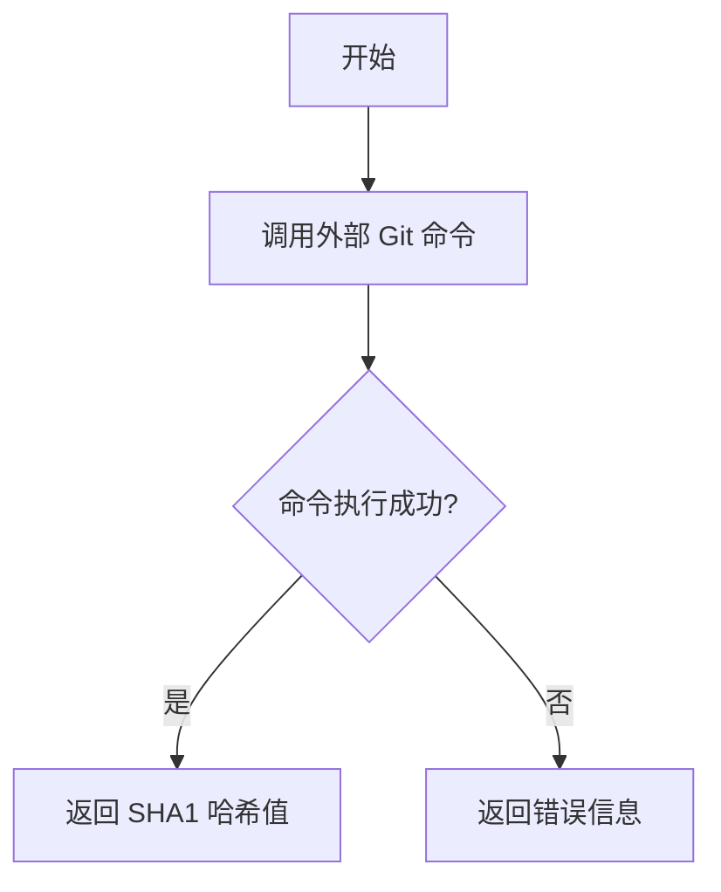

#### 带注释源码

```go
// refRevision 是一个外部依赖函数，用于获取指定 Git 引用（ref）的 SHA1 哈希值
// 参数：
//   - ctx: 上下文对象，用于控制超时和取消
//   - dir: 本地 Git 仓库的路径
//   - ref: Git 引用名称（可以是分支、标签等）
//
// 返回值：
//   - string: 引用的 SHA1 哈希值
//   - error: 执行过程中的错误信息
//
// 注意：该函数的具体实现未在当前代码文件中展示
//       它在同包的其他源文件中定义，供 Revision() 和 BranchHead() 方法调用
func refRevision(ctx context.Context, dir string, ref string) (string, error) {
    // 外部依赖实现，调用 git 命令获取引用版本
    // 典型实现可能使用 "git rev-parse" 或类似命令
    // 这里展示的是函数签名和调用约定
    panic("not implemented: refRevision is an external dependency")
}
```


### `onelinelog`

获取单行格式的 Git 提交日志，用于检索指定引用之间的提交记录（支持路径过滤和 firstParent 模式）。

参数：

- `ctx`：`context.Context`，上下文控制，用于超时和取消操作
- `dir`：`string`，Git 仓库的本地目录路径
- `ref`：`string`，Git 引用（如分支名、标签名或引用范围如 "ref1..ref2"）
- `paths`：`...string`，可选的文件路径过滤器，只返回涉及这些路径的提交
- `firstParent`：`bool`，是否只跟随第一个父提交（用于简化合并提交历史）

返回值：`([]Commit, error)`，返回提交列表和可能的错误。成功时返回提交数组，失败时返回错误信息。

#### 流程图

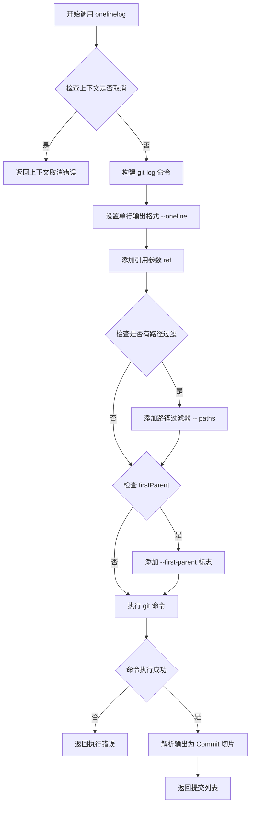

#### 带注释源码

```go
// onelinelog 是一个外部依赖函数，定义在 git 包的另一个文件中
// 用于执行 git log 命令并返回单行格式的提交历史
//
// 参数说明：
//   - ctx: 上下文对象，用于控制超时和取消
//   - dir: 本地 Git 仓库路径
//   - ref: Git 引用，可以是分支名、标签名，或使用 ".." 语法表示范围
//   - paths: 可变参数，用于过滤只涉及特定文件路径的提交
//   - firstParent: 是否只跟随第一个父提交，这在查看合并分支的历史时很有用
//
// 返回值：
//   - []Commit: 提交列表，每个 Commit 包含提交的 SHA1、消息、作者等信息
//   - error: 执行过程中的错误，如仓库不存在、git 命令失败等
//
// 调用示例：
//   commits, err := onelinelog(ctx, "/tmp/repo", "main", []string{"src/"}, true)
//   // 获取 main 分支上 src/ 目录的所有提交（不包含合并带来的间接提交）
func onelinelog(ctx context.Context, dir string, ref string, paths []string, firstParent bool) ([]Commit, error) {
    // 1. 检查 repo 是否已准备好（通过 errorIfNotReady）
    //    这是一个内部辅助方法，检查状态是否为 RepoReady
    
    // 2. 构建 git log 命令
    //    基础命令格式：git --no-pager log --format="%H %s" --first-parent
    
    // 3. 添加路径过滤
    //    如果提供了 paths，会添加 -- path1 path2 ... 参数
    
    // 4. 执行命令并解析输出
    //    输出格式为每行一个提交：<SHA1> <提交消息>
    
    // 5. 将输出转换为 Commit 结构体切片返回
}
```


### `Repo.VerifyTag`

验证给定的 Git 标签是否存在且有效。首先获取读锁确保线程安全，然后检查仓库是否已准备好（已克隆且可写），最后调用底层的 `verifyTag` 函数执行实际的标签验证操作。

参数：

- `ctx`：`context.Context`，上下文对象，用于控制超时和取消操作
- `tag`：`string`，要验证的 Git 标签名称

返回值：`string, error`，如果验证成功返回标签对应的 SHA1 哈希值，如果验证失败则返回相应的错误信息

#### 流程图

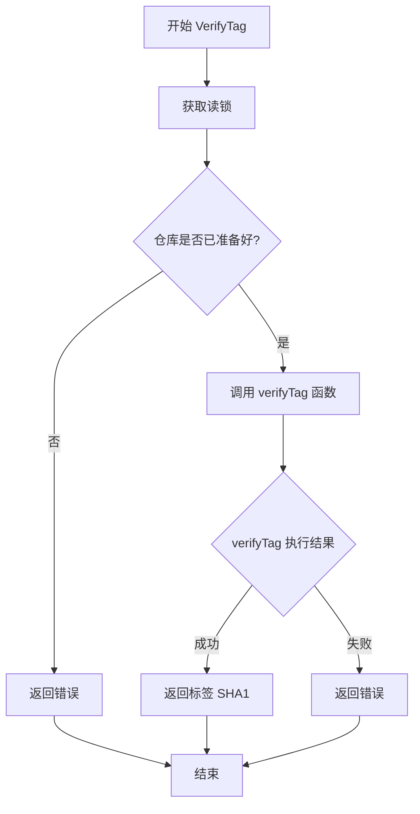

#### 带注释源码

```go
// VerifyTag 验证给定的 Git 标签是否存在且有效
// 参数 ctx: 上下文对象，用于控制超时和取消
// 参数 tag: 要验证的 Git 标签名称
// 返回值: 如果成功返回标签对应的 SHA1 哈希值，失败返回错误
func (r *Repo) VerifyTag(ctx context.Context, tag string) (string, error) {
	// 获取读锁，确保在检查和访问仓库状态时的线程安全性
	r.mu.RLock()
	// 确保在函数返回前释放读锁
	defer r.mu.RUnlock()
	
	// 检查仓库是否已准备好（已克隆且可写）
	// 如果未准备好，返回相应的错误信息
	if err := r.errorIfNotReady(); err != nil {
		return "", err
	}
	
	// 调用底层的 verifyTag 函数执行实际的标签验证
	// 参数包括：上下文、仓库目录路径、标签名称
	return verifyTag(ctx, r.dir, tag)
}
```


### `Repo.VerifyCommit`

验证给定的提交哈希是否在 Git 仓库中存在且有效。该方法是一个包装器，内部调用外部的 `verifyCommit` 函数执行实际验证逻辑。

参数：
- `ctx`：`context.Context`，上下文对象，用于控制请求的超时和取消
- `commit`：`string`，要验证的提交哈希或引用（如 SHA1）

返回值：`error`，如果验证失败返回相应的错误信息，验证成功返回 nil

#### 流程图

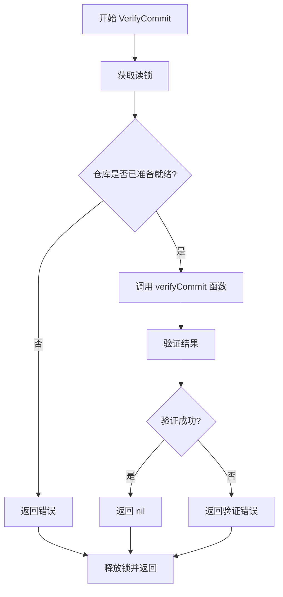

#### 带注释源码

```go
// VerifyCommit 验证给定的提交是否存在于仓库中
// 参数：
//   - ctx: 上下文，用于控制超时和取消
//   - commit: 要验证的提交哈希或引用
//
// 返回值：
//   - error: 如果验证失败返回错误，否则返回 nil
func (r *Repo) VerifyCommit(ctx context.Context, commit string) error {
	// 获取读锁以安全访问仓库状态
	r.mu.RLock()
	defer r.mu.RUnlock()
	
	// 检查仓库是否已准备好（已克隆且可写）
	if err := r.errorIfNotReady(); err != nil {
		return err
	}
	
	// 调用外部验证函数进行实际验证
	// 注意：verifyCommit 函数是外部依赖，未在此代码文件中定义
	return verifyCommit(ctx, r.dir, commit)
}
```

#### 备注

- **外部依赖**：`verifyCommit` 函数未在此代码文件中定义，是一个外部依赖，需要从其他模块导入
- **前置条件**：调用此方法前，仓库必须处于 `RepoReady` 状态（即已克隆且通过写权限检查）
- **线程安全**：通过 `sync.RWMutex` 保护共享状态，支持并发读操作


### `Repo.DeleteTag`

删除指定的Git标签。首先检查仓库是否已准备就绪（已克隆且可写），然后调用底层的 `deleteTag` 函数执行实际的标签删除操作。

参数：

- `ctx`：`context.Context`，用于控制操作超时和取消的上下文对象
- `tag`：`string`，要删除的Git标签名称

返回值：`error`，如果删除成功则返回 `nil`，如果仓库未准备就绪或删除操作失败则返回相应的错误信息

#### 流程图

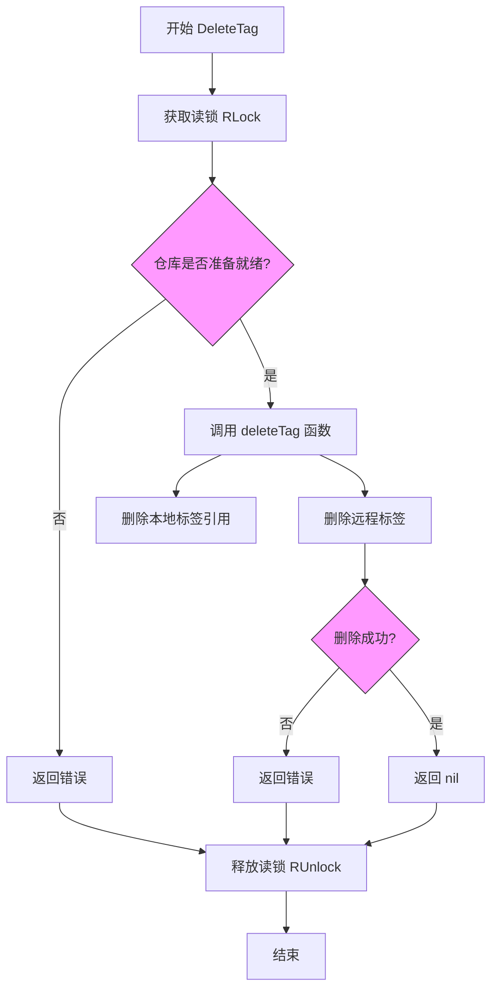

#### 带注释源码

```go
// DeleteTag 删除指定的Git标签
// 参数：
//   - ctx: 上下文，用于控制超时和取消
//   - tag: 要删除的标签名称
// 返回值：
//   - error: 如果操作失败返回错误，否则返回nil
func (r *Repo) DeleteTag(ctx context.Context, tag string) error {
	// 获取读锁，保证并发安全，同时允许多个读操作
	r.mu.RLock()
	// 确保在函数返回前释放锁
	defer r.mu.RUnlock()
	
	// 检查仓库是否已准备就绪（已克隆且可写）
	// 如果未准备就绪，返回相应的错误
	if err := r.errorIfNotReady(); err != nil {
		return err
	}
	
	// 调用底层的 deleteTag 函数执行实际的标签删除操作
	// 传递：上下文、本地仓库目录、标签名、远程仓库URL
	return deleteTag(ctx, r.dir, tag, r.origin.URL)
}
```

### 外部依赖函数 `deleteTag`

注：在当前代码文件中未找到 `deleteTag` 函数的实现，它是一个外部依赖函数。根据调用约定，其签名应为：

参数：

- `ctx`：`context.Context`，上下文对象
- `dir`：`string`，本地Git仓库目录路径
- `tag`：`string`，要删除的标签名称
- `url`：`string`，远程仓库URL

返回值：`error`，删除操作的结果错误


### `noteRevList` (外部依赖函数)

获取笔记关联的提交列表，返回以提交哈希为键的映射集合。

参数：

- `ctx`：`context.Context`，上下文对象，用于控制函数执行和取消
- `dir`：`string`，Git 仓库的本地目录路径
- `notesRef`：`string`，Git notes 的引用名称（如 "refs/notes/commits"）

返回值：`map[string]struct{}, error`，返回以提交 SHA 为键的映射集合，以及可能的错误信息

#### 流程图

```mermaid
flowchart TD
    A[开始调用 noteRevList] --> B[验证仓库目录有效]
    B --> C[执行 Git 命令: git notes list --ref notesRef]
    C --> D{命令执行是否成功}
    D -->|成功| E[解析输出为 map[string]struct{}]
    D -->|失败| F[返回 error]
    E --> G[返回结果映射]
    F --> G
```

#### 带注释源码

```
// noteRevList 是外部依赖函数，未在此代码文件中定义
// Repo.NoteRevList 方法对其进行封装调用
func (r *Repo) NoteRevList(ctx context.Context, notesRef string) (map[string]struct{}, error) {
    // 调用外部依赖函数 noteRevList
    // 参数: ctx - 上下文, r.Dir() - 仓库目录, notesRef - notes 引用
    return noteRevList(ctx, r.Dir(), notesRef)
}

// 外部依赖函数签名（根据调用推断）:
// func noteRevList(ctx context.Context, dir string, notesRef string) (map[string]struct{}, error)
//
// 功能说明:
// - 使用 git notes 机制获取与特定 notes 引用关联的所有提交
// - 返回 map[string]struct{} 类型，键为提交哈希，值为空结构体（用于去重）
// - 常用于获取某个分支或仓库的提交历史注解信息
```


### `getNote`

获取指定修订版本（revision）的笔记（note），如果不存在对应的笔记则返回 false。这是一个外部依赖函数，用于从 Git 仓库中读取特定的 note 数据。

参数：

- `ctx`：`context.Context`，请求上下文，用于控制超时和取消操作
- `dir`：`string`，本地 Git 仓库的目录路径
- `notesRef`：`string`，Git notes 的引用名称（例如 "refs/notes/commits"）
- `rev`：`string`，要查询的修订版本（SHA1）
- `note`：`interface{}`，用于接收笔记数据的对象指针

返回值：

- `bool`，表示是否成功获取到笔记（true 表示存在笔记，false 表示不存在）
- `error`，操作过程中的错误信息

#### 流程图

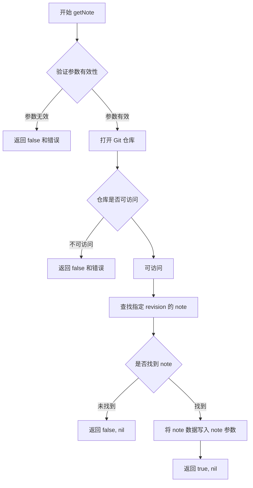

#### 带注释源码

```
// getNote 是外部依赖函数，用于从 Git 仓库中获取指定 revision 的 note
// 参数说明：
//   - ctx: 上下文对象，用于控制超时和取消
//   - dir: 本地仓库目录路径
//   - notesRef: Git notes 的引用路径
//   - rev: 修订版本 SHA1
//   - note: 用于接收 note 数据的接口类型指针
//
// 返回值：
//   - bool: 是否成功获取到 note
//   - error: 操作过程中的错误
//
// 注意：此函数的具体实现未在本代码文件中显示
//       它可能在另一个包或通过 cgo/外部命令实现
func getNote(ctx context.Context, dir, notesRef, rev string, note interface{}) (bool, error) {
    // 外部依赖实现，代码中仅看到调用
    // 被 Repo.GetNote 方法调用
    return getNote(ctx, r.Dir(), notesRef, rev, note)
}
```

---

### `Repo.GetNote`

`GetNote` 是 `Repo` 类的公开方法，它是对外部依赖函数 `getNote` 的封装。

参数：

- `ctx`：`context.Context`，请求上下文
- `rev`：`string`，Git 修订版本（SHA1）
- `notesRef`：`string`，Git notes 引用名称
- `note`：`interface{}`，用于接收笔记数据的对象

返回值：

- `bool`，是否成功获取笔记
- `error`，错误信息

#### 流程图

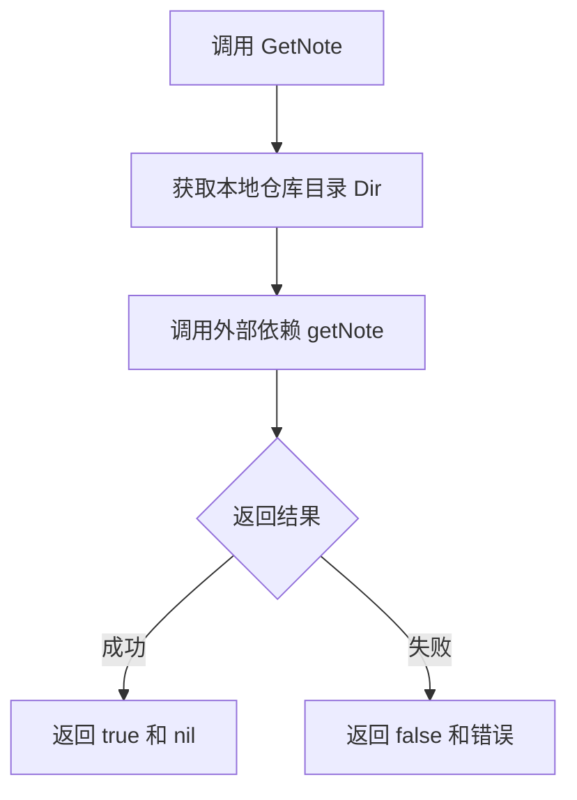

#### 带注释源码

```go
// GetNote 获取指定修订版本的笔记
// 参数：
//   - ctx: 上下文，用于超时控制
//   - rev: Git 修订版本（SHA1）
//   - notesRef: Git notes 的引用名称
//   - note: 用于接收笔记数据的接口类型指针
//
// 返回值：
//   - bool: 是否成功获取笔记
//   - error: 操作错误
func (r *Repo) GetNote(ctx context.Context, rev, notesRef string, note interface{}) (bool, error) {
    // 调用全局 getNote 函数，传入仓库目录、notes 引用、修订版本和接收 note 的指针
    return getNote(ctx, r.Dir(), notesRef, rev, note)
}
```


### `mirror`

该函数是一个外部依赖函数，用于执行 Git mirror 克隆操作，将远程仓库克隆为镜像形式。在代码的 `step` 方法中被调用，用于在 `RepoNew` 或 `RepoUnreachable` 状态下克隆 Git 仓库。

参数：

-  `ctx`：`context.Context`，控制操作超时和取消的上下文
-  `rootdir`：`string`，用于克隆的临时目录路径
-  `url`：`string`，远程仓库的 URL 地址

返回值：`(string, error)`，返回克隆后的目录路径和可能发生的错误

#### 流程图

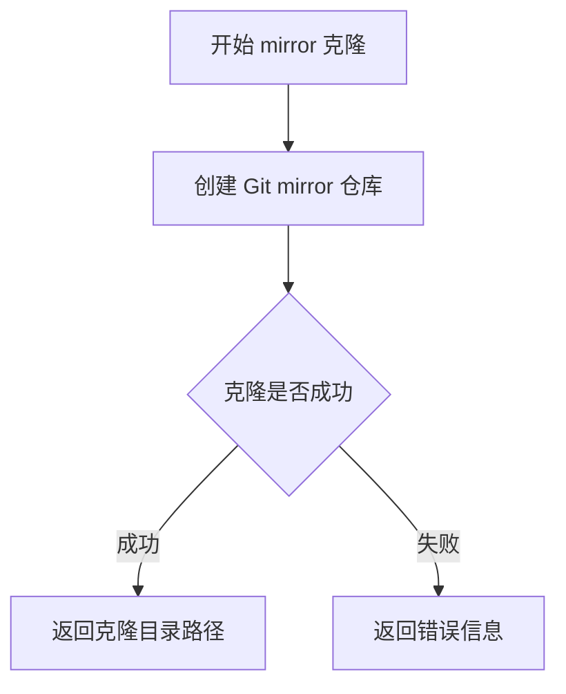

#### 带注释源码

```go
// mirror 是一个外部依赖函数，用于执行 git mirror 克隆
// 参数 ctx 用于控制超时和取消
// 参数 rootdir 是临时目录路径
// 参数 url 是远程仓库地址
// 返回克隆后的目录路径和可能的错误
dir, err = mirror(ctx, rootdir, url)
```

> **注意**：该函数为外部依赖，未在当前代码文件中实现，其具体实现位于其他包或外部系统中。从代码中的调用模式可以推断其函数签名为：
> ```go
> func mirror(ctx context.Context, rootdir string, url string) (string, error)
> ```


### `fetch` (外部依赖)

该函数是执行 git fetch 命令的外部依赖函数，通过调用 git 客户端库执行 `git fetch origin` 命令，从远程仓库获取最新的引用和对象。

参数：

- `ctx`：`context.Context`，用于控制请求的超时和取消
- `dir`：`string`，本地 Git 仓库的路径
- `remote`：`string`，远程仓库的名称（通常为 "origin"）

返回值：`error`，如果执行失败返回错误信息，成功执行返回 `nil`

#### 流程图

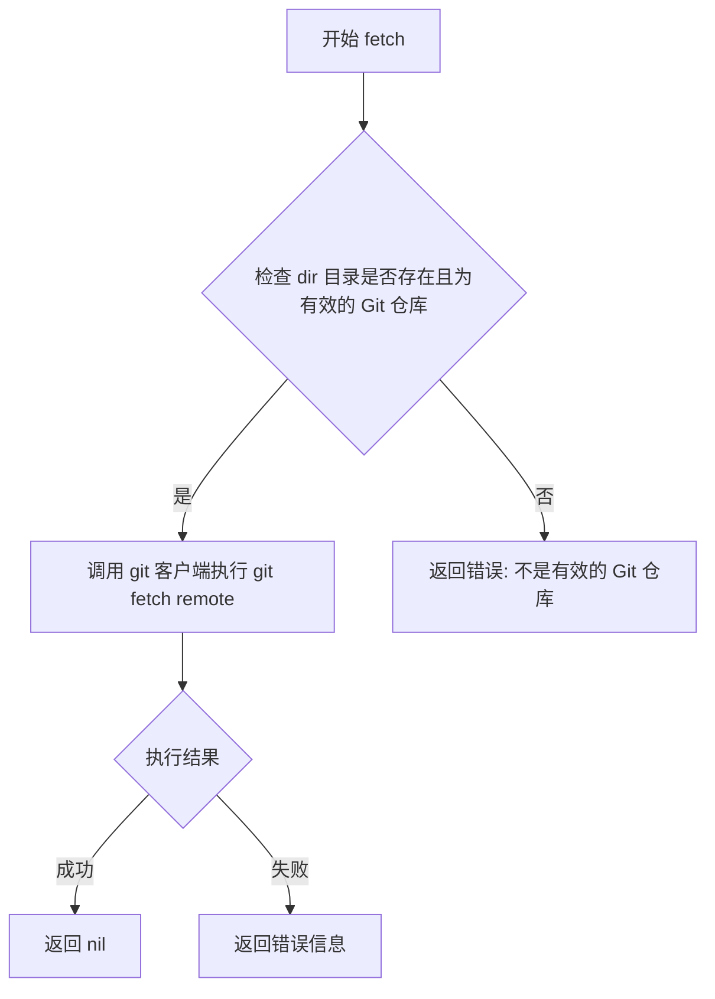

#### 带注释源码

```go
// fetch 是外部依赖函数，执行 git fetch 命令
// 参数 ctx 用于控制超时和取消
// 参数 dir 是本地仓库路径
// 参数 remote 是远程仓库名称（通常为 "origin"）
// 返回 error 类型，nil 表示成功，非 nil 表示失败
//
// 该函数底层实现通常会：
// 1. 验证本地目录是有效的 Git 仓库
// 2. 打开 git 客户端连接
// 3. 执行 "git fetch origin" 命令
// 4. 下载所有最新的 refs 和 objects
// 5. 更新本地 refs 以匹配远程仓库
func fetch(ctx context.Context, dir string, remote string) error {
    // 外部依赖实现，具体逻辑未在本文件中定义
    // 通常由 git2go 或类似 Go Git 库提供
    if err := fetch(ctx, r.dir, "origin"); err != nil {
        return err
    }
    return nil
}
```

**备注**：该 `fetch` 函数是来自外部包的依赖，代码中通过 `Repo.fetch` 方法进行了封装调用。从代码中可以看出它使用 `git` 包的 fetch 功能执行实际的 git fetch 操作，具体实现未在此代码文件中展示，属于外部依赖契约。


### `checkPush`

外部依赖函数，用于检查当前配置的仓库是否具有推送权限。该函数通过尝试在本地仓库中创建一个测试分支来验证推送权限。

参数：

-  `ctx`：`context.Context`，上下文，用于控制请求超时和取消
-  `dir`：`string`，本地仓库的目录路径
-  `url`：`string`，远程仓库的URL地址
-  `branch`：`string`，要检查推送权限的分支名称

返回值：`error`，如果检查过程中发生错误（如网络问题、权限不足等）则返回错误；否则返回nil表示具有推送权限

#### 流程图

```mermaid
flowchart TD
    A[开始检查推送权限] --> B[创建测试分支名称: flux-write-check-{随机字符串}]
    B --> C[尝试推送测试分支到远程仓库]
    C --> D{推送是否成功?}
    D -->|成功| E[删除测试分支]
    E --> F[返回nil, 表示有推送权限]
    D -->|失败| G{错误类型是否为'no changes'?}
    G -->|是| H[返回nil, 表示有推送权限]
    G -->|否| I[返回错误, 表示无推送权限]
```

#### 带注释源码

```go
// checkPush 用于检查仓库是否具有推送权限
// 参数:
//   - ctx: 上下文对象,用于控制超时和取消
//   - dir: 本地仓库目录路径
//   - url: 远程仓库URL
//   - branch: 要检查的分支名称
//
// 返回值:
//   - error: 如果检查失败返回错误,成功返回nil
//
// 注意: 该函数为外部依赖,具体实现位于其他文件或外部包中
// 调用方式: checkPush(ctx, dir, url, r.branch)
// 调用位置: Repo.step() 方法中,当仓库状态为RepoCloned且非只读时调用
func checkPush(ctx context.Context, dir, url, branch string) error {
    // 此处为外部依赖的具体实现
    // 根据代码调用上下文推断:
    // 1. 生成测试用的tag前缀: CheckPushTagPrefix = "flux-write-check"
    // 2. 尝试创建并推送一个测试tag到远程仓库
    // 3. 如果推送成功或返回"no changes"错误,则说明有推送权限
    // 4. 其他错误则表示没有推送权限
    
    // 实现细节需参考外部依赖的具体代码
    // 函数签名基于代码中的调用方式推断
}
```

> **注意**: 根据提供的代码片段，`checkPush`函数的具体实现并未在此文件中给出，它是一个外部依赖函数。从代码中的常量定义`CheckPushTagPrefix = "flux-write-check"`和调用上下文（`Repo.step`方法中，当仓库状态为`RepoCloned`且非只读模式时调用）可以推断，该函数通过尝试向远程仓库推送一个测试tag来验证推送权限。完整的实现需要查看项目中的其他文件或导入的外部包。


# refExists 函数提取

### refExists

（外部依赖）检查 Git 仓库中是否存在指定的引用（如分支或标签）

参数：

- `ctx`：`context.Context`，用于控制函数超时和取消的上下文
- `dir`：`string`，本地 Git 仓库的目录路径
- `ref`：`string`，要检查的 Git 引用路径（如 "refs/heads/main"）

返回值：

- `bool`，如果引用存在返回 true，否则返回 false
- `error`，执行过程中发生的错误（如仓库不可访问、引用格式错误等）

#### 流程图

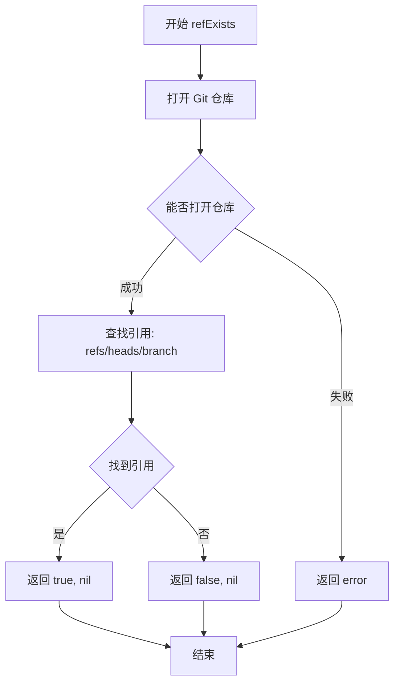

#### 带注释源码

```go
// refExists 检查指定的 Git 引用是否存在于本地仓库中
// 参数 ctx 用于控制操作超时，dir 是仓库路径，ref 是要检查的引用名称
// 返回值：exists 表示引用是否存在，err 表示操作过程中的错误
ok, err := refExists(ctx, dir, "refs/heads/"+r.branch)
```

#### 说明

`refExists` 函数是 `git` 包的外部依赖函数，在当前代码片段中未提供完整实现。从调用上下文分析：

1. **函数用途**：在 `Repo.step()` 方法中，当仓库状态为 `RepoCloned` 时，用于验证配置的分支是否存在
2. **调用位置**：在 `step()` 方法的 `RepoCloned` 分支中
3. **错误处理**：如果引用不存在或发生错误，会将仓库状态设置为 `RepoCloned` 并附带相应的错误信息

该函数的完整实现应该在同一个 `git` 包的其他源文件中，可能是使用 `git2go` 或其他 Go Git 库实现。


### `clone` (外部依赖)

该函数是外部依赖函数，执行实际的 git clone 操作。根据代码中的调用方式，它创建一个工作克隆（非裸克隆），用于在指定的 ref（可能是分支）上工作。

参数：

-  `ctx`：`context.Context`，上下文信息，用于控制超时和取消操作
-  `working`：`string`，临时工作目录的路径
-  `dir`：`string`，源仓库目录（已克隆的镜像仓库）
-  `ref`：`string`，要检出的引用（分支名）

返回值：`(string, error)`，返回克隆的工作目录路径，如果出错则返回错误信息

#### 流程图

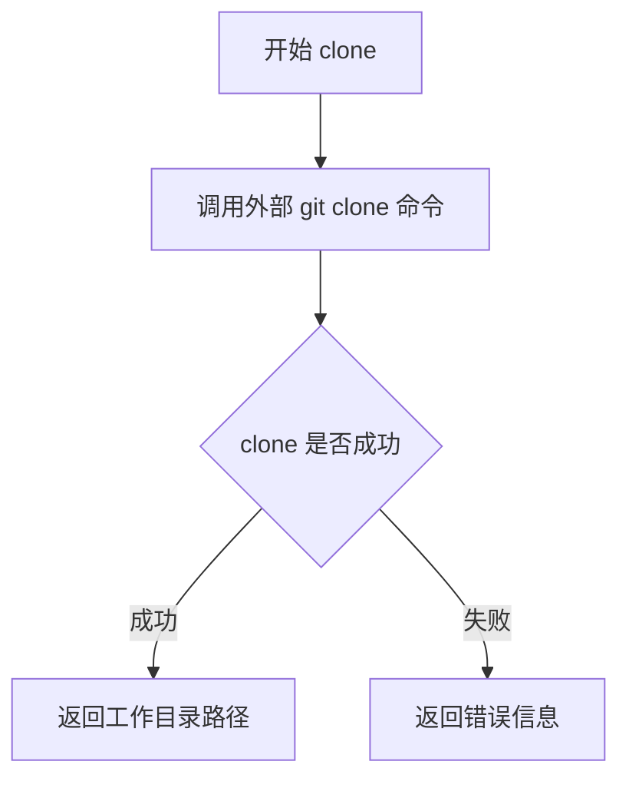

#### 带注释源码

```go
// clone 是外部依赖函数，执行 git clone 操作
// 在 workingClone 方法中被调用
// 参数说明：
//   - ctx: 上下文，用于超时控制
//   - working: 目标工作目录
//   - dir: 源镜像仓库目录
//   - ref: 要检出的分支或引用
//
// 注意：由于是外部依赖函数，具体实现未在此代码片段中展示
// 该函数可能来自 git 相关的外部包
path, err := clone(ctx, working, r.dir, ref)
```

#### 代码调用上下文

```go
// workingClone 是 Repo 类的方法，它调用了外部的 clone 函数
func (r *Repo) workingClone(ctx context.Context, ref string) (string, error) {
	r.mu.RLock()
	defer r.mu.RUnlock()
	if err := r.errorIfNotReady(); err != nil {
		return "", err
	}
	working, err := ioutil.TempDir(os.TempDir(), "flux-working")
	if err != nil {
		return "", err
	}
	// 调用外部 clone 函数创建工作克隆
	path, err := clone(ctx, working, r.dir, ref)
	if err != nil {
		os.RemoveAll(working)
	}
	return path, err
}
```

#### 补充说明

1. **设计目的**：`workingClone` 方法用于创建一个可写的工作克隆（非裸仓库），这与镜像仓库（bare repo）不同，允许对代码进行修改和提交。

2. **外部依赖**：该 `clone` 函数是包外的外部实现，可能是对 `git2go` 或其他 Go Git 库的封装。

3. **错误处理**：如果 clone 失败，会清理创建的临时目录，避免留下无效的目录。

4. **线程安全**：调用 `clone` 前已经获取了读锁（`r.mu.RLock()`），确保线程安全。


根据代码分析，`metricGitReady`是一个外部依赖的监控指标变量，在代码中被`setUnready`和`setReady`两个方法使用。以下是这两个方法的详细信息：

---

### Repo.setUnready

设置仓库为未就绪状态，同时更新监控指标

参数：

- `s`：`GitRepoStatus`，目标状态，表示仓库未能就绪的原因
- `err`：`error`，导致未就绪的错误信息

返回值：`无`

#### 流程图

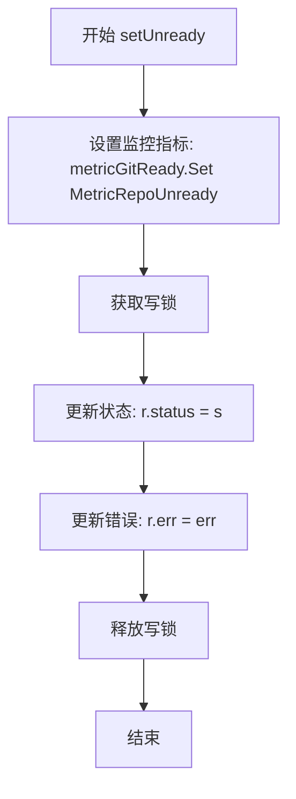

#### 带注释源码

```
// setUnready 将仓库状态设置为未就绪，并记录错误
// 同时更新外部监控指标 metricGitReady 为 MetricRepoUnready
func (r *Repo) setUnready(s GitRepoStatus, err error) {
	metricGitReady.Set(MetricRepoUnready) // 更新监控指标为未就绪状态
	r.mu.Lock()                           // 获取写锁以保证线程安全
	r.status = s                          // 更新仓库状态
	r.err = err                           // 记录导致未就绪的错误
	r.mu.Unlock()                         // 释放写锁
}
```

---

### Repo.setReady

设置仓库为就绪状态，同时更新监控指标

参数：

- 无

返回值：`无`

#### 流程图

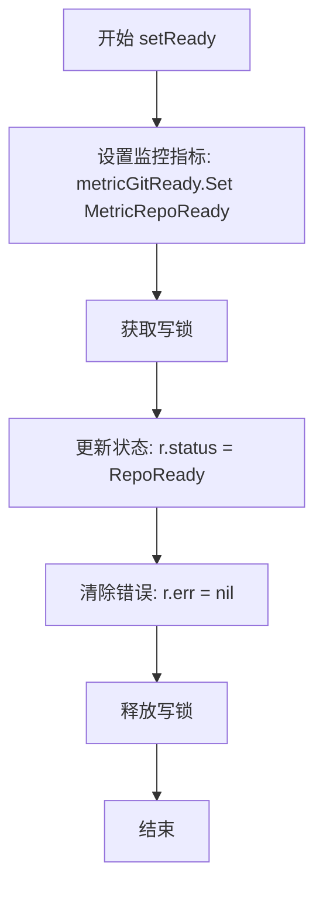

#### 带注释源码

```
// setReady 将仓库状态设置为就绪
// 同时更新外部监控指标 metricGitReady 为 MetricRepoReady
func (r *Repo) setReady() {
	metricGitReady.Set(MetricRepoReady) // 更新监控指标为就绪状态
	r.mu.Lock()                         // 获取写锁以保证线程安全
	r.status = RepoReady                // 更新仓库状态为已就绪
	r.err = nil                         // 清除之前的错误信息
	r.mu.Unlock()                       // 释放写锁
}
```

---

### 外部依赖信息

| 名称 | 类型 | 描述 |
|------|------|------|
| `metricGitReady` | 全局变量/监控指标 | 外部依赖的Prometheus监控指标，用于追踪Git仓库的准备就绪状态 |
| `MetricRepoReady` | 常量 | 表示仓库处于就绪状态的指标值 |
| `MetricRepoUnready` | 常量 | 表示仓库处于未就绪状态的指标值 |

---

### 关键组件信息

| 组件名称 | 一句话描述 |
|----------|------------|
| `Repo` | Git仓库同步管理器，负责克隆、拉取、验证写权限并维护状态机 |
| `GitRepoStatus` | 枚举类型，表示Git仓库的当前状态（未配置、新建、已克隆、就绪、不可达） |
| `setReady` | 将仓库状态设为就绪并更新监控指标的方法 |
| `setUnready` | 将仓库状态设为未就绪并更新监控指标的方法 |

---

### 技术债务与优化空间

1. **监控指标粒度较粗**：当前仅记录就绪/未就绪两种状态，建议增加更多维度的指标（如具体错误类型、状态转换次数等）
2. **缺少指标初始化**：代码中未看到`metricGitReady`的初始化逻辑，依赖外部注入
3. **错误信息未结构化**：错误信息以字符串形式存储，不利于监控告警的精确匹配


### `NewRepo`

该函数是 `Repo` 类的构造函数，用于创建一个新的 Git 仓库镜像实例。它接收一个远程配置和可选的配置选项，初始化仓库的状态、同步间隔、超时时间等参数，并返回一个配置好的 `Repo` 实例指针。

参数：

- `origin`：`Remote`，Git 仓库的远程配置，包含仓库 URL 等信息
- `opts`：`...Option`，可变数量的可选配置参数，用于自定义仓库行为（如轮询间隔、超时时间、只读模式等）

返回值：`*Repo`，返回新创建的 Git 仓库镜像实例的指针

#### 流程图

```mermaid
flowchart TD
    A[开始 NewRepo] --> B{origin.URL 是否为空?}
    B -->|是| C[设置 status = RepoNoConfig]
    B -->|否| D[设置 status = RepoNew]
    C --> E[创建 Repo 实例]
    D --> E
    E --> F[设置默认值: interval=5分钟, timeout=20秒, err=ErrNotCloned]
    E --> G[创建 notify 和 C 通道, 容量为1]
    F --> H[遍历 opts 列表]
    G --> H
    H --> I{opts 中还有未处理的 Option?}
    I -->|是| J[调用 opt.apply(r) 应用配置]
    J --> I
    I -->|否| K[返回 Repo 实例指针]
    K --> L[结束]
```

#### 带注释源码

```go
// NewRepo constructs a repo mirror which will sync itself.
// NewRepo 构造函数，创建一个会自动同步的仓库镜像
func NewRepo(origin Remote, opts ...Option) *Repo {
	// 根据 origin.URL 是否为空来设置初始状态
	// 如果 URL 为空，说明没有有效配置，状态设为 RepoNoConfig
	// 否则状态为 RepoNew，表示尚未尝试克隆
	status := RepoNew
	if origin.URL == "" {
		status = RepoNoConfig
	}
	
	// 创建 Repo 实例，初始化各种字段
	r := &Repo{
		origin:   origin,                               // 保存远程仓库配置
		status:   status,                               // 设置初始状态
		interval: defaultInterval,                      // 默认轮询间隔 5 分钟
		timeout:  defaultTimeout,                       // 默认超时时间 20 秒
		err:      ErrNotCloned,                         // 初始错误为未克隆
		notify:   make(chan struct{}, 1),               // 通知通道，容量1防止阻塞
		C:        make(chan struct{}, 1),               // 刷新完成通道，容量1防止阻塞
	}
	
	// 遍历所有传入的 Option 选项，逐一应用到 Repo 实例
	// 支持的配置选项包括：PollInterval、Timeout、Branch、IsReadOnly 等
	for _, opt := range opts {
		opt.apply(r)
	}
	
	// 返回配置完成的 Repo 实例指针
	return r
}
```


### `Repo.Start`

启动同步循环，监听关闭信号并持续同步 Git 仓库。该方法是 Repo 类的核心运行方法，负责初始化仓库克隆、检查推送权限并进入定期刷新循环。

参数：

- `shutdown`：`<-chan struct{}`，用于接收外部关闭信号的通道，当收到信号时优雅停止同步循环
- `done`：`*sync.WaitGroup`，同步等待组指针，用于标记同步任务完成，方法结束时调用 `done.Done()`

返回值：`error`，如果执行过程中发生错误则返回错误信息，否则返回 nil

#### 流程图

```mermaid
flowchart TD
    A[Start 方法入口] --> B[defer done.Done]
    B --> C{无限循环}
    C --> D[创建超时上下文 ctx]
    D --> E[调用 r.step(ctx) 推进状态机]
    E --> F{advanced 为 true?}
    F -->|是| C
    F -->|否| G[获取当前状态 r.Status]
    G --> H{状态 == RepoReady?}
    H -->|是| I[调用 r.refreshLoop 进入刷新循环]
    I --> J{refreshLoop 返回错误?}
    J -->|是| K[r.setUnready 设为未就绪]
    K --> C
    J -->|否| L{接收到 shutdown 信号?}
    H -->|否| M{状态 == RepoNoConfig?}
    M -->|是| Z[返回 nil]
    M -->|否| N[创建 10秒 定时器]
    N --> O{select 监听}
    O --> P{收到 shutdown?}
    P -->|是| Q[停止定时器]
    Q --> Z
    P -->|否| R{定时器到期?}
    R -->|是| C
    
    L -->|否| N
```

#### 带注释源码

```go
// Start begins synchronising the repo by cloning it, then fetching
// the required tags and so on.
func (r *Repo) Start(shutdown <-chan struct{}, done *sync.WaitGroup) error {
	defer done.Done() // 方法退出时通知 WaitGroup 同步任务已完成

	// 无限循环，持续同步仓库直到收到关闭信号
	for {
		// 创建带超时限制的上下文，用于限制 step 操作的最大执行时间
		ctx, cancel := context.WithTimeout(context.Background(), r.timeout)
		// 尝试推进状态机，返回是否取得进展
		advanced := r.step(ctx)
		// 释放上下文资源
		cancel()

		// 如果状态机取得进展，继续循环以继续推进
		if advanced {
			continue
		}

		// 获取当前仓库状态
		status, _ := r.Status()
		
		// 如果仓库已就绪，进入刷新循环以定期拉取更新
		if status == RepoReady {
			if err := r.refreshLoop(shutdown); err != nil {
				// 刷新循环出错，将状态设为未就绪并继续循环
				r.setUnready(RepoNew, err)
				continue // with new status, skipping timer
			}
		} else if status == RepoNoConfig {
			// 如果没有配置（URL为空），直接返回，无需同步
			return nil
		}

		// 对于其他状态（RepoNew, RepoCloned, RepoUnreachable）
		// 创建 10 秒定时器，在定时器到期前阻塞
		tryAgain := time.NewTimer(10 * time.Second)
		
		// 使用 select 监听关闭信号或定时器到期
		select {
		case <-shutdown:
			// 收到关闭信号，停止定时器（如果已在运行则先排空通道）
			if !tryAgain.Stop() {
				<-tryAgain.C
			}
			// 优雅退出
			return nil
		case <-tryAgain.C:
			// 定时器到期，重新尝试推进状态机
			continue
		}
	}
}
```


### `Repo.Ready`

等待仓库进入 Ready 状态，通过循环调用 `step` 方法推进状态机，直到仓库达到可写状态或无法继续前进为止。

参数：

- `ctx`：`context.Context`，用于控制请求的截止时间和取消操作

返回值：`error`，如果仓库未准备好则返回错误信息，否则返回 nil

#### 流程图

```mermaid
flowchart TD
    A[开始 Ready] --> B{调用 r.step(ctx)}
    B -->|返回 true| C[循环继续]
    C --> B
    B -->|返回 false| D[调用 r.Status 获取状态和错误]
    D --> E[返回 err]
    
    subgraph step 方法内部
    B1[获取当前状态] --> B2{状态判断}
    B2 -->|RepoNoConfig| B3[返回 false]
    B2 -->|RepoNew/RepoUnreachable| B4[尝试克隆仓库]
    B2 -->|RepoCloned| B5[检查写权限]
    B2 -->|RepoReady| B6[返回 false]
    end
```

#### 带注释源码

```go
// Ready tries to advance the cloning process along as far as
// possible, and returns an error if it is not able to get to a ready
// state.
// Ready 尝试将克隆过程尽可能向前推进，如果无法进入 ready 状态则返回错误
func (r *Repo) Ready(ctx context.Context) error {
	// 循环调用 step 方法，直到其返回 false
	// step 方法会尝试推进状态机：RepoNew -> RepoCloned -> RepoReady
	for r.step(ctx) {
		// keep going! 继续循环，只要状态有进展
	}
	// 循环结束后，获取最终状态和错误信息
	_, err := r.Status()
	// 返回错误（如果有的话）
	return err
}
```


### 1. 一段话描述
`Repo.Refresh` 是 `git` 包中 `Repo` 类的核心方法之一，用于手动触发一次本地 Git 仓库镜像与远程仓库的同步（Fetch）操作。该操作通过获取远程的最新提交和引用来更新本地缓存，是实现实时或按需同步的关键入口。

### 2. 文件的整体运行流程
该代码文件定义了一个 Git 仓库镜像管理器 `Repo`。其运行流程通常为：初始化 `Repo` -> 调用 `Start` 启动后台同步循环 -> 循环监听 `notify` 事件或定时器 -> 触发 `step` 推进状态机（克隆/检查/就绪） -> 调用 `fetch` 拉取数据。`Refresh` 方法允许外部在任意时刻主动介入这一流程，强制执行一次同步。

### 3. 类的详细信息
**类名**: `Repo`  
**职责**: 封装 Git 仓库的本地镜像逻辑，管理远程连接、文件系统目录、同步状态机以及并发安全。

**类字段**：
- `origin`: `Remote`，远程仓库地址。
- `branch`: `string`，要跟踪的分支。
- `status`: `GitRepoStatus`，当前同步状态（New, Cloned, Ready 等）。
- `mu`: `sync.RWMutex`，读写互斥锁，保证并发安全。
- `dir`: `string`，本地仓库路径。
- `notify`: `chan struct{}`，用于接收立即刷新通知的通道。
- `C`: `chan struct{}`，刷新完成信号通道。

**关键方法**：
- `Start(shutdown, done)`: 启动后台同步循环。
- `Refresh(ctx)`: 手动触发同步（**本次提取目标**）。
- `fetch(ctx)`: 执行具体的 Git fetch 命令。
- `step(ctx)`: 状态机推进逻辑。

---

### 4. 函数/方法详细信息

#### `Repo.Refresh`

手动触发一次仓库同步，确保本地镜像获取远程最新更改。

参数：
- `ctx`：`context.Context`，上下文信息，用于控制请求超时或取消操作。

返回值：`error`，如果同步过程中出现错误（如网络中断、仓库未就绪），则返回该错误；否则返回 `nil`。

#### 流程图

```mermaid
flowchart TD
    Start([开始 Refresh]) --> Lock[获取互斥锁 r.mu]
    Lock --> CheckReady{调用 errorIfNotReady 检查状态}
    CheckReady -- 否[未就绪] --> ReturnErr[返回错误]
    CheckReady -- 是[已就绪] --> Fetch[调用 r.fetch(ctx) 拉取数据]
    Fetch --> FetchError{fetch 是否出错?}
    FetchError -- 是 --> ReturnFetchErr[返回 fetch 错误]
    FetchError -- 否 --> Notify[调用 r.refreshed() 通知监听者]
    Notify --> Unlock[释放互斥锁]
    Unlock --> ReturnNil[返回 nil]
```

#### 带注释源码

```go
func (r *Repo) Refresh(ctx context.Context) error {
	// 这里的锁以及下方的锁是难以避免的；
	// 也许我们可以克隆到另一个 repo 并在那里 pull，完成后再交换。
	r.mu.Lock()
	defer r.mu.Unlock()
	
	// 检查仓库当前状态是否允许同步（即是否已克隆并通过写权限检查）
	if err := r.errorIfNotReady(); err != nil {
		return err
	}
	
	// 执行从远程 origin 获取最新数据的操作
	if err := r.fetch(ctx); err != nil {
		return err
	}
	
	// 刷新成功，向通道 C 发送信号，通知等待者（如自动循环）
	r.refreshed()
	return nil
}
```

### 5. 关键组件信息
- **`Repo` 结构体**: 核心实体，封装了 Git 客户端的所有状态。
- **`GitRepoStatus` 枚举**: 定义了仓库的生命周期阶段，是状态机的关键。
- **`fetch` 函数**: 底层执行 `git fetch` 的具体逻辑。
- **并发控制**: 使用 `sync.Mutex` 和 `channel` 结合，确保在手动刷新和自动循环并发时的数据一致性。

### 6. 潜在的技术债务或优化空间
- **锁粒度问题**: 代码注释中明确提到 "the lock here and below is difficult to avoid"，说明当前 `Refresh` 方法锁住整个过程可能导致调用方阻塞。优化方向可以是实现读写锁分离，或者在后台进行“镜像-切换”操作以减少锁持有时间。
- **错误处理**: 当前错误直接返回上层，缺少重试机制，对于瞬时网络波动可能不够鲁棒。

### 7. 其它项目
- **设计约束**: `Refresh` 是同步阻塞的，且依赖 `Repo` 处于 `Ready` 状态。如果在未准备好时调用，会立即返回错误。
- **外部依赖**: 依赖 `context` 进行超时控制，依赖底层的 `fetch` 函数与 Git 进程交互。


### `Repo.Status`

获取当前Git仓库的就绪状态，包括是否已克隆、是否可写，以及阻止其进入下一状态的错误信息（如果有）。

参数：  
无参数

返回值：  
- `GitRepoStatus`：表示仓库当前的状态，值为 `"unconfigured"`（未配置）、`"new"`（新建）、`"cloned"`（已克隆）、`"ready"`（就绪）或 `"unreachable"`（不可达）之一
- `error`：如果在获取状态过程中发生错误，返回该错误；否则根据状态返回相应的预设错误（如 `ErrNotCloned`、`ErrNoConfig`、`ErrClonedOnly`）或 `nil`

#### 流程图

```mermaid
flowchart TD
    A[开始 Status] --> B[获取读锁 r.mu.RLock]
    B --> C[读取状态 r.status]
    C --> D[读取错误 r.err]
    D --> E[释放读锁 defer r.mu.RUnlock]
    E --> F[返回 状态和错误]
```

#### 带注释源码

```go
// Status reports that readiness status of this Git repo: whether it
// has been cloned and is writable, and if not, the error stopping it
// getting to the next state.
// Status 报告此 Git 仓库的就绪状态：是否已克隆且可写，
// 如果不是，则返回阻止其进入下一状态的错误。
func (r *Repo) Status() (GitRepoStatus, error) {
	// 获取读锁，保证并发读取时的线程安全
	// 读锁允许多个并发读取，但会阻止写入
	r.mu.RLock()
	// defer 确保函数返回前释放读锁
	defer r.mu.RUnlock()
	// 返回当前的状态和关联的错误信息
	// 状态包括：RepoNoConfig, RepoNew, RepoCloned, RepoReady, RepoUnreachable
	// 错误信息根据状态有不同的含义
	return r.status, r.err
}
```


### `Repo.Dir`

获取 Git 仓库克隆到的本地目录路径，如果仓库尚未克隆则返回空字符串。

参数：  
（无参数）

返回值：`string`，返回本地目录路径，如果仓库尚未克隆则为空字符串。

#### 流程图

```mermaid
flowchart TD
    A[开始 Dir] --> B[获取读锁 r.mu.RLock]
    B --> C[返回 r.dir]
    C --> D[释放读锁 defer r.mu.RUnlock]
    D --> E[结束]
```

#### 带注释源码

```go
// Dir returns the local directory into which the repo has been
// cloned, if it has been cloned.
func (r *Repo) Dir() string {
	r.mu.RLock()         // 获取读锁，确保并发安全
	defer r.mu.RUnlock() // 函数返回时释放读锁
	return r.dir         // 返回克隆的本地目录路径
}
```


### `Repo.Revision`

获取指定 Git 引用（ref）的 SHA1 哈希值。该方法首先检查仓库是否已准备就绪（已克隆且可写），然后通过调用底层 `refRevision` 函数返回给定引用的完整 SHA1 哈希。

参数：

- `ctx`：`context.Context`，上下文对象，用于控制请求的超时和取消操作
- `ref`：`string`，要查询的 Git 引用名称（如分支名 "main"、标签名 "v1.0.0" 或完整的引用路径）

返回值：`string, error`，返回指定引用的 SHA1 哈希值字符串；如果仓库未准备就绪或查询失败则返回空字符串和错误信息

#### 流程图

```mermaid
flowchart TD
    A[开始 Revision] --> B[获取读锁 RLock]
    B --> C{调用 errorIfNotReady 检查状态}
    C -->|仓库未就绪| D[返回错误]
    C -->|仓库已就绪| E[调用 refRevision 获取 SHA1]
    E --> F[释放读锁 RUnlock]
    F --> G[返回 SHA1 或错误]
    
    D --> G
```

#### 带注释源码

```go
// Revision returns the revision (SHA1) of the ref passed in
// Revision 方法用于获取指定 Git 引用（ref）的 SHA1 哈希值
func (r *Repo) Revision(ctx context.Context, ref string) (string, error) {
	// 获取读锁，保证在检查状态和访问目录时的线程安全
	r.mu.RLock()
	// 使用 defer 确保在函数返回前释放读锁
	defer r.mu.RUnlock()
	
	// 检查仓库是否已准备就绪（已克隆且可写）
	// 如果仓库状态不是 RepoReady，则返回相应的错误
	if err := r.errorIfNotReady(); err != nil {
		return "", err
	}
	
	// 调用底层 refRevision 函数，传入上下文、本地仓库目录和引用名称
	// 返回指定引用的 SHA1 哈希值
	return refRevision(ctx, r.dir, ref)
}
```


### `Repo.BranchHead`

获取配置分支的 HEAD 修订版本（SHA1）。该方法首先获取读锁，检查仓库是否已准备就绪，然后调用 `refRevision` 函数获取指定分支（`heads/` + `r.branch`）的 SHA1 哈希值。

参数：

- `ctx`：`context.Context`，用于控制请求的截止时间和取消操作

返回值：`string`，返回分支 HEAD 的 SHA1 哈希值；`error`，如果仓库未准备好或获取失败则返回错误

#### 流程图

```mermaid
flowchart TD
    A[开始 BranchHead] --> B[获取读锁 r.mu.RLock]
    B --> C{调用 errorIfNotReady 检查状态}
    C -->|有错误| D[释放锁 return "", err]
    C -->|无错误| E[调用 refRevision 获取 SHA1]
    E --> F[释放锁]
    F --> G[返回 SHA1 和错误]
```

#### 带注释源码

```go
// BranchHead returns the HEAD revision (SHA1) of the configured branch
// BranchHead 返回配置分支的 HEAD 修订版本（SHA1）
func (r *Repo) BranchHead(ctx context.Context) (string, error) {
	// 获取读锁，保证并发安全读取仓库状态
	r.mu.RLock()
	defer r.mu.RUnlock() // 使用 defer 确保锁会被释放

	// 检查仓库是否已准备好（已克隆且可写）
	if err := r.errorIfNotReady(); err != nil {
		return "", err // 如果未准备好，返回错误
	}

	// 调用 refRevision 获取分支的 SHA1
	// 构造引用路径：heads/ + 分支名（如 heads/main）
	return refRevision(ctx, r.dir, "heads/"+r.branch)
}
```


### `Repo.CommitsBefore`

获取指定引用之前的提交历史记录。

参数：

-  `ctx`：`context.Context`，上下文，用于控制请求超时和取消
-  `ref`：`string`，Git 引用（如分支名、标签名或提交哈希）
-  `firstParent`：`bool`，是否只跟随第一个父提交（用于过滤合并提交）
-  `paths`：`...string`，可选的文件路径过滤器，只返回涉及这些文件的提交

返回值：`([]Commit, error)`，返回提交列表切片，错误为 nil 表示成功，否则返回错误信息

#### 流程图

```mermaid
flowchart TD
    A[开始 CommitsBefore] --> B[获取读锁 RLock]
    B --> C{仓库是否ready?}
    C -->|否| D[返回错误]
    C -->|是| E[调用 onelinelog 函数]
    E --> F[传入 ref 参数和 firstParent]
    F --> G[返回 []Commit 和 error]
    G --> H[释放读锁 RUnlock]
    H --> I[结束]
```

#### 带注释源码

```go
// CommitsBefore 获取指定引用之前的提交历史
// ctx: 上下文对象，用于超时控制
// ref: Git 引用（分支名、标签名或提交哈希）
// firstParent: 是否只跟随第一个父提交（用于只获取主线历史）
// paths: 可变参数，文件路径过滤列表
func (r *Repo) CommitsBefore(ctx context.Context, ref string, firstParent bool, paths ...string) ([]Commit, error) {
	// 获取读锁，保证并发安全
	r.mu.RLock()
	// 确保函数返回前释放锁
	defer r.mu.RUnlock()
	
	// 检查仓库是否已准备就绪（已克隆且可写）
	if err := r.errorIfNotReady(); err != nil {
		// 未准备就绪则直接返回错误
		return nil, err
	}
	
	// 调用 onelinelog 获取提交历史
	// 传入：上下文、本地仓库目录、引用、路径过滤器、是否只跟父提交
	return onelinelog(ctx, r.dir, ref, paths, firstParent)
}
```

---

### `Repo.CommitsBetween`

获取两个引用之间的提交历史记录。

参数：

-  `ctx`：`context.Context`，上下文，用于控制请求超时和取消
-  `ref1`：`string`，起始 Git 引用
-  `ref2`：`string`，结束 Git 引用
-  `firstParent`：`bool`，是否只跟随第一个父提交（用于过滤合并提交）
-  `paths`：`...string`，可选的文件路径过滤器，只返回涉及这些文件的提交

返回值：`([]Commit, error)`，返回提交列表切片，错误为 nil 表示成功，否则返回错误信息

#### 流程图

```mermaid
flowchart TD
    A[开始 CommitsBetween] --> B[获取读锁 RLock]
    B --> C{仓库是否ready?}
    C -->|否| D[返回错误]
    C -->|是| E[构造引用范围字符串 ref1..ref2]
    E --> F[调用 onelinelog 函数]
    F --> G[传入 引用范围 和 firstParent]
    G --> H[返回 []Commit 和 error]
    H --> I[释放读锁 RUnlock]
    I --> J[结束]
```

#### 带注释源码

```go
// CommitsBetween 获取两个引用之间的提交历史
// ctx: 上下文对象，用于超时控制
// ref1: 起始 Git 引用（分支名、标签名或提交哈希）
// ref2: 结束 Git 引用（分支名、标签名或提交哈希）
// firstParent: 是否只跟随第一个父提交（用于只获取主线历史）
// paths: 可变参数，文件路径过滤列表
func (r *Repo) CommitsBetween(ctx context.Context, ref1, ref2 string, firstParent bool, paths ...string) ([]Commit, error) {
	// 获取读锁，保证并发安全
	r.mu.RLock()
	// 确保函数返回前释放锁
	defer r.mu.RUnlock()
	
	// 检查仓库是否已准备就绪（已克隆且可写）
	if err := r.errorIfNotReady(); err != nil {
		// 未准备就绪则直接返回错误
		return nil, err
	}
	
	// 构造 Git 范围语法：ref1..ref2 表示 ref1 之后到 ref2 之间的提交
	// 调用 onelinelog 获取提交历史
	// 传入：上下文、本地仓库目录、引用范围字符串、路径过滤器、是否只跟父提交
	return onelinelog(ctx, r.dir, ref1+".."+ref2, paths, firstParent)
}
```

---

### 关键组件信息

| 组件名称 | 一句话描述 |
|---------|-----------|
| `Repo` | Git 仓库镜像封装类，提供同步、状态管理和提交查询功能 |
| `onelinelog` | 底层函数，执行 `git log` 命令获取提交历史（代码中未提供实现） |
| `sync.RWMutex` | 读写锁，保证并发访问仓库状态的安全性 |
| `errorIfNotReady` | 内部方法，检查仓库是否处于可操作状态 |

---

### 技术债务与优化空间

1. **重复代码**：`CommitsBefore` 和 `CommitsBetween` 方法结构高度相似，可抽取公共逻辑
2. **缺少错误重试机制**：网络异常时直接返回错误，缺乏重试策略
3. **路径过滤实现未知**：`onelinelog` 函数的具体实现未在代码中展示，无法确认其过滤逻辑的正确性
4. **日志缺失**：方法中未记录任何日志信息，难以排查线上问题


### `Repo.VerifyTag`

验证指定标签是否存在且有效。

参数：

-  `ctx`：`context.Context`，上下文信息，用于控制请求超时和取消
-  `tag`：`string`，要验证的标签名称

返回值：`(string, error)`，如果验证成功返回标签对应的 SHA1 提交哈希，如果验证失败返回错误信息

#### 流程图

```mermaid
flowchart TD
    A[开始 VerifyTag] --> B[获取读锁 RLock]
    B --> C{检查仓库是否就绪}
    C -->|就绪| D[调用 verifyTag 验证标签]
    C -->|未就绪| E[返回错误]
    D --> F{verifyTag 执行结果}
    F -->|成功| G[返回标签 SHA1]
    F -->|失败| H[返回错误]
    E --> H
    G --> I[释放读锁 RUnlock]
    H --> I
```

#### 带注释源码

```go
// VerifyTag verifies that a given tag exists and is valid in the repository.
// It acquires a read lock to ensure thread safety while checking the repository status.
// Returns the SHA1 hash of the tag commit if successful, or an error if the tag is invalid
// or the repository is not in a ready state.
func (r *Repo) VerifyTag(ctx context.Context, tag string) (string, error) {
	// Acquire read lock to safely access repository state
	r.mu.RLock()
	// Ensure the lock is released when the function returns
	defer r.mu.RUnlock()
	
	// Check if the repository is in a ready state (cloned and writable)
	if err := r.errorIfNotReady(); err != nil {
		// Return empty string and error if not ready
		return "", err
	}
	
	// Delegate to the underlying verifyTag function to perform actual tag verification
	return verifyTag(ctx, r.dir, tag)
}
```

---

### `Repo.VerifyCommit`

验证指定提交哈希是否存在于仓库中。

参数：

-  `ctx`：`context.Context`，上下文信息，用于控制请求超时和取消
-  `commit`：`string`，要验证的提交哈希或引用

返回值：`error`，如果验证成功返回 nil，如果验证失败返回错误信息

#### 流程图

```mermaid
flowchart TD
    A[开始 VerifyCommit] --> B[获取读锁 RLock]
    B --> C{检查仓库是否就绪}
    C -->|就绪| D[调用 verifyCommit 验证提交]
    C -->|未就绪| E[返回错误]
    D --> F{verifyCommit 执行结果}
    F -->|成功| G[返回 nil]
    F -->|失败| H[返回错误]
    E --> H
    G --> I[释放读锁 RUnlock]
    H --> I
```

#### 带注释源码

```go
// VerifyCommit verifies that a given commit exists in the repository.
// It acquires a read lock to ensure thread safety while checking the repository status.
// Returns nil if the commit exists and is valid, or an error if the commit is invalid
// or the repository is not in a ready state.
func (r *Repo) VerifyCommit(ctx context.Context, commit string) error {
	// Acquire read lock to safely access repository state
	r.mu.RLock()
	// Ensure the lock is released when the function returns
	defer r.mu.RUnlock()
	
	// Check if the repository is in a ready state (cloned and writable)
	if err := r.errorIfNotReady(); err != nil {
		// Return the error if repository is not ready
		return err
	}
	
	// Delegate to the underlying verifyCommit function to perform actual commit verification
	return verifyCommit(ctx, r.dir, commit)
}
```


### `Repo.DeleteTag`

删除 Git 仓库中的指定标签。首先获取读锁以确保线程安全，然后检查仓库是否已准备就绪（已克隆且可写），若未准备则返回相应错误，最后调用底层的 `deleteTag` 函数执行实际的标签删除操作。

**参数：**

- `ctx`：`context.Context`，Go 语言标准库的上下文对象，用于传递截止时间、取消信号等
- `tag`：`string`，要删除的标签名称

**返回值：**`error`，如果标签删除成功则返回 `nil`，否则返回具体的错误信息

#### 流程图

```mermaid
flowchart TD
    A[开始 DeleteTag] --> B[获取读锁 RLock]
    B --> C{检查仓库是否已准备就绪}
    C -->|否| D[返回错误]
    C -->|是| E[调用 deleteTag 函数]
    E --> F{删除操作是否成功}
    F -->|否| G[返回错误]
    F -->|是| H[返回 nil]
    D --> I[释放读锁 RUnlock]
    G --> I
    H --> I
    I[结束]
```

#### 带注释源码

```go
// DeleteTag 删除仓库中的指定标签
// 参数：
//   - ctx: 上下文对象，用于控制超时和取消操作
//   - tag: 要删除的标签名称
//
// 返回值：
//   - error: 操作过程中的错误信息，成功时为 nil
func (r *Repo) DeleteTag(ctx context.Context, tag string) error {
	// 获取读锁，确保在检查状态和访问仓库目录时的线程安全性
	// 使用 RLock 而不是 Lock，因为这里是只读操作，允许并发读取
	r.mu.RLock()
	// 确保函数返回时释放锁，defer 会在函数退出前执行
	defer r.mu.RUnlock()
	
	// 检查仓库是否已准备就绪（已克隆且可写）
	// errorIfNotReady 会根据当前仓库状态返回：
	//   - nil: 仓库已就绪
	//   - ErrNoConfig: 仓库未配置
	//   - NotReadyError: 仓库未克隆或克隆后未检查写权限
	if err := r.errorIfNotReady(); err != nil {
		return err
	}
	
	// 调用底层的 deleteTag 函数执行实际的标签删除操作
	// 传递：上下文、本地仓库目录、标签名、远程仓库 URL
	return deleteTag(ctx, r.dir, tag, r.origin.URL)
}
```

---

**说明：** 该方法依赖于同包中的全局函数 `deleteTag` 来执行实际的 Git 标签删除操作，该函数的定义在提供的代码片段中未完整展示，但从调用签名来看，它接受仓库本地路径、标签名和远程 URL 作为参数。


### `Repo.step`

该函数是 Git 仓库同步状态机的核心推进方法，根据当前仓库状态（RepoNoConfig、RepoNew、RepoUnreachable、RepoCloned、RepoReady）执行相应的初始化、克隆、验证或就绪操作，使仓库状态向前推进，并返回是否取得进展。

参数：

- `bg`：`context.Context`，父上下文，用于创建超时控制的任务

返回值：`bool`，如果状态机取得进展（例如成功克隆、验证通过、状态更新）返回 true；否则返回 false

#### 流程图

```mermaid
flowchart TD
    A[开始 step] --> B{获取当前状态}
    B --> C{status == RepoNoConfig?}
    C -->|是| D[返回 false]
    C -->|否| E{status == RepoNew 或 RepoUnreachable?}
    
    E -->|是| F[创建临时目录]
    F --> G[使用 mirror 克隆仓库]
    G --> H{克隆成功?}
    H -->|是| I[获取 dir 并执行 fetch]
    I --> J{fetch 成功?}
    J -->|是| K[设置状态为 RepoCloned]
    K --> L[返回 true]
    J -->|否| M[删除目录]
    M --> N{错误包含 'could not resolve hostname'?}
    N -->|是| O[设置状态为 RepoUnreachable]
    N -->|否| P[设置状态为 RepoNew]
    O --> Q[返回 false]
    P --> Q
    
    H -->|否| M
    E -->|否| R{status == RepoCloned?}
    
    R -->|是| S[创建带超时的上下文]
    S --> T{配置了 branch?}
    T -->|是| U[执行 fetch]
    U --> V{fetch 成功?}
    V -->|否| W[设置状态为 RepoCloned, 错误]
    W --> X[返回 false]
    V -->|是| Y{branch 存在?}
    Y -->|否| Z[设置状态为 RepoCloned, 错误: 分支不存在]
    Z --> X
    Y -->|是| AA{不是 readonly?}
    T -->|否| AA
    
    AA -->|是| AB[执行 checkPush 验证写权限]
    AB --> AC{验证成功?}
    AC -->|否| AD[设置状态为 RepoCloned, 错误]
    AD --> X
    AC -->|是| AE[设置状态为 RepoReady]
    AA -->|否| AE
    
    AE --> AF[调用 refreshed 通知刷新]
    AF --> AG[返回 true]
    R -->|否| AH{status == RepoReady?}
    AH -->|是| AI[返回 false]
    AH -->|否| AJ[返回 false]
```

#### 带注释源码

```go
// step attempts to advance the repo state machine, and returns `true`
// if it has made progress, `false` otherwise.
// step 尝试推进仓库状态机，如果取得进展返回 true，否则返回 false
func (r *Repo) step(bg context.Context) bool {
	// 获取只读锁，读取当前仓库状态的关键信息
	// 包括：远程仓库 URL、本地目录路径、当前状态
	r.mu.RLock()
	url := r.origin.URL
	dir := r.dir
	status := r.status
	r.mu.RUnlock()

	// 根据当前状态执行不同的推进逻辑
	switch status {

	// 状态：仓库未配置
	// 这种情况在进程生命周期内不会改变，直接退出
	case RepoNoConfig:
		// this is not going to change in the lifetime of this
		// process, so just exit.
		return false

	// 状态：新仓库或不可达
	// 尝试克隆仓库到本地
	case RepoNew, RepoUnreachable:
		// 创建临时目录用于克隆
		rootdir, err := ioutil.TempDir(os.TempDir(), "flux-gitclone")
		if err != nil {
			panic(err)
		}

		// 使用带超时的上下文克隆仓库
		ctx, cancel := context.WithTimeout(bg, r.timeout)
		dir, err = mirror(ctx, rootdir, url) // mirror 克隆为裸仓库
		cancel()
		
		// 克隆成功后，执行首次 fetch 获取最新引用
		if err == nil {
			r.mu.Lock()
			r.dir = dir
			ctx, cancel := context.WithTimeout(bg, r.timeout)
			err = r.fetch(ctx)
			cancel()
			r.mu.Unlock()
		}
		
		// 克隆和 fetch 都成功，状态推进到已克隆
		if err == nil {
			r.setUnready(RepoCloned, ErrClonedOnly)
			return true
		}
		
		// 克隆失败，清理临时目录
		dir = ""
		os.RemoveAll(rootdir)
		
		// 检查是否为 DNS 解析失败
		// 如果是，标记为不可达状态；否则标记为新仓库等待重试
		if strings.Contains(strings.ToLower(err.Error()), "could not resolve hostname") {
			r.setUnready(RepoUnreachable, err)
			return false
		}
		r.setUnready(RepoNew, err)
		return false

	// 状态：已克隆
	// 检查分支是否存在，并验证写权限（如果不是只读模式）
	case RepoCloned:
		ctx, cancel := context.WithTimeout(bg, r.timeout)
		defer cancel()

		// 如果配置了特定分支
		if r.branch != "" {
			r.mu.Lock()
			// 远程仓库可能在 RepoNew 和这次迭代之间发生变化
			// 再次 fetch 以获取可能存在的新变更
			err := r.fetch(ctx)
			r.mu.Unlock()
			if err != nil {
				r.setUnready(RepoCloned, err)
				return false
			}

			// 验证配置的分支是否存在
			ok, err := refExists(ctx, dir, "refs/heads/"+r.branch)
			if err != nil {
				r.setUnready(RepoCloned, err)
				return false
			}
			if !ok {
				r.setUnready(RepoCloned, fmt.Errorf("configured branch '%s' does not exist", r.branch))
				return false
			}
		}

		// 如果不是只读模式，检查仓库写权限
		if !r.readonly {
			err := checkPush(ctx, dir, url, r.branch)
			if err != nil {
				r.setUnready(RepoCloned, err)
				return false
			}
		}

		// 所有验证通过，状态推进到就绪
		r.setReady()
		// 将每次转换到就绪状态视为一次刷新
		// 以便任何监听器可以以相同的方式响应
		r.refreshed()
		return true

	// 状态：已就绪
	// 无需进一步推进
	case RepoReady:
		return false
	}

	// 默认返回 false
	return false
}
```


### `Repo.refreshLoop`

定时刷新循环方法，负责定期检查并同步远程Git仓库的更新。该方法通过定时器和通知通道触发刷新操作，确保本地仓库与远程仓库保持同步。

参数：

- `shutdown`：`<-chan struct{}`，关闭信号通道，用于接收外部停止信号

返回值：`error`，如果刷新过程中发生错误则返回错误信息，否则返回nil

#### 流程图

```mermaid
flowchart TD
    A[开始 refreshLoop] --> B[创建定时器 gitPoll]
    B --> C{select 监听多个通道}
    C --> D{收到 shutdown 信号?}
    D -->|Yes| E[停止定时器]
    E --> F[返回 nil]
    D -->|No| G{定时器到期?}
    G -->|Yes| H[调用 r.Notify 触发刷新]
    H --> C
    G -->|No| I{收到 notify 信号?}
    I -->|Yes| J[停止定时器]
    J --> K[创建带超时的上下文]
    K --> L[调用 r.Refresh 执行刷新]
    L --> M{刷新是否出错?}
    M -->|Yes| N[返回错误]
    M -->|No| O[重置定时器]
    O --> C
    I -->|No| C
```

#### 带注释源码

```go
// refreshLoop 定时刷新循环，定期同步远程仓库
// 参数:
//   - shutdown <-chan struct{}: 关闭信号通道
//
// 返回值:
//   - error: 刷新过程中发生的错误，nil表示正常结束
func (r *Repo) refreshLoop(shutdown <-chan struct{}) error {
	// 创建定时器，间隔为配置的 interval（默认5分钟）
	gitPoll := time.NewTimer(r.interval)
	
	// 主循环，持续运行直到收到关闭信号或发生错误
	for {
		select {
		// 监听关闭信号
		case <-shutdown:
			// 尝试停止定时器，如果已经触发则清空通道
			if !gitPoll.Stop() {
				<-gitPoll.C
			}
			// 正常退出，返回nil
			return nil
		
		// 定时器到期，触发一次通知
		case <-gitPoll.C:
			r.Notify()
		
		// 收到主动通知（通过Notify方法触发）
		case <-r.notify:
			// 停止定时器，防止重复触发
			if !gitPoll.Stop() {
				// 如果定时器已触发，清空通道避免泄漏
				select {
				case <-gitPoll.C:
				default:
				}
			}
			
			// 创建带超时的上下文（默认20秒）
			ctx, cancel := context.WithTimeout(context.Background(), r.timeout)
			
			// 执行刷新操作
			err := r.Refresh(ctx)
			
			// 取消上下文，释放资源
			cancel()
			
			// 如果刷新出错，返回错误
			if err != nil {
				return err
			}
			
			// 刷新成功后重置定时器，开始下一轮周期
			gitPoll.Reset(r.interval)
		}
	}
}
```


### `Repo.fetch`

该方法是一个包装方法，用于从上游（origin）获取更新的refs和相关对象。它调用全局的`fetch`函数来执行实际的git fetch操作。

参数：

- `ctx`：`context.Context`，用于控制请求的超时和取消

返回值：`error`，如果获取过程中发生错误则返回错误，否则返回nil

#### 流程图

```mermaid
flowchart TD
    A[开始 fetch] --> B{调用全局 fetch 函数}
    B --> C{fetch 是否成功?}
    C -->|是| D[返回 nil]
    C -->|否| E[返回 err]
    D --> F[结束]
    E --> F
    
    subgraph "Repo.fetch"
    B
    end
    
    subgraph "全局 fetch 函数"
    B
    end
```

#### 带注释源码

```go
// fetch gets updated refs, and associated objects, from the upstream.
// fetch 方法用于从上游仓库获取更新的引用和相关对象
func (r *Repo) fetch(ctx context.Context) error {
	// 调用全局 fetch 函数，传入上下文、本地仓库目录和远程名称 "origin"
	// 这里调用的是包级别的 fetch 函数，而非 Repo 自身的方法
	if err := fetch(ctx, r.dir, "origin"); err != nil {
		// 如果 fetch 失败，直接返回错误
		return err
	}
	// fetch 成功，返回 nil
	return nil
}
```

---

**补充说明**：

- **调用关系**：该方法是`Repo`类型的成员方法，内部委托调用包级别的全局`fetch`函数。全局`fetch`函数签名应为`func fetch(ctx context.Context, dir, remoteName string) error`，但该函数定义未在本文件中展示。
- **线程安全性**：该方法本身不持有锁，但调用者（如`step`方法和`Refresh`方法）会在调用`fetch`时持有相应的锁（`mu.Lock()`或`mu.RLock()`）。
- **错误传播**：该方法将底层`fetch`操作的错误直接向上传播，调用者需要处理可能的错误情况。


### `Repo.workingClone`

创建工作克隆（working clone），即对指定引用（通常是分支）进行非裸克隆（non-bare clone），并返回该克隆在本地文件系统中的路径。

参数：

- `ctx`：`context.Context`，用于控制操作超时和取消的上下文
- `ref`：`string`，要克隆的Git引用（通常是分支名）

返回值：`string, error`，返回工作克隆的本地路径，如果发生错误则返回空字符串和错误信息

#### 流程图

```mermaid
flowchart TD
    A[开始 workingClone] --> B[获取读锁 RLock]
    B --> C{errorIfNotReady 检查状态}
    C -->|非Ready状态| D[返回错误]
    C -->|Ready状态| E[创建临时目录]
    E --> F{TempDir 成功?}
    F -->|失败| G[返回错误]
    F -->|成功| H[调用 clone 函数]
    H --> I{clone 成功?}
    I -->|失败| J[删除临时目录]
    J --> K[返回错误]
    I -->|成功| L[返回路径]
    D --> M[结束]
    G --> M
    K --> M
    L --> M
```

#### 带注释源码

```go
// workingClone makes a non-bare clone, at `ref` (probably a branch),
// and returns the filesystem path to it.
// workingClone 创建一个非裸克隆（工作克隆），基于指定的 ref（通常是分支），
// 并返回该克隆在文件系统中的路径。
func (r *Repo) workingClone(ctx context.Context, ref string) (string, error) {
	// 获取读锁，确保在检查状态和访问目录时的线程安全
	r.mu.RLock()
	defer r.mu.RUnlock()
	
	// 检查仓库是否处于就绪状态（已克隆且可写）
	// 如果未就绪，返回相应的错误信息
	if err := r.errorIfNotReady(); err != nil {
		return "", err
	}
	
	// 在系统临时目录中创建名为 "flux-working" 的临时目录
	// 用于存放工作克隆的内容
	working, err := ioutil.TempDir(os.TempDir(), "flux-working")
	if err != nil {
		return "", err
	}
	
	// 调用 clone 函数执行实际的 Git 克隆操作
	// 参数：ctx 上下文、working 目标目录、r.dir 源仓库目录、ref 要克隆的引用
	path, err := clone(ctx, working, r.dir, ref)
	if err != nil {
		// 如果克隆失败，清理已创建的临时目录
		os.RemoveAll(working)
	}
	
	// 返回克隆的路径或错误信息
	return path, err
}
```


### `Option.apply(*Repo)`

应用配置到 Repo，用于将配置参数（如轮询间隔、超时时间、只读状态等）应用到 `Repo` 实例上。

参数：

- `r`：`*Repo`，指向目标 Repo 实例的指针，用于存储配置值

返回值：无返回值，该方法直接修改 Repo 的内部状态

#### 流程图

```mermaid
flowchart TD
    A[开始 apply] --> B{判断 Option 类型}
    B -->|optionFunc| C[执行闭包函数]
    B -->|PollInterval| D[设置 interval 字段]
    B -->|Timeout| E[设置 timeout 字段]
    B -->|Branch| F[设置 branch 字段]
    B -->|IsReadOnly| G[设置 readonly 字段]
    C --> H[修改 Repo 状态]
    D --> H
    E --> H
    F --> H
    G --> H
    H --> I[结束 apply]
```

#### 带注释源码

```go
// Option 接口定义了配置应用的通用方法
type Option interface {
	apply(*Repo)
}

// optionFunc 是函数类型实现了 Option 接口
// 允许使用普通函数作为配置选项
type optionFunc func(*Repo)

// apply 执行闭包函数，将配置应用到 Repo
func (f optionFunc) apply(r *Repo) {
	f(r)
}

// PollInterval 配置轮询间隔
type PollInterval time.Duration

// apply 设置 Repo 的轮询间隔
func (p PollInterval) apply(r *Repo) {
	r.interval = time.Duration(p)
}

// Timeout 配置超时时间
type Timeout time.Duration

// apply 设置 Repo 的超时时间
func (t Timeout) apply(r *Repo) {
	r.timeout = time.Duration(t)
}

// Branch 配置分支名称
type Branch string

// apply 设置 Repo 的分支
func (b Branch) apply(r *Repo) {
	r.branch = string(b)
}

// IsReadOnly 配置只读模式
type IsReadOnly bool

// apply 设置 Repo 的只读状态
func (ro IsReadOnly) apply(r *Repo) {
	r.readonly = bool(ro)
}
```


### NotReadyError.Error()

返回 Git 仓库未就绪的错误描述，实现了 Go 语言的 error 接口。

参数：

- `err`：`NotReadyError`，接收者，表示当前的错误实例

返回值：`string`，返回格式化的错误描述字符串，格式为 "git repo not ready: " 拼接底层错误信息

#### 流程图

```mermaid
flowchart TD
    A[开始] --> B[获取 err.underlying.Error]
    B --> C[拼接 "git repo not ready: " + 底层错误]
    C --> D[返回错误描述字符串]
    D --> E[结束]
```

#### 带注释源码

```go
// Error 返回 NotReadyError 的错误描述字符串
// 该方法实现了 Go 标准库的 error 接口
// 返回格式为 "git repo not ready: <底层错误信息>"
func (err NotReadyError) Error() string {
	return "git repo not ready: " + err.underlying.Error() // 拼接底层错误并返回描述
}
```

#### 补充说明

- **接口实现**：此方法使 `NotReadyError` 实现了 Go 的 `error` 接口
- **错误包装**：通过 `Error()` 方法与 `Unwrap()` 方法配合，实现了错误链的传递，便于使用 `errors.Is()` 和 `errors.As()` 进行错误检查
- **底层错误**：错误信息中包含了导致仓库未就绪的原始错误，便于调试和问题定位


### `NotReadyError.Unwrap()`

解包底层错误，返回被包装的原始错误，实现 Go 1.13+ 的错误包装接口，使外部调用者可以通过 `errors.Unwrap()` 获取原始错误并进行错误链追溯。

参数：无（仅包含接收者 `err`，但接收者不计入显式参数列表）

返回值：`error`，返回存储在 `NotReadyError` 结构体中的底层错误 `underlying`，如果没有底层错误则返回 `nil`

#### 流程图

```mermaid
flowchart TD
    A[调用 Unwrap 方法] --> B{接收者 err 是否有效}
    B -->|是| C[返回 err.underlying]
    B -->|否| D[返回 nil]
    C --> E[结束]
    D --> E
```

#### 带注释源码

```go
// Unwrap 返回被包装的底层错误，实现了 Go 1.13+ 的 error 接口
// 通过实现 Unwrap 方法，NotReadyError 可以作为包装错误使用
// 外部代码可以使用 errors.Unwrap(err) 来获取原始错误
func (err NotReadyError) Unwrap() error { 
    return err.underlying  // 直接返回存储的底层错误引用
}
```

#### 相关设计信息

| 项目 | 说明 |
|------|------|
| **所属类型** | `NotReadyError` 结构体 |
| **接口实现** | 实现 Go 标准库 `errors.Unwrap()` 接口 |
| **配套方法** | `NotReadyError.Error()` - 返回格式化错误消息 |
| **使用场景** | 在 Git 仓库状态检查中，当仓库未准备好时返回带有底层原因的错误 |

## 关键组件


### GitRepoStatus 状态机

定义Git仓库同步进度状态，包含RepoNoConfig（未配置）、RepoNew（新建）、RepoCloned（已克隆）、RepoReady（就绪）、RepoUnreachable（不可达）五种状态，状态可向前也可向后转换。

### Repo 核心结构体

管理Git仓库镜像的核心结构体，包含origin（远程仓库）、branch（分支）、interval（轮询间隔）、timeout（超时时间）、readonly（只读标记）等配置，以及status（状态）、err（错误）、dir（本地目录）、notify和C通道等运行时状态。

### Option 选项模式

通过PollInterval、Timeout、Branch、IsReadOnly等类型实现函数式选项模式，用于在创建Repo时传入可选配置，支持只读模式、分支设置、超时和轮询间隔配置。

### step 状态机推进方法

根据当前仓库状态尝试推进状态转换：RepoNoConfig保持不变、RepoNew/RepoUnreachable执行克隆、RepoCloned检查分支和推送权限、RepoReady不推进。返回是否取得进展。

### Ready 同步方法

循环调用step方法直到无法推进，使仓库状态到达RepoReady，返回最终状态错误。

### Start 启动同步循环

启动仓库同步的主要入口，循环执行step推进状态机，在RepoReady状态下启动refreshLoop定时刷新，在RepoNoConfig状态退出，支持shutdown信号优雅停止。

### Refresh 手动刷新

获取锁后执行fetch操作获取远程更新，然后通过refreshed方法通知监听者。

### refreshLoop 定时刷新循环

使用time.Timer实现带通知机制的定时轮询，支持三种触发方式：shutdown信号、定时器到期、notify通道收到外部通知。

### 错误处理体系

定义NotReadyError包装错误实现error接口，以及ErrNoChanges、ErrNoConfig、ErrNotCloned、ErrClonedOnly等预定义错误，用于不同状态下的错误返回。

### 同步并发控制

使用sync.RWMutex保护共享状态，notify通道容量为1避免阻塞，C通道容量为1确保刷新完成通知不阻塞。


## 问题及建议


### 已知问题

- **锁泄漏风险**：在`step`函数的`RepoNew, RepoUnreachable`分支中，当`mirror`成功后执行`fetch`，如果`fetch`失败，代码会执行`return false`，但此时仍然持有`r.mu.Lock()`（在`r.fetch(ctx)`调用之后的`r.mu.Unlock()`不会执行），导致锁未释放。
- **Timer Reset 线程安全问题**：在`refreshLoop`中使用了`gitPoll.Reset(r.interval)`，Go语言的`Timer.Reset`方法不是线程安全的，在并发环境下可能导致竞态条件。
- **临时目录清理不完整**：`step`函数中`RepoNew, RepoUnreachable`分支创建的`rootdir`在成功时会将其值赋给`r.dir`，但在失败情况下虽然调用了`os.RemoveAll(rootdir)`，如果`mirror`成功但后续操作失败，临时目录可能被遗弃。
- **状态机回退缺乏日志**：状态可能从`RepoReady`回退到`RepoNew`（如`Start`函数中的`r.setUnready(RepoNew, err)`），但没有详细的日志记录为何发生回退，难以调试。
- **Channel 未关闭**：`notify`和`C` channel在`Repo`结构体中创建，但在`Clean`方法或结构体生命周期结束时没有关闭这些channel，可能导致goroutine泄漏。
- **errorIfNotReady 逻辑不一致**：`errorIfNotReady`对于`RepoCloned`状态返回的是`NotReadyError{r.err}`，但`r.err`可能为`nil`（在`RepoCloned`初始状态时是`ErrClonedOnly`），这种情况下返回的error信息可能不明确。

### 优化建议

- **修复锁泄漏**：在`step`函数的所有返回路径上确保锁被正确释放，或使用`defer r.mu.Unlock()`。
- **安全的Timer使用**：考虑使用`time.After`或重构为使用`select`加`time.After`来避免`Timer.Reset`的线程安全问题。
- **增强错误处理**：为状态回退添加日志记录，便于问题追踪。
- **资源生命周期管理**：在`Clean`方法中添加channel关闭逻辑，或提供明确的`Close`/`Shutdown`方法。
- **添加上下文超时**：对于`workingClone`等可能长时间运行的操作，考虑添加默认超时或使用传入的context。

## 其它


### 设计目标与约束

本代码库的核心设计目标是实现一个自动化的Git仓库镜像同步机制，支持配置化的克隆、拉取、状态管理和只读/读写模式。约束包括：必须通过状态机确保仓库状态转换的合法性；所有状态变更需线程安全；支持可配置的轮询间隔和超时时间；只读模式下跳过写权限检查。

### 错误处理与异常设计

错误处理采用分层设计：1) 预定义错误常量（ErrNoChanges, ErrNoConfig, ErrNotCloned, ErrClonedOnly）用于标识常见失败场景；2) NotReadyError包装器用于携带底层错误信息并实现error接口；3) 状态机各分支对错误进行分类处理（如DNS解析失败转为RepoUnreachable状态）；4) 所有公开方法通过errorIfNotReady()统一检查就绪状态。

### 数据流与状态机

GitRepoStatus状态机包含五种状态转换路径：RepoNoConfig（配置为空，终止状态）→ RepoNew（首次尝试克隆）→ RepoCloned（克隆成功，待验证写权限）→ RepoReady（写权限验证通过，可正常使用）；RepoNew可转为RepoUnreachable（网络不可达）。状态推进由step()方法驱动，每次调用尝试向前推进一级，Start()方法通过循环持续调用step()直到无法推进。

### 外部依赖与接口契约

主要依赖包括：go-git库（未在代码中显式导入但通过fetch/mirror/clone等函数调用）、标准库（context、sync、time、io/ioutil、os、strings）。接口契约方面：Remote接口需提供URL字段；Option接口定义了apply(*Repo)方法用于配置；所有公开方法除Start/Refresh外均返回error；Repo.Notify()和Repo.C通道用于异步通知。

### 并发模型与线程安全

采用sync.RWMutex保护共享状态（status、err、dir），读操作使用RLock/RLocker，写操作使用Lock/Unlock。notify和C通道缓冲设为1确保非阻塞。状态转移和错误设置均加写锁，读取配置（origin、branch）使用读锁。潜在竞态条件：step()中先读取状态再写入，存在微小时间窗口。

### 配置选项与定制化

通过Option接口实现函数式选项模式，提供四种内置选项：PollInterval（轮询间隔，默认5分钟）、Timeout（操作超时，默认20秒）、Branch（指定分支）、IsReadOnly（只读模式）。用户可通过实现Option接口自定义扩展。

### 资源管理与生命周期

资源管理包括：临时目录创建（TempDir用于克隆和工作目录）、目录清理（Clean()方法删除本地副本）、循环中的定时器停止（Stop()与通道耗尽结合）。生命周期：NewRepo创建实例 → Start启动同步循环 → Clean清理资源。

### 监控与可观测性

通过metricGitReady指标跟踪就绪状态变化（MetricRepoReady/MetricRepoUnready），Status()方法暴露当前状态和错误信息。refreshed()方法在成功同步后发送信号到C通道，供外部监听。

    