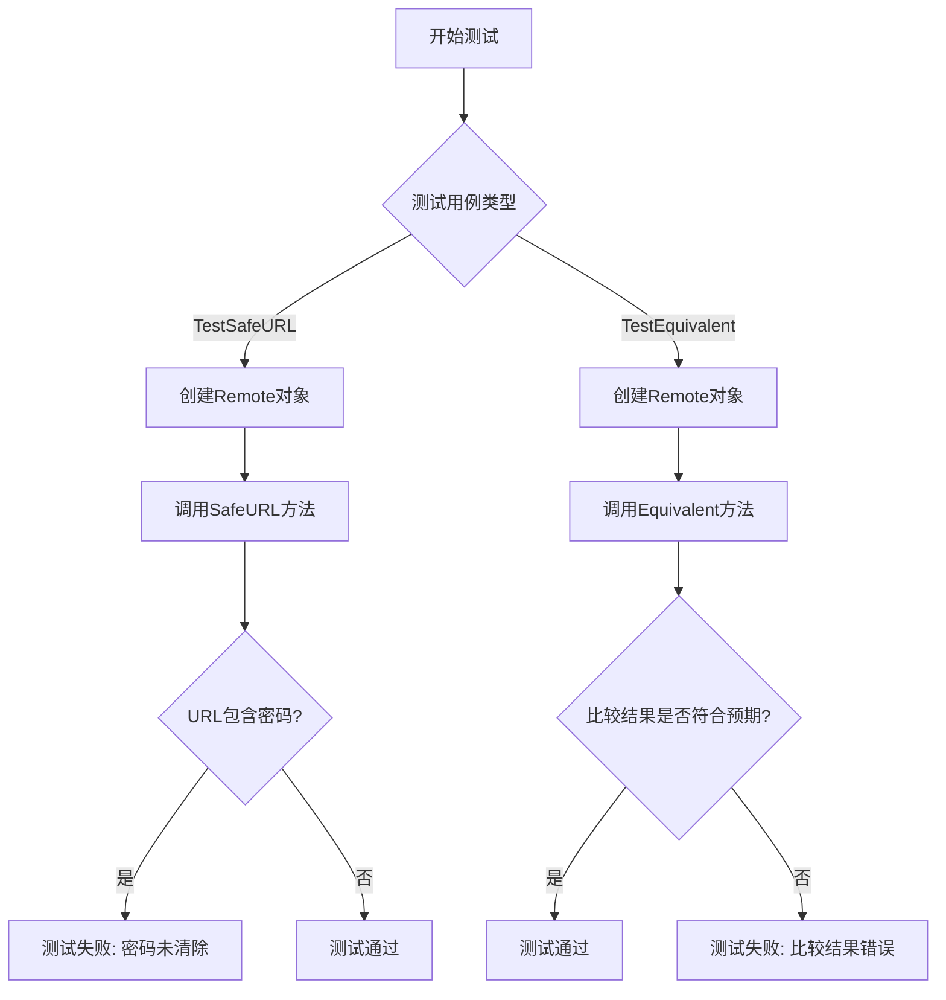
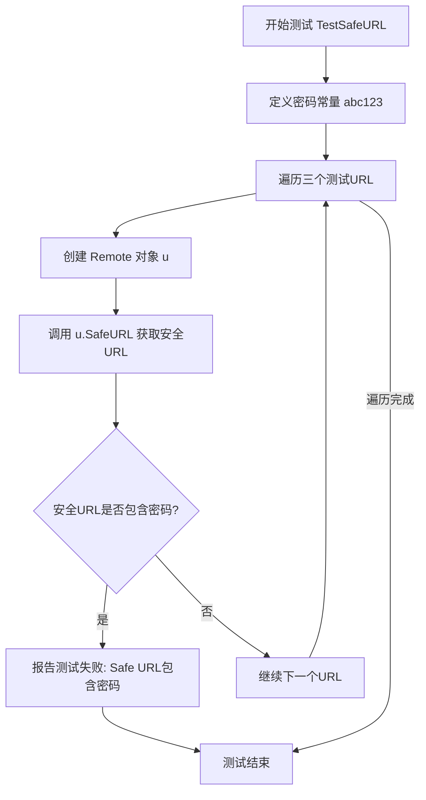
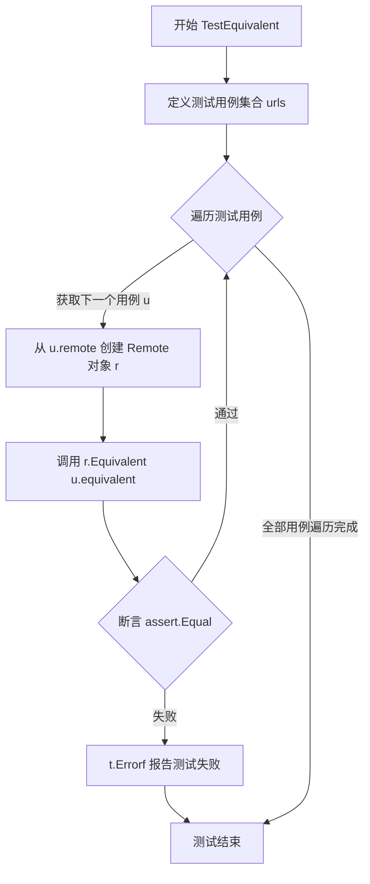
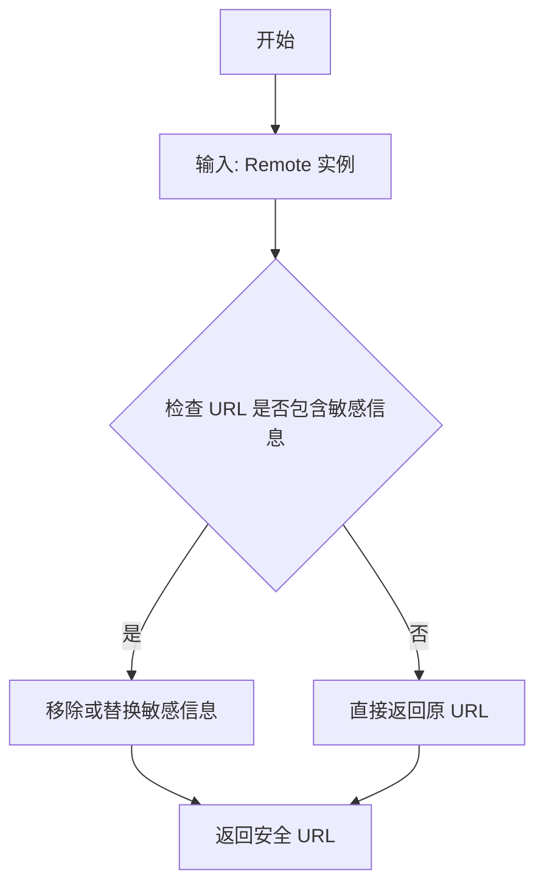
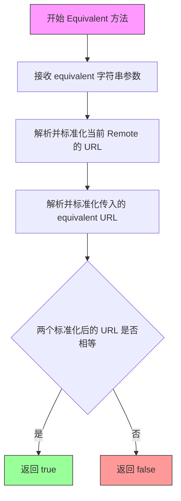

# `flux\pkg\git\url_test.go` 详细设计文档

这是一个用于处理Git远程仓库URL的Go包，主要功能是安全地处理URL（去除敏感信息如密码）以及比较不同格式的Git URL是否指向同一仓库。

## 整体流程



## 类结构

```
Remote (结构体)
├── SafeURL() string (方法)
└── Equivalent(equivalent string) bool (方法)
```

## 全局变量及字段


### `password`
    
测试用的密码字符串，用于验证SafeURL方法是否正确隐藏敏感信息

类型：`const string`
    


### `urls`
    
测试URL字符串切片，包含各种格式的git仓库地址

类型：`[]string`
    


### `Remote.url`
    
存储原始的git仓库URL地址

类型：`string`
    


### `Remote.SafeURL`
    
返回隐藏了敏感信息（如密码）的安全URL字符串

类型：`func() string`
    


### `Remote.Equivalent`
    
比较当前Remote实例与给定URL是否指向同一个git仓库

类型：`func(string) bool`
    
    

## 全局函数及方法


### `TestSafeURL`

该测试函数用于验证 `Remote` 类型的 `SafeURL` 方法能够正确隐藏 URL 中的敏感密码信息，防止密码在日志或调试输出中泄露。

参数：

- `t`：`*testing.T`，Go 语言标准测试框架的测试对象，用于报告测试失败和记录测试结果

返回值：无（`void`），测试函数通过 `t.Errorf` 报告测试失败

#### 流程图



#### 带注释源码

```go
// TestSafeURL 测试 SafeURL 方法能否正确隐藏密码信息
func TestSafeURL(t *testing.T) {
	// 定义测试用的密码常量
	const password = "abc123"
	
	// 遍历多个测试用例URL
	for _, url := range []string{
		// SSH 协议格式的远程地址
		"git@github.com:fluxcd/flux",
		// HTTPS 格式但不包含认证信息
		"https://user@example.com:5050/repo.git",
		// HTTPS 格式且包含认证信息和密码
		"https://user:" + password + "@example.com:5050/repo.git",
	} {
		// 根据URL字符串创建 Remote 结构体实例
		u := Remote{url}
		
		// 调用 SafeURL 方法获取处理后的安全URL
		// 并检查是否意外泄露了密码
		if strings.Contains(u.SafeURL(), password) {
			// 如果密码出现在安全URL中，说明实现有缺陷
			t.Errorf("Safe URL for %s contains password %q", url, password)
		}
	}
}
```


### `TestEquivalent`

该测试函数验证 `Remote` 类的 `Equivalent` 方法能否正确判断不同格式的 Git 远程 URL 是否指向同一仓库。测试通过定义多组包含不同 URL 格式（SSH、HTTPS、Git 协议等）的测试用例，逐一验证 `Equivalent` 方法返回的等效性判断结果是否与预期相符。

参数：

- `t`：`testing.T`，Go 标准测试框架的测试上下文对象，用于报告测试失败和记录测试状态

返回值：`无`（Go 测试函数不返回值，通过 `assert` 断言进行验证）

#### 流程图



#### 带注释源码

```go
// TestEquivalent 测试 Remote 类的 Equivalent 方法
// 验证不同格式的 Git URL 是否被正确识别为等效的远程仓库
func TestEquivalent(t *testing.T) {
	// 定义测试用例结构体，包含：
	// - remote: 原始远程仓库 URL
	// - equivalent: 用于比较的等效 URL
	// - equal: 预期的等效性判断结果
	urls := []struct {
		remote     string
		equivalent string
		equal      bool
	}{
		// SSH 格式与标准 SSH 协议格式应等效
		{"git@github.com:fluxcd/flux", "ssh://git@github.com/fluxcd/flux.git", true},
		// HTTPS 格式转换为 SSH 协议格式应等效
		{"https://git@github.com/fluxcd/flux.git", "ssh://git@github.com/fluxcd/flux.git", true},
		// HTTPS 格式与 SSH 简写格式应等效
		{"https://github.com/fluxcd/flux.git", "git@github.com:fluxcd/flux.git", true},
		// 不同仓库的 URL 不应等效
		{"https://github.com/fluxcd/flux.git", "https://github.com/fluxcd/helm-operator.git", false},
	}

	// 遍历所有测试用例
	for _, u := range urls {
		// 从 remote 字段创建 Remote 对象
		r := Remote{u.remote}
		// 断言 Equivalent 方法的返回值与预期结果一致
		assert.Equal(t, u.equal, r.Equivalent(u.equivalent))
	}
}
```


基于提供的代码，该文件为测试文件，测试了 `Remote` 类型的 `SafeURL` 方法，但未包含 `Remote` 类型的具体定义及 `SafeURL` 方法的实现。因此，以下信息基于测试代码推断。

### `Remote.SafeURL`

该方法用于返回安全的 URL 字符串，隐藏其中的敏感信息（如密码），以防止泄露。

参数：
- 无参数（方法接收者 `Remote` 类型实例）

返回值：`string`，返回处理后的安全 URL 字符串。

#### 流程图



#### 带注释源码

由于代码中未包含 `Remote` 类型及 `SafeURL` 方法的实现源码，仅提供测试代码中的使用方式作为参考：

```go
// 测试代码示例
u := Remote{url} // 假设 Remote 结构体接收 URL 字符串
safeURL := u.SafeURL() // 调用 SafeURL 方法获取安全 URL
if strings.Contains(safeURL, password) {
    t.Errorf("Safe URL for %s contains password %q", url, password)
}
```

#### 潜在的技术债务或优化空间

- **实现缺失**：代码中未提供 `Remote` 类型和 `SafeURL` 方法的具体实现，无法验证其正确性和性能。
- **测试覆盖不足**：仅测试了有限场景（如包含密码的 HTTPS URL），未覆盖 SSH URL、特殊字符、不同协议等边界情况。

#### 其它项目

- **设计目标**：确保 URL 在日志或输出中安全展示，不泄露凭据。
- **错误处理**：测试中未涉及错误处理，需确保方法在无效输入时返回合理值。
- **外部依赖**：使用标准库 `strings` 进行字符串处理。


### `Remote.Equivalent`

该方法用于比较两个 Git 远程仓库 URL 是否指向同一个仓库，能够识别不同表示形式的等价 URL（如 SSH 和 HTTPS 格式）。

参数：

- `equivalent`：`string`，要比较的等价 URL 字符串

返回值：`bool`，表示 remote URL 和传入的 equivalent URL 是否等价

#### 流程图



#### 带注释源码

```go
// Remote 结构体方法：Equivalent
// 功能：比较当前 Remote 对象的 URL 是否与传入的 equivalent URL 等价
// 说明：能够识别不同协议、格式但指向同一仓库的 URL
func (r Remote) Equivalent(equivalent string) bool {
    // r.url 是当前 Remote 对象的 URL
    // equivalent 是传入的要比较的 URL
    // 方法内部会进行 URL 解析和标准化，然后比较
    // 返回 true 表示两个 URL 指向同一个仓库
    // 返回 false 表示两个 URL 指向不同的仓库
    
    // 测试用例展示的等价情况：
    // - git@github.com:fluxcd/flux <-> ssh://git@github.com/fluxcd/flux.git
    // - https://git@github.com/fluxcd/flux.git <-> ssh://git@github.com/fluxcd/flux.git
    // - https://github.com/fluxcd/flux.git <-> git@github.com:fluxcd/flux.git
    
    // 具体实现需要查看 Remote 类型的完整定义
}
```

## 关键组件


### Remote 结构体

表示Git远程仓库的抽象，包含URL解析和比较功能

### SafeURL 方法

返回隐藏了敏感信息（如密码）的安全URL字符串，用于日志输出和错误提示，避免凭据泄露

### Equivalent 方法

比较两个Git仓库URL是否指向同一个仓库，支持多种URL格式（SSH、HTTPS、git@协议）之间的等价性判断

### 测试用例设计

包含正常URL、带密码URL、不同协议URL的边界测试，确保等价性判断的准确性


## 问题及建议


### 已知问题

-   测试代码中硬编码了明文密码 `password = "abc123"`，即使在测试环境中，也可能因日志输出或错误信息导致敏感信息泄露
-   缺少对 `Remote` 类型 `SafeURL()` 方法在边界情况下的测试（如空URL、nil值、URL格式异常等）
-   `TestEquivalent` 测试用例覆盖不全面，未包含非标准URL格式、带有端口号的SSH URL、URL参数等情况
-   测试中未验证 `Equivalent` 方法对大小写敏感性的处理（如 `Git@GitHub.com` vs `git@github.com`）
-   被测试的 `Remote` 类型定义未在代码中给出，无法确认其实现是否完整，增加了维护难度

### 优化建议

-   将敏感测试数据（如密码）改为从环境变量或加密配置中读取，避免硬编码
-   增加边界测试用例：空字符串、nil、空格、特殊字符（&、?、#等）、不合法URL格式
-   补充 `Equivalent` 方法的测试场景：大小写变体、尾部斜杠差异、.git后缀差异、用户信息差异
-   建议将 `Remote` 类型的定义与测试代码放在同一包或通过内联注释说明其关键方法签名，提高代码可读性
-   考虑添加性能测试（ Benchmark ），验证URL解析和比较逻辑在大批量操作下的性能表现

## 其它


### 设计目标与约束

本代码模块主要实现Git远程仓库URL的安全处理和等效性比较功能。设计目标包括：1) 隐藏URL中的敏感凭证信息以防止泄露；2) 支持多种Git URL格式的标准化比较；3) 兼容SSH和HTTPS等常见协议。约束条件为仅处理标准Git URL格式，不支持复杂的认证代理场景。

### 错误处理与异常设计

代码采用Go语言的测试驱动开发模式，通过`t.Errorf`报告SafeURL测试失败的情况。Equivalent方法使用assert包进行断言验证。异常处理原则：URL解析失败时返回false而非panic；无效URL格式不抛出异常，视为不等效。

### 数据流与状态机

数据流：输入URL字符串 → Remote结构体初始化 → SafeURL/Equivalent方法处理 → 返回结果/布尔值。状态机概念：Remote对象持有URL解析后的内部状态（scheme、host、path、credentials），不同方法基于该状态进行转换和比较。

### 外部依赖与接口契约

外部依赖：1) `github.com/stretchr/testify/assert` - 断言库；2) `strings` - 字符串处理；3) `testing` - Go测试框架。接口契约：Remote结构体暴露SafeURL() string和Equivalent(another string) bool两个公开方法，输入为有效URL字符串，输出分别为脱敏URL和布尔值。

### 性能考虑

当前实现为轻量级字符串处理，无复杂计算。对于大量URL比较场景，可考虑缓存解析结果以避免重复解析。SafeURL方法每次调用都会重新处理字符串，暂无缓存机制。

### 安全性考虑

SafeURL方法实现了敏感信息脱敏，移除URL中的password字段。测试用例验证了密码不会出现在SafeURL返回值中。安全建议：确保日志系统不会记录完整URL，内存中的凭证信息应及时清理。

### 测试策略

采用表格驱动测试（Table-Driven Tests）模式，覆盖多种URL格式：SSH协议（git@）、HTTPS协议、带凭证URL。测试覆盖场景：正常URL比较、跨协议等价性判断、不等价URL识别、敏感信息隐藏验证。

### 边界条件与限制

边界条件：空字符串URL处理、空credentials处理、端口号解析、路径标准化。限制：不支持HTTP协议（仅HTTPS）、不支持自定义SSH端口的完整写法、不处理包含特殊字符的密码。

### 扩展性考虑

可扩展方向：1) 支持更多URL协议（FTP、SSH其他写法）；2) 添加URL规范化配置选项；3) 支持自定义凭证字段过滤规则。当前设计通过Remote结构体封装，便于后续添加新字段和转换逻辑。

### 版本兼容性

依赖版本要求：Go 1.x（标准库），testify/assert v1.x。向后兼容性良好：公开接口保持稳定，内部实现可自由重构。


    