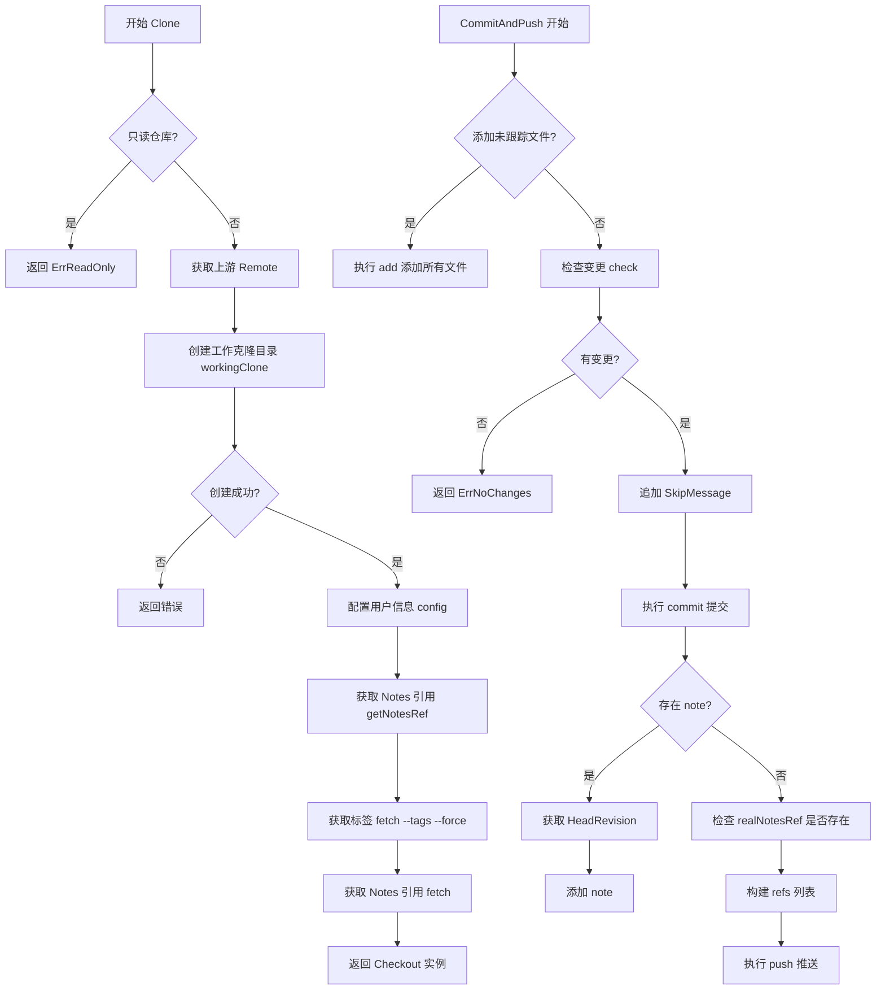
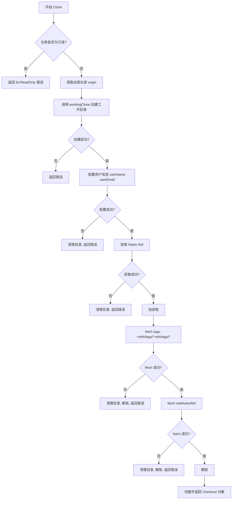
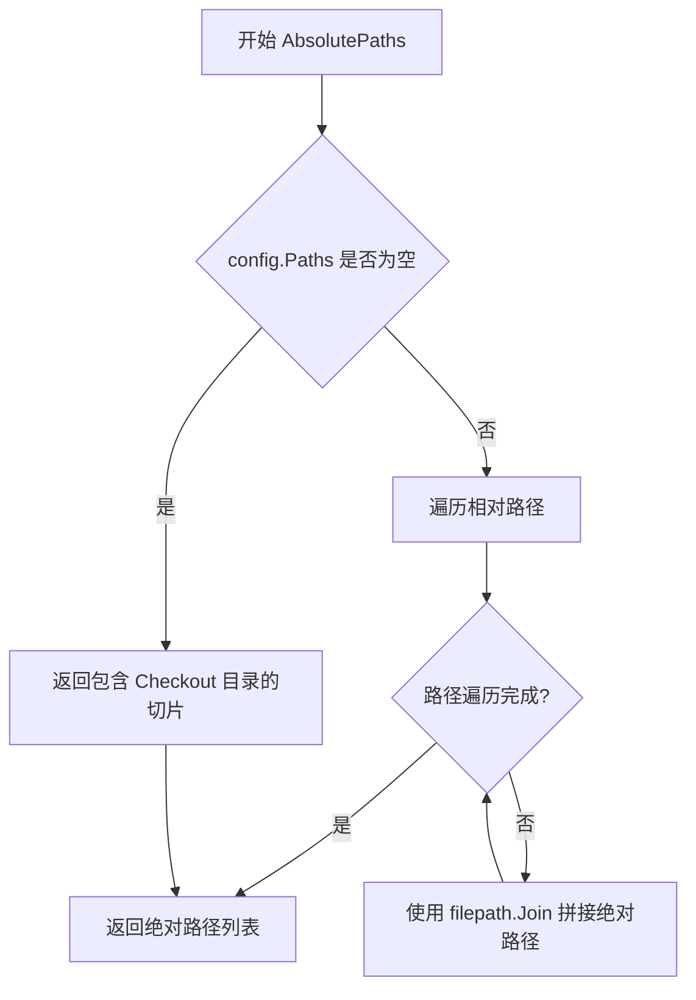
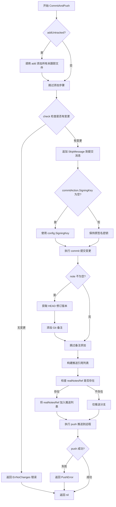
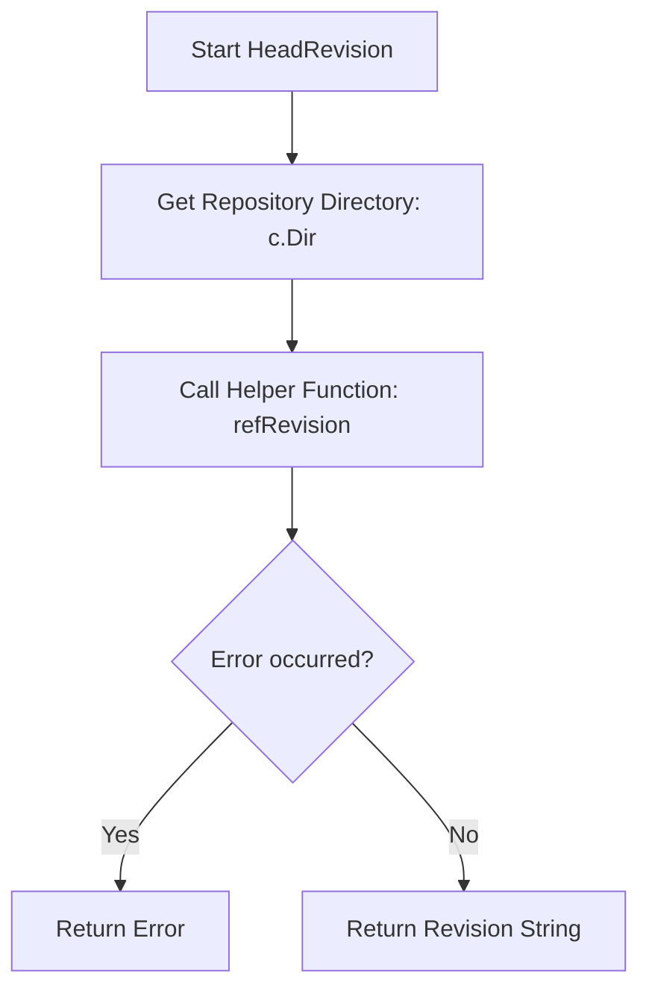
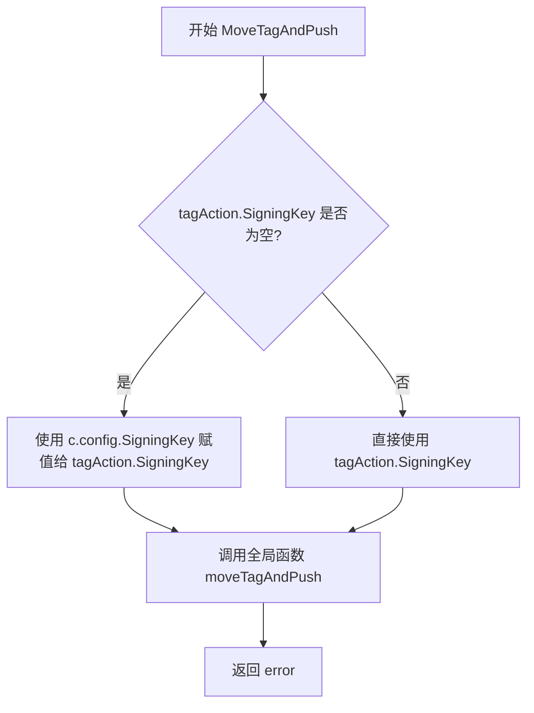
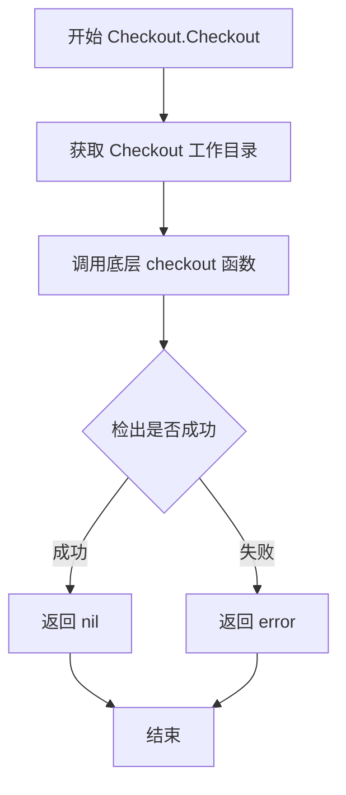

# `flux\pkg\git\working.go` 详细设计文档

该代码实现了一个Git工作克隆管理器，提供Checkout结构体用于本地Git仓库的检出、提交、标签和推送操作，支持配置化的分支、路径、用户信息和签名密钥管理。

## 整体流程



## 类结构

```
git (包)
├── Config (配置结构体)
├── Checkout (检出结构体)
│   └── Export (嵌入)
├── Commit (提交结构体)
├── CommitAction (提交操作结构体)
├── TagAction (标签操作结构体)
└── Repo (外部依赖)
```

## 全局变量及字段


### `ErrReadOnly`
    
只读仓库错误

类型：`error`
    


### `Config.Branch`
    
要同步的分支

类型：`string`
    


### `Config.Paths`
    
关注的仓库内路径

类型：`[]string`
    


### `Config.NotesRef`
    
Git notes 引用

类型：`string`
    


### `Config.UserName`
    
Git 用户名

类型：`string`
    


### `Config.UserEmail`
    
用户邮箱

类型：`string`
    


### `Config.SigningKey`
    
签名密钥

类型：`string`
    


### `Config.SetAuthor`
    
设置作者标志

类型：`bool`
    


### `Config.SkipMessage`
    
跳过提交消息

类型：`string`
    


### `Checkout.Export`
    
嵌入的导出器

类型：`*Export`
    


### `Checkout.config`
    
配置对象

类型：`Config`
    


### `Checkout.upstream`
    
上游远程仓库

类型：`Remote`
    


### `Checkout.realNotesRef`
    
缓存的 notes 引用

类型：`string`
    


### `Commit.Signature`
    
提交签名

类型：`Signature`
    


### `Commit.Revision`
    
修订版本

类型：`string`
    


### `Commit.Message`
    
提交消息

类型：`string`
    


### `CommitAction.Author`
    
作者

类型：`string`
    


### `CommitAction.Message`
    
提交消息

类型：`string`
    


### `CommitAction.SigningKey`
    
签名密钥

类型：`string`
    


### `TagAction.Tag`
    
标签名

类型：`string`
    


### `TagAction.Revision`
    
修订版本

类型：`string`
    


### `TagAction.Message`
    
标签消息

类型：`string`
    


### `TagAction.SigningKey`
    
签名密钥

类型：`string`
    
    

## 全局函数及方法


### MakeAbsolutePaths

将相对路径转换为绝对路径，以实现 `Dir()` 方法的对象的目录作为基础目录。若传入的相对路径切片为空，则返回仅包含基础目录的切片。

参数：

- `r`：`interface{ Dir() string }`，实现了 `Dir()` 方法的对象，用于获取基础目录（通常为仓库根目录）
- `relativePaths`：`[]string`，需要转换的相对路径列表

返回值：`[]string`，转换后的绝对路径列表

#### 流程图

```mermaid
flowchart TD
    A[开始 MakeAbsolutePaths] --> B{检查 relativePaths 是否为空}
    B -->|是| C[获取基础目录 r.Dir]
    C --> D[返回只含基础目录的单元素切片]
    B -->|否| E[获取基础目录 r.Dir]
    E --> F[创建与 relativePaths 等长的空切片]
    F --> G{遍历 relativePaths]}
    G -->|每次迭代| H[调用 filepath.Join 合并 base 与 p]
    H --> I[将结果存入 paths[i]]
    I --> G
    G -->|遍历完成| J[返回 paths 切片]
```

#### 带注释源码

```go
// MakeAbsolutePaths returns the absolute path for each of the
// relativePaths given, taking the repo's location as the base.
func MakeAbsolutePaths(r interface{ Dir() string }, relativePaths []string) []string {
	// 如果没有提供相对路径，返回包含基础目录的单元素切片
	// 这样可以保证至少返回一个有效路径
	if len(relativePaths) == 0 {
		return []string{r.Dir()}
	}

	// 获取基础目录（仓库根目录）
	base := r.Dir()
	
	// 创建与输入切片等长的目标切片，预分配内存以提高性能
	paths := make([]string, len(relativePaths), len(relativePaths))
	
	// 遍历每个相对路径，使用 filepath.Join 转换为绝对路径
	for i, p := range relativePaths {
		paths[i] = filepath.Join(base, p)
	}
	
	// 返回转换后的绝对路径列表
	return paths
}
```

#### 关键组件信息

| 名称 | 描述 |
|------|------|
| `filepath.Join` | Go 标准库函数，用于拼接路径片段，自动处理路径分隔符和跨平台兼容性问题 |

#### 潜在的技术债务或优化空间

1. **重复的长度参数**：`make([]string, len(relativePaths), len(relativePaths))` 中长度和容量参数相同，可以简化为 `make([]string, len(relativePaths))`
2. **缺乏输入验证**：未对相对路径中的非法字符或空字符串进行校验，可能导致意外结果
3. **接口参数过于宽松**：`interface{ Dir() string }` 虽提供了灵活性，但缺乏文档说明具体哪些类型可以使用

#### 其它项目

- **设计目标**：提供一个通用的路径转换工具，使 `Repo` 和 `Checkout` 等类型能够灵活地获取绝对路径
- **约束**：依赖 `filepath.Join` 的跨平台路径处理特性，不处理符号链接解析
- **错误处理**：本函数不返回错误，当输入为空时返回默认值；当相对路径包含 `..` 或 `.` 时，`filepath.Join` 会自动处理
- **调用方**：`Checkout.AbsolutePaths()` 方法调用了此函数，将配置中的相对路径转换为工作目录下的绝对路径


### `Repo.Clone`

克隆远程仓库创建一个本地工作副本的 Checkout 对象，用于后续的事务性操作（如提交和推送）。

参数：
- `ctx`：`context.Context`，用于控制超时和取消的上下文
- `conf`：`Config`，包含分支、路径、用户信息、签名密钥等配置

返回值：`*Checkout`，返回新创建的工作副本对象；`error`，如果发生错误则返回错误信息

#### 流程图



#### 带注释源码

```go
// Clone returns a local working clone of the sync'ed `*Repo`, using
// the config given.
// Clone 方法返回一个本地工作副本的 Repo，使用给定的配置
func (r *Repo) Clone(ctx context.Context, conf Config) (*Checkout, error) {
    // 检查仓库是否为只读模式，如果是则返回错误
	if r.readonly {
		return nil, ErrReadOnly
	}
    // 获取远程仓库的 origin 信息
	upstream := r.Origin()
    // 创建工作克隆目录，传入分支名称
	repoDir, err := r.workingClone(ctx, conf.Branch)
	if err != nil {
		return nil, err
	}

    // 配置克隆仓库的用户名和邮箱
	if err := config(ctx, repoDir, conf.UserName, conf.UserEmail); err != nil {
        // 配置失败时清理已创建的目录
		os.RemoveAll(repoDir)
		return nil, err
	}

    // 获取 notes ref 用于后续推送，假设正在同步该 ref
	realNotesRef, err := getNotesRef(ctx, repoDir, conf.NotesRef)
	if err != nil {
		os.RemoveAll(repoDir)
		return nil, err
	}

    // 获取读锁，模拟 git fetch --tags --force，但不覆盖 head refs
    // 这对于 Checkout 是必需的，但 Repo（作为裸镜像）可以接受任意 ref 变化
	r.mu.RLock()
    // 注意：在其他 fetch 操作之前执行，否则可能会收到 'existing tag clobber' 错误
	if err := fetch(ctx, repoDir, r.dir, `'+refs/tags/*:refs/tags/*'`); err != nil {
		os.RemoveAll(repoDir)
		r.mu.RUnlock()
		return nil, err
	}
    // 拉取 notes ref
	if err := fetch(ctx, repoDir, r.dir, realNotesRef+":"+realNotesRef); err != nil {
		os.RemoveAll(repoDir)
		r.mu.RUnlock()
		return nil, err
	}
	r.mu.RUnlock()

    // 返回新创建的 Checkout 对象，包含工作目录、远程仓库、notes ref 和配置
	return &Checkout{
		Export:       &Export{dir: repoDir},
		upstream:     upstream,
		realNotesRef: realNotesRef,
		config:       conf,
	}, nil
}
```


### `Checkout.AbsolutePaths`

返回配置中定义的绝对路径列表，确保至少返回一个路径以便与 `Manifest.LoadManifests` 配合使用。

参数：
- 无参数

返回值：`[]string`，返回配置的绝对路径列表

#### 流程图



#### 带注释源码

```go
// AbsolutePaths returns the absolute paths as configured. It ensures
// that at least one path is returned, so that it can be used with
// `Manifest.LoadManifests`.
// 返回配置中定义的绝对路径列表。确保至少返回一个路径，以便与
// Manifest.LoadManifests 配合使用。
func (c *Checkout) AbsolutePaths() []string {
    // 调用 MakeAbsolutePaths 工具函数，传入 Checkout 实例（实现 Dir() string 接口）
    // 和配置中的相对路径列表
	return MakeAbsolutePaths(c, c.config.Paths)
}
```

#### 关联：`MakeAbsolutePaths` 工具函数

由于 `AbsolutePaths` 内部调用了 `MakeAbsolutePaths`，以下是完整的路径转换逻辑：

```go
// MakeAbsolutePaths returns the absolute path for each of the
// relativePaths given, taking the repo's location as the base.
// MakeAbsolutePaths 返回给定相对路径的绝对路径，以代码库位置为基础。
func MakeAbsolutePaths(r interface{ Dir() string }, relativePaths []string) []string {
    // 如果没有提供相对路径，返回代码库根目录作为默认路径
	if len(relativePaths) == 0 {
		return []string{r.Dir()}
	}

    // 获取代码库基础目录
	base := r.Dir()
    // 创建与输入路径数量相同的切片
	paths := make([]string, len(relativePaths), len(relativePaths))
    // 遍历每个相对路径，拼接成绝对路径
	for i, p := range relativePaths {
		paths[i] = filepath.Join(base, p)
	}
	return paths
}
```


### `Checkout.CommitAndPush`

该方法是 Git 客户端的核心事务方法，负责将本地工作副本的变更提交到本地 Git 仓库，并可选地添加备注（note），最后将提交和备注推送到远程仓库。它封装了 `add` → `check` → `commit` → `addNote` → `push` 的完整流程，确保变更的原子性提交与同步。

参数：

- `ctx`：`context.Context`，上下文对象，用于控制请求的生命周期（如超时、取消）
- `commitAction`：`CommitAction`，包含提交的作者、提交消息和签名密钥
- `note`：`interface{}`，可选的 Git 备注（note）数据，用于附加额外的元信息
- `addUntracked`：`bool`，是否将未跟踪的文件添加到暂存区

返回值：`error`，执行过程中的错误信息，若成功则返回 `nil`

#### 流程图



#### 带注释源码

```go
// CommitAndPush 提交本地变更并推送到远程仓库
// 流程: add(可选) -> check -> commit -> addNote(可选) -> push
func (c *Checkout) CommitAndPush(ctx context.Context, commitAction CommitAction, note interface{}, addUntracked bool) error {
	// 1. 如果需要添加未跟踪文件，递归添加当前目录下的所有文件
	if addUntracked {
		if err := add(ctx, c.Dir(), "."); err != nil {
			return err
		}
	}

	// 2. 检查配置的路径中是否存在已暂存的变更
	//    若无变更则返回 ErrNoChanges，阻止空提交
	if !check(ctx, c.Dir(), c.config.Paths, addUntracked) {
		return ErrNoChanges
	}

	// 3. 将配置的 SkipMessage 追加到提交消息末尾
	//    通常用于添加自动生成的构建信息或跳过 CI 的标记
	commitAction.Message += c.config.SkipMessage

	// 4. 若未指定签名密钥，则使用全局配置的签名密钥进行 GPG 签名
	if commitAction.SigningKey == "" {
		commitAction.SigningKey = c.config.SigningKey
	}

	// 5. 执行 Git commit 操作，将暂存区内容写入仓库
	if err := commit(ctx, c.Dir(), commitAction); err != nil {
		return err
	}

	// 6. 若传入了 note 参数，则为当前提交添加 Git 备注
	//    Git 备注存储在 refs/notes/commits 命名空间，可用于存储元数据
	if note != nil {
		// 获取刚创建的提交的 SHA-1 哈希值
		rev, err := c.HeadRevision(ctx)
		if err != nil {
			return err
		}
		// 将 note 数据添加到指定的 notes ref
		if err := addNote(ctx, c.Dir(), rev, c.realNotesRef, note); err != nil {
			return err
		}
	}

	// 7. 准备推送的引用列表，首先包含配置的分支
	refs := []string{c.config.Branch}
	// 检查 notes ref 是否已存在（可能来自之前的同步）
	ok, err := refExists(ctx, c.Dir(), c.realNotesRef)
	if ok {
		// 若 notes ref 存在，一并推送到远程
		refs = append(refs, c.realNotesRef)
	} else if err != nil {
		// 检查过程出错，直接返回错误
		return err
	}

	// 8. 执行推送操作，将 commit 和 note 推送到远程仓库
	if err := push(ctx, c.Dir(), c.upstream.URL, refs); err != nil {
		// 包装原始错误，提供远程 URL 上下文
		return PushError(c.upstream.URL, err)
	}
	return nil
}
```


### `Checkout.HeadRevision`

获取当前 Checkout 工作目录对应的 Git 仓库中 HEAD 指针指向的提交版本（SHA-1 哈希值）。

参数：
- `ctx`：`context.Context`，上下文对象，用于控制请求的生命周期（如超时、取消）。

返回值：
- `string`，HEAD 指向的提交 SHA 值。
- `error`，如果执行 git 命令失败，则返回错误信息。

#### 流程图



#### 带注释源码

```go
// HeadRevision returns the revision (SHA) that HEAD is currently pointing to.
func (c *Checkout) HeadRevision(ctx context.Context) (string, error) {
	// 调用内部函数 refRevision 获取 "HEAD" 引用的具体修订版本号
	// c.Dir() 获取当前 Checkout 工作克隆的路径
	return refRevision(ctx, c.Dir(), "HEAD")
}
```


### `Checkout.MoveTagAndPush`

该方法用于在本地 Checkout（工作克隆）中移动（更新）Git 标签并将其推送到远程仓库。如果 TagAction 中未指定 SigningKey，则自动使用 Checkout 的配置中的 SigningKey。

参数：

- `ctx`：`context.Context`，Go 语言标准库的上下文，用于传递截止时间、取消信号等
- `tagAction`：`TagAction`，包含标签操作参数的结构体

返回值：`error`，如果操作失败则返回错误，否则返回 nil

#### 流程图



#### 带注释源码

```go
// MoveTagAndPush 移动（更新）标签并推送到远程仓库
// 参数 ctx 为上下文，用于控制超时和取消
// 参数 tagAction 包含标签的名称、版本、消息和签名密钥
func (c *Checkout) MoveTagAndPush(ctx context.Context, tagAction TagAction) error {
	// 如果 tagAction 中未指定 SigningKey，则使用 Checkout 配置中的默认密钥
	if tagAction.SigningKey == "" {
		tagAction.SigningKey = c.config.SigningKey
	}
	// 调用全局函数 moveTagAndPush 执行实际的移动标签和推送操作
	// 传入：上下文、Checkout 目录、远程仓库 URL、标签操作参数
	return moveTagAndPush(ctx, c.Dir(), c.upstream.URL, tagAction)
}
```


### `Checkout.Checkout`

检出特定修订版（Revision）。该方法接收目标修订版标识符，调用底层 `checkout` 函数将工作目录切换到指定版本。

参数：

- `ctx`：`context.Context`，上下文参数，用于控制请求的生命周期和取消操作
- `rev`：`string`，要检出的目标修订版标识符（如 commit hash、branch name、tag 等）

返回值：`error`，如果检出成功则返回 `nil`，否则返回相应的错误信息

#### 流程图



#### 带注释源码

```go
// Checkout 检出特定修订版
// ctx: 上下文，用于控制超时和取消
// rev: 目标修订版标识符
func (c *Checkout) Checkout(ctx context.Context, rev string) error {
	// 调用底层 checkout 函数，传入：
	// - ctx: 上下文对象
	// - c.Dir(): 获取 Checkout 实例的工作目录路径
	// - rev: 要检出的修订版
	return checkout(ctx, c.Dir(), rev)
}
```


### `Checkout.Add`

将指定路径的文件或目录添加到 Git 暂存区。

参数：

- `ctx`：`context.Context`，执行上下文，用于控制请求的取消、超时等
- `path`：`string`，要添加的文件或目录路径（相对于工作目录）

返回值：`error`，如果操作成功则返回 nil，否则返回错误信息

#### 流程图

```mermaid
graph TD
    A[开始] --> B[调用 add 函数]
    B --> C{add 是否返回错误?}
    C -->|是| D[返回错误]
    C -->|否| E[返回 nil]
    D --> F[结束]
    E --> F
    
    subgraph "内部实现"
        B1[传入 ctx, c.Dir(), path]
        B1 --> B2[执行 git add 命令]
    end
    
    B -.-> B1
```

#### 带注释源码

```go
// Add 将指定路径的文件或目录添加到 Git 暂存区
// 参数 ctx 用于控制操作取消和超时
// 参数 path 为相对于工作目录的路径
// 返回操作过程中的错误信息
func (c *Checkout) Add(ctx context.Context, path string) error {
	// 调用全局 add 函数，传入：
	// - ctx: 上下文对象
	// - c.Dir(): Checkout 的工作目录路径
	// - path: 要添加的文件或目录路径
	return add(ctx, c.Dir(), path)
}
```

## 关键组件


### Config 结构体

用于配置Git操作的各种参数，包括分支、路径、用户信息、签名密钥等。

### Checkout 结构体

本地Git仓库的工作副本，用于一次性事务操作（如提交更改然后推送到上游），包含导出目录、上游远程仓库、笔记引用和配置信息。

### Commit 结构体

表示Git提交的结构，包含提交者的签名、修订版本和提交信息。

### CommitAction 结构体

提交动作的参数结构，包含作者、提交信息 和签名密钥。

### TagAction 结构体

标签动作的参数结构，包含标签名、修订版本、提交信息 和签名密钥。

### Clone 方法

创建本地工作克隆的核心方法，执行获取标签、笔记引用等操作，返回Checkout对象。

### MakeAbsolutePaths 函数

将相对路径转换为绝对路径的辅助函数，以仓库目录为基准。

### AbsolutePaths 方法

返回配置的绝对路径列表，确保至少返回一个路径以兼容Manifest.LoadManifests。

### CommitAndPush 方法

提交本地更改并推送到远程仓库的核心方法，包含添加未跟踪文件、检查变更、创建提交、添加笔记和推送的完整流程。

### HeadRevision 方法

获取当前HEAD指向的修订版本号。

### MoveTagAndPush 方法

移动标签到新的修订版并推送到远程仓库。

### Checkout 方法

检出指定修订版的文件到工作目录。

### Add 方法

将指定文件或目录添加到Git暂存区。

### ErrReadOnly 错误

标识只读仓库错误，当尝试克隆只读仓库时返回。


## 问题及建议


### 已知问题

- **Mutex 生命周期管理问题**: 在 `Clone` 方法中，`r.mu.RLock()` 和 `r.mu.RUnlock()` 调用之间存在较长逻辑，若在释放锁之前发生 panic，可能导致死锁风险。此外，未在 `Clone` 方法入口处对 `r.readonly` 检查后立即加锁，存在检查与使用之间的竞态条件。
- **硬编码的 Git Refspec 潜在错误**: `fetch(ctx, repoDir, r.dir, '+refs/tags/*:refs/tags/*')` 中的 refspec 字符串以空格开头，虽然可能是故意的（表示强制更新），但极易导致维护困惑。
- **重复的资源清理代码**: 多处 `os.RemoveAll(repoDir)` 重复出现，若新增错误处理分支容易遗漏清理逻辑，违反了 DRY 原则。
- **接口类型使用不规范**: `MakeAbsolutePaths` 使用 `interface{ Dir() string }` 匿名接口而非定义明确接口，降低了代码可读性和可测试性。
- **过于宽泛的参数类型**: `CommitAndPush` 方法中 `note interface{}` 参数未定义具体类型，导致调用方无法获得编译时类型安全检查。
- **Context 取消支持不足**: 长时间运行的 Git 操作（fetch、push、clone 等）未在关键步骤中检查 `ctx.Done()`，无法及时响应取消请求。
- **配置验证缺失**: `Config` 结构体的字段（如 `Branch`、`UserName` 等）在使用前缺乏合法性校验，空值可能导致后续 Git 命令执行失败但错误信息不明确。
- **错误消息可改进性**: `ErrNoChanges` 错误未携带具体哪些路径无变化的信息，不利于调试。

### 优化建议

- **提取资源清理函数**: 创建一个 `cleanupOnError` 辅助函数，统一处理目录清理逻辑，接受要清理的目录路径和可能的错误，简化主流程。
- **定义明确接口**: 将 `interface{ Dir() string }` 提取为具名接口（如 `DirProvider`），增强代码语义。
- **增强类型安全**: 为 `CommitAndPush` 的 `note` 参数定义具体类型或接口约束，避免运行时类型断言风险。
- **添加配置校验**: 在 `Clone` 方法起始处添加 `Config` 字段校验逻辑，提前返回有意义的错误信息。
- **完善 Context 支持**: 在关键 Git 操作（如 fetch、push、commit）之间插入 `select` 语句检查 `ctx.Done()`，或在底层 git 命令执行时传递 context 实现超时控制。
- **消除代码重复**: 将 `SigningKey` 的默认值填充逻辑提取为 `Config` 或 `CommitAction` 的方法或辅助函数。
- **改进错误携带信息**: 在返回 `ErrNoChanges` 时附加具体的路径列表和检查状态，便于问题定位。
- **考虑添加重试机制**: 网络相关的 Git 操作（push、fetch）可能因瞬时故障失败，可考虑添加指数退避重试逻辑。

## 其它


### 设计目标与约束

本代码库的设计目标是提供一个用于管理Git仓库本地工作副本的Go语言包，支持创建checkout、提交更改、推送提交、创建标签等功能。核心约束包括：只读仓库无法创建工作clone、不支持锁定机制（仅用于一次性事务）、依赖外部Git命令执行操作、假设目标仓库支持Git notes功能。

### 错误处理与异常设计

错误处理采用Go语言的错误返回机制。主要错误类型包括：ErrReadOnly（只读仓库错误）、ErrNoChanges（无变更错误）、PushError（推送错误，携带URL信息）。每个函数在执行失败时清理临时资源（如删除创建的目录），确保没有孤儿资源遗留。异常场景包括：Git命令执行失败、仓库状态不一致、网络推送失败、文件操作失败等。

### 数据流与状态机

数据流从Repo.Clone开始，经过workingClone创建本地目录、config配置用户信息、fetch获取远程引用、最后返回Checkout对象。Checkout.CommitAndPush的流程为：add添加文件→check检查变更→commit创建提交→addNote添加注释→push推送到远程。状态转换：初始状态→克隆中→配置中→获取中→工作状态→提交中→推送中→完成或失败。

### 外部依赖与接口契约

外部依赖包括：Go标准库（context、errors、os、path/filepath）、外部Git命令（通过ctx执行shell命令）。接口契约：Repo需要实现Origin()方法和readonly字段；传入的Config必须包含有效Branch；Checkout需要保持dir字段有效供Export使用；所有操作需要有效的context.Context支持取消和超时。

### 并发与线程安全

代码中存在读写锁r.mu的保护，用于在Clone过程中保护r.dir的访问。但Checkout对象本身不是线程安全的，多个goroutine不应共享同一个Checkout实例进行并发操作。读写锁的使用场景仅限于防止在fetch过程中dir被修改。

### 性能考虑

性能优化点：使用filepath.Join缓存基础路径、相对路径为空时直接返回仓库目录减少计算、fetch操作先于其他fetch执行避免标签冲突错误。潜在性能瓶颈：每次Clone都创建新的完整目录、push操作是同步阻塞的、网络延迟直接影响操作成功与否。

### 安全性考虑

安全性措施：执行外部Git命令时使用context控制超时、清理临时目录防止资源泄漏、签名密钥从配置传递不在代码中硬编码。安全注意事项：路径处理使用filepath.Join防止路径遍历攻击、用户输入需要验证防止注入攻击、敏感信息（如签名密钥）不应出现在日志中。

### 测试策略

测试应覆盖：正常流程（克隆、提交、推送成功）、异常流程（只读仓库、网络失败、冲突处理）、边界条件（空路径配置、无变更提交、多标签操作）。Mock对象应实现Repo接口用于单元测试，使用临时目录进行集成测试。

### 配置管理

Config结构体是主要的配置入口，包含：Branch（目标分支）、Paths（关注的文件路径）、NotesRef（Git notes引用）、UserName和UserEmail（提交者信息）、SigningKey（签名密钥）、SetAuthor（是否设置作者）、SkipMessage（追加的跳过消息）。配置验证应在Clone前完成，部分字段有默认值。

### 版本兼容性

代码兼容Go 1.14及以上版本（使用context支持的版本）。外部依赖Git版本建议2.0以上以支持全部功能。API稳定性：Config和Checkout类型作为主要公共类型保持向后兼容，错误常量可能在未来扩展。

### 关键组件信息

**Repo**: 远程仓库的表示，包含origin信息和工作目录路径，是Clone操作的入口点。**Checkout**: 本地工作副本，封装了Export功能并提供提交、推送、标签等操作。**Config**: 配置数据结构，定义同步行为和用户信息。**Export**: 继承自Checkout的导出功能，提供目录访问能力。

    