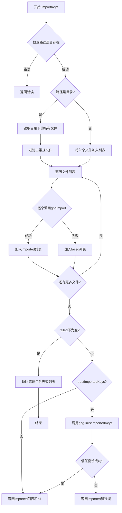
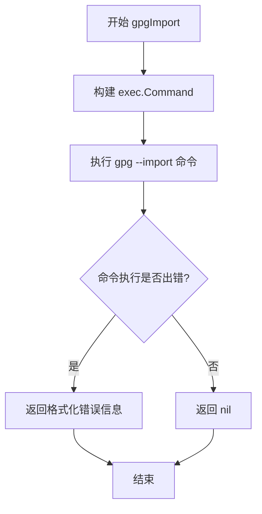
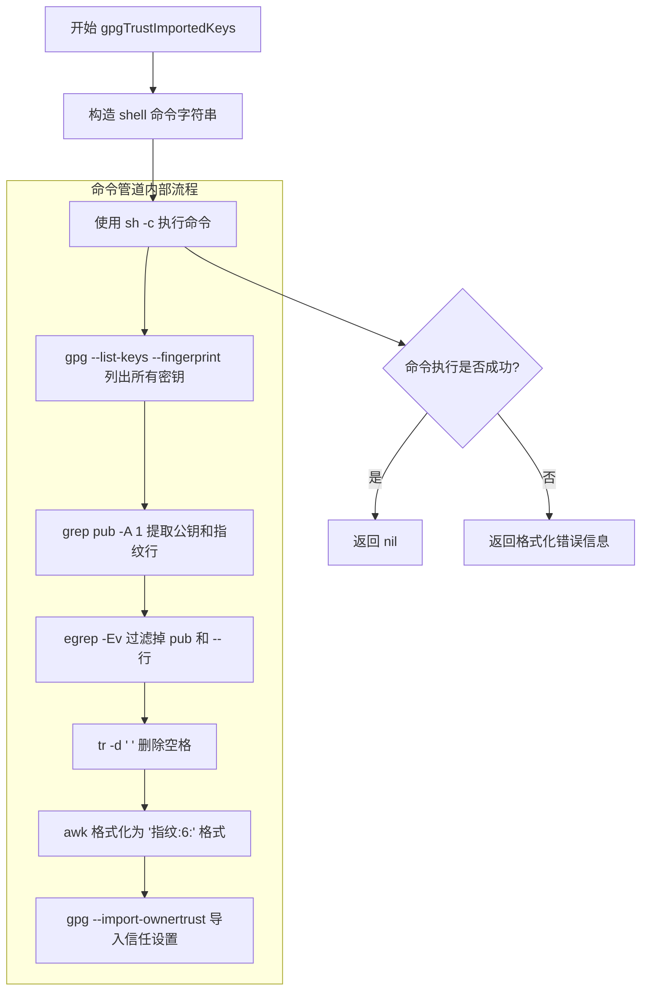

# `flux\pkg\gpg\gpg.go` 详细设计文档

这是一个GPG密钥管理包，提供从指定目录或文件导入GPG公钥到用户密钥环的功能，并可选择性地信任已导入的密钥，用于Git提交签名等场景。

## 整体流程



## 类结构

```
gpg包 (无类)
├── 公开函数
│   └── ImportKeys
└── 私有函数
    ├── gpgImport
    └── gpgTrustImportedKeys
```

## 全局变量及字段


### `src`
    
要导入的密钥文件或目录路径

类型：`string`
    


### `trustImportedKeys`
    
是否信任已导入的密钥

类型：`bool`
    


### `ImportKeys.info`
    
路径的元数据信息

类型：`os.FileInfo`
    


### `ImportKeys.files`
    
待导入的文件路径列表

类型：`[]string`
    


### `ImportKeys.imported`
    
成功导入的密钥文件名列表

类型：`[]string`
    


### `ImportKeys.failed`
    
导入失败的密钥文件名列表

类型：`[]string`
    


### `gpgImport.path`
    
单个文件路径

类型：`string`
    


### `gpgImport.cmd`
    
执行外部命令的结构体

类型：`*exec.Cmd`
    


### `gpgImport.out`
    
命令的组合输出

类型：`[]byte`
    


### `gpgTrustImportedKeys.arg`
    
shell命令参数字符串

类型：`string`
    


### `gpgTrustImportedKeys.cmd`
    
执行外部命令的结构体

类型：`*exec.Cmd`
    


### `gpgTrustImportedKeys.out`
    
命令的组合输出

类型：`[]byte`
    
    

## 全局函数及方法


### `ImportKeys`

从指定路径（文件或目录）导入GPG密钥到当前用户的密钥库，目录情况下仅处理顶层普通文件，支持可选的密钥信任设置，返回成功导入的密钥文件名列表。

参数：

- `src`：`string`，要导入的GPG密钥文件路径或包含密钥文件的目录路径
- `trustImportedKeys`：`bool`，是否在导入后信任这些密钥（设置为完全信任）

返回值：`([]string, error)`，返回成功导入的密钥文件名列表；若导入过程中有错误，返回已成功导入的列表及错误信息

#### 流程图

```mermaid
flowchart TD
    A[开始 ImportKeys] --> B[调用 os.Stat 获取 src 信息]
    B --> C{错误判断}
    C -->|有错误| D[返回 nil 和错误]
    C -->|无错误| E{判断 src 类型}
    E -->|目录| F[调用 ioutil.ReadDir 读取目录]
    E -->|文件| G[将 src 作为单个文件]
    F --> H[遍历目录项]
    H --> I{文件是否为普通文件}
    I -->|是| J[加入 files 列表]
    I -->|否| H
    J --> H
    H --> K[遍历完成]
    G --> L[files = [src]]
    K --> M[遍历 files 列表]
    L --> M
    M --> N{逐个调用 gpgImport}
    N -->|成功| O[加入 imported 列表]
    N -->|失败| P[加入 failed 列表]
    O --> M
    P --> M
    M --> Q{有失败的密钥?}
    Q -->|是| R[返回 imported 和错误信息]
    Q -->|否| S{trustImportedKeys?}
    S -->|是| T[调用 gpgTrustImportedKeys]
    S -->|否| U[返回 imported 和 nil]
    T --> V{错误判断}
    V -->|有错误| W[返回 imported 和错误]
    V -->|无错误| U
    R --> X[结束]
    U --> X
    W --> X
```

#### 带注释源码

```go
// ImportKeys looks for all keys in a directory, and imports them into
// the current user's keyring. A path to a directory or a file may be
// provided. If the path is a directory, regular files in the
// directory will be imported, but not subdirectories (i.e., no
// recursion). It returns the basenames of the successfully imported
// keys.
func ImportKeys(src string, trustImportedKeys bool) ([]string, error) {
    // 使用 os.Stat 获取 src 的文件信息，用于判断是文件还是目录
    info, err := os.Stat(src)
    var files []string
    switch {
    // 如果获取信息失败，直接返回错误
    case err != nil:
        return nil, err
    // 如果 src 是目录，读取目录内容
    case info.IsDir():
        infos, err := ioutil.ReadDir(src)
        if err != nil {
            return nil, err
        }
        // 遍历目录中的每一项
        for _, f := range infos {
            // 拼接完整的文件路径
            filepath := filepath.Join(src, f.Name())
            // 再次获取文件状态以确认是普通文件
            if f, err = os.Stat(filepath); err != nil {
                continue // 跳过获取状态失败的文件
            }
            // 仅处理普通文件（排除子目录和特殊文件）
            if f.Mode().IsRegular() {
                files = append(files, filepath)
            }
        }
    // 如果 src 是单个文件，直接使用该文件路径
    default:
        files = []string{src}
    }

    // 用于存储成功导入和失败的密钥文件名
    var imported []string
    var failed []string
    // 遍历所有待导入的文件路径
    for _, path := range files {
        // 调用 gpgImport 导入单个密钥
        if err := gpgImport(path); err != nil {
            // 导入失败，记录到 failed 列表，继续处理下一个
            failed = append(failed, filepath.Base(path))
            continue
        }
        // 导入成功，记录到 imported 列表
        imported = append(imported, filepath.Base(path))
    }

    // 如果有失败的密钥，返回已导入的列表和错误信息
    if failed != nil {
        return imported, fmt.Errorf("errored importing keys: %v", failed)
    }

    // 如果需要信任导入的密钥
    if trustImportedKeys {
        if err = gpgTrustImportedKeys(); err != nil {
            return imported, err
        }
    }

    // 返回成功导入的密钥文件名列表
    return imported, nil
}

// gpgImport 是内部辅助函数，用于执行 gpg --import 命令导入单个密钥文件
func gpgImport(path string) error {
    // 构造 gpg 导入命令
    cmd := exec.Command("gpg", "--import", path)
    // 执行命令并捕获合并输出
    out, err := cmd.CombinedOutput()
    if err != nil {
        // 导入失败，返回格式化错误信息
        return fmt.Errorf("error importing key: %s", string(out))
    }
    return nil
}

// gpgTrustImportedKeys 是内部辅助函数，用于信任已导入的密钥
// 通过列出密钥、提取指纹、转换格式，最后导入所有者信任设置
func gpgTrustImportedKeys() error {
    // 组合 shell 命令：
    // 1. gpg --list-keys --fingerprint: 列出所有密钥及其指纹
    // 2. grep pub -A 1: 提取公钥和对应指纹行
    // 3. egrep -Ev "pub|--": 去除 pub 和 -- 行
    // 4. tr -d ' ': 去除空格
    // 5. awk 格式化输出为 gpg 信任格式 "$1:6:"
    // 6. gpg --import-ownertrust: 导入信任设置
    arg := `gpg --list-keys --fingerprint | grep pub -A 1 | egrep -Ev "pub|--"|tr -d ' ' | awk 'BEGIN { FS = "\n" } ; { print $1":6:" }' | gpg --import-ownertrust`
    // 使用 sh -c 执行复杂 shell 命令管道
    cmd := exec.Command("sh", "-c", arg)
    out, err := cmd.CombinedOutput()
    if err != nil {
        return fmt.Errorf("error trusting imported keys: %s", string(out))
    }
    return nil
}
```


### `gpgImport`

该私有函数用于执行 GPG 密钥导入操作，通过调用系统 `gpg --import` 命令将指定路径的密钥文件导入到当前用户的 GPG 密钥环中，并返回可能的错误信息。

#### 参数

- `path`：`string`，要导入的 GPG 密钥文件路径

#### 返回值

- `error`：如果密钥导入失败，返回包含错误详情的错误对象；导入成功时返回 `nil`

#### 流程图



#### 带注释源码

```go
// gpgImport 执行 GPG 密钥导入功能
// 参数 path: 要导入的 GPG 密钥文件路径
// 返回值: 导入成功返回 nil，失败返回错误信息
func gpgImport(path string) error {
	// 使用 exec.Command 构建要执行的 shell 命令
	// 命令格式: gpg --import <path>
	// 其中 path 是要导入的密钥文件路径
	cmd := exec.Command("gpg", "--import", path)
	
	// CombinedOutput 执行命令并返回标准输出和标准错误的组合输出
	// 这是必要的，因为 GPG 的错误信息通常输出到 stderr
	out, err := cmd.CombinedOutput()
	
	// 检查命令执行是否出错
	// err 不为 nil 表示 gpg 命令返回了非零退出状态
	if err != nil {
		// 将命令输出转换为字符串并包含在错误消息中
		// 这有助于调用者了解具体的导入失败原因
		return fmt.Errorf("error importing key: %s", string(out))
	}
	
	// 导入成功，无错误发生，返回 nil
	return nil
}
```


### `gpgTrustImportedKeys`

这是一个私有函数，用于将所有已导入的 GPG 密钥设置为完全信任（trust level 6）。它通过构造并执行一条复杂的 shell 命令管道来完成此任务：首先列出所有密钥及其指纹，然后提取指纹并格式化为 gpg 可识别的信任配置格式，最后将信任设置导入到用户密钥库中。

参数：

- （无参数）

返回值：`error`，如果设置信任失败则返回错误信息，成功则返回 nil

#### 流程图



#### 带注释源码

```go
// gpgTrustImportedKeys 设置已导入的 GPG 密钥为完全信任
// 它通过 shell 管道命令将所有已导入密钥的指纹设置为 trust level 6（完全信任）
func gpgTrustImportedKeys() error {
	// 构造复杂的 shell 命令管道：
	// 1. gpg --list-keys --fingerprint: 列出所有密钥及其指纹
	// 2. grep pub -A 1: 获取公钥行及其对应的指纹行（-A 1 表示同时显示后1行）
	// 3. egrep -Ev "pub|--": 排除包含 'pub' 或 '--' 的行，只保留指纹行
	// 4. tr -d ' ': 删除所有空格
	// 5. awk: 将每行格式化为 "指纹:6:" 格式（6 表示完全信任 level）
	// 6. gpg --import-ownertrust: 将格式化后的信任配置导入到密钥库
	arg := `gpg --list-keys --fingerprint | grep pub -A 1 | egrep -Ev "pub|--"|tr -d ' ' | awk 'BEGIN { FS = "\n" } ; { print $1":6:" }' | gpg --import-ownertrust`
	
	// 使用 sh -c 执行 shell 命令字符串
	cmd := exec.Command("sh", "-c", arg)
	
	// CombinedOutput 返回命令的标准输出和标准错误的组合
	out, err := cmd.CombinedOutput()
	
	// 如果命令执行失败，返回格式化的错误信息
	if err != nil {
		return fmt.Errorf("error trusting imported keys: %s", string(out))
	}
	
	// 执行成功，返回 nil
	return nil
}
```

## 关键组件


### ImportKeys 函数

主入口函数，负责从指定目录或文件导入 GPG 密钥到用户密钥库，支持目录遍历和单文件处理

### gpgImport 函数

底层 GPG 命令执行函数，通过 exec.Command 调用系统 gpg 命令完成密钥导入

### gpgTrustImportedKeys 函数

密钥信任管理函数，通过 shell 管道组合多个命令（gpg、grep、tr、awk）实现自动信任导入的密钥

### 文件遍历逻辑

处理目录与文件两种输入模式，目录模式下仅导入常规文件，不进行递归子目录处理

### 错误处理机制

收集导入失败的文件列表，返回部分成功结果与错误信息，支持批量导入时的错误容忍


## 问题及建议


### 已知问题

-   **安全风险：命令注入漏洞**：`gpgTrustImportedKeys`函数使用`sh -c`执行复杂的shell管道命令，攻击者可通过恶意密钥文件名或路径执行任意命令
-   **变量遮蔽**：循环中重复使用`f`变量（`if f, err = os.Stat(filepath); err != nil`），导致外部循环的`f`被覆盖，降低代码可读性
-   **过度信任密钥**：`trustImportedKeys=true`会对GPG密钥库中**所有**已导入的密钥设置信任，而非仅本次导入的密钥，导致副作用
-   **外部命令依赖未检查**：代码直接调用`gpg`、`sh`等外部命令，未检查命令是否存在，可能导致误导性错误信息
-   **错误信息不完整**：导入失败时仅记录文件名，未记录具体的GPG错误输出（虽然`gpgImport`有输出但未传递出来）
-   **缺少超时控制**：使用`exec.Command`执行外部命令时没有设置超时，可能导致程序永久阻塞

### 优化建议

-   **重构shell命令**：将`gpgTrustImportedKeys`中的管道命令拆分为Go代码实现，使用`gpg --list-keys --with-colons`解析输出，避免命令注入风险
-   **改进变量命名**：使用不同的变量名（如`fileInfo`）避免循环变量遮蔽
-   **精确信任控制**：修改逻辑以仅信任本次成功导入的密钥，而非全局信任所有密钥
-   **添加命令检查**：在执行前使用`exec.LookPath`检查`gpg`等命令是否存在
-   **完善错误传递**：在导入失败时返回具体的GPG错误输出，便于问题排查
-   **添加超时机制**：使用`context.WithTimeout`为外部命令执行设置合理超时
-   **增加日志记录**：添加适当的日志输出，便于调试和审计导入过程

## 其它


### 设计目标与约束

本代码旨在实现GPG密钥的批量导入功能，支持从指定路径（文件或目录）导入密钥到用户密钥库，并可选地信任已导入的密钥。设计约束包括：仅支持单层目录遍历，不递归处理子目录；依赖系统已安装GPG工具；仅支持类Unix系统（Linux、macOS）；密钥文件必须是GPG可识别的格式。

### 错误处理与异常设计

错误处理采用Go语言的显式错误返回模式。ImportKeys函数返回(error)类型，调用方可通过错误类型判断具体故障。关键错误场景包括：路径不存在或无权限访问、目录读取失败、单个密钥导入失败、密钥信任失败。当部分密钥导入失败时，函数返回已成功导入的列表及错误信息，体现了容错设计思想。gpgImport和gpgTrustImportedKeys内部错误通过fmt.Errorf包装，返回包含GPG命令输出信息的错误描述，便于调试。

### 数据流与状态机

数据流遵循以下路径：输入路径 → 路径类型判断（目录/文件） → 文件列表构建 → 逐个密钥导入 → 可选的密钥信任 → 结果返回。状态机包含三种主要状态：初始态（接收输入）、处理态（遍历文件并执行GPG命令）、完成态（返回结果）。目录处理时，状态在文件收集和单个导入之间转换；信任操作是可选的条件分支。

### 外部依赖与接口契约

外部依赖包括：os、io/ioutil、os/exec、path/filepath、fmt等Go标准库；系统级GPG命令行工具（通过exec.Command调用）。接口契约方面：ImportKeys接受字符串路径和布尔信任标志，返回字符串切片和错误；路径可为文件或目录；目录仅处理顶层常规文件；成功返回导入的密钥文件名列表，失败返回错误及部分成功结果。

### 性能考虑

当前实现为串行处理，未使用并发。对于大量密钥导入场景，存在优化空间。可通过goroutine实现并行导入，但需注意GPG命令对密钥库的并发访问控制。目录遍历使用ioutil.ReadDir一次性加载目录内容，大目录可能占用较多内存。

### 安全性考虑

代码通过GPG命令执行外部程序，存在命令注入风险。当前实现直接拼接路径参数到exec.Command，建议增加路径验证确保不包含恶意字符。gpgTrustImportedKeys使用shell命令管道（sh -c），其中grep/awk/tr命令组合存在潜在的shell元字符注入风险。密钥文件权限依赖于文件系统本身的安全措施。

### 测试策略

建议测试用例包括：有效单文件导入、有效多文件目录导入、空目录处理、不存在路径处理、无权限路径处理、导入失败场景（损坏的密钥文件）、信任功能启用与禁用、混合成功失败场景、递归子目录应被忽略。由于依赖外部GPG工具，测试需要适当的测试环境准备。

### 配置管理

当前代码无配置文件，所有参数通过函数参数传入（src路径和trustImportedKeys标志）。未来可考虑支持配置文件指定GPG命令路径、默认信任行为、日志级别等。

### 并发考虑

代码本身非线程安全，多goroutine同时调用ImportKeys操作同一用户密钥库可能导致竞争条件。如需支持并发调用，应在调用方实现同步机制，或在包级别增加互斥锁保护GPG操作。

### 平台兼容性

代码使用Unix管道和shell命令（sh -c、grep、awk、tr），天然仅支持类Unix系统。Windows平台需要不同的实现方式（如使用GPG4Win）。路径处理使用filepath包，Go自动处理不同系统的路径格式差异。

### 日志与监控

当前代码无日志实现，仅通过错误返回值提供最基本的诊断信息。建议增加日志记录关键操作点：开始导入、导入成功、导入失败、信任操作结果。可集成标准log包或结构化日志库。

### 资源管理

资源管理主要涉及文件描述符和进程资源。每个exec.Command会创建子进程，CombinedOutput会等待进程完成并收集输出。正确处理了所有错误路径，资源泄露风险较低。但对于大量文件处理场景，应注意及时释放文件句柄。

### 代码规范与约定

遵循Go语言惯例：公开函数使用注释说明（// ImportKeys...）；错误消息首字母小写；包名为gpg；使用驼峰命名；私有函数以小写字母开头。无全局变量，函数无副作用设计（除操作GPG密钥库外）。

### 潜在技术债务与优化空间

1. 缺乏单元测试覆盖
2. gpgTrustImportedKeys使用复杂shell管道，可重构为纯Go实现提高可读性和可测试性
3. 无日志记录，生产环境难以追踪问题
4. 串行处理，大批量导入性能不佳
5. 错误处理不够精细，难以区分不同失败类型
6. 无输入验证，未检查路径是否包含恶意字符
7. 无重试机制，网络问题或临时故障会导致导入失败


    