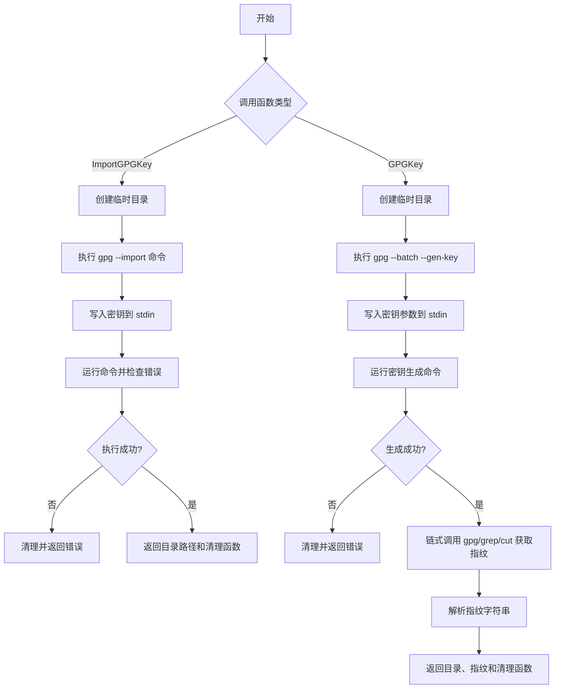
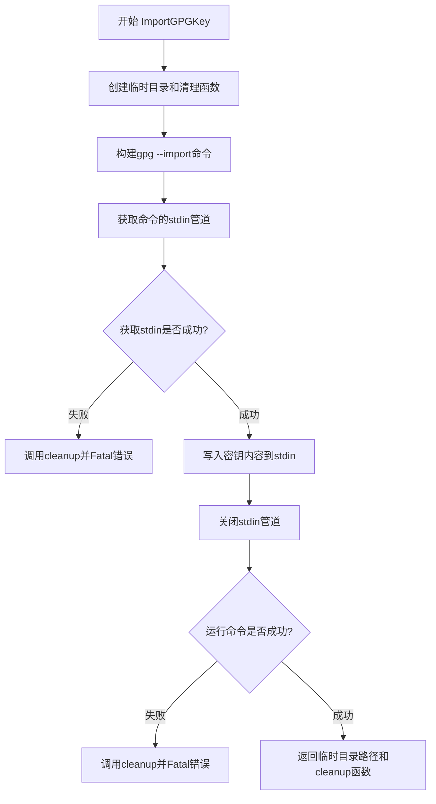
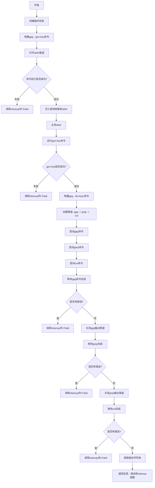

# `flux\pkg\gpg\gpgtest\gpg.go` 详细设计文档

这是一个 GPG 测试辅助包，用于在测试环境中创建和导入 GPG 密钥。它提供两个核心函数：一个用于将现有的 GPG 密钥导入到临时目录，另一个用于生成新的 DSA 密钥对并提取其指纹。该包主要服务于 Flux 项目在 Kubernetes 测试中的 GPG 签名验证需求。

## 整体流程



## 类结构

```
无类定义 (Go 过程式代码)
└── 工具函数包
    ├── ImportGPGKey (导入GPG密钥)
    └── GPGKey (创建GPG密钥对)
```

## 全局变量及字段


### `stdin`
    
GPG命令的标准输入，用于写入密钥数据

类型：`io.WriteCloser`
    


### `newDir`
    
临时GPG主目录路径，用于隔离GPG操作环境

类型：`string`
    


### `fingerprint`
    
生成密钥的指纹，用于唯一标识GPG密钥

类型：`string`
    


### `cleanup`
    
资源清理函数，用于删除临时目录和释放资源

类型：`func()`
    


### `gpgCmd`
    
gpg列表密钥命令，用于获取密钥信息

类型：`*exec.Cmd`
    


### `grepCmd`
    
grep过滤命令，用于提取fpr开头的行

类型：`*exec.Cmd`
    


### `cutCmd`
    
cut提取字段命令，用于从grep输出中提取指纹字段

类型：`*exec.Cmd`
    


### `grepIn, gpgOut`
    
gpg到grep的管道，用于连接gpg命令输出到grep命令输入

类型：`io.Pipe`
    


### `cutIn, grepOut`
    
grep到cut的管道，用于连接grep命令输出到cut命令输入

类型：`io.Pipe`
    


### `cutOut`
    
最终输出缓冲区，用于存储提取的指纹字符串

类型：`bytes.Buffer`
    


    

## 全局函数及方法


### `ImportGPGKey`

该函数用于将GPG密钥导入到临时创建的GPG主目录中，并返回该目录路径及对应的清理函数，以便在测试结束后释放资源。

参数：

- `t`：`*testing.T`，Go测试框架的测试对象，用于报告测试失败
- `key`：`string`，要导入的GPG密钥内容（ASCII armored格式）

返回值：`(string, func())`，返回GPG主目录路径和清理函数，清理函数用于删除临时目录

#### 流程图



#### 带注释源码

```go
// ImportGPGKey imports a gpg key into a temporary home directory. It returns
// the gpg home directory and a cleanup function to be called after the caller
// is finished with this key.
// ImportGPGKey 将GPG密钥导入到临时主目录中。它返回GPG主目录和
// 在调用方使用完密钥后调用的清理函数。
func ImportGPGKey(t *testing.T, key string) (string, func()) {
	// 创建临时目录并获取清理函数
	// testfiles.TempDir 创建一个临时目录用于GPG操作
	newDir, cleanup := testfiles.TempDir(t)

	// 构建gpg命令：--homedir指定GPG主目录，--import导入密钥
	// 使用"-"作为标准输入的标记
	cmd := exec.Command("gpg", "--homedir", newDir, "--import", "--")

	// 获取命令的标准输入管道，用于写入密钥内容
	stdin, err := cmd.StdinPipe()
	if err != nil {
		// 如果获取stdin失败，立即清理并报告致命错误
		cleanup()
		t.Fatal(err)
	}
	
	// 将密钥内容写入stdin
	io.WriteString(stdin, key)
	
	// 关闭stdin管道以通知GPG输入结束
	stdin.Close()

	// 执行GPG导入命令
	if err := cmd.Run(); err != nil {
		// 如果导入失败，清理临时目录并报告致命错误
		cleanup()
		t.Fatal(err)
	}

	// 成功导入后，返回临时目录路径和清理函数
	return newDir, cleanup
}
```


### `GPGKey`

该函数用于在临时目录中创建一个新的GPG密钥对（使用DSA算法），并从生成的密钥中提取指纹信息返回给调用者。

参数：

- `t`：`*testing.T`，测试框架的T对象，用于报告错误和创建临时目录

返回值：

- `string`，GPG home目录路径
- `string`，生成的GPG密钥指纹（Fingerprint）
- `func()`，清理函数，用于删除临时目录和释放资源

#### 流程图



#### 带注释源码

```go
// GPGKey creates a new, temporary GPG home directory and a public/private key
// pair. It returns the GPG home directory, the ID of the created key, and a
// cleanup function to be called after the caller is finished with this key.
// Since GPG uses /dev/random, this may block while waiting for entropy to
// become available.
func GPGKey(t *testing.T) (string, string, func()) {
	// 步骤1: 创建临时目录，返回目录路径和清理函数
	newDir, cleanup := testfiles.TempDir(t)

	// 步骤2: 构建gpg密钥生成命令，使用临时目录作为GPG home
	cmd := exec.Command("gpg", "--homedir", newDir, "--batch", "--gen-key")

	// 步骤3: 获取stdin管道用于写入密钥参数
	stdin, err := cmd.StdinPipe()
	if err != nil {
		cleanup()
		t.Fatal(err)
	}

	// 步骤4: 写入密钥配置参数（DSA算法，1024位，用于签名）
	io.WriteString(stdin, "Key-Type: DSA\n")
	io.WriteString(stdin, "Key-Length: 1024\n")
	io.WriteString(stdin, "Key-Usage: sign\n")
	io.WriteString(stdin, "Name-Real: Flux\n")
	io.WriteString(stdin, "Name-Email: flux@weave.works\n")
	io.WriteString(stdin, "%no-protection\n")
	stdin.Close()

	// 步骤5: 执行密钥生成命令
	if err := cmd.Run(); err != nil {
		cleanup()
		t.Fatal(err)
	}

	// 步骤6: 构建命令链获取密钥指纹
	// gpg --list-keys --with-colons --with-fingerprint 输出密钥信息
	// grep ^fpr 过滤出指纹行
	// cut -d: -f10 提取第10个字段（指纹值）
	gpgCmd := exec.Command("gpg", "--homedir", newDir, "--list-keys", "--with-colons", "--with-fingerprint")
	grepCmd := exec.Command("grep", "^fpr")
	cutCmd := exec.Command("cut", "-d:", "-f10")

	// 步骤7: 创建管道连接: gpgCmd -> grepCmd -> cutCmd
	grepIn, gpgOut := io.Pipe()
	cutIn, grepOut := io.Pipe()
	var cutOut bytes.Buffer

	// 设置命令的输入输出
	gpgCmd.Stdout = gpgOut
	grepCmd.Stdin, grepCmd.Stdout = grepIn, grepOut
	cutCmd.Stdin, cutCmd.Stdout = cutIn, &cutOut

	// 步骤8: 启动所有命令
	gpgCmd.Start()
	grepCmd.Start()
	cutCmd.Start()

	// 步骤9: 等待gpg命令完成并检查错误
	if err := gpgCmd.Wait(); err != nil {
		cleanup()
		t.Fatal(err)
	}
	gpgOut.Close() // 关闭输出管道，通知下游数据已写完

	// 步骤10: 等待grep命令完成并检查错误
	if err := grepCmd.Wait(); err != nil {
		cleanup()
		t.Fatal(err)
	}
	grepOut.Close()

	// 步骤11: 等待cut命令完成并检查错误
	if err := cutCmd.Wait(); err != nil {
		cleanup()
		t.Fatal(err)
	}

	// 步骤12: 提取并清理指纹字符串，返回结果
	fingerprint := strings.TrimSpace(cutOut.String())
	return newDir, fingerprint, cleanup
}
```

## 关键组件


### GPG密钥导入功能

负责将现有的GPG密钥导入到临时目录中，包含管道创建、命令执行和错误处理逻辑。

### GPG密钥生成功能

负责创建新的DSA密钥对，配置密钥参数（类型、长度、用途等），并通过管道提取指纹信息。

### 临时目录管理

使用testfiles.TempDir创建临时GPG主目录，并提供清理函数确保资源正确释放。

### 命令管道处理

通过io.Pipe连接多个外部命令（gpg、grep、cut），实现数据的流式处理和过滤。

### 错误处理与资源清理

统一的错误处理模式，任何命令执行失败都会调用cleanup()函数进行资源清理，并通过t.Fatal报告错误。


## 问题及建议


### 已知问题

- **错误处理与测试框架强耦合**：函数直接使用`t.Fatal()`终止测试，导致这些实用函数无法在非测试环境中复用，违反了关注点分离原则
- **硬编码的密钥参数**：GPG密钥的类型（DSA）、长度（1024）、名称（Flux）、邮箱（flux@weave.works）和无保护选项均硬编码，扩展性差
- **缺乏超时机制**：GPG密钥生成使用`/dev/random`可能长期阻塞，没有任何超时控制，可能导致测试无限等待
- **资源清理代码重复**：每个错误分支都显式调用`cleanup()`，代码冗余且容易遗漏
- **管道命令的错误处理不完善**：`gpgCmd`、`grepCmd`、`cutCmd`的错误处理顺序和机制存在问题，可能导致管道另一端的协程永久阻塞（虽然此处因为使用了io.Pipe且手动关闭了写端，风险较低，但写法不够安全）
- **无上下文支持**：无法取消正在进行的GPG操作（生成或导入密钥）
- **使用io.WriteString效率低**：连续多次调用`io.WriteString`写入stdin，每次都有系统调用开销

### 优化建议

- **参数化密钥配置**：将密钥参数提取为结构体或配置参数，允许调用者自定义密钥类型、长度、用户信息等
- **引入context.Context**：支持超时和取消操作，改善长时间运行的GPG命令的可控性
- **使用t.Fatal还是返回error的设计决策**：根据实际使用场景，如果仅用于测试则保持当前设计，否则应返回error
- **使用bufio.Writer包装stdin**：减少系统调用次数，提高写入性能
- **封装资源清理逻辑**：使用defer或更安全的cleanup模式，避免重复调用cleanup
- **添加超时参数**：为`GPGKey`函数添加可选的timeout参数，防止密钥生成无限等待
- **考虑使用--passphrase选项的替代方案**：当前使用`%no-protection`，在实际场景中可能需要支持加密密钥


## 其它


### 设计目标与约束

本代码的核心设计目标是为 Flux 项目的 GPG 相关功能提供可靠的测试基础设施支持。具体目标包括：1) 创建隔离的 GPG 测试环境，避免影响主机系统；2) 提供临时密钥生成和导入的便捷方法；3) 确保测试完成后资源被正确清理。约束条件包括：依赖系统安装的 gpg 命令行工具、使用 /dev/random 可能导致阻塞（特别是在容器环境中）、仅支持 DSA/ElGamal 密钥类型、密钥生成在低熵环境中可能失败。

### 错误处理与异常设计

错误处理采用 Go 标准的错误传播模式。所有可能失败的操作为都会立即检查错误并调用 cleanup() 清理已分配资源，然后通过 t.Fatal() 终止测试。主要错误场景包括：gpg 命令执行失败（Run() 返回非 nil）、管道创建失败（StdinPipe() 返回错误）、子进程非正常退出、以及在读取密钥指纹时 grep/cut 命令的异常。cleanup() 函数本身不返回错误，因为它是清理操作而非业务逻辑。若 cleanup() 本身失败，资源泄漏是唯一后果，当前设计未处理此边缘情况。

### 数据流与状态机

ImportGPGKey 的数据流为：测试代码提供密钥字符串 → 创建临时目录 → 执行 gpg --import 命令 → 通过 stdinPipe 写入密钥数据 → 关闭 stdin 等待命令完成 → 返回目录路径和清理函数。GPGKey 的数据流更复杂：创建临时目录 → 执行 gpg --gen-key 生成密钥 → 构造管道（gpg --list-keys | grep "^fpr" | cut -d: -f10）提取指纹 → 返回目录路径、指纹字符串和清理函数。状态机方面，密钥生成过程经历：目录创建 → 进程启动 → 交互式输入 → 密钥材料生成 → 密钥环更新 → 指纹提取 → 完成共6个状态。

### 外部依赖与接口契约

外部依赖包括：1) gpg 命令行工具（系统级依赖，必须预装）；2) testfiles.TempDir(t) 函数来自 github.com/fluxcd/flux/pkg/cluster/kubernetes/testfiles 包；3) Go 标准库：bytes、io、os/exec、strings；4) testing 包（测试框架依赖）。接口契约方面：ImportGPGKey 接收任意字符串格式的 GPG 密钥（标准 ASCII armored 或二进制格式），返回 GPG home 目录路径和清理函数；GPGKey 不接收参数，返回 home 目录、密钥指纹（40字符十六进制字符串）和清理函数。调用方必须确保在测试结束后调用清理函数，否则临时目录将泄漏。

### 性能考虑与基准

性能特征表现为：密钥生成是显著的性能瓶颈，受 /dev/random 熵源可用性影响，在虚拟机和容器中可能等待数十秒；临时目录创建和密钥导入相对快速（毫秒级）；管道处理指纹仅涉及文本操作，开销可忽略。优化建议包括：考虑使用 --quick-random 标志用于非安全关键测试、为高频测试场景实现密钥缓存机制、或使用预生成的测试密钥材料而非每次动态生成。

### 安全考虑

安全方面的设计权衡包括：使用 %no-protection 选项生成的密钥无 passphrase 保护，仅适用于测试环境；临时目录权限取决于系统 umask 设置，建议在生产测试环境中显式设置目录权限为 0700；密钥材料通过 stdin 传递，命令行参数中不出现敏感数据，但进程列表中可能看到命令行片段；测试完成后通过 cleanup() 同步删除临时目录和其中内容。

### 并发与线程安全

该代码本身不涉及并发goroutine的直接管理，但通过 testing.T 参数隐式依赖测试框架的串行执行保证。cleanup() 函数可被多次调用（设计为幂等或可安全重复调用），因为它执行目录删除操作，多次删除同目录会失败但不影响测试结果。潜在的并发问题出现在：如果多个测试并行运行且共享临时目录（目前通过 t.Name() 隔离但未显式验证），需要确保测试框架正确隔离各测试的临时目录。

### 版本兼容性

版本兼容性考虑包括：GPG 2.1+ 版本行为可能有差异（特别是密钥存储格式）；DSA 1024 位密钥已被视为弱算法，现代 GPG 可能拒绝生成或发出警告；testfiles 包的具体 API 可能随 Flux 项目版本变化；Go 1.17+ 版本的 io.WriteString 行为一致，无兼容性问题。建议在 CI 环境中锁定 GPG 版本，并记录最低 Go 版本要求（应为 Go 1.11+ 以支持 modules）。

### 配置管理

该代码不涉及显式配置文件，所有配置通过代码中的硬编码值实现（如密钥类型 "DSA"、密钥长度 1024、名称 "Flux"、邮箱 "flux@weave.works"）。如需自定义，可通过函数参数扩展配置选项，或在包级别定义配置结构体供调用方修改。当前这种"固定配置"方式适合测试目的，但缺乏灵活性是潜在的可改进点。

### 监控与可观测性

当前代码缺乏内置的可观测性支持。gpg 命令的标准错误输出未被捕获或记录，可能导致问题排查困难。建议改进包括：在 t.Log() 中记录关键操作步骤（创建目录、执行命令、提取指纹）；捕获并记录 gpg 命令的 stderr 输出用于调试；考虑添加环境变量控制日志详细程度。由于这是测试辅助代码，生产监控不适用，但测试失败时的诊断信息对开发者体验很重要。

### 异常情况与边界处理

需要考虑的边界情况包括：1) 系统未安装 gpg 命令 - 当前会直接返回 exec.ErrNotFound，建议添加预检查并提供清晰的错误信息；2) 磁盘空间不足导致临时目录创建失败；3) GPG 版本过旧导致不支持某些选项；4) 密钥生成过程中用户中断（signal handling）；5) 临时目录路径过长（路径长度限制）；6) 容器环境中 /dev/random 不可用导致阻塞（建议使用 --quick-random 或配置 gpg-rnd-random）。当前代码通过 t.Fatal() 简单终止测试，更健壮的设计可能需要区分可重试错误和致命错误。


    