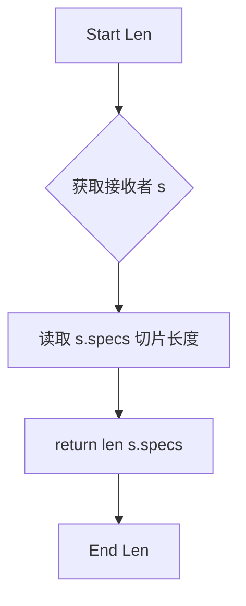

# `flux\pkg\http\accept.go` 详细设计文档

这是一个HTTP内容类型协商模块，通过解析客户端请求的Accept头部，结合服务器支持的可用内容类型列表，按照质量参数(q值)和偏好顺序选择最合适的返回内容类型。

## 整体流程

```mermaid
graph TD
A[开始: negotiateContentType] --> B{解析Accept头部}
B --> C{Accept头部是否为空?}
C -- 是 --> D[返回首选内容类型 orderedPref[0]]
C -- 否 --> E{筛选匹配的类型}
E --> F{是否有匹配的类型?}
F -- 否 --> G[返回空字符串]
F -- 是 --> H[按质量参数和偏好排序]
H --> I[返回最佳匹配类型 preferred[0].Value]
H --> J[排序调用 Less 方法]
J --> K{比较Q值}
K -- Q值相等 --> L[按偏好顺序比较]
K -- Q值不等 --> M[按Q值降序排列]
```

## 类结构

```
SortAccept (实现sort.Interface的结构体)
└── 方法: Len(), Less(i,j int), Swap(i,j int)
```

## 全局变量及字段


### `indexOf`
    
在字符串切片中查找指定字符串的索引，如果未找到返回切片长度

类型：`func(ss []string, search string) int`
    


### `SortAccept.specs`
    
解析后的Accept规范列表

类型：`[]header.AcceptSpec`
    


### `SortAccept.prefs`
    
可用的内容类型偏好列表

类型：`[]string`
    
    

## 全局函数及方法


### `negotiateContentType`

该函数根据HTTP请求的Accept头部与提供的可用内容类型列表进行内容协商，按照质量参数（q值）优先级和偏好顺序返回最佳匹配的内容类型。

参数：

- `r`：`*http.Request`，HTTP请求对象，用于获取请求头中的Accept字段
- `orderedPref`：`[]string`，可用的内容类型列表，按优先级排序（第一个元素优先级最高）

返回值：`string`，协商后的内容类型，如果没有任何匹配则返回空字符串

#### 流程图

```mermaid
flowchart TD
    A[开始 negotiateContentType] --> B[解析Accept头部: header.ParseAccept]
    B --> C{len(specs) == 0?}
    C -->|是| D[返回 orderedPref[0]]
    C -->|否| E[遍历每个Accept规格]
    E --> F{spec.Value在orderedPref中?}
    F -->|是| G[添加到preferred列表]
    F -->|否| H[跳过]
    G --> E
    H --> E
    E --> I{len(preferred) > 0?}
    I -->|否| J[返回空字符串]
    I -->|是| K[排序: SortAccept]
    K --> L[返回 preferred[0].Value]
    D --> M[结束]
    J --> M
    L --> M
```

#### 带注释源码

```go
// negotiateContentType picks a content type based on the Accept
// header from a request, and a supplied list of available content
// types in order of preference. If the Accept header mentions more
// than one available content type, the one with the highest quality
// (`q`) parameter is chosen; if there are a number of those, the one
// that appears first in the available types is chosen.
func negotiateContentType(r *http.Request, orderedPref []string) string {
    // 步骤1: 解析请求的Accept头部，获取所有媒体类型规格
    specs := header.ParseAccept(r.Header, "Accept")
    
    // 步骤2: 如果没有Accept头部（即客户端没有指定偏好），返回默认首选
    if len(specs) == 0 {
        return orderedPref[0]
    }

    // 步骤3: 过滤出服务器支持的内容类型
    // 遍历所有Accept规格，筛选出在orderedPref中存在的类型
    preferred := []header.AcceptSpec{}
    for _, spec := range specs {
        // indexOf返回spec.Value在orderedPref中的索引，如果不存在则返回len(orderedPref)
        if indexOf(orderedPref, spec.Value) < len(orderedPref) {
            preferred = append(preferred, spec)
        }
    }
    
    // 步骤4: 如果有匹配的内容类型，按优先级排序后返回最佳匹配
    if len(preferred) > 0 {
        // 使用自定义排序: 按质量参数降序，同质量按偏好顺序
        sort.Sort(SortAccept{preferred, orderedPref})
        return preferred[0].Value
    }
    
    // 步骤5: 没有匹配，返回空字符串
    return ""
}

// SortAccept 结构体用于自定义排序
// 实现了sort.Interface接口（Len, Less, Swap）
type SortAccept struct {
    specs []header.AcceptSpec  // 解析后的Accept规格列表
    prefs []string             // 服务器支持的内容类型偏好顺序
}

func (s SortAccept) Len() int {
    return len(s.specs)
}

// Less 实现按质量参数降序排序，同质量则按偏好顺序排序
func (s SortAccept) Less(i, j int) bool {
    switch {
    // 质量参数相同时，按偏好顺序（索引小优先）
    case s.specs[i].Q == s.specs[j].Q:
        return indexOf(s.prefs, s.specs[i].Value) < indexOf(s.prefs, s.specs[j].Value)
    // 质量参数不同时，按质量参数降序（高优先级在前）
    default:
        return s.specs[i].Q > s.specs[j].Q
    }
}

func (s SortAccept) Swap(i, j int) {
    s.specs[i], s.specs[j] = s.specs[j], s.specs[i]
}

// indexOf 在字符串切片中查找指定字符串的索引
// 如果未找到，返回切片长度（用于排序时的比较逻辑）
func indexOf(ss []string, search string) int {
    for i, s := range ss {
        if s == search {
            return i
        }
    }
    return len(ss)
}
```


### `indexOf`

该函数用于在字符串切片中线性查找指定字符串，返回其索引位置；若未找到，则返回切片的长度值，这一设计使其可直接用于排序比较逻辑。

参数：

- `ss`：`[]string`，要进行搜索的字符串切片
- `search`：`string`，要查找的目标字符串

返回值：`int`，找到时返回目标字符串首次出现的索引（从0开始）；未找到时返回切片的长度（即 `len(ss)`）

#### 流程图

```mermaid
flowchart TD
    A[开始 indexOf] --> B{遍历索引 i 从 0 到 len(ss)-1}
    B --> C{ss[i] == search?}
    C -->|是| D[返回索引 i]
    C -->|否| E{还有更多元素?}
    E -->|是| B
    E -->|否| F[返回 len(ss)]
    D --> G[结束]
    F --> G
```

#### 带注释源码

```go
// indexOf 在字符串切片中线性查找指定字符串，返回其索引位置。
// 若未找到，则返回切片长度 len(ss)，这种设计便于直接用于排序比较逻辑
//（因为 "-1" 表示"未找到"会被排序到已找到条目之前，而 len(ss) 则不会）。
func indexOf(ss []string, search string) int {
    // 遍历字符串切片
    for i, s := range ss {
        // 如果找到匹配的字符串，返回其索引
        if s == search {
            return i
        }
    }
    // 未找到时返回切片长度
    return len(ss)
}
```


### `SortAccept.Len`

该方法实现了 Go 标准库 `sort.Interface` 接口的 `Len()` 方法，用于返回可接受内容类型规范列表的长度，以便排序算法能够确定待排序元素的数量。

参数： 无（仅接收者 `s SortAccept`）

返回值：`int`，返回规范列表（specs 切片）的长度

#### 流程图



#### 带注释源码

```go
// Len 是 sort.Interface 接口所需的方法之一
// 返回 s.specs 切片的长度，用于排序算法确定待排序元素的数量
// 参数：无（仅使用接收者 s）
// 返回值：int 类型，表示可接受内容类型规范列表中的元素个数
func (s SortAccept) Len() int {
	return len(s.specs) // 返回 specs 切片的长度
}
```


### `SortAccept.Less`

比较两个规范的质量参数（Q值）和偏好顺序，确定在排序中哪个元素应该排在前面。该方法实现了 Go 语言 `sort.Interface` 接口的 `Less` 方法，按降序排列：先按质量参数从高到低排序，若质量参数相同则按偏好顺序靠前的优先。

参数：

- `i`：`int`，第一个要比较的元素的索引
- `j`：`int`，第二个要比较的元素的索引

返回值：`bool`，如果索引 `i` 对应的元素比索引 `j` 对应的元素更适合（质量参数更高或偏好顺序更靠前），返回 `true`；否则返回 `false`

#### 流程图

```mermaid
flowchart TD
    A[开始: Less i, j] --> B{specs[i].Q == specs[j].Q?}
    B -->|是| C[比较偏好顺序]
    B -->|否| D[比较质量参数]
    C --> E[return indexOf s.prefs, s.specs[i].Value < indexOf s.prefs, s.specs[j].Value]
    D --> F[return specs[i].Q > specs[j].Q]
    E --> G[返回比较结果]
    F --> G
    G[结束]
```

#### 带注释源码

```go
// Less 比较两个规范的质量参数和偏好顺序
// 实现 sort.Interface 接口，用于自定义排序
// 参数 i, j 表示要比较的两个元素的索引
func (s SortAccept) Less(i, j int) bool {
	// 当两个 Accept 规范的质量参数（Q 值）相同时
	// 需要根据偏好顺序来确定优先级
	switch {
	case s.specs[i].Q == s.specs[j].Q:
		// 质量参数相等时，优先选择偏好列表中更靠前的类型
		// indexOf 返回值越小表示越偏好
		// 所以返回值越小应该排在前面（返回 true）
		return indexOf(s.prefs, s.specs[i].Value) < indexOf(s.prefs, s.specs[j].Value)
	default:
		// 质量参数不同时，质量参数高的优先
		// 降序排列：大的在前面
		return s.specs[i].Q > s.specs[j].Q
	}
}
```


### `SortAccept.Swap`

交换排序接受规范结构体中的两个元素的位置，实现 sort 接口的 Swap 方法用于元素交换。

参数：

- `i`：`int`，第一个要交换元素的索引
- `j`：`int`，第二个要交换元素的索引

返回值：`void`（无返回值），无返回值描述

#### 流程图

```mermaid
flowchart TD
    A[开始 Swap] --> B{检查索引有效性}
    B -->|索引有效| C[将 specs[i] 赋值给临时变量]
    C --> D[将 specs[j] 赋值给 specs[i]]
    D --> E[将临时变量赋值给 specs[j]]
    E --> F[结束 Swap]
    
    B -->|索引无效| F
    
    style C fill:#e1f5fe
    style D fill:#e1f5fe
    style E fill:#e1f5fe
```

#### 带注释源码

```go
// Swap 实现了 sort.Interface 接口的 Swap 方法
// 用于交换切片中两个指定位置的元素
// 参数 i 和 j 是要交换的元素索引
func (s SortAccept) Swap(i, j int) {
	// 交换 specs 切片中索引 i 和 j 的位置
	// 使用 Go 语言的多重赋值特性进行交换
	s.specs[i], s.specs[j] = s.specs[j], s.specs[i]
}
```

## 关键组件


### negotiateContentType 函数

根据 HTTP 请求的 Accept 头部和提供的可用内容类型偏好列表，通过解析 Accept 头部的质量参数（q）并按优先级排序，选择最合适的内容类型返回。

### SortAccept 结构体

用于封装待排序的 Accept 规范列表和偏好顺序列表，实现了 sort.Interface 接口的 Len、Less、Swap 三个方法，支持按质量参数降序和偏好顺序自定义排序。

### Len 方法

返回待排序的 Accept 规范切片的长度，为 sort.Interface 接口必需方法。

### Less 方法

实现自定义比较逻辑：优先按质量参数（Q）降序排序；若质量参数相同，则按偏好顺序列表中出现的索引升序排序，确保更高质量且更偏好类型排在前面。

### Swap 方法

交换切片中两个指定位置的元素，为 sort.Interface 接口必需方法。

### indexOf 辅助函数

在字符串切片中查找指定字符串，返回其索引值；若未找到则返回切片长度，这种返回值设计可直接用于排序比较逻辑。


## 问题及建议


### 已知问题

- **空切片访问 panic 风险**：`negotiateContentType` 函数在 `specs` 为空时直接返回 `orderedPref[0]`，若 `orderedPref` 为空切片将导致数组越界 panic
- **线性搜索性能瓶颈**：`indexOf` 函数使用 O(n) 线性遍历，在排序比较中会被频繁调用（`Less` 方法每 次比较都调用），当 `orderedPref` 较长时会显著影响性能
- **排序计算重复**：在 `SortAccept.Less` 方法中，每次比较都调用 `indexOf` 计算位置，没有缓存结 果，导致重复计算
- **边界情况返回值不明确**：当没有匹配的内容类型时返回空字符串 `""`，调用方需要额外判断和处理 这种情况，缺乏明确的错误或默认行为说明

### 优化建议

- **增加空切片保护**：在函数开头增加 `orderedPref` 长度检查，为空时返回错误或合理的默认值
- **使用 map 缓存索引**：将 `orderedPref` 转换为 `map[string]int` 存储索引，将 `indexOf` 查询优化 为 O(1) 复杂度
- **预计算排序权重**：在 `SortAccept` 初始化时为每个 spec 预计算好质量因子和偏好索引的组合权重， 排序时直接比较权重值，避免重复计算
- **明确返回值语义**：考虑返回明确的结果（如 error 或额外的布尔值），或在使用处增加对空字符串 的处理逻辑

## 其它


### 设计目标与约束

本模块的设计目标是实现HTTP内容类型协商功能，根据客户端请求的Accept头从预定义的内容类型列表中选择最合适的响应格式。约束条件包括：只支持标准的HTTP Accept头格式，支持质量参数(q值)排序，优先考虑客户端偏好而非服务端配置。

### 错误处理与异常设计

本模块的错误处理采用防御式编程策略。当Accept头解析失败或无可用内容类型时，返回预定义的第一个内容类型作为默认值。空Accept头返回orderedPref[0]，无可匹配内容类型时返回空字符串。模块不抛出异常，所有边界情况通过返回值处理。

### 数据流与状态机

数据流处理流程如下：
1. 接收HTTP请求和可用内容类型列表
2. 解析请求的Accept头
3. 过滤出可用的Accept规格
4. 根据质量参数和偏好顺序排序
5. 返回最优内容类型

状态机包含三个状态：初始化状态（解析Accept头）→ 过滤状态（匹配可用内容类型）→ 选择状态（排序并返回结果）。

### 外部依赖与接口契约

外部依赖：
- "net/http"：HTTP请求处理
- "sort"：排序接口实现
- "github.com/golang/gddo/httputil/header"：Accept头解析

接口契约：
- negotiateContentType函数：接收*http.Request和[]string类型参数，返回string类型
- SortAccept类型：实现sort.Interface接口（Len、Less、Swap方法）
- indexOf函数：接收[]string和string参数，返回int类型

### 性能考虑

性能优化点：indexOf函数使用线性搜索，适合短切片场景。对于频繁调用场景，可考虑缓存结果或使用map替代切片。排序算法使用Go标准库sort，属于O(n log n)复杂度。内存分配主要集中在preferred切片，可通过预分配内存优化。

### 安全性考虑

本模块主要处理HTTP头信息，需注意：
- Accept头可能包含恶意构造的超长字符串
- 需对header.ParseAccept的输入进行长度限制
- 返回空字符串时应确保调用方有默认处理逻辑
- 不应直接信任客户端提供的内容类型值

### 测试策略

建议测试用例包括：
- 空Accept头场景
- 单个可匹配内容类型
- 多个内容类型带质量参数
- 相同质量参数不同偏好顺序
- 不可匹配的Accept头
- 特殊字符和边界值
- 大小写敏感性测试

### 使用示例

```go
// 基础用法
handler := http.HandlerFunc(func(w http.ResponseWriter, r *http.Request) {
    contentType := negotiateContentType(r, []string{"application/json", "text/html", "text/plain"})
    w.Header().Set("Content-Type", contentType)
})

// 带默认值的用法
func getContentType(r *http.Request) string {
    result := negotiateContentType(r, []string{"application/json", "text/html"})
    if result == "" {
        return "application/json" // 默认值
    }
    return result
}
```

### 版本变更记录

- v1.0.0：初始版本，实现基础的Accept头协商功能
- 优化indexOf函数返回len值而非-1，简化排序逻辑

### 参考文献

- RFC 7231 Section 5.3.2: Accept
- Go standard library: net/http, sort
- gddo/httputil header package documentation


    