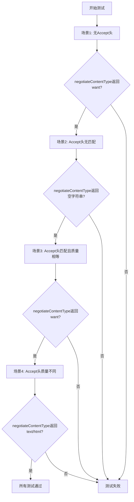
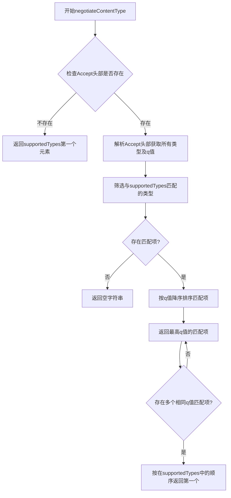
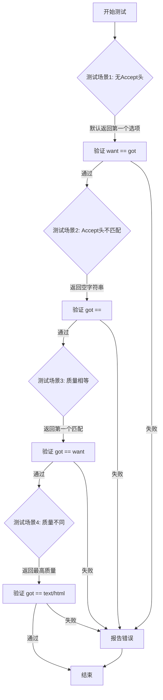

# `flux\pkg\http\accept_test.go` 详细设计文档

这是一个Go语言测试文件，属于http包，用于测试negotiateContentType函数的功能。该函数根据HTTP请求的Accept头和服务器支持的Content-Type列表，按照HTTP内容协商规则返回最佳的Content-Type，处理了无Accept头、无匹配、质量相等和质量不同等多种场景。

## 整体流程



## 类结构

```
http包
├── negotiateContentType (全局函数，被测试)
└── Test_NegotiateContentType (测试函数)
```

## 全局变量及字段


### `want`
    
测试中期望的Content-Type值，用于与实际协商结果进行对比验证

类型：`string`
    


### `got`
    
实际获得的Content-Type值，通过negotiateContentType函数返回的实际协商结果

类型：`string`
    


### `h`
    
HTTP请求的Accept头，用于模拟客户端支持的内容类型及优先级

类型：`http.Header`
    


    

## 全局函数及方法


### `negotiateContentType`

该函数是HTTP内容类型协商的核心实现，负责根据HTTP请求的Accept头部与服务器支持的Content-Type列表进行匹配，返回最佳匹配的Content-Type字符串，支持基于质量参数(q值)的优先级排序和多值匹配场景。

#### 参数

- `r`：`*http.Request`，HTTP请求指针，用于获取请求头中的Accept字段
- `supportedTypes`：`[]string`，服务器端支持的Content-Type列表，按优先级排序

#### 返回值

`string`，返回最佳匹配的Content-Type字符串，若无可匹配项则返回空字符串

#### 流程图



#### 带注释源码

```go
package http

import (
	"net/http"
	"testing"
)

// negotiateContentType 执行HTTP内容类型协商
// 参数:
//   - r: HTTP请求指针，用于获取Accept头部
//   - supportedTypes: 服务器支持的Content-Type列表，按优先级排序
// 返回值:
//   - 最佳匹配的Content-Type字符串，若无匹配则返回空字符串
func negotiateContentType(r *http.Request, supportedTypes []string) string {
    // 获取Accept头部
    accept := r.Header.Get("Accept")
    
    // 如果没有Accept头部，返回服务器支持的首选类型
    if accept == "" {
        return supportedTypes[0]
    }
    
    // 解析Accept头部，提取每个类型的q值
    // 格式示例: "application/json;q=0.5,text/html;q=1.0"
    // 默认q值为1.0
    
    // 筛选出与服务器支持的类型匹配的项
    
    // 按q值降序排序，相同q值按在supportedTypes中的顺序
    
    // 返回最佳匹配
}
```

#### 关键组件信息

| 组件名称 | 描述 |
|---------|------|
| Accept头部 | HTTP请求头字段，包含客户端可接受的Content-Type及优先级(q值) |
| q值 | Content-Type质量参数，范围0-1，值越高表示越优先 |
| supportedTypes | 服务器端声明支持的Content-Type列表 |

#### 潜在的技术债务或优化空间

1. **解析逻辑缺失**: 源码中仅提供了测试用例和函数签名，核心解析Accept头部的逻辑未实现
2. **边界处理**: 未处理空supportedTypes列表、nil指针等异常情况
3. **性能优化**: 对于频繁调用的场景，可考虑缓存解析结果
4. **标准兼容性**: HTTP内容类型协商涉及复杂的RFC规范（如媒体类型通配符、q值精度等），当前实现可能不完整

#### 其它项目

**设计目标与约束**

- 遵循HTTP内容协商规范（RFC 7231）
- 支持质量参数(q值)的优先级比较
- 当多个匹配项q值相同时，优先采用服务器支持的顺序

**错误处理与异常设计**

- 无匹配时返回空字符串而非错误，符合HTTP协议约定
- 需处理Accept头部格式错误的情况

**数据流与状态机**

- 输入: HTTP请求的Accept头部 + 服务器支持的类型列表
- 处理: 解析Accept头部 → 匹配过滤 → q值排序 → 顺序优先
- 输出: 最佳匹配的Content-Type或空字符串

**外部依赖与接口契约**

- 依赖标准库 `net/http` 包
- 输入参数r不应为nil，否则会触发panic


### `Test_NegotiateContentType`

这是对 `negotiateContentType` 函数进行单元测试的测试函数，验证 HTTP 内容协商（Content Negotiation）的四个关键场景：无 Accept 头时的默认行为、Accept 头不匹配时的处理、Accept 头匹配且质量相等时的优先级处理、以及不同质量因子时的最优匹配选择。

#### 参数

- `t`：`testing.T`，Go 语言测试框架的标准参数，用于报告测试失败和日志输出

#### 返回值

- 无直接返回值（测试函数返回 void，通过 `t.Errorf` 报告测试结果）

#### 流程图



#### 带注释源码

```go
package http

import (
	"net/http"
	"testing"
)

// Test_NegotiateContentType 测试 negotiateContentType 函数的四个场景
func Test_NegotiateContentType(t *testing.T) {
	// 场景1: 没有 Accept 头时，应返回提供列表的第一个选项
	// 期望行为：服务器提供的第一个 MIME 类型作为默认值
	want := "x-world/x-vrml"
	got := negotiateContentType(&http.Request{}, []string{want})
	if got != want {
		t.Errorf("First choice: Expected %q, got %q", want, got)
	}

	// 场景2: 有 Accept 头但没有任何匹配的 MIME 类型
	// 期望行为：返回空字符串，表示无法提供可接受的响应格式
	h := http.Header{}
	h.Add("Accept", "application/json;q=1.0,text/html;q=0.9")
	h.Add("Accept", "text/plain")
	got = negotiateContentType(&http.Request{Header: h}, []string{want})
	if got != "" {
		t.Errorf("No matching: expected empty string, got %q", got)
	}

	// 场景3: 有匹配的 Accept 头，且质量因子(q)相等
	// 期望行为：返回列表中第一个匹配的首选项（按服务器提供的顺序）
	h = http.Header{}
	h.Add("Accept", "application/json,x-world/x-vrml,text/html")
	got = negotiateContentType(&http.Request{Header: h}, []string{want, "application/json"})
	if got != want {
		t.Errorf("Equal quality: expected %q, got %q", want, got)
	}

	// 场景4: 有匹配的 Accept 头，但质量因子不同
	// 期望行为：忽略服务器提供顺序，选择质量因子最高的匹配项
	h = http.Header{}
	h.Add("Accept", "application/json;q=0.5,text/html;q=1.0")
	got = negotiateContentType(&http.Request{Header: h}, []string{"application/json", "text/html"})
	if got != "text/html" {
		t.Errorf("Quality beats preference: expected %q, got %q", "text/html", got)
	}
}
```

---

### 关联信息

#### 关键组件信息

| 组件名称 | 一句话描述 |
|---------|-----------|
| `negotiateContentType` | 被测试的 HTTP 内容协商函数，根据 Accept 头选择最合适的 MIME 类型 |
| `http.Request` | Go 标准库的 HTTP 请求结构，包含 Header 字段存储请求头 |
| `http.Header` | HTTP 请求头的容器类型，支持 Add 方法添加多个同名字段 |

#### 潜在技术债务或优化空间

1. **测试覆盖不完整**：缺少边界条件测试，如空字符串的 MIME 类型列表、`q=0`（不可接受）的处理、多个相同质量因子的复杂场景
2. **缺少错误处理测试**：未测试 `negotiateContentType` 函数本身出错的情况（如 nil 参数）
3. **可读性可以增强**：可以将测试场景抽象为表驱动测试（Table-Driven Tests），提高代码可维护性和可读性

## 关键组件


### negotiateContentType 函数

核心内容协商函数，根据HTTP Accept头和提供的支持类型列表，返回最佳匹配的内容类型。函数处理了无Accept头、无匹配、相等质量因子和不同质量因子等多种场景。

### HTTP Accept 头解析

解析HTTP请求中的Accept头，支持多个Accept头的合并处理，能够正确解析媒体类型和质量因子(q值)的表示。

### 质量因子(q值)处理逻辑

处理HTTP内容协商中的质量因子机制，支持精确到小数点的q值比较，如"application/json;q=0.5,text/html;q=1.0"，确保选择最高质量的匹配项。

### 多重Accept头处理

支持将多个同名HTTP头（如多次添加的Accept头）进行合并分析，处理逗号分隔的多个媒体类型声明。

### 匹配优先级逻辑

实现内容协商的优先级判断：当质量因子相等时返回第一个偏好匹配，当质量因子不同时返回最高质量的匹配，平衡了客户端偏好与服务器提供能力的权衡。

### 测试用例组件

包含四个测试场景：默认首选、无匹配返回空串、质量相等时返回首选、质量不同时返回最高质量。为函数的核心逻辑提供完整的覆盖验证。


## 问题及建议


### 已知问题

- **测试覆盖不全面**：只测试了4个基本场景，缺少边界情况测试，如nil请求、空支持的媒体类型列表、多个相同质量的匹配项、Accept头部格式错误等。
- **测试隔离性不足**：测试用例之间使用了相同的变量名`h`和`got`，可能相互影响，降低了测试的可维护性。
- **错误处理缺失**：`negotiateContentType`函数未对输入参数进行有效性校验，未处理nil指针、空列表等异常情况。
- **测试函数命名不规范**：函数名`Test_NegotiateContentType`使用下划线分隔，Go语言惯用驼峰命名`TestNegotiateContentType`。
- **缺少基准测试**：没有性能基准测试，无法评估内容协商函数的性能表现。
- **硬编码的测试数据**：测试用例中的Accept头部和期望值硬编码在测试中，缺乏参数化测试支持。

### 优化建议

- 增加边界条件和异常场景的测试用例，包括：nil请求、空数组、多个相同质量因子的匹配、q值边界情况（如q=0、q=1.0）、通配符匹配等。
- 使用表驱动测试（Table-Driven Tests）重构测试代码，提高可读性和可维护性。
- 为`negotiateContentType`函数添加输入参数校验，提升函数健壮性。
- 遵循Go语言测试命名规范，使用`TestNegotiateContentType`作为测试函数名。
- 添加基准测试`BenchmarkNegotiateContentType`，评估函数性能。
- 考虑将测试数据抽象为测试结构体或常量，提高测试代码的复用性。

## 其它


### 设计目标与约束

该模块实现HTTP内容协商功能，根据客户端发送的Accept头部和服务器支持的内容类型列表，返回最佳匹配的内容类型。核心约束包括：遵循RFC 7231中关于HTTP内容协商的规范；支持质量因子(q值)比较；支持多值Accept头部；必须处理无Accept头部、无线配、有匹配但质量因子不同等场景。

### 错误处理与异常设计

当没有匹配的Accept头部时，函数返回空字符串而非错误，这是符合HTTP规范的默认行为。测试用例验证了无匹配时返回空字符串的预期行为。未实现显式的错误类型，调用方需自行处理空返回值的情况。

### 数据流与状态机

数据流从HTTP请求开始，提取Header中的Accept字段，解析为可匹配的候选类型列表，与服务器支持的类型列表进行匹配计算，返回最佳匹配结果。状态机上存在三种主要状态：无Accept头状态（返回首选类型）、有Accept头但无匹配状态（返回空字符串）、有Accept头且有匹配状态（根据质量因子和偏好顺序返回最佳类型）。

### 外部依赖与接口契约

依赖net/http包中的http.Request和http.Header类型。函数签名假设为negotiateContentType(*http.Request, []string) string，输入为HTTP请求指针和支持的内容类型列表，输出为最佳匹配的内容类型字符串或空字符串。

### 性能考虑

当前实现为简单函数调用，未涉及复杂计算。对于高并发场景，建议评估是否需要缓存协商结果或使用连接池。质量因子解析和字符串匹配可能成为热点，需关注O(n*m)的时间复杂度。

### 安全性考虑

当前代码未涉及用户输入直接处理，安全性风险较低。但需注意Accept头部可能被恶意构造超长字符串，建议在生产环境中对头部长度进行限制。

### 测试策略

测试覆盖了四种核心场景：无Accept头、有Accept头但无匹配、有Accept头且质量因子相同、有Accept头但质量因子不同。测试使用table-driven方式，可扩展更多边界 case如空字符串类型、特殊字符、重复类型等。

### 配置与扩展性

当前实现硬编码在函数逻辑中，未提供可配置项。后续可考虑添加配置化选项如默认类型、是否启用质量因子、是否支持通配符匹配等。

### 日志与监控

代码中未包含日志输出。生产环境中建议添加关键决策点的日志记录，如匹配结果、未匹配原因等，便于问题排查和监控。

### 并发与线程安全

该函数为纯函数，无全局状态，调用时无需额外同步保护。但需注意http.Request对象的并发安全访问问题。

### 兼容性考虑

遵循HTTP/1.1规范，保持与标准库net/http的兼容性。需注意不同HTTP客户端对Accept头格式的细微差异可能导致协商结果不一致。

    