# `flux\pkg\http\client\client.go` 详细设计文档

Flux CD HTTP客户端实现，提供与Flux服务器API的通信接口，支持服务列表、镜像状态查询、任务状态跟踪、配置更新等操作，通过HTTP请求与远程服务器交互并处理响应。

## 整体流程

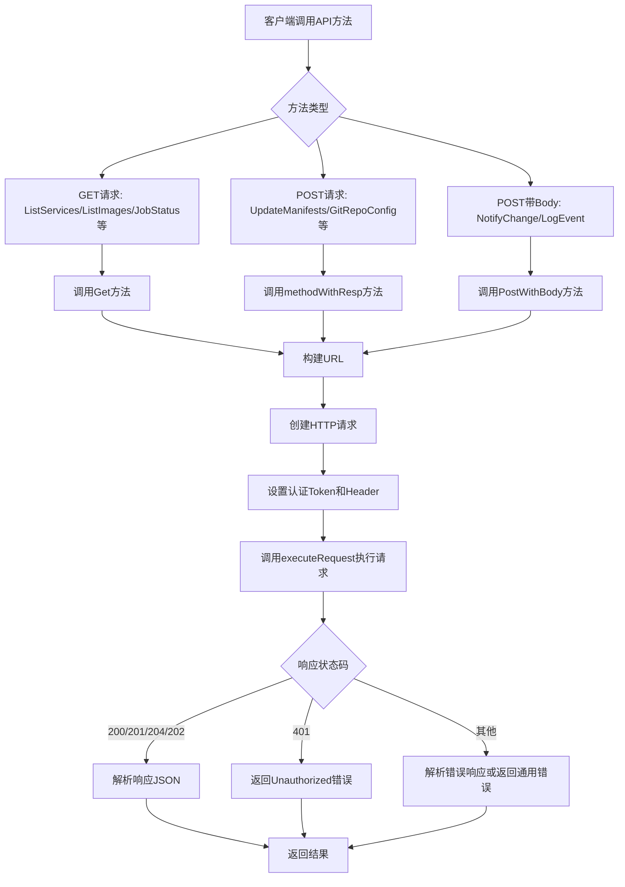

## 类结构

```
Token (类型)
Client (主客户端结构体)
└── 实现 api.Server 接口
```

## 全局变量及字段


### `errNotImplemented`
    
未实现的错误

类型：`error`
    


### `Client.client`
    
用于执行HTTP请求的客户端实例

类型：`*http.Client`
    


### `Client.token`
    
用于认证的令牌

类型：`Token`
    


### `Client.router`
    
用于构建URL路径的路由器

类型：`*mux.Router`
    


### `Client.endpoint`
    
Flux服务器的端点地址

类型：`string`
    
    

## 全局函数及方法


### `New`

该函数是Flux CD HTTP客户端的构造函数，用于创建并初始化一个`Client`实例，将传入的HTTP客户端、路由器、端点和令牌封装为统一的API客户端对象。

**参数：**

- `c`：`*http.Client`，底层HTTP客户端实例，用于执行实际的网络请求
- `router`：`*mux.Router`，Gorilla Mux路由器，用于构建API路由
- `endpoint`：`string`，Flux服务器的基础端点URL
- `t`：`Token`，用于认证的访问令牌

**返回值：** `*Client`，返回新创建的Client指针实例，实现了`api.Server`接口

#### 流程图

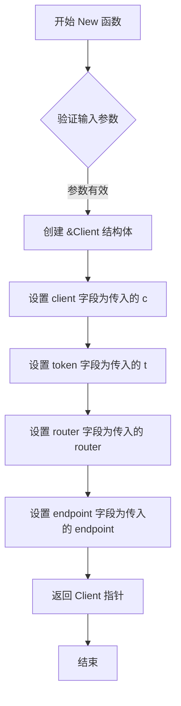

#### 带注释源码

```go
// New 创建一个新的HTTP客户端实例
// 参数:
//   - c: 标准库的HTTP客户端，用于发送请求
//   - router: Gorilla Mux路由器，处理URL路径匹配
//   - endpoint: Flux服务器的HTTP端点地址
//   - t: 认证Token，用于API请求的身份验证
//
// 返回值:
//   - *Client: 封装好的客户端实例，实现了api.Server接口
func New(c *http.Client, router *mux.Router, endpoint string, t Token) *Client {
	return &Client{
		client:   c,      // 赋值HTTP客户端
		token:    t,      // 赋值认证令牌
		router:   router, // 赋值路由器用于路由构建
		endpoint: endpoint, // 赋值服务器端点
	}
}
```


### `Token.Set`

该方法是一个Token类型的接收者方法，用于将Token值设置为HTTP请求的Authorization请求头，以便在Flux客户端与服务器通信时进行身份验证。

参数：

- `req`：`http.Request` 指针类型，用于设置Authorization头信息的HTTP请求对象

返回值：无（空返回，即void）

#### 流程图

```mermaid
flowchart TD
    A[开始] --> B{t != ''?}
    B -- 是 --> C[设置请求头: Authorization: Scope-Probe token={t}]
    B -- 否 --> D[不进行任何操作]
    C --> E[结束]
    D --> E
```

#### 带注释源码

```go
// Set 为HTTP请求设置Authorization头，使用Scope-Probe token格式
// 参数 req: 需要设置认证信息的http.Request指针
func (t Token) Set(req *http.Request) {
	// 检查Token字符串是否非空
	if string(t) != "" {
		// 使用fmt.Sprintf格式化认证字符串，格式为"Scope-Probe token={token值}"
		// 并通过req.Header.Set设置到请求的Authorization头中
		req.Header.Set("Authorization", fmt.Sprintf("Scope-Probe token=%s", t))
	}
}
```


### `Client.New`

该函数是`Client`类型的构造函数，用于创建一个新的HTTP客户端实例，封装了底层的HTTP客户端、认证令牌、路由处理器和服务器端点，以便后续与Flux服务器进行API交互。

参数：

- `c`：`*http.Client`，HTTP客户端实例，用于执行实际的HTTP请求
- `router`：`*mux.Router`，gorilla/mux路由处理器，用于构建API请求的URL路径
- `endpoint`：`string`，Flux服务器的端点URL地址
- `t`：`Token`，认证令牌，用于API请求的身份验证

返回值：`*Client`，返回新创建的Client实例指针

#### 流程图

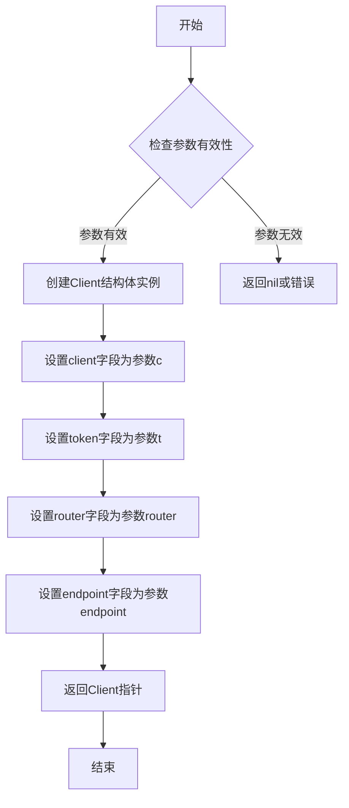

#### 带注释源码

```go
// New 创建一个新的Client实例
// 参数：
//   - c: HTTP客户端，用于发送请求到Flux服务器
//   - router: mux路由器，用于生成API端点URL
//   - endpoint: Flux服务器的HTTP端点地址
//   - t: 认证Token，用于API请求的身份验证
//
// 返回值：
//   - *Client: 新创建的客户端实例
func New(c *http.Client, router *mux.Router, endpoint string, t Token) *Client {
	return &Client{
		client:   c,    // 存储HTTP客户端实例
		token:    t,    // 存储认证令牌
		router:   router, // 存储路由器引用
		endpoint: endpoint, // 存储服务器端点URL
	}
}
```


### `Client.Ping`

该方法用于向 Flux 服务发送 Ping 请求，用于检测客户端与服务端的连通性。它通过调用 `Get` 方法向服务端发送一个不带任何参数的 GET 请求，并返回执行结果（成功或失败）。

参数：

- `ctx`：`context.Context`，上下文对象，用于控制请求的生命周期（如超时、取消等）

返回值：`error`，如果请求成功则返回 `nil`，否则返回具体的错误信息

#### 流程图

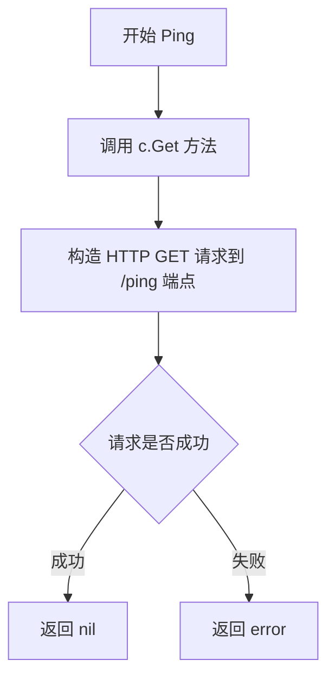

#### 带注释源码

```go
// Ping 向 Flux 服务发送 ping 请求，用于检测连通性
// 参数 ctx 用于控制请求的上下文（如超时、取消）
// 返回 error 类型：成功返回 nil，失败返回具体错误
func (c *Client) Ping(ctx context.Context) error {
    // 调用 Client 的 Get 方法发送 GET 请求
    // 传递 nil 作为 dest 参数，表示不需要解析响应体
    // 使用 transport.Ping 作为路由路径
    return c.Get(ctx, nil, transport.Ping)
}
```


### `Client.Version`

获取 Flux 服务的版本号。该方法通过 HTTP GET 请求调用 Flux 服务端的 Version 接口，并将返回的版本字符串解析到指定的变量中，同时返回可能发生的错误。

参数：

-  `ctx`：`context.Context`，上下文参数，用于控制请求的取消、超时以及传递请求范围内的元数据

返回值：`string`，返回 Flux 服务的版本号字符串；如果发生错误，则返回 error 类型的错误信息。

#### 流程图

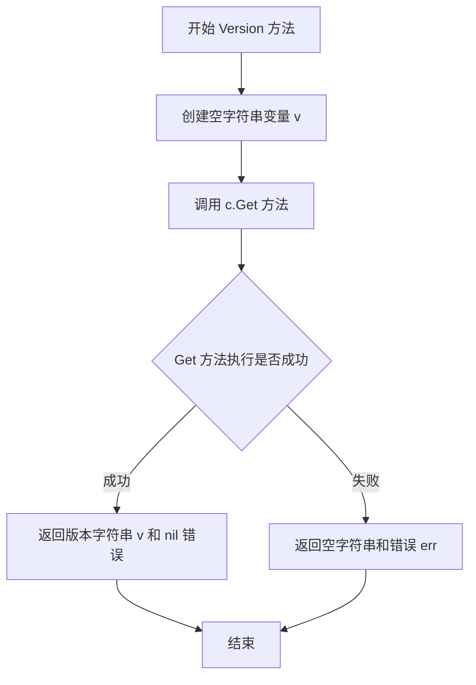

#### 带注释源码

```go
// Version 返回 Flux 服务的版本号
// 参数 ctx 用于控制请求的上下文（如超时、取消等）
// 返回值：版本号字符串和可能的错误
func (c *Client) Version(ctx context.Context) (string, error) {
	var v string                                 // 用于存储版本号的变量
	err := c.Get(ctx, &v, transport.Version)   // 调用 Get 方法请求 Version 接口
	return v, err                                // 返回版本号和错误
}
```


### `Client.NotifyChange`

该方法用于将变更通知发送到Flux服务器，它接收一个上下文和一个变更对象，然后通过POST请求将变更信息以JSON格式发送到服务器。

参数：

- `ctx`：`context.Context`，用于控制请求的截止时间、取消和传递请求范围内的值
- `change`：`v9.Change`，表示要通知的变更对象，包含变更的详细信息

返回值：`error`，如果请求过程中发生错误则返回错误信息，否则返回nil

#### 流程图

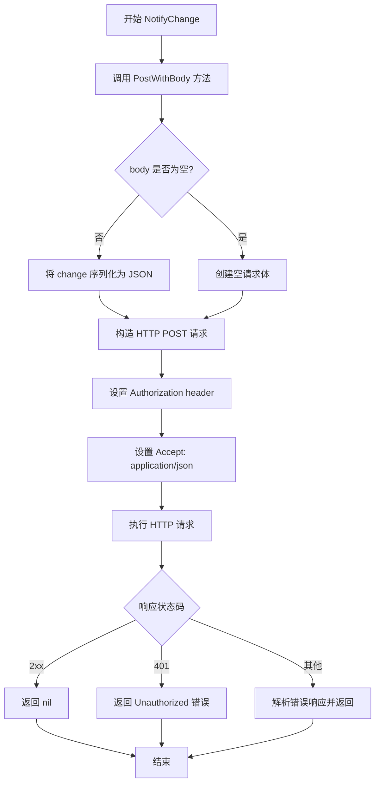

#### 带注释源码

```go
// NotifyChange 向Flux服务器发送变更通知
// 参数 ctx 用于控制请求的生命周期，change 包含要通知的变更内容
// 返回错误信息（如果有）
func (c *Client) NotifyChange(ctx context.Context, change v9.Change) error {
    // 调用 PostWithBody 方法发送 POST 请求
    // transport.Notify 是通知相关的路由端点
    // change 会被自动序列化为 JSON 格式作为请求体发送
    return c.PostWithBody(ctx, transport.Notify, change)
}
```


### `Client.ListServices`

该方法通过 HTTP GET 请求从 Flux 服务器获取指定命名空间下的所有服务（Controller）状态列表，并将响应解析为 `[]v6.ControllerStatus` 切片返回。

参数：

- `ctx`：`context.Context`，用于传递请求的上下文信息（如超时、取消等）
- `namespace`：`string`，目标命名空间，用于过滤服务列表

返回值：`([]v6.ControllerStatus, error)`，返回服务状态列表及可能的错误信息

#### 流程图

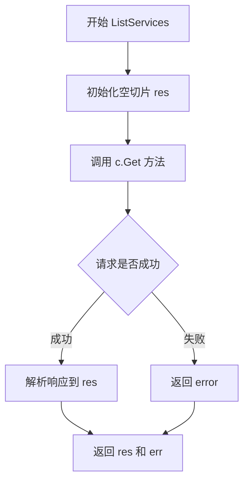

#### 带注释源码

```go
// ListServices 获取指定命名空间下的所有服务（Controller）状态列表
// 参数 ctx 用于控制请求生命周期，namespace 用于过滤目标命名空间
// 返回 []v6.ControllerStatus 切片和可能发生的错误
func (c *Client) ListServices(ctx context.Context, namespace string) ([]v6.ControllerStatus, error) {
	// 声明一个空的服务状态切片用于接收响应数据
	var res []v6.ControllerStatus
	
	// 调用 Client 的 Get 方法执行 HTTP GET 请求
	// 传递 endpoint、router、route 名称以及查询参数 namespace
	err := c.Get(ctx, &res, transport.ListServices, "namespace", namespace)
	
	// 返回结果切片和可能存在的错误
	return res, err
}
```


### `Client.ListServicesWithOptions`

该方法用于通过指定的选项查询 Flux CD 集群中的服务（Controller）列表，支持按命名空间和服务名进行过滤，并返回包含服务状态的切片。

参数：

- `ctx`：`context.Context`，Go 语言的上下文对象，用于传递超时、取消信号等请求级别的控制信息
- `opts`：`v11.ListServicesOptions`，查询选项，包含 `Namespace`（命名空间）和 `Services`（服务列表）等过滤条件

返回值：

- `[]v6.ControllerStatus`：返回服务控制器状态列表，每个元素包含控制器的名称、状态等信息
- `error`：执行过程中出现的错误，如网络通信失败、服务器返回错误等

#### 流程图

```mermaid
flowchart TD
    A[开始 ListServicesWithOptions] --> B[初始化空的服务名列表 services]
    B --> C{遍历 opts.Services}
    C -->|每个服务| D[调用 svc.String 转为字符串并加入 services 列表]
    D --> C
    C -->|遍历完成| E[调用 c.Get 方法发起 HTTP GET 请求]
    E --> F[传入 namespace 参数: opts.Namespace]
    E --> G[传入 services 参数: strings.Join 合并后的服务名列表]
    F --> H[返回 []v6.ControllerStatus 和 error]
    G --> H
    H --> I[结束]
```

#### 带注释源码

```go
// ListServicesWithOptions 根据提供的选项查询服务列表
// ctx: 上下文，用于超时控制和取消
// opts: 包含命名空间和服务过滤条件的选项结构
func (c *Client) ListServicesWithOptions(ctx context.Context, opts v11.ListServicesOptions) ([]v6.ControllerStatus, error) {
	// 声明一个空的结果切片，用于接收服务器返回的服务状态
	var res []v6.ControllerStatus
	
	// 声明一个字符串切片，用于存储所有服务名的字符串形式
	var services []string
	
	// 遍历选项中的服务列表，将每个服务转换为字符串并添加到 services 切片
	// opts.Services 是 v11.ListServicesOptions 中的服务规范列表
	for _, svc := range opts.Services {
		services = append(services, svc.String())
	}
	
	// 调用 Client 的 Get 方法向服务器发送 GET 请求
	// 传递的参数包括:
	//   - ctx: 上下文
	//   - &res: 结果接收变量的指针
	//   - transport.ListServicesWithOptions: 路由名称
	//   - "namespace": 查询参数键，对应 opts.Namespace 的值
	//   - "services": 查询参数键，对应合并后的服务名列表（用逗号分隔）
	err := c.Get(ctx, &res, transport.ListServicesWithOptions, "namespace", opts.Namespace, "services", strings.Join(services, ","))
	
	// 返回结果和可能的错误
	return res, err
}
```


### `Client.ListImages`

该方法用于从Flux服务器获取指定资源的镜像列表。它通过HTTP GET请求调用后端的ListImages接口，传入资源规格作为查询参数，并将返回的JSON数据解析为ImageStatus切片。

**参数：**

- `ctx`：`context.Context`，上下文对象，用于控制请求的截止时间、取消和传递请求级别的值
- `s`：`update.ResourceSpec`，要查询镜像列表的资源规格，通常是一个字符串形式的资源标识符

**返回值：**

- `[]v6.ImageStatus`，镜像状态切片，包含每个镜像的详细信息（如标签、ID等）
- `error`，如果请求失败或响应解析失败，则返回相应的错误信息

#### 流程图

```mermaid
flowchart TD
    A[开始 ListImages] --> B[创建空切片 var res []v6.ImageStatus]
    B --> C[调用 c.Get 方法]
    C --> D[在 Get 方法中构建 URL]
    D --> E[创建 HTTP GET 请求]
    E --> F[设置 Authorization Token]
    F --> G[设置 Accept: application/json Header]
    G --> H[执行 HTTP 请求 executeRequest]
    H --> I{响应状态码检查}
    I -->|200/201/204/202| J[读取响应体]
    I -->|401| K[返回 Unauthorized 错误]
    I -->|其他| L[处理错误响应]
    J --> M[JSON 解码响应到 dest]
    M --> N[返回 res 和 err]
    N --> O[结束]
    
    style A fill:#f9f,stroke:#333
    style O fill:#9f9,stroke:#333
```

#### 带注释源码

```go
// ListImages 获取指定资源的镜像列表
// 参数 ctx: 上下文对象，用于控制请求生命周期
// 参数 s: update.ResourceSpec 类型，表示要查询的资源规格
// 返回: []v6.ImageStatus 镜像状态切片, error 错误信息
func (c *Client) ListImages(ctx context.Context, s update.ResourceSpec) ([]v6.ImageStatus, error) {
	// 声明一个空的 ImageStatus 切片用于接收响应数据
	var res []v6.ImageStatus
	
	// 调用 Client 内部的 Get 方法发起 HTTP GET 请求
	// 参数说明：
	//   - ctx: 上下文
	//   - &res: 响应数据的目标解码地址
	//   - transport.ListImages: 路由名称
	//   - "service": 查询参数键名
	//   - string(s): 将 ResourceSpec 转换为字符串作为查询参数值
	err := c.Get(ctx, &res, transport.ListImages, "service", string(s))
	
	// 返回结果和可能的错误
	return res, err
}
```


### `Client.ListImagesWithOptions`

该方法通过HTTP GET请求从Flux服务器获取符合指定选项（命名空间、服务规范、覆盖容器字段）的镜像列表信息，返回镜像状态切片或错误。

参数：

- `ctx`：`context.Context`，上下文，用于控制请求的取消和超时
- `opts`：`v10.ListImagesOptions`，列出镜像的选项配置，包含服务规范、命名空间和覆盖容器字段等

返回值：`([]v6.ImageStatus, error)`，返回镜像状态切片和可能的错误

#### 流程图

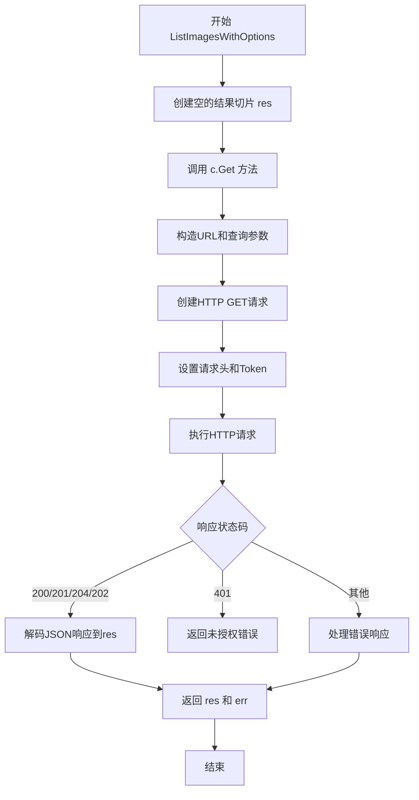

#### 带注释源码

```go
// ListImagesWithOptions 获取符合指定选项的镜像列表
// 参数：
//   - ctx: 上下文对象，用于控制请求生命周期
//   - opts: ListImagesOptions 结构体，包含服务规范、命名空间和覆盖容器字段
//
// 返回值：
//   - []v6.ImageStatus: 镜像状态列表
//   - error: 执行过程中的错误信息
func (c *Client) ListImagesWithOptions(ctx context.Context, opts v10.ListImagesOptions) ([]v6.ImageStatus, error) {
	// 声明一个用于存储结果的 ImageStatus 切片
	var res []v6.ImageStatus
	
	// 调用 Client 的 Get 方法执行HTTP GET请求
	// 参数说明：
	//   - ctx: 上下文
	//   - &res: 结果的目标指针
	//   - transport.ListImagesWithOptions: 路由名称
	//   - "service": 查询参数键，使用 opts.Spec 转换为字符串
	//   - "containerFields": 查询参数键，使用逗号连接 opts.OverrideContainerFields
	//   - "namespace": 查询参数键，使用 opts.Namespace
	err := c.Get(ctx, &res, transport.ListImagesWithOptions, 
		"service", string(opts.Spec), 
		"containerFields", strings.Join(opts.OverrideContainerFields, ","), 
		"namespace", opts.Namespace)
	
	// 返回结果和可能的错误
	return res, err
}
```


### `Client.JobStatus`

该方法是一个 HTTP 客户端方法，用于查询 Flux CD 系统中特定作业（Job）的当前状态。它通过调用底层的 `Get` 方法向服务器发送 GET 请求，并将响应反序列化为 `job.Status` 对象返回给调用者。

参数：

- `ctx`：`context.Context`，上下文对象，用于控制请求的截止时间、取消等
- `jobID`：`job.ID`，要查询状态的作业唯一标识符

返回值：`job.Status`，作业的当前状态信息；`error`，如果请求失败则返回错误信息

#### 流程图

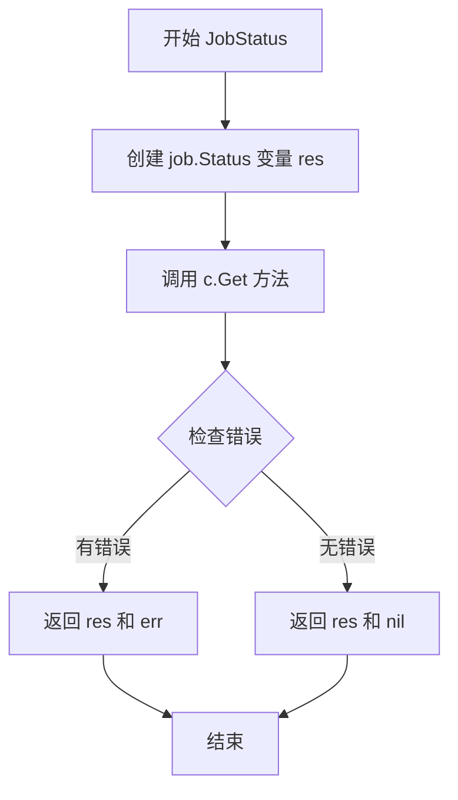

#### 带注释源码

```go
// JobStatus returns the status of a job given its ID.
// It queries the Flux server using the JobStatus transport endpoint.
func (c *Client) JobStatus(ctx context.Context, jobID job.ID) (job.Status, error) {
	// 声明一个 job.Status 类型的变量用于存储查询结果
	var res job.Status
	
	// 调用 Get 方法向服务器发送 GET 请求
	// 参数说明：
	//   ctx: 上下文对象，用于控制请求生命周期
	//   &res: 结果存储的目标变量地址
	//   transport.JobStatus: 服务器端路由名称
	//   "id": 查询参数名称
	//   string(jobID): 查询参数值（job.ID 转换为字符串）
	err := c.Get(ctx, &res, transport.JobStatus, "id", string(jobID))
	
	// 返回查询结果和可能的错误
	return res, err
}
```


### `Client.SyncStatus`

该方法用于获取指定Git引用的同步状态，通过HTTP GET请求调用远程Flux服务器的`SyncStatus`端点，并返回同步状态的字符串数组。

参数：

- `ctx`：`context.Context`，上下文对象，用于传递截止时间、取消信号等请求控制信息
- `ref`：`string`，Git引用（ref），用于指定要查询同步状态的仓库引用

返回值：

- `[]string`：同步状态的字符串数组，表示该引用在集群中的同步状态
- `error`：如果请求失败，返回错误信息；否则返回nil

#### 流程图

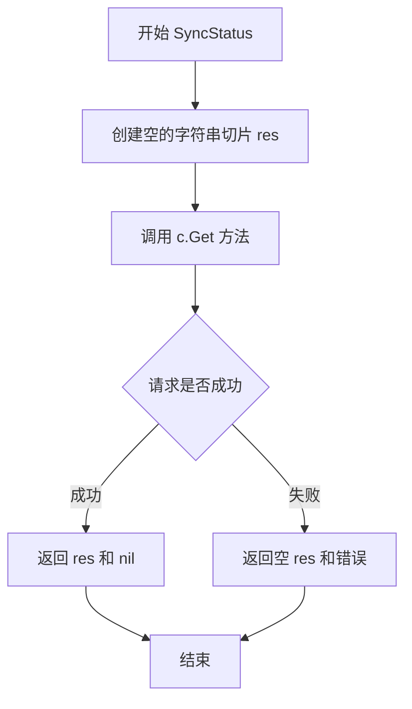

#### 带注释源码

```go
// SyncStatus 获取指定Git引用的同步状态
// 参数 ctx: 上下文对象，用于控制请求生命周期
// 参数 ref: Git引用，用于指定要查询的仓库引用
// 返回值: 同步状态字符串数组和错误信息
func (c *Client) SyncStatus(ctx context.Context, ref string) ([]string, error) {
	// 创建一个空的字符串切片用于接收同步状态结果
	var res []string
	
	// 调用Client的Get方法向Flux服务器发送GET请求
	// 路由为 transport.SyncStatus，查询参数包含 ref
	err := c.Get(ctx, &res, transport.SyncStatus, "ref", ref)
	
	// 返回结果和可能发生的错误
	return res, err
}
```


### `Client.UpdateManifests`

该方法是 Flux CDN 客户端的核心功能之一，用于将本地的清单更新规范（update.Spec）通过 HTTP POST 请求发送到 Flux 服务器，并返回服务器创建的作业 ID（job.ID），以便客户端后续跟踪更新任务的状态。

参数：

- `ctx`：`context.Context`，用于控制请求的取消、超时等上下文信息
- `spec`：`update.Spec`，表示要应用的清单更新规范，包含需要更新的资源、策略等信息

返回值：`job.ID`，返回服务器创建的作业标识符，可用于查询更新任务的状态；`error`，如果请求过程中出现错误（如网络问题、服务器返回错误等），则返回相应的错误信息

#### 流程图

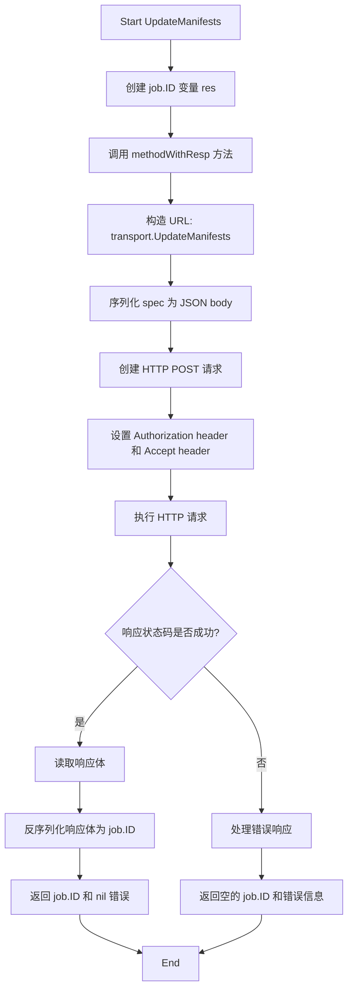

#### 带注释源码

```go
// UpdateManifests 向 Flux 服务器发送清单更新请求
// 参数 ctx 用于控制请求的生命周期，spec 包含要应用的更新规范
// 返回值为服务器创建的作业 ID，用于后续状态查询
func (c *Client) UpdateManifests(ctx context.Context, spec update.Spec) (job.ID, error) {
	// 定义一个 job.ID 类型的变量用于接收服务器响应
	var res job.ID
	
	// 调用 methodWithResp 方法执行 HTTP POST 请求
	// 传入参数：
	//   - ctx: 上下文对象
	//   - "POST": HTTP 方法
	//   - &res: 响应目标地址
	//   - transport.UpdateManifests: 服务器路由
	//   - spec: 请求体内容
	err := c.methodWithResp(ctx, "POST", &res, transport.UpdateManifests, spec)
	
	// 返回作业 ID 和可能发生的错误
	return res, err
}
```


### `Client.LogEvent`

该方法用于将事件记录到 Flux 服务器。它接收一个上下文和一个事件对象，然后通过 POST 请求将事件发送到服务器的 LogEvent 端点。

参数：

- `ctx`：`context.Context`，Go 语言的上下文，用于传递截止时间、取消信号等
- `event`：`event.Event`，要记录的事件对象，包含事件的详细信息

返回值：`error`，如果发生错误则返回错误，否则返回 nil

#### 流程图

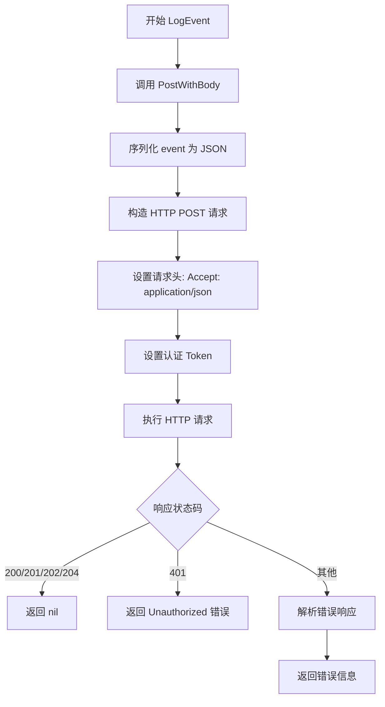

#### 带注释源码

```go
// LogEvent sends an event to the Flux server via HTTP POST request.
// It posts the event as JSON body to the LogEvent endpoint.
func (c *Client) LogEvent(ctx context.Context, event event.Event) error {
    // 调用 PostWithBody 方法，该方法会:
    // 1. 将 event 序列化为 JSON
    // 2. 构造 HTTP POST 请求
    // 3. 添加认证 Token 到请求头
    // 4. 发送到 transport.LogEvent 端点
    // 5. 处理响应并返回错误
    return c.PostWithBody(ctx, transport.LogEvent, event)
}
```


### `Client.Export`

该方法是 Flux CD 客户端库中的核心导出功能，通过 HTTP GET 请求调用远程 Flux 服务器的导出接口，获取集群资源的序列化表示（字节切片），并返回给调用方用于后续处理或存储。

参数：

- `ctx`：`context.Context`，上下文对象，用于传递超时、截止时间、取消信号等请求级别的控制信息

返回值：

- `[]byte`：服务器返回的导出数据，以字节切片形式表示，通常为 JSON 或 YAML 格式的集群资源配置
- `error`：如果请求过程中发生任何错误（如网络故障、服务器返回错误状态码、响应解析失败等），则返回相应的错误信息；成功时返回 nil

#### 流程图

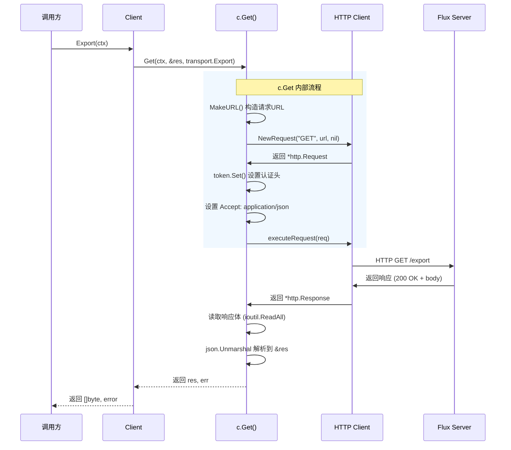

#### 带注释源码

```go
// Export 获取集群资源的导出数据
// 该方法调用远程 Flux 服务的导出接口，获取当前集群中所有受 Flux 管理的资源定义
// 返回格式通常为 JSON 或 YAML，便于后续的备份、迁移或审计操作
//
// 参数:
//   - ctx: context.Context，请求上下文，用于控制超时和取消
//
// 返回值:
//   - []byte: 导出的资源数据字节切片
//   - error: 执行过程中发生的错误，如网络问题、认证失败、服务器错误等
func (c *Client) Export(ctx context.Context) ([]byte, error) {
	// 声明一个字节切片用于接收响应数据
	// 初始化为零值，便于后续 json.Unmarshal 直接写入
	var res []byte
	
	// 调用 Client 类的 Get 方法执行 HTTP GET 请求
	// 参数说明：
	//   - ctx: 传递上下文信息
	//   - &res: 结果接收地址，Get 方法会将响应体解析并写入此变量
	//   - transport.Export: 服务器端路由标识，表示调用导出接口
	//
	// Get 方法内部会：
	//   1. 使用 transport.MakeURL 构造完整的请求 URL
	//   2. 创建 HTTP GET 请求
	//   3. 设置认证令牌（通过 c.token.Set）
	//   4. 设置 Accept 头为 application/json
	//   5. 执行请求并处理响应
	//   6. 将响应体解析为 JSON 写入 res
	err := c.Get(ctx, &res, transport.Export)
	
	// 返回导出的字节数据和可能发生的错误
	// 调用方需要自行处理 err != nil 的情况
	return res, err
}
```


### `Client.GitRepoConfig`

获取Git仓库配置信息，支持可选的配置重新生成功能。

参数：

- `ctx`：`context.Context`，上下文对象，用于传递截止时间、取消信号等请求控制信息
- `regenerate`：`bool`，是否强制重新生成Git配置的标志

返回值：`v6.GitConfig`，返回Git仓库配置对象；`error`，执行过程中的错误信息

#### 流程图

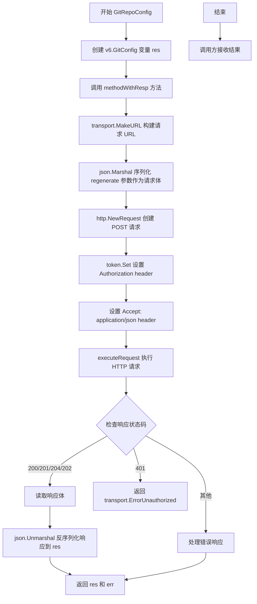

#### 带注释源码

```go
// GitRepoConfig 获取Git仓库配置
// ctx: 上下文，用于控制请求超时和取消
// regenerate: 是否重新生成Git配置
func (c *Client) GitRepoConfig(ctx context.Context, regenerate bool) (v6.GitConfig, error) {
	// 定义用于接收响应结果的GitConfig对象
	var res v6.GitConfig
	
	// 调用 methodWithResp 执行 POST 请求
	// 参数说明：
	//   - ctx: 上下文对象
	//   - "POST": HTTP方法
	//   - &res: 响应目标对象指针
	//   - transport.GitRepoConfig: 路由名称
	//   - regenerate: 请求体数据（作为JSON发送）
	err := c.methodWithResp(ctx, "POST", &res, transport.GitRepoConfig, regenerate)
	
	// 返回配置结果和可能的错误
	return res, err
}
```


### `Client.Post`

该方法是Client类的简单POST请求封装，仅包含查询参数而没有请求体，内部通过调用`PostWithBody`方法实现，传入nil作为body参数。

参数：

- `ctx`：`context.Context`，请求的上下文，用于超时控制和取消操作
- `route`：`string`，目标路由路径，用于构建请求URL
- `queryParams`：`...string`，可变长度字符串参数，用于URL查询字符串的键值对（可选）

返回值：`error`，如果请求过程中出现错误（如URL构建失败、HTTP请求执行失败、响应解码失败等）则返回错误，否则返回nil

#### 流程图

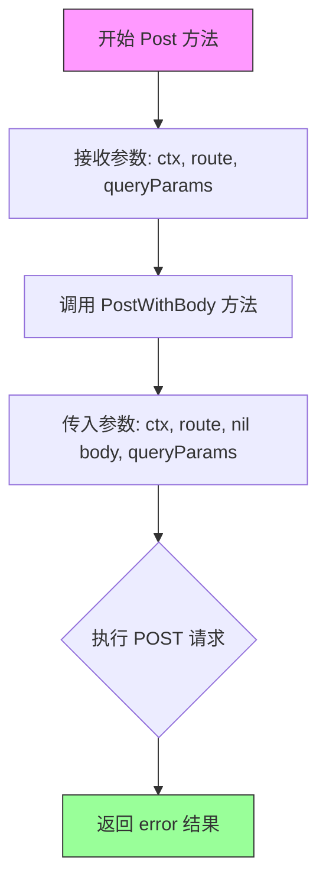

#### 带注释源码

```go
// Post is a simple query-param only post request
// Post是一个简单的仅包含查询参数的POST请求方法
func (c *Client) Post(ctx context.Context, route string, queryParams ...string) error {
    // 调用 PostWithBody 方法，传入 nil 作为 body 参数
    // 这里复用了 PostWithBody 的逻辑，只是 body 为空
    return c.PostWithBody(ctx, route, nil, queryParams...)
}
```


### `Client.PostWithBody`

这是一个更复杂的 POST 请求方法，用于发送包含 JSON 编码请求体的 HTTP POST 请求。如果 body 参数不为 nil，会在发送前将其编码为 JSON 格式。

参数：

- `ctx`：`context.Context`，上下文，用于控制请求的取消和超时
- `route`：`string`，请求的路由路径
- `body`：`interface{}`，请求体对象，如果不为 nil 会被 JSON 编码后发送
- `queryParams`：`...string`，可选的查询参数，以键值对形式传递

返回值：`error`，如果发生错误则返回错误信息，否则返回 nil

#### 流程图

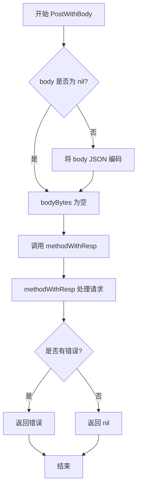

#### 带注释源码

```go
// PostWithBody is a more complex post request, which includes a json-ified body.
// If body is not nil, it is encoded to json before sending
func (c *Client) PostWithBody(ctx context.Context, route string, body interface{}, queryParams ...string) error {
	// 该方法内部委托给 methodWithResp 处理
	// method 参数固定为 "POST"
	// dest 参数为 nil，因为 PostWithBody 不需要解析响应
	return c.methodWithResp(ctx, "POST", nil, route, body, queryParams...)
}
```


### `Client.PatchWithBody`

发送带有 JSON 请求体的 PATCH 请求到 Flux 服务器，是 `Client` 类的 HTTP 方法之一，用于执行带请求体的 HTTP PATCH 操作。

参数：

- `ctx`：`context.Context`，上下文对象，用于控制请求的取消和超时
- `route`：`string`，Mux 路由路径，用于定位服务器端点
- `body`：`interface{}`，请求体对象，如果不为 nil 会被序列化为 JSON 发送
- `queryParams`：`...string`，可选的查询参数键值对（可变参数）

返回值：`error`，执行过程中的错误，如果成功则返回 nil

#### 流程图

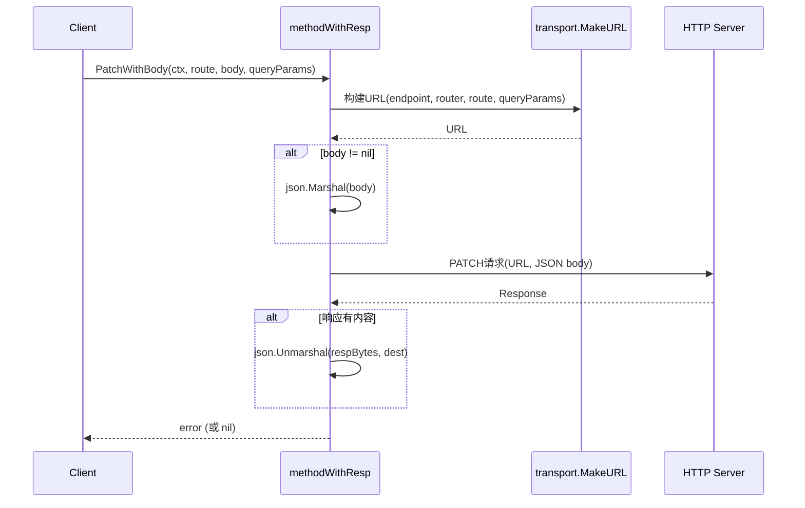

#### 带注释源码

```go
// PatchWithBody 发送带有 JSON 请求体的 PATCH 请求
// 参数:
//   - ctx: 上下文，用于控制请求生命周期
//   - route: 请求路由路径
//   - body: 请求体对象，会被序列化为 JSON（如果不为 nil）
//   - queryParams: 可选的查询参数
//
// 返回值:
//   - error: 执行过程中的错误，成功时返回 nil
func (c *Client) PatchWithBody(ctx context.Context, route string, body interface{}, queryParams ...string) error {
	// 调用 methodWithResp 方法，指定 HTTP 方法为 "PATCH"
	// dest 参数为 nil，表示不关心响应体内容
	return c.methodWithResp(ctx, "PATCH", nil, route, body, queryParams...)
}
```


### `Client.methodWithResp`

该方法是 HTTP 请求的完整封装实现，处理 URL 构建、请求体 JSON 编码、响应解码等全流程，支持任意 HTTP 方法和查询参数。

参数：

- `ctx`：`context.Context`，请求的上下文，用于超时控制和取消
- `method`：`string`，HTTP 方法，如 "GET"、"POST"、"PATCH" 等
- `dest`：`interface{}`，用于接收响应数据的目标对象，如果响应体为空则不解码
- `route`：`string`，路由名称，用于在 router 中查找具体 URL
- `body`：`interface{}`，请求体对象，会被序列化为 JSON 发送，可为 nil
- `queryParams`：`...string`，可选的查询参数，按 key-value 顺序传入

返回值：`error`，如果请求成功则返回 nil，否则返回包含错误信息的 error

#### 流程图

```mermaid
flowchart TD
    A[开始 methodWithResp] --> B[构建URL]
    B --> C{body是否为nil?}
    C -->|是| D[bodyBytes = nil]
    C -->|否| E[json.Marshal body]
    E --> F{编码成功?}
    F -->|否| G[返回编码错误]
    F -->|是| D
    D --> H[创建 HTTP 请求]
    H --> I[设置 context]
    I --> J[设置 token 认证头]
    J --> K[设置 Accept: application/json]
    K --> L[executeRequest 执行请求]
    L --> M{请求成功?}
    M -->|否| N[返回请求错误]
    M -->|是| O[读取响应体]
    O --> P{响应体长度 > 0?}
    P -->|否| Q[返回 nil]
    P -->|是| R[json.Unmarshal 响应体到 dest]
    R --> S{解码成功?}
    S -->|否| T[返回解码错误]
    S -->|是| Q
```

#### 带注释源码

```go
// methodWithResp 是完整的请求处理方法，处理 URL 构建、请求体编码和响应解码
// 参数说明：
//   - ctx: 上下文，用于请求超时和取消控制
//   - method: HTTP 方法（GET/POST/PATCH 等）
//   - dest: 响应数据的目标接收者，如果为 nil 或响应体为空则不解码
//   - route: 路由名称，用于查找具体 URL
//   - body: 请求体对象，会序列化为 JSON
//   - queryParams: 可变参数，key-value 对的查询参数
func (c *Client) methodWithResp(ctx context.Context, method string, dest interface{}, route string, body interface{}, queryParams ...string) error {
	// 1. 使用 transport.MakeURL 构建完整 URL，包含查询参数
	u, err := transport.MakeURL(c.endpoint, c.router, route, queryParams...)
	if err != nil {
		return errors.Wrap(err, "constructing URL")
	}

	// 2. 如果有请求体，将其序列化为 JSON 字节数组
	var bodyBytes []byte
	if body != nil {
		bodyBytes, err = json.Marshal(body)
		if err != nil {
			return errors.Wrap(err, "encoding request body")
		}
	}

	// 3. 创建 HTTP 请求，body 为字节数组读取器
	req, err := http.NewRequest(method, u.String(), bytes.NewReader(bodyBytes))
	if err != nil {
		return errors.Wrapf(err, "constructing request %s", u)
	}
	// 4. 将上下文绑定到请求，用于超时控制和取消
	req = req.WithContext(ctx)

	// 5. 设置认证 token 到请求头
	c.token.Set(req)
	// 6. 设置接受 JSON 响应
	req.Header.Set("Accept", "application/json")

	// 7. 执行 HTTP 请求
	resp, err := c.executeRequest(req)
	if err != nil {
		return errors.Wrap(err, "executing HTTP request")
	}
	// 8. 确保响应体被关闭
	defer resp.Body.Close()

	// 9. 读取整个响应体到内存
	respBytes, err := ioutil.ReadAll(resp.Body)

	if err != nil {
		return errors.Wrap(err, "decoding response from server")
	}
	// 10. 如果响应体为空，直接返回成功
	if len(respBytes) <= 0 {
		return nil
	}
	// 11. 将 JSON 响应解码到目标对象
	if err := json.Unmarshal(respBytes, &dest); err != nil {
		return errors.Wrap(err, "decoding response from server")
	}
	return nil
}
```


### `Client.Get`

该方法用于执行GET请求到Flux服务器，并将响应反序列化到提供的目标对象中（如果目标对象不为nil）。它是Flux客户端库中用于与Flux API服务器进行通信的核心方法之一，支持查询参数和响应解码。

参数：

- `ctx`：`context.Context`，用于请求的上下文控制，支持超时和取消
- `dest`：`interface{}`，用于存储API响应数据的目标对象，如果为nil则跳过响应体解析
- `route`：`string`，请求的路由路径，对应服务器端的API端点
- `queryParams`：`...string`，可变长字符串参数，用于构建URL查询参数，格式为key1, value1, key2, value2...

返回值：`error`，如果请求成功则返回nil，否则返回包含错误信息的error对象

#### 流程图

```mermaid
graph TD
    A[开始] --> B[MakeURL构建URL]
    B --> C{URL构建是否成功}
    C -->|否| D[返回错误: constructing URL]
    C -->|是| E[创建GET请求]
    E --> F{请求创建是否成功}
    F -->|否| G[返回错误: constructing request]
    F -->|是| H[绑定Context到请求]
    H --> I[设置Authorization Token]
    I --> J[设置Accept Header为application/json]
    J --> K[executeRequest执行HTTP请求]
    K --> L{请求执行是否成功}
    L -->|否| M[返回错误: executing HTTP request]
    L -->|是| N{dest是否为nil}
    N -->|是| O[返回nil]
    N -->|否| P[解码响应体到dest]
    P --> Q{解码是否成功}
    Q -->|否| R[返回错误: decoding response]
    Q -->|是| S[返回nil]
```

#### 带注释源码

```go
// Get executes a get request against the Flux server.
// It unmarshals the response into dest, if dest is not nil.
func (c *Client) Get(ctx context.Context, dest interface{}, route string, queryParams ...string) error {
    // 1. 使用transport.MakeURL构建完整的请求URL
    //    参数包括: endpoint基础地址, router路由实例, route路径, queryParams查询参数
    u, err := transport.MakeURL(c.endpoint, c.router, route, queryParams...)
    if err != nil {
        // 如果URL构建失败,包装错误并返回
        return errors.Wrap(err, "constructing URL")
    }

    // 2. 创建HTTP GET请求
    //    方法为"GET", URL为上面构建的u, body为nil
    req, err := http.NewRequest("GET", u.String(), nil)
    if err != nil {
        // 如果请求创建失败,包装错误并返回
        return errors.Wrapf(err, "constructing request %s", u)
    }
    
    // 3. 将context绑定到请求,用于超时控制和取消
    req = req.WithContext(ctx)

    // 4. 设置Authorization头(如果token不为空)
    c.token.Set(req)
    
    // 5. 设置Accept头,声明客户端期望的响应格式为JSON
    req.Header.Set("Accept", "application/json")

    // 6. 执行HTTP请求,获取响应
    resp, err := c.executeRequest(req)
    if err != nil {
        // 如果请求执行失败,包装错误并返回
        return errors.Wrap(err, "executing HTTP request")
    }
    
    // 7. 确保响应体被关闭,释放资源
    defer resp.Body.Close()

    // 8. 如果dest不为nil,则将响应体JSON解码到dest中
    if dest != nil {
        // 使用json.NewDecoder流式解码,避免将整个响应加载到内存
        if err := json.NewDecoder(resp.Body).Decode(dest); err != nil {
            // 如果解码失败,包装错误并返回
            return errors.Wrap(err, "decoding response from server")
        }
    }
    
    // 9. 请求成功完成,返回nil
    return nil
}
```


### `Client.executeRequest`

该方法是 `Client` 类的私有方法，负责执行实际的 HTTP 请求并处理响应。它调用底层的 `http.Client` 执行请求，根据不同的 HTTP 状态码进行相应处理：对于成功状态（200, 201, 204, 202）直接返回响应；对于 401 未授权错误返回特定错误对象；对于其他错误状态，尝试解析 JSON 格式的错误响应体，如果解析失败则返回包含状态码和响应体的通用错误。

参数：

- `req`：`*http.Request`，需要执行的 HTTP 请求对象

返回值：`*http.Response`，执行成功时返回的 HTTP 响应；`error`，执行失败或响应状态码表示错误时返回的错误对象

#### 流程图

```mermaid
flowchart TD
    A[开始 executeRequest] --> B[调用 c.client.Do 执行 HTTP 请求]
    B --> C{请求是否出错?}
    C -->|是| D[返回错误, 包装 'executing HTTP request']
    C -->|否| E{检查响应状态码}
    E --> F{状态码为 200/201/204/202?}
    F -->|是| G[返回 resp, nil]
    F -->|否| H{状态码为 401?}
    H -->|是| I[返回 resp, transport.ErrorUnauthorized]
    H -->|否| J[读取响应体 body]
    J --> K{响应 Content-Type 是 JSON?}
    K -->|是| L[尝试解析为 fluxerr.Error]
    K -->|否| M[返回通用错误: resp.Status + body]
    L --> N{解析成功且 niceError.Err 不为空?}
    N -->|是| O[返回 resp, &niceError]
    N -->|否| M
```

#### 带注释源码

```go
// executeRequest 执行 HTTP 请求并处理响应
// 参数: req - 待执行的 HTTP 请求
// 返回: resp - HTTP 响应, err - 执行过程中的错误
func (c *Client) executeRequest(req *http.Request) (*http.Response, error) {
	// 使用底层 http.Client 执行请求
	resp, err := c.client.Do(req)
	if err != nil {
		// 请求执行失败, 包装错误信息并返回
		return nil, errors.Wrap(err, "executing HTTP request")
	}
	
	// 根据 HTTP 状态码进行不同处理
	switch resp.StatusCode {
	// 成功状态码: OK, Created, NoContent, Accepted
	case http.StatusOK, http.StatusCreated, http.StatusNoContent, http.StatusAccepted:
		return resp, nil
	// 未授权状态码
	case http.StatusUnauthorized:
		return resp, transport.ErrorUnauthorized
	// 其他状态码均视为错误
	default:
		// 读取错误响应体
		body, err := ioutil.ReadAll(resp.Body)
		if err != nil {
			return resp, errors.Wrap(err, "reading response body of error")
		}
		
		// 根据 Content-Type 判断是否为 JSON 格式的错误响应
		// 用于区分 fluxerr.Error 和普通错误
		if strings.HasPrefix(resp.Header.Get(http.CanonicalHeaderKey("Content-Type")), "application/json") {
			var niceError fluxerr.Error
			// 尝试解析 JSON 错误响应
			if err := json.Unmarshal(body, &niceError); err != nil {
				return resp, errors.Wrap(err, "decoding response body of error")
			}
			// 如果成功解析且包含有效错误, 返回结构化错误
			if niceError.Err != nil {
				return resp, &niceError
			}
			// 解析失败或无有效错误, 继续执行 fallthrough
		}
		// 返回包含状态码和响应体的通用错误
		return resp, errors.New(resp.Status + " " + string(body))
	}
}
```

## 关键组件


### Client 结构体

核心HTTP客户端，封装了与Flux服务器通信所需的所有功能，包括HTTP客户端实例、认证令牌、路由处理器和服务器端点。它实现了api.Server接口，提供了与Flux API交互的完整能力。

### Token 类型

认证令牌封装类型，用于在HTTP请求的Authorization头中设置Scope-Probe token，支持通过Set方法将令牌附加到请求头中。

### API方法群

包括Ping、Version、NotifyChange、ListServices、ListServicesWithOptions、ListImages、ListImagesWithOptions、JobStatus、SyncStatus、UpdateManifests、LogEvent、Export、GitRepoConfig等方法，这些方法封装了对Flux服务器不同API端点的调用逻辑，将请求参数转换为HTTP请求并处理响应。

### PostWithBody 方法

支持带JSON请求体的POST请求方法，内部调用methodWithResp实现。当body不为nil时，会先将body序列化为JSON字节数组后再发送请求。

### methodWithResp 方法

通用的HTTP请求处理方法，支持任意HTTP方法（GET/POST/PATCH等），处理URL构建、请求体JSON编码、响应解码等完整流程。它是底层核心方法，封装了HTTP请求的构造和响应处理的公共逻辑。

### Get 方法

执行GET请求的便捷方法，通过transport.MakeURL构建带查询参数的URL，设置Accept头为application/json，然后将响应体解码到指定的目标结构中。

### executeRequest 方法

负责实际执行HTTP请求并处理响应状态码。它对不同状态码进行处理：200/201/204/202返回正常响应，401返回未授权错误，其他状态码则尝试解析JSON错误响应或返回通用错误。此方法还处理了fluxerr.Error类型的错误解码。

### transport.MakeURL

外部依赖函数，用于根据给定的路由和查询参数构建完整的URL，是请求构建的关键组件。

### 版本化API支持

代码中导入了v6、v9、v10、v11等不同版本的API包，表明该客户端支持多个版本的Flux API，可以根据服务器端的API版本选择相应的请求格式和端点。


## 问题及建议


### 已知问题

-   **响应体双重读取问题**：`executeRequest` 方法在处理非成功状态码时会先读取 `resp.Body`，导致后续调用者无法再次读取响应体（如 `Get` 方法中的 `json.NewDecoder(resp.Body).Decode(dest)` 会失败）
-   **错误处理方式不一致**：`Get` 方法使用 `json.NewDecoder` 流式解码，而 `methodWithResp` 使用 `ioutil.ReadAll` + `json.Unmarshal` 全量读取，两种方式行为不一致且性能表现不同
-   **未使用的变量**：`errNotImplemented` 全局变量定义后未在任何地方使用
-   **硬编码的 Header 值**：Authorization header 的格式 `"Scope-Probe token=%s"` 和 Accept header 的 `"application/json"` 被硬编码在多个方法中，缺乏灵活性
-   **缺乏请求超时控制**：虽然使用 `context.Context`，但未显式设置 HTTP 客户端的请求超时，容易导致请求无限期挂起
-   **缺少资源释放的严格保证**：虽然有 `defer resp.Body.Close()`，但在某些错误路径下响应体可能未被完全消费就关闭了
-   **方法注释不完整**：部分公开方法（如 `PatchWithBody`、`JobStatus`、`SyncStatus` 等）缺少完整的文档注释

### 优化建议

-   **统一错误处理逻辑**：重构 `executeRequest`，不在内部读取错误响应体，而是返回原始响应给调用者处理；或在所有路径都统一使用流式解码
-   **提取 Header 常量**：将 Authorization 格式和 Accept 类型定义为常量，提高可维护性
-   **添加请求超时**：为 `http.Client` 配置 `Timeout` 或使用 `http.Transport` 的 `TLSHandshakeTimeout`、`ResponseHeaderTimeout` 等参数
-   **实现重试机制**：对于瞬时失败（如网络抖动），可考虑添加简单的重试逻辑（但需注意幂等性）
-   **添加请求日志**：在 `executeRequest` 中添加调试日志，记录请求方法、URL、状态码等信息，便于排查问题
-   **完善错误类型**：针对不同 HTTP 状态码返回更具体的错误类型，而非统一返回通用错误
-   **补充方法注释**：为所有公开方法添加完整的 Go 风格文档注释，说明参数、返回值和可能的错误

## 其它


### 设计目标与约束

该客户端库作为Flux CD系统的HTTP API客户端，负责与Flux服务器进行通信，封装了RESTful接口调用的所有底层细节，包括请求构建、响应解析、错误处理和认证管理。设计目标包括：提供类型安全的API调用接口、简化HTTP通信复杂性、统一错误处理机制、支持多种API版本（v6/v9/v10/v11）。约束条件包括：依赖Go标准库net/http、gorilla/mux、pkg/errors等外部包；必须实现api.Server接口；所有操作必须通过context.Context传递超时和取消信号。

### 错误处理与异常设计

错误处理采用分层机制：底层HTTP执行错误通过errors.Wrap包装上下文信息；HTTP响应状态码非2xx时，根据Content-Type区分处理——若是application/json则尝试解析为fluxerr.Error类型，否则返回通用错误。重要状态码单独处理：401 Unauthorized返回特定ErrorUnauthorized错误。请求构建失败（URL构造、JSON编码）均返回包装后的错误。响应解码失败时返回解码错误。错误信息包含足够的上下文便于调试，但不泄露敏感信息。

### 数据流与状态机

客户端无显式状态机，其状态由HTTP客户端和token管理。数据流主要分为两类：GET请求流程（构建URL→创建请求→设置认证→执行→解码响应）；POST/PATCH请求流程（构建URL→编码body→创建请求→设置认证→执行→解码响应）。所有请求共享相同的错误处理路径和响应解析逻辑。Token作为认证状态在Client实例生命周期内保持不变。

### 外部依赖与接口契约

主要外部依赖包括：github.com/gorilla/mux用于URL路由匹配；github.com/pkg/errors用于错误包装；github.com/fluxcd/flux/pkg/api系列提供API版本特定的数据类型；github.com/fluxcd/flux/pkg/transport提供HTTP路径常量；github.com/fluxcd/flux/pkg/errors提供Flux特定错误类型。Client必须实现api.Server接口（所有方法签名匹配）。与Flux服务器通信遵循RESTful约定，使用JSON作为数据交换格式。

### 安全性考虑

认证通过Token实现，存储在Client.token字段，Set方法将token设置为"Scope-Probe token={token}"格式的Authorization头。所有请求自动设置Accept: application/json头。敏感信息（token）仅在内存中保存，不记录日志。HTTPS连接由底层http.Client控制，需在创建时配置TLS参数。错误响应可能包含服务器返回的错误信息，需注意日志输出时不泄露内部实现细节。

### 性能考虑

使用ioutil.ReadAll读取整个响应体后统一解码，避免流式解码的复杂性。Response Body在读取后立即关闭以释放连接。Query参数通过字符串拼接构造，无额外性能开销。建议在生产环境中复用http.Client以利用连接池。JSON编码/解码使用标准库encoding/json，性能可满足中等规模部署需求。

### 并发与线程安全

Client实例本身可安全并发使用，因其不包含可变状态（字段在构造后不可变）。但需注意：http.Client默认安全可并发；Token设置操作无竞态条件；各方法通过context.Context传递独立请求上下文。多个goroutine共享同一Client实例时，底层http.Client会自动处理并发请求。

### 配置与扩展性

Client通过构造函数New创建，配置参数包括：http.Client实例（可自定义超时、传输层）、*mux.Router实例（用于路径匹配）、endpoint字符串（服务器地址）、Token认证信息。扩展点包括：可通过包装http.Client实现自定义重试逻辑；可通过中间件方式添加额外请求头；可通过实现api.Server接口扩展新API方法。

### 测试策略

建议包含单元测试覆盖：URL构造逻辑测试、JSON编码/解码测试、错误响应解析测试、executeRequest状态码处理测试。集成测试需要启动模拟Flux服务器，验证完整请求-响应流程。Mock测试可使用http.RoundTripper接口模拟HTTP响应。关键路径包括：正常响应解码、非2xx错误处理、JSON格式错误响应解析、Token设置验证。

### 日志与监控

当前代码无内置日志记录，建议添加：请求发送时记录方法、URL、token存在性（不含token值）；响应状态码和耗时；错误发生时的完整错误链。监控指标建议：请求成功率、错误类型分布、响应时间分布、P99延迟。可通过InstrumentedRoundTripper包装http.Client实现无侵入式监控。

### 兼容性考虑

API版本通过导入不同版本包（v6/v9/v10/v11）实现隔离，不同版本数据类型不兼容。Client实现api.Server接口的不同版本可能有细微差异，需确保方法签名完全匹配。JSON序列化遵循标准库行为，需注意time.Time等类型的默认格式。未来API变更可能导致dest参数类型不匹配，需同步更新客户端代码。

    