# `flux\pkg\http\daemon\server.go` 详细设计文档

Flux CD 守护进程的 HTTP API 服务器实现，负责接收并处理来自 fluxctl 客户端的 HTTP 请求（如服务列表、镜像更新、策略变更等），并将这些请求委托给底层的 api.Server 进行处理，同时提供 Prometheus 指标监控和请求日志记录。

## 整体流程

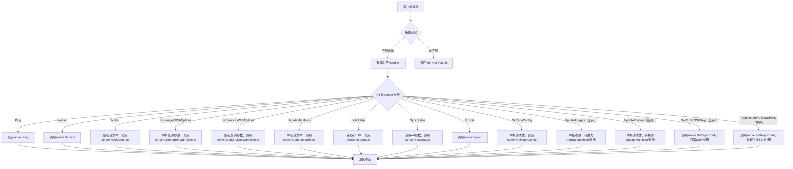
```mermaid
graph TD
A[客户端请求] --> B{路由匹配}
B -->|匹配成功| C[选择对应Handler]
B -->|未匹配| D[返回404 Not Found]
C --> E{HTTPServer方法}
E -->|Ping| F[调用server.Ping]
E -->|Version| G[调用server.Version]
E -->|Notify| H[解析请求体，调用server.NotifyChange]
E -->|ListImagesWithOptions| I[解析查询参数，调用server.ListImagesWithOptions]
E -->|ListServicesWithOptions| J[解析查询参数，调用server.ListServicesWithOptions]
E -->|UpdateManifests| K[解析请求体，调用server.UpdateManifests]
E -->|JobStatus| L[获取job ID，调用server.JobStatus]
E -->|SyncStatus| M[获取ref参数，调用server.SyncStatus]
E -->|Export| N[调用server.Export]
E -->|GitRepoConfig| O[解析请求体，调用server.GitRepoConfig]
E -->|UpdateImages（废弃）| P[解析参数，转换为UpdateManifests调用]
E -->|UpdatePolicies（废弃）| Q[解析请求体，转换为UpdateManifests调用]
E -->|GetPublicSSHKey（废弃）| R[调用server.GitRepoConfig获取SSH公钥]
E -->|RegeneratePublicSSHKey（废弃）| S[调用server.GitRepoConfig重新生成SSH公钥]
F --> T[返回响应]
G --> T
H --> T
I --> T
J --> T
K --> T
L --> T
M --> T
N --> T
O --> T
P --> T
Q --> T
R --> T
S --> T
```

## 类结构

```
HTTPServer (HTTP处理服务器)
└── 包含 api.Server 接口实现
```

## 全局变量及字段


### `requestDuration`
    
Prometheus请求持续时间指标，用于记录HTTP请求的处理时间

类型：`*stdprometheus.HistogramVec`
    


### `HTTPServer.server`
    
底层API服务器接口，提供Flux核心业务逻辑

类型：`api.Server`
    
    

## 全局函数及方法


### `NewRouter`

创建并配置一个新的 `mux.Router` 路由器，用于处理 Flux daemon 的 HTTP API 请求。该函数初始化路由、标记已弃用的 API 版本，并设置默认的"NotFound"处理器。

参数：

- 无参数

返回值：`*mux.Router`，返回一个配置好的 gorilla/mux 路由器实例，包含已弃用的版本和错误处理路由

#### 流程图

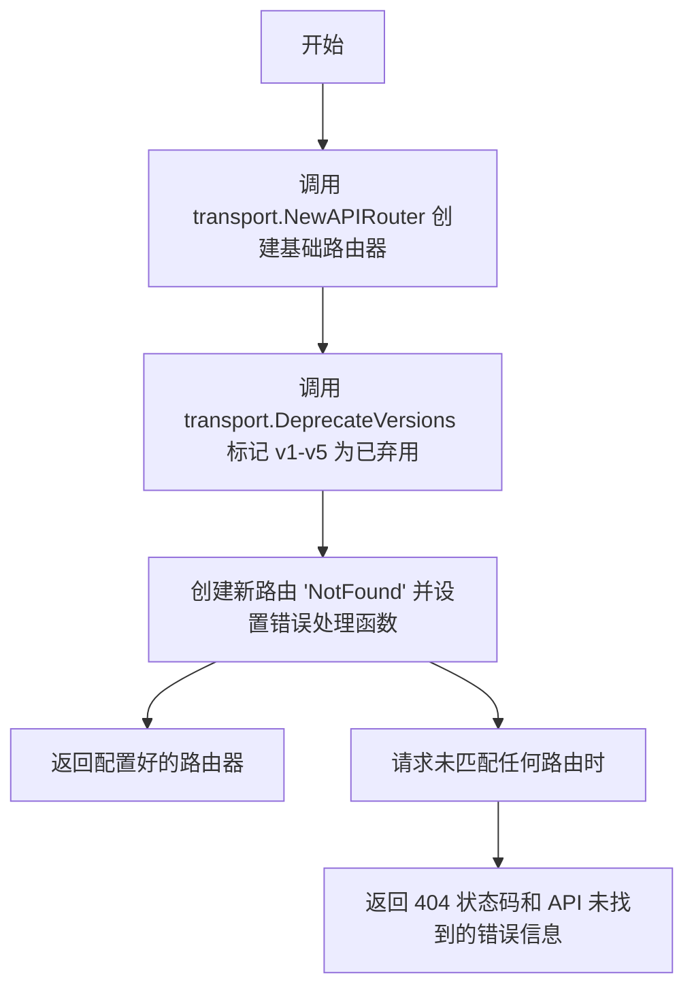
```mermaid
flowchart TD
    A[开始] --> B[调用 transport.NewAPIRouter 创建基础路由器]
    B --> C[调用 transport.DeprecateVersions 标记 v1-v5 为已弃用]
    C --> D[创建新路由 'NotFound' 并设置错误处理函数]
    D --> E[返回配置好的路由器]
    
    D --> D1[请求未匹配任何路由时]
    D1 --> D2[返回 404 状态码和 API 未找到的错误信息]
```

#### 带注释源码

```go
// NewRouter 创建并返回一个配置好的 mux.Router 实例
// 该路由器用于处理 Flux daemon 的所有 HTTP API 请求
func NewRouter() *mux.Router {
	// 1. 创建基础 API 路由器
	r := transport.NewAPIRouter()

	// 2. 标记所有旧版本为已弃用
	// 这些版本的 API 不再被支持，客户端应使用最新版本
	transport.DeprecateVersions(r, "v1", "v2", "v3", "v4", "v5")

	// 3. 设置默认的 NotFound 处理器
	// 当请求不匹配任何已定义的路由时触发
	// 假定调用旧版或不支持的 API
	r.NewRoute().Name("NotFound").HandlerFunc(func(w http.ResponseWriter, r *http.Request) {
		// 返回 404 错误，包含未找到的路径信息
		transport.WriteError(w, r, http.StatusNotFound, transport.MakeAPINotFound(r.URL.Path))
	})

	// 4. 返回配置完成的路由器
	return r
}
```


### `NewHandler`

创建带有中间件的HTTP处理器，将API服务器方法绑定到路由并添加Prometheus监控中间件。

参数：

- `s`：`api.Server`，核心API服务器接口，提供所有的业务逻辑处理方法
- `r`：`*mux.Router`，Gorilla Mux路由器实例，用于注册HTTP路由和处理函数

返回值：`http.Handler`，返回包装了监控中间件的HTTP处理器

#### 流程图

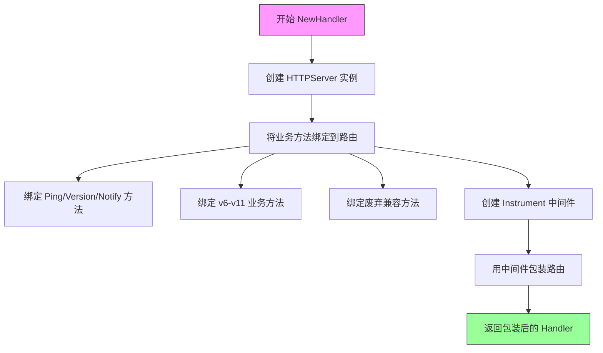
```mermaid
flowchart TD
    A[开始 NewHandler] --> B[创建 HTTPServer 实例]
    B --> C[将业务方法绑定到路由]
    C --> C1[绑定 Ping/Version/Notify 方法]
    C --> C2[绑定 v6-v11 业务方法]
    C --> C3[绑定废弃兼容方法]
    C --> D[创建 Instrument 中间件]
    D --> E[用中间件包装路由]
    E --> F[返回包装后的 Handler]
    
    style A fill:#f9f,stroke:#333
    style F fill:#9f9,stroke:#333
```

#### 带注释源码

```go
// NewHandler 创建带有中间件的HTTP处理器
// 参数:
//   - s: API服务器接口，提供Flux集群的业务逻辑
//   - r: Gorilla Mux路由器实例
// 返回:
//   - 包装了Prometheus监控中间件的HTTP处理器
func NewHandler(s api.Server, r *mux.Router) http.Handler {
	// 创建HTTPServer封装结构体，将API服务器包装起来
	handle := HTTPServer{s}

	// 绑定v11版本的核心方法（从Upstream迁移而来）
	r.Get(transport.Ping).HandlerFunc(handle.Ping)         // 健康检查
	r.Get(transport.Version).HandlerFunc(handle.Version)    // 获取版本信息
	r.Get(transport.Notify).HandlerFunc(handle.Notify)      // 通知变更

	// 绑定v6-v11版本的业务处理方法
	r.Get(transport.ListServices).HandlerFunc(handle.ListServicesWithOptions)              // 列出服务
	r.Get(transport.ListServicesWithOptions).HandlerFunc(handle.ListServicesWithOptions)   // 带选项列出服务
	r.Get(transport.ListImages).HandlerFunc(handle.ListImagesWithOptions)                  // 列出镜像
	r.Get(transport.ListImagesWithOptions).HandlerFunc(handle.ListImagesWithOptions)      // 带选项列出镜像
	r.Get(transport.UpdateManifests).HandlerFunc(handle.UpdateManifests)                    // 更新清单
	r.Get(transport.JobStatus).HandlerFunc(handle.JobStatus)                                // 任务状态
	r.Get(transport.SyncStatus).HandlerFunc(handle.SyncStatus)                              // 同步状态
	r.Get(transport.Export).HandlerFunc(handle.Export)                                      // 导出配置
	r.Get(transport.GitRepoConfig).HandlerFunc(handle.GitRepoConfig)                       // Git仓库配置

	// 绑定用于兼容旧版fluxctl的废弃方法
	// 这些方法应尽快移除以减少技术债务
	r.Get(transport.UpdateImages).HandlerFunc(handle.UpdateImages)               // 更新镜像（旧API）
	r.Get(transport.UpdatePolicies).HandlerFunc(handle.UpdatePolicies)           // 更新策略（旧API）
	r.Get(transport.GetPublicSSHKey).HandlerFunc(handle.GetPublicSSHKey)         // 获取公钥
	r.Get(transport.RegeneratePublicSSHKey).HandlerFunc(handle.RegeneratePublicSSHKey) // 重新生成公钥

	// 使用Prometheus监控中间件包装路由器
	// 记录每个请求的耗时和路由信息
	return middleware.Instrument{
		RouteMatcher: r,      // 路由匹配器
		Duration:     requestDuration, // Histogram指标向量
	}.Wrap(r) // 返回包装后的处理器
}
```


### `HTTPServer.Ping`

Ping健康检查方法，用于处理HTTP健康检查请求，验证底层服务是否正常运行。该方法调用内部server的Ping函数，如果服务健康则返回204状态码，否则返回错误响应。

参数：

- `w`：`http.ResponseWriter`，HTTP响应写入器，用于向客户端发送响应
- `r`：`*http.Request`，HTTP请求对象，包含请求上下文和相关信息

返回值：无明确返回值（通过HTTP状态码表达结果）

#### 流程图

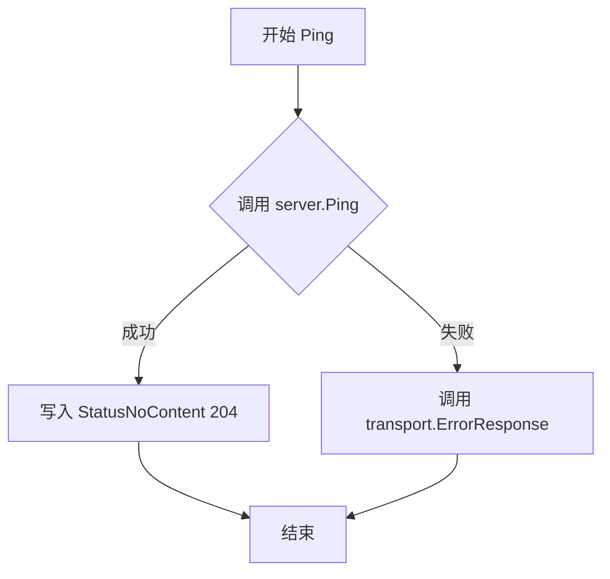
```mermaid
flowchart TD
    A[开始 Ping] --> B{调用 server.Ping}
    B -->|成功| C[写入 StatusNoContent 204]
    B -->|失败| D[调用 transport.ErrorResponse]
    C --> E[结束]
    D --> E
```

#### 带注释源码

```go
// Ping 处理健康检查请求
// 验证底层 API server 是否可访问
func (s HTTPServer) Ping(w http.ResponseWriter, r *http.Request) {
    // 调用内部 server 的 Ping 方法进行健康检查
    // 传入请求的上下文 context.Context
	if err := s.server.Ping(r.Context()); err != nil {
        // 如果健康检查失败，将错误写入响应
		transport.ErrorResponse(w, r, err)
		return
	}
    // 健康检查成功，返回 HTTP 204 No Content 状态码
	w.WriteHeader(http.StatusNoContent)
	return
}
```


### `HTTPServer.Version`

获取服务器版本信息的 HTTP 处理函数，通过调用内部 API 服务器的 Version 方法获取版本号，并以 JSON 格式返回给客户端。

参数：

- `w`：`http.ResponseWriter`，用于写入 HTTP 响应
- `r`：`*http.Request`，HTTP 请求对象，包含上下文信息

返回值：无显式返回值（`void`），通过 `http.ResponseWriter` 返回 JSON 响应

#### 流程图

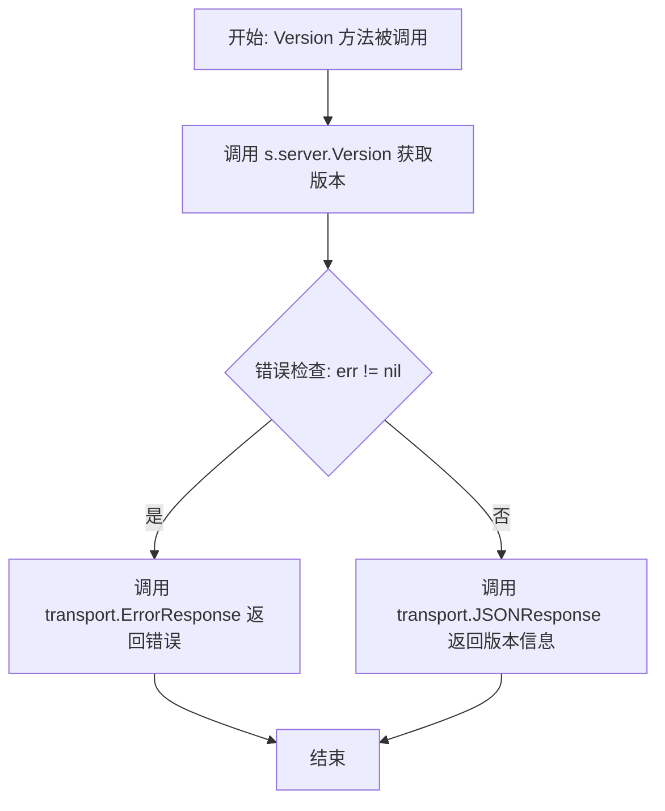
```mermaid
flowchart TD
    A[开始: Version 方法被调用] --> B[调用 s.server.Version 获取版本]
    B --> C{错误检查: err != nil}
    C -->|是| D[调用 transport.ErrorResponse 返回错误]
    D --> E[结束]
    C -->|否| F[调用 transport.JSONResponse 返回版本信息]
    F --> E
```

#### 带注释源码

```go
// Version 处理 GET /version 请求，返回服务器的版本信息
func (s HTTPServer) Version(w http.ResponseWriter, r *http.Request) {
	// 从底层 API 服务器获取版本信息
	// 参数 r.Context() 用于传递请求的上下文（包含超时、取消等控制）
	version, err := s.server.Version(r.Context())
	
	// 检查是否发生错误（如版本获取失败、上下文取消等）
	if err != nil {
		// 发生错误时，通过 ErrorResponse 发送错误信息给客户端
		transport.ErrorResponse(w, r, err)
		return // 提前返回，不再继续执行
	}
	
	// 成功获取版本信息后，将其以 JSON 格式写入响应
	transport.JSONResponse(w, r, version)
}
```


### `HTTPServer.Notify`

该方法是 Flux 守护进程的 HTTP API 处理器，用于接收并处理来自外部客户端的配置变更通知。它接收一个 JSON 格式的 `v9.Change` 对象，将其解码后调用底层 `api.Server` 的 `NotifyChange` 方法来触发变更处理流程，最后返回 HTTP 202 Accepted 状态表示请求已被接受。

参数：

- `w`：`http.ResponseWriter`，HTTP 响应写入器，用于向客户端发送响应
- `r`：`*http.Request`，HTTP 请求对象，包含客户端发送的请求数据

返回值：该方法没有显式的返回值（Go 语言中 `func` 返回空），通过 `http.ResponseWriter` 以 HTTP 状态码形式返回结果。

#### 流程图

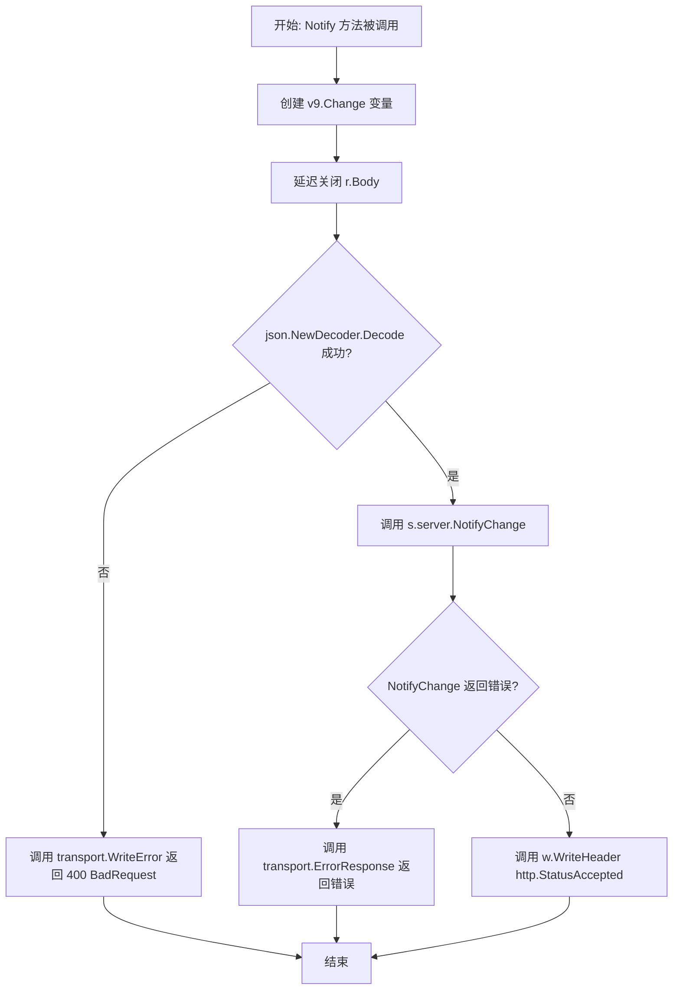
```mermaid
flowchart TD
    A[开始: Notify 方法被调用] --> B[创建 v9.Change 变量]
    B --> C[延迟关闭 r.Body]
    C --> D{json.NewDecoder.Decode 成功?}
    D -->|是| E[调用 s.server.NotifyChange]
    D -->|否| F[调用 transport.WriteError 返回 400 BadRequest]
    F --> G[结束]
    E --> H{NotifyChange 返回错误?}
    H -->|是| I[调用 transport.ErrorResponse 返回错误]
    I --> G
    H -->|否| J[调用 w.WriteHeader http.StatusAccepted]
    J --> G
```

#### 带注释源码

```go
// Notify 处理 HTTP POST 请求，用于接收外部配置变更通知
// 参数:
//   - w: HTTP 响应写入器
//   - r: HTTP 请求对象
//
// 该方法实现以下功能:
//  1. 从请求体中解析 JSON 格式的 v9.Change 对象
//  2. 将变更信息传递给底层 api.Server 进行处理
//  3. 返回 HTTP 202 Accepted 表示请求已被接受
func (s HTTPServer) Notify(w http.ResponseWriter, r *http.Request) {
	// 1. 声明一个 v9.Change 类型的变量用于存储解码后的变更数据
	var change v9.Change
	
	// 2. 使用 defer 确保请求体在函数结束时被关闭，释放资源
	defer r.Body.Close()

	// 3. 从请求体中解析 JSON 数据到 change 变量
	if err := json.NewDecoder(r.Body).Decode(&change); err != nil {
		// 3.1 解析失败时，返回 HTTP 400 Bad Request 错误
		transport.WriteError(w, r, http.StatusBadRequest, err)
		return
	}
	
	// 4. 调用底层 API Server 的 NotifyChange 方法处理变更
	if err := s.server.NotifyChange(r.Context(), change); err != nil {
		// 4.1 处理失败时，返回错误响应
		transport.ErrorResponse(w, r, err)
		return
	}
	
	// 5. 成功处理后，返回 HTTP 202 Accepted 状态码
	// 表示请求已被接受并正在异步处理中
	w.WriteHeader(http.StatusAccepted)
}
```


### `HTTPServer.JobStatus`

获取指定任务（Job）的状态信息。该方法从HTTP请求路径参数中提取任务ID，调用后端服务查询任务状态，并将状态结果以JSON格式返回给客户端。

参数：

- `w`：`http.ResponseWriter`，HTTP响应写入器，用于向客户端发送响应
- `r`：`*http.Request`，HTTP请求对象，包含请求路径参数和上下文信息

返回值：无直接返回值（通过HTTP响应返回）。若发生错误，通过`transport.ErrorResponse`返回错误；若成功，通过`transport.JSONResponse`返回任务状态。

#### 流程图

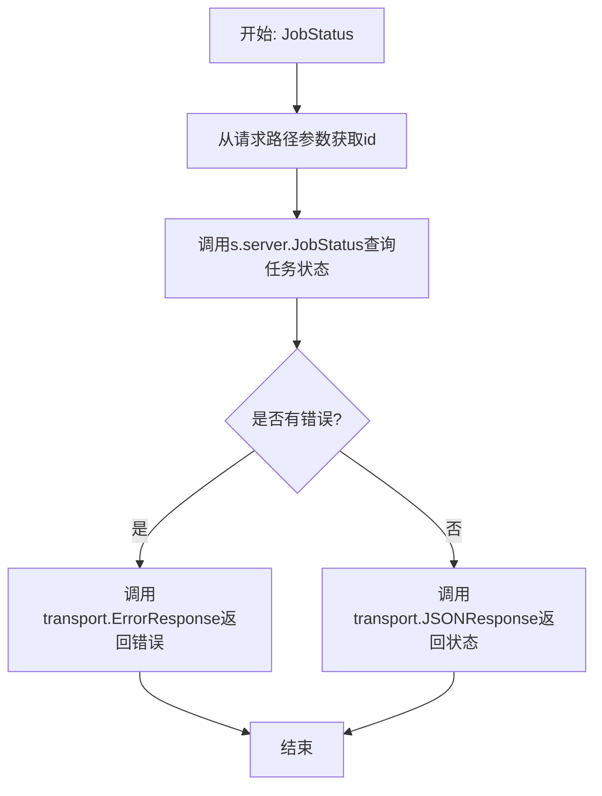
```mermaid
flowchart TD
    A[开始: JobStatus] --> B[从请求路径参数获取id]
    B --> C[调用s.server.JobStatus查询任务状态]
    C --> D{是否有错误?}
    D -->|是| E[调用transport.ErrorResponse返回错误]
    D -->|否| F[调用transport.JSONResponse返回状态]
    E --> G[结束]
    F --> G
```

#### 带注释源码

```go
// JobStatus 处理获取任务状态的HTTP请求
// 参数:
//   - w: HTTP响应写入器
//   - r: HTTP请求对象
func (s HTTPServer) JobStatus(w http.ResponseWriter, r *http.Request) {
	// 从请求路径参数中提取任务ID
	id := job.ID(mux.Vars(r)["id"])
	
	// 调用后端服务获取任务状态
	status, err := s.server.JobStatus(r.Context(), id)
	
	// 处理查询错误
	if err != nil {
		transport.ErrorResponse(w, r, err)
		return
	}
	
	// 成功时以JSON格式返回任务状态
	transport.JSONResponse(w, r, status)
}
```


### `HTTPServer.SyncStatus`

获取指定 Git 引用（ref）的同步状态，返回该引用对应的提交历史记录。

参数：

- `w`：`http.ResponseWriter`，HTTP 响应写入器，用于向客户端返回数据
- `r`：`*http.Request`，HTTP 请求对象，包含请求路径参数和上下文信息

返回值：无直接返回值（`void`），通过 `http.ResponseWriter` 以 JSON 格式返回同步状态，或在错误时返回 HTTP 错误响应

#### 流程图

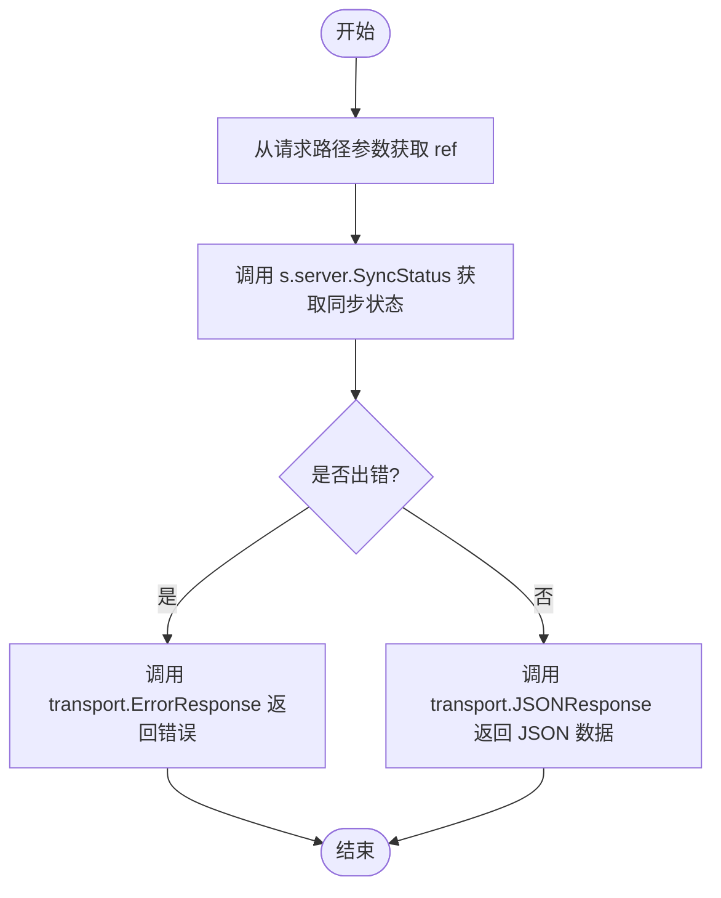
```mermaid
flowchart TD
    A([开始]) --> B[从请求路径参数获取 ref]
    B --> C[调用 s.server.SyncStatus 获取同步状态]
    C --> D{是否出错?}
    D -->|是| E[调用 transport.ErrorResponse 返回错误]
    D -->|否| F[调用 transport.JSONResponse 返回 JSON 数据]
    E --> G([结束])
    F --> G
```

#### 带注释源码

```go
// SyncStatus 处理获取同步状态的 HTTP 请求
// 参数:
//   - w: HTTP 响应写入器，用于向客户端返回数据
//   - r: HTTP 请求对象，包含请求路径参数和上下文信息
//
// 返回值: 无直接返回值，通过 w 以 JSON 格式返回同步状态
func (s HTTPServer) SyncStatus(w http.ResponseWriter, r *http.Request) {
	// 1. 从 HTTP 请求路径参数中提取 Git 引用（ref）
	ref := mux.Vars(r)["ref"]

	// 2. 调用底层 API Server 的 SyncStatus 方法获取同步状态
	//    - 传入请求上下文和 Git 引用
	//    - 返回该引用对应的提交历史记录（commits）
	commits, err := s.server.SyncStatus(r.Context(), ref)

	// 3. 错误处理：如果获取同步状态失败
	if err != nil {
		// 使用 transport.ErrorResponse 返回错误信息并结束处理
		transport.ErrorResponse(w, r, err)
		return
	}

	// 4. 成功响应：将同步状态（提交历史）以 JSON 格式返回给客户端
	transport.JSONResponse(w, r, commits)
}
```


### `HTTPServer.ListImagesWithOptions`

该方法是一个HTTP处理函数，用于根据客户端提供的查询参数（服务规范、容器字段、命名空间等）从后端API获取镜像列表，并以JSON格式返回结果。

参数：

- `w`：`http.ResponseWriter`，用于写入HTTP响应
- `r`：`*http.Request`，包含客户端请求信息及查询参数

返回值：无直接返回值（通过`http.ResponseWriter`写入响应数据）

#### 流程图

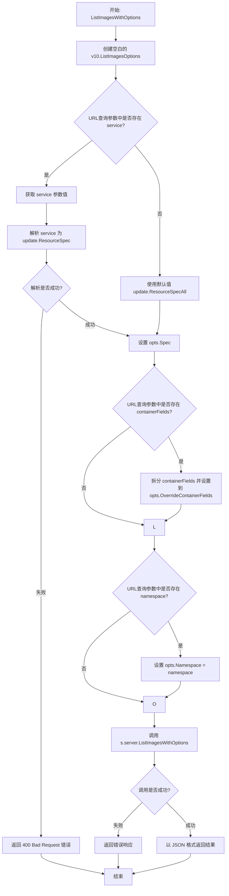
```mermaid
flowchart TD
    A[开始: ListImagesWithOptions] --> B[创建空白的 v10.ListImagesOptions]
    B --> C{URL查询参数中是否存在 service?}
    C -->|是| D[获取 service 参数值]
    C -->|否| E[使用默认值 update.ResourceSpecAll]
    D --> F[解析 service 为 update.ResourceSpec]
    F --> G{解析是否成功?}
    G -->|失败| H[返回 400 Bad Request 错误]
    G -->|成功| I[设置 opts.Spec]
    E --> I
    I --> J{URL查询参数中是否存在 containerFields?}
    J -->|是| K[拆分 containerFields 并设置到 opts.OverrideContainerFields]
    J -->|否| L
    K --> L
    L --> M{URL查询参数中是否存在 namespace?}
    M -->|是| N[设置 opts.Namespace = namespace]
    M -->|否| O
    N --> O
    O --> P[调用 s.server.ListImagesWithOptions]
    P --> Q{调用是否成功?}
    Q -->|失败| R[返回错误响应]
    Q -->|成功| S[以 JSON 格式返回结果]
    H --> T[结束]
    R --> T
    S --> T
```

#### 带注释源码

```go
// ListImagesWithOptions 处理获取镜像列表的HTTP请求，支持通过URL查询参数指定筛选条件
// 参数:
//   - w: HTTP响应写入器，用于向客户端返回数据
//   - r: HTTP请求对象，包含查询参数等信息
func (s HTTPServer) ListImagesWithOptions(w http.ResponseWriter, r *http.Request) {
	// 1. 创建用于存储查询选项的结构体
	var opts v10.ListImagesOptions
	
	// 2. 获取URL查询参数集合
	queryValues := r.URL.Query()

	// --- 处理 service 参数 ---
	// service: 用于指定要列出镜像的服务，默认为全部服务
	service := queryValues.Get("service")
	if service == "" {
		// 如果未提供service参数，使用表示全部资源的默认值
		service = string(update.ResourceSpecAll)
	}
	
	// 解析service字符串为资源规范对象
	spec, err := update.ParseResourceSpec(service)
	if err != nil {
		// 解析失败时返回400错误，包含具体的解析错误信息
		transport.WriteError(w, r, http.StatusBadRequest, errors.Wrapf(err, "parsing service spec %q", service))
		return
	}
	opts.Spec = spec

	// --- 处理 containerFields 参数 ---
	// containerFields: 用于覆盖容器结构体中需要返回的字段，多个字段用逗号分隔
	containerFields := queryValues.Get("containerFields")
	if containerFields != "" {
		// 将逗号分隔的字符串拆分为字符串切片
		opts.OverrideContainerFields = strings.Split(containerFields, ",")
	}

	// --- 处理 namespace 参数 ---
	// namespace: 指定要列出镜像的命名空间
	namespace := queryValues.Get("namespace")
	if namespace != "" {
		opts.Namespace = namespace
	}

	// 3. 调用后端API获取镜像列表
	d, err := s.server.ListImagesWithOptions(r.Context(), opts)
	if err != nil {
		// API调用失败时返回错误响应
		transport.ErrorResponse(w, r, err)
		return
	}
	
	// 4. 成功时以JSON格式返回结果
	transport.JSONResponse(w, r, d)
}
```


### `HTTPServer.ListServicesWithOptions`

获取服务列表（带选项）是 HTTPServer 类型的 HTTP 处理方法，用于处理客户端请求，根据提供的查询参数（命名空间和服务 ID 列表）获取符合条件的服务列表，并以 JSON 格式返回结果。

参数：

- `w`：`http.ResponseWriter`，用于写入 HTTP 响应
- `r`：`*http.Request`，传入的 HTTP 请求对象，包含 URL 查询参数等信息

返回值：无直接返回值（通过 `http.ResponseWriter` 输出结果），但内部调用 `s.server.ListServicesWithOptions` 返回服务列表结果，类型为切片或集合，最终通过 `transport.JSONResponse` 写入响应

#### 流程图

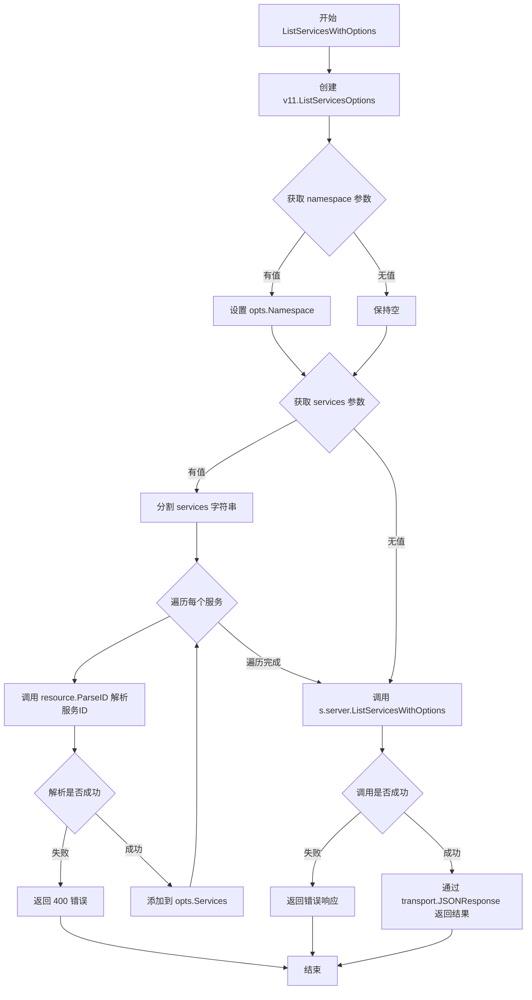
```mermaid
flowchart TD
    A[开始 ListServicesWithOptions] --> B[创建 v11.ListServicesOptions]
    B --> C{获取 namespace 参数}
    C -->|有值| D[设置 opts.Namespace]
    C -->|无值| E[保持空]
    D --> F
    E --> F{获取 services 参数}
    F -->|有值| G[分割 services 字符串]
    G --> H{遍历每个服务}
    H --> I[调用 resource.ParseID 解析服务ID]
    I --> J{解析是否成功}
    J -->|失败| K[返回 400 错误]
    J -->|成功| L[添加到 opts.Services]
    L --> H
    H -->|遍历完成| M
    F -->|无值| M[调用 s.server.ListServicesWithOptions]
    K --> N[结束]
    M --> O{调用是否成功}
    O -->|失败| P[返回错误响应]
    O -->|成功| Q[通过 transport.JSONResponse 返回结果]
    P --> N
    Q --> N
```

#### 带注释源码

```go
// ListServicesWithOptions 处理获取服务列表的 HTTP 请求
// 参数：
//   - w: http.ResponseWriter 用于写入响应
//   - r: *http.Request 包含查询参数的请求对象
func (s HTTPServer) ListServicesWithOptions(w http.ResponseWriter, r *http.Request) {
	// 创建 v11 版本的 ListServicesOptions 用于存储查询选项
	var opts v11.ListServicesOptions
	
	// 从 URL 查询参数中获取 namespace（命名空间）
	opts.Namespace = r.URL.Query().Get("namespace")
	
	// 从 URL 查询参数中获取 services（服务列表，逗号分隔）
	services := r.URL.Query().Get("services")
	
	// 如果提供了 services 参数，则进行解析
	if services != "" {
		// 按逗号分割服务字符串
		for _, svc := range strings.Split(services, ",") {
			// 解析每个服务 ID
			id, err := resource.ParseID(svc)
			if err != nil {
				// 解析失败时返回 400 错误
				transport.WriteError(w, r, http.StatusBadRequest, errors.Wrapf(err, "parsing service spec %q", svc))
				return
			}
			// 将解析后的服务 ID 添加到选项中
			opts.Services = append(opts.Services, id)
		}
	}

	// 调用底层的 server 接口获取服务列表
	res, err := s.server.ListServicesWithOptions(r.Context(), opts)
	if err != nil {
		// 获取失败时返回错误响应
		transport.ErrorResponse(w, r, err)
		return
	}
	
	// 成功时以 JSON 格式返回结果
	transport.JSONResponse(w, r, res)
}
```


### `HTTPServer.UpdateManifests`

该方法是 `HTTPServer` 类的成员方法，作为 HTTP 处理程序接收客户端发起的清单更新请求。它从请求体中解析 `update.Spec` 对象，调用内部 `api.Server` 的 `UpdateManifests` 方法执行实际的清单更新操作，并返回对应的任务 ID（job.ID）给客户端。

参数：

- `w`：`http.ResponseWriter`，用于向客户端写入 HTTP 响应
- `r`：`*http.Request`，客户端发起的 HTTP 请求，方法从中读取请求体以获取更新规范

返回值：无显式返回值（通过 `http.ResponseWriter` 和 `transport.JSONResponse` 返回结果）

#### 流程图

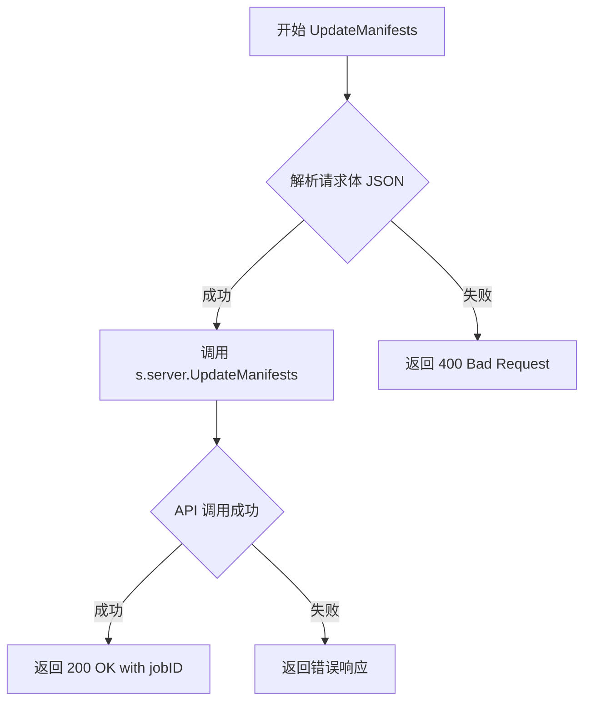
```mermaid
flowchart TD
    A[开始 UpdateManifests] --> B{解析请求体 JSON}
    B -->|成功| C[调用 s.server.UpdateManifests]
    B -->|失败| D[返回 400 Bad Request]
    C --> E{API 调用成功}
    E -->|成功| F[返回 200 OK with jobID]
    E -->|失败| G[返回错误响应]
```

#### 带注释源码

```go
// UpdateManifests 处理客户端发起的清单更新请求
// 参数:
//   - w: HTTP 响应写入器，用于向客户端返回响应
//   - r: HTTP 请求对象，包含客户端提交的更新规范
func (s HTTPServer) UpdateManifests(w http.ResponseWriter, r *http.Request) {
	// 声明一个 update.Spec 类型的变量用于存储解析后的请求体数据
	var spec update.Spec
	
	// 使用 JSON 解码器从请求体中解析 JSON 数据到 spec 变量
	if err := json.NewDecoder(r.Body).Decode(&spec); err != nil {
		// 如果解码失败，返回 400 Bad Request 错误响应
		transport.WriteError(w, r, http.StatusBadRequest, err)
		return
	}

	// 调用内部 api.Server 的 UpdateManifests 方法执行实际的清单更新
	// 传入请求上下文和更新规范 spec，返回任务 ID 和可能的错误
	jobID, err := s.server.UpdateManifests(r.Context(), spec)
	
	// 检查 API 调用是否返回错误
	if err != nil {
		// 如果发生错误，返回错误响应
		transport.ErrorResponse(w, r, err)
		return
	}
	
	// 操作成功，将任务 ID 以 JSON 格式写入响应返回给客户端
	transport.JSONResponse(w, r, jobID)
}
```


### `HTTPServer.Export`

该方法作为HTTP处理程序，负责从内部API服务器获取当前系统或集群的完整状态（Export），并将其序列化为JSON格式返回给客户端。如果在获取状态过程中发生错误，则返回相应的错误信息。

参数：

-  `w`：`http.ResponseWriter`，用于写入HTTP响应内容
-  `r`：`*http.Request`，包含HTTP请求的上下文信息

返回值：无（Go语言HTTP处理函数通过ResponseWriter写入响应，不通过返回值传递）

#### 流程图

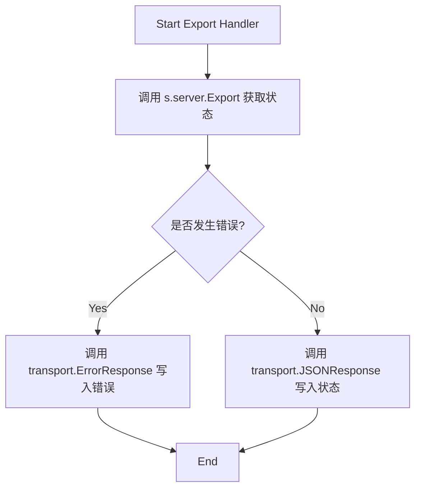
```mermaid
flowchart TD
    A[Start Export Handler] --> B[调用 s.server.Export 获取状态]
    B --> C{是否发生错误?}
    C -- Yes --> D[调用 transport.ErrorResponse 写入错误]
    D --> E[End]
    C -- No --> F[调用 transport.JSONResponse 写入状态]
    F --> E
```

#### 带注释源码

```go
func (s HTTPServer) Export(w http.ResponseWriter, r *http.Request) {
	// 调用内部 server 对象的 Export 方法，传入请求的上下文来获取状态数据
	status, err := s.server.Export(r.Context())
	
	// 检查获取状态是否失败
	if err != nil {
		// 如果发生错误，使用 ErrorResponse 工具将错误信息写入 HTTP 响应
		transport.ErrorResponse(w, r, err)
		// 终止处理流程
		return
	}

	// 如果获取成功，将状态数据序列化为 JSON 并写入响应
	transport.JSONResponse(w, r, status)
}
```


### `HTTPServer.GitRepoConfig`

该方法是 `HTTPServer` 类型的成员方法，用于处理获取或重新生成 Git 仓库配置的 HTTP 请求。它从请求体中解析 `regenerate` 布尔参数，调用底层 `api.Server` 的 `GitRepoConfig` 方法获取配置信息，并将结果以 JSON 格式返回给客户端。

参数：

- `w`：`http.ResponseWriter`，HTTP 响应写入器，用于向客户端发送响应
- `r`：`*http.Request`，HTTP 请求对象，包含客户端请求的所有信息

返回值：`无直接返回值`，该方法通过 `http.ResponseWriter` 以 JSON 格式输出结果，通过 `transport.JSONResponse` 将 `api.Server.GitRepoConfig` 的返回值（Git 仓库配置信息）写入响应体

#### 流程图

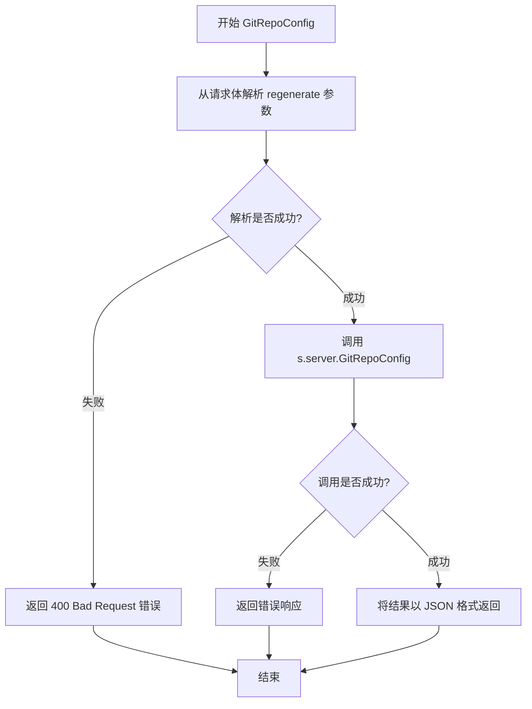
```mermaid
flowchart TD
    A[开始 GitRepoConfig] --> B[从请求体解析 regenerate 参数]
    B --> C{解析是否成功?}
    C -->|失败| D[返回 400 Bad Request 错误]
    C -->|成功| E[调用 s.server.GitRepoConfig]
    E --> F{调用是否成功?}
    F -->|失败| G[返回错误响应]
    F -->|成功| H[将结果以 JSON 格式返回]
    D --> I[结束]
    G --> I
    H --> I
```

#### 带注释源码

```go
// GitRepoConfig 处理获取或重新生成 Git 仓库配置的 HTTP 请求
// 参数:
//   - w: HTTP 响应写入器
//   - r: HTTP 请求对象
func (s HTTPServer) GitRepoConfig(w http.ResponseWriter, r *http.Request) {
	// 定义 regenerate 变量，用于存储是否需要重新生成配置的标志
	var regenerate bool
	
	// 从请求体中解析 JSON 数据到 regenerate 变量
	if err := json.NewDecoder(r.Body).Decode(&regenerate); err != nil {
		// 如果解析失败，返回 400 Bad Request 错误
		transport.WriteError(w, r, http.StatusBadRequest, err)
	}
	
	// 调用底层 api.Server 的 GitRepoConfig 方法获取配置
	// 参数: r.Context() - 请求上下文, regenerate - 是否重新生成
	res, err := s.server.GitRepoConfig(r.Context(), regenerate)
	
	// 如果调用失败，返回错误响应
	if err != nil {
		transport.ErrorResponse(w, r, err)
	}
	
	// 如果调用成功，将结果以 JSON 格式写入响应
	transport.JSONResponse(w, r, res)
}
```


### `HTTPServer.UpdateImages`

这是一个废弃的 HTTP 处理器方法，用于处理客户端更新镜像的请求。该方法从请求参数中解析镜像、服务规范、发布类型等信息，构建 `update.ReleaseImageSpec` 并调用后端的 `UpdateManifests` 方法执行更新操作。此方法的存在是为了向后兼容旧的 fluxctl 客户端。

参数：

- `w`：`http.ResponseWriter`，HTTP 响应写入器，用于向客户端返回响应
- `r`：`*http.Request`，HTTP 请求对象，包含请求路径、参数和表单数据

返回值：无直接返回值，结果通过 `transport.JSONResponse` 写入 HTTP 响应

#### 流程图

```mermaid
flowchart TD
    A[开始 UpdateImages] --> B[从 mux.Vars 获取 image 和 kind]
    B --> C{ParseForm 是否成功}
    C -->|失败| E[返回 400 错误]
    C -->|成功| D[遍历 Form["service"] 解析服务规范]
    D --> F{解析 imageSpec}
    F -->|失败| G[返回 400 错误]
    F -->|成功| H{解析 releaseKind}
    H -->|失败| I[返回 400 错误]
    H -->|成功| J[解析 exclude 参数获取排除的服务列表]
    J --> K[构建 update.ReleaseImageSpec]
    K --> L[构建 update.Cause 包含 user 和 message]
    L --> M[调用 s.server.UpdateManifests 执行更新]
    M --> N{UpdateManifests 是否成功}
    N -->|失败| O[返回错误响应]
    N -->|成功| P[通过 transport.JSONResponse 返回结果]
    E --> Q[结束]
    G --> Q
    I --> Q
    O --> Q
    P --> Q
```

#### 带注释源码

```go
// UpdateImages 处理废弃的镜像更新请求
// 该方法已废弃，仅用于向后兼容旧的 fluxctl 客户端
func (s HTTPServer) UpdateImages(w http.ResponseWriter, r *http.Request) {
	// 从 URL 路径变量中提取 image 和 kind 参数
	var (
		vars  = mux.Vars(r)
		image = vars["image"]   // 要更新的镜像名称
		kind  = vars["kind"]    // 发布类型
	)
	
	// 解析表单数据，支持 URL 编码的表单参数
	if err := r.ParseForm(); err != nil {
		transport.WriteError(w, r, http.StatusBadRequest, errors.Wrapf(err, "parsing form"))
		return
	}
	
	// 解析服务规范列表，支持多个服务
	var serviceSpecs []update.ResourceSpec
	for _, service := range r.Form["service"] {
		serviceSpec, err := update.ParseResourceSpec(service)
		if err != nil {
			transport.WriteError(w, r, http.StatusBadRequest, errors.Wrapf(err, "parsing service spec %q", service))
			return
		}
		serviceSpecs = append(serviceSpecs, serviceSpec)
	}
	
	// 解析镜像规范
	imageSpec, err := update.ParseImageSpec(image)
	if err != nil {
		transport.WriteError(w, r, http.StatusBadRequest, errors.Wrapf(err, "parsing image spec %q", image))
		return
	}
	
	// 解析发布类型（Major/Minor/Patch/Rolling）
	releaseKind, err := update.ParseReleaseKind(kind)
	if err != nil {
		transport.WriteError(w, r, http.StatusBadRequest, errors.Wrapf(err, "parsing release kind %q", kind))
		return
	}

	// 解析要排除的服务列表
	var excludes []resource.ID
	for _, ex := range r.URL.Query()["exclude"] {
		s, err := resource.ParseID(ex)
		if err != nil {
			transport.WriteError(w, r, http.StatusBadRequest, errors.Wrapf(err, "parsing excluded service %q", ex))
			return
		}
		excludes = append(excludes, s)
	}

	// 构建镜像发布规范
	spec := update.ReleaseImageSpec{
		ServiceSpecs: serviceSpecs,  // 要更新的服务列表
		ImageSpec:    imageSpec,      // 目标镜像
		Kind:         releaseKind,    // 发布策略
		Excludes:     excludes,       // 排除的服务
	}
	
	// 构建更新原因，记录用户和消息
	cause := update.Cause{
		User:    r.FormValue("user"),    // 更新操作用户
		Message: r.FormValue("message"), // 更新消息/说明
	}
	
	// 调用后端 API 执行更新操作
	result, err := s.server.UpdateManifests(r.Context(), update.Spec{
		Type:  update.Images,  // 指定更新类型为镜像更新
		Cause: cause,          // 包含原因信息
		Spec:  spec,           // 详细的更新规范
	})
	if err != nil {
		transport.ErrorResponse(w, r, err)
		return
	}
	
	// 将更新结果以 JSON 格式返回给客户端
	transport.JSONResponse(w, r, result)
}
```


### `HTTPServer.UpdatePolicies`

处理旧的废弃请求，用于更新集群中的策略。该方法接受包含策略更新的JSON请求体，解析用户提交的策略变更，构建更新规范并调用底层的`UpdateManifests`方法执行策略更新，最后返回更新任务的Job ID。

参数：

- `w`：`http.ResponseWriter`，HTTP响应写入器，用于向客户端返回结果
- `r`：`*http.Request`，HTTP请求对象，包含请求体和表单数据

返回值：无（通过`w`参数返回JSON响应）

#### 流程图

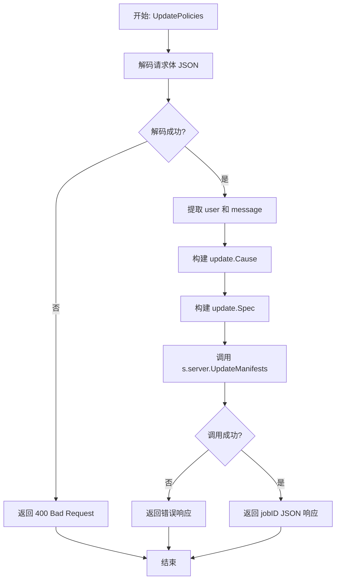
```mermaid
flowchart TD
    A[开始: UpdatePolicies] --> B[解码请求体 JSON]
    B --> C{解码成功?}
    C -->|否| D[返回 400 Bad Request]
    C -->|是| E[提取 user 和 message]
    E --> F[构建 update.Cause]
    F --> G[构建 update.Spec]
    G --> H[调用 s.server.UpdateManifests]
    H --> I{调用成功?}
    I -->|否| J[返回错误响应]
    I -->|是| K[返回 jobID JSON 响应]
    D --> L[结束]
    J --> L
    K --> L
```

#### 带注释源码

```go
// UpdatePolicies 处理策略更新请求（已废弃的旧版API）
// 该方法支持旧的fluxctl客户端，保留用于向后兼容
func (s HTTPServer) UpdatePolicies(w http.ResponseWriter, r *http.Request) {
	// 1. 定义变量存储从请求体中解码的策略更新
	var updates resource.PolicyUpdates
	
	// 2. 从请求体中解析JSON数据到PolicyUpdates结构
	if err := json.NewDecoder(r.Body).Decode(&updates); err != nil {
		// 解析失败时返回400错误
		transport.WriteError(w, r, http.StatusBadRequest, err)
		return
	}

	// 3. 从HTTP表单中提取更新原因信息
	cause := update.Cause{
		User:    r.FormValue("user"),    // 更新操作的用户
		Message: r.FormValue("message"), // 更新说明信息
	}

	// 4. 构建完整的更新规范，指定类型为Policy更新
	//    调用底层的UpdateManifests方法执行实际的策略更新
	jobID, err := s.server.UpdateManifests(
		r.Context(), 
		update.Spec{
			Type:  update.Policy,    // 指定更新类型为策略更新
			Cause: cause,           // 包含用户和消息的更新原因
			Spec:  updates,         // 具体的策略更新内容
		},
	)
	
	// 5. 检查更新操作是否成功
	if err != nil {
		// 失败时返回错误响应
		transport.ErrorResponse(w, r, err)
		return
	}

	// 6. 成功时将jobID以JSON格式返回给客户端
	transport.JSONResponse(w, r, jobID)
}
```


### `HTTPServer.GetPublicSSHKey`

获取SSH公钥（废弃）。该方法是一个已废弃的HTTP处理程序，用于返回与Git仓库关联的SSH公钥。目前保留此处理程序是为了支持旧版本的fluxctl客户端，应避免添加新引用以便最终可以移除。

参数：

- `w`：`http.ResponseWriter`，HTTP响应写入器，用于向客户端发送响应
- `r`：`*http.Request`，HTTP请求对象，包含客户端请求的所有信息

返回值：无直接返回值（通过ResponseWriter写入响应）

#### 流程图

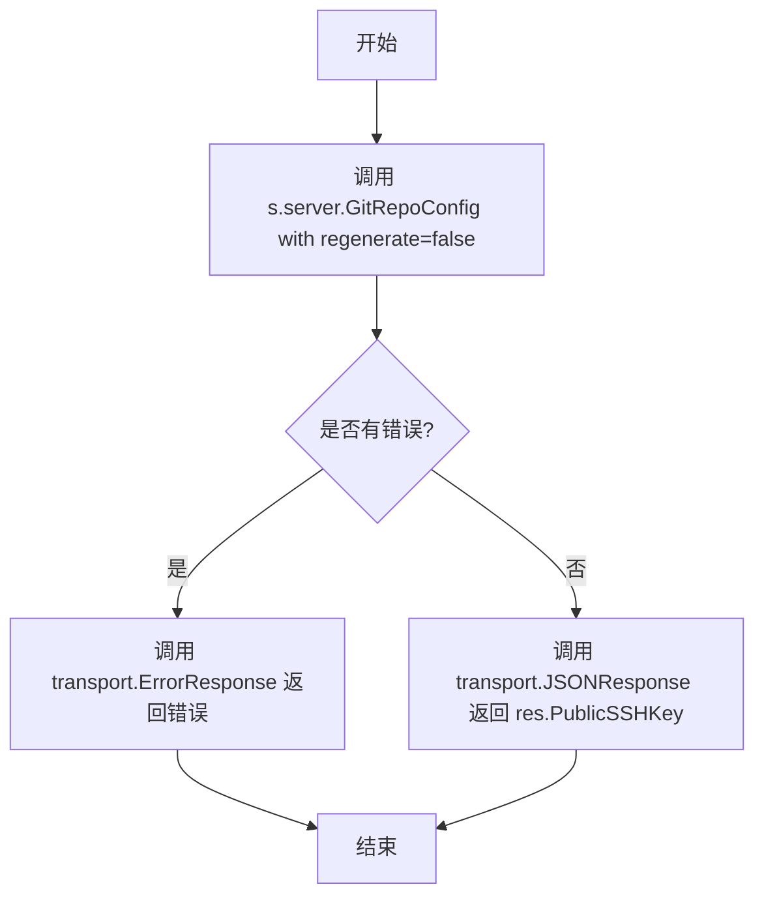
```mermaid
flowchart TD
    A[开始] --> B[调用 s.server.GitRepoConfig with regenerate=false]
    B --> C{是否有错误?}
    C -->|是| D[调用 transport.ErrorResponse 返回错误]
    C -->|否| E[调用 transport.JSONResponse 返回 res.PublicSSHKey]
    D --> F[结束]
    E --> F
```

#### 带注释源码

```go
// GetPublicSSHKey 处理获取SSH公钥的HTTP请求（已废弃）
// 该方法已被GitRepoConfig取代，保留用于向后兼容旧版fluxctl客户端
func (s HTTPServer) GetPublicSSHKey(w http.ResponseWriter, r *http.Request) {
	// 调用server的GitRepoConfig方法获取Git仓库配置
	// 参数false表示不重新生成SSH密钥
	res, err := s.server.GitRepoConfig(r.Context(), false)
	
	// 如果获取配置失败，返回错误响应并结束处理
	if err != nil {
		transport.ErrorResponse(w, r, err)
		return
	}
	
	// 成功获取配置后，将PublicSSHKey以JSON格式返回给客户端
	transport.JSONResponse(w, r, res.PublicSSHKey)
}
```


### `HTTPServer.RegeneratePublicSSHKey`

该方法是一个废弃的HTTP处理程序，用于重新生成SSH公钥。它通过调用底层服务接口 `GitRepoConfig` 并传入 `true` 参数来触发公钥重新生成操作，成功后返回HTTP 204 No Content状态。

参数：

- `w`：`http.ResponseWriter`，用于向HTTP客户端写入响应
- `r`：`*http.Request`，包含HTTP请求的所有信息，如上下文、路径参数等

返回值：无（通过HTTP状态码表示操作结果）

#### 流程图

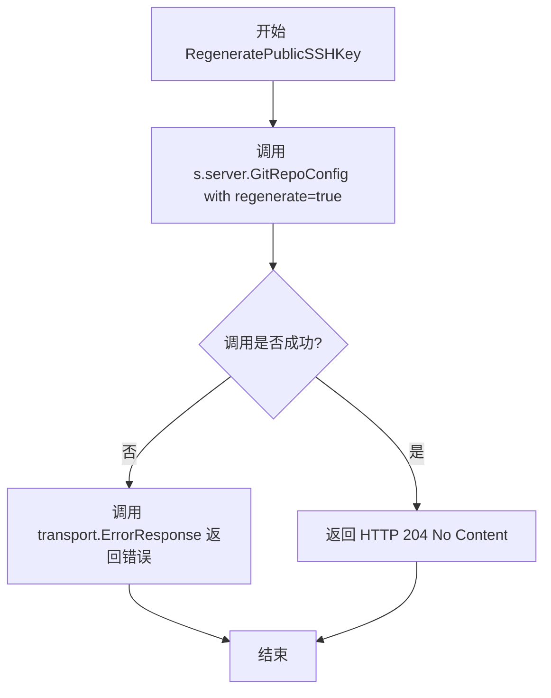
```mermaid
flowchart TD
    A[开始 RegeneratePublicSSHKey] --> B[调用 s.server.GitRepoConfig with regenerate=true]
    B --> C{调用是否成功?}
    C -->|是| D[返回 HTTP 204 No Content]
    C -->|否| E[调用 transport.ErrorResponse 返回错误]
    E --> F[结束]
    D --> F
```

#### 带注释源码

```go
// RegeneratePublicSSHKey 处理重新生成SSH公钥的HTTP请求（已废弃）
// 该方法保留以支持旧版fluxctl客户端，建议使用GitRepoConfig方法替代
func (s HTTPServer) RegeneratePublicSSHKey(w http.ResponseWriter, r *http.Request) {
	// 调用服务层的GitRepoConfig方法，传入true表示需要重新生成公钥
	// 第一个返回值被忽略（因为该方法实际返回的是完整配置而非仅公钥）
	_, err := s.server.GitRepoConfig(r.Context(), true)
	
	// 检查是否发生错误
	if err != nil {
		// 错误发生：通过transport工具返回错误响应给客户端
		transport.ErrorResponse(w, r, err)
		return
	}
	
	// 操作成功：返回HTTP 204 No Content状态码，表示请求成功但无返回内容
	w.WriteHeader(http.StatusNoContent)
	return
}
```

## 关键组件


### HTTPServer 结构体

HTTPServer是核心的HTTP服务器结构体，封装了api.Server接口，用于处理所有HTTP请求并委托业务逻辑处理。

### NewRouter 函数

创建并配置gorilla/mux路由器，定义所有API端点的路由规则，并设置版本弃用和404处理逻辑。

### NewHandler 函数

创建带有Prometheus中间件包装的HTTP处理器，将HTTPServer方法注册到各个路由上，构建完整的HTTP处理链。

### Ping Handler

处理健康检查请求，验证服务器是否正常运行，返回204状态码表示成功。

### Version Handler

处理版本查询请求，获取并返回当前Flux服务器的版本信息。

### Notify Handler

处理变更通知请求，解析v9.Change类型的请求体，调用服务器的NotifyChange方法处理变更。

### JobStatus Handler

处理任务状态查询请求，从URL路径参数获取任务ID，查询并返回指定任务的执行状态。

### SyncStatus Handler

处理同步状态查询请求，根据ref参数获取Git仓库的同步状态信息。

### ListImagesWithOptions Handler

处理带选项的镜像列表查询请求，支持service、containerFields、namespace等查询参数，解析并传递给后端服务。

### UpdateManifests Handler

处理清单更新请求，解析update.Spec类型的请求体，调用服务器的UpdateManifests方法执行更新操作，返回任务ID。

### ListServicesWithOptions Handler

处理带选项的服务列表查询请求，支持namespace和services参数，解析服务ID并查询返回服务列表。

### Export Handler

处理导出请求，获取并返回当前系统的完整配置状态。

### GitRepoConfig Handler

处理Git仓库配置请求，支持可选的regenerate参数用于重新生成SSH密钥。

### UpdateImages Handler (Deprecated)

处理镜像更新请求的已弃用端点，解析image、kind、service等表单参数，构建ReleaseImageSpec并调用更新接口。

### UpdatePolicies Handler (Deprecated)

处理策略更新请求的已弃用端点，解析PolicyUpdates并调用UpdateManifests执行策略更新。

### GetPublicSSHKey Handler

获取当前Git仓库的公共SSH密钥。

### RegeneratePublicSSHKey Handler

重新生成Git仓库的公共SSH密钥。

### requestDuration 指标

Prometheus HistogramVec类型的度量指标，用于记录HTTP请求的处理时长，按方法、路由和状态码分组。


## 问题及建议


### 已知问题

-   **错误处理不一致**：在 `GitRepoConfig` 方法中，当 `json.NewDecoder(r.Body).Decode(&regenerate)` 失败后写入错误响应但没有 `return` 语句，导致代码继续执行而可能引发空指针异常
-   **废弃 API 混排**：已废弃的 handlers（`UpdateImages`、`UpdatePolicies` 等）与当前版本的 handlers 混在一起，增加代码维护难度且无明确废弃时间表
-   **响应状态码不一致**：某些端点对相似错误类型返回不同的 HTTP 状态码，如 `GitRepoConfig` 在解码失败时不返回状态码
-   **请求体未正确关闭**：在 `Notify` 方法中使用 `defer r.Body.Close()`，但当 `Decode` 成功后未明确关闭；其他方法的 body 资源也可能未充分释放
-   **未使用的返回值**：`RegeneratePublicSSHKey` 方法中忽略了第一个返回值（error），可能导致静默失败
-   **硬编码字符串**：错误消息和常量字符串散布在各处，难以统一国际化或修改
-   **缺少请求验证**：部分端点（如 `ListServicesWithOptions`）未充分验证所有必需参数的有效性
-   **无上下文超时**：handler 中未为长时间运行的操作设置显式的 context timeout
-   **无日志记录**：handlers 中完全缺少日志记录，线上问题排查困难

### 优化建议

-   **修复错误处理逻辑**：在 `GitRepoConfig` 和其他方法的错误分支添加 `return` 语句，确保错误响应后立即返回
-   **分离废弃 API**：将废弃的 handlers 迁移到单独的路由组或子包，并添加明确的废弃注释和计划移除版本
-   **统一响应格式**：建立标准化的错误响应结构体，确保所有端点对同类错误返回一致的 HTTP 状态码
-   **添加日志中间件**：利用现有 `middleware.Instrument` 扩展日志记录能力，记录关键操作和错误详情
-   **实现请求验证**：在处理函数入口处添加参数校验，使用结构体标签定义验证规则（如 `validate` 库）
-   **上下文超时控制**：为耗时的后端操作（如 `ListImagesWithOptions`、`UpdateManifests`）设置独立的 context timeout
-   **集中管理字符串常量**：将 API 路由名称、错误消息模板、常量定义抽取到独立配置文件或常量包
-   **移除废弃端点**：随着客户端版本升级，逐步移除对旧版本 API 的支持，减少技术债务
-   **添加健康检查端点**：增强 `Ping` 方法的检查范围，验证关键依赖（数据库、Git 仓库等）的可用性
-   **考虑添加限流**：评估在高并发场景下添加速率限制的必要性，防止 API 滥用


## 其它


### 设计目标与约束

本代码的核心设计目标是作为Flux CD daemon的HTTP API服务器，提供GitOps工作流的RESTful接口，支持多版本API兼容性和Prometheus指标监控。约束条件包括：必须保持向后兼容性以支持旧版fluxctl客户端；所有API端点必须返回JSON格式；使用context.Context进行请求级别的超时和取消控制；路由匹配使用gorilla/mux库。

### 错误处理与异常设计

错误处理采用分层设计：传输层使用transport.WriteError和transport.ErrorResponse统一返回错误；业务层通过err变量捕获并传递给传输层；参数解析错误返回http.StatusBadRequest（400）；资源不存在返回http.StatusNotFound（404）；内部错误返回500并包含错误详情。关键原则是每个handler在出错后立即返回，不执行后续逻辑。使用github.com/pkg/errors包进行错误链的包装，保留原始错误信息。

### 数据流与状态机

数据流主要分为三类：查询类请求（ListServices、ListImages、Export等）直接从api.Server获取数据并返回JSON；变更类请求（UpdateManifests、UpdatePolicies等）提交任务后返回job.ID供后续查询状态；通知类请求（Notify）接收外部变更通知并触发内部同步。状态机体现在JobStatus端点，job经历pending→queued→running→succeeded/failed的完整生命周期。HTTP请求通过context.Context在整个调用链中传递，实现了请求级别的生命周期管理。

### 外部依赖与接口契约

核心依赖包括：gorilla/mux用于HTTP路由；prometheus/client_golang用于指标暴露；fluxpkg/api定义Server接口；fluxpkg/transport定义HTTP路由常量；fluxpkg/update和fluxpkg/resource定义业务模型。接口契约方面，HTTPServer依赖api.Server接口，该接口定义了Ping、Version、ListServices、ListImages等方法。传输层使用标准http.HandlerFunc签名，确保与gorilla/mux兼容。API版本通过URL路径区分（如/v11/fluxcd...），同一版本内的不同端点通过HTTP方法（GET/POST）和路径名区分。

### 安全性考虑

当前实现未包含认证和授权机制，属于设计简化。安全措施包括：使用middleware.Instrument进行请求日志和指标收集；通过mux.Vars提取路径参数防止注入；JSON解析使用json.NewDecoder而非json.Unmarshal，避免安全风险。敏感操作（如RegeneratePublicSSHKey）应考虑增加权限校验。生产环境部署时需要在前端配置TLS和认证层（如OAuth2、API Key）。

### 性能考虑与优化空间

性能优化点：requestDuration histogram使用stdprometheus.DefBuckets，可根据实际响应时间分布调整bucket；每个请求都创建新的json.Decoder，建议复用或使用sync.Pool；ListServicesWithOptions中对services参数进行循环解析，可预编译正则；string的strings.Split操作在高频场景下可优化。并发模型为每个请求一个goroutine，无连接池限制，适合I/O密集型场景。建议添加请求超时（timeout middleware）和连接数限制。

### 兼容性设计

版本兼容性策略：通过transport.DeprecateVersions标记旧版本（v1-v5）为已弃用；保留已弃用handler（UpdateImages、UpdatePolicies等）以支持旧版fluxctl；NotFound handler统一处理未知版本请求并返回友好错误信息。API演进遵循：新增端点添加到最新版本；废弃字段保留但标记deprecated；重大变更发布新版本。版本选择通过URL路径前缀实现，客户端需显式指定版本号。

### 日志设计

当前实现未直接包含日志记录逻辑，依赖外部middleware。日志来源包括：middleware.Instrument自动记录的请求Duration和status_code；transport层写入的错误响应；业务层返回的错误信息。日志级别建议：INFO级别记录请求路由、参数摘要；ERROR级别记录解析失败、API调用异常；DEBUG级别可记录完整请求体（注意敏感信息脱敏）。建议集成结构化日志库（如logrus、zap）并添加request_id便于链路追踪。

### 配置管理

当前代码无显式配置管理，所有配置通过代码硬编码或运行时参数传入。可配置项包括：Prometheus指标名称前缀（当前为"flux"）；弃用版本列表；默认容器字段过滤；请求超时时间。建议将可配置项抽取至配置文件或环境变量，支持热加载。NewHandler接受api.Server和*mux.Router两个参数，体现了依赖注入模式，便于单元测试和不同实现替换。

### 测试策略建议

测试覆盖应包括：单元测试针对每个handler方法，mock api.Server接口；集成测试启动真实HTTP服务器，验证路由匹配和响应格式；兼容性测试针对不同API版本端点。关键测试场景：参数验证失败返回400；权限不足返回403；资源不存在返回404；handler panic恢复处理。建议使用httptest包进行HTTP层测试，验证JSON响应结构正确性。

### 部署架构

本组件作为Flux CD系统的核心API服务，通常与fluxd进程部署在一起。对外暴露HTTP端口（默认3030）供fluxctl和CI/CD系统调用；内部与Git仓库服务、Helm/Kubernetes集群交互。部署模式：单实例模式适用于小规模集群；多实例模式需考虑状态同步（job状态存储在共享后端）。健康检查通过/ping端点实现， readiness通过/version验证。


    