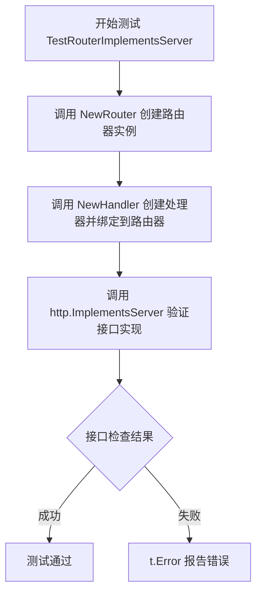
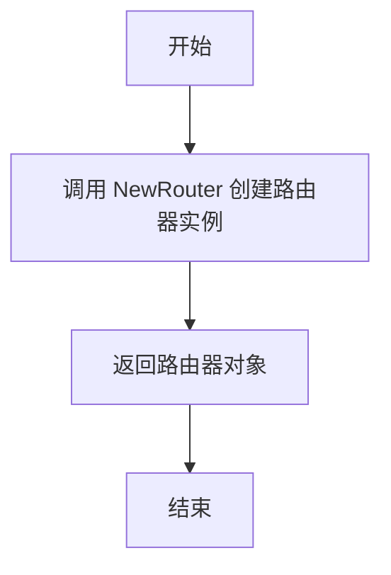
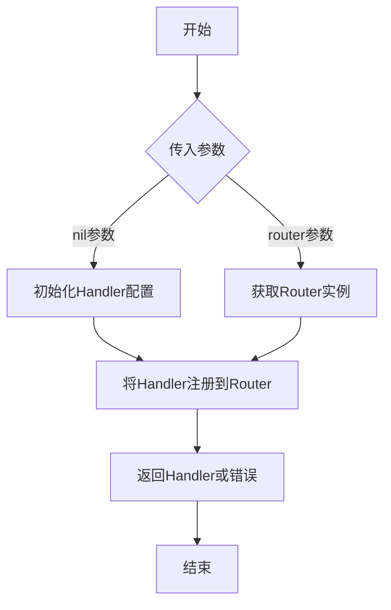

# `flux\pkg\http\daemon\server_test.go` 详细设计文档

这是一个Go语言的测试文件，用于验证daemon包中的Router类型是否正确实现了fluxcd/flux项目中的http.Server接口。测试通过创建Router实例和Handler，并调用http.ImplementsServer进行接口兼容性检查。

## 整体流程



## 类结构

```
daemon (包)
└── 测试文件
    ├── TestRouterImplementsServer (测试函数)
    ├── NewRouter (被测函数 - 推测返回Router类型)
    └── NewHandler (被测函数 - 推测将Handler绑定到Router)
```

## 全局变量及字段


    

## 全局函数及方法


### `TestRouterImplementsServer`

该函数是一个测试函数，用于验证 Router 类型是否正确实现了 `http.Server` 接口。它通过创建路由实例、附加处理器，然后调用接口检查方法来确保类型满足接口契约。

参数：

- `t`：`testing.T`，Go 测试框架的测试对象，用于报告测试失败

返回值：无（void），该函数没有显式返回值

#### 流程图

```mermaid
flowchart TD
    A[开始测试] --> B[创建 Router 实例: router := NewRouter()]
    B --> C[调用 NewHandler 附加处理器到路由: NewHandler(nil, router)]
    C --> D[检查 router 是否实现 http.Server 接口: http.ImplementsServer(router)]
    D --> E{是否存在错误?}
    E -->|是| F[报告测试失败: t.Error(err)]
    E -->|否| G[测试通过]
    F --> H[结束测试]
    G --> H
```

#### 带注释源码

```go
// TestRouterImplementsServer 是一个测试函数，验证 Router 类型是否实现了 http.Server 接口
func TestRouterImplementsServer(t *testing.T) {
    // 第一步：创建新的 Router 实例
    router := NewRouter()
    
    // 第二步：调用 NewHandler 将处理器附加到路由器
    // 注释说明：调用 NewHandler 会将处理器附加到路由器
    NewHandler(nil, router)
    
    // 第三步：使用 http.ImplementsServer 检查 router 是否实现了 http.Server 接口
    err := http.ImplementsServer(router)
    
    // 第四步：如果检查失败（router 未实现接口），则报告错误
    if err != nil {
        t.Error(err)
    }
}
```


### `NewRouter`

创建并返回一个实现了 HTTP 服务器接口的路由器实例，用于管理和调度 HTTP 请求。

参数：

- （无参数）

返回值：`router`（类型推断为 `*Router` 或实现了 `http.Server` 接口的类型），返回一个新的路由器实例，用于后续附加处理器和请求路由。

#### 流程图



#### 带注释源码

```go
package daemon

import (
	"testing"

	"github.com/fluxcd/flux/pkg/http"
)

func TestRouterImplementsServer(t *testing.T) {
	// 步骤1: 调用 NewRouter 创建路由器实例
	router := NewRouter()
	
	// 步骤2: 调用 NewHandler 附加处理器到路由器
	// 参数1: nil (可能为配置或依赖注入)
	// 参数2: router (刚创建的路由器实例)
	NewHandler(nil, router)
	
	// 步骤3: 验证 router 是否实现了 http.Server 接口
	err := http.ImplementsServer(router)
	if err != nil {
		t.Error(err)
	}
}
```


### `NewHandler`

该函数用于将HTTP处理器注册到路由器（Router）上，使得Flux守护进程能够处理来自Flux API客户端的请求。

参数：

- 第一个参数未在调用处显式命名，从传值`nil`推断为`{类型未知}`，可能是配置对象或初始化参数
- `router`：`daemon.Router`，路由器实例，用于附加HTTP处理器

返回值：`{类型未知}`，可能是错误类型或处理器实例

#### 流程图



#### 带注释源码

```go
package daemon

import (
	"testing"

	"github.com/fluxcd/flux/pkg/http"
)

func TestRouterImplementsServer(t *testing.T) {
	router := NewRouter()                    // 创建新的Router实例
	// 调用NewHandler将handlers附加到router上
	NewHandler(nil, router)                  // 传入nil配置和router实例，注册HTTP处理程序
	err := http.ImplementsServer(router)    // 验证router是否实现了Server接口
	if err != nil {
		t.Error(err)                      // 如果实现不完整，报告测试错误
	}
}
```

---

**注意**：根据提供的代码片段，仅有`NewHandler`的调用上下文，未见其完整函数定义。根据代码分析：
- `NewHandler`是一个包级函数（非类方法）
- 第一个参数为`nil`，推断为配置或选项结构
- 第二个参数为`router`，是`daemon.Router`类型
- 函数功能为向Router注册HTTP处理器

## 关键组件


### 测试路由器实现服务器接口

验证路由器是否实现了fluxcd/flux包中的Server接口，确保路由组件符合预期的接口契约。

### NewRouter 函数

创建并返回一个新的路由器实例，用于注册和处理各种HTTP请求路由。

### NewHandler 函数

将处理器附加到路由器上，为不同的路由注册相应的处理函数。

### http.ImplementsServer 接口验证

使用fluxcd/flux包的http模块验证路由器对象是否实现了Server接口，确保接口兼容性。


## 问题及建议


### 已知问题

-   **硬编码nil参数**: `NewHandler(nil, router)` 传递nil作为第一个参数，可能掩盖真实的初始化问题或导致运行时panic，测试未验证真实场景下的行为
-   **错误处理不充分**: 使用`t.Error(err)`而非`t.Fatal`或`require`，测试失败后仍继续执行后续逻辑，降低测试的确定性
-   **缺少断言上下文**: 仅验证`ImplementsServer`返回错误，未检查router实际状态或行为是否符合接口契约
-   **测试覆盖不足**: 仅测试接口实现，未覆盖Router的具体功能逻辑（如路由注册、处理器绑定等）
-   **未验证handler绑定**: 调用`NewHandler`后未验证handler是否正确附加到router
-   **潜在的nil解引用风险**: 若`http.ImplementsServer`实现依赖于非空指针检查，传入的router可能产生未定义行为

### 优化建议

-   使用`require`库替代`error`检查，使测试在失败时立即终止并提供更清晰的错误堆栈
-   为`NewHandler`提供有效的非nil参数进行真实场景测试，或拆分测试用例分别覆盖nil和正常参数场景
-   增加对router状态的断言，如验证handler列表长度、路由表内容等
-   添加单元测试验证Router类的具体方法（路由注册、请求分发等），而非仅验证接口实现
-   考虑使用表格驱动测试模式扩展测试覆盖边界情况
-   补充测试注释说明每个检查点的业务含义和预期结果


## 其它


### 设计目标与约束
确保 Router 实现了 `http.Server` 接口，使其能够作为 Flux 守护进程的 HTTP 服务器接受请求；约束仅依赖 Go 标准库和 `github.com/fluxcd/flux/pkg/http`，兼容 Go 1.13 及以上版本。

### 错误处理与异常设计
在生产代码中，Router 的各项方法应返回明确的 `error` 值，供调用方判断成功与否；测试中通过 `t.Error` 捕获并报告不符合接口的情况；避免使用 `panic`，统一错误传播机制。

### 数据流与状态机
测试流程为：① 调用 `NewRouter()` 创建路由实例；② 通过 `NewHandler(nil, router)` 将处理函数绑定到路由；③ 使用 `http.ImplementsServer(router)` 验证 Router 满足 `http.Server` 接口。整个过程无状态转变，仅做静态接口检查。

### 外部依赖与接口契约
- 依赖：`github.com/fluxcd/flux/pkg/http`（提供 `Server` 接口和 `ImplementsServer` 辅助函数）。
- 契约：Router 必须实现 `ServeHTTP(http.ResponseWriter, *http.Request)`、`ListenAndServe() error`、`Shutdown(context.Context) error` 等方法。

### 性能与可伸缩性
接口检查在编译期或初始化阶段完成，几乎无运行时开销；后续请求处理性能取决于具体 Handler 实现，Router 本身仅做路由转发，具备良好的可伸缩性。

### 安全性考虑
Router 本身不直接处理业务逻辑，安全性由绑定的 Handler 负责；建议在 Handler 中对输入进行校验，防止注入攻击；使用 TLS 时通过 `ListenAndServeTLS` 启用。

### 测试策略
- 单元测试：验证 Router 实现了 `http.Server` 接口（当前示例）。
- 集成测试：启动实际 HTTP 服务器，发送真实请求验证路由与 Handler 的协同工作。
- 边界测试：传入 `nil` Handler、重复注册路由等情形，确保系统健壮。

### 部署与运维
Router 作为 Flux 守护进程的一部分，随服务二进制一起部署；可通过系统服务管理（systemd）实现开机自启；日志输出到标准输出或集中日志系统，便于监控。

### 配置管理
路由配置（如监听地址、端口、TLS 证书路径）可通过命令行 flag、环境变量或配置文件注入；示例代码未展示具体配置，建议在 `NewRouter` 或启动入口接受 `Config` 结构体。

### 可维护性与可扩展性
- 遵循 Go 代码规范（gofmt、golint）。
- 将路由创建、Handler 绑定、接口检查分别封装为独立函数/方法，便于后续扩展新路由或中间件。
- 关键路径加入适当的注释和文档。

### 日志与监控
在 Router 的 `ServeHTTP`、`ListenAndServe`、`Shutdown` 等关键方法中接入统一的日志库（如 `log/slog`），记录请求耗时、错误及异常退出；可配合 Prometheus 监控请求量和错误率。

### 异常与边界情况
- `NewHandler(nil, router)` 传入 `nil` Handler 时应在内部检查并返回错误，避免后续空指针异常。
- 多次调用 `ListenAndServe` 应返回 `http.ErrServerClosed` 或类似的明确错误。

### 版本管理与兼容性
- 采用语义化版本（SemVer）发布 Flux 库；主版本升级时确保 `http.Server` 接口的兼容性或提供迁移指南。
- 依赖的外部包应锁定版本，防止因上游接口变更导致编译失败。

### 资源管理
在 `Shutdown` 实现中释放监听端口、关闭底层连接池；使用 `defer` 确保所有资源在函数退出时被正确关闭。

### 代码质量与规范
- 遵循 Go 官方代码风格（使用 `gofmt`）。
- 为公共方法添加 Godoc 注释，说明参数、返回值及可能的错误。
- 通过 `go vet`、`golangci-lint` 进行静态检查，确保无潜在 bug。


    