# `flux\pkg\http\daemon\upstream.go` 详细设计文档

该文件实现了Flux守护进程(fluxd)到上游服务(fluxsvc)的WebSocket连接管理器和RPC服务器,用于处理来自Flux服务的请求并维护双向通信连接。

## 整体流程

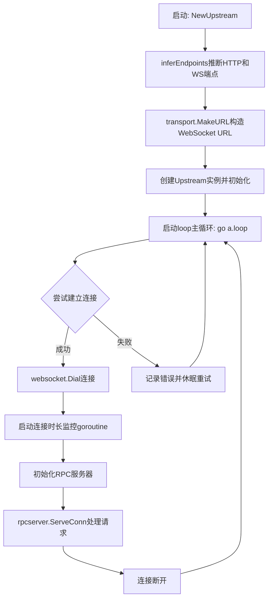

## 类结构

```
Upstream (上游连接管理器)
├── 全局变量
│   ├── ErrEndpointDeprecated (弃用错误)
│   └── connectionDuration (Prometheus指标)
└── 方法
    ├── NewUpstream (构造函数)
    ├── inferEndpoints (端点推断)
    ├── loop (主循环)
    ├── connect (连接建立)
    ├── setConnectionDuration (指标设置)
    ├── LogEvent (事件记录)
    └── Close (关闭连接)
```

## 全局变量及字段


### `ErrEndpointDeprecated`
    
端点弃用错误

类型：`error`
    


### `connectionDuration`
    
连接持续时间指标

类型：`*prometheus.Gauge`
    


### `Upstream.client`
    
HTTP客户端

类型：`*http.Client`
    


### `Upstream.ua`
    
用户代理字符串

类型：`string`
    


### `Upstream.token`
    
认证令牌

类型：`fluxclient.Token`
    


### `Upstream.url`
    
WebSocket连接URL

类型：`*url.URL`
    


### `Upstream.endpoint`
    
WebSocket端点地址

类型：`string`
    


### `Upstream.apiClient`
    
API客户端

类型：`*fluxclient.Client`
    


### `Upstream.server`
    
RPC服务器接口

类型：`api.Server`
    


### `Upstream.timeout`
    
超时时间

类型：`time.Duration`
    


### `Upstream.logger`
    
日志记录器

类型：`log.Logger`
    


### `Upstream.quit`
    
退出信号通道

类型：`chan struct{}`
    


### `Upstream.ws`
    
WebSocket连接

类型：`websocket.Websocket`
    
    

## 全局函数及方法


### `NewUpstream`

创建新的Upstream实例并启动连接循环。该函数接收各种配置参数，推断HTTP和WebSocket端点，构建WebSocket URL，初始化Upstream结构体，并启动后台连接循环。

参数：

- `client`：`*http.Client`，用于HTTP通信的客户端实例
- `ua`：`string`，用户代理字符串，标识客户端身份
- `t`：`fluxclient.Token`，认证令牌，用于身份验证
- `router`：`*mux.Router`，HTTP路由分配器，用于注册处理程序
- `endpoint`：`string`，远程服务端点URL（支持ws/wss/http/https）
- `s`：`api.Server`，本地API服务器实现，处理RPC请求
- `timeout`：`time.Duration`，RPC调用超时时间
- `logger`：`log.Logger`，日志记录器，用于输出运行日志

返回值：`(*Upstream, error)`，成功时返回新创建的Upstream实例和nil错误，失败时返回nil和具体错误信息

#### 流程图

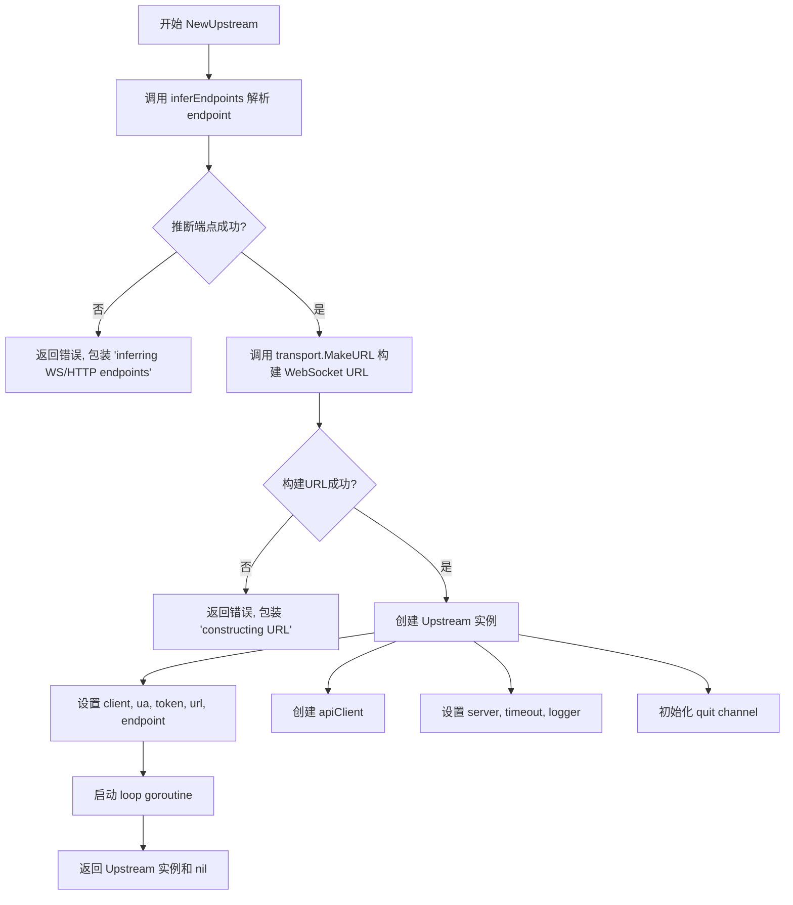

#### 带注释源码

```go
// NewUpstream 创建新的Upstream实例并启动连接循环
// 参数包含HTTP客户端、用户代理、认证令牌、路由、服务端点、API服务器、超时时间和日志记录器
func NewUpstream(client *http.Client, ua string, t fluxclient.Token, router *mux.Router, endpoint string, s api.Server, timeout time.Duration, logger log.Logger) (*Upstream, error) {
    // 1. 从endpoint推断HTTP和WebSocket端点
    // 支持ws/wss/http/https四种协议，会自动转换对应的HTTP和WS端点
	httpEndpoint, wsEndpoint, err := inferEndpoints(endpoint)
	if err != nil {
        // 推断失败则返回错误
		return nil, errors.Wrap(err, "inferring WS/HTTP endpoints")
	}

    // 2. 使用路由和注册标识构建WebSocket URL
    // transport.RegisterDaemonV11 是用于标识 daemon 版本的常量
	u, err := transport.MakeURL(wsEndpoint, router, transport.RegisterDaemonV11)
	if err != nil {
        // URL构建失败则返回错误
		return nil, errors.Wrap(err, "constructing URL")
	}

    // 3. 创建Upstream实例，初始化所有字段
	a := &Upstream{
		client:    client,                               // HTTP客户端
		ua:        ua,                                   // 用户代理
		token:     t,                                    // 认证令牌
		url:       u,                                    // WebSocket URL
		endpoint:  wsEndpoint,                           // WebSocket端点
		apiClient: fluxclient.New(client, router, httpEndpoint, t),  // API客户端
		server:    s,                                    // 本地API服务器
		timeout:   timeout,                               // RPC超时
		logger:    logger,                               // 日志记录器
		quit:      make(chan struct{}),                 // 退出信号channel
	}
    
    // 4. 启动后台连接循环goroutine
    // loop()会持续尝试建立WebSocket连接，失败时使用指数退避重连
	go a.loop()
    
    // 5. 返回新创建的Upstream实例
	return a, nil
}
```


### `inferEndpoints`

该函数是一个工具函数，用于根据给定的 endpoint URL 推断 HTTP 和 WebSocket 端点。它通过转换 URL 的 scheme（ws↔http, wss↔https）来实现双向端点的推导。

参数：

- `endpoint`：`string`，要解析的端点 URL 字符串，支持 ws、wss、http、https 四种协议

返回值：

- `httpEndpoint`：`string`，推导出的 HTTP 端点 URL
- `wsEndpoint`：`string`，推导出的 WebSocket 端点 URL
- `err`：`error`，解析或处理过程中的错误信息

#### 流程图

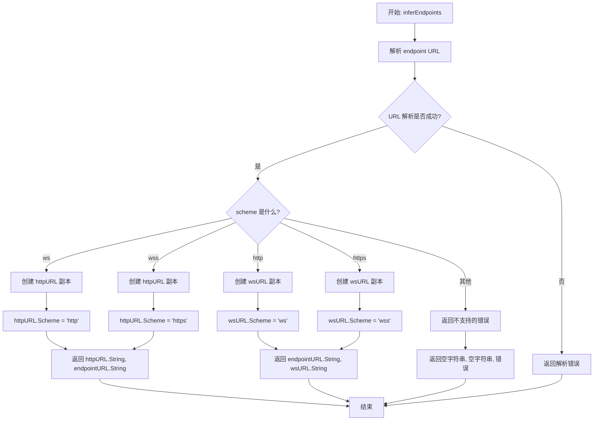

#### 带注释源码

```go
// inferEndpoints 根据给定的 endpoint URL 推断 HTTP 和 WebSocket 端点
// 参数 endpoint: 端点 URL 字符串，支持 ws/wss/http/https 协议
// 返回: httpEndpoint - HTTP 端点, wsEndpoint - WebSocket 端点, err - 错误信息
func inferEndpoints(endpoint string) (httpEndpoint, wsEndpoint string, err error) {
	// 步骤1: 解析 endpoint URL
	endpointURL, err := url.Parse(endpoint)
	if err != nil {
		// 如果解析失败，返回带上下文的错误信息
		return "", "", errors.Wrapf(err, "parsing endpoint %s", endpoint)
	}

	// 步骤2: 根据 URL scheme 推断对应的 HTTP 和 WebSocket 端点
	switch endpointURL.Scheme {
	case "ws":
		// WebSocket (非加密) -> HTTP
		httpURL := *endpointURL        // 复制原始 URL
		httpURL.Scheme = "http"        // 将 scheme 改为 http
		return httpURL.String(), endpointURL.String(), nil // 返回 HTTP URL 和原始 WS URL
	
	case "wss":
		// WebSocket (加密) -> HTTPS
		httpURL := *endpointURL         // 复制原始 URL
		httpURL.Scheme = "https"       // 将 scheme 改为 https
		return httpURL.String(), endpointURL.String(), nil // 返回 HTTPS URL 和原始 WSS URL
	
	case "http":
		// HTTP -> WebSocket (非加密)
		wsURL := *endpointURL          // 复制原始 URL
		wsURL.Scheme = "ws"            // 将 scheme 改为 ws
		return endpointURL.String(), wsURL.String(), nil // 返回原始 HTTP URL 和 WS URL
	
	case "https":
		// HTTPS -> WebSocket (加密)
		wsURL := *endpointURL          // 复制原始 URL
		wsURL.Scheme = "wss"           // 将 scheme 改为 wss
		return endpointURL.String(), wsURL.String(), nil // 返回原始 HTTPS URL 和 WSS URL
	
	default:
		// 不支持的 scheme，返回错误
		return "", "", errors.Errorf("unsupported scheme %s", endpointURL.Scheme)
	}
}
```


### `Upstream.loop`

这是 Upstream 类的主连接循环方法，负责持续尝试建立与上游服务的 WebSocket 连接，并在连接失败时实现重试逻辑。该方法采用指数退避策略（当前固定5秒间隔），当检测到端点已弃用时会退出程序，其他错误则记录日志后继续重试。

参数：
- 该方法无显式参数（接收者 `a *Upstream` 作为隐式参数）

返回值：`无`（`void`），该方法为无限循环，通过通道和退出信号控制流程

#### 流程图

```mermaid
flowchart TD
    A[开始 loop 循环] --> B[设置退避时间 5秒]
    B --> C[创建错误通道 errc]
    C --> D[启动 goroutine 调用 connect]
    D --> E{select 选择器}
    E -->|errc 通道收到错误| F{是否有错误?}
    E -->|quit 通道收到信号| G[退出方法]
    
    F -->|是| H{错误是否是端点已弃用?}
    F -->|否| I[记录日志]
    I --> J[等待 backoff 时间]
    J --> D
    
    H -->|是| K[记录弃用错误日志并退出程序 os.Exit(1)]
    H -->|否| I
    
    D --> E
```

#### 带注释源码

```go
// loop 是 Upstream 类的主连接循环方法
// 功能：持续尝试建立 WebSocket 连接，失败时进行重试
func (a *Upstream) loop() {
	// backoff 定义了重试之间的等待时间，当前固定为 5 秒
	backoff := 5 * time.Second
	// errc 是一个带缓冲的通道，用于接收 connect 方法返回的错误
	errc := make(chan error, 1)
	
	// 无限循环，持续尝试连接
	for {
		// 启动 goroutine 执行 connect 方法，避免阻塞主循环
		go func() {
			errc <- a.connect()
		}()
		
		// 使用 select 监听多个通道：连接结果或退出信号
		select {
		// 当连接完成（成功或失败）时收到信号
		case err := <-errc:
			if err != nil {
				// 记录错误日志
				a.logger.Log("err", err)
				// 如果是端点已弃用错误，退出程序以引起注意
				if err == ErrEndpointDeprecated {
					// We have logged the deprecation error, now crashloop to garner attention
					os.Exit(1)
				}
			}
			// 等待退避时间后重试
			time.Sleep(backoff)
		// 当收到退出信号时，退出循环
		case <-a.quit:
			return
		}
	}
}
```

---

#### 关键设计说明

| 项目 | 说明 |
|------|------|
| **重试策略** | 当前采用固定 5 秒退避时间，未实现指数退避（技术债务） |
| **并发模型** | 使用 goroutine + channel 实现非阻塞连接尝试 |
| **退出机制** | 通过 `quit` 通道优雅关闭循环 |
| **异常处理** | 弃用错误会触发程序退出，其他错误仅记录日志继续重试 |
| **潜在问题** | `backoff` 变量在循环中未动态调整，缺乏指数退避策略 |


### `Upstream.connect`

该方法负责建立WebSocket连接到上游服务并启动RPC服务器处理请求。它首先通过websocket.Dial建立连接，然后初始化RPC服务器通过该连接提供API服务，同时监控连接生命周期并记录相关指标。

参数： 无

返回值：`error`，如果连接失败或RPC服务器初始化失败则返回错误，否则返回nil

#### 流程图

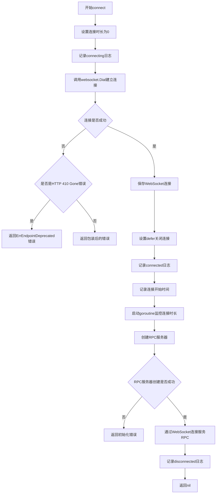

#### 带注释源码

```go
// connect 方法建立WebSocket连接到上游服务并启动RPC服务器
func (a *Upstream) connect() error {
    // 1. 重置连接时长指标为0
    a.setConnectionDuration(0)
    
    // 2. 记录连接开始日志
    a.logger.Log("connecting", true)
    
    // 3. 通过websocket.Dial建立WebSocket连接
    //    参数: HTTP客户端、用户代理、认证令牌、目标URL
    ws, err := websocket.Dial(a.client, a.ua, a.token, a.url)
    if err != nil {
        // 4. 处理连接错误
        //    检查是否是HTTP 410 Gone错误（服务已废弃）
        if err, ok := err.(*websocket.DialErr); ok && err.HTTPResponse != nil && err.HTTPResponse.StatusCode == http.StatusGone {
            // 如果是废弃端点，返回专用错误以触发进程退出
            return ErrEndpointDeprecated
        }
        // 其他错误包装后返回
        return errors.Wrapf(err, "executing websocket %s", a.url)
    }
    
    // 5. 保存WebSocket连接实例
    a.ws = ws
    
    // 6. 设置defer清理: 连接断开时置空WebSocket并记录关闭日志
    defer func() {
        a.ws = nil
        // TODO: handle this error
        a.logger.Log("connection closing", true, "err", ws.Close())
    }()
    
    // 7. 记录连接成功日志
    a.logger.Log("connected", true)

    // 8. 启动后台goroutine监控连接时长
    //    Instrument connection lifespan
    connectedAt := time.Now()
    disconnected := make(chan struct{})
    defer close(disconnected)
    go func() {
        t := time.NewTicker(1 * time.Second)
        for {
            select {
            case now := <-t.C:
                // 每秒更新连接持续时间指标
                a.setConnectionDuration(now.Sub(connectedAt).Seconds())
            case <-disconnected:
                // 连接断开时停止计时并重置指标
                t.Stop()
                a.setConnectionDuration(0)
                return
            }
        }
    }()

    // 9. 创建RPC服务器
    //    注意: 虽然我们是WebSocket客户端，但这里是RPC服务器端
    //    Hook up the rpc server. We are a websocket _client_, but an RPC _server_.
    rpcserver, err := rpc.NewServer(a.server, a.timeout)
    if err != nil {
        return errors.Wrap(err, "initializing rpc server")
    }
    
    // 10. 通过WebSocket连接服务RPC请求
    rpcserver.ServeConn(ws)
    
    // 11. 连接断开后记录日志
    a.logger.Log("disconnected", true)
    return nil
}
```


### `Upstream.setConnectionDuration`

设置 Prometheus 指标以记录当前连接到 fluxsvc 的持续时间（秒）。该方法通过 Gauge 类型的指标记录连接时长，便于监控连接的稳定性和持续时间。

参数：

- `duration`：`float64`，表示连接持续时间，以秒为单位

返回值：`无`（该方法没有返回值，即 `void`）

#### 流程图

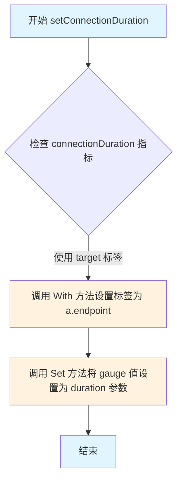

#### 带注释源码

```go
// setConnectionDuration 设置 Prometheus 指标的连接持续时间
// 该方法用于在连接生命周期内定期更新连接持续时间指标
// 参数 duration: 连接持续时间（秒），0 表示未连接
func (a *Upstream) setConnectionDuration(duration float64) {
	// 使用 Prometheus gauge 指标，通过 "target" 标签设置当前端点的连接时长
	// "target" 标签值为 a.endpoint（WebSocket 端点 URL）
	// .Set(duration) 将 gauge 值设置为传入的持续时间参数
	connectionDuration.With("target", a.endpoint).Set(duration)
}
```


### `Upstream.LogEvent`

该方法用于通过上游连接记录事件，它调用 API 客户端的 LogEvent 方法将事件发送到远程服务。

参数：
-  `event`：`event.Event`，要记录的事件对象，包含事件的详细信息。

返回值：`error`，如果记录事件时发生错误，则返回错误；否则返回 nil。

#### 流程图

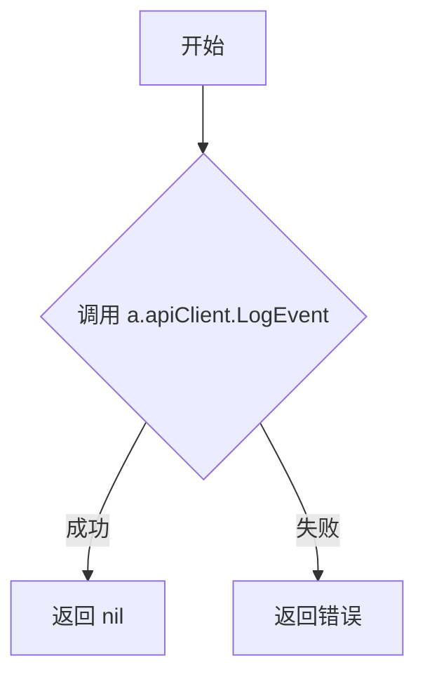

#### 带注释源码

```
// LogEvent 通过 API 客户端记录事件
// 参数 event: 事件对象，包含要记录的事件详情
// 返回值: 错误信息，如果发生错误则返回错误，否则返回 nil
func (a *Upstream) LogEvent(event event.Event) error {
	return a.apiClient.LogEvent(context.TODO(), event)
}
```


### `Upstream.Close`

该方法用于关闭与上游服务的连接，停止后台的连接循环，并关闭底层的WebSocket连接。

参数：无需参数

返回值：`error`，表示关闭WebSocket连接时可能发生的错误；如果连接已经关闭或无需关闭，则返回nil

#### 流程图

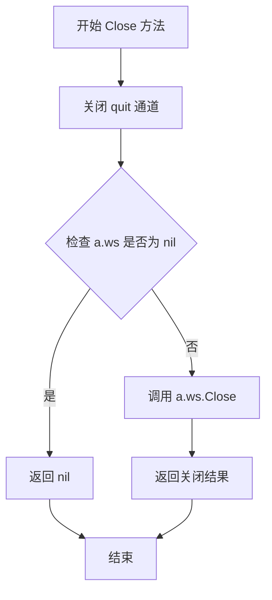

#### 带注释源码

```go
// Close closes the connection to the service
// Close方法用于关闭到服务的连接
func (a *Upstream) Close() error {
    // 关闭quit通道，通知loop方法退出
    // 这会触发loop方法中的 <-a.quit case，从而终止后台连接循环
    close(a.quit)
    
    // 检查WebSocket连接是否已存在
    // 如果ws为nil，说明连接从未建立或已经关闭，直接返回nil
    if a.ws == nil {
        return nil
    }
    
    // 关闭WebSocket连接并返回可能的错误
    // 调用底层websocket的Close方法完成连接关闭
    return a.ws.Close()
}
```


### `NewUpstream`

创建一个 `Upstream` 实例，负责管理与远程 fluxsvc 服务的 WebSocket 连接和 RPC 通信。

参数：

- `client`：`*http.Client`，用于 HTTP 通信的客户端
- `ua`：`string`，User-Agent 字符串，标识客户端
- `t`：`fluxclient.Token`，用于认证的令牌
- `router`：`*mux.Router`，HTTP 路由，用于注册处理器
- `endpoint`：`string`，远程服务端点 URL（支持 ws/wss/http/https）
- `s`：`api.Server`，本地 API 服务器实现
- `timeout`：`time.Duration`，RPC 调用超时时间
- `logger`：`log.Logger`，日志记录器

返回值：

- `*Upstream`：新创建的 Upstream 实例
- `error`：如果端点推断或 URL 构建失败，返回错误

#### 流程图

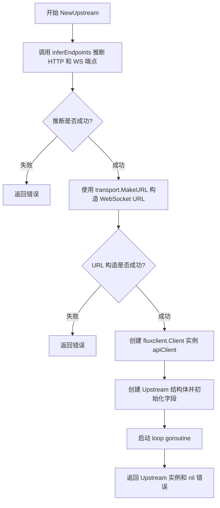

#### 带注释源码

```go
// NewUpstream 创建一个新的 Upstream 实例，负责与远程 fluxsvc 服务建立连接
// 参数：
//   - client: HTTP 客户端，用于发送请求
//   - ua: User-Agent 字符串，标识客户端版本
//   - t: 认证令牌，用于身份验证
//   - router: gorilla/mux 路由器，注册 HTTP 处理器
//   - endpoint: 远程服务端点 URL
//   - s: 本地 API 服务器实现
//   - timeout: RPC 调用超时时间
//   - logger: 日志记录器
//
// 返回值：
//   - *Upstream: 新创建的 Upstream 实例
//   - error: 如果发生错误则返回错误
func NewUpstream(client *http.Client, ua string, t fluxclient.Token, router *mux.Router, endpoint string, s api.Server, timeout time.Duration, logger log.Logger) (*Upstream, error) {
	// 从给定的端点 URL 推断出 HTTP 和 WebSocket 两个端点
	// 例如：ws://example.com -> http://example.com 和 ws://example.com
	//       https://example.com -> https://example.com 和 wss://example.com
	httpEndpoint, wsEndpoint, err := inferEndpoints(endpoint)
	if err != nil {
		return nil, errors.Wrap(err, "inferring WS/HTTP endpoints")
	}

	// 使用路由和端点构造 WebSocket 连接的 URL
	// transport.RegisterDaemonV11 是用于注册守护进程的处理路径
	u, err := transport.MakeURL(wsEndpoint, router, transport.RegisterDaemonV11)
	if err != nil {
		return nil, errors.Wrap(err, "constructing URL")
	}

	// 创建 Upstream 结构体，初始化所有字段
	a := &Upstream{
		client:    client,                                // HTTP 客户端
		ua:        ua,                                    // User-Agent
		token:     t,                                     // 认证令牌
		url:       u,                                     // WebSocket URL
		endpoint:  wsEndpoint,                           // WebSocket 端点
		apiClient: fluxclient.New(client, router, httpEndpoint, t), // HTTP API 客户端
		server:    s,                                     // 本地 API 服务器
		timeout:   timeout,                               // 超时时间
		logger:    logger,                               // 日志记录器
		quit:      make(chan struct{}),                 // 退出信号通道
	}
	
	// 启动后台连接循环 goroutine
	go a.loop()
	
	// 返回创建的 Upstream 实例
	return a, nil
}
```


### `inferEndpoints`

该函数用于根据给定的 endpoint URL 推断并返回对应的 HTTP 和 WebSocket 端点地址。它通过解析 URL 的 scheme（ws/wss/http/https），自动生成另一种协议的对应 URL：如果是 ws 或 wss，则生成对应的 http 或 https URL；反之，如果是 http 或 https，则生成对应的 ws 或 wss URL。

参数：

- `endpoint`：`string`，输入的 endpoint URL 字符串，例如 `wss://fluxsvc.example.com/` 或 `https://fluxsvc.example.com/`

返回值：

- `httpEndpoint`：`string`，推断出的 HTTP 端点 URL
- `wsEndpoint`：`string`，推断出的 WebSocket 端点 URL
- `err`：`error`，解析或处理过程中的错误信息

#### 流程图

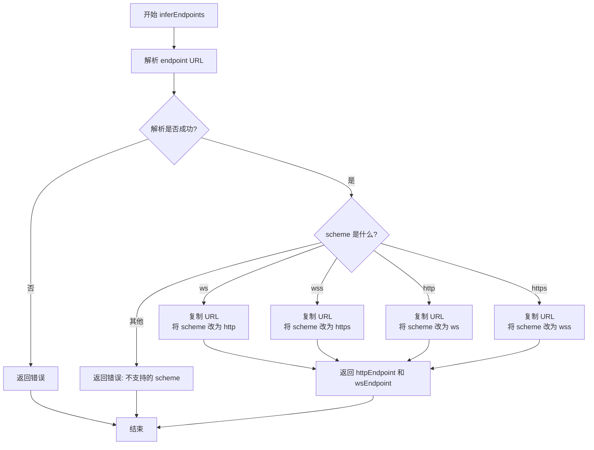

#### 带注释源码

```go
// inferEndpoints 根据给定的 endpoint URL 推断并返回对应的 HTTP 和 WebSocket 端点
// 参数 endpoint: 输入的 endpoint URL 字符串，支持 ws/wss/http/https 四种 scheme
// 返回值:
//   - httpEndpoint: 推断出的 HTTP 端点 URL
//   - wsEndpoint: 推断出的 WebSocket 端点 URL
//   - err: 解析或处理过程中的错误
func inferEndpoints(endpoint string) (httpEndpoint, wsEndpoint string, err error) {
	// 1. 解析输入的 endpoint URL
	endpointURL, err := url.Parse(endpoint)
	if err != nil {
		// 解析失败时返回包装后的错误
		return "", "", errors.Wrapf(err, "parsing endpoint %s", endpoint)
	}

	// 2. 根据 URL 的 scheme 类型进行分支处理
	switch endpointURL.Scheme {
	case "ws":
		// WebSocket (非安全) -> HTTP
		// 复制 URL 对象以避免修改原对象
		httpURL := *endpointURL
		// 将 scheme 从 ws 改为 http
		httpURL.Scheme = "http"
		// 返回 HTTP 端点和 WebSocket 端点
		return httpURL.String(), endpointURL.String(), nil

	case "wss":
		// WebSocket (安全) -> HTTPS
		httpURL := *endpointURL
		// 将 scheme 从 wss 改为 https
		httpURL.Scheme = "https"
		return httpURL.String(), endpointURL.String(), nil

	case "http":
		// HTTP -> WebSocket (非安全)
		wsURL := *endpointURL
		// 将 scheme 从 http 改为 ws
		wsURL.Scheme = "ws"
		return endpointURL.String(), wsURL.String(), nil

	case "https":
		// HTTPS -> WebSocket (安全)
		wsURL := *endpointURL
		// 将 scheme 从 https 改为 wss
		wsURL.Scheme = "wss"
		return endpointURL.String(), wsURL.String(), nil

	default:
		// 不支持的 scheme 类型，返回错误
		return "", "", errors.Errorf("unsupported scheme %s", endpointURL.Scheme)
	}
}
```


### Upstream.loop

该方法实现了一个后台连接循环机制，负责维护与上游服务的持久 WebSocket 连接。它使用固定退避策略（5秒间隔）在连接失败时自动重连，并在收到退出信号时优雅地终止连接循环。

参数：无需参数

返回值：无返回值

#### 流程图

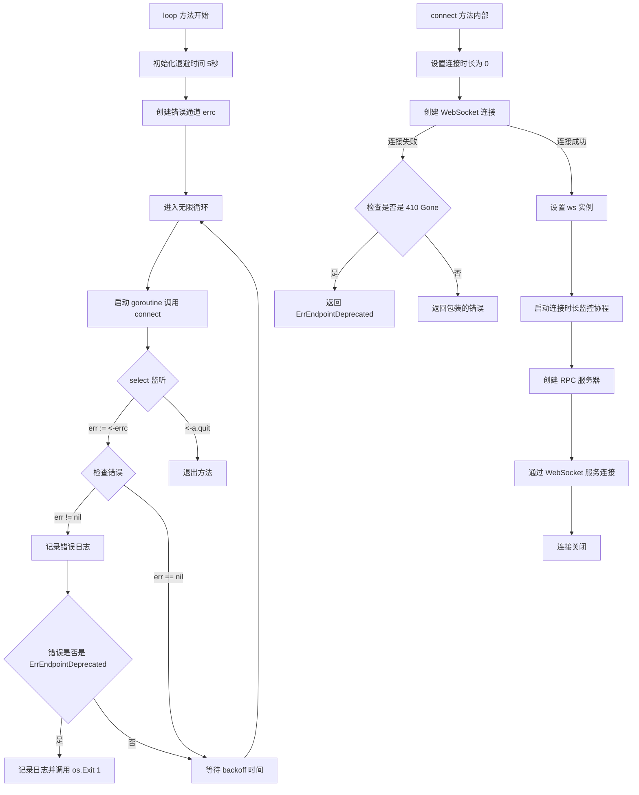

#### 带注释源码

```go
// loop 实现了一个持续重连的后台循环，负责维护与上游服务的连接
// 它使用固定退避策略，在连接失败时自动重试
func (a *Upstream) loop() {
	// 初始化基础退避时间为 5 秒
	backoff := 5 * time.Second
	// 创建带缓冲的错误通道，用于接收连接结果
	errc := make(chan error, 1)
	
	// 无限循环，持续尝试保持连接
	for {
		// 启动 goroutine 执行连接操作，避免阻塞 select
		go func() {
			errc <- a.connect()
		}()
		
		// 使用 select 监听连接结果或退出信号
		select {
		// 接收连接操作的结果
		case err := <-errc:
			// 如果有错误发生
			if err != nil {
				// 记录错误日志
				a.logger.Log("err", err)
				// 如果是端点已弃用错误（HTTP 410）
				if err == ErrEndpointDeprecated {
					// 记录弃用错误日志，然后以错误状态退出程序以引起注意
					os.Exit(1)
				}
			}
			// 等待退避时间后重试连接
			time.Sleep(backoff)
		
		// 监听退出信号
		case <-a.quit:
			// 收到退出信号，直接返回，终止循环
			return
		}
	}
}
```


### `Upstream.connect`

该方法负责建立与远程 Flux 服务的 WebSocket 连接，包括错误处理、重试逻辑、连接生命周期监控以及 RPC 服务器的启动。

参数：无（仅接收者 `a *Upstream`）

返回值：`error`，表示连接过程中的错误信息，如果连接成功则返回 `nil`

#### 流程图

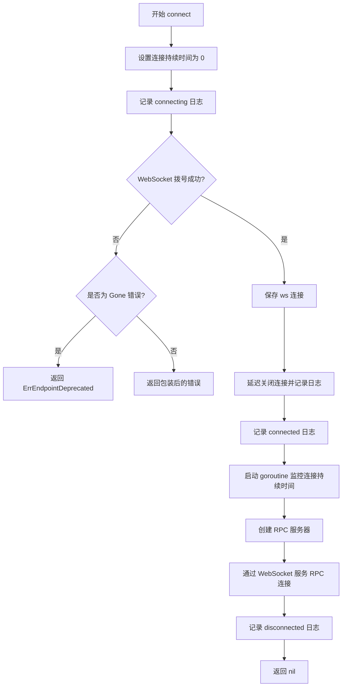

#### 带注释源码

```go
// connect 建立与远程服务的 WebSocket 连接
func (a *Upstream) connect() error {
	// 1. 重置连接持续时间指标为 0，表示未连接状态
	a.setConnectionDuration(0)
	
	// 2. 记录连接开始日志
	a.logger.Log("connecting", true)
	
	// 3. 通过 WebSocket 拨号建立连接
	ws, err := websocket.Dial(a.client, a.ua, a.token, a.url)
	if err != nil {
		// 4. 检查是否是 HTTP 410 Gone 错误（服务端已弃用）
		if err, ok := err.(*websocket.DialErr); ok && err.HTTPResponse != nil && err.HTTPResponse.StatusCode == http.StatusGone {
			// 返回弃用错误，触发进程退出
			return ErrEndpointDeprecated
		}
		// 返回其他错误，触发重试
		return errors.Wrapf(err, "executing websocket %s", a.url)
	}
	
	// 5. 保存 WebSocket 连接
	a.ws = ws
	
	// 6. 延迟关闭连接，确保函数退出时清理资源
	defer func() {
		a.ws = nil
		// TODO: 处理关闭错误
		a.logger.Log("connection closing", true, "err", ws.Close())
	}()
	
	// 7. 记录连接成功日志
	a.logger.Log("connected", true)

	// 8. 启动 goroutine 监控连接持续时间，每秒更新指标
	connectedAt := time.Now()
	disconnected := make(chan struct{})
	defer close(disconnected)
	go func() {
		t := time.NewTicker(1 * time.Second)
		for {
			select {
			case now := <-t.C:
				// 更新连接持续时间指标
				a.setConnectionDuration(now.Sub(connectedAt).Seconds())
			case <-disconnected:
				t.Stop()
				a.setConnectionDuration(0)
				return
			}
		}
	}()

	// 9. 创建 RPC 服务器（作为 WebSocket 服务器端）
	rpcserver, err := rpc.NewServer(a.server, a.timeout)
	if err != nil {
		return errors.Wrap(err, "initializing rpc server")
	}
	
	// 10. 通过 WebSocket 连接服务 RPC 请求
	rpcserver.ServeConn(ws)
	
	// 11. 记录断开连接日志
	a.logger.Log("disconnected", true)
	return nil
}
```


### `Upstream.setConnectionDuration`

该方法用于更新 Prometheus gauge 指标，记录当前与 fluxsvc 服务的连接持续时间（秒），便于监控连接状态。

参数：

- `duration`：`float64`，表示连接持续时间（秒），传入 0 表示未连接

返回值：无返回值（`void`），该方法仅更新 Prometheus 指标，不返回任何数据

#### 流程图

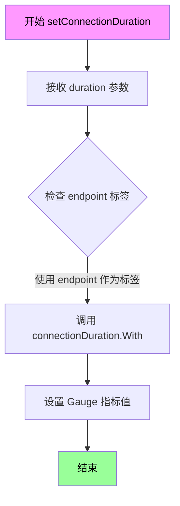

#### 带注释源码

```go
// setConnectionDuration 更新 Prometheus gauge 指标以反映当前连接持续时间
// 参数 duration: 连接持续时间（秒），0 表示未连接
func (a *Upstream) setConnectionDuration(duration float64) {
    // 使用 prometheus gauge 指标记录连接时长
    // 标签 "target" 值为 a.endpoint，用于区分不同的连接目标
    // .Set(duration) 会将指标值设置为指定的持续时间（秒）
    connectionDuration.With("target", a.endpoint).Set(duration)
}
```


### `Upstream.LogEvent`

该方法用于将接收到的 Flux 事件日志通过内部的 API 客户端发送至上游服务，实现事件的上报功能。

参数：

- `event`：`event.Event`，要记录并上报的 Flux 事件对象，包含事件的相关信息

返回值：`error`，如果事件日志发送失败则返回错误，否则返回 nil

#### 流程图

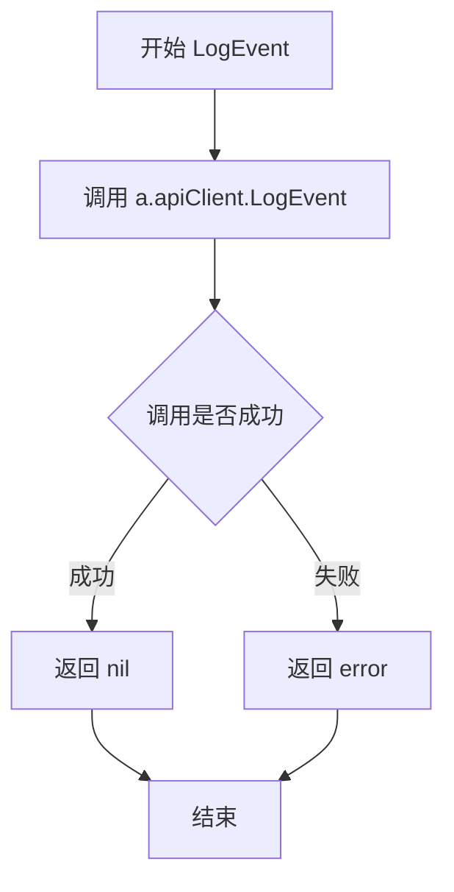

#### 带注释源码

```go
// LogEvent 将事件日志发送到上游服务
// 参数 event: 包含事件详情的 event.Event 对象
// 返回值: 如果发送失败则返回错误，否则返回 nil
func (a *Upstream) LogEvent(event event.Event) error {
    // 使用 context.TODO() 作为临时上下文，
    // 因为该方法未接收外部传入的 context
    // 调用 API 客户端的 LogEvent 方法执行实际的上报操作
    return a.apiClient.LogEvent(context.TODO(), event)
}
```


### `Upstream.Close`

关闭与服务的连接，并清理相关资源。

参数：

- （无显式参数，方法接收者为 `a *Upstream`）

返回值：`error`，如果关闭 WebSocket 连接时发生错误则返回该错误，否则返回 nil。

#### 流程图

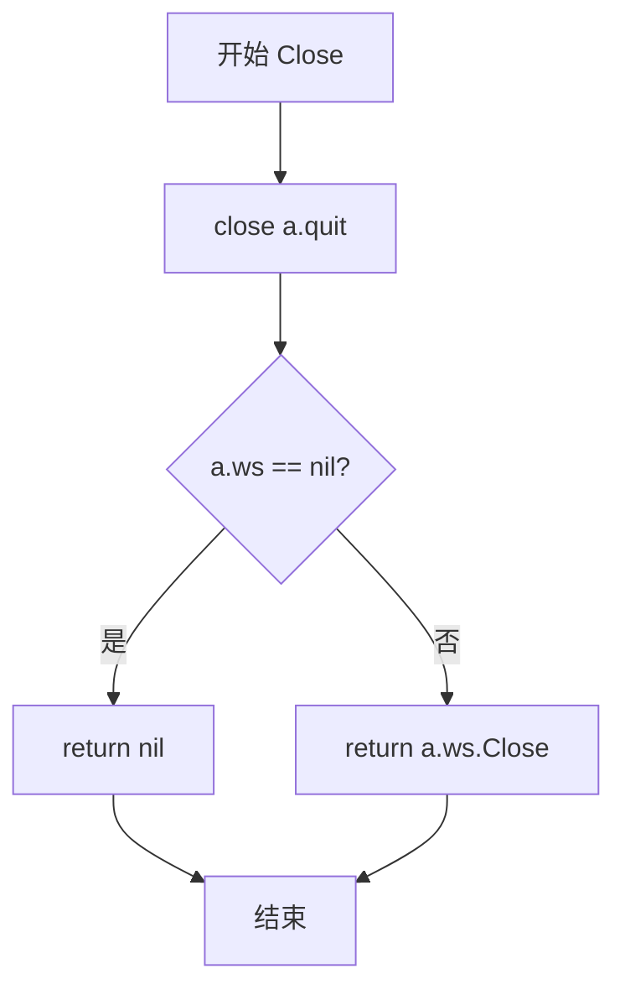

#### 带注释源码

```go
// Close closes the connection to the service
// Close 关闭与服务的连接
func (a *Upstream) Close() error {
    // 关闭 quit channel，通知 loop 方法退出
    close(a.quit)
    
    // 检查 WebSocket 连接是否已存在
    // 如果为 nil，说明从未建立过连接，直接返回
    if a.ws == nil {
        return nil
    }
    
    // 关闭 WebSocket 连接并返回可能发生的错误
    return a.ws.Close()
}
```

## 关键组件


### Upstream 结构体

核心结构体，负责管理 daemon 到上游服务的 WebSocket 连接和 RPC 通信。包含 HTTP 客户端、WebSocket、API 客户端、RPC 服务器等组件。

### WebSocket 连接管理

通过 websocket.Dial 建立与上游服务的持久连接，包含连接生命周期管理和断开后的自动重连机制。

### RPC 服务器

通过 rpc.NewServer 创建 RPC 服务器，通过 WebSocket 连接为上游服务提供 API 服务。

### 端点推断 (inferEndpoints)

根据给定的 endpoint URL 推断并分离出 HTTP 和 WebSocket 两种端点 URL，支持 ws/wss/http/https 之间的自动转换。

### 连接持续时间指标

使用 Prometheus Gauge 监控当前连接到 fluxsvc 的持续时间，用于运维监控。

### 重连机制 (loop 方法)

包含指数退避策略的连接重试循环，检测到弃用端点时会退出程序，其他错误会触发重连。

### 事件日志 (LogEvent 方法)

通过 API 客户端向上游服务发送事件日志的接口方法。

### 连接状态管理

通过 quit channel 控制连接关闭，支持优雅停止服务。


## 问题及建议


### 已知问题

-   **资源泄漏风险**：在`connect`方法中，`ws.Close()`的错误被忽略（TODO注释处理），可能导致资源未正确释放或错误被隐藏。
-   **固定重连间隔**：`loop`方法中使用固定的5秒重连间隔，缺少指数退避策略，可能在服务不可用时导致频繁重连，增加服务端压力。
-   **全局变量状态共享**：`connectionDuration`作为全局Prometheus Gauge，多个`Upstream`实例会共享同一指标标签集，可能导致指标数据不准确或竞争条件。
-   **上下文未传递**：`LogEvent`方法使用`context.TODO()`，未正确传递或管理上下文，可能导致请求无法被正确取消或超时控制失效。
-   **连接生命周期监控不完善**：虽然启动了goroutine监控连接时长，但在连接断开时`disconnected`信号发送后，监控goroutine可能与主逻辑竞态，且未处理`rpcserver.ServeConn`的错误。
-   **错误日志级别不明确**：使用`a.logger.Log("err", err)`记录错误，未使用明确的错误级别（如`log.Err`），可能影响日志系统对错误的处理和告警。
-   **缺少心跳机制**：WebSocket连接建立后，代码中未实现心跳（ping/pong）机制，依赖底层TCP Keep-Alive，可能导致长连接在空闲时被中间设备断开。
-   **API客户端初始化冗余**：在`NewUpstream`中同时初始化了HTTP客户端（`apiClient`）和WebSocket连接，但两者共享同一个`http.Client`，且未在`Upstream`结构体中直接暴露`apiClient`，封装不够清晰。

### 优化建议

-   **改进重连策略**：实现指数退避算法（如`backoff = min(backoff * 2, maxBackoff)`），并添加抖动（jitter）以避免雷鸣羊群效应。
-   **完善错误处理**：为`ws.Close()`添加错误日志或重试逻辑，并确保所有TODO注释被转化为具体的实现或记录。
-   **上下文管理**：在`LogEvent`等方法中使用传入的上下文，或在`Upstream`中维护一个根上下文，支持取消和超时。
-   **连接监控优化**：将连接时长监控集成到`loop`或`connect`的错误处理中，使用`select`更清晰地管理生命周期，避免goroutine泄漏。
-   **添加心跳机制**：定期发送WebSocket ping帧，检测连接活性，并在空闲时保持连接。
-   **日志级别标准化**：使用结构化日志库的标准错误级别（如`log.Err`）记录错误，提高可观测性。
-   **指标隔离**：考虑为每个`Upstream`实例创建独立的指标实例，或使用标签更细粒度地分离指标数据。
-   **重构API客户端**：如果`apiClient`仅用于`LogEvent`，可以直接在方法中初始化或作为接口依赖注入，提高模块化。


## 其它


### 设计目标与约束

本代码的设计目标是实现Flux守护进程（fluxd）到上游服务（fluxsvc）的可靠通信通道，支持WebSocket连接、RPC服务提供以及连接生命周期管理。设计约束包括：必须兼容旧版`--connect`参数（代码注释表明该文件可在移除该参数后删除），使用Go语言标准库和指定的第三方库（go-kit、gorilla mux、prometheus等），以及保持与Flux API的向后兼容性。

### 错误处理与异常设计

错误处理采用分层设计：连接错误通过重试机制处理，使用5秒退避策略；特殊错误（如ErrEndpointDeprecated）会导致进程退出；WebSocketDial错误会检查HTTP状态码是否为410 Gone，以识别废弃的端点；RPC服务器初始化错误会立即返回；资源清理错误（如ws.Close()）仅记录日志而不中断流程。代码中存在的技术债务是连接关闭时的错误未被处理（TODO注释标注）。

### 数据流与状态机

主要状态转换包括：初始化状态（NewUpstream创建连接）→ 连接中（loop方法中的connect调用）→ 已连接（WebSocket握手成功）→ 服务中（RPC服务器运行）→ 断开连接（WebSocket关闭或quit信号）→ 重连（backoff超时后重试）。数据流方向：外部通过NewUpstream注入依赖→loop方法管理连接生命周期→connect方法建立WebSocket→rpc.server处理RPC请求→通过apiClient或ws进行数据传输。

### 外部依赖与接口契约

主要外部依赖包括：github.com/go-kit/kit/log（日志）、github.com/go-kit/kit/metrics/prometheus（指标）、github.com/gorilla/mux（HTTP路由）、github.com/prometheus/client_golang/prometheus（Prometheus客户端）、github.com/fluxcd/flux/pkg/api（API接口）、github.com/fluxcd/flux/pkg/http/websocket（WebSocket）、github.com/fluxcd/flux/pkg/remote/rpc（RPC实现）。关键接口契约：api.Server接口由外部注入供RPC服务器使用，fluxclient.Token用于认证，http.Client用于HTTP/WS通信，mux.Router用于注册HTTP端点。

### 安全性考虑

代码支持WebSocket安全协议（wss）和HTTPS，通过token进行认证。潜在安全风险：token在内存中明文存储，连接重试期间可能暴露于日志（虽然当前日志未记录token），RPC服务器未显示配置TLS。优化建议：考虑在日志中排除敏感信息，评估是否需要RPC层面的TLS支持。

### 性能考虑与资源管理

性能相关设计：连接指标每秒更新（time.NewTicker(1 * time.Second)），使用Prometheus Gauge存储连接时长，HTTP客户端由外部注入可配置连接池。资源管理：WebSocket连接在关闭时 deferred清理，连接时长监控ticker在断开时停止，quit通道确保goroutine可正常退出。潜在问题：loop方法中的goroutine未显式等待连接完成就进入下一次循环，可能导致并发连接尝试。

### 并发模型与线程安全

并发模型：loop方法运行在独立goroutine中，通过errc通道接收连接结果；连接时长更新运行在独立goroutine中；RPC服务器运行在独立goroutine中。线程安全：connectionDuration是包级别变量，使用Prometheus库保证线程安全；Upstream字段的访问未使用显式同步机制（假设单线程访问或依赖Go的内存模型）。技术债务：多个goroutine访问ws字段时缺乏同步保护。

### 配置文件与参数说明

主要配置参数通过NewUpstream函数参数传入：client（*http.Client）用于HTTP/WS通信，ua（string）作为用户代理字符串，token（fluxclient.Token）用于认证，router（*mux.Router）用于HTTP路由注册，endpoint（string）为上游服务URL，s（api.Server）提供RPC服务实现，timeout（time.Duration）控制RPC调用超时，logger（日志接口）用于日志记录。endpoint参数支持ws/wss/http/https四种协议，会通过inferEndpoints函数自动推断HTTP和WS端点。

### 测试与部署考量

测试考量：代码中包含集成测试所需的完整依赖注入点，便于mock；建议增加连接失败、协议转换、错误传播等场景的单元测试。部署考量：依赖Go运行时和指定版本的外部包；需要配置上游服务endpoint和认证token；建议监控connection_duration_seconds指标以检测连接问题；ErrEndpointDeprecated会导致进程退出需要外部进程管理器监控。

    