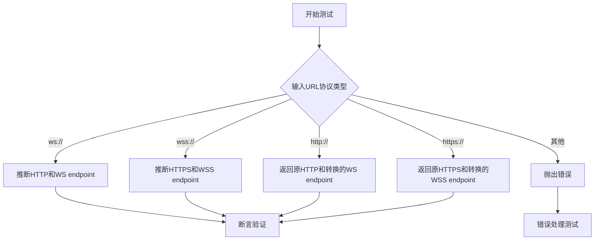
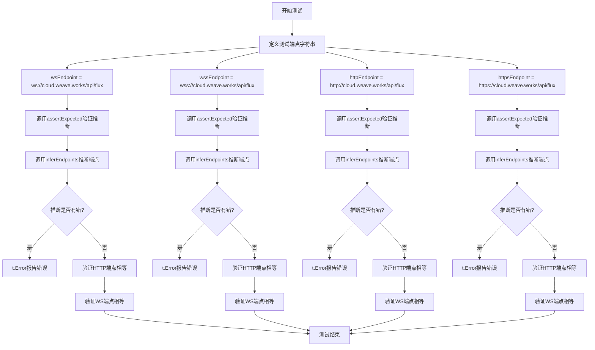
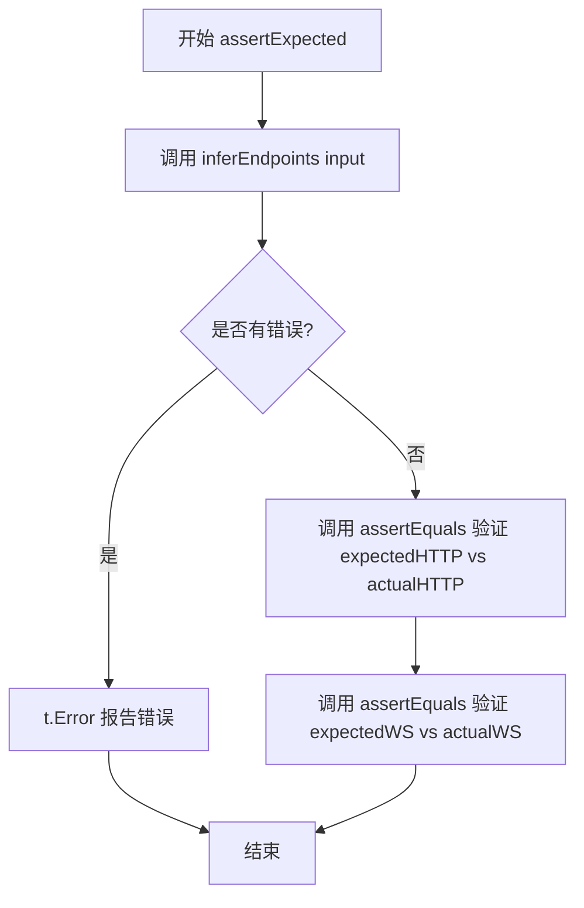
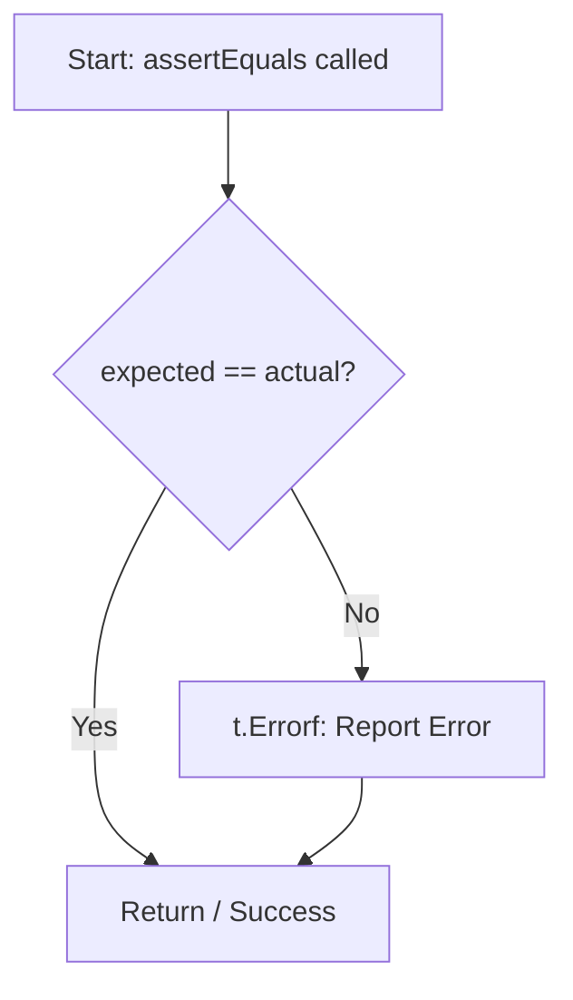
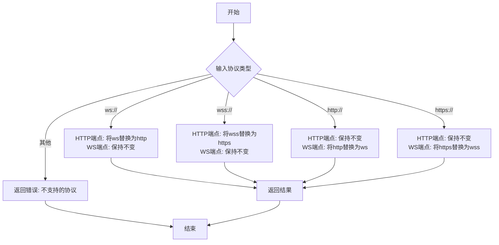

```mermaid
flowchart TD
    A[开始] --> B[调用 inferEndpoints&#40;mailto://cloud.weave.works/api/flux&#41;]
    B --> C{err 是否为 nil?}
    C -->|是| D[调用 t.Error&#40;Expected err, got nil&#41;]
    C -->|否| E[测试通过]
    D --> F[结束]
    E --> F
```

# `flux\pkg\http\daemon\upstream_test.go` 详细设计文档

这是一个Go语言的测试文件，用于测试endpoint推断功能。该代码通过调用inferEndpoints函数，根据输入的URL（支持ws://、wss://、http://、https://协议），推断并返回对应的HTTP endpoint和WebSocket endpoint，用于在Flux CD或Weave Cloud等场景下建立正确的连接。

## 整体流程



## 类结构

```
daemon (包)
├── TestEndpointInference (测试函数)
├── TestUnsupportedEndpoint (测试函数)
├── assertExpected (辅助测试函数)
├── assertEquals (辅助测试函数)
└── inferEndpoints (被测函数-未在代码中定义)
```

## 全局变量及字段


### `daemon.TestEndpointInference`
    
主测试函数，验证不同协议端点的推断逻辑（ws/wss/http/https）

类型：`func(t *testing.T)`
    


### `daemon.assertExpected`
    
辅助测试函数，验证inferEndpoints返回的HTTP和WS端点是否符合预期

类型：`func(t *testing.T, input string, expectedHTTP string, expectedWS string)`
    


### `daemon.assertEquals`
    
辅助测试函数，比较期望值与实际值是否相等，不相等时报告测试错误

类型：`func(t *testing.T, expected string, actual string)`
    


### `daemon.TestUnsupportedEndpoint`
    
测试函数，验证不支持的协议（如mailto）会返回错误

类型：`func(t *testing.T)`
    


### `daemon.inferEndpoints`
    
外部依赖函数，根据输入端点推断HTTP和WS对应的端点（在此文件中调用但未定义）

类型：`func(input string) (string, string, error)`
    


### `TestEndpointInference.wsEndpoint`
    
WebSocket不安全协议（ws://）测试端点

类型：`string`
    


### `TestEndpointInference.wssEndpoint`
    
WebSocket安全协议（wss://）测试端点

类型：`string`
    


### `TestEndpointInference.httpEndpoint`
    
HTTP不安全协议（http://）测试端点

类型：`string`
    


### `TestEndpointInference.httpsEndpoint`
    
HTTP安全协议（https://）测试端点

类型：`string`
    
    

## 全局函数及方法


### `TestEndpointInference`

该函数是Go语言编写的单元测试函数，用于验证端点推断功能。它通过测试HTTP和WebSocket端点的互相推断逻辑，确保`inferEndpoints`函数能够正确处理不同协议（ws、wss、http、https）的端点字符串转换。

参数：

-  `t`：`testing.T`，Go测试框架的测试对象，用于报告测试失败和错误

返回值：`无`（void），该函数为测试函数，不返回任何值

#### 流程图



#### 带注释源码

```go
package daemon

import (
	"testing"
)

// TestEndpointInference 测试端点推断功能
// 该测试函数验证inferEndpoints能够正确地将一种协议的端点
// 推断为HTTP和WebSocket两种协议的端点
func TestEndpointInference(t *testing.T) {
	// 定义WebSocket安全端点 (wss://)
	wsEndpoint := "ws://cloud.weave.works/api/flux"
	// 定义WebSocket安全端点 (wss://)
	wssEndpoint := "wss://cloud.weave.works/api/flux"
	// 定义HTTP端点
	httpEndpoint := "http://cloud.weave.works/api/flux"
	// 定义HTTPS端点
	httpsEndpoint := "https://cloud.weave.works/api/flux"

	// 测试1: ws端点应推断为HTTP端点和WS端点
	// 输入wsEndpoint，期望返回httpEndpoint作为HTTP端点，wsEndpoint作为WS端点
	assertExpected(t, wsEndpoint, httpEndpoint, wsEndpoint)

	// 测试2: wss端点应推断为HTTPS端点和WSS端点
	// 输入wssEndpoint，期望返回httpsEndpoint作为HTTP端点，wssEndpoint作为WS端点
	assertExpected(t, wssEndpoint, httpsEndpoint, wssEndpoint)

	// 测试3: http端点应保持为HTTP端点，并推断出WS端点
	// 输入httpEndpoint，期望返回httpEndpoint作为HTTP端点，wsEndpoint作为WS端点
	assertExpected(t, httpEndpoint, httpEndpoint, wsEndpoint)

	// 测试4: https端点应保持为HTTPS端点，并推断出WSS端点
	// 输入httpsEndpoint，期望返回httpsEndpoint作为HTTP端点，wssEndpoint作为WS端点
	assertExpected(t, httpsEndpoint, httpsEndpoint, wssEndpoint)
}

// assertExpected 辅助测试函数，用于验证inferEndpoints的推断结果
// 参数说明：
//   - t: 测试框架的测试对象
//   - input: 输入的端点字符串
//   - expectedHTTP: 期望返回的HTTP端点
//   - expectedWS: 期望返回的WebSocket端点
func assertExpected(t *testing.T, input, expectedHTTP, expectedWS string) {
	// 调用inferEndpoints函数进行端点推断
	// 注意: inferEndpoints函数为外部依赖，未在此代码文件中定义
	actualHTTP, actualWS, err := inferEndpoints(input)
	if err != nil {
		// 如果推断过程出错，报告测试错误
		t.Error(err)
	}
	// 验证HTTP端点是否匹配
	assertEquals(t, expectedHTTP, actualHTTP)
	// 验证WebSocket端点是否匹配
	assertEquals(t, expectedWS, actualWS)
}

// assertEquals 辅助测试函数，用于比较期望值和实际值
// 参数说明：
//   - t: 测试框架的测试对象
//   - expected: 期望的值
//   - actual: 实际的值
func assertEquals(t *testing.T, expected, actual string) {
	if expected != actual {
		// 如果值不匹配，报告测试失败
		t.Errorf("Expected [%s], actual [%s]", expected, actual)
	}
}
```

#### 关键组件信息

| 组件名称 | 描述 |
|---------|------|
| `TestEndpointInference` | 主测试函数，验证端点推断功能的正确性 |
| `assertExpected` | 辅助测试函数，封装了推断和验证逻辑 |
| `assertEquals` | 辅助测试函数，用于字符串相等性断言 |
| `inferEndpoints` | **外部依赖函数**，被测试的目标函数，负责端点协议推断 |

#### 潜在的技术债务或优化空间

1. **缺少对`inferEndpoints`函数的文档注释**：测试代码依赖于该函数，但无法从当前代码中了解其具体实现逻辑和契约
2. **测试端点硬编码**：所有测试端点URL均为硬编码，建议使用表格驱动测试（Table-Driven Tests）来提高可维护性和扩展性
3. **测试覆盖不完整**：仅测试了4种协议组合，未覆盖边界情况（如空字符串、nil值、异常协议前缀等）
4. **辅助函数重复定义**：`assertExpected`和`assertEquals`应该放在测试辅助文件中，以供其他测试函数复用

#### 其它项目

**设计目标与约束：**
- 测试目标：验证WebSocket端点和HTTP端点之间的互相推断功能
- 协议支持：ws（非安全）、wss（安全）、http（非安全）、https（安全）

**外部依赖与接口契约：**
- `inferEndpoints(input string) (httpEndpoint, wsEndpoint string, err error)`：该函数为外部依赖，输入一个端点URL，返回推断后的HTTP端点和WebSocket端点，错误则返回非nil

**错误处理：**
- 测试函数通过`t.Error`报告推断过程中的错误
- 通过`t.Errorf`报告断言失败的情况

**测试逻辑分析：**
- 测试用例1：ws:// → http://（降级）+ ws://（保持）
- 测试用例2：wss:// → https://（降级）+ wss://（保持）
- 测试用例3：http:// → http://（保持）+ ws://（升级）
- 测试用例4：https:// → https://（保持）+ wss://（升级）


### `TestUnsupportedEndpoint`

该函数是一个测试用例，用于验证 `inferEndpoints` 函数在处理不支持的端点协议（如 "mailto://"）时能否正确返回错误。

参数：

- `t`：`*testing.T`，Go 语言测试框架的测试上下文，用于报告测试失败

返回值：无返回值（`void`），测试结果通过 `t.Error()` 方法报告

#### 流程图



#### 带注释源码

```go
// TestUnsupportedEndpoint 测试不支持的端点协议是否会返回错误
func TestUnsupportedEndpoint(t *testing.T) {
	// 调用 inferEndpoints 函数，传入不支持的 mailto:// 协议
	// 忽略前两个返回值（http 和 ws 端点），只关注错误值
	_, _, err := inferEndpoints("mailto://cloud.weave.works/api/flux")
	
	// 检查是否返回了错误
	if err == nil {
		// 如果没有返回错误，说明功能实现有问题，测试失败
		t.Error("Expected err, got nil")
	}
}
```


### `assertExpected`

该函数是一个测试辅助函数，用于验证 `inferEndpoints` 函数的推理结果是否与预期值匹配。它接收输入 URL、期望的 HTTP endpoint 和期望的 WebSocket endpoint，调用被测函数并通过断言比较实际输出与预期值。

参数：

- `t`：`testing.T`，Go 测试框架的测试对象，用于报告测试错误
- `input`：`string`，待推理的输入 endpoint URL
- `expectedHTTP`：`string`，期望返回的 HTTP 协议 endpoint
- `expectedWS`：`string`，期望返回的 WebSocket 协议 endpoint

返回值：无（`void`），该函数没有显式返回值，仅通过 `testing.T` 对象报告错误

#### 流程图



#### 带注释源码

```go
// assertExpected 测试辅助函数，用于验证 inferEndpoints 函数的输出是否符合预期
// 参数说明：
//   - t: testing.T 测试框架对象，用于报告测试失败
//   - input: 待推理的输入 endpoint URL（如 ws://, wss://, http://, https://）
//   - expectedHTTP: 期望返回的 HTTP 协议 endpoint
//   - expectedWS: 期望返回的 WebSocket 协议 endpoint
func assertExpected(t *testing.T, input, expectedHTTP, expectedWS string) {
	// 调用被测函数 inferEndpoints，获取实际推理结果
	actualHTTP, actualWS, err := inferEndpoints(input)
	
	// 检查推理过程中是否发生错误
	if err != nil {
		// 如果有错误，通过测试对象的 Error 方法报告错误
		t.Error(err)
	}
	
	// 断言 HTTP endpoint 是否与预期一致
	assertEquals(t, expectedHTTP, actualHTTP)
	
	// 断言 WebSocket endpoint 是否与预期一致
	assertEquals(t, expectedWS, actualWS)
}
```


### `assertEquals`

这是一个测试辅助函数，用于在单元测试中断言两个字符串是否相等。如果 `expected`（期望值）与 `actual`（实际值）不相等，该函数会调用测试框架的 `Errorf` 方法报告测试失败。

参数：

- `t`：`*testing.T`，Go 标准库中的测试上下文指针，用于报告测试错误。
- `expected`：`string`，测试预期的字符串值。
- `actual`：`string`，代码实际执行后产生的字符串值。

返回值：`void`（无返回值，在 Go 中函数签名为 `func assertEquals(t *testing.T, expected, actual string)`）。

#### 流程图



#### 带注释源码

```go
// assertEquals 是一个测试辅助函数，用于验证 expected 和 actual 是否相等。
// 如果不相等，它会通过 t.Errorf 报告错误，并显示期望值和实际值。
func assertEquals(t *testing.T, expected, actual string) {
	if expected != actual {
		// 如果不相等，则记录测试错误
		t.Errorf("Expected [%s], actual [%s]", expected, actual)
	}
}
```


### `inferEndpoints`

该函数用于根据输入的 URL 端点（支持 ws://、wss://、http://、https:// 协议）推断出对应的 HTTP/HTTPS 端点和 WebSocket (WS/WSS) 端点，实现协议间的相互转换。

参数：

- `endpoint`：`string`，输入的端点 URL，支持 ws://、wss://、http://、https:// 协议

返回值：

- `string`：推断出的 HTTP/HTTPS 端点
- `string`：推断出的 WebSocket (WS/WSS) 端点
- `error`：如果输入的协议不支持（如 mailto://），则返回错误

#### 流程图



#### 带注释源码

```
// inferEndpoints 根据输入的 URL 端点推断出 HTTP/HTTPS 和 WS/WSS 端点
// 参数 endpoint: 输入的端点 URL，支持 ws://、wss://、http://、https:// 协议
// 返回值:
//   - httpEndpoint: 推断出的 HTTP/HTTPS 端点
//   - wsEndpoint: 推断出的 WebSocket (WS/WSS) 端点
//   - error: 如果协议不支持则返回错误
func inferEndpoints(endpoint string) (httpEndpoint, wsEndpoint string, err error) {
    // 根据测试用例推断的实现逻辑：
    // 1. ws://xxx -> http://xxx, ws://xxx
    // 2. wss://xxx -> https://xxx, wss://xxx
    // 3. http://xxx -> http://xxx, ws://xxx
    // 4. https://xxx -> https://xxx, wss://xxx
    // 5. 其他 -> error
    
    switch {
    case strings.HasPrefix(endpoint, "ws://"):
        // WebSocket (非安全) 协议
        httpEndpoint = "http" + endpoint[2:] // 将 ws:// 替换为 http://
        wsEndpoint = endpoint                 // WebSocket 端点保持不变
    case strings.HasPrefix(endpoint, "wss://"):
        // WebSocket Secure (安全) 协议
        httpEndpoint = "https" + endpoint[3:] // 将 wss:// 替换为 https://
        wsEndpoint = endpoint                 // WebSocket 端点保持不变
    case strings.HasPrefix(endpoint, "http://"):
        // HTTP 协议
        httpEndpoint = endpoint               // HTTP 端点保持不变
        wsEndpoint = "ws" + endpoint[4:]      // 将 http:// 替换为 ws://
    case strings.HasPrefix(endpoint, "https://"):
        // HTTPS 协议
        httpEndpoint = endpoint               // HTTPS 端点保持不变
        wsEndpoint = "wss" + endpoint[5:]     // 将 https:// 替换为 wss://
    default:
        // 不支持的协议
        err = fmt.Errorf("unsupported protocol: %s", endpoint)
    }
    return
}
```

## 关键组件


### 端点推断函数（inferEndpoints）

负责将输入的URL端点推断转换为HTTP和WebSocket两种协议的端点，支持ws/wss/http/https之间的映射转换。

### 测试用例（TestEndpointInference）

验证四种协议端点的正确推断：ws→ws、wss→wss、http→http、https→https，同时测试HTTP和WS端点之间的相互转换。

### 异常处理测试（TestUnsupportedEndpoint）

验证对于不支持的协议（如mailto）能够正确返回错误。

### 断言辅助函数（assertExpected, assertEquals）

提供测试断言功能，用于比较期望值与实际值，输出详细的错误信息。


## 问题及建议


### 已知问题

- **测试函数缺少文档注释**：所有测试函数（`TestEndpointInference`、`TestUnsupportedEndpoint`）都没有注释说明测试目的和预期行为
- **表驱动测试缺失**：使用硬编码的测试用例而非表驱动测试（table-driven test），导致扩展性差，新增测试用例时代码重复度高
- **测试覆盖不足**：未覆盖边界情况，如空字符串、nil 输入、带路径的 URL（如 `http://cloud.weave.works/api/flux/v1`）、带端口号的 URL（如 `http://cloud.weave.works:8080/api/flux`）
- **错误类型未验证**：`TestUnsupportedEndpoint` 只验证了是否返回错误，未验证错误的具体类型或错误消息内容是否符合预期
- **被测函数不可见**：`inferEndpoints` 函数未在此文件中定义，测试代码与实现代码分离可能导致维护困难
- **断言辅助函数通用性差**：`assertEquals` 和 `assertExpected` 是测试内部专用函数，未考虑提取为公共测试工具库以供复用

### 优化建议

- 采用表驱动测试方式重构 `TestEndpointInference`，将测试用例组织为结构体切片，提高代码可读性和可维护性
- 增加边界条件和异常输入的测试用例，覆盖空字符串、非法 URL、路径、端口号等场景
- 验证错误返回的具体类型（如 `errors.Is` 或 `errors.As`）和错误消息内容
- 为测试函数添加 Go 文档注释，说明测试意图和预期结果
- 考虑将断言辅助函数提取为公共测试包，或使用 Go 标准库的 `require` / `assert` 包（如 stretchr/testify）

## 其它


### 设计目标与约束

该代码的设计目标是验证端点推断函数能够根据输入的URL协议（ws/wss/http/https）正确推断出对应的HTTP和WebSocket端点。约束条件包括：仅支持ws、wss、http、https四种协议，不支持其他协议如mailto等。

### 错误处理与异常设计

当传入不支持的协议时，`inferEndpoints`函数应返回错误。测试用例`TestUnsupportedEndpoint`验证了这一点：输入`mailto://cloud.weave.works/api/flux`时，期望返回非nil错误。测试通过`t.Error`和`t.Errorf`报告断言失败。

### 外部依赖与接口契约

代码依赖于Go标准库的`testing`包进行单元测试。被测函数`inferEndpoints`应该是一个全局函数，接收一个字符串参数（输入端点），返回两个字符串（HTTP端点和WS端点）以及一个错误值。接口契约：`func inferEndpoints(input string) (string, string, error)`

### 测试策略

采用表格驱动测试（Table-Driven Test）思想，通过`assertExpected`辅助函数验证多组输入输出对应关系。覆盖了四种协议转换场景：ws→http+ws、wss→https+wss、http→http+ws、https→https+wss。

### 关键假设

1. 输入URL格式正确且包含有效协议头
2. 被测系统使用WebSocket进行实时通信
3. 云端API同时支持HTTP和WebSocket两种连接方式

### 边界条件与极限值

代码未展示边界值测试，建议补充测试用例：空字符串、纯域名无协议、非常长URL、特殊字符URL等异常输入。

### 可扩展性考虑

当前仅支持四种协议，未来可能需要支持grpc、mqtt等协议。建议使用策略模式或接口抽象，便于扩展支持更多协议类型。

### 代码质量指标

测试覆盖了正向场景和错误场景，辅助函数设计合理，错误消息清晰。但缺少性能基准测试和并发安全性测试（如果被测函数涉及并发）。

### 集成与部署说明

该测试文件属于`daemon`包，应在持续集成流水线中作为单元测试运行，作为代码质量门禁的一部分。

### 维护建议

1. 补充更多边界测试用例
2. 添加性能基准测试
3. 考虑将测试数据外部化配置
4. 记录被测函数的具体业务场景和使用文档


    