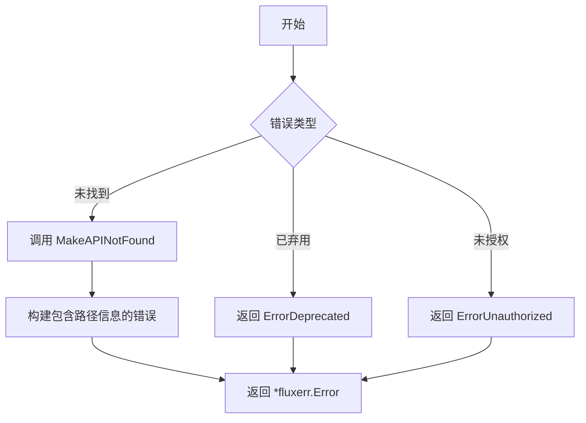
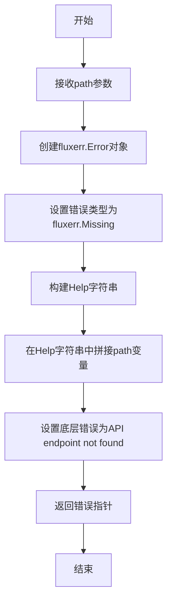

# `flux\pkg\http\errors.go` 详细设计文档

该代码文件定义了一个HTTP错误处理模块，用于Flux CD项目提供标准化的API错误信息，包括已弃用API、认证失败和API未找到等错误类型的构建函数。

## 整体流程



## 类结构

```
Go包结构 (非面向对象)
├── 全局错误变量
│   ├── ErrorDeprecated
│   └── ErrorUnauthorized
└── 全局函数
    └── MakeAPINotFound
```

## 全局变量及字段


### `ErrorDeprecated`
    
表示 API 端点已被弃用的错误，用于提示客户端需要更新

类型：`*fluxerr.Error`
    


### `ErrorUnauthorized`
    
表示请求认证失败的错误，用于提示 token 缺失或错误

类型：`*fluxerr.Error`
    


    

## 全局函数及方法


### MakeAPINotFound

这是一个HTTP包中的工具函数，用于创建一个表示API端点不存在的错误对象。它返回一个包含错误类型、帮助信息和底层错误的`fluxerr.Error`指针，帮助客户端识别并解决API版本不匹配或路径错误的问题。

参数：

- `path`：`string`，表示请求的API路径，用于在错误信息中显示具体哪个端点未被支持

返回值：`*fluxerr.Error`，返回一个错误指针，包含错误类型为`Missing`（表示资源缺失），错误帮助信息中包含客户端版本检查建议、问题反馈渠道，以及具体的API路径信息

#### 流程图



#### 带注释源码

```go
// 定义一个已弃用API的错误变量，供全局使用
var ErrorDeprecated = &fluxerr.Error{
    Type: fluxerr.Missing,         // 错误类型：缺失
    Help: `The API endpoint requested appears to have been deprecated.

This indicates your client (fluxctl) needs to be updated: please see

    https://github.com/fluxcd/flux/releases

If you still have this problem after upgrading, please file an issue at

    https://github.com/fluxcd/flux/issues

mentioning what you were attempting to do.
`,                                   // 帮助信息：指导用户升级客户端
    Err: errors.New("API endpoint deprecated"), // 底层错误
}

// 定义一个认证失败的错误变量，供全局使用
var ErrorUnauthorized = &fluxerr.Error{
    Type: fluxerr.User,            // 错误类型：用户错误
    Help: `The request failed authentication

This most likely means you have a missing or incorrect token. Please
make sure you supply a service token, either by setting the
environment variable FLUX_SERVICE_TOKEN, or using the argument --token
with fluxctl.

`,                                   // 帮助信息：指导用户提供正确的认证token
    Err: errors.New("request failed authentication"), // 底层错误
}

// MakeAPINotFound 创建一个API端点未找到的错误
// 参数：
//   - path: 请求的API路径
//
// 返回值：
//   - *fluxerr.Error: 包含错误详情的错误对象
func MakeAPINotFound(path string) *fluxerr.Error {
    return &fluxerr.Error{
        Type: fluxerr.Missing,     // 设置错误类型为缺失（Missing）
        Help: `The API endpoint requested is not supported by this server.

This indicates that your client (probably fluxctl) is either out of
date, or faulty. Please see

    https://github.com/fluxcd/flux/releases

for releases of fluxctl.

If you still have problems, please file an issue at

    https://github.com/fluxcd/flux/issues

mentioning what you were attempting to do, and include this path:

    ` + path + `                 // 将传入的path拼接到帮助信息中
`,                                 // 帮助信息：引导用户检查客户端版本并反馈问题
        Err: errors.New("API endpoint not found"), // 底层错误：API端点未找到
    }
}
```

---

#### 关键组件信息

- **fluxerr.Error**：来自fluxcd/flux/pkg/errors包的自定义错误类型，包含Type（错误类型）、Help（帮助信息）、Err（底层错误）三个字段
- **fluxerr.Missing**：错误类型枚举值，表示请求的资源不存在

#### 潜在的技术债务或优化空间

1. **硬编码的URL字符串**：帮助信息中的GitHub链接被硬编码在字符串中，如果URL变更需要修改代码，建议提取为配置常量
2. **字符串拼接效率**：使用`+`运算符拼接path到Help字符串，每次调用都会创建新的字符串，建议使用`fmt.Sprintf`或`strings.Builder`
3. **错误消息国际化**：当前错误信息只有英文版本，如果需要支持多语言，需要重构错误消息生成机制

#### 其它项目

- **设计目标**：为Flux服务提供清晰的API错误反馈，帮助用户识别客户端版本不兼容问题
- **错误处理策略**：使用自定义错误类型区分错误类别（User、Missing等），便于日志记录和问题排查
- **外部依赖**：依赖`github.com/fluxcd/flux/pkg/errors`包中的fluxerr.Error类型
- **接口契约**：接收string类型的path参数，返回*fluxerr.Error指针，无副作用

## 关键组件


### ErrorDeprecated

已弃用API端点的错误变量，提供友好的帮助信息引导用户更新客户端

### ErrorUnauthorized

认证失败的错误变量，提示用户缺少或错误的令牌，并提供设置FLUX_SERVICE_TOKEN环境变量或使用--token参数的指导

### MakeAPINotFound

创建API端点未找到错误的函数，返回包含具体请求路径信息的错误对象，帮助用户诊断客户端版本不匹配或服务器不支持该API端点的问题


## 问题及建议


### 已知问题

-   硬编码的URL和错误消息：将GitHub链接直接硬编码在错误消息中，若URL变更需要修改多处代码，维护性差
-   缺乏错误代码机制：仅通过错误消息字符串判断错误类型，不利于程序化处理错误
-   字符串拼接构建错误消息：`MakeAPINotFound`函数中使用`+`拼接path到字符串中，虽然这里是用户提示消息，但这种模式存在潜在风险
-   无错误日志记录：定义错误时没有任何日志记录，错误发生时的可追溯性差
-   缺少国际化支持：错误消息硬编码为英文，若需要多语言支持需要大规模重构
-   错误消息过于冗长：将用户提示、技术细节、URL混合在一起，不利于错误信息的复用和测试

### 优化建议

-   抽离URL为常量或配置项：将GitHub链接提取为包级常量，便于集中管理和更新
-   引入错误代码系统：定义错误代码常量（如`ErrCodeDeprecated`、`ErrCodeUnauthorized`），方便调用方程序化处理
-   使用错误链机制：利用Go的`fmt.Errorf`或自定义错误包装器添加上下文信息
-   考虑结构化错误：将静态用户提示文本与动态参数分离，使用模板或参数化方式
-   添加日志记录：在错误创建时记录日志，便于问题排查和监控
-   分离关注点：将面向用户的提示信息与技术实现细节解耦
-   考虑使用错误处理库：可考虑引入`go.uber.org/zap`等结构化日志库


## 其它


### 设计目标与约束

本代码模块旨在为Flux HTTP API提供标准化的错误定义和错误消息生成功能，确保客户端能够获得清晰、一致的错误反馈。设计约束包括：依赖fluxcd/flux/pkg/errors包提供的错误类型系统，错误消息需包含用户可读的帮助文本和诊断信息，所有错误需实现fluxerr.Error接口以保持与Flux错误处理框架的一致性。

### 错误处理与异常设计

本模块定义了三种核心API错误场景：ErrorDeprecated用于标识已弃用的API端点，ErrorUnauthorized用于认证失败场景，MakeAPINotFound函数动态生成路径不存在的错误。所有错误均通过fluxerr.Error结构体封装，包含错误类型(Type)、帮助文本(Help)和底层错误(Err)三个核心组件。错误类型采用fluxerr.User和fluxerr.Missing分类，前者表示用户操作导致的错误，后者表示资源缺失导致的错误。错误消息包含指向官方文档的链接，引导用户进行问题排查和版本升级。

### 外部依赖与接口契约

主要依赖项为github.com/fluxcd/flux/pkg/errors包，该包提供了fluxerr.Error结构体定义和错误类型常量(ErrorType)。模块导出三个公开接口：ErrorDeprecated变量(返回*fluxerr.Error)、ErrorUnauthorized变量(返回*fluxerr.Error)、MakeAPINotFound函数(接收string类型path参数，返回*fluxerr.Error)。调用方需确保传入有效的API路径字符串，函数返回的错误指针可直接用于HTTP响应或向上传递。

### 安全性考虑

错误消息中不包含敏感信息如用户名、密码、令牌或内部系统路径。所有外部链接均为公开的GitHub文档URL。帮助文本采用用户友好的语言描述问题，避免技术术语过多导致用户困惑。错误处理遵循最小泄露原则，不向客户端暴露服务器内部实现细节。

### 性能考虑

本模块为纯错误定义模块，不涉及运行时计算或资源分配。ErrorDeprecated和ErrorUnauthorized作为包级变量在包初始化时创建，MakeAPINotFound函数每次调用时构造新的错误对象。由于错误对象通常仅在异常路径创建，对整体性能影响可忽略不计。

### 测试策略

建议编写单元测试验证以下场景：ErrorDeprecated和ErrorUnauthorized的错误类型和帮助文本内容正确性；MakeAPINotFound函数对不同输入路径生成的错误消息包含正确路径；所有错误对象实现error接口的Error()方法；错误类型符合预期(User或Missing)。可使用表驱动测试方法覆盖多种API路径场景。

### 版本兼容性

当前代码未使用Go泛型或版本特定特性，保持与Go 1.x标准库的兼容性。fluxerr包的导入采用完整导入路径，需确保与Flux主版本同步升级。错误消息中的文档链接指向GitHub releases页面，需定期更新以反映最新版本信息。

### 配置说明

本模块为无状态错误定义模块，不涉及运行时配置。所有错误消息为预定义的静态字符串。如需自定义错误行为(如本地化支持)，建议在调用方层面处理，而非修改本模块。

### 监控和日志

错误模块本身不直接产生日志，但错误对象被返回后可能被调用方记录。建议在日志系统中对ErrorDeprecated和ErrorUnauthorized错误进行计数监控，以追踪客户端版本分布和认证失败频率。MakeAPINotFound错误可用于监控客户端请求的不存在API端点，帮助识别版本不匹配问题。


    