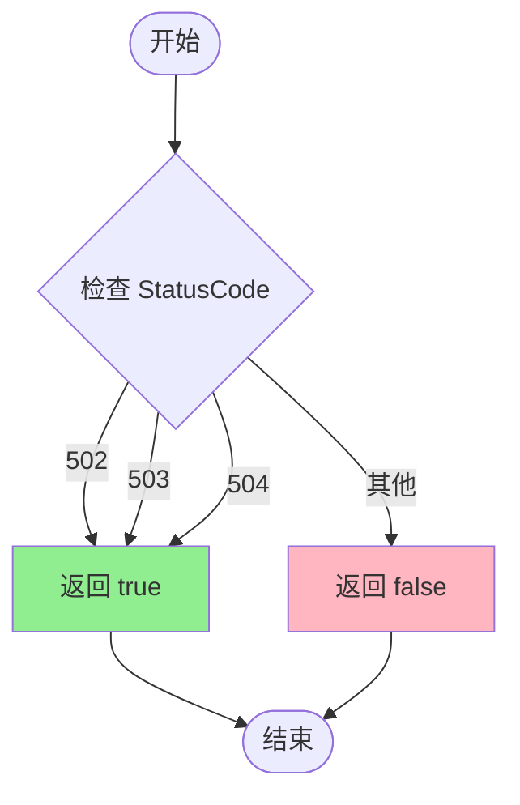
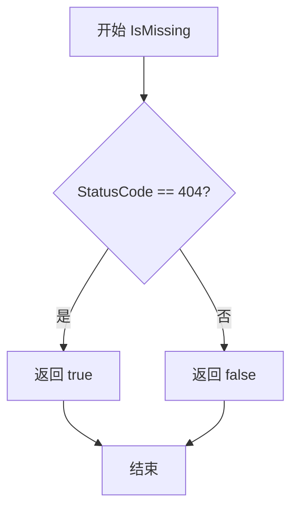

# `flux\pkg\http\httperror\api_error.go` 详细设计文档

一个Go语言错误处理包，定义了APIError结构体用于表示HTTP API调用失败时的错误信息，并提供了判断服务是否不可用(502/503/504)以及资源是否不存在(404)的方法。

## 整体流程

```mermaid
graph TD
A[API调用返回非20x响应] --> B[创建APIError实例]
B --> C{调用Error方法?}
C -->|是| D[返回格式化的错误字符串: Status (Body)]
C -->|否| E{调用IsUnavailable方法?}
E -->|是| F{StatusCode ∈ {502, 503, 504}}
F -->|是| G[返回true: 服务不可用]
F -->|否| H[返回false: 服务可用]
E -->|否| I{调用IsMissing方法?}
I -->|是| J{StatusCode == 404}
J -->|是| K[返回true: 资源不存在]
J -->|否| L[返回false: 资源存在]
```

## 类结构

```
APIError (struct)
└── Error() - error接口实现
└── IsUnavailable() - 判断服务不可用
└── IsMissing() - 判断资源缺失
```

## 全局变量及字段


### `StatusCode`
    
HTTP响应状态码

类型：`int`
    


### `Status`
    
HTTP状态描述文本

类型：`string`
    


### `Body`
    
响应体内容

类型：`string`
    


### `APIError.StatusCode`
    
HTTP响应状态码

类型：`int`
    


### `APIError.Status`
    
HTTP状态描述文本

类型：`string`
    


### `APIError.Body`
    
响应体内容

类型：`string`
    
    

## 全局函数及方法


### `APIError.Error`

实现 error 接口的 Error 方法，将 API 错误格式化为可读的错误描述字符串，格式为 "Status (Body)"，供日志记录和错误展示使用。

参数：
- （无参数）

返回值：`string`，格式化的错误描述字符串，格式为 'Status (Body)'

#### 流程图

```mermaid
flowchart TD
    A[开始 Error] --> B{err 是否为 nil?}
    B -- 是 --> C[返回空字符串]
    B -- 否 --> D[拼接格式: Status + " (" + Body + ")"]
    D --> E[返回格式化字符串]
    C --> E
    E --> F[结束]
```

#### 带注释源码

```go
// Error 实现 error 接口的 Error 方法
// 返回格式化的错误描述字符串，格式为 "Status (Body)"
// 例如: "404 Not Found ({"error": "resource not found"})"
func (err *APIError) Error() string {
    // 使用 fmt.Sprintf 将状态码描述和响应体组合成标准错误格式
    // 格式: "Status (Body)"
    return fmt.Sprintf("%s (%s)", err.Status, err.Body)
}
```


### `APIError.IsUnavailable`

该方法用于判断API错误是否表示服务不可用，通过检查HTTP状态码是否为502（Bad Gateway）、503（Service Unavailable）或504（Gateway Timeout）来确定。

参数：

- （无显式参数）

返回值：`bool`，如果StatusCode为502/503/504返回true，表示服务不可用

#### 流程图



#### 带注释源码

```go
// Does this error mean the API service is unavailable?
// 判断此错误是否表示API服务不可用
func (err *APIError) IsUnavailable() bool {
    // 使用switch语句检查HTTP状态码
    switch err.StatusCode {
    case 502, 503, 504:
        // 502: Bad Gateway - 网关错误
        // 503: Service Unavailable - 服务不可用
        // 504: Gateway Timeout - 网关超时
        // 上述三种状态码都表示服务端暂时不可用
        return true
    }
    // 其他状态码返回false，表示服务可用或错误原因不同
    return false
}
```


### `APIError.IsMissing`

该方法用于判断 API 调用的错误是否表示资源不存在（HTTP 404），通常用于处理客户端与服务端版本不匹配的场景。

参数： 无

返回值：`bool`，如果 StatusCode 为 404 返回 true，表示资源不存在

#### 流程图



#### 带注释源码

```go
// Is this API call missing? This usually indicates that there is a
// version mismatch between the client and the service.
func (err *APIError) IsMissing() bool {
    // 检查错误状态码是否为 HTTP 404 (StatusNotFound)
    return err.StatusCode == http.StatusNotFound
}
```

## 关键组件


### APIError 结构体

用于表示API调用失败时的错误类型，包含HTTP状态码、状态描述和响应体，可通过errors.Cause(err)获取，支持区分服务不可用和资源缺失等不同错误场景。

### Error() 方法

实现error接口，返回格式化的错误字符串，格式为"{Status} ({Body})"，用于将APIError转换为可读的错误信息。

### IsUnavailable() 方法

判断API服务是否不可用，通过检查状态码是否为502、503或504返回布尔值，用于区分暂时性服务故障。

### IsMissing() 方法

判断API调用指向的资源是否不存在，通过检查状态码是否为http.StatusNotFound(404)返回布尔值，通常表示客户端与服务端版本不匹配。

### 全局变量 http.StatusNotFound

Go标准库的HTTP状态码常量，表示404状态，用于资源缺失的判断。


## 问题及建议


### 已知问题

-   **错误接口实现不规范**：`Error()`方法使用指针接收者(`*APIError`)，当通过值类型调用时可能无法正确返回错误信息
-   **缺少错误链支持**：未实现`Unwrap()`方法，无法与Go 1.13+的`errors.Is()`和`errors.As()`机制配合使用
-   **状态码硬编码**：`IsUnavailable()`方法中502、503、504状态码硬编码，缺乏可配置性
-   **错误类型覆盖不全**：仅提供了Unavailable和Missing两种判断，缺少对认证错误(401)、权限错误(403)、客户端错误(400)等常见HTTP错误的判断方法
-   **字段缺乏验证**：公开字段没有提供构造函数或验证逻辑，可能创建不合法的APIError实例
-   **缺少上下文信息**：错误结构缺少时间戳、请求URL、请求方法等调试信息
-   **Status字段冗余**：StatusCode和Status字段存在冗余，Status可通过StatusCode推导

### 优化建议

-   **实现错误链**：添加`Unwrap() error`方法，返回对底层错误的引用，支持`errors.Is()`和`errors.As()`调用
-   **使用值接收者**：将`Error()`方法改为值接收者`func (err APIError) Error() string`，确保值类型和指针类型都能正确返回错误
-   **定义状态码常量**：将HTTP状态码定义为常量，提高可读性和可维护性
-   **扩展错误判断方法**：添加IsUnauthorized()、IsForbidden()、IsClientError()、IsServerError()等方法
-   **提供构造函数**：创建`NewAPIError(statusCode int, body string)`构造函数，在内部自动设置Status字段并进行参数验证
-   **添加调试信息字段**：考虑添加Time、URL、Method等字段以便调试
-   **实现errorf兼容**：考虑实现`Format()`方法支持`%+v`详细错误输出


## 其它


### 设计目标与约束

设计目标：提供一种标准化的方式来表示和区分HTTP API调用失败时的错误类型，使调用方能够根据错误类型采取相应的处理措施，如重试、降级或提示用户。

设计约束：
- 保持APIError结构简单，仅包含HTTP错误的核心信息
- 兼容Go标准错误处理机制（实现error接口）
- 支持通过errors.Cause()进行错误类型诊断
- 不依赖第三方错误处理库，保持最小依赖

### 错误处理与异常设计

错误分类：
- 客户端错误（4xx）：如404表示资源不存在
- 服务端错误（5xx）：如502/503/504表示服务不可用
- 网络错误：应在调用方处理，不属于APIError范畴

错误传播：
- APIError作为基础错误类型，可被包装和扩展
- 通过IsUnavailable()和IsMissing()方法提供具体错误类型判断
- 建议调用方使用errors.Is()或errors.As()进行错误链遍历

异常情况：
- Body字段可能为空字符串
- Status字段应与StatusCode对应，由HTTP库自动生成
- 建议在构造APIError时进行参数校验

### 外部依赖与接口契约

依赖项：
- "fmt"：用于Error()方法格式化输出
- "net/http"：使用http.StatusNotFound常量

接口契约：
- 实现了error接口的Error() string方法
- 提供布尔判断方法IsUnavailable()和IsMissing()
- 不对外暴露构造函数，由调用方根据HTTP响应构造

兼容性保证：
- 保持APIError字段和方法的公开性
- 未来新增错误判断方法应保持向后兼容

### 性能考虑

内存效率：
- APIError结构体字段紧凑，内存占用低
- 避免不必要的字符串拷贝

计算效率：
- IsUnavailable()使用switch语句，O(1)复杂度
- IsMissing()直接比较整型，O(1)复杂度

### 测试策略

单元测试：
- 测试Error()方法的输出格式
- 测试IsUnavailable()对502/503/504的识别
- 测试IsMissing()对404的识别
- 测试非预期状态码的返回false情况

边界测试：
- 测试状态码0和负数
- 测试空字符串Body和Status

### 监控和日志

日志建议：
- 在创建APIError时记录原始响应信息
- 建议调用方在错误处理流程中记录关键决策点
- 可扩展添加错误时间戳和请求ID

监控指标：
- 建议统计各类APIError的发生频率
- 可通过IsUnavailable()统计服务不可用次数

### 版本控制和兼容性

版本策略：
- 遵循语义化版本控制
- 新增布尔判断方法应保持向后兼容
- 重大变更应在主版本号升级时说明

迁移指南：
- 当前版本为初始版本，无迁移需求
- 未来考虑添加错误码枚举以支持更精细的错误分类

    