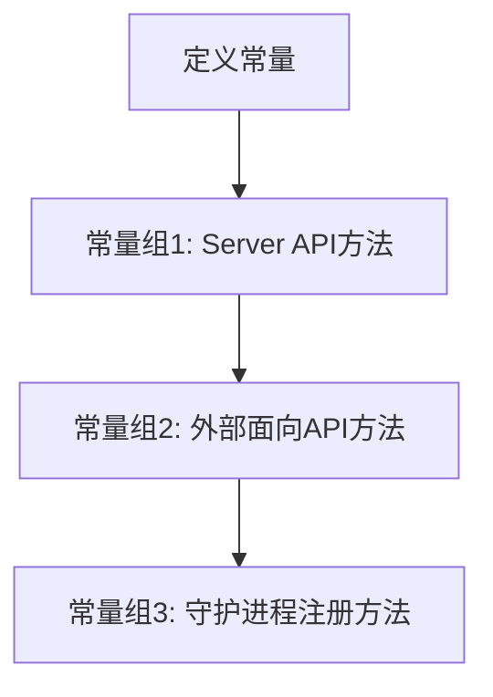

# `flux\pkg\http\routes.go` 详细设计文档

该文件定义了一系列字符串常量，用于标识HTTP API的端点或方法，包括服务健康检查、版本控制、服务列表、镜像管理、策略更新、SSH密钥管理以及守护进程注册等功能，以支持客户端与服务器之间的通信。

## 整体流程



## 类结构

```

```

## 全局变量及字段


### `Ping`
    
Ping方法名常量，用于健康检查

类型：`const string`
    


### `Version`
    
Version方法名常量，用于获取版本信息

类型：`const string`
    


### `Notify`
    
Notify方法名常量，用于通知机制

类型：`const string`
    


### `ListServices`
    
ListServices方法名常量，用于列出服务

类型：`const string`
    


### `ListServicesWithOptions`
    
ListServicesWithOptions方法名常量，用于带选项地列出服务

类型：`const string`
    


### `ListImages`
    
ListImages方法名常量，用于列出镜像

类型：`const string`
    


### `ListImagesWithOptions`
    
ListImagesWithOptions方法名常量，用于带选项地列出镜像

类型：`const string`
    


### `UpdateManifests`
    
UpdateManifests方法名常量，用于更新清单文件

类型：`const string`
    


### `JobStatus`
    
JobStatus方法名常量，用于获取任务状态

类型：`const string`
    


### `SyncStatus`
    
SyncStatus方法名常量，用于获取同步状态

类型：`const string`
    


### `Export`
    
Export方法名常量，用于导出操作

类型：`const string`
    


### `GitRepoConfig`
    
GitRepoConfig方法名常量，用于Git仓库配置

类型：`const string`
    


### `UpdateImages`
    
UpdateImages方法名常量，用于更新镜像

类型：`const string`
    


### `UpdatePolicies`
    
UpdatePolicies方法名常量，用于更新策略

类型：`const string`
    


### `GetPublicSSHKey`
    
GetPublicSSHKey方法名常量，用于获取公钥

类型：`const string`
    


### `RegeneratePublicSSHKey`
    
RegeneratePublicSSHKey方法名常量，用于重新生成公钥

类型：`const string`
    


### `LogEvent`
    
LogEvent方法名常量，用于记录日志事件

类型：`const string`
    


### `RegisterDaemonV6`
    
RegisterDaemonV6方法名常量，用于注册守护进程V6版本

类型：`const string`
    


### `RegisterDaemonV7`
    
RegisterDaemonV7方法名常量，用于注册守护进程V7版本

类型：`const string`
    


### `RegisterDaemonV8`
    
RegisterDaemonV8方法名常量，用于注册守护进程V8版本

类型：`const string`
    


### `RegisterDaemonV9`
    
RegisterDaemonV9方法名常量，用于注册守护进程V9版本

类型：`const string`
    


### `RegisterDaemonV10`
    
RegisterDaemonV10方法名常量，用于注册守护进程V10版本

类型：`const string`
    


### `RegisterDaemonV11`
    
RegisterDaemonV11方法名常量，用于注册守护进程V11版本

类型：`const string`
    


    

## 全局函数及方法


## 关键组件


### HTTP方法常量定义模块

该代码定义了一组用于HTTP API的方法名称常量，涵盖服务管理、镜像操作、Daemon注册等多个功能领域，作为远程过程调用（RPC）的路由标识符使用。

### Ping / Version / Notify

基础健康检查和版本协商相关的API方法常量，用于客户端与服务端的连接验证和版本信息获取。

### ListServices / ListServicesWithOptions

服务列表查询相关的API方法常量，支持基础列表和带选项的列表查询功能。

### ListImages / ListImagesWithOptions

镜像列表查询相关的API方法常量，支持基础列表和带选项的镜像查询功能。

### UpdateManifests / UpdateImages / UpdatePolicies

资源更新相关的API方法常量，用于同步和更新Kubernetes清单、镜像及策略配置。

### JobStatus / SyncStatus

任务和同步状态查询相关的API方法常量，用于获取异步任务的执行状态和资源同步状态。

### Export / GitRepoConfig

导出和Git仓库配置相关的API方法常量，用于数据导出和Git仓库连接配置。

### GetPublicSSHKey / RegeneratePublicSSHKey

SSH密钥管理相关的API方法常量，用于获取和重新生成公钥。

### LogEvent

日志事件记录相关的API方法常量，属于面向服务提供者的外部API。

### RegisterDaemonV6-V11

Daemon注册相关的API方法常量系列，支持多个版本的RPC中继连接协议。


## 问题及建议


### 已知问题

-   **版本管理混乱**：存在从V6到V11的多个`RegisterDaemon`版本常量，表明API版本控制缺乏统一规划，可能导致兼容性和维护问题。
-   **技术债务未处理**：代码注释明确指出`RegisterDaemonX`路由应迁移至`weaveworks/flux-adapter`，但尚未执行，形成潜在重构负担。
-   **遗留API标识残留**：注释提到"Formerly Upstream methods, now (in v11) included in server API"，说明部分常量可能是旧API遗留，未及时清理。
-   **命名风格不一致**：例如`ListServices`与`ListServicesWithOptions`并存，`RegisterDaemon`显式包含版本号，命名规范不统一。

### 优化建议

-   **清理冗余版本**：移除`RegisterDaemonV6`至`RegisterDaemonV10`，仅保留最新版本`RegisterDaemonV11`，或通过版本适配器兼容旧版本。
-   **执行代码迁移**：按注释建议，将`RegisterDaemon`相关常量移至`weaveworks/flux-adapter`包，降低主代码库耦合度。
-   **统一常量命名**：制定并应用命名规范，例如使用抽象方法名替代显式版本号，或采用枚举类型管理相关常量。
-   **制定API版本策略**：建立明确的API版本管理流程，避免未来再出现多版本混乱的局面。
-   **引入类型分组**：将相关常量（如同类别的API方法）组织到结构体或接口中，提升代码可读性和类型安全性。


## 其它


### 设计目标与约束

定义HTTP API方法常量，统一客户端与服务器之间的RPC通信协议，确保方法名称的一致性和可维护性。这些常量作为API契约的核心部分，需要保持向后兼容，避免频繁变更导致集成方需要同步修改。

### 常量分组与分类逻辑

第一组（Ping、Version、Notify等）为服务器核心API方法，涵盖服务发现、镜像管理和任务状态查询等功能。第二组（LogEvent）为面向外部服务的API，用于事件记录。第三组（RegisterDaemonV6至V11）为守护进程注册路由，用于建立RPCrelay连接，从V6演进到V11反映了协议迭代过程。

### 版本演进与历史

RegisterDaemon从V6逐步演进到V11，说明底层通信协议经历了多次重大改版。当前代码中保留了历史版本常量，可能是为了兼容旧版客户端。设计文档应记录每次版本变更的具体原因（如协议格式变化、安全增强、功能扩展等），并明确版本弃用计划。

### 使用场景与调用方

这些常量主要在HTTP客户端构建请求URL、服务器端路由匹配、以及RPC编解码模块中使用。调用方包括fluxctl命令行工具、weaveworks/flux-adapter适配器、以及集成该库的第三方系统。

### 错误处理与异常设计

当收到未知方法名时，系统应返回404 Not Found或405 Method Not Allowed错误。建议在服务器端增加方法名白名单验证，拒绝未定义的方法调用，防止潜在的安全风险。

### 外部依赖与接口契约

该包作为基础定义层，不直接依赖外部包，但会被http/client、server/router等包引用。接口契约表现为：调用方使用常量构建请求，服务器端根据常量进行路由分发，双方需保持常量定义同步。

### 兼容性设计

新方法添加应遵循向后兼容原则，废弃方法需保留并标记deprecated，建议提供版本迁移指南。RegisterDaemon保留多版本常量体现了对旧客户端的兼容考虑。

### 安全考量

部分方法（如RegeneratePublicSSHKey）涉及敏感操作，应在服务器端增加权限验证。设计文档应标注敏感方法列表，要求调用方进行身份认证。

### 测试策略

建议添加单元测试验证常量定义正确性、测试常量拼写规范、验证版本号连续性，以及测试新旧版本常量的共存兼容性。

### 性能考虑

由于是常量定义，不涉及运行时性能问题。但在常量解析和字符串匹配场景中，可考虑使用map存储以提高查询效率。

### 代码质量与规范

常量命名应遵循Go语言惯例（驼峰命名），分组间用空行分隔，注释说明常量用途和所属版本。建议增加每个分组的整体说明注释。


    