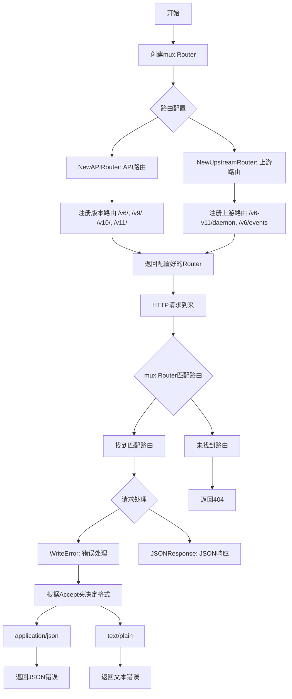
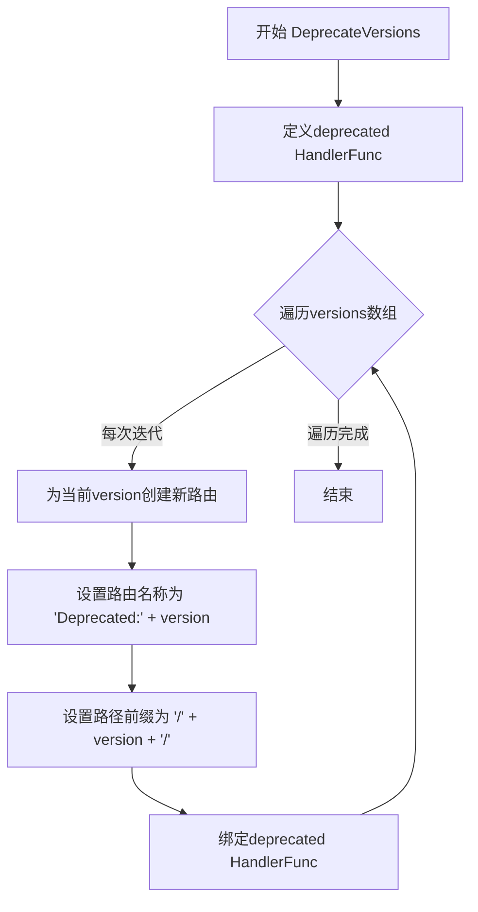
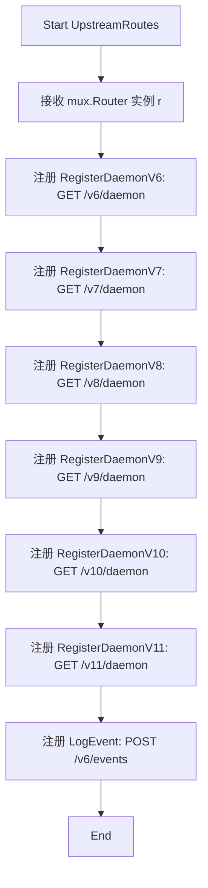
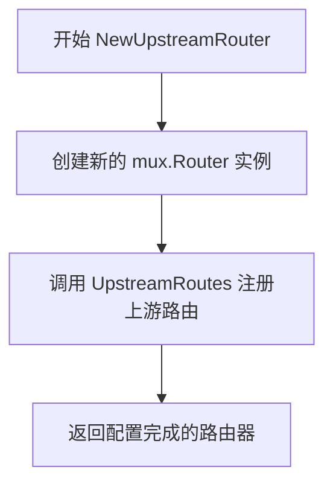
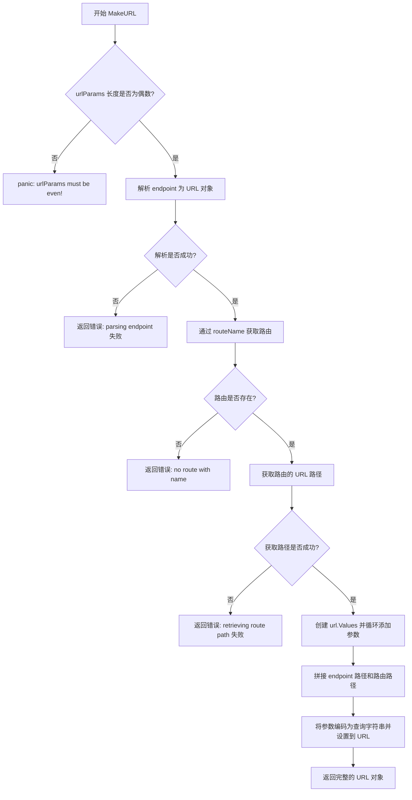
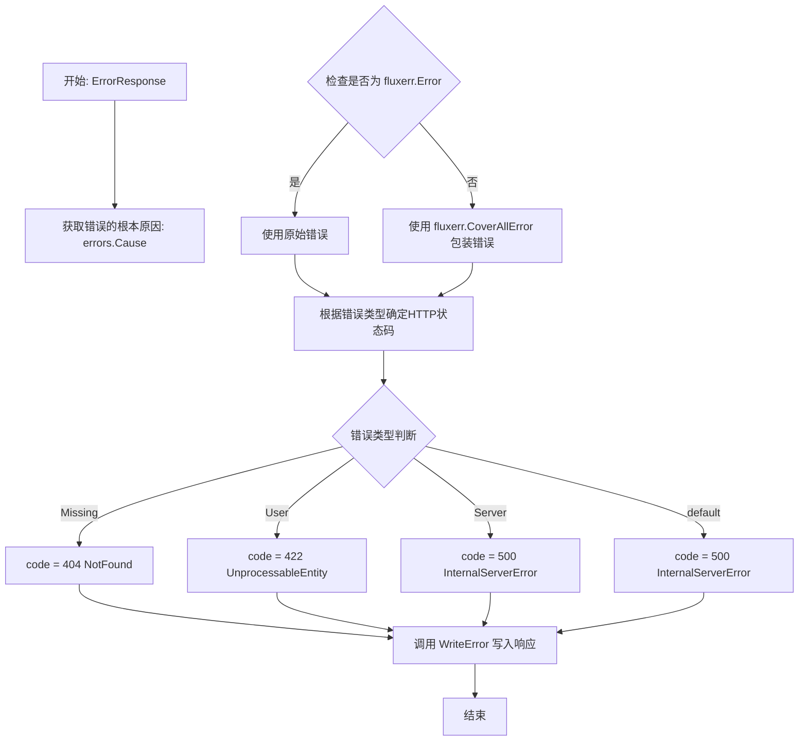
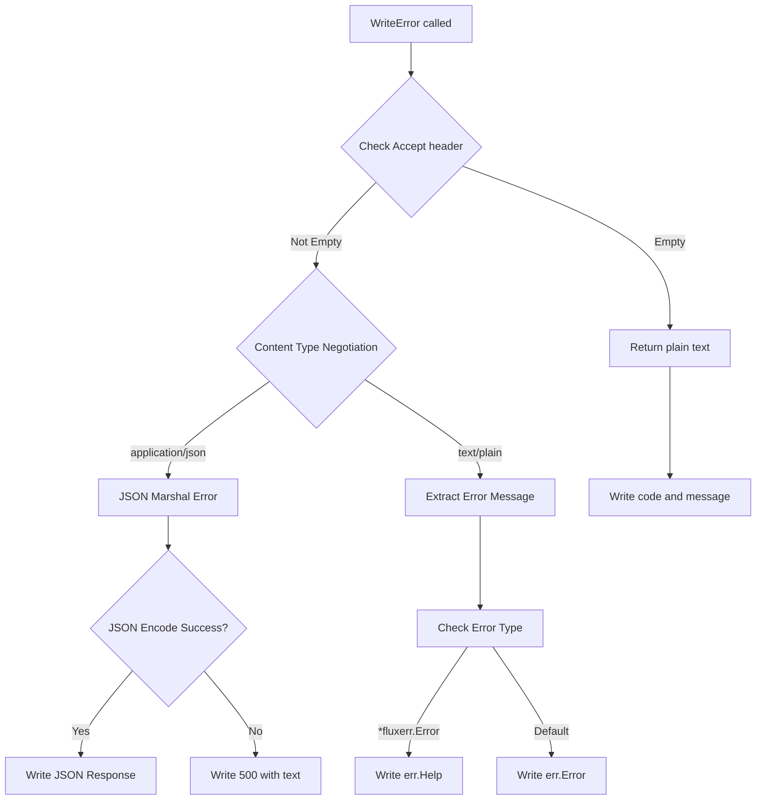
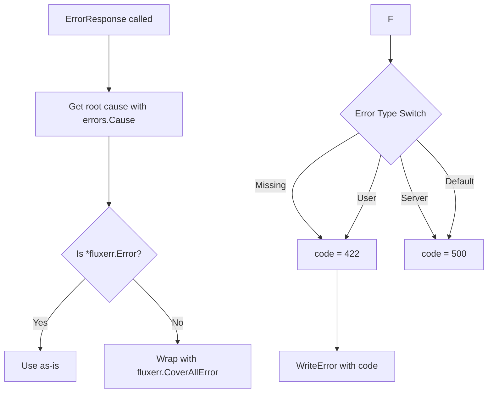

# `flux\pkg\http\transport.go` 详细设计文档

这是一个Flux CD的HTTP路由和API处理包，提供了RESTful API路由的创建、URL生成、错误处理和JSON响应功能，支持多个版本的API端点以及废弃版本的处理。

## 整体流程



## 类结构

```
http包 (无类定义)
├── 全局函数
│   ├── DeprecateVersions
│   ├── NewAPIRouter
│   ├── UpstreamRoutes
│   ├── NewUpstreamRouter
│   ├── MakeURL
│   ├── WriteError
│   ├── JSONResponse
│   └── ErrorResponse
└── 隐含路由名称常量 (通过Name()使用)
```

## 全局变量及字段


### `Ping`
    
路由名称常量，对应ping端点

类型：`string`
    


### `Version`
    
路由名称常量，对应version端点

类型：`string`
    


### `Notify`
    
路由名称常量，对应notify端点

类型：`string`
    


### `ListServices`
    
路由名称常量，对应v6服务列表端点

类型：`string`
    


### `ListServicesWithOptions`
    
路由名称常量，对应v11服务列表端点

类型：`string`
    


### `ListImages`
    
路由名称常量，对应v6镜像列表端点

类型：`string`
    


### `ListImagesWithOptions`
    
路由名称常量，对应v10镜像列表端点

类型：`string`
    


### `UpdateManifests`
    
路由名称常量，对应更新清单端点

类型：`string`
    


### `JobStatus`
    
路由名称常量，对应作业状态查询端点

类型：`string`
    


### `SyncStatus`
    
路由名称常量，对应同步状态查询端点

类型：`string`
    


### `Export`
    
路由名称常量，对应导出端点

类型：`string`
    


### `GitRepoConfig`
    
路由名称常量，对应Git仓库配置端点

类型：`string`
    


### `UpdateImages`
    
路由名称常量，对应更新镜像端点（已废弃）

类型：`string`
    


### `UpdatePolicies`
    
路由名称常量，对应更新策略端点（已废弃）

类型：`string`
    


### `GetPublicSSHKey`
    
路由名称常量，对应获取公钥端点（已废弃）

类型：`string`
    


### `RegeneratePublicSSHKey`
    
路由名称常量，对应重新生成公钥端点（已废弃）

类型：`string`
    


### `RegisterDaemonV6`
    
路由名称常量，对应v6守护进程注册端点

类型：`string`
    


### `RegisterDaemonV7`
    
路由名称常量，对应v7守护进程注册端点

类型：`string`
    


### `RegisterDaemonV8`
    
路由名称常量，对应v8守护进程注册端点

类型：`string`
    


### `RegisterDaemonV9`
    
路由名称常量，对应v9守护进程注册端点

类型：`string`
    


### `RegisterDaemonV10`
    
路由名称常量，对应v10守护进程注册端点

类型：`string`
    


### `RegisterDaemonV11`
    
路由名称常量，对应v11守护进程注册端点

类型：`string`
    


### `LogEvent`
    
路由名称常量，对应日志事件端点

类型：`string`
    


### `ErrorDeprecated`
    
已弃用版本的错误常量

类型：`error`
    


### `deprecated`
    
处理已弃用版本请求的HTTP处理器

类型：`http.HandlerFunc`
    


### `endpoint`
    
MakeURL函数的参数，表示基础端点URL字符串

类型：`string`
    


### `routeName`
    
MakeURL函数的参数，表示路由名称字符串

类型：`string`
    


### `urlParams`
    
MakeURL函数的参数，表示URL查询参数键值对

类型：`...string`
    


### `endpointURL`
    
解析后的端点URL对象

类型：`*url.URL`
    


### `route`
    
通过名称获取的路由对象

类型：`mux.Route`
    


### `routeURL`
    
路由的URL路径对象

类型：`*url.URL`
    


### `v`
    
URL查询参数集合

类型：`url.Values`
    


### `code`
    
HTTP响应状态码

类型：`int`
    


### `err`
    
通用错误变量

类型：`error`
    


### `body`
    
JSON编码后的字节数组

类型：`[]byte`
    


### `encodeErr`
    
JSON编码错误

类型：`error`
    


### `result`
    
JSONResponse函数的参数，表示要序列化的结果对象

类型：`interface{}`
    


### `apiError`
    
ErrorResponse函数的参数，表示API错误

类型：`error`
    


### `outErr`
    
转换后的Flux错误对象

类型：`*fluxerr.Error`
    


### `ok`
    
类型断言结果的布尔标志

类型：`bool`
    


    

## 全局函数及方法


### `DeprecateVersions`

该函数用于为指定的API版本创建弃用路由，使这些版本的请求返回HTTP 410 Gone状态码，从而实现API版本弃用的统一处理，并便于在指标和日志中区分不同的弃用版本。

参数：

- `r`：`*mux.Router`，Gorilla Mux路由器实例，用于注册弃用路由
- `versions`：`...string`，可变参数，要弃用的API版本号列表（如 "v6"、"v9" 等）

返回值：`void`，无返回值

#### 流程图



#### 带注释源码

```go
// DeprecateVersions 为指定的API版本创建弃用路由
// 这些路由会返回HTTP 410 Gone状态码，表示API版本已弃用
// 参数:
//   - r: *mux.Router - Gorilla Mux路由器实例，用于注册弃用路由
//   - versions: ...string - 可变参数，要弃用的API版本号列表
func DeprecateVersions(r *mux.Router, versions ...string) {
    // 定义一个返回410 Gone错误的HandlerFunc
    // 该handler会调用WriteError返回ErrorDeprecated错误
    var deprecated http.HandlerFunc = func(w http.ResponseWriter, r *http.Request) {
        WriteError(w, r, http.StatusGone, ErrorDeprecated)
    }

    // 遍历所有需要弃用的版本
    // 每个版本单独处理，以便在metrics和logging中区分不同的弃用方法
    for _, version := range versions {
        // 创建新路由，设置名称为 "Deprecated:" + 版本号
        // 路径前缀为 "/" + 版本号 + "/"
        // 例如: version = "v6" -> 路径前缀为 "/v6/"
        r.NewRoute().Name("Deprecated:" + version).PathPrefix("/" + version + "/").HandlerFunc(deprecated)
    }
}
```


### `NewAPIRouter`

创建并配置一个 gorilla/mux 路由器实例，定义 Flux API 的所有 HTTP 路由端点（包括 Ping、Version、Notify、Services、Images、Jobs、Sync、Export 等），并返回配置好的路由器供 HTTP 服务器使用。

参数：
- 无

返回值：`*mux.Router`，返回配置完成的 gorilla/mux 路由器实例，可用于处理 HTTP 请求

#### 流程图

```mermaid
flowchart TD
    A[开始 NewAPIRouter] --> B[创建新的 mux.Router 实例]
    B --> C[注册 v11 版本路由]
    C --> D[注册 v6/v10/v9 版本路由]
    D --> E[注册旧版本兼容路由]
    E --> F[返回配置完成的路由器]
    
    subgraph C
    C1[Ping: GET /v11/ping]
    C2[Version: GET /v11/version]
    C3[Notify: POST /v11/notify]
    end
    
    subgraph D
    D1[ListServices v6: GET /v6/services]
    D2[ListServices v11: GET /v11/services]
    D3[ListImages v6: GET /v6/images]
    D4[ListImages v10: GET /v10/images]
    D5[UpdateManifests: POST /v9/update-manifests]
    D6[JobStatus: GET /v6/jobs?id={id}]
    D7[SyncStatus: GET /v6/sync?ref={ref}]
    D8[Export: HEAD/GET /v6/export]
    D9[GitRepoConfig: POST /v9/git-repo-config]
    end
    
    subgraph E
    E1[UpdateImages: POST /v6/update-images]
    E2[UpdatePolicies: PATCH /v6/policies]
    E3[GetPublicSSHKey: GET /v6/identity.pub]
    E4[RegeneratePublicSSHKey: POST /v6/identity.pub]
    end
```

#### 带注释源码

```go
// NewAPIRouter 创建并配置一个 HTTP API 路由器
// 返回一个已注册所有 Flux API 路由的 mux.Router 实例
func NewAPIRouter() *mux.Router {
	// 创建新的 gorilla/mux 路由器实例
	r := mux.NewRouter()

	// === v11 版本路由 ===
	r.NewRoute().Name(Ping).Methods("GET").Path("/v11/ping")
	r.NewRoute().Name(Version).Methods("GET").Path("/v11/version")
	r.NewRoute().Name(Notify).Methods("POST").Path("/v11/notify")

	// === Services 和 Images 路由（多版本） ===
	r.NewRoute().Name(ListServices).Methods("GET").Path("/v6/services")
	r.NewRoute().Name(ListServicesWithOptions).Methods("GET").Path("/v11/services")
	r.NewRoute().Name(ListImages).Methods("GET").Path("/v6/images")
	r.NewRoute().Name(ListImagesWithOptions).Methods("GET").Path("/v10/images")

	// === 核心操作路由 ===
	r.NewRoute().Name(UpdateManifests).Methods("POST").Path("/v9/update-manifests")
	r.NewRoute().Name(JobStatus).Methods("GET").Path("/v6/jobs").Queries("id", "{id}")
	r.NewRoute().Name(SyncStatus).Methods("GET").Path("/v6/sync").Queries("ref", "{ref}")
	r.NewRoute().Name(Export).Methods("HEAD", "GET").Path("/v6/export")
	r.NewRoute().Name(GitRepoConfig).Methods("POST").Path("/v9/git-repo-config")

	// === 旧版本兼容路由 ===
	// 这些路由保留以支持来自旧版 fluxctl 的请求
	// 应避免添加新引用以便最终移除
	r.NewRoute().Name(UpdateImages).Methods("POST").Path("/v6/update-images").Queries("service", "{service}", "image", "{image}", "kind", "{kind}")
	r.NewRoute().Name(UpdatePolicies).Methods("PATCH").Path("/v6/policies")
	r.NewRoute().Name(GetPublicSSHKey).Methods("GET").Path("/v6/identity.pub")
	r.NewRoute().Name(RegeneratePublicSSHKey).Methods("POST").Path("/v6/identity.pub")

	// 返回配置完成的路由器（TODO: 需要处理 404 情况）
	return r
}
```


### `UpstreamRoutes`

该函数用于在给定的 `mux.Router` 上注册一组上游（Upstream）路由，主要服务于来自旧版本 fluxctl 客户端的请求。根据代码注释，这些路由的存在是为了向后兼容，允许旧版本的客户端能够继续与新版本的 Flux 服务通信。函数内部注册了多个版本的 Daemon 注册端点（V6 到 V11）以及一个事件日志端点（V6）。

参数：

- `r`：`*mux.Router`，Gorilla Mux 路由器实例，用于注册和配置 HTTP 路由

返回值：无（`void`），该函数直接修改传入的路由器对象，不返回任何值

#### 流程图



#### 带注释源码

```go
// UpstreamRoutes 在传入的路由器上注册上游路由，主要用于支持来自旧版本
// fluxctl 客户端的请求。这些路由是向后兼容性的体现。
// 根据 NewAPIRouter 中的注释，这些路由最终应该被移除。
func UpstreamRoutes(r *mux.Router) {
	// 注册 V6 版本的 Daemon 注册端点
	r.NewRoute().Name(RegisterDaemonV6).Methods("GET").Path("/v6/daemon")
	// 注册 V7 版本的 Daemon 注册端点
	r.NewRoute().Name(RegisterDaemonV7).Methods("GET").Path("/v7/daemon")
	// 注册 V8 版本的 Daemon 注册端点
	r.NewRoute().Name(RegisterDaemonV8).Methods("GET").Path("/v8/daemon")
	// 注册 V9 版本的 Daemon 注册端点
	r.NewRoute().Name(RegisterDaemonV9).Methods("GET").Path("/v9/daemon")
	// 注册 V10 版本的 Daemon 注册端点
	r.NewRoute().Name(RegisterDaemonV10).Methods("GET").Path("/v10/daemon")
	// 注册 V11 版本的 Daemon 注册端点
	r.NewRoute().Name(RegisterDaemonV11).Methods("GET").Path("/v11/daemon")
	// 注册事件日志端点（仅支持 V6 版本）
	r.NewRoute().Name(LogEvent).Methods("POST").Path("/v6/events")
}
```

#### 相关上下文信息

| 元素 | 名称 | 描述 |
|------|------|------|
| 路由名称常量 | `RegisterDaemonV6` ~ `RegisterDaemonV11` | 各版本 Daemon 注册端点的路由名称标识 |
| 路由名称常量 | `LogEvent` | 事件日志端点的路由名称标识 |
| 调用方 | `NewUpstreamRouter` | 调用本函数创建上游路由器并返回 `*mux.Router` |


### `NewUpstreamRouter`

该函数是 Flux HTTP 路由器的构造函数，用于创建一个配置了上游服务路由的 mux 路由器实例。它通过调用 `UpstreamRoutes` 函数来注册所有必要的上游路由，并返回配置完成的路由器供外部使用。

参数：
- 无参数

返回值：`*mux.Router`，返回配置好上游路由的 Gorilla Mux 路由器实例

#### 流程图



#### 带注释源码

```go
// NewUpstreamRouter 创建一个配置了上游路由的 mux 路由器
// 它是上游服务通信的入口点，负责管理所有 daemon 注册和相关的事件路由
func NewUpstreamRouter() *mux.Router {
	// 初始化一个新的 Gorilla Mux 路由器实例
	r := mux.NewRouter()
	
	// 调用 UpstreamRoutes 函数向路由器注册所有上游路由
	// 包括不同版本的 daemon 注册端点和事件日志端点
	UpstreamRoutes(r)
	
	// 返回配置完成的路由器，供 HTTP 服务器使用
	return r
}
```


### `MakeURL`

该函数用于根据给定的端点、路由名称和URL参数构建完整的URL地址。它通过 gorilla/mux 路由器获取命名路由的路径，并将端点基础路径与路由路径拼接，同时将提供的键值对参数编码为查询字符串。

参数：

- `endpoint`：`string`，API 端点的基础 URL 地址
- `router`：`*mux.Router`，gorilla/mux 路由器的实例，用于根据路由名称查找路由
- `routeName`：`string`，目标路由的名称，必须与路由注册时设置的名称一致
- `urlParams`：`...string`，可选的 URL 参数列表，必须是偶数个元素，格式为 [key1, value1, key2, value2, ...]

返回值：`(*url.URL, error)`，返回构建完成的 URL 对象和可能的错误信息

#### 流程图



#### 带注释源码

```go
// MakeURL 根据给定的端点、路由名称和参数构建完整的 URL
// 参数：
//   - endpoint: API 端点的基础 URL
//   - router: gorilla/mux 路由器实例
//   - routeName: 目标路由的名称
//   - urlParams: 可变数量的 URL 参数，必须是键值对形式 [key1, value1, key2, value2, ...]
//
// 返回值：
//   - *url.URL: 构建完成的 URL 对象
//   - error: 解析过程中可能发生的错误
func MakeURL(endpoint string, router *mux.Router, routeName string, urlParams ...string) (*url.URL, error) {
	// 验证 urlParams 必须为偶数个（键值对形式），否则 panic
	if len(urlParams)%2 != 0 {
		panic("urlParams must be even!")
	}

	// 解析基础 endpoint 字符串为 URL 对象
	endpointURL, err := url.Parse(endpoint)
	if err != nil {
		// 返回包装后的错误信息，包含原始解析错误
		return nil, errors.Wrapf(err, "parsing endpoint %s", endpoint)
	}

	// 从路由器中根据名称获取路由
	route := router.Get(routeName)
	if route == nil {
		// 路由不存在时返回错误
		return nil, errors.New("no route with name " + routeName)
	}

	// 获取路由定义的 URL 路径（包含路径变量）
	routeURL, err := route.URLPath()
	if err != nil {
		// 获取路径失败时返回包装后的错误
		return nil, errors.Wrapf(err, "retrieving route path %s", routeName)
	}

	// 创建 URL 参数容器
	v := url.Values{}
	// 遍历 urlParams 数组，每次处理键值对（索引 i 为 key，i+1 为 value）
	for i := 0; i < len(urlParams); i += 2 {
		v.Add(urlParams[i], urlParams[i+1])
	}

	// 拼接路径：基础端点的路径 + 路由的路径
	endpointURL.Path = path.Join(endpointURL.Path, routeURL.Path)
	// 将参数编码为查询字符串并设置到 URL
	endpointURL.RawQuery = v.Encode()
	// 返回构建完成的 URL 对象
	return endpointURL, nil
}
```


### `WriteError`

该函数是HTTP错误响应处理的核心函数，根据客户端的Accept请求头将错误信息以JSON或纯文本格式返回，并设置相应的HTTP状态码。

参数：

- `w`：`http.ResponseWriter`，HTTP响应写入器，用于向客户端发送响应
- `r`：`*http.Request`，HTTP请求对象，包含客户端请求的所有信息（如Accept头）
- `code`：`int`，HTTP状态码，表示错误类型（如404、500等）
- `err`：`error`，要返回给客户端的错误对象

返回值：无（`void`），该函数直接写入HTTP响应

#### 流程图

```mermaid
flowchart TD
    A[开始 WriteError] --> B{检查 Accept 头是否存在}
    B -->|有 Accept 头| C[协商内容类型]
    B -->|无 Accept 头| K[设置 Content-Type 为 text/plain]
    K --> L[设置状态码为 code]
    L --> M[写入错误描述]
    M --> N[结束]
    
    C --> D{内容类型}
    D -->|application/json| E[尝试 JSON 序列化错误]
    D -->|text/plain| F[设置 Content-Type 为 text/plain]
    D -->|其他| K
    
    E --> G{序列化是否成功}
    G -->|成功| H[设置 Content-Type 为 application/json]
    H --> I[写入状态码和 JSON 响应体]
    I --> N
    G -->|失败| J[返回 500 错误和错误描述]
    J --> N
    
    F --> O[判断错误类型]
    O --> P{是否为 fluxerr.Error}
    P -->|是| Q[写入 err.Help]
    P -->|否| R[写入 err.Error()]
    Q --> N
    R --> N
```

#### 带注释源码

```go
// WriteError 根据客户端的Accept头将错误以JSON或纯文本格式响应
func WriteError(w http.ResponseWriter, r *http.Request, code int, err error) {
    // An Accept header with "application/json" is sent by clients
    // understanding how to decode JSON errors. Older clients don't
    // send an Accept header, so we just give them the error text.
    // 检查请求头中是否有Accept字段，用于判断客户端是否支持JSON响应
    if len(r.Header.Get("Accept")) > 0 {
        // 根据Accept头协商内容类型，支持application/json和text/plain
        switch negotiateContentType(r, []string{"application/json", "text/plain"}) {
        case "application/json":
            // 尝试将错误对象序列化为JSON格式
            body, encodeErr := json.Marshal(err)
            if encodeErr != nil {
                // 如果JSON序列化失败，返回文本格式的500错误
                w.Header().Set(http.CanonicalHeaderKey("Content-Type"), "text/plain; charset=utf-8")
                w.WriteHeader(http.StatusInternalServerError)
                fmt.Fprintf(w, "Error encoding error response: %s\n\nOriginal error: %s", encodeErr.Error(), err.Error())
                return
            }
            // 设置响应头为JSON格式，写入状态码和JSON响应体
            w.Header().Set(http.CanonicalHeaderKey("Content-Type"), "application/json; charset=utf-8")
            w.WriteHeader(code)
            w.Write(body)
            return
        case "text/plain":
            // 设置响应头为纯文本格式
            w.Header().Set(http.CanonicalHeaderKey("Content-Type"), "text/plain; charset=utf-8")
            w.WriteHeader(code)
            // 判断错误类型，如果是fluxerr.Error类型则使用Help字段
            switch err := err.(type) {
            case *fluxerr.Error:
                fmt.Fprint(w, err.Help)
            default:
                fmt.Fprint(w, err.Error())
            }
            return
        }
    }
    // 默认行为：没有Accept头时，返回纯文本格式的错误响应
    w.Header().Set(http.CanonicalHeaderKey("Content-Type"), "text/plain; charset=utf-8")
    w.WriteHeader(code)
    fmt.Fprint(w, err.Error())
}
```


### `JSONResponse`

将给定的结果对象序列化为JSON格式并写入HTTP响应。如果序列化过程中发生错误，则调用`ErrorResponse`函数处理错误并返回。

参数：

- `w`：`http.ResponseWriter`，HTTP响应写入器，用于向客户端写入响应数据
- `r`：`*http.Request`，HTTP请求对象，包含客户端请求的相关信息
- `result`：`interface{}`，任意类型的数据，将被序列化为JSON并写入响应体

返回值：`无`（直接通过`http.ResponseWriter`写入响应）

#### 流程图

```mermaid
flowchart TD
    A[开始 JSONResponse] --> B{json.Marshal(result)}
    B -->|成功| C[设置Content-Type: application/json]
    C --> D[写入HTTP状态码200]
    D --> E[写入JSON序列化后的body]
    E --> F[结束]
    
    B -->|失败| G[调用ErrorResponse处理错误]
    G --> F
```

#### 带注释源码

```go
// JSONResponse 将结果对象序列化为JSON并写入HTTP响应
// 参数：
//   - w: HTTP响应写入器，用于向客户端返回数据
//   - r: HTTP请求对象，包含请求上下文信息
//   - result: 任意可序列化的数据对象
func JSONResponse(w http.ResponseWriter, r *http.Request, result interface{}) {
	// 将result对象序列化为JSON字节数组
	body, err := json.Marshal(result)
	
	// 如果序列化失败，调用错误响应处理函数
	if err != nil {
		ErrorResponse(w, r, err)
		return
	}

	// 设置响应头Content-Type为JSON格式
	w.Header().Set("Content-Type", "application/json; charset=utf-8")
	
	// 写入HTTP 200 OK状态码
	w.WriteHeader(http.StatusOK)
	
	// 将序列化后的JSON数据写入响应体
	w.Write(body)
}
```


### `ErrorResponse`

该函数用于处理 API 错误响应，根据错误类型（Missing、User、Server）确定适当的 HTTP 状态码，并将错误信息写入响应。

参数：

- `w`：`http.ResponseWriter`，用于写入 HTTP 响应
- `r`：`*http.Request`，包含客户端请求信息
- `apiError`：`error`，从业务逻辑层传入的原始错误

返回值：`void`（无返回值），该函数直接写入响应而不返回任何值

#### 流程图



#### 带注释源码

```go
// ErrorResponse 处理 API 错误并返回适当的 HTTP 响应
// 参数:
//   - w: HTTP 响应写入器
//   - r: HTTP 请求对象
//   - apiError: 业务逻辑层产生的错误
func ErrorResponse(w http.ResponseWriter, r *http.Request, apiError error) {
	// 定义输出错误指针和HTTP状态码变量
	var outErr *fluxerr.Error
	var code int
	var ok bool

	// 获取错误的根本原因（unwrap嵌套错误）
	err := errors.Cause(apiError)
	
	// 检查错误是否已经是 fluxerr.Error 类型
	if outErr, ok = err.(*fluxerr.Error); !ok {
		// 如果不是，则将其包装为通用的 fluxerr.Error
		outErr = fluxerr.CoverAllError(apiError)
	}
	
	// 根据错误类型映射到对应的 HTTP 状态码
	switch outErr.Type {
	case fluxerr.Missing:
		// 资源不存在 - 404
		code = http.StatusNotFound
	case fluxerr.User:
		// 用户输入错误 - 422
		code = http.StatusUnprocessableEntity
	case fluxerr.Server:
		// 服务器内部错误 - 500
		code = http.StatusInternalServerError
	default:
		// 默认按服务器错误处理 - 500
		code = http.StatusInternalServerError
	}
	
	// 调用 WriteError 写入错误响应
	WriteError(w, r, code, outErr)
}
```

## 关键组件


## 一段话描述

该代码是 Flux 项目中的 HTTP 路由与响应处理模块，提供了 API 版本路由管理、错误响应序列化、内容类型协商以及统一错误处理等核心功能，支持 RESTful API 的构建与老版本兼容处理。

## 文件整体运行流程

1. 应用启动时调用 `NewAPIRouter()` 初始化主 API 路由，或调用 `NewUpstreamRouter()` 初始化上游路由
2. 路由注册各版本的端点（v6/v9/v10/v11 等），同时通过 `DeprecateVersions()` 标记废弃版本
3. 客户端请求到达时，gorilla/mux 根据请求路径和方法匹配对应路由处理器
4. 业务逻辑执行后，结果通过 `JSONResponse()` 返回 JSON 响应，错误通过 `ErrorResponse()` 处理
5. `ErrorResponse()` 将错误转换为 `fluxerr.Error` 类型，根据错误类型映射 HTTP 状态码
6. `WriteError()` 根据客户端 Accept 头协商内容类型（application/json 或 text/plain），返回适当格式的错误信息

## 类/结构体详细信息

由于本文件为纯函数式 Go 代码，无类定义，以下为全局函数详细信息：

### 全局函数

#### DeprecatesVersions

| 属性 | 详情 |
|------|------|
| **函数名** | DeprecatesVersions |
| **参数** | r (*mux.Router) - 路由器实例; versions (...string) - 需要废弃的版本列表 |
| **参数类型** | *mux.Router, ...string |
| **返回值类型** | void |
| **功能描述** | 为指定的 API 版本注册返回 410 Gone 状态的处理器 |

```go
func DeprecatesVersions(r *mux.Router, versions ...string) {
	var deprecated http.HandlerFunc = func(w http.ResponseWriter, r *http.Request) {
		WriteError(w, r, http.StatusGone, ErrorDeprecated)
	}

	// Any versions not represented in the routes below should be
	// deprecated. They are done separately so we can see them as
	// different methods in metrics and logging.
	for _, version := range versions {
		r.NewRoute().Name("Deprecated:" + version).PathPrefix("/" + version + "/").HandlerFunc(deprecated)
	}
}
```

#### NewAPIRouter

| 属性 | 详情 |
|------|------|
| **函数名** | NewAPIRouter |
| **参数** | 无 |
| **返回值类型** | *mux.Router |
| **功能描述** | 创建并配置主 API 路由，注册所有版本的 REST API 端点 |

```go
func NewAPIRouter() *mux.Router {
	r := mux.NewRouter()

	r.NewRoute().Name(Ping).Methods("GET").Path("/v11/ping")
	r.NewRoute().Name(Version).Methods("GET").Path("/v11/version")
	r.NewRoute().Name(Notify).Methods("POST").Path("/v11/notify")

	r.NewRoute().Name(ListServices).Methods("GET").Path("/v6/services")
	r.NewRoute().Name(ListServicesWithOptions).Methods("GET").Path("/v11/services")
	r.NewRoute().Name(ListImages).Methods("GET").Path("/v6/images")
	r.NewRoute().Name(ListImagesWithOptions).Methods("GET").Path("/v10/images")

	r.NewRoute().Name(UpdateManifests).Methods("POST").Path("/v9/update-manifests")
	r.NewRoute().Name(JobStatus).Methods("GET").Path("/v6/jobs").Queries("id", "{id}")
	r.NewRoute().Name(SyncStatus).Methods("GET").Path("/v6/sync").Queries("ref", "{ref}")
	r.NewRoute().Name(Export).Methods("HEAD", "GET").Path("/v6/export")
	r.NewRoute().Name(GitRepoConfig).Methods("POST").Path("/v9/git-repo-config")

	// These routes persist to support requests from older fluxctls. In general we
	// should avoid adding references to them so that they can eventually be removed.
	r.NewRoute().Name(UpdateImages).Methods("POST").Path("/v6/update-images").Queries("service", "{service}", "image", "{image}", "kind", "{kind}")
	r.NewRoute().Name(UpdatePolicies).Methods("PATCH").Path("/v6/policies")
	r.NewRoute().Name(GetPublicSSHKey).Methods("GET").Path("/v6/identity.pub")
	r.NewRoute().Name(RegeneratePublicSSHKey).Methods("POST").Path("/v6/identity.pub")

	return r // TODO 404 though?
}
```

#### UpstreamRoutes

| 属性 | 详情 |
|------|------|
| **函数名** | UpstreamRoutes |
| **参数** | r (*mux.Router) - 路由器实例 |
| **返回值类型** | void |
| **功能描述** | 为上游 Daemon 注册各版本的注册与事件日志端点 |

```go
func UpstreamRoutes(r *mux.Router) {
	r.NewRoute().Name(RegisterDaemonV6).Methods("GET").Path("/v6/daemon")
	r.NewRoute().Name(RegisterDaemonV7).Methods("GET").Path("/v7/daemon")
	r.NewRoute().Name(RegisterDaemonV8).Methods("GET").Path("/v8/daemon")
	r.NewRoute().Name(RegisterDaemonV9).Methods("GET").Path("/v9/daemon")
	r.NewRoute().Name(RegisterDaemonV10).Methods("GET").Path("/v10/daemon")
	r.NewRoute().Name(RegisterDaemonV11).Methods("GET").Path("/v11/daemon")
	r.NewRoute().Name(LogEvent).Methods("POST").Path("/v6/events")
}
```

#### NewUpstreamRouter

| 属性 | 详情 |
|------|------|
| **函数名** | NewUpstreamRouter |
| **参数** | 无 |
| **返回值类型** | *mux.Router |
| **功能描述** | 创建上游路由器，封装 UpstreamRoutes 逻辑 |

```go
func NewUpstreamRouter() *mux.Router {
	r := mux.NewRouter()
	UpstreamRoutes(r)
	return r
}
```

#### MakeURL

| 属性 | 详情 |
|------|------|
| **函数名** | MakeURL |
| **参数** | endpoint (string) - 基础端点 URL; router (*mux.Router) - 路由器实例; routeName (string) - 路由名称; urlParams (...string) - 键值对参数列表 |
| **参数类型** | string, *mux.Router, string, ...string |
| **返回值类型** | (*url.URL, error) |
| **功能描述** | 根据路由名称和参数构建完整的 URL，支持路径拼接和查询参数编码 |

```go
func MakeURL(endpoint string, router *mux.Router, routeName string, urlParams ...string) (*url.URL, error) {
	if len(urlParams)%2 != 0 {
		panic("urlParams must be even!")
	}

	endpointURL, err := url.Parse(endpoint)
	if err != nil {
		return nil, errors.Wrapf(err, "parsing endpoint %s", endpoint)
	}
	route := router.Get(routeName)
	if route == nil {
		return nil, errors.New("no route with name " + routeName)
	}
	routeURL, err := route.URLPath()
	if err != nil {
		return nil, errors.Wrapf(err, "retrieving route path %s", routeName)
	}

	v := url.Values{}
	for i := 0; i < len(urlParams); i += 2 {
		v.Add(urlParams[i], urlParams[i+1])
	}

	endpointURL.Path = path.Join(endpointURL.Path, routeURL.Path)
	endpointURL.RawQuery = v.Encode()
	return endpointURL, nil
}
```

#### WriteError

| 属性 | 详情 |
|------|------|
| **函数名** | WriteError |
| **参数** | w (http.ResponseWriter) - 响应写入器; r (*http.Request) - HTTP 请求; code (int) - HTTP 状态码; err (error) - 错误对象 |
| **参数类型** | http.ResponseWriter, *http.Request, int, error |
| **返回值类型** | void |
| **功能描述** | 根据客户端 Accept 头协商内容类型，返回 JSON 或纯文本格式的错误响应 |



```go
func WriteError(w http.ResponseWriter, r *http.Request, code int, err error) {
	// An Accept header with "application/json" is sent by clients
	// understanding how to decode JSON errors. Older clients don't
	// send an Accept header, so we just give them the error text.
	if len(r.Header.Get("Accept")) > 0 {
		switch negotiateContentType(r, []string{"application/json", "text/plain"}) {
		case "application/json":
			body, encodeErr := json.Marshal(err)
			if encodeErr != nil {
				w.Header().Set(http.CanonicalHeaderKey("Content-Type"), "text/plain; charset=utf-8")
				w.WriteHeader(http.StatusInternalServerError)
				fmt.Fprintf(w, "Error encoding error response: %s\n\nOriginal error: %s", encodeErr.Error(), err.Error())
				return
			}
			w.Header().Set(http.CanonicalHeaderKey("Content-Type"), "application/json; charset=utf-8")
			w.WriteHeader(code)
			w.Write(body)
			return
		case "text/plain":
			w.Header().Set(http.CanonicalHeaderKey("Content-Type"), "text/plain; charset=utf-8")
			w.WriteHeader(code)
			switch err := err.(type) {
			case *fluxerr.Error:
				fmt.Fprint(w, err.Help)
			default:
				fmt.Fprint(w, err.Error())
			}
			return
		}
	}
	w.Header().Set(http.CanonicalHeaderKey("Content-Type"), "text/plain; charset=utf-8")
	w.WriteHeader(code)
	fmt.Fprint(w, err.Error())
}
```

#### JSONResponse

| 属性 | 详情 |
|------|------|
| **函数名** | JSONResponse |
| **参数** | w (http.ResponseWriter) - 响应写入器; r (*http.Request) - HTTP 请求; result (interface{}) - 响应数据 |
| **参数类型** | http.ResponseWriter, *http.Request, interface{} |
| **返回值类型** | void |
| **功能描述** | 将结构体序列化为 JSON 并写入响应 |

```go
func JSONResponse(w http.ResponseWriter, r *http.Request, result interface{}) {
	body, err := json.Marshal(result)
	if err != nil {
		ErrorResponse(w, r, err)
		return
	}

	w.Header().Set("Content-Type", "application/json; charset=utf-8")
	w.WriteHeader(http.StatusOK)
	w.Write(body)
}
```

#### ErrorResponse

| 属性 | 详情 |
|------|------|
| **函数名** | ErrorResponse |
| **参数** | w (http.ResponseWriter) - 响应写入器; r (*http.Request) - HTTP 请求; apiError (error) - API 错误对象 |
| **参数类型** | http.ResponseWriter, *http.Request, error |
| **返回值类型** | void |
| **功能描述** | 将应用错误转换为 HTTP 状态码，并通过 WriteError 返回响应 |



```go
func ErrorResponse(w http.ResponseWriter, r *http.Request, apiError error) {
	var outErr *fluxerr.Error
	var code int
	var ok bool

	err := errors.Cause(apiError)
	if outErr, ok = err.(*fluxerr.Error); !ok {
		outErr = fluxerr.CoverAllError(apiError)
	}
	switch outErr.Type {
	case fluxerr.Missing:
		code = http.StatusNotFound
	case fluxerr.User:
		code = http.StatusUnprocessableEntity
	case fluxerr.Server:
		code = http.StatusInternalServerError
	default:
		code = http.StatusInternalServerError
	}
	WriteError(w, r, code, outErr)
}
```

## 关键组件信息

### HTTP 路由器配置

负责注册和管理所有 API 端点，支持多版本路由和查询参数

### 版本废弃机制

通过 DeprecatesVersions 函数为老版本 API 注册 410 Gone 响应，引导客户端升级

### 内容协商与错误响应

根据客户端 Accept 头选择 JSON 或纯文本格式，支持 fluxerr 自定义错误类型

### URL 构建器

MakeURL 动态生成符合路由定义的 URL，支持路径拼接和查询参数编码

## 潜在技术债务与优化空间

1. **TODO 注释未完成**: `NewAPIRouter` 返回处存在 `// TODO 404 though?` 注释，表明路由未匹配时的 404 处理逻辑尚未完善
2. **硬编码版本号**: 路由路径中版本号（v6/v9/v10/v11）硬编码在函数中，可考虑配置化或常量定义
3. **缺少请求验证**: 未见请求参数验证逻辑，可能存在安全风险
4. **路由重复注册**: 部分路由（如 v6/identity.pub）同时支持 GET 和 POST 方法但未被有效利用
5. **错误包装嵌套**: `ErrorResponse` 中 `fluxerr.CoverAllError` 的使用可能导致错误信息冗余

## 其它项目

### 设计目标与约束

- **向后兼容**: 保留旧版本路由（v6）以支持老客户端
- **内容协商**: 根据客户端能力返回 JSON 或纯文本错误
- **错误分类**: 使用 fluxerr 进行错误类型映射（Missing/User/Server）

### 错误处理与异常设计

- 使用 `github.com/pkg/errors` 进行错误链追踪
- fluxerr 提供结构化错误类型，支持错误帮助文档
- 编码错误被捕获后降级为 500 纯文本响应

### 外部依赖与接口契约

- **gorilla/mux**: HTTP 路由和 URL 匹配
- **fluxerr**: 跨包错误类型定义
- **pkg/errors**: 错误包装和原因追溯

### 数据流与状态机

```
Request → Router Match → Handler → 
  ├─ Success: JSONResponse → JSON Marshal → Response
  └─ Error: ErrorResponse → fluxerr.Type → HTTP Code → WriteError → Content Negotiation → Response
```


## 问题及建议


### 已知问题

- **TODO注释未完成**：`NewAPIRouter()`函数末尾存在TODO注释"// TODO 404 though?"，表明404处理逻辑尚未实现，属于未完成的功能。
- **硬编码的版本号**：多个路由中硬编码了版本号（v6、v7、v8、v9、v10、v11），导致版本管理不灵活，每次添加新版本都需要修改多处代码。
- **路由名称未定义为常量**：代码中使用的路由名称（Ping、Version、Notify等）直接以字符串形式使用，应定义为常量以提高可维护性和类型安全性。
- **UpstreamRoutes函数设计问题**：`UpstreamRoutes`函数直接修改传入的`mux.Router`参数而非返回新路由器，这种副作用设计不符合函数式编程最佳实践。
- **错误处理代码重复**：`WriteError`函数和`ErrorResponse`函数中存在重复的错误类型判断和响应写入逻辑，可提取为通用方法。
- **参数验证不明确**：`MakeURL`函数要求urlParams必须为偶数个，但这一约束仅通过panic实现，运行时才暴露错误，缺乏友好的参数校验机制。
- **缺少日志记录**：整个包中没有任何日志记录语句，生产环境调试将面临困难。
- **错误信息过于技术化**：错误消息如"no route with name"过于技术化，未考虑向终端用户展示友好信息的场景。

### 优化建议

- 将路由名称定义为常量或枚举类型，并创建版本配置结构体来集中管理版本路由信息。
- 实现404处理器以完成TODO项，建议在`NewAPIRouter`中注册通配符路由处理未匹配请求。
- 改造`UpstreamRoutes`函数为`NewUpstreamRouter`模式，返回新的路由器实例而非修改参数。
- 提取通用的错误处理逻辑为独立函数，使用策略模式简化`WriteError`和`ErrorResponse`的代码结构。
- 在`MakeURL`函数入口添加参数校验并返回规范化错误，而非使用panic。
- 引入结构化日志库（如zap或logr），在关键路径添加日志记录点。
- 考虑将错误消息国际化或提供用户友好的错误描述层。

## 其它


### 设计目标与约束

本模块主要目标是为Fluxcd项目提供HTTP API路由管理功能，支持多版本API共存、废弃版本处理、统一错误响应和数据序列化。设计约束包括：使用gorilla/mux作为路由框架、遵循RESTful API设计规范、支持fluxctl向后兼容、错误响应需同时支持JSON和纯文本格式。

### 错误处理与异常设计

代码采用分层错误处理策略：WriteError函数作为底层错误输出根据Accept头决定响应格式；ErrorResponse函数作为业务层错误处理将业务错误转换为HTTP状态码（404表示Missing、422表示User、500表示Server），并使用fluxerr.Error类型进行错误分类。当编码JSON失败时降级为纯文本响应，原始错误信息作为备用输出。

### 数据流与状态机

HTTP请求处理流程为：Router接收请求 → gorilla/mux根据路径和方法匹配路由 → 执行对应的HandlerFunc → 如需JSON响应则调用JSONResponse → 如发生错误则调用ErrorResponse进行错误转换 → 最终由WriteError输出响应。废弃版本路由通过PathPrefix统一拦截并返回410 Gone状态。

### 外部依赖与接口契约

核心依赖包括：gorilla/mux用于HTTP路由、fluxerr包用于错误类型定义、Go标准库net/http、encoding/json、path、url等。接口契约方面：NewAPIRouter和NewUpstreamRouter返回*mux.Router实例供外部注册到HTTP服务器；MakeURL函数需要有效的endpoint、已注册的routeName以及成对的urlParams；WriteError和JSONResponse需要满足http.HandlerFunc签名。

### 安全性考虑

WriteError函数通过检查Accept头防止响应类型混淆；废弃版本路由返回410 Gone而非直接移除以保持API契约稳定；使用http.CanonicalHeaderKey规范化HTTP头名称；未对用户输入进行额外验证（依赖下游处理）。

### 性能与扩展性

路由通过Name方法为metrics和日志提供可读标识；废弃版本路由按版本分别注册以支持细粒度监控；MakeURL函数在构建URL时进行参数校验，使用panic捕获配置错误而非运行时错误；JSON序列化使用标准库json.Marshal未做性能优化。

### API版本管理策略

代码展示明确的版本演进策略：v6到v11多个版本共存；新版本通过新路径引入（如/v11/services）；旧版本通过DeprecateVersions标记废弃但仍返回明确错误而非直接移除；注释表明部分路由是为兼容旧版fluxctl而保留。

### 配置与可观测性

路由Name用于日志和监控识别；每条路由记录HTTP方法和路径便于调试；WriteError在编码失败时输出详细错误信息便于问题定位；TODO注释提示404处理待完善。

### 兼容性考虑

代码通过维护多个版本路由实现向后兼容：UpdateImages、UpdatePolicies等v6路由明确标注为支持旧版fluxctl；上游路由从v6到v11多版本并存；GetPublicSSHKey和RegeneratePublicSSHKey使用固定路径而非版本化路径以保持长期稳定。

### 测试策略建议

建议补充的测试内容包括：单元测试验证各路由正确注册、MakeURL参数校验边界条件、WriteError对不同Accept头的响应格式、ErrorResponse对不同fluxerr.Type的状态码映射、DeprecateVersions对未列版本的处理逻辑。

### 部署与运维考量

TODO注释提示当前Router未处理404情况，生产环境需添加全局NotFoundHandler；废弃版本返回410状态码便于运维监控API使用情况；版本路由分离便于灰度发布和回滚操作。


    