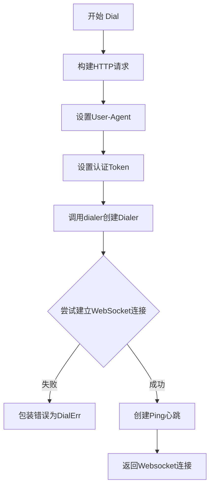
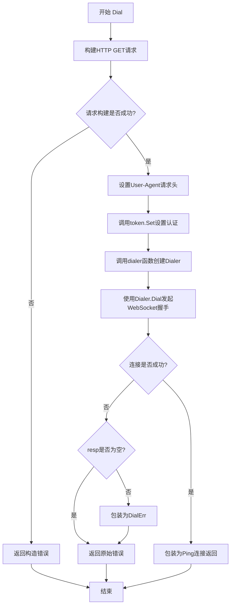
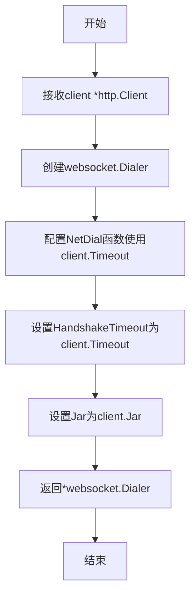
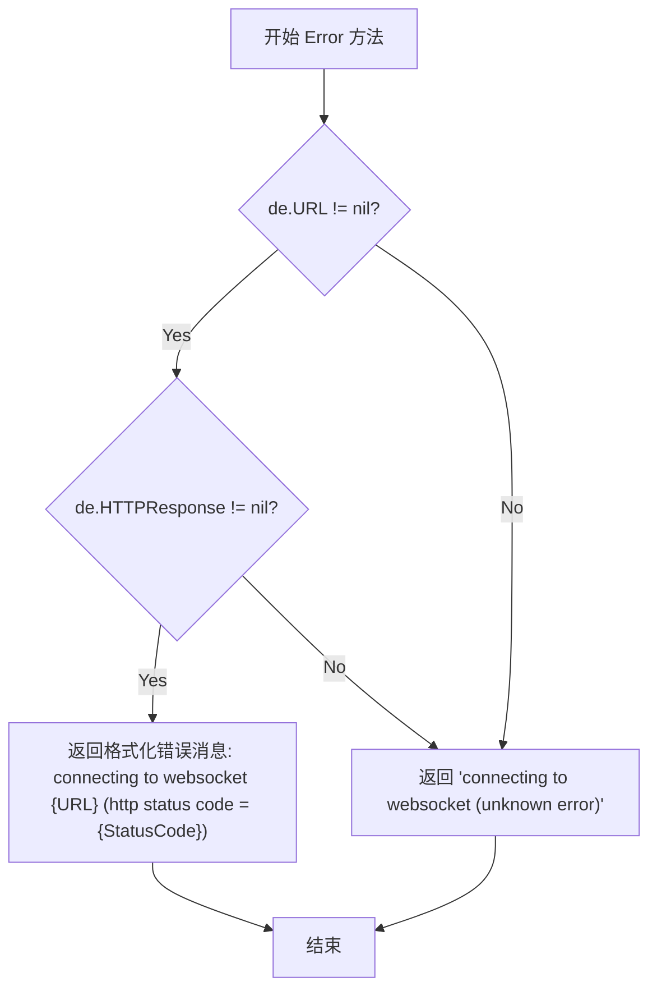
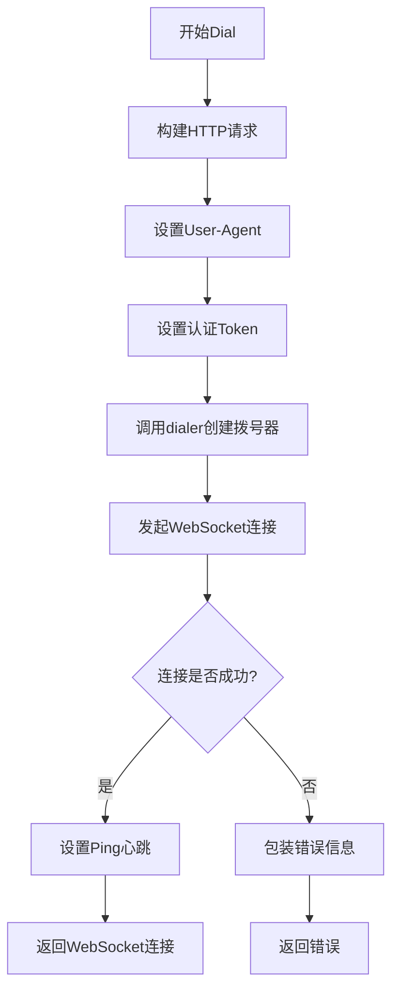

# `flux\pkg\http\websocket\client.go` 详细设计文档

该代码实现了一个WebSocket客户端Dial功能，用于通过HTTP客户端建立WebSocket连接，包含错误处理和ping心跳机制

## 整体流程



## 类结构

```
DialErr (错误结构体)
Dial (全局函数)
dialer (辅助函数)
```

## 全局变量及字段


### `DialErr`
    
WebSocket连接错误结构体

类型：`struct`
    


### `Dial`
    
发起WebSocket连接

类型：`func`
    


### `DialErr.URL`
    
WebSocket连接URL

类型：`*url.URL`
    


### `DialErr.HTTPResponse`
    
HTTP响应对象

类型：`*http.Response`
    
    

## 全局函数及方法


### `Dial`

该函数是WebSocket连接的核心入口，负责构建HTTP请求、设置认证信息、通过gorilla/websocket库建立连接，并配置ping心跳机制以维持连接活性。

参数：

- `client`：`*http.Client`，HTTP客户端实例，用于执行底层HTTP请求
- `ua`：`string`，User-Agent字符串，用于标识客户端身份
- `token`：`client.Token`，认证令牌，会被设置到请求头中
- `u`：`*url.URL`，目标WebSocket服务器的URL地址

返回值：`Websocket, error`，成功时返回已配置ping心跳的WebSocket连接，失败时返回错误信息

#### 流程图



#### 带注释源码

```go
// Dial initiates a new websocket connection.
// Dial 启动一个新的WebSocket连接
func Dial(client *http.Client, ua string, token client.Token, u *url.URL) (Websocket, error) {
	// Build the http request
	// 步骤1: 根据提供的URL构建HTTP GET请求
	req, err := http.NewRequest("GET", u.String(), nil)
	if err != nil {
		// 如果请求构建失败，包装错误并返回
		return nil, errors.Wrapf(err, "constructing request %s", u)
	}

	// Send version in user-agent
	// 步骤2: 设置User-Agent请求头，标识客户端类型和版本
	req.Header.Set("User-Agent", ua)

	// Add authentication if provided
	// 步骤3: 如果提供了认证token，将其设置到请求头中
	token.Set(req)

	// Use http client to do the http request
	// 步骤4: 创建websocket.Dialer并发起WebSocket握手连接
	conn, resp, err := dialer(client).Dial(u.String(), req.Header)
	if err != nil {
		// 步骤5: 处理连接错误
		if resp != nil {
			// 如果有HTTP响应，将错误包装为DialErr包含URL和响应状态码
			err = &DialErr{u, resp}
		}
		return nil, err
	}

	// Set up the ping heartbeat
	// 步骤6: 成功连接后，包装conn为Ping连接以维护心跳
	return Ping(conn), nil
}
```


### `dialer`

这是一个辅助函数，用于创建并配置 `websocket.Dialer`，它使用传入的 HTTP 客户端的设置（如超时时间、Cookie jar 等）来初始化 WebSocket 拨号器，以便后续建立 WebSocket 连接。

参数：

- `client`：`*http.Client`，用于配置 Dialer 的 HTTP 客户端，提取其 Timeout 和 Jar 等配置

返回值：`*websocket.Dialer`，返回配置好的 WebSocket 拨号器，可用于建立 WebSocket 连接

#### 流程图



#### 带注释源码

```go
// dialer 是一个辅助函数，用于创建websocket.Dialer
// 参数 client 是HTTP客户端，用于提取超时时间和Cookie等配置
func dialer(client *http.Client) *websocket.Dialer {
	// 创建并返回一个配置好的websocket.Dialer
	return &websocket.Dialer{
		// NetDial 是自定义的网络拨号函数，使用client.Timeout作为连接超时
		NetDial: func(network, addr string) (net.Conn, error) {
			return net.DialTimeout(network, addr, client.Timeout)
		},
		// HandshakeTimeout 设置WebSocket握手超时时间
		HandshakeTimeout: client.Timeout,
		// Jar 设置HTTP客户端的Cookie jar
		Jar: client.Jar,
		// TODO: TLSClientConfig: client.TLSClientConfig,  // 预留：TLS配置
		// TODO: Proxy                                   // 预留：代理配置
	}
}
```


### `DialErr.Error() string`

该方法实现了 Go 语言的 `error` 接口，用于返回 WebSocket 连接错误的描述信息，根据是否包含 URL 和 HTTP 响应状态码来生成不同的错误消息。

**参数：** 该方法为值接收者，无显式参数（接收者为 `de DialErr`）

返回值：`string`，返回错误描述字符串

#### 流程图



#### 带注释源码

```go
// Error 方法实现了 error 接口，用于返回 WebSocket 连接错误的描述信息
func (de DialErr) Error() string {
	// 检查 URL 和 HTTP 响应是否都存在
	if de.URL != nil && de.HTTPResponse != nil {
		// 返回包含 URL 和 HTTP 状态码的详细错误描述
		return fmt.Sprintf("connecting to websocket %s (http status code = %v)", de.URL, de.HTTPResponse.StatusCode)
	}
	// 如果 URL 或 HTTP 响应任一缺失，返回通用错误描述
	return "connecting to websocket (unknown error)"
}
```

---

#### 补充说明

| 项目 | 说明 |
|------|------|
| **所属结构体** | `DialErr` |
| **接收者类型** | 值接收者 (`de DialErr`) |
| **接口实现** | 实现 `error` 接口的 `Error() string` 方法 |
| **使用场景** | 在 `Dial` 函数中，当 WebSocket 握手失败且存在 HTTP 响应时，将错误包装为 `DialErr` 类型返回 |
| **错误格式** | 成功时：`"connecting to websocket {URL} (http status code = {StatusCode})"` |
| **默认格式** | 未知错误时：`"connecting to websocket (unknown error)"` |

## 关键组件


### 一段话描述

该代码是一个WebSocket连接包，提供建立WebSocket连接的功能，通过HTTP客户端进行认证和握手，并设置ping心跳机制来维持连接活性。

### 文件的整体运行流程

1. 外部调用`Dial`函数，传入HTTP客户端、用户代理、认证Token和目标URL
2. `Dial`函数构建HTTP请求，设置用户代理和认证信息
3. 调用`dialer`函数创建配置好的WebSocket拨号器
4. 使用拨号器发起WebSocket连接请求
5. 如果连接成功，返回设置了ping心跳的WebSocket连接
6. 如果连接失败，返回包含URL和HTTP响应状态的错误信息

### 类型详细信息

#### DialErr结构体

- **URL** (*url.URL): 连接的WebSocket URL
- **HTTPResponse** (*http.Response): HTTP响应对象

#### DialErr.Error()方法

- **返回值类型**: string
- **返回值描述**: 返回格式化的错误信息，包含URL和HTTP状态码

### 函数详细信息

#### Dial函数

- **参数**:
  - client (*http.Client): HTTP客户端，用于发起连接请求
  - ua (string): 用户代理字符串
  - token (client.Token): 认证令牌
  - u (*url.URL): 目标WebSocket URL
- **返回值类型**: (Websocket, error)
- **返回值描述**: 成功返回WebSocket连接对象，失败返回错误信息
- **mermaid流程图**:

- **带注释源码**:
```go
// Dial initiates a new websocket connection.
func Dial(client *http.Client, ua string, token client.Token, u *url.URL) (Websocket, error) {
    // Build the http request
    req, err := http.NewRequest("GET", u.String(), nil)
    if err != nil {
        return nil, errors.Wrapf(err, "constructing request %s", u)
    }

    // Send version in user-agent
    req.Header.Set("User-Agent", ua)

    // Add authentication if provided
    token.Set(req)

    // Use http client to do the http request
    conn, resp, err := dialer(client).Dial(u.String(), req.Header)
    if err != nil {
        if resp != nil {
            err = &DialErr{u, resp}
        }
        return nil, err
    }

    // Set up the ping heartbeat
    return Ping(conn), nil
}
```

#### dialer函数

- **参数**:
  - client (*http.Client): HTTP客户端
- **返回值类型**: *websocket.Dialer
- **返回值描述**: 配置好的WebSocket拨号器
- **带注释源码**:
```go
func dialer(client *http.Client) *websocket.Dialer {
    return &websocket.Dialer{
        NetDial: func(network, addr string) (net.Conn, error) {
            return net.DialTimeout(network, addr, client.Timeout)
        },
        HandshakeTimeout: client.Timeout,
        Jar:              client.Jar,
        // TODO: TLSClientConfig: client.TLSClientConfig,
        // TODO: Proxy
    }
}
```

### 关键组件信息

#### WebSocket连接器

负责建立和管理WebSocket连接

#### 认证机制

通过client.Token接口进行认证信息的设置

#### 错误处理

DialErr结构体用于封装连接错误，提供详细的错误上下文

#### Ping心跳机制

通过Ping函数设置WebSocket连接的ping/pong心跳（代码中引用但未在此文件中实现）

### 潜在的技术债务或优化空间

1. **TLS配置未实现**: 代码中有TODO注释指出TLSClientConfig未配置
2. **代理支持缺失**: 代码中有TODO注释指出Proxy未实现
3. **Ping函数外部依赖**: 代码中调用Ping函数但未在此文件中定义，存在隐藏的外部依赖
4. **Websocket接口未定义**: 返回的Websocket类型未在此包中定义

### 其它项目

#### 设计目标与约束

- 使用HTTP客户端进行WebSocket握手
- 支持自定义认证机制
- 通过超时控制连接行为

#### 错误处理与异常设计

- 区分已知错误（URL和响应都存在）和未知错误
- 包装底层错误以提供更多上下文信息

#### 外部依赖与接口契约

- 依赖github.com/gorilla/websocket库
- 依赖client.Token接口进行认证
- 依赖外部定义的Websocket接口和Ping函数


## 问题及建议


### 已知问题

-   **未完成的TLS配置**：代码中存在TODO注释标注TLSClientConfig未配置，存在安全风险
-   **未完成的代理配置**：代码中TODO注释标注Proxy未配置，限制了网络配置的灵活性
-   **过时的错误包装库**：使用了已废弃的`github.com/pkg/errors`包，应迁移至标准库`errors.Join`或`fmt.Errorf`
-   **缺少上下文支持**：`Dial`函数不支持`context.Context`参数，无法实现超时取消和请求追踪
-   **不完整的错误信息**：当HTTP响应为空时，`DialErr`返回通用错误信息，缺乏具体错误细节
-   **缺乏连接健康检查**：虽然设置了Ping心跳，但未配置Pong响应处理和连接存活验证机制

### 优化建议

-   **补充TLS和代理配置**：实现TODO中的TLSClientConfig和Proxy配置，确保生产环境可用性
-   **迁移错误处理包**：将`github.com/pkg/errors`替换为Go 1.13+的标准错误处理方式
-   **添加Context支持**：为`Dial`函数添加`context.Context`参数，支持超时控制和取消操作
-   **增强错误信息**：完善`DialErr`的错误消息，提供更多调试信息
-   **添加日志记录**：在关键路径添加日志输出，便于问题排查和监控
-   **实现资源清理**：提供连接关闭的方法或使用defer确保资源释放
-   **考虑连接池**：对于高频场景，可考虑缓存和复用WebSocket连接

## 其它


### 设计目标与约束

本模块旨在为Fluxcd框架提供WebSocket客户端连接能力，支持通过HTTP客户端进行认证的WebSocket握手连接。主要设计目标包括：封装 gorilla/websocket 库提供统一的连接接口；集成HTTP客户端的超时、代理和Cookie管理能力；支持基于Token的认证机制。约束条件包括：依赖Go标准库和第三方gorilla/websocket、pkg/errors库；仅支持WebSocket客户端模式（不支持服务端）；要求调用方提供有效的HTTP客户端和认证Token。

### 错误处理与异常设计

错误处理采用自定义错误类型与错误包装相结合的方式。DialErr结构体封装URL和HTTP响应信息，用于在连接失败时提供详细的诊断信息。错误传播使用github.com/pkg/errors库进行错误包装，保留错误链以便追踪根因。连接过程中的错误场景包括：HTTP请求构造失败、网络连接超时、WebSocket握手失败、服务器返回错误状态码等。当服务器返回非2xx状态码时，错误信息将包含URL和状态码以便排查。

### 外部依赖与接口契约

主要外部依赖包括：github.com/gorilla/websocket 提供WebSocket协议实现；github.com/pkg/errors 提供错误包装功能；github.com/fluxcd/flux/pkg/http/client 提供Token认证接口。接口契约方面，Dial函数接收http.Client、User-Agent字符串、client.Token接口和url.URL参数，返回Websocket接口和错误。调用方必须保证http.Client配置了合理的Timeout，Token接口必须实现Set(\*http.Request)方法。Websocket返回值应为Ping函数返回的包装连接对象。

### 安全考虑

安全相关配置包括：使用HTTP客户端的Timeout控制连接和握手超时；通过HandshakeTimeout限制WebSocket握手时间；继承HTTP客户端的TLSClientConfig和Jar配置；User-Agent头用于服务端识别客户端版本。潜在安全风险包括：代码中TODO标注的TLSClientConfig和Proxy配置暂未实现，可能导致在某些场景下无法使用自定义TLS设置或代理；未对服务器返回的WebSocket扩展进行验证。

### 配置参数说明

dialer函数内部创建的websocket.Dialer配置项包括：NetDial函数使用net.DialTimeout并传入client.Timeout作为超时时间，实现网络连接超时控制；HandshakeTimeout设置为client.Timeout，控制WebSocket握手超时；Jar继承HTTP客户端的Cookie Jar用于会话管理；TLSClientConfig和Proxy在代码中标注TODO，暂未实现。

### 使用示例

```go
// 创建HTTP客户端
httpClient := &http.Client{
    Timeout: 30 * time.Second,
}

// 创建认证Token
token := &client.Token{/* 初始化认证信息 */}

// 构造WebSocket URL
u, _ := url.Parse("wss://example.com/ws")

// 建立WebSocket连接
ws, err := websocket.Dial(httpClient, "MyApp/1.0", token, u)
if err != nil {
    // 处理连接错误
}
```


    