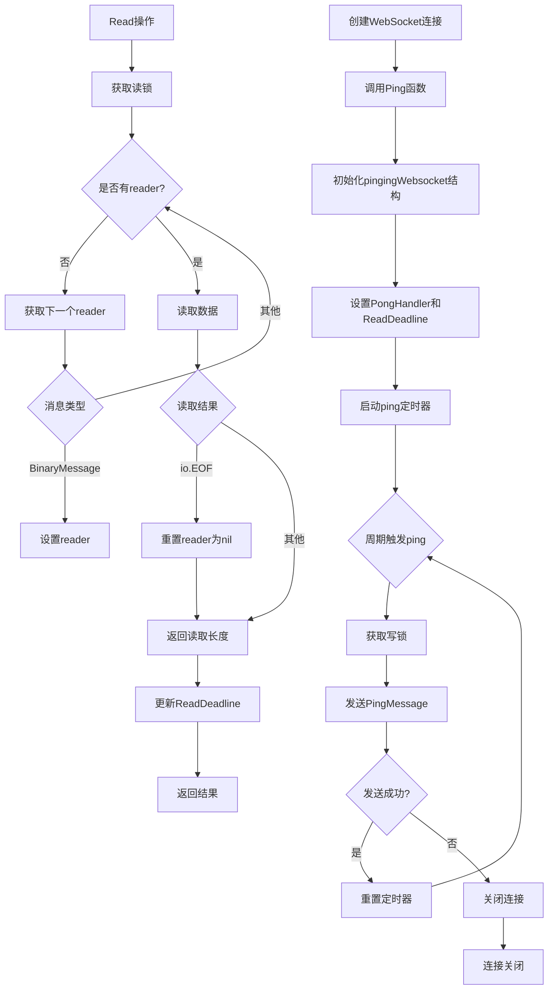
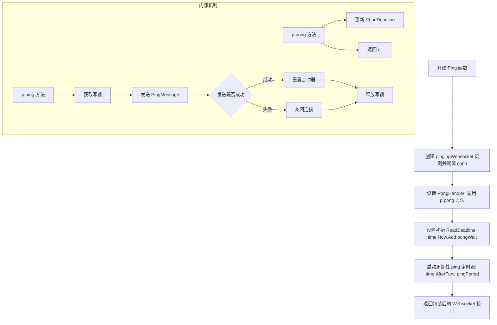
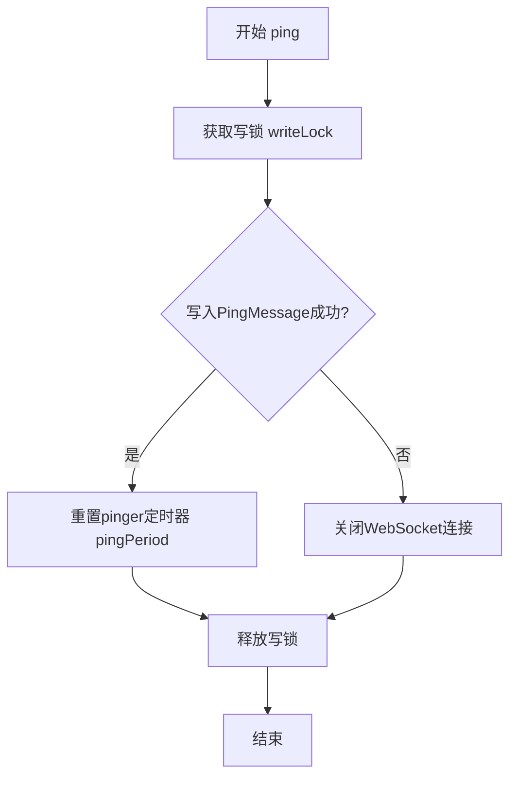
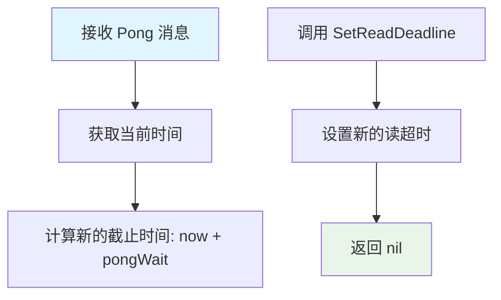
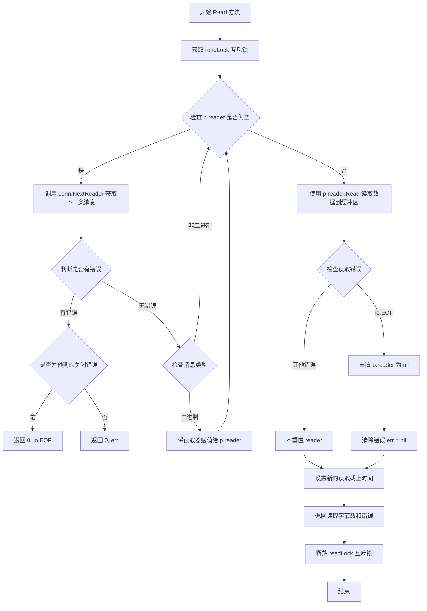
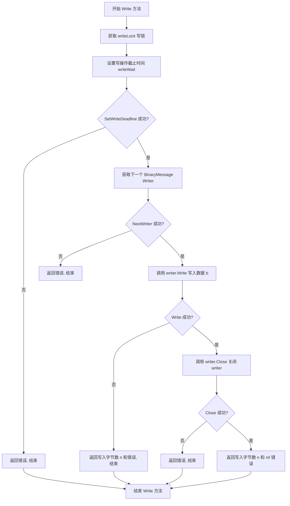
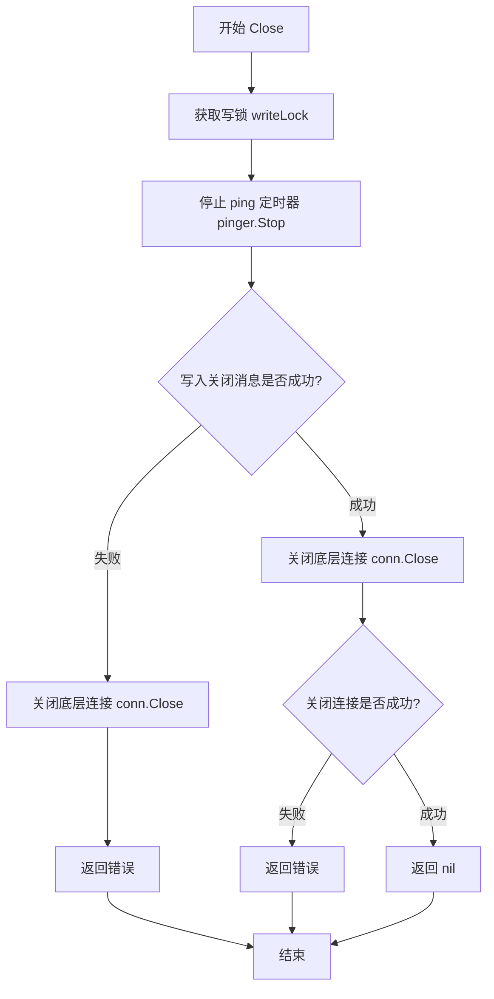

# `flux\pkg\http\websocket\ping.go` 详细设计文档

该代码实现了一个带有自动ping/pong心跳机制的WebSocket封装，通过定期发送ping消息保持连接活跃，并实现了io.Reader、io.Writer和io.Closer接口以支持标准的I/O操作，同时使用互斥锁保证并发读写的线程安全性。

## 整体流程



## 类结构

```
Websocket (接口)
└── pingingWebsocket (实现类)
    ├── pinger *time.Timer
    ├── readLock sync.Mutex
    ├── writeLock sync.Mutex
    ├── reader io.Reader
    └── conn *websocket.Conn
```

## 全局变量及字段


### `pingingWebsocket.pinger`
    
ping定时器，用于周期性发送ping

类型：`*time.Timer`
    


### `pingingWebsocket.readLock`
    
读操作互斥锁，保证并发读取安全

类型：`sync.Mutex`
    


### `pingingWebsocket.writeLock`
    
写操作互斥锁，保证并发写入安全

类型：`sync.Mutex`
    


### `pingingWebsocket.reader`
    
当前消息的reader，用于分块读取二进制消息

类型：`io.Reader`
    


### `pingingWebsocket.conn`
    
底层的gorilla WebSocket连接

类型：`*websocket.Conn`
    
    

## 全局函数及方法


### `Ping`

创建并返回一个带有周期性 ping 功能的 WebSocket 包装实例，通过自动发送 ping 帧并处理 pong 响应来维持连接活性，防止连接因空闲超时而被代理服务器（如 nginx）关闭。

#### 参数

- `c`：`*websocket.Conn`，原始的 Gorilla WebSocket 连接实例

#### 返回值

`Websocket`，包装后的 WebSocket 接口，支持 Read、Write、Close 操作并包含自动 ping 机制

#### 流程图



#### 带注释源码

```go
// Ping adds a periodic ping to a websocket connection.
// Ping 函数用于为 WebSocket 连接添加周期性 ping 功能
// 参数 c: 原始的 *websocket.Conn 连接实例
// 返回值: 包装后的 Websocket 接口，支持自动 ping/pong 维持连接活性
func Ping(c *websocket.Conn) Websocket {
	// 创建 pingingWebsocket 结构体实例，仅保存 conn 引用
	p := &pingingWebsocket{conn: c}
	
	// 设置 PongHandler：当收到客户端的 Pong 响应时自动调用
	// 该处理器会更新读取超时时间
	p.conn.SetPongHandler(p.pong)
	
	// 设置初始读取截止时间
	// 必须在读取数据前设置，以防止连接因空闲超时而关闭
	p.conn.SetReadDeadline(time.Now().Add(pongWait))
	
	// 启动周期性 ping 定时器
	// pingPeriod 设为 pongWait 的 1/3，预留足够时间响应 ping
	// 使用 AfterFunc 而非 Ticker，可以在需要时手动重置
	p.pinger = time.AfterFunc(pingPeriod, p.ping)
	
	// 返回实现了 Websocket 接口的 pingingWebsocket 实例
	return p
}
```


### `Ping`

该函数是WebSocket连接的生命周期管理模块，核心职责是创建并初始化一个`pingingWebsocket`实例，为传入的WebSocket连接添加定期Ping-Pong心跳机制，以维持连接活跃并检测对端存活状态。

参数：

- `c`：`websocket.Conn`，需要添加Ping功能的WebSocket连接

返回值：`Websocket`，返回封装了Ping功能的WebSocket包装器接口

#### 流程图

```mermaid
flowchart TD
    A[开始 Ping 函数] --> B{检查连接有效性}
    B -->|有效| C[创建 pingingWebsocket 实例并绑定连接]
    C --> D[设置 Pong 处理器: p.pong]
    D --> E[设置初始读取截止时间: time.Now().Add<pongWait>]
    E --> F[启动定期 Ping 定时器: time.AfterFunc<pingPeriod, p.ping>]
    F --> G[返回 Websocket 接口]
    B -->|无效| H[返回 nil 或错误]
```

#### 带注释源码

```go
// Ping adds a periodic ping to a websocket connection.
// Ping 为WebSocket连接添加定期ping功能
// 参数 c: websocket.Conn 类型的WebSocket连接
// 返回值: Websocket 接口类型，返回封装了ping功能的pingingWebsocket实例
func Ping(c *websocket.Conn) Websocket {
    // 创建pingingWebsocket结构体实例，初始化conn字段为传入的WebSocket连接
	p := &pingingWebsocket{conn: c}
    
    // 设置Pong消息处理器，当收到对端Pong响应时自动调用pong方法
    // 用于重置读取截止时间，保持连接活跃
	p.conn.SetPongHandler(p.pong)
    
    // 设置初始读取截止时间为pongWait（30秒）
    // 必须在首次读取前设置，以确保有足够时间等待Pong响应
	p.conn.SetReadDeadline(time.Now().Add(pongWait))
    
    // 启动定期Ping定时器，每隔pingPeriod（约为pongWait的1/3）发送一次Ping
    // 使用AfterFunc实现非阻塞的定时任务
	p.pinger = time.AfterFunc(pingPeriod, p.ping)
    
    // 返回Websocket接口，实际返回的是*pingingWebsocket类型
	return p
}
```


### `pingingWebsocket.ping()`

定时触发的ping方法，通过写锁保护WebSocket连接，向对端发送PingMessage并重置ping定时器，以确保连接保持活跃状态。如果发送失败则关闭连接。

参数： 无

返回值： 无（`void`）

#### 流程图



#### 带注释源码

```go
// ping 定时触发的ping方法，由time.AfterFunc调用
// 用于定期向WebSocket对端发送ping消息以保持连接活跃
func (p *pingingWebsocket) ping() {
	// 获取写锁，确保多线程环境下写入操作的安全性
	p.writeLock.Lock()
	// 函数返回时释放写锁
	defer p.writeLock.Unlock()
	
	// 尝试发送PingMessage到对端
	// 参数：消息类型、消息内容（nil）、写入超时时间
	if err := p.conn.WriteControl(websocket.PingMessage, nil, time.Now().Add(writeWait)); err != nil {
		// 发送失败时关闭连接并返回
		p.conn.Close()
		return
	}
	
	// 发送成功后重置定时器，以便下次再次触发ping
	// 使用pingPeriod作为下一次ping的间隔
	p.pinger.Reset(pingPeriod)
}
```


### `pingingWebsocket.pong`

该方法是 WebSocket 连接的 Pong 响应处理程序，用于在接收到客户端的 Pong 消息后更新读超时时间，以保持连接活跃。

参数：

- （无名称）：`string`，Pong 消息的负载数据（由 WebSocket 库自动传入，此处忽略）

返回值：`error`，始终返回 `nil`，表示成功处理 Pong 响应

#### 流程图



#### 带注释源码

```go
// pong 是 Pong 消息的处理程序，会在收到客户端的 Pong 响应后被 WebSocket 库调用。
// 参数 string 是 WebSocket 协议中的 pong 消息负载数据，此处不需要使用。
// 该方法的主要作用是重置读超时计时器，以防止连接因空闲超时而断开。
func (p *pingingWebsocket) pong(string) error {
    // 设置下一个读操作的截止时间为当前时间加上 pongWait（30秒）
    // 这样可以确保在收到下一个 Pong 消息之前，连接不会因读超时而断开
    p.conn.SetReadDeadline(time.Now().Add(pongWait))
    
    // 返回 nil 表示成功处理 Pong 响应，没有错误
    return nil
}
```


### `pingingWebsocket.Read`

该方法实现了 `io.Reader` 接口，通过循环读取 WebSocket 连接中的二进制消息，使用互斥锁保证并发安全，并自动处理消息边界和连接超时。

参数：

- `b`：`[]byte`，用于存储读取数据的字节切片缓冲区

返回值：

- `int`，成功读取的字节数
- `error`，读取过程中发生的错误，若连接正常关闭则返回 `io.EOF`

#### 流程图



#### 带注释源码

```go
// Read 实现了 io.Reader 接口，用于从 WebSocket 连接读取二进制消息
// 参数 b: 用于存储读取数据的字节切片
// 返回值: 读取的字节数 n 和可能发生的错误 err
func (p *pingingWebsocket) Read(b []byte) (int, error) {
	// 获取读锁，确保并发读取时的线程安全性
	// 防止多个 goroutine 同时调用 Read 导致数据竞争
	p.readLock.Lock()
	defer p.readLock.Unlock()

	// 循环查找有效的二进制消息读取器
	// 当 p.reader 为 nil 时表示需要获取新的消息
	for p.reader == nil {
		// 获取下一条消息的读取器
		// NextReader 返回消息类型、读取器和错误
		msgType, r, err := p.conn.NextReader()
		if err != nil {
			// 检查错误是否为预期的 WebSocket 关闭错误
			if IsExpectedWSCloseError(err) {
				// 正常关闭时返回 io.EOF，标识流结束
				return 0, io.EOF
			}
			// 其他错误直接返回
			return 0, err
		}

		// 仅处理二进制消息类型，忽略其他类型（如文本消息、Ping/Pong）
		if msgType != websocket.BinaryMessage {
			// 非二进制消息，跳过继续读取下一条
			continue
		}

		// 找到二进制消息，将读取器保存到 p.reader
		p.reader = r
	}

	// 使用已获取的读取器读取数据到缓冲区 b
	n, err := p.reader.Read(b)

	// 当读取到流末尾时（io.EOF），重置 reader 为 nil
	// 以便下次调用时能够读取新的消息
	if err == io.EOF {
		p.reader = nil
		// 将错误置为 nil，因为对于 io.Reader 来说
		// io.EOF 是正常情况，上层调用者会处理
		err = nil
	}

	// 每次成功读取后更新读取截止时间
	// 防止因长时间无数据导致连接被代理服务器（如 nginx）关闭
	p.conn.SetReadDeadline(time.Now().Add(pongWait))

	// 返回读取的字节数和可能的错误
	return n, err
}
```


### `pingingWebsocket.Write`

实现 `io.Writer` 接口，将二进制数据写入 WebSocket 连接。该方法通过获取写锁保证线程安全，设置写超时，获取下一个二进制消息 writer，写入数据后关闭 writer 完成消息发送。

参数：

- `b`：`[]byte`，要写入的二进制消息数据

返回值：

- `int`：成功写入的字节数
- `error`：写入过程中发生的错误（如设置截止时间失败、获取 writer 失败或写入/关闭失败）

#### 流程图



#### 带注释源码

```go
// Write 实现 io.Writer 接口，写入二进制消息到 WebSocket 连接
// 参数 b: 要写入的二进制数据切片
// 返回值: 写入的字节数 n 和可能发生的错误 err
func (p *pingingWebsocket) Write(b []byte) (int, error) {
    // 1. 获取写锁，确保并发写入时的线程安全
    //    防止多个 goroutine 同时写入导致消息交错
    p.writeLock.Lock()
    defer p.writeLock.Unlock()

    // 2. 设置写操作的截止时间，防止写操作无限阻塞
    //    超过 writeWait (10秒) 将返回错误
    if err := p.conn.SetWriteDeadline(time.Now().Add(writeWait)); err != nil {
        return 0, err
    }

    // 3. 获取下一个二进制消息的 writer
    //    每次写入都创建新的 writer 以确保消息边界完整
    w, err := p.conn.NextWriter(websocket.BinaryMessage)
    if err != nil {
        return 0, err
    }

    // 4. 写入数据到 WebSocket
    n, err := w.Write(b)
    if err != nil {
        // 即使写入出错，也返回已写入的字节数
        return n, err
    }

    // 5. 关闭 writer 完成消息发送
    //    必须在发送数据后调用 Close 以刷新缓冲区并发送帧
    return n, w.Close()
}
```


### `pingingWebsocket.Close`

实现 `io.Closer` 接口，通过停止 ping 定时器、发送 WebSocket 关闭消息并关闭底层连接，优雅地关闭 WebSocket 连接。

参数：无

返回值：`error`，关闭连接过程中可能发生的错误

#### 流程图



#### 带注释源码

```go
// Close 实现 io.Closer 接口，优雅关闭 WebSocket 连接
// 1. 获取写锁，防止并发写入冲突
// 2. 停止 ping 定时器，避免关闭后继续发送 ping
// 3. 发送 CloseMessage 通知对端关闭
// 4. 关闭底层 TCP 连接
func (p *pingingWebsocket) Error {
	p.writeLock.Lock()              // 加写锁，保证关闭过程的原子性
	defer p.writeLock.Unlock()      // 使用 defer 确保锁释放
	p.pinger.Stop()                 // 停止定期 ping 定时器，防止关闭后继续 ping
	
	// 发送 WebSocket 关闭消息，状态码 NormalClosure，消息 "ok"
	if err := p.conn.WriteControl(websocket.CloseMessage, websocket.FormatCloseMessage(websocket.CloseNormalClosure, "ok"), time.Now().Add(writeWait)); err != nil {
		p.conn.Close()              // 发送失败时强制关闭底层连接
		return err                  // 返回写入错误
	}
	
	return p.conn.Close()            // 关闭底层连接并返回结果
}
```

## 关键组件


### pingingWebsocket 结构体

核心WebSocket包装结构体，管理带ping/pong心跳机制的WebSocket连接，包含定时器、读写锁、读取器和底层连接。

### Ping 函数

工厂函数，创建pingingWebsocket实例并初始化pong处理器、读超时和ping定时器，返回Websocket接口供外部使用。

### ping 方法

定期向对端发送PingMessage的控制消息，写入失败时关闭连接，并重置ping定时器以维持心跳周期。

### pong 方法

处理对端响应的Pong消息，更新读超时时间，返回nil表示成功处理。

### Read 方法

从WebSocket连接读取二进制消息，使用读锁保证线程安全，支持流式读取，当读取器到达EOF时重置读取器状态。

### Write 方法

向WebSocket连接写入二进制消息，使用写锁保证线程安全，设置写超时并正确关闭writer以确保消息发送完整。

### Close 方法

优雅关闭WebSocket连接，停止ping定时器，发送CloseMessage后关闭底层TCP连接。

### 常量定义 (writeWait, pongWait, pingPeriod)

控制WebSocket行为的时间常量，分别定义写操作超时、读pong超时和ping发送周期，确保连接在代理服务器下的兼容性。

### 互斥锁机制 (readLock, writeLock)

保护WebSocket读写操作的线程安全，防止并发读写导致的竞态条件，确保消息完整性和连接稳定性。


## 问题及建议


### 已知问题

-   **Ping周期计算逻辑错误**：代码注释说明"pingPeriod必须小于pongWait"，但计算公式`((pongWait - writeWait) * 2 / 3)`在当前常量下为13.33秒，虽然数值上满足要求，但逻辑表达不清晰，且当参数变化时容易产生不符合预期的结果
-   **Ping失败处理不完善**：`ping()`方法中`WriteControl`失败后调用`Close()`但未处理返回值，且未停止pinger timer，可能导致goroutine泄漏
-   **Pong handler参数未使用**：`pong(string)`参数未使用，应改为`pong(string) error`或使用`_`忽略未命名参数
-   **Read循环潜在阻塞**：当连接已关闭但`p.reader`不为nil时，循环可能陷入不确定状态；且`IsExpectedWSCloseError`函数调用未明确其来源和可用性
-   **Write错误处理不完整**：`w.Close()`的错误被忽略，可能导致写入数据丢失但调用者不知情
-   **Close方法时序问题**：先发送关闭消息立即调用`conn.Close()`，可能因底层缓冲数据未 flush 导致关闭消息未送达就断开连接
-   **缺少Context支持**：无法实现超时控制和优雅取消，不符合现代Go服务设计最佳实践
-   **资源清理不彻底**：仅停止pinger timer，未清理reader资源，未实现`io.Closer`接口的完整语义

### 优化建议

-   重构pingPeriod计算逻辑，使用更清晰的公式如`pongWait / 3`或直接定义常量，确保语义明确
-   在`ping()`失败后调用`p.pinger.Stop()`并考虑返回错误或记录日志，便于排查问题
-   将`pong(string)`改为`p.pong(string) error`或`p.pong(_ string) error`
-   在Read方法中添加连接状态检查，使用select或context实现可中断的读取循环
-   改进Close方法：在WriteControl成功后等待一小段时间或使用正确的关闭握手流程
-   为Websocket接口添加Context支持，实现超时控制和取消功能
-   添加完整的错误日志记录和metrics监控，追踪连接异常
-   实现`io.Closer`接口的完整语义，确保所有资源正确释放
-   考虑添加重连机制和连接状态回调，提高客户端体验


## 其它


### 设计目标与约束

本模块旨在为WebSocket连接添加心跳机制（ping/pong），防止因代理服务器（如nginx）的空闲超时而断开连接。设计约束包括：只处理二进制消息；写操作必须在writeWait时间内完成；读操作必须在pongWait时间内收到pong响应；所有公共方法（Read、Write、Close）必须是线程安全的。

### 错误处理与异常设计

对于Write操作，如果设置写超时或写入数据失败，返回错误并关闭连接。对于Read操作，如果遇到预期的WebSocket关闭错误（IsExpectedWSCloseError），转换为io.EOF返回；其他错误直接向上传递。Close方法会先停止pinger定时器，发送关闭消息，再关闭底层连接，任何错误都会返回。pong处理器仅负责重置读超时，成功返回nil。

### 数据流与状态机

连接初始状态为未pinging，启动Ping函数后创建pinger定时器。每隔pingPeriod时间触发ping方法，发送PingMessage并重置定时器。读取数据时，通过readLock保护reader状态，循环读取直到获得有效的BinaryMessage。写入数据时通过writeLock保护，确保写操作的原子性。关闭时停止定时器并发送CloseMessage。

### 外部依赖与接口契约

依赖github.com/gorilla/websocket包。返回一个Websocket接口（假设已定义），该接口包含Read、Write、Close方法。外部调用者通过IsExpectedWSCloseError函数判断是否为预期的关闭错误。time.AfterFunc用于实现周期性ping，sync.Mutex用于保护读写和写入操作。

### 并发模型和线程安全性

使用两个互斥锁分别保护读操作（readLock）和写操作（writeLock），实现读写分离。ping方法在发送ping时持有writeLock，确保与Write和Close操作的互斥。reader字段的nil检查和赋值都在readLock保护下进行。注意：pinger定时器的回调可能并发调用，需通过writeLock防止数据竞争。

### 资源管理

pinger定时器在Close时调用Stop()释放资源。reader在读到io.EOF时置为nil，允许复用连接读取下一个消息。writeLock和readLock分别保护对应的资源通道。底层连接通过Close方法释放。

### 性能考虑

writePeriod=10s、pongWait=30s、pingPeriod约13.3s的参数配置平衡了带宽消耗和连接保活需求。使用sync.Mutex而非sync.RWMutex是因为Write操作需要独占访问。NextReader/NextWriter每次调用创建新的reader/writer，简化了状态管理但可能有一定开销。BinaryMessage过滤通过continue跳过非二进制消息。

### 安全性考虑

所有写操作都设置了writeWait超时，防止长时间阻塞。读操作设置了pongWait超时，检测对端是否存活。Close操作发送CloseNormalClosure状态码而非直接关闭底层连接，遵循WebSocket协议优雅关闭。writeLock在ping和Close中都被获取，确保关闭消息完整发送。

### 测试策略

应测试：1）正常读写二进制消息；2）ping/pong周期正确触发；3）并发读写安全性；4）优雅关闭流程；5）各类错误场景（连接断开、超时、非法消息类型）；6）与IsExpectedWSCloseError的配合。需要模拟websocket.Conn或使用真实连接进行集成测试。

### 配置参数说明

writeWait=10s：写入消息的最大允许时间，需小于前端代理的写超时。pongWait=30s：读取下一个pong的 deadline，需小于代理的空闲超时。pingPeriod=((pongWait-writeWait)*2/3)≈13.3s：ping发送间隔，需小于pongWait并留出writeWait余量。

    