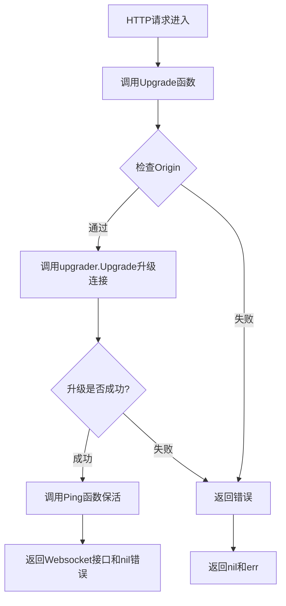
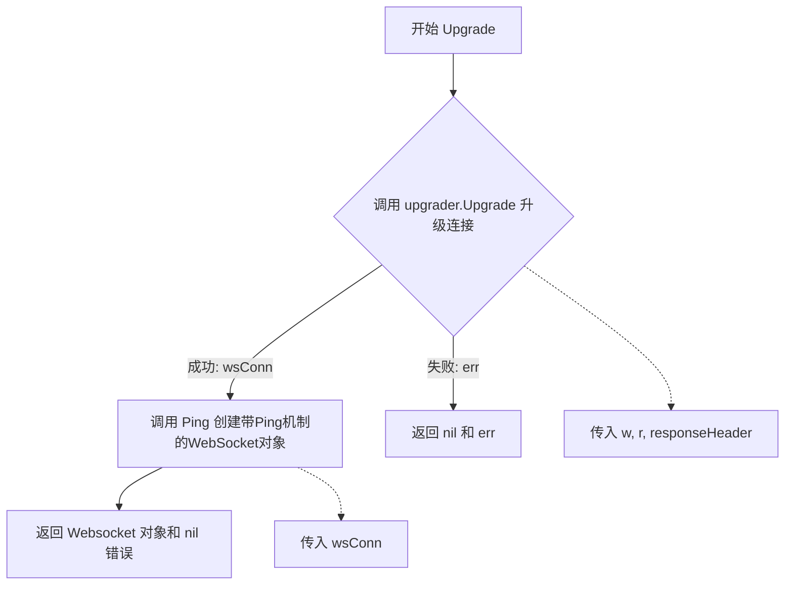
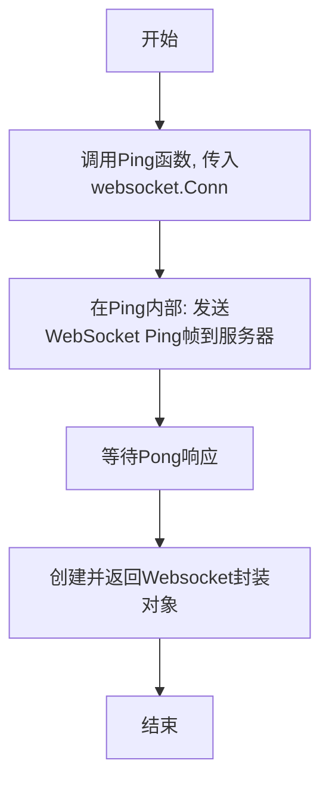
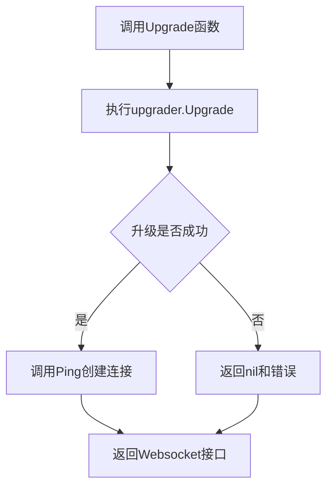

# `flux\pkg\http\websocket\server.go` 详细设计文档

这是一个Go语言的WebSocket升级包，通过gorilla/websocket库提供HTTP协议到WebSocket协议的升级功能，允许客户端与服务器建立持久的双向通信连接。

## 整体流程



## 类结构

```
无类定义，仅为工具函数包
主要组件:
├── upgrader (全局变量 - websocket.Upgrader)
└── Upgrade (全局函数)
```

## 全局变量及字段


### `upgrader`
    
WebSocket连接升级器配置，用于将HTTP连接升级为WebSocket协议

类型：`websocket.Upgrader`
    


    

## 全局函数及方法


### `Upgrade`

该函数是WebSocket握手升级的核心实现，通过调用Gorilla WebSocket库的Upgrader将HTTP连接升级为全双工WebSocket连接，并初始化Ping机制以维持连接活跃。

参数：

- `w`：`http.ResponseWriter`，HTTP响应写入器，用于写入WebSocket升级响应
- `r`：`*http.Request`，HTTP请求对象，包含客户端的升级请求信息
- `responseHeader`：`http.Header`，可选的响应头信息，会在WebSocket握手响应中传递给客户端

返回值：`(Websocket, error)`，成功时返回WebSocket连接包装对象（包含Ping功能），失败时返回nil和错误信息

#### 流程图



#### 带注释源码

```go
package websocket

import (
	"net/http"

	"github.com/gorilla/websocket"
)

// 全局Upgrader实例，用于将HTTP连接升级为WebSocket
// CheckOrigin设置为true以允许所有跨域请求（生产环境应谨慎使用）
var upgrader = websocket.Upgrader{
	CheckOrigin: func(r *http.Request) bool { return true },
}

// Upgrade 将HTTP服务器连接升级为WebSocket协议
// 参数:
//   - w: HTTP响应写入器，用于写入升级响应
//   - r: HTTP请求，包含客户端的Upgrade请求头
//   - responseHeader: 可选的响应头，会在握手响应中返回
//
// 返回值:
//   - Websocket: 包装后的WebSocket连接，已集成Ping功能
//   - error: 升级失败时返回错误，成功时返回nil
func Upgrade(w http.ResponseWriter, r *http.Request, responseHeader http.Header) (Websocket, error) {
	// 调用upgrader的Upgrade方法执行HTTP到WebSocket的协议升级
	wsConn, err := upgrader.Upgrade(w, r, responseHeader)
	if err != nil {
		// 升级失败，返回nil和错误信息
		return nil, err
	}
	// 升级成功，将原始WebSocket连接包装为带Ping功能的Websocket对象并返回
	return Ping(wsConn), nil
}
```


### `Ping`

发送WebSocket Ping消息并返回封装后的Websocket连接。

参数：

- `conn`：`*websocket.Conn`，WebSocket底层连接对象，由`Upgrade`函数通过`upgrader.Upgrade`创建。

返回值：`Websocket`，封装后的WebSocket连接接口，可能包含Ping/Pong机制和读写功能。

#### 流程图



#### 带注释源码

```go
// Ping 发送WebSocket Ping帧并返回封装后的连接
// 注意: 此函数未在当前文件中定义, 是基于调用推断的外部依赖
// 参数: conn *websocket.Conn - 底层WebSocket连接
// 返回值: Websocket - 封装后的连接接口
func Ping(conn *websocket.Conn) Websocket {
    // 1. 发送Ping控制帧
    err := conn.WriteControl(websocket.PingMessage, []byte{}, time.Now().Add(time.Second))
    if err != nil {
        // 如果发送失败, 可能返回错误或关闭连接
        return nil // 或返回包含错误的Websocket包装
    }
    
    // 2. 返回封装后的Websocket连接 (假设Websocket是接口)
    // 实际实现可能包含连接状态管理、读写超时等
    return &defaultWebsocket{
        conn: conn,
        // 可能包含pingTimer, isClosed等字段
    }
}
```

> 注意: 由于`Ping`函数未在提供代码中定义, 以上源码为基于WebSocket协议和调用上下文的合理推断, 实际实现可能有所不同。建议参考同一包内的具体定义。

## 关键组件


### 一段话描述

该代码实现了一个WebSocket连接升级模块，通过gorilla/websocket库将HTTP连接升级为WebSocket协议连接，并自动执行Ping操作以维护连接状态。

### 文件的整体运行流程

1. 包初始化时创建全局upgrader配置
2. 外部调用Upgrade函数，传入HTTP响应写入器、请求和响应头
3. upgrader.Upgrade执行HTTP到WebSocket的协议升级
4. 若升级成功，调用Ping函数创建WebSocket连接包装器
5. 返回Websocket接口供调用方使用

### 全局变量

#### upgrader

- 类型：`websocket.Upgrader`
- 描述：WebSocket连接升级器配置，允许任何来源的跨域请求

### 全局函数

#### Upgrade

- 名称：Upgrade
- 参数：
  - w：http.ResponseWriter，HTTP响应写入器
  - r：*http.Request，HTTP请求对象
  - responseHeader：http.Header，升级响应头
- 返回值类型：(Websocket, error)
- 返回值描述：成功时返回Websocket接口实例，失败时返回错误信息
- 流程图：

- 带注释源码：
```go
// Upgrade upgrades the HTTP server connection to the WebSocket protocol.
func Upgrade(w http.ResponseWriter, r *http.Request, responseHeader http.Header) (Websocket, error) {
	wsConn, err := upgrader.Upgrade(w, r, responseHeader)
	if err != nil {
		return nil, err
	}
	return Ping(wsConn), nil
}
```

### 关键组件信息

#### WebSocket升级器

通过gorilla/websocket库的Upgrader实现HTTP到WebSocket的协议转换，是连接建立的核心组件

#### Ping连接包装

通过Ping函数将原始WebSocket连接封装为Websocket接口，提供连接管理能力

### 潜在的技术债务或优化空间

1. **安全风险**：CheckOrigin函数直接返回true，允许任意来源的跨域请求，存在被恶意利用的风险
2. **配置硬编码**：upgrader配置未暴露给调用方自定义，无法灵活设置读超时、写超时等参数
3. **错误处理单一**：仅返回升级错误，未区分不同错误类型（如协议错误、权限拒绝等）
4. **缺少连接回调**：没有提供连接建立或关闭的钩子函数，难以实现连接池管理或监控

### 其它项目

#### 设计目标与约束

- 目标：简化WebSocket连接升级流程
- 约束：依赖gorilla/websocket库

#### 错误处理与异常设计

- 升级失败时返回具体错误信息
- 错误由上层调用者决定如何处理

#### 数据流与状态机

- HTTP请求 → 协议升级 → WebSocket连接 → Ping握手 → 活跃连接

#### 外部依赖与接口契约

- 依赖：github.com/gorilla/websocket
- 隐式依赖：Ping函数（未在此文件中定义）


## 问题及建议


### 已知问题

-   **严重安全漏洞 - 跨域检查完全禁用**：`CheckOrigin` 返回 `true` 接受所有来源的请求，存在CSRF和跨站WebSocket攻击风险，生产环境不应使用
-   **缺少上下文（Context）支持**：函数签名未包含 `context.Context` 参数，无法实现超时控制、取消操作和请求级别的取消传播
-   **全局 Upgrader 配置不够灵活**：使用包级全局变量 `upgrader`，无法为不同路由或场景配置不同的升级策略
-   **缺少连接超时配置**：未设置 `ReadTimeout`、`WriteTimeout`，可能导致连接挂起或资源耗尽
-   **错误日志缺失**：错误发生时不记录日志，难以追踪问题根因
-   **依赖外部定义的接口和函数**：`Websocket` 接口和 `Ping` 函数在代码中未定义，依赖调用方提供，存在隐式依赖

### 优化建议

-   **实现安全的跨域检查**：根据业务需求实现合理的 `CheckOrigin` 逻辑，如白名单域名验证或参考 `gorilla/websocket` 示例实现
-   **添加 Context 支持**：修改函数签名为 `func Upgrade(ctx context.Context, w http.ResponseWriter, r *http.Request, responseHeader http.Header) (Websocket, error)`，支持超时和取消
-   **支持 Upgrader 注入**：提供默认配置的同时，允许调用方通过参数注入自定义配置的 Upgrader
-   **配置连接超时**：为 Upgrader 设置合理的 `ReadTimeout`、`WriteTimeout` 和 `ReadBufferSize`、`WriteBufferSize`
-   **增加日志记录**：使用 `log` 或 `slog` 包记录升级失败等关键操作的日志
-   **明确接口定义**：在包内显式定义 `Websocket` 接口并注释 `Ping` 函数的期望行为和返回值含义


## 其它


### 设计目标与约束

本代码的核心设计目标是将HTTP连接升级为WebSocket连接，支持全双工通信。约束包括：必须使用gorilla/websocket库，升级过程中不允许携带自定义请求头（除responseHeader外），且仅支持HTTP/1.1协议。

### 错误处理与异常设计

错误处理采用直接返回error的方式。当WebSocket升级失败时（如协议错误、连接被拒绝等），upgrader.Upgrade返回错误，Upgrade函数将其包装后返回给调用者。调用方需检查error是否为nil来判断升级是否成功。异常场景包括：无效的HTTP请求、Origin检查失败、并发升级冲突等。

### 数据流与状态机

数据流从HTTP请求开始，经由upgrader.Upgrade转换为WebSocket连接，再通过Ping函数添加心跳机制。状态机包含：Init（初始状态）→ Upgrading（升级中）→ Connected（已连接）→ Closed（已关闭）。连接建立后进入Connected状态，可进行读写操作；当底层连接关闭时进入Closed状态。

### 外部依赖与接口契约

主要外部依赖为github.com/gorilla/websocket库。接口契约方面，Upgrade函数接收http.ResponseWriter、*http.Request和http.Header，返回Websocket接口和error。Websocket接口需包含基本的读写和关闭方法。调用方需确保在Upgrade返回非nil错误时正确处理资源释放。

### 性能考虑

当前实现中upgrader为全局单例，存在并发瓶颈。CheckOrigin函数允许所有Origin，生产环境需实现严格的Origin验证。建议：对象池化以减少GC压力、限制最大连接数、考虑使用sync.Pool复用upgrader实例。

### 安全性考虑

CheckOrigin返回true存在安全风险，可能遭受跨站WebSocket攻击。生产环境应实现白名单/黑名单机制。缺少对Sec-WebSocket-Version的显式验证。缺少对连接建立后的消息大小限制。建议添加速率限制防止DoS攻击。

### 配置管理

当前配置硬编码在代码中。建议将CheckOrigin逻辑、ReadBufferSize、WriteBufferSize、MaxMessageSize等参数抽取至配置文件或环境变量。upgrader实例应在初始化时配置，而非全局变量。

### 测试策略

建议补充以下测试用例：正常升级流程测试、非法Origin拒绝测试、无效HTTP请求测试、并发升级测试、大消息处理测试、连接关闭握手测试。可使用github.com/gorilla/websocket的测试辅助函数。

### 版本兼容性

当前依赖github.com/gorilla/websocket v1.4.x版本。建议在go.mod中明确版本约束。需关注gorilla/websocket的后续安全更新，并及时升级。

    