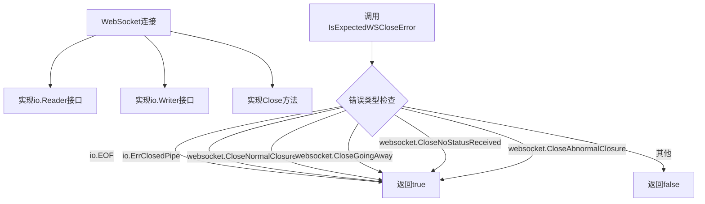
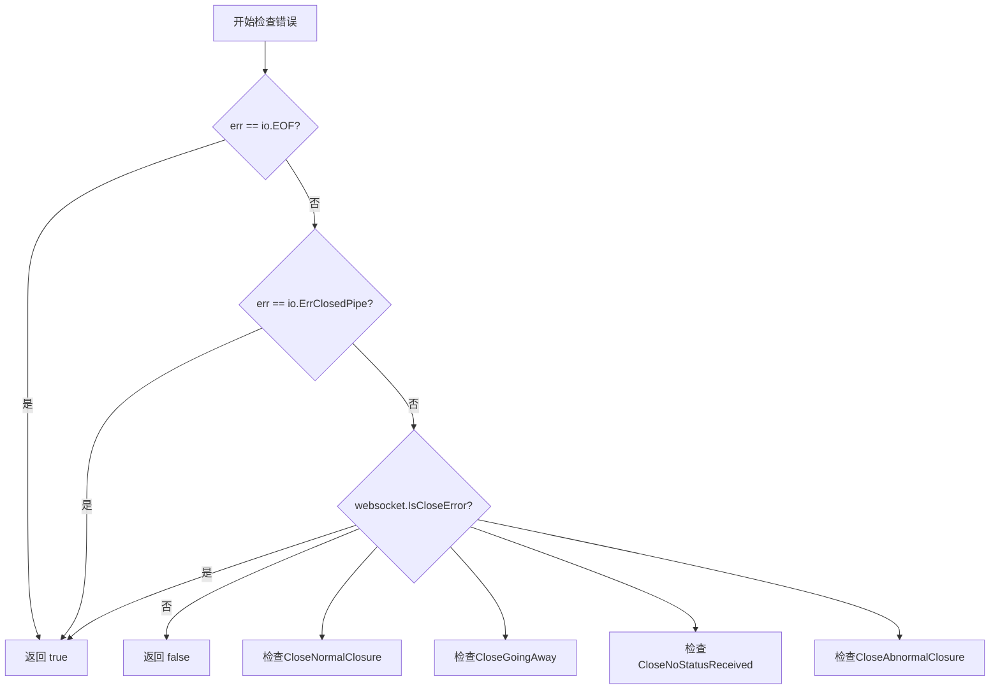
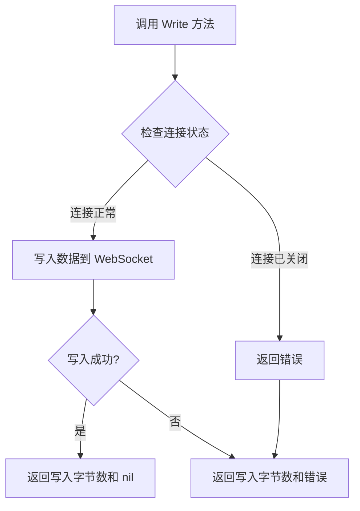
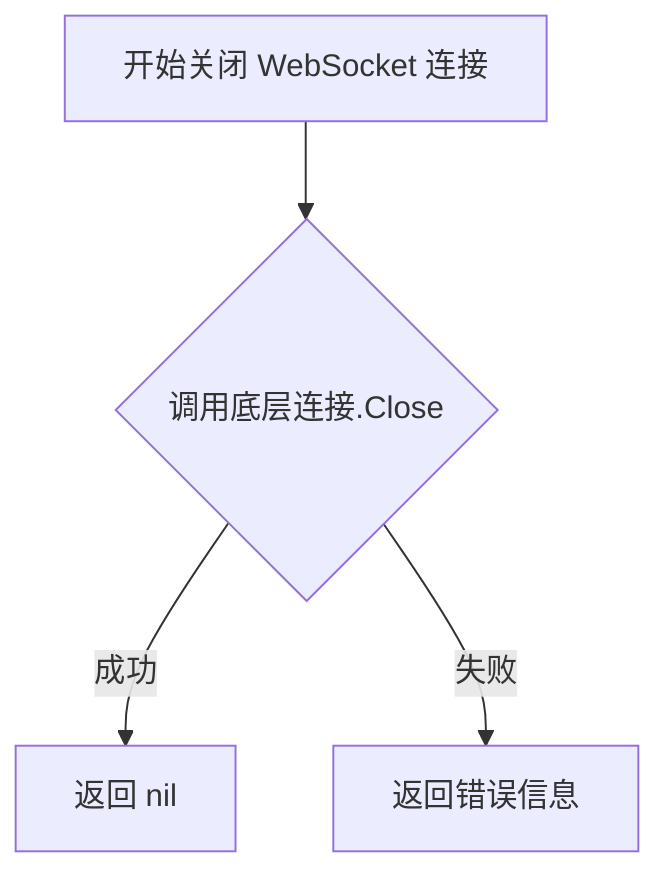

# `flux\pkg\http\websocket\websocket.go` 详细设计文档

该代码定义了一个WebSocket包装接口，将*websocket.Conn封装为io.ReadWriter，以支持基于字节流的RPC编解码器，同时提供了一个用于判断WebSocket连接是否为正常断开的辅助函数。

## 整体流程



## 类结构

```
Websocket (接口)
└── 实现: *websocket.Conn
```

## 全局变量及字段


### `Websocket`
    
Websocket接口封装了websocket.Conn的核心功能，嵌入io.Reader和io.Writer以支持RPC编解码器的字节流操作

类型：`interface`
    


### `IsExpectedWSCloseError`
    
全局函数，用于判断传入的错误是否是预期的websocket干净断开错误，包括正常关闭、离开、无状态接收和异常关闭等情况

类型：`func(err error) bool`
    


    

## 全局函数及方法


### `IsExpectedWSCloseError`

该函数用于判断WebSocket连接关闭是否为预期的正常关闭（即清洁断开），而非异常中断。它通过比对错误类型与预定义的正常关闭条件（EOF、管道关闭及特定的WebSocket关闭码）来返回布尔结果。

参数：

- `err`：`error`，需要检查的WebSocket连接错误

返回值：`bool`，如果错误属于预期的正常关闭则返回true，否则返回false

#### 流程图



#### 带注释源码

```go
// IsExpectedWSCloseError 判断传入的错误是否为WebSocket正常关闭产生的错误
// 参数 err: 需要进行检查的error对象
// 返回值: bool类型，true表示是正常的关闭错误，false表示是异常错误
func IsExpectedWSCloseError(err error) bool {
    // 检查错误是否为io.EOF（表示读取到文件末尾，通常是连接正常关闭）
    // 或io.ErrClosedPipe（表示管道已关闭，也是正常关闭情况）
    // 另外使用websocket.IsCloseError检查是否为特定的WebSocket关闭码
    // 支持的正常关闭码包括：
    // - CloseNormalClosure: 正常关闭
    // - CloseGoingAway: 客户端离开
    // - CloseNoStatusReceived: 未收到状态码
    // - CloseAbnormalClosure: 异常关闭（但仍被视为可预期的关闭）
    return err == io.EOF || err == io.ErrClosedPipe || websocket.IsCloseError(err,
        websocket.CloseNormalClosure,      // 1000: 正常关闭
        websocket.CloseGoingAway,          // 1001: 客户端离开
        websocket.CloseNoStatusReceived,   // 1005: 无状态码
        websocket.CloseAbnormalClosure,    // 1006: 异常关闭
    )
}
```


### `Websocket` (接口)

描述：该代码定义了一个 `Websocket` 接口，它嵌入了 `io.Reader`、`io.Writer` 和 `Close()` 方法，模拟了 `io.ReadWriter` 的行为。这种设计使得 WebSocket 连接可以像字节流一样支持 RPC 编解码器的操作。

参数：无（接口本身不接受参数）

返回值：无（接口本身不返回值）

#### 流程图

```mermaid
graph TD
    A[Websocket 接口] --> B[io.Reader]
    A --> C[io.Writer]
    A --> D[Close() error]
    
    B --> B1[Read(p []byte) (n int, err error)]
    C --> C1[Write(p []byte) (n int, err error)]
    
    E[IsExpectedWSCloseError 函数] --> E1[检查错误是否为预期的关闭错误]
    E1 --> E2[返回 bool]
```

#### 带注释源码

```
package websocket

// 此包可以在移除 `--connect` 后移动到 weaveworks/flux-adapter，
// 因为它专门用于建立 RPC 中继连接，而该功能将由 flux-adapter 提供。

import (
	"io"

	"github.com/gorilla/websocket"
)

// Websocket 暴露了我们实际使用的 *websocket.Conn 的部分。
// 注意，我们正在模拟一个 `io.ReadWriter`。这是为了能够
// 支持在字节流上操作的 RPC 编解码器。
type Websocket interface {
	io.Reader  // 嵌入 io.Reader，提供 Read(p []byte) (n int, err error) 方法
	io.Writer  // 嵌入 io.Writer，提供 Write(p []byte) (n int, err error) 方法
	Close() error  // 嵌入 Close 方法
}

// IsExpectedWSCloseError 返回一个布尔值，表示错误是否是
// 干净的断开连接。
// 参数：
//   - err: error，需要检查的错误
// 返回值：bool，如果是预期的关闭错误返回 true，否则返回 false
func IsExpectedWSCloseError(err error) bool {
	return err == io.EOF || err == io.ErrClosedPipe || websocket.IsCloseError(err,
		websocket.CloseNormalClosure,      // 正常关闭
		websocket.CloseGoingAway,          // 客户端离开
		websocket.CloseNoStatusReceived,   // 未收到状态码
		websocket.CloseAbnormalClosure,    // 异常关闭
	)
}
```

#### 补充说明

1. **关于 Read 方法**：代码中 `Websocket` 接口嵌入了 `io.Reader`，这意味着任何实现该接口的类型都必须实现 `Read(p []byte) (n int, err error)` 方法。但在本代码片段中，并未提供具体的实现类。

2. **接口设计目的**：这种设计允许 WebSocket 连接像传统的流式 I/O 一样被使用，便于集成支持 `io.Reader`/`io.Writer` 接口的库或框架（如 RPC 框架）。

3. **潜在优化点**：由于没有具体的实现类，建议后续补充实现类或说明该接口的预期实现者。


### Websocket.Writer（Write 方法）

描述：Websocket 接口通过嵌入 io.Writer 获得的 Write 方法，用于向 WebSocket 连接写入数据，实现 io.Writer 接口以支持 RPC 编解码器的字节流操作。

参数：

- `p`：`[]byte`，要写入的字节数据

返回值：

- `n`：`int`，写入的字节数
- `err`：`error`，写入过程中发生的错误（如果没有错误则为 nil）

#### 流程图



#### 带注释源码

```go
// Websocket 接口定义
// 该接口通过嵌入 io.Reader 和 io.Writer 来实现基本的读写能力
// Close 方法用于关闭 WebSocket 连接
type Websocket interface {
    // Write 方法继承自 io.Writer 接口
    // 用于向 WebSocket 连接写入数据
    // 参数 p 是要写入的字节切片
    // 返回写入的字节数 n 和可能的错误 err
    io.Reader
    io.Writer  // Write 方法从此接口嵌入
    Close() error
}

// 注意：Write 方法本身并未在此包中显式实现
// 它是通过嵌入 io.Writer 接口而获得的
// 具体实现由使用此接口的调用方提供，通常是 *websocket.Conn
```


### `Websocket.Close`

该方法是 `Websocket` 接口中定义的关闭连接的方法，用于关闭 WebSocket 连接并返回可能发生的错误。

**参数：**

- （无参数）

**返回值：** `error`，表示关闭连接时可能发生的错误，如果关闭成功则返回 `nil`

#### 流程图



#### 带注释源码

```go
// Websocket 接口定义，嵌入 io.Reader 和 io.Writer
// 并声明 Close 方法用于关闭连接
type Websocket interface {
    io.Reader  // 嵌入读取接口
    io.Writer  // 嵌入写入接口
    Close() error  // 关闭 WebSocket 连接，返回错误
}
```

> **注意**：这是一个接口声明，而非具体实现类。`Close()` 方法的具体逻辑由实现该接口的具体类型（如 `*websocket.Conn`）提供。从代码注释可知，该接口用于支持 RPC 编解码器的字节流操作，实现了对 WebSocket 连接的可读可写和关闭能力的抽象。

## 关键组件


### Websocket 接口

Websocket 接口定义了 WebSocket 连接的抽象，嵌入了 io.Reader 和 io.Writer 以支持 RPC 编解码器的字节流操作，同时提供 Close() 方法用于关闭连接。该接口封装了 *websocket.Conn 的核心功能，使其与 Go 的 I/O 标准库兼容。

### IsExpectedWSCloseError 函数

IsExpectedWSCloseError 函数接收一个 error 参数，判断该错误是否是 WebSocket 的预期/干净断开。它会检查错误是否为 io.EOF、io.ErrClosedPipe，或者是 websocket 库定义的标准关闭码（包括正常关闭、离开、无状态接收、异常关闭）。返回布尔值表示是否为预期错误。

### 技术债务与优化空间

1. **接口扩展性有限**：当前只暴露了 Read、Write、Close 三个方法，如果未来需要其他 WebSocket 功能（如 Ping/Pong、状态获取），需要修改接口定义
2. **包依赖说明**：注释表明该包是临时解决方案，一旦 `--connect` 参数移除，应迁移到 weaveworks/flux-adapter 项目
3. **错误码覆盖范围**：当前的关闭错误码覆盖了常见场景，但可能需要根据实际使用情况调整

### 设计目标与约束

- **设计目标**：提供一个轻量级的 WebSocket 抽象层，使 RPC 框架能够通过标准的 io.Reader/io.Writer 接口与 WebSocket 服务器通信
- **约束**：依赖 gorilla/websocket 库，不处理具体的业务逻辑，仅提供基础的连接抽象和错误判断

### 外部依赖与接口契约

- **依赖**：`github.com/gorilla/websocket` 包，提供底层 WebSocket 实现和 IsCloseError 工具函数
- **接口契约**：Websocket 接口的实现必须满足 io.Reader、io.Writer 的语义，并在 Close() 时触发 WebSocket 连接的优雅关闭


## 问题及建议


### 已知问题

-   **接口设计不完整**：`Websocket` 接口仅嵌入了 `io.Reader` 和 `io.Writer`，但没有定义 WebSocket 特有的方法（如 `ReadMessage`、`WriteMessage` 等），限制了其在更复杂场景下的使用。
-   **错误处理不够健壮**：`IsExpectedWSCloseError` 仅检查了 `io.EOF` 和 `io.ErrClosedPipe` 两个错误值，但这两个错误值是 `io` 包定义的，与 WebSocket 连接状态无直接关联，可能导致误判。
-   **缺少上下文信息**：`IsExpectedWSCloseError` 函数返回布尔值，但没有提供错误的上下文信息（如关闭码、关闭原因），不利于调用者进行更精细的错误处理。
-   **测试覆盖缺失**：代码中没有任何单元测试，无法验证接口行为和错误处理逻辑的正确性。
-   **过度依赖具体实现**：代码直接依赖 `github.com/gorilla/websocket` 包，降低了代码的可测试性和可替换性。

### 优化建议

-   **完善接口设计**：考虑在 `Websocket` 接口中添加 WebSocket 特有的方法（如 `ReadMessage`、`WriteMessage`、`CloseWithCode` 等），或创建一个更细粒度的接口层次。
-   **改进错误处理**：使用自定义错误类型或错误包装来区分 WebSocket 相关的错误，提供更丰富的错误信息（如错误码、错误原因）。
-   **添加单元测试**：为 `Websocket` 接口和 `IsExpectedWSCloseError` 函数编写单元测试，确保其行为符合预期。
-   **解耦依赖**：通过依赖注入或接口抽象，减少对 `gorilla/websocket` 的直接依赖，提高代码的可测试性和可维护性。
-   **完善文档**：为包、接口和函数添加更详细的文档注释，说明其用途、使用场景和注意事项。

## 其它


### 设计目标与约束

本包的设计目标是为RPC中继连接提供WebSocket抽象，使其能够支持基于字节流的RPC编解码器。核心约束是依赖gorilla/websocket库，仅暴露实际使用的WebSocket连接功能，通过接口抽象实现与具体实现的解耦。

### 错误处理与异常设计

错误处理采用显式检查模式，通过IsExpectedWSCloseError函数区分预期关闭与异常断开。预期关闭包括：正常关闭(CloseNormalClosure)、客户端离开(CloseGoingAway)、无状态关闭(CloseNoStatusReceived)和异常关闭(CloseAbnormalClosure)。非预期错误应向上传播，由调用方决定处理策略。

### 外部依赖与接口契约

主要外部依赖为github.com/gorilla/websocket包。接口契约方面：Websocket接口要求实现io.Reader、io.Writer和Close()方法；IsExpectedWSCloseError函数接收error参数并返回布尔值，参数可为nil。

### 使用场景与集成方式

该包主要用于需要WebSocket透传RPC调用的场景，即作为WebSocket到RPC的桥接层。调用方应创建Websocket实现实例（通常为*websocket.Conn），然后将其注入到RPC客户端/服务器中。

### 性能考虑

由于Websocket接口嵌入io.Reader和io.Writer，性能主要取决于底层websocket.Conn的读写性能。当前设计无额外缓冲或缓存层，建议在高并发场景下评估是否需要添加连接池或缓冲机制。

### 测试策略建议

建议包含以下测试用例：正常关闭连接的场景验证、不同关闭码(CloseNormalClosure、CloseGoingAway等)的识别准确性、非预期错误的错误传播验证、以及接口实现的合约测试。

### 线程安全性

接口本身不包含状态，线程安全性取决于具体实现(*websocket.Conn)。根据gorilla/websocket文档，Conn类型并发不安全，需要调用方保证序列化访问。

### 版本兼容性考虑

该包与gorilla/websocket版本绑定，建议在go.mod中明确指定兼容版本范围。当前代码使用的websocket.IsCloseError函数在较新版本中可能有细微行为差异，需在升级依赖时进行回归测试。


    