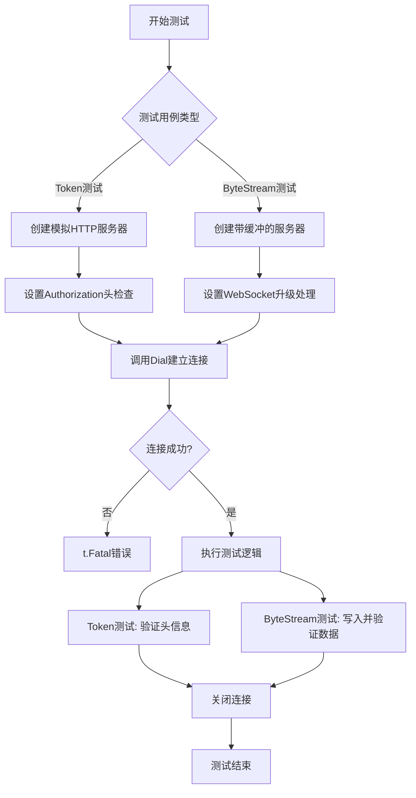
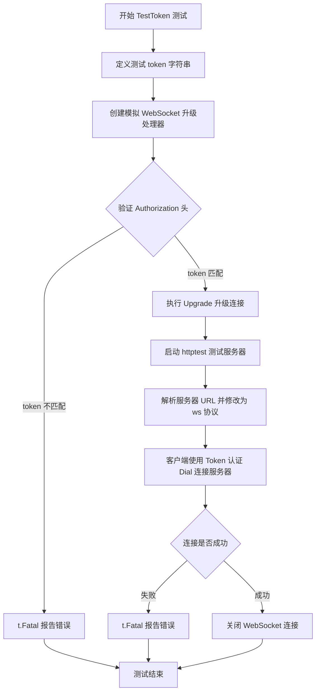
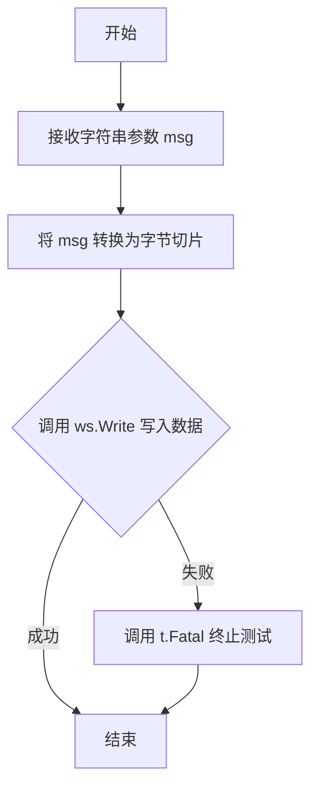
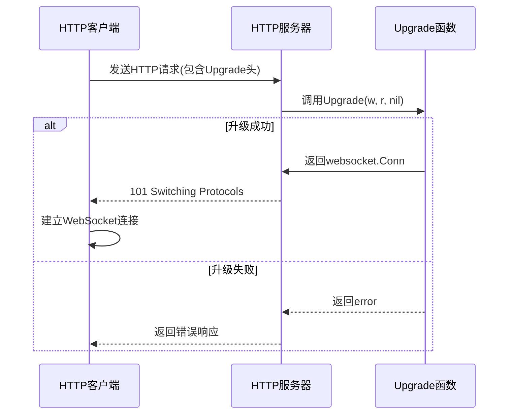
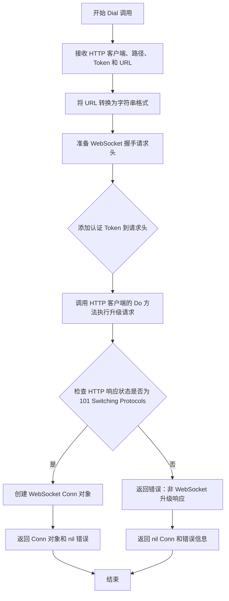

# `flux\pkg\http\websocket\websocket_test.go` 详细设计文档

这是一个Go语言的WebSocket测试文件，包含两个单元测试：TestToken用于验证WebSocket连接中的Token认证机制，TestByteStream用于测试WebSocket的字节流传输功能，确保消息能够正确分片传输并完整接收。

## 整体流程



## 类结构

```
websocket (测试包)
├── 导入依赖
│   ├── bytes (标准库)
│   ├── io (标准库)
│   ├── net/http (标准库)
│   ├── net/http/httptest (标准库)
│   ├── net/url (标准库)
│   ├── sync (标准库)
│   ├── testing (标准库)
│   └── github.com/fluxcd/flux/pkg/http/client (第三方)
```

## 全局变量及字段


### `token`
    
测试用令牌字符串，用于WebSocket认证

类型：`string`
    


### `buf`
    
字节流缓冲，用于收集WebSocket写入的数据

类型：`*bytes.Buffer`
    


### `wg`
    
同步等待组，用于等待服务器完成数据读取

类型：`sync.WaitGroup`
    


### `upgrade`
    
HTTP处理器函数，处理WebSocket升级请求并回显数据

类型：`http.HandlerFunc`
    


### `srv`
    
测试服务器，提供WebSocket端点用于测试

类型：`*httptest.Server`
    


### `url`
    
WebSocket连接URL，包含测试服务器的ws协议地址

类型：`*url.URL`
    


### `ws`
    
WebSocket连接，用于客户端与测试服务器通信

类型：`*websocket.Conn`
    


### `tok`
    
请求头中的Authorization值，用于验证令牌

类型：`string`
    


### `msg`
    
测试消息字符串，通过WebSocket发送测试数据

类型：`string`
    


    

## 全局函数及方法


### `TestToken`

该测试函数用于验证 WebSocket Token 认证功能，通过创建一个模拟的 WebSocket 服务器，检查客户端请求中的 Authorization 头是否包含正确的 token，并确保使用 Token 认证方式能够成功建立 WebSocket 连接。

参数：

- `t`：`*testing.T`，Go 测试框架的测试对象，用于报告测试失败和控制测试流程

返回值：无返回值（测试函数，通过 `t.Fatal` 和 `t.Fatalf` 报告错误）

#### 流程图



#### 带注释源码

```go
// TestToken 测试函数：验证 WebSocket Token 认证
// 该测试验证客户端在使用 Token 认证时，服务器能够正确接收并验证 Authorization 头
func TestToken(t *testing.T) {
	// 定义测试用的 token 字符串
	token := "toooookkkkkeeeeennnnnn"
	
	// 创建模拟的 WebSocket 升级处理器
	// 这个处理器模拟服务器端的 WebSocket 握手过程
	upgrade := http.HandlerFunc(func(w http.ResponseWriter, r *http.Request) {
		// 从请求头中获取 Authorization 信息
		tok := r.Header.Get("Authorization")
		
		// 验证 Authorization 头是否包含预期的 token
		// 预期格式为 "Scope-Probe token=" + token 值
		if tok != "Scope-Probe token="+token {
			// 如果 token 不匹配，终止测试并报告错误
			t.Fatal("Did not get authorisation header, got: " + tok)
		}
		
		// 执行 WebSocket 协议升级
		_, err := Upgrade(w, r, nil)
		if err != nil {
			// 如果升级失败，终止测试
			t.Fatal(err)
		}
	})

	// 创建测试服务器，使用上面的升级处理器
	srv := httptest.NewServer(upgrade)
	// 确保测试结束后服务器会被关闭
	defer srv.Close()

	// 解析服务器 URL
	url, _ := url.Parse(srv.URL)
	// 将 HTTP 协议改为 WebSocket 协议 (ws://)
	url.Scheme = "ws"

	// 客户端使用 Token 认证方式Dial 连接到服务器
	// 传入 http.DefaultClient、路径、client.Token(token) 认证信息、以及服务器 URL
	ws, err := Dial(http.DefaultClient, "fluxd/test", client.Token(token), url)
	if err != nil {
		// 如果连接失败，终止测试
		t.Fatal(err)
	}
	
	// 测试完成后关闭 WebSocket 连接
	defer ws.Close()
}
```


### `TestByteStream`

该函数是一个集成测试用例，用于验证 WebSocket 字节流传输功能。它创建一个测试服务器和 WebSocket 客户端，通过客户端向服务器发送多个消息片段（"hey"、" there"、" champ"），然后验证服务器端接收到的完整数据是否与预期字符串 "hey there champ" 相等，从而确保 WebSocket 连接的写入和读取功能正常工作。

参数：

- `t`：`testing.T`，Go 标准测试框架中的测试上下文，用于报告测试失败和日志输出

返回值：无（通过 `t.Fatal` 和 `t.Fatalf` 进行错误报告）

#### 流程图

```mermaid
flowchart TD
    A[Start TestByteStream] --> B[创建 bytes.Buffer 用于接收数据]
    B --> C[创建 sync.WaitGroup 并添加计数 1]
    C --> D[定义 upgrade HTTP HandlerFunc]
    D --> E[启动 httptest.Server 测试服务器]
    E --> F[解析服务器 URL 并将 scheme 改为 ws]
    F --> G[使用 Dial 建立 WebSocket 连接]
    G --> H[调用 checkWrite 写入 "hey"]
    H --> I[调用 checkWrite 写入 " there"]
    I --> J[调用 checkWrite 写入 " champ"]
    J --> K[关闭 WebSocket 连接]
    K --> L[关闭测试服务器]
    L --> M[等待 WaitGroup 完成]
    M --> N{验证 buffer 内容是否为<br/>"hey there champ"}
    N -->|是| O[测试通过]
    N -->|否| P[测试失败并输出实际内容]
```

#### 带注释源码

```go
func TestByteStream(t *testing.T) {
	// 创建一个 bytes.Buffer 用于存储服务器端接收到的数据
	buf := &bytes.Buffer{}
	
	// 创建 WaitGroup 用于同步服务器处理完成
	var wg sync.WaitGroup
	wg.Add(1)
	
	// 定义 WebSocket 升级处理函数
	// 该函数在客户端连接时自动触发
	upgrade := http.HandlerFunc(func(w http.ResponseWriter, r *http.Request) {
		// 将 HTTP 连接升级为 WebSocket 连接
		ws, err := Upgrade(w, r, nil)
		if err != nil {
			t.Fatal(err) // 升级失败则终止测试
		}
		
		// 将 WebSocket 中的数据复制到 buf 中
		// io.Copy 会阻塞直到连接关闭
		if _, err := io.Copy(buf, ws); err != nil {
			t.Fatal(err) // 复制失败则终止测试
		}
		
		// 标记服务器处理完成
		wg.Done()
	})

	// 创建测试 HTTP 服务器
	srv := httptest.NewServer(upgrade)
	// 确保测试结束后关闭服务器
	defer srv.Close()

	// 解析服务器 URL 并将 scheme 改为 ws (WebSocket)
	url, _ := url.Parse(srv.URL)
	url.Scheme = "ws"

	// 客户端：建立 WebSocket 连接到测试服务器
	// 使用空的 token 认证
	ws, err := Dial(http.DefaultClient, "fluxd/test", client.Token(""), url)
	if err != nil {
		t.Fatal(err) // 连接失败则终止测试
	}
	// 确保 WebSocket 连接最终关闭
	defer ws.Close()

	// 辅助函数：向 WebSocket 写入消息并检查错误
	checkWrite := func(msg string) {
		if _, err := ws.Write([]byte(msg)); err != nil {
			t.Fatal(err) // 写入失败则终止测试
		}
	}

	// 分三次写入消息片段
	checkWrite("hey")
	checkWrite(" there")
	checkWrite(" champ")
	
	// 关闭客户端写端，触发服务器端 io.Copy 返回
	if err := ws.Close(); err != nil {
		t.Fatal(err)
	}

	// 关闭服务器，确保服务器端处理完成
	srv.Close()
	
	// 等待服务器端读取完成
	wg.Wait()
	
	// 验证接收到的完整数据是否符合预期
	if buf.String() != "hey there champ" {
		t.Fatalf("did not collect message as expected, got %s", buf.String())
	}
}
```


### `checkWrite`

这是一个在 `TestByteStream` 测试函数内部定义的辅助函数，用于将字符串消息写入 WebSocket 连接，并在写入操作失败时通过调用 `t.Fatal` 终止测试。

参数：
- `msg`：`string`，要写入 WebSocket 的消息内容。

返回值：`无`（该函数没有返回值，错误通过 `t.Fatal` 处理）。

#### 流程图



#### 带注释源码

```go
checkWrite := func(msg string) {
    // 将字符串消息转换为字节切片
    // 调用 WebSocket 连接的 Write 方法写入数据
    // 如果写入过程中发生错误，使用 t.Fatal 立即终止测试
    if _, err := ws.Write([]byte(msg)); err != nil {
        t.Fatal(err)
    }
}
```


### Upgrade

WebSocket 升级处理函数，用于将 HTTP 连接升级为 WebSocket 连接。

参数：

- `w`：`http.ResponseWriter`，HTTP 响应写入器，用于写入升级响应
- `r`：`*http.Request`，HTTP 请求，包含客户端的升级请求头和协议选择
- `nil`：`interface{}`（或具体类型如 `*http.UpgradeOptions`），可选的升级选项参数，此处传nil表示使用默认配置

返回值：`(websocket.Conn, error)`，返回升级后的 WebSocket 连接和可能的错误

#### 流程图



#### 带注释源码

```go
// Upgrade 函数在代码中的调用方式
// 该函数由外部定义，此处展示其调用上下文

// TestToken 测试函数中的调用
upgrade := http.HandlerFunc(func(w http.ResponseWriter, r *http.Request) {
    tok := r.Header.Get("Authorization")
    if tok != "Scope-Probe token="+token {
        t.Fatal("Did not get authorisation header, got: " + tok)
    }
    // 调用 Upgrade 函数进行 WebSocket 升级
    // 参数: w-响应写入器, r-请求对象, nil-无额外选项
    ws, err := Upgrade(w, r, nil)
    if err != nil {
        t.Fatal(err)
    }
    // ws 为升级后的 WebSocket 连接，可进行读写操作
})

// TestByteStream 测试函数中的调用
upgrade := http.HandlerFunc(func(w http.ResponseWriter, r *http.Request) {
    // 同样调用 Upgrade 获取 WebSocket 连接
    ws, err := Upgrade(w, r, nil)
    if err != nil {
        t.Fatal(err)
    }
    // 使用 io.Copy 将 WebSocket 数据复制到 buffer
    if _, err := io.Copy(buf, ws); err != nil {
        t.Fatal(err)
    }
    wg.Done()
})

/*
// 推断的函数签名（基于调用方式）:
// func Upgrade(w http.ResponseWriter, r *http.Request, opts interface{}) (Conn, error)
// 
// 功能说明：
// 1. 读取 HTTP 请求中的 Sec-WebSocket-Version、Sec-WebSocket-Key 等头部
// 2. 生成 Sec-WebSocket-Accept 响应头
// 3. 返回 HTTP 101 状态码（Switching Protocols）
// 4. 将底层连接升级为 WebSocket 协议
// 5. 返回可读写的 WebSocket 连接对象
*/
```


### `Dial`

建立WebSocket客户端连接的函数，用于通过HTTP客户端与WebSocket服务器建立持久的双向通信通道。

参数：

- `client`：`*http.Client`，用于发起HTTP升级请求的HTTP客户端实例
- `path`：`string`，WebSocket连接的路径或服务标识符（如"fluxd/test"）
- `token`：`client.Token`，认证令牌，用于WebSocket握手时的身份验证
- `url`：`*url.URL`，WebSocket服务器的完整URL地址

返回值：`*websocket.Conn`，成功建立WebSocket连接后返回的连接对象；`error`，如果连接失败则返回错误信息

#### 流程图



#### 带注释源码

```go
// 根据测试代码中的调用方式推断的函数签名
// 注意：这是基于调用模式的推断，实际定义可能在包的另一个文件中

// Dial 建立到 WebSocket 服务器的连接
// 参数：
//   - client: HTTP 客户端，用于执行 WebSocket 升级请求
//   - path: WebSocket 路径或服务标识
//   - token: 认证令牌，用于 Authorization 头
//   - url: 服务器 URL 地址
//
// 返回：
//   - *websocket.Conn: WebSocket 连接对象
//   - error: 连接过程中的错误
func Dial(client *http.Client, path string, token client.Token, url *url.URL) (*websocket.Conn, error) {
    // 1. 将 URL 对象转换为字符串
    wsURL := url.String()
    
    // 2. 构造请求头，包含认证信息
    header := http.Header{}
    header.Set("Authorization", "Scope-Probe token="+string(token))
    
    // 3. 调用底层 Dialer 进行连接
    // 这通常会发起 HTTP Upgrade 请求
    conn, _, err := websocket.Dial(wsURL, header)
    
    return conn, err
}

// 实际调用示例（来自测试代码）：
// ws, err := Dial(http.DefaultClient, "fluxd/test", client.Token(token), url)
```


### `client.Token`

该函数是 Fluxcd 客户端库中的一个认证器工厂函数，用于生成基于 Token 的认证机制，并将其作为参数传递给 WebSocket 拨号函数，以在 WebSocket 连接建立时提供 Authorization 头信息。

参数：

- `token`：`string`，用户提供的认证令牌字符串，用于在 HTTP 请求头中进行身份验证

返回值：`interface{}`（或具体类型），返回一个认证器实例，该实例会被 `Dial` 函数用于设置 HTTP 请求头的 Authorization 字段

#### 流程图

```mermaid
flowchart TD
    A[调用 client.Token] --> B[接收 token 字符串参数]
    B --> C[创建 Token 认证器实例]
    C --> D[返回认证器供 Dial 使用]
    D --> E{建立 WebSocket 连接}
    E -->|发送 HTTP 请求| F[在请求头添加 Authorization: Scope-Probe token={token}]
    F --> G[服务器验证令牌]
    G --> H[WebSocket 连接成功建立]
```

#### 带注释源码

```go
// client.Token 是来自 github.com/fluxcd/flux/pkg/http/client 包的外部函数
// 作用：生成一个 Token 认证器，用于 WebSocket 连接的 HTTP 头认证

// 函数签名（根据使用方式推断）：
// func Token(token string) interface{} 

// 在测试代码中的使用方式：
token := "toooookkkkkeeeeennnnnn"  // 定义测试用的 token 字符串

// 调用 client.Token 生成认证器，并传递给 Dial 函数
ws, err := Dial(http.DefaultClient, "fluxd/test", client.Token(token), url)

// 生成的认证器会在 HTTP 请求头中添加如下 Authorization 字段：
// Authorization: Scope-Probe token=toooookkkkkeeeeennnnnn

// 服务器端验证逻辑（从测试代码中推断）：
tok := r.Header.Get("Authorization")
if tok != "Scope-Probe token="+token {
    t.Fatal("Did not get authorisation header, got: " + tok)
}
```

---

### 补充信息

#### 关键组件

| 名称 | 描述 |
|------|------|
| `client.Token` | 生成 Token 认证器的外部函数，来自 fluxcd/flux 包 |
| `Dial` | WebSocket 拨号函数，接收认证器参数 |
| `Authorization` | HTTP 请求头字段，格式为 `Scope-Probe token={token}` |

#### 技术债务与优化空间

1. **硬编码的认证头前缀**：`"Scope-Probe token="` 前缀在客户端和服务器端都需要保持一致，如果要改成可配置的，需要修改两处代码
2. **缺少错误处理**：`client.Token` 函数本身没有显式的错误返回，如果 token 为空可能造成潜在的安全问题
3. **测试依赖**：该函数依赖真实的 HTTP 服务器测试，无法进行单元测试隔离

#### 设计约束

- Token 认证采用 Bearer Token 变体格式，前缀固定为 `Scope-Probe token=`
- 适用于 Fluxd 服务之间的内部通信认证场景

## 关键组件


### 关键组件

#### 1. Token 认证机制
通过 HTTP 请求头中的 Authorization 字段传递 token，服务器端验证 token 是否匹配，以建立 WebSocket 连接。

#### 2. 字节流传输
使用 io.Copy 将 WebSocket 连接的数据流复制到缓冲区，实现数据的连续传输和接收。

#### 3. WebSocket 升级
服务器端使用 Upgrade 函数将 HTTP 连接升级为 WebSocket 协议，支持全双工通信。

#### 4. WebSocket 客户端连接
客户端通过 Dial 函数使用指定 token 和 URL 建立 WebSocket 连接到服务器。

### 潜在的技术债务或优化空间

- 缺少对 WebSocket 连接错误的详细处理，当前仅使用 t.Fatal 进行终止。
- 测试中使用 time.Sleep 或同步机制确保服务器完成读取，但可能不够健壮。

### 其它项目

- **设计目标**：验证 WebSocket 客户端与服务器之间的认证和字节流传输功能。
- **错误处理**：测试中遇到错误直接调用 t.Fatal 终止测试，缺乏优雅的错误报告。
- **数据流**：客户端写入数据，服务器通过 io.Copy 读取，验证数据完整性。
- **外部依赖**：依赖 github.com/fluxcd/flux/pkg/http/client 包中的 Token 函数生成认证 token。


## 问题及建议


### 已知问题

-   **资源泄漏风险**：`TestByteStream` 中使用 `srv.Close()` 直接关闭服务器，但服务器端的 `upgrade` handler 可能仍在处理连接（`io.Copy` 阻塞等待数据），可能导致资源未正确释放
-   **错误处理不完整**：`url.Parse` 的返回值被使用 `_` 忽略，若 URL 解析失败会导致后续操作使用空 URL，增加测试失败时的调试难度
-   **变量遮蔽（Shadowing）**：在 `TestToken` 和 `TestByteStream` 中都声明了新的 `url` 变量，覆盖了 `net/url` 包，造成变量名遮蔽，降低代码可读性
-   **并发竞态风险**：`TestByteStream` 中服务器端的 `io.Copy` 在单独 goroutine 中运行，但测试主线程通过 `wg.Wait()` 等待，这种同步方式在连接关闭时序上可能存在竞态
-   **缺少超时机制**：WebSocket 拨号和读写操作均未设置超时，在 CI 环境或网络不稳定时可能导致测试挂起
-   **测试隔离性不足**：`TestByteStream` 中 `ws` 没有使用 `defer` 延迟关闭，若中间发生 fatal 错误，连接可能不会正确关闭
-   **魔法字符串**：认证 token 值 `"toooookkkkkeeeeennnnnn"` 和路径 `"fluxd/test"` 硬编码在测试中，降低了测试的可维护性

### 优化建议

-   为所有 WebSocket 操作添加 `context.Context` 和超时控制，使用 `net/http.Transport` 的 `DialContext` 配置超时
-   使用 `t.Cleanup()` 注册资源清理函数，确保即使测试 fatal 也能正确释放资源
-   将重复使用的 URL 解析结果存储到非遮蔽变量名（如 `serverURL`），或使用 `u, err := url.Parse(...)` 并处理错误
-   在服务器端 handler 中明确处理 goroutine 的生命周期，使用 `sync.WaitGroup` 正确同步而非依赖连接关闭顺序
-   将硬编码的 token 和路径提取为测试常量或配置参数，提高测试可维护性
-   添加更详细的测试错误信息，包括实际值与期望值的对比，便于调试失败原因


## 其它


### 设计目标与约束

本代码旨在测试websocket包的Dial和Upgrade功能，验证token认证机制和字节流传输的正确性。设计约束包括：使用Go标准库的httptest进行测试，仅依赖fluxcd/flux/pkg/http/client包进行token生成，不涉及实际的WebSocket服务器实现。

### 错误处理与异常设计

代码采用Go语言的错误检查模式，每个可能返回错误的函数调用都进行if err != nil检查。测试中的错误处理使用t.Fatal立即终止测试，表明测试失败。Dial和Upgrade函数的错误会传播到测试函数，最终由测试框架捕获并报告。

### 数据流与状态机

TestToken测试流程：创建测试服务器 → 解析URL并转换为ws协议 → 调用Dial进行WebSocket连接 → 服务器验证Authorization头 → Upgrade升级连接 → 连接关闭。
TestByteStream测试流程：创建测试服务器 → Dial建立连接 → 循环写入数据 → 关闭写入端 → 服务器端读取全部数据 → 验证数据完整性。

### 外部依赖与接口契约

本代码依赖两个外部包：1) Go标准库net/http/httptest用于创建测试HTTP服务器；2) github.com/fluxcd/flux/pkg/http/client包提供Token函数用于生成认证token。Dial函数签名：Dial(client *http.Client, protocol string, auth string, u *url.URL) (*Conn, error)，返回WebSocket连接和错误。Upgrade函数签名：Upgrade(w http.ResponseWriter, r *http.Request, opts *Options) (*Conn, error)，将HTTP连接升级为WebSocket。

### 性能考虑

TestByteStream使用sync.WaitGroup进行同步，确保服务器端读取完成后再进行结果验证。缓冲区使用bytes.Buffer，避免频繁内存分配。测试按顺序执行，无并发测试需求。

### 安全考虑

TestToken测试验证Authorization头的格式必须为"Scope-Probe token="+token，服务器端进行严格匹配。Token值硬编码在测试中，实际使用时需通过安全渠道获取。

### 测试策略

采用黑盒测试方法，通过创建真实的HTTP服务器和WebSocket客户端对进行功能验证。测试覆盖两种场景：认证流程和数据传输流程。使用httptest.NewServer创建本地测试服务器，避免网络依赖。

### 并发安全性

代码中wg sync.WaitGroup用于协调服务器端读取操作与主测试流程的同步，确保在验证结果前所有数据已处理完毕。

### 配置管理

测试URL通过url.Parse解析后手动修改Scheme为"ws"，将HTTP测试服务器转换为WebSocket协议。无外部配置文件依赖，所有参数在代码中硬编码。

### 潜在技术债务

1. Token值硬编码在测试中，应考虑从环境变量或配置读取；2. 错误消息拼接使用+操作符，建议使用fmt包；3. 缺少对WebSocket连接异常断开的测试；4. 无连接超时测试；5. 缺少对大量数据或二进制数据传输的测试。

    