# `flux\pkg\image\image.go` 详细设计文档

一个用于解析、验证和管理 Docker/OCI 容器镜像引用的 Go 包，支持标签、Digest、标签元数据和镜像信息排序等功能。

## 整体流程

```mermaid
graph TD
    A[开始: 输入镜像字符串] --> B{字符串为空?}
B -- 是 --> C[返回 ErrBlankImageID]
B -- 否 --> D{以 / 开头或结尾?}
D -- 是 --> E[返回 ErrMalformedImageID]
D -- 否 --> F[按 / 分割字符串]
F --> G{元素数量}
G -->|1| H[无斜杠, 如 alpine:1.5]
G -->|2| I[可能有域名或路径]
G -->|多| J[第一元素为域名]
H --> K[设置 Image=元素]
I --> L{匹配域名正则?}
L -- 是 --> M[设置 Domain=elements[0], Image=elements[1]]
L -- 否 --> N[设置为库镜像]
J --> O[设置 Domain=elements[0], Image=join(剩余元素, /)]
M --> P[提取 SHA256 Digest]
N --> P
K --> P
O --> P
P --> Q{存在 @sha256:?
Q -- 是 --> R[分离 Image 和 SHA]
Q -- 否 --> S[提取 Tag]
R --> S
S --> T{存在 : }
T -- 是 --> U[分离 Image 和 Tag]
T -- 否 --> V[返回 Ref]
U --> V
V --> W[结束: 返回 Ref 和 nil]
```

## 类结构

```
Name (镜像名称结构体)
├── CanonicalName (规范名称结构体, 嵌入 Name)
Ref (带标签的镜像引用结构体, 嵌入 Name)
└── CanonicalRef (规范引用结构体, 嵌入 Ref)
Labels (镜像标签元数据结构体)
Info (镜像信息元数据结构体)
RepositoryMetadata (镜像仓库元数据结构体)
LabelTimestampFormatError (时间戳格式错误结构体)
infoSort (镜像排序辅助结构体)
```

## 全局变量及字段


### `dockerHubHost`
    
Docker Hub 域名 (index.docker.io)

类型：`string`
    


### `oldDockerHubHost`
    
旧 Docker Hub 域名 (docker.io)

类型：`string`
    


### `ErrInvalidImageID`
    
无效镜像 ID 错误

类型：`error`
    


### `ErrBlankImageID`
    
空镜像名称错误

类型：`error`
    


### `ErrMalformedImageID`
    
格式错误的镜像 ID 错误

类型：`error`
    


### `domainComponent`
    
域名组件正则表达式

类型：`string`
    


### `domain`
    
完整域名正则表达式

类型：`string`
    


### `domainRegexp`
    
编译后的域名正则

类型：`*regexp.Regexp`
    


### `Name.Domain`
    
镜像仓库域名

类型：`string`
    


### `Name.Image`
    
镜像名称

类型：`string`
    


### `CanonicalName.Name`
    
包含 Domain 和 Image 的嵌入类型

类型：`Name`
    


### `Ref.Name`
    
包含 Domain 和 Image 的嵌入类型

类型：`Name`
    


### `Ref.Tag`
    
镜像标签

类型：`string`
    


### `Ref.SHA`
    
SHA256 Digest

类型：`string`
    


### `CanonicalRef.Ref`
    
包含 Name, Tag, SHA 的嵌入类型

类型：`Ref`
    


### `Labels.BuildDate`
    
构建日期 (org.label-schema.build-date)

类型：`time.Time`
    


### `Labels.Created`
    
创建日期 (org.opencontainers.image.created)

类型：`time.Time`
    


### `Info.ID`
    
镜像引用

类型：`Ref`
    


### `Info.Digest`
    
获取的摘要

类型：`string`
    


### `Info.ImageID`
    
镜像标识符

类型：`string`
    


### `Info.Labels`
    
镜像标签

类型：`Labels`
    


### `Info.CreatedAt`
    
镜像创建时间

类型：`time.Time`
    


### `Info.LastFetched`
    
最后拉取时间

类型：`time.Time`
    


### `RepositoryMetadata.Tags`
    
仓库中所有标签

类型：`[]string`
    


### `RepositoryMetadata.Images`
    
按标签索引的镜像信息

类型：`map[string]Info`
    


### `LabelTimestampFormatError.Labels`
    
格式错误的时间戳标签列表

类型：`[]string`
    


### `infoSort.infos`
    
要排序的镜像信息切片

类型：`[]Info`
    


### `infoSort.newer`
    
比较函数

类型：`func(a, b *Info) bool`
    
    

## 全局函数及方法


### `ParseRef`

解析一个字符串表示的镜像引用（Image Reference）为 `Ref` 结构体值，支持解析域名、镜像路径、标签（tag）和 SHA256 摘要。遵循 Docker Distribution 定义的镜像引用语法规范。

参数：

- `s`：`string`，待解析的镜像引用字符串，格式为 `[domain/]image[:tag][@sha256:digest]`

返回值：`Ref, error`

- `Ref`：解析成功时返回的镜像引用结构体，包含域名、镜像名、标签和 SHA256 摘要
- `error`：解析失败时返回错误，可能为空字符串、前后有斜杠、格式不符合规范等

#### 流程图

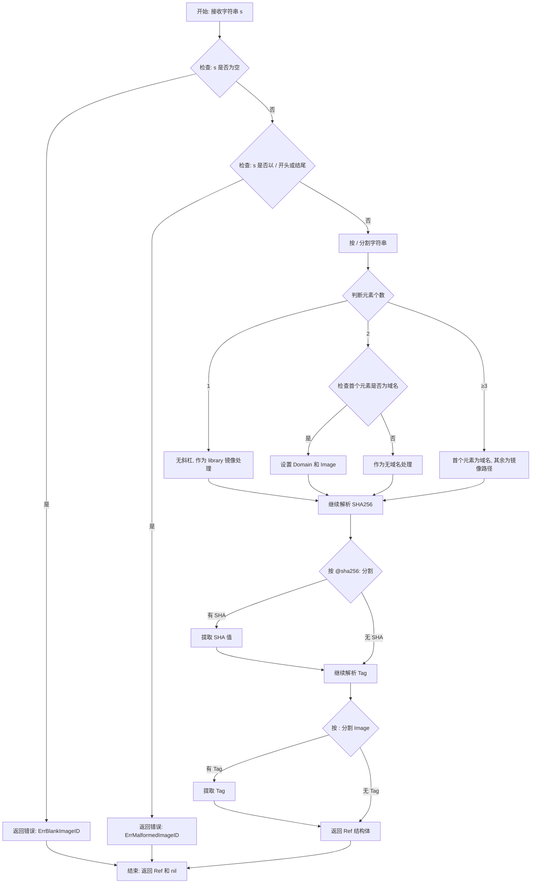

#### 带注释源码

```go
// ParseRef parses a string representation of an image id into an
// Ref value. The grammar is shown here:
// https://github.com/docker/distribution/blob/master/reference/reference.go
// (but we do not care about all the productions.)
func ParseRef(s string) (Ref, error) {
	var id Ref                                 // 初始化空的 Ref 结构体用于存储解析结果
	if s == "" {                               // 检查输入是否为空字符串
		return id, errors.Wrapf(ErrBlankImageID, "parsing %q", s)
	}
	if strings.HasPrefix(s, "/") || strings.HasSuffix(s, "/") { // 检查前后是否有斜杠
		return id, errors.Wrapf(ErrMalformedImageID, "parsing %q", s)
	}

	elements := strings.Split(s, "/")          // 按斜杠分割字符串
	switch len(elements) {                     // 根据分割后的元素数量判断域名和镜像名
	case 0: // NB strings.Split will never return []
		return id, errors.Wrapf(ErrMalformedImageID, "parsing %q", s)
	case 1: // no slashes, e.g., "alpine:1.5"; treat as library image
		id.Image = s                            // 无斜杠，作为 library 镜像处理
	case 2: // may have a domain e.g., "localhost/foo", or not e.g., "weaveworks/scope"
		if domainRegexp.MatchString(elements[0]) { // 检查首个元素是否符合域名格式
			id.Domain = elements[0]              // 设置域名
			id.Image = elements[1]              // 设置镜像名
		} else {
			id.Image = s                        // 无域名，整个字符串作为镜像名
		}
	default: // cannot be a library image, so the first element is assumed to be a domain
		id.Domain = elements[0]                  // 首个元素为域名
		id.Image = strings.Join(elements[1:], "/") // 其余元素拼接为镜像路径
	}

	// Figure out if there is a SHA256 hardcoded
	imageParts := strings.SplitN(id.Image, "@sha256:", 2) // 按 @sha256: 分割，提取 SHA256 摘要
	switch len(imageParts) {
	case 1:
		break                                     // 无 SHA256，继续处理
	case 2:
		if imageParts[0] == "" || imageParts[1] == "" { // 检查两端是否非空
			return id, errors.Wrapf(ErrMalformedImageID, "parsing %q", s)
		}
		id.Image = imageParts[0]                // 设置镜像名（去除 SHA256 部分）
		id.SHA = imageParts[1]                  // 设置 SHA256 摘要
	}

	// Figure out if there's a tag
	imageParts = strings.Split(id.Image, ":")   // 按冒号分割，提取标签
	switch len(imageParts) {
	case 1:
		break                                     // 无标签
	case 2:
		if imageParts[0] == "" || imageParts[1] == "" { // 检查两端是否非空
			return id, errors.Wrapf(ErrMalformedImageID, "parsing %q", s)
		}
		id.Image = imageParts[0]                // 设置镜像名（去除标签部分）
		id.Tag = imageParts[1]                  // 设置标签
	default:
		return id, ErrMalformedImageID           // 多个冒号，格式错误
	}

	return id, nil                               // 返回解析结果
}
```


### `decodeTime`

解码 RFC3339 时间字符串，将字符串格式的时间解析为 `time.Time` 类型并通过指针参数输出。

参数：

- `s`：`string`，要解码的 RFC3339 格式时间字符串
- `t`：`*time.Time`，指向 `time.Time` 对象的指针，用于输出解析后的时间

返回值：`error`，如果解析失败返回错误，否则返回 `nil`

#### 流程图

```mermaid
flowchart TD
    A[开始 decodeTime] --> B{s == ""?}
    B -- 是 --> C[设置 t 为零值时间 time.Time{}]
    C --> D[返回 nil]
    B -- 否 --> E[调用 time.Parse 解析 s]
    E --> F{解析是否成功?}
    F -- 否 --> G[返回解析错误 err]
    F -- 是 --> H[设置 t 为解析后的时间]
    H --> D
    D --> I[结束]
```

#### 带注释源码

```go
// decodeTime 解码 RFC3339 时间字符串
// 参数 s: 要解析的时间字符串，格式为 RFC3339
// 参数 t: 指向 time.Time 的指针，用于输出解析后的时间
// 返回值: 解析成功返回 nil，解析失败返回错误
func decodeTime(s string, t *time.Time) error {
	// 如果输入字符串为空，则将时间设置为零值
	if s == "" {
		*t = time.Time{}
	} else {
		// 使用 RFC3339 格式解析时间字符串
		var err error
		*t, err = time.Parse(time.RFC3339, s)
		// 如果解析失败，返回错误
		if err != nil {
			return err
		}
	}
	// 解析成功，返回 nil
	return nil
}
```


### `NewerByCreated`

按创建时间降序排序比较两个图像信息，返回 true 表示左侧图像应该排在右侧之前。

参数：

- `lhs`：`*Info`，左侧图像信息指针
- `rhs`：`*Info`，右侧图像信息指针

返回值：`bool`，如果左侧图像的创建时间晚于右侧图像（或创建时间相等但 ID 字符串较小），则返回 true，表示左侧图像应排在前面

#### 流程图

```mermaid
flowchart TD
    A[开始] --> B{比较 lhs.CreatedAt == rhs.CreatedAt?}
    B -->|是| C{比较 lhs.ID.String() < rhs.ID.String()?}
    B -->|否| D{lhs.CreatedAt.After(rhs.CreatedAt)?}
    C -->|是| E[返回 true]
    C -->|否| F[返回 false]
    D -->|是| E
    D -->|否| F
    E --> G[结束]
    F --> G
```

#### 带注释源码

```go
// NewerByCreated 返回 true，如果 lhs 图像应该按创建时间降序排列在 rhs 之前
// 参数：
//   - lhs: 左侧图像信息指针
//   - rhs: 右侧图像信息指针
// 返回值：
//   - bool: 如果 lhs 应该在 rhs 之前排序则返回 true
func NewerByCreated(lhs, rhs *Info) bool {
	// 如果两个图像的创建时间相等，则按 ID 字符串字典序排列
	if lhs.CreatedAt.Equal(rhs.CreatedAt) {
		// ID 字符串较小的排在前面
		return lhs.ID.String() < rhs.ID.String()
	}
	// 创建时间较新的排在前面（降序排列）
	return lhs.CreatedAt.After(rhs.CreatedAt)
}
```


### `NewerBySemver`

该函数用于比较两个镜像的语义版本标签，确定在按版本降序排序时，左侧镜像是否应排在右侧镜像之前。

参数：

- `lhs`：`*Info`，左侧镜像的元数据信息
- `rhs`：`*Info`，右侧镜像的元数据信息

返回值：`bool`，如果左侧镜像应排在右侧镜像之前（版本更新），返回 true；否则返回 false

#### 流程图

```mermaid
graph TD
    A[开始] --> B[解析 lhs.ID.Tag 为语义版本 lv]
    B --> C[解析 rhs.ID.Tag 为语义版本 rv]
    C --> D{lerr != nil 且 rerr != nil<br/>或 lv == rv?}
    D -->|是| E[按 ID 字符串升序排序<br/>return lhs.ID.String() < rhs.ID.String()]
    D -->|否| F{lerr != nil?}
    F -->|是| G[return false<br/>lhs版本无效,rhs更优]
    F -->|否| H{rerr != nil?}
    H -->|是| H1[return true<br/>lhs版本有效更优]
    H -->|否| I[比较 lv 和 rv 版本]
    I --> J{cmp == 0?}
    J -->|是| K[按 ID 字符串降序排序<br/>return lhs.ID.String() > rhs.ID.String()]
    J -->|否| L{cmp > 0?}
    L -->|是| M[return true<br/>lhs版本更高]
    L -->|否| N[return false<br/>rhs版本更高]
    
    E --> Z[结束]
    G --> Z
    H1 --> Z
    K --> Z
    M --> Z
    N --> Z
```

#### 带注释源码

```go
// NewerBySemver returns true if lhs image should be sorted
// before rhs with regard to their semver order descending.
func NewerBySemver(lhs, rhs *Info) bool {
	// 尝试将左右两侧镜像的标签解析为语义版本
	lv, lerr := semver.NewVersion(lhs.ID.Tag)
	rv, rerr := semver.NewVersion(rhs.ID.Tag)

	// 如果两者都无法解析为有效语义版本，或解析后版本号完全相等，
	// 则回退到按镜像ID字符串升序排列（保证排序稳定性）
	if (lerr != nil && rerr != nil) || (lv == rv) {
		return lhs.ID.String() < rhs.ID.String()
	}

	// 仅 lhs 解析失败，说明 rhs 有有效版本，lhs 应排在后面
	if lerr != nil {
		return false
	}

	// 仅 rhs 解析失败，说明 lhs 有有效版本，lhs 应排在前面
	if rerr != nil {
		return true
	}

	// 两者都解析成功，执行语义版本比较
	cmp := lv.Compare(rv)

	// 在语义版本中，`1.10` 和 `1.10.0` 是等价的，
	// 但为了明确性，我们认为带补丁版本号的更"新"
	if cmp == 0 {
		return lhs.ID.String() > rhs.ID.String()
	}

	// cmp > 0 表示 lhs 版本更高（应排在前面），cmp < 0 表示 rhs 版本更高
	return cmp > 0
}
```


### `Sort`

对镜像信息切片进行排序，允许调用者自定义排序规则，若未提供排序函数则默认按创建时间降序排列。

参数：

- `infos`：`[]Info`，待排序的镜像信息切片
- `newer`：`func(a, b *Info) bool`，可选的比较函数，用于确定两个镜像信息的排序先后顺序；若为 `nil`，则使用默认的 `NewerByCreated` 函数（即按创建时间降序排列）

返回值：无返回值（`void`），直接在原切片上进行排序

#### 流程图

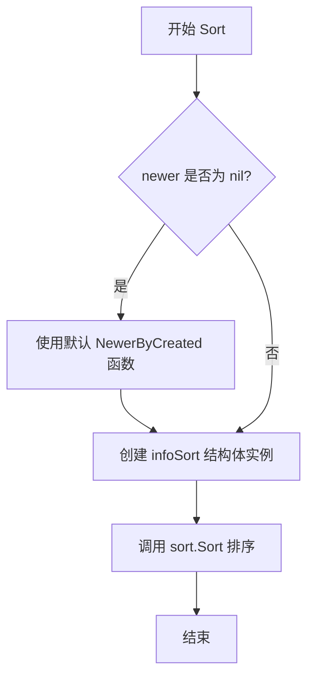

#### 带注释源码

```go
// Sort orders the given image infos according to `newer` func.
// Sort 对给定的镜像信息切片按照 newer 函数指定的规则进行排序。
// 如果 newer 为 nil，则默认使用 NewerByCreated 函数进行排序。
func Sort(infos []Info, newer func(a, b *Info) bool) {
	// 如果调用者未提供排序函数，则使用默认的 NewerByCreated
	// 该函数按镜像创建时间降序排列（新建的在前）
	if newer == nil {
		newer = NewerByCreated
	}
	// 使用 sort.Sort 接口进行排序，需要实现 sort.Interface 的三个方法：
	// Len()、Swap(i, j int)、Less(i, j int)
	// 这里通过 infoSort 结构体封装切片和比较函数
	sort.Sort(&infoSort{infos: infos, newer: newer})
}
```


### `Name.String`

该方法返回镜像名称的字符串表示形式，若 `Image` 字段为空则返回空字符串，否则根据是否存在 `Domain` 字段拼接完整的镜像名称（包含主机名和路径）。

参数：**无**（该方法仅使用接收者 `i`）

返回值：`string`，返回镜像名称字符串

#### 流程图

```mermaid
flowchart TD
    A[开始 String] --> B{i.Image == ""?}
    B -->|是| C[返回空字符串 ""]
    B -->|否| D{i.Domain != ""?}
    D -->|是| E[host = i.Domain + "/"]
    D -->|否| F[host = ""]
    E --> G[返回 fmt.Sprintf("%s%s", host, i.Image)]
    F --> G
    C --> H[结束]
    G --> H
```

#### 带注释源码

```go
// String 返回镜像名称的字符串表示形式
// 若 Image 字段为空则返回空字符串，否则拼接 Domain 和 Image 返回完整名称
func (i Name) String() string {
	// 如果镜像名称为空，直接返回空字符串
	// 因为没有镜像名称时返回任何内容都没有意义
	if i.Image == "" {
		return "" // Doesn't make sense to return anything if it doesn't even have an image
	}
	
	var host string
	// 如果存在域名/主机名，则添加 "/" 后缀用于拼接
	if i.Domain != "" {
		host = i.Domain + "/"
	}
	
	// 格式化为 "domain/image" 或 "image" 的形式
	return fmt.Sprintf("%s%s", host, i.Image)
}
```


### `Name.Repository()`

返回规范化的路径部分（Repository），用于处理 Docker 镜像名称的路径规范化逻辑。

参数：
- （无参数）

返回值：`string`，返回规范化后的镜像仓库路径

#### 流程图

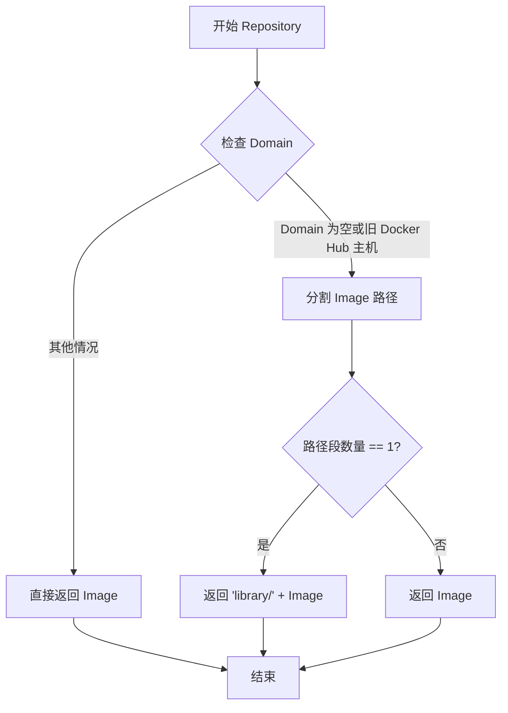

#### 带注释源码

```go
// Repository returns the canonicalised path part of an Name.
// 返回规范化的路径部分
// 根据 Domain 的不同情况处理：
// - 如果 Domain 为空或者是 Docker Hub 的主机名（""、"docker.io"、"index.docker.io"），
//   则需要处理 library 前缀的默认情况
// - 其他情况直接返回 Image
func (i Name) Repository() string {
    // 使用 switch 检查 Domain 字段
    switch i.Domain {
    // 对于 Docker Hub 的情况（包括空域名、旧的 docker.io 和新的 index.docker.io）
    case "", oldDockerHubHost, dockerHubHost:
        // 用 "/" 分割 Image 字段获取路径段
        path := strings.Split(i.Image, "/")
        // 如果只有一个段（即没有斜杠），说明是官方镜像，需要添加 "library/" 前缀
        // 例如："alpine" -> "library/alpine"
        if len(path) == 1 {
            return "library/" + i.Image
        }
        // 否则直接返回 Image（已经包含完整路径）
        return i.Image
    // 对于非 Docker Hub 的其他仓库（如 quay.io、localhost:5000 等）
    default:
        return i.Image
    }
}
```


### `Name.Registry`

返回 Docker 镜像仓库的域名，用于获取镜像或镜像元数据。如果域名为空或是旧的 Docker Hub 域名（docker.io），则返回标准的 Docker Hub 域名（index.docker.io）。

参数：

- （无参数，接受 `Name` 类型的接收者 `i`）

返回值：`string`，返回镜像仓库的域名。

#### 流程图

```mermaid
flowchart TD
    A[开始: 调用 Registry 方法] --> B{检查 i.Domain}
    B -->|i.Domain 为空字符串 ""| C[返回 dockerHubHost: index.docker.io]
    B -->|i.Domain 为 oldDockerHubHost "docker.io"| C
    B -->|i.Domain 为其他值| D[返回 i.Domain 本身]
    C --> E[结束]
    D --> E
```

#### 带注释源码

```go
// Registry returns the domain name of the Docker image registry, to
// use to fetch the image or image metadata.
func (i Name) Registry() string {
	// 使用 switch 语句根据 Name 结构体的 Domain 字段确定返回的注册服务器域名
	switch i.Domain {
	case "", oldDockerHubHost:
		// 如果 Domain 为空字符串或为旧的 Docker Hub 域名 "docker.io"，
		// 则返回标准的 Docker Hub 域名 "index.docker.io"
		return dockerHubHost
	default:
		// 对于其他自定义域名（如 quay.io、localhost:5000 等），
		// 直接返回用户指定的域名
		return i.Domain
	}
}
```


# 设计文档：Name.CanonicalName() 方法分析

## 一段话描述

`Name.CanonicalName()` 是 Go 语言中 `image` 包的核心方法，用于将未规范化的镜像名称（如 `alpine`、`docker.io/fluxcd/flux`）转换为完整规范的 CanonicalName 结构，自动填充默认的 Docker Hub 域名和 `library` 前缀，确保镜像引用的完全确定性。

---

## 文件整体运行流程

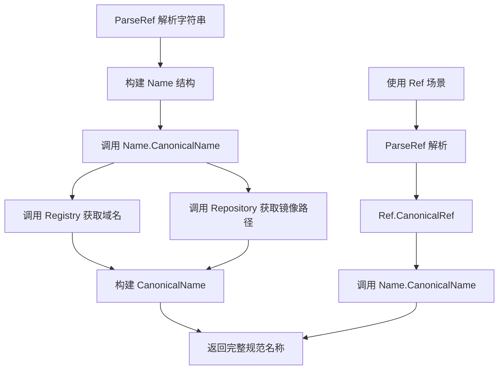

---

## 类详细信息

### 1. Name 类

**字段：**

| 名称 | 类型 | 描述 |
|------|------|------|
| Domain | string | 镜像仓库域名（如 docker.io、quay.io） |
| Image | string | 镜像路径/名称 |

**方法：**

| 方法名 | 功能 |
|--------|------|
| String() | 返回镜像名称的字符串表示 |
| Repository() | 返回规范化的仓库路径 |
| Registry() | 返回规范的注册表域名 |
| CanonicalName() | 返回规范的完整名称 |
| ToRef() | 转换为带标签的 Ref |

### 2. CanonicalName 类

**描述：** 规范化后的镜像名称，无任何隐含约定

**字段：** 内嵌 Name 结构体

### 3. Ref 类

**字段：**

| 名称 | 类型 | 描述 |
|------|------|------|
| Name | Name | 镜像名称 |
| Tag | string | 镜像标签 |
| SHA | string | 镜像 SHA256 摘要 |

---

## 全局变量和常量

| 名称 | 类型 | 描述 |
|------|------|------|
| dockerHubHost | const string | Docker Hub 主域名 "index.docker.io" |
| oldDockerHubHost | const string | Docker Hub 旧域名 "docker.io" |
| ErrInvalidImageID | error | 无效镜像 ID 错误 |
| ErrBlankImageID | error | 空镜像名称错误 |
| ErrMalformedImageID | error | 格式错误的镜像 ID 错误 |
| domainRegexp | *regexp.Regexp | 域名正则表达式 |

---

## Name.CanonicalName() 详细信息

### 描述

将 Name 结构体转换为 CanonicalName，自动调用 Registry() 和 Repository() 方法填充域名和镜像路径，处理 Docker Hub 默认域名和 library 前缀的隐含约定。

参数：此方法无显式参数，使用接收者绑定

返回值：`CanonicalName`，包含规范化的域名和镜像路径

#### 流程图

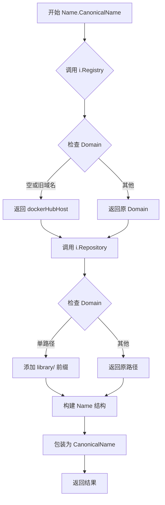

#### 带注释源码

```go
// CanonicalName returns the canonicalised registry host and image parts
// of the ID.
func (i Name) CanonicalName() CanonicalName {
    // 返回一个 CanonicalName 结构体
    return CanonicalName{
        Name: Name{
            // 调用 Registry() 获取规范化域名
            // 处理空域名和旧域名 docker.io 的情况
            // 默认返回 index.docker.io
            Domain: i.Registry(),
            
            // 调用 Repository() 获取规范化镜像路径
            // 处理单路径添加 library/ 前缀的情况
            // 如 alpine -> library/alpine
            Image:  i.Repository(),
        },
    }
}
```

---

## 关键组件信息

| 组件名称 | 描述 |
|----------|------|
| Name | 未规范化镜像名称结构体 |
| CanonicalName | 规范化镜像名称，无隐含约定 |
| Ref | 带标签/SHA 的镜像引用 |
| RepositoryMetadata | 镜像仓库元数据容器 |
| Labels | OCI 镜像标签结构体 |
| Info | 镜像元信息结构体 |

---

## 潜在技术债务或优化空间

1. **错误处理不足**：`ParseRef` 中对非法字符验证有限，可能接受某些边界情况
2. **正则表达式编译**：domainRegexp 在包级别编译，可考虑延迟初始化
3. **字符串拼接**：使用 fmt.Sprintf 可替换为 strings.Builder 优化性能
4. **时间解析**：仅支持 RFC3339 格式，缺乏灵活性
5. **缺少并发安全**：多线程场景下可能存在竞态条件（虽然当前场景无状态）

---

## 其它项目

### 设计目标与约束

- **约束**：严格遵循 Docker/OCI 镜像引用规范
- **目标**：消除所有隐含约定，提供确定性输出
- **兼容性**：支持 Docker Hub、Quay.io、自建仓库等多种 registry

### 错误处理与异常设计

- 使用 `pkg/errors` 实现错误链追踪
- 错误包含上下文信息（如原始输入字符串）
- 区分可恢复错误与致命错误

### 数据流与状态机

```
字符串输入 → ParseRef → Ref/Name → CanonicalName → 完整规范引用
                                      ↓
                              Registry/Repository
                                      ↓
                              规范化域名 + 规范化路径
```

### 外部依赖与接口契约

- **依赖**：`github.com/Masterminds/semver/v3` - 语义版本处理
- **依赖**：`github.com/pkg/errors` - 错误包装
- **依赖**：`encoding/json` - JSON 序列化/反序列化


### `Name.ToRef`

将无标签的镜像名称（Name）转换为带标签的镜像引用（Ref），通过将当前Name对象与指定的标签参数组合生成一个新的Ref结构体，实现镜像的版本化管理。

参数：
- `tag`：`string`，要附加的镜像标签（如 "latest"、"1.0.0" 等）

返回值：`Ref`，返回包含原始Name和指定Tag的镜像引用结构体

#### 流程图

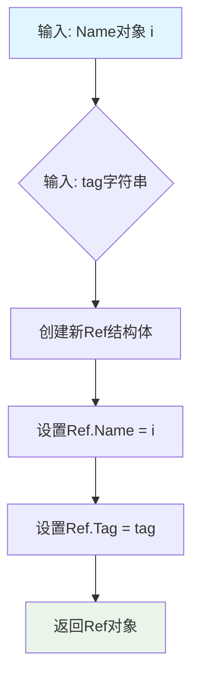

#### 带注释源码

```go
// ToRef 将无版本（无标签）的镜像名称转换为带标签的镜像引用
// 参数 tag: 镜像的标签，如 "latest"、"1.0.0"、"v2.1.3" 等
// 返回: 包含当前Name和指定Tag的Ref结构体
//
// 示例:
//   name := image.Name{Domain: "docker.io", Image: "library/alpine"}
//   ref := name.ToRef("3.14") // 返回 Ref{Name: name, Tag: "3.14"}
func (i Name) ToRef(tag string) Ref {
	return Ref{
		Name: i,       // 保留原始的Name（包含Domain和Image）
		Tag:  tag,     // 设置传入的tag标签
	}
}
```


### `Ref.String`

返回 Ref 结构体的字符串表示形式，不进行规范化处理。该方法根据 Ref 中是否包含 SHA256 摘要或标签，构造相应的字符串后缀并与 Name 部分拼接，形成完整的镜像引用字符串表示。

参数：无

返回值：`string`，返回镜像引用的字符串表示形式，格式为 `{domain/image}{:tag}` 或 `{domain/image}@sha256:{sha}`

#### 流程图

```mermaid
flowchart TD
    A[开始 String 方法] --> B{检查 SHA 是否为空?}
    B -->|是| C{检查 Tag 是否为空?}
    B -->|否| D[构建 suffix = '@sha256:' + SHA]
    D --> F[调用 i.Name.String 获取名称字符串]
    C -->|是| E[suffix = '']
    C -->|否| G[构建 suffix = ':' + Tag]
    E --> F
    G --> F
    F --> H[返回 fmt.Sprintf('%s%s', 名称字符串, suffix)]
    H --> I[结束]
```

#### 带注释源码

```go
// String returns the Ref as a string (i.e., unparsed) without canonicalising it.
// String 返回 Ref 的字符串表示（即未解析的），不进行规范化处理。
func (i Ref) String() string {
	// 初始化后缀为空字符串
	var suffix string
	// 如果 SHA 不为空，说明该引用使用的是摘要而非标签
	if i.SHA != "" {
		// 使用 SHA256 摘要格式作为后缀
		suffix = "@sha256:" + i.SHA
	} else if i.Tag != "" {
		// 没有 SHA 时，检查是否有标签，使用冒号分隔
		suffix = ":" + i.Tag
	}
	// 将名称部分（可能包含 domain）和后缀拼接返回
	// i.Name.String() 会返回类似 "domain/image" 的格式
	return fmt.Sprintf("%s%s", i.Name.String(), suffix)
}
```


### `Ref.CanonicalRef`

将包含可能含隐含字段（如默认域名或 library 前缀）的 `Ref` 转换为完整的、规范化后的 `CanonicalRef`，同时保留原始的 Tag 信息。

参数：

- （无显式参数，仅接收者 `i Ref`）

返回值：`CanonicalRef`，返回规范化后的镜像引用，包含完整的域名和仓库路径

#### 流程图

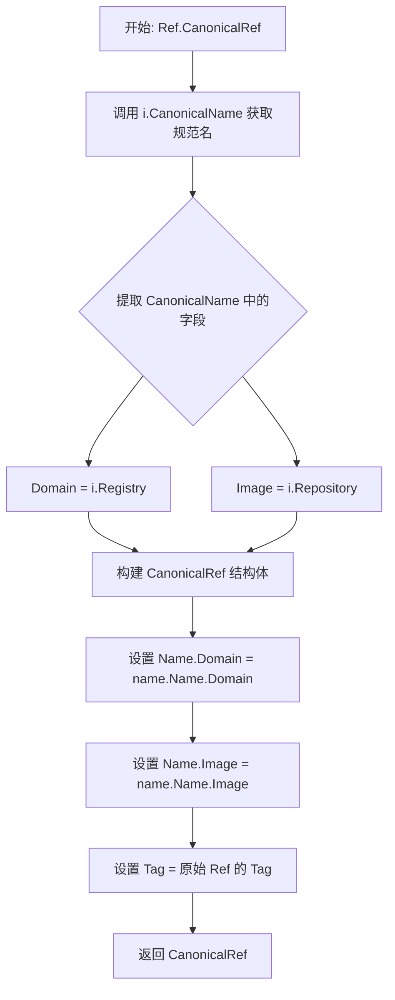

#### 带注释源码

```go
// CanonicalRef returns the canonicalised reference including the tag
// if present.
// 返回规范化后的引用，同时保留原始的 tag（如果存在）。
func (i Ref) CanonicalRef() CanonicalRef {
	// 步骤1: 调用 Name 类型的 CanonicalName() 方法
	// 该方法会将可能的隐含字段（如默认域名 "index.docker.io" 
	// 或缺失的 "library/" 前缀）补全为完整形式
	name := i.CanonicalName()
	
	// 步骤2: 构建并返回 CanonicalRef
	// - Name: 使用规范化后的 name.Name（即完整的 Domain + Image）
	// - Tag: 保留原始 Ref 中的 Tag（可能为空字符串）
	// - SHA: 不保留（SHA 通常在解析时用于定位具体镜像版本，
	//        而 CanonicalRef 主要用于展示/比较的规范化名称）
	return CanonicalRef{
		Ref: Ref{
			Name: name.Name,
			Tag:  i.Tag,
		},
	}
}
```

#### 关联类型信息

| 类型/方法 | 描述 |
|-----------|------|
| `Ref` | 带版本（Tag）的镜像引用，可包含 Domain、Image、Tag、SHA 字段 |
| `CanonicalRef` | 规范化后的镜像引用，无隐含字段 |
| `Name` | 不带版本（Tag）的镜像名称，可包含 Domain 和 Image |
| `CanonicalName` | 规范化后的镜像名称 |
| `Ref.CanonicalName()` | 调用 `Name.CanonicalName()` 获取规范化名称 |
| `Name.Registry()` | 返回完整域名：空域名或旧域名 `docker.io` → `index.docker.io` |
| `Name.Repository()` | 返回规范化的仓库路径：单路径 → 补全 `library/` 前缀 |

#### 设计意图

该方法的核心目标是将用户可能输入的"简写"形式（如 `alpine`、`docker.io/fluxcd/flux`）转换为符合 Docker 官方规范的完整形式（如 `index.docker.io/library/alpine`、`index.docker.io/fluxcd/flux`）。这在需要与外部系统（如容器注册表 API）交互时尤为重要，因为这些系统通常要求完整规范化的镜像名称。


### `Ref.Components`

该方法用于从 `Ref` 结构体中提取并返回镜像的域名、仓库名称和标签三个核心组件，以便于后续的镜像管理和信息获取。

参数：此方法为值接收者，不接受额外参数，使用 `i` 作为接收者本身。

返回值：
- `domain`：`string`，返回镜像的域名部分（如 `docker.io`、`localhost:5000` 等），如果为空则表示使用默认的 Docker Hub。
- `repo`：`string`，返回镜像的仓库路径部分（如 `library/alpine`、`fluxcd/flux` 等）。
- `tag`：`string`，返回镜像的标签部分（如 `latest`、`1.0.0` 等），可以为空字符串。

#### 流程图

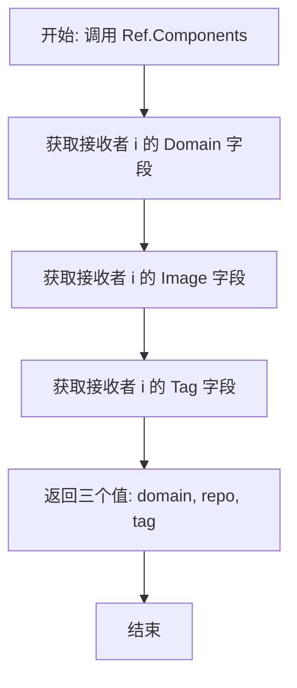

#### 带注释源码

```go
// Components returns the domain, repository, and tag components of the image reference.
// This method provides a convenient way to unpack the three main components of a Ref
// (which embeds the Name struct containing Domain and Image) along with the Tag field.
//
// Parameters:
//   - None (uses the receiver i)
//
// Returns:
//   - domain: The registry domain of the image (e.g., "docker.io", "localhost:5000")
//   - repo: The image repository path (e.g., "library/alpine", "fluxcd/flux")
//   - tag: The image tag (e.g., "latest", "1.0.0"), may be empty string
//
// Example:
//   ref, _ := image.ParseRef("docker.io/library/alpine:3.14")
//   domain, repo, tag := ref.Components()
//   // domain = "docker.io"
//   // repo = "library/alpine"
//   // tag = "3.14"
func (i Ref) Components() (domain, repo, tag string) {
    // 直接返回 Ref 结构体中的域名、镜像名（仓库）和标签
    // i.Domain 来自嵌入的 Name 结构体
    // i.Image 来自嵌入的 Name 结构体
    // i.Tag 是 Ref 自身的字段
    return i.Domain, i.Image, i.Tag
}
```


### `Ref.WithNewTag`

创建一个带新标签的图像引用副本，保留原引用的所有其他属性（域名、镜像名、SHA等），仅将标签替换为指定的新标签。

参数：

- `t`：`string`，要设置的新标签名称

返回值：`Ref`，返回一个新的图像引用对象，其所有字段与原引用相同，仅 `Tag` 字段被更新为指定的值

#### 流程图

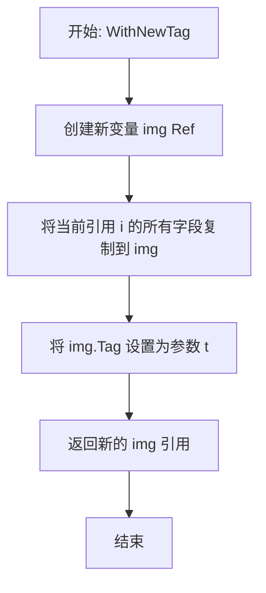

#### 带注释源码

```go
// WithNewTag makes a new copy of an ImageID with a new tag
// WithNewTag 创建一个带新标签的 ImageID 副本
func (i Ref) WithNewTag(t string) Ref {
    // 声明一个新的 Ref 变量 img
	var img Ref
    // 将当前引用 i 的所有字段（包括 Name、Tag、SHA）复制到 img
	img = i
    // 仅更新 Tag 字段为传入的新标签 t
	img.Tag = t
    // 返回带有新标签的图像引用副本
	return img
}
```


### `Ref.MarshalJSON`

将 `Ref` 结构体序列化为 JSON 格式。它通过调用 `Ref` 的 `String()` 方法获取标准的字符串表示（例如 `image:tag` 或 `image@sha256:...`），然后使用 `json.Marshal` 将其封装为 JSON 字符串，从而保证序列化的兼容性和一致性。

参数：

- （无显式参数，隐式接收者为 `i`，类型 `Ref`）

返回值：

- `[]byte`：JSON 格式的字节切片（例如 `"myimage:1.0"`）。
- `error`：在序列化过程中可能发生的错误（通常来自 `json.Marshal`）。

#### 流程图

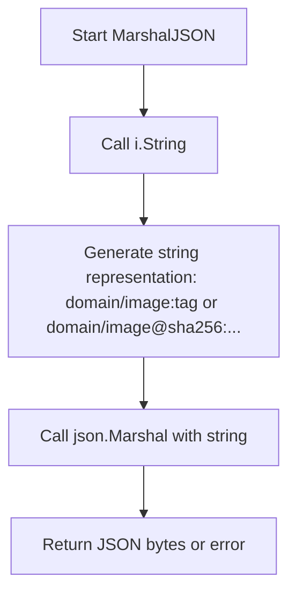

#### 带注释源码

```go
// ImageID is serialized/deserialized as a string
func (i Ref) MarshalJSON() ([]byte, error) {
	// 1. 将 Ref 结构体转换为其字符串表示形式
	//    格式取决于 Tag 和 SHA 字段是否存在：
	//    - 有 SHA: image@sha256:xxx
	//    - 有 Tag: image:tag
	//    - 仅 Name: image
	str := i.String()

	// 2. 使用标准库的 json.Marshal 将字符串序列化为 JSON
	//    结果将是一个被转义并包裹在引号中的字符串，如 "image:tag"
	return json.Marshal(str)
}
```


### `Ref.UnmarshalJSON`

实现 `json.Unmarshaler` 接口，将 JSON 字符串反序列化为 `Ref` 结构体。方法首先将 JSON 数据解析为字符串，然后调用 `ParseRef` 函数将字符串转换为 `Ref` 对象。

参数：

-  `data`：`[]byte`，要反序列化的 JSON 字节数据

返回值：`error`，如果在 JSON 解析或 Ref 解析过程中发生错误，则返回该错误；否则返回 nil

#### 流程图

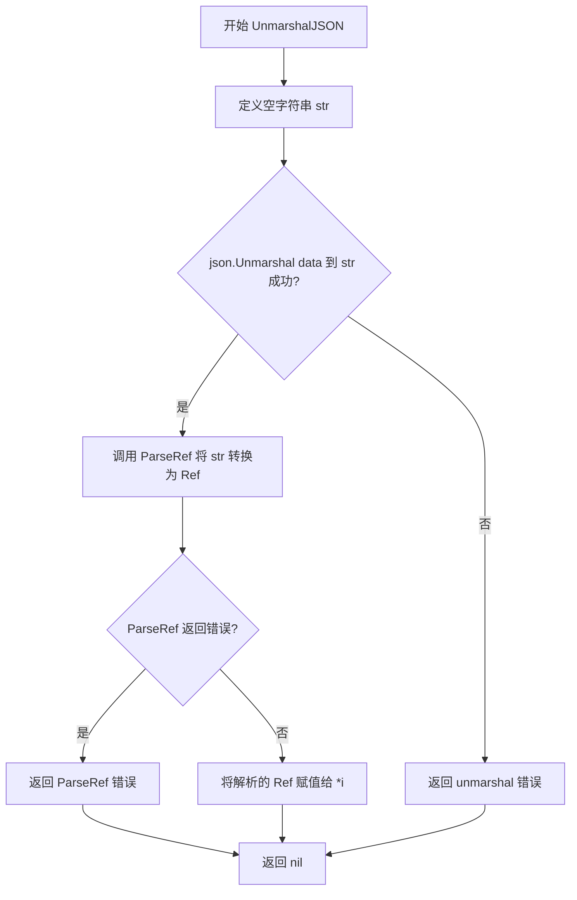

#### 带注释源码

```go
// UnmarshalJSON 实现 json.Unmarshaler 接口
// 将 JSON 格式的字符串反序列化为 Ref 结构体
func (i *Ref) UnmarshalJSON(data []byte) (err error) {
	// 1. 定义一个字符串变量用于接收 JSON 中的字符串值
	var str string
	
	// 2. 将 JSON 数据反序列化为字符串
	// 如果 JSON 数据不是字符串类型或格式错误，这里会返回错误
	if err := json.Unmarshal(data, &str); err != nil {
		return err
	}
	
	// 3. 使用 ParseRef 函数将字符串解析为 Ref 结构体
	// ParseRef 会解析域名、镜像名、标签和 SHA256 等部分
	*i, err = ParseRef(string(str))
	
	// 4. 返回解析过程中可能产生的错误
	// 如果解析成功，err 为 nil
	return err
}
```


### `Labels.MarshalJSON`

该方法实现 JSON 序列化接口，将 Labels 结构体转换为 JSON 格式的字节数组。当 BuildDate 或 Created 字段为零值时，使用 omitempty 标签在序列化时省略这些字段，从而避免 JavaScript 等客户端无法正确检测零值时间的问题。

参数：无

返回值：`([]byte, error)`，返回序列化后的 JSON 字节数组，如果序列化过程中发生错误则返回错误信息

#### 流程图

```mermaid
flowchart TD
    A[开始 MarshalJSON] --> B{BuildDate 是否为零值}
    B -->|是| C[bd 保持空字符串]
    B -->|否| D[bd = BuildDate.UTC().FormatRFC3339Nano]
    D --> E{Created 是否为零值}
    E -->|是| F[c 保持空字符串]
    E -->|否| G[c = Created.UTC().FormatRFC3339Nano]
    G --> H[创建临时结构体 encode]
    C --> H
    F --> H
    H --> I[json.Marshal(encode)]
    I --> J[返回 JSON 字节数组或错误]
```

#### 带注释源码

```go
// MarshalJSON returns the Labels value in JSON (as bytes). It is
// implemented so that we can omit the time values when they are
// zero, which would otherwise be tricky for e.g., JavaScript to
// detect.
func (l Labels) MarshalJSON() ([]byte, error) {
	// 初始化两个字符串变量用于存储时间字段的 JSON 表示
	var bd, c string
	
	// 如果 BuildDate 不为零值，则将其格式化为 RFC3339Nano 格式
	if !l.BuildDate.IsZero() {
		bd = l.BuildDate.UTC().Format(time.RFC3339Nano)
	}
	
	// 如果 Created 不为零值，则将其格式化为 RFC3339Nano 格式
	if !l.Created.IsZero() {
		c = l.Created.UTC().Format(time.RFC3339Nano)
	}
	
	// 创建临时结构体用于 JSON 编码，使用 omitempty 标签
	// 这样空字符串字段在序列化时会被省略
	encode := struct {
		BuildDate string `json:"org.label-schema.build-date,omitempty"`
		Created   string `json:"org.opencontainers.image.created,omitempty"`
	}{BuildDate: bd, Created: c}
	
	// 使用标准库 json.Marshal 进行序列化
	return json.Marshal(encode)
}
```


### `Labels.UnmarshalJSON`

该方法是 `Labels` 类型的自定义 JSON 反序列化实现，用于从 JSON 数据中解析镜像标签（如构建日期和创建时间），并在时间戳格式错误时收集并报告相关标签错误。

参数：

- `b`：`[]byte`，JSON 格式的字节切片，包含待反序列化的标签数据

返回值：`error`，如果反序列化成功返回 nil，如果发生解析错误或时间戳格式错误则返回相应的错误信息

#### 流程图

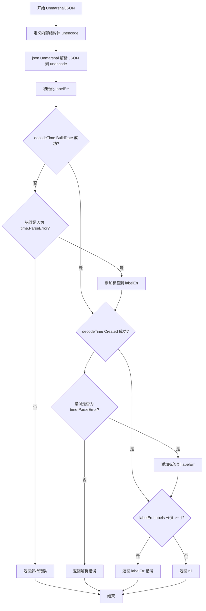

#### 带注释源码

```go
// UnmarshalJSON populates Labels from JSON (as bytes). It's the
// companion to MarshalJSON above.
func (l *Labels) UnmarshalJSON(b []byte) error {
	// 定义内部结构体用于临时存储 JSON 解析结果
	// 使用与 Labels 相同的 JSON 键名，但字段为字符串类型
	unencode := struct {
		BuildDate string `json:"org.label-schema.build-date,omitempty"`
		Created   string `json:"org.opencontainers.image.created,omitempty"`
	}{}
	
	// 将 JSON 字节数据解析到临时结构体中
	json.Unmarshal(b, &unencode)
	
	// 初始化标签错误收集器
	labelErr := LabelTimestampFormatError{}
	
	// 尝试解析 BuildDate 字段（Label Schema 构建日期）
	if err := decodeTime(unencode.BuildDate, &l.BuildDate); err != nil {
		// 如果错误不是时间解析错误，则直接返回该错误
		if _, ok := err.(*time.ParseError); !ok {
			return err
		}
		// 如果是时间解析错误，收集该标签名到错误中
		labelErr.Labels = append(labelErr.Labels, "org.label-schema.build-date")
	}
	
	// 尝试解析 Created 字段（Open Container Image 创建时间）
	if err := decodeTime(unencode.Created, &l.Created); err != nil {
		// 如果错误不是时间解析错误，则直接返回该错误
		if _, ok := err.(*time.ParseError); !ok {
			return err
		}
		// 如果是时间解析错误，收集该标签名到错误中
		labelErr.Labels = append(labelErr.Labels, "org.opencontainers.image.created")
	}
	
	// 如果有任何标签的时间解析失败，返回聚合的错误信息
	if len(labelErr.Labels) >= 1 {
		return &labelErr
	}
	
	// 反序列化成功
	return nil
}
```


### `Info.MarshalJSON`

将 `Info` 结构体序列化为 JSON 格式的字节数组，通过在零值时省略 `CreatedAt` 和 `LastFetched` 字段来避免 JavaScript 等语言无法区分零值和未设置的问题。

参数：

- （无参数，仅包含隐式接收者 `im Info`）

返回值：`([]byte, error)`，返回 JSON 序列化的字节数组，若序列化过程中出现错误则返回 error

#### 流程图

```mermaid
flowchart TD
    A[开始 MarshalJSON] --> B[创建 InfoAlias 类型别名]
    B --> C{im.CreatedAt 是否为零值?}
    C -->|是| D[ca 保持空字符串]
    C -->|否| E[ca = im.CreatedAt.UTC().Format time.RFC3339Nano]
    E --> F{im.LastFetched 是否为零值?}
    D --> F
    F -->|是| G[lf 保持空字符串]
    F -->|否| H[lf = im.LastFetched.UTC().Format time.RFC3339Nano]
    G --> I[创建 encode 结构体]
    H --> I
    I --> J[调用 json.Marshal 序列化 encode]
    J --> K{json.Marshal 是否出错?}
    K -->|是| L[返回 nil, err]
    K -->|否| M[返回序列化后的字节数组, nil]
    L --> N[结束]
    M --> N
```

#### 带注释源码

```go
// MarshalJSON 返回 Info 值的 JSON 形式（字节数组）。
// 实现此方法是为了在 CreatedAt 为零值时可以省略该字段，
// 否则 JavaScript 等语言将难以区分零值和未设置的情况。
func (im Info) MarshalJSON() ([]byte, error) {
	// 使用类型别名来规避现有的 MarshalJSON 实现，
	// 避免无限递归
	type InfoAlias Info

	// 初始化时间字符串为空
	var ca, lf string

	// 仅在 CreatedAt 不为零值时格式化
	if !im.CreatedAt.IsZero() {
		// 将时间转换为 UTC 并格式化为 RFC3339Nano 格式
		ca = im.CreatedAt.UTC().Format(time.RFC3339Nano)
	}

	// 仅在 LastFetched 不为零值时格式化
	if !im.LastFetched.IsZero() {
		// 将时间转换为 UTC 并格式化为 RFC3339Nano 格式
		lf = im.LastFetched.UTC().Format(time.RFC3339Nano)
	}

	// 构建编码结构体，使用 omitempty 标签在值为空时省略字段
	encode := struct {
		InfoAlias
		CreatedAt   string `json:",omitempty"`
		LastFetched string `json:",omitempty"`
	}{InfoAlias(im), ca, lf}

	// 调用标准库的 json.Marshal 进行序列化
	return json.Marshal(encode)
}
```


### `Info.UnmarshalJSON`

将JSON字节数据反序列化为`Info`结构体实例，是`MarshalJSON`的配套方法，用于处理`Info`类型从JSON格式的恢复。

参数：

- `b`：`[]byte`，JSON格式的字节切片，包含待反序列化的数据

返回值：`error`，如果反序列化过程中发生错误则返回错误，否则返回`nil`

#### 流程图

```mermaid
flowchart TD
    A[开始 UnmarshalJSON] --> B[定义 InfoAlias 类型别名]
    B --> C[定义 unencode 结构体]
    C --> D[将JSON数据反序列化到 unencode]
    D --> E{反序列化是否成功?}
    E -->|是| F[将 unencode.InfoAlias 转换为 Info 并赋值给 im]
    E -->|否| Z[返回错误]
    F --> G[调用 decodeTime 解析 CreatedAt]
    G --> H{CreatedAt 解析是否成功?}
    H -->|是| I[调用 decodeTime 解析 LastFetched]
    H -->|否| J[返回错误]
    I --> K{LastFetched 解析是否成功?}
    K -->|是| L[返回 nil]
    K -->|否| M[返回错误]
```

#### 带注释源码

```go
// UnmarshalJSON populates an Info from JSON (as bytes). It's the
// companion to MarshalJSON above.
// UnmarshalJSON 从JSON字节数据中填充Info结构体，是MarshalJSON的配套方法
func (im *Info) UnmarshalJSON(b []byte) error {
	// type InfoAlias Info
	// 使用类型别名来避免递归调用自身的MarshalJSON方法
	type InfoAlias Info
	
	// 定义临时结构体用于接收JSON数据
	// 包含InfoAlias嵌入字段以及可选的CreatedAt和LastFetched字符串字段
	unencode := struct {
		InfoAlias
		CreatedAt   string `json:",omitempty"`
		LastFetched string `json:",omitempty"`
	}{}
	
	// 将JSON字节数据反序列化到临时结构体中
	json.Unmarshal(b, &unencode)
	
	// 将反序列化得到的InfoAlias转换为Info类型并赋值给接收者
	// 注意：这里会丢失自定义的MarshalJSON/UnmarshalJSON方法
	*im = Info(unencode.InfoAlias)

	var err error
	
	// 解析CreatedAt时间字段，如果成功则继续解析LastFetched
	// decodeTime函数会将RFC3339格式的字符串转换为time.Time类型
	if err = decodeTime(unencode.CreatedAt, &im.CreatedAt); err == nil {
		err = decodeTime(unencode.LastFetched, &im.LastFetched)
	}
	
	// 返回可能发生的错误（如果CreatedAt或LastFetched解析失败）
	return err
}
```


### `RepositoryMetadata.FindImageWithRef`

根据给定的镜像引用（Ref）在镜像仓库元数据中查找对应的镜像信息。如果找到匹配的镜像，则返回该镜像的详细信息；如果未找到，则返回一个包含给定引用的 Info 对象。

参数：

- `ref`：`Ref`，要查找的镜像引用

返回值：`Info`，匹配的镜像信息；若未找到则返回包含给定引用的空 Info 对象

#### 流程图

```mermaid
flowchart TD
    A[开始 FindImageWithRef] --> B{遍历 rm.Images}
    B --> C{当前镜像的 ID == ref?}
    C -->|是| D[返回匹配的 img]
    C -->|否| E{还有更多镜像?}
    E -->|是| B
    E -->|否| F[返回 Info{ID: ref}]
    D --> G[结束]
    F --> G
```

#### 带注释源码

```go
// FindImageWithRef returns image.Info given an image ref. If the image cannot be
// found, it returns the image.Info with the ID provided.
func (rm RepositoryMetadata) FindImageWithRef(ref Ref) Info {
	// 遍历镜像仓库中的所有镜像元数据
	for _, img := range rm.Images {
		// 比较当前镜像的ID是否与给定的引用匹配
		if img.ID == ref {
			// 找到匹配项，返回该镜像的完整信息
			return img
		}
	}
	// 未找到匹配镜像，返回一个带有引用ID的默认Info对象
	return Info{ID: ref}
}
```


### `RepositoryMetadata.GetImageTagInfo`

获取所有镜像标签的详细信息。如果存在标签缺少对应的镜像元数据，则返回错误。

参数：

- （无参数，方法通过值接收者 `rm RepositoryMetadata` 访问结构体字段）

返回值：`([]Info, error)`，返回包含所有标签镜像信息的切片，如果任何标签缺少元数据则返回错误。

#### 流程图

```mermaid
flowchart TD
    A[开始 GetImageTagInfo] --> B[创建 result 切片, 长度等于 Tags 长度]
    B --> C{遍历 Tags 中的每个 tag}
    C -->|获取当前 tag| D[从 Images 映射中查找 tag 对应的 Info]
    D --> E{检查是否找到}
    E -->|未找到| F[返回 nil, 错误: missing metadata for image tag]
    E -->|找到| G[将 info 放入 result[i]]
    G --> C
    C -->|遍历完成| H[返回 result, nil]
    H --> I[结束]
```

#### 带注释源码

```go
// GetImageTagInfo gets the information of all image tags.
// If there are tags missing information, an error is returned
func (rm RepositoryMetadata) GetImageTagInfo() ([]Info, error) {
    // 创建一个与 Tags 长度相同的 Info 切片，用于存储结果
    result := make([]Info, len(rm.Tags), len(rm.Tags))
    
    // 遍历所有标签
    for i, tag := range rm.Tags {
        // 从 Images 映射中尝试获取该 tag 对应的镜像信息
        info, ok := rm.Images[tag]
        
        // 如果 Images 映射中不存在该 tag（即 tag 缺失元数据）
        if !ok {
            // 返回错误，包含缺失的 tag 名称
            return nil, fmt.Errorf("missing metadata for image tag %q", tag)
        }
        
        // 将获取到的镜像信息放入结果切片的对应位置
        result[i] = info
    }
    
    // 所有标签都成功获取到镜像信息，返回结果切片和 nil 错误
    return result, nil
}
```


### `LabelTimestampFormatError.Error`

该方法是 `LabelTimestampFormatError` 类型的错误接口实现，用于生成描述时间戳标签解析失败的错误消息。它将结构体中存储的标签列表格式化为人类可读的错误描述，包含解析失败的标签数量和具体标签名称。

参数： 无

返回值：`string`，返回格式化的错误描述字符串，包含无法解析为 RFC3339 格式的标签数量和标签名称列表。

#### 流程图

```mermaid
flowchart TD
    A[开始] --> B[获取 e.Labels 的长度]
    B --> C[使用 strings.Join 连接 e.Labels]
    C --> D[调用 fmt.Sprintf 格式化错误消息]
    D --> E[返回格式化后的字符串]
    E --> F[结束]
```

#### 带注释源码

```go
// Error 是 error 接口的实现方法
// 返回格式化的错误描述，包含解析失败的标签数量和标签名称
func (e *LabelTimestampFormatError) Error() string {
	// 使用 fmt.Sprintf 格式化错误消息
	// 参数1: 错误模板字符串
	// 参数2: 标签数量 len(e.Labels)
	// 参数3: 标签名称列表 strings.Join(e.Labels, ", ")
	return fmt.Sprintf(
		"failed to parse %d timestamp label(s) as RFC3339 (%s); ask the repository administrator to correct this as it conflicts with the spec",
		len(e.Labels),           // 获取失败标签的数量
		strings.Join(e.Labels, ", ")) // 将标签切片连接为逗号分隔的字符串
}
```


### `infoSort.Len`

返回切片 `infos` 的长度，实现了 `sort.Interface` 接口的 `Len()` 方法，用于排序操作时获取待排序元素的数量。

参数： 无（接收者 `s *infoSort` 作为隐式参数）

返回值：`int`，返回待排序切片 `infos` 的元素个数。

#### 流程图

```mermaid
flowchart TD
    A[开始 Len 方法] --> B{接收者 s 是否为空}
    B -- 是 --> C[返回 0]
    B -- 否 --> D[获取 s.infos 切片长度]
    D --> E[返回长度值]
```

#### 带注释源码

```go
// Len 返回待排序切片的长度，实现 sort.Interface 接口
// 这是 Go 标准库 sort 包要求的三个方法之一（Len, Less, Swap）
// 用于确定需要排序的元素总数
func (s *infoSort) Len() int {
    // 返回内部存储的 infos 切片的长度
    // 该切片包含了所有需要排序的 Image Info 对象
    return len(s.infos)
}
```


### `infoSort.Swap`

交换切片中索引 `i` 和 `j` 处的 `Info` 元素位置，实现 `sort.Interface` 接口的 `Swap` 方法，用于支持自定义排序算法。

参数：

- `i`：`int`，要交换的第一个元素的索引
- `j`：`int`，要交换的第二个元素的索引

返回值：无（`void`），该方法直接修改接收者 `infoSort` 结构体中的 `infos` 切片

#### 流程图

```mermaid
flowchart TD
    A[开始 Swap] --> B{验证索引}
    B -->|i == j| C[无需交换，直接返回]
    B -->|i != j| D[执行交换]
    D --> E[将 infos[i] 赋值给临时变量 temp]
    E --> F[将 infos[j] 赋值给 infos[i]]
    F --> G[将 temp 赋值给 infos[j]]
    C --> H[结束]
    G --> H
```

#### 带注释源码

```go
// Swap 交换切片中索引 i 和 j 处的元素位置
// 实现 sort.Interface 接口的 Swap 方法，使 infoSort 可用于 sort.Sort
// 参数:
//   - i int: 第一个元素的索引
//   - j int: 第二个元素的索引
func (s *infoSort) Swap(i, j int) {
	// 直接使用 Go 的多重赋值特性交换两个元素
	// 这比使用临时变量更简洁且性能相当
	s.infos[i], s.infos[j] = s.infos[j], s.infos[i]
}
```


### `infoSort.Less`

该函数是 Go 语言 `sort.Interface` 接口的实现方法，用于在排序过程中比较两个元素的相对顺序。它通过调用自定义的 `newer` 函数来确定索引 `i` 对应的镜像信息是否比索引 `j` 对应的更"新"，从而实现根据创建时间或语义版本等规则进行降序排序。

参数：

- `i`：`int`，要比较的第一个元素的索引（数组下标）
- `j`：`int`，要比较的第二个元素的索引（数组下标）

返回值：`bool`，如果索引 `i` 指向的镜像信息比索引 `j` 指向的更"新"，则返回 `true`；否则返回 `false`

#### 流程图

```mermaid
flowchart TD
    A[开始 Less 方法] --> B[获取索引 i 对应的 Info 指针: &s.infos[i]]
    B --> C[获取索引 j 对应的 Info 指针: &s.infos[j]]
    C --> D[调用 newer 函数比较两个 Info 指针]
    D --> E{比较结果}
    E -->|true| F[返回 true: i 应排在 j 前面]
    E -->|false| G[返回 false: i 应排在 j 后面]
    F --> H[结束]
    G --> H
```

#### 带注释源码

```go
// Less 方法实现了 sort.Interface 接口的 Less 方法
// 用于确定在排序后，索引 i 对应的元素是否应该位于索引 j 对应元素之前
// 参数 i 和 j 是要比较的两个元素在切片中的索引位置
func (s *infoSort) Less(i, j int) bool {
    // 调用结构体中存储的 newer 函数指针来比较两个镜像信息
    // newer 函数定义了"更新"的比较逻辑（如按创建时间或语义版本比较）
    // 将切片元素转换为指针传递，以符合 newer 函数的参数类型要求
    return s.newer(&s.infos[i], &s.infos[j])
}
```

## 关键组件


### 镜像引用解析与规范化

处理Docker镜像引用的解析、规范化、序列化和反序列化，支持域名、仓库路径、标签和SHA256摘要的处理。

### Name 结构体

表示未版本化的镜像名称（仓库），可能包含域名（如 quay.io、localhost:5000），自动处理 DockerHub 的 library 前缀推断。

### Ref 结构体

表示带版本（Tag）或 SHA256 摘要的镜像引用，包含 Name、Tag 和 SHA 字段，支持完整的镜像标识。

### CanonicalName 与 CanonicalRef

完全规范化的镜像名称和引用，确保所有字段（域名、仓库路径）都不再依赖约定推断，而是明确指定。

### 镜像引用解析 (ParseRef)

解析字符串形式的镜像引用为 Ref 结构体，支持多种格式（alpine:3.5、docker.io/fluxcd/flux:1.1.0、localhost:5000/repo@sha256:xxx），包含严格的前缀/后缀校验和域名识别。

### JSON 序列化/反序列化

为 Ref、Info、Labels 实现自定义 MarshalJSON 和 UnmarshalJSON，支持省略零值字段（如空时间、零时间），便于 JSON 交互。

### Labels 结构体

存储镜像的元数据标签（org.label-schema.build-date、org.opencontainers.image.created），支持 RFC3339 时间格式解析和错误收集。

### Info 结构体

存储从仓库获取的镜像元数据，包括引用、摘要、镜像ID、标签、创建时间和最后获取时间。

### RepositoryMetadata 结构体

存储镜像仓库的元数据，包含所有标签列表和按标签索引的镜像信息映射，支持查找和验证镜像标签信息。

### 镜像排序功能

提供 NewerByCreated（按创建时间降序）和 NewerBySemver（按语义版本降序）两种排序策略，支持自定义排序函数。

### 域名验证

使用正则表达式验证域名格式（localhost 或标准域名+可选端口），确保镜像引用中域名部分的合法性。


## 问题及建议


### 已知问题

- **ParseRef 函数逻辑重复**：先使用 `strings.Split` 分割 "/""，随后又对结果进行 "@sha256:" 和 ":" 的分割，导致多次字符串操作，可以合并为一次性解析以提高效率。
- **Ref.Components 方法返回值命名不一致**：方法签名声明返回 `domain, repo, tag`，但实际返回的是 `i.Domain, i.Image, i.Tag`，其中 "repo" 对应的是 "Image" 而非 "Repository()"，容易造成误解。
- **Info 结构体中字段命名混淆**：字段 `ImageID` 类型为 `Ref`，但名称暗示应为字符串类型，与注释中描述的 "Docker's image ID" 不符，容易产生歧义。
- **Labels 和 Info 的 UnmarshalJSON 未完全检查 json.Unmarshal 错误**：直接调用 `json.Unmarshal(b, &unencode)` 而未显式处理其返回值。
- **RepositoryMetadata.FindImageWithRef 效率较低**：遍历所有 Images 进行线性搜索，时间复杂度为 O(n)，对于大型仓库可能成为性能瓶颈。

### 优化建议

- **重构 ParseRef**：使用更高效的解析策略，如使用 strings.Index 定位分隔符位置，或采用有限状态机进行一次性解析。
- **修正 Ref.Components 方法命名**：将返回值名称改为 `domain, image, tag` 以保持与实际字段一致，或根据方法语义返回 `i.Repository()`。
- **重命名 Info.ImageID**：考虑更名为 `ImageRef` 或 `ID` 以更准确反映其类型，或添加注释说明其实际含义。
- **完善错误处理**：在 UnmarshalJSON 方法中添加 `json.Unmarshal` 的错误检查。
- **优化 FindImageWithRef**：若查询频繁，可考虑在 RepositoryMetadata 中维护反向索引，或接受排序后的 Images 切片以支持二分查找。
- **考虑接口抽象**：将 Labels 和 Info 中重复的 JSON 编解码模式提取为可复用的辅助函数或嵌入类型，减少代码冗余。

## 其它


### 1. 一段话描述

该代码是一个Docker镜像引用解析和处理库，提供了对镜像仓库名（Name）、镜像引用（Ref）以及镜像元数据（Info/Labels）的解析、规范化、序列化和比较功能，支持SemVer版本排序和时间戳处理。

### 2. 文件的整体运行流程

该代码主要处理Docker镜像引用的解析和元数据管理。整体流程为：用户传入镜像字符串（如"alpine:3.5"或"docker.io/fluxcd/flux:1.1.0"），ParseRef函数首先验证字符串格式，然后提取域名、镜像名、标签和SHA256哈希值，生成Ref对象；Ref对象可以进一步规范化为CanonicalRef；Info结构体存储从仓库获取的镜像元数据；最后提供Sort函数支持按创建时间或SemVer版本对镜像列表进行排序。

### 3. 类的详细信息

### 3.1 Name 类（结构体）

**字段：**

- Domain: string - 镜像仓库域名（如docker.io、quay.io、localhost:5000）
- Image: string - 镜像路径和名称

**方法：**

- String() string
  - 参数：无
  - 返回值类型：string
  - 返回值描述：返回镜像名称的字符串表示，包含域名（如果存在）
  - 功能：返回规范化后的镜像名称字符串

- Repository() string
  - 参数：无
  - 返回值类型：string
  - 返回值描述：返回规范化的仓库路径
  - 功能：返回规范化的仓库路径，对于DockerHub上的单路径镜像自动添加"library/"前缀

- Registry() string
  - 参数：无
  - 返回值类型：string
  - 返回值描述：返回完整的注册表主机域名
  - 功能：返回完整的注册表主机域名，对于空域名或旧域名返回默认的docker.io

- CanonicalName() CanonicalName
  - 参数：无
  - 返回值类型：CanonicalName
  - 返回值描述：返回完全规范化的镜像名
  - 功能：生成完全规范化的镜像名，包含完整的注册表域名和仓库路径

- ToRef(tag string) Ref
  - 参数名称：tag
  - 参数类型：string
  - 参数描述：镜像标签
  - 返回值类型：Ref
  - 返回值描述：返回带标签的镜像引用对象
  - 功能：将无版本镜像名转换为带标签的镜像引用

### 3.2 CanonicalName 类（结构体）

**字段：**

- Name: Name - 包含Domain和Image的Name结构体

### 3.3 Ref 类（结构体）

**字段：**

- Name: Name - 嵌入的Name结构体，包含Domain和Image
- Tag: string - 镜像标签（如latest、1.0.0）
- SHA: string - 镜像SHA256哈希值

**方法：**

- String() string
  - 参数：无
  - 返回值类型：string
  - 返回值描述：返回镜像引用的字符串表示
  - 功能：返回镜像引用的字符串表示，包含标签或SHA256（如果有）

- MarshalJSON() ([]byte, error)
  - 参数：无
  - 返回值类型：[]byte, error
  - 返回值描述：返回JSON格式的字节数组和可能的错误
  - 功能：实现JSON序列化，将Ref序列化为字符串

- UnmarshalJSON(data []byte) error
  - 参数名称：data
  - 参数类型：[]byte
  - 参数描述：JSON格式的字节数据
  - 返回值类型：error
  - 返回值描述：返回反序列化过程中的错误（如果有）
  - 功能：实现JSON反序列化，从字符串解析Ref

- CanonicalRef() CanonicalRef
  - 参数：无
  - 返回值类型：CanonicalRef
  - 返回值描述：返回完全规范化的镜像引用
  - 功能：返回完全规范化的镜像引用，包含规范化的域名和仓库路径

- Components() (domain, repo, tag string)
  - 参数：无
  - 返回值类型：string, string, string
  - 返回值描述：分别返回域名、镜像仓库名和标签
  - 功能：分解镜像引用为其组成部分

- WithNewTag(t string) Ref
  - 参数名称：t
  - 参数类型：string
  - 参数描述：新的镜像标签
  - 返回值类型：Ref
  - 返回值描述：返回带有新标签的镜像引用副本
  - 功能：创建带有新标签的镜像引用副本

### 3.4 CanonicalRef 类（结构体）

**字段：**

- Ref: Ref - 嵌入的Ref结构体

### 3.5 LabelTimestampFormatError 类（结构体）

**字段：**

- Labels: []string - 格式错误的时间戳标签列表

**方法：**

- Error() string
  - 参数：无
  - 返回值类型：string
  - 返回值描述：返回错误描述信息
  - 功能：返回格式错误的标签列表和RFC3339规范提示

### 3.6 Labels 类（结构体）

**字段：**

- BuildDate: time.Time - 构建日期（org.label-schema.build-date标签）
- Created: time.Time - 创建日期（org.opencontainers.image.created标签）

**方法：**

- MarshalJSON() ([]byte, error)
  - 参数：无
  - 返回值类型：[]byte, error
  - 返回值描述：返回JSON格式的字节数组和可能的错误
  - 功能：实现JSON序列化，时间为零值时省略该字段

- UnmarshalJSON(b []byte) error
  - 参数名称：b
  - 参数类型：[]byte
  - 参数描述：JSON格式的字节数据
  - 返回值类型：error
  - 返回值描述：返回反序列化过程中的错误（如果有）
  - 功能：实现JSON反序列化，解析RFC3339格式时间戳

### 3.7 Info 类（结构体）

**字段：**

- ID: Ref - 镜像引用
- Digest: string - 摘要
- ImageID: string - 镜像标识符
- Labels: Labels - 镜像标签
- CreatedAt: time.Time - 镜像创建时间
- LastFetched: time.Time - 最后获取时间

**方法：**

- MarshalJSON() ([]byte, error)
  - 参数：无
  - 返回值类型：[]byte, error
  - 返回值描述：返回JSON格式的字节数组和可能的错误
  - 功能：实现JSON序列化，时间为零值时使用别名避免递归

- UnmarshalJSON(b []byte) error
  - 参数名称：b
  - 参数类型：[]byte
  - 参数描述：JSON格式的字节数据
  - 返回值类型：error
  - 返回值描述：返回反序列化过程中的错误（如果有）
  - 功能：实现JSON反序列化，解析RFC3339格式时间戳

### 3.8 RepositoryMetadata 类（结构体）

**字段：**

- Tags: []string - 仓库中所有标签列表
- Images: map[string]Info - 按标签索引的镜像信息映射

**方法：**

- FindImageWithRef(ref Ref) Info
  - 参数名称：ref
  - 参数类型：Ref
  - 参数描述：镜像引用
  - 返回值类型：Info
  - 返回值描述：找到的镜像信息，未找到时返回包含给定引用的Info
  - 功能：根据镜像引用查找镜像信息

- GetImageTagInfo() ([]Info, error)
  - 参数：无
  - 返回值类型：[]Info, error
  - 返回值描述：返回所有标签对应的镜像信息列表，或返回缺失元数据的错误
  - 功能：获取所有镜像标签的详细信息

### 3.9 infoSort 类（结构体）

**字段：**

- infos: []Info - 待排序的镜像信息切片
- newer: func(a, b *Info) bool - 比较函数

**方法：**

- Len() int
  - 参数：无
  - 返回值类型：int
  - 返回值描述：返回切片长度
  - 功能：实现sort.Interface接口

- Swap(i, j int)
  - 参数名称：i, j
  - 参数类型：int
  - 参数描述：待交换的元素索引
  - 返回值类型：无
  - 返回值描述：无
  - 功能：交换两个元素

- Less(i, j int) bool
  - 参数名称：i, j
  - 参数类型：int
  - 参数描述：待比较的元素索引
  - 返回值类型：bool
  - 返回值描述：返回i是否应该在j之前
  - 功能：使用比较函数判断元素顺序

### 4. 全局变量和全局函数信息

### 4.1 全局常量

- dockerHubHost: string - Docker Hub官方主机名（index.docker.io）
- oldDockerHubHost: string - 旧Docker Hub主机名（docker.io）

### 4.2 全局错误变量

- ErrInvalidImageID: error - 无效镜像ID基础错误
- ErrBlankImageID: error - 空镜像名称错误
- ErrMalformedImageID: error - 格式错误的镜像ID错误

### 4.3 全局变量

- domainComponent: string - 域名组成部分的正则表达式
- domain: string - 完整域名正则表达式模板
- domainRegexp: *regexp.Regexp - 编译后的域名正则表达式

### 4.4 全局函数

- ParseRef(s string) (Ref, error)
  - 参数名称：s
  - 参数类型：string
  - 参数描述：镜像引用字符串
  - 返回值类型：Ref, error
  - 返回值描述：返回解析后的镜像引用或错误
  - 功能：解析镜像引用字符串，提取域名、镜像名、标签和SHA256

- decodeTime(s string, t *time.Time) error
  - 参数名称：s, t
  - 参数类型：string, *time.Time
  - 参数描述：时间字符串和目标时间指针
  - 返回值类型：error
  - 返回值描述：返回解析错误（如果有）
  - 功能：解析RFC3339格式时间字符串

- NewerByCreated(lhs, rhs *Info) bool
  - 参数名称：lhs, rhs
  - 参数类型：*Info, *Info
  - 参数描述：待比较的两个镜像信息
  - 返回值类型：bool
  - 返回值描述：lhs是否应该排在rhs之前（按创建时间降序）
  - 功能：按镜像创建时间排序，相同时按ID字符串排序

- NewerBySemver(lhs, rhs *Info) bool
  - 参数名称：lhs, rhs
  - 参数类型：*Info, *Info
  - 参数描述：待比较的两个镜像信息
  - 返回值类型：bool
  - 返回值描述：lhs是否应该排在rhs之前（按SemVer版本降序）
  - 功能：按SemVer版本排序，无效版本时回退到ID字符串比较

- Sort(infos []Info, newer func(a, b *Info) bool)
  - 参数名称：infos, newer
  - 参数类型：[]Info, func(a, b *Info) bool
  - 参数描述：待排序的镜像信息切片和比较函数
  - 返回值类型：无
  - 返回值描述：无
  - 功能：对镜像信息切片进行排序，默认按创建时间排序

### 5. 关键组件信息

- ParseRef: 镜像字符串解析核心函数，支持多种格式的镜像引用解析
- Ref: 镜像引用数据结构，包含名称、标签和SHA256
- Name: 镜像仓库名称数据结构，处理域名和镜像路径的规范化
- Info: 镜像元数据结构，存储从仓库获取的镜像详细信息
- Sort: 镜像排序功能，支持按创建时间和SemVer版本排序

### 6. 潜在的技术债务或优化空间

- 缺少对镜像引用的深度验证（如域名格式验证、标签字符验证等）
- ParseRef函数对多标签情况的处理不够完善（超过两个冒号直接返回错误）
- domainRegexp使用全局编译正则，可能导致测试困难和内存占用
- 错误处理可以更细化，不同类型的解析错误应有不同错误码
- 缺少对SHA256和Tag同时存在情况的处理逻辑验证
- RepositoryMetadata的FindImageWithRef使用线性搜索，效率可优化
- 缺少对镜像引用进行哈希和比较的优化实现

### 7. 其它项目

### 7.1 设计目标与约束

- 遵循Docker镜像引用规范（https://github.com/docker/distribution/blob/master/reference/reference.go）
- 支持Docker Hub默认域名省略和library前缀自动补充
- 保持与Open Container Image规范的时间标签兼容
- 支持SemVer版本比较以满足版本化镜像排序需求
- JSON序列化需处理零值时间以兼容JavaScript

### 7.2 错误处理与异常设计

- 使用pkg/errors包实现错误包装和堆栈追踪
- 预定义三种基础错误：无效ID、空名称、格式错误
- 标签时间戳解析错误汇总后统一返回，便于批量修复
- 解析错误包含原始输入字符串，便于问题定位
- JSON序列化/反序列化错误直接透传

### 7.3 数据流与状态机

- 输入字符串 -> ParseRef -> Ref对象 -> CanonicalRef规范化
- JSON字符串 -> UnmarshalJSON -> Ref/Info对象
- Ref/Info对象 -> MarshalJSON -> JSON字符串
- 镜像列表 -> Sort -> 有序镜像列表（按创建时间或SemVer）
- 仓库元数据 -> GetImageTagInfo -> 标签对应镜像信息列表

### 7.4 外部依赖与接口契约

- github.com/Masterminds/semver/v3: SemVer版本解析和比较
- github.com/pkg/errors: 错误包装和堆栈追踪
- 标准库encoding/json: JSON序列化
- 标准库time: 时间解析和格式化
- 标准库regexp: 域名验证正则表达式
- 公开接口：ParseRef、Sort、NewerByCreated、NewerBySemver、RepositoryMetadata方法
- 公开类型：Name、Ref、CanonicalName、CanonicalRef、Labels、Info、RepositoryMetadata

    