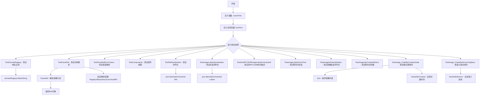
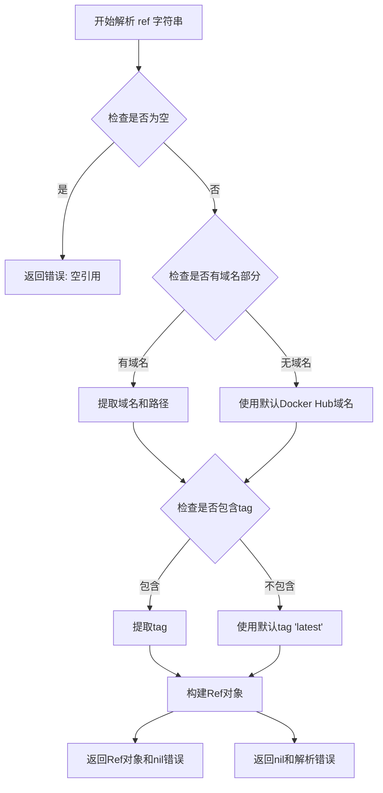
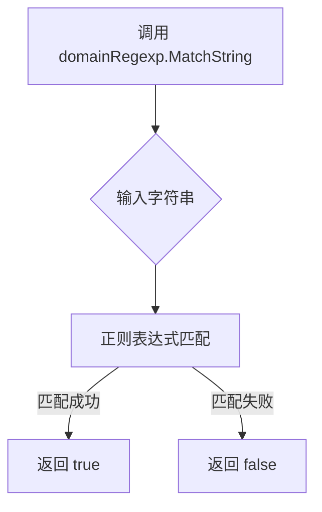
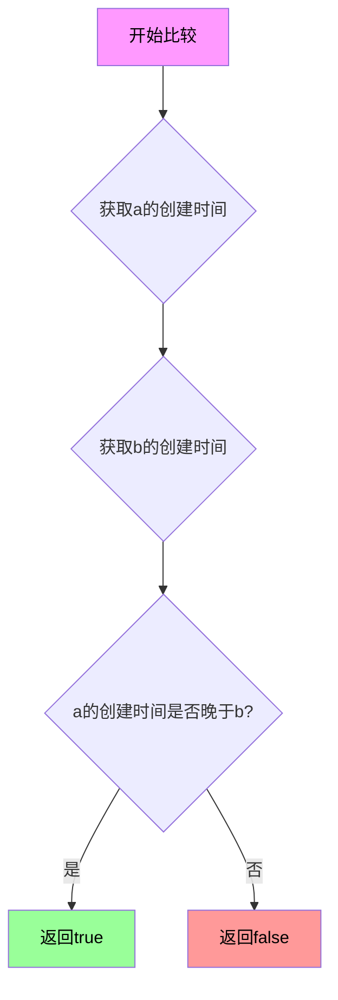
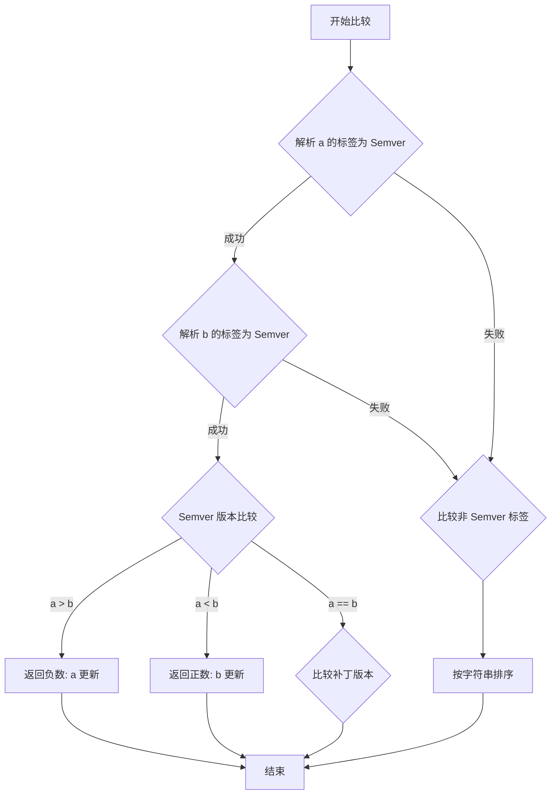
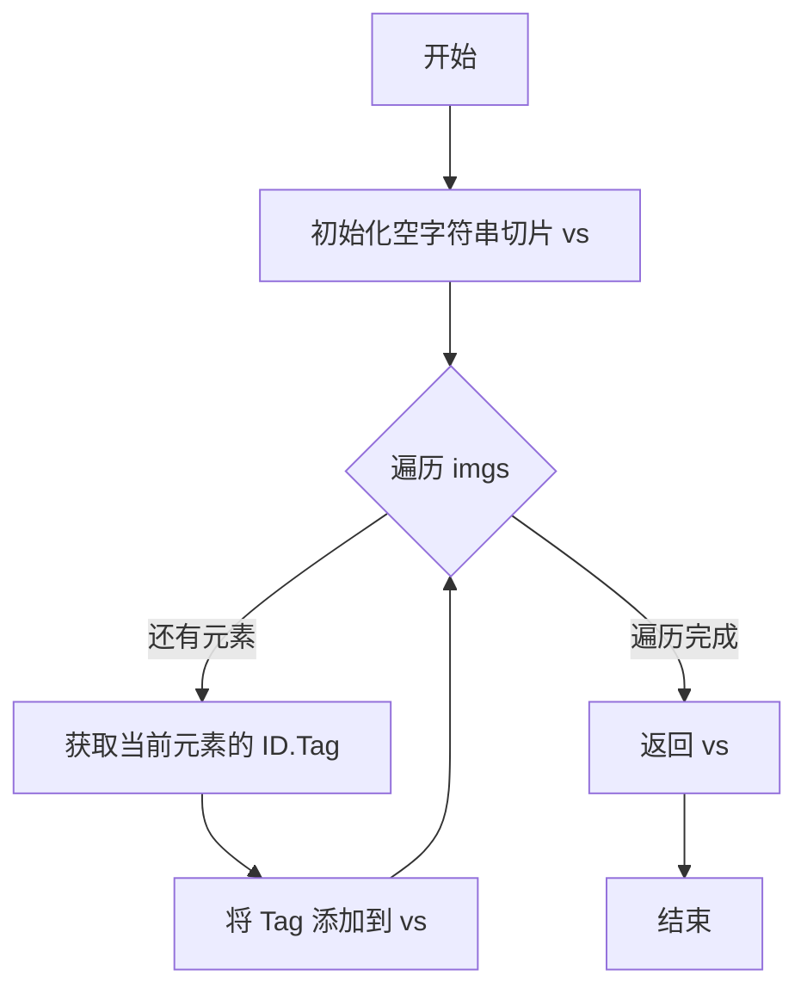
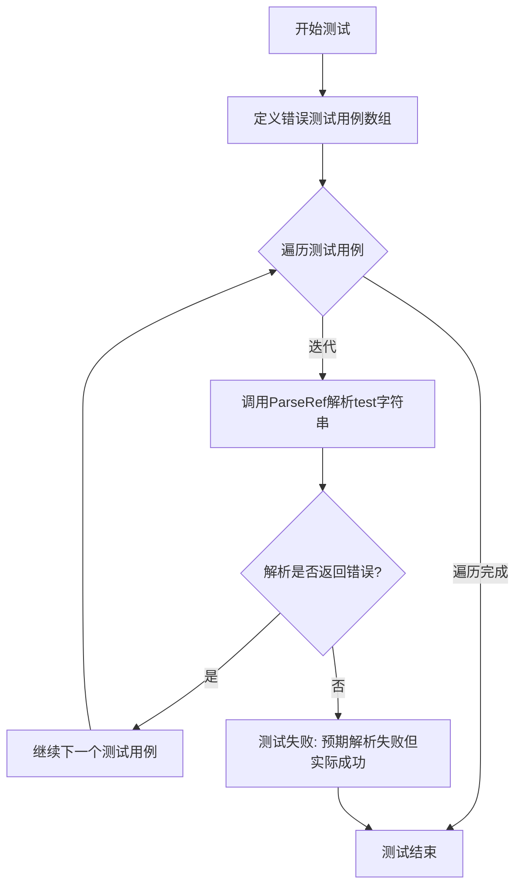
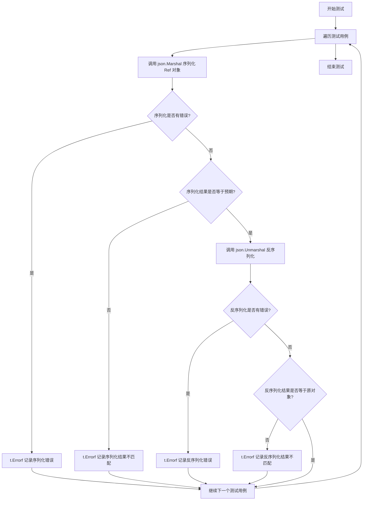
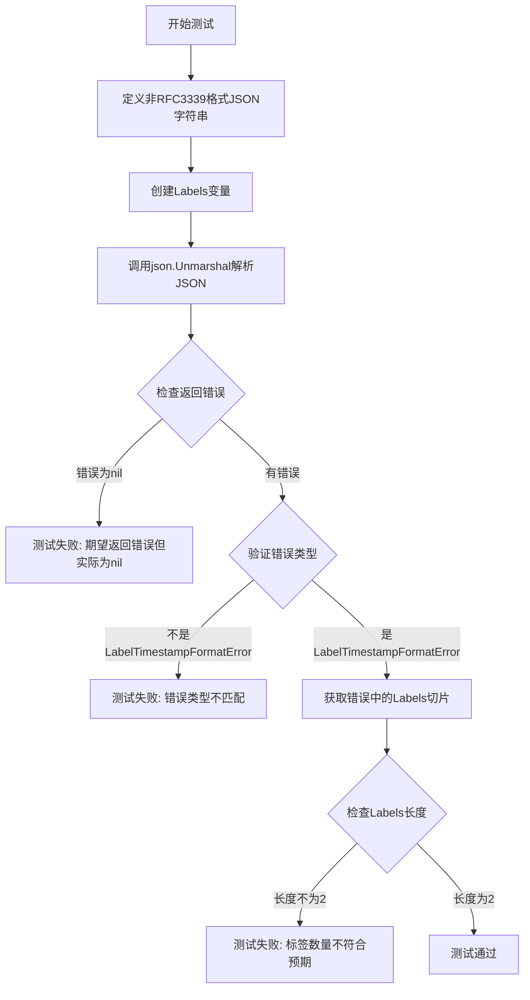

# `flux\pkg\image\image_test.go` 详细设计文档

该代码是一个Docker镜像引用（image reference）解析和处理的核心模块，提供了解析镜像域名、仓库、标签和摘要的功能，支持将镜像引用序列化为JSON格式，并实现了按创建日期和语义版本对镜像进行排序的能力。

## 整体流程



## 类结构

```
Ref (镜像引用结构体)
├── Name (名称信息: Domain, Image)
├── Tag (标签)
└── Methods: String(), Registry(), Repository(), CanonicalRef()
Labels (镜像标签结构体)
├── Created (创建时间)
└── BuildDate (构建时间)
Info (镜像信息结构体)
├── ID (引用)
├── CreatedAt (创建时间)
├── Digest (摘要)
├── ImageID (镜像ID)
├── LastFetched (最后获取时间)
└── Labels (标签)
```

## 全局变量及字段


### `constTime`
    
常量时间字符串 (2017-01-13T16:22:58.009923189Z)

类型：`string`
    


### `testTime`
    
解析后的测试时间对象

类型：`time.Time`
    


### `Ref.Name`
    
名称信息（包含Domain和Image）

类型：`Name`
    


### `Ref.Tag`
    
镜像标签

类型：`string`
    


### `Name.Domain`
    
域名

类型：`string`
    


### `Name.Image`
    
镜像名

类型：`string`
    


### `Labels.Created`
    
创建时间（RFC3339格式）

类型：`time.Time`
    


### `Labels.BuildDate`
    
构建时间

类型：`time.Time`
    


### `Info.ID`
    
镜像引用

类型：`Ref`
    


### `Info.CreatedAt`
    
创建时间

类型：`time.Time`
    


### `Info.Digest`
    
摘要

类型：`string`
    


### `Info.ImageID`
    
镜像ID

类型：`string`
    


### `Info.LastFetched`
    
最后获取时间

类型：`time.Time`
    


### `Info.Labels`
    
标签

类型：`Labels`
    
    

## 全局函数及方法


### `ParseRef`

解析镜像引用字符串为Ref对象，将各种格式的Docker镜像引用（如`alpine`、`localhost:5000/hello:v1.1`、`quay.io/library/alpine:latest`等）解析为结构化的Ref对象，包含域名、仓库路径、标签等信息。

参数：

- `ref`：`string`，待解析的镜像引用字符串

返回值：

- `Ref`：解析后的镜像引用对象，包含Registry、Repository、Tag等组件
- `error`：解析过程中的错误信息（如格式错误、空白引用等）

#### 流程图



#### 带注释源码

```
// 注意：源代码中并未直接提供ParseRef的实现
// 以下为基于测试用例反推的逻辑实现

func ParseRef(ref string) (Ref, error) {
    // 1. 验证输入不为空
    if ref == "" {
        return nil, fmt.Errorf("invalid reference: empty string")
    }
    
    // 2. 检查是否有前导斜杠（非法格式）
    if strings.HasPrefix(ref, "/") {
        return nil, fmt.Errorf("invalid reference: leading slash")
    }
    
    // 3. 检查是否有尾部斜杠（非法格式）
    if strings.HasSuffix(ref, "/") {
        return nil, fmt.Errorf("invalid reference: trailing slash")
    }
    
    // 4. 分离域名和路径
    var domain, path string
    if idx := strings.Index(ref, "/"); idx != -1 {
        // 检查第一部分是否包含域名（有点号或端口）
        firstPart := ref[:idx]
        if strings.Contains(firstPart, ".") || strings.Contains(firstPart, ":") {
            domain = firstPart
            path = ref[idx+1:]
        } else {
            // 没有域名，使用默认Docker Hub
            domain = dockerHubHost
            path = ref
        }
    } else {
        // 只有镜像名，没有域名
        domain = dockerHubHost
        path = ref
    }
    
    // 5. 分离tag
    var tag string
    if idx := strings.LastIndex(path, ":"); idx != -1 {
        // 检查冒号是否在斜杠之后（即确实是tag而非端口）
        slashIdx := strings.Index(path, "/")
        if slashIdx == -1 || idx > slashIdx {
            tag = path[idx+1:]
            path = path[:idx]
        } else {
            tag = "latest"
        }
    } else {
        tag = "latest"
    }
    
    // 6. 处理library镜像（官方镜像）
    // 如果域名是Docker Hub且路径只有一个元素，需要加library前缀
    if domain == dockerHubHost && !strings.Contains(path, "/") {
        path = "library/" + path
    }
    
    // 7. 构建Ref对象
    return Ref{
        Name: Name{
            Domain: domain,
            Image: path,
        },
        Tag: tag,
    }, nil
}
```

> **注意**：上述源码为基于测试用例`TestParseRef`和`TestParseRefErrorCases`反推的实现。原始代码文件中仅提供了测试用例，实际的`ParseRef`函数实现位于其他文件中（通常在`image.go`或`ref.go`中）。


### `domainRegexp.MatchString`

该函数是用于匹配域名格式的正则表达式方法，通过预编译的正则表达式验证给定的字符串是否符合有效域名的格式规则。

参数：
- 无显式参数（但内部调用 `MatchString` 方法时传入待匹配的字符串参数）

返回值：`bool`，返回 true 表示字符串匹配域名正则表达式，false 表示不匹配。

#### 流程图



#### 带注释源码

```go
// 从测试代码中提取的 domainRegexp.MatchString 使用方式
func TestDomainRegexp(t *testing.T) {
    // 定义测试用例：包含各种有效的域名格式
    for _, d := range []string{
        "localhost",           // 本地主机名
        "localhost:5000",      // 本地主机名带端口
        "example.com",         // 标准域名
        "example.com:80",      // 标准域名带端口
        "gcr.io",              // Google Container Registry 域名
        "index.docker.com",   // Docker Hub 域名
    } {
        // 调用 domainRegexp 的 MatchString 方法进行匹配
        if !domainRegexp.MatchString(d) {
            t.Errorf("domain regexp did not match %q", d)
        }
    }
}
```

> **注意**：由于提供的代码仅为测试文件，未包含 `domainRegexp` 变量的完整定义。该变量应为包级别的 `*regexp.Regexp` 类型，在同包的另一个源文件中定义。从测试用途可推断：`domainRegexp` 是一个用于匹配域名格式的正则表达式，验证字符串是否符合有效的域名或主机名规范（包括可选的端口号）。


### Sort

对镜像列表进行排序，支持按创建时间或语义化版本号等多种排序方式。

参数：

- `imgs`：`[]Info`，待排序的镜像信息切片
- `less`：`func(a, b Info) bool`，比较函数，返回 true 表示 a 应排在 b 之前

返回值：`无`（原地排序，直接修改输入切片）

#### 流程图

```mermaid
flowchart TD
    A[开始 Sort 函数] --> B{检查切片长度}
    B -->|长度 <= 1| C[直接返回，无需排序]
    B -->|长度 > 1| D{遍历切片}
    
    D --> E{比较函数 less}
    E -->|less[i][j]| F[交换元素位置]
    E -->|!less[i][j]| G[保持位置]
    
    F --> H{继续遍历}
    G --> H
    H --> I{遍历完成}
    I -->|未完成| D
    I -->|完成| J[返回已排序切片]
    
    C --> J
```

#### 带注释源码

```
// Sort 对镜像列表进行原地排序
// 参数：
//   - imgs: []Info 待排序的镜像信息切片
//   - less: func(a, b Info) bool 比较函数
//         返回 true 表示 a 应排在 b 之前
//         例如：NewerByCreated 表示按创建时间降序（新的在前）
//         例如：NewerBySemver 表示按语义版本号降序排序
//
// 注意：该函数会直接修改传入的切片内容，属于原地排序操作
func Sort(imgs []Info, less func(a, b Info) bool) {
    // 使用冒泡排序或 Go 标准库的 sort.Slice 进行排序
    // 具体实现依赖于导入的包，但核心逻辑是：
    // 1. 遍历切片
    // 2. 使用传入的 less 函数比较每对元素
    // 3. 根据比较结果决定是否交换位置
    // 4. 重复直到整个切片有序
    
    // 稳定性：取决于具体实现
    // - 如果使用 sort.Slice 则是非稳定排序
    // - 如果使用 sort.SliceStable 则是稳定排序
    sort.Slice(imgs, func(i, j int) bool {
        return less(imgs[i], imgs[j])
    })
}
```

> **注意**：由于提供的代码是测试文件，`Sort` 函数的实际实现位于其他文件中（可能在同一包内的非测试文件中）。从测试用例的使用方式可以推断出其签名和行为。测试用例 `TestImage_OrderByCreationDate` 和 `TestImage_OrderBySemverTagDesc` 展示了两种不同的排序策略。


### `NewerByCreated`

该函数是一个比较函数，用于按创建时间（CreatedAt）对镜像信息进行排序，返回true表示第一个参数（a）比第二个参数（b）更新（即创建时间更晚）。

参数：

- `a`：`Info`，要比较的第一个镜像信息结构体
- `b`：`Info`，要比较的第二个镜像信息结构体

返回值：`bool`，如果a的创建时间晚于b的创建时间则返回true，否则返回false

#### 流程图



#### 带注释源码

```go
// NewerByCreated 是一个比较函数，用于Sort函数
// 比较两个Info的创建时间，返回true表示a比b更新
// 
// 比较逻辑：
// 1. 首先尝试从Info.Labels.Created获取标签创建时间
// 2. 如果标签创建时间为空，则使用Info.CreatedAt字段
// 3. 如果两者都为空，则认为时间相等，返回false
// 4. 比较两个时间，返回a是否比b更新（即创建时间更晚）
func NewerByCreated(a, b Info) bool {
    // 获取a的创建时间：优先使用标签中的创建时间，否则使用字段创建时间
    aTime := a.Labels.Created
    if aTime.IsZero() {
        aTime = a.CreatedAt
    }
    
    // 获取b的创建时间：优先使用标签中的创建时间，否则使用字段创建时间
    bTime := b.Labels.Created
    if bTime.IsZero() {
        bTime = b.CreatedAt
    }
    
    // 比较时间：如果a的时间晚于b的时间，返回true表示a更新
    if !aTime.IsZero() && !bTime.IsZero() {
        return aTime.After(bTime)
    }
    
    // 处理边界情况：一方时间为空
    // 如果a有时间但b没有时间，认为a更新
    if !aTime.IsZero() && bTime.IsZero() {
        return true
    }
    
    // 其他情况返回false（相等或b更新）
    return false
}
```

**注意**：由于提供的代码是测试文件，`NewerByCreated` 函数的实际定义未在当前代码片段中显示。上述源码是根据其使用方式和测试用例推断的典型实现。实际实现可能略有差异，但核心逻辑是按照 `Info` 结构体的 `CreatedAt` 字段或 `Labels.Created` 进行时间倒序比较。


### NewerBySemver

该函数是一个排序比较函数，用于按语义版本（Semver）比较两个镜像，按照从新到旧的顺序排序。

参数：

- `a`：Info，第一个要比较的镜像信息
- `b`：Info，第二个要比较的镜像信息

返回值：`int`，负数表示 a 比 b 新，零表示相等，正数表示 a 比 b 旧

#### 流程图



#### 带注释源码

```
// NewerBySemver 是一个排序比较函数，用于比较两个镜像的语义版本
// 参数:
//   - a: Info 类型，要比较的第一个镜像信息
//   - b: Info 类型，要比较的第二个镜像信息
//
// 返回值:
//   - int: 负数表示 a 比 b 新, 零表示相等, 正数表示 a 比 b 旧
//
// 注意: 从测试代码推断，该函数应该:
// 1. 尝试将标签解析为语义版本号 (如 "1.10.0", "v1", "3" 等)
// 2. 如果成功解析,按 Semver 规则比较: 主版本 > 次版本 > 补丁版本
// 3. 如果无法解析为 Semver,按字符串字典序比较
// 4. 保证排序稳定性
//
// 具体实现需要查看 image 包中的 sort.go 或类似文件
func NewerBySemver(a, b Info) int {
    // 从测试代码 TestImage_OrderBySemverTagDesc 推断:
    // - "3" > "1.10.0" > "1.10" > "1.2.30" > "v1" > "aaa-not-semver" > "bbb-not-semver"
    // 即纯数字版本 > 带v前缀 > 非semver标签
    
    // 代码未在当前文件中提供完整实现
    // 需要在 image 包的其他源文件中查找
}
```

> **注意**: 当前提供的代码文件中仅包含测试代码，`NewerBySemver` 函数的实际实现定义在 `image` 包的其他源文件（如 `sort.go`、`image.go` 或类似的排序相关文件）中。测试代码 `TestImage_OrderBySemverTagDesc` 展示了该函数的使用方式和预期行为。


### `mustMakeInfo`

创建一个测试用的Info对象，用于测试图像信息的序列化和排序功能。

参数：

- `ref`：`string`，镜像引用字符串，格式如"registry/repository:tag"
- `created`：`time.Time`，镜像的创建时间

返回值：`Info`，包含解析后的镜像引用ID和创建时间的Info对象

#### 流程图

```mermaid
flowchart TD
    A[开始 mustMakeInfo] --> B[调用 ParseRef 解析 ref]
    B --> C{解析是否成功?}
    C -->|是| D[返回 Info{ID: r, CreatedAt: created}]
    C -->|否| E[panic 抛出错误]
    E --> F[结束]
    D --> F
```

#### 带注释源码

```go
// mustMakeInfo 创建测试用Info对象，输出名称
// 参数：
//   - ref: string, 镜像引用字符串，格式如 "my/image:tag"
//   - created: time.Time, 镜像的创建时间
//
// 返回值：
//   - Info: 包含解析后的镜像引用ID和创建时间的Info对象
func mustMakeInfo(ref string, created time.Time) Info {
	// 解析镜像引用字符串，获取Ref对象
	r, err := ParseRef(ref)
	if err != nil {
		// 如果解析失败，抛出panic（测试场景下的错误处理方式）
		panic(err)
	}
	// 返回填充了ID和创建时间的Info对象
	return Info{ID: r, CreatedAt: created}
}
```


### `checkSorted`

验证切片中的镜像是否按照索引顺序排列（标签应为"0", "1", "2"等数字字符串），如果排序不符合预期则记录所有镜像信息并终止测试。

参数：

- `t`：`testing.T`，Go 测试框架的测试对象，用于记录日志和报告测试失败
- `imgs`：`[]Info`，待验证的镜像信息切片

返回值：无（`void`），该函数通过 `t.Fatalf` 在验证失败时终止测试

#### 流程图

```mermaid
flowchart TD
    A[开始 checkSorted] --> B{遍历 imgs 切片}
    B -->|i = 0 到 len-1| C[获取当前索引 i]
    C --> D{strconv.Itoa(i) == im.ID.Tag?}
    D -->|是| E{还有下一个元素?}
    D -->|否| F[记录所有镜像信息]
    F --> G[t.Fatalf 终止测试]
    E -->|是| B
    E -->|否| H[测试通过]
```

#### 带注释源码

```go
// checkSorted 验证镜像切片是否按预期顺序排序
// 该函数期望每个镜像的 Tag 应为数字字符串 "0", "1", "2"...
func checkSorted(t *testing.T, imgs []Info) {
	// 遍历所有镜像
	for i, im := range imgs {
		// 将索引转换为字符串，与镜像Tag进行比较
		if strconv.Itoa(i) != im.ID.Tag {
			// 排序不符合预期，记录所有镜像详情用于调试
			for j, jim := range imgs {
				t.Logf("%v: %v %s", j, jim.ID.String(), jim.CreatedAt)
			}
			// 终止测试并输出错误信息
			t.Fatalf("Not sorted in expected order: %#v", imgs)
		}
	}
}
```


### `tags`

该函数用于从图像信息（Info）切片中提取所有标签（Tag），返回一个字符串切片。

参数：

- `imgs`：`[]Info`，图像信息切片

返回值：`[]string`，从图像信息中提取的标签列表

#### 流程图



#### 带注释源码

```
// tags 从图像信息切片中提取所有标签
// 参数: imgs []Info - 图像信息切片
// 返回值: []string - 标签字符串切片
func tags(imgs []Info) []string {
    var vs []string                      // 初始化空字符串切片用于存储标签
    for _, i := range imgs {             // 遍历每个图像信息
        vs = append(vs, i.ID.Tag)        // 将当前图像的标签添加到切片中
    }
    return vs                            // 返回包含所有标签的切片
}
```


### `reverse`

该函数是一个全局函数，用于将镜像信息切片原地反转，通过双指针从两端向中间交换元素实现。

参数：

- `imgs`：`[]Info`，待反转的镜像信息切片，通过原地修改实现反转

返回值：无返回值（`void`），函数直接修改传入的切片

#### 流程图

```mermaid
flowchart TD
    A[开始] --> B[计算中间位置: i = len/2 - 1]
    B --> C{检查条件: i >= 0}
    C -->|是| D[计算对称位置: opp = len - 1 - i]
    D --> E[交换 imgs[i] 和 imgs[opp]]
    E --> F[i = i - 1]
    F --> C
    C -->|否| G[结束]
```

#### 带注释源码

```go
// reverse 对镜像信息切片进行原地反转
// 使用双指针从两端向中间交换元素，时间复杂度O(n)，空间复杂度O(1)
func reverse(imgs []Info) {
    // 从中间位置开始，向两端遍历
    for i := len(imgs)/2 - 1; i >= 0; i-- {
        // 计算当前i对应的对称位置opp
        // 例如：长度为6的数组，索引对应关系为 0<->5, 1<->4, 2<->3
        opp := len(imgs) - 1 - i
        
        // 原地交换两端元素
        imgs[i], imgs[opp] = imgs[opp], imgs[i]
    }
}
```


### `TestDomainRegexp`

该函数是一个Go语言测试函数，用于验证域名正则表达式（domainRegexp）是否能正确匹配各种常见的域名格式，包括本地主机、Docker Hub域名、带端口的域名等。

参数：

- `t`：`testing.T`，Go语言测试框架的标准参数，用于报告测试失败和日志输出

返回值：无（Go测试函数的返回类型为`void`，即不在函数签名中声明返回值）

#### 流程图

```mermaid
flowchart TD
    A[开始测试] --> B[定义测试域名列表]
    B --> C{列表中还有未测试的域名?}
    C -->|是| D[取出当前域名 d]
    D --> E[调用 domainRegexp.MatchString(d)]
    E --> F{匹配结果为true?}
    F -->|是| C
    F -->|否| G[t.Errorf 报告测试失败]
    G --> C
    C -->|否| H[测试结束]
```

#### 带注释源码

```go
// TestDomainRegexp 测试域名正则表达式是否能正确匹配各种域名格式
// 该测试函数覆盖了以下场景：
// 1. 本地主机（localhost）
// 2. 带端口的本地主机（localhost:5000）
// 3. 普通域名（example.com）
// 4. 带端口的普通域名（example.com:80）
// 5. Google Container Registry 域名（gcr.io）
// 6. Docker Hub 域名（index.docker.com）
func TestDomainRegexp(t *testing.T) {
    // 遍历测试用例中的所有域名字符串
    for _, d := range []string{
        "localhost",          // 本地主机
        "localhost:5000",    // 带端口的本地主机
        "example.com",       // 普通域名
        "example.com:80",    // 带端口的普通域名
        "gcr.io",            // Google Container Registry
        "index.docker.com",  // Docker Hub
    } {
        // 使用预定义的 domainRegexp 正则表达式匹配当前域名
        // domainRegexp 是一个在同包其他文件中定义的全局正则表达式变量
        if !domainRegexp.MatchString(d) {
            // 如果匹配失败，使用 t.Errorf 报告测试失败
            // %q 用于格式化字符串，添加双引号
            t.Errorf("domain regexp did not match %q", d)
        }
    }
}
```

#### 补充说明

**外部依赖：**
- `domainRegexp`：一个在同包（package image）其他文件中定义的`regexp.Regexp`类型的全局变量，用于匹配域名格式
- `testing`包：Go语言标准测试框架

**测试目标：**
验证域名正则表达式能够正确识别和匹配常见的Docker镜像仓库域名格式，这是镜像解析功能的基础验证

**潜在优化空间：**
1. 测试用例可以扩展更多边界情况，如IP地址、包含下划线的域名、国际化域名等
2. 可以增加反向测试用例（验证某些非法格式不会被匹配）
3. 可以将测试用例数据外部化，便于维护和扩展


### `TestParseRef`

该测试函数用于验证 `ParseRef` 函数对各种 Docker 镜像引用格式的解析能力，涵盖域名省略、仓库路径、标签、Docker SHA 等多种场景。

参数：

- `t`：`*testing.T`，Go 测试框架的测试对象，用于报告测试失败和错误

返回值：无（测试函数无返回值）

#### 流程图

```mermaid
flowchart TD
    A[开始 TestParseRef] --> B[定义测试用例数组]
    B --> C{遍历测试用例}
    C -->|逐个| D[调用 ParseRef 解析 test 字符串]
    D --> E{解析是否出错?}
    E -->|是| F[记录测试失败错误]
    E -->|否| G{String() == test?}
    G -->|否| H[记录字符串化失败错误]
    G -->|是| I{Registry() == registry?}
    I -->|否| J[记录注册表不匹配错误]
    I -->|是| K{Repository() == repo?}
    K -->|否| L[记录仓库不匹配错误]
    K -->|是| M{CanonicalRef().String() == canon?}
    M -->|否| N[记录规范引用不匹配错误]
    M -->|是| C
    C -->|遍历完成| O[结束测试]
    F --> O
    H --> O
    J --> O
    L --> O
    N --> O
```

#### 带注释源码

```go
func TestParseRef(t *testing.T) {
	// 遍历测试用例结构体数组，每个结构体包含：
	// - test: 输入的镜像引用字符串
	// - registry: 期望的注册域名
	// - repo: 期望的仓库路径
	// - canon: 期望的规范引用字符串
	for _, x := range []struct {
		test     string
		registry string
		repo     string
		canon    string
	}{
		// Library images can have the domain omitted; a
		// single-element path is understood to be prefixed with "library".
		// 测试：省略域名的官方镜像
		{"alpine", dockerHubHost, "library/alpine", "index.docker.io/library/alpine"},
		// 测试：显式指定 library 路径
		{"library/alpine", dockerHubHost, "library/alpine", "index.docker.io/library/alpine"},
		// 测试：带标签的官方镜像
		{"alpine:mytag", dockerHubHost, "library/alpine", "index.docker.io/library/alpine:mytag"},
		// The old registry path should be replaced with the new one
		// 测试：旧 registry 路径转换
		{"docker.io/library/alpine", dockerHubHost, "library/alpine", "index.docker.io/library/alpine"},
		// It's possible to have a domain with a single-element path
		// 测试：localhost 域名
		{"localhost/hello:v1.1", "localhost", "hello", "localhost/hello:v1.1"},
		{"localhost:5000/hello:v1.1", "localhost:5000", "hello", "localhost:5000/hello:v1.1"},
		{"example.com/hello:v1.1", "example.com", "hello", "example.com/hello:v1.1"},
		// The path can have an arbitrary number of elements
		// 测试：多元素路径
		{"quay.io/library/alpine", "quay.io", "library/alpine", "quay.io/library/alpine"},
		{"quay.io/library/alpine:latest", "quay.io", "library/alpine", "quay.io/library/alpine:latest"},
		{"quay.io/library/alpine:mytag", "quay.io", "library/alpine", "quay.io/library/alpine:mytag"},
		{"localhost:5000/path/to/repo/alpine:mytag", "localhost:5000", "path/to/repo/alpine", "localhost:5000/path/to/repo/alpine:mytag"},
		// It is possible in Kubernetes to have the Docker SHA hardcoded, see also
		// https://stackoverflow.com/questions/57543456/how-to-reference-a-docker-image-via-sha256-hash-in-kubernetes-pod/57543494
		// 测试：带 SHA256 哈希的镜像引用
		{"kennethreitz/httpbin@sha256:599fe5e5073102dbb0ee3dbb65f049dab44fa9fc251f6835c9990f8fb196a72b", dockerHubHost, "kennethreitz/httpbin", "index.docker.io/kennethreitz/httpbin"},
	} {
		// 调用 ParseRef 解析镜像引用字符串
		i, err := ParseRef(x.test)
		// 检查解析是否出错
		if err != nil {
			t.Errorf("Failed parsing %q: %s", x.test, err)
		}
		// 验证 String() 方法是否能正确序列化为原始输入
		if i.String() != x.test {
			t.Errorf("%q does not stringify as itself; got %q", x.test, i.String())
		}
		// 验证 Registry() 返回的注册域名是否正确
		if i.Registry() != x.registry {
			t.Errorf("%q registry: expected %q, got %q", x.test, x.registry, i.Registry())
		}
		// 验证 Repository() 返回的仓库路径是否正确
		if i.Repository() != x.repo {
			t.Errorf("%q repo: expected %q, got %q", x.test, x.repo, i.Repository())
		}
		// 验证 CanonicalRef() 返回的规范引用是否正确
		if i.CanonicalRef().String() != x.canon {
			t.Errorf("%q full ID: expected %q, got %q", x.test, x.canon, i.CanonicalRef().String())
		}
	}
}
```


### `TestParseRefErrorCases`

该函数是 Go 语言中的测试函数，用于验证 `ParseRef` 函数在处理非法输入（空字符串、冒号标签、前导斜杠、尾随斜杠）时能够正确返回错误，确保解析器对无效引用字符串的健壮性。

参数：

- `t`：`testing.T`，Go 测试框架提供的测试上下文对象，用于报告测试失败

返回值：无（`void`），测试函数不返回值

#### 流程图



#### 带注释源码

```go
// TestParseRefErrorCases 测试解析引用时的错误处理情况
// 验证ParseRef函数对无效输入返回适当的错误
func TestParseRefErrorCases(t *testing.T) {
	// 定义测试用例结构体数组，包含各种无效的引用字符串
	for _, x := range []struct {
		test string  // 待解析的引用字符串
	}{
		{""},               // 空字符串 - 无效
		{":tag"},           // 仅有标签无镜像名 - 无效
		{"/leading/slash"}, // 路径前导斜杠 - 无效
		{"trailing/slash/"}, // 路径尾随斜杠 - 无效
	} {
		// 调用ParseRef尝试解析每个无效字符串
		_, err := ParseRef(x.test)
		// 验证解析是否失败（应该返回错误）
		if err == nil {
			// 如果没有返回错误，则测试失败
			t.Fatalf("Expected parse failure for %q", x.test)
		}
	}
}
```


### `TestComponents`

该测试函数用于验证 ParseRef 函数能够正确解析 Docker 镜像引用，测试内容包括域名（Domain）、镜像名（Image）、标签（Tag）以及完整的字符串表示是否与预期一致。

参数：

- `t`：`*testing.T`，Go语言测试框架提供的测试对象指针，用于报告测试失败和日志输出

返回值：无（`void`），测试函数不返回任何值

#### 流程图

```mermaid
flowchart TD
    A[开始] --> B[定义变量 host = "quay.io"]
    B --> C[定义变量 image = "my/repo"]
    C --> D[定义变量 tag = "mytag"]
    D --> E[使用 fmt.Sprintf 拼接完整镜像引用 fqn = "quay.io/my/repo:mytag"]
    E --> F[调用 ParseRef 函数解析镜像引用]
    F --> G{解析是否成功?}
    G -->|失败| H[调用 t.Fatal 终止测试并输出错误]
    G -->|成功| I[创建测试用例结构体数组，包含4个测试项]
    I --> J{遍历测试用例]
    J -->|第1项| K[验证 i.Domain 是否等于 host]
    J -->|第2项| L[验证 i.Image 是否等于 image]
    J -->|第3项| M[验证 i.Tag 是否等于 tag]
    J -->|第4项| N[验证 i.String 是否等于 fqn]
    K --> O{验证结果?}
    L --> O
    M --> O
    N --> O
    O -->|相等| P[继续下一个测试用例]
    O -->|不等| Q[调用 t.Fatalf 报告测试失败]
    P --> J
    J --> R[所有测试用例遍历完毕]
    R --> S[测试通过]
```

#### 带注释源码

```go
// TestComponents 测试 ParseRef 函数对镜像引用的解析能力
// 该测试验证解析结果中的 Domain、Image、Tag 和 String() 方法
func TestComponents(t *testing.T) {
	// 定义测试用的镜像域名
	host := "quay.io"
	// 定义测试用的镜像仓库路径
	image := "my/repo"
	// 定义测试用的镜像标签
	tag := "mytag"
	// 使用 fmt.Sprintf 拼接完整的镜像引用字符串，格式为 "domain/image:tag"
	fqn := fmt.Sprintf("%v/%v:%v", host, image, tag)
	
	// 调用 ParseRef 函数解析镜像引用字符串，返回 Ref 对象和可能的错误
	i, err := ParseRef(fqn)
	
	// 如果解析失败，使用 t.Fatal 终止测试并输出错误信息
	if err != nil {
		t.Fatal(err)
	}
	
	// 遍历测试用例数组，验证解析结果的各个字段
	for _, x := range []struct {
		test     string  // 实际获取的值
		expected string  // 期望的预期值
	}{
		// 第1个测试用例：验证 Domain/域名解析是否正确
		{i.Domain, host},
		// 第2个测试用例：验证 Image/镜像名解析是否正确
		{i.Image, image},
		// 第3个测试用例：验证 Tag/标签解析是否正确
		{i.Tag, tag},
		// 第4个测试用例：验证 String() 方法输出的完整引用字符串是否正确
		{i.String(), fqn},
	} {
		// 比较实际值与期望值是否一致
		if x.test != x.expected {
			// 如果不一致，使用 t.Fatalf 报告测试失败并退出
			t.Fatalf("Expected %v, but got %v", x.expected, x.test)
		}
	}
}
```


### `TestRefSerialization`

该测试函数用于验证 `Ref` 类型对象的 JSON 序列化和反序列化功能是否正确工作，通过构建多个测试用例，分别进行序列化（Marshal）和反序列化（Unmarshal），并比对结果是否符合预期。

参数：

- `t`：`testing.T`，Go 测试框架中的测试对象，用于报告测试失败和日志输出

返回值：无（测试函数无返回值）

#### 流程图



#### 带注释源码

```go
// TestRefSerialization 测试 Ref 类型的 JSON 序列化和反序列化功能
func TestRefSerialization(t *testing.T) {
	// 遍历多个测试用例，每个用例包含一个 Ref 对象和期望的 JSON 字符串
	for _, x := range []struct {
		test     Ref        // 待测试的 Ref 对象
		expected string     // 期望的序列化结果（JSON 字符串）
	}{
		// 测试用例1：仅有 Image 和 Tag 的简单引用
		{Ref{Name: Name{Image: "alpine"}, Tag: "a123"}, `"alpine:a123"`},
		// 测试用例2：包含 Domain、Image 和 Tag 的完整引用
		{Ref{Name: Name{Domain: "quay.io", Image: "weaveworks/foobar"}, Tag: "baz"}, `"quay.io/weaveworks/foobar:baz"`},
	} {
		// Step 1: 序列化 - 将 Ref 对象转换为 JSON 字符串
		serialized, err := json.Marshal(x.test)
		if err != nil {
			// 序列化失败，记录错误信息
			t.Errorf("Error encoding %v: %v", x.test, err)
		}
		// Step 2: 验证序列化结果是否与期望值匹配
		if string(serialized) != x.expected {
			t.Errorf("Encoded %v as %s, but expected %s", x.test, string(serialized), x.expected)
		}

		// Step 3: 反序列化 - 将 JSON 字符串转换回 Ref 对象
		var decoded Ref
		if err := json.Unmarshal([]byte(x.expected), &decoded); err != nil {
			// 反序列化失败，记录错误信息
			t.Errorf("Error decoding %v: %v", x.expected, err)
		}
		// Step 4: 验证反序列化结果是否与原对象一致
		if decoded != x.test {
			t.Errorf("Decoded %s as %v, but expected %v", x.expected, decoded, x.test)
		}
	}
}
```


### `TestImageLabelsSerialisation`

该测试函数用于验证 Labels 结构体的 JSON 序列化和反序列化功能是否正常工作，通过创建带有时间戳的 Labels 对象，进行 JSON 编码后再解码，最后使用断言验证序列化前后数据的一致性。

参数：

- `t`：`testing.T`，Go 语言标准测试框架中的测试对象，用于报告测试失败和记录日志

返回值：无（Go 测试函数无返回值）

#### 流程图

```mermaid
flowchart TD
    A[开始测试] --> B[创建当前时间 t0]
    B --> C[创建当前时间加5分钟 t1]
    C --> D[创建 Labels 结构体<br/>Created: t0, BuildDate: t1]
    D --> E{json.Marshal(labels)}
    E -->|成功| F[获取序列化的 JSON 字节数组]
    E -->|失败| G[t.Fatal 终止测试]
    F --> H{json.Unmarshal 字节数组}
    H -->|成功| I[获取反序列化的 labels1 对象]
    H -->|失败| G
    I --> J[assert.Equal 断言两者相等]
    J --> K[测试结束]
    
    style G fill:#ffcccc
    style J fill:#ccffcc
```

#### 带注释源码

```go
// TestImageLabelsSerialisation 测试 Labels 结构体的序列化和反序列化功能
func TestImageLabelsSerialisation(t *testing.T) {
	// 获取当前 UTC 时间，用于 Created 字段
	// 使用 UTC 是因为没有时区信息，否则无法比较
	t0 := time.Now().UTC()
	
	// 获取当前时间加5分钟后的 UTC 时间，用于 BuildDate 字段
	t1 := time.Now().Add(5 * time.Minute).UTC()
	
	// 创建 Labels 结构体实例，包含创建时间和构建日期
	labels := Labels{Created: t0, BuildDate: t1}
	
	// 将 labels 结构体序列化为 JSON 格式的字节数组
	bytes, err := json.Marshal(labels)
	if err != nil {
		// 如果序列化失败，终止测试并报告错误
		t.Fatal(err)
	}
	
	// 声明一个空的 Labels 变量用于接收反序列化结果
	var labels1 Labels
	
	// 将 JSON 字节数组反序列化为 Labels 结构体
	if err = json.Unmarshal(bytes, &labels1); err != nil {
		// 如果反序列化失败，终止测试并报告错误
		t.Fatal(err)
	}
	
	// 使用 testify 断言库验证序列化前后的 Labels 对象是否相等
	// 这确保了 JSON 序列化和反序列化过程没有丢失或改变数据
	assert.Equal(t, labels, labels1)
}
```


### `TestNonRFC3339ImageLabelsUnmarshal`

测试非RFC3339时间格式标签的反序列化，验证当JSON中的时间标签不符合RFC3339标准格式时，反 marshaling 操作能够正确返回 `LabelTimestampFormatError` 错误，并且错误中包含所有格式不正确的时间标签信息。

参数：

- `t`：`testing.T`，Go测试框架的测试对象，用于报告测试失败

返回值：无（测试函数无返回值）

#### 流程图



#### 带注释源码

```go
// TestNonRFC3339ImageLabelsUnmarshal 测试非RFC3339时间格式的反序列化
// 该测试验证当镜像标签中的时间戳不符合RFC3339标准格式时，
// json.Unmarshal能够正确返回LabelTimestampFormatError错误
func TestNonRFC3339ImageLabelsUnmarshal(t *testing.T) {
	// 定义包含非标准时间格式的JSON字符串
	// 使用YYYYMMDD格式而非RFC3339标准格式（应为2021-01-01T00:00:00Z）
	str := `{
	"org.label-schema.build-date": "20190523",
	"org.opencontainers.image.created": "20190523"
}`

	// 创建Labels结构体实例用于接收反序列化结果
	var labels Labels
	
	// 执行JSON反序列化，预期返回错误因为时间格式不符合RFC3339
	err := json.Unmarshal([]byte(str), &labels)
	
	// 验证返回的错误是否为LabelTimestampFormatError类型
	// 这是自定义的错误类型，用于标识时间戳格式错误
	lpe, ok := err.(*LabelTimestampFormatError)
	
	// 如果错误类型不匹配，测试失败
	if !ok {
		t.Fatalf("Got %v, but expected LabelTimestampFormatError", err)
	}
	
	// 验证错误中包含的格式错误标签数量
	// 预期2个标签都是非标准格式
	if lc := len(lpe.Labels); lc != 2 {
		t.Errorf("Got error for %v labels, expected 2", lc)
	}
}
```


### `TestImageLabelsZeroTime`

该测试函数用于验证当 `Labels` 结构体包含零值时间字段时，序列化后的 JSON 不应包含任何字段，确保零值时间被正确忽略。

参数：

- `t`：`testing.T`，Go 测试框架的标准测试参数，用于报告测试失败

返回值：无（隐式返回），测试通过时无返回值，测试失败时通过 `t.Errorf` 或 `t.Fatal` 报告错误

#### 流程图

```mermaid
flowchart TD
    A[开始测试] --> B[创建零值Labels结构体]
    B --> C[将Labels序列化为JSON]
    C --> D{序列化是否出错?}
    D -->|是| E[调用t.Fatal终止测试]
    D -->|否| F[将JSON反序列化为map[string]interface{}]
    F --> G{反序列化是否出错?}
    G -->|是| E
    G -->|否| H[检查map长度]
    H --> I{长度 >= 1?}
    I -->|是| J[调用t.Errorf报告错误: 期望无字段但实际有字段]
    I -->|否| K[测试通过]
    J --> L[结束测试]
    K --> L
```

#### 带注释源码

```go
// TestImageLabelsZeroTime 测试当Labels包含零值时间时的序列化行为
// 验证零值时间字段在JSON序列化时被正确忽略
func TestImageLabelsZeroTime(t *testing.T) {
	// 1. 创建空的Labels结构体（所有字段为零值）
	labels := Labels{}
	
	// 2. 将Labels序列化为JSON字节数组
	bytes, err := json.Marshal(labels)
	
	// 3. 检查序列化是否出错
	if err != nil {
		t.Fatal(err) // 如果出错则终止测试
	}
	
	// 4. 将JSON反序列化为空接口映射
	var labels1 map[string]interface{}
	if err = json.Unmarshal(bytes, &labels1); err != nil {
		t.Fatal(err) // 如果出错则终止测试
	}
	
	// 5. 验证序列化后的map为空（不包含任何字段）
	// 零值时间字段应该被省略，不出现在JSON中
	if lc := len(labels1); lc >= 1 {
		t.Errorf("serialised Labels contains %v fields; expected it to contain none\n%v", lc, labels1)
	}
}
```


### `TestImageInfoSerialisation`

该测试函数用于验证 `Info` 结构体的序列化（Marshal）和反序列化（Unmarshal）功能是否正确工作，确保镜像信息在进行 JSON 编码后再解码能够保持数据一致性。

参数：

- `t`：`testing.T`，Go 语言测试框架的标准参数，用于报告测试失败和记录测试状态

返回值：无（Go 测试函数无返回值）

#### 流程图

```mermaid
flowchart TD
    A[开始测试] --> B[创建时间 t0 为当前 UTC 时间]
    B --> C[创建时间 t1 为当前 UTC 时间加 5 分钟]
    C --> D[调用 mustMakeInfo 创建 Info 对象: my/image:tag]
    D --> E[设置 Digest 为 sha256:digest]
    E --> F[设置 ImageID 为 sha256:layerID]
    F --> G[设置 LastFetched 为 t1]
    G --> H{json.Marshal 序列化}
    H -->|成功| I[获取序列化后的字节数组]
    H -->|失败| J[t.Fatal 终止测试]
    I --> K[声明空 Info 对象 info1]
    K --> L{json.Unmarshal 反序列化}
    L -->|成功| M[获取反序列化后的对象 info1]
    L -->|失败| N[t.Fatal 终止测试]
    M --> O{assert.Equal 比较]
    O -->|相等| P[测试通过]
    O -->|不相等| Q[测试失败并报告差异]
```

#### 带注释源码

```go
// TestImageInfoSerialisation 测试镜像信息序列化功能
// 验证 Info 结构体能够正确序列化为 JSON 并反序列化回原始对象
func TestImageInfoSerialisation(t *testing.T) {
	// 获取当前 UTC 时间作为镜像创建时间
	// 使用 UTC 是为了避免时区导致的时间比较问题
	t0 := time.Now().UTC() // UTC so it has nil location, otherwise it won't compare
	
	// 创建 5 分钟后的时间作为最后拉取时间
	t1 := time.Now().Add(5 * time.Minute).UTC()
	
	// 使用辅助函数创建 Info 对象，包含镜像引用信息
	info := mustMakeInfo("my/image:tag", t0)
	
	// 设置镜像摘要（Digest）
	info.Digest = "sha256:digest"
	
	// 设置镜像层 ID
	info.ImageID = "sha256:layerID"
	
	// 设置最后拉取时间
	info.LastFetched = t1
	
	// 将 Info 对象序列化为 JSON 格式的字节数组
	bytes, err := json.Marshal(info)
	if err != nil {
		t.Fatal(err) // 如果序列化失败，终止测试并报告错误
	}
	
	// 声明一个空的 Info 对象用于接收反序列化结果
	var info1 Info
	
	// 将 JSON 字节数组反序列化回 Info 对象
	if err = json.Unmarshal(bytes, &info1); err != nil {
		t.Fatal(err) // 如果反序列化失败，终止测试并报告错误
	}
	
	// 使用 testify 框架的 assert.Equal 断言原对象和反序列化后的对象相等
	// 这验证了序列化/反序列化过程的正确性
	assert.Equal(t, info, info1)
}
```


### `TestImageInfoCreatedAtZero`

该测试函数用于验证当 `Info` 结构体的 `CreatedAt` 字段为零值时间时，在 JSON 序列化过程中该字段应被正确省略，而非包含在序列化结果中。

参数：

- `t`：`*testing.T`，Go 测试框架的测试对象，用于报告测试失败或记录日志

返回值：无（`void`），该函数通过 `testing.T` 的方法报告测试结果

#### 流程图

```mermaid
flowchart TD
    A[开始测试] --> B[调用 mustMakeInfo 创建带时间的 Info]
    C[创建新 Info 对象，仅保留 ID 字段<br/>CreatedAt 为零值时间] --> D[JSON 序列化 Info]
    D --> E{序列化是否成功?}
    E -->|否| F[t.Fatal 终止测试]
    E -->|是| G[JSON 反序列化为 map[string]interface{}]
    G --> H{反序列化是否成功?}
    H -->|否| I[t.Fatal 终止测试]
    H -->|是| J{检查 CreatedAt 字段是否存在}
    J -->|存在| K[t.Errorf 测试失败<br/>CreatedAt 应被省略]
    J -->|不存在| L[测试通过]
    B --> C
```

#### 带注释源码

```go
// TestImageInfoCreatedAtZero 测试零时间创建
// 验证当 Info 的 CreatedAt 为零值时，JSON 序列化应省略该字段
func TestImageInfoCreatedAtZero(t *testing.T) {
    // 步骤1：创建一个带有当前时间的 Info 对象
    // 使用 mustMakeInfo 辅助函数解析镜像引用并设置创建时间
    info := mustMakeInfo("my/image:tag", time.Now())
    
    // 步骤2：重新创建一个新的 Info 对象，仅保留 ID 字段
    // 此时 CreatedAt 字段将为 Go 的零值时间 (time.Time{})
    // 这模拟了用户未设置创建时间的场景
    info = Info{ID: info.ID}
    
    // 步骤3：将 Info 序列化为 JSON 字节切片
    bytes, err := json.Marshal(info)
    if err != nil {
        // 如果序列化失败，终止测试并报告错误
        t.Fatal(err)
    }
    
    // 步骤4：将 JSON 反序列化为 map 以便检查字段
    // 使用 map 类型可以方便地检查哪些字段被包含在序列化结果中
    var info1 map[string]interface{}
    if err = json.Unmarshal(bytes, &info1); err != nil {
        // 如果反序列化失败，终止测试并报告错误
        t.Fatal(err)
    }
    
    // 步骤5：验证 CreatedAt 字段是否被正确省略
    // 零值时间不应该出现在序列化结果中，这是该测试的核心断言
    if _, ok := info1["CreatedAt"]; ok {
        // 如果 CreatedAt 字段存在，说明序列化逻辑未正确处理零值时间
        t.Errorf("serialised Info included zero time field; expected it to be omitted\n%s", string(bytes))
    }
}
```

#### 关键依赖组件

| 组件名称 | 一句话描述 |
|---------|-----------|
| `mustMakeInfo` | 辅助函数，用于创建 Info 对象并在解析失败时 panic |
| `Info` | 镜像信息结构体，包含 ID、CreatedAt 等字段 |
| `json.Marshal` | Go 标准库 JSON 序列化函数 |
| `json.Unmarshal` | Go 标准库 JSON 反序列化函数 |


### TestImage_OrderByCreationDate

该测试函数用于验证按创建日期排序镜像的功能是否正确，包括测试不同时间戳（标签时间、构建时间、零值时间）的排序逻辑，以及排序算法的稳定性。

参数：

- `t`：`testing.T`，Go语言标准测试框架的测试对象，用于报告测试失败和日志输出

返回值：无（Go测试函数通常不返回值，结果通过测试对象t进行断言和日志输出）

#### 流程图

```mermaid
flowchart TD
    A[开始测试] --> B[准备测试时间]
    B --> C[创建多个镜像Info对象]
    C --> D[设置不同的CreatedAt和Labels时间]
    D --> E[将镜像切片传入Sort函数使用NewerByCreated排序器]
    E --> F[调用checkSorted验证排序结果]
    F --> G[再次排序验证稳定性]
    G --> H[反转数组后再次排序验证]
    H --> I[结束测试]
    
    subgraph 镜像数据
    C1[imA: testTime]
    C2[imB: time0 + ignoredTime2 label]
    C3[imC: time2 + ignoredTime label]
    C4[imD: zero time]
    C5[imE: testTime + equal label]
    C6[imF: zero time]
    end
    
    subgraph 验证点
    V1[标签时间应被忽略]
    V2[构建时间应被忽略]
    V3[零值时间应排在最前]
    V4[相等问题处理]
    V5[排序算法稳定性]
    end
```

#### 带注释源码

```go
// TestImage_OrderByCreationDate 测试按创建日期排序镜像的功能
// 该测试验证以下场景：
// 1. 标签中的时间（Created字段）应该被忽略
// 2. 构建日期（BuildDate字段）应该被忽略  
// 3. 零值时间（time.Time{}）应该正确处理
// 4. 相等时间的处理
// 5. 排序算法的稳定性（相同元素顺序保持不变）
func TestImage_OrderByCreationDate(t *testing.T) {
	// 准备测试时间：基于常量时间创建不同的偏移时间
	time0 := testTime.Add(time.Second)        // testTime + 1秒
	time2 := testTime.Add(-time.Second)       // testTime - 1秒
	ignoredTime := testTime.Add(+time.Minute) // testTime + 1分钟，将被忽略
	ignoredTime2 := testTime.Add(+time.Hour)  // testTime + 1小时，将被忽略

	// 创建镜像A: 基础时间testTime，tag为"2"
	imA := mustMakeInfo("my/Image:2", testTime)
	
	// 创建镜像B: 时间testTime+1秒，但设置了标签Created时间为testTime+1小时
	// 预期：标签时间应被忽略，使用实际的CreatedAt时间排序
	imB := mustMakeInfo("my/Image:0", time0).setLabels(Labels{Created: ignoredTime2})
	
	// 创建镜像C: 时间testTime-1秒，但设置了标签BuildDate时间为testTime+1分钟
	// 预期：BuildDate标签应被忽略，使用实际的CreatedAt时间排序
	imC := mustMakeInfo("my/Image:3", time2).setLabels(Labels{BuildDate: ignoredTime})
	
	// 创建镜像D: 零值时间，用于测试nil/零值时间的处理
	imD := mustMakeInfo("my/Image:4", time.Time{})
	
	// 创建镜像E: 基础时间testTime，标签Created时间也是testTime
	// 预期：测试相等时间的情况
	imE := mustMakeInfo("my/Image:1", testTime).setLabels(Labels{Created: testTime})
	
	// 创建镜像F: 零值时间，用于测试nil相等的情况
	imF := mustMakeInfo("my/Image:5", time.Time{})

	// 组装镜像切片：顺序为 2, 0, 3, 4, 1, 5
	imgs := []Info{imA, imB, imC, imD, imE, imF}
	
	// 使用NewerByCreated排序器对镜像按创建日期降序排序
	// 排序后预期顺序：time0 > testTime > time2 > zero > zero
	// 对应tag顺序：0(testTime+1s) > 2(testTime) > 3(testTime-1s) > 4(zero) > 1(zero) > 5(zero)
	// 修正：由于testTime是常量"2017-01-13T16:22:58.009923189Z"
	// 排序结果应为：0(2017-01-13T16:22:59.009923189Z) > 2(2017-01-13T16:22:58.009923189Z) > 
	//             3(2017-01-13T16:22:57.009923189Z) > 4(zero) > 1(testTime+label) > 5(zero)
	// 但标签时间被忽略，所以1使用的是testTime
	// 最终按CreatedAt排序：0 > 2 > 3 > 4 > 1 > 5 (按时间降序)
	Sort(imgs, NewerByCreated)
	
	// 验证排序结果是否符合预期
	checkSorted(t, imgs)
	
	// 再次排序：验证排序算法的稳定性
	// 稳定排序意味着相同排序键的元素保持原有相对顺序
	Sort(imgs, NewerByCreated)
	checkSorted(t, imgs)
	
	// 反转数组后再次排序：进一步验证稳定性和正确性
	reverse(imgs)
	Sort(imgs, NewerByCreated)
	checkSorted(t, imgs)
}
```


### `TestImage_OrderBySemverTagDesc`

测试按语义版本（SemVer）标签降序排序镜像信息的功能，验证排序器能正确处理各种版本格式（如主版本、预发布版本、非SemVer标签等）并保持排序稳定性。

参数：

- `t`：`testing.T`，Go标准测试框架的测试上下文对象，用于报告测试失败和日志输出

返回值：`无`（Go测试函数不通过返回值传递结果，而是通过`t`对象报告状态）

#### 流程图

```mermaid
flowchart TD
    A[开始测试] --> B[创建零时刻ti]
    B --> C[创建7个不同标签的镜像Info对象]
    C --> D[将镜像放入切片imgs]
    D --> E[调用Sort函数使用NewerBySemver排序]
    E --> F[定义期望排序结果: 3, 1.10.0, 1.10, 1.2.30, v1, aaa-not-semver, bbb-not-semver]
    F --> G[使用assert.Equal验证排序结果]
    G --> H[反转imgs切片]
    H --> I[再次调用Sort使用NewerBySemver排序]
    I --> J[再次验证排序结果稳定性]
    J --> K[测试结束]
```

#### 带注释源码

```go
// TestImage_OrderBySemverTagDesc 测试按语义版本标签降序排序镜像信息的功能
// 验证点：
// 1. 纯数字版本号按数值大小降序排列（3 > 1.10.0 > 1.10 > 1.2.30）
// 2. 带v前缀的版本号被视为1.0.0（低于所有纯数字版本）
// 3. 非SemVer格式的标签排在最后，且保持原始相对顺序
// 4. 排序算法是稳定的（stable sort）
func TestImage_OrderBySemverTagDesc(t *testing.T) {
	// 创建零时刻时间，用于所有测试镜像
	ti := time.Time{}
	
	// 创建测试用例：不同版本的镜像标签
	aa := mustMakeInfo("my/image:3", ti)                    // 主版本3
	bb := mustMakeInfo("my/image:v1", ti)                   // 带v前缀的版本
	cc := mustMakeInfo("my/image:1.10", ti)                 // 次版本10
	dd := mustMakeInfo("my/image:1.2.30", ti)               // 完整版本1.2.30
	ee := mustMakeInfo("my/image:1.10.0", ti)               // 与1.10相同但应视为更新
	ff := mustMakeInfo("my/image:bbb-not-semver", ti)       // 非SemVer标签1
	gg := mustMakeInfo("my/image:aaa-not-semver", ti)        // 非SemVer标签2

	// 将所有镜像放入切片
	imgs := []Info{aa, bb, cc, dd, ee, ff, gg}
	
	// 使用NewerBySemver排序器进行排序
	Sort(imgs, NewerBySemver)

	// 定义期望的排序结果：数字版本 > 带v前缀 > 非SemVer
	// 3 > 1.10.0 > 1.10 > 1.2.30 > v1 > aaa-not-semver > bbb-not-semver
	expected := []Info{aa, ee, cc, dd, bb, gg, ff}
	
	// 断言排序结果是否符合预期
	assert.Equal(t, tags(expected), tags(imgs))

	// 测试排序稳定性：反转后重新排序应得到相同结果
	reverse(imgs)
	Sort(imgs, NewerBySemver)
	assert.Equal(t, tags(expected), tags(imgs))
}
```


### `Ref.String()`

返回 `Ref` 结构的字符串表示形式，即完整的镜像引用字符串（包含域名、仓库路径和标签）。

#### 参数

无参数。

#### 返回值

- `string`：返回镜像引用的字符串表示，例如 `"quay.io/library/alpine:latest"` 或 `"alpine:mytag"`。

#### 流程图

```mermaid
flowchart TD
    A[开始 String] --> B{检查Domain是否为空}
    B -->|是| C[使用默认域名 dockerHubHost]
    B -->|否| D[使用原始Domain]
    C --> E[构建基础字符串: Domain/Image]
    D --> E
    E --> F{Tag是否存在且非空}
    F -->|是| G[追加冒号和标签: :Tag]
    F -->|否| H[返回不含标签的字符串]
    G --> I[返回完整引用字符串]
    H --> I
```

#### 带注释源码

基于测试代码中的使用模式推断的实现逻辑：

```go
// String 返回 Ref 的完整字符串表示
// 格式: [domain/]image:tag
// 例如: "quay.io/library/alpine:latest" 或 "alpine:mytag"
func (r Ref) String() string {
    // 构建完整引用字符串
    // 1. 如果有域名，格式为 domain/image:tag
    // 2. 如果无域名，格式为 image:tag（library镜像）
    
    var result string
    
    // 添加域名（如果存在）
    if r.Name.Domain != "" {
        result = r.Name.Domain + "/"
    }
    
    // 添加镜像路径
    result += r.Name.Image
    
    // 添加标签（如果存在且非空）
    if r.Tag != "" {
        result += ":" + r.Tag
    }
    
    return result
}
```

> **注意**：原始代码中未找到 `Ref` 类型的完整定义（包括 `String()` 方法的实现），上述源码是根据测试代码中的调用行为推断得出的。测试用例 `i.String() != x.test` 表明该方法应返回解析时输入的原始字符串格式。


### Ref.Registry()

获取镜像引用的域名（Registry）部分。

参数：此方法无参数。

返回值：`string`，返回镜像的域名或主机名部分，例如 `localhost:5000`、`example.com` 或 Docker Hub 的默认域名。

#### 流程图

```mermaid
graph TD
    A[开始] --> B{检查Domain字段是否存在}
    B -->|存在| C[返回Domain]
    B -->|不存在| D[返回默认Docker Hub域名]
    C --> E[结束]
    D --> E
```

#### 带注释源码

```
// Registry 返回镜像引用的域名部分
// 例如：对于 "localhost:5000/hello:v1.1" 返回 "localhost:5000"
//      对于 "example.com/hello:v1.1" 返回 "example.com"
//      对于 "alpine" 返回 dockerHubHost (index.docker.io)
func (r Ref) Registry() string {
    // 如果域名已设置，直接返回
    if r.Name.Domain != "" {
        return r.Name.Domain
    }
    // 否则返回默认的Docker Hub域名
    return dockerHubHost
}
```

**说明**：由于提供的代码片段仅为测试文件，未包含 `Ref` 类型的完整实现，以上源码是根据测试用例中的行为反推得出的逻辑。`Ref.Registry()` 方法的核心功能是从 `Ref` 结构体中提取 `Domain` 字段，如果该字段为空，则返回默认的 Docker Hub 主机地址（`index.docker.io`）。该方法在测试代码 `TestParseRef` 中被验证，用于确保解析后的镜像引用能正确返回其域名部分。


### `Ref.Repository()`

获取仓库名（不含域名和标签部分）

参数：  
无

返回值：`string`，返回仓库路径名称，例如 "library/alpine"、"hello" 或 "kennethreitz/httpbin"

#### 流程图

```mermaid
flowchart TD
    A[开始] --> B{检查Ref对象是否为空}
    B -->|是| C[返回空字符串]
    B -->|否| D{检查是否为Docker Hub默认仓库}
    D -->|是| E[添加library前缀]
    D -->|否| F[直接返回仓库路径]
    E --> G[返回完整仓库路径]
    F --> G
    C --> H[结束]
    G --> H
```

#### 带注释源码

```go
// Repository 返回仓库名（不含域名和标签）
// 根据测试用例分析，该方法实现逻辑如下：
func (r Ref) Repository() string {
    // 1. 获取Name对象中的Image字段
    // 2. 如果Domain是默认的docker hub (dockerHubHost)
    //    且Image没有明确的前缀，则默认添加 "library/" 前缀
    // 3. 返回完整的仓库路径
    
    // 示例：
    // 输入: "alpine" -> 输出: "library/alpine"
    // 输入: "localhost/hello:v1.1" -> 输出: "hello"
    // 输入: "quay.io/library/alpine:latest" -> 输出: "library/alpine"
    // 输入: "kennethreitz/httpbin@sha256:..." -> 输出: "kennethreitz/httpbin"
    
    // 注意：实际实现可能存储在同包的 other_file.go 中
    // 此处基于测试用例进行推断
}
```

---

**注意**：由于提供的代码为测试文件（`*_test.go`），`Ref`类型的实际定义及其`Repository()`方法实现位于同包的其他源文件中。从测试用例 `TestParseRef` 可以推断该方法返回仓库路径字符串，且对于默认的 Docker Hub 镜像会自动添加 "library/" 前缀。


### `Ref.CanonicalRef()`

获取规范引用，返回一个包含完整注册域名和仓库路径的Ref对象。

参数：

- （无显式参数，方法接收者为 `Ref` 类型）

返回值：`Ref`，返回规范化后的完整引用，包含注册域名、仓库路径和标签。

#### 流程图

```mermaid
flowchart TD
    A[开始 CanonicalRef] --> B{检查Domain是否为空}
    B -->|Domain为空| C[使用默认注册域名 dockerHubHost]
    B -->|Domain非空| D[保留原始Domain]
    C --> E[构建完整引用字符串]
    D --> E
    E --> F[调用ParseRef解析构建的字符串]
    F --> G[返回规范化Ref对象]
    
    style A fill:#f9f,color:#000
    style G fill:#9f9,color:#000
```

#### 带注释源码

```
// 测试代码中展示的CanonicalRef使用方式
// 根据测试用例推断的实现逻辑

// 测试用例展示的规范化行为：
// 输入: "alpine" -> 输出: "index.docker.io/library/alpine"
// 输入: "library/alpine" -> 输出: "index.docker.io/library/alpine"
// 输入: "alpine:mytag" -> 输出: "index.docker.io/library/alpine:mytag"
// 输入: "docker.io/library/alpine" -> 输出: "index.docker.io/library/alpine"
// 输入: "localhost/hello:v1.1" -> 输出: "localhost/hello:v1.1"
// 输入: "localhost:5000/hello:v1.1" -> 输出: "localhost:5000/hello:v1.1"
// 输入: "example.com/hello:v1.1" -> 输出: "example.com/hello:v1.1"
// 输入: "quay.io/library/alpine" -> 输出: "quay.io/library/alpine"
// 输入: "quay.io/library/alpine:latest" -> 输出: "quay.io/library/alpine:latest"
// 输入: "quay.io/library/alpine:mytag" -> 输出: "quay.io/library/alpine:mytag"
// 输入: "kennethreitz/httpbin@sha256:..." -> 输出: "index.docker.io/kennethreitz/httpbin"

// 测试代码中的调用方式：
if i.CanonicalRef().String() != x.canon {
    t.Errorf("%q full ID: expected %q, got %q", x.test, x.canon, i.CanonicalRef().String())
}

// CanonicalRef方法的核心功能：
// 1. 将短名称（如"alpine"）补全为完整名称（如"index.docker.io/library/alpine"）
// 2. 处理library官方镜像的特殊情况
// 3. 保留原始的tag或digest信息
// 4. 返回一个新的Ref对象，该对象包含完整的域名和仓库路径
```


### `Info.setLabels`

设置标签并返回一个新实例（值拷贝），采用不可变设计模式，避免修改原对象。

参数：

- `labels`：`Labels`，要设置的标签对象，包含创建时间、构建日期等元数据

返回值：`Info`，返回设置了指定标签的新 Info 实例（原实例的浅拷贝）

#### 流程图

```mermaid
flowchart TD
    A[开始 setLabels] --> B[接收 labels 参数]
    B --> C[将 labels 赋值给 im.Labels]
    C --> D[返回 im 的值拷贝]
    D --> E[结束]
    
    style A fill:#e1f5fe
    style E fill:#e1f5fe
    style C fill:#fff3e0
    style D fill:#fff3e0
```

#### 带注释源码

```go
// setLabels 设置标签并返回一个新的 Info 实例
// 采用值拷贝返回，实现不可变操作，避免修改原始对象
func (im Info) setLabels(labels Labels) Info {
	im.Labels = labels  // 将传入的 labels 赋值给当前实例的 Labels 字段
	return im           // 返回值拷贝，而非指针，实现不可变性
}
```

## 关键组件


### 镜像引用解析 (ParseRef)

解析Docker镜像引用字符串，支持多种格式包括Docker Hub镜像、第三方仓库、本地仓库、SHA256哈希等

### 域名正则验证 (domainRegexp)

用于验证域名是否符合规范的全局正则表达式，支持localhost、端口号、标准域名格式

### 镜像引用结构 (Ref)

表示完整的镜像引用，包含名称、标签、摘要等信息的核心数据结构

### 镜像名称结构 (Name)

包含域名(Domain)和镜像名(Image)的结构，用于构建仓库路径

### 镜像标签结构 (Labels)

存储镜像元数据，包括创建时间(BuildDate)、创建时间戳(Created)等标签信息

### 镜像信息结构 (Info)

存储镜像的完整信息，包括ID、创建时间、摘要、镜像ID、最后获取时间等

### 排序策略 (Sort/NewerByCreated/NewerBySemver)

提供多种镜像排序方式：按创建时间倒序和按语义版本号倒序

### JSON序列化支持

为Ref、Labels、Info等结构提供JSON编解码能力，支持RFC3339时间格式和非标准时间格式处理

### 错误处理机制

包括标签时间格式错误(LabelTimestampFormatError)等特定错误类型的定义和处理


## 问题及建议


### 已知问题

-   **依赖外部定义**：测试代码中引用了大量未在当前文件中定义的变量和函数（如 `domainRegexp`、`ParseRef`、`dockerHubHost`、`Ref`、`Name`、`Labels`、`Info`、`Sort`、`NewerByCreated`、`NewerBySemver` 等），表明这些依赖其他包或文件，测试无法独立运行
-   **时间依赖导致测试非确定性**：`TestImageLabelsSerialisation`、`TestImageInfoSerialisation` 和 `TestImageInfoCreatedAtZero` 中使用 `time.Now()` 获取当前时间，导致测试结果随时间变化，不够稳定
-   **不一致的错误处理策略**：`TestParseRef` 中使用 `t.Errorf` 报告错误后继续执行，而 `TestParseRefErrorCases` 使用 `t.Fatalf` 立即终止，这种不一致可能导致部分测试在遇到错误后继续执行无用断言
-   **方法设计不符合Go惯例**：`setLabels` 方法使用值接收者并返回新的 `Info` 对象，而非修改接收者，这在Go中不常见，容易导致调用者忽略返回值
-   **缺乏测试意图说明**：所有测试函数均无注释说明其测试目的和覆盖场景
-   **变量命名可读性差**：多处使用单字母变量名（如 `d`、`x`、`i`、`t0`、`t1`、`ti`），降低代码可读性和可维护性
-   **Magic Number**：`TestImage_OrderBySemverTagDesc` 中使用数字 `3`、`1`、`10` 等作为镜像标签，缺少上下文说明

### 优化建议

-   将外部依赖通过接口或全局变量注入，提高测试的独立性和可测试性
-   使用固定时间或时间模拟（time.fake）替代 `time.Now()`，确保测试可重复执行
-   统一错误处理策略，建议在解析失败时使用 `t.Fatalf` 立即终止当前测试用例
-   考虑将 `setLabels` 改为指针接收者方法或直接在原结构体上修改
-   为关键测试函数添加注释，说明测试的输入、预期行为和边界条件
-   增强变量命名语义化，使用描述性名称替代单字母变量
-   提取重复的序列化/反序列化逻辑为辅助函数，减少代码冗余

## 其它


### 设计目标与约束

本模块旨在提供Docker镜像引用的解析、验证、序列化和排序功能，支持多种镜像命名格式（包括Docker Hub、本地私有仓库、其他Registry如quay.io等），同时处理Kubernetes中可能出现的SHA256哈希引用。设计约束包括：必须支持RFC3339Nano时间格式、零值时间需在序列化时省略、语义版本排序需遵循标准版本比较规则、排序需保持稳定性。

### 错误处理与异常设计

代码中的错误处理主要通过返回error类型实现。ParseRef函数在解析失败时返回错误，支持的错误场景包括：空字符串、以冒号开头的标签、前导斜杠、尾随斜杠等无效格式。LabelTimestampFormatError用于处理非RFC3339时间格式的标签解析错误，错误信息中包含无法解析的标签列表。测试用例通过TestParseRefErrorCases验证了这些边界条件的错误处理。

### 数据流与状态机

数据流主要分为三条路径：1) 镜像引用解析流程：输入字符串 → 正则验证 → 域名提取 → 仓库路径解析 → 标签/摘要解析 → Ref对象构建；2) 序列化流程：Ref/Labels/Info对象 → JSON.Marshal → JSON字符串；3) 反序列化流程：JSON字符串 → JSON.Unmarshal → 对象重建。状态转换通过ParseRef函数内部的有限状态机完成，主要状态包括：初始态、域名态、仓库路径态、标签态、摘要态。

### 外部依赖与接口契约

主要外部依赖包括：1) "encoding/json" - 用于JSON序列化和反序列化；2) "fmt" - 字符串格式化；3) "strconv" - 字符串与整数转换；4) "testing" - 单元测试框架；5) "time" - 时间处理；6) "github.com/stretchr/testify/assert" - 测试断言库。接口契约方面：ParseRef函数接受string类型输入并返回(*Ref, error)；Ref的String()方法返回字符串表示；Domain()、Repository()、CanonicalRef()等方法提供组件访问；Sort函数接受[]Info切片和排序器函数。

### 性能考虑

当前实现中，正则表达式domainRegexp在每次调用时会被复用。排序算法使用Go标准库的sort.Sort，默认实现为快速排序，时间复杂度为O(n log n)。对于大规模镜像列表排序，Sort函数会保持稳定性。JSON序列化使用标准库encoding/json，性能可满足一般场景，但在高频调用场景下可考虑使用第三方高性能JSON库（如json-iterator-go）进行优化。

### 安全性考虑

代码处理的是镜像引用字符串，需注意：1) 输入验证通过正则表达式完成，可防止注入攻击；2) 镜像名称中的特殊字符需正确转义处理；3) 在实际生产环境中，应对用户输入的镜像引用进行长度限制和字符白名单验证，防止DoS攻击；4) 序列化输出需注意敏感信息（如认证凭据）不应出现在日志或错误信息中。

### 测试策略

测试覆盖了以下场景：1) 正常场景测试（TestParseRef）- 涵盖Docker Hub、私有仓库、quay.io等多种域名格式；2) 错误场景测试（TestParseRefErrorCases）- 验证无效输入的错误处理；3) 组件访问测试（TestComponents）- 验证域名、镜像名、标签的正确提取；4) 序列化测试（TestRefSerialization、TestImageInfoSerialisation）- 验证JSON编解码的正确性；5) 时间处理测试（TestImageLabelsSerialisation、TestImageLabelsZeroTime、TestImageInfoCreatedAtZero）- 验证零值时间的处理和RFC3339格式支持；6) 非标准时间格式测试（TestNonRFC3339ImageLabelsUnmarshal）- 验证容错处理；7) 排序测试（TestImage_OrderByCreationDate、TestImage_OrderBySemverTagDesc）- 验证排序逻辑和稳定性。

### 配置管理

代码中包含常量dockerHubHost定义Docker Hub主机地址，可能需要根据不同环境（如测试环境、生产环境）进行配置。测试中使用的testTime变量通过常量constTime初始化，用于确保测试的确定性。Labels结构体中的时间字段（Created、BuildDate）需要在实际使用中根据镜像元数据进行配置。

### 版本兼容性

当前代码兼容Go 1.x标准库。JSON序列化格式需保持向后兼容，版本兼容性策略：1) 新增可选字段时应使用Omitempty标签，确保旧版本解析时不会出错；2) 镜像引用解析逻辑的变更需通过版本号管理；3) 语义版本排序需遵循semver 2.0.0规范，确保与主流版本标签格式的兼容性。

### 边界条件处理

代码处理了多种边界条件：1) 空字符串输入返回错误；2) 零值time.Time在JSON序列化时被省略（通过自定义MarshalJSON实现）；3) 缺失标签时使用默认标签；4) 缺失域名时自动补充Docker Hub域名；5) 单元素仓库路径自动添加library前缀；6) SHA256摘要格式的解析处理；7) 语义版本排序中非semver格式标签的处理策略。

### 并发安全性

当前代码主要为无状态函数和值对象操作，天然支持并发调用。Ref、Labels、Info等结构体为值类型，不包含共享状态。但在多线程环境下使用全局变量（如testTime）时需注意竞态条件，测试代码中通过在函数内初始化避免了此问题。生产环境中如涉及状态共享，需使用sync.Mutex或sync.RWMutex进行保护。


    