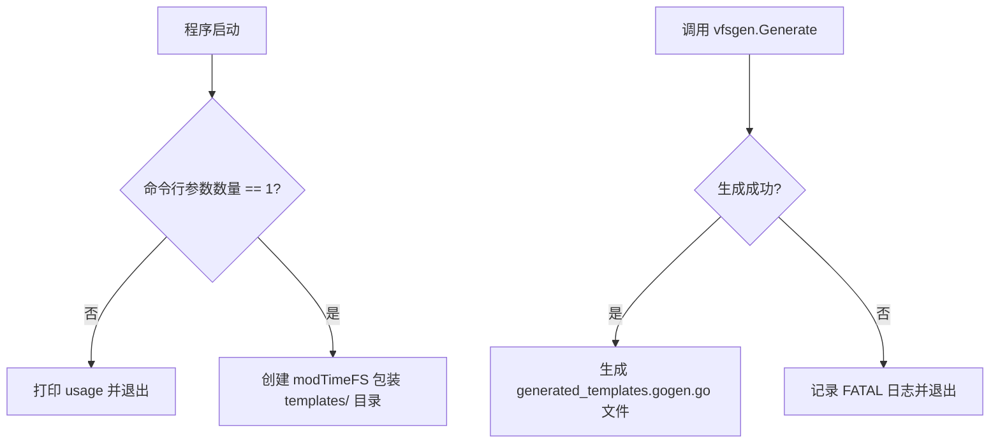
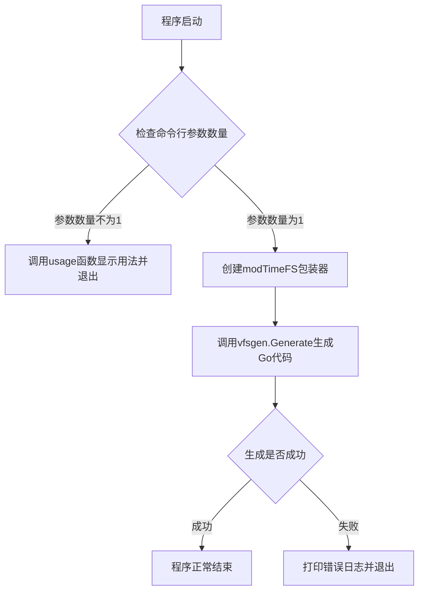
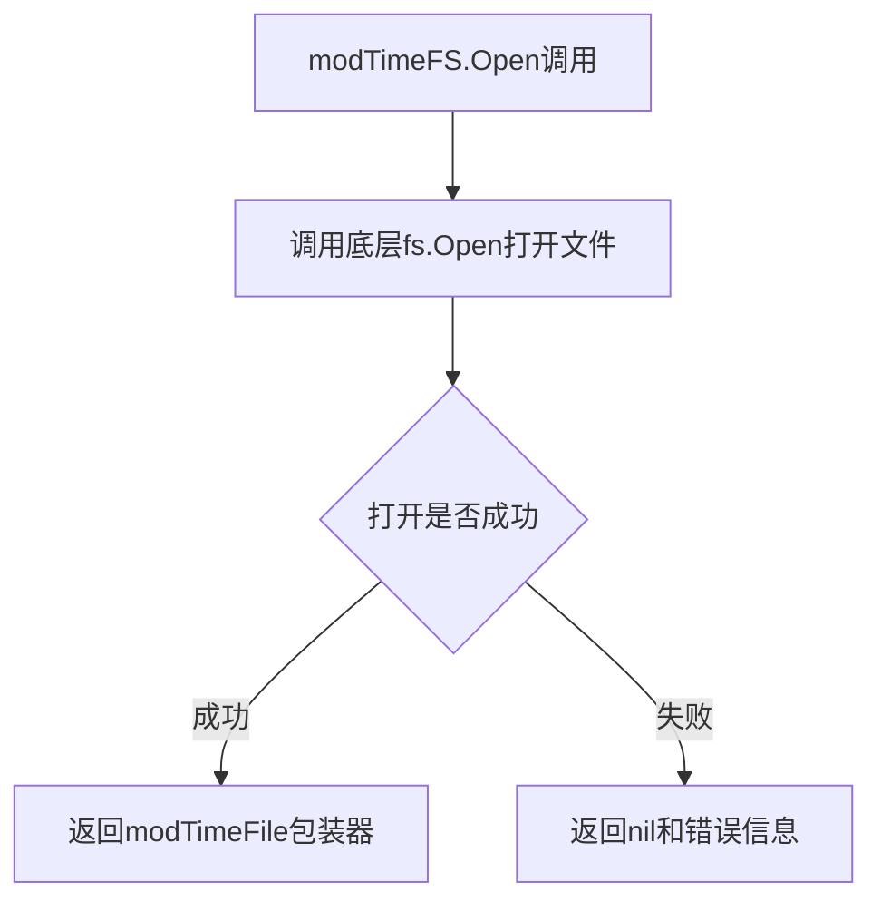
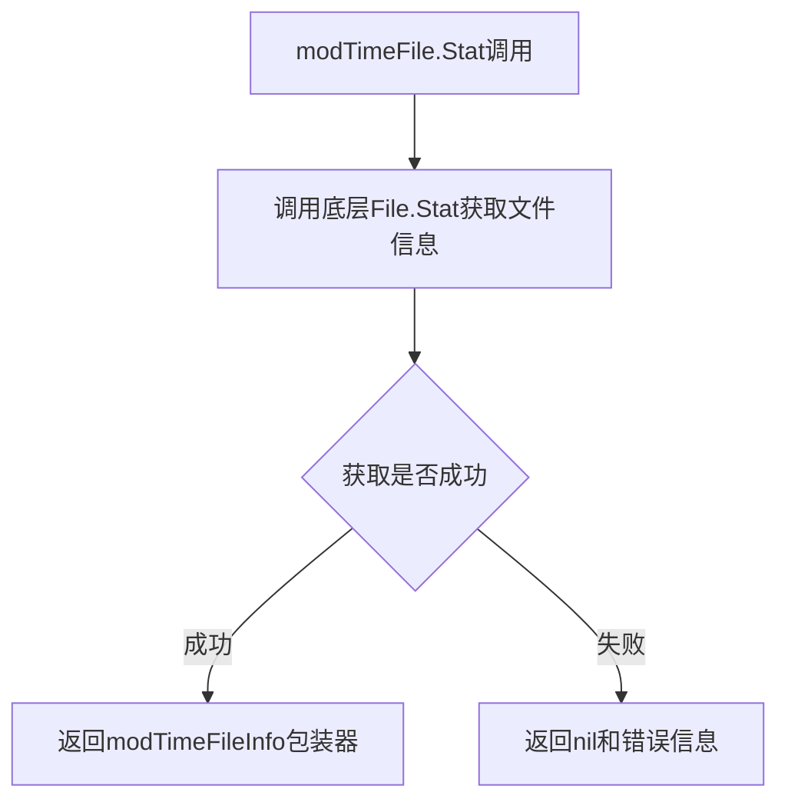
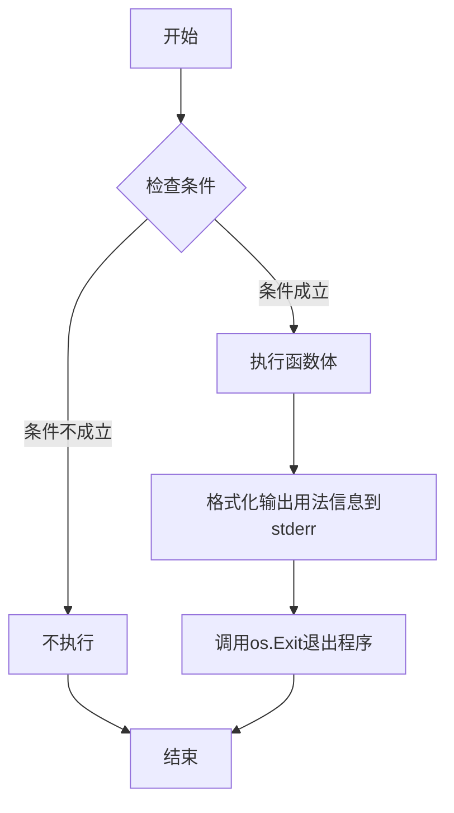

# `flux\pkg\install\generate.go` 详细设计文档

这是一个嵌入模板文件的代码生成工具，通过包装 http.FileSystem 并重写文件修改时间为 Unix _epoch，确保生成的 Go 代码仅在模板文件内容变化时发生改变。

## 整体流程



## 类结构

```
main (主包)
├── modTimeFS (文件系统包装器)
│   ├── fields: fs http.FileSystem
│   └── methods: Open()
├── modTimeFile (文件包装器)
│   ├── fields: http.File
│   └── methods: Stat()
└── modTimeFileInfo (文件信息包装器)
    ├── fields: os.FileInfo
    └── methods: ModTime()
```

## 全局变量及字段


### `modTimeFS.fs`
    
底层的文件系统，用于读取templates目录中的文件

类型：`http.FileSystem`
    


### `modTimeFile.File`
    
被包装的底层文件对象，用于提供文件访问接口

类型：`http.File`
    


### `modTimeFileInfo.FileInfo`
    
底层文件的信息结构，用于获取文件元数据

类型：`os.FileInfo`
    
    

## 全局函数及方法


### `main`

这是代码生成工具的主入口函数，用于将templates/目录下的静态文件生成为Go代码，实现静态资源的嵌入。整个程序首先检查命令行参数，然后创建一个自定义的文件系统包装器（将所有文件修改时间统一为Unix时间戳），最后调用vfsgen库生成包含静态文件内容的Go源代码文件。

参数： 无

返回值： 无（该函数终止程序，不返回任何值）

#### 流程图



#### 带注释源码

```go
// 主函数，程序入口点
func main() {
    // 定义usage函数，用于显示正确的命令行用法
    usage := func() {
        // 将用法信息输出到标准错误流
        fmt.Fprintf(os.Stderr, "usage: %s\n", os.Args[0])
        // 以错误状态码退出程序
        os.Exit(1)
    }
    
    // 检查命令行参数数量，必须无额外参数
    if len(os.Args) != 1 {
        usage()
    }

    // 创建modTimeFS结构体实例，包装templates目录的文件系统
    // 这样可以确保生成的代码文件仅在内容改变时变化，不受修改时间影响
    var fs http.FileSystem = modTimeFS{
        fs: http.Dir("templates/"),
    }
    
    // 调用vfsgen库生成静态文件Go代码
    // 参数指定输出文件名、包名和变量名
    err := vfsgen.Generate(fs, vfsgen.Options{
        Filename:     "generated_templates.gogen.go",  // 输出文件名
        PackageName:  "install",                        // Go包名
        VariableName: "templates",                     // 导出的变量名
    })
    
    // 如果生成过程中发生错误，打印日志并终止程序
    if err != nil {
        log.Fatalln(err)
    }
}
```

---

### `modTimeFS`

modTimeFS是一个文件系统包装器类型，实现了http.FileSystem接口。它的核心作用是将底层文件系统的所有文件修改时间统一重写为Unix时间戳（1970年1月1日），这样可以确保生成的静态资源代码文件的内容哈希值仅取决于文件内容本身，而不是文件的修改时间，从而提高构建的可重复性和缓存效率。

参数：

- `fs`：`http.FileSystem`，底层文件系统，通常是http.Dir("templates/")

返回值： 实现http.FileSystem接口

#### 流程图



#### 带注释源码

```go
// modTimeFS结构体包装一个http.FileSystem
// 用途：将所有文件的修改时间统一为Unix epoch (1970-01-01 00:00:00)
// 这样做的好处是确保生成的代码文件只在你修改模板内容时才会改变
type modTimeFS struct {
    fs http.FileSystem  // 被包装的底层文件系统
}

// 实现http.FileSystem接口的Open方法
func (fs modTimeFS) Open(name string) (http.File, error) {
    // 委托给底层文件系统打开文件
    f, err := fs.fs.Open(name)
    if err != nil {
        // 如果打开失败，直接返回错误
        return nil, err
    }
    // 成功时返回包装后的modTimeFile，拦截Stat调用以修改ModTime
    return modTimeFile{f}, nil
}
```

---

### `modTimeFile`

modTimeFile是一个文件包装器类型，实现了http.File接口。它的核心作用是拦截对文件元数据的Stat调用，使得返回的文件信息中的修改时间被统一替换为Unix时间戳，从而确保生成代码的稳定性。

参数：

- `File`：`http.File`，被包装的底层文件对象

返回值： 实现http.File接口

#### 流程图



#### 带注释源码

```go
// modTimeFile包装http.File，用于拦截Stat调用
// 配合modTimeFS实现修改时间的统一重写
type modTimeFile struct {
    http.File  // 嵌入http.File接口，被包装的文件
}

// 重写Stat方法，返回包装后的文件信息
func (f modTimeFile) Stat() (os.FileInfo, error) {
    // 获取底层文件的Stat信息
    fi, err := f.File.Stat()
    if err != nil {
        return nil, err
    }
    // 将文件信息包装为modTimeFileInfo，以修改ModTime返回值
    return modTimeFileInfo{fi}, nil
}
```

---

### `modTimeFileInfo`

modTimeFileInfo是一个文件信息包装器类型，实现了os.FileInfo接口。它的核心作用是将所有文件的修改时间统一返回为Unix时间戳（time.Unix(0, 0)），这是确保vfsgen生成的代码文件具有确定性输出的关键步骤。

参数：

- `FileInfo`：`os.FileInfo`，被包装的底层文件信息

返回值： 实现os.FileInfo接口

#### 流程图

```mermaid
flowchart TD
    A[modTimeFileInfo.ModTime调用] --> B[返回Unix时间戳time.Unix(0, 0)]
```

#### 带注释源码

```go
// modTimeFileInfo包装os.FileInfo，用于重写ModTime方法
// 所有文件的修改时间都被固定为Unix epoch (1970-01-01 00:00:00)
// 这样确保生成的代码文件不受实际修改时间影响
type modTimeFileInfo struct {
    os.FileInfo  // 嵌入os.FileInfo接口，被包装的文件信息
}

// 重写ModTime方法，固定返回Unix epoch时间
// 注意：这是一个方法表达式，receiver未被使用
func (modTimeFileInfo) ModTime() time.Time {
    // 返回Unix时间戳的零点，即1970年1月1日
    return time.Unix(0, 0)
}
```

---

## 全局变量和全局函数

### 全局变量

无全局变量。

### 全局函数

无全局函数（除了main）。

---

## 关键组件信息

1. **vfsgen库**：第三方静态文件生成工具，负责将文件系统转换为Go代码，实现静态资源嵌入
2. **http.FileSystem接口**：Go标准库定义的文件系统抽象接口
3. **os.FileInfo接口**：Go标准库定义的文件元数据抽象接口
4. **templates目录**：待嵌入的静态文件来源目录
5. **generated_templates.gogen.go**：生成的输出文件名

---

## 潜在的技术债务或优化空间

1. **硬编码路径**：templates/目录路径硬编码在代码中，缺乏配置灵活性
2. **错误处理不够细致**：仅使用log.Fatalln简单处理错误，缺乏重试机制或详细的错误分类
3. **缺乏日志输出**：生成过程没有任何成功提示或进度信息
4. **命令行参数贫乏**：缺少输出目录、包名、变量名等参数的命令行配置能力
5. **无测试覆盖**：代码中没有任何单元测试或集成测试

---

## 其它项目

### 设计目标与约束

- **主要目标**：将templates目录下的所有静态文件转换为Go源代码，实现静态资源的零依赖嵌入
- **约束**：生成的代码必须具有确定性，即相同的输入必须产生相同的输出（不受文件修改时间影响）

### 错误处理与异常设计

- 命令行参数错误：调用usage()显示用法并以状态码1退出
- vfsgen生成失败：使用log.Fatalln输出错误并终止程序
- 文件打开/读取错误：直接向上层传播错误

### 数据流与状态机

1. 程序启动 → 参数验证 → 文件系统包装 → 代码生成 → 成功退出
2. 任何阶段失败 → 错误输出 → 程序终止

### 外部依赖与接口契约

- **依赖**：`github.com/shurcooL/vfsgen` - 静态文件生成库
- **标准库依赖**：fmt, log, net/http, os, time
- **输入**：templates/目录下的所有文件
- **输出**：generated_templates.gogen.go文件，包含install包的templates变量


### `usage`（匿名函数）

该匿名函数作为程序的使用说明输出器，当用户提供的命令行参数数量不正确时，会将程序的正确用法格式输出到标准错误流（stderr），然后以退出码 1 终止程序执行。

参数： 无

返回值：无（函数内部调用 `os.Exit(1)` 终止程序）

#### 流程图



#### 带注释源码

```go
// usage 是一个匿名函数，用于打印程序的正确用法并退出
// 当 main 函数检测到命令行参数数量不符合预期时调用此函数
usage := func() {
    // 使用 fmt.Fprintf 将用法信息格式化输出到标准错误流 (os.Stderr)
    // os.Args[0] 包含当前执行程序的路径/名称，用于提示用户正确的命令格式
    fmt.Fprintf(os.Stderr, "usage: %s\n", os.Args[0])
    
    // 以退出码 1 终止程序运行
    // 退出码 1 通常表示程序因错误而终止
    os.Exit(1)
}
```


### `modTimeFS.Open`

该方法实现了 `http.FileSystem` 接口的 `Open` 方法。它负责打开指定路径的文件，并**核心目的**是将返回的原始文件句柄包装为自定义的 `modTimeFile` 类型。这种装饰器模式（Decorator Pattern）的使用，旨在拦截后续对文件的 `Stat()` 调用，以修改其修改时间，从而确保生成的代码文件（`generated_templates.gogen.go`）仅在内容改变时发生变化，避免因时间戳差异导致不必要的重复构建。

参数：

- `name`：`string`，需要打开的文件的路径（相对于根目录）。

返回值：`http.File, error`
- 第一个返回值是一个 `http.File` 接口，但实际返回的是实现了该接口的 `modTimeFile` 结构体实例。
- 第二个返回值是打开文件过程中可能发生的错误（如文件不存在、权限不足等）。

#### 流程图

```mermaid
flowchart TD
    A[调用 modTimeFS.Open] --> B[调用底层 fs.Open name]
    B --> C{底层是否出错?}
    C -- 是 --> D[返回 nil, err]
    C -- 否 --> E[将底层文件 f 包装为 modTimeFile]
    E --> F[返回 modTimeFile{f}, nil]
```

#### 带注释源码

```go
// Open 是 http.FileSystem 接口的实现。
// 它打开文件并返回一个封装的对象，以便拦截后续的 Stat 调用。
func (fs modTimeFS) Open(name string) (http.File, error) {
    // 1. 调用被包装的 http.FileSystem (即 http.Dir) 来打开文件。
    f, err := fs.fs.Open(name)
    
    // 2. 如果打开过程中发生错误（例如文件未找到），直接向上层传递错误。
    if err != nil {
        return nil, err
    }
    
    // 3. 如果成功，返回一个 modTimeFile 结构体实例。
    // 这里使用了装饰器模式，不返回原始的 http.File，而是返回包装类。
    // 这样在调用 Stat() 时，会使用 modTimeFile.Stat()，进而返回伪造的 ModTime。
    return modTimeFile{f}, nil
}
```


### `modTimeFile.Stat()`

该方法是一个文件信息查询的包装器，通过调用底层文件的 Stat() 方法获取原始文件信息，并将返回的 `os.FileInfo` 包装为自定义的 `modTimeFileInfo` 类型，以实现将所有文件的修改时间统一重写为 Unix 纪元时间（1970-01-01 00:00:00），确保生成的代码文件仅在内容变化时才会改变。

参数：

- （无显式参数，接收者 `f` 为 `modTimeFile` 类型）

返回值：

- `os.FileInfo`：包装后的文件信息对象，其 ModTime 已被重写为 Unix 纪元时间
- `error`：如果底层文件 Stat() 调用失败，则返回该错误

#### 流程图

```mermaid
flowchart TD
    A[开始 Stat 方法] --> B{调用底层 f.File.Stat()}
    B -->|成功| C[创建 modTimeFileInfo 包装器]
    B -->|失败| D[返回 nil 和错误]
    C --> E[返回 modTimeFileInfo 和 nil]
    D --> F[结束]
    E --> F
```

#### 带注释源码

```go
// Stat 返回文件的信息，将修改时间重写为 Unix 纪元
// 接收者 f: modTimeFile 类型，包含底层 http.File
// 返回值: os.FileInfo, error - 包装后的文件信息或错误
func (f modTimeFile) Stat() (os.FileInfo, error) {
	// 调用底层文件的 Stat 方法获取原始文件信息
	fi, err := f.File.Stat()
	
	// 如果获取失败，直接返回错误
	if err != nil {
		return nil, err
	}
	
	// 成功时，将原始 FileInfo 包装为 modTimeFileInfo
	// modTimeFileInfo 实现了 ModTime() 方法，返回固定的时间
	return modTimeFileInfo{fi}, nil
}
```


### `modTimeFileInfo.ModTime`

该方法是一个文件信息包装器的成员方法，用于重写文件的修改时间，使其始终返回 Unix 纪元时间（1970-01-01 00:00:00 UTC），以确保生成的模板代码文件仅在原始文件夹和文件内容实际改变时才会变化。

参数：

- （无参数，接收者 `modTimeFileInfo` 不作为参数列出）

返回值：`time.Time`，返回 Unix 纪元的零时间点，表示始终返回固定的修改时间

#### 流程图

```mermaid
flowchart TD
    A[开始 ModTime 方法] --> B{接收 modTimeFileInfo 类型的接收者}
    B --> C[返回 time.Unix(0, 0)]
    C --> D[返回 time.Time 类型值<br/>表示 Unix 纪元时间]
    D --> E[结束]
    
    style A fill:#f9f,stroke:#333
    style C fill:#9f9,stroke:#333
    style E fill:#9f9,stroke:#333
```

#### 带注释源码

```go
// ModTime 返回文件的修改时间。
// 该方法重写了 os.FileInfo 接口的 ModTime 方法，
// 始终返回 Unix 纪元时间（1970-01-01 00:00:00 UTC）。
// 这是为了确保生成的模板文件（generated_templates.gogen.go）
// 的内容仅在原始模板文件夹的内容实际改变时才会变化，
// 而不是因为文件修改时间的微小差异而导致不必要的重新生成。
func (modTimeFileInfo) ModTime() time.Time {
    // 返回 Unix 时间戳 0，即 1970-01-01 00:00:00 UTC
    return time.Unix(0, 0)
}
```

## 关键组件


### modTimeFS 结构体

modTimeFS 是一个 http.FileSystem 的包装器，用于重写所有文件的修改时间为 Unix 纪元，确保生成的代码文件只在文件夹和文件内容变化时改变。

### modTimeFile 结构体

modTimeFile 是 http.File 的包装器，重写了 Stat 方法，返回自定义的 modTimeFileInfo，以实现修改时间的统一处理。

### modTimeFileInfo 结构体

modTimeFileInfo 是 os.FileInfo 的包装器，重写了 ModTime 方法，返回 time.Unix(0, 0)，确保所有文件的时间戳一致。

### main 函数

程序入口函数，负责解析命令行参数，创建 modTimeFS 实例，并调用 vfsgen.Generate 生成嵌入式的虚拟文件系统 Go 代码文件。

### vfsgen.Generate 调用

使用 vfsgen 工具将 templates/ 目录下的所有文件生成为 Go 源代码，输出文件为 generated_templates.gogen.go，包名为 install，变量名为 templates。


## 问题及建议


### 已知问题

-   硬编码的目录路径 `"templates/"` 和输出文件名 `"generated_templates.gogen.go"` 缺乏灵活性，无法通过命令行参数配置
-   错误处理不够完善，`modTimeFS.Open` 方法返回原始错误，未添加上下文信息导致调试困难
-   `usage()` 函数仅显示程序名，未提供实际的使用说明和可用参数，降低了工具的可用性
-   未检查 `templates/` 目录是否存在就开始执行生成流程，可能导致误导性的错误信息
-   `modTimeFile` 结构体仅重写了 `Stat()` 方法，而 `ModTime()` 被强制设为 Unix 零值，可能导致某些依赖文件修改时间的场景出现问题
-   使用 `os.Exit(1)` 直接终止程序，不符合 Go 错误处理最佳实践，难以被其他代码调用
-   代码缺少注释和文档字符串，对外暴露的公共方法缺乏说明

### 优化建议

-   引入命令行标志解析库（如 `flag` 或 `spf13/pflag`），允许用户指定输入目录、输出文件、包名等参数
-   在错误返回处使用 `fmt.Errorf` 添加上下文信息，例如 `fmt.Errorf("failed to open %s: %w", name, err)`
-   完善 `usage()` 函数，添加实际的参数说明和使用示例
-   在执行生成逻辑前验证目录是否存在，可添加 `os.Stat("templates/")` 检查
-   考虑保留原始文件的修改时间信息，仅在需要时进行规范化处理，而非永久丢失
-   将 `main` 函数中的逻辑封装为可导出的函数，便于其他包调用和测试
-   为公共类型和方法添加 Go 风格注释和文档字符串，提高代码可维护性

## 其它


### 设计目标与约束

该工具的设计目标是自动化将文件系统中的模板目录转换为Go语言的嵌入式代码，避免手动维护大量模板文件。约束条件包括：必须作为Go构建工具运行（// +build tags），仅支持单参数调用，输出文件固定为generated_templates.gogen.go，templates目录必须存在于工作目录下。

### 错误处理与异常设计

主要错误处理包括：参数校验错误时调用usage()函数输出用法信息并以状态码1退出；vfsgen.Generate()执行失败时调用log.Fatalln()输出错误并终止程序；modTimeFS和modTimeFile的Open/Stat方法均返回底层文件系统的错误。异常设计采用快速失败模式，不进行重试或降级处理。

### 数据流与状态机

工具启动后首先进行参数校验（单分支状态），然后创建modTimeFS包装器包装http.Dir("templates/")，接着调用vfsgen.Generate生成代码文件，最后程序结束。无复杂状态机，属于线性数据流：输入（templates目录）→ 包装（modTimeFS）→ 生成（vfsgen）→ 输出（.go文件）。

### 外部依赖与接口契约

核心依赖为github.com/shurcooL/vfsgen库，提供了Generate函数签名：Generate(fs http.FileSystem, opts Options) error。接口契约要求传入的http.FileSystem实现Open方法返回http.File，且http.File实现Stat()方法返回os.FileInfo。输出文件格式为Go代码文件，包名为install，变量名为templates。

### 性能考虑

modTimeFS包装器的唯一目的是将所有文件的修改时间统一设置为Unix零时（1970-01-01 00:00:00 UTC），确保生成的代码文件内容仅在模板实际内容变化时变化，避免因时间戳差异导致的重复生成。生成过程为一次性操作，无运行时性能要求。

### 安全考虑

工具直接读取templates/目录下的所有文件并生成Go代码，需要确保templates目录路径不受用户输入控制（当前硬编码为相对路径"templates/"）。生成的代码不包含执行能力，仅为只读的文件系统抽象。

### 测试策略

由于该工具为一次性生成工具，测试重点应放在：验证templates目录不存在时的错误处理，验证空templates目录的生成结果，验证包含子目录和各类文件类型时的生成正确性，以及验证modTimeFS包装对生成结果的影响。

### 配置说明

主要配置通过vfsgen.Options结构体传递：Filename指定输出文件名（固定为generated_templates.gogen.go），PackageName指定Go包名（固定为install），VariableName指定变量名（固定为templates）。templates目录路径目前硬编码，如需可配置化可考虑添加命令行参数。

### 部署与构建要求

该文件必须以Go构建工具形式运行，使用// +build tools标签。构建时需确保vfsgen依赖已安装（go get github.com/shurcooL/vfsgen）。生成的文件应纳入版本控制或作为构建流程的一部分自动生成。


    