# `flux\pkg\install\generated_templates.gogen.go` 详细设计文档

该代码实现了一个嵌入式的虚拟文件系统 (Virtual File System)，通过 gzip 压缩将一组 YAML 配置文件模板打包到 Go 二进制文件中，并实现了标准的 http.FileSystem 接口以供运行时读取。

## 整体流程

```mermaid
graph TD
    A[程序启动] --> B[初始化全局变量 templates]
B --> C[调用 vfsgenFS.Open(path)]
C --> D{路径是否存在?}
D -- 否 --> E[返回 os.ErrNotExist]
D -- 是 --> F{类型断言}
F -- CompressedFileInfo --> G[创建 gzip.Reader]
G --> H[返回 vfsgenCompressedFile 实例]
F -- DirInfo --> I[创建 vfsgenDir 实例]
H --> J[用户调用 Read/Seek/Close]
I --> K[用户调用 Readdir/Stat]
J --> L{读取逻辑}
L -- grPos > seekPos --> M[重置 Reader 到起点]
L -- grPos < seekPos --> N[丢弃数据以快进]
M --> O[执行实际读取]
N --> O
```

## 类结构

```
http.FileSystem (接口)
└── vfsgen۰FS (map[string]interface{})
    ├── vfsgen۰CompressedFileInfo (静态文件元数据)
    │   └── vfsgen۰CompressedFile (打开的文件句柄)
    └── vfsgen۰DirInfo (静态目录元数据)
        └── vfsgen۰Dir (打开的目录句柄)
```

## 全局变量及字段


### `templates`
    
全局变量，包含所有嵌入的静态文件和目录结构的 map

类型：`http.FileSystem`
    


### `vfsgen۰CompressedFileInfo.name`
    
文件名

类型：`string`
    


### `vfsgen۰CompressedFileInfo.modTime`
    
修改时间

类型：`time.Time`
    


### `vfsgen۰CompressedFileInfo.compressedContent`
    
压缩后的字节内容

类型：`[]byte`
    


### `vfsgen۰CompressedFileInfo.uncompressedSize`
    
未压缩时的大小

类型：`int64`
    


### `vfsgen۰CompressedFile.vfsgen۰CompressedFileInfo`
    
文件信息

类型：`*vfsgen۰CompressedFileInfo`
    


### `vfsgen۰CompressedFile.gr`
    
gzip 读取器

类型：`*gzip.Reader`
    


### `vfsgen۰CompressedFile.grPos`
    
gzip Reader 当前的未压缩位置

类型：`int64`
    


### `vfsgen۰CompressedFile.seekPos`
    
用户请求的未压缩位置

类型：`int64`
    


### `vfsgen۰DirInfo.name`
    
目录名

类型：`string`
    


### `vfsgen۰DirInfo.modTime`
    
修改时间

类型：`time.Time`
    


### `vfsgen۰DirInfo.entries`
    
目录下的文件列表

类型：`[]os.FileInfo`
    


### `vfsgen۰Dir.vfsgen۰DirInfo`
    
目录信息

类型：`*vfsgen۰DirInfo`
    


### `vfsgen۰Dir.pos`
    
读取遍历的位置指针

类型：`int`
    
    

## 全局函数及方法


### `vfsgen۰FS.Open`

这是虚拟文件系统 `vfsgen۰FS` 的核心方法，用于打开指定的路径并返回 `http.File` 接口。它负责路径规范化、文件查找以及根据文件类型（压缩文件或目录）实例化对应的文件对象。

参数：
-  `path`：`string`，需要打开的文件或目录的路径。

返回值：
-  `http.File`：成功打开的文件或目录对象，调用者可以使用其 `Read`、`Stat` 或 `Readdir` 等方法。
-  `error`：如果路径不存在（例如拼写错误）或发生内部错误，则返回该错误。

#### 流程图

```mermaid
graph TD
    A[Start] --> B[Clean Path: pathpkg.Clean "/" + path]
    B --> C{Lookup path in fs map}
    C -- Not Found --> D[Return nil, os.ErrNotExist]
    C -- Found --> E{Switch f.(type)}
    E -- *vfsgen۰CompressedFileInfo --> F[Create gzip.Reader]
    F --> G[Return *vfsgen۰CompressedFile]
    E -- *vfsgen۰DirInfo --> H[Return *vfsgen۰Dir]
    E -- default --> I[Panic: unexpected type]
```

#### 带注释源码

```go
func (fs vfsgen۰FS) Open(path string) (http.File, error) {
	// 1. 规范化路径：将相对路径转换为绝对路径，并清理其中的冗余字符（如 ./ 或 //）。
	//    这确保了 map 查找的一致性。
	path = pathpkg.Clean("/" + path)

	// 2. 查找文件或目录：在内部存储的 map (fs) 中根据路径查找对应的元数据对象。
	f, ok := fs[path]

	// 3. 错误处理：如果路径不存在于 map 中，返回标准的 "文件不存在" 错误。
	if !ok {
		return nil, &os.PathError{Op: "open", Path: path, Err: os.ErrNotExist}
	}

	// 4. 类型分发：根据找到的对象的具体类型（`CompressedFileInfo` 或 `DirInfo`）进行分支处理。
	switch f := f.(type) {
	case *vfsgen۰CompressedFileInfo:
		// 4a. 处理压缩文件：如果是压缩文件信息，创建一个 gzip.Reader 来解压内容。
		gr, err := gzip.NewReader(bytes.NewReader(f.compressedContent))
		if err != nil {
			// 由于这些 gzip 字节是由 vfsgen 程序自身生成的，理论上不应该出错。
			// 这里使用 panic 是为了在生成逻辑出错时能够快速定位。
			panic("unexpected error reading own gzip compressed bytes: " + err.Error())
		}
		// 返回一个封装了 gzip Reader 的文件结构体，使其可以被当作普通文件读取。
		return &vfsgen۰CompressedFile{
			vfsgen۰CompressedFileInfo: f,
			gr:                        gr,
		}, nil

	case *vfsgen۰DirInfo:
		// 4b. 处理目录：如果是目录信息，直接返回一个目录结构体。
		return &vfsgen۰Dir{
			vfsgen۰DirInfo: f,
		}, nil

	default:
		// 4c. 未知类型：如果出现了非预期的类型，触发 panic。这通常表明 vfsgen 生成代码时出现了异常。
		panic(fmt.Sprintf("unexpected type %T", f))
	}
}
```


### `vfsgen۰CompressedFileInfo.Readdir`

该方法用于尝试读取目录条目，但由于 `vfsgen۰CompressedFileInfo` 表示的是压缩文件而非目录，因此无法执行读取目录操作，直接返回错误。

参数：

- `count`：`int`，表示要读取的目录条目数量

返回值：

- `[]os.FileInfo`：文件信息切片（本方法始终返回 `nil`）
- `error`：错误信息，返回表示无法从文件读取目录的错误

#### 流程图

```mermaid
flowchart TD
    A[开始 Readdir] --> B{检查是否是目录}
    B -->|否| C[返回 nil, 错误信息: cannot Readdir from file {filename}]
    C --> D[结束]
```

#### 带注释源码

```go
// Readdir 尝试读取目录条目
// 参数 count: 表示要读取的目录条目数量
// 返回: 始终返回 nil 和错误，因为压缩文件信息代表的是文件而非目录
func (f *vfsgen۰CompressedFileInfo) Readdir(count int) ([]os.FileInfo, error) {
	// 文件类型不支持 Readdir 操作，返回错误提示
	return nil, fmt.Errorf("cannot Readdir from file %s", f.name)
}
```


### `vfsgen۰CompressedFileInfo.Stat`

该方法是 `vfsgen۰CompressedFileInfo` 结构体的成员方法，用于实现 `http.File` 接口。它返回文件自身的元数据信息（因为结构体本身实现了 `os.FileInfo` 接口），并且始终返回 `nil` 错误。

参数：
- （无）

返回值：
- `os.FileInfo`，返回文件自身的元数据对象
- `error`，始终返回 `nil`

#### 流程图

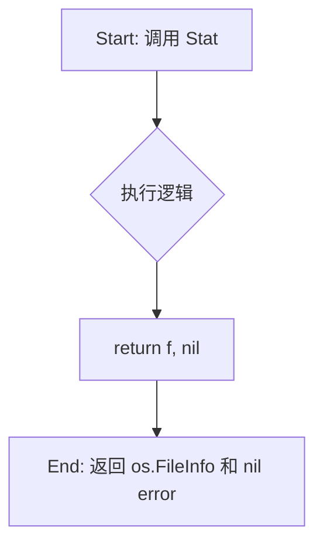

#### 带注释源码

```go
// Stat 返回文件的 os.FileInfo 表示。
// 由于 vfsgen۰CompressedFileInfo 实现了 os.FileInfo 的所有方法
// (Name, Size, Mode, ModTime, IsDir, Sys)，
// 因此该方法直接返回结构体实例本身作为文件信息，并始终返回 nil 错误。
func (f *vfsgen۰CompressedFileInfo) Stat() (os.FileInfo, error) {
	return f, nil
}
```


### `vfsgen۰CompressedFileInfo.GzipBytes`

该方法是 `vfsgen۰CompressedFileInfo` 类的 getter 方法，用于获取预先 gzip 压缩的文件内容字节数组。它直接返回结构体中存储的 `compressedContent` 字段，无需任何处理逻辑。

参数： 无

返回值：`[]byte`，返回文件 gzip 压缩后的原始字节内容

#### 流程图

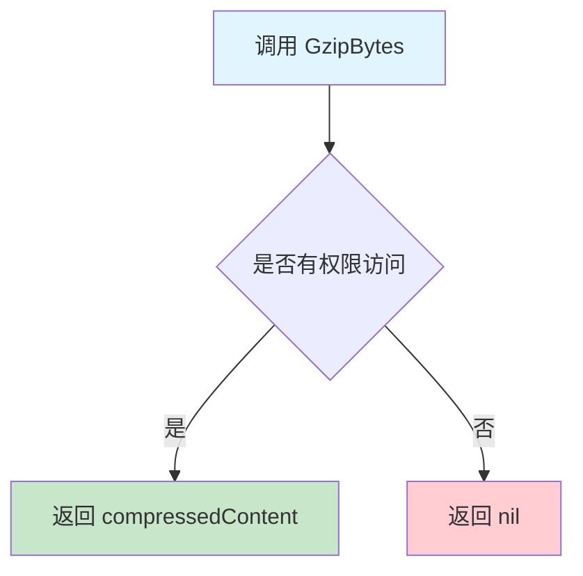

#### 带注释源码

```go
// GzipBytes 返回文件的 gzip 压缩内容
// 这是一个简单的 getter 方法，直接返回预先存储的压缩字节数组
// 无需任何解压操作，因为该方法返回的是原始压缩数据
func (f *vfsgen۰CompressedFileInfo) GzipBytes() []byte {
    // 直接返回结构体中存储的压缩内容字段
    // 该字段在初始化时由 vfsgen 工具生成并填充
    return f.compressedContent
}
```


### `vfsgen۰CompressedFileInfo.Name`

该方法是一个简单的 getter 方法，用于返回压缩文件的名称。它实现了 `os.FileInfo` 接口的 `Name()` 方法，使得虚拟文件系统中的文件可以获取其文件名。

参数： 无

返回值：`string`，返回压缩文件的名称（即 `name` 字段的值）

#### 流程图

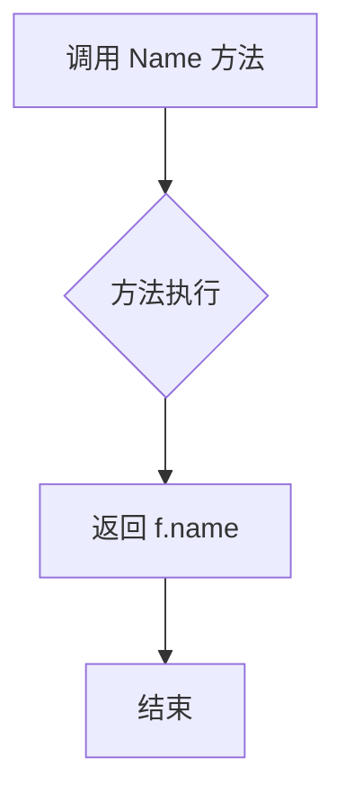

#### 带注释源码

```go
// Name 返回压缩文件的名称
// 该方法实现了 os.FileInfo 接口的 Name() 方法
// 参数: 无
// 返回值: string - 文件的名称
func (f *vfsgen۰CompressedFileInfo) Name() string { 
    return f.name  // 返回结构体中存储的文件名
}
```


### `vfsgen۰CompressedFileInfo.Size`

该方法是 `vfsgen۰CompressedFileInfo` 结构体的成员方法，用于返回虚拟文件系统中所嵌入文件的未压缩大小，实现了 `os.FileInfo` 接口的 `Size()` 方法。通过返回预先存储的 `uncompressedSize` 字段值，避免了在运行时解压缩整个文件来获取文件大小的开销。

参数：無

返回值：`int64`，返回文件的未压缩大小（字节数）

#### 流程图

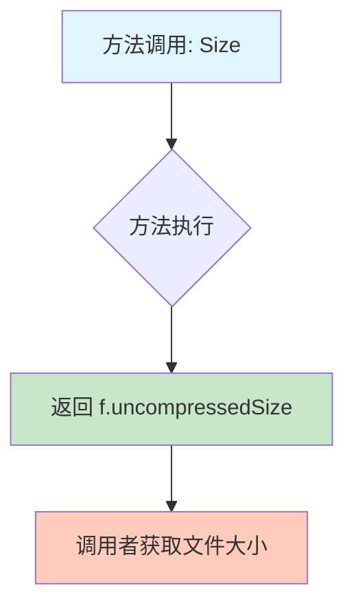

#### 带注释源码

```go
// Size 方法实现了 os.FileInfo 接口的 Size 方法
// 返回该压缩文件在解压后的实际大小（字节）
// 参数：无
// 返回值：int64 - 文件未压缩状态下的字节大小
func (f *vfsgen۰CompressedFileInfo) Size() int64 {
    // 直接返回结构体中预先存储的未压缩大小字段
    // 该值在文件被嵌入虚拟文件系统时就已经计算并保存
    // 避免了运行时解压缩整个文件来获取大小的性能开销
    return f.uncompressedSize
}
```


### `vfsgen۰CompressedFileInfo.Mode`

该方法返回虚拟文件系统中所嵌入文件的固定权限模式（0444），表示文件为只读。

参数：

- （无显式参数，接收者 `f *vfsgen۰CompressedFileInfo` 为隐式参数）

返回值：`os.FileMode`，返回文件的权限位（固定值 0444，表示所有者、组和其他用户均只读）。

#### 流程图

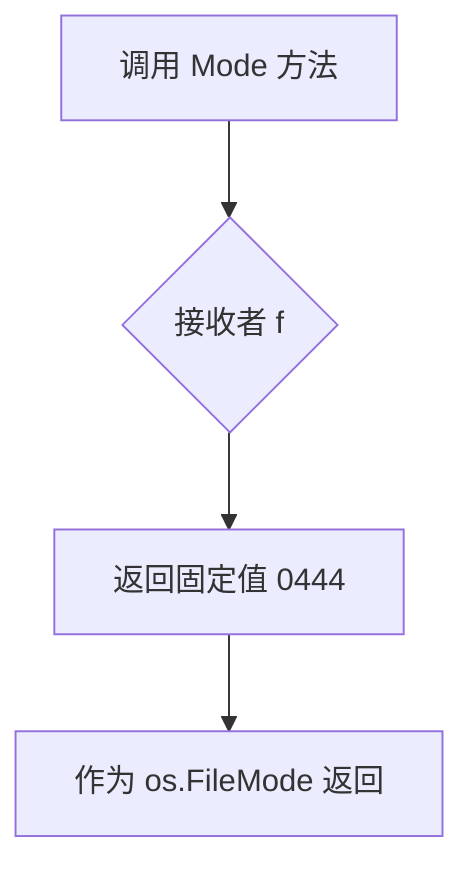

#### 带注释源码

```go
// Mode 返回文件的权限模式。
// 对于压缩文件信息，固定返回 0444（八进制），表示文件为只读。
// 这确保嵌入到二进制文件中的模板资源不会被意外修改。
func (f *vfsgen۰CompressedFileInfo) Mode() os.FileMode { return 0444 }
```

---

#### 补充信息

**所属类：`vfsgen۰CompressedFileInfo`**

| 字段名 | 类型 | 描述 |
|--------|------|------|
| name | string | 文件名 |
| modTime | time.Time | 文件修改时间 |
| compressedContent | []byte | gzip 压缩后的文件内容 |
| uncompressedSize | int64 | 未压缩时的文件大小 |

| 方法名 | 功能描述 |
|--------|----------|
| Readdir | 返回错误，不支持对文件进行目录读取 |
| Stat | 返回文件自身的 os.FileInfo |
| GzipBytes | 返回原始压缩内容 |
| Name | 返回文件名 |
| Size | 返回未压缩文件大小 |
| **Mode** | **返回文件权限模式（0444）** |
| ModTime | 返回文件修改时间 |
| IsDir | 返回 false，表示不是目录 |
| Sys | 返回 nil |

**设计目标：**
- 该方法是 `os.FileInfo` 接口的实现之一
- 虚拟文件系统中的文件默认设为只读，确保嵌入的模板不可被修改
- 权限硬编码为 0444 是合理的，因为这些是只读的模板资源

**潜在优化空间：**
- 当前权限硬编码，无法动态调整；如果未来需要不同权限，需要重构
- 可考虑将权限值提取为常量或配置，提高可维护性


### `vfsgen۰CompressedFileInfo.ModTime`

该方法用于返回压缩文件信息的修改时间，实现了 `os.FileInfo` 接口的 `ModTime` 方法。

参数：  
（无参数）

返回值：`time.Time`，返回文件的最后修改时间。

#### 流程图

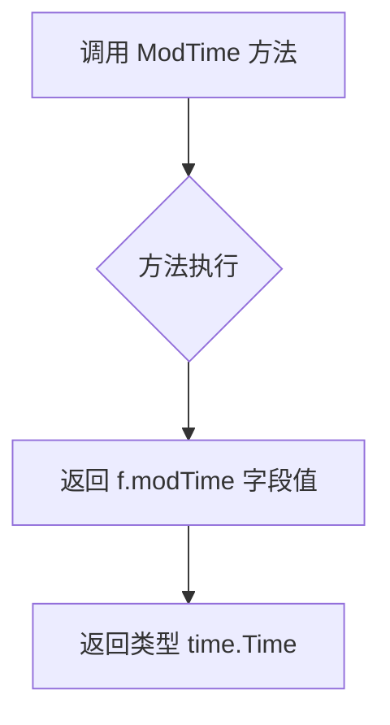

#### 带注释源码

```go
// ModTime 返回文件的最后修改时间
// 该方法实现了 os.FileInfo 接口的 ModTime 方法
func (f *vfsgen۰CompressedFileInfo) ModTime() time.Time {
    // 返回结构体中存储的 modTime 字段
    // 该字段在初始化时由 vfsgen 工具自动生成并填充
    return f.modTime
}
```


### `vfsgen۰CompressedFileInfo.IsDir`

该方法用于返回压缩文件信息是否为目录。由于 `vfsgen۰CompressedFileInfo` 表示的是一个压缩文件（而非目录），因此始终返回 `false`。

参数：此方法没有显式参数。

-  `f *vfsgen۰CompressedFileInfo`：接收者（隐式参数），指向 `vfsgen۰CompressedFileInfo` 结构体的指针。

返回值：`bool`，返回 `false`，表示该文件信息对象不是目录。

#### 流程图

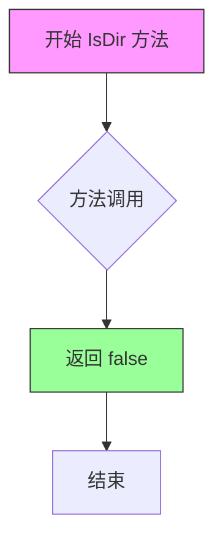

#### 带注释源码

```go
// IsDir 返回该文件信息是否为目录。
// 对于压缩文件信息，它始终返回 false，因为它是文件而非目录。
// 这是 os.FileInfo 接口的一部分实现。
//
// 参数：
//   - 无（使用接收者 f *vfsgen۰CompressedFileInfo）
//
// 返回值：
//   - bool：始终返回 false，表示这是文件而非目录
func (f *vfsgen۰CompressedFileInfo) IsDir() bool { return false }
```

#### 上下文信息

**类：`vfsgen۰CompressedFileInfo`**

| 字段名 | 类型 | 描述 |
|--------|------|------|
| name | string | 文件名称 |
| modTime | time.Time | 文件修改时间 |
| compressedContent | []byte | gzip 压缩后的文件内容 |
| uncompressedSize | int64 | 未压缩时的大小 |

**相关方法：**

| 方法名 | 描述 |
|--------|------|
| Readdir | 返回错误，因为文件不是目录 |
| Stat | 返回文件自身作为 os.FileInfo |
| GzipBytes | 返回压缩内容 |
| Name | 返回文件名 |
| Size | 返回未压缩大小 |
| Mode | 返回文件权限 0444 |
| ModTime | 返回修改时间 |
| Sys | 返回 nil |


### `vfsgen۰CompressedFileInfo.Sys`

该方法是 `vfsgen۰CompressedFileInfo` 结构体的 `Sys()` 方法，用于实现 `os.FileInfo` 接口，返回文件的底层数据源信息。由于是静态生成的虚拟文件系统，此处返回 nil。

参数：
- 无（仅接收者 `f *vfsgen۰CompressedFileInfo`）

返回值：`interface{}`，返回文件的底层数据源（此处始终返回 nil）

#### 流程图

```mermaid
flowchart TD
    A[调用 vfsgen۰CompressedFileInfo.Sys] --> B{方法执行}
    B --> C[返回 nil]
    C --> D[调用者获取 interface{} 类型值]
```

#### 带注释源码

```go
// Sys 是 vfsgen۰CompressedFileInfo 结构体的方法，实现了 os.FileInfo 接口的 Sys 方法。
// 由于 vfsgen۰CompressedFileInfo 是静态生成的虚拟文件系统文件，不存在真实的底层数据源，
// 因此直接返回 nil。调用者可以通过此方法获取文件的系统相关信息（如 unix.Stat_t）。
func (f *vfsgen۰CompressedFileInfo) Sys() interface{} {
    return nil // 返回 nil，表示没有底层系统信息
}
```


### `vfsgen۰CompressedFile.Read`

该方法实现了对 gzip 压缩文件的读取功能，支持Seek操作后的位置调整，通过维护内部的位置指针（grPos和seekPos）来实现顺序读取和随机访问。

参数：

- `p`：`[]byte`，用于存储读取数据的字节切片

返回值：`(n int, err error)`，n 表示读取的字节数，err 表示读取过程中发生的错误（若无错误为 nil）

#### 流程图

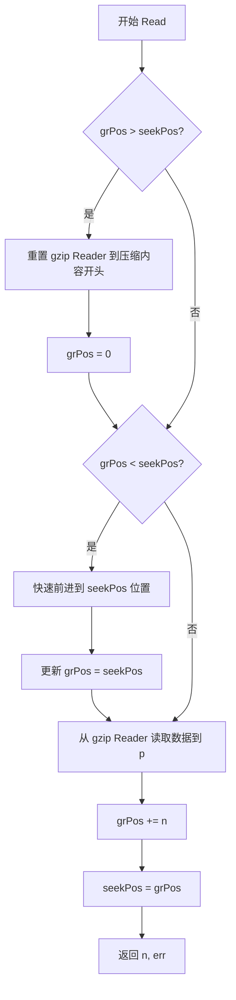

#### 带注释源码

```go
// Read 从压缩文件中读取数据到提供的字节切片 p 中。
// 该方法支持Seek操作后的位置调整，通过维护内部位置指针来实现顺序和随机访问读取。
func (f *vfsgen۰CompressedFile) Read(p []byte) (n int, err error) {
	// 检查当前 gzip reader 的位置是否大于所需的 seek 位置
	// 如果是，说明需要回退到文件开头重新读取
	if f.grPos > f.seekPos {
		// 将 gzip reader 重置到压缩内容的开头
		err = f.gr.Reset(bytes.NewReader(f.compressedContent))
		if err != nil {
			// 如果重置失败，返回错误
			return 0, err
		}
		// 重置内部位置指针到开头
		f.grPos = 0
	}
	
	// 如果当前 gzip reader 位置小于 seek 位置，需要快速前进到目标位置
	if f.grPos < f.seekPos {
		// 通过复制到 discard 来快速前进，避免解码所有数据
		_, err = io.CopyN(ioutil.Discard, f.gr, f.seekPos-f.grPos)
		if err != nil {
			// 如果前进失败，返回错误
			return 0, err
		}
		// 更新 gzip reader 的当前位置
		f.grPos = f.seekPos
	}
	
	// 执行实际的读取操作，从 gzip 解码器读取数据到提供的字节切片
	n, err = f.gr.Read(p)
	
	// 更新内部的位置指针
	f.grPos += int64(n)  // 更新 gzip reader 的位置
	f.seekPos = f.grPos  // 同步 seek 位置
	
	// 返回读取的字节数和可能的错误
	return n, err
}
```


### `vfsgen۰CompressedFile.Seek`

该方法实现了 `io.Seeker` 接口，用于在解压缩后的文件内容中移动读取位置。根据 `whence` 参数的不同值（起始位置、当前位置、结束位置），计算新的偏移量并更新内部的位置指针。

**参数：**

- `offset`：`int64`，相对于 `whence` 位置的偏移量，可以为负值
- `whence`：`int`，指定位置类型，取值为 `io.SeekStart`（文件开头）、`io.SeekCurrent`（当前位置）、`io.SeekEnd`（文件结尾）

**返回值：**

- `int64`，返回新的位置偏移量
- `error`，若 `whence` 值无效则返回错误，否则返回 `nil`

#### 流程图

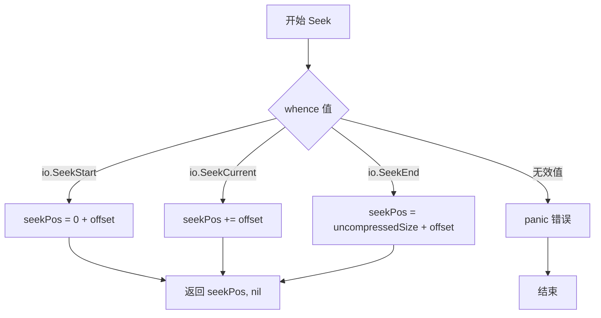

#### 带注释源码

```go
// Seek 方法实现 io.Seeker 接口，用于在解压缩后的文件内容中移动读取位置
// 参数 offset: 相对位置的偏移量，可为负数
// 参数 whence: 起始位置类型，0=io.SeekStart, 1=io.SeekCurrent, 2=io.SeekEnd
// 返回: 新的位置偏移量, 错误信息
func (f *vfsgen۰CompressedFile) Seek(offset int64, whence int) (int64, error) {
    // 根据 whence 参数确定偏移量的基准位置
    switch whence {
    case io.SeekStart:
        // 从文件开头开始计算偏移
        f.seekPos = 0 + offset
    case io.SeekCurrent:
        // 从当前位置开始计算偏移
        f.seekPos += offset
    case io.SeekEnd:
        // 从文件末尾开始计算偏移
        f.seekPos = f.uncompressedSize + offset
    default:
        // 无效的 whence 值，触发 panic
        panic(fmt.Errorf("invalid whence value: %v", whence))
    }
    // 返回计算后的新位置
    return f.seekPos, nil
}
```


### `vfsgen۰CompressedFile.Close`

该方法用于关闭当前打开的压缩文件，释放底层 gzip.Reader 资源，并返回可能发生的错误。

参数： 无

返回值：`error`，关闭底层 gzip.Reader 时产生的错误（如有），若成功则返回 nil

#### 流程图

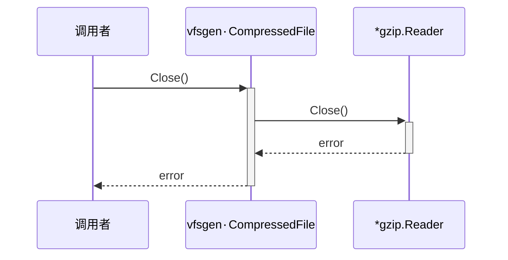

#### 带注释源码

```go
// Close 关闭底层 gzip.Reader 并返回可能的错误。
// 此方法实现了 io.Closer 接口，允许文件使用完毕后被正确关闭。
// 它会释放与 gzip.Reader 关联的资源。
func (f *vfsgen۰CompressedFile) Close() error {
	return f.gr.Close() // 调用 gzip.Reader 的 Close 方法，关闭压缩流并返回错误
}
```


### `vfsgen۰DirInfo.Read`

该方法用于从目录读取数据，但由于目录不是普通文件，此方法始终返回错误，提示无法从目录读取数据。

参数：

-  `{参数名称}`：`[]byte`，{参数描述}
-  无具体参数名（匿名参数），类型为 `[]byte`，表示读取数据的缓冲区，但此方法不使用

返回值：

-  `int`，返回读取的字节数，始终为 0
-  `error`，返回错误信息，提示无法从目录读取数据

#### 流程图

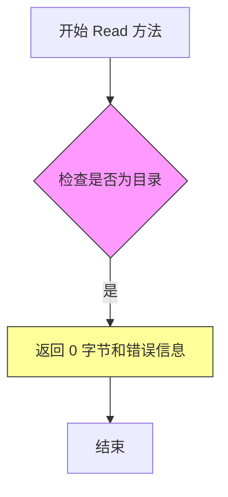

#### 带注释源码

```go
// Read 方法从 vfsgen۰DirInfo（目录）读取数据
// 参数 p []byte 是读取数据的缓冲区，但此方法不使用
// 返回值：
//   - int: 读取的字节数，始终为 0
//   - error: 错误信息，表示无法从目录读取
func (d *vfsgen۰DirInfo) Read([]byte) (int, error) {
    // 目录不能像普通文件一样读取，返回错误
    // d.name 包含目录名称，用于错误信息
    return 0, fmt.Errorf("cannot Read from directory %s", d.name)
}
```


### `vfsgen۰DirInfo.Close`

该方法是 `vfsgen۰DirInfo` 结构体实现的 `http.File` 接口的一部分，用于关闭目录文件。由于 vfsgen 生成的虚拟文件系统是静态的，目录对象不持有需要释放的资源，因此 Close 操作是一个空操作，直接返回 nil。

参数：
- 无参数

返回值：`error`，返回 nil，表示成功关闭目录（无实际资源需要释放）

#### 流程图

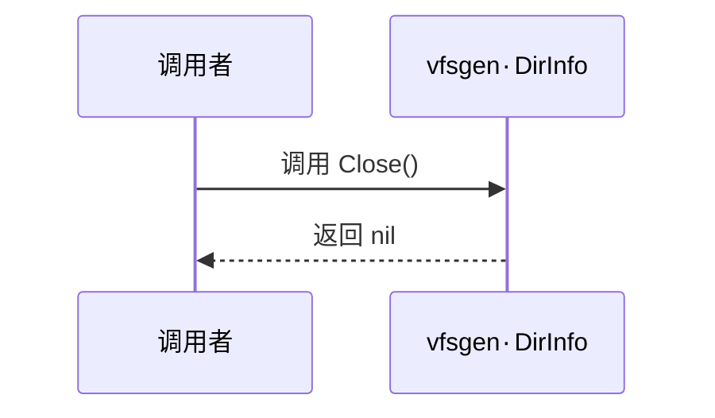

#### 带注释源码

```go
// Close 关闭目录文件。
// 对于 vfsgen 生成的静态虚拟文件系统目录，该操作是一个空操作（no-op），
// 因为目录信息是静态定义的，不持有任何需要关闭的资源（如文件句柄、连接等）。
// 该方法实现了 http.File 接口的 Close 方法。
func (d *vfsgen۰DirInfo) Close() error {
    // 目录是静态定义的，无需释放任何资源，直接返回 nil
    return nil
}
```


### `vfsgen۰DirInfo.Stat`

返回目录的 `os.FileInfo` 信息，实现了 `http.File` 接口的 `Stat` 方法。

参数：

- （无显式参数，隐含接收者为 `*vfsgen۰DirInfo`）

返回值：

- `os.FileInfo`，目录自身的文件信息
- `error`，始终返回 `nil`，因为该方法是静态实现，不会产生错误

#### 流程图

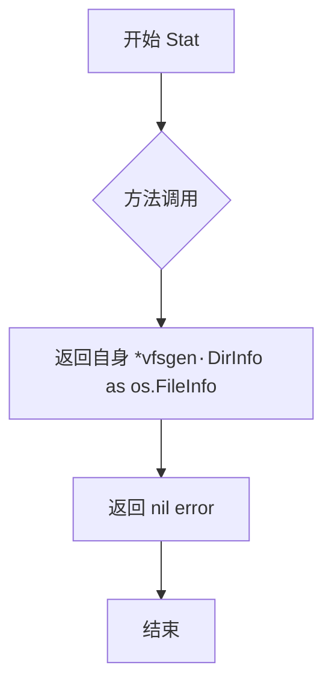

#### 带注释源码

```go
// Stat 返回目录的 os.FileInfo 信息，实现 http.File 接口
// 对于静态虚拟文件系统，目录信息是预先生成的，因此不会产生错误
func (d *vfsgen۰DirInfo) Stat() (os.FileInfo, error) {
    return d, nil  // 直接返回自身作为 FileInfo，错误始终为 nil
}
```


### `vfsgen۰DirInfo.Name`

获取虚拟文件系统中当前目录条目的名称，实现 `os.FileInfo` 接口的 `Name()` 方法。

参数：
- (无参数)

返回值：`string`，返回目录的名称（例如根目录 "/"）。

#### 流程图

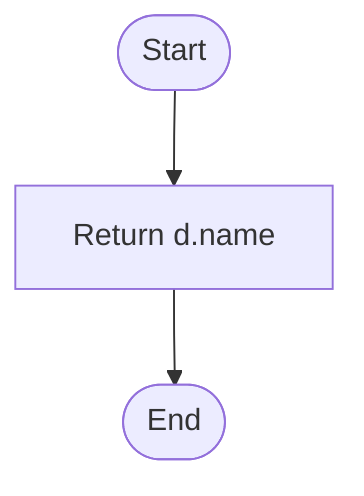

#### 带注释源码

```go
// Name returns the name of the directory.
// 该方法实现了 os.FileInfo 接口的 Name 方法，返回目录条目的名称。
func (d *vfsgen۰DirInfo) Name() string { return d.name }
```


### `vfsgen۰DirInfo.Size`

该方法实现了 `os.FileInfo` 接口的 `Size` 方法，用于返回虚拟文件系统目录的大小信息。由于目录在文件系统中不占用实际大小，该方法固定返回 0。

参数： 无

返回值：`int64`，返回目录的大小，固定为 0

#### 流程图

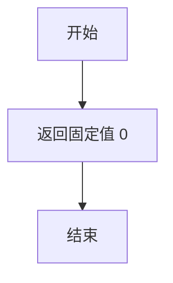

#### 带注释源码

```go
// Size 返回虚拟文件系统目录的大小。
// 对于目录类型，文件系统中通常不记录实际大小，因此固定返回 0。
// 实现了 os.FileInfo 接口的 Size 方法。
func (d *vfsgen۰DirInfo) Size() int64 {
    return 0 // 目录大小始终为 0
}
```


### `vfsgen۰DirInfo.Mode`

获取虚拟文件系统中目录条目（`vfsgen۰DirInfo`）的文件模式，返回目录的权限位和类型标志。

参数：此方法无显式参数。

- （接收者）`d`：`vfsgen۰DirInfo`，指向目录元数据的指针

返回值：`os.FileMode`，返回目录的文件模式，值为 `0755`（所有者读写执行，组和其他读执行）并包含 `os.ModeDir` 标志，表示这是一个目录。

#### 流程图

```mermaid
flowchart TD
    A[开始调用 Mode 方法] --> B{方法接收者 d}
    B -->|接收 vfsgen۰DirInfo 实例| C[返回 os.FileMode: 0755|os.ModeDir]
    C --> D[结束]
```

#### 带注释源码

```go
// Mode 返回目录的文件模式。
// 该方法实现了 os.FileInfo 接口的 Mode 方法，返回目录的权限位（0755）和目录标志（os.ModeDir）。
// 参数说明：
//   - d: vfsgen۰DirInfo 类型的接收者指针，包含目录的名称、修改时间和条目列表。
// 返回值：
//   - os.FileMode: 表示目录权限为 0755（rwxr-xr-x）且带有目录类型标志。
func (d *vfsgen۰DirInfo) Mode() os.FileMode {
    // 0755 表示所有者拥有读、写、执行权限，组和其他用户拥有读、执行权限。
    // os.ModeDir 是一个标志位，表示这是一个目录。
    return 0755 | os.ModeDir
}
```


### `vfsgen۰DirInfo.ModTime`

获取目录的修改时间

参数：

- 该方法无参数

返回值：`time.Time`，返回目录的修改时间

#### 流程图

```mermaid
flowchart TD
    A[调用 ModTime 方法] --> B{接收者 d 是否为 nil}
    B -->|是| C[返回零值 time.Time]
    B -->|否| D[返回 d.modTime 字段值]
```

#### 带注释源码

```go
// ModTime 返回目录的修改时间
// 参数：无
// 返回值：time.Time - 目录的最后修改时间
func (d *vfsgen۰DirInfo) ModTime() time.Time {
    // 直接返回结构体中存储的 modTime 字段
    // 该字段在初始化 vfsgen۰DirInfo 时设置
    // 对于虚拟文件系统中的目录，通常设置为 time.Date(1970, 1, 1, 0, 0, 0, 0, time.UTC)
    return d.modTime
}
```


### `vfsgen۰DirInfo.IsDir`

返回该文件信息是否代表目录。由于 `vfsgen۰DirInfo` 是目录的静态定义，因此始终返回 `true`。

参数：

- （无参数）

返回值：`bool`，返回 `true` 表示该文件信息代表一个目录

#### 流程图

```mermaid
flowchart TD
    A[调用 IsDir 方法] --> B{方法类型}
    B -->|vfsgen۰DirInfo| C[返回 true]
    B -->|vfsgen۰CompressedFileInfo| D[返回 false]
    C --> E[结束]
    D --> E
```

#### 带注释源码

```go
// vfsgen۰DirInfo 是目录的静态定义结构体
type vfsgen۰DirInfo struct {
	name    string         // 目录名称
	modTime time.Time      // 修改时间
	entries []os.FileInfo  // 目录中的条目列表
}

// IsDir 返回该文件信息是否代表目录
// 对于 vfsgen۰DirInfo（目录信息），始终返回 true
func (d *vfsgen۰DirInfo) IsDir() bool { return true }

// 对比：vfsgen۰CompressedFileInfo（压缩文件）的 IsDir 方法
// 对于压缩文件，始终返回 false
func (f *vfsgen۰CompressedFileInfo) IsDir() bool { return false }
```


### `vfsgen۰DirInfo.Sys`

该方法是 `vfsgen۰DirInfo` 结构体实现 `os.FileInfo` 接口的一部分，用于返回底层文件系统数据。由于 vfsgen 生成的虚拟文件系统是静态嵌入的内存数据，没有对应的真实系统文件，因此返回 `nil`。

参数： 无

返回值：`interface{}`，返回底层文件系统数据，虚拟文件系统无实际底层数据，故返回 nil。

#### 流程图

```mermaid
flowchart TD
    A[调用 vfsgen۰DirInfo.Sys] --> B{执行方法体}
    B --> C[返回 nil]
    C --> D[调用方获取接口类型nil值]
```

#### 带注释源码

```go
// Sys 返回底层文件系统数据。
// vfsgen 生成的虚拟文件系统是静态嵌入的内存数据，
// 没有对应的真实系统文件信息，因此统一返回 nil。
// 该方法实现了 os.FileInfo 接口的 Sys 方法。
func (d *vfsgen۰DirInfo) Sys() interface{} {
    return nil
}
```


### `vfsgen۰Dir.Seek`

该方法实现了目录的 Seek 功能，用于调整下一次读取的位置。由于虚拟文件系统的目录是只读的且仅支持从头开始遍历，因此仅支持 offset=0 且 whence=io.SeekStart 的情况，其他情况返回错误。

参数：

- `offset`：`int64`，相对位置的偏移量
- `whence`：`int`，指定位置基准（io.SeekStart、io.SeekCurrent、io.SeekEnd）

返回值：`int64, error`，返回新的位置，失败时返回错误信息

#### 流程图

```mermaid
flowchart TD
    A[开始 Seek] --> B{offset == 0 且 whence == io.SeekStart?}
    B -->|是| C[将 pos 置为 0]
    C --> D[返回位置 0, nil]
    B -->|否| E[返回错误: unsupported Seek in directory]
    D --> F[结束]
    E --> F
```

#### 带注释源码

```go
// Seek 方法实现了 io.Seeker 接口，用于调整文件读取位置
// 对于目录来说，由于是静态虚拟文件系统，仅支持将位置重置到开头
func (d *vfsgen۰Dir) Seek(offset int64, whence int) (int64, error) {
	// 仅当 offset 为 0 且从文件开头开始 Seek 时才支持
	// 这种情况下将目录遍历位置重置为起始位置
	if offset == 0 && whence == io.SeekStart {
		d.pos = 0 // 重置内部位置计数器到条目起始位置
		return 0, nil // 返回新的位置（开头位置为 0）
	}
	// 其他 Seek 模式（从当前位置或末尾开始）在目录中不支持
	// 返回格式化的错误信息，包含目录名称便于调试
	return 0, fmt.Errorf("unsupported Seek in directory %s", d.name)
}
```


### `vfsgen۰Dir.Readdir`

该方法实现目录读取功能，根据传入的 count 参数返回对应数量的目录条目，并更新内部位置指针以支持连续读取。

参数：

- `count`：`int`，表示要读取的目录条目数量。如果 count <= 0，则返回所有剩余条目

返回值：`([]os.FileInfo, error)`，返回目录条目切片（os.FileInfo 数组）和可能的错误。当读取到目录末尾时返回 io.EOF

#### 流程图

```mermaid
flowchart TD
    A[开始 Readdir] --> B{count > 0 且 pos >= len(entries)?}
    B -->|是| C[返回 nil, io.EOF]
    B -->|否| D{count <= 0 或 count > 剩余条目数?}
    D -->|是| E[count = 剩余条目总数]
    D -->|否| F[count 保持原值]
    E --> G[从 entries 切片获取条目]
    F --> G
    G --> H[pos += count]
    I[返回条目切片, nil]
    H --> I
```

#### 带注释源码

```go
// Readdir 返回目录中的文件信息列表
// count 参数指定要读取的条目数量
//   - 如果 count <= 0，返回所有剩余条目
//   - 如果 count > 0，返回最多 count 个条目
//   - 如果已读取完毕，返回 io.EOF
func (d *vfsgen۰Dir) Readdir(count int) ([]os.FileInfo, error) {
	// 如果位置已在末尾且请求读取更多条目，返回 EOF
	if d.pos >= len(d.entries) && count > 0 {
		return nil, io.EOF
	}
	
	// 如果 count <= 0 或 count 超过剩余条目数，则读取所有剩余条目
	if count <= 0 || count > len(d.entries)-d.pos {
		count = len(d.entries) - d.pos
	}
	
	// 从当前位置切片获取条目
	e := d.entries[d.pos : d.pos+count]
	
	// 更新位置指针
	d.pos += count
	
	// 返回获取的条目和 nil 错误
	return e, nil
}
```

## 关键组件


### vfsgen۰FS (map[string]interface{})

虚拟文件系统的核心存储结构，将路径映射到文件或目录的元信息，支持http.FileSystem接口

### templates (全局变量)

全局初始化的虚拟文件系统实例，包含所有嵌入的YAML模板文件（flux-account.yaml.tmpl、flux-deployment.yaml.tmpl、flux-secret.yaml.tmpl、memcache-dep.yaml.tmpl、memcache-svc.yaml.tmpl），文件内容以gzip压缩形式存储

### vfsgen۰CompressedFileInfo

静态压缩文件元信息结构体，包含name（文件名）、modTime（修改时间）、compressedContent（gzip压缩的字节内容）、uncompressedSize（未压缩大小）

### vfsgen۰CompressedFile

打开的压缩文件实例，包含gzip.Reader用于解压缩，支持惰性加载和随机访问（通过grPos和seekPos跟踪位置）

### vfsgen۰DirInfo

静态目录元信息结构体，包含name（目录名）、modTime（修改时间）、entries（目录条目列表）

### vfsgen۰Dir

打开的目录实例，包含位置指针pos用于Readdir遍历

### Open方法 (vfsgen۰FS.Open)

根据路径打开文件或目录，返回http.File接口实现，支持压缩文件和目录的打开

### Read方法 (vfsgen۰CompressedFile.Read)

实现随机访问读取，通过gzip.Reader解压缩，支持seek后的正确位置读取（惰性加载：仅在需要时解压缩）

### Seek方法 (vfsgen۰CompressedFile.Seek)

支持在未压缩数据流中seek（io.SeekStart、io.SeekCurrent、io.SeekEnd）

### Readdir方法 (vfsgen۰Dir.Readdir)

遍历目录条目，支持分页读取（count参数控制返回条数）


## 问题及建议


### 已知问题

- **硬编码时间戳**：所有文件使用`time.Date(1970, 1, 1, 0, 0, 0, 0, time.UTC)`作为修改时间，无法反映模板文件的实际更新时间。
- **内存占用问题**：所有压缩内容在程序启动时全部加载到内存中，对于大型项目或大量模板文件场景，会导致内存占用过高。
- **文件权限固定**：所有文件使用固定权限`0444`（只读），无法根据实际需求调整，在某些场景下可能不便。
- **重复读取性能**：每次调用`Open`都会创建新的`gzip.Reader`，不支持缓存机制，重复打开同一文件时存在性能开销。
- **Seek实现不完整**：`vfsgen۰Dir`的Seek方法仅支持`offset=0 && whence=io.SeekStart`，不支持任意位置Seek。
- **错误信息不够详细**：PathError仅包含基本错误信息，缺少更上下文相关的错误描述。
- **接口实现不完整**：`Readdir`在文件类型上调用时返回错误，但没有提供更友好的错误处理方式。

### 优化建议

- **动态时间戳**：考虑在代码生成时注入实际的模板文件修改时间，或提供配置选项。
- **延迟加载/按需加载**：考虑使用`lazy`选项，仅在首次访问文件时解压，减少启动内存占用。
- **gzip压缩级别优化**：可评估不同压缩级别（速度vs大小）的权衡，当前默认压缩级别可能不是最优。
- **Reader缓存机制**：对于重复打开同一文件的情况，可考虑缓存已解压的内容或Reader实例。
- **添加日志/监控**：在关键路径（如解压失败、文件未找到）添加日志或指标采集，便于运维诊断。
- **接口扩展**：考虑实现`io.Seeker`的完整功能，或在文档中明确标注限制，避免误用。

## 其它


### 设计目标与约束

本模块的设计目标是将一组静态YAML配置文件（Kubernetes部署相关的模板）嵌入到Go二进制文件中，通过实现http.FileSystem接口，使其可以在运行时像访问普通文件系统一样访问这些嵌入的资源。核心约束包括：1）仅支持读取操作，不支持写入；2）所有文件在构建时已压缩，运行时解压缩；3）文件内容不可变，更新需要重新编译；4）作为Go包提供给其他模块导入使用。

### 错误处理与异常设计

代码中的错误处理主要体现在Open方法中：当请求的文件路径不存在时，返回os.ErrNotExist包装的os.PathError。CompressedFile的Read方法在gzip读取失败时会panic（因为生成时保证gzip数据有效）。Seek方法对无效的whence值会panic。整体上，运行时错误以返回error为主，编程错误（代码bug）以panic为主，符合Go的惯用错误处理模式。

### 外部依赖与接口契约

本模块依赖以下外部包：bytes（字节操作）、compress/gzip（解压缩）、fmt（格式化）、io（IO操作）、ioutil（IO工具）、net/http（HTTP文件接口）、os（操作系统接口）、path（路径处理）、time（时间处理）。核心接口契约是实现http.FileSystem接口的Open方法，返回http.File（可以是目录或文件）。同时实现了os.FileInfo接口用于提供文件元数据。

### 性能考虑与优化空间

当前实现中，CompressedFile每次Read都会检查是否需要重置或快进gzip读取器，这有一定的性能开销。优化方向包括：1）添加缓冲读取减少每次读取的开销；2）对于频繁访问的文件可以考虑缓存解压缩后的内容；3）使用sync.Pool复用gzip.Reader对象减少分配。当前设计优先考虑代码简洁性和嵌入文件的体积优化（使用gzip压缩），适合文件数量不多且读取不频繁的场景。

### 安全性考虑

由于文件内容是构建时嵌入的静态资源，不存在运行时注入攻击的风险。文件模式设置为0444（只读），防止被意外修改。不涉及敏感信息处理（模板中的密钥等由使用者运行时注入）。主要安全考量在于模板文件本身的内容安全性，以及最终部署时的凭据管理。

### 测试策略建议

建议包含以下测试：1）单元测试验证各类型（CompressedFileInfo、DirInfo）的Stat返回正确的元数据；2）Open方法对有效路径和无效路径的测试；3）CompressedFile的Read/Seek/Close功能测试，包括边界条件（文件末尾、非法偏移）；4）目录的Readdir功能测试；5）集成测试验证整个http.FileSystem接口的正确性。

### 部署和使用方式

本模块作为Go包发布，使用方通过import语句引入，然后通过templates变量（类型为http.FileSystem）访问嵌入的文件。可以与Go的http.FileServer配合使用来提供服务，或者直接读取文件内容进行模板渲染。使用时需注意文件路径需要以"/"开头，路径需要使用pathpkg.Clean规范化。

### 版本和兼容性考虑

当前代码由vfsgen自动生成，每次源文件变更需要重新生成代码。vfsgen的版本升级可能导致生成代码的细微差异。建议锁定vfsgen版本，并在版本升级时重新生成测试。由于依赖Go标准库和http.FileSystem接口，兼容性主要取决于Go语言版本的兼容性声明（本代码使用标准库特性，无特殊版本要求）。


    