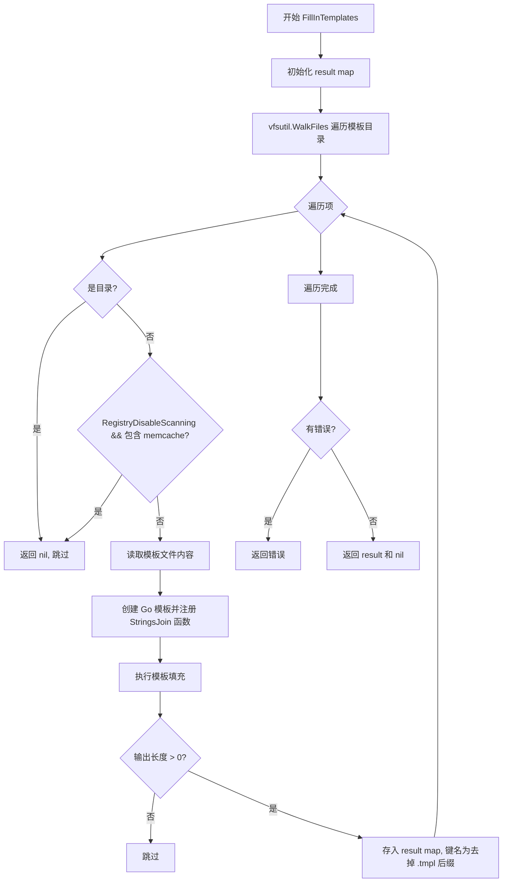
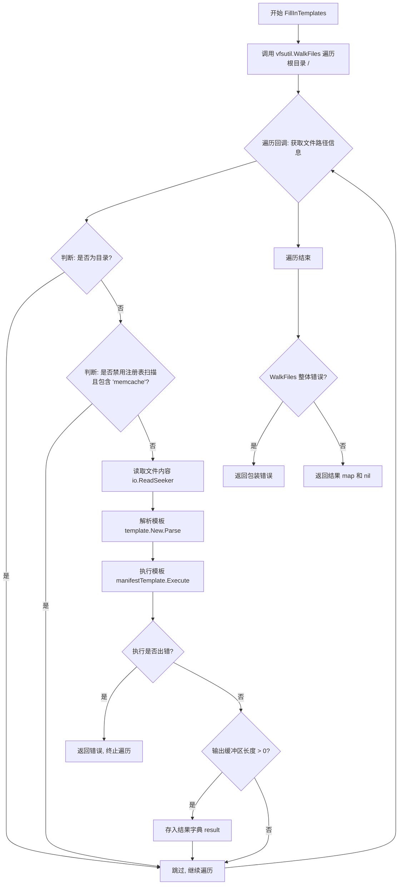

# `flux\pkg\install\install.go` 详细设计文档

该代码是一个 Go 语言的安装模板生成包，通过 FillInTemplates 函数遍历嵌入式模板文件，使用 TemplateParameters 中定义的 Git 配置、命名空间、Flux 参数等变量填充模板，生成最终的 Kubernetes 清单文件，支持条件性地排除某些资源（如禁用注册表扫描时排除 memcached）。

## 整体流程



## 类结构

```
TemplateParameters (模板参数结构体)
└── FillInTemplates (模板填充函数)
```

## 全局变量及字段


### `templates`
    
嵌入式模板文件系统，通过 go:generate 生成

类型：`vfsutil.VirtualFiles`
    


### `TemplateParameters.GitURL`
    
Git 仓库 URL

类型：`string`
    


### `TemplateParameters.GitBranch`
    
Git 分支名称

类型：`string`
    


### `TemplateParameters.GitPaths`
    
Git 路径列表

类型：`[]string`
    


### `TemplateParameters.GitLabel`
    
Git 标签

类型：`string`
    


### `TemplateParameters.GitUser`
    
Git 用户名

类型：`string`
    


### `TemplateParameters.GitEmail`
    
Git 用户邮箱

类型：`string`
    


### `TemplateParameters.GitReadOnly`
    
是否只读

类型：`bool`
    


### `TemplateParameters.RegistryDisableScanning`
    
是否禁用注册表扫描

类型：`bool`
    


### `TemplateParameters.Namespace`
    
命名空间

类型：`string`
    


### `TemplateParameters.ManifestGeneration`
    
是否生成清单

类型：`bool`
    


### `TemplateParameters.AdditionalFluxArgs`
    
额外的 Flux 参数

类型：`[]string`
    


### `TemplateParameters.AddSecurityContext`
    
是否添加安全上下文

类型：`bool`
    
    

## 全局函数及方法


### `FillInTemplates`

#### 描述
该函数是安装流程的核心引擎。它接收一个包含 Git 仓库、命名空间及配置参数的 `TemplateParameters` 结构体，遍历项目内置的虚拟文件系统（Embedded Files）中的所有模板文件，解析并执行 Go `text/template`，将参数注入模板，最终生成 Kubernetes 清单文件（Manifests）的映射表并返回。

#### 参数

- `params`：`TemplateParameters`，包含用于填充模板的详细配置信息（如 Git URL、分支、命名空间、Flux 参数等）。

#### 返回值

- `map[string][]byte`：返回键值对映射，键为文件名（已去除 `.tmpl` 后缀），值为生成的文件内容（字节数组）。
- `error`：如果在遍历文件系统、读取文件、解析模板或执行模板时发生任何错误，则返回相应的错误信息。

#### 流程图



#### 带注释源码

```go
func FillInTemplates(params TemplateParameters) (map[string][]byte, error) {
	// 初始化结果字典，用于存储生成的清单文件
	result := map[string][]byte{}
	
	// 使用 vfsutil 遍历 'templates' 虚拟文件系统中的所有文件
	err := vfsutil.WalkFiles(templates, "/", func(path string, info os.FileInfo, rs io.ReadSeeker, err error) error {
		// 检查遍历过程中的错误
		if err != nil {
			return fmt.Errorf("cannot walk embedded files: %s", err)
		}
		
		// 1. 目录过滤：如果是目录，则跳过
		if info.IsDir() {
			return nil
		}
		
		// 2. 特性逻辑：如果禁用了注册表扫描，则不包含 memcached 资源
		if params.RegistryDisableScanning && strings.Contains(info.Name(), "memcache") {
			// do not include memcached resources when registry scanning is disabled
			return nil
		}
		
		// 3. 读取模板内容：将模板文件的io流读取为字节数组
		manifestTemplateBytes, err := ioutil.ReadAll(rs)
		if err != nil {
			return fmt.Errorf("cannot read embedded file %q: %s", info.Name(), err)
		}
		
		// 4. 解析模板：创建模板实例并注入自定义函数 "StringsJoin"
		manifestTemplate, err := template.New(info.Name()).
			Funcs(template.FuncMap{"StringsJoin": strings.Join}).
			Parse(string(manifestTemplateBytes))
		if err != nil {
			return fmt.Errorf("cannot parse embedded file %q: %s", info.Name(), err)
		}
		
		// 5. 执行模板：将参数注入模板，输出到 Buffer
		out := bytes.NewBuffer(nil)
		if err := manifestTemplate.Execute(out, params); err != nil {
			return fmt.Errorf("cannot execute template for embedded file %q: %s", info.Name(), err)
		}
		
		// 6. 存储结果：只保存非空输出，并去除文件名后缀 .tmpl
		if out.Len() > 0 {
			result[strings.TrimSuffix(info.Name(), ".tmpl")] = out.Bytes()
		}
		return nil
	})
	
	// 处理 WalkFiles 本身的错误
	if err != nil {
		return nil, fmt.Errorf("internal error filling embedded installation templates: %s", err)
	}
	return result, nil
}
```

#### 关键组件信息

- **`TemplateParameters` (结构体)**: 定义了填充模板所需的所有配置字段，是生成配置的“数据源”。
- **`templates` (vfs.FileSystem)**: 隐藏的全局变量，代表程序编译时嵌入的模板文件目录。
- **`vfsutil.WalkFiles`**: 来自 `shurcooL/httpfs/vfsutil` 包的工具，用于遍历虚拟文件系统。
- **`template.New(...).Funcs(...).Parse(...)`**: Go 标准库 `text/template` 的典型用法，用于编译模板。

#### 潜在的技术债务或优化空间

1.  **硬编码的业务逻辑**: 在遍历循环中直接判断 `strings.Contains(info.Name(), "memcache")` 并结合 `RegistryDisableScanning` 参数，这种逻辑耦合在文件遍历的循环中，如果将来增加其他需要过滤的资源（如 `redis`），会导致此函数逻辑膨胀。建议将过滤逻辑抽象为独立的 `Filter` 函数或配置项。
2.  **内存使用**: 使用 `ioutil.ReadAll` 会将整个模板文件一次性加载到内存。对于超大的 YAML/JSON 模板，可能会导致内存峰值。更优雅的做法是使用流式处理（Streaming）或限制模板大小。
3.  **错误处理粒度**: 一旦遍历中任何一个文件出错，`WalkFiles` 就会停止并返回错误。在批量生成场景下，可能更希望收集所有文件的错误（部分成功机制），而非一旦出错便全局失败。

#### 其它项目

- **设计约束**: 依赖 Go 的 `text/template` 语法，模板文件必须遵循 Go 模板规范。文件名必须以 `.tmpl` 结尾以被正确识别。
- **外部依赖**: 显式依赖 `github.com/shurcooL/httpfs/vfsutil`，这是一个第三方库，用于处理嵌入文件系统的遍历。
- **数据流**: Input (TemplateParameters) -> Process (Walk & Execute Template) -> Output (Manifest Map)。这是一个典型的 ETL (Extract-Transform-Load) 流程。

## 关键组件


### TemplateParameters 结构体

用于配置模板填充的参数结构体，包含Git仓库配置（URL、分支、路径、标签、用户、邮箱）、命名空间、Flux参数、注册表扫描选项、清单生成选项和安全性上下文等配置。

### FillInTemplates 函数

核心函数，遍历嵌入式模板目录，根据传入的TemplateParameters参数填充模板，生成对应的配置文件映射表。支持条件过滤（如禁用注册表扫描时排除memcache资源）。

### templates 虚拟文件系统

通过vfsutil包访问的嵌入式模板文件系统，存储在编译后的二进制中，用于生成Kubernetes部署清单。

### 模板解析与执行引擎

使用Go的text/template包解析模板文件，支持自定义函数（StringsJoin），并将填充后的内容输出为字节数组。

### 条件过滤逻辑

根据RegistryDisableScanning参数动态决定是否包含memcached相关资源，实现安装选项的灵活性。

### 参数校验与错误处理

通过逐层错误传播机制，处理文件遍历、读取、解析和执行各阶段的错误，返回具有明确上下文的错误信息。


## 问题及建议


### 已知问题

-   使用了已废弃的 `io/ioutil` 包，应使用 `io` 和 `os` 包中的对应函数
-   模板解析和执行在每次调用时都重新进行，没有缓存机制，性能较低
-   错误处理虽然存在但较为基础，缺少对参数合法性的校验
-   `WalkFiles` 回调函数中无法取消或超时控制，长时间运行可能无法中断
-   `.tmpl` 后缀硬编码在代码中，扩展性不足
-   缺少对空目录或空文件的处理逻辑说明
-   `TemplateParameters` 中的切片类型字段（`GitPaths`、`AdditionalFluxArgs`）直接使用，可能导致意外的引用修改

### 优化建议

-   将 `ioutil.ReadAll` 替换为 `io.ReadAll`，移除 `ioutil` 导入
-   考虑添加模板缓存机制，避免重复解析相同的嵌入文件模板
-   为 `FillInTemplates` 函数增加 `context.Context` 参数，支持超时和取消控制
-   将 `.tmpl` 后缀提取为常量或配置项，提高可维护性
-   对 `TemplateParameters` 添加基本的合法性校验，如检查必填字段是否为空
-   考虑为关键功能添加单元测试，提高代码覆盖率
-   可以将文件遍历、模板解析、模板执行分离为更细粒度的函数，提高代码可读性和可测试性

## 其它


### 设计目标与约束

本模块的设计目标是实现一个灵活的Kubernetes manifest生成系统，通过嵌入的Go模板机制，根据不同的配置参数动态生成安装配置文件。核心约束包括：使用Go 1.11+的embed特性（代码中使用//go:generate），依赖github.com/shurcooL/httpfs/vfsutil进行虚拟文件系统遍历，模板文件必须位于templates目录且以.tmpl为后缀。

### 错误处理与异常设计

错误处理采用Go语言的错误返回值模式。WalkFiles回调函数中错误直接向上传播，最终通过fmt.Errorf包装返回。主要错误场景包括：文件遍历失败（"cannot walk embedded files"）、文件读取失败（"cannot read embedded file"）、模板解析失败（"cannot parse embedded file"）、模板执行失败（"cannot execute template"）。所有错误都包含具体的文件路径信息，便于问题定位。当RegistryDisableScanning为true时，memcache相关文件会被静默跳过而非报错。

### 数据流与状态机

数据流主要分为三个阶段：1)模板遍历阶段，使用vfsutil.WalkFiles递归遍历嵌入式文件系统；2)模板处理阶段，对每个非目录文件进行读取、解析、执行；3)结果组装阶段，将生成的manifest字节数组按文件名存储到结果map中。状态机较为简单，主要状态包括：初始状态→遍历中→处理中→完成，每个文件处理是相互独立的。

### 外部依赖与接口契约

外部依赖包括：github.com/shurcooL/httpfs/vfsutil用于虚拟文件系统遍历，text/template用于模板解析，io/ioutil（Go 1.16+建议使用io/os）用于文件读取，bytes用于缓冲区管理。接口契约方面：FillInTemplates函数接收TemplateParameters结构体，返回map[string][]byte（文件名到内容的映射）和error。TemplateParameters是输入契约，map[string][]byte是输出契约。

### 性能考虑

性能方面主要关注点：1)模板解析结果未被缓存，每次调用都会重新解析所有模板，对于频繁调用的场景可以考虑添加缓存层；2)使用bytes.Buffer避免频繁内存分配；3)WalkFiles是串行处理，可考虑并行化（但需注意文件写入的并发安全）；4)嵌入式文件系统的大小直接影响二进制文件体积。

### 安全性考虑

安全性设计：1)模板执行时传入的TemplateParameters应进行输入校验，特别是GitURL等字段应验证格式合法性；2)模板函数仅暴露strings.join（通过别名StringsJoin），避免注入风险；3)生成的manifest内容应考虑敏感信息处理（如密码、token等不应出现在模板参数中或应加密存储）。

### 并发设计

当前实现为单线程串行处理，无显式并发控制。如需并发优化：1)模板解析可以并行进行；2)模板执行可以并行进行；3)结果写入map时需要加锁，或者使用sync.Map；4)考虑到模板数量可能不多，并发收益可能有限，建议通过基准测试验证后再决定是否并行化。

### 测试策略

测试应覆盖：1)正常场景测试，验证各类参数组合下生成的manifest内容正确性；2)边界条件测试，包括空参数、特殊字符、RegistryDisableScanning开关等；3)错误场景测试，模拟模板文件损坏、权限问题等；4)性能测试，验证大规模模板处理时的响应时间；5)回归测试，确保修改后的输出与历史版本一致。

### 配置管理

TemplateParameters结构体本身就是配置模型。建议：1)为每个字段添加validate方法进行配置校验；2)考虑使用viper等配置管理库读取环境变量或配置文件；3)配置默认值应集中在初始化逻辑中；4)配置变更应支持热重载（如果作为长期运行服务）。

### 版本兼容性

需要考虑的兼容性：1)Go版本兼容性，当前代码使用io/ioutil（Go 1.16前），建议改用io/os以兼容新版；2)模板语法兼容性，text/template包相对稳定；3)嵌入式文件系统格式兼容性；4)对外接口兼容性，FillInTemplates的签名应保持稳定。

### 资源管理

资源管理方面：1)bytes.Buffer使用后会自动GC，但大量调用时建议复用buffer；2)io.ReadSeeker在遍历完成后自动关闭；3)模板对象使用后会被GC，无需显式释放；4)考虑使用资源池模式管理buffer对象，减少GC压力。


    