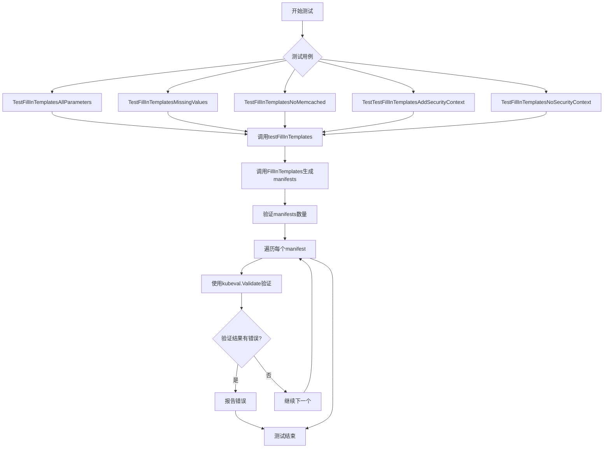
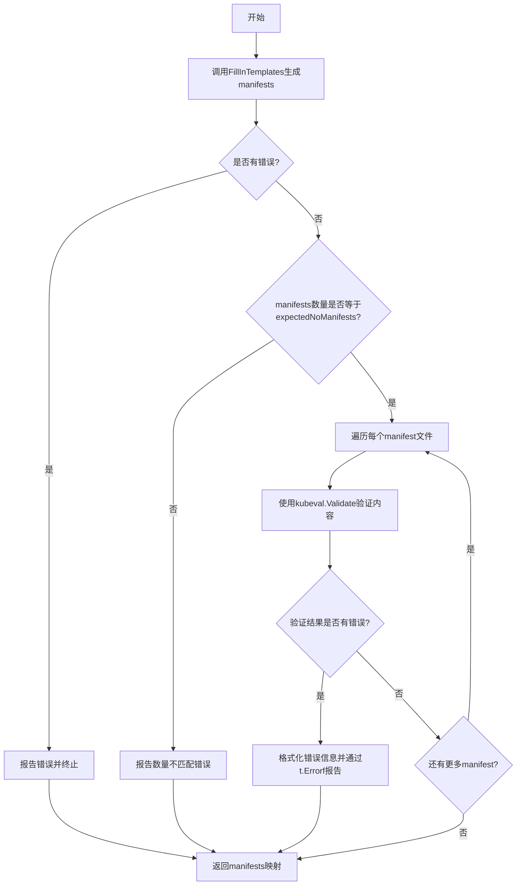
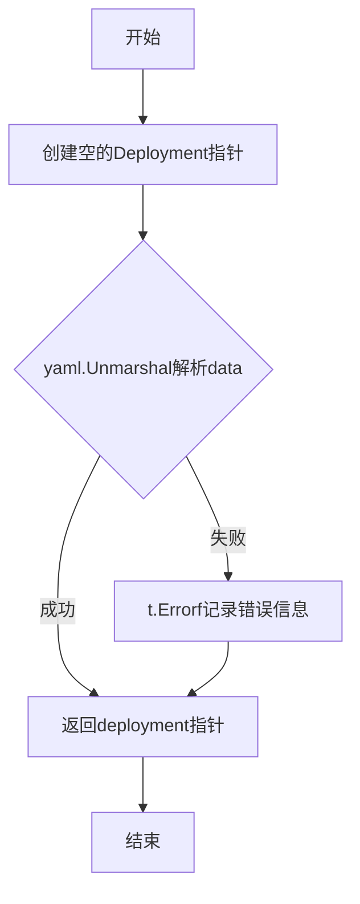
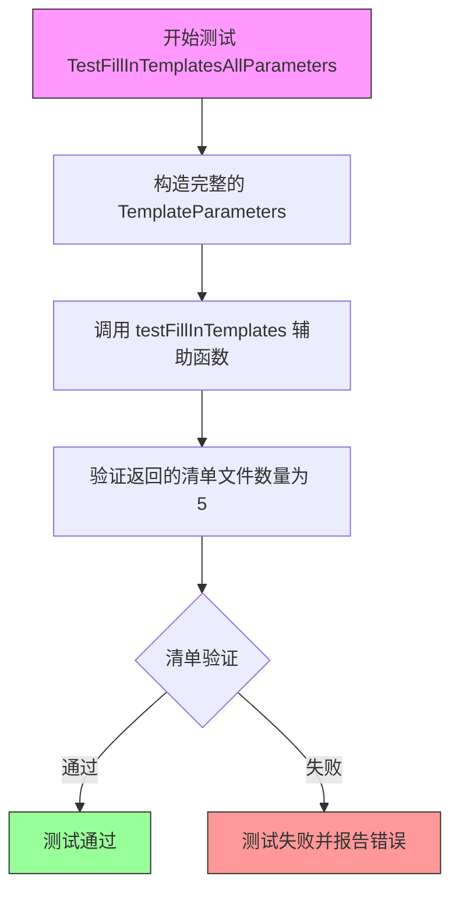
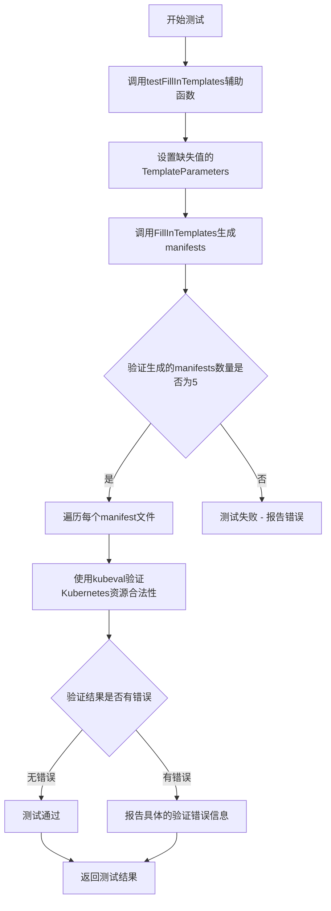
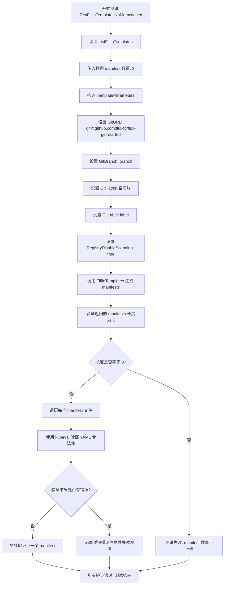
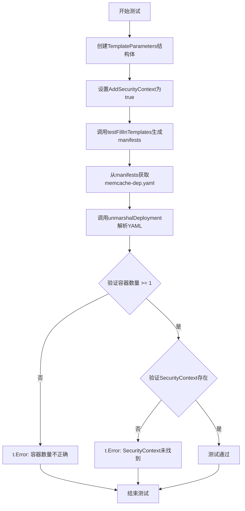
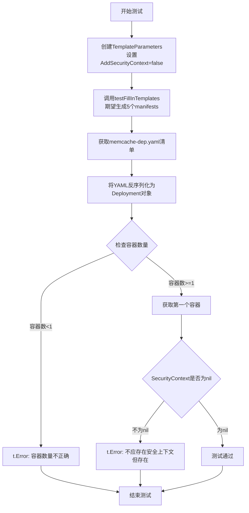

# `flux\pkg\install\install_test.go` 详细设计文档

这是一个Go语言的测试文件，用于测试install包中的FillInTemplates函数，该函数根据TemplateParameters生成Kubernetes manifest文件，并通过kubeval进行验证，同时测试了不同参数组合（如包含/不包含memcached、是否添加安全上下文等）下的行为。

## 整体流程



## 类结构

```
install (包)
├── install_test.go (测试文件)
├── Deployment (本地结构体定义)
└── 依赖: TemplateParameters, FillInTemplates
```

## 全局变量及字段


### `testFillInTemplates`
    
测试辅助函数，用于验证FillInTemplates函数是否正确生成指定数量的manifests，并对每个manifest进行Kubernetes YAML验证

类型：`func(t *testing.T, expectedNoManifests int, params TemplateParameters) map[string][]byte`
    


### `unmarshalDeployment`
    
将YAML数据解析为Deployment结构体，用于测试中验证生成的Kubernetes部署清单内容

类型：`func(t *testing.T, data []byte) *Deployment`
    


### `FillInTemplates`
    
根据传入的模板参数生成Kubernetes部署清单YAML文件

类型：`func(params TemplateParameters) (map[string][]byte, error)`
    


### `TemplateParameters`
    
模板参数结构体，包含Git仓库配置、命名空间、Flux参数等用于生成K8s清单的配置信息

类型：`struct`
    


### `Deployment.Spec.Spec.Template.Spec.Containers[].SecurityContext`
    
容器安全上下文配置，用于定义容器运行时的安全策略

类型：`*struct{}`
    
    

## 全局函数及方法


### `testFillInTemplates`

该函数是 Go 测试包中的一个辅助测试函数，用于验证 `FillInTemplates` 函数生成的 Kubernetes 清单文件（manifests）的数量是否符合预期，并通过 kubeval 工具对每个生成的 YAML 文件进行语法和 schema 验证，确保生成的清单文件是有效的 Kubernetes 资源定义。

参数：

- `t`：`*testing.T`，Go 测试框架的测试对象，用于报告测试失败和错误信息
- `expectedNoManifests`：`int`，期望生成的清单文件数量，用于断言验证
- `params`：`TemplateParameters`，模板参数结构体，包含生成清单所需的配置信息（如 Git 仓库地址、分支、命名空间等）

返回值：`map[string][]byte`，返回一个映射，其中键为文件名（如 `memcache-dep.yaml`），值为对应文件的字节内容

#### 流程图



#### 带注释源码

```go
// testFillInTemplates 是一个测试辅助函数，用于验证 FillInTemplates 生成的清单文件
// 参数：
//   - t: 测试框架提供的测试对象
//   - expectedNoManifests: 期望生成的清单文件数量
//   - params: 模板参数，包含生成清单所需的配置
// 返回值：
//   - map[string][]byte: 文件名到文件内容的映射
func testFillInTemplates(t *testing.T, expectedNoManifests int, params TemplateParameters) map[string][]byte {
	// 调用 FillInTemplates 函数生成清单文件
	manifests, err := FillInTemplates(params)
	// 断言生成过程没有错误
	assert.NoError(t, err)
	// 断言生成的清单数量符合预期
	assert.Len(t, manifests, expectedNoManifests)

	// 遍历每个生成的清单文件进行验证
	for fileName, contents := range manifests {
		// 使用 kubeval 工具验证 YAML 内容是否符合 Kubernetes schema
		validationResults, err := kubeval.Validate(contents)
		// 断言验证过程没有错误
		assert.NoError(t, err)
		// 检查每个验证结果
		for _, result := range validationResults {
			// 如果存在错误，记录详细信息
			if len(result.Errors) > 0 {
				t.Errorf("found problems with manifest %s (Kind %s):\ncontent:\n%s\nerrors: %s",
					fileName,
					result.Kind,
					string(contents),
					result.Errors)
			}
		}
	}

	// 返回生成的清单映射，供调用者进一步检查
	return manifests
}
```


### `unmarshalDeployment`

将 YAML 格式的字节数据反序列化为 `Deployment` 结构体对象，用于在测试中验证生成的 Kubernetes Deployment manifest 内容是否正确。

参数：

- `t`：`*testing.T`，Go 测试框架的测试对象，用于报告反序列化过程中的错误
- `data`：`[]byte`，包含 YAML 格式的 Kubernetes Deployment 定义的字节数组

返回值：`*Deployment`，解析成功后的 Deployment 结构体指针；如果解析失败，会记录错误但仍然返回空的 Deployment 对象

#### 流程图



#### 带注释源码

```go
// unmarshalDeployment 将YAML数据反序列化为Deployment对象
// 参数t用于报告解析错误，data为待解析的YAML字节数据
// 返回解析后的Deployment指针，失败时仍返回空指针但会记录错误
func unmarshalDeployment(t *testing.T, data []byte) *Deployment {
    // 初始化空的Deployment结构体指针
    deployment := &Deployment{}
    
    // 使用yaml.v2库将字节数据反序列化为Deployment结构
    if err := yaml.Unmarshal(data, deployment); err != nil {
        // 解析失败时记录错误信息到测试中
        t.Errorf("issue decoding memcache-dep.yaml into a deployment: %#v", err)
    }
    
    // 返回解析后的Deployment对象（无论成功与否）
    return deployment
}
```


### `TestFillInTemplatesAllParameters`

该函数是一个测试用例，用于验证 `FillInTemplates` 函数在提供所有参数（包括 Git 配置、命名空间、Flux 参数和安全上下文等）时能够正确生成 Kubernetes 清单文件。

参数：

-  `t`：`testing.T`，Go 语言测试框架的标准参数，用于报告测试失败和记录测试状态

返回值：无（`void`），该函数直接调用 `testFillInTemplates` 辅助函数进行验证

#### 流程图



#### 带注释源码

```go
// TestFillInTemplatesAllParameters 测试使用所有参数的模板填充功能
// 该测试验证 FillInTemplates 函数在提供完整参数集时能够正确生成
// 5 个 Kubernetes 清单文件，包括验证每个清单的语法有效性
func TestFillInTemplatesAllParameters(t *testing.T) {
	// 调用辅助测试函数，传入预期的清单数量（5个）和完整的模板参数
	testFillInTemplates(t, 5, TemplateParameters{
		GitURL:             "git@github.com:fluxcd/flux-get-started", // Git 仓库地址
		GitBranch:          "branch",                                  // Git 分支名称
		GitPaths:           []string{"dir1", "dir2"},                   // Git 路径列表
		GitLabel:           "label",                                    // Git 标签/标识
		GitUser:            "User",                                     // Git 用户名
		GitEmail:           "this.is@anemail.com",                      // Git 用户邮箱
		Namespace:          "flux",                                     // Kubernetes 命名空间
		GitReadOnly:        false,                                      // Git 是否只读
		ManifestGeneration: true,                                       // 是否启用清单生成
		AdditionalFluxArgs: []string{"arg1=foo", "arg2=bar"},           // 额外的 Flux 参数
		AddSecurityContext: true,                                       // 是否添加安全上下文
	})
}
```


### `TestFillInTemplatesMissingValues`

该测试函数用于验证当模板参数缺少部分可选字段（如GitUser、GitEmail、Namespace等）时，`FillInTemplates`函数仍能正确生成指定数量的Kubernetes清单文件。

参数：

- `t`：`*testing.T`，Go测试框架的测试对象，用于报告测试失败和记录日志信息

返回值：无（Go测试函数默认为void）

#### 流程图



#### 带注释源码

```go
// TestFillInTemplatesMissingValues 测试当模板参数缺少部分可选字段时的行为
// 该测试用例验证FillInTemplates函数能够处理不完整的参数并生成预期数量的manifests
func TestFillInTemplatesMissingValues(t *testing.T) {
	// 调用testFillInTemplates辅助函数进行测试
	// 预期生成5个manifest文件
	// 传入的TemplateParameters仅包含部分必填字段，缺少以下可选字段：
	// - GitUser
	// - GitEmail
	// - Namespace
	// - GitReadOnly
	// - ManifestGeneration
	// - AdditionalFluxArgs
	// - AddSecurityContext
	// - RegistryDisableScanning
	testFillInTemplates(t, 5, TemplateParameters{
		GitURL:    "git@github.com:fluxcd/flux-get-started", // Git仓库URL（必填）
		GitBranch: "branch",                                  // Git分支（必填）
		GitPaths:  []string{},                                 // Git路径（可选，设为空切片）
		GitLabel:  "label",                                    // Git标签（必填）
	})
}
```


### `TestFillInTemplatesNoMemcached`

这是一个测试函数，用于验证当 `RegistryDisableScanning` 参数设置为 `true` 时，`FillInTemplates` 函数生成的 Kubernetes manifest 数量为 3（不包含 memcached 相关的 manifest），并对每个生成的 manifest 进行 YAML 格式验证。

参数：

- `t`：`testing.T`，Go 测试框架提供的测试上下文，用于报告测试失败和日志输出

返回值：无（Go 测试函数无返回值）

#### 流程图



#### 带注释源码

```go
// TestFillInTemplatesNoMemcached 测试当禁用注册表扫描时生成的 manifest 数量
// 预期结果：生成 3 个 manifest（不包含 memcached 相关的 manifest）
func TestFillInTemplatesNoMemcached(t *testing.T) {
    // 调用通用测试辅助函数，传入：
    // - t: 测试上下文
    // - 3: 预期生成的 manifest 数量（不包含 memcached）
    // - TemplateParameters: 模板参数配置
    testFillInTemplates(t, 3, TemplateParameters{
        // Git 仓库地址
        GitURL:     "git@github.com:fluxcd/flux-get-started",
        // Git 分支名称
        GitBranch:  "branch",
        // Git 路径列表（空）
        GitPaths:   []string{},
        // Git 标签
        GitLabel:   "label",
        // 关键参数：禁用注册表扫描，设置为 true 时不会生成 memcached 相关的 manifest
        RegistryDisableScanning: true,
    })
}
```


### `TestTestFillInTemplatesAddSecurityContext`

这是一个Go语言的测试函数，用于验证当`TemplateParameters`中的`AddSecurityContext`字段设置为`true`时，生成的Kubernetes Deployment清单文件中容器是否正确包含了`securityContext`配置。该测试通过调用`FillInTemplates`生成清单，然后解析`memcache-dep.yaml`并检查容器安全上下文的完整性。

参数：

- `t`：`testing.T`，Go测试框架的标准参数，用于报告测试失败和日志输出

返回值：无（`void`），该函数为测试函数，通过`testing.T`的方法报告测试结果

#### 流程图



#### 带注释源码

```go
// TestTestFillInTemplatesAddSecurityContext 测试当AddSecurityContext为true时
// 生成的Deployment中是否包含SecurityContext
// 参数: t *testing.T - Go测试框架的测试上下文
// 返回值: 无 (测试函数通过t报告结果)
func TestTestFillInTemplatesAddSecurityContext(t *testing.T) {
    // 1. 构造测试参数，设置AddSecurityContext为true
    params := TemplateParameters{
        GitURL:             "git@github.com:fluxcd/flux-get-started",
        GitBranch:          "branch",
        GitPaths:           []string{"dir1", "dir2"},
        GitLabel:           "label",
        GitUser:            "User",
        GitEmail:           "this.is@anemail.com",
        Namespace:          "flux",
        GitReadOnly:        false,
        ManifestGeneration: true,
        AdditionalFluxArgs: []string{"arg1=foo", "arg2=bar"},
        AddSecurityContext: true, // 关键参数：启用安全上下文
    }

    // 2. 调用通用测试辅助函数FillInTemplates，期望生成5个manifest文件
    manifests := testFillInTemplates(t, 5, params)

    // 3. 从生成的manifests中获取memcache-dep.yaml文件内容
    memDeploy := manifests["memcache-dep.yaml"]
    
    // 4. 将YAML内容反序列化为Deployment结构体
    deployment := unmarshalDeployment(t, memDeploy)

    // 5. 验证Deployment中至少有一个容器
    if len(deployment.Spec.Template.Spec.Containers) < 1 {
        t.Error("incorrect number of containers in deployment")
    }
    
    // 6. 获取第一个容器
    container := deployment.Spec.Template.Spec.Containers[0]
    
    // 7. 验证容器的SecurityContext不为nil（即存在安全上下文配置）
    if container.SecurityContext == nil {
        t.Error("security context not found when there should be one")
    }
}
```

#### 关键组件信息

| 组件名称 | 描述 |
|---------|------|
| `testFillInTemplates` | 通用测试辅助函数，负责调用`FillInTemplates`并验证生成的清单文件数量和Kubernetes资源有效性 |
| `unmarshalDeployment` | 将YAML字节数据反序列化为`Deployment`结构体的辅助函数 |
| `Deployment` | 自定义的精简版Kubernetes Deployment结构体，仅包含验证所需的字段（Spec.Template.Spec.Containers） |
| `TemplateParameters` | 模板参数结构体，包含Git配置、命名空间、Flux参数和安全上下文开关等 |

#### 潜在技术债务与优化空间

1. **重复代码**：测试函数中存在大量重复的`TemplateParameters`构造代码，可提取为测试fixture或表驱动测试
2. **硬编码值**：测试中的参数值（如Git URL、namespace）是硬编码的，建议使用常量或环境变量
3. **验证逻辑泄露**：`Deployment`结构体定义在测试文件中，而非生产代码中，这可能表明生产代码缺少相应的类型定义
4. **错误处理不足**：`unmarshalDeployment`函数中错误仅记录日志而未中断测试，可能导致后续测试在无效数据上继续执行
5. **测试隔离性**：测试依赖于`FillInTemplates`的副作用和文件系统中的特定文件名，耦合度较高

#### 其它项目

- **设计约束**：该测试假设`FillInTemplates`会生成`memcache-dep.yaml`文件，且该文件包含至少一个容器
- **错误处理策略**：使用`testing.T`的`Errorf`和`Error`方法报告测试失败，而非panic或返回错误
- **外部依赖**：依赖`kubeval`进行Kubernetes清单验证，依赖`yaml.v2`进行YAML解析
- **数据流**：测试数据流为：TemplateParameters → FillInTemplates → manifests map → YAML解析 → 结构体验证


### `TestFillInTemplatesNoSecurityContext`

该测试函数用于验证当`AddSecurityContext`参数设置为`false`时，生成的Kubernetes部署清单中容器不包含安全上下文（securityContext）字段，确保模板填充功能正确处理安全上下文选项。

参数：

- `t`：`testing.T`，Go测试框架的标准测试参数，用于报告测试失败

返回值：`无`（Go测试函数不返回值）

#### 流程图



#### 带注释源码

```go
// TestFillInTemplatesNoSecurityContext 测试当AddSecurityContext=false时
// 生成的deployment不包含securityContext字段
func TestFillInTemplatesNoSecurityContext(t *testing.T) {
	// 步骤1: 构建模板参数，禁用安全上下文
	params := TemplateParameters{
		GitURL:             "git@github.com:fluxcd/flux-get-started",
		GitBranch:          "branch",
		GitPaths:           []string{"dir1", "dir2"},
		GitLabel:           "label",
		GitUser:            "User",
		GitEmail:           "this.is@anemail.com",
		Namespace:          "flux",
		GitReadOnly:        false,
		ManifestGeneration: true,
		AdditionalFluxArgs: []string{"arg1=foo", "arg2=bar"},
		AddSecurityContext: false, // 关键参数: 禁用安全上下文
	}

	// 步骤2: 调用辅助测试函数生成清单并验证
	// 期望生成5个manifest文件
	manifests := testFillInTemplates(t, 5, params)
	
	// 步骤3: 获取memcache的deployment清单
	memDeploy := manifests["memcache-dep.yaml"]

	// 步骤4: 将YAML内容反序列化为Deployment结构体
	deployment := unmarshalDeployment(t, memDeploy)
	
	// 步骤5: 验证容器数量至少为1
	if len(deployment.Spec.Template.Spec.Containers) < 1 {
		t.Error("incorrect number of containers in deployment")
	}
	
	// 步骤6: 获取第一个容器并验证其SecurityContext为nil
	container := deployment.Spec.Template.Spec.Containers[0]
	if container.SecurityContext != nil {
		// 如果不为nil说明模板填充了安全上下文，与预期不符
		t.Errorf("security context found when there should be none: %#v", container.SecurityContext)
	}
}
```

## 关键组件


### FillInTemplates 函数

核心模板生成函数，根据传入的 TemplateParameters 生成 Kubernetes manifest 文件。该函数是整个 install 包的主要功能入口，负责生成 flux 部署所需的 YAML 配置文件。

### testFillInTemplates 测试辅助函数

测试框架的核心辅助函数，用于验证 FillInTemplates 生成的 manifest 数量是否符合预期，并使用 kubeval 对生成的 YAML 进行 Kubernetes schema 验证，确保生成的 manifest 符合 Kubernetes 规范。

### TemplateParameters 结构

模板参数定义，包含 Git 配置（URL、branch、paths、label、user、email）、命名空间、flux 参数（readOnly、manifestGeneration、additionalFluxArgs）、安全上下文开关（addSecurityContext）以及注册表扫描配置（registryDisableScanning）等用于定制化生成 manifest 的所有参数。

### Deployment 结构

本地定义的精简 Deployment 结构体，用于避免引入完整的 Kubernetes 依赖包。该结构体仅包含解析 containers 和 securityContext 所需的字段，通过 yaml 标签支持 YAML 解析。

### unmarshalDeployment 函数

将 YAML 字节数据解析为 Deployment 对象的辅助函数，用于在测试中验证生成的 memcache deployment manifest 内容是否包含正确的容器和安全上下文配置。

### kubeval 验证集成

使用 kubeval 库对生成的 manifest 进行 Kubernetes schema 验证，这是代码中的关键组件，确保生成的 YAML 文件符合 Kubernetes API 规范，能够被 Kubernetes 集群正确解析。

### 安全上下文测试组件

围绕 AddSecurityContext 参数的测试验证体系，包括 TestTestFillInTemplatesAddSecurityContext 和 TestFillInTemplatesNoSecurityContext 两个测试用例，用于验证安全上下文功能的正确性。

### 多种参数场景测试

包含多个测试用例覆盖不同的参数组合场景：完整参数测试（TestFillInTemplatesAllParameters）、缺失值测试（TestFillInTemplatesMissingValues）、禁用 memcached 测试（TestFillInTemplatesNoMemcached）等，用于全面验证 FillInTemplates 函数的功能正确性。


## 问题及建议


### 已知问题

-   **测试函数命名错误**：`TestTestFillInTemplatesAddSecurityContext`函数名中包含了多余的"Test"前缀，应修正为`TestFillInTemplatesAddSecurityContext`。
-   **不完整的错误处理**：`unmarshalDeployment`函数在`yaml.Unmarshal`失败时仅调用`t.Errorf`记录错误，但仍然返回部分初始化的`deployment`对象，可能导致后续代码出现nil指针解引用或未预期的行为。
-   **硬编码的Deployment结构体**：代码中定义了匿名的`Deployment`结构体来解析YAML，这个结构体仅包含`Spec.Template.Spec.Containers[].SecurityContext`字段，扩展性差，且与Kubernetes API解耦，若API变更需要手动同步更新。
-   **缺少返回值验证**：虽然`testFillInTemplates`返回`manifests` map，但大多数调用者并未使用该返回值进行进一步验证，导致测试覆盖不完整。
-   **测试参数重复**：多个测试函数中的`TemplateParameters`包含大量重复字段（如GitURL、GitBranch等），未提取为共享的默认参数对象。

### 优化建议

-   **修复函数命名**：将`TestTestFillInTemplatesAddSecurityContext`重命名为`TestFillInTemplatesAddSecurityContext`。
-   **改进错误处理**：在`unmarshalDeployment`中，当解析失败时调用`t.FailNow()`或返回nil，避免使用可能不完整的数据继续执行。
-   **使用Kubernetes客户端库**：考虑引入正式的Kubernetes API类型（如`appsv1.Deployment`）替代自定义匿名结构体，以提高类型安全性和API兼容性。
-   **抽取测试Fixture**：创建通用的`TemplateParameters`默认值或辅助构造函数，减少测试代码中的重复内容。
-   **增强返回值校验**：在调用处对`testFillInTemplates`返回的`manifests`进行键名存在性验证，确保所有预期的文件（如"memcache-dep.yaml"）都被正确生成。

## 其它


### 设计目标与约束

本模块的设计目标是验证Kubernetes资源模板填充功能的正确性，确保在不同参数组合下生成的manifests符合Kubernetes规范。核心约束包括：1) 依赖kubeval进行YAML验证；2) 测试覆盖需要覆盖正常场景和边界场景；3) 使用Go testing框架；4) 需要避免引入完整的k8s依赖到install包中。

### 错误处理与异常设计

测试中的错误处理采用以下策略：1) 使用t.Errorf报告验证失败，不中断测试执行；2) yaml.Unmarshal错误时记录详细错误信息并返回空对象；3) kubeval验证错误聚合到结果中统一报告；4) 测试函数通过assert库进行断言，失败时自动报告。

### 数据流与状态机

数据流如下：TemplateParameters输入 → FillInTemplates()生成manifests → kubeval.Validate()验证 → unmarshalDeployment()解析 → 断言验证。状态机包含：参数初始化 → 模板填充 → 验证 → 解析 → 断言共5个状态转换。

### 外部依赖与接口契约

核心依赖包括：1) github.com/instrumenta/kubeval/kubeval - 用于Kubernetes manifest验证；2) github.com/stretchr/testify/assert - 断言库；3) gopkg.in/yaml.v2 - YAML解析。FillInTemplates函数契约：输入TemplateParameters，返回map[string][]byte，错误时返回非nil error。

### 安全性考虑

测试中包含安全上下文验证：1) TestTestFillInTemplatesAddSecurityContext验证添加安全上下文；2) TestFillInTemplatesNoSecurityContext验证不添加安全上下文；3) 使用自定义Deployment结构体避免引入完整k8s API依赖，减少攻击面。

### 性能考虑

当前测试设计考虑了性能：1) 使用本地kubeval验证而非真实集群；2) 每个测试独立运行；3) 验证失败时及时报告避免不必要的后续处理；4) 模板缓存机制（如果FillInTemplates内部实现）。

### 配置管理

TemplateParameters作为配置对象，包含：GitURL、GitBranch、GitPaths、GitLabel、GitUser、GitEmail、Namespace、GitReadOnly、ManifestGeneration、AdditionalFluxArgs、AddSecurityContext、RegistryDisableScanning等配置项，支持通过不同测试用例覆盖各种配置组合。

### 测试策略

采用分层测试策略：1) 基础功能测试(TestFillInTemplatesAllParameters) - 验证所有参数；2) 缺失值测试(TestFillInTemplatesMissingValues) - 验证默认值处理；3) 特性开关测试(TestFillInTemplatesNoMemcached、TestFillInTemplatesNoSecurityContext) - 验证条件逻辑；4) 解析验证测试(TestTestFillInTemplatesAddSecurityContext) - 验证输出结构正确性。

### 命名规范与代码风格

遵循Go语言命名规范：1) 测试函数以Test为前缀；2) 辅助函数以小写字母开头；3) 结构体使用驼峰命名；4) 错误处理使用命名返回值；5) 包名为install；6) 使用t *testing.T作为测试参数。

### 版本兼容性

需要考虑的兼容性：1) kubeval库版本升级可能影响验证规则；2) yaml.v2库在Go版本升级时的兼容性；3) Kubernetes版本变化可能导致验证规则调整；4) testify库版本兼容性。

### 潜在风险与缓解措施

主要风险：1) kubeval验证可能无法覆盖所有Kubernetes版本特性 - 建议定期更新依赖；2) 自定义Deployment结构体可能遗漏字段 - 建议根据测试需求扩展；3) 测试依赖外部库行为 - 建议锁定依赖版本。


    