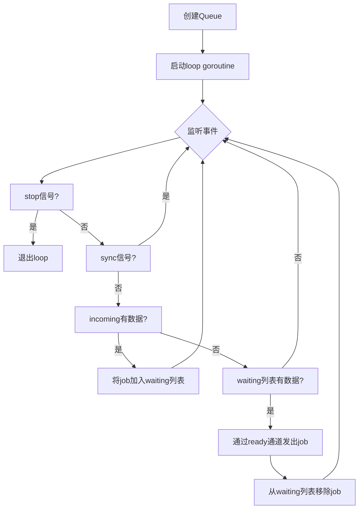
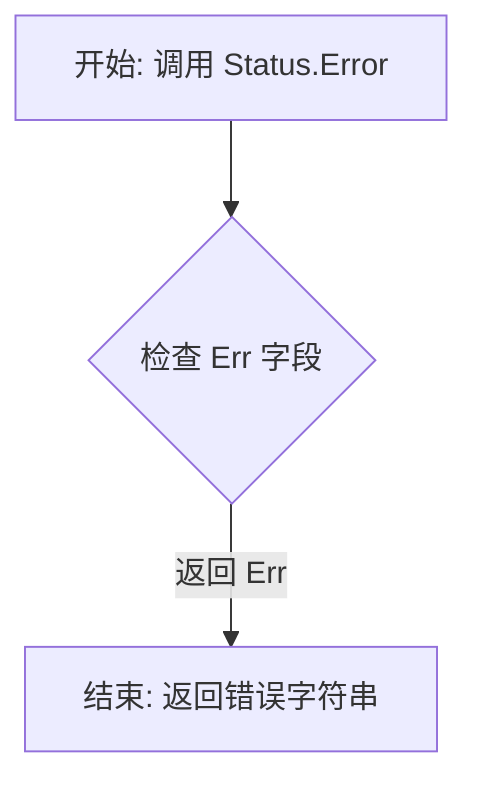
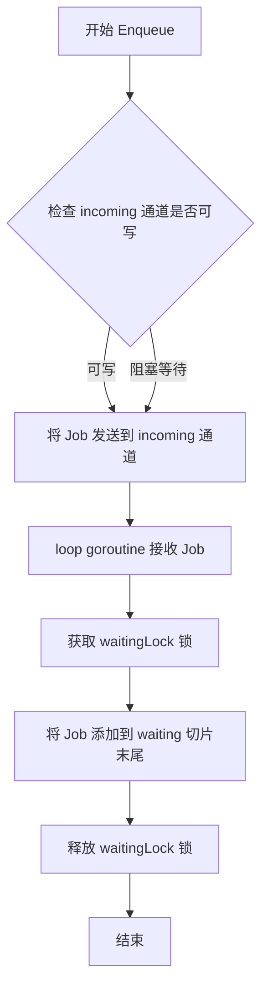
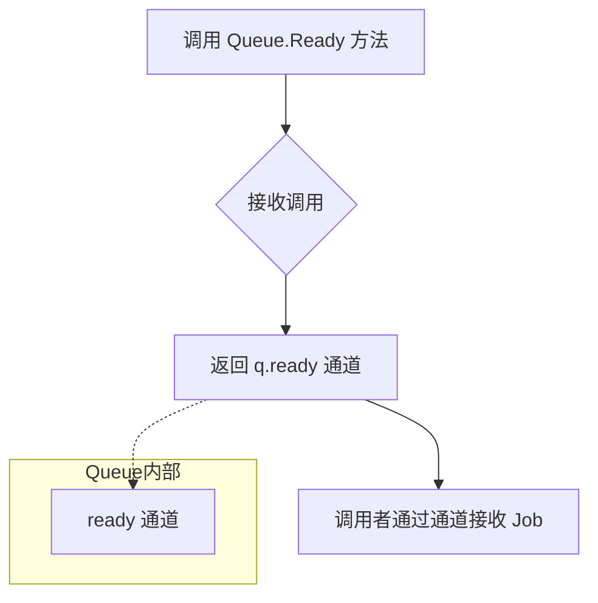
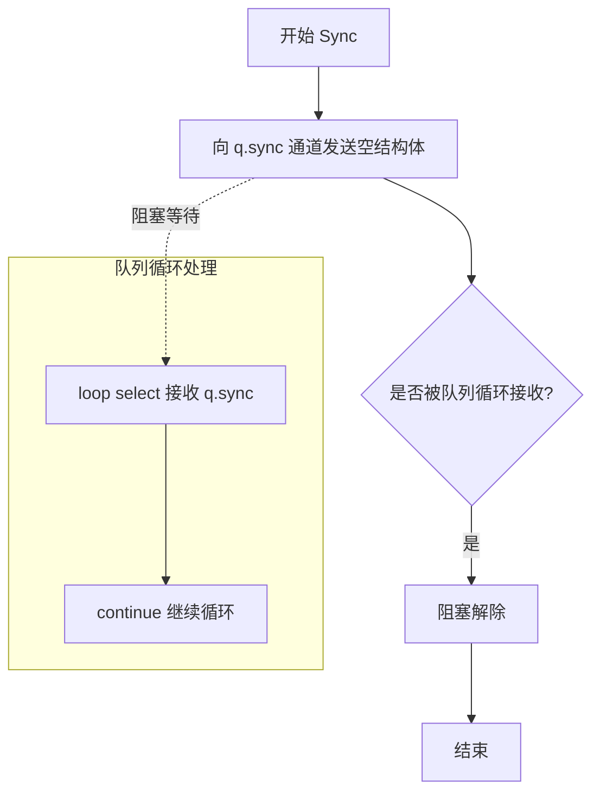
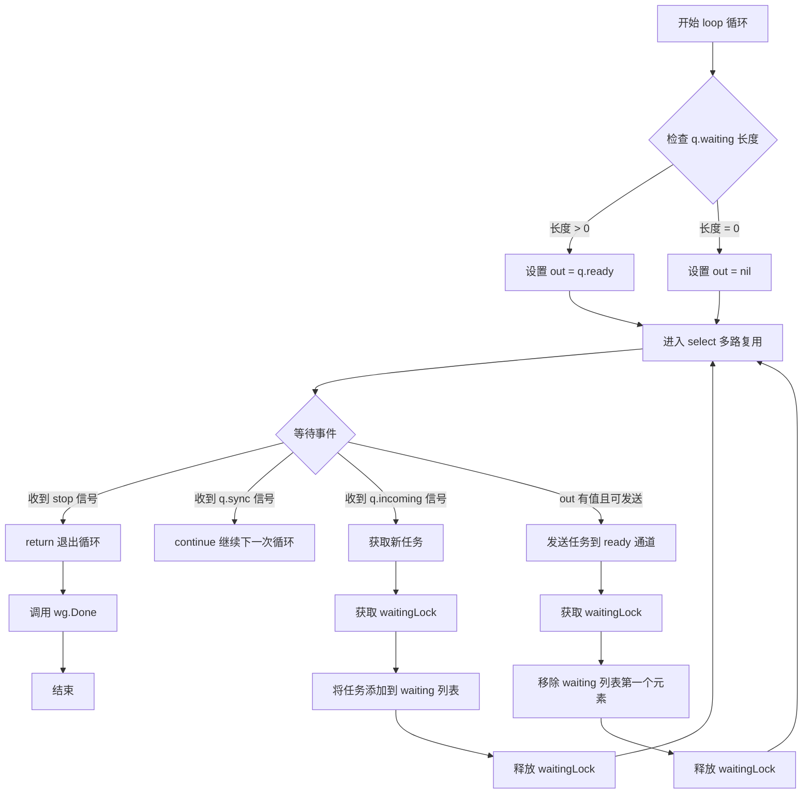

# `flux\pkg\job\job.go` 详细设计文档

这是一个无限容量的异步任务队列实现，支持任务的入队（Enqueue）、出队（Ready）、查看队列长度（Len）、遍历队列元素（ForEach）以及同步等待（Sync）等操作，采用通道和互斥锁实现线程安全的并发控制。

## 整体流程



## 类结构

```
无类继承层次
主要结构体:
- Job (任务)
- Result (任务结果)
- Status (任务状态)
- Queue (任务队列)
```

## 全局变量及字段


### `ID`
    
任务唯一标识类型

类型：`string`
    


### `JobFunc`
    
任务执行函数类型

类型：`func(log.Logger) error`
    


### `Job`
    
任务结构体，包含ID和执行函数

类型：`struct`
    


### `StatusString`
    
任务状态字符串类型

类型：`string`
    


### `Result`
    
任务结果结构体，包含版本号、更新规格和更新结果

类型：`struct`
    


### `Status`
    
任务状态结构体，包含结果、错误和状态字符串

类型：`struct`
    


### `Queue`
    
任务队列结构体，用于管理待执行的任务

类型：`struct`
    


### `StatusQueued`
    
任务排队状态常量

类型：`StatusString`
    


### `StatusRunning`
    
任务运行中状态常量

类型：`StatusString`
    


### `StatusFailed`
    
任务失败状态常量

类型：`StatusString`
    


### `StatusSucceeded`
    
任务成功状态常量

类型：`StatusString`
    


### `Job.ID`
    
任务唯一标识

类型：`ID`
    


### `Job.Do`
    
任务执行函数

类型：`JobFunc`
    


### `Result.Revision`
    
版本号

类型：`string`
    


### `Result.Spec`
    
更新规格

类型：`*update.Spec`
    


### `Result.Result`
    
更新结果

类型：`update.Result`
    


### `Status.Result`
    
任务结果

类型：`Result`
    


### `Status.Err`
    
错误信息

类型：`string`
    


### `Status.StatusString`
    
状态字符串

类型：`StatusString`
    


### `Queue.ready`
    
任务就绪通道

类型：`chan *Job`
    


### `Queue.incoming`
    
任务入队通道

类型：`chan *Job`
    


### `Queue.waiting`
    
等待队列切片

类型：`[]*Job`
    


### `Queue.waitingLock`
    
保护waiting的互斥锁

类型：`sync.Mutex`
    


### `Queue.sync`
    
同步通道

类型：`chan struct{}`
    
    

## 全局函数及方法


### `NewQueue`

`NewQueue` 是 `Queue` 类的构造函数，用于创建并初始化一个无界的异步任务队列。它创建队列的内部通道和切片，启动后台 goroutine 来处理队列的入队和出队操作，并返回一个可用的 `Queue` 实例指针。

参数：

- `stop`：`<-chan struct{}`，用于接收外部停止信号的通道，当该通道被关闭时，队列的 loop goroutine 将退出
- `wg`：`*sync.WaitGroup`，用于管理并发生命周期，函数内部会调用 `wg.Add(1)` 增加计数，并在 loop goroutine 结束时调用 `wg.Done()` 减少计数

返回值：`*Queue`，返回新创建的 `Queue` 实例指针，该实例已准备好接收任务

#### 流程图

```mermaid
flowchart TD
    A[开始 NewQueue] --> B[创建Queue结构体指针]
    B --> C[初始化ready通道: make(chan *Job)]
    C --> D[初始化incoming通道: make(chan *Job)]
    D --> E[初始化waiting切片: make([]*Job, 0)]
    E --> F[初始化sync通道: make(chan struct{})]
    F --> G[wg.Add1]
    G --> H[启动goroutine: q.loop]
    H --> I[返回Queue指针 *Queue]
```

#### 带注释源码

```go
// NewQueue 创建一个新的Queue实例并启动其内部处理goroutine
// 参数stop用于接收停止信号，wg用于同步goroutine生命周期
func NewQueue(stop <-chan struct{}, wg *sync.WaitGroup) *Queue {
	// 创建Queue结构体实例，初始化各个字段
	q := &Queue{
		ready:    make(chan *Job),    // 就绪通道，用于出队
		incoming: make(chan *Job),    // 入队通道，用于接收新任务
		waiting:  make([]*Job, 0),    // 待处理任务切片
		sync:     make(chan struct{}), // 同步通道，用于等待操作完成
	}
	
	// 增加WaitGroup计数，标记有一个新的goroutine正在运行
	wg.Add(1)
	
	// 启动后台goroutine来处理队列的入队出队逻辑
	go q.loop(stop, wg)
	
	// 返回初始化完成的Queue指针
	return q
}
```


### `Status.Error`

该方法为 `Status` 类型实现 Go 语言的 `error` 接口，使得 `Status` 结构体可以作为错误类型使用。当任务执行失败时，通过返回 `Err` 字段中的错误信息，提供统一的错误描述方式。

参数：無（该方法为值接收者，不接受额外参数）

返回值：`string`，返回 `Status.Err` 字段中存储的错误描述信息，若无错误则返回空字符串。

#### 流程图



#### 带注释源码

```go
// Error 方法实现了 error 接口，使得 Status 类型可以作为错误使用
// 它返回存储在 Err 字段中的错误信息字符串
func (s Status) Error() string {
    // 直接返回 Status 结构体中的 Err 字段
    // 如果没有错误，Err 为空字符串
    return s.Err
}
```

#### 附加说明

- **设计目标**：遵循 Go 语言错误处理惯例，让自定义类型能够满足 `error` 接口
- **与其它组件的关系**：`Status` 类型用于表示作业的执行结果（成功、失败或排队中），`Error()` 方法使得失败的作业可以像标准错误一样被处理
- **使用场景**：当需要返回作业执行失败的原因时，使用 `Status` 并设置 `Err` 字段；调用方可以通过 `errors.Is` 或 `errors.As` 进行错误检查


### Queue.NewQueue

这是 `Queue` 类型的构造函数，用于创建一个新的异步任务队列并启动其内部处理循环。该函数初始化队列的内部状态（包括通道和等待队列），启动一个后台 goroutine 来处理入队和出队操作，并通过 WaitGroup 管理 goroutine 的生命周期。

参数：

- `stop`：`<-chan struct{}`，一个只读通道，用于接收停止信号。当向此通道发送数据时，队列的处理循环将退出。
- `wg`：`*sync.WaitGroup`，指向同步等待组的指针。函数内部会调用 `wg.Add(1)` 增加计数，并在 goroutine 结束时调用 `wg.Done()` 减少计数，用于等待队列处理 goroutine 完成后退出。

返回值：`*Queue`，返回新创建的 `Queue` 指针。调用者可以使用返回的队列实例进行 Enqueue（入队）、Ready（获取就绪通道）等操作。

#### 流程图

```mermaid
flowchart TD
    A[开始 NewQueue 构造函数] --> B[创建 Queue 结构体实例]
    B --> C[初始化 ready 通道]
    C --> D[初始化 incoming 通道]
    D --> E[初始化 waiting 切片]
    E --> F[初始化 sync 通道]
    F --> G[wg.Add(1) 增加等待计数]
    G --> H[启动新 goroutine 执行 loop 方法]
    H --> I[返回 Queue 指针]
    
    subgraph loop 方法内部
    J[loop: 无限循环] --> K{检查是否有待处理 job}
    K -->|有 job| L[设置 out 通道为 ready]
    K -->|无 job| M[out 设为 nil]
    
    L --> N[select 多路复用]
    M --> N
    
    N --> O{接收 stop 信号}
    O -->|收到| P[return 退出循环]
    O -->|未收到| Q{接收 sync 信号}
    Q -->|收到| J[继续循环]
    Q -->|未收到| R{接收 incoming}
    R -->|收到| S[加锁并追加 job 到 waiting]
    R -->|未收到| T{尝试发送给 out}
    T -->|成功| U[加锁并移除队首 job]
    S --> J
    U --> J
    end
```

#### 带注释源码

```go
// NewQueue 创建一个新的 Queue 实例并启动其处理循环
// 参数 stop: 用于接收外部停止信号的通道，当关闭或发送数据时，队列将停止处理
// 参数 wg: WaitGroup 指针，用于跟踪后台 goroutine 的生命周期
// 返回值: 初始化好的 Queue 指针
func NewQueue(stop <-chan struct{}, wg *sync.WaitGroup) *Queue {
    // 1. 创建 Queue 结构体实例，初始化各个字段
    q := &Queue{
        // ready 通道：用于消费者获取可执行的 Job
        ready:    make(chan *Job),
        // incoming 通道：生产者将 Job 入队时使用此通道
        incoming: make(chan *Job),
        // waiting 切片：存储等待执行的 Job 队列（内存队列）
        waiting:  make([]*Job, 0),
        // sync 通道：用于同步操作，确保之前的入队/出队操作已完成
        sync:     make(chan struct{}),
    }
    
    // 2. 将后台 goroutine 添加到 WaitGroup，表明有一个 goroutine 正在运行
    wg.Add(1)
    
    // 3. 启动后台处理循环 goroutine，传入 stop 通道和 wg 指针
    go q.loop(stop, wg)
    
    // 4. 返回初始化好的队列指针
    return q
}
```


### `Queue.Len`

返回队列中等待任务的数量。该方法通过获取互斥锁来安全地读取等待队列的长度，但需要注意的是，由于队列的异步性质，返回的长度可能不是绝对实时的。

参数： 无

返回值：`int`，返回当前队列中等待处理的任务数量

#### 流程图

```mermaid
flowchart TD
    A[Start: Len] --> B[Lock: waitingLock]
    B --> C[Get: len(q.waiting)]
    C --> D[Unlock: waitingLock]
    D --> E[Return: length as int]
```

#### 带注释源码

```go
// This is not guaranteed to be up-to-date; i.e., it is possible to
// receive from `q.Ready()` or enqueue an item, then see the same
// length as before, temporarily.
func (q *Queue) Len() int {
	// 获取互斥锁以安全访问 waiting 切片
	q.waitingLock.Lock()
	// 使用 defer 确保锁会被自动释放
	defer q.waitingLock.Unlock()
	// 返回等待队列中的任务数量
	return len(q.waiting)
}
```


### Queue.Enqueue

将任务放入队列中，通过 incoming 通道将 Job 传递给队列的 loop goroutine 处理。

参数：

- `j`：`*Job`，要入队的任务指针

返回值：无（`void`），该方法没有返回值

#### 流程图



#### 带注释源码

```go
// Enqueue puts a job onto the queue. It will block until the queue's
// loop can accept the job; but this does _not_ depend on a job being
// dequeued and will always proceed eventually.
func (q *Queue) Enqueue(j *Job) {
    // 将 Job 发送到 incoming 通道
    // 这里会阻塞直到 queue 的 loop goroutine 从 incoming 通道读取数据
    // 注意：这里的阻塞不依赖于是否有 Job 被 dequeue，仅仅是 channel 的发送阻塞
	q.incoming <- j
}
```


### `Queue.Ready()`

返回队列的只读通道，用于获取可执行的任务。注意：出队操作不是原子性的，在使用 ForEach 遍历时可能仍会看到已出队的项目。

参数：

- （无参数）

返回值：`<-chan *Job`，返回队列的就绪通道，用于接收可执行的 Job 实例

#### 流程图



#### 带注释源码

```go
// Ready returns a channel that can be used to dequeue items. Note
// that dequeuing is not atomic: you may still see the
// dequeued item with ForEach, for a time.
func (q *Queue) Ready() <-chan *Job {
	return q.ready
}
```

**详细说明：**

- **方法类型**：值接收者（value receiver）
- **功能**：返回队列的 `ready` 通道，这是一个只读通道（`<-chan`），允许消费者从通道中接收已就绪的 Job
- **并发安全**：该方法本身是并发安全的，只返回内部通道的引用，不涉及任何锁操作
- **使用场景**：通常与 `select` 语句配合使用，在 `loop` 方法中，当队列有等待任务时，会将 `ready` 通道赋值给 `out` 变量，从而可以将任务发送到该通道
- **注意事项**：文档注释明确指出出队操作不是原子性的，即当从该通道接收到 Job 后，在调用 `ForEach` 遍历时可能仍会短暂看到该 Job 存在于队列中


### `Queue.ForEach`

遍历队列中的所有任务，并对每个任务执行提供的回调函数。如果回调函数返回 false，则提前终止遍历。

参数：

- `fn`：`func(int, *Job) bool`，遍历回调函数，参数 i 为任务在队列中的索引，job 为指向 Job 的指针，返回 bool，true 表示继续遍历，false 表示终止遍历

返回值：无（void），函数通过回调函数的返回值控制遍历行为

#### 流程图

```mermaid
flowchart TD
    A[Start ForEach] --> B[Lock waitingLock]
    B --> C[Copy waiting slice to local variable jobs]
    C --> D[Unlock waitingLock]
    D --> E[Initialize index i = 0]
    E --> F{i < len/jobs?}
    F -->|Yes| G[Call fn i, jobs[i]]
    G --> H{fn returns true?}
    H -->|Yes| I[i = i + 1]
    I --> F
    H -->|No| J[Return / End]
    F -->|No| J
```

#### 带注释源码

```go
// ForEach iterates over all jobs currently in the queue's waiting list.
// It acquires a lock to safely copy the current list of jobs, then iterates
// over the copy to avoid holding the lock during the callback execution.
// If the callback function returns false, the iteration stops immediately.
func (q *Queue) ForEach(fn func(int, *Job) bool) {
	// Acquire the lock to safely access the waiting list
	q.waitingLock.Lock()
	
	// Make a copy of the waiting list to iterate over
	// This allows us to release the lock before calling the callback,
	// preventing potential deadlocks if the callback itself tries to
	// access queue methods that require the lock
	jobs := q.waiting
	
	// Release the lock immediately after copying
	q.waitingLock.Unlock()
	
	// Iterate over the copied list and call the callback for each job
	for i, job := range jobs {
		// If the callback returns false, stop iterating
		if !fn(i, job) {
			return
		}
	}
}
```


### `Queue.Sync`

阻塞等待队列的所有先前操作完成，确保调用者在进行后续操作前，所有入队任务都已被队列处理循环接收。该方法仅在单协程使用队列的场景下有意义，主要用于测试场景。

参数：

- （无参数）

返回值：无返回值（`void`），通过阻塞调用者协程来同步等待队列处理完成

#### 流程图



#### 带注释源码

```go
// Block until any previous operations have completed. Note that this
// is only meaningful if you are using the queue from a single other
// goroutine; i.e., it makes sense to do, say,
//
//    q.Enqueue(j)
//    q.Sync()
//    fmt.Printf("Queue length is %d\n", q.Len())
//
// but only because those statements are sequential in a single
// thread. So this is really only useful for testing.
func (q *Queue) Sync() {
	// 向同步通道发送一个空结构体
	// 队列的 loop 方法会通过 select 语句接收这个信号
	// 发送操作会阻塞，直到 loop 处理完所有先前提交的操作
	q.sync <- struct{}{}
}
```


### `Queue.loop`

队列处理主循环，负责从 `incoming` 通道接收新任务并通过 `ready` 通道分发任务给消费者，同时处理同步和停止信号。

参数：

- `stop`：`<-chan struct{}`，外部传入的停止信号通道，当收到信号时循环结束
- `wg`：`*sync.WaitGroup`，用于管理 goroutine 的生命周期，方法结束时调用 `wg.Done()`

返回值：`无`（方法声明没有返回值）

#### 流程图



#### 带注释源码

```go
// loop 是 Queue 的主事件循环 goroutine，负责处理任务的入队、出队和同步操作
// 它使用 select 语句同时监听多个通道，实现非阻塞的多路复用
func (q *Queue) loop(stop <-chan struct{}, wg *sync.WaitGroup) {
	// 方法返回时通知 WaitGroup，标记该 goroutine 已完成
	defer wg.Done()
	
	// 无限循环，持续处理队列的各种事件
	for {
		// 动态设置 out 通道：
		// - 如果 waiting 列表中有待处理任务，out 指向 ready 通道（可出队）
		// - 如果 waiting 为空，out 为 nil（不可出队）
		var out chan *Job = nil
		if len(q.waiting) > 0 {
			out = q.ready
		}

		// select 语句监听四个可能的事件：
		// 1. stop 信号 - 外部要求停止队列
		// 2. sync 信号 - 同步请求，等待所有操作完成
		// 3. incoming 信号 - 有新任务入队
		// 4. out 通道可写 - 有消费者准备接收任务
		select {
		case <-stop:
			// 收到停止信号，直接返回，结束 goroutine
			return
		case <-q.sync:
			// 收到同步信号，继续循环（不执行任何出队操作）
			// 这允许外部调用者等待之前的操作完成
			continue
		case in := <-q.incoming:
			// 收到新任务，将其加入等待队列
			q.waitingLock.Lock()
			q.waiting = append(q.waiting, in)
			q.waitingLock.Unlock()
		case out <- q.nextOrNil(): // cannot proceed if out is nil
			// 当 out 不为 nil 时，将队首任务发送到 ready 通道
			// q.nextOrNil() 返回队首任务或 nil（但这里 out 不为 nil 所以会被发送）
			// 发送成功后，从 waiting 列表中移除该任务
			q.waitingLock.Lock()
			q.waiting = q.waiting[1:]
			q.waitingLock.Unlock()
		}
	}
}
```


### `Queue.nextOrNil`

返回队列头部任务，如果队列为空则返回 nil。

参数：

- （无显式参数，方法接收者为 `q *Queue`）

返回值：`*Job`，返回队列头部的任务指针，如果队列为空则返回 nil。

#### 流程图

```mermaid
flowchart TD
    A[开始] --> B[获取 waitingLock]
    B --> C{检查 waiting 长度 > 0?}
    C -->|是| D[返回 waiting[0] - 队列头部]
    C -->|否| E[返回 nil]
    D --> F[释放 waitingLock]
    E --> F
    F[结束]
```

#### 带注释源码

```go
// nextOrNil returns the head of the queue, or nil if
// the queue is empty.
// nextOrNil 返回队列头部，如果队列为空则返回 nil
func (q *Queue) nextOrNil() *Job {
    // 加锁以保证线程安全地访问 waiting 切片
    q.waitingLock.Lock()
    // 使用 defer 确保锁会被释放，即使在 return 之前发生 panic
    defer q.waitingLock.Unlock()
    
    // 检查等待队列中是否有任务
    if len(q.waiting) > 0 {
        // 返回队列头部的任务（第一个元素）
        return q.waiting[0]
    }
    
    // 队列为空，返回 nil
    return nil
}
```

## 关键组件


### Job (任务结构体)

表示一个可执行的任务单元，包含ID和执行函数。

### Queue (任务队列)

无界队列实现，通过channel和goroutine实现异步任务调度，支持入队、出队和遍历操作。

### Status (任务状态)

封装任务的执行结果、错误信息和状态字符串，支持错误接口实现。

### Result (任务结果)

存储任务的修订版本、执行规范和更新结果，类似于提交事件元数据。

### 并发控制机制

使用sync.Mutex保护waiting切片，sync.channel用于同步操作，确保多goroutine访问的安全性。


## 问题及建议


### 已知问题

- **Queue的loop方法存在潜在的nil channel问题**：当`out`为nil时，`case out <- q.nextOrNil()`会永久阻塞，尽管代码尝试通过`if len(q.waiting) > 0`来避免，但这种写法在Go中是不安全的，可能导致死锁。
- **Enqueue方法没有背压机制**：Enqueue会无条件阻塞等待loop接受任务，但没有队列长度限制，可能导致内存无限增长。
- **ForEach方法存在快照一致性问题**：获取waiting队列的快照后进行遍历，遍历过程中队列可能被修改，导致返回的结果可能不是最新的。
- **Len()方法返回不准确结果**：注释明确承认Len()不保证是最新的，这种不确定性可能导致逻辑错误。
- **Job的ID字段未被使用**：ID字段定义但在实际队列管理中未被利用，无法用于去重或追踪。
- **缺少优雅关闭机制**：stop channel只能中断loop，但waiting队列中剩余的job会被丢弃，没有处理待处理任务的能力。
- **Result结构体与外部包紧密耦合**：Result引用了`update.Spec`和`update.Result`，如果外部包发生变更，会直接影响本包。
- **Status结构体缺乏状态检查辅助方法**：只有Error()方法，没有判断是否成功、是否失败等辅助方法。

### 优化建议

- **实现带超时的Enqueue**：使用select配合time.After或context实现入队超时，避免无限阻塞。
- **添加队列容量限制**：在Queue结构体中添加MaxSize字段，当达到上限时返回错误或阻塞。
- **修复loop中的nil channel处理**：将`case out <-`改为先检查out是否为nil，或者重构select逻辑。
- **使用原子操作或无锁数据结构**：对于高并发场景，考虑使用sync.Map或无锁队列替代切片+锁的方案。
- **添加context.Context支持**：在Enqueue和loop中支持取消和超时控制。
- **实现Close方法处理剩余任务**：提供GracefulClose方法，等待waiting队列中的任务完成后再退出。
- **使用iota重写StatusString常量**：增强类型安全和可维护性。
- **补充Status的辅助方法**：添加IsSucceeded()、IsFailed()、IsQueued()等方法。

## 其它


### 设计目标与约束

本代码设计目标是为Flux CD框架提供一个轻量级、可扩展的异步任务队列系统。核心约束包括：(1) 采用无界队列设计，队列长度无上限，适用于任务量波动较大的场景；(2) 队列操作必须线程安全，使用sync.Mutex保护共享状态；(3) 队列生命周期与外部stop信号和WaitGroup绑定，确保优雅关闭；(4) Enqueue操作非阻塞，依赖channel缓冲区接受任务；(5) 不支持优先级队列，任务按照FIFO顺序执行。

### 错误处理与异常设计

队列本身不直接处理任务执行错误，错误由JobFunc的返回值传递。Status结构体包含Err字段用于记录错误信息，并实现了error接口的Error()方法，使Status可直接作为错误类型使用。Result结构体复制了update.Spec和update.Result以避免循环依赖。队列的loop方法通过select监听stop信号实现优雅退出，当收到stop信号时立即返回，不等待pending任务完成。Sync()方法的存在表明队列设计考虑了测试场景的同步需求。

### 数据流与状态机

Job的生命周期状态转换如下：Queued（入队）→ Running（开始执行）→ Succeeded或Failed（执行完成）。StatusString类型定义四种状态常量。Queue内部维护waiting slice存储所有排队中的Job，通过incoming channel接收新任务，通过ready channel分发任务给消费者。数据流为：外部通过Enqueue()写入incoming channel → loop goroutine从incoming取出并加入waiting slice → loop通过ready channel输出waiting[0] → 消费者从ready channel接收并执行JobFunc。

### 外部依赖与接口契约

主要外部依赖包括：(1) github.com/go-kit/kit/log - 日志记录接口，JobFunc签名接受log.Logger参数；(2) github.com/fluxcd/flux/pkg/update - 提供update.Spec和update.Result类型，用于Result结构体；(3) Go标准库sync - 提供sync.Mutex和sync.WaitGroup。接口契约：JobFunc类型为func(log.Logger) error，返回nil表示成功，返回error表示失败；Queue的Enqueue方法接受*Job指针，Ready()返回只读channel，ForEach接受遍历回调函数。

### 并发模型与线程安全

Queue类型使用两种并发原语：(1) sync.Mutex保护waiting slice的读写操作，Len()、Enqueue()、loop()、nextOrNil()、ForEach()等方法均需获取锁；(2) channel实现异步通信，incoming channel用于入队，ready channel用于出队，sync channel用于测试同步。loop方法作为单一goroutine运行，负责协调所有队列操作，保证enqueue和dequeue的原子性。需要注意的是Len()方法返回的是快照，不保证实时性，且ForEach遍历的jobs是拷贝副本。

### 资源管理与生命周期

Queue的创建通过NewQueue函数，接收stop信号通道和WaitGroup指针。启动时wg.Add(1)并启动loop goroutine，退出时wg.Done()释放。Queue内部创建三个channel：ready、incoming、sync，均为无缓冲或默认缓冲。waiting slice初始容量为0，使用append自动扩容。生命周期管理遵循以下规则：stop信号到达时loop立即退出，incoming channel中的pending job会被保留在waiting slice中直到被消费或程序结束。

### 性能考虑与优化空间

当前实现的主要性能特征：(1) waiting slice使用append自动扩容，频繁小规模入队可能导致多次内存分配，建议预分配合理容量；(2) ForEach方法拷贝整个waiting slice，大队列时可能影响性能，考虑返回迭代器或使用只读视图；(3) Len()方法每次加锁，对高频繁查询场景有开销，可考虑定期采样或缓存；(4) Enqueue通过非缓冲incoming channel，如果loop处理不及时可能导致阻塞，建议根据场景调整为带缓冲channel；(5) nextOrNil()每次调用都加锁，可在loop中缓存减少锁竞争。

    