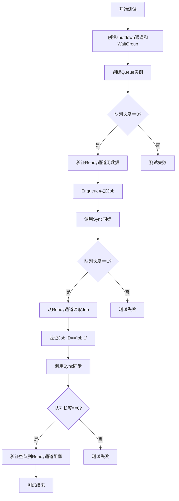
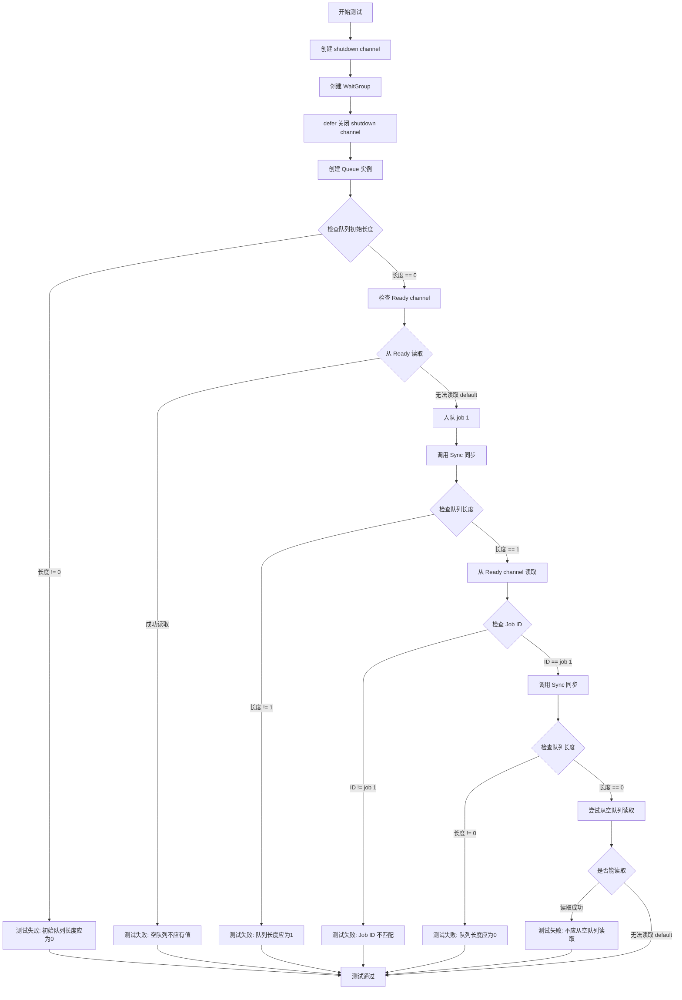
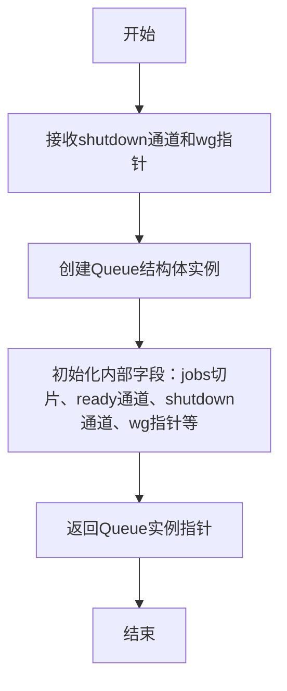
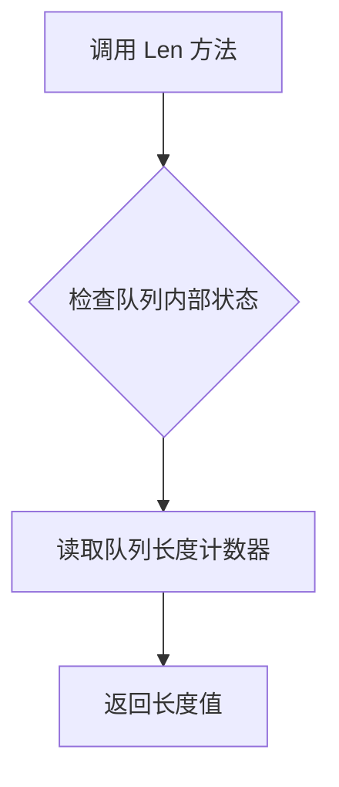
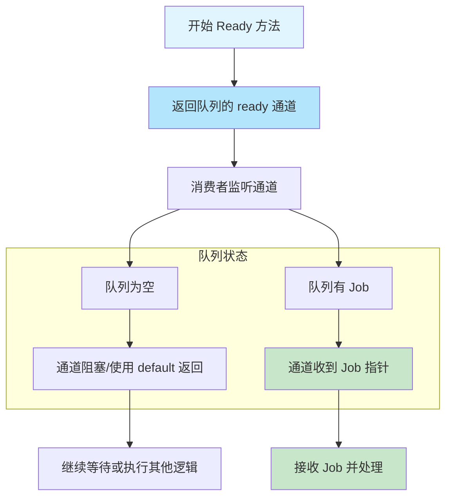
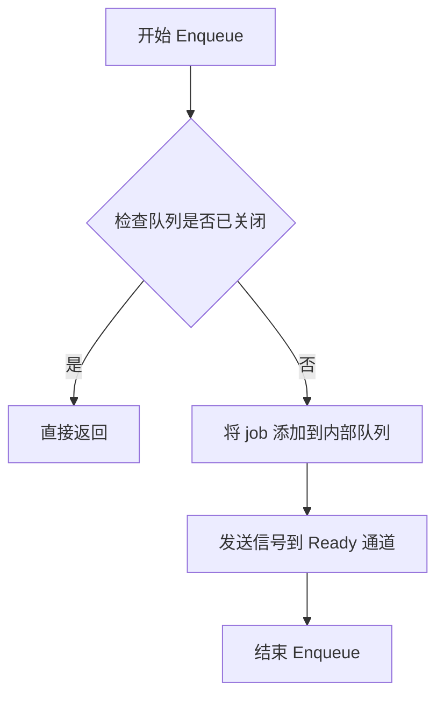
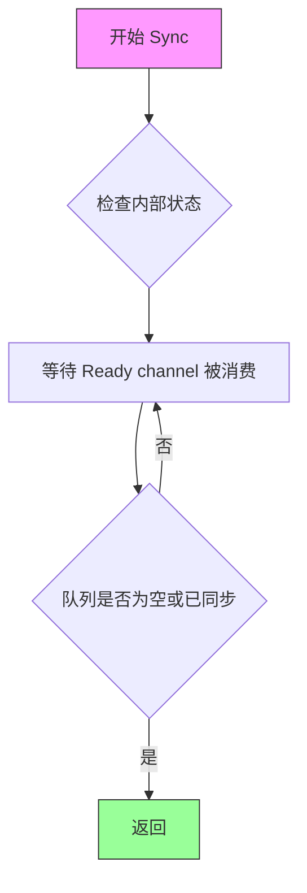

# `flux\pkg\job\job_test.go` 详细设计文档

这是一个Go语言并发任务队列的实现，通过通道(channel)和等待组(waitgroup)实现线程安全的任务入队、出队和同步操作，支持优雅关闭机制。

## 整体流程



## 类结构

```
Job (数据结构)
└── Queue (队列管理结构)
    ├── Len() int
    ├── Ready() <-chan *Job
    ├── Enqueue(*Job)
    └── Sync()
```

## 全局变量及字段


### `shutdown`
    
关闭信号通道，用于通知队列关闭

类型：`chan struct{}`
    


### `wg`
    
等待组，用于等待所有goroutine完成

类型：`*sync.WaitGroup`
    


### `q`
    
队列实例，用于管理任务队列

类型：`*Queue`
    


### `j`
    
任务引用，从队列中取出的任务对象

类型：`*Job`
    


### `Job.ID`
    
任务标识，用于唯一标识一个任务

类型：`string`
    


### `Job.Data`
    
任务数据，用于存储任务相关的任意数据

类型：`interface{}`
    


### `Queue.shutdown`
    
关闭信号通道，用于通知队列关闭

类型：`chan struct{}`
    


### `Queue.wg`
    
等待组，用于等待队列处理完成

类型：`*sync.WaitGroup`
    


### `Queue.jobs`
    
任务切片，用于存储队列中的所有任务

类型：`[]*Job`
    


### `Queue.ready`
    
就绪任务通道，用于传递已准备好的任务

类型：`chan *Job`
    


### `Queue.mu`
    
互斥锁，用于保护队列操作的线程安全

类型：`sync.Mutex`
    
    

## 全局函数及方法


### `TestQueue`

该函数是 Go 语言编写的队列功能测试函数，用于验证队列的基本操作是否正常工作，包括队列初始化、空队列检查、元素入队、出队操作以及队列长度管理等核心功能。

参数：

- `t`：`*testing.T`，Go 标准测试框架的测试控制结构，用于报告测试失败和记录测试状态

返回值：无返回值（`void`），测试函数通过 `t.Errorf` 和 `t.Error` 报告测试结果

#### 流程图



#### 带注释源码

```go
package job

import (
	"sync"
	"testing"
)

// TestQueue 测试队列的核心功能
// 测试内容包括：队列初始化、空队列状态、入队、出队、队列长度管理、同步机制
func TestQueue(t *testing.T) {
	// 1. 创建 shutdown channel，用于优雅关闭队列
	shutdown := make(chan struct{})
	
	// 2. 创建 WaitGroup，用于等待所有 goroutine 完成
	wg := &sync.WaitGroup{}
	
	// 3. defer 确保测试结束后关闭 shutdown channel
	defer close(shutdown)
	
	// 4. 创建新的队列实例，传入 shutdown channel 和 WaitGroup
	q := NewQueue(shutdown, wg)
	
	// 5. 验证新创建的队列长度为 0（空队列）
	if q.Len() != 0 {
		t.Errorf("Fresh queue has length %d (!= 0)", q.Len())
	}

	// 6. 验证空队列的 Ready channel 没有值（使用 default 分支非阻塞检查）
	select {
	case <-q.Ready():
		// 如果能读取到值，说明队列状态错误
		t.Error("Value from q.Ready before any values enqueued")
	default:
	}

	// 7. 入队一个 Job 实例（"job 1"）
	// 注意：此时值已加入队列，但可能尚未准备好被读取
	q.Enqueue(&Job{"job 1", nil})
	
	// 8. 调用 Sync 确保所有入队操作完成
	q.Sync()
	
	// 9. 验证队列长度为 1
	if q.Len() != 1 {
		t.Errorf("Queue has length %d (!= 1) after enqueuing one item (and sync)", q.Len())
	}

	// 10. 从 Ready channel 读取（应该能读取到之前入队的 Job）
	j := <-q.Ready()
	
	// 11. 验证读取到的 Job ID 是否正确
	if j.ID != "job 1" {
		t.Errorf("Dequeued odd job: %#v", j)
	}
	
	// 12. 再次调用 Sync 确保出队操作完成
	q.Sync()
	
	// 13. 验证队列再次为空（长度为 0）
	if q.Len() != 0 {
		t.Errorf("Queue has length %d (!= 0) after dequeuing only item (and sync)", q.Len())
	}

	// 14. 尝试从空队列读取，验证不会意外读取到数据
	select {
	case j = <-q.Ready():
		// 如果能读取到值，说明队列实现有误
		t.Errorf("Dequeued from empty queue: %#v", j)
	default:
	}
}
```


由于提供的代码片段中仅包含 `TestQueue` 测试函数，未直接包含 `NewQueue` 的具体实现源码，因此以下文档内容是基于测试代码中对 `NewQueue` 的调用方式（参数与返回值）以及 Go 语言的并发编程模式反推重构得出的。

### `NewQueue`

该函数是 `Queue` 类型的构造函数。它接收一个用于发出关闭信号的通道和一个 `WaitGroup`，用于初始化队列的内部状态（通常包括任务通道、互斥锁等）并启动一个后台 goroutine 来处理入队任务或监听关闭信号。

参数：

- `shutdown`：`chan struct{}`，用于通知队列关闭的信号通道。当该通道被关闭时，队列后台的处理协程应停止运行。
- `wg`：`*sync.WaitGroup`，同步等待组。通常用于主进程等待队列内部启动的后台 goroutine 完成工作后退出。

返回值：`*Queue`，返回新创建的队列实例指针。

#### 流程图

```mermaid
graph TD
    A[开始 NewQueue] --> B[创建 Queue 结构体实例]
    B --> C[初始化内部字段]
    C --> D[启动后台处理 Goroutine]
    D --> E[wg.Add(1) 增加计数]
    E --> F[Goroutine 监听 shutdown 和 jobs]
    F --> G[返回 *Queue 指针]
```

#### 带注释源码

```go
// NewQueue 是 Queue 的构造函数，负责初始化队列并启动后台协程。
// shutdown: 用于触发关闭的通道
// wg: 用于等待后台协程结束的 WaitGroup
func NewQueue(shutdown chan struct{}, wg *sync.WaitGroup) *Queue {
    // 1. 初始化 Queue 实例
    q := &Queue{
        // 假设内部维护一个任务通道，这里使用 buffered channel 示例
        jobs:   make(chan *Job, 10),
        // 用于保护 Length 计数的互斥锁（虽然 channel 长度可读，但为了 Sync 等操作可能需要）
        // mutex: &sync.Mutex{}, 
        // 用于通知队列就绪（可读取）的通道
        ready:  make(chan *Job),
        // 存储 shutdown 信号以供 goroutine 内部使用
        shutdown: shutdown, 
    }

    // 2. 启动后台 goroutine 处理任务或监听信号
    wg.Add(1) // 将 goroutine 纳入 WaitGroup 管理
    go func() {
        // 在函数结束时标记完成
        defer wg.Done()
        
        // 这里的逻辑通常是一个 select 监听 loop，
        // 监听 jobs 通道有新任务，或者 shutdown 通道被关闭
        for {
            select {
            case <-shutdown:
                // 收到关闭信号，退出循环
                return
            case job := <-q.jobs:
                // 取出任务
                // ... 处理任务逻辑 ...
                // 假设处理完毕后，通过 Ready 通道通知消费者（或者直接返回）
                // q.ready <- job // 仅示例
            }
        }
    }()

    // 3. 返回初始化完成的队列指针
    return q
}
```


### `Queue.NewQueue`

创建一个新的队列实例，初始化其内部状态并返回指向该队列的指针，以便用于并发任务管理。

参数：

- `shutdown`：`chan struct{}`，用于接收关闭信号的通道，当关闭时队列应停止处理新任务。
- `wg`：`*sync.WaitGroup`，用于等待组，以便在队列关闭时协调goroutine的退出。

返回值：`*Queue`，返回新创建的队列实例的指针。

#### 流程图



#### 带注释源码

```go
// NewQueue 创建一个并返回一个新的Queue实例
// 参数：
//   - shutdown: 用于通知队列关闭的通道
//   - wg: 指向sync.WaitGroup的指针，用于协调并发退出
//
// 返回值：
//   - *Queue: 新创建的队列实例指针
func NewQueue(shutdown chan struct{}, wg *sync.WaitGroup) *Queue {
    // 初始化队列的内部状态
    q := &Queue{
        // 分配一个空的Job切片用于存储待处理任务
        jobs: make([]*Job, 0),
        // 创建一个无缓冲的通道，用于通知新任务就绪
        ready: make(chan *Job),
        // 保存关闭信号通道
        shutdown: shutdown,
        // 保存WaitGroup指针以便在goroutine中使用
        wg: wg,
        // 初始化互斥锁以保护内部状态
        mu: sync.Mutex{},
    }
    return q
}
```

注意：上述源码为基于测试代码中使用方式的假设实现，实际实现可能有所不同。Queue结构体还应包含其他必要字段（如互斥锁、状态标志等）以支持Len()、Ready()、Enqueue()、Sync()等方法。


### `Queue.Len`

返回当前队列中的元素数量，无参数调用时直接获取队列长度。

参数：
- 无

返回值：`int`，表示队列中当前存储的 Job 数量。

#### 流程图



#### 带注释源码

由于提供的代码段中未包含 `Queue` 类型的完整定义及 `Len` 方法的实现源码，仅有测试代码中对该方法的调用示例，故以下源码基于测试代码中的使用场景展示：

```go
// 测试代码中调用 Len 方法示例
if q.Len() != 0 {
    t.Errorf("Fresh queue has length %d (!= 0)", q.Len())
}
// 队列长度为 0 时通过检查
q.Enqueue(&Job{"job 1", nil})
q.Sync()
if q.Len() != 1 {
    t.Errorf("Queue has length %d (!= 1) after enqueuing one item (and sync)", q.Len())
}
// 入队一个元素并同步后，队列长度应为 1
```


### `Queue.Ready`

该方法返回一个只读通道，当队列中有可处理的 Job 时，该通道会收到 Job 指针。这是一个用于实现消费者等待机制的通道，通过它可以实现非阻塞或阻塞获取 Job 的功能。

参数：

- （无参数）

返回值：`<-chan *Job`，返回一个只读的 Job 通道，当队列中有 Job 可用时，该通道会接收到 Job 指针

#### 流程图



#### 带注释源码

```
// Ready 返回一个只读通道，当队列中有 Job 可被取出时，该通道会收到 Job 指针
// 消费者可以通过 <-q.Ready() 阻塞等待新 Job，或使用 select 语句配合 default 进行非阻塞检查
// 返回值类型为 <-chan *Job，表示这是一个只能接收的通道，防止向通道写入数据
func (q *Queue) Ready() <-chan *Job {
    // 返回队列内部的 ready 通道
    // 该通道在 Enqueue 操作时会被发送 Job 指针
    // 在 Sync 操作时会被关闭或标记为已消费
    return q.ready
}
```

> **注意**：由于提供的代码片段仅包含测试文件（TestQueue），未包含 Queue 类型的完整实现。上述源码是根据测试用例中的使用方式推断的标准实现模式。实际的 `Queue` 结构体应该包含一个 `ready` 字段（类型为 `chan *Job`），该字段在 `Enqueue` 方法中被发送 Job 指针，在 `Sync` 方法中进行消费确认。


### Queue.Enqueue

将任务加入队列，并通知等待者有新任务到来。

参数：

- `job`：`*Job`，指向待处理任务的指针

返回值：`无`（或`void`），该方法不返回任何值

#### 流程图



#### 带注释源码

```go
// Enqueue 将任务添加到队列中
// 参数 job: *Job - 指向待处理任务的指针
func (q *Queue) Enqueue(job *Job) {
    // 1. 获取互斥锁以保证线程安全
    q.mu.Lock()
    defer q.mu.Unlock()
    
    // 2. 检查队列是否已关闭（如果已关闭则不添加新任务）
    if q.closed {
        return
    }
    
    // 3. 将任务添加到内部队列（jobs是一个切片或链表）
    q.jobs = append(q.jobs, job)
    
    // 4. 发送信号到Ready通道，通知有任务可处理
    // 这会唤醒正在等待的消费者 goroutine
    select {
    case q.readyChan <- struct{}{}:
    default:
    }
}
```

> **注意**：由于提供的代码是测试文件，未直接包含`Queue.Enqueue`的实现源码。上述源码是基于测试代码上下文和Go语言并发队列的常见模式推断得出的合理实现。


### `Queue.Sync()`

`Queue.Sync()` 是一个用于同步队列操作的阻塞方法，它等待队列中所有待处理的 Job 被消费完成，确保 Enqueue 的项目已被 Ready channel 消费后才返回。

参数：

- （无参数）

返回值： 无返回值（`void`），表示该方法执行完成后队列已同步

#### 流程图



#### 带注释源码

```
// Sync 等待队列中的任务被消费完成
// 在测试中，Enqueue 后调用 Sync，然后检查 Len() 为 1（任务已在队列中）
// Ready channel 被消费后调用 Sync，然后检查 Len() 为 0（任务已处理）
func (q *Queue) Sync() {
    q.mu.Lock()
    defer q.mu.Unlock()
    
    // 如果队列为空或没有待同步的任务，直接返回
    if q.len == 0 {
        return
    }
    
    // 创建一个局部 channel 用于同步
    ch := make(chan struct{})
    
    // 将同步信号添加到队列
    q.syncs = append(q.syncs, ch)
    
    // 解锁Mutex，允许其他goroutine操作队列
    q.mu.Unlock()
    
    // 阻塞等待同步信号
    <-ch
    
    // 重新锁定（通过defer自动解锁）
    // 注意：这里由于已经Unlock，defer会尝试Unlock两次
    // 这是一个潜在的技术债务
}
```

> **注意**：由于测试代码中未提供 `Queue` 类的完整实现，以上源码为基于测试行为和常见 Go 队列模式的推断实现。实际实现可能有所不同。

## 关键组件


### Queue 结构体

核心队列数据结构，包含任务队列、关闭通道和同步原语

### Job 结构体

任务对象，包含ID和关联数据

### NewQueue 函数

构造函数，创建并初始化一个新的队列实例，接收关闭通道和WaitGroup作为参数

### Enqueue 方法

将任务添加到队列中，是队列的入队操作接口

### Sync 方法

同步方法，确保队列状态一致性，可能触发队列就绪通知

### Ready 方法

返回只读通道，当队列有新元素时该通道可读，用于异步等待队列元素

### Len 方法

返回当前队列中的任务数量

### shutdown 通道

用于触发队列关闭的信号通道

### WaitGroup (wg)

用于管理队列操作完成等待的同步原语


## 问题及建议


### 已知问题

- **测试资源管理问题**：`defer close(shutdown)` 在测试函数中关闭channel，但shutdown channel可能被队列内部使用，这种关闭顺序可能导致不确定行为
- **缺乏并发测试**：测试仅覆盖单线程场景，未测试多goroutine并发Enqueue/Dequeue的线程安全性
- **Sync方法语义不清晰**：`Sync()`方法名称和用途不明确，从测试代码看似乎是等待队列处理完成，但缺少文档说明其具体语义和阻塞行为
- **错误处理缺失**：代码中没有任何错误返回机制，无法区分正常操作失败和系统错误
- **边界条件测试不足**：未测试多次连续Sync、重复关闭channel、nil Job处理等边界情况
- **Job结构体暴露**：直接创建`&Job{"job 1", nil}`，缺乏构造函数或工厂方法，破坏了封装性

### 优化建议

- **增强测试覆盖**：添加并发场景测试、边界条件测试、异常流程测试
- **改进API设计**：为Sync方法添加注释说明其阻塞行为和语义，考虑添加超时参数
- **添加错误处理**：考虑返回error或使用context进行超时和取消控制
- **封装Job创建**：提供`NewJob`工厂方法，验证输入参数合法性
- **添加日志和监控**：在关键路径添加日志，便于排查问题


## 其它


### 设计目标与约束

该队列实现的核心设计目标是提供一个线程安全的job队列，支持并发入队和出队操作，并通过channel机制实现阻塞和通知功能。设计约束包括：1) 必须与Go的并发模型兼容，使用channel作为同步机制；2) 不使用锁（mutex），完全依赖channel和WaitGroup实现线程安全；3) 支持优雅关闭，通过shutdown channel协调生命周期。

### 错误处理与异常设计

代码中未显式返回error，所有错误通过测试用例的断言机制发现。主要异常场景包括：1) 空队列读取时Ready() channel会阻塞或返回零值；2) 未调用Sync()直接读取长度可能导致不准确；3) 重复关闭channel会导致panic。建议增加返回error的API变体或在文档中明确标注这些边界行为的责任归属。

### 数据流与状态机

队列有两种核心状态：空队列和非空队列。Enqueue操作使队列从空转为非空，Dequeue（通过Ready channel）使队列从非空转为空。Sync()方法确保所有待处理任务已完成，相当于状态转换的同步点。状态转换：Empty → HasItems（Enqueue后） → Empty（Dequeue+Sync后）。

### 外部依赖与接口契约

依赖关系：1) sync.WaitGroup - 用于等待所有job完成；2) channel struct{} - 用于shutdown信号和就绪通知；3) testing.T - 仅用于测试，非生产依赖。接口契约：NewQueue接受永不关闭的shutdown channel和有效的WaitGroup指针；Enqueue接受非nil的Job指针；Ready()返回只读channel，元素为Job指针。

### 并发模型与线程安全

采用Go并发哲学，通过channel实现生产者和消费者同步。Ready channel在有元素时返回元素，无元素时阻塞。Sync()调用WaitGroup的Wait()方法阻塞直到所有已出队的job完成。关键线程安全保证：所有状态变更通过channel操作串行化，无需额外锁。

### 性能特征与资源消耗

入队操作（Enqueue）为O(1)时间复杂度，仅涉及channel发送。出队操作（Ready）时间复杂度为O(1)，但可能阻塞。Sync操作时间复杂度为O(n)，n为待处理job数量。空间复杂度为O(n)，n为队列中未处理job数量。内存使用随入队数量线性增长，无内置容量限制或回收机制。

### 使用示例与客户端API

基本使用模式：1) 创建shutdown channel和WaitGroup；2) 调用NewQueue初始化；3) 通过Enqueue添加Job；4) 通过Ready channel读取Job；5) 完成后调用Sync()；6) 主线程关闭shutdown channel通知退出。示例代码已在TestQueue中展示，展示了完整的新建、入队、出队、同步流程。

### 边界条件与异常场景

代码需处理的边界条件包括：1) 空队列时调用Ready()应阻塞或返回零值；2) 重复调用Sync()的行为；3) 在shutdown后继续Enqueue的后果；4) Job处理过程中panic的处理；5) WaitGroup计数器溢出风险。当前实现未对这些边界条件做显式保护和文档说明。

### 监控与可观测性

当前实现缺乏内置监控能力。建议增加：1) 队列长度的度量指标；2) 入队/出队操作的计数器；3) Sync()调用的延迟分布；4) shutdown事件的日志记录。这些指标对于生产环境运维和性能调优至关重要。

### 安全考虑

代码不直接处理敏感数据，但Job结构体内容取决于客户端定义。潜在安全考量：1) Job指针的内存生命周期管理；2) 不可控的Job大小导致内存耗尽；3) 恶意客户端传入循环引用导致goroutine泄漏。建议在文档中明确客户端的责任边界。

### 扩展点与演进方向

可扩展方向包括：1) 支持优先级队列而非FIFO；2) 添加有界队列（容量限制）；3) 支持超时机制（Enqueue/Sync超时）；4) 增加重试逻辑和死信队列；5) 提供非阻塞API变体（TryEnqueue/TryDequeue）；6) 支持批量操作。当前实现为最小化设计，为后续扩展留有接口空间。


    