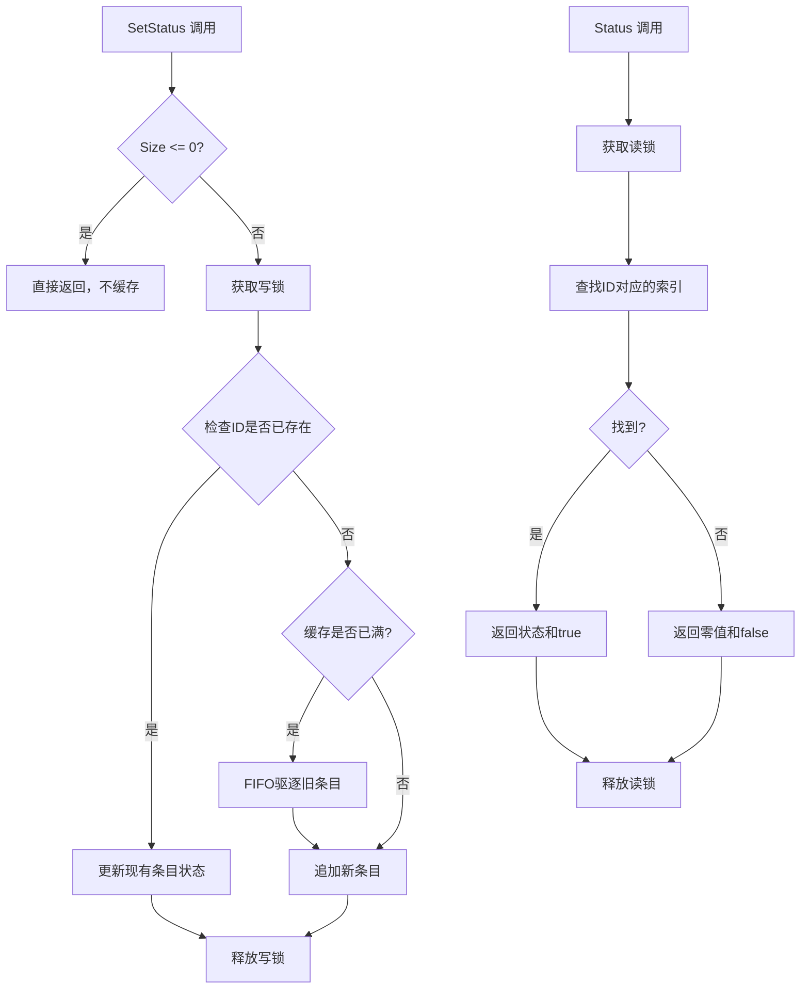
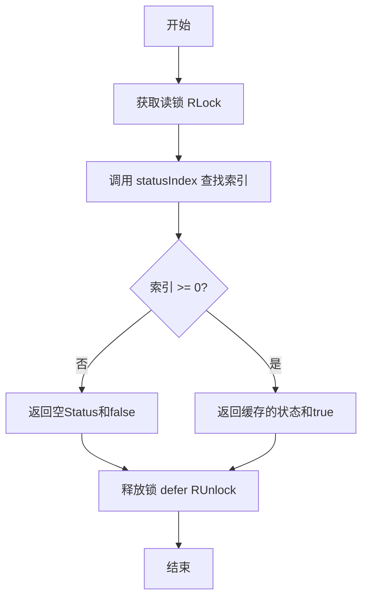

# `flux\pkg\job\status_cache.go` 详细设计文档

一个线程安全的固定大小缓存实现，用于存储Job状态，采用FIFO（先进先出）淘汰策略，当缓存满时自动驱逐最旧的条目。

## 整体流程



## 类结构

```
StatusCache (缓存主结构)
└── cacheEntry (缓存条目结构)
```

## 全局变量及字段


### `StatusCache.Size`
    
缓存容量大小，超过此数量时FIFO驱逐旧条目

类型：`int`
    


### `StatusCache.cache`
    
存储缓存条目的切片，按到达时间排序

类型：`[]cacheEntry`
    


### `StatusCache.RWMutex`
    
嵌入的读写锁，保证并发安全

类型：`sync.RWMutex`
    


### `cacheEntry.ID`
    
Job的唯一标识符

类型：`ID`
    


### `cacheEntry.Status`
    
Job的当前状态

类型：`Status`
    
    

## 全局函数及方法


### StatusCache.SetStatus

设置Job的状态到缓存中，如果缓存已满则按照FIFO顺序驱逐旧条目。

参数：

- `id`：`ID`，Job的唯一标识
- `status`：`Status`，Job的状态值

返回值：`void`，无返回值

#### 流程图

```mermaid
flowchart TD
    A[开始 SetStatus] --> B{Size <= 0?}
    B -->|是| C[直接返回]
    B -->|否| D[加写锁]
    D --> E[调用 statusIndex 查找 id]
    E --> F{i >= 0?}
    F -->|是| G[更新 c.cache[i].Status]
    F -->|否| H{len(c.cache) >= Size?}
    H -->|是| I[执行 FIFO 驱逐<br/>c.cache = c.cache[len-c.Size+1:]]
    H -->|否| J[追加新条目<br/>append cacheEntry]
    I --> J
    G --> K[defer 解锁]
    J --> K
    K --> L[结束]
```

#### 带注释源码

```go
// SetStatus 设置指定Job的状态到缓存中
// 如果缓存已满，会按照FIFO顺序驱逐最旧的条目
// 参数:
//   - id: Job的唯一标识
//   - status: Job的状态值
func (c *StatusCache) SetStatus(id ID, status Status) {
	// 检查缓存大小配置，如果Size <= 0则不进行任何操作
	if c.Size <= 0 {
		return
	}
	
	// 加写锁，保证并发安全
	c.Lock()
	// defer确保锁会被释放，即使发生panic
	defer c.Unlock()
	
	// 查找该id是否已存在于缓存中
	if i := c.statusIndex(id); i >= 0 {
		// 已存在，直接更新状态值
		c.cache[i].Status = status
	}
	
	// 驱逐逻辑：如果缓存已满，先驱逐旧条目
	// 这样可以确保append操作时只需复制保留的数据
	// 这是一个微优化
	if c.Size <= len(c.cache) {
		// 计算需要保留的起始位置，保留最新的Size-1个条目
		// 实际上这里保留的是最新的(c.Size-1)个条目，因为即将添加一个新条目
		c.cache = c.cache[len(c.cache)-(c.Size-1):]
	}
	
	// 追加新的缓存条目
	c.cache = append(c.cache, cacheEntry{
		ID:     id,
		Status: status,
	})
}
```


### StatusCache.Status

该方法通过Job的唯一标识获取缓存的状态值，如果存在则返回状态和true，否则返回空状态和false。

参数：

- `id`：`ID`，Job的唯一标识

返回值：`(Status, bool)`，返回状态值和是否存在标志

#### 流程图



#### 带注释源码

```go
// Status 根据ID获取缓存的Status值
// 参数: id - Job的唯一标识ID
// 返回: (Status, bool) - 状态值和是否存在标志
func (c *StatusCache) Status(id ID) (Status, bool) {
	// 1. 获取读锁，支持并发读取
	c.RLock()
	// 2. defer确保锁会被释放，即使发生panic
	defer c.RUnlock()
	
	// 3. 查找ID在缓存数组中的索引位置
	i := c.statusIndex(id)
	
	// 4. 如果索引小于0，表示未找到该ID的缓存条目
	if i < 0 {
		// 返回空Status对象和false表示不存在
		return Status{}, false
	}
	
	// 5. 找到缓存条目，返回状态值和true表示存在
	return c.cache[i].Status, true
}
```


### `StatusCache.statusIndex`

该方法用于在缓存中查找指定Job ID对应的条目索引，通过线性遍历缓存切片并比较ID实现，若未找到则返回-1。

参数：

- `id`：`ID`，Job的唯一标识

返回值：`int`，返回条目索引，不存在返回-1

#### 流程图

```mermaid
flowchart TD
    A[开始 statusIndex] --> B{遍历 cache 切片}
    B -->|当前元素| C{cache[i].ID == id?}
    C -->|是| D[返回索引 i]
    C -->|否| E{是否还有更多元素}
    E -->|是| B
    E -->|否| F[返回 -1]
    D --> G[结束]
    F --> G
```

#### 带注释源码

```go
// statusIndex returns the index of the cache entry with the given ID.
// Returns -1 if not found. Linear search is used because entries are
// sorted by arrival time (FIFO), not by ID, so binary search is not applicable.
func (c *StatusCache) statusIndex(id ID) int {
	// Iterate through each entry in the cache slice
	for i := range c.cache {
		// Check if the current entry's ID matches the target ID
		if c.cache[i].ID == id {
			// Return the index if found
			return i
		}
	}
	// Return -1 if no matching ID was found in the cache
	return -1
}
```

## 关键组件


### StatusCache 结构体

核心的状态缓存管理器，采用固定大小的FIFO淘汰策略来存储任务状态。

### cacheEntry 结构体

缓存条目结构，包含任务ID和对应的状态信息。

### SetStatus 方法

用于更新或添加任务状态。如果缓存已满，会先淘汰最旧的条目，然后再添加新条目，保证缓存大小不超过设定值。

### Status 方法

根据任务ID查询对应的状态信息，返回状态值和是否存在该状态的布尔标志。

### statusIndex 方法

内部方法，线性搜索缓存数组以查找指定任务ID的索引位置，由于条目按到达时间排序而非ID排序，无法使用二分查找。

### FIFO 淘汰策略

当缓存达到预设大小时，自动移除最旧的条目以腾出空间给新条目，保证缓存始终保持固定大小。

### 线程安全设计

使用 sync.RWMutex 实现读写锁，确保在并发访问时的数据一致性，读取操作使用读锁允许并发，写入操作使用写锁独占访问。


## 问题及建议


### 已知问题

- **线性搜索性能差**：`statusIndex`方法使用线性遍历查找ID，时间复杂度为O(n)，当缓存Size较大时性能瓶颈明显
- **切片驱逐机制低效**：使用`c.cache = c.cache[len(c.cache)-(c.Size-1):]`进行FIFO驱逐，每次驱逐都会创建新的底层数组，导致频繁内存分配和拷贝
- **无缓存清理机制**：缺少显式的缓存清空方法（如`Clear()`），无法手动重置缓存状态
- **Size字段运行时修改风险**：Size字段公开可写，运行时动态修改可能导致缓存行为不一致或数据丢失
- **缺少缓存统计信息**：无法获取当前缓存条目数量、命中率等监控指标
- **注释拼写和表达问题**：注释中存在表述不清晰之处（如"Micro-optimize to the max"），影响代码可维护性
- **无边界保护**：虽然SetStatus对Size<=0做了处理，但Status方法未对边界情况做防护

### 优化建议

- **引入map辅助索引**：在cache切片基础上增加`map[ID]int`类型的索引字段，将查找时间复杂度从O(n)降至O(1)，同时保持FIFO顺序
- **优化驱逐逻辑**：使用环形缓冲区或双指针策略替代当前切片操作，减少内存分配
- **封装Size为只读或增加Setter**：通过构造函数或初始化方法设置Size，运行期间禁止修改，或提供安全的修改接口
- **添加监控接口**：提供`Len() int`方法获取当前缓存数量，便于监控和调试
- **增加Clear方法**：提供显式清空缓存的功能，支持测试场景和资源清理
- **改进驱逐策略**：考虑实现LRU（最近最少使用）而非简单FIFO，提供更灵活的配置选项

## 其它


### 设计目标与约束
实现一个固定大小的线程安全缓存，用于存储任务状态，采用 FIFO 淘汰策略，缓存大小可配置，默认为0时禁用缓存。

### 错误处理与异常设计
由于缓存为内存存储，不涉及持久化失败场景。SetStatus 方法在 Size <= 0 时直接返回，不执行任何操作，视为静默失败。Status 方法在找不到 ID 时返回零值和 false，调用方需自行判断是否存在。

### 数据流与状态机
缓存数据流包括写入和读取两个方向。写入时先获取写锁，检查是否已存在相同 ID，若存在则更新状态，否则执行淘汰操作后追加新条目。读取时先获取读锁，线性搜索缓存数组，找到则返回状态和 true，否则返回零值和 false。状态机较为简单，仅涉及缓存条目的添加、更新和淘汰。

### 外部依赖与接口契约
依赖 ID 和 Status 类型，这两个类型未在本文件中定义，推测来自同包的其它文件或外部包。ID 类型需支持相等比较（== 运算符），Status 类型需支持赋值操作。同步原语依赖 sync 包的 RWMutex。

### 性能考虑
缓存查找采用线性遍历，时间复杂度为 O(n)，n 为缓存大小。由于缓存设计为小规模（Size 较小），遍历性能可接受。写操作包含淘汰逻辑，可能触发切片重新分配。读写锁分离以优化读多写少场景。

### 边界条件处理
当 Size 设置为 0 或负数时，SetStatus 不执行任何操作，Status 始终返回不存在。缓存满时淘汰最旧的条目（数组头部），保留最新的 Size 个条目。并发场景下通过锁保证原子性。

    