# `flux\pkg\manifests\configaware.go` 详细设计文档

This code implements a manifest management system that supports both raw YAML files and configuration-file-driven resource generation (using `.flux.yaml`), incorporating a caching mechanism to optimize resource retrieval and modification operations.

## 整体流程

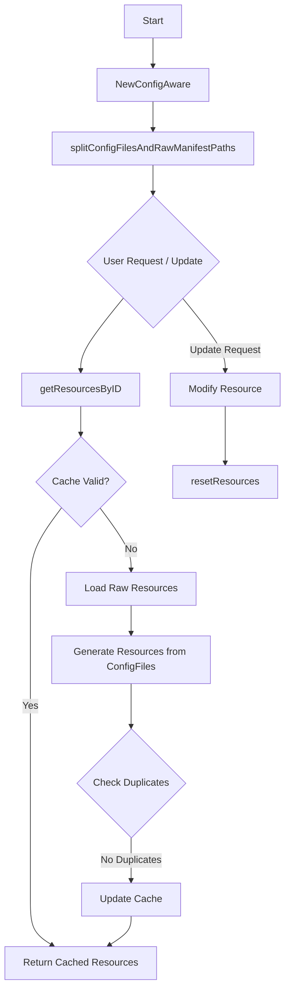

## 类结构

```
manifests (package)
├── resourceWithOrigin (struct)
│   ├── resource (resource.Resource)
│   └── configFile (*ConfigFile)
├── configAware (struct)
│   ├── rawFiles (*rawFiles)
│   ├── baseDir (string)
│   ├── manifests (Manifests)
│   ├── configFiles ([]*ConfigFile)
│   ├── resourcesByID (map[string]resourceWithOrigin)
│   ├── mu (sync.RWMutex)
│   └── defaultTimeout (time.Duration)
└── Interfaces
    ├── Manifests (interface)
    └── resource.Resource (interface)
```

## 全局变量及字段


### `configFileNotFoundErr`
    
Global error variable indicating a .flux.yaml config file was not found.

类型：`error`
    


### `resourceWithOrigin.resource`
    
The actual Kubernetes resource object.

类型：`resource.Resource`
    


### `resourceWithOrigin.configFile`
    
Reference to the config file that generated this resource, if any.

类型：`*ConfigFile`
    


### `configAware.rawFiles`
    
Handler for raw YAML files.

类型：`*rawFiles`
    


### `configAware.baseDir`
    
Base directory of the repository.

类型：`string`
    


### `configAware.manifests`
    
Interface for parsing and generating manifests.

类型：`Manifests`
    


### `configAware.configFiles`
    
List of configuration files found in the paths.

类型：`[]*ConfigFile`
    


### `configAware.resourcesByID`
    
Cached map of resources by ID.

类型：`map[string]resourceWithOrigin`
    


### `configAware.mu`
    
Mutex for thread-safe cache access.

类型：`sync.RWMutex`
    


### `configAware.defaultTimeout`
    
Default timeout for operations.

类型：`time.Duration`
    
    

## 全局函数及方法


### `NewConfigAware`

构造一个 `configAware` 实例，用于处理仓库中的配置文件（`.flux.yaml`）。如果存在配置文件，则使用配置生成清单；否则回退到处理原始 YAML 文件。

参数：

- `baseDir`：`string`，基础目录路径
- `targetPaths`：`[]string`，目标路径列表，用于指定要处理的目录或文件
- `manifests`：`Manifests`，清单操作接口，用于解析和生成清单
- `syncTimeout`：`time.Duration`，同步操作的默认超时时间

返回值：`*configAware, error`，返回配置感知的存储实例指针，如果发生错误则返回错误信息

#### 流程图

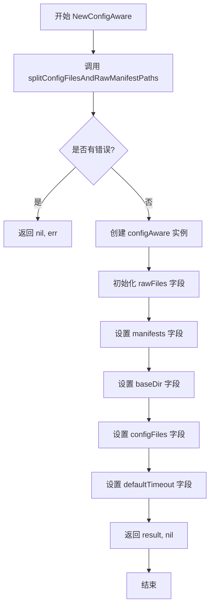

#### 带注释源码

```go
// NewConfigAware constructs a `Store` that processes in-repo config
// files (`.flux.yaml`) where present, and otherwise looks for "raw"
// YAML files.
// NewConfigAware 构造一个 Store，用于处理仓库中的配置文件（.flux.yaml），
// 如果存在则使用配置生成清单，否则查找"原始" YAML 文件。
func NewConfigAware(baseDir string, targetPaths []string, manifests Manifests, syncTimeout time.Duration) (*configAware, error) {
    // 调用 splitConfigFilesAndRawManifestPaths 将路径分割为配置文件和原始清单路径
    configFiles, rawManifestDirs, err := splitConfigFilesAndRawManifestPaths(baseDir, targetPaths)
    if err != nil {
        return nil, err
    }

    // 创建并初始化 configAware 实例
    result := &configAware{
        // 初始化 rawFiles，用于处理没有配置文件的路径
        rawFiles: &rawFiles{
            manifests: manifests,
            baseDir:   baseDir,
            paths:     rawManifestDirs,
        },
        manifests:      manifests,      // 清单操作接口
        baseDir:        baseDir,        // 基础目录
        configFiles:    configFiles,    // 配置文件列表
        defaultTimeout: syncTimeout,   // 默认超时时间
    }
    return result, nil
}
```


### `splitConfigFilesAndRawManifestPaths`

该函数将输入路径分类为两类：一类是由配置文件（`.flux.yaml`）覆盖的路径，另一类是包含原始清单文件的目录路径。它通过遍历每个路径，查找是否存在对应的配置文件，并根据查找结果将路径分配到相应的列表中。

参数：

- `baseDir`：`string`，基准目录路径，用于计算相对路径
- `paths`：`[]string`，需要分类的路径列表

返回值：

- `[]*ConfigFile`：配置文件指针列表，包含所有找到的有效配置文件的结构体
- `[]string`：原始清单路径列表，包含没有对应配置文件的路径
- `error`：执行过程中发生的错误，如果有的话

#### 流程图

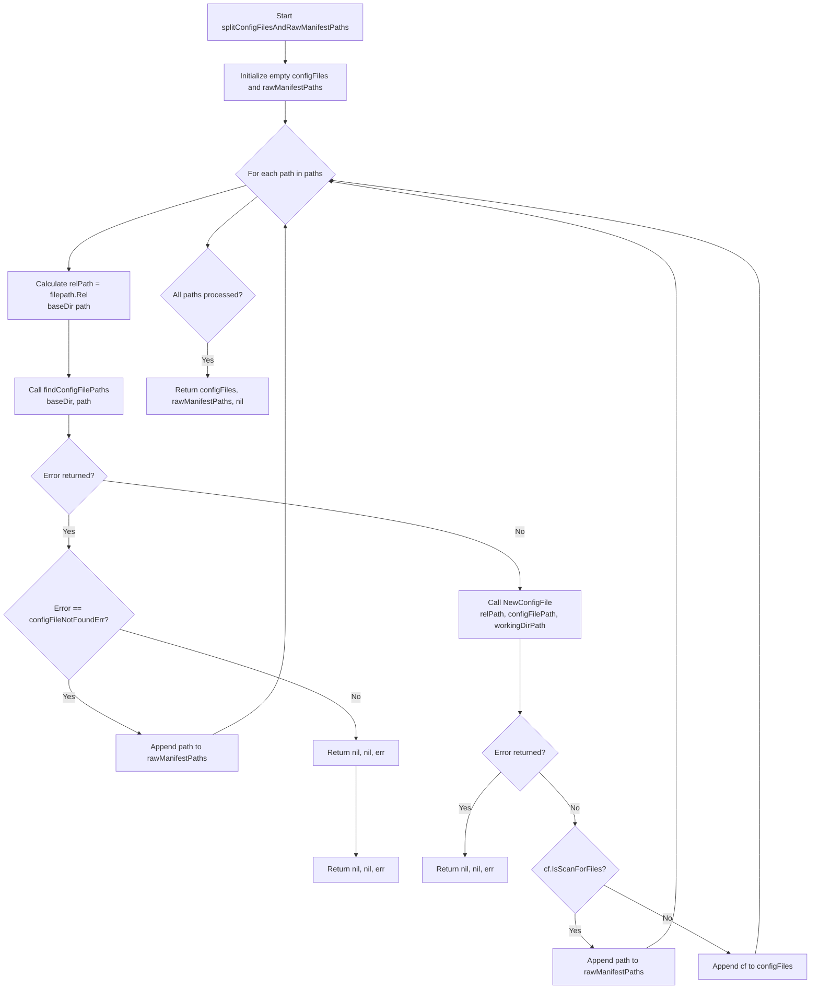

#### 带注释源码

```go
// splitConfigFilesAndRawManifestPaths categorizes input paths into those 
// covered by config files and those that are raw manifest directories.
func splitConfigFilesAndRawManifestPaths(baseDir string, paths []string) ([]*ConfigFile, []string, error) {
	// 初始化两个切片：
	// configFiles 用于存储从配置文件中解析出的 ConfigFile 结构体指针
	// rawManifestPaths 用于存储没有对应配置文件的原始清单路径
	var (
		configFiles      []*ConfigFile
		rawManifestPaths []string
	)

	// 遍历每个输入路径进行分类处理
	for _, path := range paths {
		// 计算相对于基准目录的路径，用于日志和错误信息中显示
		relPath, err := filepath.Rel(baseDir, path)
		if err != nil {
			return nil, nil, err
		}
		
		// 查找从该路径开始向上寻找的配置文件路径
		// 返回：配置文件完整路径、工作目录路径、错误
		configFilePath, workingDirPath, err := findConfigFilePaths(baseDir, path)
		if err != nil {
			// 如果未找到配置文件，将该路径视为原始清单路径
			if err == configFileNotFoundErr {
				rawManifestPaths = append(rawManifestPaths, path)
				continue
			}
			// 其他错误则返回错误信息
			return nil, nil, fmt.Errorf("error finding a config file starting at path %q: %s", relPath, err)
		}
		
		// 根据找到的配置文件路径创建 ConfigFile 结构体
		cf, err := NewConfigFile(relPath, configFilePath, workingDirPath)
		if err != nil {
			return nil, nil, fmt.Errorf("cannot parse config file: %s", err)
		}
		
		// 如果配置文件中设置了扫描文件模式，则将其视为原始清单路径
		if cf.IsScanForFiles() {
			rawManifestPaths = append(rawManifestPaths, path)
			continue
		}
		
		// 有效配置文件，加入配置列表
		configFiles = append(configFiles, cf)
	}

	// 返回分类结果：配置文件列表、原始清单路径列表、无错误
	return configFiles, rawManifestPaths, nil
}
```


### `findConfigFilePaths`

该函数用于从给定的初始路径开始，递归向上遍历父目录，直至找到 `.flux.yaml` 配置文件或到达基础目录为止。如果初始路径本身是配置文件，则直接返回。

参数：

- `baseDir`：`string`，基础目录路径，用于限制向上搜索的范围，防止超出 Git 仓库根目录
- `initialPath`：`string`，初始搜索路径，可以是目录或文件路径

返回值：`string, string, error`，返回依次为找到的配置文件路径、工作目录路径，若未找到则返回 `configFileNotFoundErr` 错误

#### 流程图

```mermaid
flowchart TD
    A[开始 findConfigFilePaths] --> B{initialPath 是目录吗?}
    B -->|否| C{文件名是 .flux.yaml 吗?}
    B -->|是| D[标准化路径并验证在 baseDir 内]
    C -->|是| E[返回配置文件路径和工作目录]
    C -->|否| F[返回 configFileNotFoundErr]
    D --> G[从 cleanInitialPath 开始循环]
    G --> H{当前路径存在 .flux.yaml?}
    H -->|是| I[返回配置文件路径和 initialPath]
    H -->|否| J{当前路径 == baseDir?}
    J -->|是| K[退出循环]
    J -->|否| L[path = filepath.Dir(path)]
    L --> G
    K --> M[返回 configFileNotFoundErr]
    
    style E fill:#90EE90
    style I fill:#90EE90
    style F fill:#FFB6C1
    style M fill:#FFB6C1
```

#### 带注释源码

```go
// findConfigFilePaths 递归向上搜索查找 .flux.yaml 配置文件
// 参数 baseDir: 基础目录路径，限制搜索范围
// 参数 initialPath: 初始搜索路径
// 返回: 配置文件路径, 工作目录路径, 错误
func findConfigFilePaths(baseDir string, initialPath string) (string, string, error) {
	// 首先检查初始路径是否直接就是 .flux.yaml 配置文件
	// 使用 os.Stat 获取文件信息
	fileStat, err := os.Stat(initialPath)
	if err != nil {
		return "", "", err
	}
	
	// 如果不是目录（即是文件），检查文件名是否为目标配置文件
	if !fileStat.IsDir() {
		// 分割路径获取工作目录和文件名
		workingDir, filename := filepath.Split(initialPath)
		// 检查是否为 .flux.yaml 文件
		if filename == ConfigFilename {
			// 返回配置文件绝对路径和工作目录（已清理）
			return initialPath, filepath.Clean(workingDir), nil
		}
		// 文件不是配置文件，返回未找到错误
		return "", "", configFileNotFoundErr
	}

	// === 以下处理初始路径是目录的情况 ===

	// 标准化路径：去除末尾斜杠，确保 filepath.Dir() 行为一致
	// 同时验证初始路径必须在 baseDir 内，防止超出 Git 仓库范围
	_, cleanInitialPath, err := cleanAndEnsureParentPath(baseDir, initialPath)
	if err != nil {
		return "", "", err
	}

	// 从清理后的初始路径开始向上遍历父目录
	for path := cleanInitialPath; ; {
		// 构造当前路径下的配置文件完整路径
		potentialConfigFilePath := filepath.Join(path, ConfigFilename)
		
		// 检查该配置文件是否存在
		if _, err := os.Stat(potentialConfigFilePath); err == nil {
			// 找到配置文件，返回其路径和原始工作目录
			return potentialConfigFilePath, initialPath, nil
		}
		
		// 已到达基础目录，停止搜索
		if path == baseDir {
			break
		}
		
		// 移动到父目录继续搜索
		path = filepath.Dir(path)
	}

	// 未找到任何配置文件
	return "", "", configFileNotFoundErr
}
```


### `cleanAndEnsureParentPath`

验证子路径是否在基础目录内，并规范化路径。该函数通过将路径转换为绝对路径并清理路径，确保子路径不会超出基础目录，从而防止目录遍历攻击。

参数：

- `basePath`：`string`，基础目录路径，用于验证的父目录
- `childPath`：`string`，子路径，需要验证的子文件或子目录路径

返回值：

- `string`：清理后的基础目录绝对路径
- `string`：清理后的子路径绝对路径
- `error`：如果子路径不在基础目录内，返回错误；否则返回 nil

#### 流程图

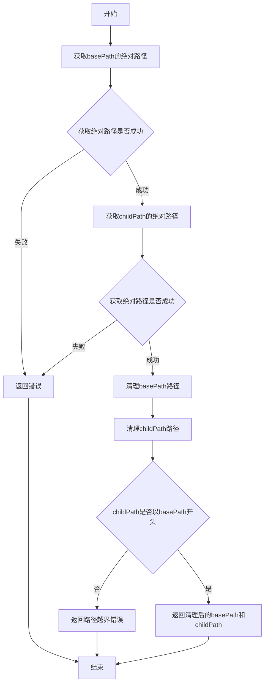

#### 带注释源码

```go
// cleanAndEnsureParentPath 验证子路径是否在基础目录内，并规范化路径
// 参数：
//   - basePath: 基础目录路径，用于验证的父目录
//   - childPath: 子路径，需要验证的子文件或子目录路径
//
// 返回值：
//   - string: 清理后的基础目录绝对路径
//   - string: 清理后的子路径绝对路径
//   - error: 如果子路径不在基础目录内，返回错误；否则返回 nil
func cleanAndEnsureParentPath(basePath string, childPath string) (string, string, error) {
	// 将路径转换为绝对路径并移除潜在的尾部斜杠
	// 以便 filepath.Dir() 按预期工作
	cleanBasePath, err := filepath.Abs(basePath)
	if err != nil {
		return "", "", err
	}
	cleanChildPath, err := filepath.Abs(childPath)
	if err != nil {
		return "", "", err
	}
	// 清理路径，移除多余的斜杠和点（如 ./ 和 ../）
	cleanBasePath = filepath.Clean(cleanBasePath)
	cleanChildPath = filepath.Clean(cleanChildPath)

	// 初始路径必须相对于 baseDir
	// （以确保我们在向上移动目录层次结构时
	// 不会逃出 git 检出目录）
	if !strings.HasPrefix(cleanChildPath, cleanBasePath) {
		return "", "", fmt.Errorf("path %q is outside of base directory %s", childPath, basePath)
	}
	return cleanBasePath, cleanChildPath, nil
}
```


### `configAware.SetWorkloadContainerImage`

更新指定工作负荷资源的容器镜像，支持原始 YAML 文件和配置文件生成的资源。

参数：

- `ctx`：`context.Context`，用于传递上下文信息（取消、超时等）
- `resourceID`：`resource.ID`，要更新镜像的资源唯一标识符
- `container`：`string`，要更新的容器名称
- `newImageID`：`image.Ref`，新的镜像引用

返回值：`error`，如果资源未找到或更新失败则返回错误

#### 流程图

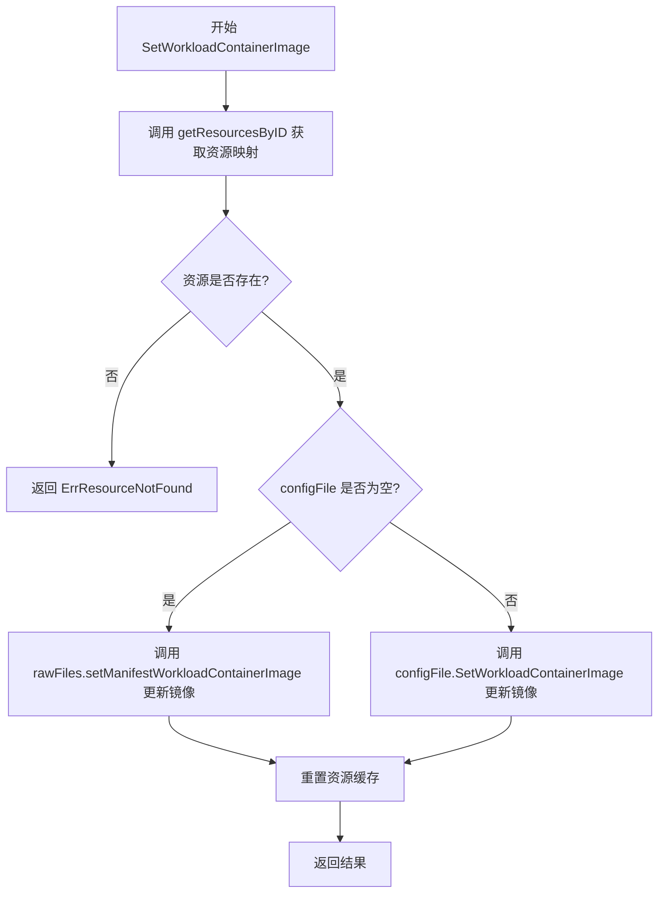

#### 带注释源码

```go
// SetWorkloadContainerImage 更新指定工作负荷资源的容器镜像
// 参数:
//   - ctx: 上下文对象，用于控制超时和取消
//   - resourceID: 资源的唯一标识符
//   - container: 要更新的容器名称
//   - newImageID: 新的镜像引用
//
// 返回值:
//   - error: 如果资源不存在或更新失败则返回错误
func (ca *configAware) SetWorkloadContainerImage(ctx context.Context, resourceID resource.ID, container string,
	newImageID image.Ref) error {
	// 步骤1: 获取所有资源的映射表（从缓存或重新加载）
	resourcesByID, err := ca.getResourcesByID(ctx)
	if err != nil {
		return err
	}
	// 步骤2: 根据 resourceID 查找目标资源
	resWithOrigin, ok := resourcesByID[resourceID.String()]
	if !ok {
		// 步骤3: 资源不存在时返回错误
		return ErrResourceNotFound(resourceID.String())
	}
	// 步骤4: 根据资源的来源类型选择不同的更新方式
	if resWithOrigin.configFile == nil {
		// 资源来自原始 YAML 文件，使用 rawFiles 进行更新
		if err := ca.rawFiles.setManifestWorkloadContainerImage(resWithOrigin.resource, container, newImageID); err != nil {
			return err
		}
	} else {
		// 资源由配置文件生成，调用配置文件的 SetWorkloadContainerImage 方法
		if err := resWithOrigin.configFile.SetWorkloadContainerImage(ctx, ca.manifests, resWithOrigin.resource, container, newImageID, ca.defaultTimeout); err != nil {
			return err
		}
	}
	// 步骤5: 重置资源缓存，因为已修改了资源
	ca.resetResources()
	return nil
}
```


### `configAware.UpdateWorkloadPolicies`

更新清单中的策略注解，根据资源是否来自配置文件选择不同的更新路径。

参数：

- `ctx`：`context.Context`，用于控制请求的取消和超时
- `resourceID`：`resource.ID`，要更新策略的资源标识符
- `update`：`resource.PolicyUpdate`，要应用的策略更新内容

返回值：`bool`，表示资源是否被修改；`error`，操作过程中发生的错误（如资源未找到或更新失败）

#### 流程图

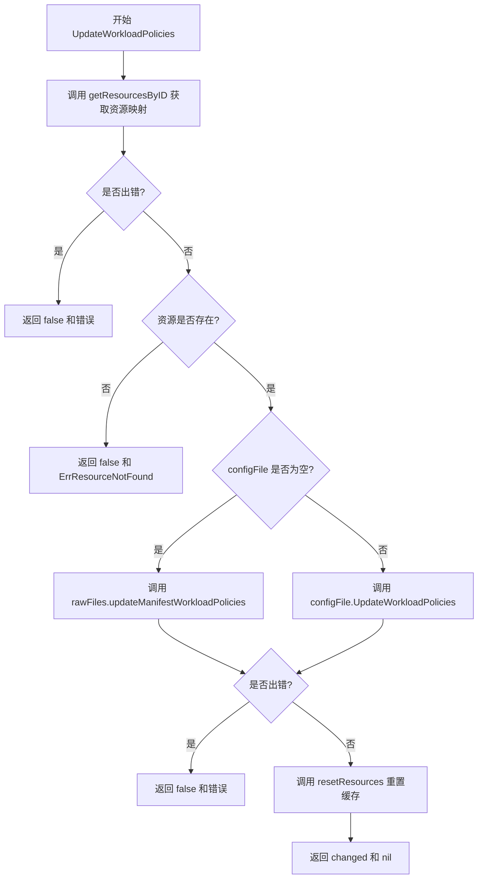

#### 带注释源码

```go
// UpdateWorkloadPolicies 更新清单中的策略注解
// 参数：
//   - ctx: 上下文，用于控制超时和取消
//   - resourceID: 资源标识符，指定要更新的资源
//   - update: 策略更新内容，包含要修改的策略信息
//
// 返回值：
//   - bool: 标识资源是否被修改
//   - error: 操作过程中的错误信息
func (ca *configAware) UpdateWorkloadPolicies(ctx context.Context, resourceID resource.ID, update resource.PolicyUpdate) (bool, error) {
	// 步骤1: 获取所有资源及其来源信息
	resourcesByID, err := ca.getResourcesByID(ctx)
	if err != nil {
		// 如果获取资源失败，直接返回错误
		return false, err
	}
	
	// 步骤2: 根据 resourceID 查找对应的资源
	resWithOrigin, ok := resourcesByID[resourceID.String()]
	if !ok {
		// 资源不存在，返回资源未找到错误
		return false, ErrResourceNotFound(resourceID.String())
	}
	
	// 步骤3: 根据资源来源选择不同的更新策略
	var changed bool
	if resWithOrigin.configFile == nil {
		// 资源来自原始 YAML 文件，使用 rawFiles 更新
		changed, err = ca.rawFiles.updateManifestWorkloadPolicies(resWithOrigin.resource, update)
	} else {
		// 资源由配置文件生成，使用配置文件的方式更新
		cf := resWithOrigin.configFile
		changed, err = cf.UpdateWorkloadPolicies(ctx, ca.manifests, resWithOrigin.resource, update, ca.defaultTimeout)
	}
	
	// 步骤4: 处理更新过程中的错误
	if err != nil {
		return false, err
	}
	
	// 步骤5: 重置资源缓存，因为资源已被修改
	// 这确保下次访问时会重新加载最新的资源信息
	ca.resetResources()
	
	// 步骤6: 返回更新结果
	return changed, nil
}
```


### `configAware.GetAllResourcesByID`

该方法是 `configAware` 类的公共 getter 方法，用于获取所有资源。它调用私有的 `getResourcesByID` 方法获取包含配置来源的资源映射，然后仅提取 `resource.Resource` 对象返回给调用者，隐藏了内部配置文件的来源信息。

参数：

- `ctx`：`context.Context`，上下文对象，用于传递请求级别的取消信号和截止时间

返回值：`map[string]resource.Resource, error`，返回资源ID到资源对象的映射，以及可能发生的错误

#### 流程图

```mermaid
flowchart TD
    A[Start GetAllResourcesByID] --> B[调用 getResourcesByID(ctx)]
    B --> C{是否有错误?}
    C -->|是| D[return nil, err]
    C -->|否| E[创建 result map]
    E --> F[遍历 resourcesByID]
    F --> G[提取 resource 对象放入 result]
    G --> H{是否遍历完成?}
    H -->|否| F
    H -->|是| I[return result, nil]
    D --> J[End]
    I --> J
```

#### 带注释源码

```go
// GetAllResourcesByID 返回所有资源的公共 getter 方法
// 它获取包含资源来源信息（configFile）的内部映射，
// 并将其转换为仅包含资源对象的映射返回给调用者
func (ca *configAware) GetAllResourcesByID(ctx context.Context) (map[string]resource.Resource, error) {
	// 调用内部方法获取所有资源及其来源信息
	resourcesByID, err := ca.getResourcesByID(ctx)
	if err != nil {
		// 如果获取资源时发生错误，直接返回错误
		return nil, err
	}
	
	// 创建一个新的映射，仅包含资源对象而不包含来源信息
	// 使用原始映射的长度来预分配空间，提高性能
	result := make(map[string]resource.Resource, len(resourcesByID))
	
	// 遍历所有资源，提取纯资源对象
	for id, resourceWithOrigin := range resourcesByID {
		result[id] = resourceWithOrigin.resource
	}
	
	// 返回资源映射和 nil 错误
	return result, nil
}
```


### `configAware.getResourcesByID`

该函数是一个内部资源获取方法，带有缓存逻辑。它首先尝试从缓存中读取已加载的资源，如果缓存不存在，则从原始文件和配置文件中加载所有资源，进行去重检查后将结果缓存并返回。

参数：

- `ctx`：`context.Context`，用于传递上下文信息（如取消信号、超时控制等）

返回值：`map[string]resourceWithOrigin`，返回一个键为资源ID、值为包含资源和来源信息的map；如果发生错误则返回error

#### 流程图

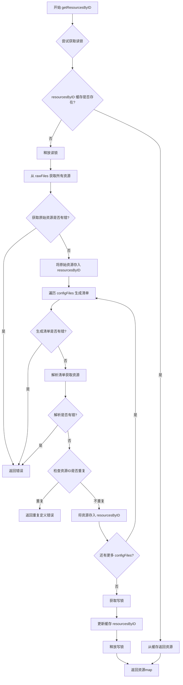

#### 带注释源码

```go
// getResourcesByID 是 configAware 类型的内部方法，用于获取所有资源
// 它实现了缓存逻辑：如果资源已经被加载过，则直接返回缓存；
// 否则加载资源、去重检查、缓存并返回
func (ca *configAware) getResourcesByID(ctx context.Context) (map[string]resourceWithOrigin, error) {
	// 首先尝试获取读锁，检查缓存是否存在
	ca.mu.RLock()
	if ca.resourcesByID != nil {
		// 缓存已存在，直接返回缓存的副本
		toReturn := ca.resourcesByID
		ca.mu.RUnlock()
		return toReturn, nil
	}
	// 缓存不存在，释放读锁
	ca.mu.RUnlock()

	// 初始化资源map
	resourcesByID := map[string]resourceWithOrigin{}

	// 从原始YAML文件获取所有资源
	rawResourcesByID, err := ca.rawFiles.GetAllResourcesByID(ctx)
	if err != nil {
		return nil, err
	}
	// 将原始资源添加到资源map中（configFile设为nil，表示来自原始文件）
	for id, res := range rawResourcesByID {
		resourcesByID[id] = resourceWithOrigin{resource: res}
	}

	// 遍历每个配置文件，生成并处理资源
	for _, cf := range ca.configFiles {
		// 使用配置生成清单
		resourceManifests, err := cf.GenerateManifests(ctx, ca.manifests, ca.defaultTimeout)
		if err != nil {
			return nil, err
		}
		// 解析清单获取资源对象
		resources, err := ca.manifests.ParseManifest(resourceManifests, cf.ConfigRelativeToWorkingDir())
		if err != nil {
			return nil, err
		}

		// 检查每个生成的资源ID是否重复
		for id, generated := range resources {
			if duplicate, ok := resourcesByID[id]; ok {
				var duplicateErr error
				switch {
				case duplicate.configFile == cf:
					// 重复资源也来自当前配置文件（当前不可达，因为解析代码会检测map重复）
					duplicateErr = fmt.Errorf("duplicate definition of '%s' (generated by %s)",
						id, cf.ConfigRelativeToWorkingDir())
				case duplicate.configFile != nil:
					// 重复资源来自另一个配置文件
					dupCf := duplicate.configFile
					duplicateErr = fmt.Errorf("duplicate definition of '%s' (generated by %s and by %s)",
						id, cf.ConfigRelativeToWorkingDir(), dupCf.ConfigRelativeToWorkingDir())
				default:
					// 重复资源来自原始文件
					duplicateErr = fmt.Errorf("duplicate definition of '%s' (generated by %s and in %s)",
						id, cf.ConfigRelativeToWorkingDir(), duplicate.resource.Source())
				}
				return nil, duplicateErr
			}
			// 资源不重复，添加到map并记录来源的配置文件
			resourcesByID[id] = resourceWithOrigin{resource: generated, configFile: cf}
		}
	}
	// 获取写锁并更新缓存
	ca.mu.Lock()
	ca.resourcesByID = resourcesByID
	ca.mu.Unlock()
	return resourcesByID, nil
}
```


### `configAware.resetResources`

重置资源缓存，将 `resourcesByID` 置为空以强制重新加载资源。

参数： 无

返回值： 无（void）

#### 流程图

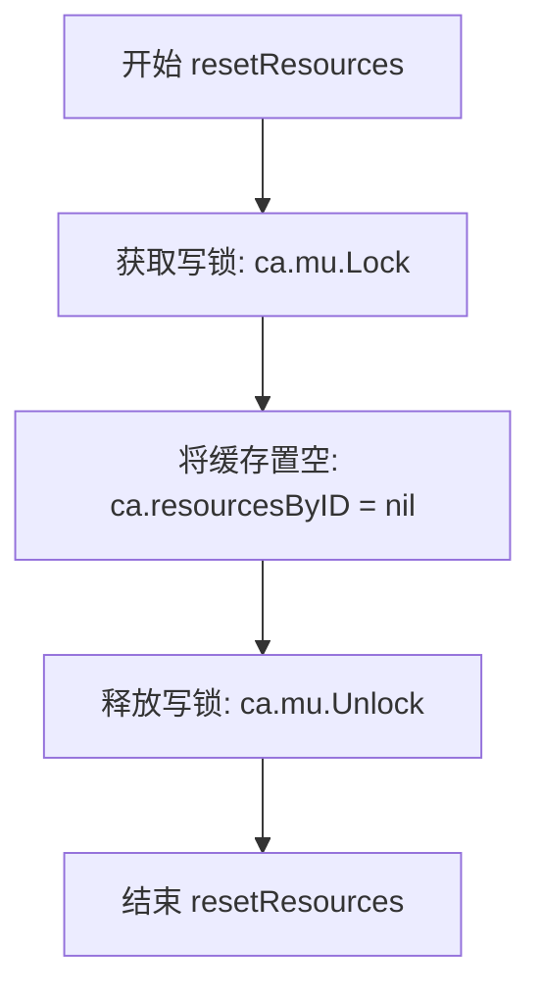

#### 带注释源码

```go
// resetResources 用于使资源缓存失效
// 在修改资源后调用，以确保下次访问时重新加载最新的资源状态
func (ca *configAware) resetResources() {
	// 获取写锁，确保在多线程环境下安全地重置缓存
	ca.mu.Lock()
	
	// 将 resourcesByID 置为 nil，表示缓存已失效
	// 这样下次调用 getResourcesByID 时会重新加载所有资源
	ca.resourcesByID = nil
	
	// 释放写锁，允许其他 goroutine 访问或修改缓存
	ca.mu.Unlock()
}
```


### `NewConfigAware`

该函数是 `configAware` 类的构造函数，用于初始化一个配置感知的存储对象。它接收基础目录、目标路径清单和清单接口作为参数，解析配置文件（`.flux.yaml`）和原始 YAML 文件路径，并将它们分别存储以便后续处理资源。

参数：

- `baseDir`：`string`，基础目录，表示 Git 仓库的根目录
- `targetPaths`：`[]string`，目标路径列表，需要处理的路径
- `manifests`：`Manifests`，清单接口，用于解析和操作 Kubernetes 清单
- `syncTimeout`：`time.Duration`，默认命令超时时间

返回值：`*configAware, error`，返回初始化的配置感知存储对象，或在出错时返回错误

#### 流程图

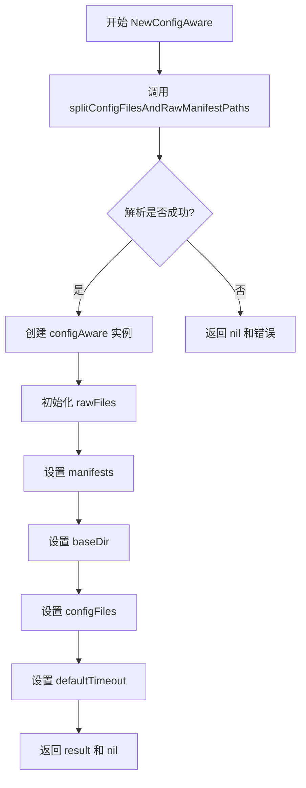

#### 带注释源码

```go
// NewConfigAware 构造一个处理仓库配置文件的 Store（当存在 .flux.yaml 时），
// 否则查找"原始" YAML 文件。
// 参数：
//   - baseDir: 基础目录，Git 仓库根目录
//   - targetPaths: 目标路径列表，需要处理的路径
//   - manifests: Manifests 接口，用于解析和操作 Kubernetes 资源清单
//   - syncTimeout: 同步超时时间
//
// 返回值：
//   - *configAware: 配置感知的存储对象
//   - error: 如果初始化过程中出现错误则返回错误
func NewConfigAware(baseDir string, targetPaths []string, manifests Manifests, syncTimeout time.Duration) (*configAware, error) {
    // 调用辅助函数，将路径分为两类：配置文件和原始清单路径
    configFiles, rawManifestDirs, err := splitConfigFilesAndRawManifestPaths(baseDir, targetPaths)
    if err != nil {
        // 如果解析路径出错，直接返回错误
        return nil, err
    }

    // 创建 configAware 实例并初始化其字段
    result := &configAware{
        // 初始化 rawFiles，用于处理没有配置文件关联的路径
        rawFiles: &rawFiles{
            manifests: manifests,
            baseDir:   baseDir,
            paths:     rawManifestDirs,
        },
        // 存储清单接口引用
        manifests:      manifests,
        // 存储基础目录
        baseDir:        baseDir,
        // 存储解析到的配置文件列表
        configFiles:    configFiles,
        // 存储默认超时时间
        defaultTimeout: syncTimeout,
    }
    // 返回初始化后的对象
    return result, nil
}
```


### `configAware.SetWorkloadContainerImage`

更新指定工作负载的容器镜像。首先通过资源ID获取资源及其来源信息，然后判断资源是否来自配置文件：若来自原始文件则调用 `rawFiles.setManifestWorkloadContainerImage` 更新；若来自配置文件则调用 `configFile.SetWorkloadContainerImage` 更新。更新完成后重置资源缓存。

参数：

- `ctx`：`context.Context`，上下文对象，用于传递请求范围的截止日期、取消信号和其他请求范围的值
- `resourceID`：`resource.ID`，要更新镜像的工作负载资源标识符
- `container`：`string`，要更新镜像的容器名称
- `newImageID`：`image.Ref`，新的容器镜像引用

返回值：`error`，如果更新成功返回 nil，否则返回具体的错误信息

#### 流程图

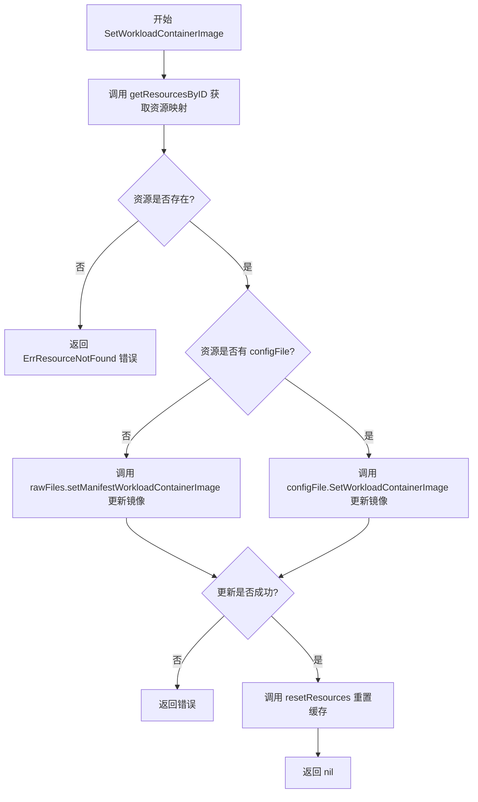

#### 带注释源码

```go
// SetWorkloadContainerImage 更新指定工作负载的容器镜像
// 参数：
//   - ctx: 上下文对象，用于控制请求生命周期
//   - resourceID: 资源ID，标识要更新的工作负载
//   - container: 容器名称，指定要更新镜像的容器
//   - newImageID: 新的镜像引用
//
// 返回值：
//   - error: 操作过程中的错误信息，成功时为 nil
func (ca *configAware) SetWorkloadContainerImage(ctx context.Context, resourceID resource.ID, container string,
	newImageID image.Ref) error {
	// 第一步：获取所有资源的映射表（可能包含缓存）
	resourcesByID, err := ca.getResourcesByID(ctx)
	if err != nil {
		return err
	}
	
	// 第二步：根据 resourceID 查找对应的资源及其来源信息
	resWithOrigin, ok := resourcesByID[resourceID.String()]
	if !ok {
		// 资源不存在时返回专用错误
		return ErrResourceNotFound(resourceID.String())
	}
	
	// 第三步：根据资源来源决定更新方式
	// 情况一：资源来自原始 YAML 文件（configFile 为 nil）
	if resWithOrigin.configFile == nil {
		if err := ca.rawFiles.setManifestWorkloadContainerImage(resWithOrigin.resource, container, newImageID); err != nil {
			return err
		}
	} else if err := resWithOrigin.configFile.SetWorkloadContainerImage(ctx, ca.manifests, resWithOrigin.resource, container, newImageID, ca.defaultTimeout); err != nil {
		// 情况二：资源来自配置文件，委托给 configFile 处理
		return err
	}
	
	// 第四步：由于已修改资源，需要重置缓存以确保后续操作获取最新数据
	ca.resetResources()
	return nil
}
```


### `configAware.UpdateWorkloadPolicies`

该方法用于更新指定工作负载的策略（如自动化策略），根据资源是否来自配置文件分别调用不同的更新逻辑，最后重置资源缓存以反映最新状态。

参数：

- `ctx`：`context.Context`，上下文对象，用于传递请求级别的取消、超时和截止信息
- `resourceID`：`resource.ID`，需要更新策略的目标资源的唯一标识符
- `update`：`resource.PolicyUpdate`，包含要更新的策略信息的结构体

返回值：`bool, error`，返回是否发生了策略变更（true表示变更成功），以及可能的错误信息

#### 流程图

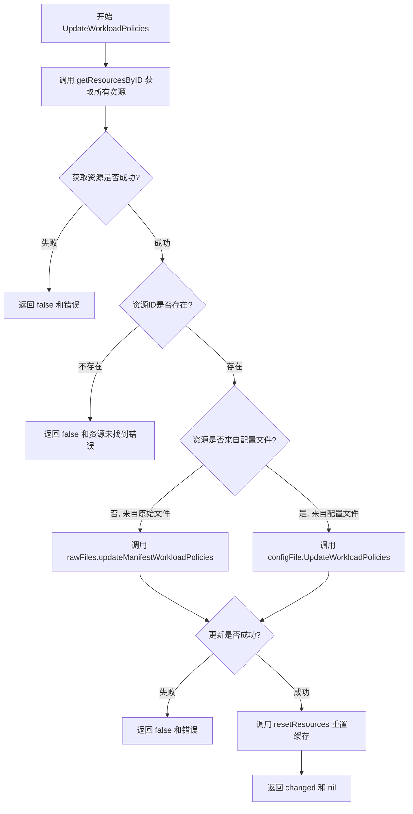

#### 带注释源码

```go
// UpdateWorkloadPolicies 更新指定工作负载的策略（如自动化策略）
// 参数：
//   - ctx: 上下文对象，用于控制超时和取消
//   - resourceID: 目标资源的唯一标识
//   - update: 包含要更新的策略信息的结构体
// 返回值：
//   - bool: 表示策略是否发生了变更
//   - error: 如果发生错误则返回错误信息
func (ca *configAware) UpdateWorkloadPolicies(ctx context.Context, resourceID resource.ID, update resource.PolicyUpdate) (bool, error) {
    // 步骤1: 获取所有资源的映射表（从缓存或重新加载）
    resourcesByID, err := ca.getResourcesByID(ctx)
    if err != nil {
        // 如果获取资源失败，直接返回错误
        return false, err
    }
    
    // 步骤2: 根据resourceID查找对应的资源及其来源信息
    resWithOrigin, ok := resourcesByID[resourceID.String()]
    if !ok {
        // 如果资源不存在，返回资源未找到错误
        return false, ErrResourceNotFound(resourceID.String())
    }
    
    // 步骤3: 根据资源的来源决定调用哪个更新方法
    var changed bool
    if resWithOrigin.configFile == nil {
        // 如果资源来自原始YAML文件（非配置文件），调用rawFiles的更新方法
        changed, err = ca.rawFiles.updateManifestWorkloadPolicies(resWithOrigin.resource, update)
    } else {
        // 如果资源来自配置文件（.flux.yaml），调用配置文件的更新方法
        cf := resWithOrigin.configFile
        changed, err = cf.UpdateWorkloadPolicies(ctx, ca.manifests, resWithOrigin.resource, update, ca.defaultTimeout)
    }
    
    // 步骤4: 检查更新操作是否出错
    if err != nil {
        return false, err
    }
    
    // 步骤5: 重置资源缓存，因为已修改了某个资源
    // 这样下次访问资源时会重新加载最新的内容
    ca.resetResources()
    
    // 步骤6: 返回变更状态和nil错误
    return changed, nil
}
```


### `configAware.GetAllResourcesByID`

该方法作为配置感知的资源仓库的公共接口，封装了内部资源加载逻辑，通过调用 `getResourcesByID` 获取所有资源（包括来自原始文件和配置文件的资源），并将其转换为只包含资源对象本身的映射表返回给调用者，同时处理了可能出现的错误情况。

参数：

-  `ctx`：`context.Context`，上下文对象，用于传递超时、取消信号等控制信息

返回值：`map[string]resource.Resource`，返回所有托管资源的映射表，键为资源ID字符串，值为资源对象；如果发生错误则返回 `nil` 和错误信息

#### 流程图

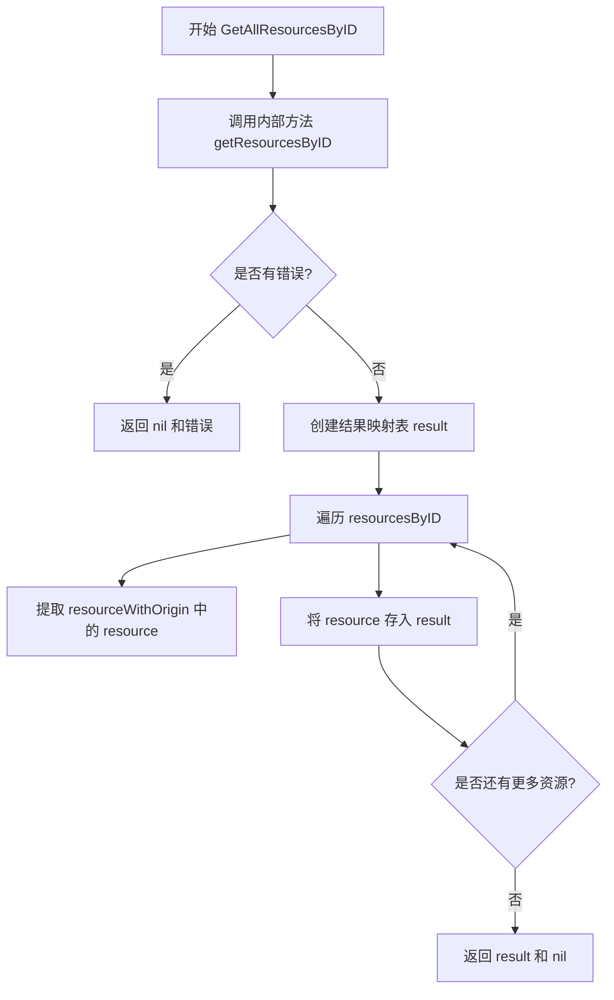

#### 带注释源码

```go
// GetAllResourcesByID 返回所有托管资源作为映射表
// 参数 ctx: 上下文对象，用于控制操作超时和取消
// 返回值: 资源ID到资源对象的映射，以及可能的错误
func (ca *configAware) GetAllResourcesByID(ctx context.Context) (map[string]resource.Resource, error) {
	// 调用内部方法获取完整的资源映射（包含配置来源信息）
	resourcesByID, err := ca.getResourcesByID(ctx)
	if err != nil {
		// 如果获取资源时发生错误，直接返回错误
		return nil, err
	}
	
	// 创建一个新的映射表，只包含资源对象本身，去除配置来源信息
	result := make(map[string]resource.Resource, len(resourcesByID))
	
	// 遍历所有资源，提取纯资源对象并放入结果映射表
	for id, resourceWithOrigin := range resourcesByID {
		result[id] = resourceWithOrigin.resource
	}
	
	// 返回结果映射表，错误为 nil
	return result, nil
}
```


### `configAware.getResourcesByID`

内部方法，用于检索资源并处理缓存填充。当资源尚未缓存时，该方法会从原始文件（rawFiles）和配置文件（configFiles）加载所有资源，进行重复检测，并将结果存入缓存以供后续调用使用。

参数：

- `ctx`：`context.Context`，用于控制请求的上下文和取消操作

返回值：

- `map[string]resourceWithOrigin`：包含资源ID到资源及其来源（原始文件或配置文件）映射的字典
- `error`：如果在加载或解析资源过程中发生错误，则返回错误；否则返回nil

#### 流程图

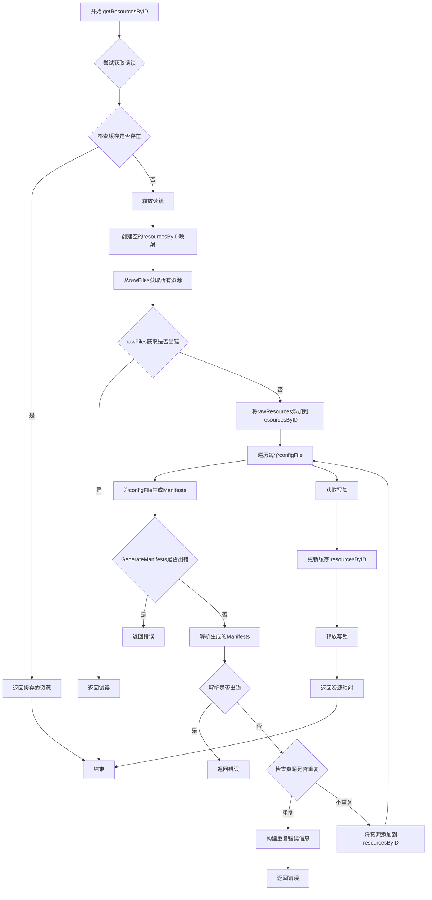

#### 带注释源码

```go
// getResourcesByID 是 configAware 的内部方法，用于检索资源并处理缓存填充。
// 如果资源已经缓存，则直接返回缓存的资源；否则，从原始文件和配置文件中加载资源，
// 进行重复检测，并将结果存入缓存以供后续调用使用。
func (ca *configAware) getResourcesByID(ctx context.Context) (map[string]resourceWithOrigin, error) {
	// 首先尝试获取读锁，检查资源是否已经缓存
	ca.mu.RLock()
	if ca.resourcesByID != nil {
		// 缓存命中，直接返回缓存的资源
		toReturn := ca.resourcesByID
		ca.mu.RUnlock()
		return toReturn, nil
	}
	// 缓存未命中，释放读锁
	ca.mu.RUnlock()

	// 创建一个新的空映射来存储资源
	resourcesByID := map[string]resourceWithOrigin{}

	// 从原始文件（rawFiles）获取所有资源
	rawResourcesByID, err := ca.rawFiles.GetAllResourcesByID(ctx)
	if err != nil {
		// 如果获取原始资源出错，直接返回错误
		return nil, err
	}
	// 将原始资源添加到映射中，初始时没有关联的配置文件
	for id, res := range rawResourcesByID {
		resourcesByID[id] = resourceWithOrigin{resource: res}
	}

	// 遍历每个配置文件（configFile）
	for _, cf := range ca.configFiles {
		// 使用配置文件生成Manifests
		resourceManifests, err := cf.GenerateManifests(ctx, ca.manifests, ca.defaultTimeout)
		if err != nil {
			return nil, err
		}
		// 解析生成的Manifests
		resources, err := ca.manifests.ParseManifest(resourceManifests, cf.ConfigRelativeToWorkingDir())
		if err != nil {
			return nil, err
		}

		// 遍历解析后的资源，检查是否有重复定义
		for id, generated := range resources {
			// 检查资源ID是否已经存在于映射中（即是否重复）
			if duplicate, ok := resourcesByID[id]; ok {
				var duplicateErr error
				switch {
				case duplicate.configFile == cf:
					// 重复资源也由当前配置文件生成
					// 这种情况目前不可达，因为解析代码会检测到重复的map键
					duplicateErr = fmt.Errorf("duplicate definition of '%s' (generated by %s)",
						id, cf.ConfigRelativeToWorkingDir())
				case duplicate.configFile != nil:
					// 重复资源来自另一个配置文件
					dupCf := duplicate.configFile
					duplicateErr = fmt.Errorf("duplicate definition of '%s' (generated by %s and by %s)",
						id, cf.ConfigRelativeToWorkingDir(), dupCf.ConfigRelativeToWorkingDir())
				default:
					// 重复资源来自原始文件
					duplicateErr = fmt.Errorf("duplicate definition of '%s' (generated by %s and in %s)",
						id, cf.ConfigRelativeToWorkingDir(), duplicate.resource.Source())
				}
				return nil, duplicateErr
			}
			// 资源不重复，将其添加到映射中，关联当前配置文件
			resourcesByID[id] = resourceWithOrigin{resource: generated, configFile: cf}
		}
	}
	
	// 获取写锁并更新缓存
	ca.mu.Lock()
	ca.resourcesByID = resourcesByID
	ca.mu.Unlock()
	
	// 返回加载的资源映射
	return resourcesByID, nil
}
```


### `configAware.resetResources`

该方法用于清除资源缓存，将内部资源映射表置空，以便在下次访问时重新加载资源。

参数：
- （无参数）

返回值：
- （无返回值）

#### 流程图

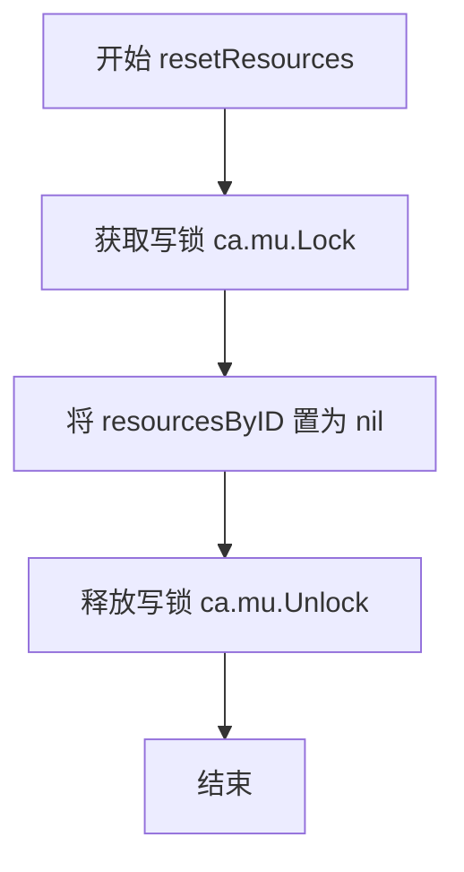

#### 带注释源码

```go
// resetResources clears the resource cache.
// It sets resourcesByID to nil so that the next call to getResourcesByID
// will reload all resources from scratch. This is necessary after any
// modification to the manifests (e.g., updating container images or policies).
func (ca *configAware) resetResources() {
	ca.mu.Lock()           // Acquire exclusive lock to ensure thread-safety
	ca.resourcesByID = nil // Clear the cached resources
	ca.mu.Unlock()         // Release the lock
}
```

## 关键组件


### configAware 结构体

核心结构体，负责处理配置感知的资源管理。它封装了原始文件加载、配置文件解析、资源缓存等逻辑，支持同时处理 .flux.yaml 配置文件和原始 YAML manifest 文件。

### resourceWithOrigin 结构体

辅助结构体，用于存储资源及其来源信息。包含资源对象和对应的配置文件指针，用于区分资源是来自配置文件还是原始文件。

### splitConfigFilesAndRawManifestPaths 函数

路径分离函数，将目标路径分为两类：包含 .flux.yaml 配置文件的路径和仅包含原始 YAML 文件的路径。它遍历每个路径，调用 findConfigFilePaths 查找配置文件，并根据配置文件类型决定分类结果。

### findConfigFilePaths 函数

配置文件查找函数，从给定路径开始向上遍历目录树，查找 .flux.yaml 配置文件。它首先检查路径本身是否为配置文件，然后逐级向上搜索直到基目录，返回配置文件路径和工作目录路径。

### getResourcesByID 方法

资源获取方法，带有读写锁的缓存机制。它首先检查缓存是否存在，如存在则直接返回；否则加载原始文件和配置文件的资源，进行重复检测后将结果存入缓存并返回。该方法是整个系统的核心数据加载入口。

### SetWorkloadContainerImage 方法

镜像设置方法，用于更新资源的容器镜像。它根据资源来源决定调用 rawFiles 或 configFile 的相应方法更新镜像，更新后重置资源缓存以确保后续操作获取最新数据。

### UpdateWorkloadPolicies 方法

策略更新方法，用于更新资源的策略配置。类似 SetWorkloadContainerImage，它根据资源来源分发到不同的处理逻辑，返回是否发生变更的布尔值，并在操作后重置缓存。

### resetResources 方法

缓存重置方法，通过将 resourcesByID 置为 nil 来使缓存失效。该方法在资源被修改后调用，确保后续的 getResourcesByID 调用会重新加载最新的资源状态。

### cleanAndEnsureParentPath 函数

路径规范化函数，确保子路径位于基目录内。它将路径转换为绝对路径并清理，去除结尾斜杠，然后验证子路径确实以基目录前缀开头，防止路径遍历攻击。


## 问题及建议


### 已知问题

-   **缓存一致性问题**：`getResourcesByID` 方法在检查缓存为空后释放读锁、获取写锁的过程中，存在时间窗口，可能导致多个 goroutine 同时重新加载资源，造成资源竞争和潜在的数据不一致。
-   **缺少请求合并机制**：当缓存被重置后（如调用 `SetWorkloadContainerImage` 或 `UpdateWorkloadPolicies` 后），多个并发请求可能同时触发资源重新加载，导致重复计算和性能浪费，缺少类似 `singleflight` 的请求合并机制。
-   **锁粒度过粗导致性能瓶颈**：所有资源操作都需要获取写锁重置缓存，即使只修改了一个资源也会导致整体缓存失效，高并发场景下会影响性能。
-   **上下文未充分利用**：`context.Context` 参数在 `getResourcesByID` 等方法中传入但未用于控制资源加载过程中的超时或取消操作，无法优雅地处理长时间运行的资源加载。
-   **重复路径处理逻辑**：`splitConfigFilesAndRawManifestPaths`、`findConfigFilePaths` 和 `cleanAndEnsureParentPath` 中存在重复的路径规范化（clean）和相对路径计算逻辑，违反了 DRY 原则。
-   **错误信息不够具体**：路径越界错误使用通用格式化，未包含足够的调试信息（如具体是哪个路径导致了问题）。

### 优化建议

-   **实现细粒度缓存或请求合并**：考虑使用 `singleflight` 合并并发资源加载请求，或实现按资源 ID 的细粒度缓存失效机制，避免全量缓存失效。
-   **优化锁策略**：将缓存设计为分层或分段结构，支持部分更新；或引入版本号机制，实现乐观锁策略减少锁竞争。
-   **完善上下文使用**：在资源加载过程中将 context 传递给底层的文件读取和解析操作，支持超时控制和优雅取消。
-   **提取公共路径处理函数**：将路径规范化、相对路径计算等逻辑抽取为独立的工具函数，减少重复代码并便于维护和测试。
-   **增强错误上下文**：在错误信息中添加更多调试信息，如具体路径值、调用栈上下文等，便于问题定位。

## 其它


### 设计目标与约束

本代码的设计目标是提供一个统一的资源管理系统，能够同时处理两种不同来源的Kubernetes manifest文件：一种是传统的原始YAML文件，另一种是通过`.flux.yaml`配置文件生成的资源。核心约束包括：1) 支持增量更新，每次修改后需要重置缓存；2) 配置文件的优先级高于原始文件；3) 必须防止路径遍历攻击，确保所有路径都在baseDir内；4) 支持超时控制以防止操作无限期阻塞。

### 错误处理与异常设计

错误处理采用分层设计：1) 文件未找到错误通过自定义`configFileNotFoundErr`全局变量标识；2) 资源不存在时返回`ErrResourceNotFound`错误；3) 重复资源定义时会生成详细的错误信息，包括冲突的资源ID和来源文件路径；4) 所有文件操作错误都会向上传播并附带上下文信息。关键异常场景包括：配置文件解析失败、路径验证失败、资源ID不存在、重复资源冲突等。

### 数据流与状态机

数据流主要分为三个阶段：初始化阶段通过`NewConfigAware`解析路径并分类为配置文件和原始文件路径；加载阶段通过`getResourcesByID`方法从缓存或源加载资源，原始文件资源优先加载，随后是配置文件生成的资源；更新阶段通过`SetWorkloadContainerImage`和`UpdateWorkloadPolicies`修改资源，修改后调用`resetResources`重置缓存。状态转换：缓存初始为nil→首次加载后填充→更新操作后重置为nil→下次访问时重新加载。

### 外部依赖与接口契约

主要依赖包括：`github.com/fluxcd/flux/pkg/image`提供镜像引用类型，`github.com/fluxcd/flux/pkg/resource`提供资源和策略类型。接口契约方面：`Manifests`接口需实现`ParseManifest`和`GenerateManifests`方法；`ConfigFile`需实现`SetWorkloadContainerImage`、`UpdateWorkloadPolicies`、`GenerateManifests`、`ConfigRelativeToWorkingDir`和`IsScanForFiles`方法；`rawFiles`类型需实现`GetAllResourcesByID`、`setManifestWorkloadContainerImage`和`updateManifestWorkloadPolicies`方法。

### 并发与线程安全

使用`sync.RWMutex`保护`resourcesByID`缓存，读取时使用`RLock`和`RUnlock`，写入时使用`Lock`和`Unlock`。缓存未命中时采用"double-check"模式，先尝试读取锁，释放后再释放读锁并执行加载逻辑，最后加写锁写入缓存。`configFiles`和`baseDir`在初始化后只读，无需加锁。`rawFiles`成员本身不是线程安全的，但其方法仅在持有configAware锁的情况下被调用。

### 缓存策略

采用LRU风格的缓存失效策略：1) 缓存键为资源ID字符串；2) 每次资源发生修改（通过`SetWorkloadContainerImage`或`UpdateWorkloadPolicies`）后调用`resetResources`将缓存设为nil，强制下次访问时重新加载；3) 缓存存储的是`resourceWithOrigin`结构，包含资源和来源配置文件引用；4) 缓存的生命周期与configAware实例相同，无主动清理机制。

### 资源生命周期管理

资源的生命周期由configAware统一管理：创建时通过`NewConfigAware`初始化；加载时按需从rawFiles和configFiles构建；更新时先获取资源副本，修改后写回来源（rawFile或configFile），然后重置缓存；读取时通过`GetAllResourcesByID`返回资源副本映射。资源修改后必须调用`resetResources`以确保一致性。不提供显式的资源删除接口，资源移除依赖于源文件的删除。

### 路径安全与验证

路径验证通过`cleanAndEnsureParentPath`函数实现：1) 使用`filepath.Abs`将路径转为绝对路径；2) 使用`filepath.Clean`去除冗余分隔符和点；3) 验证子路径必须以基础路径为前缀；4) 在`findConfigFilePaths`中从子目录向上遍历查找配置文件时，始终确保不会超出baseDir范围。这些措施有效防止了目录遍历攻击。

    