# `flux\pkg\manifests\configaware_test.go` 详细设计文档

这是一个测试文件，用于验证 FluxCD 的 manifests 包如何处理 .flux.yaml 配置文件、生成 Kubernetes 资源、应用补丁以及执行去重检查。测试涵盖了从文件扫描、命令生成、策略更新到错误处理的全套流程。

## 整体流程

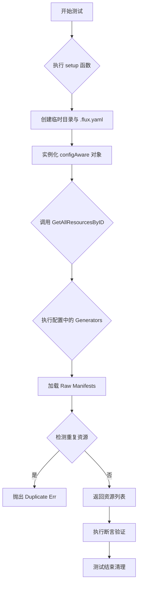

## 类结构

```
manifests_test.go (测试套件)
├── 配置数据结构
│   └── config (结构体: 路径与 YAML 内容)
├── 辅助函数 (Test Utilities)
│   └── setup (初始化测试环境)
└── 测试用例 (Test Cases)
    ├── TestFindConfigFilePaths (测试配置文件查找逻辑)
    ├── TestSplitConfigFilesAndRawManifestPaths (测试路径拆分)
    ├── TestCommandUpdatedConfigFile (测试命令生成资源)
    ├── TestPatchUpdatedConfigFile (测试补丁应用)
    ├── TestMistakenConfigFile (测试无效配置错误处理)
    ├── TestDuplicateDetection (测试内存中重复检测)
    ├── TestDuplicateInFiles (测试文件与生成重复检测)
    ├── TestDuplicateInGenerators (测试多生成器重复检测)
    └── TestSccanForFiles (测试目录扫描功能)
```

## 全局变量及字段


### `commandUpdatedEchoConfigFile`
    
YAML配置字符串，用于测试命令生成资源

类型：`string`
    


### `patchUpdatedEchoConfigFile`
    
YAML配置字符串，用于测试补丁更新

类型：`string`
    


### `mistakenConf`
    
YAML配置字符串，用于测试错误场景

类型：`string`
    


### `duplicateGeneration`
    
YAML配置字符串，包含重复的命名空间定义

类型：`string`
    


### `helloManifest`
    
K8s Deployment YAML 字符串，用于文件测试

类型：`string`
    


### `config.path`
    
配置文件所在的相对路径

类型：`string`
    


### `config.fluxyaml`
    
.flux.yaml 文件的内容字符串

类型：`string`
    
    

## 全局函数及方法


### `setup`

该函数用于初始化测试所需的 manifests 实例、临时目录和清理函数。它接收测试对象、路径列表和配置文件列表，创建临时目录、写入配置文件中定义的 `.flux.yaml` 文件，然后返回初始化完成的 `configAware` 实例、临时目录路径以及用于清理临时资源的函数。

参数：

- `t`：`testing.T`，Go 测试框架中的测试对象，用于报告测试错误
- `paths`：`[]string`，子路径列表，用于指定在临时目录中搜索配置文件的路径（可为空，表示使用基础路径）
- `configs`：`...config`，可变数量的配置参数，每个配置包含路径和 `.flux.yaml` 内容，用于在测试前设置配置文件

返回值：`*configAware, string, func()`，返回一个三元组：
- `*configAware`：初始化后的配置感知 manifests 实例，用于后续测试操作
- `string`：创建的临时目录的绝对路径
- `func()`：清理函数，用于在测试结束后删除临时目录及其中内容

#### 流程图

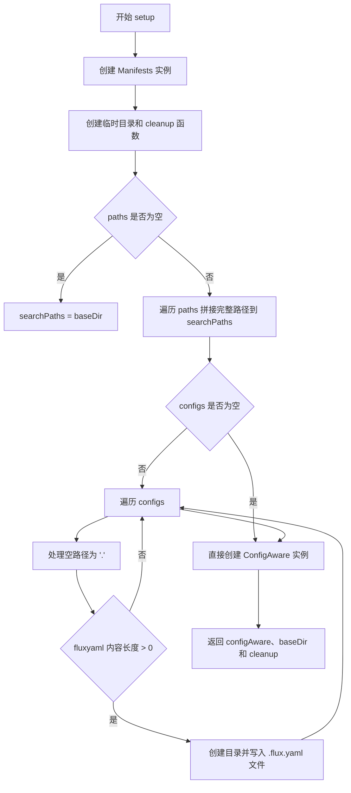

#### 带注释源码

```go
// setup 初始化测试所需的 manifests 实例、临时目录和清理函数
// 参数 t 是测试框架传入的测试对象
// 参数 paths 指定搜索配置的子路径列表，可为空
// 参数 configs 是可变数量的配置，包含路径和 .flux.yaml 内容
func setup(t *testing.T, paths []string, configs ...config) (*configAware, string, func()) {
    // 创建 Manifests 实例，使用默认命名空间和日志输出
    manifests := kubernetes.NewManifests(kubernetes.ConstNamespacer("default"), log.NewLogfmtLogger(os.Stdout))
    
    // 创建临时目录并获取清理函数
    baseDir, cleanup := testfiles.TempDir(t)

    // NewConfigAware 构造函数需要至少一个绝对路径
    // 将相对路径转换为基于 baseDir 的绝对路径
    var searchPaths []string
    for _, p := range paths {
        searchPaths = append(searchPaths, filepath.Join(baseDir, p))
    }
    // 如果未提供 paths，则使用 baseDir 作为唯一搜索路径
    if len(paths) == 0 {
        searchPaths = []string{baseDir}
    }

    // 遍历配置列表，创建目录和配置文件
    for _, c := range configs {
        p := c.path
        // 空路径默认为当前目录
        if p == "" {
            p = "."
        }
        // 如果提供了 .flux.yaml 内容，则写入文件
        if len(c.fluxyaml) > 0 {
            err := os.MkdirAll(filepath.Join(baseDir, p), 0777)
            assert.NoError(t, err)
            ioutil.WriteFile(filepath.Join(baseDir, p, ConfigFilename), []byte(c.fluxyaml), 0600)
        }
    }
    
    // 使用配置和 manifests 创建 ConfigAware 实例
    frs, err := NewConfigAware(baseDir, searchPaths, manifests, time.Minute)
    assert.NoError(t, err)
    
    // 返回配置感知实例、基础目录和清理函数
    return frs, baseDir, cleanup
}
```


### `TestFindConfigFilePaths`

该测试函数用于验证 `findConfigFilePaths` 函数在查找配置文件时的逻辑行为，包括：从目标目录向上遍历查找配置文件、优先使用最近目录的配置文件、以及将配置文件本身作为目标路径时的处理逻辑。

参数：

- `t`：`testing.T`，Go语言标准测试框架中的测试实例指针，用于报告测试失败和记录测试日志

返回值：

- 该测试函数无返回值，主要通过 `assert` 断言来验证被测函数的正确性

#### 流程图

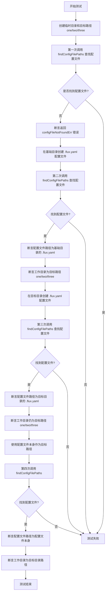

#### 带注释源码

```go
// TestFindConfigFilePaths 测试 findConfigFilePaths 函数查找最近配置文件的逻辑
// 该测试覆盖了以下场景：
// 1. 目标目录及其父目录均无配置文件时返回错误
// 2. 只有基础目录有配置文件时返回基础目录的配置
// 3. 目标目录有配置文件时优先使用目标目录的配置
// 4. 将配置文件本身作为目标路径时的正确处理
func TestFindConfigFilePaths(t *testing.T) {
	// 创建临时目录用于测试，clean 用于测试结束后清理资源
	baseDir, clean := testfiles.TempDir(t)
	// defer 确保测试函数返回前执行清理操作
	defer clean()
	
	// 构建目标路径：baseDir/one/two/three
	targetPath := filepath.Join(baseDir, "one/two/three")

	// 创建嵌套目录结构 one/two/three
	err := os.MkdirAll(targetPath, 0777)
	assert.NoError(t, err)

	// 测试场景1：目标目录及其父目录均无配置文件
	// 预期返回 configFileNotFoundErr 错误
	_, _, err = findConfigFilePaths(baseDir, targetPath)
	assert.Equal(t, configFileNotFoundErr, err)

	// 测试场景2：在基础目录创建配置文件后应能查找到
	// 构建基础目录的配置文件完整路径
	baseConfigFilePath := filepath.Join(baseDir, ConfigFilename)
	// 创建配置文件
	f, err := os.Create(baseConfigFilePath)
	assert.NoError(t, err)
	// 立即关闭文件句柄
	f.Close()
	
	// 调用 findConfigFilePaths 查找配置文件
	configFilePath, workingDir, err := findConfigFilePaths(baseDir, targetPath)
	assert.NoError(t, err)
	// 验证返回的是基础目录的配置文件路径
	assert.Equal(t, baseConfigFilePath, configFilePath)
	// 验证工作目录是目标路径（因为目标目录无配置文件，向上升查找）
	assert.Equal(t, targetPath, workingDir)

	// 测试场景3：在目标目录创建配置文件后应优先使用
	// 构建目标目录的配置文件完整路径
	targetConfigFilePath := filepath.Join(targetPath, ConfigFilename)
	f, err = os.Create(targetConfigFilePath)
	assert.NoError(t, err)
	f.Close()
	
	// 再次调用 findConfigFilePaths
	configFilePath, workingDir, err = findConfigFilePaths(baseDir, targetPath)
	assert.NoError(t, err)
	// 验证优先返回目标目录的配置文件（最近目录优先）
	assert.Equal(t, targetConfigFilePath, configFilePath)
	// 验证工作目录变为目标目录
	assert.Equal(t, targetPath, workingDir)

	// 测试场景4：使用配置文件本身作为目标路径
	// 验证当目标路径恰好是配置文件时，函数能正确处理
	configFilePath, workingDir, err = findConfigFilePaths(baseDir, targetConfigFilePath)
	assert.NoError(t, err)
	// 配置文件本身即为查找结果
	assert.Equal(t, targetConfigFilePath, configFilePath)
	// 工作目录应为配置文件的父目录（向上查找直到包含配置的目录）
	assert.Equal(t, targetPath, workingDir)
}
```


### `TestSplitConfigFilesAndRawManifestPaths`

这是一个单元测试函数，用于验证 `splitConfigFilesAndRawManifestPaths` 函数能够正确区分包含 `.flux.yaml` 配置文件的目标路径和仅包含原始 Kubernetes 清单文件的目标路径。测试创建了多个目录结构，其中 "envs" 目录下包含配置文件，而 "commonresources" 目录仅包含原始清单文件，通过断言验证函数返回的分类结果是否符合预期。

参数：

- `t`：`testing.T`，Go 语言标准测试框架中的测试实例指针，用于报告测试失败和日志输出

返回值：无（Go 测试函数不返回值）

#### 流程图

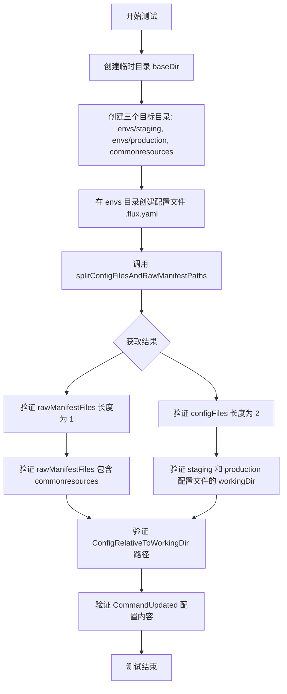

#### 带注释源码

```go
// TestSplitConfigFilesAndRawManifestPaths 测试区分纯配置文件目录和原始清单目录的逻辑
func TestSplitConfigFilesAndRawManifestPaths(t *testing.T) {
	// 创建临时目录用于测试，测试结束后自动清理
	baseDir, clean := testfiles.TempDir(t)
	defer clean()

	// 定义三个目标路径：两个环境目录和一个通用资源目录
	targets := []string{
		filepath.Join(baseDir, "envs/staging"),
		filepath.Join(baseDir, "envs/production"),
		filepath.Join(baseDir, "commonresources"),
	}
	// 创建所有目标目录
	for _, target := range targets {
		err := os.MkdirAll(target, 0777)
		assert.NoError(t, err)
	}

	// 创建通用的配置文件内容，包含 commandUpdated 生成器配置
	configFile := `---
version: 1
commandUpdated:
  generators: 
    - command: echo g1
`
	// 将配置文件写入 envs 目录下的 .flux.yaml 文件
	err := ioutil.WriteFile(filepath.Join(baseDir, "envs", ConfigFilename), []byte(configFile), 0700)
	assert.NoError(t, err)

	// 调用被测试的函数，区分配置文件和原始清单路径
	configFiles, rawManifestFiles, err := splitConfigFilesAndRawManifestPaths(baseDir, targets)
	assert.NoError(t, err)

	// 验证原始清单文件路径只有一个：commonresources
	assert.Len(t, rawManifestFiles, 1)
	assert.Equal(t, filepath.Join(baseDir, "commonresources"), rawManifestFiles[0])

	// 验证配置文件有两个：staging 和 production
	assert.Len(t, configFiles, 2)
	// 假设配置文件按顺序处理以简化检查
	assert.Equal(t, filepath.Join(baseDir, "envs/staging"), configFiles[0].workingDir)
	assert.Equal(t, filepath.Join(baseDir, "envs/production"), configFiles[1].workingDir)

	// 验证相对于工作目录的配置文件路径计算正确
	assert.Equal(t, "envs/staging/../.flux.yaml", configFiles[0].ConfigRelativeToWorkingDir())
	assert.Equal(t, "envs/production/../.flux.yaml", configFiles[1].ConfigRelativeToWorkingDir())

	// 验证解析后的配置对象内容正确
	assert.NotNil(t, configFiles[0].CommandUpdated)
	assert.Len(t, configFiles[0].CommandUpdated.Generators, 1)
	assert.Equal(t, "echo g1", configFiles[0].CommandUpdated.Generators[0].Command)
	assert.NotNil(t, configFiles[1].CommandUpdated)
	// 验证两个环境的配置共享同一个生成器配置
	assert.Equal(t, configFiles[0].CommandUpdated.Generators, configFiles[0].CommandUpdated.Generators)
}
```


### `TestCommandUpdatedConfigFile`

该测试函数验证通过 `commandUpdated` 配置生成 Kubernetes 资源，并能够成功更新资源的容器镜像和策略标签。

参数：

- `t *testing.T`：Go 测试框架的标准参数，表示测试用例对象

返回值：无（Go 测试函数无返回值）

#### 流程图

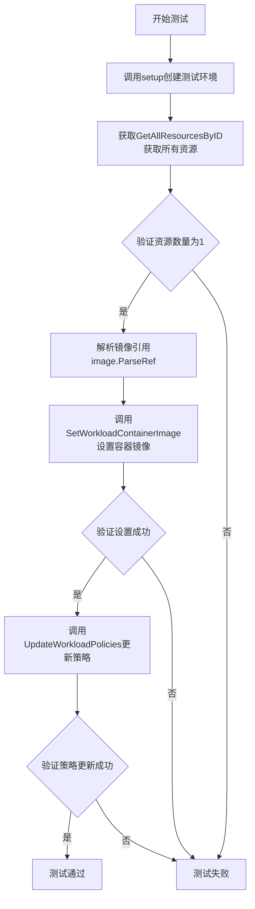

#### 带注释源码

```go
// TestCommandUpdatedConfigFile 测试通过 command updated 生成资源并设置镜像和策略
func TestCommandUpdatedConfigFile(t *testing.T) {
	// 1. 设置测试环境，使用 commandUpdatedEchoConfigFile 配置创建 configAware 实例
	//    参数 nil 表示使用默认路径，config 包含 .flux.yaml 配置内容
	frs, _, cleanup := setup(t, nil, config{fluxyaml: commandUpdatedEchoConfigFile})
	// 测试结束后清理临时目录
	defer cleanup()
	
	// 2. 创建 Go 标准 context 用于超时控制
	ctx := context.Background()
	
	// 3. 获取所有资源（通过执行配置中的 command generator 生成 YAML）
	resources, err := frs.GetAllResourcesByID(ctx)
	// 验证获取资源成功且数量为1
	assert.NoError(t, err)
	assert.Equal(t, 1, len(resources))
	
	// 4. 构造资源 ID：default 命名空间下的 deployment/helloworld
	deploymentID := resource.MustParseID("default:deployment/helloworld")
	// 验证资源中包含该 deployment
	assert.Contains(t, resources, deploymentID.String())
	
	// 5. 解析镜像引用字符串为 image.Ref 类型
	ref, err := image.ParseRef("repo/image:tag")
	assert.NoError(t, err)
	
	// 6. 调用 SetWorkloadContainerImage 更新资源的容器镜像
	//    参数：deploymentID-资源ID, greeter-容器名称, ref-新镜像引用
	err = frs.SetWorkloadContainerImage(ctx, deploymentID, "greeter", ref)
	assert.NoError(t, err)
	
	// 7. 调用 UpdateWorkloadPolicies 更新资源的策略标签
	//    参数：deploymentID-资源ID, PolicyUpdate-策略更新对象
	//    添加策略：greeter 镜像使用 glob:master-* 标签策略
	_, err = frs.UpdateWorkloadPolicies(ctx, deploymentID, resource.PolicyUpdate{
		Add: policy.Set{policy.TagPrefix("greeter"): "glob:master-*"},
	})
	// 验证策略更新成功（无错误）
	assert.NoError(t, err)
}
```


### `TestPatchUpdatedConfigFile`

该测试函数验证了通过 command 生成资源后，应用 patch 的逻辑是否正确工作。测试设置了包含 `patchUpdated` 配置的 `.flux.yaml` 文件，模拟资源生成、容器镜像更新和策略更新操作，并验证生成的 patch 文件内容是否符合预期。

参数：

-  `t`：`testing.T`，Go 标准测试框架的测试对象，用于报告测试失败和日志输出

返回值：无（`void`），该函数为测试函数，使用 `assert` 包进行断言验证

#### 流程图

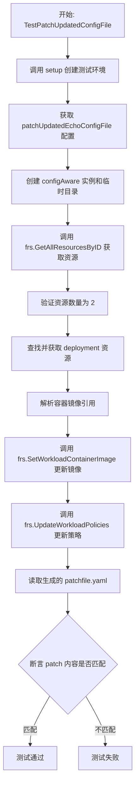

#### 带注释源码

```go
// TestPatchUpdatedConfigFile 测试通过 command 生成资源后应用 patch 的逻辑
// 该测试验证了 patchUpdated 配置能够正确生成 patch 文件
func TestPatchUpdatedConfigFile(t *testing.T) {
	// 1. 设置测试环境：
	// - 使用 patchUpdatedEchoConfigFile 配置创建 manifest 系统
	// - patchUpdatedEchoConfigFile 包含一个 command generator 和 patchFile 配置
	// - generator 命令输出一个 Deployment 和一个 Namespace 资源
	// - patchFile 指定了生成的 patch 文件名为 patchfile.yaml
	frs, _, cleanup := setup(t, nil, config{fluxyaml: patchUpdatedEchoConfigFile})
	defer cleanup() // 测试结束后清理临时目录

	// 2. 获取所有资源：
	// 调用 configAware 的 GetAllResourcesByID 方法
	// 这会执行 command generator 生成资源，并解析为 Resource 对象
	ctx := context.Background()
	resources, err := frs.GetAllResourcesByID(ctx)
	assert.NoError(t, err)
	
	// 3. 验证资源数量：
	// 预期生成 2 个资源：1 个 Deployment + 1 个 Namespace
	assert.Equal(t, 2, len(resources))

	// 4. 查找 Deployment 资源：
	// 资源 ID 格式为 "default:deployment/helloworld"
	var deployment resource.Resource
	deploymentID := resource.MustParseID("default:deployment/helloworld")
	for id, res := range resources {
		if id == deploymentID.String() {
			deployment = res
		}
	}
	assert.NotNil(t, deployment)

	// 5. 更新容器镜像：
	// 使用 SetWorkloadContainerImage 方法更新 deployment 中 greeter 容器的镜像
	// 这会修改资源并准备生成 patch
	ref, err := image.ParseRef("repo/image:tag")
	assert.NoError(t, err)
	err = frs.SetWorkloadContainerImage(ctx, deploymentID, "greeter", ref)
	assert.NoError(t, err)

	// 6. 更新工作负载策略：
	// 设置镜像标签策略为 "glob:master-*"
	// 这会在 patch 中添加相应的注解
	_, err = frs.UpdateWorkloadPolicies(ctx, deploymentID, resource.PolicyUpdate{
		Add: policy.Set{policy.TagPrefix("greeter"): "glob:master-*"},
	})

	// 7. 定义预期 patch 内容：
	// 预期 patch 包含：
	// - annotations: fluxcd.io/tag.greeter: glob:master-*
	// - containers 数组的更新
	// - $setElementOrder 指令用于保持容器顺序
	expectedPatch := `---
apiVersion: extensions/v1beta1
kind: Deployment
metadata:
  annotations:
    fluxcd.io/tag.greeter: glob:master-*
  name: helloworld
spec:
  template:
    spec:
      $setElementOrder/containers:
      - name: greeter
      containers:
      - image: repo/image:tag
        name: greeter
`

	// 8. 读取实际生成的 patch 文件并验证：
	// patch 文件路径为 {baseDir}/patchfile.yaml
	patchFilePath := filepath.Join(frs.baseDir, "patchfile.yaml")
	patch, err := ioutil.ReadFile(patchFilePath)
	assert.NoError(t, err)
	assert.Equal(t, expectedPatch, string(patch))
}
```

### 相关类型和函数详情

#### `config` 结构体（测试辅助类型）

用于表示测试中的配置文件配置。

字段：

-  `path`：`string`，配置文件路径（相对于基础目录）
-  `fluxyaml`：`string`，`.flux.yaml` 文件的内容

#### `setup` 函数

测试辅助函数，用于设置测试环境。

参数：

-  `t`：`testing.T`，测试对象
-  `paths`：`[]string`，搜索路径列表
-  `configs`：`...config`，可变数量的配置文件

返回值：

-  `*configAware`：配置感知的 manifest 处理器
-  `string`：基础目录路径
-  `func()`：清理函数

#### `patchUpdatedEchoConfigFile` 常量

包含 `patchUpdated` 配置的 YAML 字符串，用于测试。

配置内容包含：

-  `version: 1`
-  `patchUpdated.generators[0].command`：输出 Deployment 和 Namespace 的命令
-  `patchUpdated.patchFile: patchfile.yaml`：指定生成的 patch 文件名

### 关键组件信息

| 组件名称 | 一句话描述 |
|---------|-----------|
| `configAware` | 配置感知的 manifest 处理器，负责解析 `.flux.yaml` 并生成/管理资源 |
| `patchUpdatedEchoConfigFile` | 测试用的 `patchUpdated` 配置常量 |
| `GetAllResourcesByID` | 获取所有资源的方法，会执行 command generator |
| `SetWorkloadContainerImage` | 设置工作负载容器镜像的方法 |
| `UpdateWorkloadPolicies` | 更新工作负载策略的方法 |

### 潜在技术债务或优化空间

1. **测试数据硬编码**：测试配置 `expectedPatch` 和 `patchUpdatedEchoConfigFile` 作为常量内联在测试文件中，可考虑提取到独立的测试数据文件
2. **资源查找逻辑**：使用 for 循环遍历查找 deployment 资源，可改为使用 map 直接访问或添加查找方法
3. **错误处理分散**：多处 `assert.NoError(t, err)` 分散在代码中，可考虑封装测试辅助函数减少重复
4. **路径拼接**：`filepath.Join(frs.baseDir, "patchfile.yaml")` 硬编码了 patch 文件名，与配置耦合

### 其它项目

#### 设计目标与约束

- **设计目标**：验证 `patchUpdated` 配置能够正确生成包含资源更新的 patch 文件
- **约束**：依赖 `configAware` 类型的实现，patch 生成逻辑在底层实现中

#### 错误处理与异常设计

- 使用 `testing.T` 的 `assert` 包进行断言验证
- 测试失败时立即终止（通过 `defer cleanup` 确保资源清理）
- 预期错误场景通过专门的测试函数验证（如 `TestMistakenConfigFile`）

#### 数据流与状态机

```
patchUpdatedEchoConfigFile 
    ↓ (setup 函数解析)
configAware 实例
    ↓ (GetAllResourcesByID)
生成原始资源 (Deployment + Namespace)
    ↓ (SetWorkloadContainerImage + UpdateWorkloadPolicies)
更新后的资源
    ↓ (内部 patch 生成逻辑)
patchfile.yaml 文件
    ↓ (读取文件)
与 expectedPatch 比对
```

#### 外部依赖与接口契约

- `testing.T`：Go 标准测试框架
- `configAware`：核心 manifest 处理接口
- `resource.Resource`：资源抽象类型
- `image.Ref`：镜像引用类型
- `policy.Set`：策略集合类型


### `TestMistakenConfigFile`

该测试函数用于验证当配置文件（.flux.yaml）中仅定义了 `generators` 生成器而未定义 `updaters` 更新器时，尝试通过 `SetWorkloadContainerImage` 方法更新容器镜像会返回错误，而非静默失败。这确保了配置错误能够被及时发现。

参数：

- `t`：`testing.T`，Go 测试框架的标准测试参数，用于报告测试失败

返回值：无（`void`），该函数为测试函数，通过 `assert.Error` 验证错误发生

#### 流程图

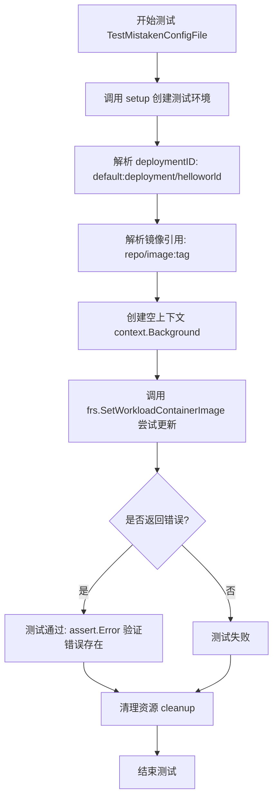

#### 带注释源码

```go
// TestMistakenConfigFile 测试当配置文件中没有定义更新命令（updaters）时，
// 尝试更新容器镜像是否返回错误而非静默失败
func TestMistakenConfigFile(t *testing.T) {
	// 使用 setup 函数初始化测试环境
	// 参数说明：
	//   - t: 测试框架传入的测试指针
	//   - nil: 不指定特殊的 git-path 路径
	//   - config{fluxyaml: mistakenConf}: 使用预定义的错误配置文件
	//             mistakenConf 只包含 generators 而没有 updaters
	frs, _, cleanup := setup(t, nil, config{fluxyaml: mistakenConf})
	// 确保测试结束后清理临时目录资源
	defer cleanup()

	// 解析目标工作负载的 ID，格式为 "namespace:kind/name"
	deploymentID := resource.MustParseID("default:deployment/helloworld")
	
	// 解析要设置的镜像引用
	ref, _ := image.ParseRef("repo/image:tag")

	// 创建空上下文，用于 API 调用
	ctx := context.Background()
	
	// 尝试设置工作负载的容器镜像
	// 由于配置文件没有定义 updaters，此操作预期会返回错误
	err := frs.SetWorkloadContainerImage(ctx, deploymentID, "greeter", ref)
	
	// 断言：必须返回错误，否则测试失败
	// 这确保了配置错误能被及时发现而不是静默忽略
	assert.Error(t, err)
}
```


### `TestDuplicateDetection`

该测试函数用于验证当通过配置生成的资源列表中存在重复的资源ID时，系统能够正确检测并返回错误，确保资源生成的唯一性。

参数：

- `t`：`*testing.T`，Go测试框架提供的测试实例指针，用于执行断言和报告测试结果

返回值：无（Go测试函数的返回类型为空）

#### 流程图

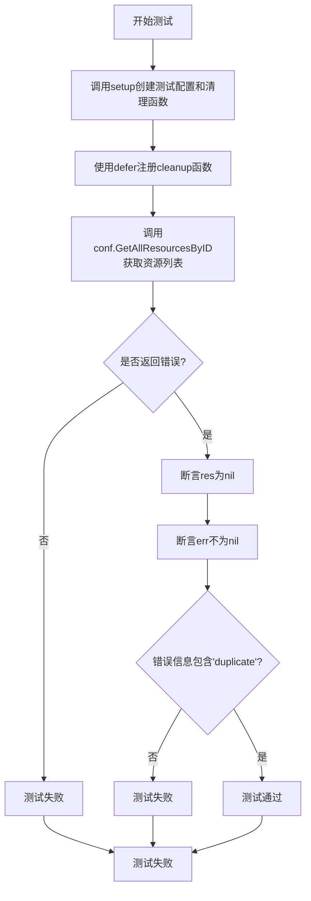

#### 带注释源码

```go
// TestDuplicateDetection 测试当生成的资源列表中存在重复ID时是否报错
// 该测试验证系统的重复资源检测功能是否正常工作
func TestDuplicateDetection(t *testing.T) {
	// this one has the same resource twice in the generated manifests
	// 创建测试配置，使用duplicateGeneration配置（包含重复的Namespace资源）
	conf, _, cleanup := setup(t, nil, config{fluxyaml: duplicateGeneration})
	defer cleanup()

	// 调用GetAllResourcesByID获取所有资源
	// 预期行为：由于存在重复资源ID，此处应返回错误
	res, err := conf.GetAllResourcesByID(context.Background())
	
	// 断言：资源列表应为空（因为检测到错误）
	assert.Nil(t, res)
	
	// 断言：应返回错误（因为存在重复资源）
	assert.Error(t, err)
	
	// 断言：错误信息应包含"duplicate"关键字
	assert.Contains(t, err.Error(), "duplicate")
}
```


### `TestDuplicateInFiles`

该测试函数用于验证当资源既存在于磁盘文件中又通过 `.flux.yaml` 配置的生成器生成时，系统能够正确检测到重复资源并返回错误。

参数：

-  `t`：`testing.T`，Go语言测试框架的标准参数，表示当前测试用例的上下文

返回值：无（`void`），Go语言测试函数不返回值，通过 `assert` 包进行断言验证

#### 流程图

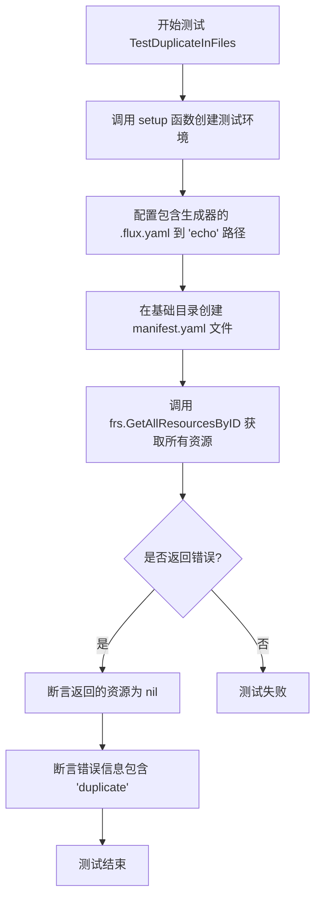

#### 带注释源码

```go
// TestDuplicateInFiles 测试当资源既在文件中又在生成器中生成时是否能检测到重复
// 核心功能：验证重复检测机制能识别磁盘文件与生成器输出的重复资源
func TestDuplicateInFiles(t *testing.T) {
	// 步骤1: 设置测试环境
	// - 创建临时目录作为基础目录
	// - 配置搜索路径为当前目录和 'echo' 子目录
	// - 在 'echo' 目录下创建包含 patchUpdated 生成器的 .flux.yaml 配置文件
	frs, baseDir, cleanup := setup(t, []string{".", "echo"}, config{path: "echo", fluxyaml: patchUpdatedEchoConfigFile})
	
	// 步骤2: 确保测试结束后清理临时目录
	defer cleanup()
	
	// 步骤3: 在基础目录下创建一个真实的 manifest.yaml 文件
	// 该文件的内容与 patchUpdatedEchoConfigFile 生成器生成的内容相同（都是 helloworld Deployment）
	ioutil.WriteFile(filepath.Join(baseDir, "manifest.yaml"), []byte(helloManifest), 0666)

	// 步骤4: 调用 GetAllResourcesByID 获取所有资源
	// 预期结果：检测到重复资源，返回错误
	res, err := frs.GetAllResourcesByID(context.Background())
	
	// 步骤5: 断言验证
	// - 验证返回的资源为 nil（因为检测到重复应该返回错误而非资源列表）
	assert.Nil(t, res)
	
	// - 验证确实返回了错误
	assert.Error(t, err)
	
	// - 验证错误信息中包含 'duplicate' 字符串
	assert.Contains(t, err.Error(), "duplicate")
}
```

#### 关键依赖说明

| 依赖项 | 类型 | 描述 |
|--------|------|------|
| `setup` | 全局函数 | 创建测试环境，返回 `*configAware`、基础目录和清理函数 |
| `patchUpdatedEchoConfigFile` | 全局常量 | 包含 `patchUpdated` 配置的 YAML 字符串，用于生成 helloworld Deployment |
| `helloManifest` | 全局常量 | 预先定义好的 helloworld Deployment YAML，用于写入文件系统 |
| `configAware.GetAllResourcesByID` | 方法 | 从配置和文件中获取所有资源，核心检测逻辑所在 |
| `testfiles.TempDir` | 外部函数 | 创建临时目录供测试使用 |


### `TestDuplicateInGenerators`

测试当两个不同的 generator 配置生成相同资源时的检测功能，验证系统能够正确识别并报告来自不同 generator 的重复资源。

参数：

- `t`：`*testing.T`，Go 标准测试框架的测试对象指针，用于报告测试失败

返回值：无（Go 测试函数采用 `*testing.T` 参数而非返回值）

#### 流程图

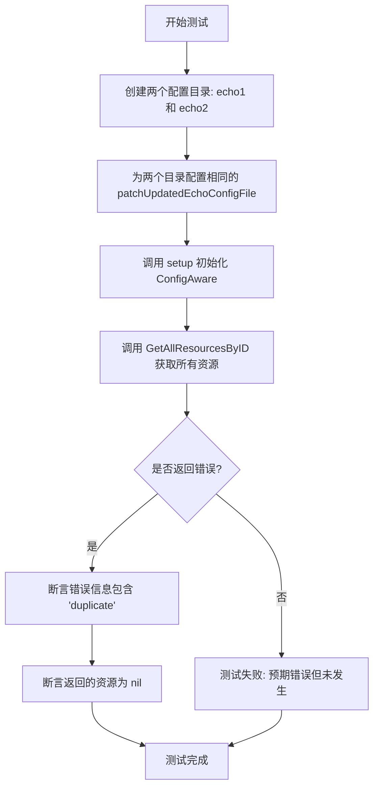

#### 带注释源码

```go
// TestDuplicateInGenerators 测试当两个不同的 generator 生成了相同资源时的检测
// 该测试验证系统能够检测到来自不同 .flux.yaml 配置文件中的 generator
// 生成了重复资源的情况
func TestDuplicateInGenerators(t *testing.T) {
	// this one tests that a manifest that's generated by two different generator configs
	// 1. 设置测试环境，创建两个配置目录 "echo1" 和 "echo2"
	// 2. 两个目录都使用相同的 patchUpdatedEchoConfigFile 配置
	// 3. 这样两个 generator 会生成相同的资源，触发重复检测
	frs, _, cleanup := setup(t, []string{"echo1", "echo2"},
		config{path: "echo1", fluxyaml: patchUpdatedEchoConfigFile},
		config{path: "echo2", fluxyaml: patchUpdatedEchoConfigFile})
	defer cleanup()

	// 调用 GetAllResourcesByID 获取所有资源
	// 预期结果：返回错误，因为存在重复资源
	res, err := frs.GetAllResourcesByID(context.Background())
	
	// 断言返回的资源为 nil（因为检测到重复应该返回错误而非资源列表）
	assert.Nil(t, res)
	// 断言发生了错误
	assert.Error(t, err)
	// 断言错误信息包含 "duplicate" 关键字
	assert.Contains(t, err.Error(), "duplicate")
}
```


### `TestSccanForFiles`

该测试函数用于验证 scanForFiles 配置扫描子目录生成资源清单的功能。测试创建了包含 `.flux.yaml` 配置文件的目录结构，其中父目录使用 `patchUpdated` 配置，子目录使用 `scanForFiles: {}` 配置，以验证系统能够正确扫描子目录中的原始清单文件（manifest.yaml）并生成相应的资源对象。

参数：

- `t`：`testing.T`，Go 语言标准测试框架中的测试实例，用于报告测试状态和失败信息

返回值：无（Go 测试函数的返回类型为 `void`）

#### 流程图

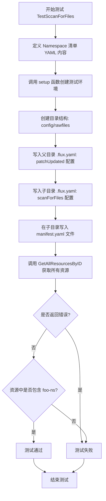

#### 带注释源码

```go
// TestSccanForFiles 测试 scanForFiles 扫描子目录生成资源清单的功能
// 注意: 函数名存在拼写错误，应为 TestScanForFiles
func TestSccanForFiles(t *testing.T) {
	// 目录结构说明:
	// +-- config
	//   +-- .flux.yaml (patchUpdated)
	//   +-- rawfiles
	//     +-- .flux.yaml (scanForFiles)
	//     +-- manifest.yaml

	// 定义一个 Namespace 类型的 Kubernetes 资源清单 YAML 内容
	// 用于后续写入文件并验证是否能被正确扫描和解析
	manifestyaml := `
apiVersion: v1
kind: Namespace
metadata:
  name: foo-ns
`

	// 调用 setup 函数设置测试环境
	// 参数说明:
	//   - t: 测试框架传入的测试实例
	//   - []string{filepath.Join("config", "rawfiles")}: 搜索路径列表，指定扫描的子目录
	//   - config{path: "config", fluxyaml: patchUpdatedEchoConfigFile}: 父目录配置，使用命令生成资源
	//   - config{path: filepath.Join("config", "rawfiles"), fluxyaml: "version: 1\nscanForFiles: {}\n"}: 
	//     子目录配置，启用 scanForFiles 功能扫描原始清单文件
	config, baseDir, cleanup := setup(t, []string{filepath.Join("config", "rawfiles")},
		config{path: "config", fluxyaml: patchUpdatedEchoConfigFile},
		config{path: filepath.Join("config", "rawfiles"), fluxyaml: "version: 1\nscanForFiles: {}\n"},
	)
	// 使用 defer 确保测试结束后清理创建的临时目录和文件
	defer cleanup()

	// 将 manifest.yaml 文件写入到子目录 config/rawfiles/ 下
	// 使用 ioutil.WriteFile 将字符串形式的 YAML 内容写入文件
	// 文件权限设置为 0600 (所有者读写权限)
	assert.NoError(t, ioutil.WriteFile(filepath.Join(baseDir, "config", "rawfiles", "manifest.yaml"), []byte(manifestyaml), 0600))

	// 调用 GetAllResourcesByID 方法获取所有资源
	// 该方法会根据配置扫描指定目录下的清单文件并解析为资源对象
	// context.Background() 创建一个空上下文用于方法调用
	res, err := config.GetAllResourcesByID(context.Background())
	
	// 断言获取资源过程中没有发生错误
	assert.NoError(t, err)
	
	// 断言返回的资源中包含名为 "foo-ns" 的 Namespace 资源
	// 资源 ID 格式为 "default:namespace/foo-ns" (默认命名空间)
	assert.Contains(t, res, "default:namespace/foo-ns")
}
```

## 关键组件


### configAware 结构体

核心类，负责管理和解析Kubernetes manifest文件及.flux.yaml配置文件，支持命令生成、patch更新和文件扫描等功能。

### findConfigFilePaths 函数

在给定的目录层级中查找.flux.yaml配置文件，支持从目标路径向上遍历到基准目录查找配置文件。

### splitConfigFilesAndRawManifestPaths 函数

将目标路径分割为包含.flux.yaml配置文件的目录和仅包含原始manifest文件的目录。

### GetAllResourcesByID 方法

获取所有资源，通过执行配置文件中定义的命令生成manifest，或读取原始manifest文件，并进行重复检测。

### SetWorkloadContainerImage 方法

设置指定工作负载的容器镜像，处理image更新逻辑。

### UpdateWorkloadPolicies 方法

更新工作负载的策略，如镜像标签策略等。

### .flux.yaml 配置解析

支持commandUpdated、patchUpdated、scanForFiles等配置模式，用于定义manifest生成和更新策略。

### 重复资源检测机制

检测由命令生成或文件中存在的重复Kubernetes资源，防止配置错误。


## 问题及建议


### 已知问题

- **错误忽略**：在 `TestMistakenConfigFile` 中使用 `ref, _ := image.ParseRef("repo/image:tag")` 忽略了错误返回，可能导致隐藏的缺陷
- **权限过于宽松**：多处使用 `0777` 权限创建目录和文件（如 `os.MkdirAll(target, 0777)`、`ioutil.WriteFile(..., 0600)`），存在安全风险
- **硬编码超时值**：`setup` 函数中硬编码 `time.Minute` 作为超时时间，缺乏灵活性
- **测试数据重复**：多个测试中重复定义了相同的 Deployment YAML 定义（如 `patchUpdatedEchoConfigFile` 和 `commandUpdatedEchoConfigFile` 中的 Deployment 部分），维护成本高
- **资源清理不完整**：虽然有 `cleanup` 函数，但在某些测试失败时可能无法保证资源完全清理
- **测试隔离性不足**：测试依赖于 `testfiles.TempDir(t)` 创建的临时目录，但目录名称和结构可能影响测试结果

### 优化建议

- 将重复的 YAML 配置提取为共享的测试辅助函数或常量，避免代码重复
- 使用更严格的文件权限（如 `0755` 用于目录，`0644` 用于文件）
- 将超时时间作为参数或配置项，提高测试的灵活性
- 增加对错误返回值的检查，避免使用 `_` 忽略错误
- 添加更多边界情况和错误场景的测试，如并发访问、文件损坏等
- 考虑使用 `t.Cleanup()` 替代手动 cleanup 函数，提高代码可读性

## 其它


### 设计目标与约束

本模块的设计目标是测试 Flux CD 中 `.flux.yaml` 配置文件的各种功能场景，包括命令生成资源、补丁更新、文件扫描和重复检测。约束条件包括：测试必须在隔离的临时目录环境中运行，配置文件必须遵循版本1规范，生成的资源必须唯一且符合 Kubernetes API 规范。

### 错误处理与异常设计

代码中的错误处理主要通过 `assert` 断言和自定义错误类型实现。关键错误包括：`configFileNotFoundErr`（配置文件未找到错误）。测试场景覆盖了：配置文件缺失、配置无更新命令、重复资源生成、文件与生成器资源冲突等情况。错误信息通过 `err.Error()` 包含 "duplicate" 关键字进行断言验证。

### 数据流与状态机

数据流主要分为三类：1) 配置文件解析流程：读取 `.flux.yaml` → 解析 version 和 commandUpdated/patchUpdated/scanForFiles 字段 → 生成或合并资源；2) 资源更新流程：SetWorkloadContainerImage 更新容器镜像 → UpdateWorkloadPolicies 更新策略；3) 重复检测流程：收集所有来源资源 → 检测重复 ID → 返回错误。状态机涉及配置文件的查找优先级（目标目录 > 父目录）和资源合并策略。

### 外部依赖与接口契约

外部依赖包括：1) `github.com/fluxcd/flux/pkg/cluster/kubernetes` - Manifests 和 NewConfigAware 构造函数；2) `github.com/fluxcd/flux/pkg/image` - 镜像引用解析；3) `github.com/fluxcd/flux/pkg/resource` - 资源 ID 解析和策略更新；4) `github.com/fluxcd/flux/pkg/policy` - 策略标签处理；5) `github.com/go-kit/kit/log` - 日志接口；6) `github.com/stretchr/testify/assert` - 测试断言。接口契约要求 NewConfigAware 返回的 configAware 实例必须实现 GetAllResourcesByID、SetWorkloadContainerImage 和 UpdateWorkloadPolicies 方法。

### 配置规范与版本控制

配置文件采用 YAML 格式，当前仅支持 version: 1。commandUpdated 包含 generators（命令生成器数组）和 updaters（更新器数组）两部分；patchUpdated 包含 generators 和 patchFile（补丁文件名）；scanForFiles 为空对象表示启用文件扫描。配置文件的相对路径通过 ConfigRelativeToWorkingDir() 方法计算，遵循 "../" + ConfigFilename 的模式。

### 测试覆盖范围分析

测试覆盖了9个核心场景：配置文件路径查找、配置与原始清单分割、命令生成资源更新、补丁文件生成、无更新命令的错误处理、内存中重复资源检测、文件与生成器重复检测、多生成器重复检测、目录扫描功能。每个测试使用独立的临时目录和清理函数确保测试隔离性。

### 技术债务与优化建议

1. 硬编码的 "default" 命名空间：代码中多处使用 `kubernetes.ConstNamespacer("default")`，应考虑可配置化；2. 魔法字符串和常量：ConfigFilename、configFileNotFoundErr 等应统一管理；3. 测试中的重复配置字符串：commandUpdatedEchoConfigFile、patchUpdatedEchoConfigFile 等大型 YAML 字符串可提取到独立的测试数据文件；4. 错误信息字符串硬编码：断言中检查 "duplicate" 错误信息应定义为常量；5. 缺乏对超时配置的测试验证：NewConfigAware 的 timeout 参数未被显式测试。

### 并发与线程安全考量

代码本身为测试代码，主要关注功能验证。但 NewConfigAware 接受 timeout 参数，暗示实际运行时可能存在超时控制场景。测试中每次调用 setup 都会创建独立的 manifests 实例，无共享状态，因此无需考虑并发安全问题。

### 边界条件与异常输入

测试覆盖的边界条件包括：空路径数组（使用基础目录）、目标路径即为配置文件本身、嵌套目录结构、配置文件优先级覆盖、生成的资源包含多个 Kubernetes 对象（Deployment + Namespace）、空命令输出等情况。异常输入包括：无有效 version 字段、缺少必需字段（generators/patchFile）、重复的资源 ID 等。

    