# `flux\pkg\manifests\configfile.go` 详细设计文档

该代码是Flux CD的配置文件解析与执行引擎，负责解析`.flux.yaml`配置文件，验证JSON Schema，根据配置类型（命令更新、补丁更新或文件扫描）执行相应的生成器或更新器命令，以生成或更新Kubernetes manifests。

## 整体流程

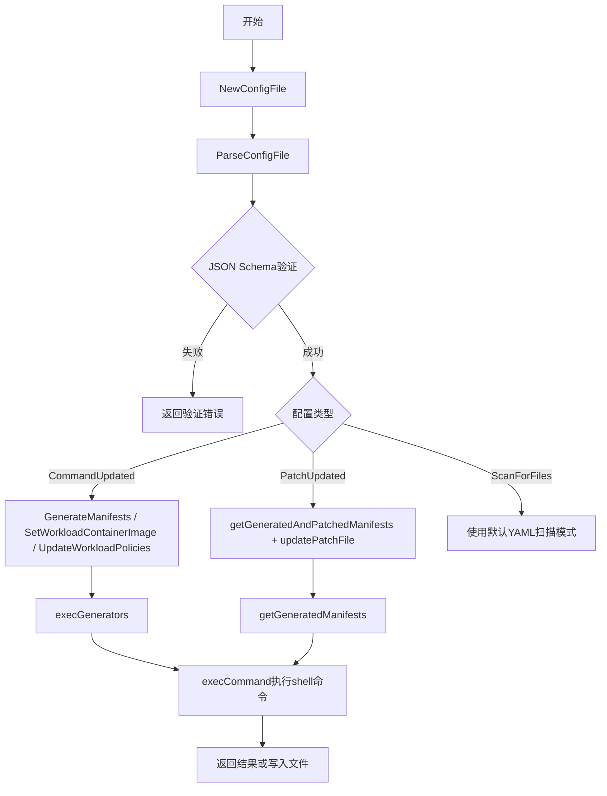

## 类结构

```
ConfigFile (主配置类)
├── CommandUpdated (命令更新配置)
│   ├── Generators: []Command
│   └── Updaters: []Updater
├── Command (单个命令)
Command: string
│   └── Timeout: *metav1.Duration
├── Updater (更新器)
│   ├── ContainerImage: Command
│   └── Policy: Command
├── PatchUpdated (补丁更新配置)
│   ├── Generators: []Command
│   ├── PatchFile: string
│   └── generatorsResultCache: []byte
├── ScanForFiles (扫描文件配置)
├── ConfigFileExecResult (执行结果)
│   ├── Error: error
│   ├── Stderr: []byte
│   └── Stdout: []byte
└── ConfigFileCombinedExecResult (合并输出执行结果)
    ├── Error: error
    └── Output: []byte
```

## 全局变量及字段


### `ConfigFilename`
    
配置文件名('.flux.yaml')

类型：`const string`
    


### `configSchemaYAML`
    
JSON Schema的YAML定义

类型：`const string`
    


### `ConfigSchema`
    
编译后的JSON Schema

类型：`*jsonschema.Schema`
    


### `ConfigFile.Version`
    
配置版本号

类型：`int`
    


### `ConfigFile.CommandUpdated`
    
命令更新模式配置

类型：`*CommandUpdated`
    


### `ConfigFile.PatchUpdated`
    
补丁更新模式配置

类型：`*PatchUpdated`
    


### `ConfigFile.ScanForFiles`
    
文件扫描模式配置

类型：`*ScanForFiles`
    


### `ConfigFile.configPath`
    
配置文件绝对路径

类型：`string`
    


### `ConfigFile.workingDir`
    
命令执行的工作目录

类型：`string`
    


### `ConfigFile.workingDirRelative`
    
相对于仓库根目录的工作目录

类型：`string`
    


### `ConfigFile.configPathRelative`
    
配置文件相对于工作目录的路径

类型：`string`
    


### `CommandUpdated.Generators`
    
生成器命令列表

类型：`[]Command`
    


### `CommandUpdated.Updaters`
    
更新器列表

类型：`[]Updater`
    


### `Command.Command`
    
要执行的shell命令

类型：`string`
    


### `Command.Timeout`
    
命令超时时间

类型：`*metav1.Duration`
    


### `Updater.ContainerImage`
    
容器镜像更新命令

类型：`Command`
    


### `Updater.Policy`
    
策略更新命令

类型：`Command`
    


### `PatchUpdated.Generators`
    
生成器命令列表

类型：`[]Command`
    


### `PatchUpdated.PatchFile`
    
补丁文件路径

类型：`string`
    


### `PatchUpdated.generatorsResultCache`
    
生成器结果缓存

类型：`[]byte`
    


### `ConfigFileExecResult.Error`
    
执行错误

类型：`error`
    


### `ConfigFileExecResult.Stderr`
    
标准错误输出

类型：`[]byte`
    


### `ConfigFileExecResult.Stdout`
    
标准输出

类型：`[]byte`
    


### `ConfigFileCombinedExecResult.Error`
    
执行错误

类型：`error`
    


### `ConfigFileCombinedExecResult.Output`
    
合并的输出

类型：`[]byte`
    
    

## 全局函数及方法


### `mustCompileConfigSchema`

该函数负责将预定义的 YAML 格式配置文件模式转换为 JSON Schema 对象，并编译返回可供验证使用的 `*jsonschema.Schema` 实例。这是程序启动时的初始化工作，确保后续对 `.flux.yaml` 配置文件进行结构验证时有所依据。

参数： 无

返回值： `*jsonschema.Schema`，返回编译后的 JSON Schema 对象，供后续 `ConfigSchema.Validate()` 调用使用

#### 流程图

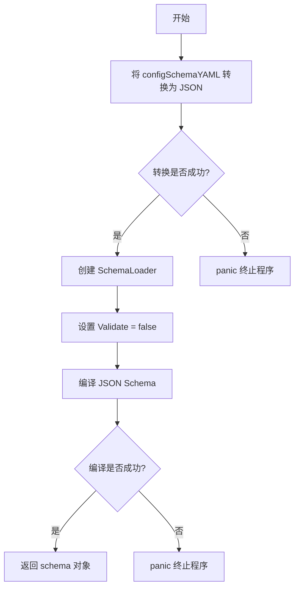

#### 带注释源码

```go
// mustCompileConfigSchema 将预定义的 YAML 配置文件模式转换为 JSON Schema
// 并编译返回。该函数在包初始化时调用一次，生成的 Schema 用于后续配置文件的校验。
// 注意：任何转换或编译错误都会触发 panic，因为这是程序运行的前置条件。
func mustCompileConfigSchema() *jsonschema.Schema {
	// 第一步：将定义好的 YAML 模式字符串转换为 JSON 格式字节切片
	j, err := yaml.YAMLToJSON([]byte(configSchemaYAML))
	if err != nil {
		// YAML 到 JSON 转换失败，表明模式定义本身有语法错误，程序无法继续
		panic(err)
	}
	// 第二步：创建 JSON Schema 加载器实例
	sl := jsonschema.NewSchemaLoader()
	// 禁用加载时的校验（避免重复校验，提升性能）
	sl.Validate = false
	// 第三步：使用字节加载器编译 JSON Schema
	schema, err := sl.Compile(jsonschema.NewBytesLoader(j))
	if err != nil {
		// Schema 编译失败，表明定义的模式本身不符合 JSON Schema 规范
		panic(err)
	}
	// 第四步：返回编译后的 Schema 对象，供全局变量 ConfigSchema 使用
	return schema
}
```

---

### 关键组件信息

| 名称 | 描述 |
|------|------|
| `configSchemaYAML` | 预定义的 YAML 格式配置文件结构模式，用于描述 `.flux.yaml` 的合法格式 |
| `ConfigSchema` | 全局变量，在包初始化时通过 `mustCompileConfigSchema()` 赋值，供后续配置验证使用 |
| `jsonschema.Schema` | gojsonschema 库提供的 Schema 类型，用于运行时验证 JSON/YAML 配置文件结构 |

---

### 潜在技术债务与优化空间

1. **错误处理方式不当**：使用 `panic` 处理转换和编译错误会导致整个程序崩溃，建议改为返回 error 由调用者决定如何处理
2. **全局单例模式隐患**：`ConfigSchema` 作为全局变量在包初始化时赋值，若后续需要动态加载不同版本的模式会较为困难
3. **性能考量**：`sl.Validate = false` 虽跳过加载时校验，但首次编译的开销仍不可忽视，可考虑缓存编译结果或延迟加载


### `makeNoCommandsRunErr`

生成一个错误，表示在指定的配置文件中没有可执行的命令。

参数：

- `field`：`string`，表示命令类型的字段名（如 "update.containerImage"、"updaters.policy" 等），用于在错误信息中说明缺少哪种类型的命令
- `cf`：`*ConfigFile`，指向 ConfigFile 结构体的指针，用于获取配置文件的相对路径信息（configPathRelative 和 workingDirRelative）

返回值：`error`，返回一个格式化的错误信息，包含缺少的命令类型、配置文件相对路径和工作目录相对路径

#### 流程图

```mermaid
flowchart TD
    A[开始] --> B[接收 field 参数和 cf 指针]
    B --> C[使用 fmt.Errorf 格式化错误信息]
    C --> D[错误信息格式: no {field} commands to run in {cf.configPathRelative} (from path {cf.workingDirRelative})]
    D --> E[返回错误]
```

#### 带注释源码

```go
// makeNoCommandsRunErr 生成一个错误，表示在指定的配置文件中没有可执行的命令
// 参数 field: 命令类型的字段名，用于标识缺少的是哪种命令（如 "update.containerImage"、"updaters.policy"）
// 参数 cf: 指向 ConfigFile 的指针，用于获取配置文件和工作目录的相对路径信息
func makeNoCommandsRunErr(field string, cf *ConfigFile) error {
	// 使用 fmt.Errorf 创建错误信息
	// 包含三个关键信息：
	// 1. field - 缺少的命令类型
	// 2. cf.configPathRelative - 配置文件的相对路径
	// 3. cf.workingDirRelative - 工作目录的相对路径（相对于 git 根目录）
	return fmt.Errorf("no %s commands to run in %s (from path %s)", field, cf.configPathRelative, cf.workingDirRelative)
}
```


### `makeEnvFromResourceID`

该函数接收一个资源 ID，并将其拆解为命名空间、种类和名称组件，然后构建一组包含这些信息的环境变量，供后续命令执行时使用。

参数：

- `id`：`resource.ID`，要转换的资源标识符，包含资源的完整标识信息

返回值：`[]string`，返回由环境变量组成的字符串切片，包含 FLUX_WORKLOAD、FLUX_WL_NS、FLUX_WL_KIND、FLUX_WL_NAME 四个环境变量

#### 流程图

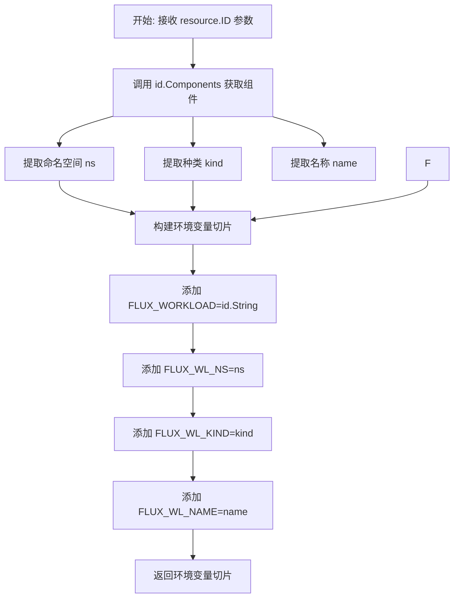

#### 带注释源码

```go
// makeEnvFromResourceID 将资源ID转换为环境变量切片
// 这些环境变量将被传递给外部命令，用于在命令执行时获取资源相关信息
// 参数 id: resource.ID 类型，表示一个资源的唯一标识
// 返回: 字符串切片，包含4个环境变量
func makeEnvFromResourceID(id resource.ID) []string {
	// 从资源ID中提取三个关键组件：命名空间、种类（类型）、名称
	ns, kind, name := id.Components()
	
	// 返回构建好的环境变量切片
	return []string{
		// FLUX_WORKLOAD: 完整的资源标识符字符串形式
		"FLUX_WORKLOAD=" + id.String(),
		// FLUX_WL_NS: 资源所在的命名空间
		"FLUX_WL_NS=" + ns,
		// FLUX_WL_KIND: 资源的种类（如 Deployment、Service 等）
		"FLUX_WL_KIND=" + kind,
		// FLUX_WL_NAME: 资源的名称
		"FLUX_WL_NAME=" + name,
	}
}
```


### `ConfigFile.IsScanForFiles`

判断配置文件是否指示应将目录视为包含 YAML 文件的模式（即应该表现得好像没有配置文件在运行）。这可以用于重置上层目录中 `.flux.yaml` 给出的指令。

参数：
- （无参数）

返回值：`bool`，如果配置文件指示应将目录视为包含 YAML 文件则返回 true，否则返回 false

#### 流程图

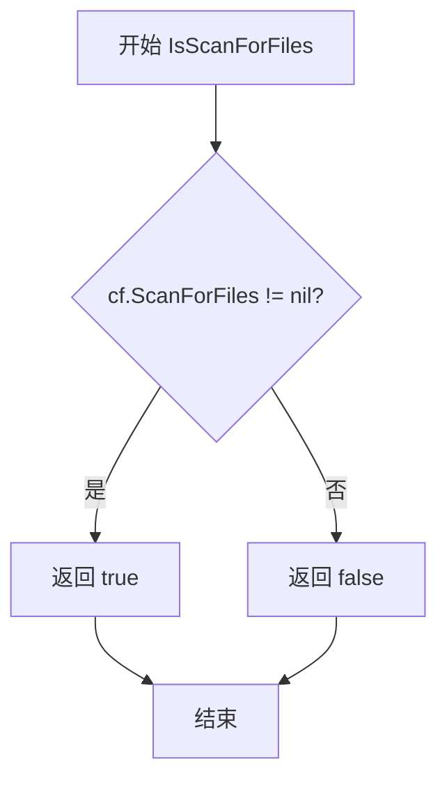

#### 带注释源码

```go
// IsScanForFiles returns true if the config file indicates that the
// directory should be treated as containing YAML files (i.e., should
// act as though there was no config file in operation). This can be
// used to reset the directive given by a .flux.yaml higher in the
// directory structure.
// 注意：此方法通过检查 ScanForFiles 指针是否非空来判断是否为扫描文件模式
// 如果 ScanForFiles 不为 nil，说明用户配置了 scanForFiles 模式
func (cf *ConfigFile) IsScanForFiles() bool {
	return cf.ScanForFiles != nil  // 返回 ScanForFiles 字段是否为非空指针
}
```


### `ParseConfigFile`

该函数负责解析 `.flux.yaml` 配置文件，首先将字节内容反序列化为中间 map 以检测非法字段，然后使用预编译的 JSON Schema 进行验证，最后将有效配置反序列化到目标 `ConfigFile` 结构体中。

**参数：**

- `fileBytes`：`[]byte`，配置文件的原始字节内容
- `result`：`*ConfigFile`，指向目标 `ConfigFile` 结构体的指针，用于存放解析后的配置数据

**返回值：** `error`，如果解析或验证失败则返回包含具体错误信息的 error，成功时返回 nil

#### 流程图

```mermaid
flowchart TD
    A[开始: 接收 fileBytes 和 result] --> B[将 fileBytes 反序列化为 map[string]interface{}]
    B --> C{反序列化是否成功?}
    C -->|是| D[使用 ConfigSchema 验证中间 map]
    C -->|否| E[返回格式错误: cannot parse]
    D --> F{验证是否通过?}
    F -->|是| G[将 fileBytes 反序列化为 ConfigFile 结构体]
    F -->|否| H[收集所有验证错误并返回: config file is not valid]
    G --> I[返回 nil 表示成功]
    E --> I
    H --> I
```

#### 带注释源码

```go
func ParseConfigFile(fileBytes []byte, result *ConfigFile) error {
	// 第一步：将文件内容反序列化为 map，以便检测非法字段
	// 这样做很重要，例如可以检测到用户配置了 commandUpdated 
	// 但错误地包含了 patchFile（以为它会生效）的情况
	var intermediate map[string]interface{}
	if err := yaml.Unmarshal(fileBytes, &intermediate); err != nil {
		// 反序列化失败，返回格式错误
		return fmt.Errorf("cannot parse: %s", err)
	}
	
	// 第二步：使用预编译的 JSON Schema 验证中间 map
	validation, err := ConfigSchema.Validate(jsonschema.NewGoLoader(intermediate))
	if err != nil {
		// 验证过程本身出错（如 schema 编译问题）
		return fmt.Errorf("cannot validate: %s", err)
	}
	
	// 检查验证结果是否有效
	if !validation.Valid() {
		// 收集所有验证错误信息，拼接成字符串
		errs := ""
		for _, e := range validation.Errors() {
			errs = errs + "\n" + e.String()
		}
		// 返回配置无效错误，包含详细错误信息
		return fmt.Errorf("config file is not valid: %s", errs)
	}

	// 第三步：验证通过后，将文件内容正式反序列化为 ConfigFile 结构体
	return yaml.Unmarshal(fileBytes, result)
}
```


### `ConfigFile.NewConfigFile`

该函数用于根据给定的 git 路径、配置文件绝对路径和工作目录绝对路径构造一个新的 ConfigFile 实例，并解析 `.flux.yaml` 配置文件内容填充到结构体中。

参数：

- `gitPath`：`string`，相对 git 路径，用于在错误信息中显示工作目录的相对路径
- `configPath`：`string`，配置文件的绝对路径，指向 `.flux.yaml` 文件
- `workingDir`：`string`，工作目录的绝对路径，用于执行命令或查找补丁文件的基准目录

返回值：`*ConfigFile, error`，返回解析后的 ConfigFile 指针实例，若出错则返回 nil 和相应的错误信息

#### 流程图

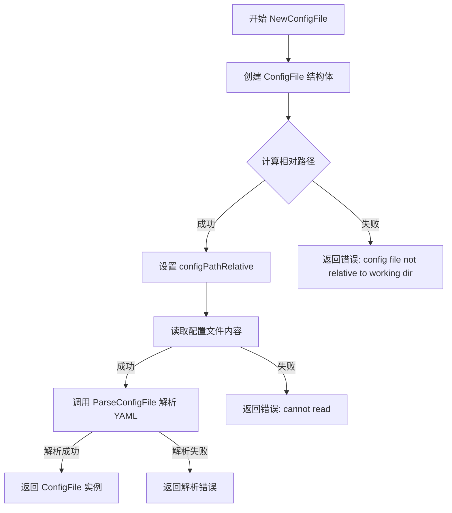

#### 带注释源码

```go
// NewConfigFile constructs a ConfigFile for the relative gitPath,
// from the config file at the absolute path configPath, with the
// absolute workingDir.
// NewConfigFile 根据相对git路径、配置文件绝对路径和工作目录绝对路径构造一个 ConfigFile 实例
func NewConfigFile(gitPath, configPath, workingDir string) (*ConfigFile, error) {
	// 1. 初始化 ConfigFile 结构体，设置基础路径信息
	result := &ConfigFile{
		configPath:         configPath,       // 配置文件的绝对路径
		workingDir:         workingDir,       // 工作目录的绝对路径
		workingDirRelative: gitPath,         // 相对git路径，用于错误信息显示
	}

	// 2. 计算配置文件相对于工作目录的相对路径
	relConfigPath, err := filepath.Rel(workingDir, configPath)
	if err != nil {
		// 如果计算失败，返回错误
		return nil, fmt.Errorf("config file not relative to working dir: %s", err)
	}
	// 设置相对路径到结果对象
	result.configPathRelative = relConfigPath

	// 3. 读取配置文件内容
	fileBytes, err := ioutil.ReadFile(configPath)
	if err != nil {
		// 读取失败，返回错误
		return nil, fmt.Errorf("cannot read: %s", err)
	}

	// 4. 解析配置文件内容并填充到 result 中
	// 注意：ParseConfigFile 会进行 JSON Schema 验证
	return result, ParseConfigFile(fileBytes, result)
}
```


### `ConfigFile.ConfigRelativeToWorkingDir`

获取 `.flux.yaml` 配置文件相对于工作目录的路径，用于在错误信息中展示配置文件的位置。

参数：
- 无参数

返回值：`string`，返回配置文件相对于工作目录的路径字符串（例如 `staging/../.flux.yaml`）

#### 流程图

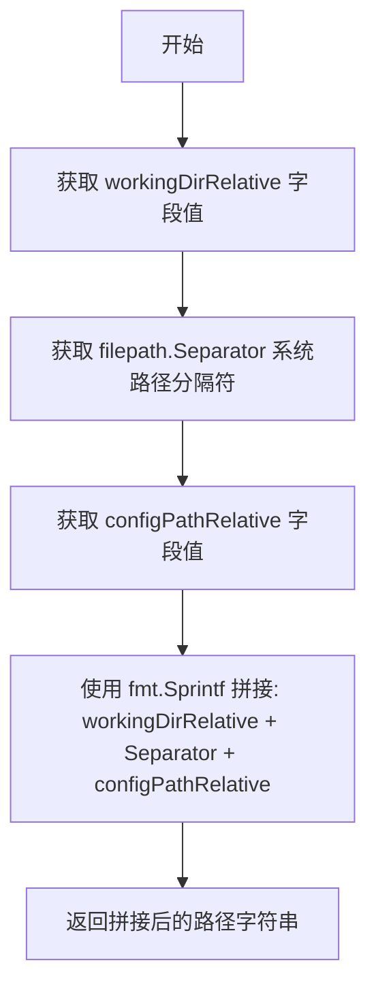

#### 带注释源码

```go
// ConfigRelativeToWorkingDir shows the path to the config file taking
// the working dir as a starting point; e.g., `staging/../.flux.yaml`
// ConfigRelativeToWorkingDir 方法展示配置文件相对于工作目录的路径
// 例如: `staging/../.flux.yaml`
func (cf *ConfigFile) ConfigRelativeToWorkingDir() string {
	// filepath.Join will clean the resulting path, but here I want to
	// leave parent paths in, e.g., `staging/../.flux.yaml`
	// 注意：filepath.Join 会规范化路径，但这里需要保留父路径信息
	// 例如保留 `staging/../.flux.yaml` 这种形式，以便在错误信息中展示原始路径
	return fmt.Sprintf("%s%c%s", cf.workingDirRelative, filepath.Separator, cf.configPathRelative)
}
```


### `ConfigFile.GenerateManifests`

该方法根据 `.flux.yaml` 配置文件中的设置生成 Kubernetes manifests。根据配置类型（`PatchUpdated` 或 `CommandUpdated`）选择不同的生成策略：如果是补丁更新模式，则先生成再应用补丁；如果是命令更新模式，则直接执行生成器命令。

参数：

- `ctx`：`context.Context`，用于控制命令执行的超时和取消
- `manifests`：`Manifests`，manifest 操作接口，用于追加 manifest 到缓冲区和应用补丁
- `defaultTimeout`：`time.Duration`，如果配置中未指定超时时间，则使用此默认超时

返回值：`[]byte, error`，返回生成的 manifest 内容字节数组，若发生错误则返回 error

#### 流程图

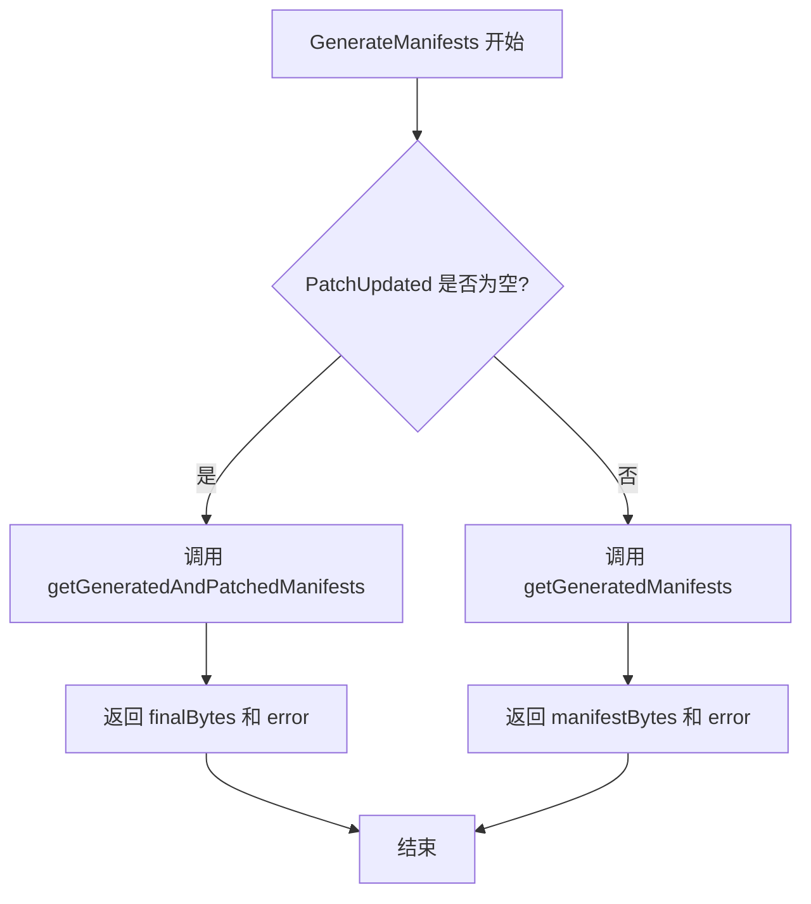

#### 带注释源码

```go
// GenerateManifests returns the manifests generated (and patched, if
// necessary) according to the config file.
// GenerateManifests 返回根据配置文件生成（并在需要时进行补丁处理）的 manifests
func (cf *ConfigFile) GenerateManifests(ctx context.Context, manifests Manifests, defaultTimeout time.Duration) ([]byte, error) {
    // 检查配置是否为 PatchUpdated 模式
    // 如果是 PatchUpdated 模式，需要先生成 manifests，再应用补丁
	if cf.PatchUpdated != nil {
        // 调用 getGeneratedAndPatchedManifests 处理生成和补丁应用
		_, finalBytes, _, err := cf.getGeneratedAndPatchedManifests(ctx, manifests, defaultTimeout)
		return finalBytes, err
	}
    
    // 否则使用 CommandUpdated 模式，直接执行生成器命令
	return cf.getGeneratedManifests(ctx, manifests, cf.CommandUpdated.Generators, defaultTimeout)
}
```


### `ConfigFile.SetWorkloadContainerImage`

该方法根据 `.flux.yaml` 配置文件中的更新策略（PatchUpdated 或 CommandUpdated），设置指定工作负载的容器镜像。它首先判断配置类型：若为 PatchUpdated，则通过更新 patch 文件的方式修改镜像；若为 CommandUpdated，则执行配置中定义的命令来更新镜像。

参数：

- `ctx`：`context.Context`，请求上下文，用于控制超时和取消操作
- `manifests`：`Manifests`，Manifests 接口实例，用于操作 Kubernetes 资源清单
- `r`：`resource.Resource`，目标资源对象，代表需要更新镜像的工作负载
- `container`：`string`，容器名称，指定要更新镜像的容器标识
- `newImageID`：`image.Ref`，新的镜像引用，包含镜像的名称和标签信息
- `defaultTimeout`：`time.Duration`，默认超时时间，当配置中未指定超时时间时使用

返回值：`error`，如果镜像设置成功返回 nil，否则返回描述错误的非 nil 值

#### 流程图

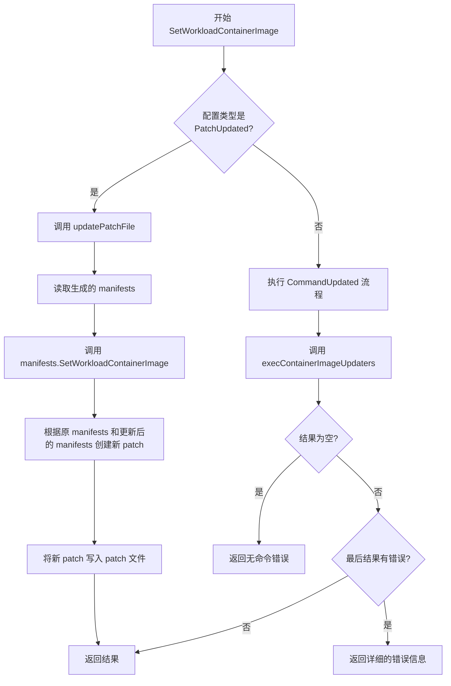

#### 带注释源码

```go
// SetWorkloadContainerImage 设置指定工作负载的容器镜像
// 根据配置文件类型选择不同的更新策略：
// 1. PatchUpdated: 通过更新 patch 文件的方式修改镜像
// 2. CommandUpdated: 通过执行配置的命令来更新镜像
func (cf *ConfigFile) SetWorkloadContainerImage(ctx context.Context, manifests Manifests, r resource.Resource, container string, newImageID image.Ref, defaultTimeout time.Duration) error {
	// 判断是否为 PatchUpdated 配置类型
	if cf.PatchUpdated != nil {
		// 使用 patch 方式更新：先获取已生成的 manifests，然后更新其中的镜像，最后重新计算 patch
		return cf.updatePatchFile(ctx, manifests, func(previousManifests []byte) ([]byte, error) {
			// 调用 manifests 的 SetWorkloadContainerImage 方法更新镜像
			return manifests.SetWorkloadContainerImage(previousManifests, r.ResourceID(), container, newImageID)
		}, defaultTimeout)
	}

	// Command-updated: 通过执行命令更新镜像
	// 传递资源 ID、容器名、镜像名和镜像标签给命令执行器
	result := cf.execContainerImageUpdaters(ctx, r.ResourceID(), container, newImageID.Name.String(), newImageID.Tag, defaultTimeout)
	
	// 如果没有配置任何更新命令，返回错误
	if len(result) == 0 {
		return makeNoCommandsRunErr("update.containerImage", cf)
	}

	// 检查命令执行结果，如果最后一条命令执行失败，返回详细错误信息
	if len(result) > 0 && result[len(result)-1].Error != nil {
		updaters := cf.CommandUpdated.Updaters
		return fmt.Errorf("error executing image updater command %q from file %q: %s\noutput:\n%s",
			updaters[len(result)-1].ContainerImage.Command,  // 失败的命令
			result[len(result)-1].Error,                      // 错误信息
			r.Source(),                                        // 资源来源
			result[len(result)-1].Output,                     // 命令输出
		)
	}
	return nil
}
```


### `ConfigFile.UpdateWorkloadPolicies`

更新工作负载的策略配置，支持两种模式：通过补丁文件更新（PatchUpdated）或通过执行命令更新（CommandUpdated）。

参数：
- `ctx`：`context.Context`，上下文对象，用于控制命令执行的超时和取消
- `manifests`：`Manifests`，清单接口，用于操作资源清单数据
- `r`：`resource.Resource`，资源对象，表示要更新的工作负载
- `update`：`resource.PolicyUpdate`，策略更新对象，包含要应用的策略变更内容
- `defaultTimeout`：`time.Duration`，执行命令时的默认超时时间

返回值：
- `bool`，表示工作负载策略是否发生了变更
- `error`，执行过程中的错误信息，如果有的话

#### 流程图

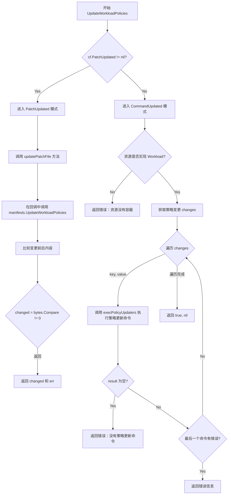

#### 带注释源码

```go
// UpdateWorkloadPolicies 更新工作负载的策略配置
// 支持两种模式：PatchUpdated（补丁更新）和 CommandUpdated（命令更新）
func (cf *ConfigFile) UpdateWorkloadPolicies(ctx context.Context, manifests Manifests, r resource.Resource, update resource.PolicyUpdate, defaultTimeout time.Duration) (bool, error) {
	// 判断是否为 PatchUpdated 模式（通过补丁文件更新）
	if cf.PatchUpdated != nil {
		var changed bool
		// 使用补丁文件更新策略
		err := cf.updatePatchFile(ctx, manifests, func(previousManifests []byte) ([]byte, error) {
			// 调用 manifests 接口更新工作负载策略
			updatedManifests, err := manifests.UpdateWorkloadPolicies(previousManifests, r.ResourceID(), update)
			if err == nil {
				// 比较更新前后的内容是否有变化
				changed = bytes.Compare(previousManifests, updatedManifests) != 0
			}
			return updatedManifests, err
		}, defaultTimeout)
		return changed, err
	}

	// CommandUpdated 模式：通过执行命令更新策略
	// 检查资源是否为工作负载类型（包含容器信息）
	workload, ok := r.(resource.Workload)
	if !ok {
		return false, errors.New("resource " + r.ResourceID().String() + " does not have containers")
	}
	
	// 计算策略变更内容
	changes, err := resource.ChangesForPolicyUpdate(workload, update)
	if err != nil {
		return false, err
	}

	// 遍历每个策略变更，执行对应的更新命令
	for key, value := range changes {
		// 执行策略更新命令
		result := cf.execPolicyUpdaters(ctx, r.ResourceID(), key, value, defaultTimeout)
		if len(result) == 0 {
			return false, makeNoCommandsRunErr("updaters.policy", cf)
		}

		// 检查命令执行结果，如果有错误则返回
		if len(result) > 0 && result[len(result)-1].Error != nil {
			updaters := cf.CommandUpdated.Updaters
			err := fmt.Errorf("error executing annotation updater command %q from file %q: %s\noutput:\n%s",
				updaters[len(result)-1].Policy.Command,
				result[len(result)-1].Error,
				r.Source(),
				result[len(result)-1].Output,
			)
			return false, err
		}
	}
	// 假设策略更新一定会改变资源
	// 另一种做法是重新生成资源并比较输出，但这样开销较大
	return true, nil
}
```


### `ConfigFile.getGeneratedAndPatchedManifests`

该函数是 `ConfigFile` 类的核心方法之一，用于在 `patchUpdated` 配置模式下生成 Kubernetes manifests 并应用补丁文件。它首先检查生成结果的缓存，如果缓存不存在则重新生成 manifests，然后读取配置中指定的补丁文件，最后将补丁应用到生成的 manifests 上并返回结果。

参数：
- `ctx`：`context.Context`，用于控制请求的取消、超时等上下文信息
- `manifests`：`Manifests`，用于操作 manifests 的接口实现，包含追加、应用补丁等方法
- `defaultTimeout`：`time.Duration`，执行生成器命令时的默认超时时间

返回值：
- `[]byte`：生成的原始 manifests 内容
- `[]byte`：应用补丁后的最终 manifests 内容
- `string`：补丁文件的绝对路径
- `error`：执行过程中的错误信息

#### 流程图

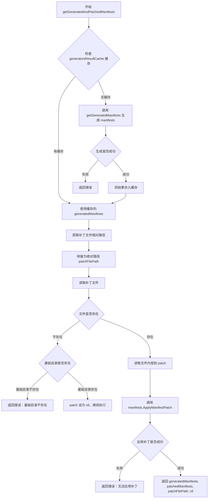

#### 带注释源码

```go
// getGeneratedAndPatchedManifests 用于在配置为 patchUpdated 时生成 manifests
// 该方法是处理补丁更新配置的核心入口
func (cf *ConfigFile) getGeneratedAndPatchedManifests(ctx context.Context, manifests Manifests, defaultTimeout time.Duration) ([]byte, []byte, string, error) {
	// 第一步：尝试从缓存获取已生成的 manifests
	// 缓存可以避免重复执行耗时的生成器命令
	generatedManifests := cf.PatchUpdated.generatorsResultCache
	
	// 缓存未命中，需要重新生成
	if generatedManifests == nil {
		var err error
		// 调用 getGeneratedManifests 执行配置中的生成器命令
		generatedManifests, err = cf.getGeneratedManifests(ctx, manifests, cf.PatchUpdated.Generators, defaultTimeout)
		if err != nil {
			// 生成失败时返回错误，包含生成失败的原因
			return nil, nil, "", err
		}
		// 将生成结果存入缓存，供后续调用复用
		cf.PatchUpdated.generatorsResultCache = generatedManifests
	}
	
	// 第二步：处理补丁文件路径
	// 补丁文件路径在配置文件中是相对于工作目录的
	relPatchFilePath := cf.PatchUpdated.PatchFile
	// 拼接为绝对路径
	patchFilePath := filepath.Join(cf.workingDir, relPatchFilePath)

	// 第三步：读取补丁文件
	patch, err := ioutil.ReadFile(patchFilePath)
	if err != nil {
		// 如果文件不存在（可能是首次运行，补丁文件尚未创建）
		if !os.IsNotExist(err) {
			// 其他读取错误直接返回
			return nil, nil, "", err
		}
		// 容忍缺失的补丁文件，但必须确保其基础目录存在
		patchBaseDir := filepath.Dir(patchFilePath)
		if stat, err := os.Stat(patchBaseDir); err != nil || !stat.IsDir() {
			// 基础目录不存在时返回详细错误信息
			err := fmt.Errorf("base directory (%q) of patchFile (%q) does not exist",
				filepath.Dir(relPatchFilePath), relPatchFilePath)
			return nil, nil, "", err
		}
		// 补丁文件不存在时，将 patch 设为 nil 继续执行
		patch = nil
	}
	
	// 第四步：应用补丁到生成的 manifests
	// 调用 manifests 接口的 ApplyManifestPatch 方法
	patchedManifests, err := manifests.ApplyManifestPatch(generatedManifests, patch, cf.configPathRelative, relPatchFilePath)
	if err != nil {
		// 应用失败时返回包含详细上下文信息的错误
		return nil, nil, "", fmt.Errorf("processing %q, cannot apply patchFile %q to generated resources: %s", cf.configPathRelative, relPatchFilePath, err)
	}
	
	// 第五步：返回所有结果
	// 返回生成的原始 manifests、应用补丁后的 manifests、补丁文件路径
	return generatedManifests, patchedManifests, patchFilePath, nil
}
```


### `ConfigFile.getGeneratedManifests`

该方法根据配置文件中的生成器（generators）执行命令并生成manifests。它仅使用生成器命令的输出，不进行任何补丁（patch）操作，是commandUpdated配置的核心生成逻辑，也是patchUpdated配置的第一步。

参数：

- `ctx`：`context.Context`，上下文，用于控制超时和取消
- `manifests`：`Manifests`，manifests接口，用于将生成的输出追加到缓冲区
- `generators`：`[]Command`，生成器命令列表，每个命令对应一个用于生成manifests的可执行命令
- `defaultTimeout`：`time.Duration`，默认超时时间，如果生成器命令没有指定超时，则使用此默认值

返回值：`([]byte, error)`，返回生成的manifests的字节切片，如果执行过程中发生错误则返回错误信息

#### 流程图

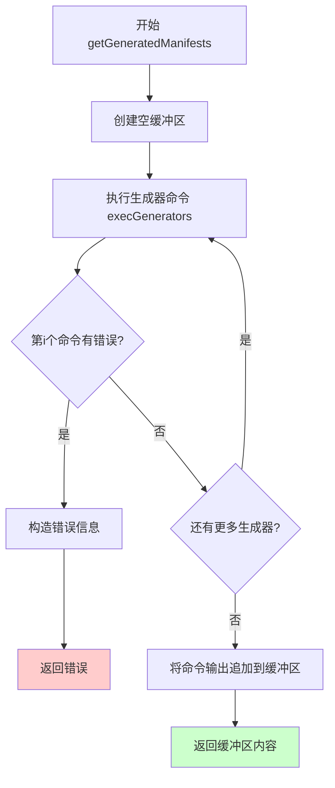

#### 带注释源码

```go
// getGeneratedManifests 用于仅根据配置中的生成器生成 manifests。
// 这对于 commandUpdated 配置已经足够，也是 patchUpdated 配置的第一步。
func (cf *ConfigFile) getGeneratedManifests(ctx context.Context, manifests Manifests, generators []Command, defaultTimeout time.Duration) ([]byte, error) {
	// 创建一个空的字节缓冲区，用于收集所有生成器的输出
	buf := bytes.NewBuffer(nil)
	
	// 遍历执行所有生成器命令
	for i, cmdResult := range cf.execGenerators(ctx, generators, defaultTimeout) {
		// 检查当前生成器命令是否执行出错
		if cmdResult.Error != nil {
			// 构造详细的错误信息，包含命令、文件路径、错误输出等
			err := fmt.Errorf("error executing generator command %q from file %q: %s\nerror output:\n%s\ngenerated output:\n%s",
				generators[i].Command,       // 出错的命令
				cf.configPathRelative,       // 配置文件相对路径
				cmdResult.Error,             // 错误信息
				string(cmdResult.Stderr),    // 标准错误输出
				string(cmdResult.Stderr),    // 重复的标准错误输出（可能是代码bug，应为Stdout）
			)
			return nil, err // 返回错误，终止执行
		}
		
		// 如果命令执行成功，将标准输出追加到缓冲区
		if err := manifests.AppendManifestToBuffer(cmdResult.Stdout, buf); err != nil {
			return nil, err // 如果追加失败，返回错误
		}
	}
	
	// 所有生成器执行完成，返回缓冲区的内容（即所有manifests）
	return buf.Bytes(), nil
}
```


### `ConfigFile.updatePatchFile`

该函数是 Flux CD 工具中处理补丁文件更新的核心方法，通过调用生成器生成清单、应用现有补丁、执行用户定义的更新函数，最后计算并写入新的补丁文件，实现对 Kubernetes 资源配置的自动化更新。

#### 参数

- `ctx`：`context.Context`，用于控制请求的取消、超时等行为
- `manifests`：`Manifests`，清单操作接口，提供生成、应用和创建补丁的方法
- `updateFn`：`func([]byte) ([]byte, error)`，用户提供的更新函数，接收已补丁的清单字节数组，返回更新后的清单字节数组
- `defaultTimeout`：`time.Duration`，执行生成器命令时的默认超时时间

#### 返回值

- `error`：执行过程中发生的任何错误，如果成功则返回 nil

#### 流程图

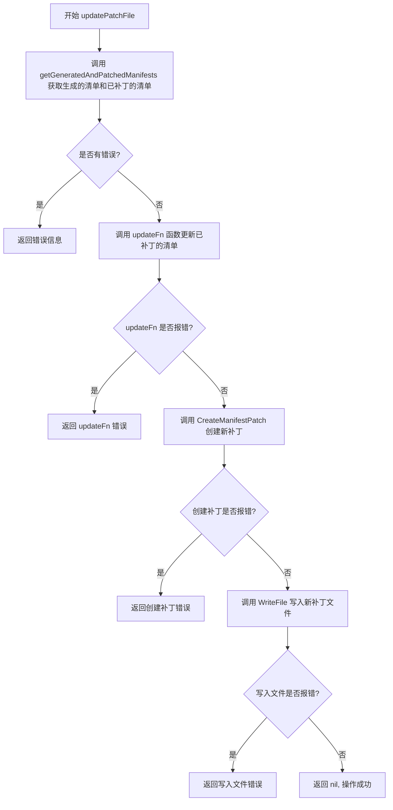

#### 带注释源码

```go
// updatePatchFile calculates the patch given a transformation, and
// updates the patch file given in the config.
// updatePatchFile 计算给定转换的补丁，并更新配置中给出的补丁文件
func (cf *ConfigFile) updatePatchFile(ctx context.Context, manifests Manifests, 
    updateFn func(previousManifests []byte) ([]byte, error), 
    defaultTimeout time.Duration) error {
    
    // 步骤 1: 获取已生成的清单和已应用补丁的清单
    // 同时获取补丁文件的路径，用于后续写入
    generatedManifests, patchedManifests, patchFilePath, err := 
        cf.getGeneratedAndPatchedManifests(ctx, manifests, defaultTimeout)
    
    // 步骤 2: 检查获取清单过程中是否有错误
    if err != nil {
        // 返回格式化的错误信息，包含配置文件路径和具体错误
        return fmt.Errorf("error parsing generated, patched output from file %s: %s", 
            cf.configPathRelative, err)
    }
    
    // 步骤 3: 调用用户提供的更新函数，传入已补丁的清单
    // 这允许用户自定义修改清单的内容（如更新镜像版本、修改策略等）
    finalManifests, err := updateFn(patchedManifests)
    if err != nil {
        // 如果更新函数返回错误，直接向上传递
        return err
    }
    
    // 步骤 4: 创建新补丁
    // 比较原始生成的清单和最终修改后的清单，计算出差量补丁
    newPatch, err := manifests.CreateManifestPatch(
        generatedManifests, 
        finalManifests, 
        "generated manifests",      // 源描述
        "patched and updated manifests") // 目标描述
    if err != nil {
        return err
    }
    
    // 步骤 5: 将新补丁写入文件
    // 使用 0600 权限（所有者读写）确保安全性
    return ioutil.WriteFile(patchFilePath, newPatch, 0600)
}
```


### `ConfigFile.execGenerators`

该方法负责遍历并执行配置文件中定义的所有生成器命令，为每个命令创建独立的输出缓冲区，依次执行命令并收集执行结果（标准输出和标准错误），当某个命令执行失败时立即停止后续命令的执行。

参数：

- `ctx`：`context.Context`，用于控制命令执行的上下文，支持超时和取消机制
- `generators`：`[]Command`，生成器命令列表，包含待执行的命令及其可选超时配置
- `defaultTimeout`：`time.Duration`，当生成器未指定超时时间时使用的默认超时时长

返回值：`[]ConfigFileExecResult`，执行结果列表，每个元素对应一个生成器的执行结果（包含标准输出、标准错误和错误信息）

#### 流程图

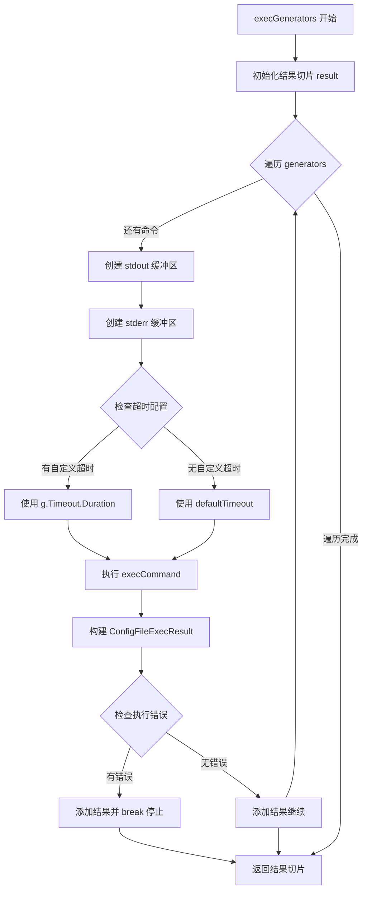

#### 带注释源码

```go
// execGenerators 执行所有给定的生成器命令并返回结果
// 如果遇到第一个失败的命令将会停止执行
func (cf *ConfigFile) execGenerators(ctx context.Context, generators []Command, defaultTimeout time.Duration) []ConfigFileExecResult {
    // 初始化结果切片，用于存储每个生成器的执行结果
    result := []ConfigFileExecResult{}
    
    // 遍历每一个生成器命令
    for _, g := range generators {
        // 为当前命令创建独立的 stderr 缓冲区
        stdErr := bytes.NewBuffer(nil)
        // 为当前命令创建独立的 stdout 缓冲区
        stdOut := bytes.NewBuffer(nil)
        
        // 初始化超时时间为默认值
        timeout := defaultTimeout
        // 如果生成器指定了自定义超时且大于等于1秒，则使用自定义超时
        if g.Timeout != nil && g.Timeout.Duration >= time.Second {
            timeout = g.Timeout.Duration
        }
        
        // 执行实际命令，传入空环境变量、stdout 和 stderr 缓冲区
        // 注意：这里传入 nil 作为 env 参数，意味着不使用额外环境变量
        err := cf.execCommand(ctx, nil, stdOut, stdErr, g.Command, timeout)
        
        // 构建当前命令的执行结果结构体
        r := ConfigFileExecResult{
            Stdout: stdOut.Bytes(),  // 捕获的标准输出
            Stderr: stdErr.Bytes(),  // 捕获的标准错误
            Error:  err,              // 执行过程中的错误（如果有）
        }
        
        // 将当前结果追加到结果切片中
        result = append(result, r)
        
        // 如果当前命令执行出错，立即停止执行后续命令
        // 这是一种fail-fast策略，避免错误级联
        if err != nil {
            break
        }
    }
    
    // 返回所有生成器的执行结果
    return result
}
```


### ConfigFile.execContainerImageUpdaters

该函数用于执行配置文件中的所有容器镜像更新命令。它首先构建包含工作负载信息、容器名称、镜像和标签的环境变量，然后从配置中提取镜像更新器命令，最后将这些命令委托给 `execCommandsWithCombinedOutput` 方法执行。

参数：

- `ctx`：`context.Context`，上下文对象，用于控制命令执行的超时和取消操作
- `workload`：`resource.ID`，工作负载的标识符，包含命名空间、类型和名称信息
- `container`：`string`，需要更新镜像的容器名称
- `image`：`string`，新的镜像名称（如 "nginx"）
- `imageTag`：`string`，新的镜像标签（如 "1.19.0"）
- `defaultTimeout`：`time.Duration`，如果命令未指定超时时间时使用的默认超时时长

返回值：`[]ConfigFileCombinedExecResult`，执行结果的切片，每个元素包含命令的输出和可能发生的错误

#### 流程图

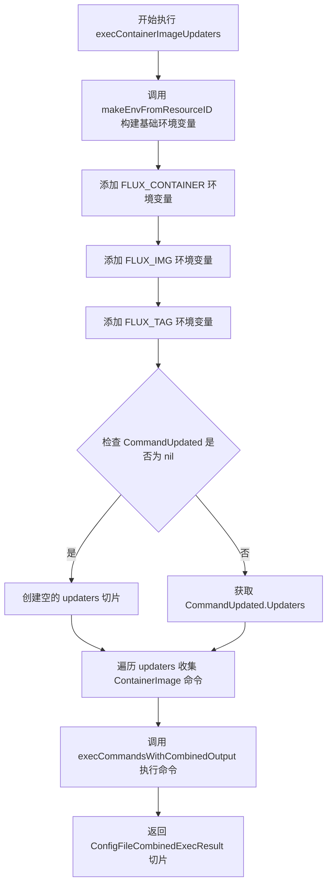

#### 带注释源码

```go
// execContainerImageUpdaters executes all the image updates in the configuration file.
// It will stop at the first error, in which case the returned error will be non-nil
// 参数说明：
//   - ctx: 上下文，用于控制命令执行超时
//   - workload: 工作负载ID，包含命名空间、类型、名称
//   - container: 容器名称
//   - image: 镜像名称
//   - imageTag: 镜像标签
//   - defaultTimeout: 默认超时时间
// 返回值：ConfigFileCombinedExecResult 切片，包含每个命令的执行结果
func (cf *ConfigFile) execContainerImageUpdaters(ctx context.Context,
	workload resource.ID, container string, image, imageTag string, defaultTimeout time.Duration) []ConfigFileCombinedExecResult {
	
	// 第一步：从 workload ID 构建基础环境变量
	// 包含 FLUX_WORKLOAD, FLUX_WL_NS, FLUX_WL_KIND, FLUX_WL_NAME
	env := makeEnvFromResourceID(workload)
	
	// 第二步：添加容器镜像相关的环境变量
	// 这些变量会被传递给更新器命令使用
	env = append(env,
		"FLUX_CONTAINER="+container,  // 要更新的容器名称
		"FLUX_IMG="+image,             // 新的镜像名称
		"FLUX_TAG="+imageTag,          // 新的镜像标签
	)
	
	// 第三步：从配置中获取镜像更新器命令
	commands := []Command{}
	var updaters []Updater
	if cf.CommandUpdated != nil {
		updaters = cf.CommandUpdated.Updaters
	}
	
	// 第四步：遍历所有更新器，收集 ContainerImage 命令
	for _, u := range updaters {
		commands = append(commands, u.ContainerImage)
	}
	
	// 第五步：委托给通用命令执行方法
	// 该方法会遍历执行所有命令，遇到错误时停止
	return cf.execCommandsWithCombinedOutput(ctx, env, commands, defaultTimeout)
}
```


### `ConfigFile.execPolicyUpdaters`

执行配置文件中定义的所有策略更新命令。该方法通过设置环境变量（FLUX_POLICY、FLUX_POLICY_VALUE 等）并执行自定义命令来更新工作负载的策略。如果 policyValue 为空字符串，则表示移除该策略。方法会在遇到第一个错误时停止执行后续命令。

参数：

- `ctx`：`context.Context`，Go 上下文，用于控制命令执行的超时和取消
- `workload`：`resource.ID`，工作负载的标识符，用于构建环境变量
- `policyName`：`string`，要更新的策略名称
- `policyValue`：`string`，策略的新值；如果为空字符串，表示移除该策略
- `defaultTimeout`：`time.Duration`，命令执行的默认超时时间

返回值：`[]ConfigFileCombinedExecResult`，执行结果的切片，每个元素包含命令的输出和错误信息

#### 流程图

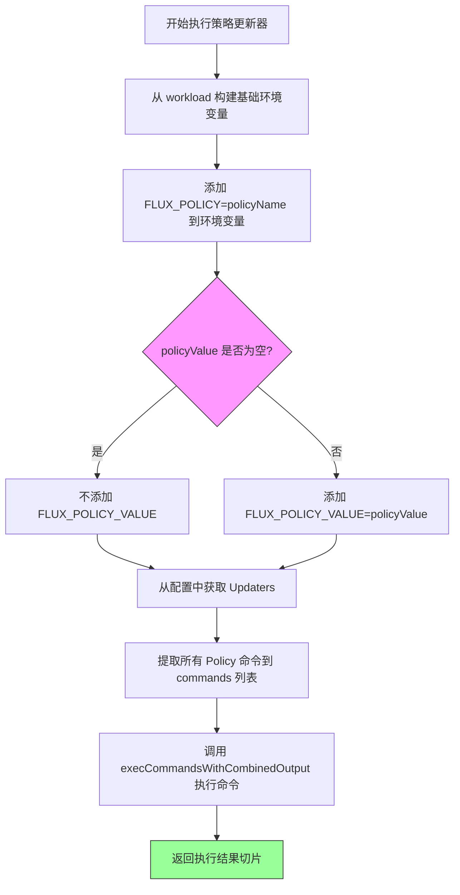

#### 带注释源码

```go
// execPolicyUpdaters 执行配置文件中定义的所有策略更新命令。
// policyValue 为空字符串时表示移除策略。
// 方法会在第一个错误发生时停止执行后续命令。
func (cf *ConfigFile) execPolicyUpdaters(ctx context.Context,
	workload resource.ID, policyName, policyValue string, defaultTimeout time.Duration) []ConfigFileCombinedExecResult {
	
	// 步骤1: 从 workload ID 构建基础环境变量
	// 包含 FLUX_WORKLOAD, FLUX_WL_NS, FLUX_WL_KIND, FLUX_WL_NAME
	env := makeEnvFromResourceID(workload)
	
	// 步骤2: 添加策略名称到环境变量
	env = append(env, "FLUX_POLICY="+policyName)
	
	// 步骤3: 如果提供了策略值，则添加到环境变量
	// 空值表示移除该策略
	if policyValue != "" {
		env = append(env, "FLUX_POLICY_VALUE="+policyValue)
	}
	
	// 步骤4: 从配置中获取更新器命令列表
	commands := []Command{}
	var updaters []Updater
	if cf.CommandUpdated != nil {
		updaters = cf.CommandUpdated.Updaters
	}
	
	// 步骤5: 提取所有 Policy 类型的命令
	for _, u := range updaters {
		commands = append(commands, u.Policy)
	}
	
	// 步骤6: 执行所有策略更新命令并返回结果
	// 该方法会在第一个错误时停止执行
	return cf.execCommandsWithCombinedOutput(ctx, env, commands, defaultTimeout)
}
```


### `ConfigFile.execCommandsWithCombinedOutput`

该方法是 `ConfigFile` 类的成员方法，用于批量执行一组命令并将标准输出和标准错误合并收集。它遍历所有待执行的命令，为每个命令设置环境变量和超时时间，调用底层的 `execCommand` 执行命令，并在遇到第一个错误时停止后续命令的执行，最终返回所有命令的执行结果列表。

参数：

- `ctx`：`context.Context`，上下文对象，用于控制命令执行的取消和超时
- `env`：`[]string`，额外的环境变量列表，会与系统的 PATH 环境变量合并
- `commands`：`[]Command`，待执行的命令列表，每个命令包含命令字符串和可选的超时时间
- `defaultTimeout`：`time.Duration`，如果命令未指定超时时间时使用的默认超时时长

返回值：`[]ConfigFileCombinedExecResult`，返回每个命令的执行结果切片，每个结果包含合并后的输出字节数组和错误信息

#### 流程图

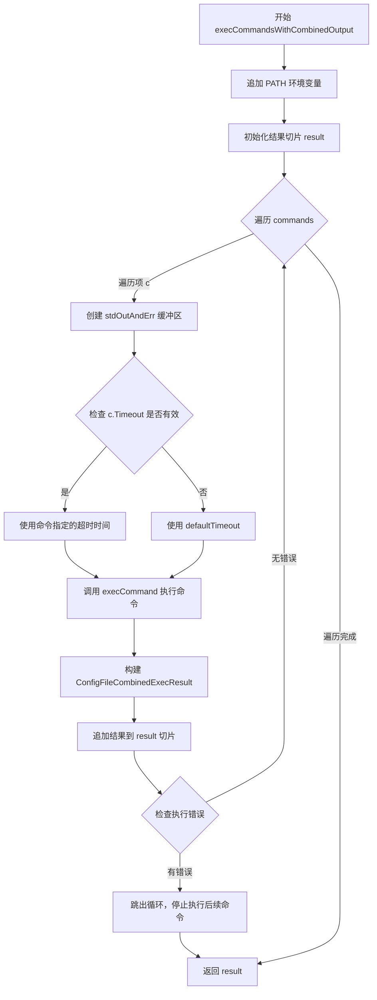

#### 带注释源码

```go
// execCommandsWithCombinedOutput 执行一组命令并合并 stdout 和 stderr 输出
// 参数：
//   - ctx: 上下文，用于控制命令执行的取消和超时
//   - env: 额外的环境变量数组
//   - commands: 待执行的 Command 数组
//   - defaultTimeout: 默认超时时间
//
// 返回值：
//   - []ConfigFileCombinedExecResult: 每个命令的执行结果数组
func (cf *ConfigFile) execCommandsWithCombinedOutput(ctx context.Context, env []string, commands []Command, defaultTimeout time.Duration) []ConfigFileCombinedExecResult {
	// 将系统 PATH 环境变量追加到环境变量列表中，确保命令可以找到可执行文件
	env = append(env, "PATH="+os.Getenv("PATH"))
	
	// 初始化结果切片，用于存储每个命令的执行结果
	result := []ConfigFileCombinedExecResult{}
	
	// 遍历所有待执行的命令
	for _, c := range commands {
		// 创建合并的缓冲区，用于同时收集 stdout 和 stderr
		stdOutAndErr := bytes.NewBuffer(nil)
		
		// 确定命令的超时时间：优先使用命令自身指定的超时，否则使用默认超时
		timeout := defaultTimeout
		if c.Timeout != nil && c.Timeout.Duration >= time.Second {
			timeout = c.Timeout.Duration
		}
		
		// 调用内部方法执行单个命令，stdout 和 stderr 使用同一个缓冲区
		err := cf.execCommand(ctx, env, stdOutAndErr, stdOutAndErr, c.Command, timeout)
		
		// 构建执行结果结构体，包含合并的输出和错误信息
		r := ConfigFileCombinedExecResult{
			Output: stdOutAndErr.Bytes(),
			Error:  err,
		}
		
		// 将当前命令的执行结果添加到结果切片中
		result = append(result, r)
		
		// 如果当前命令执行出错，立即停止执行后续命令
		if err != nil {
			break
		}
	}
	
	// 返回所有命令的执行结果
	return result
}
```


### `ConfigFile.execCommand`

执行单个 shell 命令，设置超时并捕获标准输出和标准错误。

参数：

- `ctx`：`context.Context`，调用方的上下文，用于传递取消信号和超时信息
- `env`：`[]string`，执行命令时使用的环境变量数组
- `stdOut`：`io.Writer`，命令标准输出的目标写入器
- `stdErr`：`io.Writer`，命令标准错误的目标写入器
- `command`：`string`，要执行的 shell 命令字符串
- `timeout`：`time.Duration`，命令执行的最大允许时间

返回值：`error`，执行过程中发生的错误（如命令执行失败、超时或上下文取消），成功时返回 nil

#### 流程图

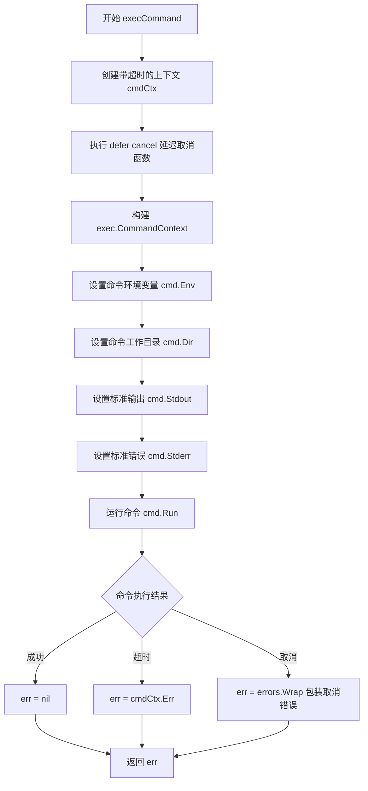

#### 带注释源码

```go
// execCommand 在 ConfigFile 的工作目录下执行单个 shell 命令
// 参数说明：
//   - ctx: 上下文对象，用于控制命令的生命周期（超时/取消）
//   - env: 环境变量列表，将被添加到命令执行环境中
//   - stdOut: 标准输出写入器，用于捕获命令的 stdout
//   - stdErr: 标准错误写入器，用于捕获命令的 stderr
//   - command: 要执行的 shell 命令字符串
//   - timeout: 命令执行的最大超时时间
//
// 返回值：
//   - error: 执行过程中发生的错误，成功时返回 nil
func (cf *ConfigFile) execCommand(ctx context.Context, env []string, stdOut, stdErr io.Writer, command string, timeout time.Duration) error {
	// 创建一个带有超时时间的子上下文，用于控制命令执行时间
	// defer cancel() 确保即使函数提前返回，资源也能被正确清理
	cmdCtx, cancel := context.WithTimeout(ctx, timeout)
	defer cancel()

	// 使用 /bin/sh -c 执行命令，这样可以直接运行 shell 命令字符串
	// 支持管道、重定向等 shell 特性
	cmd := exec.CommandContext(ctx, "/bin/sh", "-c", command)

	// 设置命令执行时的环境变量
	// 如果 env 为 nil，则使用系统默认环境
	cmd.Env = env

	// 设置命令的工作目录
	// cf.workingDir 在 NewConfigFile 时根据 git 路径确定
	cmd.Dir = cf.workingDir

	// 将传入的 writer 绑定到命令的标准输出和标准错误
	cmd.Stdout = stdOut
	cmd.Stderr = stdErr

	// 执行命令并等待其完成
	// 命令的错误信息（返回码非 0）会通过 error 返回
	err := cmd.Run()

	// 检查上下文是否因超时而取消
	if cmdCtx.Err() == context.DeadlineExceeded {
		// 超时情况下，直接返回超时错误
		err = cmdCtx.Err()
	} else if cmdCtx.Err() == context.Canceled {
		// 上下文被取消（非超时原因），使用 errors.Wrap 包装错误信息
		// 提供更清晰的错误描述："context was unexpectedly cancelled"
		err = errors.Wrap(ctx.Err(), fmt.Sprintf("context was unexpectedly cancelled"))
	}

	// 返回执行结果（可能为 nil 表示成功）
	return err
}
```

## 关键组件


### ConfigFile

核心配置结构体，表示`.flux.yaml`文件的结构和运行时状态，支持三种模式：命令更新、补丁更新和文件扫描。

### CommandUpdated

表示通过执行外部命令来生成和更新manifests的配置，包含生成器(Generators)和更新器(Updaters)。

### PatchUpdated

表示通过维护补丁文件来更新manifests的配置，生成器生成基础manifests，然后应用补丁文件进行更新。

### ScanForFiles

表示扫描目录下YAML文件的配置，作为一种重置机制，可以取消上层目录中`.flux.yaml`的影响。

### Command

单个命令及其可选超时时间的定义，用于执行生成器或更新器命令。

### Updater

提供更新镜像引用和策略的手段，包含容器镜像更新命令和策略更新命令。

### ConfigSchema

JSON Schema验证器，用于校验`.flux.yaml`文件的结构和合法性。

### GenerateManifests

根据配置类型生成对应的manifests，对PatchUpdated执行生成+打补丁流程，对CommandUpdated执行生成流程。

### SetWorkloadContainerImage

设置工作负载的容器镜像，根据配置类型调用命令更新器或更新补丁文件。

### UpdateWorkloadPolicies

更新工作负载的策略，根据配置类型调用策略更新器或更新补丁文件，返回是否发生变化。

### getGeneratedAndPatchedManifests

生成manifests并应用补丁的核心逻辑，包含生成器结果缓存机制以提高性能。

### updatePatchFile

计算补丁转换并更新配置文件中指定的补丁文件，实现生成manifests与最终manifests之间的差异计算。

### execGenerators

执行所有生成器命令，按顺序执行并在第一个失败时停止，返回每个命令的执行结果。

### execContainerImageUpdaters

执行容器镜像更新命令，注入FLUX_CONTAINER、FLUX_IMG、FLUX_TAG等环境变量。

### execPolicyUpdaters

执行策略更新命令，注入FLUX_POLICY和FLUX_POLICY_VALUE等环境变量，支持删除策略（空值）。

### execCommand

底层命令执行函数，使用context控制超时，处理超时和取消的异常情况。

### makeEnvFromResourceID

从资源ID构建环境变量，包含工作负载命名空间、种类和名称信息。

## 问题及建议


### 已知问题

-   **错误处理逻辑缺陷**：在`execCommand`函数中，错误处理逻辑冗余且可能产生误覆盖。当context超时或取消时，`cmd.Run()`本身会返回错误，再单独检查`cmdCtx.Err()`并覆盖err是多余且可能丢失原始错误信息的。
-   **缓存缺乏同步机制**：`PatchUpdated.generatorsResultCache`字段作为缓存使用，但在并发场景下缺乏锁保护，可能导致数据竞争。
-   **命令注入风险**：`execCommand`函数使用`/bin/sh -c`执行命令，虽然这是执行用户配置命令的常见做法，但存在潜在的安全风险，应考虑使用更安全的执行方式。
-   **资源泄漏风险**：多处使用`bytes.NewBuffer`创建缓冲区，但没有显式释放或重用，可能导致内存使用效率不高。
-   **缓存无失效机制**：`generatorsResultCache`一旦设置就无法自动失效，如果源文件发生变化，缓存不会更新，可能导致使用过期数据。
-   **代码重复**：`execContainerImageUpdaters`和`execPolicyUpdaters`函数存在大量重复代码，可以提取公共逻辑函数。
-   **过度使用全局变量**：`ConfigSchema`作为包级全局变量，在包初始化时通过panic来处理编译错误，这不是最佳实践，应该在需要时延迟编译。

### 优化建议

-   **重构错误处理**：移除`execCommand`中冗余的context错误检查逻辑，直接返回`cmd.Run()`的错误即可。
-   **添加并发安全**：为`generatorsResultCache`添加互斥锁或使用`sync.Mutex`保护并发访问，或考虑将缓存移出ConfigFile结构体。
-   **重构重复代码**：将`execContainerImageUpdaters`和`execPolicyUpdaters`中的公共逻辑提取到一个函数中，减少代码重复。
-   **改进配置编译策略**：将`mustCompileConfigSchema`改为延迟编译或使用`sync.Once`确保只编译一次，同时将编译错误通过函数返回而非panic处理。
-   **更新废弃API**：将`ioutil.ReadFile`替换为`os.ReadFile`，`ioutil.WriteFile`替换为`os.WriteFile`（Go 1.16+推荐）。
-   **改进字符串构建**：在循环中构建错误消息时，使用`strings.Builder`替代字符串拼接，提高性能。
-   **添加配置验证缓存**：可以考虑缓存编译后的JSON Schema，避免重复解析YAML配置。
-   **补充边界测试**：为超时值为0、配置文件不存在等边界情况添加测试覆盖。


## 其它


### 设计目标与约束

本代码的设计目标是实现一个灵活的Flux CD清单生成和更新框架，支持三种不同的配置模式（commandUpdated、patchUpdated、scanForFiles），通过外部命令或补丁文件的方式动态生成和管理Kubernetes清单文件。核心约束包括：配置文件必须遵循JSON Schema验证规则；每种配置模式下只能选择对应的更新机制；命令执行必须在指定的工作目录中进行；补丁文件路径必须相对于工作目录。

### 错误处理与异常设计

代码采用Go语言的错误返回模式，通过返回error类型来处理可恢复的错误。对于不可恢复的错误（如配置文件解析失败、Schema验证失败），直接返回错误信息并终止操作。关键错误处理包括：ParseConfigFile方法在配置文件解析和验证失败时返回详细错误信息；execCommand方法区分上下文超时和取消状态；getGeneratedAndPatchedManifests方法处理补丁文件不存在的情况（允许缺失但要求基础目录存在）。所有命令执行错误都会捕获stderr和stdout输出，便于调试。

### 数据流与状态机

配置文件的处理流程遵循以下状态转换：初始化阶段（NewConfigFile）加载并解析配置文件→验证阶段（ParseConfigFile）进行Schema验证→生成阶段（GenerateManifests）根据配置类型执行相应逻辑。对于PatchUpdated模式，存在缓存机制（generatorsResultCache）来存储已生成的清单，避免重复执行生成命令。更新操作（SetWorkloadContainerImage、UpdateWorkloadPolicies）会根据配置类型选择命令更新或补丁更新的执行路径，每次更新操作都会重新计算补丁并写入文件。

### 外部依赖与接口契约

代码依赖以下外部包：github.com/ghodss/yaml用于YAML解析；github.com/pkg/errors用于错误包装；jsonschema用于配置文件Schema验证；k8s.io/apimachinery用于时间类型处理；github.com/fluxcd/flux/pkg/image和resource用于资源和镜像处理。核心接口包括：Manifests接口（未在此文件中定义但被引用）需要提供AppendManifestToBuffer、ApplyManifestPatch、CreateManifestPatch、SetWorkloadContainerImage、UpdateWorkloadPolicies等方法。

### 配置文件格式与示例

配置文件支持三种格式，对应ConfigFile的三种模式。commandUpdated模式示例：version: 1, commandUpdated: {generators: [{command: "kubectl get all -o yaml"}], updaters: [{containerImage: {command: "update-image.sh"}, policy: {command: "update-policy.sh"}}]}。patchUpdated模式示例：version: 1, patchUpdated: {generators: [{command: "generate.sh"}], patchFile: "patch.yaml"}。scanForFiles模式示例：version: 1, scanForFiles: {}。

### 性能考虑

代码在性能方面进行了以下优化：PatchUpdated模式下使用generatorsResultCache缓存生成结果，避免重复执行生成命令；命令执行使用上下文超时机制防止长时间挂起；使用bytes.Buffer进行流式处理减少内存分配。潜在性能瓶颈包括：每次更新操作都重新执行生成器和更新器命令；补丁计算需要完整读取和比较清单文件。

### 安全考虑

命令执行安全性：使用/bin/sh -c执行shell命令，存在命令注入风险，依赖于配置文件的可信性；cmd.Env直接使用传入的环境变量数组，需要确保调用方传入的环境变量经过安全过滤。工作目录限制：所有命令必须在配置的workingDir内执行，防止目录遍历攻击。文件权限：使用0600权限写入补丁文件，确保敏感信息保护。

### 测试策略

代码应包含以下测试：单元测试验证ParseConfigFile对各种有效和无效配置的处理；集成测试验证命令执行和文件操作；边界测试验证超时处理、文件不存在等场景；Mock测试使用interface mock Manifests接口进行隔离测试。

### 并发与线程安全

ConfigFile实例本身不包含并发访问控制，需要调用方保证同一实例的串行访问。generatorsResultCache字段在并发场景下可能存在竞态条件，建议使用sync.Mutex保护或重构为无状态设计。命令执行使用context.Context支持取消和超时，适合在协程中调用。

### 资源管理

文件资源：使用ioutil.ReadFile和ioutil.WriteFile操作配置文件和补丁文件，需要确保文件描述符正确关闭（Go的defer自动处理）。命令资源：exec.CommandContext创建的进程在命令执行完毕后自动清理。内存资源：bytes.Buffer使用后会被垃圾回收回收，大清单文件可能导致内存峰值。

### 版本兼容性

ConfigSchema使用JSON Schema draft-07版本；依赖的flux包版本需要与项目其他部分保持一致；生成的清单格式依赖于Manifests接口实现。配置文件的version字段目前固定为1，版本升级需要考虑向后兼容性。

### 扩展点与插件机制

代码支持以下扩展点：生成器（Generators）可以扩展任意命令行工具输出YAML；更新器（Updaters）可以添加新的容器镜像和策略更新命令；通过设置ScanForFiles可以禁用配置文件功能，恢复默认行为。扩展通过在配置文件中声明命令实现，无需修改代码。

### 监控与可观测性

代码目前没有内置监控和追踪功能。建议添加：命令执行耗时指标；配置解析和验证成功率指标；生成清单大小的指标；错误日志应包含足够的上下文信息（如配置路径、工作目录、失败的命令）。可通过在execCommand和execGenerators等关键方法中添加指标收集实现。


    