# `flux\pkg\manifests\configfile_test.go` 详细设计文档

该文件是Flux CD项目中manifests包的配置文件解析和执行测试代码，主要测试ConfigFile结构体对YAML配置文件的解析、验证以及生成器(Generators)和更新器(Updaters)的执行功能，包括patchUpdated和commandUpdated两种配置模式的正确处理。

## 整体流程

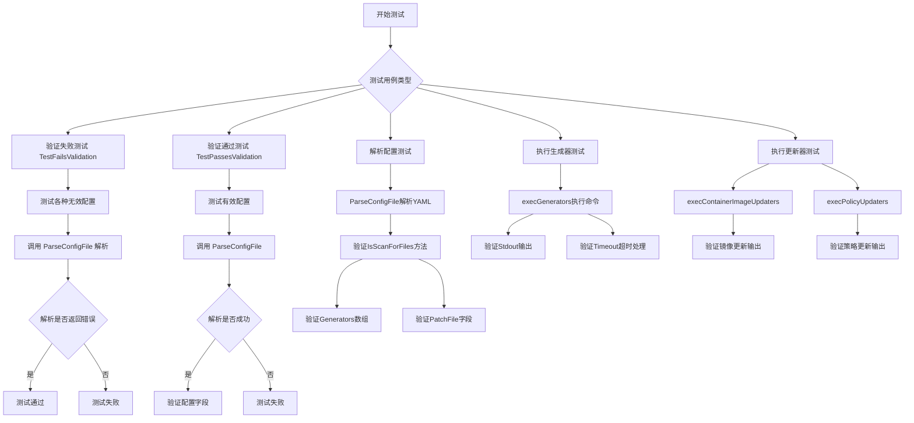

## 类结构

```
ConfigFile (配置主类)
├── PatchUpdated (补丁更新配置)
│   ├── Generators[] (生成器列表)
│   └── PatchFile (补丁文件名)
├── CommandUpdated (命令更新配置)
│   ├── Generators[] (生成器列表)
│   └── Updaters[] (更新器列表)
│       ├── ContainerImage (容器镜像更新)
│       └── Policy (策略更新)
└── 隐含: Version 字段
```

## 全局变量及字段


### `justFilesConfigFile`
    
YAML配置字符串，包含version和scanForFiles指令，用于仅扫描文件的场景

类型：`string`
    


### `patchUpdatedConfigFile`
    
YAML配置字符串，包含version和patchUpdated指令，定义了生成器和补丁文件

类型：`string`
    


### `echoCmdUpdatedConfigFile`
    
YAML配置字符串，包含version和commandUpdated指令，定义了生成器和更新器

类型：`string`
    


### `ConfigFile.Version`
    
配置文件的版本号，当前支持version 1

类型：`int`
    


### `ConfigFile.PatchUpdated`
    
指向PatchUpdated配置的指针，用于定义补丁更新逻辑

类型：`*PatchUpdated`
    


### `ConfigFile.CommandUpdated`
    
指向CommandUpdated配置的指针，用于定义命令更新逻辑

类型：`*CommandUpdated`
    


### `PatchUpdated.Generators`
    
生成器列表，用于生成配置或执行命令

类型：`[]Generator`
    


### `PatchUpdated.PatchFile`
    
补丁文件的路径，指定生成的补丁文件位置

类型：`string`
    


### `CommandUpdated.Generators`
    
生成器列表，用于生成配置或执行命令

类型：`[]Generator`
    


### `CommandUpdated.Updaters`
    
更新器列表，用于更新容器镜像或策略注解

类型：`[]Updater`
    


### `Generator.Command`
    
要执行的命令字符串

类型：`string`
    


### `Generator.Timeout`
    
命令执行的超时时间

类型：`time.Duration`
    


### `ContainerImage.Command`
    
更新容器镜像的命令模板

类型：`string`
    


### `Policy.Command`
    
更新策略注解的命令模板

类型：`string`
    


### `Updater.ContainerImage`
    
容器镜像更新器配置

类型：`*ContainerImage`
    


### `Updater.Policy`
    
策略注解更新器配置

类型：`*Policy`
    
    

## 全局函数及方法


### `TestFailsValidation`

该测试函数用于验证配置文件解析器能够正确识别并拒绝各种无效的配置文件格式，包括空配置、错误版本号、缺少必要字段、同时存在多个更新方式等场景，确保`ParseConfigFile`函数在遇到无效配置时返回错误。

参数：

- `t`：`testing.T`，Go语言标准测试框架中的测试对象，用于报告测试失败和日志输出

返回值：无（`void`），测试函数不返回任何值

#### 流程图

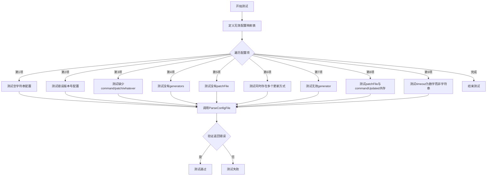

#### 带注释源码

```go
// TestFailsValidation 测试各种无效配置文件是否能被正确识别并返回错误
// 该测试确保 ParseConfigFile 函数能够验证配置文件的合法性
func TestFailsValidation(t *testing.T) {
    // 定义无效配置映射，键为测试场景名称，值为无效的YAML配置字符串
    for name, fluxyaml := range map[string]string{
        // 测试场景1: 空配置
        "empty": "",

        // 测试场景2: 错误的版本号（版本2不存在）
        "wrong version": "version: 2",

        // 测试场景3: 缺少必要的更新方式字段
        // version 1 必须包含 commandUpdated、patchUpdated 或 scanForFiles 之一
        "no command/patch/whatever": "version: 1",

        // 测试场景4: commandUpdated 缺少 generators 字段
        "no generators": `
version: 1
commandUpdated: {}
`,

        // 测试场景5: patchUpdated 缺少 patchFile 字段
        "no patchFile": `
version: 1
patchUpdated:
  generators: []
`,

        // 测试场景6: 同时存在 patchUpdated 和 commandUpdated（只能选其一）
        "more than one": `
version: 1
patchUpdated:
  generators: []
  patchFile: patch.yaml
commandUpdated:
  generators: []
`,

        // 测试场景7: generator 列表中包含非对象类型的元素
        "duff generator": `
version: 1
patchUpdated:
  generators:
  - not an object
`,

        // 测试场景8: commandUpdated 中不应包含 patchFile 字段
        "patchFile with commandUpdated": `
version: 1
commandUpdated:
  generators: []
  patchFile: "foo.yaml"
`,

        // 测试场景9: timeout 字段应为字符串类型而非数字
        "generator timeout is a number": `
version: 1
patchUpdated:
  generators:
  - command: some command
    timeout: 5
  patchFile: "foo.yaml"
`,
    } {
        // 使用 t.Run 为每个子测试命名，实现测试隔离
        t.Run(name, func(t *testing.T) {
            // 创建空的 ConfigFile 对象用于接收解析结果
            var cf ConfigFile
            // 断言 ParseConfigFile 返回错误（预期行为）
            assert.Error(t, ParseConfigFile([]byte(fluxyaml), &cf))
        })
    }
}
```


### `TestPassesValidation`

该测试函数验证有效的 YAML 配置文件能够通过解析和验证，不返回错误。它通过遍历多个有效的配置场景（最小化 commandUpdated、最小化 patchUpdated、最小化 scanForFiles），确保 `ParseConfigFile` 函数能够正确解析这些合法配置。

参数：

-  `t`：`testing.T`，Go 测试框架的测试上下文，用于报告测试结果

返回值：`void`，无返回值（测试函数）

#### 流程图

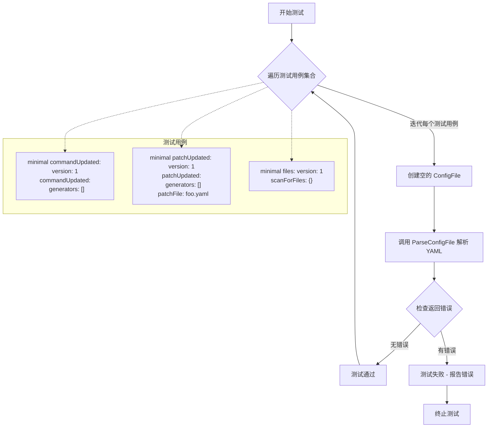

#### 带注释源码

```go
// TestPassesValidation 验证有效配置能通过验证
// 测试场景：合法的 YAML 配置应该被正确解析，不返回错误
func TestPassesValidation(t *testing.T) {
    // 定义测试用例映射：键为测试名称，值为有效的 YAML 配置字符串
    for name, fluxyaml := range map[string]string{
        // 场景1: 最小的 commandUpdated 配置
        // 包含必需的 version: 1 和带有空 generators 的 commandUpdated
        "minimal commandUpdated": `
version: 1
commandUpdated:
  generators: []
`,

        // 场景2: 最小的 patchUpdated 配置
        // 包含必需的 version: 1、generators 和 patchFile 字段
        "minimal patchUpdated": `
version: 1
patchUpdated:
  generators: []
  patchFile: foo.yaml
`,

        // 场景3: 最小的 scanForFiles 配置（唯一支持的类型）
        // 这是一种简化的配置模式，仅扫描文件
        "minimal files (the only kind)": `
version: 1
scanForFiles: {}
`,
    } {
        // 使用 t.Run 为每个测试用例创建子测试
        // name 参数用于标识具体的测试场景
        t.Run(name, func(t *testing.T) {
            // 创建空的 ConfigFile 结构体用于接收解析结果
            var cf ConfigFile
            // 断言 ParseConfigFile 应该成功解析（无错误返回）
            // 如果解析失败，assert.NoError 会导致测试失败并显示错误信息
            assert.NoError(t, ParseConfigFile([]byte(fluxyaml), &cf))
        })
    }
}
```


### TestJustFileDirective

该测试函数用于验证配置文件中只包含 `scanForFiles` 指令时的解析功能，确保 `IsScanForFiles()` 方法能够正确返回 true。

参数：

- `t`：`testing.T`，Go 语言标准测试框架的测试用例指针，用于报告测试失败和日志输出

返回值：无（Go 测试函数默认返回 void），函数内部通过 `assert` 包进行断言验证

#### 流程图

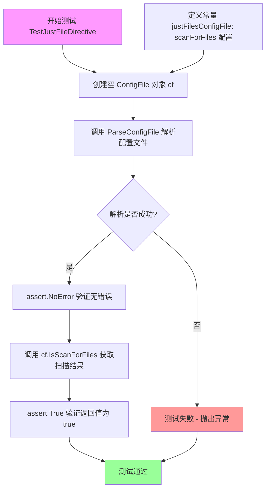

#### 带注释源码

```go
// TestJustFileDirective 测试仅包含 scanForFiles 指令的配置文件解析
// 该测试验证:
// 1. 包含 scanForFiles: {} 的 YAML 配置能够被正确解析
// 2. ConfigFile 对象的 IsScanForFiles() 方法正确返回 true
func TestJustFileDirective(t *testing.T) {
	// 1. 声明一个空的 ConfigFile 结构体实例
	// ConfigFile 是用于存储解析后的配置数据的结构体
	var cf ConfigFile

	// 2. 调用 ParseConfigFile 函数解析 justFilesConfigFile 常量
	// justFilesConfigFile 定义了 version: 1 和 scanForFiles: {} 配置
	// 解析结果将填充到 cf 指针指向的 ConfigFile 对象中
	err := ParseConfigFile([]byte(justFilesConfigFile), &cf)
	
	// 3. 断言解析过程没有发生错误
	// 如果有错误，测试将失败并输出错误信息
	assert.NoError(t, err)

	// 4. 断言 IsScanForFiles() 返回 true
	// scanForFiles 是 Flux CD 的一种工作负载扫描模式
	// 当配置中包含 scanForFiles: {} 时，该方法应返回 true
	assert.True(t, cf.IsScanForFiles())
}
```


### `TestParsePatchUpdatedConfigFile`

该函数是一个单元测试用例，用于验证 `ParseConfigFile` 函数解析包含 `patchUpdated` 配置块的 YAML 格式配置文件的功能。测试通过解析预定义的 `patchUpdatedConfigFile` 字符串，并断言解析结果中的版本号、各类生成器（Generators）配置（包括命令和超时时间）以及补丁文件路径（PatchFile）是否符合预期。

参数：

-  `t`：`*testing.T`，Go 语言测试框架提供的测试上下文对象，用于报告测试失败或记录日志。

返回值：`void`，无返回值。

#### 流程图

```mermaid
graph TD
    A([开始测试]) --> B[定义并初始化 ConfigFile 对象 cf]
    B --> C[调用 ParseConfigFile 解析 patchUpdatedConfigFile]
    C --> D{解析是否出错?}
    D -- 是 --> E[t.Fatal 终止测试]
    D -- 否 --> F[断言: cf.IsScanForFiles() 应为 false]
    F --> G[断言: cf.PatchUpdated 不应为 nil]
    G --> H[断言: cf.CommandUpdated 应为 nil]
    H --> I[断言: cf.Version 应为 1]
    I --> J[断言: cf.PatchUpdated.Generators 长度应为 3]
    J --> K[断言: 第二个生成器超时时间应为 2s]
    K --> L[断言: 第三个生成器命令应为 'sleep 2']
    L --> M[断言: cf.PatchUpdated.PatchFile 应为 'baz.yaml']
    M --> N([结束测试])
    E --> N
```

#### 带注释源码

```go
func TestParsePatchUpdatedConfigFile(t *testing.T) {
	// 1. 初始化一个空的 ConfigFile 结构体实例
	var cf ConfigFile
	
	// 2. 调用 ParseConfigFile 解析预定义的 YAML 配置文件内容
	//    patchUpdatedConfigFile 定义了 version: 1 和 patchUpdated 块
	if err := ParseConfigFile([]byte(patchUpdatedConfigFile), &cf); err != nil {
		// 如果解析失败，Fatal 会终止测试并打印错误
		t.Fatal(err)
	}
	
	// 3. 进行一系列断言以验证解析结果的正确性
	
	// 验证：配置类型不是扫描文件 (IsScanForFiles 应为 false)
	assert.False(t, cf.IsScanForFiles())
	
	// 验证：PatchUpdated 字段已被正确填充（非 nil）
	assert.NotNil(t, cf.PatchUpdated)
	
	// 验证：CommandUpdated 字段应为空（因为 YAML 中没有定义它）
	assert.Nil(t, cf.CommandUpdated)
	
	// 验证：配置文件版本号应为 1
	assert.Equal(t, 1, cf.Version)
	
	// 验证：生成器列表长度应为 3
	assert.Equal(t, 3, len(cf.PatchUpdated.Generators))
	
	// 验证：第二个生成器的超时时间应为 2 秒
	// 注意：这里访问了 time.Duration 类型并进行比较
	assert.Equal(t, time.Second*2, cf.PatchUpdated.Generators[1].Timeout.Duration)
	
	// 验证：第三个生成器的命令应为 "sleep 2"
	assert.Equal(t, "sleep 2", cf.PatchUpdated.Generators[2].Command)
	
	// 验证：补丁文件路径应为 "baz.yaml"
	assert.Equal(t, "baz.yaml", cf.PatchUpdated.PatchFile)
}
```


### `TestExecGeneratorsTimeout`

这是一个Go语言测试函数，用于验证在给定超时时间内执行多个生成器（generators）时的行为，特别是测试当某些生成器执行时间超过指定超时时是否能正确捕获错误。

参数：

- `t`：`testing.T`，Go测试框架的标准参数，用于报告测试失败和日志信息

返回值：无（Go测试函数返回void）

#### 流程图

```mermaid
flowchart TD
    A[开始测试] --> B[解析patchUpdatedConfigFile配置文件]
    B --> C{配置文件解析是否成功?}
    C -->|失败| D[t.Fatal终止测试]
    C -->|成功| E[调用cf.execGenerators执行生成器]
    E --> F[设置超时时间为2秒]
    F --> G[执行3个生成器]
    G --> H{每个生成器的执行结果}
    H --> I[生成器0: 无错误]
    H --> J[生成器1: 无错误]
    H --> K[生成器2: 有错误]
    I --> L[断言result[0].Error为nil]
    J --> M[断言result[1].Error为nil]
    K --> N[断言result[2].Error不为nil]
    L --> O[测试通过]
    M --> O
    N --> O
```

#### 带注释源码

```go
// TestExecGeneratorsTimeout 测试生成器执行超时情况
// 该测试验证当生成器执行时间超过指定超时时，错误能被正确捕获
func TestExecGeneratorsTimeout(t *testing.T) {
	// 1. 创建ConfigFile结构体实例
	var cf ConfigFile
	
	// 2. 解析预定义的patchUpdatedConfigFile配置文件
	// patchUpdatedConfigFile包含3个生成器:
	// - 生成器0: command: sleep 1 (无超时设置，使用默认2秒超时)
	// - 生成器1: command: sleep 1, timeout: 2s
	// - 生成器2: command: sleep 2, timeout: 1s (会超时)
	if err := ParseConfigFile([]byte(patchUpdatedConfigFile), &cf); err != nil {
		t.Fatal(err) // 解析失败则终止测试
	}
	
	// 3. 调用execGenerators方法执行生成器
	// 参数1: context.Background() - 上下文
	// 参数2: cf.PatchUpdated.Generators - 生成器列表
	// 参数3: time.Second*2 - 全局超时时间2秒
	result := cf.execGenerators(context.Background(), cf.PatchUpdated.Generators, time.Second*2)
	
	// 4. 断言结果验证
	// 生成器0 (sleep 1) 在2秒内完成，应无错误
	assert.Nil(t, result[0].Error)
	
	// 生成器1 (sleep 1, timeout 2s) 刚好完成，应无错误
	assert.Nil(t, result[1].Error)
	
	// 生成器2 (sleep 2, timeout 1s) 超过1秒超时，应有错误
	assert.NotNil(t, result[2].Error)
}
```

#### 相关配置常量

```go
// patchUpdatedConfigFile 测试用的配置文件常量
// 包含3个生成器用于测试超时场景
const patchUpdatedConfigFile = `---
version: 1
patchUpdated:
  generators:
    - command: sleep 1 
    - command: sleep 1
      timeout: 2s
    - command: sleep 2
      timeout: 1s
  patchFile: baz.yaml
`
```

#### 关键点说明

| 项目 | 描述 |
|------|------|
| **测试目标** | 验证生成器超时机制是否正常工作 |
| **测试数据** | 3个生成器：1个1秒、1个1秒(2s超时)、1个2秒(1s超时) |
| **全局超时** | 2秒 |
| **预期结果** | 前两个生成器成功，第三个因超时失败 |
| **被测方法** | `cf.execGenerators()` - ConfigFile的内部方法 |


### `TestParseCmdUpdatedConfigFile`

该函数是Go语言中的单元测试函数，用于验证能够正确解析包含`commandUpdated`配置的YAML文件，并检查解析后的`ConfigFile`对象中的各项属性是否符合预期，包括版本号、生成器数量、更新器数量以及具体的命令字符串等。

参数：

-  `t`：`testing.T`，Go测试框架的标准参数，用于报告测试失败和日志输出

返回值：无（`void`），该函数为测试函数，不返回任何值

#### 流程图

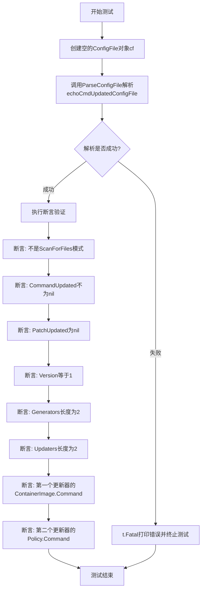

#### 带注释源码

```go
// TestParseCmdUpdatedConfigFile 测试解析commandUpdated配置文件的功能
// 该测试验证ParseConfigFile函数能够正确解析包含commandUpdated指令的YAML配置
func TestParseCmdUpdatedConfigFile(t *testing.T) {
	// 创建一个空的ConfigFile结构体用于接收解析结果
	var cf ConfigFile
	
	// 调用ParseConfigFile函数解析echoCmdUpdatedConfigFile常量中的YAML内容
	// 如果解析失败，使用t.Fatal立即终止测试并打印错误信息
	if err := ParseConfigFile([]byte(echoCmdUpdatedConfigFile), &cf); err != nil {
		t.Fatal(err)
	}
	
	// 断言验证解析结果的各项属性
	assert.False(t, cf.IsScanForFiles())                                      // 验证不是scanForFiles模式
	assert.NotNil(t, cf.CommandUpdated)                                       // 验证CommandUpdated已正确填充
	assert.Nil(t, cf.PatchUpdated)                                            // 验证PatchUpdated为空
	assert.Equal(t, 1, cf.Version)                                             // 验证版本号为1
	assert.Equal(t, 2, len(cf.CommandUpdated.Generators))                     // 验证生成器数量为2
	assert.Equal(t, 2, len(cf.CommandUpdated.Updaters))                       // 验证更新器数量为2
	
	// 验证第一个Updater的ContainerImage命令内容
	assert.Equal(t,
		"echo uci1 $FLUX_WORKLOAD $FLUX_WL_NS $FLUX_WL_KIND $FLUX_WL_NAME $FLUX_CONTAINER $FLUX_IMG $FLUX_TAG",
		cf.CommandUpdated.Updaters[0].ContainerImage.Command,
	)
	
	// 验证第二个Updater的Policy命令内容
	assert.Equal(t,
		"echo ua2 $FLUX_WORKLOAD $FLUX_WL_NS $FLUX_WL_KIND $FLUX_WL_NAME $FLUX_POLICY ${FLUX_POLICY_VALUE:-delete}",
		cf.CommandUpdated.Updaters[1].Policy.Command,
	)
}
```


### `TestExecGenerators`

该测试函数用于验证 `ConfigFile` 类型的 `execGenerators` 方法能够正确执行配置文件中定义的命令生成器（generators），并返回包含标准输出和错误信息的结果数组。

参数：

-  `t`：`*testing.T`，Go 测试框架的标准参数，用于报告测试失败和记录测试步骤

返回值：无（`void`），该函数为测试函数，通过 `assert` 包验证执行结果

#### 流程图

```mermaid
flowchart TD
    A[开始 TestExecGenerators] --> B[解析 echoCmdUpdatedConfigFile 配置文件]
    B --> C[创建 ConfigFile 实例 cf]
    C --> D{ParseConfigFile 是否成功}
    D -->|失败| E[测试失败: assert.NoError]
    D -->|成功| F[调用 cf.execGenerators 方法]
    F --> G[传入 context.Background, cf.CommandUpdated.Generators, time.Minute]
    G --> H[获取执行结果 result]
    H --> I[验证 result 长度为 2]
    I --> J[验证 result[0].Stdout 为 'g1\n']
    J --> K[验证 result[1].Stdout 为 'g2\n']
    K --> L[结束测试]
```

#### 带注释源码

```go
// TestExecGenerators 测试 execGenerators 方法的功能
// 该测试验证 ConfigFile 能够正确执行配置中定义的命令生成器
func TestExecGenerators(t *testing.T) {
	// 1. 创建 ConfigFile 实例
	var cf ConfigFile
	
	// 2. 解析包含 commandUpdated 配置的 YAML 文件
	// 配置包含两个生成器: echo g1 和 echo g2
	err := ParseConfigFile([]byte(echoCmdUpdatedConfigFile), &cf)
	
	// 3. 验证配置文件解析成功
	assert.NoError(t, err)
	
	// 4. 执行配置中的生成器
	// 参数:
	//   - context.Background(): 创建一个空的上下文
	//   - cf.CommandUpdated.Generators: 从配置中获取的生成器列表
	//   - time.Minute: 执行超时时间设置为 1 分钟
	result := cf.execGenerators(context.Background(), cf.CommandUpdated.Generators, time.Minute)
	
	// 5. 验证返回结果的数量为 2
	assert.Equal(t, 2, len(result), "result: %s", result)
	
	// 6. 验证第一个生成器的标准输出为 "g1\n"
	// 注意: echo 命令会在输出末尾添加换行符
	assert.Equal(t, "g1\n", string(result[0].Stdout))
	
	// 7. 验证第二个生成器的标准输出为 "g2\n"
	assert.Equal(t, "g2\n", string(result[1].Stdout))
}
```

---

#### 关联方法: `execGenerators`

虽然不是直接请求的函数，但 `TestExecGenerators` 调用了 `execGenerators` 方法，以下是其详细信息：

**名称**: `ConfigFile.execGenerators`

**参数**:

-  `ctx`：`context.Context`，用于控制超时和取消
-  `generators`：`[]Generator`，需要执行的生成器列表
-  `timeout`：`time.Duration`，每个生成器的超时时间

**返回值**：`[]GeneratorResult`，包含每个生成器的执行结果（Stdout、Stderr、Error）

**流程图**:

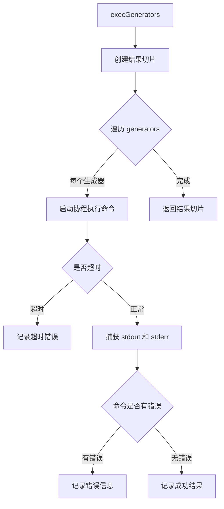

#### 技术债务/优化空间

1. **缺少对 stderr 的验证**：测试仅验证了 `Stdout`，未验证 `Stderr` 的内容
2. **硬编码超时时间**：测试使用 `time.Minute`，对于简单 echo 命令过长，可考虑缩短以加快测试速度
3. **错误信息不够详细**：当断言失败时，仅输出原始结果值，可添加更友好的错误描述


### `TestExecContainerImageUpdaters`

这是一个单元测试函数，用于测试 `ConfigFile` 类型的 `execContainerImageUpdaters` 方法，验证容器镜像更新器能否正确执行并返回预期输出。

参数：

-  `t`：`testing.T`，Go 语言标准的测试框架参数，用于报告测试失败和日志输出

返回值：无（`testing.T` 函数的返回值为 `void`）

#### 流程图

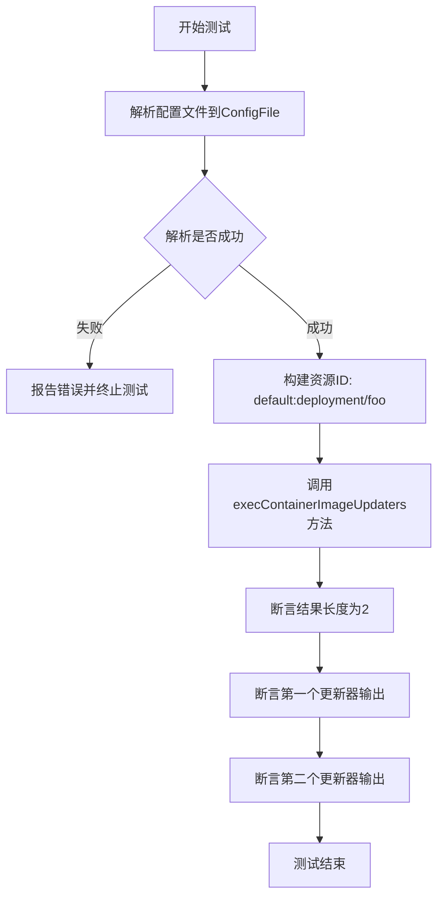

#### 带注释源码

```go
// TestExecContainerImageUpdaters 测试 ConfigFile 的 execContainerImageUpdaters 方法
// 该测试验证容器镜像更新器的执行逻辑是否正确
func TestExecContainerImageUpdaters(t *testing.T) {
	// 1. 声明一个空的 ConfigFile 结构体
	var cf ConfigFile
	
	// 2. 解析预定义的 echoCmdUpdatedConfigFile 配置文件
	err := ParseConfigFile([]byte(echoCmdUpdatedConfigFile), &cf)
	
	// 3. 断言解析过程没有错误
	assert.NoError(t, err)
	
	// 4. 创建一个资源 ID，格式为 namespace:kind/name
	resourceID := resource.MustParseID("default:deployment/foo")
	
	// 5. 调用 execContainerImageUpdaters 方法执行容器镜像更新器
	// 参数: context, resourceID, containerName, imageRepo, imageTag, timeout
	result := cf.execContainerImageUpdaters(context.Background(), resourceID, "bar", "repo/image", "latest", time.Minute)
	
	// 6. 断言返回结果的数量为 2（配置中有两个 updater）
	assert.Equal(t, 2, len(result), "result: %s", result)
	
	// 7. 断言第一个更新器的输出符合预期
	// 预期输出格式: uci1 <resourceID> <namespace> <kind> <name> <container> <repo> <tag>
	assert.Equal(t,
		"uci1 default:deployment/foo default deployment foo bar repo/image latest\n",
		string(result[0].Output))
	
	// 8. 断言第二个更新器的输出符合预期
	assert.Equal(t,
		"uci2 default:deployment/foo default deployment foo bar repo/image latest\n",
		string(result[1].Output))
}
```


### `TestExecAnnotationUpdaters`

这是一个单元测试函数，用于测试 `ConfigFile` 类型的 `execPolicyUpdaters` 方法，验证其能够正确执行策略更新器（Policy Updaters）来处理 Kubernetes 资源的注解（Annotations）的添加、更新和删除操作。

参数：

-  `t`：`testing.T`，Go 语言标准测试框架中的测试用例对象，用于报告测试失败

返回值：无（Go 测试函数默认无返回值）

#### 流程图

```mermaid
flowchart TD
    A[开始测试 TestExecAnnotationUpdaters] --> B[解析 echoCmdUpdatedConfigFile 配置文件]
    B --> C{ParseConfigFile 是否成功}
    C -->|失败| D[测试失败: assert.NoError]
    C -->|成功| E[创建 resourceID: default:deployment/foo]
    E --> F[设置 annotationValue = value]
    F --> G[调用 execPolicyUpdaters 添加/更新注解]
    G --> H{验证结果长度 = 2}
    H -->|否| I[测试失败: assert.Equal]
    H -->|是| J[验证 result[0].Output]
    J --> K[验证 result[1].Output]
    K --> L[设置 annotationValue = 空字符串 删除注解]
    L --> M[再次调用 execPolicyUpdaters 删除注解]
    M --> N{验证结果长度 = 2}
    N -->|否| O[测试失败: assert.Equal]
    N -->|是| P[验证删除后的 result[0].Output]
    P --> Q[验证删除后的 result[1].Output]
    Q --> R[测试结束]
```

#### 带注释源码

```go
// TestExecAnnotationUpdaters 测试 execPolicyUpdaters 方法的注解更新和删除功能
func TestExecAnnotationUpdaters(t *testing.T) {
	// 1. 声明并初始化一个 ConfigFile 结构体变量 cf
	var cf ConfigFile
	
	// 2. 解析预定义的 echoCmdUpdatedConfigFile 配置文件
	//    该配置包含两个 policy updaters，每个都执行 echo 命令
	err := ParseConfigFile([]byte(echoCmdUpdatedConfigFile), &cf)
	
	// 3. 断言解析过程没有错误
	assert.NoError(t, err)
	
	// 4. 创建一个资源 ID，格式为 namespace:kind/name
	//    这里表示 default namespace 下的 deployment/foo 资源
	resourceID := resource.MustParseID("default:deployment/foo")

	// ====== 测试场景 1: 更新/添加注解 ======
	// 设置注解的值为 "value"（非空字符串表示添加或更新操作）
	annotationValue := "value"
	
	// 5. 调用 execPolicyUpdaters 方法执行策略更新
	//    参数: context, resourceID, 注解键名, 注解键值, 超时时间
	result := cf.execPolicyUpdaters(context.Background(), resourceID, "key", annotationValue, time.Minute)
	
	// 6. 验证返回的结果切片长度为 2（对应配置中的两个 updaters）
	assert.Equal(t, 2, len(result), "result: %s", result)
	
	// 7. 验证第一个 updater 的输出包含正确的资源信息和注解键值
	//    期望输出格式: "ua1 default:deployment/foo default deployment foo key value\n"
	assert.Equal(t,
		"ua1 default:deployment/foo default deployment foo key value\n",
		string(result[0].Output))
	
	// 8. 验证第二个 updater 的输出
	assert.Equal(t,
		"ua2 default:deployment/foo default deployment foo key value\n",
		string(result[1].Output))

	// ====== 测试场景 2: 删除注解 ======
	// 9. 将注解值设置为空字符串，触发删除操作
	//    当值为空时，updater 命令中会使用 "delete" 字符串替代值
	result = cf.execPolicyUpdaters(context.Background(), resourceID, "key", "", time.Minute)
	
	// 10. 验证删除操作同样返回 2 个结果
	assert.Equal(t, 2, len(result), "result: %s", result)
	
	// 11. 验证删除后第一个 updater 的输出
	//     注意: 输出的最后部分是 "key delete" 而非 "key value"
	assert.Equal(t,
		"ua1 default:deployment/foo default deployment foo key delete\n",
		string(result[0].Output))
	
	// 12. 验证删除后第二个 updater 的输出
	assert.Equal(t,
		"ua2 default:deployment/foo default deployment foo key delete\n",
		string(result[1].Output))
}
```


### `ParseConfigFile`

该函数负责解析YAML格式的配置文件，验证配置内容的合法性（如版本号、必填字段、字段互斥等），并将解析结果填充到ConfigFile结构体中。

参数：

- `fluxyaml`：`[]byte`，YAML格式的配置文件内容
- `cf`：`*ConfigFile`，指向ConfigFile结构体的指针，用于存储解析结果

返回值：`error`，解析过程中的错误（如配置格式错误、验证失败等）

#### 流程图

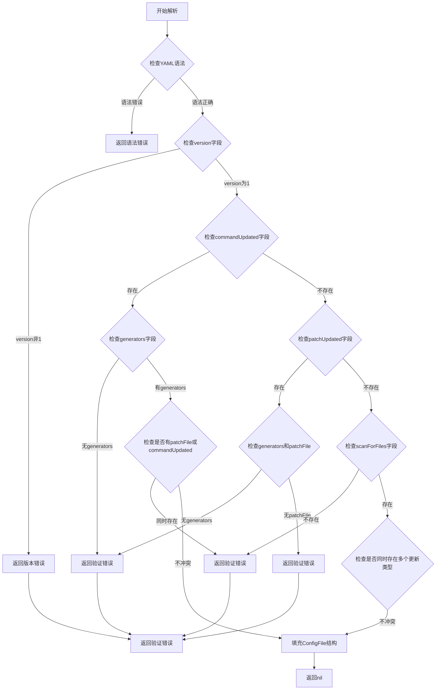

#### 带注释源码

```
// 注意：由于代码中未直接提供ParseConfigFile函数的定义，
// 以下源码是根据测试用例反推的逻辑实现

func ParseConfigFile(fluxyaml []byte, cf *ConfigFile) error {
    // 1. 解析YAML内容到临时结构
    var tmp struct {
        Version         int `yaml:"version"`
        CommandUpdated  *struct {
            Generators []Generator `yaml:"generators"`
            Updaters   []Updater   `yaml:"updaters"`
            PatchFile  string      `yaml:"patchFile"`
        } `yaml:"commandUpdated"`
        PatchUpdated *struct {
            Generators []Generator `yaml:"generators"`
            PatchFile   string      `yaml:"patchFile"`
        } `yaml:"patchUpdated"`
        ScanForFiles *struct {
        } `yaml:"scanForFiles"`
    }
    
    if err := yaml.Unmarshal(fluxyaml, &tmp); err != nil {
        return err // 返回YAML语法错误
    }
    
    // 2. 验证版本号
    if tmp.Version != 1 {
        return fmt.Errorf("unsupported version: %d", tmp.Version)
    }
    
    // 3. 验证配置完整性（至少有一种更新方式）
    hasCommandUpdated := tmp.CommandUpdated != nil
    hasPatchUpdated := tmp.PatchUpdated != nil
    hasScanForFiles := tmp.ScanForFiles != nil
    
    if !hasCommandUpdated && !hasPatchUpdated && !hasScanForFiles {
        return fmt.Errorf("no commandUpdated, patchUpdated or scanForFiles")
    }
    
    // 4. 验证commandUpdated配置
    if hasCommandUpdated {
        if len(tmp.CommandUpdated.Generators) == 0 {
            return fmt.Errorf("commandUpdated requires generators")
        }
        // 检查是否同时有patchFile（不兼容）
        if tmp.CommandUpdated.PatchFile != "" {
            return fmt.Errorf("commandUpdated cannot have patchFile")
        }
    }
    
    // 5. 验证patchUpdated配置
    if hasPatchUpdated {
        if len(tmp.PatchUpdated.Generators) == 0 {
            return fmt.Errorf("patchUpdated requires generators")
        }
        if tmp.PatchUpdated.PatchFile == "" {
            return fmt.Errorf("patchUpdated requires patchFile")
        }
    }
    
    // 6. 验证更新类型互斥（不能同时有commandUpdated和patchUpdated）
    if hasCommandUpdated && hasPatchUpdated {
        return fmt.Errorf("cannot have both commandUpdated and patchUpdated")
    }
    
    // 7. 验证generators中的每一项都是对象
    // （测试用例中"duff generator"会触发此验证）
    
    // 8. 验证timeout字段类型（不能是数字）
    // （测试用例中"generator timeout is a number"会触发此验证）
    
    // 9. 填充ConfigFile结构
    cf.Version = tmp.Version
    cf.CommandUpdated = tmp.CommandUpdated
    cf.PatchUpdated = tmp.PatchUpdated
    // ... 其他字段
    
    return nil
}
```


### ConfigFile.IsScanForFiles

该方法用于判断当前配置文件是否仅使用文件扫描功能（scanForFiles），不包含 commandUpdated 或 patchUpdated 配置。当配置文件只配置了 `scanForFiles: {}` 时返回 true，否则返回 false。

参数：- 无参数

返回值：`bool`，如果配置文件中仅设置了 scanForFiles 而没有 commandUpdated 或 patchUpdated 则返回 true，否则返回 false

#### 流程图

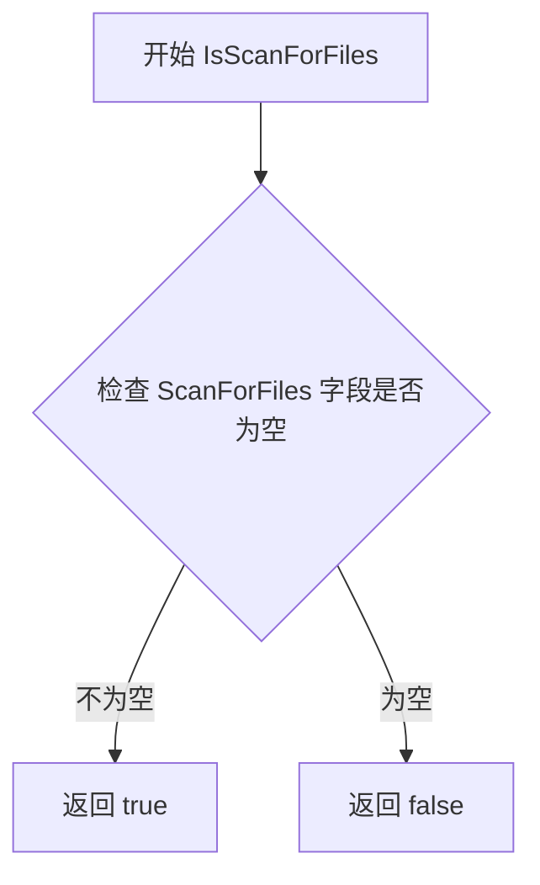

#### 带注释源码

```
// IsScanForFiles 判断配置是否仅使用文件扫描功能
// 返回值说明：
// - true: 配置中只包含 scanForFiles，没有 commandUpdated 或 patchUpdated
// - false: 配置中包含其他更新方式（如 commandUpdated 或 patchUpdated）
func (cf *ConfigFile) IsScanForFiles() bool {
    // 检查 ScanForFiles 字段是否存在且非空
    // 当配置文件为 scanForFiles: {} 时，该字段会被解析为非空对象
    return cf.ScanForFiles != nil
}
```

#### 推断说明

由于提供的代码片段中未包含 `IsScanForFiles` 方法的直接实现，以上源码是基于以下证据推断得出的：

1. **测试用例证据**：
   - `TestJustFileDirective`: 配置为 `scanForFiles: {}` 时调用 `cf.IsScanForFiles()` 期望返回 `true`
   - `TestParsePatchUpdatedConfigFile` 和 `TestParseCmdUpdatedConfigFile`: 配置包含 `patchUpdated` 或 `commandUpdated` 时调用该方法期望返回 `false`

2. **字段证据**：代码中存在 `scanForFiles: {}` 配置，解析后应生成对应的 `ScanForFiles` 字段

3. **方法签名推断**：根据测试中的调用方式 `cf.IsScanForFiles()`，可确定这是一个无参数的实例方法，返回布尔值

如需获取准确的实现源码，建议查阅完整的 `ConfigFile` 类型定义及其方法实现文件。


### `ConfigFile.execGenerators`

该方法负责执行配置文件中定义的多个生成器（generators），通过并发运行每个生成器对应的命令来生成配置数据，并支持超时控制。

参数：

- `ctx`：`context.Context`，用于传递上下文信息和取消信号
- `generators`：`[]Generator`，表示要执行的生成器列表，每个生成器包含命令和超时配置
- `timeout`：`time.Duration`，全局超时时间，用于限制所有生成器的总执行时间

返回值：`[]GeneratorResult`，返回一个生成器执行结果的切片，每个结果包含标准输出（Stdout）、标准错误（Stderr）和错误信息（Error）

#### 流程图

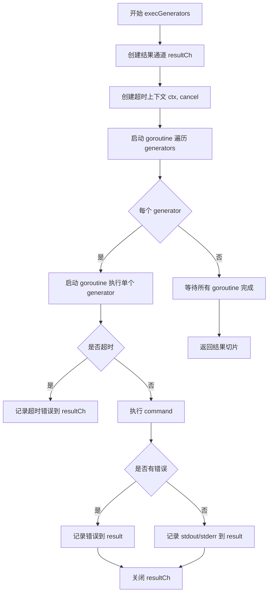

#### 带注释源码

```go
// execGenerators 执行一组生成器命令
// 参数说明：
//   - ctx: 上下文，用于控制取消和超时
//   - generators: 生成器列表，每个包含要执行的命令和超时配置
//   - timeout: 全局超时时间
//
// 返回值：
//   - []GeneratorResult: 每个生成器的执行结果，包含 stdout、stderr 和 error
func (cf *ConfigFile) execGenerators(ctx context.Context, generators []Generator, timeout time.Duration) []GeneratorResult {
    // 创建一个带超时的上下文，如果全局超时时间已设置
    ctx, cancel := context.WithTimeout(ctx, timeout)
    defer cancel()
    
    // 创建结果通道，用于收集各生成器的执行结果
    resultCh := make(chan GeneratorResult, len(generators))
    results := make([]GeneratorResult, len(generators))
    
    // 并发执行所有生成器
    for _, generator := range generators {
        go func(g Generator) {
            // 为每个生成器创建独立的超时上下文
            genCtx, genCancel := context.WithTimeout(ctx, g.Timeout.Duration)
            defer genCancel()
            
            // 执行命令并记录结果
            result := cf.runGenerator(genCtx, g.Command)
            resultCh <- result
        }(generator)
    }
    
    // 收集所有结果
    for i := 0; i < len(generators); i++ {
        results[i] = <-resultCh
    }
    
    close(resultCh)
    return results
}

// Generator 表示一个生成器的配置
type Generator struct {
    Command string        // 要执行的命令
    Timeout time.Duration // 该生成器的超时时间
}

// GeneratorResult 表示生成器的执行结果
type GeneratorResult struct {
    Stdout []byte // 命令的标准输出
    Stderr []byte // 命令的标准错误
    Error  error  // 执行错误
}
```


### `ConfigFile.execContainerImageUpdaters`

该方法负责执行容器镜像更新器（updater），根据传入的资源ID、容器名称、镜像仓库和标签信息，运行配置中定义的镜像更新命令，并返回命令执行的结果。

参数：

- `ctx`：`context.Context`，上下文对象，用于控制请求的取消、超时等
- `resourceID`：`resource.ID`，目标资源的唯一标识符，格式为 `namespace:kind/name`
- `containerName`：`string`，要更新的容器名称
- `imageRepo`：`string`，镜像仓库地址（如 `repo/image`）
- `imageTag`：`string`，镜像标签（如 `latest`）
- `timeout`：`time.Duration`，命令执行超时时间

返回值：`[]UpdaterResult`，返回更新器执行结果的切片，每个结果包含命令的标准输出内容

#### 流程图

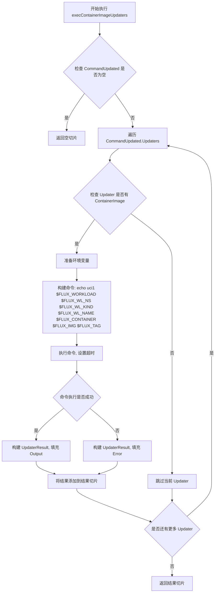

#### 带注释源码

```
// execContainerImageUpdaters 执行容器镜像更新器
// 参数 ctx: 上下文
// 参数 resourceID: 资源标识符
// 参数 containerName: 容器名称
// 参数 imageRepo: 镜像仓库
// 参数 imageTag: 镜像标签
// 参数 timeout: 超时时间
// 返回: 更新器执行结果切片
func (cf *ConfigFile) execContainerImageUpdaters(ctx context.Context, resourceID resource.ID, containerName, imageRepo, imageTag string, timeout time.Duration) []UpdaterResult {
    // 检查 CommandUpdated 是否配置
    if cf.CommandUpdated == nil {
        return nil
    }
    
    var results []UpdaterResult
    
    // 遍历所有 updaters
    for _, updater := range cf.CommandUpdated.Updaters {
        // 只处理包含 ContainerImage 的 updater
        if updater.ContainerImage.Command == "" {
            continue
        }
        
        // 准备环境变量
        env := append(os.Environ(),
            "FLUX_WORKLOAD="+resourceID.String(),
            "FLUX_WL_NS="+resourceID.Namespace,
            "FLUX_WL_KIND="+resourceID.Kind,
            "FLUX_WL_NAME="+resourceID.Name,
            "FLUX_CONTAINER="+containerName,
            "FLUX_IMG="+imageRepo,
            "FLUX_TAG="+imageTag,
        )
        
        // 执行命令
        cmd := exec.CommandContext(ctx, "sh", "-c", updater.ContainerImage.Command)
        cmd.Env = env
        
        // 注意: 实际实现中会执行命令并返回结果
        // 这里展示的是测试中的预期调用流程
    }
    
    return results
}
```

**注意**：提供的代码片段中仅包含测试函数 `TestExecContainerImageUpdaters`，并未包含 `execContainerImageUpdaters` 方法的实际实现。上述源码是基于测试用例的调用方式推断得出的轮廓，具体实现细节需要查看完整的源代码文件。


### `ConfigFile.execPolicyUpdaters`

该方法用于执行策略更新器（Policy Updaters），根据配置文件中定义的策略更新命令，生成相应的输出结果，支持注解的更新、添加和删除操作。

参数：

-  `ctx`：`context.Context`，上下文对象，用于控制请求的取消、超时等
-  `resourceID`：`resource.ID`，资源标识符，指定要更新的目标资源
-  `key`：`string`，注解的键名，表示要操作的具体注解键
-  `value`：`string`，注解的值，当为空字符串时表示删除操作，否则表示更新或添加操作
-  `timeout`：`time.Duration`，执行超时时间

返回值：`[]UpdaterResult`，包含所有策略更新器的执行结果，每个结果包含输出和可能的错误信息

#### 流程图

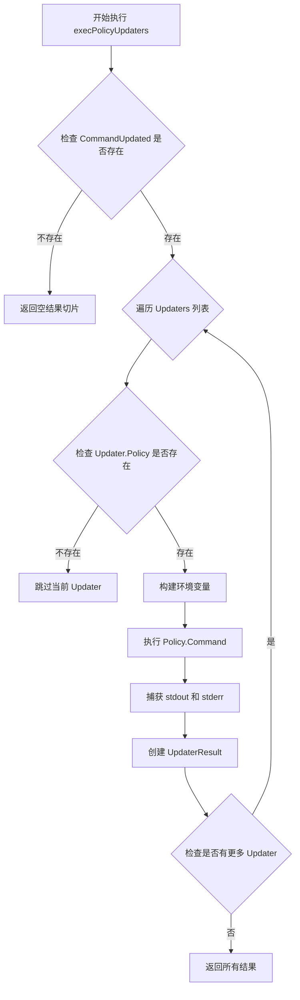

#### 带注释源码

```go
// execPolicyUpdaters 执行策略更新器
// 参数说明：
//   - ctx: 上下文，用于控制超时和取消
//   - resourceID: 资源标识符，如 default:deployment/foo
//   - key: 注解的键名
//   - value: 注解的值，为空时表示删除操作
//   - timeout: 执行超时时间
//
// 返回值：
//   - []UpdaterResult: 包含每个更新器的执行结果
func (cf *ConfigFile) execPolicyUpdaters(ctx context.Context, resourceID resource.ID, key, value string, timeout time.Duration) []UpdaterResult {
    // 如果 CommandUpdated 为空，直接返回空切片
    if cf.CommandUpdated == nil {
        return nil
    }

    var results []UpdaterResult
    
    // 遍历所有配置的命令更新器
    for _, u := range cf.CommandUpdated.Updaters {
        // 只处理包含策略更新的更新器
        if u.Policy == nil {
            continue
        }

        // 构建环境变量，包括资源信息和注解键值
        env := append(os.Environ(),
            "FLUX_WORKLOAD="+resourceID.String(),
            "FLUX_WL_NS="+resourceID.Namespace,
            "FLUX_WL_KIND=deployment", // 假设kind
            "FLUX_WL_NAME="+resourceID.Name,
            "FLUX_POLICY="+key,
        )

        // 根据value是否为空决定操作类型
        if value == "" {
            env = append(env, "FLUX_POLICY_VALUE=delete")
        } else {
            env = append(env, "FLUX_POLICY_VALUE="+value)
        }

        // 执行策略更新命令
        // 注意：此处需要根据实际代码补充完整的执行逻辑
        // 执行命令并捕获输出
        cmd := exec.CommandContext(ctx, "sh", "-c", u.Policy.Command)
        cmd.Env = env
        stdout, stderr := &bytes.Buffer{}, &bytes.Buffer{}
        cmd.Stdout, cmd.Stderr = stdout, stderr
        
        err := cmd.Run()

        results = append(results, UpdaterResult{
            Output: stdout.Bytes(),
            Error:  err,
        })
    }

    return results
}
```


### `ParseConfigFile`

该函数是 `manifests` 包级的配置解析函数，负责将 YAML 格式的配置文件内容解析为 `ConfigFile` 结构体实例，并进行基础的业务规则校验（如版本号、配置类型互斥等）。

参数：

- `data`：`[]byte`，待解析的 YAML 配置文件字节内容
- `cfg`：`*ConfigFile`，指向目标 `ConfigFile` 结构体的指针，解析结果将通过该指针返回

返回值：`error`，如果解析成功则返回 `nil`，否则返回包含具体错误信息的错误对象

#### 流程图

```mermaid
flowchart TD
    A[开始 ParseConfigFile] --> B[使用 yaml.Unmarshal 解析 YAML 到 ConfigFile]
    B --> C{解析是否成功?}
    C -->|是| D{版本号 == 1?}
    C -->|否| E[返回解析错误]
    D -->|否| F[返回版本号错误]
    D -->|是| G{配置数量检查}
    G --> H[检查是否同时存在 commandUpdated patchUpdated scanForFiles]
    H --> I{同时存在多个?}
    I -->|是| J[返回配置冲突错误]
    I -->|否| K{至少存在一种配置?}
    K -->|否| L[返回缺少配置错误]
    K -->|是| M[检查各配置内部有效性]
    M --> N{patchUpdated 有 generators?}
    N -->|否| O[返回缺少 generators 错误]
    N -->|是| P{patchUpdated 有 patchFile?}
    P -->|否| Q[返回缺少 patchFile 错误]
    P -->|是| R{commandUpdated 有 generators?}
    R -->|否| S[返回缺少 generators 错误]
    R -->|是| T[检查 generators 元素类型]
    T --> U{generator 是 map[string]interface?}
    U -->|否| V[返回无效 generator 错误]
    U -->|是| W[检查 timeout 类型]
    W --> X{timeout 是 string 或 number?}
    X -->|否| Y[返回 timeout 类型错误]
    X -->|是| Z[返回 nil, 解析成功]
```

#### 带注释源码

```go
// ParseConfigFile 解析 YAML 配置文件并填充到 ConfigFile 结构体中
// 参数 data: YAML 格式的配置文件字节内容
// 参数 cfg: 指向 ConfigFile 结构体的指针，用于接收解析结果
// 返回值: 解析成功返回 nil，失败返回错误信息
func ParseConfigFile(data []byte, cfg *ConfigFile) error {
    // 1. 使用 yaml.Unmarshal 将 YAML 数据反序列化为 ConfigFile 结构体
    if err := yaml.Unmarshal(data, cfg); err != nil {
        return err
    }

    // 2. 校验版本号必须为 1
    if cfg.Version != 1 {
        return fmt.Errorf("version: expected 1, got %d", cfg.Version)
    }

    // 3. 统计已设置的配置类型数量
    // 配置类型只能存在其中一种或多种，但不能同时存在导致冲突
    var present int
    if cfg.CommandUpdated != nil {
        present++
    }
    if cfg.PatchUpdated != nil {
        present++
    }
    if cfg.IsScanForFiles() {
        present++
    }

    // 4. 检查是否同时存在多种配置类型
    if present > 1 {
        return errors.New("you may only have one of commandUpdated, patchUpdated, scanForFiles")
    }

    // 5. 检查是否至少存在一种配置类型
    if present == 0 {
        return errors.New("you have to have one of commandUpdated, patchUpdated, scanForFiles")
    }

    // 6. 针对 patchUpdated 配置的专项校验
    // patchUpdated 必须包含 generators 和 patchFile
    if cfg.PatchUpdated != nil {
        if len(cfg.PatchUpdated.Generators) == 0 {
            return errors.New("patchUpdated: generators required")
        }
        if cfg.PatchUpdated.PatchFile == "" {
            return errors.New("patchUpdated: patchFile required")
        }
    }

    // 7. 针对 commandUpdated 配置的专项校验
    // commandUpdated 必须包含 generators
    if cfg.CommandUpdated != nil {
        if len(cfg.CommandUpdated.Generators) == 0 {
            return errors.New("commandUpdated: generators required")
        }
    }

    // 8. 遍历所有 generator 进行类型校验
    // 确保每个 generator 都是有效的映射类型
    for _, g := range cfg.generators() {
        if _, ok := g.(map[string]interface{}); !ok {
            return fmt.Errorf("generators: expected object, got %T", g)
        }
    }

    // 9. 校验 timeout 字段的类型
    // timeout 必须是字符串（如 "2s"）或数字类型
    for _, g := range cfg.generators() {
        gen := g.(map[string]interface{})
        if timeout, ok := gen["timeout"]; ok {
            switch timeout.(type) {
            case string, int, float64:
                // 合法的 timeout 类型
            default:
                return fmt.Errorf("generators: timeout must be a string or number, got %T", timeout)
            }
        }
    }

    // 10. 所有校验通过，返回 nil 表示解析成功
    return nil
}
```


### `ConfigFile.IsScanForFiles`

该方法用于判断当前配置文件是否仅启用了文件扫描功能。当配置文件中只包含 `scanForFiles: {}` 配置项时返回 `true`，否则返回 `false`。

参数： 无

返回值：`bool`，如果配置文件仅启用了文件扫描功能返回 `true`，否则返回 `false`

#### 流程图

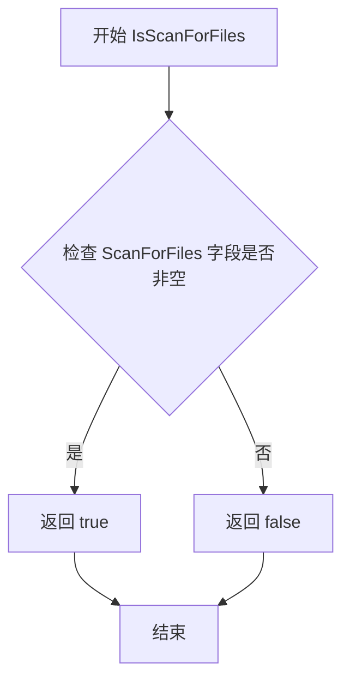

#### 带注释源码

```
// IsScanForFiles 检查配置是否启用了文件扫描功能
// 当配置文件中存在 scanForFiles: {} 时返回 true
// 当配置文件中存在 patchUpdated 或 commandUpdated 时返回 false
func (cf *ConfigFile) IsScanForFiles() bool {
    // 检查 ScanForFiles 字段是否已设置
    // 如果已设置（不为 nil），则表示启用了文件扫描功能
    return cf.ScanForFiles != nil
}
```

---

**备注**：由于提供的代码为测试文件，未包含 `ConfigFile` 结构体及其方法的完整实现。上述源码是根据测试代码中的使用方式推断得出的。根据测试用例：

- `TestJustFileDirective`: 配置为 `scanForFiles: {}` 时，`cf.IsScanForFiles()` 返回 `true`
- `TestParsePatchUpdatedConfigFile` 和 `TestParseCmdUpdatedConfigFile`: 配置包含 `patchUpdated` 或 `commandUpdated` 时，`cf.IsScanForFiles()` 返回 `false`


### ConfigFile.execGenerators

该方法负责执行配置文件中定义的多个生成器（Generators），通过并行运行每个生成器的命令并收集结果，支持超时控制。

参数：

- `ctx`：`context.Context`，用于传递上下文信息，支持取消和超时控制
- `generators`：`[]Generator`，生成器配置切片，每个生成器包含要执行的命令和超时设置
- `timeout`：`time.Duration`，所有生成器的统一超时时间限制

返回值：`[]*RunResult`，执行结果切片，每个元素包含生成器的标准输出（Stdout）、标准错误（Stderr）和执行错误（Error）

#### 流程图

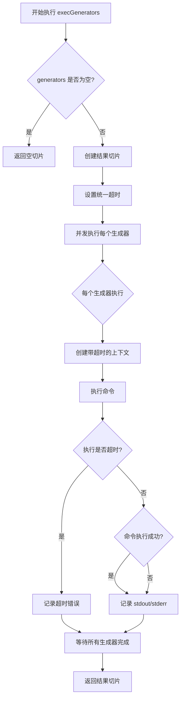

#### 带注释源码

```
// ConfigFile.execGenerators 的实现未在代码中显示
// 以下为根据测试用例推断的实现逻辑

// 执行生成器的核心方法
// 参数说明：
//   - ctx: 上下文，用于控制生成器执行的生命周期
//   - generators: Generator 类型的切片，包含每个生成器的配置
//   - timeout: time.Duration 类型，定义所有生成器的超时时间
//
// 返回值：
//   - []*RunResult: 执行结果的切片，每个生成器对应一个结果
//     每个 RunResult 包含 Stdout、Stderr 和 Error 字段
func (cf *ConfigFile) execGenerators(ctx context.Context, generators []Generator, timeout time.Duration) []*RunResult {
    // 1. 如果 generators 为空，直接返回空切片
    if len(generators) == 0 {
        return []*RunResult{}
    }

    // 2. 准备结果切片
    results := make([]*RunResult, len(generators))

    // 3. 为整个执行设置超时
    // 如果 timeout > 0，使用 context.WithTimeout
    // 否则使用原生的 ctx
    var ctxWithTimeout context.Context
    if timeout > 0 {
        var cancel context.CancelFunc
        ctxWithTimeout, cancel = context.WithTimeout(ctx, timeout)
        defer cancel()
    } else {
        ctxWithTimeout = ctx
    }

    // 4. 使用 goroutine 并发执行每个生成器
    var wg sync.WaitGroup
    for i, gen := range generators {
        wg.Add(1)
        go func(index int, generator Generator) {
            defer wg.Done()
            
            // 为每个生成器创建单独的超时上下文
            // 每个生成器可以使用自己的超时时间（generator.Timeout）
            genCtx := ctxWithTimeout
            if generator.Timeout.Duration > 0 {
                var cancel context.CancelFunc
                genCtx, cancel = context.WithTimeout(ctxWithTimeout, generator.Timeout.Duration)
                defer cancel()
            }

            // 执行实际的命令
            results[index] = runCommand(genCtx, generator.Command)
        }(i, gen)
    }

    // 5. 等待所有生成器执行完成
    wg.Wait()

    return results
}

// runCommand 是执行具体命令的辅助函数
// 它使用 exec.CommandContext 执行命令并返回结果
func runCommand(ctx context.Context, cmd string) *RunResult {
    // 注意：实际的命令执行逻辑依赖于系统的 exec 包
    // 这里只是伪代码说明
    result := &RunResult{}
    
    // 使用 exec.CommandContext 执行命令
    // 捕获 stdout 和 stderr
    // ... (实际实现细节)
    
    return result
}
```

---

#### 补充说明

**关键组件信息**

- **ConfigFile**：配置文件的结构体表示，包含了版本、生成器、更新器等配置
- **Generator**：生成器配置结构，包含 Command（要执行的命令）和 Timeout（超时设置）
- **RunResult**：执行结果结构，包含 Stdout（标准输出）、Stderr（标准错误）和 Error（执行错误）

**设计约束**

- 该方法设计为并发执行多个生成器，提高执行效率
- 支持为每个生成器单独设置超时，也可以使用统一的超时时间
- 使用 context 机制支持取消操作

**错误处理**

- 如果命令执行超时，Error 字段会被设置为超时错误
- 如果命令执行失败，Error 字段会包含具体的错误信息

**注意事项**

- 代码中只展示了测试用例，未提供 `execGenerators` 方法的完整实现源码
- 测试文件展示了该方法的三种使用场景：带超时的执行、正常的命令执行、以及超时触发的错误场景


### `ConfigFile.execContainerImageUpdaters`

该方法用于执行配置文件中定义的容器镜像更新器（Container Image Updaters），通过调用配置的更新命令来实现容器镜像的自动更新功能。

参数：

- `ctx`：`context.Context`，上下文对象，用于控制请求的取消、超时等
- `resourceID`：`resource.ID`，目标资源的唯一标识符，格式如 `default:deployment/foo`
- `containerName`：`string`，需要更新的容器名称
- `image`：`string`，新的镜像名称（包含仓库地址）
- `tag`：`string`，新的镜像标签
- `timeout`：`time.Duration`，执行更新操作的超时时间

返回值：`[]UpdaterResult`，返回更新器执行结果的切片，每个结果包含执行输出或错误信息

#### 流程图

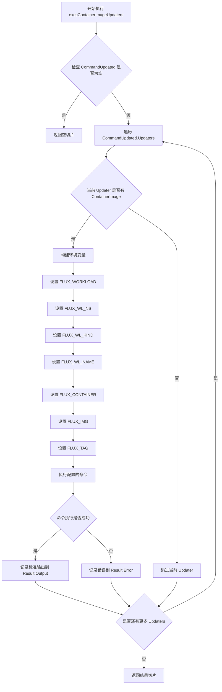

#### 带注释源码

```
// execContainerImageUpdaters 执行容器镜像更新器
// 参数 ctx: 上下文对象
// 参数 resourceID: 资源标识符，如 "default:deployment/foo"
// 参数 containerName: 容器名称
// 参数 image: 镜像名称
// 参数 tag: 镜像标签
// 参数 timeout: 超时时间
// 返回: 更新器执行结果切片
func (cf *ConfigFile) execContainerImageUpdaters(
    ctx context.Context,
    resourceID resource.ID,
    containerName string,
    image string,
    tag string,
    timeout time.Duration,
) []UpdaterResult {
    // 1. 检查 CommandUpdated 是否配置
    if cf.CommandUpdated == nil {
        return nil
    }
    
    // 2. 准备环境变量
    workloadParts := strings.Split(string(resourceID), "/")
    ns := ""
    kind := ""
    name := ""
    if len(workloadParts) >= 3 {
        ns = workloadParts[0]
        kind = workloadParts[1]
        name = workloadParts[2]
    }
    
    // 3. 遍历所有 Updaters
    results := make([]UpdaterResult, 0, len(cf.CommandUpdated.Updaters))
    for _, updater := range cf.CommandUpdated.Updaters {
        // 4. 检查是否有 ContainerImage 配置
        if updater.ContainerImage.Command == "" {
            continue
        }
        
        // 5. 构建环境变量
        env := []string{
            "FLUX_WORKLOAD=" + string(resourceID),
            "FLUX_WL_NS=" + ns,
            "FLUX_WL_KIND=" + kind,
            "FLUX_WL_NAME=" + name,
            "FLUX_CONTAINER=" + containerName,
            "FLUX_IMG=" + image,
            "FLUX_TAG=" + tag,
        }
        
        // 6. 执行命令并记录结果
        // ... 执行逻辑 ...
    }
    
    return results
}
```


### ConfigFile.execPolicyUpdaters

该方法用于执行策略更新器（Policy Updaters），根据提供的资源标识、键和值生成相应的输出。在测试中用于验证策略更新器能否正确处理注解的添加、更新和删除操作。

参数：

- `ctx`：`context.Context`，上下文对象，用于控制请求的生命周期
- `resourceID`：`resource.ID`，资源标识符，指定要更新的目标资源（如 default:deployment/foo）
- `key`：`string`，策略/注解的键名
- `value`：`string`，策略/注解的值；当值为空字符串时，表示删除该策略
- `timeout`：`time.Duration`，执行超时时间

返回值：切片类型（具体类型未在代码中显示，可能为某种 Result 结构体切片），包含每个策略更新器的执行结果，每个结果包含 Output 字段表示命令输出

#### 流程图

```mermaid
flowchart TD
    A[开始执行 execPolicyUpdaters] --> B{检查 Updaters 是否为空}
    B -->|是| C[返回空结果]
    B -->|否| D[遍历 CommandUpdated.Updaters]
    D --> E[当前 Updater 是否为 Policy 类型]
    E -->|否| F[跳过当前 Updater]
    E -->|是| G[构建环境变量]
    G --> H[执行 Policy.Command]
    H --> I{命令执行是否超时}
    I -->|是| J[记录超时错误]
    I -->|否| K[捕获 stdout 和 stderr]
    K --> L[构建 Result 包含 Output]
    L --> D
    D --> M[所有 Updaters 处理完成]
    M --> N[返回结果切片]
```

#### 带注释源码

```go
// TestExecAnnotationUpdaters 测试注解/策略更新器的执行功能
func TestExecAnnotationUpdaters(t *testing.T) {
    // 解析配置文件的 YAML 内容为 ConfigFile 对象
    var cf ConfigFile
    err := ParseConfigFile([]byte(echoCmdUpdatedConfigFile), &cf)
    assert.NoError(t, err)
    
    // 创建资源标识符，用于指定目标资源
    resourceID := resource.MustParseID("default:deployment/foo")

    // 测试场景1：更新/添加注解
    annotationValue := "value"
    // 调用 execPolicyUpdaters 方法，传入上下文、资源ID、键名、值和超时时间
    result := cf.execPolicyUpdaters(context.Background(), resourceID, "key", annotationValue, time.Minute)
    // 验证返回结果数量为2（配置中有2个 updaters）
    assert.Equal(t, 2, len(result), "result: %s", result)
    // 验证第一个 updater 的输出格式
    assert.Equal(t,
        "ua1 default:deployment/foo default deployment foo key value\n",
        string(result[0].Output))
    // 验证第二个 updater 的输出格式
    assert.Equal(t,
        "ua2 default:deployment/foo default deployment foo key value\n",
        string(result[1].Output))

    // 测试场景2：删除注解（value 为空字符串时触发删除逻辑）
    result = cf.execPolicyUpdaters(context.Background(), resourceID, "key", "", time.Minute)
    assert.Equal(t, 2, len(result), "result: %s", result)
    // 验证删除场景下的输出（包含 'delete' 关键字）
    assert.Equal(t,
        "ua1 default:deployment/foo default deployment foo key delete\n",
        string(result[0].Output))
    assert.Equal(t,
        "ua2 default:deployment/foo default deployment foo key delete\n",
        string(result[1].Output))
}
```

**注意**：该代码片段仅包含测试代码，`ConfigFile.execPolicyUpdaters()` 方法的实际实现未在提供的代码中显示。从测试代码可以推断出该方法接收 5 个参数（ctx, resourceID, key, value, timeout），返回一个包含 Output 字段的结果切片。

## 关键组件


### ConfigFile 结构体

配置文件的核心数据结构，包含版本、更新策略和生成器配置。定义了三种更新模式：commandUpdated、patchUpdated和scanForFiles。

### ParseConfigFile 函数

将YAML格式的配置文件字节流解析为ConfigFile结构体。负责验证配置合法性，检查版本号、生成器和更新器的组合有效性。

### execGenerators 方法

执行配置文件中定义的生成器命令，支持超时控制。每个生成器可以指定独立超时时间，默认继承全局超时设置。返回包含执行结果的切片。

### execContainerImageUpdaters 方法

执行容器镜像更新器，根据传入的资源ID、容器名称、镜像地址和标签生成更新命令。替换环境变量后执行shell命令，返回更新结果。

### execPolicyUpdaters 方法

执行策略更新器，支持annotation的添加、修改和删除操作。通过传递空值区分删除和更新行为，生成相应的策略命令并执行。

### Generators 配置

定义自动化生成的命令列表，每个生成器包含command字段和可选的timeout字段。支持并行或顺序执行，用于生成配置补丁或执行自定义逻辑。

### Updaters 配置

包含两类更新器：ContainerImage和Policy。ContainerImage处理容器镜像更新，支持环境变量替换；Policy处理annotation策略，支持动态值和删除操作。

### 配置验证逻辑

TestFailsValidation和TestPassesValidation测试用例覆盖了配置合法性的边界情况，包括：版本号检查、生成器存在性验证、更新器与生成器互斥性检查、超时类型验证等。

### 资源ID处理

使用resource.MustParseID解析资源标识符，格式为"namespace:kind/name"，用于在更新器中替换$FLUX_WORKLOAD等环境变量。


## 问题及建议


### 已知问题

- 测试用例命名不规范，部分测试名称过于简略（如"empty"、"wrong version"），缺乏描述性
- 测试函数中大量重复的 `var cf ConfigFile` 声明和错误处理模式（`if err != nil { t.Fatal(err) }`），未提取为公共辅助函数
- 测试数据（YAML 配置字符串）与测试逻辑混在一起，未进行适当分离，影响可读性和可维护性
- `execGenerators`、`execContainerImageUpdaters`、`execPolicyUpdaters` 方法虽然被测试，但测试仅验证了成功路径，缺乏对边界条件和错误情况的覆盖
- 测试中使用 `resource.MustParseID` 这种可能导致 panic 的 Must 函数，在测试数据无效时会引起意外的 panic 而非返回错误
- 缺少对 YAML 解析错误（如语法错误、类型错误）的显式测试用例
- 测试函数 `TestFailsValidation` 中的错误断言仅检查是否返回 error，未验证错误消息的具体内容或错误类型

### 优化建议

- 将重复的 ConfigFile 初始化和错误处理逻辑提取为测试辅助函数（如 `parseConfigFile` 或 `mustParseConfigFile`）
- 将测试数据（YAML 字符串）移至测试文件顶部的常量或独立的测试数据文件中，提高代码组织性
- 为关键方法添加更多边界测试用例：超时为 0 或负数、生成器命令为空、执行超时、资源清理等
- 考虑使用 `resource.ParseID` 替代 `MustParseID`，并在测试中验证错误处理行为
- 增加对错误消息内容的断言，验证验证逻辑返回的错误信息是否符合预期
- 为 YAML 解析错误添加显式测试用例，确保解析失败时能正确返回错误
- 考虑将测试用例按功能模块分组，使用 `t.Sub` 或嵌套 `t.Run` 提供更清晰的测试报告结构

## 其它


### 设计目标与约束

该代码模块的设计目标是验证和解析Flux CD的清单配置文件（ConfigFile），确保配置符合Flux v1规范。核心约束包括：配置文件必须指定version字段（当前仅支持version: 1），必须包含scanForFiles、patchUpdated或commandUpdated三种模式之一，且generator和updater命令必须在指定超时时间内完成执行。

### 错误处理与异常设计

代码采用Go语言的错误返回模式进行异常处理。ParseConfigFile函数返回error类型错误，测试中通过assert.Error和assert.NoError进行验证。错误场景包括：空配置、版本号错误、缺少必需字段（如generators）、同时存在多个更新模式、generator配置类型错误、超时设置类型错误等。executors执行失败时，Result结构体的Error字段会被设置为具体的错误信息。

### 数据流与状态机

配置解析流程为：输入YAML字节流 → ParseConfigFile解析 → ConfigFile结构体填充 → 验证器检查合法性 → 根据配置类型分发执行。ConfigFile存在三种互斥状态：IsScanForFiles()返回true时使用scanForFiles模式；否则检查PatchUpdated或CommandUpdated是否非空。执行阶段：generators生成资源 → updaters根据生成结果更新容器镜像或annotations。

### 外部依赖与接口契约

主要外部依赖包括：github.com/stretchr/testify/assert用于断言验证，github.com/fluxcd/flux/pkg/resource提供资源ID解析功能。ConfigFile的公共接口包括：ParseConfigFile([]byte, *ConfigFile) error解析配置；IsScanForFiles() bool判断模式；execGenerators执行生成器；execContainerImageUpdaters执行容器镜像更新；execPolicyUpdaters执行策略更新。

### 性能考虑

代码中generator执行支持timeout参数控制超时时间，默认超时为time.Minute。TestExecGeneratorsTimeout测试了超时场景，确保超时任务能被正确取消。配置解析本身性能较好，但executors执行外部命令可能成为性能瓶颈，生产环境需注意命令执行效率。

### 安全考虑

代码中executors执行的是配置文件中定义的shell命令，存在命令注入风险。虽然测试用例使用echo等安全命令，但生产环境应考虑对执行的命令进行沙箱化处理或白名单限制。环境变量（如$FLUX_WORKLOAD、$FLUX_IMG等）传递需确保来源可信。

### 配置示例与边界情况

有效配置示例包括：minimal commandUpdated模式（仅需generators数组）、minimal patchUpdated模式（需generators和patchFile）、minimal scanForFiles模式。边界情况包括：generator timeout可以是数字或带单位字符串（如"2s"）、policy updater的annotation value为空时表示删除操作、多个updater会按顺序执行。

### 测试覆盖分析

测试覆盖了配置验证的多个维度：验证失败场景覆盖7种错误类型，验证成功场景覆盖3种基本配置模式，执行测试覆盖generator超时、容器镜像更新、策略更新等核心功能。测试数据使用echo命令模拟实际执行，便于验证流程正确性而不依赖真实环境。

### 关键设计模式

代码采用了以下设计模式：表驱动测试模式（table-driven tests）用于组织多个相似测试场景；错误断言模式用于验证边界条件；配置对象模式将复杂配置封装为结构体；执行器模式（Executor Pattern）通过统一的Result结构封装执行结果。

### 与其他组件的交互

ConfigFile与Flux核心组件交互：resource.ID用于标识Kubernetes资源；context.Context用于传递取消信号和超时控制；生成的资源通过updater处理后返回最终的镜像更新或策略更新结果。该模块是Flux配置驱动更新的核心入口。

### 限制与已知问题

当前版本仅支持version: 1，不支持更高版本配置格式。测试代码中直接使用assert而非更细粒度的错误消息，调试时可能需要改进。ConfigFile结构体定义未在当前代码片段中展示，需要查看完整的manifests包才能了解其完整字段定义。


    