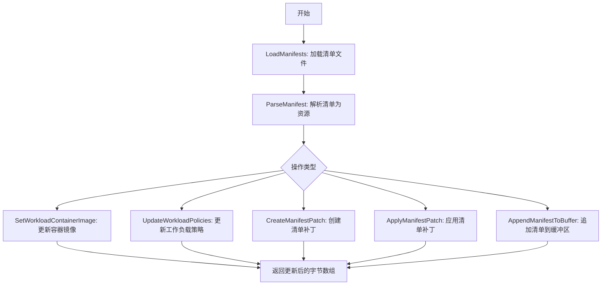
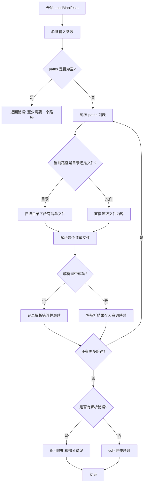
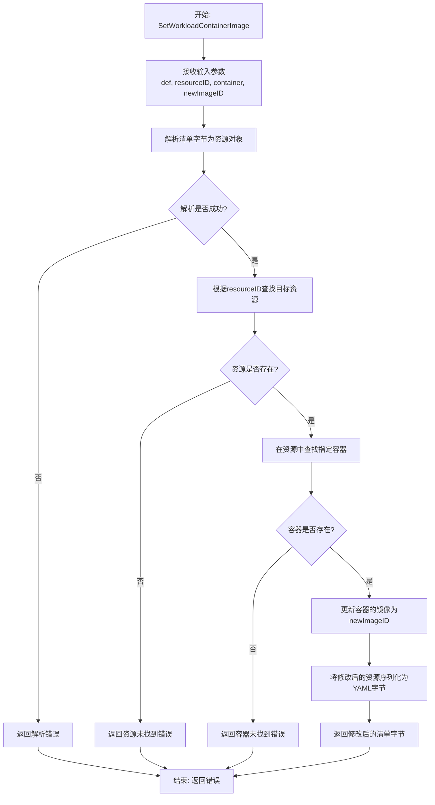
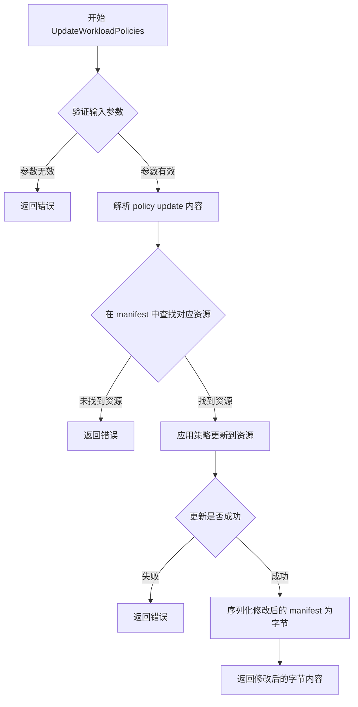
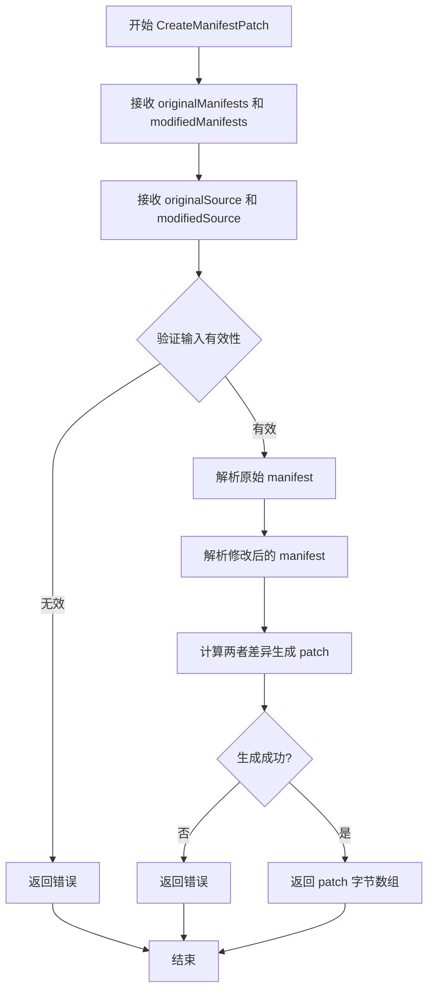
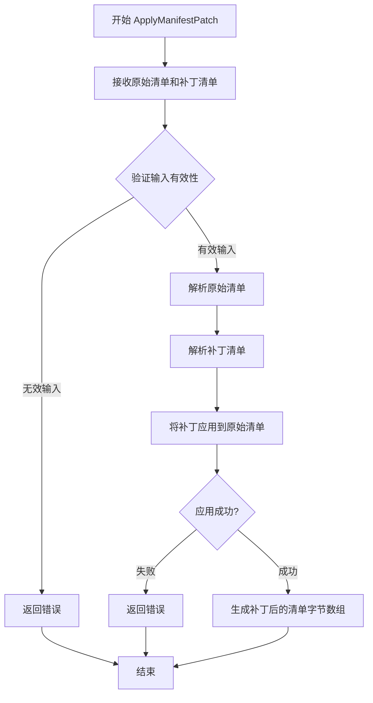
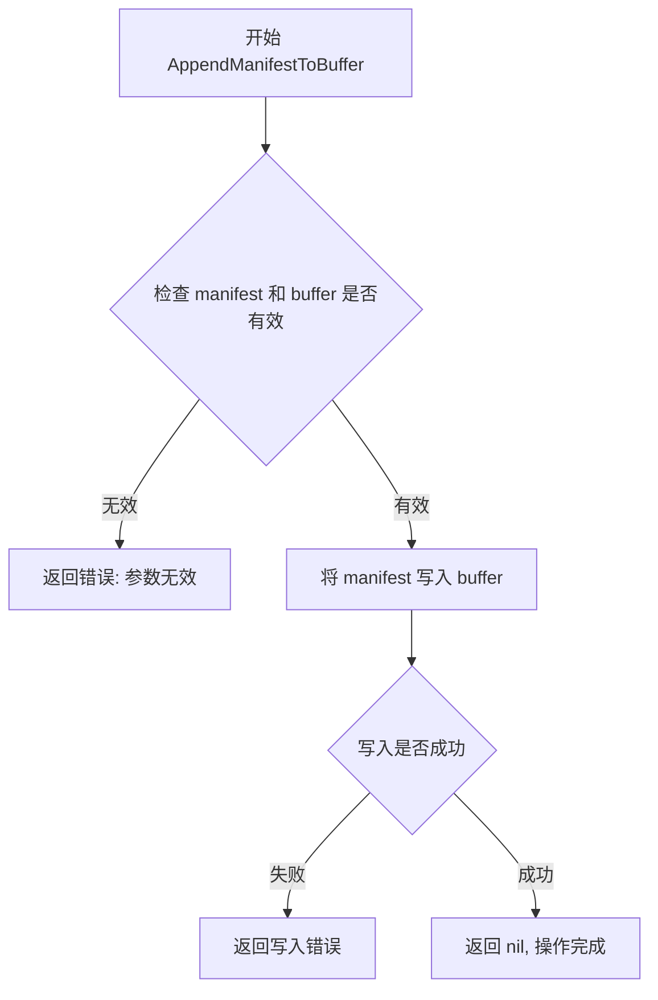

# `flux\pkg\manifests\manifests.go` 详细设计文档

这是一个 Flux CD 的清单处理包，定义了 Manifests 接口用于加载、解析、修改和管理 Kubernetes 资源清单（YAML 文件），支持容器镜像更新、策略更新以及清单补丁的创建和应用。

## 整体流程



## 类结构

```
Manifests (接口)
├── LoadManifests (方法)
├── ParseManifest (方法)
├── SetWorkloadContainerImage (方法)
├── UpdateWorkloadPolicies (方法)
├── CreateManifestPatch (方法)
├── ApplyManifestPatch (方法)
└── AppendManifestToBuffer (方法)
```

## 全局变量及字段


### `Manifests.LoadManifests`
    
加载指定路径下的所有资源清单文件

类型：`func(baseDir string, paths []string) (map[string]resource.Resource, error)`
    


### `Manifests.ParseManifest`
    
将清单内容解析为资源对象

类型：`func(def []byte, source string) (map[string]resource.Resource, error)`
    


### `Manifests.SetWorkloadContainerImage`
    
设置清单中指定工作负载的容器镜像

类型：`func(def []byte, resourceID resource.ID, container string, newImageID image.Ref) ([]byte, error)`
    


### `Manifests.UpdateWorkloadPolicies`
    
更新清单中的工作负载策略

类型：`func(def []byte, id resource.ID, update resource.PolicyUpdate) ([]byte, error)`
    


### `Manifests.CreateManifestPatch`
    
创建两个清单版本之间的差异补丁

类型：`func(originalManifests, modifiedManifests []byte, originalSource, modifiedSource string) ([]byte, error)`
    


### `Manifests.ApplyManifestPatch`
    
应用清单补丁到原始清单

类型：`func(originalManifests, patchManifests []byte, originalSource, patchSource string) ([]byte, error)`
    


### `Manifests.AppendManifestToBuffer`
    
将清单字节追加到缓冲区

类型：`func(manifest []byte, buffer *bytes.Buffer) error`
    
    

## 全局函数及方法


### Manifests.LoadManifests

加载指定路径下的所有资源清单文件，并返回包含资源ID到资源对象映射的字典。方法接收一个基准目录和一组绝对路径，返回解析后的资源映射或错误。

参数：

- `baseDir`：`string`，用于将绝对路径相对化的基准目录
- `paths`：`[]string`，要加载的目录或文件的绝对路径列表，至少需要提供一个路径

返回值：`map[string]resource.Resource, error`，返回资源ID到资源对象的映射字典，以及可能的错误信息

#### 流程图



#### 带注释源码

```go
// LoadManifests 加载指定路径下的所有资源清单
// 参数:
//   - baseDir: string, 用于将绝对路径相对化的基准目录
//   - paths: []string, 要加载的目录或文件的绝对路径列表，至少需要提供一个路径
//
// 返回值:
//   - map[string]resource.Resource: 资源ID到资源对象的映射
//   - error: 加载过程中的错误信息
//
// 注意事项:
//   - baseDir用于将paths中的绝对路径转换为相对路径，作为资源的标识键
//   - 即使paths中只包含baseDir本身，也需要提供一个路径
//   - 方法会遍历所有路径，尝试解析每个路径对应的清单文件
//   - 部分路径解析失败不会中止整个过程，而是继续处理剩余路径
LoadManifests(baseDir string, paths []string) (map[string]resource.Resource, error)
```


### `Manifests.ParseManifest`

该接口方法用于将包含Kubernetes资源定义的字节内容解析为Flux可管理的资源对象映射表，支持多种Manifests实现格式（如YAML、JSON等）。

参数：

- `def`：`[]byte`，Manifest文件的字节内容，包含Kubernetes资源定义
- `source`：`string`，Manifest内容的来源标识，通常用于错误信息和日志追踪

返回值：`(map[string]resource.Resource, error)`

- `map[string]resource.Resource`：解析后的资源映射表，键为资源标识符，值为资源对象
- `error`：解析过程中发生的错误（如语法错误、格式不支持等）

#### 流程图

```mermaid
flowchart TD
    A[开始 ParseManifest] --> B{输入验证}
    B -->|def为空| C[返回空Map或错误]
    B -->|def有效| D[调用具体实现解析器]
    D --> E{解析成功?}
    E -->|是| F[构建resource.Resource对象]
    E -->|否| G[返回解析错误]
    F --> H[生成资源ID到资源的映射]
    H --> I[返回map[string]resource.Resource]
    G --> J[返回error]
    I --> K[结束]
    J --> K
```

#### 带注释源码

```go
// Manifests 接口定义了处理包含资源定义的字节内容或文件的格式
// 例如：Kubernetes YAML文件定义的资源
type Manifests interface {
    // Load all the resource manifests under the paths
    // given. `baseDir` is used to relativise the paths, which are
    // supplied as absolute paths to directories or files; at least
    // one path should be supplied, even if it is the same as `baseDir`.
    LoadManifests(baseDir string, paths []string) (map[string]resource.Resource, error)
    
    // ParseManifest parses the content of a collection of manifests, into resources
    // 将一组manifest的内容解析为资源对象
    // 参数:
    //   - def: manifest的字节内容（如YAML格式）
    //   - source: 来源标识，用于错误信息和日志
    // 返回:
    //   - map[string]resource.Resource: 资源ID到资源的映射
    //   - error: 解析错误
    ParseManifest(def []byte, source string) (map[string]resource.Resource, error)
    
    // Set the image of a container in a manifest's bytes to that given
    SetWorkloadContainerImage(def []byte, resourceID resource.ID, container string, newImageID image.Ref) ([]byte, error)
    
    // UpdateWorkloadPolicies modifies a manifest to apply the policy update specified
    UpdateWorkloadPolicies(def []byte, id resource.ID, update resource.PolicyUpdate) ([]byte, error)
    
    // CreateManifestPatch obtains a patch between the original and modified manifests
    CreateManifestPatch(originalManifests, modifiedManifests []byte, originalSource, modifiedSource string) ([]byte, error)
    
    // ApplyManifestPatch applies a manifest patch (obtained with CreateManifestPatch) returning the patched manifests
    ApplyManifestPatch(originalManifests, patchManifests []byte, originalSource, patchSource string) ([]byte, error)
    
    // AppendManifestToBuffer concatenates manifest bytes to a
    // (possibly empty) buffer of manifest bytes; the resulting bytes
    // should be parsable by `ParseManifest`.
    // 注意: TODO(michael) 建议改为接口而非 *bytes.Buffer
    AppendManifestToBuffer(manifest []byte, buffer *bytes.Buffer) error
}
```

### 关键组件信息

| 组件名称 | 一句话描述 |
|---------|-----------|
| `Manifests` | 定义Kubernetes资源Manifest解析和操作的标准接口 |
| `resource.Resource` | Flux中Kubernetes资源的抽象表示 |
| `ParseManifest` | 将字节格式的Manifest内容转换为资源对象的核心方法 |

### 潜在技术债务与优化空间

1. **TODO注释**：代码中存在TODO标记，建议将`AppendManifestToBuffer`方法的`*bytes.Buffer`参数改为更通用的接口类型，提高灵活性
2. **接口粒度**：当前接口定义了7个方法，可能过于臃肿，可考虑拆分为更细粒度的接口（如ParseManifests、ManipulateManifests等）
3. **source参数使用**：source参数目前主要用于错误追踪，可考虑扩展其用途，如支持source-specific的解析策略
4. **缺少默认值处理**：接口未定义Manifest缺失或为空时的默认行为，建议在实现中明确

### 其他项目

#### 设计目标与约束

- **目标**：提供统一的Manifest解析抽象，支持多种格式（YAML、JSON等）
- **约束**：实现类必须处理资源ID冲突、解析错误传播等问题

#### 错误处理与异常设计

- 解析失败应返回具体的错误信息，包括行号、列号等定位信息
- 错误应包含source参数以便追踪问题来源
- 资源ID冲突时应返回明确错误而非静默覆盖

#### 数据流与状态机

```
输入(def []byte, source) 
    → 输入验证 
    → 格式检测 
    → 解析为中间表示 
    → 资源对象构造 
    → 资源ID去重检查 
    → 返回资源映射表
```

#### 外部依赖与接口契约

- 依赖 `github.com/fluxcd/flux/pkg/image` 用于镜像引用
- 依赖 `github.com/fluxcd/flux/pkg/resource` 用于资源对象定义
- 调用方需保证def参数符合所使用实现支持的格式（如YAML语法）


### `Manifests.SetWorkloadContainerImage`

该方法用于在 Kubernetes 资源清单（Manifest）中更新指定容器的镜像地址，它接收原始清单字节、资源标识符、容器名称和新的镜像引用，然后返回修改后的清单字节。

参数：

- `def`：`[]byte`，原始的 Kubernetes 资源清单文件字节内容
- `resourceID`：`resource.ID`，目标资源的唯一标识符，用于定位要修改的资源
- `container`：`string`，要更新镜像的容器名称
- `newImageID`：`image.Ref`，新的镜像引用（包含镜像仓库和标签信息）

返回值：`([]byte, error)`，返回修改后的资源清单字节内容；如果发生错误（如资源不存在、容器不存在等），则返回错误信息

#### 流程图



#### 带注释源码

```go
// SetWorkloadContainerImage 设置清单中工作负载容器的镜像
// 参数:
//   - def: 原始的 Kubernetes 资源清单字节数据
//   - resourceID: 要修改的资源标识符
//   - container: 要更新镜像的容器名称
//   - newImageID: 新的镜像引用对象
//
// 返回值:
//   - []byte: 修改后的清单字节内容
//   - error: 如果发生错误则返回错误信息
SetWorkloadContainerImage(def []byte, resourceID resource.ID, container string, newImageID image.Ref) ([]byte, error)
```


### `Manifests.UpdateWorkloadPolicies`

修改 manifest 文件以应用指定的策略更新。

参数：

- `def`：`[]byte`，原始 manifest 的字节内容
- `id`：`resource.ID`，要更新的资源标识符
- `update`：`resource.PolicyUpdate`，要应用的策略更新对象

返回值：`([]byte, error)`，返回修改后的 manifest 字节内容；如果发生错误则返回错误信息

#### 流程图



#### 带注释源码

```go
// UpdateWorkloadPolicies modifies a manifest to apply the policy update specified
// 参数说明：
//   - def: 原始 manifest 文件的字节内容
//   - id: 要更新的 Kubernetes 资源标识符
//   - update: 包含策略更新的对象（如镜像策略、副本数策略等）
//
// 返回值：
//   - []byte: 修改后的 manifest 字节内容
//   - error: 操作过程中发生的错误（如果成功则返回 nil）
UpdateWorkloadPolicies(def []byte, id resource.ID, update resource.PolicyUpdate) ([]byte, error)
```

#### 说明

这是一个接口方法定义，位于 `Manifests` 接口中。该方法的具体实现逻辑需要在实现该接口的具体类中查看。方法的核心功能是：

1. 接收原始 manifest 的字节内容（`def`）
2. 指定要更新的资源 ID（`id`）
3. 接收要应用的策略更新内容（`update`）
4. 在 manifest 中定位并更新对应的资源
5. 返回修改后的 manifest 字节内容

常见的使用场景包括：
- 更新镜像版本策略
- 修改资源副本数策略
- 添加或修改注解和标签策略
- 更新资源配置策略（如 CPU/内存限制）


### Manifests.CreateManifestPatch

该方法用于比较原始的和修改过的 manifest 文档，生成两者之间的差异补丁（patch），通常用于 GitOps 工作流中，以便将资源定义的变更以补丁形式应用到集群。

参数：

- `originalManifests`：`[]byte`，原始的 manifest 字节数组
- `modifiedManifests`：`[]byte`，修改后的 manifest 字节数组
- `originalSource`：`string`，原始 manifest 的来源标识（如文件路径或源引用）
- `modifiedSource`：`string`，修改后 manifest 的来源标识

返回值：`([]byte, error)`，返回生成的补丁字节数组，如果操作成功则错误为 nil，否则返回相应的错误信息

#### 流程图



#### 带注释源码

```go
// CreateManifestPatch obtains a patch between the original and modified manifests
// 参数:
//   - originalManifests: 原始的 manifest 字节数据
//   - modifiedManifests: 修改后的 manifest 字节数据
//   - originalSource: 原始 manifest 的来源标识
//   - modifiedSource: 修改后 manifest 的来源标识
//
// 返回值:
//   - []byte: 生成的补丁数据
//   - error: 操作过程中的错误信息
CreateManifestPatch(originalManifests, modifiedManifests []byte, originalSource, modifiedSource string) ([]byte, error)
```

---

## 补充说明

### 关键组件信息

| 组件名称 | 描述 |
|---------|------|
| Manifests | 接口，定义了处理 Kubernetes YAML 资源清单的抽象操作集合 |
| CreateManifestPatch | 接口方法，用于生成 manifest 变更补丁 |

### 技术债务与优化空间

1. **接口粒度**：当前接口定义了 7 个方法，可能过于庞大，可考虑拆分职责（如解析、补丁、应用分离）
2. **TODO 注释**：存在 TODO 标记 `AppendManifestToBuffer` 应改为接口而非具体类型 `*bytes.Buffer`
3. **错误处理**：接口未定义具体的错误类型，实现者可能需要统一错误规范

### 设计目标与约束

- **目标**：提供统一的 manifest 处理抽象，支持多种格式（YAML 等）
- **约束**：方法参数和返回值需兼容 Go 的字节切片处理习惯

### 数据流与外部依赖

- 依赖 `github.com/fluxcd/flux/pkg/image` 和 `github.com/fluxcd/flux/pkg/resource` 包
- 数据流：输入原始/修改后的 manifest 字节 → 处理生成补丁 → 输出补丁字节


### ApplyManifestPatch

应用清单补丁方法，用于将通过 CreateManifestPatch 生成的补丁应用到原始清单文件上，返回应用补丁后的清单内容。

参数：

- `originalManifests`：`[]byte`，原始清单文件的字节内容
- `patchManifests`：`[]byte`，要应用的补丁清单字节内容
- `originalSource`：`string`，原始清单的来源描述（例如文件路径或标识符）
- `patchSource`：`string`，补丁清单的来源描述

返回值：`([]byte, error)`，返回应用补丁后的清单字节数组，如果操作失败则返回错误

#### 流程图



#### 带注释源码

```go
// ApplyManifestPatch 方法定义于 Manifests 接口中
// 签名: ApplyManifestPatch(originalManifests, patchManifests []byte, originalSource, patchSource string) ([]byte, error)
// 参数说明:
//   - originalManifests: 原始 Kubernetes 清单文件的字节内容
//   - patchManifests: 通过 CreateManifestPatch 生成的补丁清单字节内容
//   - originalSource: 原始清单的来源标识，用于日志或追踪
//   - patchSource: 补丁清单的来源标识，用于日志或追踪
// 返回值:
//   - []byte: 应用补丁后的清单字节数组，可直接用于后续的 ParseManifest 解析
//   - error: 如果补丁应用过程中出现错误（如格式错误、解析失败等），返回具体错误信息
// 功能说明:
//   该方法是 CreateManifestPatch 的逆操作，接收原始清单和对应的补丁，
//   将补丁中定义的变更合并到原始清单中，生成最终的清单内容。
//   生成的字节数组可以直接用于 ParseManifest 方法进行进一步的资源解析。
ApplyManifestPatch(originalManifests, patchManifests []byte, originalSource, patchSource string) ([]byte, error)
```


### `Manifests.AppendManifestToBuffer`

将 manifest 字节追加到（可能为空的）缓冲区中，返回的错误表示追加操作失败或生成的字节无法被 `ParseManifest` 解析。

参数：

- `manifest`：`[]byte`，要追加的 manifest 字节内容
- `buffer`：`*bytes.Buffer`，目标缓冲区，用于存放追加后的 manifest 字节（可能是空的）

返回值：`error`，如果追加操作失败或生成的字节无法被解析则返回错误

#### 流程图



#### 带注释源码

```go
// AppendManifestToBuffer concatenates manifest bytes to a
// (possibly empty) buffer of manifest bytes; the resulting bytes
// should be parsable by `ParseManifest`.
// TODO(michael) should really be an interface rather than `*bytes.Buffer`.
AppendManifestToBuffer(manifest []byte, buffer *bytes.Buffer) error
```

#### 详细说明

| 项目 | 内容 |
|------|------|
| **方法签名** | `AppendManifestToBuffer(manifest []byte, buffer *bytes.Buffer) error` |
| **所属接口** | `Manifests` |
| **包名** | `manifests` |
| **功能描述** | 将 manifest 字节数据追加到字节缓冲区中，追加后的字节流应当可以被 `ParseManifest` 方法解析 |
| **设计意图** | 用于将多个 manifest 文件的内容合并到一个缓冲区中，以便后续统一处理 |
| **技术债务** | 代码中的 TODO 注释指出该方法应该使用接口类型而非具体的 `*bytes.Buffer` 类型，以提高灵活性和可测试性 |
| **异常情况** | 参数为空指针、写入缓冲区失败、生成的字节无法被解析 |

## 关键组件


### Manifests 接口

定义了一个用于处理 Kubernetes 资源清单的抽象接口，提供了加载、解析、修改和补丁操作等核心功能。

### LoadManifests 方法

从指定路径加载所有资源清单，支持绝对路径并使用 baseDir 进行相对路径处理，返回资源映射。

### ParseManifest 方法

将字节形式的清单内容解析为资源映射，source 参数用于标识清单来源。

### SetWorkloadContainerImage 方法

在清单字节中更新指定工作负载的容器镜像为新的镜像引用。

### UpdateWorkloadPolicies 方法

修改清单以应用指定的策略更新，支持更新资源的策略配置。

### CreateManifestPatch 方法

生成原始清单与修改后清单之间的差异补丁，用于记录变更。

### ApplyManifestPatch 方法

将清单补丁应用到原始清单，返回应用补丁后的结果清单。

### AppendManifestToBuffer 方法

将清单字节追加到缓冲区，追加后的内容应可被 ParseManifest 解析。


## 问题及建议


### 已知问题

-   **明确的TODO技术债务**：代码中存在`TODO(michael) should really be an interface rather than *bytes.Buffer`未完成项，`AppendManifestToBuffer`方法接受`*bytes.Buffer`指针类型而非接口，违反了面向接口编程原则，降低了灵活性和可测试性
-   **接口职责过多（违反ISP）**：`Manifests`接口包含7个方法，职责过于广泛，违背了接口隔离原则。建议拆分为更小的专注单一职责的接口，如`ManifestLoader`、`ManifestParser`、`ManifestUpdater`、`PatchGenerator`等
-   **缺乏错误类型定义**：接口方法返回`error`但未定义具体错误类型，调用方难以精确处理不同错误情况，错误传播链不清晰
-   **方法参数过多**：`SetWorkloadContainerImage`有4个参数，`CreateManifestPatch`有4个参数，参数列表过长导致调用复杂且容易出错，建议使用配置对象或构建器模式
-   **缺少上下文传递**：方法签名中没有`context.Context`参数，无法支持超时控制、取消操作和链路追踪，在生产环境中可能导致资源泄漏
-   **返回值一致性**：部分方法返回`[]byte`错误可能为`nil`，调用方需要显式检查，增加使用复杂度
-   **文档注释不完整**：接口方法虽有注释，但缺少参数说明和错误返回场景描述

### 优化建议

-   将`AppendManifestToBuffer`的`*bytes.Buffer`参数改为`io.Writer`接口，提升测试可Mock性
-   拆分`Manifests`接口为多个小接口，每个接口专注一种能力，如定义`ManifestParser`、`ManifestUpdater`、`PatchGenerator`等独立接口
-   定义具体的错误类型（如`ManifestNotFoundError`、`ParseError`、`PatchConflictError`等），实现`errors.Is`或`errors.As`接口
-   为所有方法添加`context.Context`作为首个参数，支持超时控制和取消
-   使用选项模式（Options Pattern）或配置结构体封装多参数方法
-   补充完整的文档注释，包括参数说明、返回值说明、错误场景和调用示例


## 其它


### 设计目标与约束

设计目标：定义一个通用的Manifests接口抽象，用于加载、解析、更新和修补Kubernetes资源清单文件，支持多种清单格式的统一处理。

设计约束：
- 该接口作为抽象层，上层业务代码依赖接口而非具体实现
- 所有方法均返回error用于错误传播
- 资源以map[string]resource.Resource形式返回，key为资源ID字符串
- 清单字节处理需保持UTF-8编码兼容性

### 错误处理与异常设计

错误处理原则：
- 所有方法签名包含error返回值，调用方需显式处理错误
- 错误传播采用Go标准错误链模式
- 不在本接口中定义特定错误类型，由实现类自定义错误

预期错误场景：
- LoadManifests: 文件路径不存在、权限不足、目录读取失败
- ParseManifest: YAML/JSON解析失败、格式非法
- SetWorkloadContainerImage: 资源未找到、容器不存在、镜像更新失败
- UpdateWorkloadPolicies: 策略格式不支持、资源ID不匹配
- CreateManifestPatch/ApplyManifestPatch: 补丁格式错误、版本冲突
- AppendManifestToBuffer: 缓冲区操作失败、清单合并冲突

### 数据流与状态机

数据流转流程：
1. 输入阶段：接收baseDir路径和文件paths数组，或直接接收字节数组和source标识
2. 解析阶段：调用ParseManifest将字节转换为resource.Resource对象集合
3. 处理阶段：可对资源进行SetWorkloadContainerImage或UpdateWorkloadPolicies操作
4. 输出阶段：通过CreateManifestPatch生成差异，或通过AppendManifestToBuffer合并清单

状态说明：
- 原始清单状态（Original）→ 修改后清单状态（Modified）→ 补丁生成（Patch）→ 应用补丁（Applied）

### 外部依赖与接口契约

外部依赖：
- "github.com/fluxcd/flux/pkg/image": 镜像引用类型定义
- "github.com/fluxcd/flux/pkg/resource": 资源和策略类型定义
- "bytes": 标准库字节缓冲区操作

接口契约：
- LoadManifests: baseDir用于相对路径转换，paths至少提供一个有效路径
- ParseManifest: def为清单字节内容，source为来源标识用于错误追踪
- SetWorkloadContainerImage: resourceID指定目标资源，container指定容器名称，newImageID为新镜像引用
- UpdateWorkloadPolicies: id为资源ID，update为策略更新对象
- CreateManifestPatch: 接收两组清单和对应source，返回JSON Patch格式字节
- ApplyManifestPatch: 原始清单与补丁清单组合，返回最终清单字节
- AppendManifestToBuffer: manifest可追加到空或非空buffer，结果需可被ParseManifest解析

### 性能考量与优化建议

性能考量：
- 大型仓库清单解析可能产生内存压力，需考虑流式处理
- CreateManifestPatch涉及字节比较，大规模清单性能可能受限

优化空间：
- TODO注释指出AppendManifestToBuffer应返回interface而非*bytes.Buffer，增强抽象性
- 可考虑增加缓存机制避免重复解析
- 资源ID查找可优化为索引结构提升O(1)访问


    