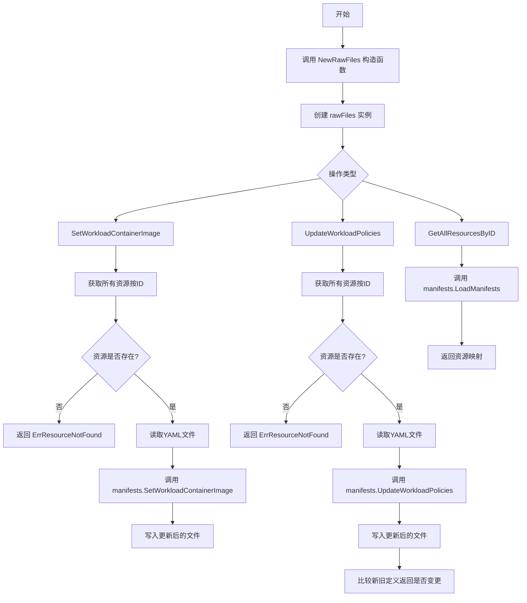
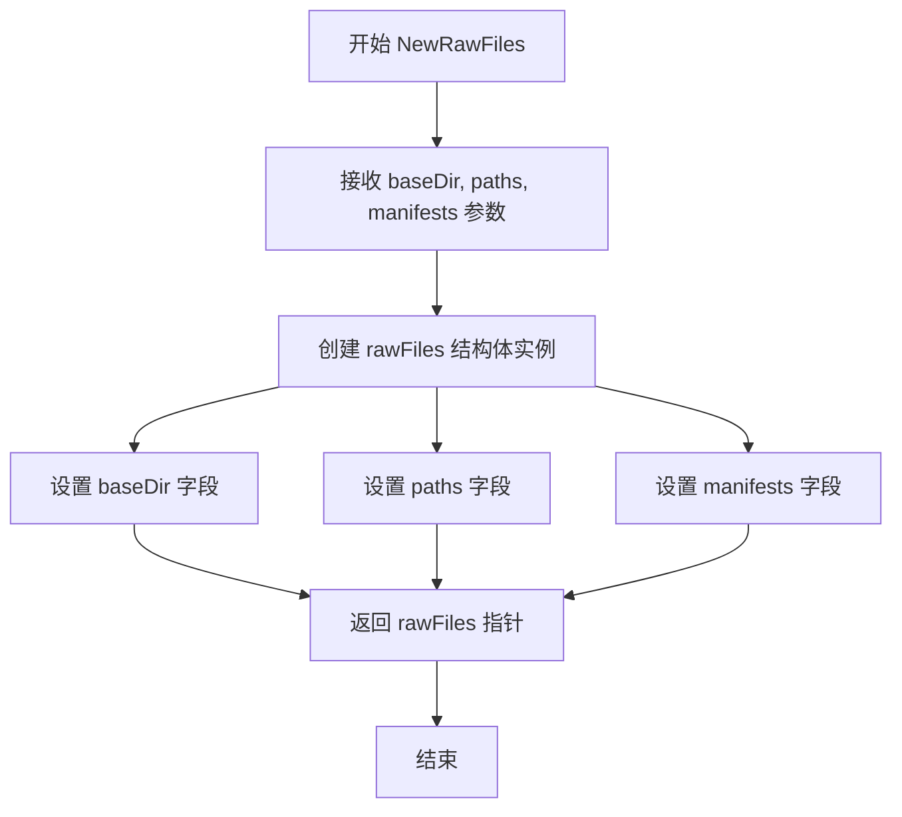
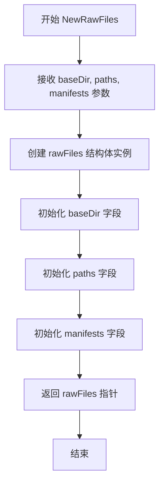
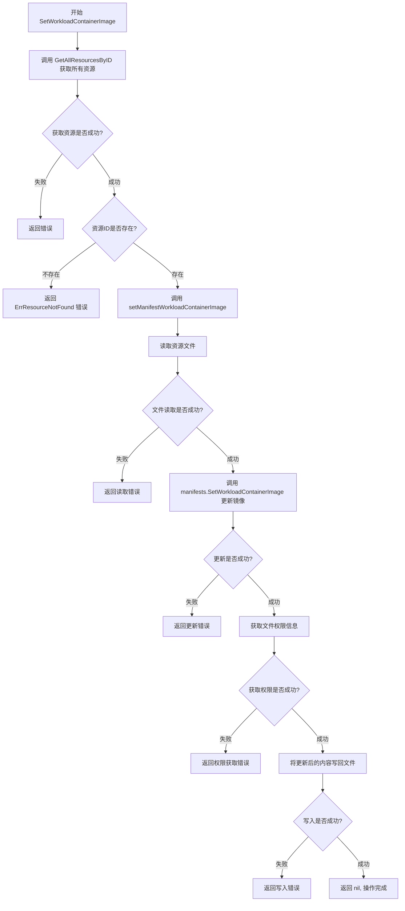
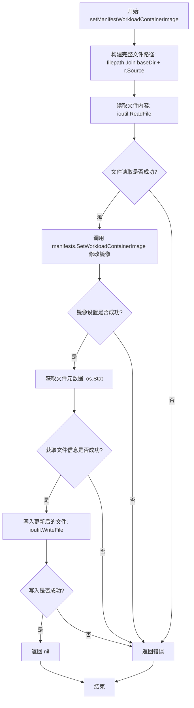
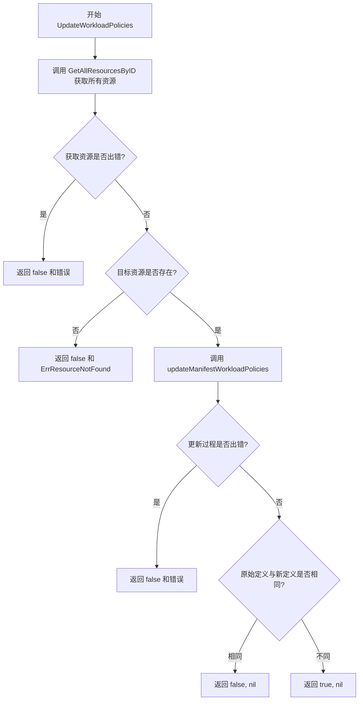
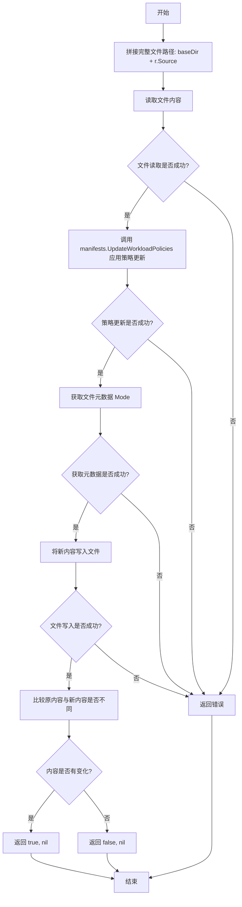
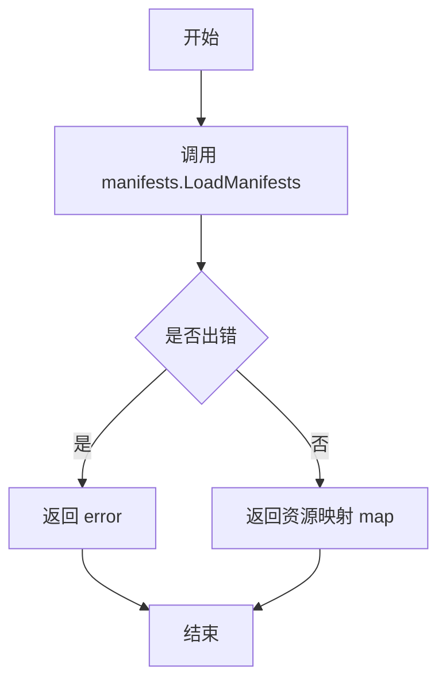

# `flux\pkg\manifests\rawfiles.go` 详细设计文档

该代码实现了一个基于文件系统YAML文件的配置存储 rawFiles，用于管理Kubernetes资源清单，支持更新工作负载容器镜像和工作负载策略，并提供资源加载功能

## 整体流程



## 类结构

```
rawFiles (存储实现结构体)
├── 字段: baseDir (string) - 基础目录路径
├── 字段: paths ([]string) - 文件路径列表
├── 字段: manifests (Manifests) - 清单操作接口
├── 方法: NewRawFiles() - 构造函数
├── 方法: SetWorkloadContainerImage() - 设置容器镜像
├── 方法: setManifestWorkloadContainerImage() - 内部设置镜像方法
├── 方法: UpdateWorkloadPolicies() - 更新工作负载策略
└── 方法: updateManifestWorkloadPolicies() - 内部更新策略方法
```

## 全局变量及字段


### `rawFiles.baseDir`
    
基础目录路径

类型：`string`
    


### `rawFiles.paths`
    
YAML文件路径列表

类型：`[]string`
    


### `rawFiles.manifests`
    
清单操作接口实现

类型：`Manifests`
    
    

## 全局函数及方法


### `NewRawFiles`

`NewRawFiles` 是 `rawFiles` 结构的构造函数，用于创建一个基于文件系统目录的清单存储实例。该函数接收基础目录、路径列表和清单接口实现作为参数，返回配置好的 `rawFiles` 指针，用于后续的资源读取和修改操作。

#### 参数

- `baseDir`：`string`，基础目录路径，指定包含 YAML 清单文件的基础目录
- `paths`：`[]string`，路径列表，指定要扫描的相对路径集合
- `manifests`：`Manifests`，清单接口，用于加载和处理清单文件的接口实现

#### 返回值

- `*rawFiles`：返回新创建的 `rawFiles` 实例指针，包含配置好的基础目录、路径和清单接口

#### 流程图



#### 带注释源码

```go
// NewRawFiles constructs a `Store` that assumes the provided
// directories contain plain YAML files
// NewRawFiles 是一个构造函数，用于创建一个基于文件系统目录的清单存储实例
// 参数：
//   - baseDir: 基础目录路径，指定包含 YAML 清单文件的根目录
//   - paths: 要扫描的相对路径列表
//   - manifests: Manifests 接口实现，用于加载和处理清单文件
// 返回值：
//   - *rawFiles: 返回配置好的 rawFiles 实例指针
func NewRawFiles(baseDir string, paths []string, manifests Manifests) *rawFiles {
    // 创建并返回 rawFiles 结构体实例
    // 初始化三个核心字段：baseDir、paths 和 manifests
    return &rawFiles{
        baseDir:   baseDir,   // 设置基础目录路径
        paths:     paths,     // 设置要扫描的路径列表
        manifests: manifests, // 设置清单处理接口
    }
}
```


### `NewRawFiles`

该函数是 `rawFiles` 类型的构造函数，用于创建一个新的 `rawFiles` 存储实例，该实例假设提供的目录包含普通的 YAML 配置文件。

参数：

- `baseDir`：`string`，基础目录路径，用于定位资源文件
- `paths`：`[]string`，包含资源文件路径的切片
- `manifests`：`Manifests`，清单接口实现，用于加载和处理清单文件

返回值：`*rawFiles`，返回指向新创建的 `rawFiles` 实例的指针

#### 流程图



#### 带注释源码

```go
// NewRawFiles constructs a `Store` that assumes the provided
// directories contain plain YAML files
// NewRawFiles 构建一个假设提供的目录包含普通 YAML 文件的 Store
func NewRawFiles(baseDir string, paths []string, manifests Manifests) *rawFiles {
    // 创建并返回一个新的 rawFiles 指针，初始化其三个字段
	return &rawFiles{
		baseDir:   baseDir,   // 设置基础目录路径
		paths:     paths,     // 设置资源文件路径列表
		manifests: manifests, // 设置清单接口实现
	}
}
```


### `rawFiles.SetWorkloadContainerImage`

设置指定资源中容器的镜像版本，通过读取资源文件、查找目标容器、更新镜像引用并写回文件来完成镜像设置操作。

参数：

- `ctx`：`context.Context`，用于控制请求的上下文，可包含超时、取消等信息
- `id`：`resource.ID`，要修改的资源唯一标识符
- `container`：`string`，要设置镜像的容器名称
- `newImageID`：`image.Ref`，新的容器镜像引用

返回值：`error`，如果设置成功返回nil，否则返回相应的错误信息

#### 流程图



#### 带注释源码

```go
// SetWorkloadContainerImage 设置指定资源中容器的镜像版本
// 参数：
//   - ctx: 上下文对象，用于控制超时和取消
//   - id: 资源ID，指定要修改的资源
//   - container: 容器名称，指定要修改的容器
//   - newImageID: 新的镜像引用
//
// 返回值：
//   - error: 操作过程中的错误信息，成功时返回nil
func (f *rawFiles) SetWorkloadContainerImage(ctx context.Context, id resource.ID, container string, newImageID image.Ref) error {
	// 第一步：获取所有资源，按ID索引
	resourcesByID, err := f.GetAllResourcesByID(ctx)
	if err != nil {
		// 获取资源失败，直接返回错误
		return err
	}
	
	// 第二步：根据ID查找目标资源
	r, ok := resourcesByID[id.String()]
	if !ok {
		// 资源不存在，返回资源未找到错误
		return ErrResourceNotFound(id.String())
	}
	
	// 第三步：调用内部方法完成镜像设置
	return f.setManifestWorkloadContainerImage(r, container, newImageID)
}
```


### `rawFiles.setManifestWorkloadContainerImage`

该方法是`rawFiles`类型的私有方法，用于在底层清单文件中更新指定资源的容器镜像。它读取资源对应的YAML文件，通过`manifests`接口的`SetWorkloadContainerImage`方法修改镜像信息，然后使用原始文件权限将更新后的内容写回磁盘。

参数：

- `r`：`resource.Resource`，包含资源元数据（如源文件路径和资源ID）
- `container`：`string`，要更新的容器名称
- `newImageID`：`image.Ref`，新的镜像引用（包括镜像仓库、标签等）

返回值：`error`，如果文件读写或镜像设置过程中发生错误则返回错误，否则返回nil

#### 流程图



#### 带注释源码

```go
// setManifestWorkloadContainerImage 更新指定资源文件中的容器镜像
// 参数：
//   - r: 资源对象，包含资源的源文件路径和资源ID
//   - container: 要更新的容器名称
//   - newImageID: 新的镜像引用
// 返回值：
//   - error: 操作过程中的错误信息
func (f *rawFiles) setManifestWorkloadContainerImage(r resource.Resource, container string, newImageID image.Ref) error {
	// 步骤1：构建资源的完整文件路径
	// 使用 baseDir 和资源对象中的 Source 字段拼接完整路径
	fullFilePath := filepath.Join(f.baseDir, r.Source())
	
	// 步骤2：读取原始文件内容
	// 将YAML文件内容读取到内存中
	def, err := ioutil.ReadFile(fullFilePath)
	if err != nil {
		// 如果读取失败，返回错误（例如文件不存在或权限不足）
		return err
	}
	
	// 步骤3：调用 manifests 接口修改容器镜像
	// 这里的 manifests 是抽象接口，可以处理不同格式的Kubernetes清单文件
	// 它会解析YAML，找到对应的容器定义，并更新镜像
	newDef, err := f.manifests.SetWorkloadContainerImage(def, r.ResourceID(), container, newImageID)
	if err != nil {
		// 如果修改失败，返回错误（例如容器名称不存在）
		return err
	}
	
	// 步骤4：获取原始文件的权限信息
	// 保留原始文件的权限（读、写、执行）很重要，以避免更改文件权限
	fi, err := os.Stat(fullFilePath)
	if err != nil {
		return err
	}
	
	// 步骤5：将更新后的内容写回文件
	// 使用原始文件的权限模式，保持文件元数据不变
	return ioutil.WriteFile(fullFilePath, newDef, fi.Mode())
}
```

---

### 上下文补充信息

#### 1. 类的完整信息

`rawFiles`类（结构体）字段：

- `baseDir`：`string`，基础目录路径，用于定位清单文件
- `paths`：`[]string`，要扫描的路径列表
- `manifests`：`Manifests`，清单文件操作接口，负责实际的YAML解析和修改

#### 2. 关键组件

- **`Manifests`接口**：抽象了清单文件的读写操作，使得`rawFiles`可以支持不同格式的Kubernetes资源定义
- **`resource.Resource`**：资源对象，包含资源的标识、源文件路径等信息
- **`image.Ref`**：镜像引用对象，包含镜像仓库地址、标签等

#### 3. 技术债务与优化空间

- **无事务性保证**：当前实现是先读后写，如果写入失败，文件内容已被修改但未完全更新，可能导致状态不一致
- **缺少文件锁定**：并发调用时可能出现竞态条件，多个进程同时修改同一文件可能导致数据丢失
- **内存占用**：一次性读取整个文件到内存，对于大型清单文件可能产生内存压力
- **错误处理粒度**：所有错误都直接返回原始错误，调用方难以区分具体失败原因（如文件不存在 vs 权限不足 vs 镜像设置失败）

#### 4. 设计约束与注意事项

- 该方法是私有方法，仅供`SetWorkloadContainerImage`公开方法调用
- 文件写入使用原始文件的权限模式，这是为了避免改变文件的访问权限
- 调用方必须确保资源对象中的`Source()`返回的路径是相对于`baseDir`的相对路径


### `rawFiles.UpdateWorkloadPolicies`

更新工作负载策略，修改指定资源以应用策略更新。如果资源中的策略实际发生了变更则返回 true，否则返回 false。

参数：

- `ctx`：`context.Context`，上下文对象，用于控制请求的生命周期和传递取消信号
- `id`：`resource.ID`，要更新的目标资源标识符
- `update`：`resource.PolicyUpdate`，包含要应用的策略更新内容（如镜像策略、分发策略等）

返回值：`bool, error`，如果资源中的策略发生了实际变更返回 true，未发生变更返回 false；出现错误时返回相应的错误信息

#### 流程图



#### 带注释源码

```go
// UpdateWorkloadPolicies modifies a resource in the store to apply the policy-update specified.
// It returns whether a change in the resource was actually made as a result of the change
func (f *rawFiles) UpdateWorkloadPolicies(ctx context.Context, id resource.ID, update resource.PolicyUpdate) (bool, error) {
	// Step 1: 获取所有资源，通过资源ID映射表进行快速查找
	resourcesByID, err := f.GetAllResourcesByID(ctx)
	if err != nil {
		// 如果获取资源失败，直接返回错误
		return false, err
	}
	// Step 2: 根据传入的ID查找目标资源
	r, ok := resourcesByID[id.String()]
	if !ok {
		// 如果资源不存在，返回资源未找到错误
		return false, ErrResourceNotFound(id.String())
	}
	// Step 3: 调用内部方法执行实际的策略更新逻辑
	return f.updateManifestWorkloadPolicies(r, update)
}
```


### `rawFiles.updateManifestWorkloadPolicies`

这是一个内部方法，用于更新存储在工作负载清单文件中的策略。它读取资源对应的 YAML 文件，应用策略更新，然后写回文件，并通过比较新旧内容判断是否实际发生了变更。

**参数：**

- `r`：`resource.Resource`，目标资源对象，包含资源的源文件路径信息
- `update`：`resource.PolicyUpdate`，策略更新内容，包含需要应用的策略变更

**返回值：**

- `bool`，表示资源内容是否实际发生了变更（返回 true 表示有变更）
- `error`，操作过程中的错误信息（如文件读写失败、策略应用失败等）

#### 流程图



#### 带注释源码

```go
// updateManifestWorkloadPolicies 是 rawFiles 类型的私有方法，用于内部更新资源清单中的策略
// 参数 r: resource.Resource 类型，表示需要更新的目标资源，包含资源路径等元信息
// 参数 update: resource.PolicyUpdate 类型，表示策略的更新内容（如添加/移除标签、注解等）
// 返回值 bool: 表示资源文件内容是否实际发生了变更
// 返回值 error: 如果在读取文件、应用策略或写入文件时发生错误，则返回错误信息
func (f *rawFiles) updateManifestWorkloadPolicies(r resource.Resource, update resource.PolicyUpdate) (bool, error) {
    // 步骤1: 拼接资源的完整文件路径，使用 baseDir 和资源的 Source 路径
    fullFilePath := filepath.Join(f.baseDir, r.Source())
    
    // 步骤2: 读取清单文件内容到内存
    def, err := ioutil.ReadFile(fullFilePath)
    if err != nil {
        // 文件读取失败时直接返回错误
        return false, err
    }
    
    // 步骤3: 调用 manifests 组件的 UpdateWorkloadPolicies 方法
    // 该方法负责解析 YAML、修改策略并重新序列化为新的定义
    newDef, err := f.manifests.UpdateWorkloadPolicies(def, r.ResourceID(), update)
    if err != nil {
        // 策略更新失败时返回错误
        return false, err
    }
    
    // 步骤4: 获取原始文件的权限模式（Mode），以便写回时保持相同的权限
    fi, err := os.Stat(fullFilePath)
    if err != nil {
        // 获取文件状态失败时返回错误
        return false, err
    }
    
    // 步骤5: 将更新后的内容写回原文件
    if err := ioutil.WriteFile(fullFilePath, newDef, fi.Mode()); err != nil {
        // 文件写入失败时返回错误
        return false, err
    }
    
    // 步骤6: 比较原始内容和新内容是否发生变化
    // bytes.Compare 返回 0 表示相等，非 0 表示不同
    return bytes.Compare(def, newDef) != 0, nil
}
```


### `rawFiles.GetAllResourcesByID`

该方法用于加载存储中的所有资源，并返回一个由资源ID索引的资源映射map。

参数：
- `ctx`：`context.Context`，上下文参数（用于传递请求范围的取消信号和截止时间，但在当前实现中未使用）

返回值：`map[string]resource.Resource, error`，返回资源ID到资源对象的映射，以及可能的错误信息

#### 流程图



#### 带注释源码

```go
// Load all the resources in the store. The returned map is indexed by the resource IDs
// 加载存储中的所有资源。返回的映射由资源ID索引
func (f *rawFiles) GetAllResourcesByID(_ context.Context) (map[string]resource.Resource, error) {
    // 直接调用 manifests 对象的 LoadManifests 方法，传入基础目录和路径列表
    // 返回资源ID到资源对象的映射，以及可能发生的错误
    return f.manifests.LoadManifests(f.baseDir, f.paths)
}
```

## 关键组件


### rawFiles 结构体

核心数据结构，用于管理本地文件系统中的原始YAML manifest文件，提供对工作负载容器镜像和策略的更新能力。

### NewRawFiles 构造函数

创建并初始化 rawFiles 实例，接收基础目录、路径列表和Manifests接口实现作为参数，返回配置好的rawFiles指针。

### SetWorkloadContainerImage 方法

公开的镜像设置接口，通过资源ID查找对应资源，调用内部方法完成镜像更新，支持上下文控制和错误传播。

### setManifestWorkloadContainerImage 方法

实际执行镜像更新的内部方法，读取YAML文件内容，调用manifests接口转换镜像，保留原文件权限后写回磁盘。

### UpdateWorkloadPolicies 方法

公开的策略更新接口，查找目标资源并调用内部方法应用策略变更，返回是否实际发生变更的布尔值。

### updateManifestWorkloadPolicies 方法

实际执行策略更新的内部方法，读取manifest文件，应用策略更新，通过字节比较判断文件是否被修改，支持完整的错误处理流程。

### GetAllResourcesByID 方法

资源加载入口点，按需加载所有manifest文件并返回资源ID到资源对象的映射Map，实现惰性加载机制。


## 问题及建议


### 已知问题

-   **文件读写无事务性保证**：在 `setManifestWorkloadContainerImage` 和 `updateManifestWorkloadPolicies` 中，先读取文件、修改后再写入，如果写入过程中发生错误（如磁盘满、权限问题），原文件内容已读取但写入失败，导致修改丢失且无回滚机制
-   **重复的代码逻辑**：`setManifestWorkloadContainerImage` 和 `updateManifestWorkloadPolicies` 方法包含几乎相同的文件读写逻辑（读取文件、获取文件权限、写入文件），违反了 DRY 原则
-   **重复调用 GetAllResourcesByID**：在 `SetWorkloadContainerImage` 和 `UpdateWorkloadPolicies` 中，每次调用都会重新加载所有资源文件，当资源文件较多时性能较差
-   **无并发控制**：多个 goroutine 同时调用修改方法时，可能产生竞态条件，导致文件内容损坏或数据不一致
-   **路径安全验证缺失**：直接使用 `filepath.Join(f.baseDir, r.Source())` 拼接路径，未验证 `r.Source()` 是否存在路径遍历攻击（如 `../../etc/passwd`）
-   **错误信息不够具体**：`ioutil.ReadFile`、`os.Stat`、`ioutil.WriteFile` 的错误直接返回，未添加上下文信息（如具体哪个文件路径出错）
-   **文件权限处理潜在问题**：使用原文件的 `fi.Mode()` 写入新内容，可能丢失文件特殊权限（如 setuid/setgid），且未考虑不同平台的权限语义差异

### 优化建议

-   **提取公共文件操作方法**：将读文件、获取权限、写文件的逻辑抽取为独立的私有方法（如 `readManifestFile`、`writeManifestFile`），减少代码重复
-   **添加资源缓存机制**：在 `rawFiles` 结构体中增加资源缓存字段，避免每次操作都重新加载所有资源，支持缓存失效策略
-   **引入文件锁或事务机制**：使用 `flock` 或自定义文件锁确保并发修改的安全性，或考虑先写临时文件再原子重命名的策略
-   **增强路径验证**：在拼接路径后使用 `filepath.Clean` 和 `strings.HasPrefix` 验证最终路径仍在 `baseDir` 目录下，防止路径遍历
-   **改进错误包装**：使用 `fmt.Errorf` 或专门的错误包装函数，为每个底层错误添加文件路径和操作描述
-   **添加日志记录**：在关键操作点（读取、写入、错误）添加日志记录，便于调试和审计
-   **考虑接口抽象**：将文件操作抽象为接口，提高可测试性（可注入 mock 文件系统）


## 其它


### 设计目标与约束

本模块的设计目标是提供一个基于文件系统（本地YAML文件）的Kubernetes资源存储实现，支持对存储中的资源进行容器镜像更新和策略修改。核心约束包括：(1) 仅支持本地文件系统，不支持远程存储；(2) 依赖Manifests接口进行实际的YAML解析和修改；(3) 资源ID必须唯一且可从文件路径推导；(4) 文件操作使用同步写入，确保一致性。

### 错误处理与异常设计

错误处理采用Go语言的显式错误返回模式。主要错误类型包括：资源未找到错误（ErrResourceNotFound），通过自定义函数返回带有资源ID信息的错误；文件读写错误直接透传底层ioutil错误；镜像设置和策略更新错误由Manifests接口返回。关键异常场景包括：文件不存在、文件权限不足、YAML格式错误、资源ID不匹配、并发写入冲突等。建议增加重试机制和更细粒度的错误分类。

### 数据流与状态机

数据流主要分为三个操作流程：镜像更新流程（GetAllResourcesByID → 查找资源 → 读取文件 → 解析YAML → 修改镜像 → 写回文件）；策略更新流程（类似镜像更新但调用UpdateWorkloadPolicies）；资源加载流程（调用manifests.LoadManifests扫描baseDir和paths下的所有YAML文件）。状态机相对简单，主要状态包括：资源存在于内存缓存、资源已从磁盘加载、文件正在被修改、修改已持久化。暂无复杂的状态转换逻辑。

### 外部依赖与接口契约

主要外部依赖包括：(1) github.com/fluxcd/flux/pkg/image - 镜像引用类型定义；(2) github.com/fluxcd/flux/pkg/resource - 资源ID和策略类型定义；(3) 标准库io/ioutil、os、path/filepath - 文件操作；(4) Manifests接口 - 核心抽象，需实现LoadManifests、SetWorkloadContainerImage、UpdateWorkloadPolicies三个方法。接口契约：Manifests.LoadManifests返回map[string]resource.Resource；SetWorkloadContainerImage和UpdateWorkloadPolicies接收字节数组和资源ID，返回修改后的字节数组和错误。

### 性能考虑

当前实现存在以下性能瓶颈：(1) 每次操作都重新读取和解析所有资源文件，GetAllResourcesByID无缓存；(2) 镜像更新和策略修改都需要完整读写文件，无增量更新；(3) 文件操作使用同步IO，无并发保护。建议优化方向：引入资源缓存层、批量操作支持、文件监控机制、读写锁或乐观锁机制。

### 安全性考虑

安全性风险包括：(1) 文件路径直接拼接，存在路径遍历攻击风险（虽然当前baseDir受控）；(2) 文件权限保留使用os.Stat获取，可能保留过于宽松的权限；(3) 无操作审计日志。建议增加路径规范化验证、权限最小化设置、操作日志记录。

### 测试策略

建议测试覆盖包括：单元测试（Mock Manifests接口测试各方法）、集成测试（测试实际文件系统读写操作）、边界条件测试（空目录、无权限文件、不存在资源ID）、并发测试（多goroutine同时修改同一文件）。当前代码缺少测试文件。

### 并发模型与线程安全性

当前实现非线程安全，多goroutine同时调用SetWorkloadContainerImage或UpdateWorkloadPolicies可能导致文件数据竞争。建议使用sync.Mutex保护文件写入操作，或采用文件锁机制（flock）。读写操作之间也需要适当的同步机制。

### 资源标识与文件映射机制

资源通过resource.ID作为唯一标识，存储在map[string]resource.Resource中。资源与文件的映射关系由resource.Resource的Source()方法返回的相对路径决定。baseDir与paths共同决定了扫描的文件范围。需要确保资源ID的唯一性和Source()返回路径的正确性。

### 配置文件与参数

主要配置参数包括：baseDir（基础目录，字符串类型，YAML文件的根目录）、paths（相对路径数组，需要扫描的子目录或文件模式）、manifests（Manifests接口实现，处理实际YAML解析和修改）。建议增加配置验证：baseDir必须为绝对路径、paths不能包含".."、manifests不能为nil。

### 版本兼容性与演化

当前代码未定义版本接口，可能存在接口兼容性风险。建议：明确Manifests接口的版本号；增加API版本标记；在接口变更时提供迁移路径；考虑使用Go module管理依赖版本。

### 部署与运维注意事项

部署要求：运行用户需具备baseDir及所有目标文件的读写权限；建议单独部署以限制权限范围。运维建议：定期备份YAML文件；配置监控告警（文件修改失败告警）；考虑与GitOps流程集成；日志需记录操作详情便于问题排查。


    