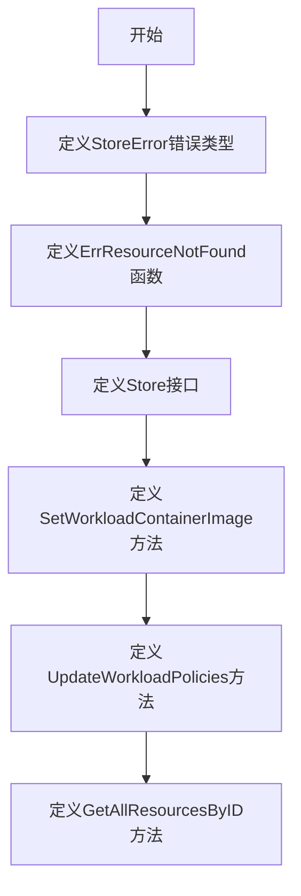
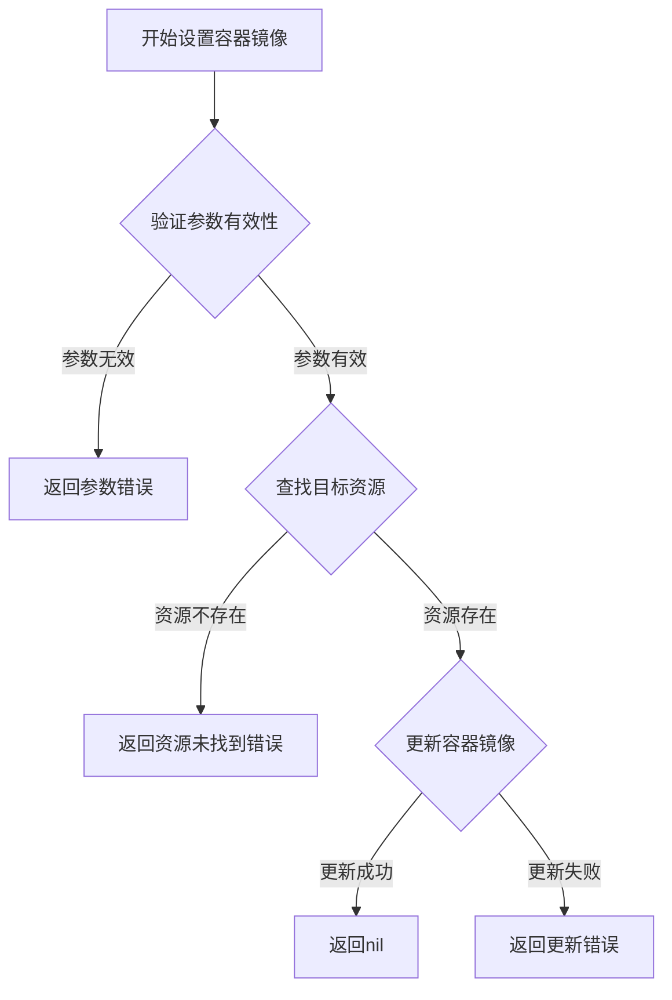
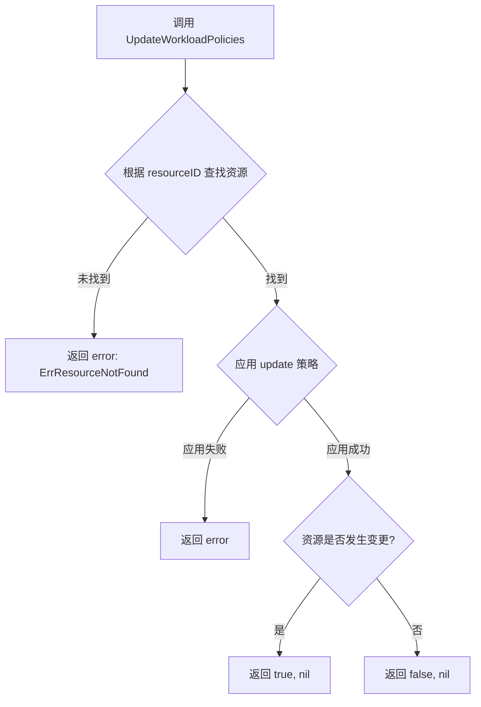
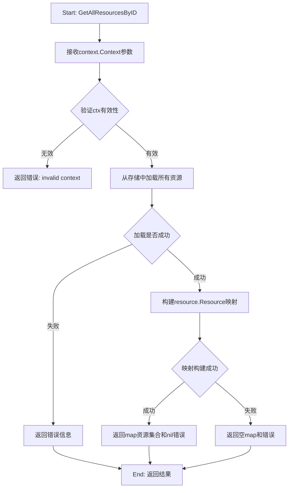

# `flux\pkg\manifests\store.go` 详细设计文档

这是Flux CD的清单管理模块，定义了Store接口和错误类型，用于管理Git仓库中的Kubernetes集群资源，支持设置容器镜像、更新工作负载策略和获取所有资源等功能。

## 整体流程



## 类结构

```
StoreError (错误类型)
├── error (嵌入错误)
Store (接口)
├── SetWorkloadContainerImage
├── UpdateWorkloadPolicies
└── GetAllResourcesByID
```

## 全局变量及字段


### `ErrResourceNotFound`
    
返回一个表示指定名称资源未找到的错误

类型：`func(name string) error`
    


### `StoreError.error`
    
嵌入的基础错误类型，用于包装具体的错误信息

类型：`error`
    
    

## 全局函数及方法


### `ErrResourceNotFound`

生成一个表示资源未找到的 StoreError 错误。

参数：

- `name`：`string`，要查找的资源的名称

返回值：`error`，返回一个包含资源未找到信息的 StoreError 错误

#### 流程图

```mermaid
flowchart TD
    A[开始] --> B[接收资源名称 name]
    B --> C[使用 fmt.Errorf 创建错误消息: 'resource {name} not found']
    C --> D[将错误包装成 StoreError 类型]
    D --> E[返回 error]
    E --> F[结束]
```

#### 带注释源码

```go
// ErrResourceNotFound 生成一个表示资源未找到的 StoreError 错误
// 参数 name: 要查找的资源的名称
// 返回值: 包含资源未找到信息的 StoreError 错误
func ErrResourceNotFound(name string) error {
    // 使用 fmt.Errorf 格式化错误消息，嵌入资源名称
    // 然后将基础 error 包装进 StoreError 结构体中返回
    return StoreError{fmt.Errorf("resource %s not found", name)}
}
```


### `Store.SetWorkloadContainerImage`

设置指定资源的容器镜像，用于更新存储中已存在的Kubernetes资源的容器镜像。

参数：

- `ctx`：`context.Context`，请求的上下文，用于控制超时和取消操作
- `resourceID`：`resource.ID`，目标资源的唯一标识符，用于定位需要更新的资源
- `container`：`string`，容器名称，指定要更新哪个容器的镜像
- `newImageID`：`image.Ref`，新的镜像引用，包含镜像的完整路径和版本信息

返回值：`error`，如果设置镜像成功则返回nil，如果发生错误（如资源未找到、镜像格式无效等）则返回具体的错误信息

#### 流程图



#### 带注释源码

```go
// Store manages all the cluster resources defined in a checked out repository, explicitly declared
// in a file or not e.g., generated and updated by a .flux.yaml file, explicit Kubernetes .yaml manifests files ...
type Store interface {
    // Set the container image of a resource in the store
    // 参数说明：
    // - ctx: 上下文对象，用于传递请求范围内的取消信号和超时控制
    // - resourceID: 资源的唯一标识符，用于在存储中定位目标Kubernetes资源
    // - container: 容器名称，指定要更新镜像的具体容器实例
    // - newImageID: 新的镜像引用对象，包含镜像的仓库、名称和标签信息
    // 返回值说明：
    // - error: 操作失败时返回错误，成功时返回nil
    SetWorkloadContainerImage(ctx context.Context, resourceID resource.ID, container string, newImageID image.Ref) error
    
    // UpdateWorkloadPolicies modifies a resource in the store to apply the policy-update specified.
    // It returns whether a change in the resource was actually made as a result of the change
    UpdateWorkloadPolicies(ctx context.Context, resourceID resource.ID, update resource.PolicyUpdate) (bool, error)
    
    // Load all the resources in the store. The returned map is indexed by the resource IDs
    GetAllResourcesByID(ctx context.Context) (map[string]resource.Resource, error)
}
```


### `Store.UpdateWorkloadPolicies`

修改存储中的资源以应用指定的策略更新，并返回资源是否因该操作而实际发生了更改。

参数：
- `ctx`：`context.Context`，上下文信息，用于控制请求的生命周期（如超时、取消）。
- `resourceID`：`resource.ID`，目标工作负载资源的唯一标识符。
- `update`：`resource.PolicyUpdate`，包含要应用的策略更新详情（如镜像策略、环境变量策略等）。

返回值：
- `bool`，表示资源是否被修改。如果策略应用后资源状态发生了变化，返回 `true`；否则返回 `false`。
- `error`，如果发生错误（如资源不存在或更新失败），则返回错误；否则返回 `nil`。

#### 流程图



#### 带注释源码

```go
// UpdateWorkloadPolicies modifies a resource in the store to apply the policy-update specified.
// It returns whether a change in the resource was actually made as a result of the change
UpdateWorkloadPolicies(ctx context.Context, resourceID resource.ID, update resource.PolicyUpdate) (bool, error)
```


### `Store.GetAllResourcesByID`

获取存储库中所有集群资源的映射集合。该方法返回以资源ID为键、资源对象为值的映射，用于访问仓库中定义的所有Kubernetes资源（包括显式声明的和由.flux.yaml文件生成及更新的资源）。

参数：

- `ctx`：`context.Context`，Go标准库的上下文对象，用于传递取消信号、截止时间以及请求级别的值

返回值：

- `map[string]resource.Resource`：资源映射表，键为资源ID字符串，值为resource.Resource类型的资源对象
- `error`：执行过程中的错误信息，如果成功则返回nil

#### 流程图



#### 带注释源码

```go
// GetAllResourcesByID 方法用于获取存储中所有的资源
// 参数 ctx 是Go语言的上下文对象，用于控制请求的生命周期（如超时、取消等）
// 返回值是一个 map[string]resource.Resource，键为资源ID，值为资源对象
// 如果发生错误，返回 error 类型
func (s *某具体实现类型) GetAllResourcesByID(ctx context.Context) (map[string]resource.Resource, error) {
    // 1. 首先检查上下文是否已被取消
    // 这是Go语言处理超时和取消的标准做法
    if err := ctx.Err(); err != nil {
        return nil, err
    }
    
    // 2. 初始化结果映射
    // 使用make创建map，预分配适当容量以提高性能
    resources := make(map[string]resource.Resource)
    
    // 3. 遍历所有已加载的资源文件
    // 这里假设内部维护了一个资源列表
    for _, resource := range s.resources {
        // 4. 获取资源的唯一标识符
        // resource.ID() 返回 resource.ID 类型
        id := resource.ID()
        
        // 5. 将资源添加到结果映射中
        // 键为ID的字符串表示，值为资源对象本身
        resources[id.String()] = resource
    }
    
    // 6. 返回完整的资源映射
    // 成功情况下 error 返回值为 nil
    return resources, nil
}
```

#### 备注说明

该方法是`Store`接口的核心查询方法之一，实现了资源清单的完整加载功能。在FluxCD架构中，此方法供其他组件（如图像自动化、策略更新等）查询集群资源状态使用。实现时需确保返回的资源映射反映仓库中最新的资源定义状态。

## 关键组件


### Store 接口

核心接口，定义了存储和操作集群资源的方法集合，包括设置容器镜像、更新策略、获取资源等功能。

### StoreError 错误类型

错误包装类型，用于封装存储操作过程中产生的错误，提供统一的错误处理机制。

### ErrResourceNotFound 函数

错误工厂函数，根据传入的资源名称生成"资源未找到"的错误信息，用于在资源不存在时返回标准化错误。

### SetWorkloadContainerImage 方法

接口方法，用于设置指定资源的容器镜像，接收上下文、资源ID、容器名称和新镜像引用作为参数。

### UpdateWorkloadPolicies 方法

接口方法，用于更新资源的策略配置，返回布尔值表示是否实际发生了变更，接收上下文、资源ID和策略更新对象作为参数。

### GetAllResourcesByID 方法

接口方法，用于加载并返回存储中的所有资源，以资源ID为键的map形式返回，便于快速查找和遍历资源。

### resource.ID 类型

资源标识符类型，用于唯一标识集群中的资源对象，是资源操作的核心参数。

### image.Ref 类型

镜像引用类型，用于表示和操作容器镜像的引用，包含了镜像的仓库、标签等关键信息。

### resource.PolicyUpdate 类型

策略更新类型，封装了需要应用到资源上的策略变更内容，用于描述具体的策略修改。

### resource.Resource 类型

资源对象类型，代表 Kubernetes 集群中的资源实体，是存储管理的核心数据对象。


## 问题及建议


### 已知问题

-   **StoreError 结构体设计冗余**：`StoreError` 仅包装了一个 `error`，没有提供任何额外的功能或方法（如错误码、错误上下文等），使用 `StoreError{fmt.Errorf(...)}` 与直接返回 `fmt.Errorf(...)` 几乎没有区别，失去了结构体封装的意义。
-   **资源 ID 类型不一致**：`Store` 接口中 `SetWorkloadContainerImage` 和 `UpdateWorkloadPolicies` 方法使用 `resource.ID` 作为参数，但在 `GetAllResourcesByID` 方法中返回 `map[string]resource.Resource`，这种类型不统一可能导致调用方需要做类型转换，且不符合类型安全原则。
-   **错误处理机制薄弱**：接口方法仅返回通用 `error`，未定义具体的错误类型（如 `ErrResourceNotFound`、`ErrPermissionDenied` 等），调用方难以精确判断错误原因并做出相应处理。
-   **缺少资源筛选与分页机制**：`GetAllResourcesByID` 一次性返回所有资源，对于大规模集群场景可能导致内存占用过高、网络传输量大，缺乏按命名空间、标签等条件筛选或分页获取的能力。
-   **无事务或批量操作支持**：接口未提供原子性操作或多资源批量修改的能力，在需要保证数据一致性的场景下（如批量更新多个工作负载策略）存在局限性。
-   **上下文超时与取消未明确**：虽然方法接收 `context.Context` 参数，但未约定超时处理机制或调用方应如何设置合理的超时值。
-   **策略更新结果反馈不具体**：`UpdateWorkloadPolicies` 仅返回布尔值表示是否发生变化，未返回具体变更内容（如修改了哪些策略、变更前后的值），不利于审计和调试。

### 优化建议

-   **重构 StoreError**：考虑为 `StoreError` 添加错误码、错误类别或错误上下文信息，或直接移除该结构体，使用标准错误处理方式。
-   **统一资源 ID 类型**：将 `GetAllResourcesByID` 的返回类型改为 `map[resource.ID]resource.Resource`，或定义新的类型别名以保持一致性。
-   **定义具体错误类型**：在包内定义具体的错误变量（如 `var ErrResourceNotFound = errors.New("resource not found")`），或在 `StoreError` 中添加错误码字段，便于调用方精确处理。
-   **增加资源查询接口**：新增支持条件筛选（按命名空间、标签、资源类型等）和分页的查询方法，如 `GetResources(ctx context.Context, filter ResourceFilter, pagination Pagination) ([]resource.Resource, error)`。
-   **引入事务或批量操作**：设计 `BatchUpdater` 或类似接口，支持原子性批量修改，并在方法签名中明确事务边界。
-   **完善方法返回值**：为 `UpdateWorkloadPolicies` 返回具体的变更详情（如 `resource.PolicyUpdate` 包含变更字段、新旧值对比），或提供审计日志接口。
-   **增加上下文使用指南**：在接口文档或实现示例中明确说明 context 的预期使用方式（如超时时间、取消场景）。


## 其它


### 设计目标与约束

本代码定义了一个通用的资源存储接口 Store，用于管理 GitOps 仓库中的 Kubernetes 资源。设计目标是解耦资源管理层与具体的存储实现，允许不同的存储后端（如文件系统、Git 仓库等）通过统一的接口进行资源操作。核心约束包括：必须支持通过 resource.ID 定位资源、支持容器镜像更新、支持策略更新、必须返回完整的资源映射表。

### 错误处理与异常设计

定义 StoreError 错误类型用于封装存储层错误，提供 ErrResourceNotFound 函数生成资源未找到的错误。当 SetWorkloadContainerImage、UpdateWorkloadPolicies 或 GetAllResourcesByID 方法执行失败时，应返回具体的错误信息，包括资源 ID 和失败原因。调用方需要检查返回值中的 error 是否为 nil 来判断操作是否成功。

### 数据流与状态机

Store 接口本身不维护状态，其方法调用是幂等的。数据流如下：调用方通过 ctx 传递上下文信息，传入 resource.ID 定位特定资源，通过 image.Ref 或 resource.PolicyUpdate 传递更新数据。GetAllResourcesByID 返回完整的资源映射，调用方可在内存中进行进一步处理。状态变更通过返回的 bool 值（UpdateWorkloadPolicies）或新的资源映射（GetAllResourcesByID）体现。

### 外部依赖与接口契约

依赖两个外部包：github.com/fluxcd/flux/pkg/image 提供 image.Ref 类型用于表示容器镜像引用，github.com/fluxcd/flux/pkg/resource 提供 resource.ID、resource.Resource 和 resource.PolicyUpdate 类型。调用方必须实现 Store 接口的具体类型。参数 ctx 必须有效且可取消。resourceID 参数必须指向存在的资源，否则返回 ErrResourceNotFound 错误。

### 并发与线程安全考虑

Store 接口方法通过 ctx 参数支持取消和超时控制，但接口本身不保证线程安全。具体的实现类需要自行处理并发访问，如果需要并发安全应在实现中引入锁机制或使用 sync 包。多个 goroutine 并发调用同一 Store 实例时，实现类必须确保数据一致性。

### 性能考虑与优化建议

GetAllResourcesByID 返回完整的资源映射，可能在大规模集群中产生性能问题。建议实现类考虑缓存机制或按需加载。UpdateWorkloadPolicies 返回 bool 值表示是否有变更，调用方可以利用此信息避免不必要的提交操作。ctx 参数允许调用方设置超时，应根据资源数量合理设置超时时间。

### 安全考虑

代码本身不直接处理敏感数据，但 Store 的实现类需要考虑：资源定义中可能包含敏感信息（如 Secret 资源），应避免在日志中输出敏感字段。ctx 可能包含认证信息，实现类应正确传递和使用。资源更新操作需要权限验证，具体权限检查由实现类负责。

### 测试策略

由于 Store 是接口定义，测试主要面向具体实现类。接口契约测试应验证：传入无效 resourceID 时返回 ErrResourceNotFound，SetWorkloadContainerImage 正确更新资源镜像字段，UpdateWorkloadPolicies 正确应用策略变更并返回正确的布尔值，GetAllResourcesByID 返回正确的资源映射。Mock 实现可用于上层依赖 Store 接口的组件测试。

### 版本兼容性

当前接口版本为 v1，后续如果需要添加新方法应使用向后兼容的方式（如新增可选方法或新接口）。依赖的 flux 包版本可能影响 resource 和 image 类型的结构，应在项目中明确声明依赖版本。接口调用方应处理可能返回的错误类型兼容性。

    