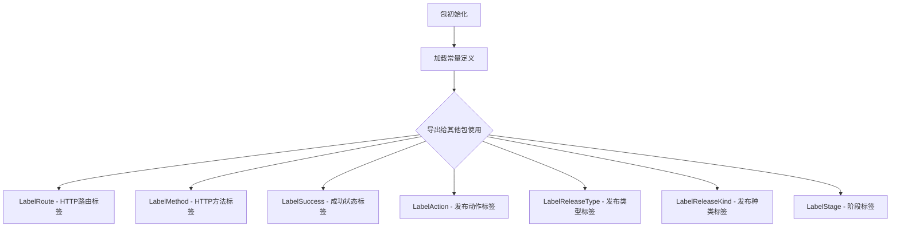

# `flux\pkg\metrics\metrics.go` 详细设计文档

该代码定义了一个Go语言的metrics包，用于声明Flux系统中指标追踪所需的常量标签，包括通用标签（路由、方法、成功状态）和发布相关的标签（动作、发布类型、发布种类、阶段）。

## 整体流程



## 类结构

```
metrics 包 (根包)
└── 常量定义
    ├── 通用标签常量
    │   ├── LabelRoute
    │   ├── LabelMethod
    │   └── LabelSuccess
    └── 发布指标标签常量
        ├── LabelAction
        ├── LabelReleaseType
        ├── LabelReleaseKind
        └── LabelStage
```

## 全局变量及字段


### `LabelRoute`
    
用于标识路由的指标标签

类型：`string`
    


### `LabelMethod`
    
用于标识HTTP方法的指标标签

类型：`string`
    


### `LabelSuccess`
    
用于标识操作成功与否的指标标签

类型：`string`
    


### `LabelAction`
    
用于标识发布操作行为的指标标签

类型：`string`
    


### `LabelReleaseType`
    
用于标识发布类型的指标标签

类型：`string`
    


### `LabelReleaseKind`
    
用于标识发布种类的指标标签

类型：`string`
    


### `LabelStage`
    
用于标识发布阶段的指标标签

类型：`string`
    


    

## 全局函数及方法


## 关键组件


### 常量定义模块

该代码模块定义了Flux指标系统中使用的所有标签常量，用于对指标数据进行分类和标识。

### LabelRoute（路由标签）

用于标识HTTP请求的路由路径

### LabelMethod（方法标签）

用于标识HTTP请求的方法（GET、POST等）

### LabelSuccess（成功标签）

用于标识请求是否成功（true/false）

### LabelAction（操作标签）

用于发布相关指标，标识发布操作的具体行为

### LabelReleaseType（发布类型标签）

用于标识发布的类型

### LabelReleaseKind（发布种类标签）

用于标识发布的种类

### LabelStage（阶段标签）

用于标识发布流程中的阶段


## 问题及建议


### 已知问题

- **缺少包级文档注释**：整个包仅有文件级注释说明用于Flux的指标标签，但没有详细说明用途、使用场景或与外部系统的关联
- **常量缺乏分组标识**：使用匿名iota索引（隐式从0开始），不便于区分通用标签组和发布指标标签组的边界
- **无标签值验证机制**：标签仅定义为字符串常量，调用方可能传入非法或未预定义的标签值，缺乏运行时或编译时的类型安全校验
- **缺乏错误处理设计**：未提供错误类型定义或校验失败时的处理机制
- **扩展性不足**：随着指标体系增长，常量散落在单一文件中会导致维护困难，且无接口抽象约束实现一致性

### 优化建议

- 为包、每个常量组及关键常量添加Godoc注释，说明其语义和适用场景
- 使用带命名的iota或显式赋值明确区分常量组，例如：
  ```go
  const (
      // 通用标签（0x1000开始）
      _ = iota + 0x1000
      LabelRoute
      LabelMethod
      LabelSuccess
  )
  ```
- 引入标签值验证函数（如`ValidateLabel`）或定义自定义类型（`type Label string`）以增强类型安全
- 考虑将相关标签封装为结构体或接口，提供统一的标签集合定义（如`CommonLabels`、`ReleaseLabels`）
- 添加错误定义（如`ErrInvalidLabel`）以支持一致的异常处理流程
- 提供使用示例或基准测试代码，帮助其他开发者理解正确用法


## 其它


### 设计目标与约束

本代码的设计目标是定义Flux系统中用于监控和指标追踪的标准化标签集合。约束包括：标签名称必须与外部监控系统（如Prometheus）的标签规范保持一致；标签值应为字符串类型；所有标签常量必须保持不可变以确保系统稳定性。

### 错误处理与异常设计

由于本代码仅包含常量定义，不涉及运行时错误处理逻辑。若标签键不存在或值不符合预期，应由调用方负责验证。在使用这些标签时，如果传入无效的标签值，监控系统应忽略该指标而非抛出异常。

### 数据流与状态机

本代码不涉及复杂的数据流或状态机。它作为只读的配置资源供其他模块引用。数据流方向为：定义常量 → 导出给其他包 → 在指标记录时作为标签键使用。

### 外部依赖与接口契约

本代码无外部依赖，仅使用Go语言内置的常量定义功能。接口契约方面，任何使用这些标签的代码必须遵循监控系统对标签格式的要求（字符串类型、非空、符合命名规范）。

### 版本兼容性考虑

当前版本为初始定义，未来可能需要添加新的标签。建议在升级时保持向后兼容，避免修改或删除已定义的常量标签，以确保现有监控系统配置的稳定性。

### 测试策略建议

由于代码仅包含常量定义，传统意义上的单元测试不适用。建议通过集成测试验证这些标签在监控系统中的正确识别和应用，确保与监控系统的兼容性。

### 性能考量

本代码不涉及运行时性能问题，因为常量在编译时即可确定。标签的使用对性能的影响取决于调用方的指标记录实现。

### 可维护性与扩展性

当前设计具有良好的可扩展性，新增标签只需在常量块中添加新的定义。建议未来扩展时保持命名规则的统一性，并添加适当的注释说明新标签的用途和使用场景。


    