# `flux\pkg\policy\pattern.go` 详细设计文档

一个镜像标签策略匹配库，通过策略模式支持glob通配符、semver语义版本和regexp正则表达式三种方式来匹配和比较Docker镜像标签，并提供版本新旧比较功能。

## 整体流程

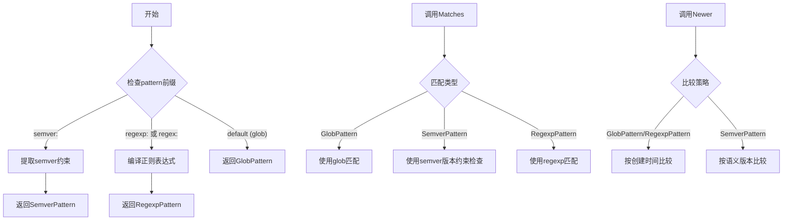

## 类结构

```
Pattern (接口)
├── GlobPattern (类型别名)
├── SemverPattern (结构体)
└── RegexpPattern (结构体)
```

## 全局变量及字段


### `PatternAll`
    
Matches everything

类型：`Pattern`
    


### `PatternLatest`
    
Matches the latest tag

类型：`Pattern`
    


### `SemverPattern.pattern`
    
Pattern without prefix

类型：`string`
    


### `SemverPattern.constraints`
    
Semantic version constraints

类型：`*semver.Constraints`
    


### `RegexpPattern.pattern`
    
Pattern without prefix

类型：`string`
    


### `RegexpPattern.regexp`
    
Compiled regular expression

类型：`*regexp.Regexp`
    
    

## 全局函数及方法


### NewPattern

根据给定模式字符串的前缀实例化相应的 Pattern 类型。前缀支持 `glob:`（默认）、`semver:`、`regexp:` 或 `regex:`，分别对应 GlobPattern、SemverPattern 和 RegexpPattern 三种实现。

参数：

- `pattern`：`string`，待匹配的模式字符串，可能包含前缀标识

返回值：`Pattern`，返回一个实现 Pattern 接口的对象，具体类型取决于模式前缀

#### 流程图

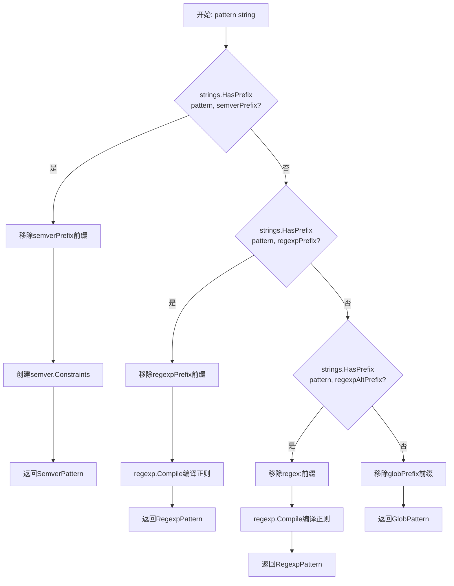

#### 带注释源码

```go
// NewPattern instantiates a Pattern according to the prefix
// it finds. The prefix can be either `glob:` (default if omitted),
// `semver:` or `regexp:`.
func NewPattern(pattern string) Pattern {
    // 1. 检查是否为语义版本前缀
	switch strings.HasPrefix(pattern, semverPrefix) {
	case true:
        // 移除 semver: 前缀
		pattern = strings.TrimPrefix(pattern, semverPrefix)
        // 创建版本约束条件
		c, _ := semver.NewConstraint(pattern)
        // 返回 SemverPattern 实现
		return SemverPattern{pattern, c}
    // 2. 检查是否为正则表达式前缀 (regexp:)
	case strings.HasPrefix(pattern, regexpPrefix):
        // 移除 regexp: 前缀
		pattern = strings.TrimPrefix(pattern, regexpPrefix)
        // 编译正则表达式
		r, _ := regexp.Compile(pattern)
        // 返回 RegexpPattern 实现
		return RegexpPattern{pattern, r}
    // 3. 检查是否为正则表达式备选前缀 (regex:)
	case strings.HasPrefix(pattern, regexpAltPrefix):
        // 移除 regex: 前缀
		pattern = strings.TrimPrefix(pattern, regexpAltPrefix)
        // 编译正则表达式
		r, _ := regexp.Compile(pattern)
        // 返回 RegexpPattern 实现
		return RegexpPattern{pattern, r}
    // 4. 默认：作为 glob 模式处理
	default:
        // 移除 glob: 前缀（如果存在），默认即为 glob
		return GlobPattern(strings.TrimPrefix(pattern, globPrefix))
	}
}
```


### `Pattern.Matches(tag string) bool`

这是 Pattern 接口中的方法声明，定义了匹配镜像标签的契约。三种具体实现（GlobPattern、SemverPattern、RegexpPattern）都实现了该接口，各自采用不同的匹配策略。

参数：

- `tag`：`string`，待匹配的镜像标签

返回值：`bool`，如果给定标签匹配模式则返回 true，否则返回 false

#### 流程图

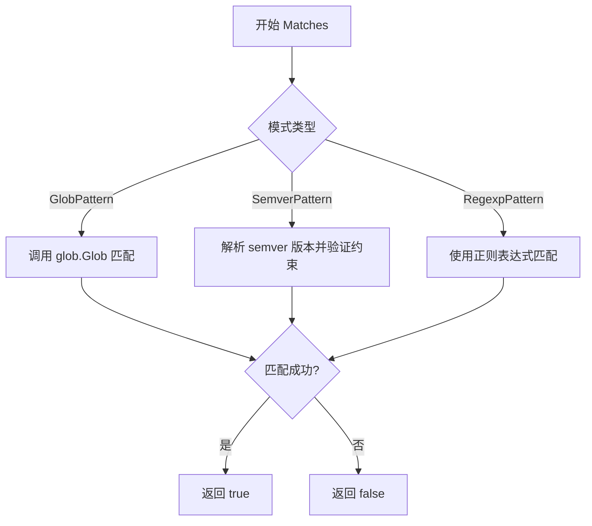

#### 带注释源码

```go
// Pattern 接口定义
type Pattern interface {
	// Matches 返回 true 如果给定镜像标签匹配该模式
	Matches(tag string) bool
	// 其它接口方法...
}
```

---

### `GlobPattern.Matches(tag string) bool`

GlobPattern 实现 Pattern 接口，使用 glob 通配符模式匹配镜像标签。底层使用 github.com/ryanuber/go-glob 库进行匹配。

参数：

- `tag`：`string`，待匹配的镜像标签

返回值：`bool`，如果标签匹配 glob 模式返回 true，否则返回 false

#### 流程图

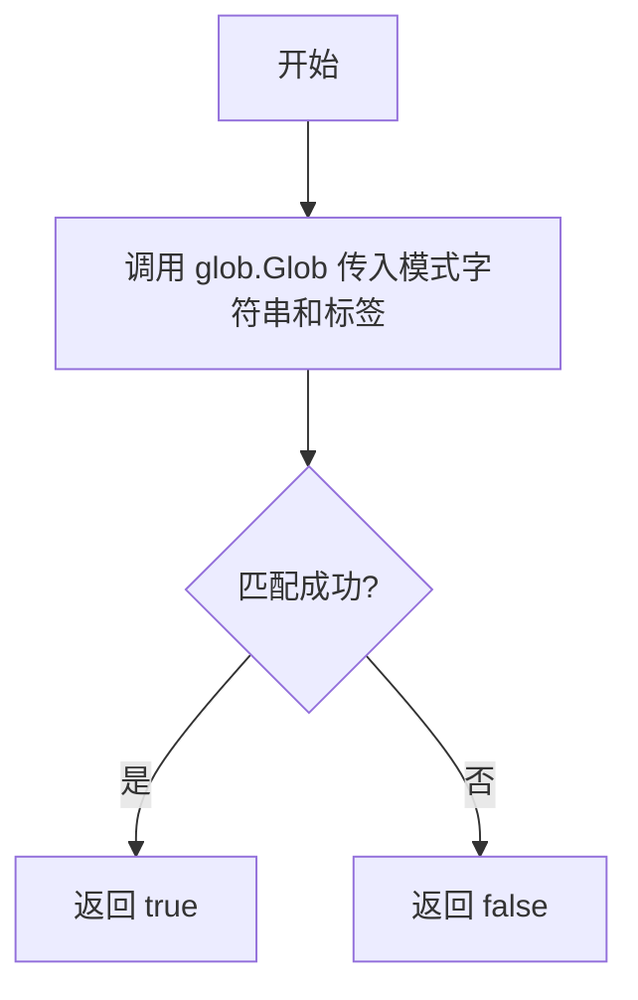

#### 带注释源码

```go
// Matches 使用 glob 模式匹配给定标签
// 参数: tag string - 要匹配的镜像标签
// 返回: bool - 匹配结果
func (g GlobPattern) Matches(tag string) bool {
	// 使用 go-glob 库进行通配符匹配
	// 支持 * 匹配任意字符, ? 匹配单个字符等 glob 模式
	return glob.Glob(string(g), tag)
}
```

---

### `SemverPattern.Matches(tag string) bool`

SemverPattern 实现 Pattern 接口，使用语义版本（Semantic Versioning）约束匹配镜像标签。

参数：

- `tag`：`string`，待匹配的镜像标签

返回值：`bool`，如果标签符合语义版本约束返回 true，否则返回 false

#### 流程图

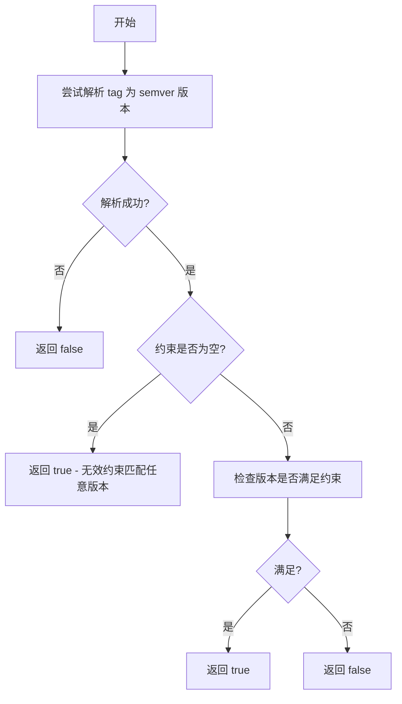

#### 带注释源码

```go
// Matches 验证镜像标签是否满足语义版本约束
// 参数: tag string - 要匹配的镜像标签（应为语义版本格式如 v1.2.3）
// 返回: bool - 如果版本满足约束返回 true
func (s SemverPattern) Matches(tag string) bool {
	// 尝试将标签解析为语义版本
	v, err := semver.NewVersion(tag)
	if err != nil {
		// 解析失败，说明不是有效版本号，返回不匹配
		return false
	}
	if s.constraints == nil {
		// 约束为空（无效约束），匹配任何版本
		return true
	}
	// 检查版本是否满足约束条件
	return s.constraints.Check(v)
}
```

---

### `RegexpPattern.Matches(tag string) bool`

RegexpPattern 实现 Pattern 接口，使用正则表达式匹配镜像标签。

参数：

- `tag`：`string`，待匹配的镜像标签

返回值：`bool`，如果标签匹配正则表达式返回 true，否则返回 false

#### 流程图

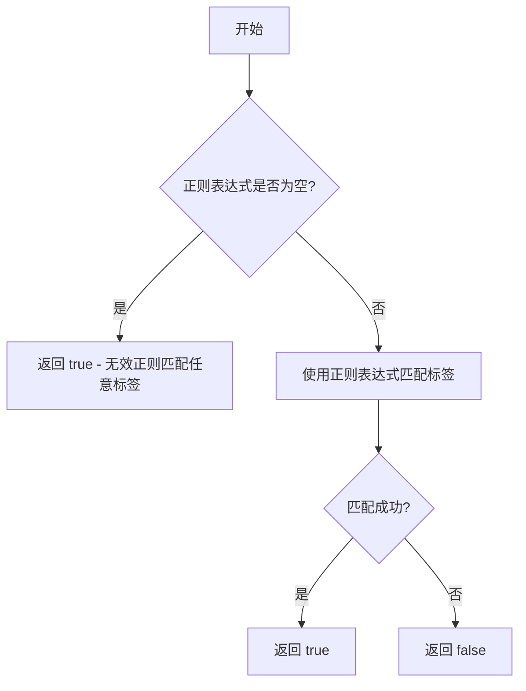

#### 带注释源码

```go
// Matches 使用正则表达式匹配给定标签
// 参数: tag string - 要匹配的镜像标签
// 返回: bool - 匹配结果
func (r RegexpPattern) Matches(tag string) bool {
	if r.regexp == nil {
		// 正则表达式为空（无效正则），匹配任何标签
		return true
	}
	// 使用正则表达式匹配标签字符串
	return r.regexp.MatchString(tag)
}
```


### `GlobPattern.String()`

返回 GlobPattern 的带前缀字符串表示，用于将模式还原为完整的字符串形式（包括 `glob:` 前缀）。

参数：无需参数

返回值：`string`，返回带有 `glob:` 前缀的完整模式字符串

#### 流程图

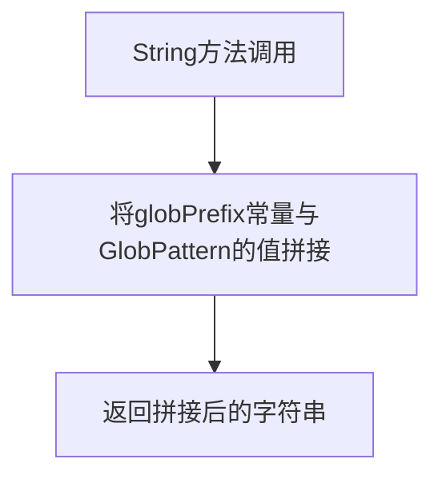

#### 带注释源码

```go
// String returns the prefixed string representation.
// 将 GlobPattern 转换为带 globPrefix 前缀的完整字符串
func (g GlobPattern) String() string {
    // 拼接前缀 "glob:" 和模式内容，然后返回
    return globPrefix + string(g)
}
```

---

### `SemverPattern.String()`

返回 SemverPattern 的带前缀字符串表示，用于将模式还原为完整的字符串形式（包括 `semver:` 前缀）。

参数：无需参数

返回值：`string`，返回带有 `semver:` 前缀的完整模式字符串

#### 流程图

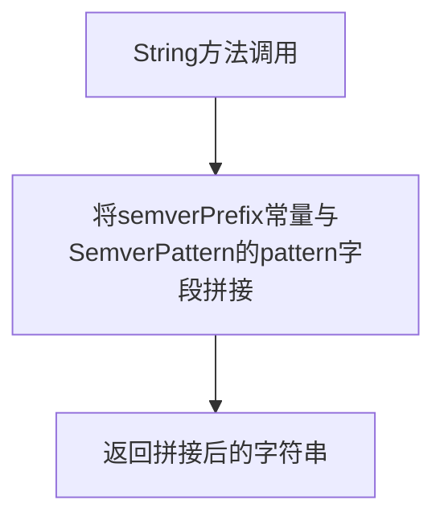

#### 带注释源码

```go
// String returns the prefixed string representation.
// 将 SemverPattern 转换为带 semverPrefix 前缀的完整字符串
func (s SemverPattern) String() string {
    // 拼接前缀 "semver:" 和内部存储的 pattern 字段，然后返回
    return semverPrefix + s.pattern
}
```

---

### `RegexpPattern.String()`

返回 RegexpPattern 的带前缀字符串表示，用于将模式还原为完整的字符串形式（包括 `regexp:` 前缀）。

参数：无需参数

返回值：`string`，返回带有 `regexp:` 前缀的完整模式字符串

#### 流程图

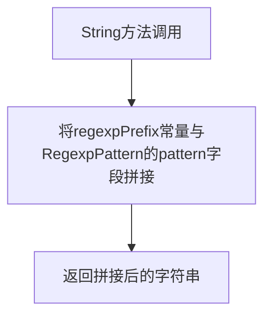

#### 带注释源码

```go
// String returns the prefixed string representation.
// 将 RegexpPattern 转换为带 regexpPrefix 前缀的完整字符串
func (r RegexpPattern) String() string {
    // 拼接前缀 "regexp:" 和内部存储的 pattern 字段，然后返回
    return regexpPrefix + r.pattern
}
```


### `Pattern.Newer`

该方法定义在Pattern接口中，用于比较两个image.Info对象，判断图像a是否比图像b更新。这是策略模式的核心比较操作，具体比较逻辑由各实现类（GlobPattern、SemverPattern、RegexpPattern）根据自身的匹配规则决定。

参数：

- `a`：`*image.Info`，需要比较是否为更新的图像信息对象
- `b`：`*image.Info`，作为比较基准的图像信息对象

返回值：`bool`，如果图像a比图像b更新则返回true，否则返回false

#### 流程图

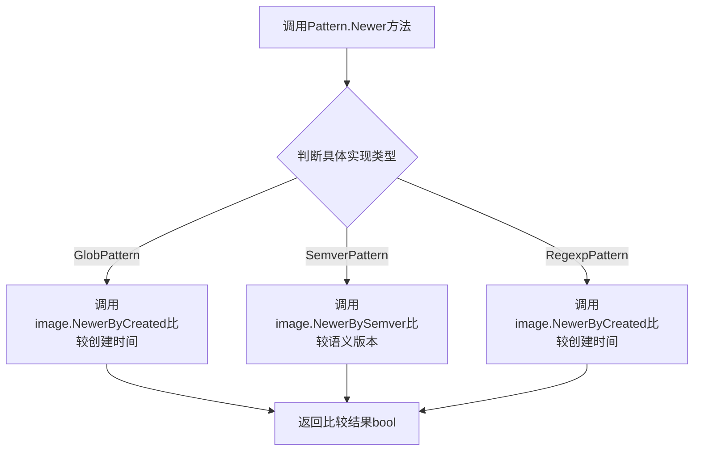

#### 带注释源码

```go
// Pattern接口定义，Newer方法用于比较两个image.Info对象
type Pattern interface {
    // Matches returns true if the given image tag matches the pattern.
    Matches(tag string) bool
    // String returns the prefixed string representation.
    String() string
    // Newer returns true if image `a` is newer than image `b`.
    // 参数a: *image.Info 需要比较的图像信息
    // 参数b: *image.Info 基准图像信息
    // 返回值: bool a是否比b更新
    Newer(a, b *image.Info) bool
    // Valid returns true if the pattern is considered valid.
    Valid() bool
    // RequiresTimestamp returns true if the pattern orders based on timestamp data.
    RequiresTimestamp() bool
}

// GlobPattern的Newer实现
func (g GlobPattern) Newer(a, b *image.Info) bool {
    // GlobPattern通过比较图像的创建时间来判断新旧
    return image.NewerByCreated(a, b)
}

// SemverPattern的Newer实现
func (s SemverPattern) Newer(a, b *image.Info) bool {
    // SemverPattern通过比较语义版本号来判断新旧
    return image.NewerBySemver(a, b)
}

// RegexpPattern的Newer实现
func (r RegexpPattern) Newer(a, b *image.Info) bool {
    // RegexpPattern通过比较创建时间来判断新旧
    return image.NewerByCreated(a, b)
}
```


### GlobPattern.Valid()

描述：`GlobPattern` 的 `Valid()` 方法用于验证 glob 模式是否有效。对于 glob 模式，由于它是通配符匹配，始终认为有效，因此直接返回 `true`。

参数：无

返回值：`bool`，如果模式有效则返回 `true`；对于 glob 模式始终返回 `true`

#### 流程图

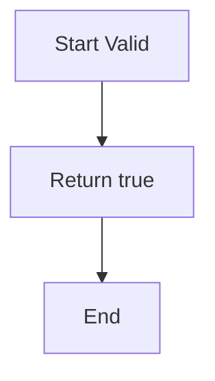

#### 带注释源码

```go
// Valid returns true if the pattern is considered valid.
// For GlobPattern, it always returns true because glob patterns
// are always considered valid (they match everything with "*").
func (g GlobPattern) Valid() bool {
	return true
}
```

---

### SemverPattern.Valid()

描述：`SemverPattern` 的 `Valid()` 方法用于验证语义版本模式是否有效。它通过检查 `constraints` 字段是否为 `nil` 来判断模式是否有效——如果 `constraints` 为 `nil`，说明模式解析失败，返回 `false`；否则返回 `true`。

参数：无

返回值：`bool`，如果模式有效（constraints 已成功解析）则返回 `true`；否则返回 `false`

#### 流程图

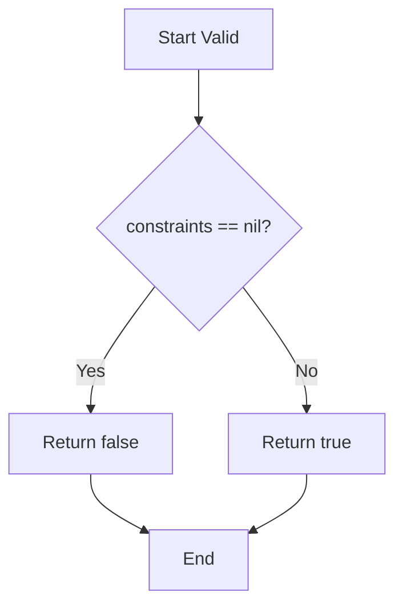

#### 带注释源码

```go
// Valid returns true if the pattern is considered valid.
// For SemverPattern, it checks if the constraints were successfully parsed.
// If constraints is nil (parsing failed), the pattern is invalid.
// If constraints is not nil, the pattern is valid.
func (s SemverPattern) Valid() bool {
	return s.constraints != nil
}
```

---

### RegexpPattern.Valid()

描述：`RegexpPattern` 的 `Valid()` 方法用于验证正则表达式模式是否有效。它通过检查 `regexp` 字段是否为 `nil` 来判断模式是否有效——如果 `regexp` 为 `nil`，说明正则表达式编译失败，返回 `false`；否则返回 `true`。

参数：无

返回值：`bool`，如果模式有效（正则表达式已成功编译）则返回 `true`；否则返回 `false`

#### 流程图

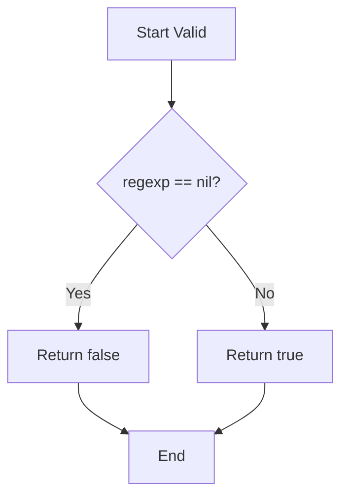

#### 带注释源码

```go
// Valid returns true if the pattern is considered valid.
// For RegexpPattern, it checks if the regular expression was successfully compiled.
// If regexp is nil (compilation failed), the pattern is invalid.
// If regexp is not nil, the pattern is valid.
func (r RegexpPattern) Valid() bool {
	return r.regexp != nil
}
```


### `GlobPattern.RequiresTimestamp`

GlobPattern 类型的时间戳依赖判断方法，用于判断该模式是否需要基于时间戳数据进行排序。

参数：无

返回值：`bool`，如果模式需要基于时间戳数据进行排序则返回 `true`，否则返回 `false`

#### 流程图

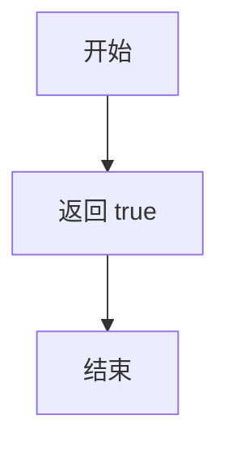

#### 带注释源码

```go
// RequiresTimestamp 返回 true，表示 GlobPattern 需要基于时间戳数据进行排序
// GlobPattern 使用 image.NewerByCreated 方法比较图片，该方法依赖于创建时间
func (g GlobPattern) RequiresTimestamp() bool {
	return true
}
```

---

### `SemverPattern.RequiresTimestamp`

SemverPattern 类型的时间戳依赖判断方法，用于判断该模式是否需要基于时间戳数据进行排序。

参数：无

返回值：`bool`，如果模式需要基于时间戳数据进行排序则返回 `true`，否则返回 `false`

#### 流程图

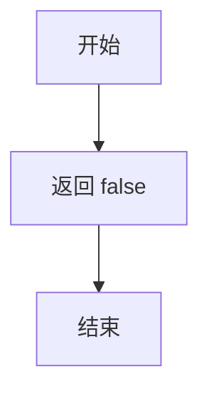

#### 带注释源码

```go
// RequiresTimestamp 返回 false，表示 SemverPattern 不需要基于时间戳数据进行排序
// SemverPattern 使用语义版本号进行比较，使用 image.NewerBySemver 方法
// 该方法直接比较版本号，不依赖时间戳
func (s SemverPattern) RequiresTimestamp() bool {
	return false
}
```

---

### `RegexpPattern.RequiresTimestamp`

RegexpPattern 类型的时间戳依赖判断方法，用于判断该模式是否需要基于时间戳数据进行排序。

参数：无

返回值：`bool`，如果模式需要基于时间戳数据进行排序则返回 `true`，否则返回 `false`

#### 流程图


#### 带注释源码

```go
// RequiresTimestamp 返回 true，表示 RegexpPattern 需要基于时间戳数据进行排序
// RegexpPattern 使用 image.NewerByCreated 方法比较图片，该方法依赖于创建时间
// 正则表达式匹配只关心标签是否符合模式，不涉及版本号比较
func (r RegexpPattern) RequiresTimestamp() bool {
	return true
}
```


### `GlobPattern.Matches`

该方法用于检查给定的镜像标签（tag）是否匹配 GlobPattern 实例所定义的 glob 模式。它通过调用 `go-glob` 库来实现通配符匹配，支持 `*`（匹配任意字符）等 glob 模式语法。

#### 参数

- `tag`：`string`，要匹配的镜像标签

#### 返回值

- `bool`，如果标签匹配 glob 模式返回 `true`，否则返回 `false`

#### 流程图

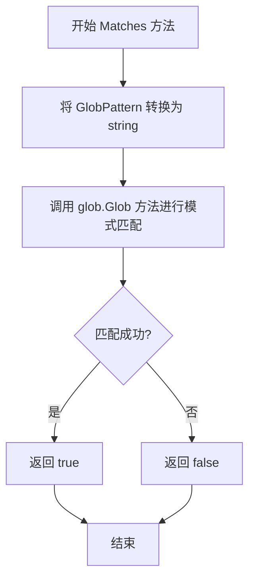

#### 带注释源码

```go
// Matches 检查给定的镜像标签是否匹配 GlobPattern 实例的 glob 模式
// 参数 tag: 要匹配的镜像标签字符串
// 返回值: 匹配成功返回 true, 否则返回 false
func (g GlobPattern) Matches(tag string) bool {
	// 将 GlobPattern（底层为 string 类型）转换为字符串，
	// 然后调用 go-glob 库的 Glob 函数进行通配符匹配
	// go-glob 支持 * 匹配任意字符、? 匹配单个字符等模式
	return glob.Glob(string(g), tag)
}
```


### `GlobPattern.String`

该方法将 `GlobPattern` 类型的值转换为带前缀的字符串表示形式，通过在原始模式前添加 `glob:` 前缀来标识这是一个 glob 模式。

参数： 无（仅接收者 `g GlobPattern`）

返回值： `string`，返回带有 `glob:` 前缀的完整模式字符串

#### 流程图

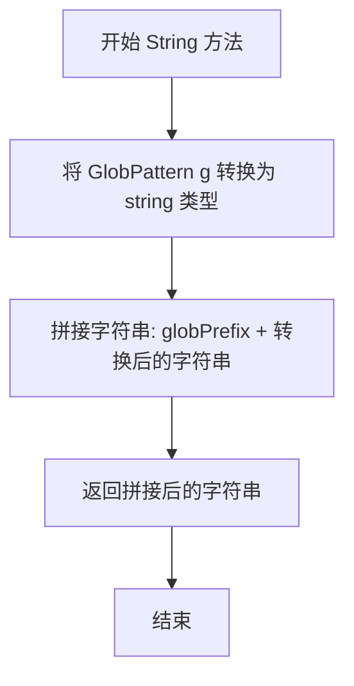

#### 带注释源码

```go
// String 方法将 GlobPattern 转换为带前缀的字符串表示
// 接收者: g GlobPattern - GlobPattern 类型的实例
// 返回值: string - 带有 'glob:' 前缀的完整模式字符串
func (g GlobPattern) String() string {
    // 将 GlobPattern 类型的值转换为 string，然后添加 "glob:" 前缀
    // g 是 GlobPattern 类型，本质上是 string 的别名
    // string(g) 将 GlobPattern 转换为底层字符串
    // globPrefix 是常量 "glob:"，拼接后形成完整的模式字符串
    return globPrefix + string(g)
}
```


### `GlobPattern.Newer`

该方法用于比较两个图像信息的时间新旧关系，通过调用 `image.NewerByCreated` 函数判断图像 `a` 是否比图像 `b` 更新，是 GlobPattern 实现 Pattern 接口中 Newer 方法的具体逻辑。

参数：

- `a`：`*image.Info`，需要比较的源图像信息指针
- `b`：`*image.Info`，用于比较的目标图像信息指针

返回值：`bool`，如果图像 `a` 的创建时间晚于图像 `b`，则返回 true，否则返回 false

#### 流程图

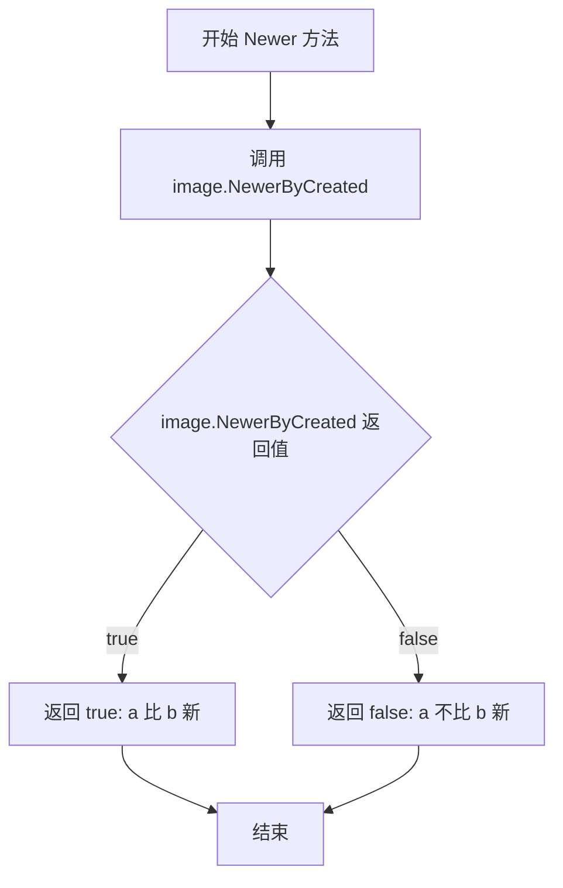

#### 带注释源码

```go
// Newer 比较两个图像信息的时间新旧关系
// 参数:
//   - a: *image.Info, 源图像信息指针，表示需要比较的图像
//   - b: *image.Info, 目标图像信息指针，用于作为比较基准的图像
//
// 返回值:
//   - bool: 如果 a 的创建时间晚于 b 则返回 true，否则返回 false
func (g GlobPattern) Newer(a, b *image.Info) bool {
	// 调用 image 包提供的 NewerByCreated 函数进行时间比较
	// 该函数基于图像的 Created 字段判断新旧关系
	return image.NewerByCreated(a, b)
}
```

#### 补充说明

| 项目 | 说明 |
|------|------|
| **所属类型** | `GlobPattern` (底层类型为 `string`) |
| **接口实现** | 实现 `Pattern` 接口的 `Newer` 方法 |
| **依赖函数** | `image.NewerByCreated(a, b *image.Info) bool` |
| **设计目的** | 提供基于时间戳的图像版本比较能力，支持自动化策略中的版本选择 |
| **约束条件** | 需要图像信息中包含有效的 Created 时间戳，否则比较结果可能不符合预期 |


### `GlobPattern.Valid`

该方法用于验证 GlobPattern 实例是否有效。对于 GlobPattern 类型，由于 glob 模式可以匹配任意字符串（包括空字符串），因此该方法始终返回 true，表示 glob 模式总是有效的。

参数： 无

返回值：`bool`，返回模式是否有效（对于 GlobPattern 始终返回 true）

#### 流程图

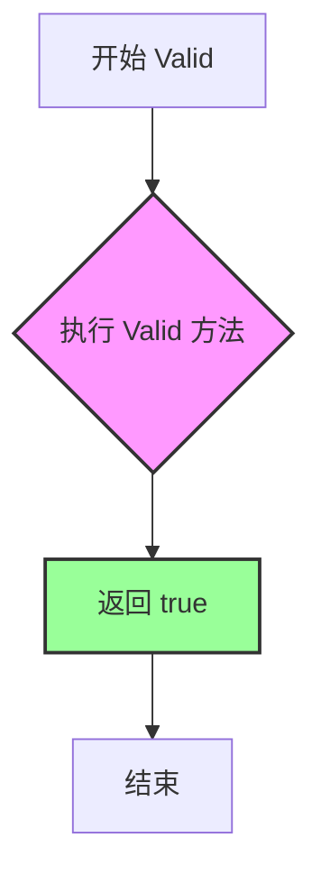

#### 带注释源码

```go
// Valid 方法用于检查 GlobPattern 实例的有效性
// 对于 GlobPattern 类型，由于 glob 模式可以匹配任意字符串，
// 因此总是返回 true，表示该模式在语法和逻辑上始终有效
//
// 参数：
//   - 无
//
// 返回值：
//   - bool: 始终返回 true，表示 glob 模式有效
func (g GlobPattern) Valid() bool {
	// GlobPattern 基于字符串类型，可以匹配任何字符组合
	// 即使模式为空字符串，也能匹配空字符串，因此总是有效的
	return true
}
```


### `GlobPattern.RequiresTimestamp`

这个方法实现了 `Pattern` 接口的 `RequiresTimestamp` 方法，用于判断当前模式是否需要基于时间戳数据进行排序。对于 `GlobPattern` 类型，由于 glob 模式匹配的图片无法通过模式本身确定新旧顺序，必须依赖图片的创建时间戳来进行排序比较，因此该方法返回 `true`。

参数： 无

返回值：`bool`，返回 `true` 表示该模式需要依赖时间戳数据进行排序判断；返回 `false` 表示不需要时间戳数据。

#### 流程图

```mermaid
flowchart TD
    A[开始 RequiresTimestamp] --> B{返回 true}
    B --> C[结束]
    
    style A fill:#f9f,stroke:#333
    style B fill:#9f9,stroke:#333
    style C fill:#f9f,stroke:#333
```

#### 带注释源码

```go
// RequiresTimestamp 返回 true，表示 GlobPattern 需要基于时间戳数据进行排序
// 原因：glob 模式（如 "glob:v1.*"）只能匹配标签字符串，无法直接判断版本新旧
//       因此必须依赖 image.Info 中的 Created 字段（时间戳）来确定图片的新旧顺序
func (g GlobPattern) RequiresTimestamp() bool {
	return true
}
```


### `SemverPattern.Matches`

该方法用于检查给定的图像标签是否符合语义版本（Semantic Versioning）约束。它首先尝试将标签解析为语义版本，如果解析失败则返回false；如果约束无效（为nil），则匹配任何版本；否则检查版本是否满足预设的约束条件。

参数：

- `tag`：`string`，待匹配的图像标签

返回值：`bool`，如果标签符合语义版本约束则返回 true，否则返回 false

#### 流程图

```mermaid
flowchart TD
    A[开始] --> B[尝试将tag解析为semver.Version]
    B --> C{解析是否成功?}
    C -->|是| D[返回false]
    C -->|否| E{constraints是否为nil?}
    E -->|是| F[返回true - 无效约束匹配任何版本]
    E -->|否| G[检查version是否满足constraints]
    G --> H{是否满足?}
    H -->|是| I[返回true]
    H -->|否| J[返回false]
```

#### 带注释源码

```go
// Matches 检查给定的图像标签是否符合语义版本约束
// 参数: tag string - 待匹配的图像标签
// 返回值: bool - 如果标签符合约束返回true，否则返回false
func (s SemverPattern) Matches(tag string) bool {
	// 尝试将tag解析为语义版本
	v, err := semver.NewVersion(tag)
	
	// 如果解析失败（例如标签不是有效的语义版本格式），返回false
	if err != nil {
		return false
	}
	
	// 如果constraints为nil，表示约束无效，按业务逻辑视为匹配任何版本
	if s.constraints == nil {
		// Invalid constraints match anything
		return true
	}
	
	// 检查版本是否满足约束条件
	return s.constraints.Check(v)
}
```


### `SemverPattern.String()`

该方法返回 SemverPattern 实例的带前缀字符串表示，即将 `semver:` 前缀与内部存储的 pattern 字段拼接后返回，用于还原原始的匹配模式字符串。

参数：无

返回值：`string`，返回带 `semver:` 前缀的模式字符串，用于还原用户原始输入的语义版本模式。

#### 流程图

```mermaid
flowchart TD
    A[开始] --> B[获取 SemverPattern 实例的 pattern 字段值]
    B --> C[将 semverPrefix 常量与 pattern 拼接]
    C --> D[返回拼接后的字符串]
```

#### 带注释源码

```go
// String 返回 SemverPattern 的带前缀字符串表示
// 该方法实现了 Pattern 接口的 String 方法
// 返回格式为 "semver:" + 原始模式字符串
func (s SemverPattern) String() string {
	// semverPrefix 是常量 "semver:"
	// s.pattern 是去除前缀后的语义版本约束字符串
	// 例如：pattern 为 ">=1.0.0" 时，返回 "semver:>=1.0.0"
	return semverPrefix + s.pattern
}
```


### `SemverPattern.Newer`

该方法用于比较两个镜像对象，基于语义化版本（Semantic Versioning）判断镜像 `a` 是否比镜像 `b` 更新。

参数：

- `a`：`*image.Info`，待比较的镜像对象，作为被判断为"更新"的候选对象
- `b`：`*image.Info`，待比较的镜像对象，作为比较基准

返回值：`bool`，如果镜像 `a` 的版本比镜像 `b` 的版本更新则返回 `true`，否则返回 `false`

#### 流程图

```mermaid
flowchart TD
    A[开始 Newer 方法] --> B[调用 image.NewerBySemver]
    B --> C{image.NewerBySemver 返回值}
    C -->|true| D[返回 true: a 更新]
    C -->|false| E[返回 false: a 未更新]
    D --> F[结束]
    E --> F
```

#### 带注释源码

```go
// Newer 比较两个镜像的语义化版本，判断 a 是否比 b 更新
// 参数:
//   - a: *image.Info, 第一个镜像信息
//   - b: *image.Info, 第二个镜像信息
//
// 返回值:
//   - bool: 如果 a 的版本比 b 新返回 true, 否则返回 false
func (s SemverPattern) Newer(a, b *image.Info) bool {
	// 委托给 image 包中的 NewerBySemver 函数进行语义版本比较
	// 该函数内部会解析两个镜像的 tag 为语义版本并进行比较
	return image.NewerBySemver(a, b)
}
```


### `SemverPattern.Valid`

该方法用于验证语义版本匹配模式是否有效，通过检查 `constraints` 字段是否非空来判断模式的有效性。

参数： 无

返回值：`bool`，如果模式被认为是有效的则返回 true，否则返回 false

#### 流程图

```mermaid
flowchart TD
    A[Start Valid] --> B{constraints != nil?}
    B -->|Yes| C[Return true]
    B -->|No| D[Return false]
```

#### 带注释源码

```go
// Valid returns true if the pattern is considered valid.
// 语义版本模式的有效性取决于是否成功解析了版本约束。
// 如果 constraints 为 nil，说明在创建 Pattern 时约束解析失败，模式无效。
func (s SemverPattern) Valid() bool {
	return s.constraints != nil
}
```


### `SemverPattern.RequiresTimestamp()`

该方法是 `SemverPattern` 类型的成员方法，用于判断当前语义版本号匹配模式是否需要依赖时间戳数据进行镜像排序。由于语义版本号（Semver）本身已包含版本比较信息，因此该方法返回 false，表示不需要额外的时间戳即可完成版本比较操作。

参数： 无

返回值：`bool`，返回 false，表示 SemverPattern 不需要基于时间戳数据进行排序，版本比较直接通过语义版本号即可完成。

#### 流程图

```mermaid
flowchart TD
    A[开始 RequiresTimestamp] --> B{检查 SemverPattern 类型}
    B -->|语义版本比较| C[直接返回 false]
    C --> D[结束]
    
    style C fill:#90EE90,stroke:#333,stroke-width:2px
    style D fill:#FFE4B5,stroke:#333,stroke-width:2px
```

#### 带注释源码

```go
// RequiresTimestamp 判断 SemverPattern 是否需要时间戳数据进行排序
// 参数：无
// 返回值：bool - 返回 false，表示语义版本号排序不需要依赖时间戳
//
// 解释：SemverPattern 基于语义版本号（如 v1.2.3）进行版本比较，
// 版本号本身已包含足够的排序信息（主版本.次版本.修订号），
// 因此不需要额外的时间戳数据来判断哪个镜像更新。
func (s SemverPattern) RequiresTimestamp() bool {
	return false
}
```


### `RegexpPattern.Matches`

该方法用于检测给定的镜像标签是否符合正则表达式模式。如果正则表达式无效（为 nil），则匹配任何标签；否则使用正则表达式匹配标签。

参数：

-  `tag`：`string`，要匹配的镜像标签

返回值：`bool`，如果标签匹配正则表达式模式则返回 true，否则返回 false

#### 流程图

```mermaid
flowchart TD
    A[开始] --> B{检查 r.regexp 是否为 nil}
    B -->|是| C[返回 true]
    B -->|否| D[调用 r.regexp.MatchString]
    D --> E[返回匹配结果]
```

#### 带注释源码

```go
// Matches 检查给定的镜像标签是否符合正则表达式模式
// 如果正则表达式无效（为 nil），则匹配任何标签
func (r RegexpPattern) Matches(tag string) bool {
	// 如果 regexp 为 nil，表示正则表达式无效
	// 无效的正则表达式匹配任何标签
	if r.regexp == nil {
		// Invalid regexp match anything
		return true
	}
	// 使用正则表达式的 MatchString 方法进行匹配
	return r.regexp.MatchString(tag)
}
```


### `RegexpPattern.String`

该方法是 `RegexpPattern` 类型的字符串表示实现，实现了 `Pattern` 接口的 `String()` 方法，用于返回带有 `regexp:` 前缀的正则表达式模式字符串。

参数：此方法无参数（接收者 `r RegexpPattern` 不计入参数列表）

返回值：`string`，返回带前缀的正则表达式模式字符串，格式为 `"regexp:" + pattern`

#### 流程图

```mermaid
flowchart TD
    A[开始 String 方法] --> B{检查接收者}
    B --> C[返回字符串拼接: regexpPrefix + r.pattern]
    D[结束, 返回字符串]
    C --> D
    
    style A fill:#f9f,color:#333
    style D fill:#9f9,color:#333
```

#### 带注释源码

```go
// String 返回 RegexpPattern 的带前缀字符串表示
// 该方法实现了 Pattern 接口的 String() 方法
// 返回格式: "regexp:" + 存储的模式字符串（不含前缀）
func (r RegexpPattern) String() string {
	// 使用常量 regexpPrefix ("regexp:") 拼接上存储的 pattern 字段
	// pattern 字段在 NewPattern 创建时已经去除了前缀
	return regexpPrefix + r.pattern
}
```

#### 补充说明

| 项目 | 说明 |
|------|------|
| **所属类型** | `RegexpPattern` |
| **接口实现** | 实现了 `Pattern` 接口的 `String() string` 方法 |
| **相关常量** | `regexpPrefix = "regexp:"`（在 package 级别定义） |
| **关联字段** | `r.pattern` - 存储去前缀后的正则表达式模式字符串 |
| **调用场景** | 通常用于日志记录、调试输出、或将 Pattern 对象序列化为字符串 |
| **与其它类的对应方法** | `GlobPattern.String()` 返回 `"glob:" + pattern`，`SemverPattern.String()` 返回 `"semver:" + pattern` |


### `RegexpPattern.Newer`

该方法用于比较两个图像信息对象的时间新旧关系，当图像 `a` 的创建时间晚于图像 `b` 时返回 `true`，否则返回 `false`，其内部委托给 `image.NewerByCreated` 函数执行实际的时间比较逻辑。

参数：

- `a`：`*image.Info`，需要比较新旧的第一个图像信息对象
- `b`：`*image.Info`，需要比较新旧的第二个图像信息对象

返回值：`bool`，如果图像 `a` 的创建时间晚于图像 `b` 则返回 `true`，否则返回 `false`

#### 流程图

```mermaid
flowchart TD
    A[开始 Newer 方法] --> B{检查 RegexpPattern 是否有效}
    B -->|有效| C[调用 image.NewerByCreated 比较 a 和 b]
    B -->|无效| C
    C --> D[返回比较结果]
    D --> E[结束]
```

#### 带注释源码

```go
// Newer 方法比较两个图像信息对象的新旧关系
// 参数 a 和 b 都是 *image.Info 类型的指针，分别代表需要比较的两个图像
// 返回值为 bool 类型：当 a 的创建时间晚于 b 时返回 true，否则返回 false
func (r RegexpPattern) Newer(a, b *image.Info) bool {
	// 委托给 image 包中的 NewerByCreated 函数执行实际的时间比较
	// 该函数内部会检查两个图像信息的创建时间字段并进行比较
	return image.NewerByCreated(a, b)
}
```

### 补充信息

#### 关键组件信息

| 组件名称 | 一句话描述 |
|---------|-----------|
| `RegexpPattern` | 使用正则表达式匹配图像标签的模式实现类 |
| `Pattern` | 图像标签匹配的抽象接口，定义了 Matches、Newer、Valid 等方法 |
| `image.NewerByCreated` | 根据创建时间比较两个图像信息新旧的核心函数 |

#### 潜在的技术债务或优化空间

1. **缺乏空值检查**：当前实现未对参数 `a` 和 `b` 进行空值（nil）检查，如果传入 nil 指针可能导致运行时 panic
2. **未使用 RegexpPattern 字段**：方法内部未使用接收者 `r` 的任何字段（`pattern` 和 `regexp`），这表明该方法的设计可能不符合面向对象设计原则，因为正则表达式的匹配规则与时间比较逻辑并无关联
3. **错误处理缺失**：如果 `image.NewerByCreated` 返回错误，当前实现没有错误处理机制

#### 其它项目

- **设计目标与约束**：该方法遵循 `Pattern` 接口的统一约定，为不同类型的模式（Glob、Semver、Regexp）提供一致的时间比较能力
- **错误处理与异常设计**：通过 `Valid()` 方法预先检查正则表达式的有效性，但 `Newer` 方法本身不进行显式的错误处理
- **数据流与状态机**：作为 `Pattern` 接口的一部分，该方法在图像筛选流程中被调用，用于确定哪些图像版本符合"最新"的条件
- **外部依赖与接口契约**：依赖 `github.com/fluxcd/flux/pkg/image` 包中的 `Info` 结构体和 `NewerByCreated` 函数


# RegexpPattern.Valid() bool 方法详细设计文档

## 1. 一段话描述

`RegexpPattern.Valid()` 方法是 `RegexpPattern` 类型的成员方法，用于验证正则表达式模式的有效性，通过检查内部编译后的正则表达式对象是否为空来判断模式是否有效。

## 2. 文件的整体运行流程

该文件定义了一个图像标签模式匹配系统，支持三种匹配策略：
1. **Glob模式**：通配符匹配
2. **Semver模式**：语义版本匹配
3. **Regexp模式**：正则表达式匹配

`NewPattern` 函数根据前缀识别模式类型并创建相应的Pattern实现。每种模式都实现了统一的 `Pattern` 接口，包括 `Matches`、`String`、`Newer`、`Valid`、`RequiresTimestamp` 五个方法。

## 3. 类的详细信息

### 3.1 RegexpPattern 结构体

| 字段名称 | 类型 | 描述 |
|---------|------|------|
| pattern | string | 不带前缀的原始正则表达式模式字符串 |
| regexp | *regexp.Regexp | 编译后的正则表达式对象，可能为nil |

### 3.2 Valid 方法详情

#### 基本信息

- **名称**：RegexpPattern.Valid
- **所属类**：RegexpPattern
- **方法签名**：func (r RegexpPattern) Valid() bool

#### 参数

无参数（方法接收者 `r` 不计入参数）

#### 返回值

| 返回值类型 | 描述 |
|-----------|------|
| bool | 返回 true 表示正则表达式有效（已成功编译），返回 false 表示无效（编译失败） |

#### 流程图

```mermaid
flowchart TD
    A[开始 Valid 方法] --> B{检查 r.regexp 是否为 nil}
    B -->|是| C[返回 false - 正则表达式无效]
    B -->|否| D[返回 true - 正则表达式有效]
    C --> E[结束]
    D --> E
```

#### 带注释源码

```go
// Valid 返回 true 如果正则表达式模式有效。
// 有效性通过检查内部编译后的 regexp 对象是否非空来确定。
// 如果 regexp.Compile() 调用失败，regexp 字段将为 nil，此时返回 false。
func (r RegexpPattern) Valid() bool {
	return r.regexp != nil
}
```

## 4. 关键组件信息

| 组件名称 | 描述 |
|---------|------|
| Pattern 接口 | 统一的行为接口，定义了匹配、字符串表示、比较、验证和时间戳需求等操作 |
| RegexpPattern | 正则表达式模式实现，通过编译正则表达式进行标签匹配 |
| NewPattern | 工厂函数，根据前缀自动创建对应类型的 Pattern 实现 |

## 5. 潜在的技术债务或优化空间

1. **错误信息丢失**：`NewPattern` 中 `regexp.Compile` 和 `semver.NewConstraint` 的错误被忽略（使用 `_` 接收），导致用户无法获知具体的编译错误信息。

2. **无效约束的行为不一致**：`SemverPattern.Valid()` 对无效约束返回 false，而 `RegexpPattern` 对无效正则返回 false，但 `Matches` 方法对无效情况的处理不一致（SemverPattern 返回 true 表示匹配任何内容，RegexpPattern 也是如此）。

3. **缺少输入验证**：未对空字符串 pattern 进行特殊处理，可能导致意外行为。

## 6. 其它项目

### 6.1 设计目标与约束

- **设计目标**：提供统一的图像标签匹配接口，支持 glob、semver、regexp 三种模式
- **约束**：所有 Pattern 实现必须实现 Pattern 接口的所有方法

### 6.2 错误处理与异常设计

- 正则表达式编译失败时，`regexp` 字段被设置为 `nil`，`Valid()` 返回 `false`
- 无效的 Semver 约束同样通过 `constraints` 字段为 `nil` 来表示错误状态

### 6.3 数据流与状态机

```
用户输入 pattern 字符串
        ↓
NewPattern() 根据前缀分类
        ↓
创建对应的 Pattern 实现
        ↓
RegexpPattern: 调用 regexp.Compile() 编译
        ↓
成功 → regexp 字段赋值 → Valid() 返回 true
失败 → regexp 为 nil   → Valid() 返回 false
```

### 6.4 外部依赖与接口契约

| 依赖包 | 用途 |
|--------|------|
| regexp | 正则表达式编译和匹配 |
| strings | 字符串前缀处理 |
| github.com/Masterminds/semver/v3 | 语义版本解析和约束检查 |
| github.com/fluxcd/flux/pkg/image | 图像信息结构和比较函数 |
| github.com/ryanuber/go-glob | glob 模式匹配 |


### `RegexpPattern.RequiresTimestamp`

该方法用于判断正则表达式模式在比较图像新旧时是否需要依赖时间戳数据进行排序。

参数：
- （无显式参数，方法通过接收者 `r RegexpPattern` 访问模式实例）

返回值：`bool`，返回 `true` 表示该模式需要基于时间戳数据来比较图像的新旧程度。

#### 流程图

```mermaid
flowchart TD
    A[开始 RequiresTimestamp] --> B{执行方法体}
    B --> C[返回 true]
    C --> D[结束]
```

#### 带注释源码

```go
// RequiresTimestamp 返回 true，表示 RegexpPattern 需要时间戳数据来排序图像。
// 正则表达式模式无法直接比较版本语义，必须依赖镜像的创建时间来判断新旧。
func (r RegexpPattern) RequiresTimestamp() bool {
	return true
}
```

## 关键组件


### Pattern 接口

Pattern 是核心接口，定义了图像标签匹配的统一抽象，提供了 Matches、String、Newer、Valid、RequiresTimestamp 五个方法，用于支持不同策略的标签匹配、字符串表示、版本比较、有效性验证和时间戳依赖判断。

### GlobPattern 类型

GlobPattern 基于 glob 通配符模式匹配图像标签，底层使用 go-glob 库实现 glob 风格的文件名模式匹配，支持 * 等通配符，默认匹配规则为前缀 "glob:"。

### SemverPattern 类型

SemverPattern 基于语义化版本（Semantic Versioning）匹配图像标签，底层使用 Masterminds/semver 库实现版本约束检查，支持 semver 规范的各种比较操作符，支持前缀 "semver:"。

### RegexpPattern 类型

RegexpPattern 基于正则表达式匹配图像标签，底层使用 Go 标准库的 regexp 包，支持标准正则语法，支持 "regexp:" 和 "regex:" 两种前缀。

### NewPattern 函数

NewPattern 是工厂函数，根据模式字符串的前缀自动创建对应的 Pattern 实例，支持 glob（默认）、semver、regexp、regex 四种模式前缀，自动剥离前缀并初始化相应的模式结构。

### PatternAll 和 PatternLatest 全局变量

PatternAll 和 PatternLatest 是预定义的全局 Pattern 实例，分别匹配所有标签和最新的标签，用于常见场景的快速匹配，作为包的导出变量供外部直接使用。

### 图像版本比较逻辑

代码中集成了 image 包的 NewerByCreated 和 NewerBySemver 函数，分别用于按创建时间和语义版本比较两个图像的新旧关系，为不同模式提供统一的版本比较能力。


## 问题及建议


### 已知问题

- **错误处理不当**：`NewPattern`函数中忽略`semver.NewConstraint`和`regexp.Compile`的返回值错误（使用`_`），导致无效的pattern会静默创建无效的Pattern对象，后续行为不可预测
- **Valid()与Matches()行为不一致**：对于`SemverPattern`，当constraints为nil时，`Matches()`返回true（匹配任何版本），但`Valid()`返回false；对于`RegexpPattern`，当regexp为nil时，`Matches()`返回true，但`Valid()`返回false，这导致语义混乱
- **重复代码**：`regexpPrefix`和`regexpAltPrefix`的处理逻辑完全相同，存在代码重复
- **缺少输入校验**：`NewPattern`未对空字符串、nil输入进行校验，可能导致panic
- **性能考虑**：`SemverPattern.Matches()`每次调用都会调用`semver.NewVersion(tag)`创建新对象，在高频调用场景下有优化空间

### 优化建议

- **改进错误处理**：返回error或使用特定的错误Pattern类型来封装无效的pattern，让调用者能够感知并处理错误
- **统一语义**：重新设计`Valid()`和`Matches()`的逻辑，使其行为一致；或者明确文档说明这种设计意图
- **消除重复**：将`regexpPrefix`和`regexpAltPrefix`的处理合并，或直接移除`regexpAltPrefix`别名
- **添加输入校验**：在`NewPattern`入口处添加空字符串和nil检查
- **性能优化**：考虑对`SemverPattern`使用缓存或复用已解析的Version对象；对于`RegexpPattern`，当前实现已经是最佳实践
- **添加文档注释**：为关键类型和方法添加更完整的GoDoc注释，特别是`Newer`和`RequiresTimestamp`方法的使用场景

## 其它


### 设计目标与约束

本模块的设计目标是提供一个灵活的镜像标签匹配框架，支持三种主流的版本匹配模式（glob、semver、regexp），以满足不同场景下的镜像版本筛选需求。设计约束包括：必须实现Pattern接口以保证一致性；glob模式为默认匹配方式；所有模式均需支持Valid()方法用于验证模式有效性；需支持Newer()方法进行镜像版本比较。

### 错误处理与异常设计

错误处理主要体现在模式解析和匹配过程中：1) SemverPattern的Matches方法在版本解析失败时返回false；2) RegexpPattern在正则表达式为nil时返回true（视为匹配任何内容）；3) NewPattern工厂函数在创建约束或编译正则表达式时忽略错误，静默返回可能无效的模式，由Valid()方法在后续使用中检测；4) 全局变量PatternAll和PatternLatest在模块加载时通过NewPattern创建。

### 数据流与状态机

数据流如下：用户调用NewPattern(pattern)创建Pattern对象→根据前缀类型分发到具体实现类→调用Matches(tag)进行标签匹配→调用Newer(a, b)进行版本比较。状态机转换：GlobPattern(默认) ↔ SemverPattern(前缀:semver:) ↔ RegexpPattern(前缀:regexp:或regex:)，状态转换由NewPattern函数根据前缀自动完成。

### 外部依赖与接口契约

外部依赖包括：github.com/Masterminds/semver/v3（语义版本解析和约束检查）、github.com/fluxcd/flux/pkg/image（镜像信息结构和版本比较函数）、github.com/ryanuber/go-glob（glob模式匹配）。接口契约：Pattern接口的五个方法(Matches、String、Newer、Valid、RequiresTimestamp)必须全部实现；Matches方法接收tag字符串返回布尔值；Newer方法接收两个image.Info指针返回布尔值；Valid返回模式是否有效；RequiresTimestamp返回是否需要时间戳数据进行排序。

### 性能考虑

性能优化点：1) RegexpPattern在创建时预编译正则表达式，避免重复编译开销；2) SemverPattern缓存semver.Constraints对象；3) GlobPattern直接使用glob库进行匹配；4) 工厂函数NewPattern使用strings.HasPrefix进行前缀检测，效率较高。潜在性能瓶颈：大数据量下的Matches调用、复杂正则表达式匹配、semver约束的重复解析。

### 测试策略

测试应覆盖：1) 三种模式的正常匹配场景；2) 无效模式（空pattern、错误semver约束、错误regexp）的Valid()返回false；3) Pattern接口一致性验证；4) 边界条件（空tag、空pattern、特殊字符）；5) Newer方法在各种模式下的版本比较准确性；6) String()方法返回正确的前缀格式。

### 使用示例

```go
// glob模式（默认）
p1 := NewPattern("v1.*")
p1.Matches("v1.0.1") // true

// semver模式
p2 := NewPattern("semver:>=1.0.0")
p2.Matches("1.2.3") // true

// regexp模式
p3 := NewPattern("regexp:^v[0-9]+")
p3.Matches("v10") // true
```

### 安全考虑

安全风险点：1) 正则表达式拒绝服务（ReDoS）攻击 - 用户输入的regexp可能包含恶意构造；2) semver约束解析未验证输入来源；3) glob模式使用第三方库glob需关注其安全性。缓解措施：建议对用户输入的regexp长度和复杂度进行限制；添加超时机制防止长时间匹配；定期更新依赖库版本。


    