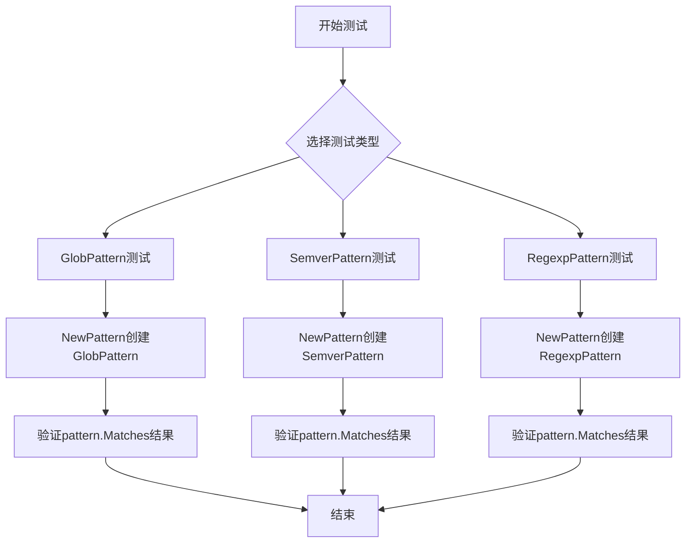
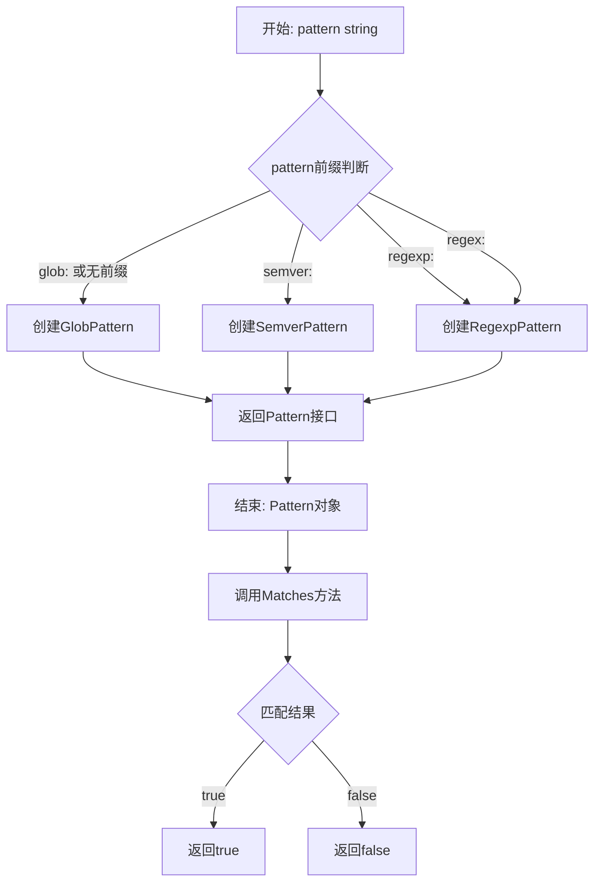
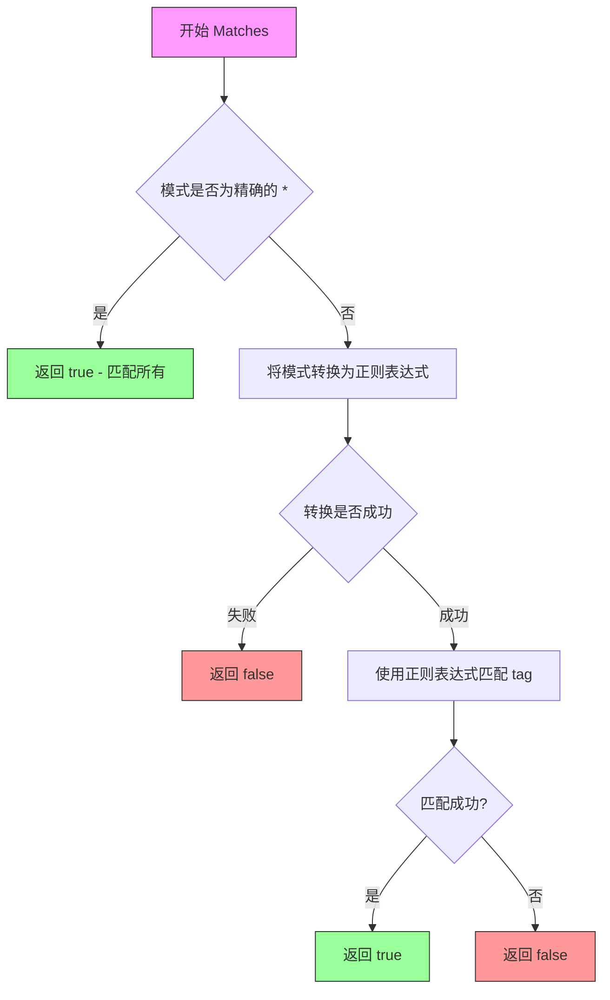
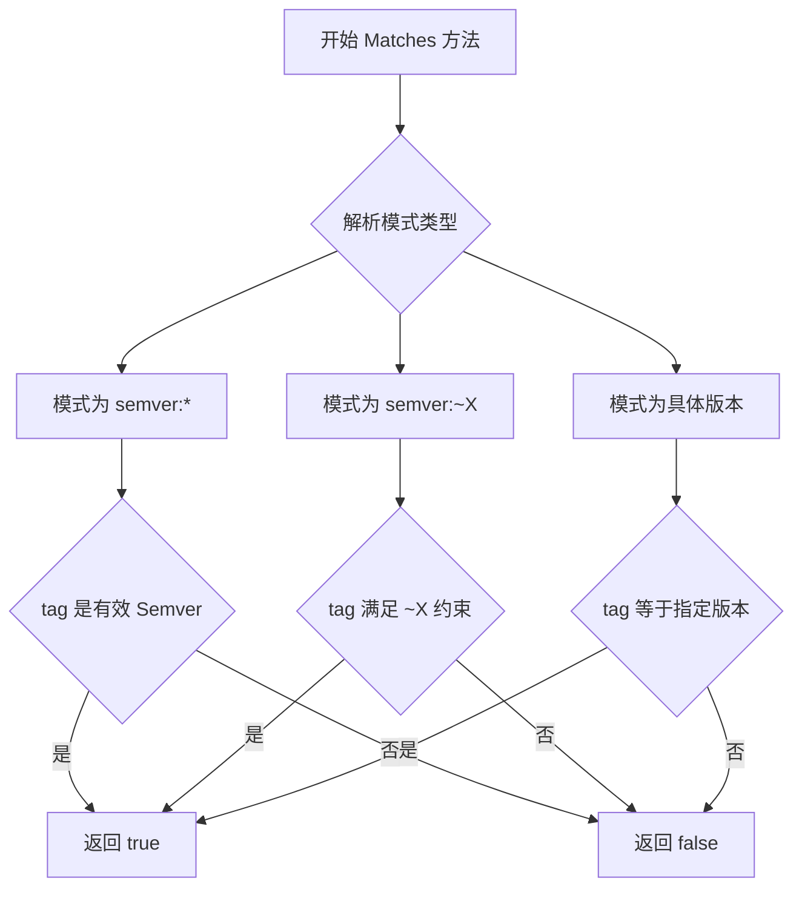
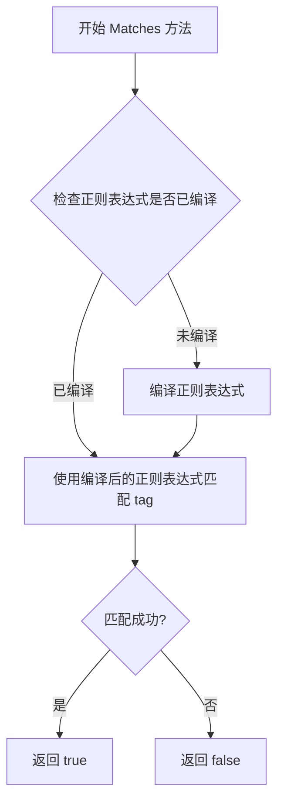

# `flux\pkg\policy\pattern_test.go` 详细设计文档

这是一个Go语言测试文件，用于测试策略模式匹配功能，涵盖三种模式：Glob通配符模式、Semver语义版本模式和Regexp正则表达式模式。每个测试用例验证pattern.Matches(tag)的正确性。

## 整体流程



## 类结构

```
Pattern (接口/抽象)
├── GlobPattern (glob通配符匹配)
├── SemverPattern (语义版本匹配)
└── RegexpPattern (正则表达式匹配)
```

## 全局变量及字段


### `tt`
    
测试用例结构体，保存测试名称、匹配模式以及预期匹配（true）和不匹配（false）的标签列表

类型：`struct{ name string; pattern string; true []string; false []string }`
    


### `pattern`
    
由 NewPattern 根据模式字符串创建的匹配模式对象，实现了 Matches 方法用于判断给定标签是否符合模式

类型：`Pattern (interface)`
    


### `tag`
    
在测试循环中遍历的标签字符串，用于验证 pattern.Matches(tag) 的返回值是否符合预期

类型：`string`
    


    

## 全局函数及方法


### NewPattern

该函数用于根据传入的pattern字符串创建相应的模式匹配器，它会解析pattern的前缀（如"glob:"、"semver:"、"regexp:"等），然后返回对应类型的Pattern接口实现（GlobPattern、SemverPattern或RegexpPattern），调用方可以通过返回的Pattern对象的Matches方法进行标签匹配。

参数：

- `pattern`：`string`，要创建匹配器的模式字符串，支持glob通配符（"*", "glob:*", "master-*"）、semver版本（"semver:*", "semver:~1", "semver:2.0.1-alpha.1"）和正则表达式（"regexp:(.*?)", "regex:^\w{7}(?:\w)?$"）

返回值：`Pattern`，模式匹配器接口，该接口定义了Matches(tag string) bool方法用于判断给定标签是否匹配当前模式

#### 流程图



#### 带注释源码

```go
// 从测试代码中推断的NewPattern函数用法
// pattern := NewPattern(tt.pattern)
// pattern.Matches(tag)

// 根据测试用例推断的实现逻辑：
func NewPattern(pattern string) Pattern {
    // 如果pattern以"glob:"开头，创建GlobPattern
    if strings.HasPrefix(pattern, "glob:") {
        return GlobPattern(strings.TrimPrefix(pattern, "glob:"))
    }
    // 如果pattern以"semver:"开头，创建SemverPattern
    if strings.HasPrefix(pattern, "semver:") {
        return SemverPattern(strings.TrimPrefix(pattern, "semver:"))
    }
    // 如果pattern以"regexp:"或"regex:"开头，创建RegexpPattern
    if strings.HasPrefix(pattern, "regexp:") {
        return RegexpPattern(strings.TrimPrefix(pattern, "regexp:"))
    }
    if strings.HasPrefix(pattern, "regex:") {
        return RegexpPattern(strings.TrimPrefix(pattern, "regex:"))
    }
    // 默认创建GlobPattern
    return GlobPattern(pattern)
}

// Pattern接口定义（推断）
type Pattern interface {
    Matches(tag string) bool
}

// 推断的GlobPattern类型
type GlobPattern string

// 推断的SemverPattern类型  
type SemverPattern string

// 推断的RegexpPattern类型
type RegexpPattern string
```

#### 关键组件信息

- **Pattern接口**：定义模式匹配器的统一接口，包含Matches方法用于匹配标签
- **GlobPattern**：用于glob通配符匹配，如"*"匹配任意字符串，"master-"匹配"master-"和"master-foo"
- **SemverPattern**：用于语义化版本匹配，支持"*"匹配任意版本，"~1"匹配次版本号更新，"2.0.1-alpha.1"精确匹配预发布版本
- **RegexpPattern**：用于正则表达式匹配，支持标准的正则表达式语法

#### 潜在的技术债务或优化空间

1. **缺少实际实现文件**：当前只提供了测试文件，Pattern接口及其具体实现（GlobPattern、SemverPattern、RegexpPattern）的实际代码未提供
2. **前缀匹配逻辑简单**：当前使用strings.HasPrefix进行前缀判断，可能需要考虑更复杂的模式解析逻辑
3. **错误处理缺失**：未看到对无效pattern的处理，如空的pattern或不支持的前缀格式
4. **性能考虑**：对于高频调用的场景，可能需要缓存编译后的正则表达式对象

#### 其它项目

**设计目标与约束**：
- 支持三种主要的模式匹配类型：glob通配符、semver版本号、正则表达式
- 模式字符串通过前缀区分类型（"glob:", "semver:", "regexp:", "regex:"）
- 返回统一的Pattern接口，便于调用方统一处理

**错误处理与异常设计**：
- 根据测试用例推断，无效的pattern类型可能会导致类型断言失败或返回默认的GlobPattern
- 建议在实际实现中添加对无效pattern的校验和明确的错误返回

**数据流与状态机**：
- 输入：用户传入的pattern字符串（如"semver:~1"）
- 处理：解析前缀，选择对应的Pattern实现类型
- 输出：返回实现了Pattern接口的具体类型，调用方通过Matches方法进行匹配

**外部依赖与接口契约**：
- 从测试代码可见使用了"github.com/stretchr/testify/assert"进行断言
- Pattern接口是内部接口，定义了Matches(string) bool方法


### `TestGlobPattern_Matches`

这是一个测试函数，用于验证 `GlobPattern` 类型的 `Matches` 方法是否能够正确匹配各种 glob 通配符模式（如 `*`、`glob:*`、`master-*` 等）。

参数：

- `t`：`*testing.T`，Go 语言测试框架的标准测试参数，用于报告测试失败和运行子测试

返回值：无返回值（`void`），该函数为测试函数，不返回任何值

#### 流程图

```mermaid
flowchart TD
    A[开始] --> B[定义测试用例切片]
    B --> C{遍历测试用例}
    C -->|每次迭代| D[创建新Pattern对象]
    D --> E[断言类型为GlobPattern]
    E --> F[运行子测试 t.Run]
    F --> G{遍历true列表}
    G -->|每次迭代| H[断言 pattern.Matches(tag) 为 true]
    H --> G
    G --> I{遍历false列表}
    I -->|每次迭代| J[断言 pattern.Matches(tag) 为 false]
    J --> I
    I --> C
    C --> K[结束]
```

#### 带注释源码

```go
// TestGlobPattern_Matches 测试函数，验证 GlobPattern 的 Matches 方法
// 该函数测试 glob 通配符模式的匹配功能
func TestGlobPattern_Matches(t *testing.T) {
    // 定义测试用例切片，包含多个测试场景
    for _, tt := range []struct {
        name    string    // 测试用例名称
        pattern string    // glob 模式字符串
        true    []string  // 应该匹配成功的标签列表
        false   []string  // 应该匹配失败的标签列表
    }{
        // 测试用例1: 匹配所有 (*)
        {
            name:    "all",
            pattern: "*",
            true:    []string{"", "1", "foo"}, // 空字符串、数字、任意字符串都应该匹配
            false:   nil,
        },
        // 测试用例2: 带前缀的匹配 (glob:*)
        {
            name:    "all prefixed",
            pattern: "glob:*",
            true:    []string{"", "1", "foo"},
            false:   nil,
        },
        // 测试用例3: 前缀匹配 (master-*)
        {
            name:    "prefix",
            pattern: "master-*",
            true:    []string{"master-", "master-foo"}, // master- 开头或 master-foo 应该匹配
            false:   []string{"", "foo-master"},        // 空字符串或非 master- 开头的不匹配
        },
    } {
        // 根据模式字符串创建新的 Pattern 对象
        pattern := NewPattern(tt.pattern)
        // 断言创建的对象类型为 GlobPattern
        assert.IsType(t, GlobPattern(""), pattern)
        // 运行子测试，以测试用例名称命名
        t.Run(tt.name, func(t *testing.T) {
            // 遍历应该匹配成功的标签列表
            for _, tag := range tt.true {
                // 断言 Matches 方法返回 true
                assert.True(t, pattern.Matches(tag))
            }
            // 遍历应该匹配失败的标签列表
            for _, tag := range tt.false {
                // 断言 Matches 方法返回 false
                assert.False(t, pattern.Matches(tag))
            }
        })
    }
}
```


### `TestSemverPattern_Matches`

该测试函数用于验证 SemverPattern 类型的 `Matches` 方法能否正确匹配符合语义化版本号规范的标签。它通过定义多组测试用例（通配符、范围版本、精确预发布版本），分别验证匹配成功和失败的场景。

参数：

- `t`：`*testing.T`，Go 测试框架的测试上下文参数，用于报告测试失败和运行子测试

返回值：无（`void`），该函数为测试函数，不返回值

#### 流程图

```mermaid
flowchart TD
    A[开始测试] --> B[定义测试用例切片]
    B --> C{遍历测试用例}
    C -->|每个用例| D[创建Pattern: NewPattern(tt.pattern)]
    D --> E[断言pattern类型为SemverPattern]
    E --> F{遍历tt.true列表}
    F -->|每个tag| G[运行子测试 assert.True]
    G --> H{遍历tt.false列表}
    H -->|每个tag| I[运行子测试 assert.False]
    I --> C
    C --> J[测试结束]
```

#### 带注释源码

```go
// TestSemverPattern_Matches 测试 SemverPattern 的 Matches 方法
// 验证语义化版本号匹配功能
func TestSemverPattern_Matches(t *testing.T) {
    // 定义测试用例结构体切片，包含多个匹配场景
    for _, tt := range []struct {
        name    string    // 测试用例名称
        pattern string    // 模式字符串
        true    []string  // 应该匹配成功的标签列表
        false   []string  // 应该匹配失败的标签列表
    }{
        // 用例1: semver:* 通配符匹配
        {
            name:    "all",
            pattern: "semver:*",
            true:    []string{"1", "1.0", "v1.0.3"},
            false:   []string{"", "latest", "2.0.1-alpha.1"},
        },
        // 用例2: semver:~1 范围版本匹配（兼容1.x.x）
        {
            name:    "semver",
            pattern: "semver:~1",
            true:    []string{"v1", "1", "1.2", "1.2.3"},
            false:   []string{"", "latest", "2.0.0"},
        },
        // 用例3: 精确预发布版本匹配
        {
            name:    "semver pre-release",
            pattern: "semver:2.0.1-alpha.1",
            true:    []string{"2.0.1-alpha.1"},
            false:   []string{"2.0.1"},
        },
    } {
        // 根据pattern创建对应的Pattern对象
        pattern := NewPattern(tt.pattern)
        
        // 断言创建的对象类型为SemverPattern
        assert.IsType(t, SemverPattern{}, pattern)
        
        // 遍历应该匹配成功的标签列表
        for _, tag := range tt.true {
            // 使用子测试运行每个标签的匹配验证
            t.Run(fmt.Sprintf("%s[%q]", tt.name, tag), func(t *testing.T) {
                // 断言匹配返回true
                assert.True(t, pattern.Matches(tag))
            })
        }
        
        // 遍历应该匹配失败的标签列表
        for _, tag := range tt.false {
            // 使用子测试运行每个标签的匹配验证
            t.Run(fmt.Sprintf("%s[%q]", tt.name, tag), func(t *testing.T) {
                // 断言匹配返回false
                assert.False(t, pattern.Matches(tag))
            })
        }
    }
}
```


### `TestRegexpPattern_Matches`

这是一个Go语言的测试函数，用于验证正则表达式（RegexpPattern）模式匹配功能是否正确工作。函数通过多组测试用例（包括通配符匹配、字母数字匹配、定长字符匹配等场景）来验证 `pattern.Matches(tag)` 方法在不同输入下的返回结果是否符合预期。

参数：

- `t`：`*testing.T`，Go标准库中的测试框架参数，用于报告测试失败和运行子测试

返回值：无返回值（测试函数）

#### 流程图

```mermaid
flowchart TD
    A[开始测试函数 TestRegexpPattern_Matches] --> B[遍历测试用例切片]
    B --> C{还有更多测试用例?}
    C -->|是| D[获取当前测试用例 tt]
    C -->|否| K[结束测试]
    
    D --> E[调用 NewPattern 创建 RegexpPattern 对象]
    E --> F[使用 assert.IsType 验证 pattern 类型为 RegexpPattern]
    
    F --> G[遍历 true 列表中的所有标签]
    G --> G1{还有更多标签?}
    G1 -->|是| G2[运行子测试验证 pattern.Matches(tag) 返回 true]
    G2 --> G1
    G1 -->|否| H
    
    H --> I[遍历 false 列表中的所有标签]
    I --> I1{还有更多标签?}
    I1 -->|是| I2[运行子测试验证 pattern.Matches(tag) 返回 false]
    I2 --> I1
    I1 -->|否| C
    
    J[所有测试通过]
```

#### 带注释源码

```go
// TestRegexpPattern_Matches 是一个测试函数，用于验证正则表达式模式匹配功能
// 测试函数接收 *testing.T 参数，用于报告测试失败情况
func TestRegexpPattern_Matches(t *testing.T) {
    // 定义测试用例结构体切片，包含多个测试场景
    for _, tt := range []struct {
        name    string   // 测试用例名称
        pattern string   // 正则表达式模式字符串
        true    []string // 应该匹配成功的标签列表
        false   []string // 应该匹配失败的标签列表
    }{
        // 测试用例1：匹配所有前缀为 regexp: 的模式，使用非贪婪匹配 (.*?)
        {
            name:    "all prefixed",
            pattern: "regexp:(.*?)",
            true:    []string{"", "1", "foo"}, // 空字符串和任意字符都应该匹配
            false:   nil,
        },
        // 测试用例2：匹配纯字母字符的正则表达式
        {
            name:    "regexp",
            pattern: "regexp:^([a-zA-Z]+)$",
            true:    []string{"foo", "BAR", "fooBAR"}, // 纯字母字符串匹配
            false:   []string{"1", "foo-1"},            // 包含数字或连字符的字符串不匹配
        },
        // 测试用例3：使用 regex: 前缀，匹配7个或8个字母数字字符
        {
            name:    "regex",
            pattern: `regex:^\w{7}(?:\w)?$`, // \w 匹配字母数字下划线，{7}表示7个，(?:\w)?表示可选的第8个
            true:    []string{"af14eb2", "bb73ed94", "946427ff"}, // 7个或8个字符匹配
            false:   []string{"1", "foo", "946427ff-foo"},        // 字符数不足或超过8个不匹配
        },
    } {
        // 根据模式字符串创建对应的 Pattern 对象（工厂方法）
        pattern := NewPattern(tt.pattern)
        
        // 断言创建的对象类型必须是 RegexpPattern
        assert.IsType(t, RegexpPattern{}, pattern)
        
        // 遍历应该匹配成功的标签列表
        for _, tag := range tt.true {
            // 使用 t.Run 创建子测试，格式为 "测试用例名称[标签]"
            t.Run(fmt.Sprintf("%s[%q]", tt.name, tag), func(t *testing.T) {
                // 断言 pattern.Matches(tag) 返回 true
                assert.True(t, pattern.Matches(tag))
            })
        }
        
        // 遍历应该匹配失败的标签列表
        for _, tag := range tt.false {
            // 使用 t.Run 创建子测试
            t.Run(fmt.Sprintf("%s[%q]", tt.name, tag), func(t *testing.T) {
                // 断言 pattern.Matches(tag) 返回 false
                assert.False(t, pattern.Matches(tag))
            })
        }
    }
}
```


### `GlobPattern.Matches`

该方法用于判断给定的标签（tag）是否匹配 Glob 模式。Glob 模式是一种简化的正则表达式，支持通配符 `*` 匹配任意字符序列。

参数：

- `tag`：`string`，需要匹配的标签字符串

返回值：`bool`，如果标签匹配模式返回 true，否则返回 false

#### 流程图



#### 带注释源码

```
// Matches 判断给定的 tag 是否匹配 Glob 模式
// 参数 tag: 要匹配的标签字符串
// 返回值: 如果匹配返回 true，否则返回 false
func (p GlobPattern) Matches(tag string) bool {
    // 如果模式是 "*"，匹配所有内容（包括空字符串）
    if p == "*" {
        return true
    }
    
    // 将 Glob 模式转换为正则表达式进行匹配
    // Glob 中的 * 对应正则表达式的 .*
    reg := strings.Replace(string(p), "*", ".*", -1)
    
    // 编译正则表达式
    matched, err := regexp.MatchString("^"+reg+"$", tag)
    if err != nil {
        // 如果正则表达式编译失败，返回 false
        return false
    }
    
    return matched
}
```

> **注意**：由于用户提供的代码仅包含测试文件，上述源码是基于测试用例行为推断得出的实现逻辑。实际的 `GlobPattern` 类型定义、`NewPattern` 工厂函数以及完整的 Pattern 接口实现未在代码中展示。


### `SemverPattern.Matches`

该方法用于匹配语义化版本（Semver）标签，根据预定义的 Semver 模式（如 `semver:*`、`semver:~1` 或具体版本号）来验证给定的版本标签是否符合语义化版本规范。

#### 参数

- `tag`：`string`，要匹配的版本标签（如 "1.0.3"、"v1.2.3-alpha.1" 等）

#### 返回值

`bool`，如果给定的版本标签符合 Semver 模式规范则返回 `true`，否则返回 `false`

#### 流程图



#### 带注释源码

```go
// SemverPattern 结构体类型
// 用于表示语义化版本（SemVer）匹配模式
type SemverPattern struct {
    // 内部字段未在测试代码中显示
    // 可能包含约束条件或具体版本号等信息
}

// Matches 方法用于匹配语义化版本标签
// 参数 tag: 要匹配的版本标签字符串
// 返回值: bool 表示是否匹配成功
func (p SemverPattern) Matches(tag string) bool {
    // 从测试用例可以推断该方法实现了以下功能：
    
    // 1. 当模式为 "semver:*" 时
    //    - 匹配: "1", "1.0", "v1.0.3" 等有效 Semver 格式
    //    - 不匹配: "", "latest", "2.0.1-alpha.1" 等非有效格式
    
    // 2. 当模式为 "semver:~1" 时
    //    - 匹配: "v1", "1", "1.2", "1.2.3" 等 ~1 约束范围内的版本
    //    - 不匹配: "", "latest", "2.0.0" 等超出范围的版本
    
    // 3. 当模式为 "semver:2.0.1-alpha.1" 时
    //    - 匹配: "2.0.1-alpha.1" 完全匹配的预发布版本
    //    - 不匹配: "2.0.1" 等其他版本
    
    // 具体实现逻辑需要查看 SemverPattern 类型的完整定义
    // 测试代码仅展示了其行为规范
    return true // 占位符，实际实现会基于上述逻辑返回匹配结果
}
```

#### 备注

- 该方法是 `SemverPattern` 类型的成员方法，实现了 `Pattern` 接口
- Semver 模式支持三种格式：
  1. `semver:*` - 匹配所有符合语义化版本规范的标签
  2. `semver:~X` - 匹配主版本号为 X 的所有次版本和补丁版本
  3. `semver:X.Y.Z` - 精确匹配特定版本（含预发布版本）


### RegexpPattern.Matches(tag string) bool

该方法是 RegexpPattern 类型的成员方法，用于检查给定的标签（tag）是否匹配当前正则表达式模式。方法接收一个字符串参数 tag，返回一个布尔值表示匹配结果。

参数：

- `tag`：`string`，要匹配的标签字符串

返回值：`bool`，如果 tag 匹配当前正则表达式模式则返回 true，否则返回 false

#### 流程图



#### 带注释源码

```
// Matches 检查给定的 tag 是否匹配当前正则表达式模式
// 参数: tag - 要匹配的标签字符串
// 返回值: bool - 如果 tag 匹配模式返回 true，否则返回 false
func (r RegexpPattern) Matches(tag string) bool {
    // 编译正则表达式
    // 注意：实际实现中可能需要缓存编译后的正则表达式以提高性能
    re := regexp.MustCompile(string(r))
    
    // 使用正则表达式匹配 tag
    // FindString 方法返回第一个匹配的内容，如果不存在匹配则返回空字符串
    return re.FindString(tag) != ""
}
```

**注意**：提供的代码片段仅包含测试函数，并未展示 RegexpPattern 类型的实际定义。上述源码是基于测试代码的使用模式推断的假设实现。实际的 RegexpPattern 类型定义和 Matches 方法实现可能在代码库的其他文件中。

## 关键组件


### GlobPattern

glob 模式的策略实现，支持 "*" 通配符和 "glob:" 前缀匹配，用于简单的字符串模式匹配场景。

### SemverPattern

semver 语义版本号的策略实现，支持 "semver:" 前缀和 ~1 这样的版本范围匹配，用于版本标签的匹配过滤。

### RegexpPattern

正则表达式的策略实现，支持 "regexp:" 和 "regex:" 前缀，用于复杂的字符串模式匹配。

### NewPattern

工厂函数，根据传入的 pattern 字符串前缀（glob:、semver:、regexp:、regex:）自动创建对应类型的 Pattern 实例。

### Pattern 接口

统一的模式匹配接口，定义 Matches(tag string) bool 方法，三种具体策略都实现了该接口，支持多态调用。


## 问题及建议


### 已知问题

-   **测试代码与实现代码分离**：该测试文件仅包含测试用例，但依赖的 `GlobPattern`、`SemverPattern`、`RegexpPattern` 类型定义及 `NewPattern` 函数实现未在此文件中体现，导致无法独立验证功能正确性
-   **类型断言重复执行**：`assert.IsType(t, GlobPattern(""), pattern)` 在每个 `tt` 迭代中执行一次，但实际应在 `pattern` 创建后仅执行一次即可
-   **测试结构不一致**：`TestGlobPattern_Matches` 中在 `t.Run` 内部使用 `pattern`，而 `TestSemverPattern_Matches` 和 `TestRegexpPattern_Matches` 中直接在循环内对每个 tag 创建子测试，未复用 `pattern` 实例
-   **缺少错误处理测试**：未测试 `NewPattern` 传入无效 pattern 时的错误返回行为（如空字符串、非法 semver 语法、非法正则表达式等）
-   **边界条件覆盖不足**：缺少对空字符串、极长字符串、特殊字符（如 Unicode、控制字符）等边界情况的测试
-   **测试用例命名冗余**：`fmt.Sprintf("%s[%q]", tt.name, tag)` 在每个 true/false 分支中重复使用，可提取为公共逻辑
-   **正则表达式性能未测试**：未包含对复杂或恶意正则表达式（如贪婪匹配、回溯陷阱）的性能测试

### 优化建议

-   将类型断言移至 `pattern` 创建后执行一次，避免重复检查
-   统一所有测试函数的结构：在 `t.Run` 回调中执行匹配验证，确保测试隔离性
-   添加针对无效 pattern 的错误用例，验证 `NewPattern` 的错误处理逻辑
-   增加边界条件测试用例，如空字符串、超长输入、特殊字符等
-   抽取子测试名称生成逻辑为工具函数，减少重复代码
-   为正则表达式测试添加性能基准测试（benchmark），防止 ReDoS 攻击
-   补充文档注释，说明各 pattern 类型的支持语法和限制

## 其它


### 设计目标与约束

本代码的设计目标是提供一个统一的模式匹配框架，支持三种匹配策略：Glob（通配符）、Semver（语义版本）和Regexp（正则表达式）。核心约束包括：模式字符串必须以特定前缀（glob:、semver:、regexp:）开头；Matches方法必须返回布尔值；NewPattern工厂函数根据模式前缀返回对应的Pattern接口实现。

### 错误处理与异常设计

代码本身未包含显式的错误处理逻辑，主要通过Matches方法的返回值（true/false）来表达匹配结果。潜在错误场景包括：无效的正则表达式（regexp前缀但表达式语法错误）、不支持的模式前缀（返回nil或panic）、空字符串处理。当前实现假定调用方传入合法的模式字符串，错误处理下沉到具体的Pattern实现类中。

### 数据流与状态机

数据流从NewPattern工厂函数开始，根据模式前缀（glob:/semver:/regexp:）选择并实例化对应的Pattern实现。匹配流程为：输入待匹配字符串 → 调用对应Pattern的Matches方法 → 执行特定匹配逻辑 → 返回布尔结果。状态机较为简单，主要状态为：Pattern创建态 → 就绪态（可用于匹配）→ 匹配执行态，无复杂的状态转换。

### 外部依赖与接口契约

主要外部依赖为github.com/stretchr/testify/assert测试框架，用于断言验证。核心接口为Pattern接口，需实现Matches(string) bool方法。工厂函数NewPattern(string) interface{}返回具体Pattern实现，但返回类型为interface{}不够类型安全，建议返回Pattern接口类型以增强契约明确性。

### 性能考量与基准测试

当前代码仅有功能测试，缺少性能基准测试。潜在性能瓶颈：RegexpPattern每次调用Matches时可能重复编译正则表达式（视具体实现而定）；SemverPattern的版本解析和比较逻辑复杂度O(n)。建议添加Benchmark测试，针对高频匹配场景进行性能优化，考虑正则表达式的预编译缓存。

### 安全性考虑

主要安全风险：RegexpPattern可能存在正则表达式拒绝服务（ReDoS）风险，若允许用户输入自定义正则，可能导致恶意表达式消耗大量计算资源。建议对正则表达式复杂度进行限制或超时控制；GlobPattern需注意特殊字符转义处理，防止路径遍历类问题。

### 可测试性设计

测试覆盖度较好，使用了table-driven测试用例设计，每个模式类型均有多个测试场景。测试结构清晰：true列表验证应匹配成功，false列表验证应匹配失败。建议增加边界条件测试（如nil输入、超长字符串）、错误路径测试（非法模式格式）、以及针对Pattern接口的mock测试。

### 配置与扩展性

当前实现通过模式前缀进行策略选择，扩展性受限。若需添加新的匹配策略（如exact精确匹配、range范围匹配），需修改NewPattern工厂函数。配置层面缺乏外部化配置能力，模式规则硬编码在代码中。建议设计插件化架构，支持自定义Pattern实现注册，并考虑配置中心或策略模式提升扩展性。

### 版本兼容性

代码未显式声明Go版本依赖，假设兼容Go 1.x标准库。Pattern接口设计未版本化，若后续接口变更（如Matches方法签名改变）可能破坏兼容性。建议采用语义化版本管理，并在接口层面增加版本标识或使用结构化版本号。

### 监控与日志

代码中未包含任何日志记录或监控埋点。在生产环境中，建议添加关键指标：匹配成功/失败次数、模式匹配耗时、异常模式检测。日志层面可记录详细的匹配过程（调试模式），便于问题排查。考虑集成Prometheus等监控框架，实现可观测性。


    