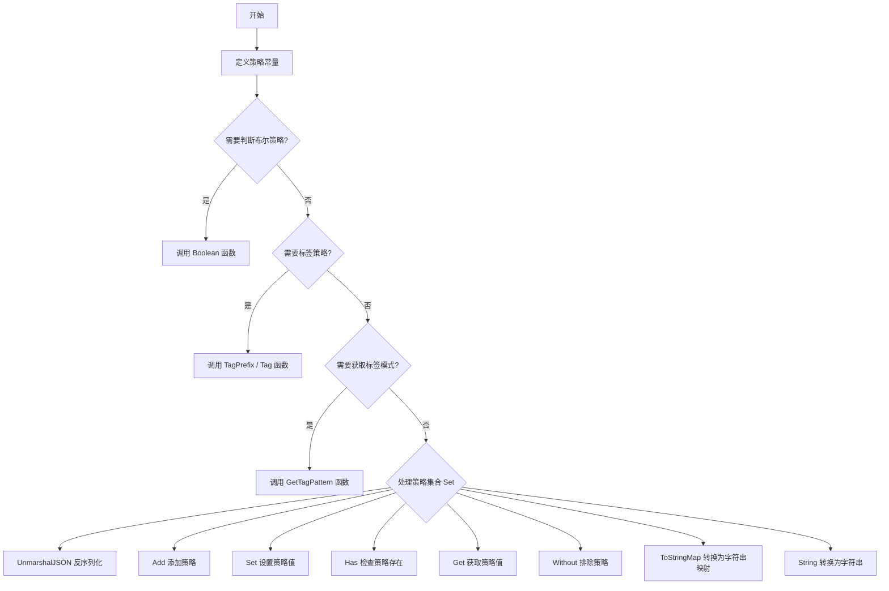
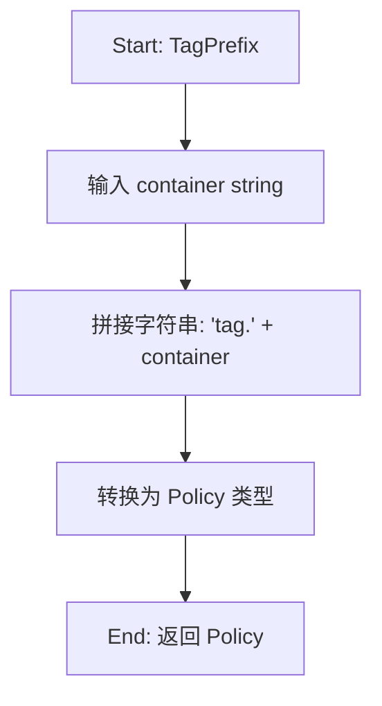
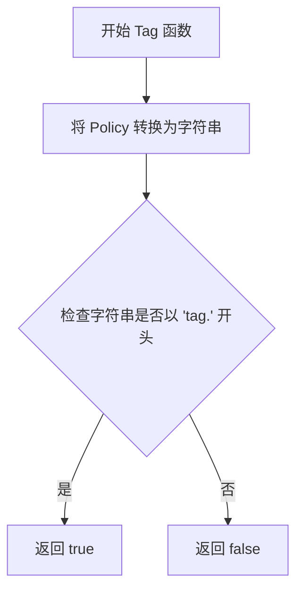
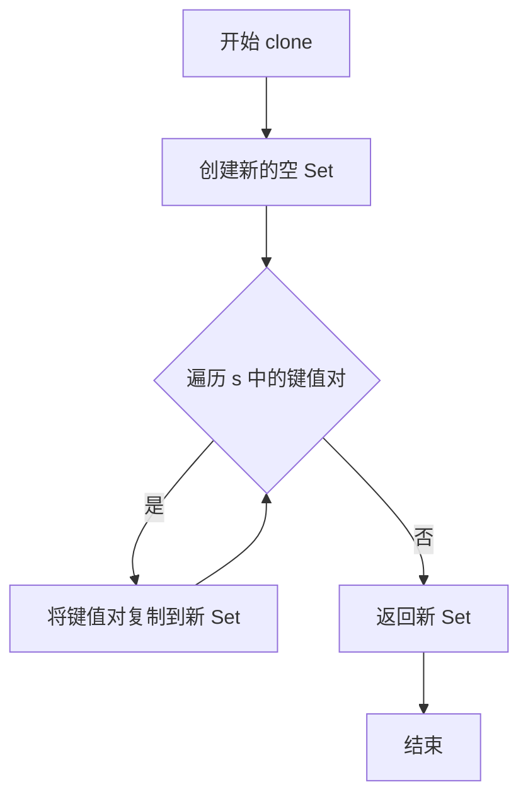
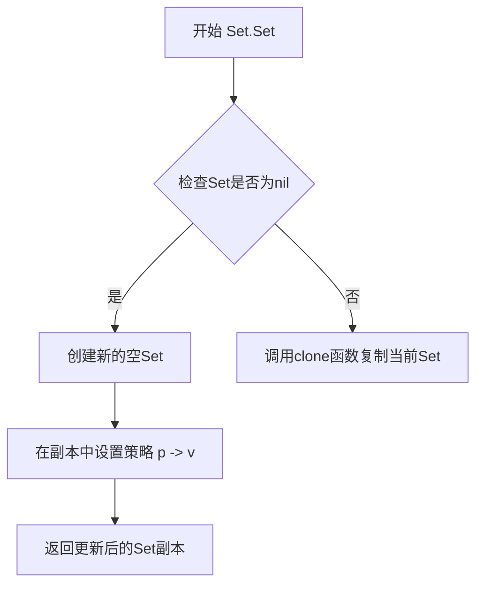
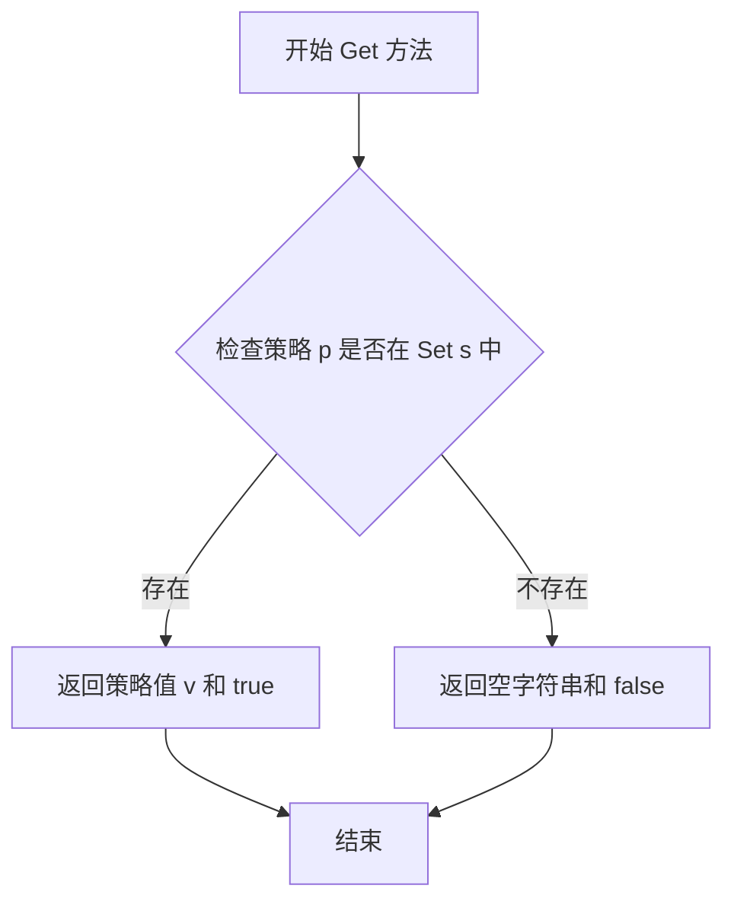
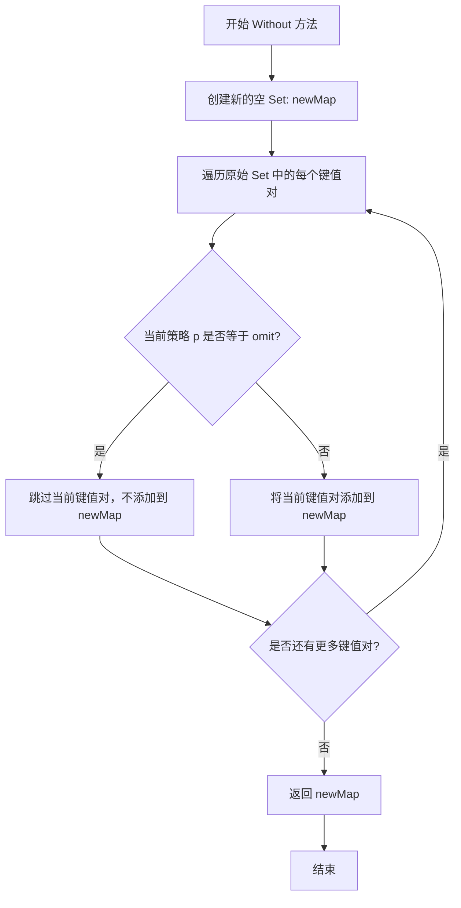

# `flux\pkg\policy\policy.go` 详细设计文档

该代码定义了一套服务部署策略（Policy）系统，包括策略常量的定义、策略集合（Set）的数据结构及其操作方法，用于管理和控制服务的部署行为，如锁定（locked）、自动化（automated）、忽略（ignore）等策略的管理与查询。

## 整体流程



## 类结构

```
Policy (策略类型)
├── 策略常量定义
│   ├── Ignore
│   ├── Locked
│   ├── LockedUser
│   ├── LockedMsg
│   ├── Automated
│   └── TagAll
├── 策略工具函数
Boolean()
TagPrefix()
Tag()
GetTagPattern()
└── Set (策略集合类型)
├── UnmarshalJSON()
├── String()
├── Add()
├── Set()
├── Has()
├── Get()
├── Without()
├── ToStringMap()
└── clone() (内部函数)
```

## 全局变量及字段


### `Ignore`
    
忽略策略常量值为ignore

类型：`Policy`
    


### `Locked`
    
锁定策略常量值为locked

类型：`Policy`
    


### `LockedUser`
    
用户锁定策略常量值为locked_user

类型：`Policy`
    


### `LockedMsg`
    
消息锁定策略常量值为locked_msg

类型：`Policy`
    


### `Automated`
    
自动化策略常量值为automated

类型：`Policy`
    


### `TagAll`
    
全部标记策略常量值为tag_all

类型：`Policy`
    


### `IgnoreSyncOnly`
    
仅同步标识常量值为sync_only

类型：`string`
    


    

## 全局函数及方法


### `Boolean`

该函数用于判断给定的部署策略是否为布尔类型策略（即表示启用或激活状态的策略）。如果策略是 `Locked`、`Automated` 或 `Ignore` 之一，则返回 `true`，表示该策略为启用状态；否则返回 `false`。

参数：

-  `policy`：`Policy`，策略类型，表示服务的部署策略（如 locked、automated、ignore 等）

返回值：`bool`，如果策略是 `Locked`、`Automated` 或 `Ignore` 之一返回 `true`，否则返回 `false`

#### 流程图

```mermaid
flowchart TD
    A[开始] --> B{policy ∈ {Locked, Automated, Ignore}?}
    B -->|是| C[返回 true]
    B -->|否| D[返回 false]
```

#### 带注释源码

```go
// Boolean 判断指定的策略是否为布尔类型策略
// 布尔类型策略表示该策略处于激活/启用状态
// 参数 policy: Policy 类型，表示要检查的部署策略
// 返回值: bool，true 表示策略为 Locked/Automated/Ignore 之一，false 表示其他策略
func Boolean(policy Policy) bool {
	// 使用 switch 语句检查策略是否为布尔类型策略
	switch policy {
	// 如果策略是 Locked、Automated 或 Ignore 中的任意一个
	case Locked, Automated, Ignore:
		// 返回 true，表示该策略为启用状态
		return true
	}
	// 如果策略不在上述列表中，返回 false
	return false
}
```


### `TagPrefix`

该函数接收一个容器名称字符串作为参数，在其前拼接 `"tag."` 前缀后转换为 Policy 类型并返回，用于生成带标签前缀的策略键。

参数：

- `container`：`string`，容器名称，用于生成标签策略的前缀

返回值：`Policy`，返回拼接后的标签策略字符串（例如 `container` 为 "abc" 时返回 "tag.abc"）

#### 流程图



#### 带注释源码

```go
// TagPrefix 根据给定的容器名称生成对应的标签策略前缀
// 它将 "tag." 前缀与容器名称拼接，形成一个完整的标签策略键
// 例如: container = "abc" -> 返回 "tag.abc" 作为 Policy 类型
func TagPrefix(container string) Policy {
    // 使用字符串拼接将 "tag." 前缀与容器名称连接
    // 然后通过 Policy() 类型转换将其转换为 Policy 类型
    return Policy("tag." + container)
}
```


### Tag

判断给定的部署策略（Policy）是否为标签策略，即检查策略名称是否以"tag."前缀开头。通常用于区分普通的锁定/自动化策略与容器标签相关的策略。

参数：

- `policy`：`Policy`，待检查的部署策略，用于判断是否为标签类型策略

返回值：`bool`，如果策略以"tag."前缀开头返回true，否则返回false

#### 流程图



#### 带注释源码

```go
// Tag 判断给定的部署策略是否为标签策略
// 参数 policy: 待检查的部署策略（Policy类型）
// 返回值: bool - 如果策略以"tag."开头返回true，否则返回false
// 说明: 该函数用于区分普通策略（如locked、automated、ignore）
//      与容器标签相关的策略（如tag.redis、tag.mysql等）
func Tag(policy Policy) bool {
    // 将Policy类型转换为字符串
    // Policy本质上是string类型别名
    policyStr := string(policy)
    
    // 使用strings.HasPrefix检查策略名称是否以"tag."开头
    // 如果以"tag."开头，说明这是一个标签策略
    return strings.HasPrefix(policyStr, "tag.")
}
```


### `GetTagPattern`

获取与指定容器关联的标签匹配模式。当策略集合为空或不存在对应容器的标签策略时，返回默认的全量匹配模式。

参数：

- `policies`：`Set`，策略集合，包含多个策略键值对
- `container`：`string`，容器名称，用于构建标签策略的前缀

返回值：`Pattern`，标签匹配模式，用于匹配标签的规则

#### 流程图

```mermaid
flowchart TD
    A[开始 GetTagPattern] --> B{policies == nil?}
    B -->|是| C[返回 PatternAll]
    B -->|否| D[调用 TagPrefix(container)]
    D --> E[调用 policies.Get(TagPrefix)]
    E --> F{ok == true?}
    F -->|否| C
    F -->|是| G[调用 NewPattern(pattern)]
    G --> H[返回 Pattern]
```

#### 带注释源码

```go
// GetTagPattern 根据策略集合和容器名称获取对应的标签匹配模式
// 参数 policies: 策略集合，类型为 Set (map[Policy]string)
// 参数 container: 容器名称，类型为 string
// 返回值: Pattern 类型，表示标签匹配模式
func GetTagPattern(policies Set, container string) Pattern {
	// 判断策略集合是否为空
	// 如果为空，直接返回默认的全量匹配模式 PatternAll
	if policies == nil {
		return PatternAll
	}
	
	// 根据容器名称生成对应的标签策略前缀
	// 例如: container = "web" -> "tag.web"
	prefix := TagPrefix(container)
	
	// 从策略集合中获取该前缀对应的策略值
	pattern, ok := policies.Get(prefix)
	
	// 如果策略集合中不存在该容器对应的标签策略
	// 返回默认的全量匹配模式 PatternAll
	if !ok {
		return PatternAll
	}
	
	// 根据获取到的策略值创建并返回新的 Pattern 对象
	return NewPattern(pattern)
}
```

#### 相关依赖函数说明

| 函数/方法 | 描述 |
|-----------|------|
| `TagPrefix(container string) Policy` | 将容器名称转换为标签策略的前缀，格式为 `"tag." + container` |
| `Set.Get(p Policy) (string, bool)` | 从策略集合中根据策略键获取对应的值和是否存在标志 |
| `NewPattern(pattern string) Pattern` | 根据字符串模式创建 Pattern 对象 |


### `clone`

该函数用于创建 Policy 集合（Set）的浅拷贝，通过遍历原 map 并将所有键值对复制到一个新的 map 中返回，实现不可变的修改语义。

参数：

- `s`：`Set`（即 `map[Policy]string`），需要克隆的 Policy 集合

返回值：`Set`，返回原集合的一个浅拷贝

#### 流程图



#### 带注释源码

```
func clone(s Set) Set {
	// 1. 创建一个新的空 Set（map[Policy]string）
	newMap := Set{}
	
	// 2. 遍历原 Set 中的所有键值对
	for p, v := range s {
		// 3. 将每个键值对复制到新 Set 中
		newMap[p] = v
	}
	
	// 4. 返回克隆后的新 Set
	return newMap
}
```


### `Set.UnmarshalJSON`

该方法实现了 `json.Unmarshaler` 接口，用于将 JSON 数据反序列化为 `Set`（即 `map[Policy]string`）类型。它首先尝试将输入解析为 `map[Policy]string` 格式，如果失败则尝试解析为 `[]Policy` 格式以兼容旧的序列化方式，最后将策略列表转换为 Set 类型。

#### 参数

- `in`：`[]byte`，表示 JSON 格式的输入字节切片

#### 返回值

- `error`：如果反序列化过程中发生错误则返回错误信息，否则返回 `nil`

#### 流程图

```mermaid
flowchart TD
    A[开始 UnmarshalJSON] --> B[定义类型别名 set = Set]
    B --> C{尝试将 JSON 解析为 map[Policy]string}
    C -->|成功| D[返回 nil]
    C -->|失败| E{尝试将 JSON 解析为 []Policy}
    E -->|解析失败| F[返回错误 err]
    E -->|解析成功| G[创建新的空 Set]
    G --> H[调用 s1.Add 将策略列表添加到 Set]
    H --> I[将结果赋值给 *s]
    I --> D
```

#### 带注释源码

```go
// UnmarshalJSON 实现了 json.Unmarshaler 接口
// 用于将 JSON 数据反序列化为 Set 类型
func (s *Set) UnmarshalJSON(in []byte) error {
    // 定义一个类型别名，用于绕过 Go 的类型系统限制
    // 避免直接调用 json.Unmarshal 时出现无限递归
    type set Set
    
    // 首先尝试将 JSON 解析为 Set（即 map[Policy]string）
    // 这是当前的默认格式
    if err := json.Unmarshal(in, (*set)(s)); err != nil {
        // 如果解析失败，说明可能是旧的 []Policy 格式
        var list []Policy
        if err = json.Unmarshal(in, &list); err != nil {
            // 两种格式都失败，返回错误
            return err
        }
        // 将 []Policy 转换为 Set
        var s1 = Set{}
        *s = s1.Add(list...)
    }
    // 成功解析，返回 nil
    return nil
}
```


### `Set.String`

将 Policy 集合（map[Policy]string）转换为可读的字符串表示形式，格式为 `{policy1:value1, policy2:value2, ...}`。

参数：
- （无显式参数，使用接收者 `s`）

返回值：`string`，返回 Policy 集合的字符串表示形式，格式为花括号包裹的键值对列表。

#### 流程图

```mermaid
flowchart TD
    A[开始 String] --> B[初始化空字符串切片 ps]
    B --> C{遍历 s 中的每个键值对}
    C -->|对于每个 p, v| D[将 string(p) + ':' + v 添加到 ps]
    D --> C
    C -->|遍历完成| E[使用 strings.Join 用 ', ' 连接 ps]
    E --> F[添加花括号 { 和 }]
    F --> G[返回格式化字符串]
    G --> H[结束]
```

#### 带注释源码

```go
// String 将 Policy 集合转换为字符串表示形式
// 格式: {policy1:value1, policy2:value2, ...}
func (s Set) String() string {
    // 创建一个字符串切片用于存储所有 policy:value 对
    var ps []string
    
    // 遍历 Set 中的每个 Policy 及其对应的值
    for p, v := range s {
        // 将 Policy 转换为字符串并与值用冒号连接，然后添加到切片
        // 例如: "locked:true" 或 "tag.container:v1.0"
        ps = append(ps, string(p)+":"+v)
    }
    
    // 使用 ", " 作为分隔符将所有键值对连接成单个字符串，
    // 并用花括号包裹
    return "{" + strings.Join(ps, ", ") + "}"
}
```


### `Set.Add`

该方法用于向当前策略集（Set）中添加一个或多个策略。采用不可变设计，每次调用都会返回一个新的策略集副本，而不会修改原始集合。

参数：

- `ps`：`...Policy`，可变数量的策略对象，表示需要添加到集合中的策略

返回值：`Set`，返回添加策略后的新策略集

#### 流程图

```mermaid
flowchart TD
    A[开始 Add 方法] --> B{检查 Set 是否为 nil}
    B -->|不为 nil| C[调用 clone 函数复制当前集合]
    B -->|为 nil| D[创建新的空 Set]
    D --> C
    C --> E[遍历 ps 参数中的每个策略]
    E --> F[将策略 p 作为键, 值设为 "true"]
    F --> G{是否还有更多策略?}
    G -->|是| E
    G -->|否| H[返回新的策略集]
    H --> I[结束]
```

#### 带注释源码

```go
// Add 向当前策略集添加一个或多个策略
// 采用不可变设计，返回新的 Set 而不修改原始集合
// 参数 ps: 可变数量的 Policy 类型参数
// 返回值: 新的 Set 实例，包含添加后的所有策略
func (s Set) Add(ps ...Policy) Set {
    // 1. 首先克隆当前集合，创建副本以保持不可变性
    s = clone(s)
    
    // 2. 遍历所有传入的策略参数
    for _, p := range ps {
        // 3. 将每个策略添加到集合中，值为 "true"（表示该策略已启用）
        s[p] = "true"
    }
    
    // 4. 返回新的策略集
    return s
}
```


### `Set.Set`

该方法用于向策略集合中添加或更新指定策略的值，采用不可变模式（克隆副本后修改），返回包含更新后策略的新集合。

参数：

- `p`：`Policy`，要设置的策略键
- `v`：`string`，要设置的策略值

返回值：`Set`，返回更新后的策略集合（新创建的副本）

#### 流程图



#### 带注释源码

```go
// Set 为策略集合设置指定策略的值，采用不可变设计
// 参数：
//   - p: Policy 类型，要设置的策略键
//   - v: string 类型，要设置的策略值
// 返回值：
//   - Set: 返回一个新的Set副本，其中包含了设置的策略键值对
func (s Set) Set(p Policy, v string) Set {
    // 1. 克隆当前集合创建副本（保证不可变性，不修改原集合）
    s = clone(s)
    // 2. 在副本中设置策略 p 的值为 v
    s[p] = v
    // 3. 返回更新后的副本
    return s
}
```


### Set.Has

检查资源是否具有特定策略，对于布尔策略（Locked、Automated、Ignore）还会验证其值是否设置为 "true"。

参数：

- `needle`：`Policy`，要检查的策略

返回值：`bool`，如果资源具有指定策略且布尔策略值为 "true" 则返回 true，否则返回 false

#### 流程图

```mermaid
flowchart TD
    A[开始 Has 方法] --> B{遍历 Set 中的每个键值对}
    B -->|获取到 p, v| C{p == needle?}
    C -->|是| D{Boolean(needle)?}
    C -->|否| B
    D -->|是| E{v == "true"?}
    D -->|否| F[返回 true]
    E -->|是| G[返回 true]
    E -->|否| B
    G --> H[结束]
    F --> H
    B -->|遍历完成| I[返回 false]
    I --> H
```

#### 带注释源码

```go
// Has returns true if a resource has a particular policy present, and
// for boolean policies, if it is set to true.
func (s Set) Has(needle Policy) bool {
    // 遍历 Set 中的所有策略键值对
    for p, v := range s {
        // 检查当前遍历的策略键是否与目标策略匹配
        if p == needle {
            // 判断目标策略是否为布尔类型策略
            if Boolean(needle) {
                // 布尔策略需要额外验证其值是否为 "true"
                return v == "true"
            }
            // 非布尔策略只要存在即返回 true
            return true
        }
    }
    // 遍历完所有策略都未找到匹配，返回 false
    return false
}
```


### `Set.Get`

该方法是 `Set` 类型的成员方法，用于从策略集合（map）中获取指定策略对应的值，并返回该策略是否存在。

参数：

- `p`：`Policy`，要查询的策略键

返回值：`string, bool`，返回策略对应的值（字符串）以及该策略是否存在于集合中（布尔值）

#### 流程图



#### 带注释源码

```go
// Get 返回给定策略 p 在集合中的值以及该策略是否存在
// 参数 p: Policy 类型，表示要获取的策略键
// 返回值: (string, bool) - 策略对应的值和是否存在该策略的标志
func (s Set) Get(p Policy) (string, bool) {
	v, ok := s[p] // 从 map 中查找键 p，ok 表示键是否存在
	return v, ok  // 返回值和存在标志
}
```


### `Set.Without`

该方法用于从当前策略集中移除指定的策略，返回一个新的策略集（不修改原始集合）。

参数：

- `omit`：`Policy`，要排除的策略

返回值：`Set`，返回一个新的策略集，不包含被排除的策略

#### 流程图



#### 带注释源码

```go
// Without 返回一个不包含指定策略的新 Set
// 参数 omit 表示要从当前策略集中排除的策略
// 注意：该方法不会修改原始 Set，而是返回一个新的 Set
func (s Set) Without(omit Policy) Set {
    // 1. 创建一个新的空 Set 用于存储结果
    newMap := Set{}
    
    // 2. 遍历原始 Set 中的每个键值对
    for p, v := range s {
        // 3. 如果当前策略不等于要排除的策略，则添加到新 Set 中
        if p != omit {
            newMap[p] = v
        }
        // 4. 如果等于则跳过，实现排除效果
    }
    
    // 5. 返回不包含指定策略的新 Set
    return newMap
}
```


### `Set.ToStringMap()`

将 `Set` 类型（底层为 `map[Policy]string`）转换为标准的 `map[string]string` 类型，便于序列化或与其他系统交互。

参数： 无（方法接收器 `(s Set)` 不视为显式参数）

返回值： `map[string]string`，返回一个新的字符串键值对映射，其中键为策略名称的字符串形式，值为策略对应的字符串值。

#### 流程图

```mermaid
flowchart TD
    A[开始 ToStringMap] --> B[创建新的 map[string]string]
    B --> C{遍历 Set 中的每个键值对}
    C -->|是| D[将 Policy 键转换为 string]
    D --> E[将原值存入新 map]
    E --> C
    C -->|遍历完成| F[返回转换后的 map]
    F --> G[结束]
```

#### 带注释源码

```go
// ToStringMap 将 Set（map[Policy]string）转换为 map[string]string
// 该方法主要用于：
// 1. 与需要标准 map[string]string 类型的外部系统交互
// 2. JSON 序列化时的格式转换
// 3. 简化键的处理（避免频繁类型转换）
func (s Set) ToStringMap() map[string]string {
    // 1. 创建一个新的字符串键映射
    m := map[string]string{}
    
    // 2. 遍历当前 Set 中的所有 Policy 键值对
    for p, v := range s {
        // 3. 将 Policy 类型键转换为 string 类型
        // Policy 是 string 的别名，因此需要显式转换
        m[string(p)] = v
    }
    
    // 4. 返回转换后的 map
    return m
}
```

---

### 补充信息

#### 类型定义

| 名称 | 类型 | 描述 |
|------|------|------|
| `Policy` | `string` | 字符串别名，表示部署策略的类型，如 "ignore"、"locked"、"automated" 等 |
| `Set` | `map[Policy]string` | 策略集合的别名，键为 Policy 类型，值为字符串 |

#### 相关方法

| 方法名 | 功能描述 |
|--------|----------|
| `Set.Add()` | 向集合添加一个或多个策略 |
| `Set.Set()` | 设置指定策略的值 |
| `Set.Get()` | 获取指定策略的值和存在状态 |
| `Set.Has()` | 检查策略是否存在且值为 "true"（针对布尔策略） |
| `Set.Without()` | 返回一个不含指定策略的新集合 |
| `Set.String()` | 返回集合的字符串表示形式 |
| `Set.UnmarshalJSON()` | 支持从 JSON 数组或对象格式反序列化 |

#### 使用场景

- **配置序列化**：当需要将策略集合序列化为 JSON 时，`ToStringMap()` 提供了中间转换能力
- **日志输出**：便于以字符串形式记录策略状态
- **接口适配**：与期望 `map[string]string` 的外部库或 API 交互时

#### 潜在优化

1. **避免不必要的复制**：当前实现使用值接收器 `(s Set)`，如果 `Set` 很大，每次调用都会复制整个 map。可考虑使用指针接收器 `(s *Set)` 以避免复制
2. **预分配容量**：如果已知 Set 的大小，可以预先分配 map 容量以减少内存分配开销：`make(map[string]string, len(s))`

## 关键组件


### Policy 类型与常量定义

该组件定义了 Policy 字符串类型及一系列策略常量，用于表示服务的部署策略，包括忽略、锁定（针对用户、消息）和自动化策略，同时支持标签策略的前缀匹配。

### Boolean 函数

该函数将 Policy 转换为布尔值，用于判断策略是否为布尔类型（Locked、Automated、Ignore），返回 true 表示策略启用，返回 false 表示策略未启用。

### TagPrefix 与 Tag 函数

TagPrefix 函数根据容器名称生成带 "tag." 前缀的策略名称；Tag 函数通过字符串前缀检查判断 Policy 是否为标签策略，两者共同支持基于容器的标签策略匹配机制。

### GetTagPattern 函数

该函数从策略集中获取指定容器的标签模式，若策略集为空或不存在对应容器的标签策略，则返回匹配所有模式的 PatternAll，适用于容器化部署中的镜像标签策略管理。

### Set 类型及相关方法

Set 是 map[Policy]string 类型的别名，表示策略集合。该类型封装了丰富的操作方法：Add 添加策略、Set 设置策略值、Has 检查策略存在性、Get 获取策略值、Without 排除指定策略、ToStringMap 转换为字符串映射，支持链式调用（返回新的 Set 而非修改原 Set）。

### UnmarshalJSON 方法

该方法实现了 json.Unmarshaler 接口，支持两种 JSON 格式解析：传统的 map 格式 {"policy": "value"} 和遗留的数组格式 ["policy1", "policy2"]，确保向后兼容性并处理历史数据格式。

### clone 函数

该函数实现 Set 的深拷贝，通过遍历原 Map 创建新的 Map 对象，避免直接引用导致的副作用，是实现不可变数据操作的基础工具函数。


## 问题及建议


### 已知问题

- **Boolean函数覆盖不完整**：Boolean函数只判断了Locked、Automated、Ignore三个策略，但代码中定义了其他策略常量（LockedUser、LockedMsg、TagAll），这些未被处理，可能导致逻辑不一致
- **Set类型值语义与指针语义混用**：UnmarshalJSON接收指针(*Set)，而Add/Set/Without等方法使用值接收者，这种不一致可能造成调用时的困惑
- **clone函数实现冗余**：手动遍历复制map，而Go中map本身就是引用类型，且可使用内置方式简化
- **类型依赖未定义**：代码中引用了Pattern、PatternAll类型，但在当前文件中未定义，依赖外部包
- **字符串拼接效率**：TagPrefix和String方法使用+号拼接字符串，高频调用时可考虑strings.Builder优化
- **缺乏并发安全保护**：Set类型作为map在并发读写时存在竞态条件风险
- **Policy常量缺少文档注释**：各策略常量的业务含义未注释，后期维护可能产生理解偏差

### 优化建议

- 完善Boolean函数逻辑，明确处理所有Policy常量，或添加注释说明只处理特定策略
- 统一使用值接收者或指针接收者，避免语义混淆
- 使用make(map[Policy]string)替代手动clone实现，或直接利用map的引用特性
- 确保Pattern/PatternAll类型的导入或定义完整
- 对高频路径使用strings.Builder进行字符串拼接
- 如需并发安全，提供并发保护的Set实现或使用sync.RWMutex
- 为Policy常量添加godoc注释，说明每个策略的业务含义和使用场景

## 其它


### 设计目标与约束

本代码库旨在提供一个灵活且可扩展的策略（Policy）管理框架，用于描述和管理服务的部署策略。设计目标包括：1）支持多种预定义策略类型（ignore、locked、automated等）；2）支持自定义策略标签；3）提供不可变策略集合操作，确保线程安全；4）支持JSON序列化与反序列化。约束条件：策略键必须为有效的Policy类型，值为字符串，且布尔策略仅支持"true"字符串作为真值。

### 错误处理与异常设计

本代码采用显式错误返回机制。UnmarshalJSON方法在JSON解析失败时返回标准error，不抛出panic。对于nil策略集合（policies），GetTagPattern方法返回默认PatternAll而非错误。Set类型的各项方法均返回新的Set实例（函数式风格），避免直接修改原集合。所有可能返回错误的函数都遵循Go语言惯例，将error作为最后一个返回值。

### 外部依赖与接口契约

本代码依赖Go标准库中的"encoding/json"和"strings"两个包。接口契约如下：Policy类型必须为非空字符串；Set类型为map[Policy]string的别名，支持JSON数组和对象两种序列化格式；GetTagPattern函数接受可能为nil的Set参数，返回Pattern类型值；Boolean函数仅对Locked、Automated、Ignore返回true，其他策略返回false；Tag函数通过字符串前缀判断是否为标签策略。

### 安全性考虑

本代码不涉及敏感数据处理，策略值以明文存储。安全性考虑点：1）策略值应避免存储用户敏感信息；2）反序列化时应校验策略名的合法性，防止注入攻击；3）Set的ToStringMap方法将Policy转换为字符串后，应注意日志输出时的脱敏处理。

### 性能考量

性能优化点：1）Set的Add、Set、Without等方法每次调用都会clone整个map，当策略数量较大时可能存在性能瓶颈，建议评估是否需要引入Copy-On-Write优化；2）Has方法采用线性遍历而非哈希查找，因Set底层为map本身具有O(1)查找特性，此处代码略显冗余，可直接使用map原生查找；3）clone函数可通过make预分配容量减少内存分配。

### 配置说明

策略配置可通过JSON格式定义，支持两种语法：1）对象语法：{"locked":"true","tag_all":"v1.0"}；2）数组语法：["locked","automated"]。常见配置示例：单策略锁定{"locked":"true"}；多策略组合{"ignore":"true","tag_all":"v1.0"}；同步专用{"ignore":"sync_only"}。标签策略需使用"tag."前缀配合容器名称，如{"tag.kubernetes":"v1.2.0"}。

### 测试策略建议

建议补充以下测试用例：1）Boolean函数对所有预定义策略的返回值验证；2）Set类型JSON序列化/反序列化双向转换测试；3）Set操作（Add/Set/Without/Has/Get）的边界条件测试，包括空Set、nil处理；4）TagPrefix和Tag函数的边界输入测试；5）clone函数对不同规模Set的性能基准测试。

### 版本兼容性说明

当前代码未使用泛型（Go 1.18+特性），保持与Go 1.11+的兼容性。UnmarshalJSON方法兼容旧版[]Policy数组格式，体现了向后兼容的设计考量。后续升级建议：1）考虑使用泛型重写Set类型以提供类型安全；2）评估是否需要支持Protocol Buffers序列化。

### 关键算法说明

策略匹配算法采用前缀匹配（strings.HasPrefix）判断标签策略，通过"tag."前缀区分普通策略与容器标签策略。GetTagPattern函数实现了三级降级逻辑：优先查询容器特定标签 → 无则返回全局PatternAll。该设计允许细粒度（per-container）和粗粒度（global）策略共存。

### 已知限制

1）策略值类型单一，仅支持字符串，无法直接存储复合结构；2）布尔策略判断硬编码，新增布尔策略需修改Boolean函数；3）Pattern类型在代码中引用但未定义，需配合其他包使用；4）缺乏策略验证机制，无法约束非法策略组合。


    