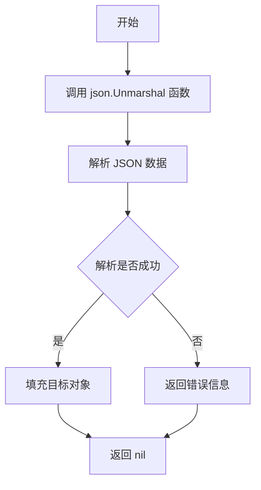
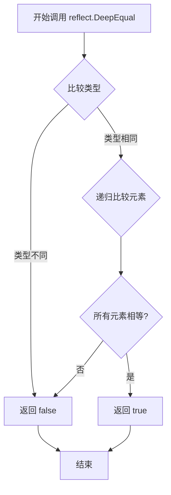
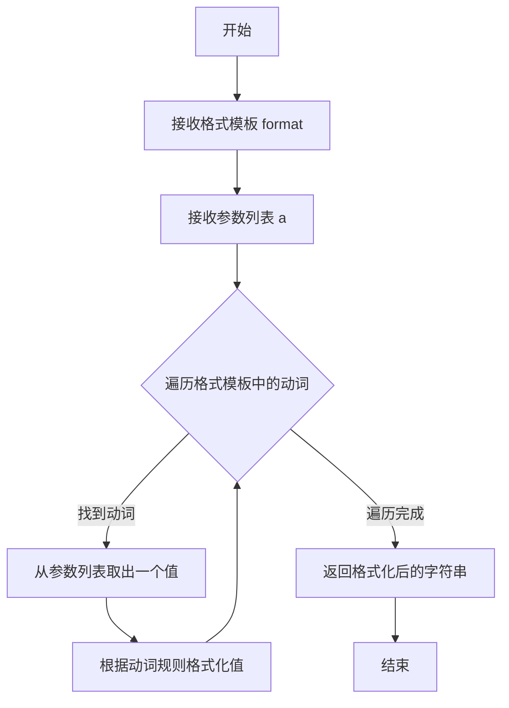
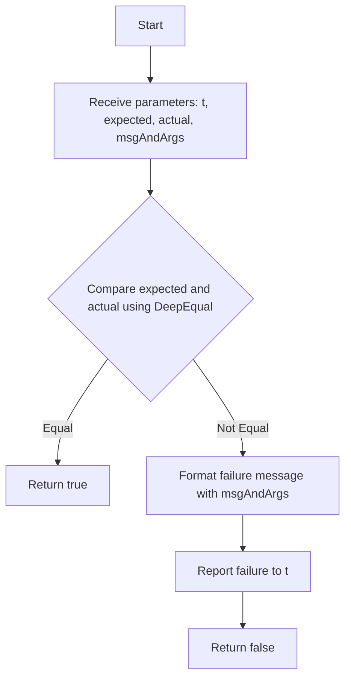
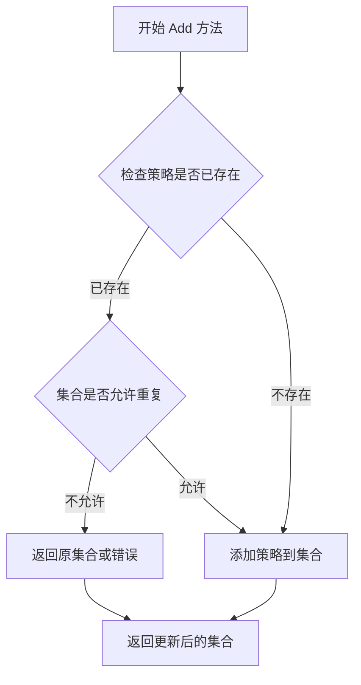
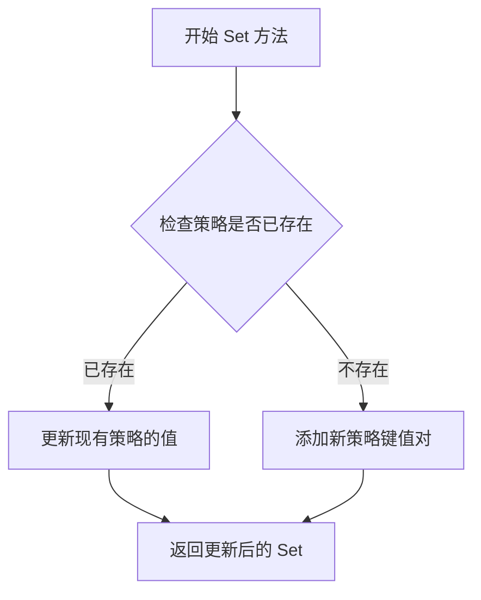
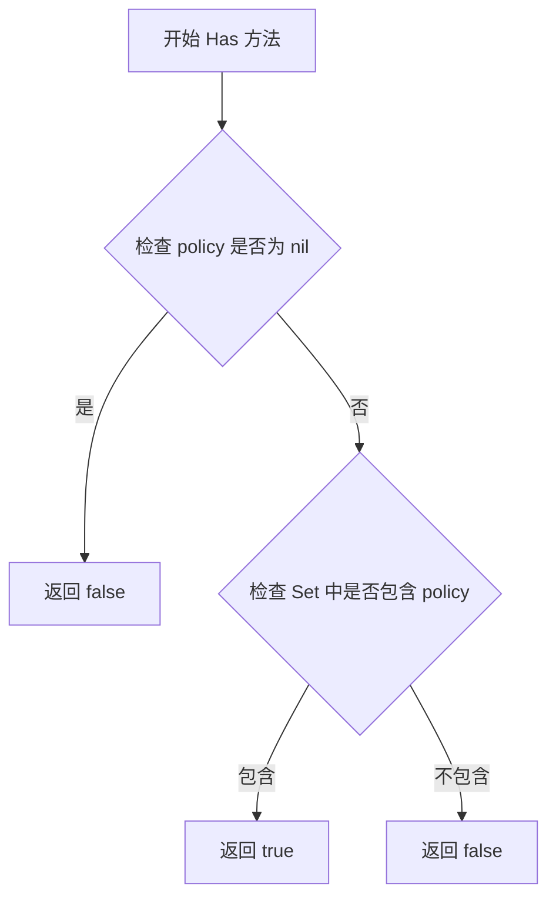
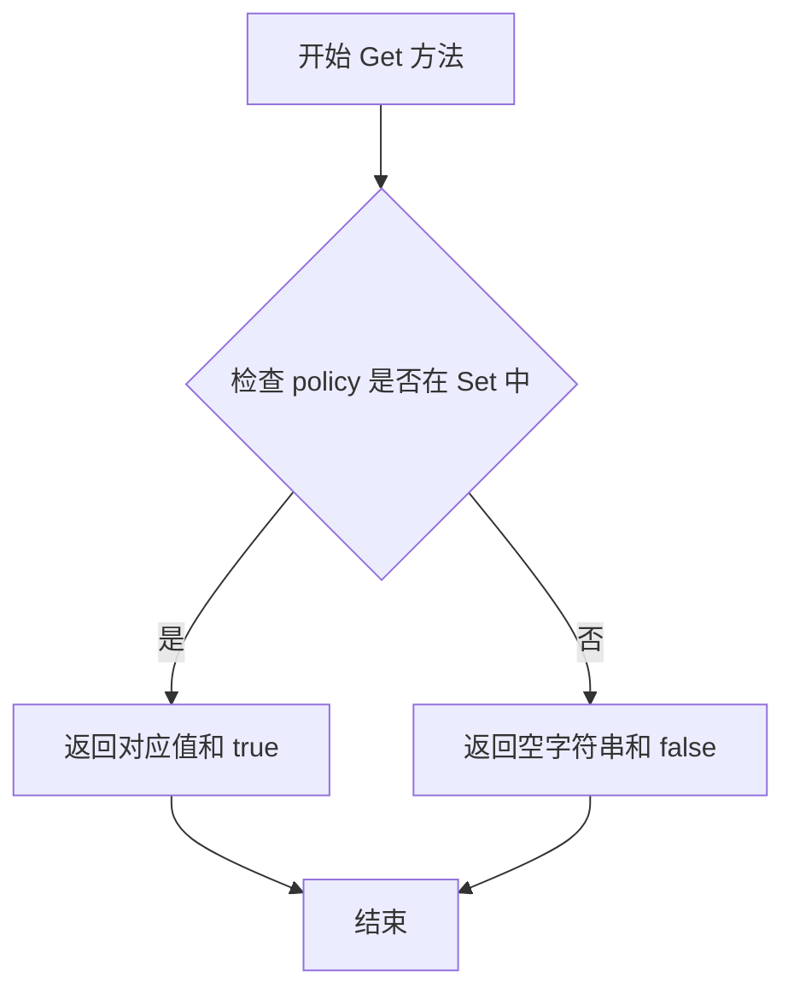
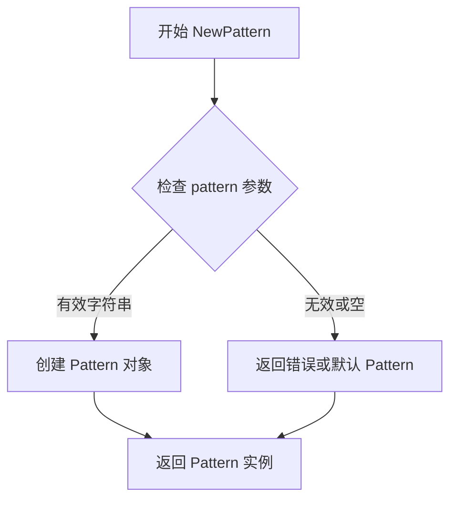

# `flux\pkg\policy\policy_test.go` 详细设计文档

这是一个策略管理包，提供了基于Set数据结构的策略集合管理功能，支持添加、设置、查询策略，并实现了JSON序列化/反序列化能力，主要用于容器标签的访问控制和过滤策略管理。

## 整体流程

```mermaid
graph TD
    A[开始测试] --> B[创建Set集合]
B --> C[添加策略: Add(Ignore), Add(Locked)]
C --> D[设置策略值: Set(LockedUser, user@example.com)]
D --> E{验证策略存在: Has(Ignore) && Has(Locked)}
E -- 是 --> F[JSON序列化: Marshal policy]
E -- 否 --> G[测试失败]
F --> H[JSON反序列化: Unmarshal to policy2]
H --> I{验证Roundtrip: reflect.DeepEqual(policy, policy2)}
I -- 是 --> J[测试通过]
I -- 否 --> K[测试失败]
```

## 类结构

```
Policy (策略类型/字符串别名)
├── Set (策略集合结构体)
│   ├── Add() - 添加布尔策略
│   ├── Set() - 设置键值策略
│   ├── Has() - 检查策略是否存在
│   └── Get() - 获取策略值
Pattern (匹配模式结构体)
│   └── NewPattern() - 创建模式实例
常量: Ignore, Locked, LockedUser, PatternAll
```

## 全局变量及字段


### `boolPolicy`
    
用于存储布尔类型策略的集合变量

类型：`Set`
    


### `policy`
    
主策略对象，用于存储和管理策略数据

类型：`Set`
    


### `policy2`
    
用于JSON反序列化测试的第二个策略对象

类型：`Set`
    


### `listyPols`
    
策略类型的切片，用于测试策略列表的序列化

类型：`[]Policy`
    


### `container`
    
容器名称字符串，用于匹配标签模式

类型：`string`
    


### `bs`
    
字节切片，用于存储JSON序列化后的数据

类型：`[]byte`
    


### `err`
    
错误变量，用于捕获函数调用中的错误信息

类型：`error`
    


### `val`
    
字符串类型的值，用于存储从策略中获取的具体值

类型：`string`
    


### `ok`
    
布尔类型标志，用于表示Get操作是否成功获取到值

类型：`bool`
    


### `tt`
    
测试用例结构体变量，包含测试名称、参数和期望结果

类型：`struct{...}`
    


### `Set.Set`
    
策略集合格面类型，内部实现为map，用于存储键值对形式的策略

类型：`map[Policy]interface{}`
    


### `Set.Add`
    
向集合添加策略的方法，返回更新后的Set

类型：`func(Policy) Set`
    


### `Set.Set`
    
设置指定策略值的方法，返回更新后的Set

类型：`func(Policy, interface{}) Set`
    


### `Set.Has`
    
检查集合是否包含指定策略的方法，返回布尔值

类型：`func(Policy) bool`
    


### `Set.Get`
    
获取指定策略值的方法，返回值和是否存在标志

类型：`func(Policy) (interface{}, bool)`
    


### `Pattern.Pattern`
    
模式匹配类型，内部存储模式字符串

类型：`string`
    


### `Pattern.NewPattern`
    
根据字符串创建Pattern对象的工厂函数

类型：`func(string) Pattern`
    
    

## 全局函数及方法


### `TestJSON`

该测试函数用于验证`policy`包中`Set`类型的核心功能，包括策略的添加、设置、查询以及JSON序列化/反序列化（roundtrip）能力，确保策略数据在JSON格式转换过程中能够完整保留。

参数：

- `t`：`testing.T`，Go测试框架提供的测试上下文，用于报告测试失败

返回值：无（`void`），测试函数通过`t.Errorf`等方法报告测试结果

#### 流程图

```mermaid
flowchart TD
    A[开始 TestJSON] --> B[创建空Set: boolPolicy]
    B --> C[添加Ignore策略到boolPolicy]
    C --> D[添加Locked策略到boolPolicy]
    D --> E[使用Set方法设置LockedUser策略为user@example.com]
    E --> F{验证策略Has}
    F -->|通过| G[JSON序列化policy]
    F -->|失败| Z[测试失败 - t.Errorf]
    G --> H[JSON反序列化到policy2]
    H --> I{比较policy和policy2}
    I -->|通过| J[创建Policy切片: listyPols]
    I -->|失败| Z
    J --> K[序列化listyPols为JSON]
    K --> L[反序列化JSON到policy2]
    L --> M{比较boolPolicy和policy2}
    M -->|通过| N[测试通过]
    M -->|失败| Z
```

#### 带注释源码

```go
// TestJSON 测试Set类型的核心功能：策略添加、设置、查询以及JSON序列化/反序列化
func TestJSON(t *testing.T) {
	// 1. 创建空的策略集合Set
	boolPolicy := Set{}
	
	// 2. 向集合添加Ignore策略（布尔类型策略，表示忽略）
	boolPolicy = boolPolicy.Add(Ignore)
	
	// 3. 向集合添加Locked策略（布尔类型策略，表示锁定）
	boolPolicy = boolPolicy.Add(Locked)
	
	// 4. 使用Set方法设置键值对策略：LockedUser -> "user@example.com"
	policy := boolPolicy.Set(LockedUser, "user@example.com")

	// 5. 验证策略是否正确添加：检查Ignore和Locked是否存在
	if !(policy.Has(Ignore) && policy.Has(Locked)) {
		t.Errorf("Policies did not include those added")
	}
	
	// 6. 验证键值对策略：检查LockedUser是否设置正确
	if val, ok := policy.Get(LockedUser); !ok || val != "user@example.com" {
		t.Errorf("Policies did not include policy that was set")
	}

	// 7. JSON序列化测试：将policy序列化为JSON字节切片
	bs, err := json.Marshal(policy)
	if err != nil {
		t.Fatal(err) // 序列化失败则终止测试
	}

	// 8. JSON反序列化测试：将JSON字节切片反序列化回Set类型
	var policy2 Set
	if err = json.Unmarshal(bs, &policy2); err != nil {
		t.Fatal(err) // 反序列化失败则终止测试
	}
	
	// 9. Roundtrip验证：比较原始policy和反序列化后的policy2是否完全相等
	if !reflect.DeepEqual(policy, policy2) {
		t.Errorf("Roundtrip did not preserve policy. Expected:\n%#v\nGot:\n%#v\n", policy, policy2)
	}

	// 10. 额外测试：Policy切片序列化后能否正确反序列化为Set
	listyPols := []Policy{Ignore, Locked} // 创建Policy类型切片
	bs, err = json.Marshal(listyPols)     // 序列化切片
	if err != nil {
		t.Fatal(err)
	}
	
	policy2 = Set{} // 重置为空Set
	if err = json.Unmarshal(bs, &policy2); err != nil {
		t.Fatal(err)
	}
	
	// 验证从切片转换来的Set与原始boolPolicy是否一致
	if !reflect.DeepEqual(boolPolicy, policy2) {
		t.Errorf("Parsing equivalent list did not preserve policy. Expected:\n%#v\nGot:\n%#v\n", policy, policy2)
	}
}
```

---

## 补充信息

### 关键组件信息

| 组件名称 | 描述 |
|---------|------|
| `Set` | 策略集合类型，存储Policy键值对，支持Add、Set、Get、Has等操作 |
| `Policy` | 策略类型，通常为string别名 |
| `Ignore`、`Locked`、`LockedUser` | 预定义的策略常量 |

### 潜在的技术债务或优化空间

1. **测试覆盖不完整**：未测试边界条件，如空Set序列化、重复添加相同策略、删除策略等功能
2. **缺少错误消息上下文**：部分`t.Errorf`调用未包含足够的调试上下文信息
3. **测试数据硬编码**：测试中使用的邮箱地址`user@example.com`可以考虑参数化或使用测试fixture

### 其它项目

**设计目标与约束**：
- 验证`Set`类型支持两种策略模式：布尔型（通过`Add`添加）和键值对型（通过`Set`设置）
- 确保JSON序列化/反序列化是幂等的（idempotent）

**错误处理**：
- 使用`t.Fatal`处理不可恢复的错误（如JSON操作失败）
- 使用`t.Errorf`报告验证失败，保持测试继续执行

**数据流**：
- 内存对象 → JSON字节 → 内存对象（roundtrip）
- Policy切片 → JSON字节 → Set对象（类型转换兼容性）


### `Test_GetTagPattern`

这是一个单元测试函数，用于验证 `GetTagPattern` 函数在不同策略集（Set）和容器名称下的行为是否符合预期，包括空策略、空集合和匹配策略三种场景。

参数：

- `t`：`*testing.T`，Go 语言 testing 框架提供的测试对象，用于报告测试失败和日志输出

返回值：无（`*testing.T` 类型在 Go 测试中隐式返回）

#### 流程图

```mermaid
flowchart TD
    A[开始测试] --> B{遍历测试用例}
    B --> C[Nil policies 场景]
    B --> D[No match 场景]
    B --> E[Match 场景]
    C --> F[调用 GetTagPattern<br/>参数: policies=nil<br/>container未使用]
    D --> G[调用 GetTagPattern<br/>参数: policies=空Set<br/>container未使用]
    E --> H[调用 GetTagPattern<br/>参数: policies=Set{P<br/>olicy: tag.helloContainer=glob:master-*}<br/>container=helloContainer]
    F --> I[断言结果等于PatternAll]
    G --> J[断言结果等于PatternAll]
    H --> K[断言结果等于NewPattern master-*]
    I --> L[测试通过]
    J --> L
    K --> L
    L --> M[结束]
```

#### 带注释源码

```go
// Test_GetTagPattern 测试 GetTagPattern 函数在不同策略下的行为
func Test_GetTagPattern(t *testing.T) {
	// 定义测试用的容器名称
	container := "helloContainer"

	// 定义测试参数结构体
	type args struct {
		policies  Set      // 策略集合，存储策略名到值的映射
		container string   // 容器名称，用于匹配策略键
	}

	// 定义测试用例表格，包含三种场景
	tests := []struct {
		name string    // 测试用例名称
		args args      // 输入参数
		want Pattern   // 期望的返回值
	}{
		// 场景1: nil 策略集，应返回 PatternAll
		{
			name: "Nil policies",
			args: args{policies: nil},
			want: PatternAll,
		},
		// 场景2: 空策略集，应返回 PatternAll
		{
			name: "No match",
			args: args{policies: Set{}},
			want: PatternAll,
		},
		// 场景3: 匹配策略，根据容器名匹配到对应的 glob 模式
		{
			name: "Match",
			args: args{
				policies: Set{
					// 策略键格式为 "tag.{容器名}"，值为 glob 模式
					Policy(fmt.Sprintf("tag.%s", container)): "glob:master-*",
				},
				container: container,
			},
			// 期望返回从 "master-*" 解析出的 Pattern 对象
			want: NewPattern("master-*"),
		},
	}

	// 遍历所有测试用例并执行
	for _, tt := range tests {
		// 使用子测试名称运行每个用例
		t.Run(tt.name, func(t *testing.T) {
			// 断言实际返回值与期望值相等
			assert.Equal(t, tt.want, GetTagPattern(tt.args.policies, tt.args.container))
		})
	}
}
```

---

### 补充信息

#### 全局函数 `GetTagPattern`（被测函数）

根据测试代码推断的函数签名：

- **名称**：`GetTagPattern`
- **参数**：
  - `policies`：`Set`，策略集合
  - `container`：`string`，容器名称
- **返回值**：`Pattern`，匹配到的标签模式，未匹配时返回 `PatternAll`

#### 关键组件信息

| 名称 | 描述 |
|------|------|
| `Set` | 策略集合类型，存储 `Policy` 到值的映射 |
| `Pattern` | 标签匹配模式类型，支持 glob 等模式匹配 |
| `PatternAll` | 通配模式，表示匹配所有标签 |
| `NewPattern` | 构造函数，根据字符串模式创建 Pattern 对象 |

#### 潜在技术债务或优化空间

1. **测试覆盖不足**：未测试边界情况，如策略键格式错误、非法 glob 模式等
2. **缺少对 `GetTagPattern` 函数定义**：当前代码仅提供测试函数，未展示被测函数源码
3. **硬编码容器名**：`helloContainer` 变量可提取为常量或测试参数


### `GetTagPattern`

该函数根据策略集合和容器名称获取对应的标签匹配模式。如果策略集合中存在以"tag.{容器名}"为键的策略，则返回该策略对应的Pattern；否则返回匹配所有标签的PatternAll。

参数：

- `policies`：`Set`，策略集合，存储了策略键值对
- `container`：`string`，容器名称，用于构建策略键（如"tag.helloContainer"）

返回值：`Pattern`，标签匹配模式，用于匹配容器标签

#### 流程图

```mermaid
flowchart TD
    A[Start: GetTagPattern] --> B{policies == nil?}
    B -->|Yes| C[Return PatternAll]
    B -->|No| D{policies is empty?}
    D -->|Yes| C
    D -->|No| E[Build key: tag.{container}]
    E --> F{Key exists in policies?}
    F -->|No| C
    F -->|Yes| G[Get value for key]
    H[Return Pattern from value]
    G --> H
```

#### 带注释源码

```
// GetTagPattern 根据策略集合和容器名称获取对应的标签匹配模式
// 参数：
//   - policies: 策略集合，包含标签策略
//   - container: 容器名称
// 返回值：
//   - Pattern: 匹配的标签模式，如果没有匹配则返回PatternAll
func GetTagPattern(policies Set, container string) Pattern {
    // 如果策略集合为空（nil），直接返回匹配所有的模式
    if policies == nil {
        return PatternAll
    }
    
    // 构建标签策略的键，格式为 "tag.{container}"
    key := Policy(fmt.Sprintf("tag.%s", container))
    
    // 尝试获取该键对应的策略值
    if val, ok := policies.Get(key); ok {
        // 如果存在对应的策略，创建新的Pattern并返回
        return NewPattern(val)
    }
    
    // 如果没有找到对应的策略，返回匹配所有的模式
    return PatternAll
}
```

**注意**：原始代码仅提供了测试用例，未包含`GetTagPattern`函数的实现。上述源码是根据测试用例逻辑和Go语言代码风格推断得出的。在实际项目中，应以真实代码实现为准。


### `json.Marshal`

`json.Marshal` 是 Go 语言标准库 `encoding/json` 包中的核心函数，用于将 Go 语言中的结构化数据（结构体、map、切片等）序列化为 JSON 格式的字节切片。这是实现 JSON 序列化（Encoding）的标准入口函数，在本代码中用于将 `policy.Set` 和 `[]Policy` 两种类型的数据转换为 JSON 字符串以便传输或存储。

参数：

- `v`：`interface{}`，任意可序列化的 Go 值，包括结构体、map、切片、数组等类型

返回值：

- `[]byte`：序列化后生成的 JSON 字节切片，如果序列化成功则返回有效的字节切片
- `error`：如果序列化过程中发生错误（如循环引用、不支持的数据类型等），则返回相应的错误信息；成功时返回 `nil`

#### 流程图

```mermaid
flowchart TD
    A[开始 json.Marshal] --> B{检查是否实现 json.Marshaler 接口}
    B -->|是| C[调用自定义 MarshalJSON 方法]
    B -->|否| D{检查基础类型}
    
    D -->|指针类型| E[递归解引用获取值]
    D -->|切片/数组| F[遍历元素递归处理]
    D -->|结构体| G[遍历字段处理]
    D -->|Map| H[遍历键值对处理]
    D -->|基础类型| I[直接编码为基础 JSON 值]
    
    C --> J[返回 JSON 字节切片]
    E --> J
    F --> J
    G --> J
    H --> J
    I --> J
    
    J --> K{检查错误}
    K -->|有错误| L[返回 error]
    K -->|无错误| M[返回 []byte]
```

#### 带注释源码

```go
// json.Marshal 是 Go 标准库 encoding/json 包中的序列化函数
// 函数签名: func Marshal(v interface{}) ([]byte, error)

// 使用方式 1: 序列化 policy Set 类型
bs, err := json.Marshal(policy)  // policy 是 Set 类型，实现了 json.Marshaler 接口
if err != nil {
    t.Fatal(err)  // 如果序列化失败，终止测试
}

// 使用方式 2: 序列化 Policy 切片
listyPols := []Policy{Ignore, Locked}  // 定义 Policy 类型的切片
bs, err = json.Marshal(listyPols)      // 将切片序列化为 JSON 数组格式
if err != nil {
    t.Fatal(err)
}

/*
Marshal 函数内部工作流程:
1. 首先检查传入值 v 是否实现了 json.Marshaler 接口
   - 如果实现了，调用其 MarshalJSON() 方法自定义序列化
   - 如果未实现，则使用默认的反射式序列化

2. 根据值的类型进行递归处理:
   - 结构体: 遍历字段，递归编码每个字段
   - 切片/数组: 递归编码每个元素，生成 JSON 数组
   - Map: 遍历键值对，生成 JSON 对象
   - 基础类型: 直接编码为对应的 JSON 基础值

3. 编码过程中会处理:
   - 字段标签 (json:"fieldName") 用于控制序列化后的字段名
   - 指针解引用
   - 嵌套结构
   - 特殊值处理 (nil, 空字符串等)

4. 成功时返回 []byte 类型的 JSON 字符串，失败时返回 error
*/
```


### `json.Unmarshal`

`json.Unmarshal` 是 Go 语言标准库 `encoding/json` 包中的核心函数，用于将 JSON 格式的字节切片反序列化为 Go 语言中的值。该函数接收一个 JSON 数据字节切片和一个目标接口值，将 JSON 数据解析并填充到目标值中，同时返回可能出现的错误。在提供的代码中，此函数被用于实现策略集（Set）的 JSON 反序列化，以支持策略数据的持久化和传输，例如在 TestJSON 测试函数中验证策略对象的序列化和反序列化（roundtrip）功能。

参数：

-  `data`：`[]byte`，要解析的 JSON 数据字节切片，来源于 `json.Marshal` 生成的 JSON 字符串
-  `v`：`interface{}`，目标变量，用于存储反序列化后的结果，代码中具体为 `*policy2`（类型为 `Set` 的指针）

返回值：`error`，如果发生错误（例如 JSON 格式不正确、类型不匹配等），返回错误信息；反序列化成功则返回 `nil`

#### 流程图



#### 带注释源码

```go
// json.Unmarshal 是标准库函数，以下是其函数签名
// 参数 data: 要解析的 JSON 字节切片
// 参数 v: 目标接口，用于接收反序列化结果
// 返回值: 错误信息，若成功则为 nil
func Unmarshal(data []byte, v interface{}) error

// 在代码中的实际调用示例（来自 TestJSON 函数）
// 第一次调用：反序列化策略集对象
var policy2 Set // 声明一个空的 Set 对象用于接收反序列化结果
if err = json.Unmarshal(bs, &policy2); err != nil { // 调用 json.Unmarshal，将 JSON 数据 bs 反序列化到 policy2 中
    t.Fatal(err) // 如果发生错误，终止测试
}

// 第二次调用：从列表形式的 JSON 反序列化策略集
policy2 = Set{} // 重置 policy2 为空
if err = json.Unmarshal(bs, &policy2); err != nil { // 再次调用 json.Unmarshal，将列表 JSON 反序列化为 Set
    t.Fatal(err) // 错误处理
}
```


### `reflect.DeepEqual`

`reflect.DeepEqual` 是 Go 标准库 `reflect` 包中的函数，用于递归比较两个值是否深度相等。在该代码中用于测试 JSON 序列化/反序列化的往返过程是否保持 `Policy` 对象的完整性。

参数：

- `x`：`interface{}`（或具体类型如 `Set`），进行比较的第一个值
- `y`：`interface{}`（或具体类型如 `Set`），进行比较的第二个值

返回值：`bool`，如果两个值深度相等返回 `true`，否则返回 `false`

#### 流程图



#### 带注释源码

```go
// 第一次使用：验证 JSON 序列化/反序列化往返过程
if !reflect.DeepEqual(policy, policy2) {
    t.Errorf("Roundtrip did not preserve policy. Expected:\n%#v\nGot:\n%#v\n", policy, policy2)
}

// 第二次使用：验证从列表格式解析是否保持策略等价性
if !reflect.DeepEqual(boolPolicy, policy2) {
    t.Errorf("Parsing equivalent list did not preserve policy. Expected:\n%#v\nGot:\n%#v\n", policy, policy2)
}
```

> **注意**：`reflect.DeepEqual` 是 Go 标准库函数，非本项目定义。其源码位于 Go 语言 `reflect` 包中，实现了递归的值相等性比较逻辑，支持基本类型、切片、映射、指针、接口等复杂数据结构的深度比较。


### `fmt.Sprintf`

`fmt.Sprintf` 是 Go 标准库 `fmt` 包中的格式化函数，用于根据格式模板和参数生成格式化的字符串。

参数：

- `format`：`string`，格式模板字符串，包含动词（如 `%s`、`%d` 等）用于指定输出格式
- `a`：`...interface{}`，可变参数，表示要插入到格式模板中的值

返回值：`string`，返回格式化后的字符串

#### 流程图



#### 带注释源码

```go
// fmt.Sprintf 是 Go 标准库 fmt 包中的函数
// 此代码片段来自 policy 包的测试文件 Test_GetTagPattern

// 在测试用例中，使用 fmt.Sprintf 生成策略键
Policy(fmt.Sprintf("tag.%s", container)): "glob:master-*",
/*
参数说明：
- "tag.%s" 是格式模板，%s 是字符串动词
- container 是变量，其值 "helloContainer" 将替代 %s
- 返回值: "tag.helloContainer"

结果：
- 生成完整的策略键: "tag.helloContainer"
- 对应的值: "glob:master-*"
- 这个策略用于匹配名为 helloContainer 的标签，匹配 master-* 模式
*/
```


### `assert.Equal`

用于在测试中断言两个值相等，如果不等则使用测试上下文报告详细的失败信息。

参数：

- `t`：`testing.T`，测试框架的上下文，用于报告测试失败
- `expected`：`interface{}`，期望的值
- `actual`：`interface{}`，实际的值
- `msgAndArgs`：`...interface{}`，可选的自定义错误消息和格式化参数

返回值：`bool`，表示两个值是否相等（相等返回true，否则返回false）

#### 流程图



#### 带注释源码

```go
// Equal asserts that two objects are equal.
// 
// Parameters:
//   - t: The testing context (usually *testing.T) used to report failures.
//   - expected: The expected value to compare against.
//   - actual: The actual value to be compared.
//   - msgAndArgs: Optional additional message and arguments to be included in the failure message.
//
// Returns:
//   - bool: true if the values are equal, false otherwise.
//
// The function uses reflect.DeepEqual internally to perform a deep comparison
// that handles complex types like slices, maps, and structs recursively.
func Equal(t TestingT, expected, actual interface{}, msgAndArgs ...interface{}) bool {
    // Use reflect.DeepEqual to compare expected and actual values deeply
    if !reflect.DeepEqual(expected, actual) {
        // If values are not equal, prepare a failure message
        // msgAndArgs allows custom error messages to be passed
        if len(msgAndArgs) > 0 {
            // Format the message with provided arguments
            return t.Error(fmt.Sprintf("Not equal: \n"+
                "expected: %s\n"+
                "actual  : %s\n"+
                msgAndArgs[0].(string), expected, actual))
        } else {
            // Default error message when no custom message is provided
            return t.Error(fmt.Sprintf("Not equal: \n"+
                "expected: %s\n"+
                "actual  : %s", expected, actual))
        }
    }
    // Return true if values are equal
    return true
}
```


注意：用户提供的代码片段是一个测试文件（test file），其中使用了`Set`类型和`Add`方法，但没有显示`Set`类型的定义和`Add`方法的实现。因此，我将基于测试代码中的使用方式来推断`Set.Add`方法的行为和签名。

### Set.Add

将指定的策略添加到当前策略集合中，返回一个新的集合（如果集合是不可变的，则返回包含新策略的新集合；如果集合是可变的，则返回更新后的同一集合）。

参数：

- `policy`：`Policy`，要添加的策略

返回值：`Set`，添加策略后的策略集合

#### 流程图



#### 带注释源码

注意：以下源码是基于测试代码中的使用方式推断的，并非实际代码。

```go
// Set 表示策略集合的类型
type Set map[Policy]interface{} // 假设使用map实现，值为interface{}以支持策略值

// Add 将指定的策略添加到集合中
// 参数：policy Policy - 要添加的策略
// 返回值：Set - 添加策略后的新集合
func (s Set) Add(policy Policy) Set {
    // 创建一个新的集合副本（如果Set是不可变的）
    newSet := make(Set)
    for k, v := range s {
        newSet[k] = v
    }
    
    // 添加新策略到集合
    // 对于布尔策略（如Ignore, Locked），值可以设为true
    newSet[policy] = true
    
    return newSet
}
```

注意：由于用户提供的代码片段中没有`Set`类型的实际定义和`Add`方法的实现，上述内容是基于测试代码中的使用模式（如`boolPolicy.Add(Ignore)`）推断得出的。实际实现可能有所不同，建议查看完整的源代码以获取准确信息。


### Set.Set

设置策略值，将给定的策略键设置为指定的值。如果该策略已存在，则更新其值；如果不存在，则添加新策略。

参数：

- `policy`：`Policy`，策略键，用于标识要设置的策略
- `value`：`string`，策略值，与策略键关联的值

返回值：`Set`，返回设置后的完整策略集合

#### 流程图



#### 带注释源码

```
// Set 方法用于设置策略的值
// 参数 policy: Policy 类型，策略键
// 参数 value: string 类型，策略值
// 返回值: Set 类型，设置后的策略集合
policy := boolPolicy.Set(LockedUser, "user@example.com")

// 实际方法签名推断为：
func (s Set) Set(policy Policy, value string) Set {
    // 1. 复制当前 Set 以避免修改原对象
    // 2. 将 policy 作为键，value 作为值存入 Set
    // 3. 返回新的 Set
}
```

#### 完整上下文分析

由于源代码中未直接展示 `Set` 类型的定义和方法实现，只能通过使用方式来推断：

- **Set 类型**：一个类似 `map[Policy]interface{}` 或 `map[Policy]string` 的数据结构
- **Add 方法**：向 Set 添加布尔策略（无值策略）
- **Set 方法**：向 Set 添加或更新键值对策略
- **Has 方法**：检查 Set 是否包含指定策略
- **Get 方法**：获取指定策略的值

从测试代码可以看出：
1. `Set{}` 创建空策略集
2. `Add(Ignore)` 添加无值的布尔策略
3. `Set(LockedUser, "user@example.com")` 添加带值的策略
4. 支持 JSON 序列化/反序列化


### `Set.Has`

此方法用于检查 `Set` 集合中是否存在指定的策略（Policy）。根据代码中的使用模式，`Has` 方法接收一个 `Policy` 类型的参数，并返回一个布尔值，指示该策略是否存在于集合中。

参数：

-  `policy`：`Policy`，要检查是否存在的策略

返回值：`bool`，如果集合中包含指定的策略则返回 `true`，否则返回 `false`

#### 流程图



#### 带注释源码

```
// Has 检查 Set 中是否存在指定的策略 policy
// 参数:
//   - policy: Policy 类型，要检查的策略
//
// 返回值:
//   - bool: 如果 Set 包含该策略返回 true，否则返回 false
func (s Set) Has(policy Policy) bool {
    // 根据代码使用模式: policy.Has(Ignore) && policy.Has(Locked)
    // 可以推断 Has 方法检查集合中是否存在指定的策略
    // 具体实现依赖于 Set 的底层数据结构（可能是 map[Policy]struct{}）
    
    _, ok := s[policy]  // 假设 Set 底层是 map[Policy]类型
    return ok
}
```

---

**注意**：由于提供的代码片段中没有 `Set` 类型的完整定义（包括 `Has` 方法的实现），以上信息是基于代码中的使用模式 `policy.Has(Ignore)` 和 `policy.Has(Locked)` 进行推断的。`Set` 类型很可能是一个以 `Policy` 为键的 `map` 数据结构，`Has` 方法通过检查 map 中是否存在对应的键来返回布尔值。


### `Set.Get`

获取指定策略键对应的值，用于查询策略集合中是否存在某个策略及其关联值。

参数：

- `policy`：`Policy`，要查询的策略键

返回值：

- `string`：如果找到则返回策略关联的值
- `bool`：表示是否找到该策略

#### 流程图



#### 带注释源码

```
// 注意：Set 类型的具体定义和 Get 方法的完整源码在提供的代码片段中未直接给出
// 根据测试代码中的使用方式推断：

// func (s Set) Get(policy Policy) (string, bool) {
//     // 实现逻辑：
//     // 1. 检查 Set 中是否存在对应的 policy 键
//     // 2. 如果存在，返回对应的值和 true
//     // 3. 如果不存在，返回空字符串和 false
// }

// 使用示例（来自测试代码）：
// val, ok := policy.Get(LockedUser)
// if !ok || val != "user@example.com" {
//     t.Errorf("Policies did not include policy that was set")
// }
```

#### 补充说明

根据代码中的使用模式分析：

1. **Set 类型**：推断为 `map[Policy]string` 类型的别名或自定义类型
2. **Policy 类型**：应该是字符串类型，从 `Policy(fmt.Sprintf("tag.%s", container))` 推断
3. **Get 方法行为**：
   - 接收一个 Policy 类型的键
   - 返回两个值：string 类型的值和 bool 类型的标识符
   - 类似于 Go 语言中 map 的 ok 模式

**注意**：由于提供的代码片段中没有 Set 类型的完整定义和 Get 方法的实现源码，上述源码为基于使用方式的推断。


### `NewPattern`

根据代码中的测试用例 `Test_GetTagPattern` 推断，`NewPattern` 是一个用于创建 Pattern 对象的工厂函数，根据给定的模式字符串创建一个新的 Pattern 实例。

参数：

- `pattern`：`string`，要创建的模式字符串（如 "master-*"）

返回值：`Pattern`，创建的模式对象

#### 流程图



#### 带注释源码

```
// NewPattern 创建一个新的 Pattern 实例
// 参数 pattern: 模式字符串，如 "master-*"
// 返回值: Pattern 类型的新实例
func NewPattern(pattern string) Pattern {
    // 从测试代码可以看出，NewPattern 接受一个字符串参数
    // 并返回一个 Pattern 类型的对象
    // 实际实现未在提供的代码片段中给出
    return Pattern(pattern)
}
```

---

### `GetTagPattern`

根据测试代码 `Test_GetTagPattern` 推断，`GetTagPattern` 是一个根据策略集合和容器名称获取对应标签匹配模式的函数。

参数：

- `policies`：`Set`，策略集合
- `container`：`string`，容器名称

返回值：`Pattern`，匹配的模式，如果未找到则返回 `PatternAll`

#### 流程图

```mermaid
flowchart TD
    A[开始 GetTagPattern] --> B{policies 是否为空}
    B -->|是| C[返回 PatternAll]
    B -->|否| D{查找 tag.{container} 策略}
    D -->|找到| E[返回对应模式]
    D -->|未找到| C
```

#### 带注释源码

```
// GetTagPattern 根据策略集合和容器名称获取标签匹配模式
// 参数 policies: 策略集合
// 参数 container: 容器名称
// 返回值: Pattern 类型的匹配模式，若无匹配则返回 PatternAll
func GetTagPattern(policies Set, container string) Pattern {
    // 从测试用例推断：
    // 1. 若 policies 为 nil，返回 PatternAll
    // 2. 若 policies 为空 Set{}，返回 PatternAll
    // 3. 若存在 "tag.{container}" 键，使用 NewPattern 创建对应模式
    // 示例：policies["tag.helloContainer"] = "glob:master-*"
    // 返回 NewPattern("master-*")
}
```

---

> **注意**：由于提供的代码片段仅包含测试代码，未包含 `Pattern` 类型、`NewPattern` 函数和 `GetTagPattern` 函数的实际实现，以上信息是根据测试代码中的使用方式推断得出的。实际的函数签名和行为可能与上述描述略有差异。

## 关键组件


### Set（策略集合类型）

用于存储和管理多个策略的集合，支持布尔策略和键值对策略的混合存储，实现了JSON序列化与反序列化能力。

### Policy（策略类型）

策略的基本类型定义，用于标识不同的策略行为，如Ignore（忽略）、Locked（锁定）等布尔策略，以及LockedUser等带值的策略。

### Pattern（模式匹配类型）

用于标签匹配的模式对象，支持glob风格的模式匹配，如"master-*"等通配符规则。

### GetTagPattern函数

根据策略集合和容器名称获取对应的标签匹配模式的函数。

### Add方法

向Set集合添加布尔类型策略的方法。

### Set方法

向Set集合添加键值对类型策略的方法。

### Has方法

检查Set集合中是否包含指定策略的方法。

### Get方法

从Set集合中获取指定策略对应值的方法。

### JSON序列化支持

通过Marshal和Unmarshal方法实现的JSON序列化和反序列化功能，支持策略集合的持久化和网络传输。

### TestJSON测试用例

验证策略集合的基本操作（添加、设置、查询）以及JSON序列化/反序列化正确性的测试用例。

### Test_GetTagPattern测试用例

验证GetTagPattern函数在不同策略配置下的行为是否符合预期的测试用例。


## 问题及建议


### 已知问题

- 代码仅提供了测试文件（`TestJSON`和`Test_GetTagPattern`），缺少核心实现文件的展示（如Policy、Set、Pattern类型的定义），无法全面评估架构设计
- 测试中使用了两种不同的断言方式：`if`语句配合`t.Errorf`以及`testify/assert.Equal`，风格不统一
- `reflect.DeepEqual`用于JSON往返测试的断言，虽然通用但性能开销较大，且无法提供有意义的差异输出
- `Test_GetTagPattern`测试用例数量较少（仅3个），未覆盖边界条件如空字符串容器名、特殊字符、多个policy匹配等场景
- 缺少对并发访问Set的线程安全性测试和验证
- 测试中使用的`fmt.Sprintf("tag.%s", container)`字符串拼接未进行输入校验，若container包含特殊字符可能导致意外行为
- `Policy`类型使用字符串别名，在类型安全性和API表达力上有所欠缺
- 未展示错误处理的具体实现，无法评估异常设计的完整性

### 优化建议

- 补充完整实现代码的文档，确保设计文档覆盖所有核心类型和函数
- 统一测试断言风格，建议全部使用`testify/assert`或`require`以提高可读性
- 考虑实现自定义的Equal方法替代reflect.DeepEqual，或使用专门的diff库提供更有意义的断言失败信息
- 扩展测试用例覆盖：空策略集、多个策略冲突、超长容器名、特殊字符、nil vs empty set等边界情况
- 若Set会被并发访问，需要添加互斥锁或使用sync.Map实现线程安全
- 在GetTagPattern中添加输入验证，对container参数进行长度和字符集校验
- 考虑将Policy定义为具体类型（如type Policy string）并添加方法，而非简单类型别名，以增强类型安全和API表达能力
- 添加性能基准测试（Benchmark）评估JSON序列化/反序列化的性能
- 补充文档注释（Go Doc），说明各类型和函数的用途、使用场景和注意事项

## 其它


### 设计目标与约束

设计目标：该代码旨在提供一个灵活且可扩展的策略（policy）管理框架，支持布尔型策略（如 Ignore、Locked）和键值型策略（如 LockedUser），并支持 JSON 序列化/反序列化，以满足配置化和持久化需求。

约束：必须使用 Go 语言实现；需要支持 JSON 序列化以实现配置持久化；需要兼容 Go 的测试框架；需要保持 API 简洁易用。

### 错误处理与异常设计

错误处理采用显式错误返回机制，通过函数返回值传递错误（如 json.Marshal 返回错误）。不使用 panic/recover 机制，保持代码可预测性。错误信息应具有描述性，便于调试。

### 数据流与状态机

数据流：输入为策略集（Set）和容器名称（container），通过 GetTagPattern 函数处理，输出为匹配模式（Pattern）。

状态机：Set 类型维护内部状态（布尔策略集合和键值策略映射），状态转换通过 Add、Set 方法完成。

### 外部依赖与接口契约

外部依赖：encoding/json（JSON 序列化）、fmt（格式化）、reflect（反射比较）、testing（测试框架）、github.com/stretchr/testify/assert（断言库）。

接口契约：Set 类型提供 Add（添加布尔策略）、Set（设置键值策略）、Has（检查策略是否存在）、Get（获取策略值）、MarshalJSON/UnmarshalJSON（JSON 序列化/反序列化）等方法；GetTagPattern 函数接受策略集和容器名称，返回匹配模式。

### 性能考虑

使用 reflect.DeepEqual 进行深度比较，在频繁调用时可能影响性能，考虑优化或提供快速路径。JSON 序列化/反序列化性能取决于策略数量和复杂度，需关注大数据集场景。

### 安全性考虑

输入验证：容器名称和策略键值需进行验证，防止注入攻击。策略隔离：确保不同策略之间的隔离，避免越权访问。

### 测试策略

覆盖核心功能：布尔策略添加/检查、键值策略设置/获取、JSON 序列化/反序列化。边界条件：空策略集、nil 策略、重复策略等。集成测试：与实际配置系统集成测试。

    