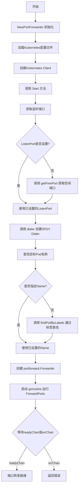
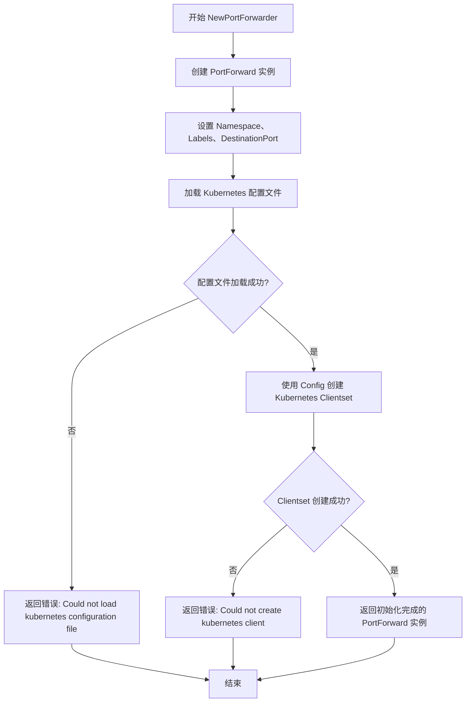
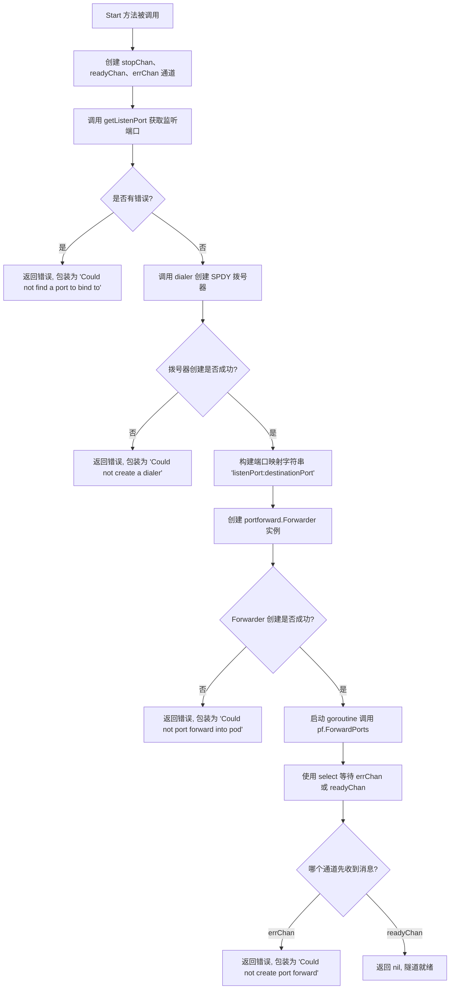
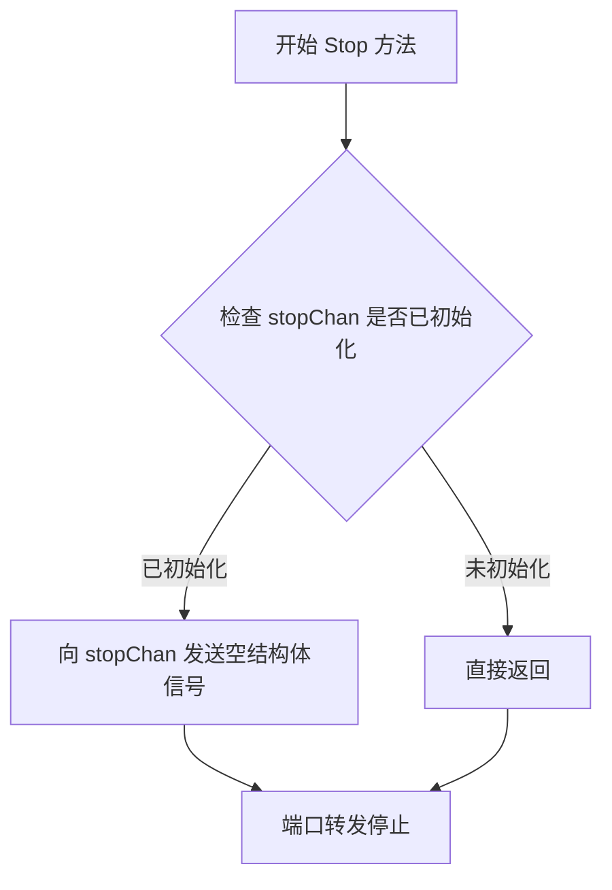
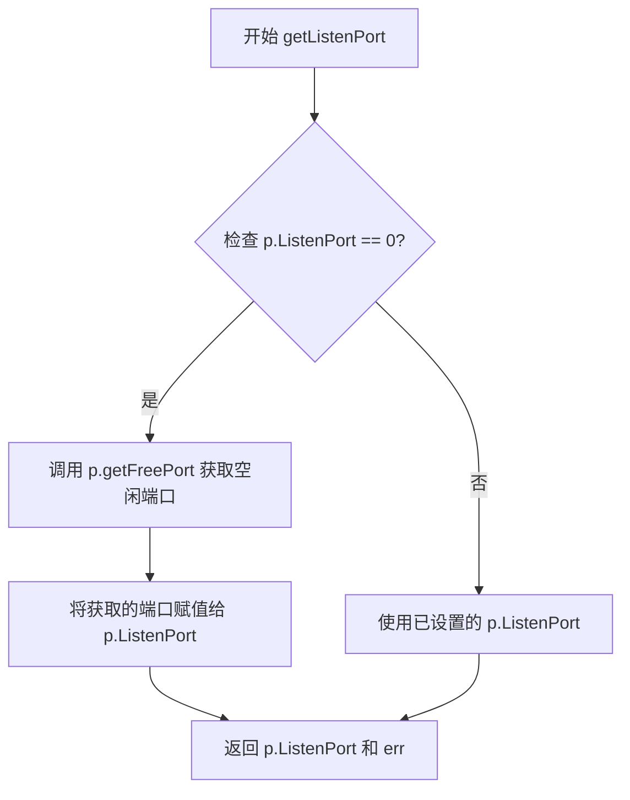
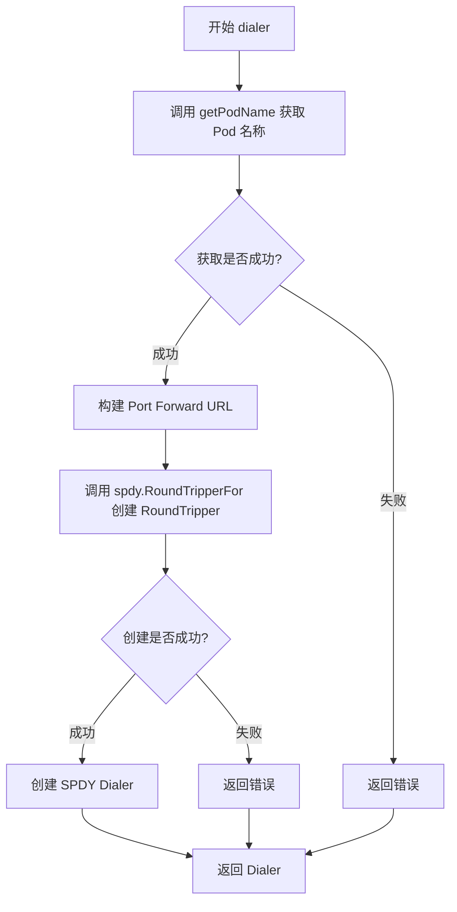
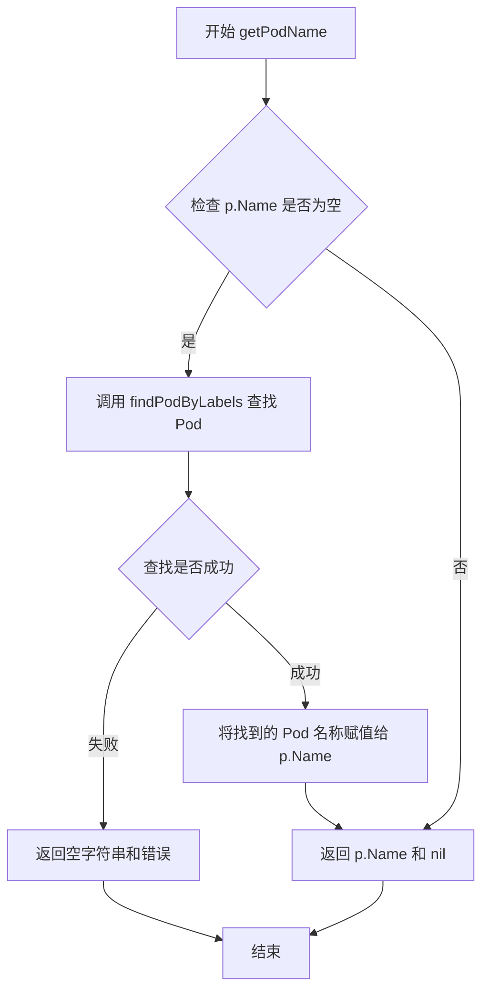
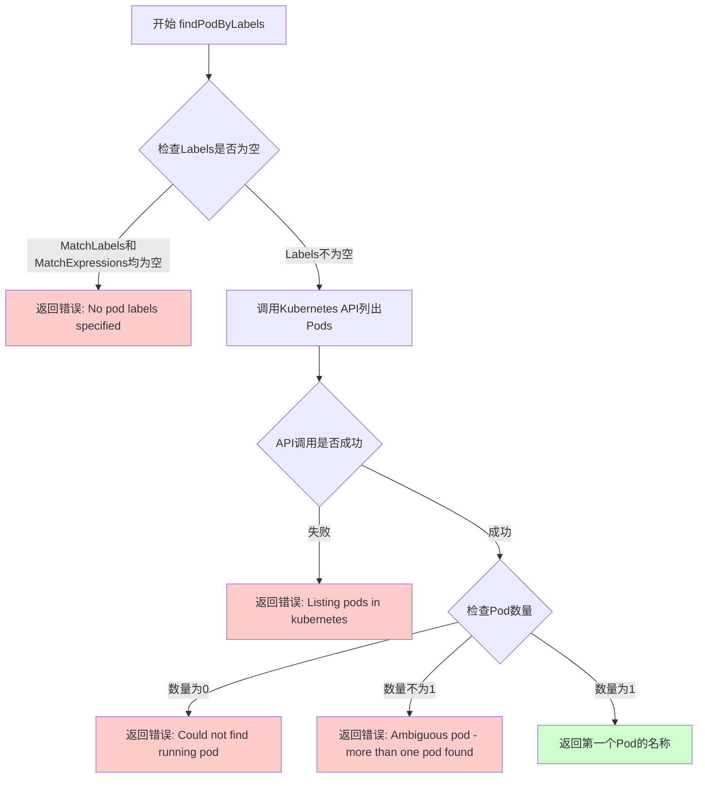

# `flux\pkg\portforward\portforward.go` 详细设计文档

这是一个用于在Kubernetes集群中创建Pod端口转发的工具库，通过建立SPDY隧道将本地端口流量转发到目标Pod的指定端口，支持通过Pod名称或标签自动发现目标Pod。

## 整体流程



## 类结构

```
PortForward (Kubernetes端口转发结构体)
├── 字段: Config, Clientset, Name, Labels, DestinationPort, ListenPort, Namespace
├── 私有字段: stopChan, readyChan
├── 方法: NewPortForwarder (构造函数)
├── 方法: Start (启动端口转发)
├── 方法: Stop (停止端口转发)
├── 方法: getListenPort (获取监听端口)
├── 方法: getFreePort (获取空闲端口)
├── 方法: dialer (创建SPDY Dialer)
├── 方法: getPodName (获取Pod名称)
└── 方法: findPodByLabels (通过标签查找Pod)
```

## 全局变量及字段


### `PortForward.Config`
    
Kubernetes配置文件

类型：`*rest.Config`
    


### `PortForward.Clientset`
    
Kubernetes客户端集

类型：`kubernetes.Interface`
    


### `PortForward.Name`
    
目标Pod名称，Labels为空时必填

类型：`string`
    


### `PortForward.Labels`
    
用于查找Pod的标签选择器

类型：`metav1.LabelSelector`
    


### `PortForward.DestinationPort`
    
Pod上目标端口

类型：`int`
    


### `PortForward.ListenPort`
    
本地监听端口，未设置则随机

类型：`int`
    


### `PortForward.Namespace`
    
Pod所在命名空间

类型：`string`
    


### `PortForward.stopChan`
    
用于停止转发的通道

类型：`chan struct{}`
    


### `PortForward.readyChan`
    
转发就绪信号通道

类型：`chan struct{}`
    
    

## 全局函数及方法


### `NewPortForwarder`

初始化PortForwarder实例，加载Kubernetes配置文件并创建Kubernetes客户端，用于建立与Kubernetes集群的端口转发连接。

参数：

- `namespace`：`string`，目标Pod所在的命名空间
- `labels`：`metav1.LabelSelector`，用于查找目标Pod的标签选择器
- `port`：`int`，目标Pod上要转发的端口

返回值：`(*PortForward, error)`，成功时返回初始化的PortForward实例及其配置，失败时返回错误信息

#### 流程图



#### 带注释源码

```go
// Initialize a port forwarder, loads the Kubernetes configuration file and creates the client.
// You do not need to use this function if you have a client to use already - the PortForward
// struct can be created directly.
// 初始化端口转发器，加载Kubernetes配置文件并创建客户端。
// 如果您已经有可用的客户端，则无需使用此函数 - 可以直接创建PortForward结构体。
func NewPortForwarder(namespace string, labels metav1.LabelSelector, port int) (*PortForward, error) {
	// 第一步：创建PortForward实例，初始化基础配置
	pf := &PortForward{
		Namespace:       namespace,        // 设置目标Pod所在的命名空间
		Labels:          labels,           // 设置用于查找Pod的标签选择器
		DestinationPort: port,             // 设置目标Pod上的端口
	}

	var err error

	// 第二步：加载Kubernetes配置文件
	// 使用clientcmd加载默认的kubeconfig文件
	// NewNonInteractiveDeferredLoadingClientConfig: 非交互式加载，支持环境变量KUBECONFIG指定的路径
	// NewDefaultClientConfigLoadingRules: 加载默认配置文件路径(~/.kube/config)
	// ConfigOverrides: 允许覆盖配置中的某些值
	pf.Config, err = clientcmd.NewNonInteractiveDeferredLoadingClientConfig(
		clientcmd.NewDefaultClientConfigLoadingRules(),
		&clientcmd.ConfigOverrides{},
	).ClientConfig()
	
	// 错误处理：配置文件加载失败
	if err != nil {
		return pf, errors.Wrap(err, "Could not load kubernetes configuration file")
	}

	// 第三步：使用加载的配置创建Kubernetes客户端集
	// kubernetes.NewForConfig: 根据rest.Config创建客户端集，用于与Kubernetes API服务器交互
	pf.Clientset, err = kubernetes.NewForConfig(pf.Config)
	
	// 错误处理：客户端创建失败
	if err != nil {
		return pf, errors.Wrap(err, "Could not create kubernetes client")
	}

	// 第四步：返回初始化完成的PortForward实例
	return pf, nil
}
```


### `PortForward.Start`

启动端口转发，阻塞直到隧道就绪。

参数：

- `ctx`：`context.Context`，上下文

返回值：`error`，错误信息

#### 流程图



#### 带注释源码

```go
// Start a port forward to a pod - blocks until the tunnel is ready for use.
// 启动到 Pod 的端口转发 - 阻塞直到隧道准备好使用
func (p *PortForward) Start(ctx context.Context) error {
    // 创建带缓冲的停止通道，缓冲大小为1以确保至少能发送一次停止信号
    p.stopChan = make(chan struct{}, 1)
    // 就绪通道，用于通知端口转发已准备就绪
    readyChan := make(chan struct{}, 1)
    // 错误通道，用于接收端口转发过程中的错误
    errChan := make(chan error, 1)

    // 获取监听端口，如果 ListenPort 已设置则使用，否则分配一个随机空闲端口
    listenPort, err := p.getListenPort()
    if err != nil {
        return errors.Wrap(err, "Could not find a port to bind to")
    }

    // 创建 SPDY 拨号器，用于与 Kubernetes API Server 建立 SPDY 连接
    dialer, err := p.dialer(ctx)
    if err != nil {
        return errors.Wrap(err, "Could not create a dialer")
    }

    // 构建端口映射字符串，格式为 "本地端口:目标Pod端口"
    ports := []string{
        fmt.Sprintf("%d:%d", listenPort, p.DestinationPort),
    }

    // 使用 ioutil.Discard 丢弃端口转发的标准输入输出
    discard := ioutil.Discard
    // 创建端口转发器实例
    pf, err := portforward.New(dialer, ports, p.stopChan, readyChan, discard, discard)
    if err != nil {
        return errors.Wrap(err, "Could not port forward into pod")
    }

    // 启动 goroutine 执行端口转发，异步运行以避免阻塞
    go func() {
        errChan <- pf.ForwardPorts()
    }()

    // 等待事件：要么发生错误，要么端口转发已就绪
    select {
    case err = <-errChan:
        return errors.Wrap(err, "Could not create port forward")
    case <-readyChan:
        return nil
    }

    // 正常情况下不会执行到这里，但作为兜底返回 nil
    return nil
}
```


### `PortForward.Stop`

停止端口转发功能，通过向停止通道发送信号来终止正在进行的端口转发操作。

参数： 无

返回值：`void`，无返回值

#### 流程图



#### 带注释源码

```go
// Stop a port forward.
// 停止端口转发操作。
// 该方法通过向 stopChan 发送一个空结构体来通知 portforward 停止转发。
// 这是一个非阻塞操作，发送信号后立即返回。
func (p *PortForward) Stop() {
	// 向停止通道发送空结构体，触发端口转发停止
	// stopChan 在 Start() 方法中被初始化为带缓冲的通道（容量为1）
	p.stopChan <- struct{}{}
}
```


### `PortForward.getListenPort`

获取监听端口，如果未设置则自动获取一个空闲端口。

参数：

- （无参数）

返回值：`(int, error)`，返回监听端口号（int）和可能的错误（error）。如果成功，返回端口号；如果获取空闲端口失败，返回错误信息。

#### 流程图



#### 带注释源码

```go
// Returns the port that the port forward should listen on.
// If ListenPort is set, then it returns ListenPort.
// Otherwise, it will call getFreePort() to find an open port.
// 返回端口转发应该监听的端口。
// 如果已设置 ListenPort，则返回该端口。
// 否则，将调用 getFreePort() 寻找一个空闲端口。
func (p *PortForward) getListenPort() (int, error) {
	var err error

	// 检查 ListenPort 是否已设置（0 表示未设置）
	if p.ListenPort == 0 {
		// 未设置，则调用 getFreePort 获取一个空闲端口
		p.ListenPort, err = p.getFreePort()
	}

	// 返回最终的 ListenPort 和可能的错误
	return p.ListenPort, err
}
```


### `PortForward.getFreePort`

获取系统空闲端口。该方法通过绑定到端口0来获取系统上的空闲端口，读取绑定的端口号，然后关闭套接字。

参数： 无

返回值：`(int, error)`，返回找到的空闲端口号，如果发生错误则返回错误信息

#### 流程图

```mermaid
flowchart TD
    A([开始]) --> B[调用 net.Listen<br/>"tcp" "127.0.0.1:0"]
    B --> C{监听是否成功?}
    C -->|是| D[获取绑定端口号]
    C -->|否| E[返回错误]
    D --> F[关闭监听器]
    F --> G{关闭是否成功?}
    G -->|是| H[返回端口号和nil]
    G -->|否| I[返回0和错误]
    E --> J([结束])
    H --> J
    I --> J
```

#### 带注释源码

```go
// Get a free port on the system by binding to port 0, checking
// the bound port number, and then closing the socket.
// 获取系统空闲端口，通过绑定到端口0来获取可用端口
func (p *PortForward) getFreePort() (int, error) {
	// 在本地回环地址上绑定到端口0
	// 操作系统会自动分配一个空闲的端口
	listener, err := net.Listen("tcp", "127.0.0.1:0")
	
	// 如果监听失败，返回错误
	if err != nil {
		return 0, err
	}

	// 从监听器的地址中提取分配的端口号
	port := listener.Addr().(*net.TCPAddr).Port
	
	// 关闭监听器，释放资源
	// 此时端口仍然可用，因为已经获取了端口号
	err = listener.Close()
	
	// 如果关闭监听器失败，返回错误
	if err != nil {
		return 0, err
	}

	// 返回分配的端口号，错误为nil表示成功
	return port, nil
}
```


### `PortForward.dialer`

创建SPDY Dialer用于端口转发，通过获取Pod名称、构建API URL、创建SPDY RoundTripper，最终返回一个可用的httpstream.Dialer。

参数：

- `ctx`：`context.Context`，上下文

返回值：`httpstream.Dialer, error`，返回创建的SPDY Dialer或错误信息

#### 流程图



#### 带注释源码

```go
// Create an httpstream.Dialer for use with portforward.New
// 创建一个 httpstream.Dialer 用于 portforward.New
func (p *PortForward) dialer(ctx context.Context) (httpstream.Dialer, error) {
	// 步骤1: 获取目标Pod的名称
	// 如果 PortForward.Name 已设置则直接返回
	// 否则根据Labels查找运行中的Pod
	pod, err := p.getPodName(ctx)
	if err != nil {
		// 如果获取Pod名称失败,返回错误并包装原始错误
		return nil, errors.Wrap(err, "Could not get pod name")
	}

	// 步骤2: 构建Kubernetes API的Port Forward URL
	// 格式: /api/v1/namespaces/{namespace}/pods/{podName}/portforward
	url := p.Clientset.CoreV1().RESTClient().Post().
		Resource("pods").
		Namespace(p.Namespace).
		Name(pod).
		SubResource("portforward").URL()

	// 步骤3: 创建SPDY RoundTripper用于HTTP Upgrade
	// SPDY协议支持在HTTP请求上进行多路复用
	transport, upgrader, err := spdy.RoundTripperFor(p.Config)
	if err != nil {
		// 如果创建RoundTripper失败,返回错误
		return nil, errors.Wrap(err, "Could not create round tripper")
	}

	// 步骤4: 创建SPDY Dialer
	// Dialer负责建立到Pod的SPDY连接,用于端口转发
	dialer := spdy.NewDialer(upgrader, &http.Client{Transport: transport}, "POST", url)
	
	// 返回创建的Dialer,成功时error为nil
	return dialer, nil
}
```


### `PortForward.getPodName`

获取目标 Pod 名称。如果 `PortForward.Name` 字段已设置，则直接返回该名称；否则通过标签查询获取符合条件的 Pod 名称。

参数：

- `ctx`：`context.Context`，上下文，用于控制请求超时和取消

返回值：`(string, error)`，返回 Pod 名称字符串，如果发生错误则返回 error

#### 流程图



#### 带注释源码

```go
// Gets the pod name to port forward to, if Name is set, Name is returned. Otherwise,
// it will call findPodByLabels().
func (p *PortForward) getPodName(ctx context.Context) (string, error) {
	// 声明一个错误变量，用于接收后续操作可能产生的错误
	var err error
	
	// 检查 PortForward 结构体中的 Name 字段是否为空
	// 如果为空，说明需要通过标签选择器来查找 Pod
	if p.Name == "" {
		// 调用 findPodByLabels 方法，根据 Labels 字段查找符合条件的 Pod
		// 查找到的 Pod 名称会被赋值给 p.Name
		p.Name, err = p.findPodByLabels(ctx)
	}
	
	// 返回 Pod 名称（可能是已设置的，也可能是刚刚查询到的）
	// 同时返回可能在查询过程中产生的错误（如果未发生错误则为 nil）
	return p.Name, err
}
```


### `PortForward.findPodByLabels`

通过标签查找Pod，返回唯一匹配的Pod名称，如果未找到或找到多个则返回错误。

参数：

- `ctx`：`context.Context`，上下文

返回值：`(string, error)`，返回唯一匹配的Pod名称，若发生错误则返回错误信息

#### 流程图



#### 带注释源码

```go
// Find the name of a pod by label, returns an error if the label returns
// more or less than one pod.
// It searches for the labels specified by labels.
// 通过标签查找Pod名称，如果标签返回的Pod数量不为1则返回错误
func (p *PortForward) findPodByLabels(ctx context.Context) (string, error) {
	// 检查Labels是否为空，若MatchLabels和MatchExpressions都为空则返回错误
	if len(p.Labels.MatchLabels) == 0 && len(p.Labels.MatchExpressions) == 0 {
		return "", errors.New("No pod labels specified")
	}

	// 调用Kubernetes API列出命名空间下的Pods
	// 使用LabelSelector过滤指定的标签
	// 使用FieldSelector仅获取状态为Running的Pod
	pods, err := p.Clientset.CoreV1().Pods(p.Namespace).List(ctx, metav1.ListOptions{
		LabelSelector: metav1.FormatLabelSelector(&p.Labels),
		FieldSelector: fields.OneTermEqualSelector("status.phase", string(v1.PodRunning)).String(),
	})

	// 处理Kubernetes API调用错误
	if err != nil {
		return "", errors.Wrap(err, "Listing pods in kubernetes")
	}

	// 格式化标签选择器用于错误信息
	formatted := metav1.FormatLabelSelector(&p.Labels)

	// 如果没有找到任何运行的Pod，返回错误
	if len(pods.Items) == 0 {
		return "", errors.New(fmt.Sprintf("Could not find running pod for selector: labels \"%s\"", formatted))
	}

	// 如果找到多个Pod，返回错误（避免歧义）
	if len(pods.Items) != 1 {
		return "", errors.New(fmt.Sprintf("Ambiguous pod: found more than one pod for selector: labels \"%s\"", formatted))
	}

	// 返回唯一匹配的Pod名称
	return pods.Items[0].ObjectMeta.Name, nil
}
```

## 关键组件


### PortForward 结构体

核心结构体，用于管理Kubernetes Pod的端口转发功能，包含K8s配置、客户端、Pod选择器和端口信息。

### NewPortForwarder 函数

初始化端口转发器函数，加载Kubernetes配置文件并创建客户端集，返回PortForward实例或错误。

### Start 方法

启动端口转发到Pod的方法，建立SPDY隧道并阻塞直到隧道就绪可使用，包含端口分配、dialer创建和端口转发逻辑。

### Stop 方法

停止端口转发的方法，向stopChan发送信号以终止转发隧道。

### getListenPort 方法

获取监听端口的方法，若未设置ListenPort则调用getFreePort获取空闲端口。

### getFreePort 方法

通过绑定到端口0获取系统空闲端口的方法，绑定后获取端口号然后关闭套接字。

### dialer 方法

创建httpstream.Dialer的方法，用于与Kubernetes API服务器建立SPDY转流连接以支持端口转发。

### getPodName 方法

获取Pod名称的方法，若设置了Name则直接返回，否则调用findPodByLabels通过标签查找。

### findPodByLabels 方法

通过标签选择器查找运行中Pod的方法，返回唯一匹配的Pod名称，若找到0个或多个Pod则返回错误。

### Kubernetes 客户端交互组件

与Kubernetes API服务器交互的组件，包括CoreV1 RESTClient、Pod列表查询、标签选择器和Pod状态过滤。

### SPDY 转流组件

基于SPDY协议的HTTP流升级组件，用于建立WebSocket-like的长连接以支持端口转发隧道。


## 问题及建议


### 已知问题

-   `getFreePort`函数中关闭监听器时的错误被忽略，可能导致资源泄漏或错误被隐藏。
-   `getPodName`方法直接修改`p.Name`字段，存在并发访问的竞态条件风险。
-   `Start`方法中的`errChan`通道未被持续监听，如果`ForwardPorts`返回错误，会导致goroutine泄漏。
-   `readyChan`作为值传递而非指针传递给`portforward.New`，可能导致通道通信问题。
-   `Stop`方法使用带缓冲的通道发送信号，但多次调用可能产生意外行为，且没有错误处理。
-   缺少`io.Closer`接口实现，资源管理不完整，无法通过defer自动关闭。
-   缺少日志记录功能，难以调试和追踪运行时问题。

### 优化建议

-   修复`getFreePort`中的错误处理，妥善处理`listener.Close()`返回的错误。
-   使用互斥锁保护`p.Name`字段的读写，或重构为不可变对象。
-   在`Start`方法中增加对`errChan`的持续监听，或使用单独的goroutine处理错误。
-   考虑实现`io.Closer`接口，提供标准的资源释放方法。
-   添加日志记录，使用`klog`或`zap`等日志库替代空操作。
-   将`fmt.Sprintf`替换为`fmt.Errorf`以保持代码风格一致。
-   考虑添加超时机制和重试逻辑以提高健壮性。

## 其它


### 设计目标与约束

本代码旨在实现一个Kubernetes Pod端口转发功能，允许用户从本地机器访问Kubernetes集群中运行在特定Pod内的服务。核心设计目标包括：1）通过Kubernetes API建立SPDY WebSocket隧道，实现稳定的TCP端口转发；2）支持通过Pod名称或标签选择器定位目标Pod；3）提供灵活的端口配置，既可指定本地监听端口，也可自动分配空闲端口；4）实现非阻塞的启动和停止机制。主要约束包括：依赖Kubernetes Go客户端库、仅支持TCP协议、要求目标Pod处于Running状态。

### 错误处理与异常设计

代码采用Go语言的错误处理模式，通过errors.Wrap包装底层错误以保留错误上下文。NewPortForwarder函数在配置加载和客户端创建失败时返回错误；Start方法在端口绑定、拨号器创建、端口转发启动失败时返回错误；findPodByLabels方法在未找到标签、找到多个Pod或Kubernetes API调用失败时返回错误。Stop方法通过向stopChan发送信号来终止端口转发，不返回错误。潜在的异常情况包括：Kubernetes API不可用、Pod状态变化、网络中断等，建议调用方实现重试机制和超时控制。

### 数据流与状态机

端口转发数据流如下：1）用户调用NewPortForwarder创建PortForward实例并初始化Kubernetes客户端；2）调用Start方法时，首先创建stopChan和readyChan通道，然后获取监听端口、建立SPDY拨号器、创建portforward实例；3）在协程中运行ForwardPorts()，该方法建立到Pod的WebSocket连接并将本地端口流量转发到Pod端口；4）readyChan收到信号表示隧道已就绪；5）调用Stop时向stopChan发送信号，ForwardPorts检测到信号后关闭连接并返回。状态转换：初始状态 -> 启动中 -> 就绪（隧道活跃） -> 已停止。

### 外部依赖与接口契约

主要外部依赖包括：k8s.io/client-go/kubernetes用于与Kubernetes API交互；k8s.io/client-go/tools/portforward提供端口转发核心逻辑；k8s.io/client-go/transport/spdy实现SPDY协议升级；k8s.io/client-go/tools/clientcmd处理Kubernetes配置文件；k8s.io/apimachinery提供元数据处理；github.com/pkg/errors提供错误包装。接口契约方面，PortForward结构体需正确初始化Config和Clientset字段；Start方法接收context.Context用于超时和取消控制，返回error表示启动结果；Stop方法无返回值但应确保可安全多次调用。

### 并发模型

代码使用Go并发模式：Start方法中，portforward.New创建转发器后，在新协程中调用pf.ForwardPorts()，主协程通过select语句等待就绪信号或错误。stopChan和readyChan作为结构化通道用于协程间通信。潜在并发问题：Stop方法在Start未调用或未完成时调用是安全的，因为stopChan在Start中初始化；多次调用Stop时，由于stopChan缓冲区为1，第二次调用会阻塞，建议添加互斥锁或原子操作保护。

### 资源管理

资源管理要点：1）网络监听端口在getFreePort中临时创建TCP监听器，获取端口号后立即关闭；2）portforward实例运行期间占用本地端口和到Pod的连接；3）Stop方法触发后，相关资源应自动释放；4）建议使用defer确保错误路径上资源不泄漏。当前实现依赖Go垃圾回收自动清理内存资源，但建议显式关闭pf对象（若portforward包提供Close方法）。

### 安全性考虑

安全相关设计：1）仅监听127.0.0.1本地回环地址，防止外部访问；2）使用Kubernetes API认证机制（通过kubeconfig文件）；3）依赖Kubernetes RBAC控制Pod访问权限；4）无敏感数据日志输出。潜在安全改进：可添加TLS支持、添加认证令牌参数、记录审计日志。

### 配置管理

配置通过PortForward结构体字段提供：Namespace指定目标命名空间，Labels用于Pod选择，Name可直接指定Pod名称（优先级高于Labels），DestinationPort指定Pod内目标端口，ListenPort指定本地监听端口（0表示自动分配）。Kubernetes配置通过标准kubeconfig文件加载，默认路径为~/.kube/config，支持KUBECONFIG环境变量覆盖。

### 监控与日志

当前代码无内置日志和监控功能，仅通过errors包记录错误信息。建议改进：1）添加结构化日志记录端口转发开始、停止、错误事件；2）暴露指标如转发字节数、连接持续时间；3）集成tracing实现分布式追踪。当前仅通过ioutil.Discard丢弃标准输出和错误输出。

### 性能考量

性能特点：1）端口分配使用SO_REUSEADDR快速获取空闲端口；2）Pod查找在Start时执行，若需高性能可缓存Pod名称；3）标签选择器查询返回所有匹配Pod，建议确保标签具有足够区分度；4）单连接转发模型，适合中小流量场景。优化建议：对于高频场景，可考虑连接池和预建立隧道。

### 兼容性考虑

兼容性要点：1）依赖Kubernetes client-go v1版本，需与Kubernetes集群版本匹配；2）使用metav1.LabelSelector和fields.OneTermEqualSelector，需注意API版本兼容性；3）代码基于go-k8s-portforward项目，接口设计保持一致性。测试建议：在多个Kubernetes版本（1.20+）环境中验证，确保Pod状态查询和端口转发功能正常。

### 使用示例

```go
// 示例1：通过标签选择器创建端口转发
labels := metav1.LabelSelector{
    MatchLabels: map[string]string{"app": "myapp"},
}
pf, err := portforward.NewPortForwarder("default", labels, 8080)
if err != nil {
    log.Fatal(err)
}
go pf.Start(context.Background())
time.Sleep(time.Second) // 等待隧道就绪
// 访问本地端口即访问Pod 8080端口
pf.Stop()

// 示例2：直接指定Pod名称
pf := &portforward.PortForward{
    Namespace:       "production",
    Name:            "myapp-pod-xyz",
    DestinationPort: 8080,
    ListenPort:      9000,
}
// 需手动初始化Config和Clientset
```

    