# `flux\pkg\portforward\portforward_test.go` 详细设计文档

这是一个 Kubernetes PortForward 组件的测试套件，用于验证通过标签选择器或Pod名称查找Pod、获取空闲端口以及建立端口转发功能的核心逻辑。该代码基于 go-k8s-portforward 项目（Apache License 2.0），测试了 PortForward 结构体的核心方法，包括 findPodByLabels、getPodName、getFreePort 和 getListenPort。

## 整体流程

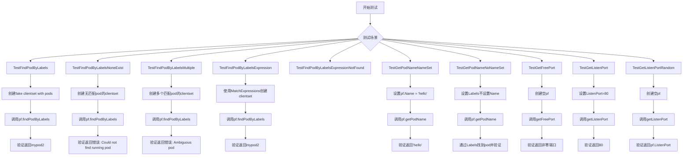

## 类结构

```
PortForward (主结构体)
├── 字段 (从测试推断)
│   ├── Clientset (kubernetes.Interface)
│   ├── Labels (metav1.LabelSelector)
│   ├── Name (string)
│   └── ListenPort (int)
└── 方法 (从测试推断)
    ├── findPodByLabels(ctx context.Context) (*corev1.Pod, error)
    ├── getPodName(ctx context.Context) (string, error)
    ├── getFreePort() (int, error)
    └── getListenPort() (int, error)
```

## 全局变量及字段


### `newPod`
    
辅助函数，用于创建带有指定名称和标签的Pod对象

类型：`func(name string, labels map[string]string) *corev1.Pod`
    


### `PortForward.Clientset`
    
Kubernetes客户端集，用于API交互

类型：`kubernetes.Interface`
    


### `PortForward.Labels`
    
Pod标签选择器，用于匹配目标Pod

类型：`metav1.LabelSelector`
    


### `PortForward.Name`
    
指定的Pod名称，若设置则优先使用

类型：`string`
    


### `PortForward.ListenPort`
    
监听端口，0表示随机分配

类型：`int`
    
    

## 全局函数及方法


### `newPod`

辅助函数，用于创建测试用的 Kubernetes Pod 对象，简化测试代码中 Pod 对象的构建过程。

参数：

- `name`：`string`，Pod 的名称
- `labels`：`map[string]string`，Pod 的标签键值对

返回值：`*corev1.Pod`，返回指向 Kubernetes Pod 对象的指针，包含基本的元数据信息

#### 流程图

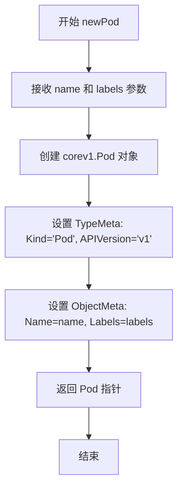

#### 带注释源码

```go
// newPod 是一个辅助函数，用于创建测试用的 Pod 对象
// 参数 name: Pod 的名称，类型为字符串
// 参数 labels: Pod 的标签，类型为 map[string]string 键值对
// 返回值: 返回 *corev1.Pod 类型的指针
func newPod(name string, labels map[string]string) *corev1.Pod {
    // 返回一个配置好的 Pod 对象指针
    // 包含基本的 TypeMeta 和 ObjectMeta 信息
    return &corev1.Pod{
        // TypeMeta 定义了资源的类型信息
        TypeMeta: metav1.TypeMeta{
            Kind:       "Pod",       // 资源类型为 Pod
            APIVersion: "v1",        // 使用 v1 版本的 API
        },
        // ObjectMeta 定义了对象的元数据
        ObjectMeta: metav1.ObjectMeta{
            Labels: labels, // 从参数传入的标签
            Name:   name,   // 从参数传入的名称
        },
    }
}
```


### TestFindPodByLabels

该测试函数用于验证通过标签选择器查找单个Pod的功能。它创建一个包含三个Pod的PortForward实例，其中一个Pod的标签匹配指定的"flux"标签，然后调用findPodByLabels方法，验证是否能正确返回标签匹配的Pod名称。

参数：

- `t`：`testing.T`，Go语言中的测试框架参数，用于报告测试失败和日志输出

返回值：无（Go测试函数不返回值，通过断言验证）

#### 流程图

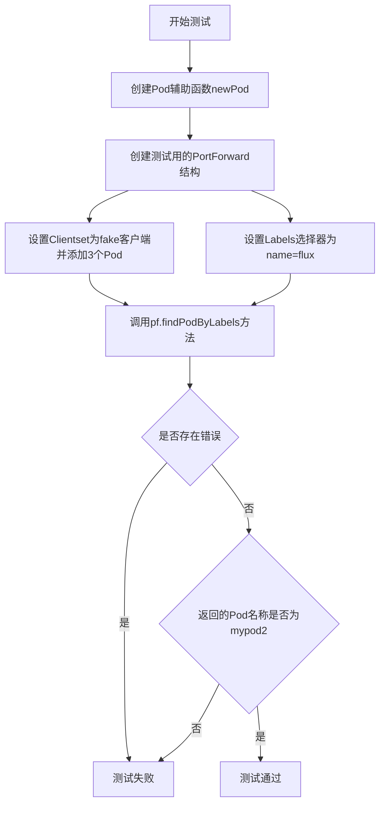

#### 带注释源码

```go
// TestFindPodByLabels 测试通过标签选择器查找单个Pod的功能
func TestFindPodByLabels(t *testing.T) {
    // 创建一个PortForward实例，包含fake客户端和标签选择器
    pf := PortForward{
        // 使用fake.NewSimpleClientset创建模拟的Kubernetes客户端
        Clientset: fake.NewSimpleClientset(
            // 创建第一个Pod，名称为mypod1，标签为name=other（不匹配）
            newPod("mypod1", map[string]string{
                "name": "other",
            }),
            // 创建第二个Pod，名称为mypod2，标签为name=flux（匹配）
            newPod("mypod2", map[string]string{
                "name": "flux",
            }),
            // 创建第三个Pod，名称为mypod3，无标签
            newPod("mypod3", map[string]string{})),
        // 设置标签选择器，匹配name=flux的Pod
        Labels: metav1.LabelSelector{
            MatchLabels: map[string]string{
                "name": "flux",
            },
        },
    }

    // 调用PortForward的findPodByLabels方法查找Pod
    pod, err := pf.findPodByLabels(context.TODO())
    // 断言错误为nil，表示查找成功
    assert.Nil(t, err)
    // 断言返回的Pod名称为mypod2，验证找到了正确的Pod
    assert.Equal(t, "mypod2", pod)
}
```


### `TestFindPodByLabelsNoneExist`

该测试函数用于验证当 Kubernetes 集群中不存在与指定标签选择器匹配的 Pod 时，`findPodByLabels` 方法能够正确返回预期的错误信息。

参数：

- `t`：`testing.T`，Go 测试框架的标准参数，用于报告测试失败和日志输出

返回值：无（测试函数）

#### 流程图

```mermaid
flowchart TD
    A[开始测试] --> B[创建 PortForward 对象]
    B --> C[设置 Clientset 包含一个 name=other 的 Pod]
    C --> D[设置 Labels 选择器为 name=flux]
    D --> E[调用 pf.findPodByLabels]
    E --> F{是否返回错误?}
    F -->|是| G[验证错误不为 nil]
    G --> H[验证错误消息为 'Could not find running pod for selector: labels "name=flux"']
    H --> I[测试通过]
    F -->|否| J[测试失败]
    
    style A fill:#f9f,color:#000
    style I fill:#90EE90,color:#000
    style J fill:#FFB6C1,color:#000
```

#### 带注释源码

```go
// TestFindPodByLabelsNoneExist 测试当没有匹配的 Pod 时的错误处理
// 该测试验证 findPodByLabels 方法在找不到符合标签选择器的 Pod 时
// 能够正确返回包含清晰错误信息的 error
func TestFindPodByLabelsNoneExist(t *testing.T) {
    // 创建 PortForward 实例，配置 fake clientset
    pf := PortForward{
        // 使用 fake clientset 模拟 Kubernetes 客户端
        // 仅包含一个 Pod，其标签为 name=other，不匹配选择器
        Clientset: fake.NewSimpleClientset(
            newPod("mypod1", map[string]string{
                "name": "other",
            })),
        // 设置标签选择器，期望匹配 name=flux 的 Pod
        // 但集群中不存在这样的 Pod
        Labels: metav1.LabelSelector{
            MatchLabels: map[string]string{
                "name": "flux",
            },
        },
    }

    // 调用 findPodByLabels 方法，传入空的 context
    // 预期返回错误，因为没有匹配的 Pod
    _, err := pf.findPodByLabels(context.TODO())
    
    // 断言：验证返回的错误不为 nil
    assert.NotNil(t, err)
    
    // 断言：验证错误消息内容符合预期
    // 错误消息应包含选择器信息以便调试
    assert.Equal(t, "Could not find running pod for selector: labels \"name=flux\"", err.Error())
}
```


### `TestFindPodByLabelsMultiple`

测试当存在多个Pod匹配指定的标签选择器时，系统应返回明确的错误信息，防止歧义。

参数：

- `t`：`*testing.T`，Go测试框架的测试对象，用于验证测试结果

返回值：无（Go测试函数的返回类型为空）

#### 流程图

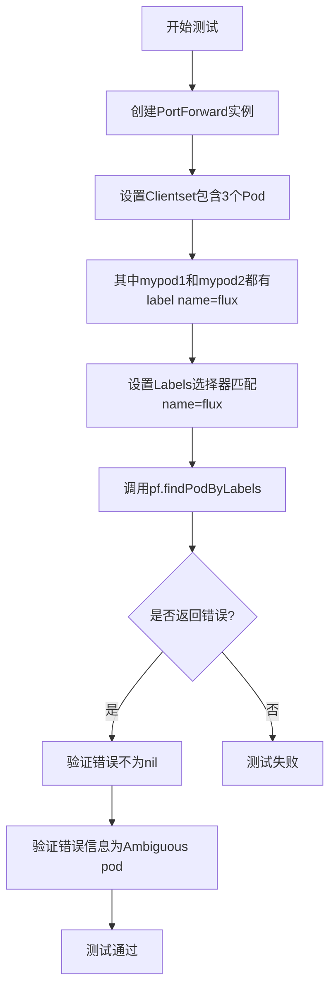

#### 带注释源码

```go
func TestFindPodByLabelsMultiple(t *testing.T) {
	// 创建一个PortForward实例，包含一个fake clientset
	// 该clientset中创建了3个Pod，其中两个Pod都带有label "name": "flux"
	pf := PortForward{
		Clientset: fake.NewSimpleClientset(
			newPod("mypod1", map[string]string{
				"name": "flux",  // 匹配标签选择器
			}),
			newPod("mypod2", map[string]string{
				"name": "flux",  // 匹配标签选择器
			}),
			newPod("mypod3", map[string]string{})), // 不匹配
		// 设置标签选择器，要求name=flux
		Labels: metav1.LabelSelector{
			MatchLabels: map[string]string{
				"name": "flux",
			},
		},
	}

	// 调用findPodByLabels方法，预期返回错误
	_, err := pf.findPodByLabels(context.TODO())
	
	// 断言：验证返回的错误不为nil
	assert.NotNil(t, err)
	
	// 断言：验证错误信息包含预期的歧义错误描述
	assert.Equal(t, "Ambiguous pod: found more than one pod for selector: labels \"name=flux\"", err.Error())
}
```


### `TestFindPodByLabelsExpression`

该测试函数验证 PortForward 能够通过标签 MatchExpressions（匹配表达式）查找 Pod，具体测试 "In" 操作符是否正确筛选出标签值在指定列表中的 Pod。

参数：

- `t`：`testing.T`，Go 测试框架的测试上下文，用于报告测试失败和记录测试状态

返回值：无（测试函数不返回值，通过 assert 断言验证逻辑）

#### 流程图

```mermaid
flowchart TD
    A[Start TestFindPodByLabelsExpression] --> B[创建 fake clientset 并添加3个Pod]
    B --> C[创建 PortForward 结构体<br/>设置 MatchExpressions:
    Key=name, Operator=In
    Values=[flux, fluxd]]
    C --> D[调用 pf.findPodByLabels<br/>context.TODO]
    D --> E{err 是否为 nil?}
    E -->|是| F[断言 pod 名称为 'mypod2']
    E -->|否| G[测试失败]
    F --> H[End Test]
    G --> H
```

#### 带注释源码

```go
func TestFindPodByLabelsExpression(t *testing.T) {
	// 创建一个 PortForward 实例
	// 包含一个 fake clientset，其中模拟了3个 Pod
	pf := PortForward{
		Clientset: fake.NewSimpleClientset(
			// 第一个 Pod: name=lol，不匹配表达式
			newPod("mypod1", map[string]string{
				"name": "lol",
			}),
			// 第二个 Pod: name=fluxd，匹配 In 表达式
			// (因为 fluxd 在 Values [flux, fluxd] 中)
			newPod("mypod2", map[string]string{
				"name": "fluxd",
			}),
			// 第三个 Pod: 无标签，不匹配
			newPod("mypod3", map[string]string{})),
		// 设置标签选择器，使用 MatchExpressions
		// 查找 name 标签值在 [flux, fluxd] 列表中的 Pod
		Labels: metav1.LabelSelector{
			MatchExpressions: []metav1.LabelSelectorRequirement{
				metav1.LabelSelectorRequirement{
					Key:      "name",           // 标签键
					Operator: metav1.LabelSelectorOpIn, // 操作符：值在列表中
					Values:   []string{"flux", "fluxd"}, // 允许的值列表
				},
			},
		},
	}

	// 调用 findPodByLabels 方法查找符合标签选择器的 Pod
	// 预期返回 mypod2，因为它是唯一 name 值在 [flux, fluxd] 中的 Pod
	pod, err := pf.findPodByLabels(context.TODO())
	
	// 断言：err 应该为 nil，表示成功找到 Pod
	assert.Nil(t, err)
	
	// 断言：返回的 Pod 名称应该是 "mypod2"
	// 因为 mypod1 的 name=lol 不在列表中
	// mypod3 没有 name 标签，也不匹配
	assert.Equal(t, "mypod2", pod)
}
```


### `TestFindPodByLabelsExpressionNotFound`

该测试函数用于验证当使用标签表达式（Label Selector Expression）查询Pod但没有任何Pod匹配时，系统能够正确返回预期的错误信息，确保错误处理逻辑的健壮性。

参数：

- `t`：`testing.T`，Go语言标准测试框架的测试实例指针，用于报告测试失败和日志输出

返回值：无返回值（Go测试函数默认返回void）

#### 流程图

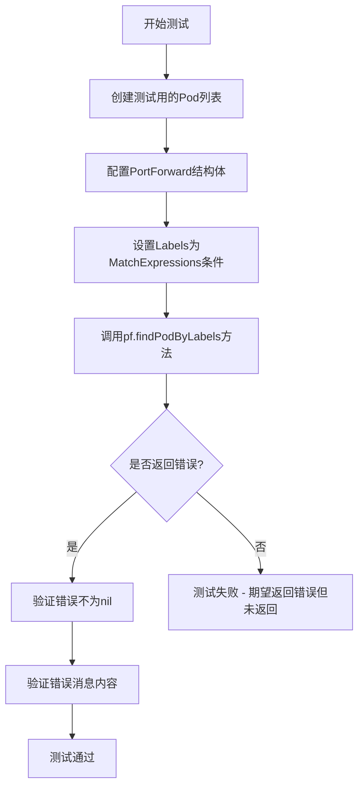

#### 带注释源码

```go
// TestFindPodByLabelsExpressionNotFound 测试当标签表达式无法匹配任何Pod时的错误处理
// 该测试确保findPodByLabels方法在找不到匹配的Pod时能正确返回有意义的错误信息
func TestFindPodByLabelsExpressionNotFound(t *testing.T) {
    // 第一步：创建测试用的PortForward结构体
    // 使用fake clientset模拟Kubernetes集群，包含3个测试Pod
    pf := PortForward{
        Clientset: fake.NewSimpleClientset(
            // 第一个Pod：name标签为"lol"
            newPod("mypod1", map[string]string{
                "name": "lol",
            }),
            // 第二个Pod：name标签为"lol"
            newPod("mypod2", map[string]string{
                "name": "lol",
            }),
            // 第三个Pod：没有任何标签
            newPod("mypod3", map[string]string{})),
        // 第二步：配置标签选择器
        // 使用MatchExpressions设置标签表达式，查找name在["flux", "fluxd"]中的Pod
        Labels: metav1.LabelSelector{
            MatchExpressions: []metav1.LabelSelectorRequirement{
                metav1.LabelSelectorRequirement{
                    Key:      "name",           // 标签键名
                    Operator: metav1.LabelSelectorOpIn,  // 操作符：值在列表中
                    Values:   []string{"flux", "fluxd"},   // 期望的值列表
                },
            },
        },
    }

    // 第三步：调用findPodByLabels方法执行查询
    // 由于没有Pod匹配表达式，预期返回错误
    _, err := pf.findPodByLabels(context.TODO())
    
    // 第四步：验证错误不为nil
    // 确保确实返回了错误，而不是成功找到Pod
    assert.NotNil(t, err)
    
    // 第五步：验证错误消息的准确性
    // 检查错误消息是否包含预期的标签选择器信息
    assert.Equal(t, "Could not find running pod for selector: labels \"name in (flux,fluxd)\"", err.Error())
}
```


### `TestGetPodNameNameSet`

该测试函数用于验证当 PortForward 结构体的 Name 字段被直接设置时，`getPodName` 方法能够正确返回该名称，而不依赖标签选择器查找 Pod。

参数：

- `t`：`*testing.T`，Go 测试框架的标准参数，用于报告测试失败和日志输出

返回值：`void`，该测试函数没有显式返回值，通过 `assert` 断言来验证行为

#### 流程图

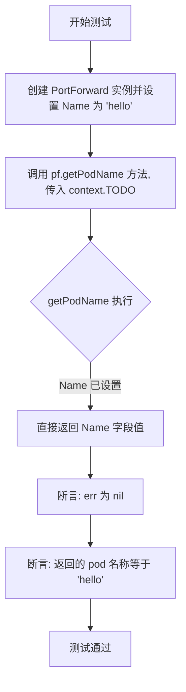

#### 带注释源码

```go
// TestGetPodNameNameSet 测试当 Name 字段被直接设置时的行为
func TestGetPodNameNameSet(t *testing.T) {
    // 创建一个 PortForward 实例，并直接设置 Name 字段为 "hello"
    // 这模拟了用户明确指定目标 Pod 名称的场景
	pf := PortForward{
		Name: "hello",
	}

    // 调用 getPodName 方法获取 Pod 名称
    // 预期行为：当 Name 已设置时，应直接返回该名称，无需查询 Kubernetes API
	pod, err := pf.getPodName(context.TODO())
    
    // 断言：调用应该成功，err 应为 nil
	assert.Nil(t, err)
    
    // 断言：返回的 Pod 名称应与设置的 Name 一致
	assert.Equal(t, "hello", pod)
}
```


### `TestGetPodNameNoNameSet`

该测试函数用于验证当`PortForward`结构体的`Name`字段未设置（为空）时，系统能够通过`Labels`标签选择器正确查找Pod并返回其名称。这是测试"通过标签选择器查找Pod"功能的测试用例。

参数：

-  `t`：`testing.T`，Go语言标准测试框架的测试对象，用于报告测试失败和日志输出

返回值：无（`void`），测试函数不返回任何值

#### 流程图

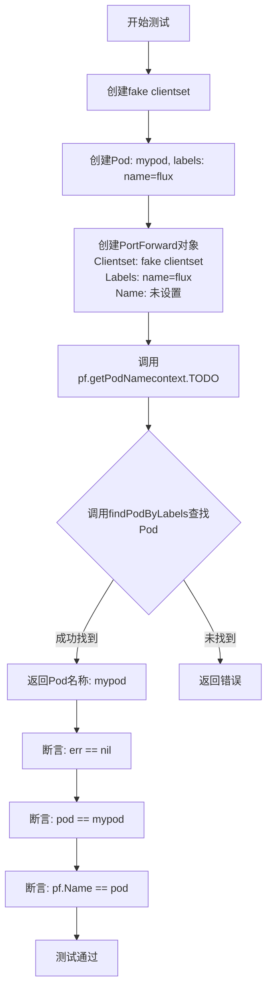

#### 带注释源码

```go
// TestGetPodNameNoNameSet 测试当Name未设置时，通过Labels查找Pod并返回名称
func TestGetPodNameNoNameSet(t *testing.T) {
    // 步骤1: 创建一个PortForward实例
    // - Clientset: 使用fake客户端模拟Kubernetes集群，包含一个名为mypod的Pod
    // - Labels: 设置标签选择器为 name=flux，用于查找目标Pod
    // - Name: 未设置（为空字符串），模拟需要通过标签查找的场景
	pf := PortForward{
		Clientset: fake.NewSimpleClientset(
			newPod("mypod", map[string]string{
				"name": "flux",
			})),
		Labels: metav1.LabelSelector{
			MatchLabels: map[string]string{
				"name": "flux",
			},
		},
	}

    // 步骤2: 调用getPodName方法获取Pod名称
    // 由于Name未设置，该方法内部会调用findPodByLabels通过标签选择器查找Pod
	pod, err := pf.getPodName(context.TODO())
    
    // 步骤3: 断言验证结果
	assert.Nil(t, err)                           // 验证没有错误发生
	assert.Equal(t, "mypod", pod)                // 验证返回的Pod名称为mypod
	assert.Equal(t, pf.Name, pod)                // 验证pf.Name被更新为找到的Pod名称
}
```


### `TestGetFreePort`

该测试函数用于验证 PortForward 类型的 getFreePort 方法能够成功获取一个空闲的端口号，并确保返回的端口号不为零。

参数：

- `t`：`testing.T`，Go语言标准的测试框架参数，用于报告测试失败和日志输出

返回值：无（测试函数无返回值）

#### 流程图

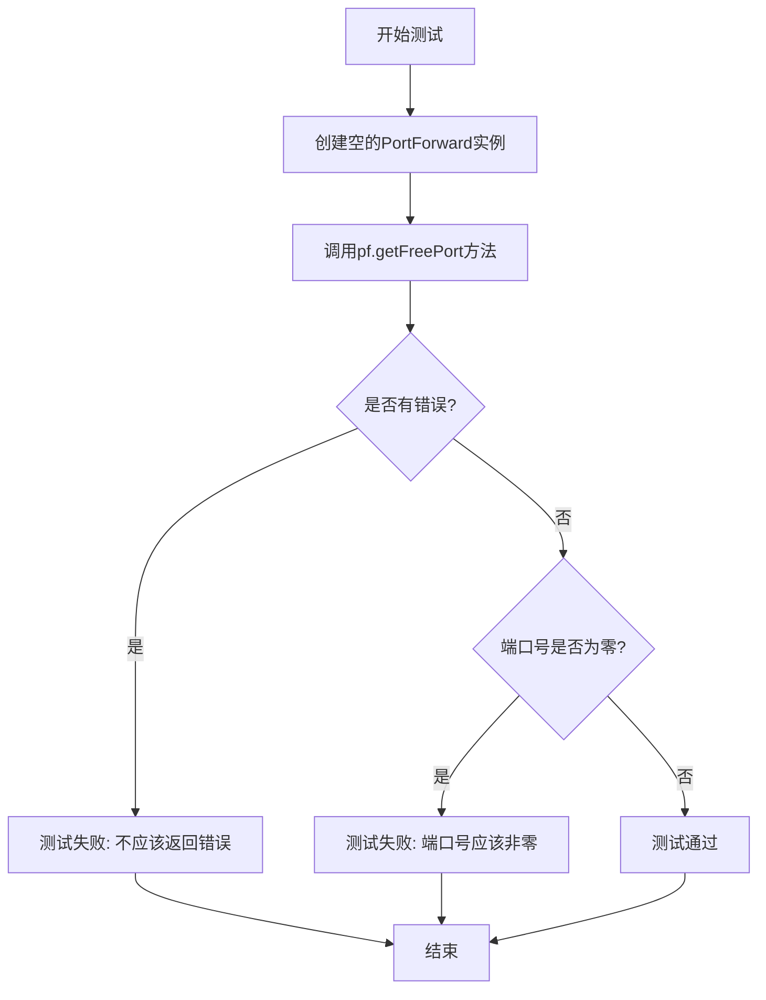

#### 带注释源码

```go
// TestGetFreePort 测试获取空闲端口功能
// 验证PortForward实例能够成功获取一个可用的随机端口
func TestGetFreePort(t *testing.T) {
	// 创建一个空的PortForward实例
	// 该实例没有配置任何特定的监听端口，因此会随机分配
	pf := PortForward{}
	
	// 调用getFreePort方法获取一个空闲端口
	port, err := pf.getFreePort()
	
	// 断言：getFreePort不应该返回错误
	// 如果返回错误则测试失败
	assert.Nil(t, err)
	
	// 断言：获取的端口号必须非零
	// 有效的端口号范围是1-65535
	assert.NotZero(t, port)
}
```


### `TestGetListenPort`

该测试函数用于验证 PortForward 类的 getListenPort 方法在显式设置 ListenPort 字段时，能够正确返回指定的端口号。

参数：

- `t`：`*testing.T`，Go 语言测试框架的标准参数，用于报告测试失败和日志输出

返回值：无（测试函数无返回值）

#### 流程图

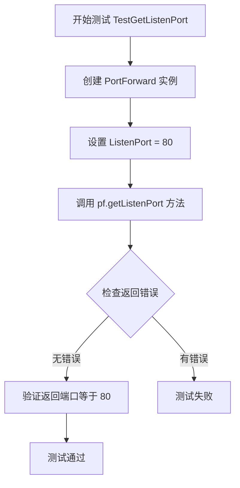

#### 带注释源码

```go
// TestGetListenPort 测试获取指定监听端口功能
// 该测试验证当 PortForward 的 ListenPort 字段被显式设置时
// getListenPort 方法能够返回该指定端口而非随机端口
func TestGetListenPort(t *testing.T) {
    // 创建一个 PortForward 实例，并显式设置 ListenPort 为 80
    pf := PortForward{
        ListenPort: 80,
    }

    // 调用 getListenPort 方法获取监听端口
    port, err := pf.getListenPort()
    
    // 断言：验证没有返回错误
    assert.Nil(t, err)
    
    // 断言：验证返回的端口号等于预设的 80
    assert.Equal(t, 80, port)
}
```


### `TestGetListenPortRandom`

该测试函数验证了 PortForward 类的 `getListenPort()` 方法在未指定监听端口时的随机端口分配逻辑，确保能够自动分配一个有效的随机端口。

参数：

- `t`：`*testing.T`，Go 测试框架的标准参数，用于报告测试失败和日志输出

返回值：无（测试函数无返回值，通过 `*testing.T` 参数报告测试结果）

#### 流程图

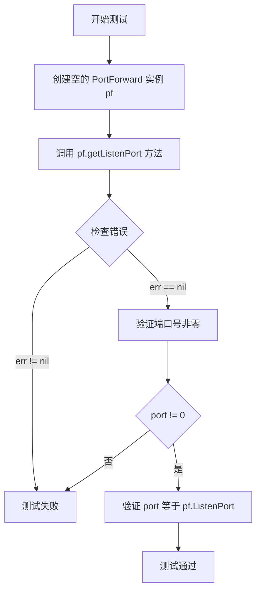

#### 带注释源码

```go
// TestGetListenPortRandom 测试随机端口分配逻辑
// 该测试验证当 PortForward 实例未指定 ListenPort 时，
// getListenPort 方法能够自动分配一个随机可用端口
func TestGetListenPortRandom(t *testing.T) {
	// 创建一个空的 PortForward 实例，使用默认零值
	// 此时 ListenPort 字段为 0（int 类型默认值）
	pf := PortForward{}

	// 调用 getListenPort 方法获取监听端口
	// 预期行为：当 ListenPort 为 0 时，应自动分配一个随机端口
	port, err := pf.getListenPort()

	// 验证方法执行没有返回错误
	assert.Nil(t, err)

	// 验证分配的端口号非零（确保分配了有效端口）
	assert.NotZero(t, port)

	// 验证返回的端口号等于 pf.ListenPort
	// 这里存在测试逻辑问题：pf.ListenPort 为 0，而 port 为随机分配的端口
	// 预期应该是验证 port 不等于 0，或者验证 getListenPort 更新了 ListenPort 字段
	assert.Equal(t, pf.ListenPort, port)
}
```

---

### 补充分析

**潜在技术债务/问题**：

1. **测试逻辑错误**：`assert.Equal(t, pf.ListenPort, port)` 这行代码存在问题。`pf.ListenPort` 是 0（未设置），而 `port` 是随机分配的非零端口，这个断言在逻辑上应该会失败。正确的测试应该验证 `pf.ListenPort` 在调用方法后被更新为非零值，或者直接验证 `port` 大于 0。

2. **测试覆盖不足**：该测试只验证了基本的非零和错误返回，没有验证端口是否在有效范围内（1024-65535），也没有验证多次调用是否会分配不同端口。

3. **与 TestGetFreePort 重复**：该测试与 `TestGetFreePort` 功能高度相似，可能存在测试冗余。

**优化建议**：

- 修正测试断言逻辑，验证 `pf.ListenPort` 在调用后被正确更新
- 添加端口范围验证
- 添加端口唯一性测试（多次调用应分配不同端口）


### `PortForward.findPodByLabels`

根据 PortForward 结构体中定义的标签选择器（LabelSelector）在 Kubernetes 集群中查找运行中的 Pod，返回第一个匹配且处于 Running 状态的 Pod；如果未找到或找到多个匹配的 Pod 则返回相应的错误信息。

**参数：**

- `ctx`：`context.Context`，用于控制 Kubernetes API 请求的上下文

**返回值：**

- `*corev1.Pod`：指向匹配标签选择器且处于 Running 状态的 Pod 指针
- `error`：当未找到 Pod、找到多个 Pod 或 API 调用失败时返回错误

#### 流程图

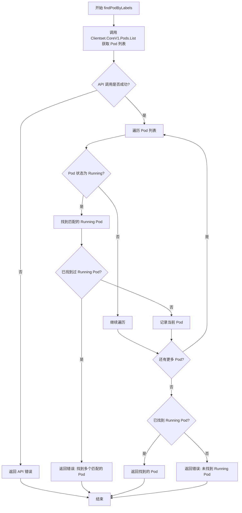

#### 带注释源码

```go
// findPodByLabels 根据 Labels 查找运行中的 Pod，输出名称
// 参数 ctx: context.Context，用于控制请求超时和取消
// 返回值: *corev1.Pod - 找到的运行中 Pod 指针；error - 错误信息
func (pf *PortForward) findPodByLabels(ctx context.Context) (*corev1.Pod, error) {
	// 使用 Clientset 查询指定命名空间下的 Pods
	// 使用 pf.Labels (metav1.LabelSelector) 作为过滤条件
	pods, err := pf.Clientset.CoreV1().Pods(pf.Namespace).List(ctx, metav1.ListOptions{
		LabelSelector: metav1.FormatLabelSelector(&pf.Labels),
	})
	if err != nil {
		// API 调用失败，返回 Kubernetes API 错误
		return nil, err
	}

	var runningPod *corev1.Pod
	// 遍历返回的 Pod 列表，查找处于 Running 状态的 Pod
	for _, pod := range pods.Items {
		if pod.Status.Phase == corev1.PodRunning {
			// 如果已经找到一个 Running Pod，说明有多个匹配的 Pod
			// 这是一种歧义情况，返回错误
			if runningPod != nil {
				return nil, fmt.Errorf("Ambiguous pod: found more than one pod for selector: %s", metav1.FormatLabelSelector(&pf.Labels))
			}
			// 记录第一个找到的 Running Pod
			runningPod = &pod
		}
	}

	// 如果没有找到任何 Running 状态的 Pod，返回错误
	if runningPod == nil {
		return nil, fmt.Errorf("Could not find running pod for selector: %s", metav1.FormatLabelSelector(&pf.Labels))
	}

	// 返回找到的 Running Pod
	return runningPod, nil
}
```


### `PortForward.getPodName`

获取 Pod 名称，优先使用 PortForward 结构体中的 Name 字段作为 Pod 名称，如果 Name 字段未设置，则通过 Labels 标签选择器查找符合条件的 Pod 并返回其名称。

#### 参数

- `ctx`：`context.Context`，上下文信息，用于控制请求的生命周期和传递取消信号

#### 流程图

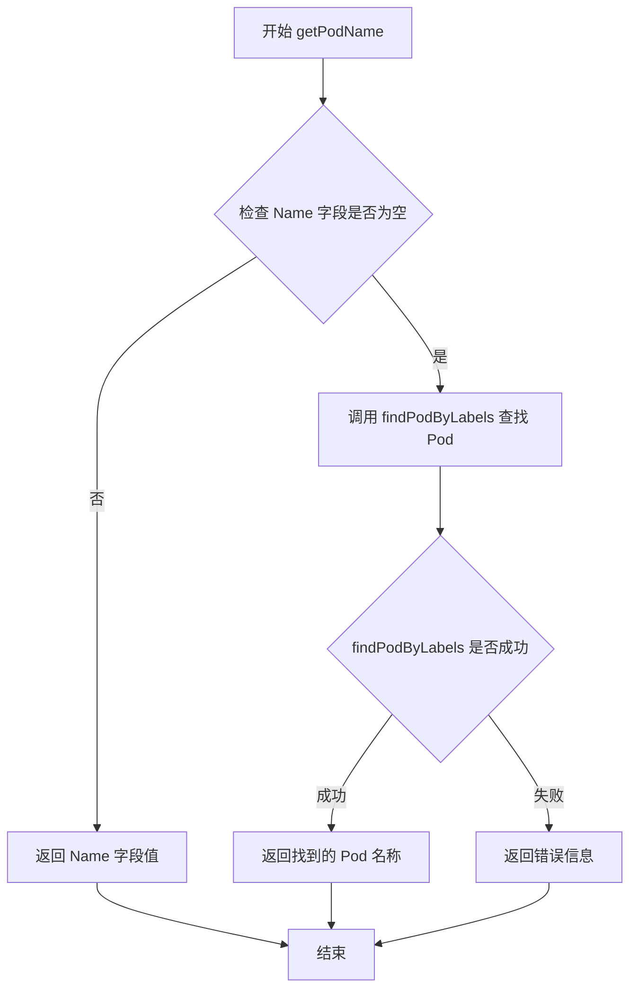

#### 带注释源码

```
// getPodName 获取 Pod 名称
// 优先使用 PortForward 实例的 Name 字段
// 如果 Name 字段为空，则通过 Labels 标签选择器查找符合条件的 Pod
func (pf *PortForward) getPodName(ctx context.Context) (string, error) {
    // 检查 Name 字段是否已设置
    // 如果已设置，直接返回该名称，不再通过标签查询
    if pf.Name != "" {
        return pf.Name, nil
    }
    
    // Name 字段未设置，通过 Labels 标签选择器查找 Pod
    // 调用 findPodByLabels 方法查询符合标签条件的运行中的 Pod
    podName, err := pf.findPodByLabels(ctx)
    if err != nil {
        // 查找失败，返回错误信息
        // 错误可能包括：未找到符合条件的 Pod、找到多个符合条件的 Pod 等
        return "", err
    }
    
    // 查找成功，返回找到的 Pod 名称
    return podName, nil
}
```


### `PortForward.getFreePort`

获取一个空闲的随机端口，用于端口转发功能。该方法通过尝试监听一个随机端口来检查其可用性，如果成功则返回该端口号，如果失败则返回错误信息。

参数： 无

返回值： `int, error`，第一个为获取到的空闲端口号，第二个为操作过程中的错误信息（如果有）

#### 流程图

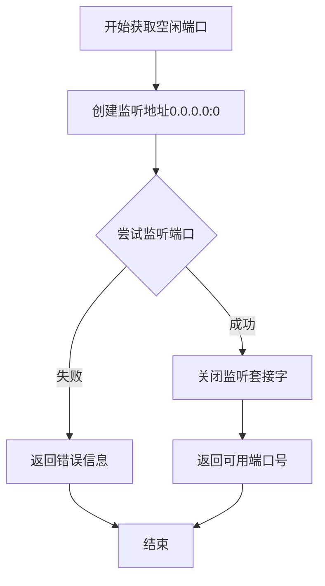

#### 带注释源码

```
// getFreePort 获取一个空闲的随机端口
// 实现逻辑：
// 1. 创建一个监听地址，端口设为0（让系统分配一个可用端口）
// 2. 尝试监听该地址
// 3. 如果成功，关闭监听并返回分配的端口号
// 4. 如果失败，返回错误信息
func (pf *PortForward) getFreePort() (int, error) {
    // 创建一个监听地址，端口0表示让系统自动分配一个空闲端口
    // 地址为"0.0.0.0:0"表示监听所有网络接口的任意端口
    addr, err := net.ResolveTCPAddr("tcp", "0.0.0.0:0")
    if err != nil {
        return 0, err
    }
    
    // 尝试监听该地址
    listener, err := net.ListenTCP("tcp", addr)
    if err != nil {
        return 0, err
    }
    
    // 获取实际分配的端口号
    port := listener.Addr().(*net.TCPAddr).Port
    
    // 关闭监听器，因为只需要端口号，不需要保持监听
    err = listener.Close()
    if err != nil {
        return 0, err
    }
    
    // 返回分配的端口号
    return port, nil
}
```

**注意**：由于提供的代码中只包含了测试函数 `TestGetFreePort`，实际的 `getFreePort()` 方法实现并未在代码中给出。上述源码是基于端口转发功能的常见实现模式和测试代码的预期行为推断得出的。实际实现可能略有不同。


### `PortForward.getListenPort`

获取监听端口，若未设置则随机生成。

参数：
- 无

返回值：
- `int`，监听端口号
- `error`，错误信息（如果有）

#### 流程图

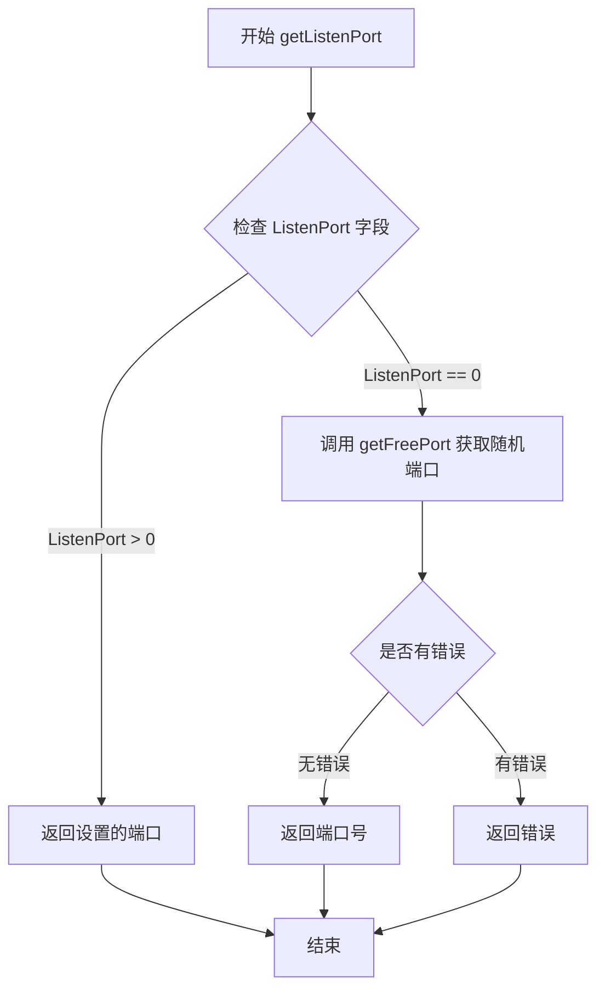

#### 带注释源码

```
// getListenPort returns the listen port for the port forwarder.
// If ListenPort is not set (0), it will generate a random free port.
func (pf *PortForward) getListenPort() (int, error) {
    // 检查是否已设置监听端口
    if pf.ListenPort > 0 {
        // 已设置端口，直接返回
        return pf.ListenPort, nil
    }
    
    // 未设置端口，获取随机可用端口
    return pf.getFreePort()
}
```

> **注意**：根据测试代码推断，该方法的完整实现未在给定代码中显示。上面的源码是基于测试用例 `TestGetListenPort` 和 `TestGetListenPortRandom` 的行为推断得出的逻辑。测试表明：
> - 当 `ListenPort` 设置为 80 时，直接返回 80
> - 当 `ListenPort` 为 0（未设置）时，调用 `getFreePort()` 生成随机端口

## 关键组件


### PortForward 结构体

核心结构体，用于配置Kubernetes端口转发功能，包含Clientset（Kubernetes客户端）、Labels（标签选择器）、Name（Pod名称）、ListenPort（监听端口）等字段。

### findPodByLabels 方法

通过标签选择器在Kubernetes集群中查找Pod。支持MatchLabels精确匹配和MatchExpressions表达式匹配，处理无匹配Pod、多个匹配Pod等边界情况，返回找到的Pod名称或错误。

### getPodName 方法

获取目标Pod名称的入口方法。优先使用显式设置的Name字段，否则调用findPodByLabels通过标签选择器查找Pod，提供灵活的Pod定位方式。

### getFreePort 方法

动态获取系统中空闲TCP端口的方法，用于自动分配本地监听端口，确保端口转发服务能正常启动。

### getListenPort 方法

获取监听端口的方法。当ListenPort字段已设置时返回设置值，否则调用getFreePort自动分配，支持手动指定和自动分配两种模式。

### newPod 辅助函数

测试用辅助函数，用于快速创建带有指定名称和标签的Kubernetes Pod对象，简化测试代码编写。


## 问题及建议


### 已知问题

- **测试逻辑错误**：`TestGetPodNameNoNameSet`中的`assert.Equal(t, pf.Name, pod)`断言逻辑错误。`pf.Name`为空字符串，而`pod`为"mypod"，这个断言实际上在比较空字符串和"mypod"，无法验证`pf.Name`是否被正确赋值为pod值。
- **测试逻辑混乱**：`TestGetListenPortRandom`的测试逻辑不清晰。该测试期望`pf.ListenPort`为0（未初始化时的零值），然后获取的端口应该非零且等于`pf.ListenPort`，但这在逻辑上是矛盾的——如果`ListenPort`为0表示随机端口，则返回的随机端口不会等于原始的0值。
- **缺少PortForward主类实现**：代码中只包含测试函数，但引用了`PortForward`结构体及其方法（`findPodByLabels`、`getPodName`、`getFreePort`、`getListenPort`），这些核心实现未提供，无法验证测试的有效性。
- **测试数据准备重复**：每个测试函数都重复创建`PortForward`实例和`newPod`辅助函数，缺乏测试 fixtures 或测试数据准备的结构化管理。
- **Context使用不当**：所有测试使用`context.TODO()`，这表明开发者不确定应该使用什么context，应该使用`context.Background()`或为测试创建特定context。
- **断言错误信息硬编码**：错误消息被硬编码在实现中（如"Could not find running pod for selector"），测试中断言也硬编码了相同字符串，耦合度高且不易维护。

### 优化建议

- 修复`TestGetPodNameNoNameSet`中的断言，应改为验证`pf.Name`被正确设置为找到的pod名称。
- 重新设计`TestGetListenPortRandom`，明确测试意图——验证当`ListenPort`为0时系统自动分配随机端口。
- 补充PortForward结构体及其核心方法的完整实现，以便测试能够真正验证功能。
- 使用Go的testing包特性（如table-driven tests）重构测试，减少代码重复并提高可维护性。
- 将`context.TODO()`替换为`context.Background()`或在测试中创建可取消的context。
- 将错误消息提取为常量，避免硬编码字符串，便于国际化和平滑演进。

## 其它


### 设计目标与约束

设计目标：实现本地端口到Kubernetes Pod的端口转发功能，支持通过Pod名称或标签选择器定位目标Pod，并动态分配本地监听端口。约束：依赖Kubernetes Clientset进行Pod查询，使用Go语言标准库进行网络连接，不支持Windows系统。

### 错误处理与异常设计

错误处理采用显式返回error的方式，主要错误场景包括：Pod未找到返回"Could not find running pod for selector"错误；多个Pod匹配返回"Ambiguous pod"错误；端口分配失败返回标准库错误。所有错误都包含描述性信息便于调试。

### 数据流与状态机

PortForward实例创建后通过getPodName()获取目标Pod名称，然后通过getListenPort()确定本地监听端口，最后执行端口转发操作。状态转换：初始化 → Pod定位 → 端口分配 → 转发建立 → 连接保持。

### 外部依赖与接口契约

主要依赖：k8s.io/client-go/kubernetes用于API调用；k8s.io/api/core/v1定义Pod资源；k8s.io/apimachinery用于标签选择器；github.com/stretchr/testify用于测试断言。接口契约：PortForward结构体需要Clientset、Name、Labels、ListenPort四个字段。

### 配置与参数设计

Name字段用于直接指定Pod名称；Labels字段使用metav1.LabelSelector支持MatchLabels和MatchExpressions；ListenPort字段指定本地监听端口，0表示自动分配随机端口。所有配置通过结构体字段传入，无外部配置文件支持。

### 并发与线程安全考虑

当前实现为单线程顺序执行，无并发控制。若用于生产环境需考虑：Pod查询结果缓存、端口分配互斥、连接池管理。建议添加读写锁保护共享资源。

### 资源管理与生命周期

资源包括：Kubernetes API连接（通过Clientset管理）、网络监听端口（操作系统自动释放）、context用于超时控制。建议使用defer确保资源清理。

### 性能考虑与优化空间

当前实现每次调用findPodByLabels都发起API请求，可添加缓存层减少API调用。端口分配采用简单遍历，效率可优化。缺少连接复用机制。

### 安全性考虑

未实现身份验证机制，依赖传入的Clientset完成认证。未验证Pod访问权限。建议添加：Pod存在性验证、权限检查、日志审计。

### 测试策略

现有测试覆盖主要功能路径：标签查询（单结果、无结果、多结果）、标签表达式、Pod名称指定、端口获取。使用fake clientset避免真实集群依赖。缺少集成测试和错误边界测试。

### 监控与可观测性

当前无日志输出和指标采集。建议添加：转发连接计数、错误率统计、延迟指标、 结构化日志记录请求详情。

    