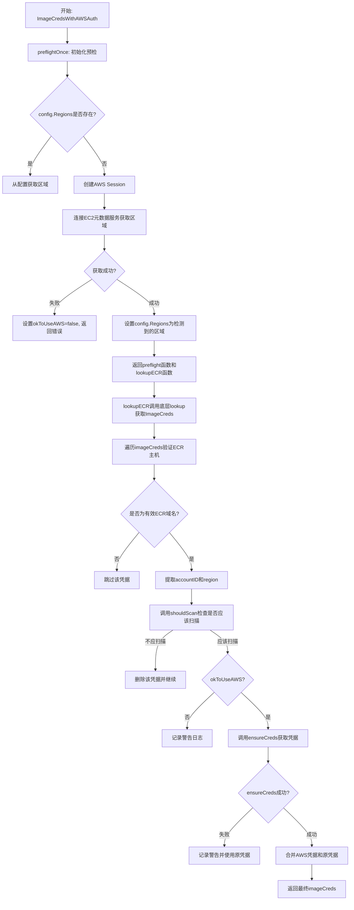
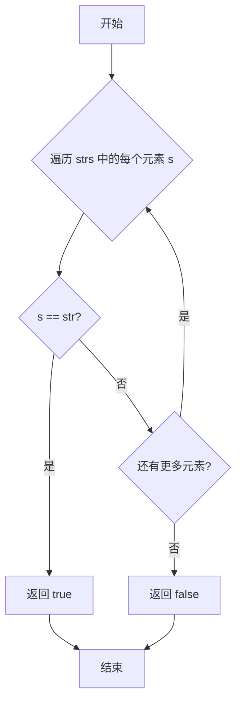
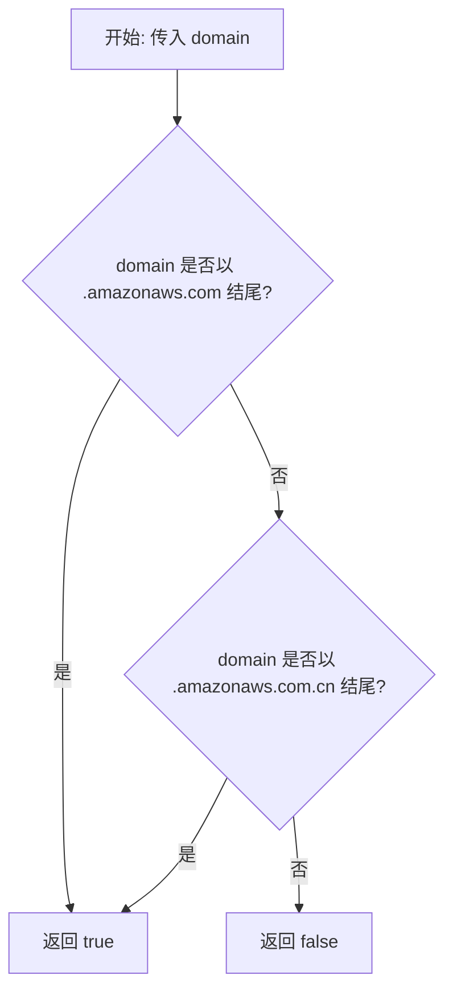
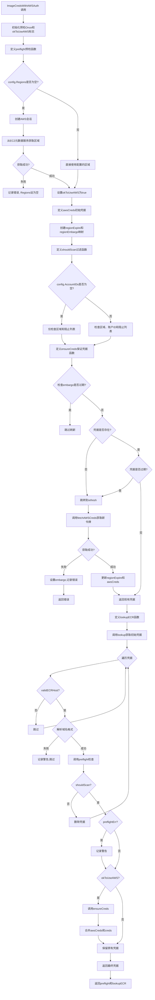
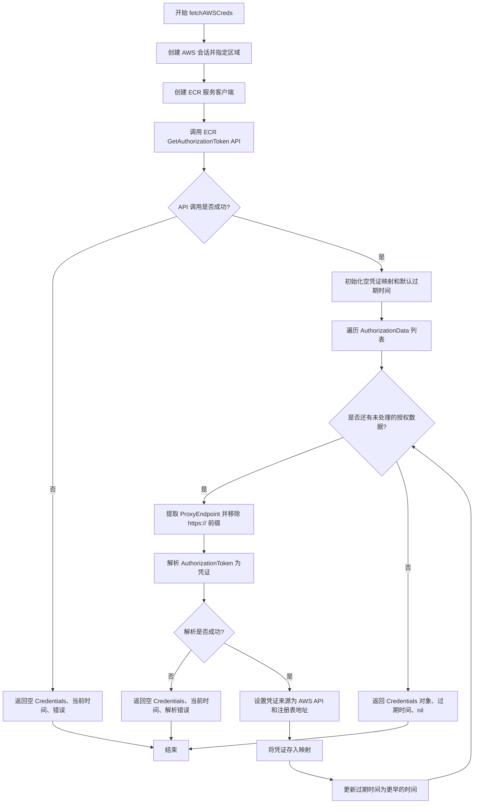
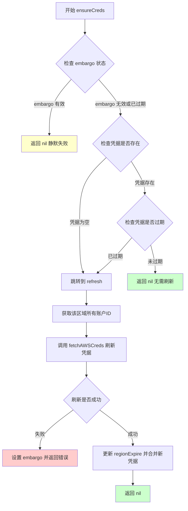

# `flux\pkg\registry\aws.go` 详细设计文档

该代码实现了一个AWS ECR（Elastic Container Registry）凭据提供程序，用于扫描和过滤AWS镜像仓库，根据配置的区域和账户ID约束从AWS API自动获取和刷新ECR认证凭据，支持EC2元数据服务进行区域检测和错误 embargo 机制来避免频繁重试。

## 整体流程



## 类结构

```
AWSRegistryConfig (配置结构体)
└── 辅助函数组
    ├── contains
    ├── validECRHost
    ├── allAccountIDsInRegion
    └── fetchAWSCreds
```

## 全局变量及字段


### `awsPartitionSuffix`
    
AWS标准分区域名后缀

类型：`string`
    


### `awsCnPartitionSuffix`
    
AWS中国分区域名后缀

类型：`string`
    


### `defaultTokenValid`
    
AWS token默认有效期

类型：`time.Duration`
    


### `embargoDuration`
    
失败后跳过刷新时长

类型：`time.Duration`
    


### `EKS_SYSTEM_ACCOUNT`
    
AWS EKS系统账户ID

类型：`string`
    


### `EKS_SYSTEM_ACCOUNT_CN`
    
AWS中国EKS系统账户ID

类型：`string`
    


### `preflightOnce`
    
确保预检只执行一次

类型：`sync.Once`
    


### `okToUseAWS`
    
标记AWS API是否可用

类型：`bool`
    


### `regionExpire`
    
记录每个区域的凭据过期时间

类型：`map[string]time.Time`
    


### `regionEmbargo`
    
记录每个区域的失败 embargo 截止时间

类型：`map[string]time.Time`
    


### `shouldScan`
    
判断是否应扫描特定区域和账户

类型：`func(string, string) bool`
    


### `AWSRegistryConfig.Regions`
    
允许扫描的AWS区域列表

类型：`[]string`
    


### `AWSRegistryConfig.AccountIDs`
    
允许扫描的AWS账户ID列表

类型：`[]string`
    


### `AWSRegistryConfig.BlockIDs`
    
排除的AWS账户ID列表

类型：`[]string`
    
    

## 全局函数及方法


### `contains`

该函数用于检查给定字符串是否存在于字符串切片中，通过简单的线性遍历实现。

参数：

- `strs`：`[]string`，要搜索的字符串切片
- `str`：`string`，要查找的目标字符串

返回值：`bool`，如果目标字符串存在于切片中返回 `true`，否则返回 `false`

#### 流程图



#### 带注释源码

```go
// contains 检查字符串 str 是否在字符串切片 strs 中
// 参数：
//   - strs: 要搜索的字符串切片
//   - str:  要查找的目标字符串
// 返回值：
//   - bool: 如果找到返回 true，否则返回 false
func contains(strs []string, str string) bool {
	// 遍历字符串切片中的每个元素
	for _, s := range strs {
		// 如果当前元素与目标字符串相等，表示找到
		if s == str {
			return true
		}
	}
	// 遍历完毕未找到匹配项，返回 false
	return false
}
```


### `validECRHost`

验证域名是否为有效的 AWS ECR (Elastic Container Registry) 主机域名。

参数：
- `domain`：`string`，需要验证的域名字符串

返回值：`bool`，如果域名是以 `.amazonaws.com` 或 `.amazonaws.com.cn` 结尾的有效 ECR 主机域名，则返回 `true`，否则返回 `false`

#### 流程图



#### 带注释源码

```go
// validECRHost 验证给定的域名是否符合 AWS ECR 的主机域名格式。
// 它通过检查域名是否以特定的 AWS 公共端点后缀结尾来进行判断。
//
// 参数:
//   - domain string: 待验证的域名，例如 "123456789012.dkr.ecr.us-east-1.amazonaws.com"
//
// 返回值:
//   - bool: 如果域名是有效的 ECR 主机域名返回 true，否则返回 false
func validECRHost(domain string) bool {
	// 使用 switch 语句进行多条件判断，首先检查是否属于标准 AWS 区域 (全球)
	switch {
	case strings.HasSuffix(domain, awsPartitionSuffix):
		// awsPartitionSuffix 定义为 ".amazonaws.com"
		// 如果域名以后缀 ".amazonaws.com" 结尾（例如 us-east-1, us-west-2 等），
		// 则认为它是有效的 ECR 主机。
		return true
	case strings.HasSuffix(domain, awsCnPartitionSuffix):
		// awsCnPartitionSuffix 定义为 ".amazonaws.com.cn"
		// 如果域名以后缀 ".amazonaws.com.cn" 结尾（例如 cn-north-1, cn-northwest-1 等），
		// 则认为它是中国区（北京、宁夏）的有效 ECR 主机。
		return true
	}
	// 如果域名既不是标准 AWS 区域后缀，也不是中国区后缀，则判定为无效 ECR 主机。
	return false
}
```


### `ImageCredsWithAWSAuth`

该函数是AWS ECR镜像凭据认证的核心入口，包装了一个图像凭据查找函数，添加AWS ECR认证能力。它根据配置限制扫描的AWS区域和账户，并从AWS API自动获取和刷新ECR注册表的认证令牌，同时返回预检函数用于启动时验证AWS API可用性。

参数：

- `lookup`：`func() ImageCreds`，底层图像凭据查找函数，用于获取初始凭据
- `logger`：`log.Logger`，日志记录器，用于输出诊断信息
- `config`：`AWSRegistryConfig`，AWS注册表配置，包含区域、账户ID等过滤条件

返回值：

- `func() error`：预检函数，启动时调用以验证AWS API可用性
- `func() ImageCreds`：包装后的ECR图像凭据查找函数，包含AWS认证能力

#### 流程图



#### 带注释源码

```go
// ImageCredsWithAWSAuth 包装一个图像凭据查找函数，添加AWS ECR认证能力
// 参数:
//   - lookup: 底层图像凭据查找函数
//   - logger: 日志记录器
//   - config: AWS注册表配置
// 返回:
//   - func() error: 预检函数
//   - func() ImageCreds: 包装后的ECR图像凭据查找函数
func ImageCredsWithAWSAuth(lookup func() ImageCreds, logger log.Logger, config AWSRegistryConfig) (func() error, func() ImageCreds) {
    // 只执行一次预检，后续调用直接返回
    // 首次调用者需关注返回值
    var preflightOnce sync.Once
    // 标记AWS API是否可用
    var okToUseAWS bool

    // preflight 预检函数，用于启动时验证AWS API可用性
    preflight := func() error {
        var preflightErr error
        preflightOnce.Do(func() {
            // 记录配置的限制条件
            defer func() {
                logger.Log("info", "restricting ECR registry scans",
                    "regions", fmt.Sprintf("%v", config.Regions),
                    "include-ids", fmt.Sprintf("%v", config.AccountIDs),
                    "exclude-ids", fmt.Sprintf("%v", config.BlockIDs))
            }()

            // 如果配置了区域，直接使用
            if config.Regions != nil {
                okToUseAWS = true
                logger.Log("info", "using regions from local config")
            } else {
                // 创建AWS会话以加载配置和获取默认区域
                sess := session.Must(session.NewSessionWithOptions(session.Options{
                    SharedConfigState: session.SharedConfigEnable,
                }))
                // 创建EC2元数据客户端，用于快速失败
                ec2 := ec2metadata.New(sess)
                metadataRegion, err := ec2.Region()
                if err != nil {
                    preflightErr = err
                    if config.Regions == nil {
                        config.Regions = []string{}
                    }
                    logger.Log("error", "fetching region for AWS", "err", err)
                    return
                }

                okToUseAWS = true

                // 确定集群区域来源
                clusterRegion := *sess.Config.Region
                regionSource := "local config"
                if clusterRegion == "" {
                    // 使用EC2元数据服务获取的区域
                    clusterRegion = metadataRegion
                    regionSource = "EC2 metadata service"
                }
                logger.Log("info", "detected cluster region", "source", regionSource, "region", clusterRegion)
                config.Regions = []string{clusterRegion}
            }
        })
        return preflightErr
    }

    // 初始化无凭据
    awsCreds := NoCredentials()

    // 区域凭据过期时间映射，用于跟踪每个区域的令牌有效期
    // 当没有特定注册表的凭据或凭据已过期时请求新令牌
    regionExpire := map[string]time.Time{}
    // 区域 embargo 映射，用于跟踪失败的刷新，避免日志刷屏
    regionEmbargo := map[string]time.Time{}

    // shouldScan 判断给定的区域和账户ID是否应该被扫描
    var shouldScan func(string, string) bool
    if config.AccountIDs == nil {
        // 未指定账户ID时，包含配置区域中的所有账户（排除阻止列表）
        shouldScan = func(region, accountID string) bool {
            return contains(config.Regions, region) && !contains(config.BlockIDs, accountID)
        }
    } else {
        // 指定账户ID时，只包含指定账户
        shouldScan = func(region, accountID string) bool {
            return contains(config.Regions, region) && contains(config.AccountIDs, accountID) && !contains(config.BlockIDs, accountID)
        }
    }

    // ensureCreds 确保特定域名/区域/账户ID的凭据有效
    ensureCreds := func(domain, region, accountID string, now time.Time) error {
        // 检查embargo，如果刚失败过则静默跳过
        if embargo, ok := regionEmbargo[region]; ok {
            if embargo.After(now) {
                return nil // 静默失败
            }
            delete(regionEmbargo, region)
        }

        // 如果凭据不存在，需要刷新
        if c := awsCreds.credsFor(domain); c == (creds{}) {
            goto refresh
        }

        // 检查凭据是否过期
        if expiry, ok := regionExpire[region]; !ok || expiry.Before(now) {
            goto refresh
        }

        // 凭据存在且未过期，无需操作
        return nil

    refresh:
        // 追加请求的账户ID，让AWS API处理重复
        accountIDs := append(allAccountIDsInRegion(awsCreds.Hosts(), region), accountID)
        logger.Log("info", "attempting to refresh auth tokens", "region", region, "account-ids", strings.Join(accountIDs, ", "))
        // 调用AWS ECR API获取认证令牌
        regionCreds, expiry, err := fetchAWSCreds(region, accountIDs)
        if err != nil {
            // 设置embargo并记录错误
            regionEmbargo[region] = now.Add(embargoDuration)
            logger.Log("error", "fetching credentials for AWS region", "region", region, "err", err, "embargo", embargoDuration)
            return err
        }
        // 更新过期时间和凭据
        regionExpire[region] = expiry
        awsCreds.Merge(regionCreds)
        return nil
    }

    // lookupECR 返回的ECR镜像凭据查找函数
    lookupECR := func() ImageCreds {
        // 获取底层凭据
        imageCreds := lookup()

        // 遍历所有凭据，找出ECR注册表
        for name, creds := range imageCreds {
            domain := name.Domain
            // 检查是否为有效的ECR主机
            if !validECRHost(domain) {
                continue
            }

            // 解析ECR域名格式: <account-id>.dkr.ecr.<region>.amazonaws.com
            bits := strings.Split(domain, ".")
            if bits[1] != "dkr" || bits[2] != "ecr" {
                logger.Log("warning", "AWS registry domain not in expected format <account-id>.dkr.ecr.<region>.amazonaws.<extension>", "domain", domain)
                continue
            }
            accountID := bits[0]
            region := bits[3]

            // 预检，确定包含的区域和AWS API可用性
            preflightErr := preflight()

            // 检查是否应该扫描此注册表
            if !shouldScan(region, accountID) {
                delete(imageCreds, name)
                continue
            }

            // 如果预检失败但有镜像被包含，记录警告
            if preflightErr != nil {
                logger.Log("warning", "AWS auth implied by ECR image, but AWS API is not available. You can ignore this if you are providing credentials some other way (e.g., through imagePullSecrets)", "image", name.String(), "err", preflightErr)
            }

            // 如果可以使用AWS API，获取凭据
            if okToUseAWS {
                if err := ensureCreds(domain, region, accountID, time.Now()); err != nil {
                    logger.Log("warning", "unable to ensure credentials for ECR", "domain", domain, "err", err)
                }
                // 合并AWS凭据和原有凭据
                newCreds := NoCredentials()
                newCreds.Merge(awsCreds)
                newCreds.Merge(creds)
                imageCreds[name] = newCreds
            }
        }
        return imageCreds
    }

    // 返回预检函数和ECR查找函数
    return preflight, lookupECR
}
```


### `allAccountIDsInRegion`

获取特定区域的所有账户ID列表。该函数接收ECR主机列表和区域名称，解析每个主机的域名，提取匹配给定区域的账户ID并返回。

参数：

- `hosts`：`[]string`，ECR注册表主机名列表，格式为`<account-id>.dkr.ecr.<region>.amazonaws.com`
- `region`：`string`，要筛选的AWS区域（如"us-east-1"）

返回值：`[]string`，返回匹配指定区域的所有唯一账户ID列表

#### 流程图

```mermaid
flowchart TD
    A["开始: allAccountIDsInRegion"] --> B["初始化空切片 ids"]
    B --> C{"遍历 hosts 中的每个 host"}
    C --> D{"bits = Split(host, '.')"}
    D --> E{len(bits) == 6?}
    E -->|否| C
    E -->|是| F{bits[3] == region?}
    F -->|否| C
    F -->|是| G["ids = append(ids, bits[0])"]
    G --> C
    C --> H{"遍历结束"}
    H --> I["返回 ids"]
    I --> J["结束"]
    
    style G fill:#e1f5fe
    style I fill:#e8f5e8
```

#### 带注释源码

```go
// allAccountIDsInRegion 从给定的主机列表中提取特定区域的所有账户ID
// 参数 hosts: ECR注册表主机名列表，每个主机格式为 <account-id>.dkr.ecr.<region>.amazonaws.com
// 参数 region: 要匹配的AWS区域名称
// 返回值: 匹配该区域的所有唯一账户ID列表
func allAccountIDsInRegion(hosts []string, region string) []string {
	// 初始化用于存储账户ID的切片
	var ids []string
	
	// 遍历每个主机名，假设输入的主机名是唯一的
	// ECR主机名格式: <account-id>.dkr.ecr.<region>.amazonaws.com 或
	//                <account-id>.dkr.ecr.<region>.amazonaws.com.cn (中国区)
	for _, host := range hosts {
		// 按"."分割主机名，应该得到6个部分
		bits := strings.Split(host, ".")
		
		// 验证主机名格式是否符合ECR标准格式（6个部分）
		if len(bits) != 6 {
			continue // 格式不正确，跳过
		}
		
		// 检查第4个部分（索引3）是否匹配目标区域
		// bits[0]=account-id, bits[1]=dkr, bits[2]=ecr, bits[3]=region
		if bits[3] == region {
			// 将匹配的账户ID（第1个部分，索引0）添加到结果列表
			ids = append(ids, bits[0])
		}
	}
	
	// 返回收集到的所有账户ID
	return ids
}
```


### `fetchAWSCreds`

调用 AWS ECR API 获取指定区域和账户 ID 的认证凭据，支持自动解析授权令牌并计算令牌过期时间。

参数：
-  `region`：`string`，AWS 区域（例如 us-east-1）
-  `accountIDs`：`[]string`，需要获取认证凭据的 AWS 账户 ID 列表

返回值：
-  `Credentials`，从 AWS ECR API 获取的认证凭证映射
-  `time.Time`，认证令牌的最早过期时间
-  `error`，调用 AWS API 或解析令牌时发生的错误

#### 流程图



#### 带注释源码

```go
// fetchAWSCreds 调用 AWS ECR API 获取指定区域和账户 ID 的认证凭据
// 参数:
//   - region: AWS 区域标识符 (如 "us-east-1")
//   - accountIDs: 需要获取凭证的 AWS 账户 ID 列表
//
// 返回值:
//   - Credentials: 包含认证凭证的映射结构，键为 ECR 主机地址
//   - time.Time: 认证令牌的最早过期时间，用于判断何时需要刷新
//   - error: 如果 API 调用或凭证解析失败，返回相应错误
func fetchAWSCreds(region string, accountIDs []string) (Credentials, time.Time, error) {
	// 使用指定区域创建 AWS 会话
	// session.Must 会确保会话创建成功，失败则触发 panic
	sess := session.Must(session.NewSession(&aws.Config{Region: aws.String(region)}))

	// 创建 ECR 服务客户端，用于调用 AWS ECR API
	svc := ecr.New(sess)

	// 调用 GetAuthorizationToken 获取授权令牌
	// RegistryIds 指定需要获取令牌的 ECR 账户 ID 列表
	ecrToken, err := svc.GetAuthorizationToken(&ecr.GetAuthorizationTokenInput{
		RegistryIds: aws.StringSlice(accountIDs),
	})
	// 如果 API 调用失败，直接返回空结果和错误
	if err != nil {
		return Credentials{}, time.Time{}, err
	}

	// 初始化凭证映射，键为 ECR 主机地址
	auths := make(map[string]creds)

	// 设置默认过期时间：当前时间加上 12 小时（AWS 令牌最长有效期）
	// 如果 API 返回了更早的过期时间，后续会更新为更早的值
	expiry := time.Now().Add(defaultTokenValid)

	// 遍历 API 返回的所有授权数据
	for _, v := range ecrToken.AuthorizationData {
		// 移除 https:// 前缀，提取纯主机地址
		// ECR 主机地址格式: <account-id>.dkr.ecr.<region>.amazonaws.com
		host := strings.TrimPrefix(*v.ProxyEndpoint, "https://")

		// 解析 Base64 编码的授权令牌
		// 返回的用户名和密码用于 Docker 认证
		creds, err := parseAuth(*v.AuthorizationToken)
		if err != nil {
			return Credentials{}, time.Time{}, err
		}

		// 设置凭证的来源信息，用于调试和追踪
		creds.provenance = "AWS API"
		creds.registry = host

		// 将解析后的凭证存入映射
		auths[host] = creds

		// 检查 API 返回的过期时间是否比当前记录的更早
		// 如果是，更新过期时间为更早的值，确保在所有令牌过期前刷新
		ex := *v.ExpiresAt
		if ex.Before(expiry) {
			expiry = ex
		}
	}

	// 返回包含所有凭证的 Credentials 对象、最早过期时间和 nil 错误
	return Credentials{m: auths}, expiry, nil
}
```


### `preflight`

该函数是 `ImageCredsWithAWSAuth` 函数内部定义的预检闭包，用于在启动时验证 AWS 环境可用性并自动检测或配置区域信息。通过sync.Once确保预检逻辑仅执行一次，若配置中未指定区域，则尝试连接 EC2 元数据服务获取区域，若获取失败则回退到空区域列表。

参数：

- 无参数

返回值：`error`，返回预检过程中发生的错误（如有）

#### 流程图

```mermaid
flowchart TD
    A[开始 preflight] --> B{sync.Once 执行}
    B --> C{config.Regions 不为空?}
    C -->|是| D[设置 okToUseAWS = true]
    C -->|否| E[创建 AWS Session]
    E --> F[创建 EC2 Metadata 客户端]
    F --> G[尝试获取 Region]
    G --> H{获取成功?}
    H -->|否| I[记录错误<br/>设置 config.Regions 为空切片<br/>设置 preflightErr]
    H -->|是| J[设置 okToUseAWS = true]
    J --> K{sess.Config.Region 为空?}
    K -->|是| L[使用 metadataRegion<br/>regionSource = EC2 metadata service]
    K -->|否| M[使用 sess.Config.Region<br/>regionSource = local config]
    L --> N[设置 config.Regions = [clusterRegion]]
    M --> N
    N --> O[记录日志: 检测到的集群区域]
    I --> O
    O --> P[返回 preflightErr]
    D --> P
```

#### 带注释源码

```go
// preflight 是一个预检函数，用于在启动时验证 AWS 环境并设置区域配置
// 它通过 sync.Once 确保预检逻辑只执行一次
preflight := func() error {
    var preflightErr error
    preflightOnce.Do(func() {
        // 记录限制 ECR 注册表扫描的配置信息
        defer func() {
            logger.Log("info", "restricting ECR registry scans",
                "regions", fmt.Sprintf("%v", config.Regions),
                "include-ids", fmt.Sprintf("%v", config.AccountIDs),
                "exclude-ids", fmt.Sprintf("%v", config.BlockIDs))
        }()

        // 如果配置中已指定区域，直接标记可以使用 AWS
        if config.Regions != nil {
            okToUseAWS = true
            logger.Log("info", "using regions from local config")
        } else {
            // 创建 AWS Session，启用共享配置加载
            // 这会加载 AWS 配置文件，以便获取默认区域（如有）
            sess := session.Must(session.NewSessionWithOptions(session.Options{
                SharedConfigState: session.SharedConfigEnable,
            }))

            // 创建 EC2 元数据服务客户端，用于获取实例元数据
            // 尝试快速失败：如果元数据服务不可用，也能及时发现
            ec2 := ec2metadata.New(sess)
            metadataRegion, err := ec2.Region()
            if err != nil {
                // 获取区域失败，记录错误
                preflightErr = err
                // 确保 config.Regions 不为空，防止后续 panic
                if config.Regions == nil {
                    config.Regions = []string{}
                }
                logger.Log("error", "fetching region for AWS", "err", err)
                return
            }

            // 标记可以使用 AWS API
            okToUseAWS = true

            // 从会话配置中获取区域
            clusterRegion := *sess.Config.Region
            regionSource := "local config"
            // 如果配置中没有区域，则使用 EC2 元数据服务获取的区域
            if clusterRegion == "" {
                clusterRegion = metadataRegion
                regionSource = "EC2 metadata service"
            }
            // 记录检测到的集群区域信息
            logger.Log("info", "detected cluster region", "source", regionSource, "region", clusterRegion)
            // 将检测到的区域设置到配置中
            config.Regions = []string{clusterRegion}
        }
    })
    // 返回预检错误（如果有）
    return preflightErr
}
```

#### 关键组件信息

| 组件名称 | 一句话描述 |
|---------|-----------|
| `sync.Once` | 保证预检逻辑在整个生命周期内仅执行一次 |
| `ec2metadata.EC2Metadata` | AWS SDK 客户端，用于从 EC2 元数据服务获取区域信息 |
| `session.Session` | AWS 会话对象，用于创建 AWS 服务客户端 |
| `okToUseAWS` | 布尔标志，指示 AWS API 是否可用于获取凭证 |

#### 潜在技术债务与优化空间

1. **错误处理不完整**：当从 EC2 元数据服务获取区域失败时，函数返回错误但允许程序继续运行（设置空区域），这可能导致后续凭据获取静默失败
2. **重复的 Session 创建**：每次调用 `preflight` 都会创建新的 Session 实例，可考虑复用已创建的 Session
3. **缺乏重试机制**：当 EC2 元数据服务暂时不可用时，没有重试逻辑
4. **日志泄露敏感信息**：虽然当前未记录敏感数据，但应注意未来添加日志时避免泄露凭据信息

#### 其它说明

- **设计目标**：在保证功能的前提下，让 AWS API 调用失败不影响整体启动，允许用户在无法访问 AWS 时提供其他方式的凭据（如 imagePullSecrets）
- **约束条件**：依赖 AWS EC2 元数据服务可用性，在非 AWS 环境或未配置 IAM 角色时，预检会失败但程序可继续运行
- **调用时机**：`preflight` 函数由 `lookupECR` 内部调用，在处理每个 ECR 镜像前触发，用于确保 AWS 环境配置已就绪


### `ensureCreds`

该函数是 `ImageCredsWithAWSAuth` 内部的闭包函数，负责确保特定 ECR 域名（`<account-id>.dkr.ecr.<region>.amazonaws.com`）的 AWS 凭据有效。它在内部维护了每个区域的过期时间映射和 embargo 状态，若凭据不存在或已过期，则调用 AWS ECR API 刷新凭据；若刷新失败，则进入短暂的 embargo 状态以避免频繁重试。

参数：

- `domain`：`string`，ECR 注册表域名，格式为 `<account-id>.dkr.ecr.<region>.amazonaws.com`
- `region`：`string`，AWS 区域标识符（如 `us-east-1`）
- `accountID`：`string`，AWS 账户 ID
- `now`：`time.Time`，调用时的当前时间，用于判断凭据是否过期

返回值：`error`，若凭据刷新成功返回 `nil`，若发生错误（如 API 调用失败）则返回具体错误信息

#### 流程图



#### 带注释源码

```go
ensureCreds := func(domain, region, accountID string, now time.Time) error {
    // 如果之前获取 token 时发生错误，在 embargo 过去之前不再尝试
    // 这是为了避免频繁重试导致日志刷屏
    if embargo, ok := regionEmbargo[region]; ok {
        if embargo.After(now) {
            return nil // 静默失败，不返回错误
        }
        delete(regionEmbargo, region) // embargo 已过期，删除记录
    }

    // 如果根本没有该域名的凭据记录，需要获取新 token
    // 注意：不能反过来检查"如果有凭据就返回"，因为即使有凭据也需要检查是否过期
    if c := awsCreds.credsFor(domain); c == (creds{}) {
        goto refresh
    }

    // 检查该区域的凭据是否已过期
    // 如果没有该区域的过期记录，或者已过期，都需要刷新
    if expiry, ok := regionExpire[region]; !ok || expiry.Before(now) {
        goto refresh
    }

    // 凭据存在且未过期，无需任何操作
    return nil

refresh:
    // 无条件追加请求的账户 ID，允许 AWS API 处理重复项
    // 这里获取该区域已有的所有账户 ID，加上当前需要检查的账户
    accountIDs := append(allAccountIDsInRegion(awsCreds.Hosts(), region), accountID)
    logger.Log("info", "attempting to refresh auth tokens", "region", region, "account-ids", strings.Join(accountIDs, ", "))
    
    // 调用 AWS ECR API 获取新的授权令牌
    regionCreds, expiry, err := fetchAWSCreds(region, accountIDs)
    if err != nil {
        // 刷新失败，设置 embargo 避免频繁重试
        regionEmbargo[region] = now.Add(embargoDuration)
        logger.Log("error", "fetching credentials for AWS region", "region", region, "err", err, "embargo", embargoDuration)
        return err
    }
    
    // 更新该区域的过期时间
    regionExpire[region] = expiry
    
    // 将新获取的凭据合并到全局凭据集合中
    awsCreds.Merge(regionCreds)
    return nil
}
```


### `lookupECR`

`lookupECR` 是一个闭包函数，作为 `ImageCredsWithAWSAuth` 的返回值之一，负责遍历并过滤传入的镜像凭据，仅保留符合 ECR 规范的镜像，并根据配置对符合条件的 ECR 镜像自动注入 AWS 凭据。

参数：
- 该函数无显式参数，但捕获了以下外部变量：
  - `lookup`：原始的凭据查找函数
  - `logger`：日志记录器
  - `config`：AWS 注册表配置（包含区域、账户 ID、屏蔽 ID 等）
  - `preflight`：AWS API 可用性预检函数
  - `shouldScan`：判断给定区域和账户 ID 是否应被扫描的函数
  - `ensureCreds`：确保给定域名的凭据有效的函数
  - `awsCreds`：存储当前已获取的 AWS 凭据的容器
  - `regionExpire`：记录每个区域的凭据过期时间
  - `regionEmbargo`：记录每个区域的失败 embargo 时间

返回值：`ImageCreds`，处理后的镜像凭据映射，包含了过滤后的 ECR 镜像及其有效凭据

#### 流程图

```mermaid
flowchart TD
    A[开始: 调用 lookup 获取初始 imageCreds] --> B{遍历 imageCreds 中的每个凭据}
    B --> C[获取域名 domain]
    C --> D{validECRHost(domain)?}
    D -->|否| E[跳过当前凭据, delete from imageCreds]
    D -->|是| F{解析域名格式 <account-id>.dkr.ecr.<region>}
    F -->|格式无效| G[记录警告日志, 跳过当前凭据]
    F -->|格式有效| H[提取 accountID 和 region]
    H --> I[调用 preflight 进行 AWS API 可用性检查]
    I --> J{shouldScan(region, accountID)?}
    J -->|否| K[delete imageCreds, continue]
    J -->|是| L{preflightErr != nil?}
    L -->|是| M[记录警告: AWS API 不可用]
    L -->|否| N{okToUseAWS?}
    N -->|否| O[返回当前 imageCreds]
    N -->|是| P[调用 ensureCreds 获取/刷新凭据]
    P --> Q{ensureCreds 成功?}
    Q -->|否| R[记录警告, 保持原凭据]
    Q -->|是| S[合并 awsCreds 和原始凭据到 newCreds]
    S --> T[更新 imageCreds[name] = newCreds]
    T --> U{继续遍历?}
    U -->|是| B
    U -->|否| V[返回处理后的 imageCreds]
    E --> U
    G --> U
    K --> U
    M --> O
    R --> U
```

#### 带注释源码

```go
// lookupECR 是一个闭包函数，实现了实际的 ECR 凭据查找和过滤逻辑
// 它遍历传入的镜像凭据，过滤出符合 ECR 规范的镜像，并根据配置注入 AWS 凭据
lookupECR := func() ImageCreds {
	// 1. 调用原始的 lookup 函数获取初始的镜像凭据映射
	imageCreds := lookup()

	// 2. 遍历每一个镜像凭据
	for name, creds := range imageCreds {
		domain := name.Domain

		// 3. 检查域名是否为有效的 ECR 主机域名
		// ECR 域名格式: <account-id>.dkr.ecr.<region>.amazonaws.com 或 .amazonaws.com.cn
		if !validECRHost(domain) {
			continue // 非 ECR 域名，跳过处理
		}

		// 4. 解析域名，提取账户 ID 和区域
		// 预期格式: <account-id>.dkr.ecr.<region>.amazonaws.<extension>
		bits := strings.Split(domain, ".")
		if bits[1] != "dkr" || bits[2] != "ecr" {
			logger.Log("warning", "AWS registry domain not in expected format <account-id>.dkr.ecr.<region>.amazonaws.<extension>", "domain", domain)
			continue // 格式不符合预期，跳过
		}
		accountID := bits[0]   // 提取账户 ID (如 602401143452)
		region := bits[3]      // 提取区域 (如 us-east-1)

		// 5. 执行预检，确保 AWS API 可用性
		// 预检会尝试检测或配置区域，仅在首次调用时真正执行
		preflightErr := preflight()

		// 6. 根据配置判断该 registry 是否应该被扫描
		// shouldScan 考虑了: 配置的 regions、accountIDs、blockIDs
		if !shouldScan(region, accountID) {
			// 不符合扫描条件，从结果中删除
			delete(imageCreds, name)
			continue
		}

		// 7. 如果预检失败但配置要求扫描 ECR，记录警告
		// 这表示无法从 AWS API 获取凭据，但用户可能通过其他方式提供
		if preflightErr != nil {
			logger.Log("warning", "AWS auth implied by ECR image, but AWS API is not available. You can ignore this if you are providing credentials some other way (e.g., through imagePullSecrets)", "image", name.String(), "err", preflightErr)
		}

		// 8. 如果可以使用 AWS API，确保凭据有效
		if okToUseAWS {
			// 调用 ensureCreds 检查并刷新该域名的凭据
			if err := ensureCreds(domain, region, accountID, time.Now()); err != nil {
				logger.Log("warning", "unable to ensure credentials for ECR", "domain", domain, "err", err)
			}
			// 9. 合并凭据: AWS API 获取的凭据 + 原始凭据
			// 创建新的凭据容器，依次合并 AWS 凭据和原始凭据
			newCreds := NoCredentials()
			newCreds.Merge(awsCreds)  // 合并 AWS API 获取的凭据
			newCreds.Merge(creds)     // 合并原始传入的凭据
			imageCreds[name] = newCreds // 更新结果映射
		}
	}

	// 10. 返回处理后的镜像凭据映射
	return imageCreds
}
```

### 关键组件信息

| 组件名称 | 描述 |
|---------|------|
| `validECRHost(domain string) bool` | 验证域名是否为有效的 ECR 主机域名（以 .amazonaws.com 或 .amazonaws.com.cn 结尾） |
| `shouldScan func(string, string) bool` | 闭包函数，根据配置的 region、accountIDs、blockIDs 判断是否应扫描指定的 registry |
| `preflight func() error` | AWS API 可用性预检函数，检测/配置区域，仅首次调用时真正执行 |
| `ensureCreds func(domain, region, accountID string, now time.Time) error` | 确保给定域名、区域、账户 ID 的凭据有效，必要时调用 AWS API 刷新 |
| `awsCreds Credentials` | 存储从 AWS API 获取的凭据，按 region 缓存并管理过期时间 |
| `regionExpire map[string]time.Time` | 记录每个区域的凭据过期时间，用于判断是否需要刷新 |
| `regionEmbargo map[string]time.Time` | 记录每个区域的失败 embargo 时间，失败后短期内的请求会被静默跳过 |

### 技术债务与优化空间

1. **错误处理粒度**：当前在 `lookupECR` 中，如果 `ensureCreds` 失败，仅记录警告并保留原凭据，可能导致使用过期凭据。建议增加重试机制或更明确的错误传播。

2. **凭据合并顺序**：当前实现是 `newCreds.Merge(awsCreds)` 先执行，再 `Merge(creds)`。如果原始凭据优先级更高，需要确认合并逻辑是否符合预期。

3. **预检调用的时机**：每次遍历镜像时都调用 `preflight()`，虽然内部有 `sync.Once` 保护，但仍然存在不必要的函数调用开销。可考虑将预检结果在外部缓存。

4. **并发安全**：`lookupECR` 本身不是线程安全的，如果外部并发调用，需要添加适当的同步机制。

### 其他设计说明

**设计目标**：
- 支持灵活的 ECR 镜像过滤（按 region、accountID）
- 自动从 AWS ECR 获取并刷新镜像拉取凭据
- 支持多区域 ECR registry 的凭据管理
- 优雅降级：当 AWS API 不可用时，仍允许通过其他方式（如 imagePullSecrets）提供凭据

**约束条件**：
- ECR 镜像 URL 必须符合 `<account-id>.dkr.ecr.<region>.amazonaws.com` 格式
- 凭据刷新受 embargo 机制保护，避免失败后频繁重试

**错误处理**：
- AWS API 调用失败时进入 embargo 状态，10 分钟内不再尝试
- 预检失败不阻止扫描，但会在日志中警告
- 凭据获取失败仅记录警告，不中断整体流程

**外部依赖**：
- AWS SDK for Go (`github.com/aws/aws-sdk-go`)
- ECR `GetAuthorizationToken` API
- EC2 Metadata Service（用于获取默认区域）

## 关键组件


### AWSRegistryConfig

用于配置AWS ECR镜像注册表扫描约束的结构体，包含可选的Regions（区域）、AccountIDs（包含的账户ID）和BlockIDs（排除的账户ID）字段。

### ImageCredsWithAWSAuth

核心函数，包装镜像凭证获取函数，添加两个能力：根据配置包含/排除特定ECR账户和区域的镜像；通过AWS API自动获取和刷新ECR凭证。返回预检函数和凭证查找函数。

### preflight检查

在启动时验证AWS API可用性的机制，通过sync.Once确保只执行一次。尝试检测EC2元数据服务以获取区域信息，或使用本地配置中的区域。

### shouldScan

决定是否应该扫描特定registry的函数，根据区域和账户ID判断，同时考虑包含列表和排除列表。

### ensureCreds

确保给定域的凭证有效的函数，处理凭证过期和错误 embargo 机制，避免频繁重试失败的区域。

### lookupECR

主要的ECR凭证查找逻辑，遍历镜像凭证，解析ECR域名格式，验证域名格式，调用preflight检查，根据配置过滤凭证，并确保AWS凭证可用。

### fetchAWSCreds

从AWS ECR API获取授权令牌的函数，为指定区域和账户ID列表获取新凭证，解析授权令牌并设置过期时间。

### allAccountIDsInRegion

辅助函数，从已知主机列表中提取特定区域的所有唯一账户ID。

### validECRHost

验证给定域名是否为有效ECR主机格式的函数，检查域名是否以AWS标准后缀结尾。

### 凭证缓存机制

使用regionExpire映射存储每个区域的凭证过期时间，使用regionEmbargo映射跟踪失败的重试，避免日志刷屏。

### AWS会话管理

使用AWS SDK创建会话，配置共享配置状态以支持从EC2元数据获取默认区域和凭证。


## 问题及建议


### 已知问题

-   **未使用的代码和常量**：`validECRHost`函数被定义但从未调用；`EKS_SYSTEM_ACCOUNT`和`EKS_SYSTEM_ACCOUNT_CN`常量定义后未使用；`contains`函数可替换为标准库函数
-   **并发安全问题**：`regionExpire`和`regionEmbargo`两个map在多个goroutine访问时缺乏同步保护，虽然目前只在单一goroutine中使用，但存在潜在并发风险
-   **静默失败风险**：`ensureCreds`函数在`embargo`期间返回`nil`而非错误，可能导致凭证刷新失败时静默跳过，用户难以察觉问题
-   **资源管理低效**：`fetchAWSCreds`函数每次调用都创建新的AWS session和ECR客户端，未复用连接池，增加延迟和资源消耗
-   **错误覆盖问题**：`preflight`函数中的`preflightErr`变量在`defer`之后可能被覆盖，导致错误信息不准确或丢失
-   **缺乏接口抽象**：直接依赖具体类型`session.Session`和`ecr.ECR`，导致难以测试和替换实现
-   **日志格式不一致**：部分日志使用`fmt.Sprintf`格式化，部分使用`%v`格式化，风格不统一

### 优化建议

-   移除未使用的`validECRHost`函数、`EKS_SYSTEM_ACCOUNT`相关常量和`contains`函数（或将其移至内部使用）
-   为`regionExpire`和`regionEmbargo`添加`sync.RWMutex`保护，或确保只在单一goroutine中访问
-   在embargo期间返回明确的错误信息而非静默失败，或提供状态接口供外部查询
-   考虑在`ImageCredsWithAWSAuth`中创建并复用AWS session，或使用依赖注入方式提供session
-   将AWS交互逻辑提取为接口，便于单元测试时使用mock
-   统一日志格式化方式，建议使用结构化日志而非字符串拼接
-   添加单元测试覆盖关键逻辑，如`shouldScan`、`ensureCreds`和凭证刷新流程

## 其它


### 设计目标与约束

本模块的设计目标是为Kubernetes集群提供自动化的AWS ECR镜像凭证获取和刷新能力，支持多区域和多账户的凭证管理。主要约束包括：1) 仅支持AWS ECR注册表，不支持其他私有仓库；2) 凭证有效期最长12小时，需在过期前刷新；3) 依赖AWS EC2元数据服务获取区域信息，在非AWS环境需手动配置；4) 对每个区域每10分钟最多尝试一次凭证刷新，避免频繁重试。

### 错误处理与异常设计

错误处理采用分层设计：1) 预检阶段错误记录但不阻断执行，允许用户通过imagePullSecrets提供外部凭证；2) 凭证刷新失败时进入10分钟 embargo 冷却期，期间静默跳过该区域的凭证获取；3) 域名格式验证失败时记录警告并跳过，不影响其他镜像处理；4) 关键错误通过logger记录，包含region、account-ids等上下文信息，便于问题排查。

### 数据流与状态机

数据流遵循以下路径：lookupECR()被调用 → 遍历所有镜像凭证 → 过滤出ECR域名 → 解析accountID和region → 执行preflight检查 → 调用shouldScan判断是否需要扫描 → 如需AWS认证则调用ensureCreds → 检查并刷新过期凭证 → 合并AWS凭证与原有凭证 → 返回处理后的凭证映射。状态转换：regionEmbargo记录失败冷却状态 → 冷却期过后删除 embargo 记录 → 重新尝试获取凭证。

### 外部依赖与接口契约

核心外部依赖包括：1) github.com/aws/aws-sdk-go/aws 及相关包（ec2metadata、session、ecr）用于AWS API调用；2) github.com/go-kit/kit/log 用于结构化日志输出。接口契约：ImageCreds类型需实现credsFor(domain) creds方法和Merge(Credentials)方法；lookup函数返回ImageCreds类型；preflight函数返回error类型；最终返回的lookupECR函数签名为func() ImageCreds。

### 并发安全与线程模型

并发安全机制：1) preflightOnce使用sync.Once确保预检只执行一次；2) regionExpire和regionEmbargo两个map虽无显式锁保护，但ensureCreds的调用方（lookupECR内部遍历）通常在同一个goroutine中顺序执行；3) awsCreds的Merge操作需要确认Credentials类型的线程安全性，当前实现建议在单线程路径使用。潜在风险：如有并发调用lookupECR，需对regionExpire和regionEmbargo添加互斥锁保护。

### 配置与扩展性

配置通过AWSRegistryConfig结构体传递：Regions指定允许扫描的AWS区域列表，AccountIDs指定允许的账户ID白名单（nil表示全部），BlockIDs指定排除的账户ID黑名单。扩展性设计：1) validECRHost函数可扩展支持更多AWS分区（如govcloud）；2) shouldScan函数逻辑可自定义过滤策略；3) fetchAWSCreds可替换为自定义凭证获取实现。

### 安全性考虑

1) 凭证信息通过内存存储，不持久化到磁盘；2) 凭证 provenance 标记为"AWS API"便于审计；3) embargo机制防止对AWS API的频繁失败请求被限流；4) 使用strings.TrimPrefix清理URL前缀防止协议欺骗；5) 区域和账户ID在日志中明文输出，需注意敏感环境的信息泄露风险。

### 性能优化空间

1) session创建可复用，当前每次调用fetchAWSCreds都创建新session，建议缓存session；2) allAccountIDsInRegion遍历hosts列表，可转换为map提升查询效率；3) 预检阶段在每个镜像处理时都可能触发，建议将preflight结果缓存；4) 凭证按region批量获取而非逐个domain请求，减少API调用次数。

### 测试与可观测性

可观测性支持：1) 结构化日志记录关键操作，包含regions、include-ids、exclude-ids、region、account-ids、err等字段；2) warning级别记录AWS API不可用、凭证获取失败等可恢复错误；3) info级别记录预检执行、凭证刷新等正常流程。测试建议：1) mock AWS SDK响应测试各种错误场景；2) 测试validECRHost对各类域名的识别准确性；3) 测试shouldScan的各种配置组合过滤逻辑。

### 已知限制与兼容性

限制：1) 不支持AWS ECR的跨账户IAM角色直接获取凭证；2) 不支持中国区域以外的其他AWS分区（如govcloud、isolated regions）；3) token有效期硬编码为12小时，无法自定义；4) embargo时长固定为10分钟不可配置。兼容性：代码注释表明参考了多个开源项目（ecr-k8s-secret-creator、kubernetes、fluxcd），设计时考虑了与这些项目的功能对齐。


    