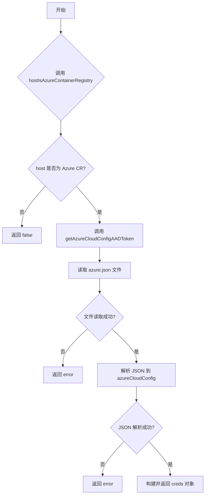
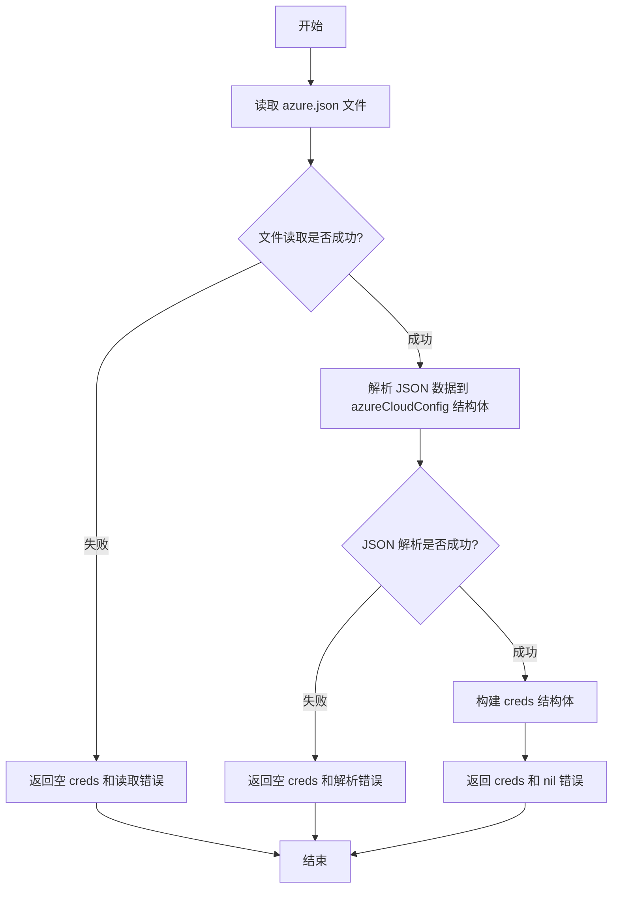
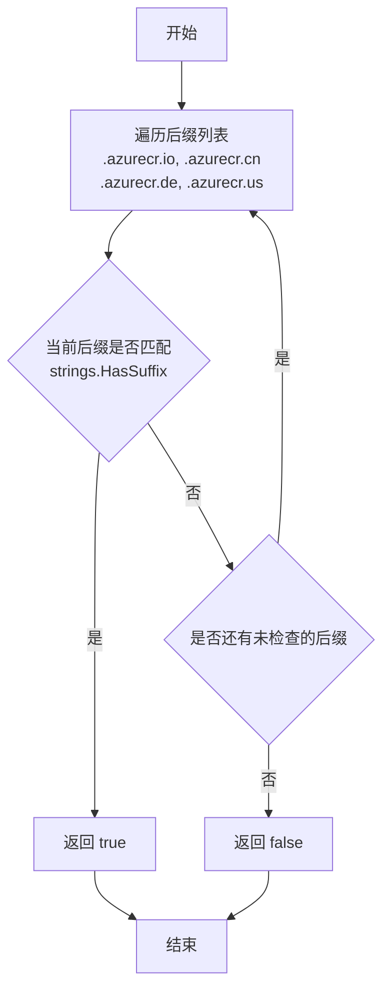

# `flux\pkg\registry\azure.go` 详细设计文档

该代码提供了从 Azure Kubernetes 配置文件 (azure.json) 中读取 Azure Active Directory 客户端凭证的功能，用于 Azure Container Registry 的身份认证。

## 整体流程



## 类结构

```
azureCloudConfig (结构体)
└── 字段: AADClientId, AADClientSecret
```

## 全局变量及字段


### `azureCloudConfigJsonFile`
    
Azure 配置文件路径 /etc/kubernetes/azure.json

类型：`const string`
    


### `azureCloudConfig.AADClientId`
    
Azure Active Directory 客户端 ID

类型：`string`
    


### `azureCloudConfig.AADClientSecret`
    
Azure Active Directory 客户端密钥

类型：`string`
    


### `creds (隐式引用).registry`
    
容器注册表主机名

类型：`string`
    


### `creds (隐式引用).provenance`
    
凭证来源

类型：`string`
    


### `creds (隐式引用).username`
    
用户名

类型：`string`
    


### `creds (隐式引用).password`
    
密码

类型：`string`
    
    

## 全局函数及方法


### `getAzureCloudConfigAADToken`

该函数用于从 Azure Kubernetes 集群的 `/etc/kubernetes/azure.json` 配置文件中读取 Azure Active Directory (AAD) 的客户端 ID 和客户端密钥，返回可用于容器注册表认证的凭据信息。

参数：

- `host`：`string`，目标容器注册表的主机名，用于设置返回凭据的 registry 字段

返回值：`creds, error`，成功时返回包含注册表地址、出处标记、用户名（AAD 客户端 ID）和密码（AAD 客户端密钥）的凭据结构体，失败时返回空凭据和错误信息

#### 流程图



#### 带注释源码

```go
// Fetch Azure Active Directory clientid/secret pair from azure.json, usable for container registry authentication.
//
// Note: azure.json is populated by AKS/AKS-Engine script kubernetesconfigs.sh. The file is then passed to kubelet via
// --azure-container-registry-config=/etc/kubernetes/azure.json, parsed by kubernetes/kubernetes' azure_credentials.go
// https://github.com/kubernetes/kubernetes/issues/58034 seeks to deprecate this kubelet command-line argument, possibly
// replacing it with managed identity for the Node VMs. See https://github.com/Azure/acr/blob/master/docs/AAD-OAuth.md
func getAzureCloudConfigAADToken(host string) (creds, error) {
    // 步骤1: 读取 Azure 配置文件 azure.json
    // 该文件默认路径为 /etc/kubernetes/azure.json，包含 AKS 集群的云配置信息
	jsonFile, err := ioutil.ReadFile(azureCloudConfigJsonFile)
	if err != nil {
        // 文件读取失败时，返回空凭据和错误信息
		return creds{}, err
	}

    // 步骤2: 定义用于解析 JSON 的结构体
    // azureCloudConfig 结构体仅包含 AAD 认证所需的两个字段
	var token azureCloudConfig

    // 步骤3: 解析 JSON 数据
	err = json.Unmarshal(jsonFile, &token)
	if err != nil {
        // JSON 解析失败时，返回空凭据和错误信息
		return creds{}, err
	}

    // 步骤4: 构建并返回凭据结构体
    // - registry: 传入的主机名参数，表示目标注册表地址
    // - provenance: 标识凭据来源为 azure.json 配置文件
    // - username: AAD 客户端 ID (aadClientId)
    // - password: AAD 客户端密钥 (aadClientSecret)
	return creds{
		registry:   host,
		provenance: "azure.json",
		username:   token.AADClientId,
		password:   token.AADClientSecret}, nil
}
```


### `hostIsAzureContainerRegistry`

判断给定的主机名（host）是否为 Azure Container Registry（ACR）的域名。该函数通过检查主机名是否以 Azure Container Registry 的已知后缀（.azurecr.io、.azurecr.cn、.azurecr.de、.azurecr.us）之一结尾来做出判断。

参数：

- `host`：`string`，要检查的主机名或域名

返回值：`bool`，如果主机名是 Azure Container Registry 的域名则返回 `true`，否则返回 `false`

#### 流程图



#### 带注释源码

```go
// hostIsAzureContainerRegistry 判断给定的 host 是否为 Azure Container Registry
//
// 参数:
//   - host: string 类型，要检查的主机名或域名
//
// 返回值:
//   - bool: 如果 host 是 Azure Container Registry 的域名返回 true，否则返回 false
//
// 实现逻辑:
//   遍历预定义的 Azure Container Registry 后缀列表，检查 host 是否以其中任意一个后缀结尾
//   支持的中国区、欧洲区、美国区 Azure Container Registry
func hostIsAzureContainerRegistry(host string) bool {
    // 定义 Azure Container Registry 的所有已知后缀
    // .azurecr.io: 全球版
    // .azurecr.cn: 中国区
    // .azurecr.de: 欧洲区
    // .azurecr.us: 美国区
    for _, v := range []string{".azurecr.io", ".azurecr.cn", ".azurecr.de", ".azurecr.us"} {
        // 使用 strings.HasSuffix 检查 host 是否以当前后缀结尾
        if strings.HasSuffix(host, v) {
            // 匹配成功，返回 true
            return true
        }
    }
    // 遍历完所有后缀均未匹配，返回 false
    return false
}
```

## 关键组件


### Azure云配置结构体 (azureCloudConfig)

用于存储从azure.json文件解析的Azure Active Directory客户端ID和客户端密钥的结构体，包含AADClientId和AADClientSecret两个字段。

### AAD令牌获取函数 (getAzureCloudConfigAADToken)

从/etc/kubernetes/azure.json文件读取Azure云配置，解析AAD客户端ID和密钥，返回可用于容器注册表认证的凭证对象。

### Azure注册表主机识别函数 (hostIsAzureContainerRegistry)

检查给定的主机名字符串是否属于Azure容器注册表，通过检查后缀是否为.azurecr.io、.azurecr.cn、.azurecr.de或.azurecr.us。

### Azure配置文件路径常量

定义了Azure云配置JSON文件的路径常量"/etc/kubernetes/azure.conf"，用于指定从主机挂载的Kubernetes Azure配置文件位置。


## 问题及建议


### 已知问题

- **错误处理不够细化**：文件读取和JSON解析错误直接返回原始错误，缺少上下文信息，难以定位问题根因
- **缺少输入验证**：对host参数没有进行空值或非法格式检查
- **硬编码配置路径**：Azure配置文件路径`/etc/kubernetes/azure.json`硬编码在常量中，缺乏灵活性
- **无缓存机制**：每次调用`getAzureCloudConfigAADToken`都会读取并解析文件，无缓存策略，性能开销较大
- **使用已废弃API**：`io/ioutil.ReadFile`在Go 1.16+已被废弃，应使用`os.ReadFile`
- **缺少日志记录**：没有任何日志输出，难以追踪运行状态和调试问题
- **缺少Context支持**：函数没有接受context参数，无法实现超时控制和取消操作
- **硬编码注册表后缀**：Azure容器注册表后缀列表硬编码在`hostIsAzureContainerRegistry`函数中，扩展性差
- **敏感信息明文处理**：凭据在内存中以明文形式处理，缺乏加密或清理机制
- **缺少单元测试**：代码没有对应的测试文件

### 优化建议

- 引入context.Context参数支持超时和取消，添加结构化日志记录
- 使用`os.ReadFile`替代`io/ioutil.ReadFile`，或使用`os.Open`配合流式读取
- 实现配置缓存机制（如sync.Once或LRU缓存），避免重复读取文件
- 将注册表后缀列表提取为配置或使用正则表达式匹配
- 添加输入参数校验，包括文件存在性检查、权限检查、JSON格式验证
- 考虑使用sync.Mutex保护文件读取操作，防止并发问题
- 添加凭据加密存储和内存清理机制（使用后覆写敏感数据）
- 将配置路径设计为可配置的选项，支持不同环境
- 补充单元测试覆盖主要功能路径

## 其它


### 设计目标与约束

本模块的核心目标是从Azure云配置文件（azure.json）中提取AAD客户端ID和客户端密钥，为容器注册表认证提供凭证。主要约束包括：1）仅支持Azure Container Registry（ACR）的域名后缀识别（.azurecr.io, .azurecr.cn, .azurecr.de, .azurecr.us）；2）依赖于Azure Kubernetes Service（AKS）或AKS-Engine生成的配置文件；3）遵循Kubernetes社区对kubelet凭证提供程序的现有设计模式。

### 错误处理与异常设计

代码采用Go语言的错误返回机制。getAzureCloudConfigAADToken函数在两种情况下返回错误：1）文件读取失败（ioutil.ReadFile错误）；2）JSON解析失败（json.Unmarshal错误）。当前实现将底层错误直接透传，未进行错误上下文包装或重试机制。建议增强错误处理：添加文件路径不存在、权限不足、JSON格式错误等具体错误类型的区分处理。

### 外部依赖与接口契约

本包依赖以下外部组件：1）Azure配置文件（/etc/kubernetes/azure.json），由AKS/AKS-Engine在节点初始化时生成；2）Go标准库包：encoding/json、io/ioutil、strings；3）调用方需传入符合ACR域名规则的host参数。接口契约要求调用方先通过hostIsAzureContainerRegistry函数验证host是否属于Azure Container Registry，再调用getAzureCloudConfigAADToken获取凭证。

### 配置管理

配置文件路径定义为常量azureCloudConfigJsonFile = "/etc/kubernetes/azure.json"，该路径在Kubernetes节点上由kubelet通过--azure-container-registry-config参数指定。配置内容包含AADClientId和AADClientSecret两个必需字段，采用JSON格式存储。建议在文档中明确说明配置文件的所有权（由云提供商管理）和更新机制（节点重启或配置映射更新）。

### 安全性考虑

当前实现存在以下安全风险：1）明文存储AADClientSecret在本地文件系统；2）文件读取操作无权限验证；3）凭证以明文形式在内存中传递。建议优化方向：1）考虑使用Azure Managed Identity替代静态凭证；2）添加文件权限检查（建议600或400）；3）凭证使用后及时清理内存；4）添加TLS传输层安全保障。

### 性能考虑

当前实现每次调用都会读取并解析JSON文件，无缓存机制。在高频调用场景下，建议引入内存缓存或文件系统缓存，避免重复IO操作。JSON解析部分可考虑使用jsoniter等高性能解析库优化。

### 兼容性和版本管理

代码兼容Kubernetes 1.6及以上版本（对应Azure凭证提供程序引入时期）。需注意：1）Azure中国区（.azurecr.cn）、德国区（.azurecr.de）、美国政府区（.azurecr.us）的域名支持；2）Kubernetes社区正在讨论废弃--azure-container-registry-config参数，未来可能转向Managed Identity模式，建议关注Kubernetes社区动态。

### 测试策略

建议添加以下测试用例：1）正常路径测试：有效的azure.json文件解析；2）异常路径测试：文件不存在、JSON格式错误、字段缺失、权限不足；3）域名识别测试：各种ACR域名后缀的正向和反向测试；4）模糊测试：异常输入的鲁棒性测试。

### 部署和运维注意事项

部署时需确保：1）/etc/kubernetes/azure.json文件存在且格式正确；2）运行账户（如kubelet）具有文件读取权限；3）文件内容定期轮转（遵循Azure AD令牌生命周期）；4）监控错误日志以便及时发现配置问题。运维人员应注意Azure AD应用程序凭据的有效期，及时更新azure.json文件。

### 备选方案和未来考虑

1）Managed Identity方案：Kubernetes社区正在推动使用VM Managed Identity替代静态凭证，届时可移除对azure.json的依赖；2）Secret Store CSI Driver：可考虑将凭证存储在Kubernetes Secret中管理；3）外部凭证提供者：支持Azure Key Vault等企业级凭证管理方案；4）云厂商无关的凭证抽象：参考Kubernetes Credential Provider API，设计可扩展的插件机制支持多云厂商。

    