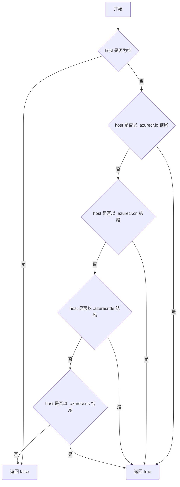
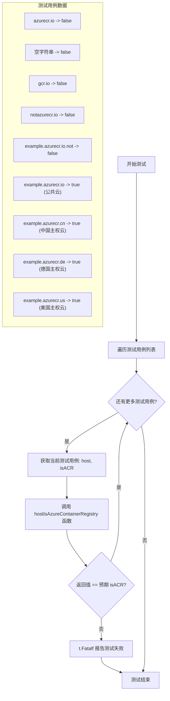

# `flux\pkg\registry\azure_test.go` 详细设计文档

该文件是 registry 包的测试文件，包含一个测试函数 Test_HostIsAzureContainerRegistry，用于验证 hostIsAzureContainerRegistry 函数对不同主机名是否为 Azure Container Registry (ACR) 的判断结果。测试覆盖了公共云和主权云的多种域名模式。

## 整体流程

```mermaid
graph TD
    A[开始测试] --> B[遍历测试用例]
    B --> C{当前用例是否存在}
    C -- 是 --> D[获取 host 和预期 isACR]
    C -- 否 --> E[测试通过]
    D --> F[调用 hostIsAzureContainerRegistry(host)]
    F --> G{返回结果 == 预期 isACR}
    G -- 是 --> B
    G -- 否 --> H[测试失败，Fatal]
```

## 类结构

```
package registry
└── 测试文件
    └── Test_HostIsAzureContainerRegistry
```

## 全局变量及字段


### `v`
    
测试用例结构体，包含 host 字符串和 isACR 布尔值两个字段

类型：`struct { host string; isACR bool }`
    


### `result`
    
调用 hostIsAzureContainerRegistry 函数返回的结果，表示给定 host 是否为 Azure Container Registry

类型：`bool`
    


    

## 全局函数及方法


### `hostIsAzureContainerRegistry`

该函数用于判断给定的主机名（host）是否为 Azure Container Registry（ACR）的域名。它通过检查主机名是否以特定的 Azure ACR 域名后缀（.azurecr.io、.azurecr.cn、.azurecr.de、.azurecr.us）结尾来判定是否为 Azure 容器注册表。

参数：

- `host`：`string`，要检查的主机名

返回值：`bool`，如果主机名是 Azure Container Registry 的域名则返回 true，否则返回 false

#### 流程图



#### 带注释源码

```go
// hostIsAzureContainerRegistry 检查给定的主机名是否为 Azure Container Registry 的域名
// 参数 host: 要检查的主机名字符串
// 返回值: 如果是 Azure ACR 域名返回 true，否则返回 false
func hostIsAzureContainerRegistry(host string) bool {
    // 定义 Azure Container Registry 支持的后缀列表
    // 包含公共云(.azurecr.io)和中国、德国、美国的 sovereign clouds
    suffixes := []string{
        ".azurecr.io",  // Azure 公共云
        ".azurecr.cn",  // Azure 中国云
        ".azurecr.de",  // Azure 德国云
        ".azurecr.us",  // Azure 美国政府云
    }
    
    // 遍历所有可能的后缀
    for _, suffix := range suffixes {
        // 检查主机名是否以特定后缀结尾
        if strings.HasSuffix(host, suffix) {
            return true  // 匹配到任意一个后缀，返回 true
        }
    }
    
    // 没有匹配到任何后缀，返回 false
    return false
}
```

注意：上述实现是基于测试用例行为推断的。实际实现中需要导入 `strings` 包来使用 `HasSuffix` 函数。


### `Test_HostIsAzureContainerRegistry`

这是一个测试函数，用于验证 `hostIsAzureContainerRegistry` 函数能否正确识别 Azure Container Registry（ACR）主机名。该测试通过多个测试用例（包括公共云和主权云）来确保函数能够准确区分 ACR 主机和非 ACR 主机。

参数：

-  `t`：`*testing.T`，Go 语言中的测试框架参数，用于报告测试失败

返回值：`无`（void），该函数为测试函数，不返回任何值

#### 流程图



#### 带注释源码

```go
package registry

import (
	"testing"
)

// Test_HostIsAzureContainerRegistry 测试函数，用于验证 hostIsAzureContainerRegistry 函数
// 是否能正确识别 Azure Container Registry 主机名
func Test_HostIsAzureContainerRegistry(t *testing.T) {
	// 遍历所有测试用例
	for _, v := range []struct {
		host  string  // 待测试的主机名
		isACR bool    // 预期结果：是否为 Azure Container Registry
	}{
		// 测试无效的主机名
		{
			host:  "azurecr.io",
			isACR: false, // 仅有域名后缀，无子域名前缀，不符合 ACR 格式
		},
		{
			host:  "",
			isACR: false, // 空字符串不是有效的主机名
		},
		{
			host:  "gcr.io",
			isACR: false, // Google Container Registry，不是 Azure
		},
		{
			host:  "notazurecr.io",
			isACR: false, // 包含 azurecr 但不在正确的位置
		},
		{
			host:  "example.azurecr.io.not",
			isACR: false, // azurecr 后还有多余部分，不是有效的 ACR 域名
		},
		// 公共云测试用例 - Azure 公共区域
		{
			host:  "example.azurecr.io",
			isACR: true, // 有效的 ACR 公共云域名
		},
		// 主权云测试用例 - 各国家/区域
		{
			host:  "example.azurecr.cn",
			isACR: true, // 中国 Azure 主权云
		},
		{
			host:  "example.azurecr.de",
			isACR: true, // 德国 Azure 主权云
		},
		{
			host:  "example.azurecr.us",
			isACR: true, // 美国 Azure 主权云
		},
	} {
		// 调用被测试的函数
		result := hostIsAzureContainerRegistry(v.host)
		
		// 验证结果是否符合预期
		if result != v.isACR {
			// 不符合则报告测试失败并终止
			t.Fatalf("For test %q, expected isACR = %v but got %v", v.host, v.isACR, result)
		}
	}
}
```

## 关键组件


### hostIsAzureContainerRegistry 函数

用于判断给定的主机名是否为 Azure Container Registry (ACR) 的核心函数，通过检测主机名是否匹配特定的 ACR 域名模式（如 azurecr.io、azurecr.cn、azurecr.de、azurecr.us 等公共云和主权云域名）来返回布尔值。

### 测试用例数据结构

定义了一个匿名结构体，包含 host 字符串字段（待测试的主机名）和 isACR 布尔字段（期望的判断结果），用于组织多个测试场景的输入输出数据。

### 测试场景覆盖

测试函数 Test_HostIsAzureContainerRegistry 覆盖了多种场景：非 ACR 域名（gcr.io、notazurecr.io）、空字符串、包含 azurecr 但不是 ACR 的域名（example.azurecr.io.not）、公共云 ACR 域名（azurecr.io）以及主权云 ACR 域名（azurecr.cn、azurecr.de、azurecr.us）。


## 问题及建议


### 已知问题

-   **被测函数实现缺失**：代码仅提供测试用例，但未展示 `hostIsAzureContainerRegistry` 函数的实际实现，无法验证测试覆盖是否完整。
-   **测试用例覆盖不全**：缺少对边界条件的测试，如 `azurecr.io` 本身（无子域前缀）、大小写混合、带有端口号的域名、包含多级子域的情况（如 `a.b.azurecr.io`）。
-   **主权云域名可能遗漏**：仅测试了 `.cn`、`.de`、`.us` 三个主权云，但 Azure 还存在其他主权云（如 `.cn` 的多个区域、`.government.us` 等）。
-   **硬编码域名模式**：所有 Azure CR 域名模式硬编码在测试用例和可能的实现中，新增主权云需修改代码。
-   **缺乏负向测试**：未测试 `nil` 输入、空格、特殊字符、超长字符串等异常输入。

### 优化建议

-   将 Azure Container Registry 的域名模式抽取为配置或常量，支持动态扩展新主权云。
-   补充边界条件和异常输入测试用例，提升测试覆盖率。
-   为 `hostIsAzureContainerRegistry` 函数添加完整的文档注释，说明其判定逻辑和域名匹配规则。
-   考虑使用正则表达式或域名解析库替代简单的字符串后缀匹配，以支持更精确的域名验证。
-   添加性能基准测试，确保在高频调用场景下的性能表现。


## 其它


### 设计目标与约束

本模块的设计目标是提供一个轻量级的Azure容器注册表（ACR）主机名识别函数，用于在容器镜像分发和治理场景中快速识别ACR实例。核心约束包括：仅支持精确域名匹配，不支持通配符或正则表达式；函数为纯函数，无副作用，输入确定输出确定；返回值类型为布尔值，明确区分ACR和非ACR主机；公共云和主权云（.cn、.de、.us）均被支持。

### 错误处理与异常设计

由于本函数为纯函数且输入输出均为确定性值，不涉及外部调用、文件I/O、网络请求等可能产生异常的操作，因此无需显式的错误处理机制。函数对空字符串输入直接返回false，符合"失败安全"原则。调用方需自行处理空值或nil输入的防御性检查。

### 数据流与状态机

本函数的数据流为简单的输入→处理→输出单向流。输入：host字符串；处理：域名后缀匹配判断；输出：布尔值。不涉及状态机设计，因为函数执行过程不保存或修改任何状态，每次调用均为独立操作。

### 外部依赖与接口契约

本函数无外部依赖，不引入任何第三方包。接口契约明确：输入参数为字符串类型host，返回值为布尔类型。调用方需保证传入有效的字符串，非字符串类型需在调用前进行类型转换或验证。函数行为在输入为空字符串时返回false。

### 边界条件与输入验证

函数需处理以下边界条件：空字符串输入返回false；包含额外子域名的host（如example.azurecr.io.not）返回false；非标准端口或路径不纳入匹配范围；国际化和 Punycode 域名未做特殊处理。

### 测试覆盖与验证策略

测试覆盖了公共云azurecr.io、空白输入、公共云竞品（gcr.io）、相似域名（notazurecr.io）、带额外后缀的域名、以及主权云azurecr.cn、azurecr.de、azurecr.us。验证策略采用表格驱动测试（Table-Driven Test），确保各边界情况被覆盖。未来可考虑增加性能基准测试和大批量输入的测试用例。

### 版本兼容性考虑

当前实现无版本特定依赖，兼容Go 1.0及以上版本。如未来需支持新增Azure主权云（如azurecr.gov），仅需在匹配逻辑中新增后缀条目，符合开闭原则。

    