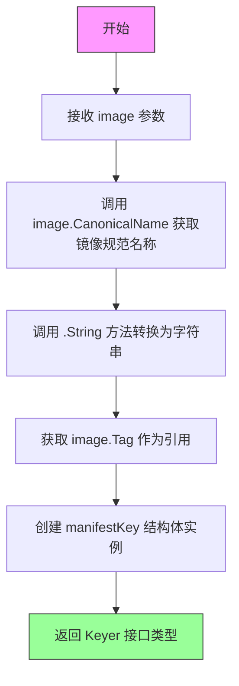
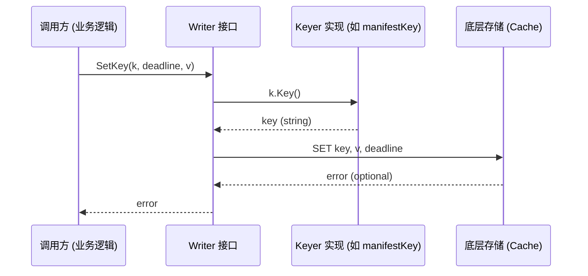
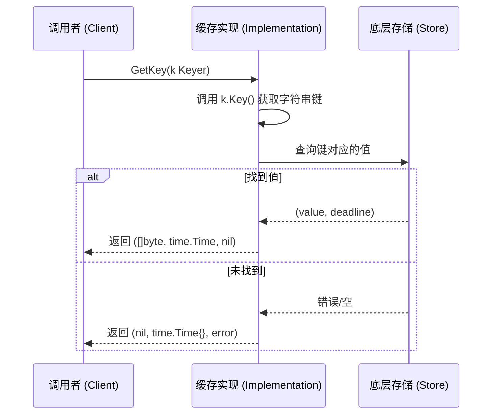
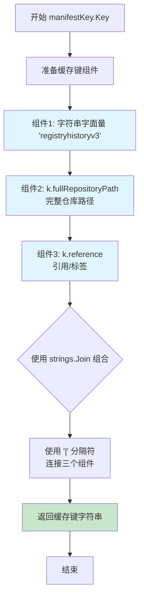
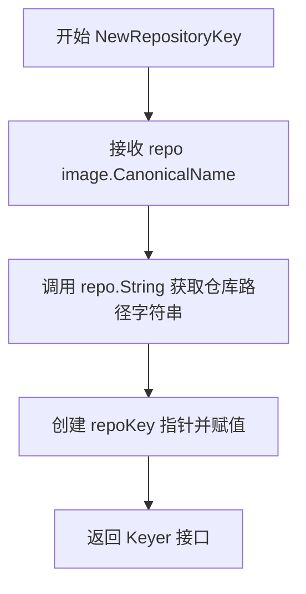

# `flux\pkg\registry\cache\cache.go` 详细设计文档

一个Go语言缓存包，提供用于容器镜像仓库元数据缓存的键生成接口和实现，通过版本化的键格式区分不同的缓存数据类型（manifest和repository）。

## 整体流程

```mermaid
graph TD
    A[开始] --> B[外部调用NewManifestKey或NewRepositoryKey]
B --> C{创建哪种Keyer?}
C -->|manifestKey| D[NewManifestKey传入image.CanonicalRef]
C -->|repoKey| E[NewRepositoryKey传入image.CanonicalName]
D --> F[创建manifestKey结构体实例]
E --> G[创建repoKey结构体实例]
F --> H[调用Key方法生成缓存键]
G --> H
H --> I[返回格式化的缓存键字符串]
I --> J[格式: registryhistoryv3|fullPath|tag 或 registryrepov4|fullPath]
```

## 类结构

```
cache (包)
├── Interfaces (接口定义)
│   ├── Reader (缓存读取接口)
│   ├── Writer (缓存写入接口)
│   ├── Client (Reader + Writer 组合接口)
│   └── Keyer (键生成器接口)
└── Structs (结构体实现)
    ├── manifestKey (镜像清单缓存键)
    └── repoKey (仓库缓存键)
```

## 全局变量及字段


### `manifestKey.fullRepositoryPath`
    
完整仓库路径

类型：`string`
    


### `manifestKey.reference`
    
镜像引用/标签

类型：`string`
    


### `repoKey.fullRepositoryPath`
    
完整仓库路径

类型：`string`
    
    

## 全局函数及方法


### `NewManifestKey`

该函数用于创建 `manifestKey` 实例，接收一个镜像的规范引用（包含镜像名称和标签），返回一个实现了 `Keyer` 接口的 `manifestKey` 对象，用于在缓存系统中生成唯一的键值，以便存储和检索镜像的 manifest 数据。

参数：

- `image`：`image.CanonicalRef`，需要进行缓存的镜像规范引用，包含镜像的仓库路径和标签信息

返回值：`Keyer`，返回 `manifestKey` 实例的接口类型，该接口定义了 `Key()` 方法用于生成缓存键

#### 流程图



#### 带注释源码

```go
// NewManifestKey 创建一个 manifestKey 实例
// 参数 image: 镜像的规范引用，包含镜像名称和标签
// 返回值: 实现了 Keyer 接口的 manifestKey 指针
func NewManifestKey(image image.CanonicalRef) Keyer {
    // 使用镜像的规范名称（CanonicalName）作为完整仓库路径
    // 使用镜像的 Tag 作为引用
    return &manifestKey{image.CanonicalName().String(), image.Tag}
}
```


### `NewRepositoryKey`

创建 `repoKey` 实例，用于生成缓存键。该函数接收一个镜像规范名称，返回实现 `Keyer` 接口的 `repoKey` 实例，以便后续生成缓存键字符串。

参数：

- `repo`：`image.CanonicalName`，镜像的规范名称，用于构建缓存键

返回值：`Keyer`，返回实现了 `Keyer` 接口的 `repoKey` 实例，用于生成缓存键

#### 流程图

```mermaid
flowchart TD
    A[开始] --> B[接收 repo: image.CanonicalName]
    B --> C[调用 repo.String 获取仓库路径字符串]
    C --> D[创建 repoKey 实例]
    D --> E[设置 fullRepositoryPath 字段]
    E --> F[返回实现 Keyer 接口的 repoKey 实例]
    
    G[调用 Key 方法时] --> H[使用 strings.Join 拼接缓存键]
    H --> I[格式: registryrepov4|{fullRepositoryPath}]
    I --> J[返回缓存键字符串]
```

#### 带注释源码

```go
// NewRepositoryKey 创建 repoKey 实例，用于生成缓存键
// 参数 repo: image.CanonicalName 类型，代表镜像的规范名称
// 返回: 实现 Keyer 接口的 repoKey 实例
func NewRepositoryKey(repo image.CanonicalName) Keyer {
    // 调用 repo.String() 方法获取仓库路径的字符串表示
    // 创建一个新的 repoKey 指针实例，传入仓库路径字符串
    return &repoKey{repo.String()}
}
```

#### 相关类型定义

```go
// repoKey 结构体，用于存储仓库路径信息
type repoKey struct {
    fullRepositoryPath string  // 完整的仓库路径
}

// Key 方法实现 Keyer 接口，返回缓存键字符串
// 返回格式: "registryrepov4|{fullRepositoryPath}"
func (k *repoKey) Key() string {
    return strings.Join([]string{
        "registryrepov4",        // 缓存格式版本号，变更时需递增
        k.fullRepositoryPath,   // 仓库完整路径
    }, "|")
}
```


### `Reader.GetKey`

获取指定键对应的缓存值，同时返回该值的刷新截止时间。

参数：

- `k`：`Keyer`，键接口，用于生成缓存键

返回值：

- `[]byte`，缓存的值字节数组
- `time.Time`，缓存的刷新截止时间
- `error`，操作过程中的错误信息

#### 流程图

```mermaid
flowchart TD
    A[开始 GetKey] --> B{验证 Keyer 参数}
    B -->|参数无效| C[返回参数错误]
    B -->|参数有效| D[调用 k.Key 生成缓存键]
    D --> E{检查缓存键是否存在}
    E -->|键不存在| F[返回 nil 值和错误]
    E -->|键存在| G[从缓存存储读取数据]
    G --> H{数据读取是否成功}
    H -->|失败| I[返回读取错误]
    H -->|成功| J[解析返回值: []byte, time.Time]
    J --> K[返回缓存值和时间戳]
    F --> K
    I --> K
```

#### 带注释源码

```go
type Reader interface {
    // GetKey gets the value at a key, along with its refresh deadline
    // GetKey 获取指定键对应的缓存值，同时返回该值的刷新截止时间
    // 参数:
    //   - k Keyer: 键接口，用于生成缓存键
    //
    // 返回值:
    //   - []byte: 缓存的值
    //   - time.Time: 缓存的刷新截止时间
    //   - error: 操作错误
    GetKey(k Keyer) ([]byte, time.Time, error)
}
```

---

**关联类型说明**

| 类型 | 名称 | 描述 |
|------|------|------|
| 接口 | `Keyer` | 缓存键生成接口，包含 `Key()` 方法 |
| 结构体 | `manifestKey` | Manifest 缓存键实现，格式为 `registryhistoryv3\|仓库路径\|标签` |
| 结构体 | `repoKey` | Repository 缓存键实现，格式为 `registryrepov4\|仓库路径` |
| 函数 | `NewManifestKey` | 创建 Manifest 缓存键 |
| 函数 | `NewRepositoryKey` | 创建 Repository 缓存键 |


### `Writer.SetKey`

描述：定义了缓存写入的契约接口方法。该方法接收一个实现了 `Keyer` 接口的对象（用于生成缓存键）、一个过期截止时间（`deadline`）以及待缓存的字节数据（`v`），并将它们存储到底层缓存系统中。如果存储操作失败，则返回相应的错误。

参数：

- `k`：`Keyer`，键值生成器。缓存系统通过调用其 `Key()` 方法获取存储用的字符串键名。
- `deadline`：`time.Time`，刷新截止时间。指示缓存在该时间点后需要刷新或被视为过期。
- `v`：`[]byte`，待缓存的值。为二进制数据切片。

返回值：`error`，操作结果错误。如果写入成功返回 `nil`，如果底层存储（如 Redis、Memcached）发生连接错误、序列化失败或权限问题则返回具体错误。

#### 流程图



#### 带注释源码

```go
type Writer interface {
	// SetKey sets the value at a key, along with its refresh deadline
	// 参数 k: Keyer 接口，提供缓存键
	// 参数 deadline: time.Time，指定缓存过期时间
	// 参数 v: []byte，要缓存的数据
	// 返回值: error，写入失败时返回错误
	SetKey(k Keyer, deadline time.Time, v []byte) error
}
```


### `Client.GetKey`

描述：定义了在缓存客户端中检索键值对的接口方法。该方法接收一个实现了 `Keyer` 接口的对象，根据其生成的键查询缓存，并返回存储的字节数据、数据的刷新截止时间（deadline）以及可能的错误。若缓存未命中或发生读取错误，则返回 error。

参数：
- `k`：`Keyer`，一个封装了键生成逻辑的接口。调用方需提供实现了 `Key()` 方法的实例（如 `manifestKey` 或 `repoKey`）来获取存储键。

返回值：
- `[]byte`：缓存中存储的原始字节数据。如果键不存在，通常返回 nil。
- `time.Time`：该缓存条目的刷新截止时间。调用者应据此判断数据是否过期需重新获取。
- `error`：操作过程中发生的错误，例如连接失败、键不存在等。

#### 流程图



#### 带注释源码

```go
// Reader 接口定义了缓存的读取操作
type Reader interface {
	// GetKey gets the value at a key, along with its refresh deadline
	// 获取指定键的值，并附带其刷新截止时间
	GetKey(k Keyer) ([]byte, time.Time, error)
}

// Client 接口组合了 Reader 和 Writer，定义了完整的缓存客户端契约
type Client interface {
	Reader
	Writer
}

// Keyer 接口用于提供缓存键的生成逻辑
// An interface to provide the key under which to store the data
type Keyer interface {
	Key() string
}
```


### `Client.SetKey`

设置指定键的值及其刷新截止时间，属于缓存写入接口的核心方法。

参数：

- `k`：`Keyer`，键接口，提供缓存键的字符串表示
- `deadline`：`time.Time`，值的新刷新截止时间
- `v`：`[]byte`，要缓存的字节数组值

返回值：`error`，如果设置成功则返回 nil，否则返回错误信息

#### 流程图

```mermaid
flowchart TD
    A[开始 SetKey] --> B[验证参数 k 是否实现 Keyer 接口]
    B --> C{验证是否通过}
    C -->|否| D[返回错误: 无效的 Keyer]
    C -->|是| E[调用 k.Key() 获取缓存键字符串]
    E --> F[将值 v 与截止时间 deadline 关联存储]
    F --> G{存储是否成功}
    G -->|否| H[返回存储错误]
    G -->|是| I[返回 nil 表示成功]
```

#### 带注释源码

```go
// Writer 接口定义了缓存写入能力
type Writer interface {
    // SetKey 设置指定键的值及其刷新截止时间
    // 参数:
    //   - k: Keyer 类型,提供缓存键的生成逻辑
    //   - deadline: time.Time 类型,指定该值的刷新截止时间
    //   - v: []byte 类型,要存储的字节数据
    // 返回值:
    //   - error: 操作失败时返回错误,成功时返回 nil
    SetKey(k Keyer, deadline time.Time, v []byte) error
}

// Client 接口组合了 Reader 和 Writer
// 继承自 Reader 和 Writer 两个接口
type Client interface {
    Reader
    Writer
}

// Keyer 接口用于提供缓存键
// 实现者需要提供 Key() 方法返回唯一键字符串
type Keyer interface {
    Key() string
}

// 示例: manifestKey 实现 Keyer 接口
// 用于生成镜像清单的缓存键
type manifestKey struct {
    fullRepositoryPath, reference string
}

// NewManifestKey 构造函数创建 manifestKey 实例
func NewManifestKey(image image.CanonicalRef) Keyer {
    return &manifestKey{image.CanonicalName().String(), image.Tag}
}

// Key 返回格式化的缓存键字符串
// 键格式: "registryhistoryv3|仓库完整路径|标签"
func (k *manifestKey) Key() string {
    return strings.Join([]string{
        "registryhistoryv3", // Bump the version number if the cache format changes
        k.fullRepositoryPath,
        k.reference,
    }, "|")
}
```

#### 关键组件信息

| 名称 | 一句话描述 |
|------|-----------|
| `Writer` | 定义缓存写入操作的接口，包含 SetKey 方法 |
| `Client` | 组合 Reader 和 Writer 的缓存客户端接口 |
| `Keyer` | 提供缓存键生成能力的接口 |

#### 潜在技术债务与优化空间

1. **接口实现缺失**：当前代码仅定义了接口，未提供具体实现，建议补充 memcached/redis 等缓存客户端的实现
2. **键版本管理硬编码**：键版本号（如 "registryhistoryv3"）直接写在代码中，建议抽取为配置项
3. **错误类型泛化**：返回值仅为通用 error，建议定义具体错误类型以支持更精细的错误处理

#### 其它说明

- **设计目标**：通过 Keyer 接口解耦缓存键的生成逻辑，支持不同资源类型使用不同的键策略
- **约束**：缓存键必须唯一，fullRepositoryPath 需包含完整路径以避免不同 registry 间的键冲突
- **外部依赖**：依赖 `github.com/fluxcd/flux/pkg/image` 包提供镜像引用类型


### `manifestKey.Key()`

返回用于缓存的键字符串，将仓库路径和引用组合成一个唯一的标识符。

参数：此方法没有参数（接收者为 `*manifestKey`）

返回值：`string`，返回格式化的缓存键，格式为 `"registryhistoryv3|完整仓库路径|引用"`

#### 流程图

```mermaid
flowchart TD
    A[开始 Key] --> B[定义版本前缀 'registryhistoryv3']
    B --> C[获取 fullRepositoryPath]
    C --> D[获取 reference]
    D --> E[使用 strings.Join 组合]
    E --> F[返回格式: version|path|ref]
```

#### 带注释源码

```go
// Key 返回缓存键
// 格式: "registryhistoryv3|完整仓库路径|引用"
// 版本号 "v3" 用于标识缓存格式，格式变化时需递增
func (k *manifestKey) Key() string {
    return strings.Join([]string{
        "registryhistoryv3", // Bump the version number if the cache format changes
        k.fullRepositoryPath,
        k.reference,
    }, "|")
}
```

---

### `repoKey.Key()`

返回仓库级别的缓存键字符串。

参数：此方法没有参数（接收者为 `*repoKey`）

返回值：`string`，返回格式化的缓存键，格式为 `"registryrepov4|完整仓库名"`

#### 流程图

```mermaid
flowchart TD
    A[开始 Key] --> B[定义版本前缀 'registryrepov4']
    B --> C[获取 fullRepositoryPath]
    C --> D[使用 strings.Join 组合]
    D --> E[返回格式: version|path]
```

#### 带注释源码

```go
// Key 返回缓存键
// 格式: "registryrepov4|完整仓库名"
// 版本号 "v4" 用于标识缓存格式，格式变化时需递增
func (k *repoKey) Key() string {
    return strings.Join([]string{
        "registryrepov4", // Bump the version number if the cache format changes
        k.fullRepositoryPath,
    }, "|")
}
```


### `manifestKey.Key`

生成 manifest 缓存键，将仓库完整路径和引用（标签）组合成一个唯一的缓存键字符串，用于在缓存系统中存储和检索镜像清单数据。

参数：

- `k`：`*manifestKey`，接收者，指向 manifestKey 结构体的指针，包含 `fullRepositoryPath`（完整仓库路径）和 `reference`（引用/标签）字段

返回值：`string`，返回格式为 `registryhistoryv3|仓库路径|标签` 的缓存键字符串

#### 流程图



#### 带注释源码

```go
// Key 方法实现 Keyer 接口，生成 manifest 缓存键
// 返回格式: "registryhistoryv3|仓库完整路径|引用"
// 其中 "registryhistoryv3" 是缓存格式版本号，变更时需要递增
func (k *manifestKey) Key() string {
	// 使用 strings.Join 将三个组件用 "|" 分隔符连接成缓存键
	// 格式说明:
	//   - "registryhistoryv3": 缓存格式版本标识，变更缓存结构时需递增版本号
	//   - k.fullRepositoryPath: 镜像的完整仓库路径，如 "docker.io/library/nginx"
	//   - k.reference: 镜像的标签或 digest 引用，如 "latest" 或 "sha256:abc123"
	return strings.Join([]string{
		"registryhistoryv3", // Bump the version number if the cache format changes
		k.fullRepositoryPath,
		k.reference,
	}, "|")
}
```


### `repoKey.Key()`

生成 repository 缓存键，用于在缓存中唯一标识镜像仓库。该方法将仓库名称与版本前缀拼接成缓存键，以支持缓存的读写操作。

参数：无

返回值：`string`，返回格式为 `"registryrepov4|{fullRepositoryPath}"` 的缓存键字符串。

#### 流程图

```mermaid
flowchart TD
    A[开始 Key] --> B[定义字符串切片]
    B --> C[添加缓存版本标识 'registryrepov4']
    C --> D[添加仓库完整路径 fullRepositoryPath]
    D --> E{strings.Join}
    E --> F[返回用 '|' 分隔的缓存键]
```

#### 带注释源码

```go
// Key 返回缓存键，用于唯一标识该镜像仓库
// 缓存键格式：registryrepov4|{fullRepositoryPath}
// "registryrepov4" 是版本号，若缓存格式变更需递增
func (k *repoKey) Key() string {
    // 使用 "|" 作为分隔符拼接缓存键组件
    // 第一部分：缓存版本标识（用于缓存格式版本管理）
    // 第二部分：仓库完整路径
    return strings.Join([]string{
        "registryrepov4", // Bump the version number if the cache format changes
        k.fullRepositoryPath,
    }, "|")
}
```

---

### `NewRepositoryKey(repo image.CanonicalName) Keyer`

创建一个新的 `repoKey` 实例，用于生成仓库缓存键。

参数：

- `repo`：`image.CanonicalName`，仓库的规范名称

返回值：`Keyer`，返回实现 `Keyer` 接口的 `repoKey` 指针

#### 流程图



#### 带注释源码

```go
// NewRepositoryKey 构造函数，根据给定的仓库规范名称创建缓存键生成器
// 参数 repo: 仓库的规范名称（CanonicalName 类型）
// 返回值: 实现 Keyer 接口的 repoKey 指针
func NewRepositoryKey(repo image.CanonicalName) Keyer {
    // 将仓库名称转换为字符串后封装为 repoKey 结构体
    return &repoKey{repo.String()}
}
```

---

### `repoKey` 结构体

用于生成镜像仓库缓存键的结构体，实现了 `Keyer` 接口。

字段：

- `fullRepositoryPath`：`string`，仓库的完整路径（如 `docker.io/library/nginx`）

#### 带注释源码

```go
// repoKey 结构体用于生成仓库级别的缓存键
// 实现了 Keyer 接口的 Key() 方法
type repoKey struct {
    fullRepositoryPath string // 仓库完整路径字符串
}
```

## 关键组件


### Keyer接口
定义缓存键生成的抽象接口，规定了Key()方法用于获取存储数据的键名，使用完整的镜像路径作为memcache键以避免来自不同注册表的重复冲突。

### manifestKey结构体
镜像清单的缓存键实现，包含完整仓库路径和引用（tag），通过NewManifestKey构造函数创建，用于缓存Docker镜像清单数据。

### repoKey结构体
仓库级别的缓存键实现，仅包含完整仓库路径，通过NewRepositoryKey构造函数创建，用于缓存仓库元数据信息。

### 缓存键版本管理机制
在Key()方法中使用版本号后缀（registryhistoryv3、registryrepov4）标识缓存格式，注释明确说明格式变更时需递增版本号，用于实现缓存格式的向前兼容和版本控制。

### Reader接口
缓存读取抽象接口，定义GetKey方法接收Keyer参数，返回字节数组、刷新截止时间和错误，用于解耦缓存读取实现。

### Writer接口
缓存写入抽象接口，定义SetKey方法接收Keyer、截止时间和字节数组，用于解耦缓存写入实现。

### Client接口
组合Reader和Writer的复合接口，提供完整的缓存读写能力，遵循接口隔离原则便于单元测试和实现替换。


## 问题及建议


### 已知问题

-   **硬编码版本号**：缓存键中的版本号 `"registryhistoryv3"` 和 `"registryrepov4"` 采用硬编码方式，若缓存格式变更需要修改源码，缺乏灵活性
-   **缺少具体实现**：代码仅定义了 `Reader`、`Writer`、`Client` 接口，但没有提供任何具体实现类，无法直接使用
-   **字符串拼接性能**：使用 `strings.Join` 进行字符串拼接，在高频调用场景下相比 `strings.Builder` 可能存在性能开销
-   **缺乏错误上下文**：接口方法返回的错误类型为裸 `error`，缺少错误上下文信息，不利于问题排查
-   **无缓存过期处理**：虽然接口设计包含 `deadline` 参数，但未看到过期缓存的清理机制
-   **文档注释不足**：`manifestKey` 和 `repoKey` 结构体缺少注释说明，代码可维护性较低

### 优化建议

-   **抽离版本号为常量**：将缓存键版本号定义为包级常量或配置项，便于后续版本管理和配置化
-   **提供默认实现**：为 `Client` 接口提供默认实现类，或在包内附带内存缓存等基础实现
-   **使用 strings.Builder**：将字符串拼接改为 `strings.Builder`，提升高频场景下的性能
-   **定义自定义错误类型**：为缓存操作定义带有上下文信息的自定义错误类型，便于调用方精确处理
-   **添加缓存清理机制**：实现过期缓存的主动清理或被动淘汰策略
-   **补充结构体注释**：为 `manifestKey` 和 `repoKey` 等结构体添加文档注释，提升代码可读性


## 其它


### 设计目标与约束

该缓存模块的设计目标是提供一个通用的缓存接口，用于存储和检索Docker镜像的元数据（manifest和repository信息）。主要约束包括：1) 使用Keyer接口解耦缓存key的生成逻辑，允许不同类型的key实现；2) key格式包含版本号，便于未来缓存格式升级时进行版本管理；3) 缓存值与过期时间一起存储，支持自动刷新机制。

### 错误处理与异常设计

该模块定义了以下错误场景：1) 当Keyer实现无法生成有效key时，返回空字符串或nil；2) 缓存读写操作可能返回底层存储的错误；3) 时间解析错误会导致deadline处理异常。由于该模块仅为接口定义，具体的错误处理由实现类负责。接口方法通过返回error类型来传递错误信息，调用方应检查error是否为nil以确定操作是否成功。

### 数据流与状态机

数据流分为两类：1) **写流程**：调用方通过NewManifestKey或NewRepositoryKey创建Keyer对象，然后调用Client.SetKey写入缓存值和过期时间；2) **读流程**：调用方创建Keyer对象后，调用Client.GetKey获取缓存值和对应的刷新截止时间。状态机相对简单，主要状态包括：初始状态（key不存在）、缓存命中（返回数据）、缓存未命中（返回错误或nil）。缓存的有效性由deadline时间决定，超过deadline的数据应被视为过期。

### 外部依赖与接口契约

该模块依赖以下外部包：1) `strings`标准包用于字符串拼接生成cache key；2) `time`标准包用于处理过期时间；3) `github.com/fluxcd/flux/pkg/image`包中的CanonicalRef和CanonicalName类型。接口契约：1) Keyer实现必须保证Key()方法返回非空且唯一的字符串；2) Client实现必须保证GetKey和SetKey方法的线程安全性；3) deadline时间使用time.Time类型，表示缓存数据的刷新截止时间。

### 关键组件信息

- **Reader接口**：定义缓存读取能力，GetKey方法返回字节数组、过期时间和可能的错误
- **Writer接口**：定义缓存写入能力，SetKey方法接收Keyer、过期时间和字节数组
- **Client接口**：组合Reader和Writer，提供完整的缓存操作能力
- **Keyer接口**：抽象缓存key的生成逻辑，实现解耦
- **manifestKey结构体**：实现Keyer接口，用于生成Docker manifest的缓存key
- **repoKey结构体**：实现Keyer接口，用于生成repository元数据的缓存key

### 版本管理与迁移策略

缓存key中包含版本号前缀（"registryhistoryv3"和"registryrepov4"），这是为了在缓存格式变化时能够区分不同版本的缓存数据。当需要升级缓存格式时，应：1) 更新版本号（如从v3升级到v4）；2) 在迁移期间保留旧版本数据的读取逻辑；3) 逐步将旧数据迁移到新格式；4) 在确认迁移完成后移除旧版本支持代码。

### 并发安全考虑

虽然当前代码未直接实现并发控制机制，但接口设计应考虑并发安全：1) Client实现类应确保GetKey和SetKey方法是线程安全的；2) 可以使用互斥锁或读写锁保护共享状态；3) 在高并发场景下，应考虑使用原子操作或无锁数据结构提升性能。

### 性能优化建议

当前实现使用strings.Join进行key拼接，可以考虑：1) 使用strings.Builder减少字符串分配；2) 对于高频访问的key，可以考虑缓存Keyer对象避免重复创建；3) 在Keyer实现中预计算key字符串，避免每次调用Key()都进行字符串拼接。


    