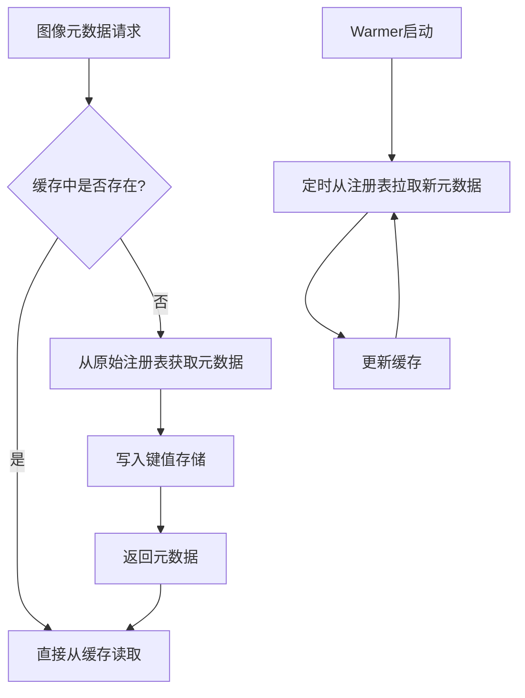
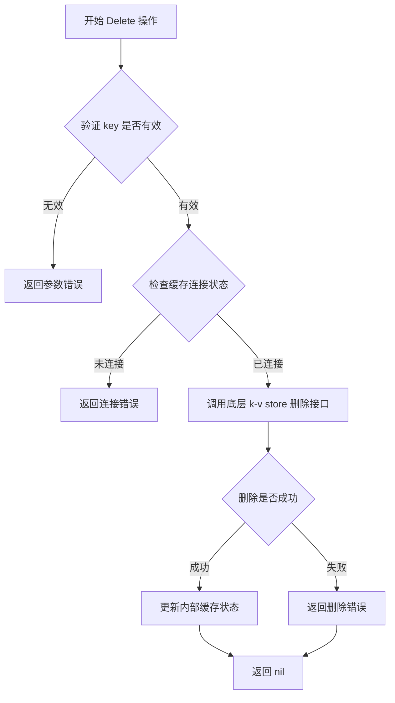
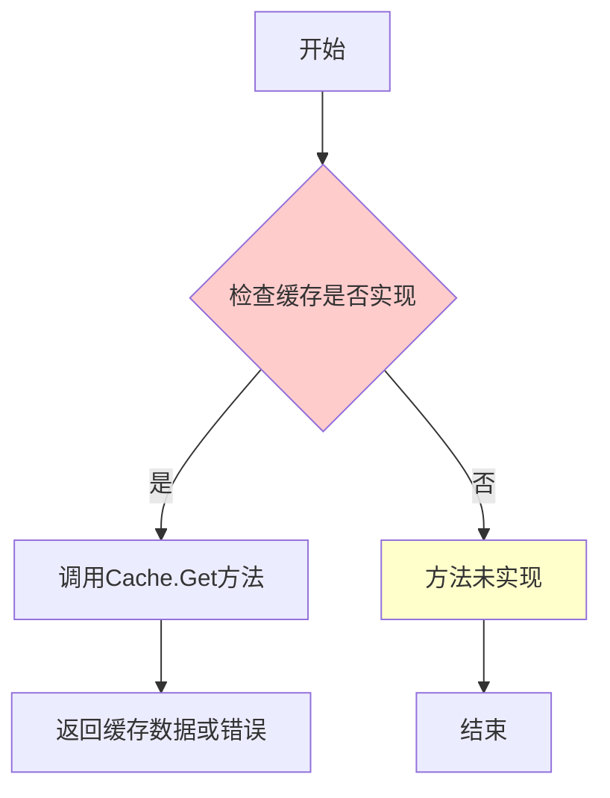
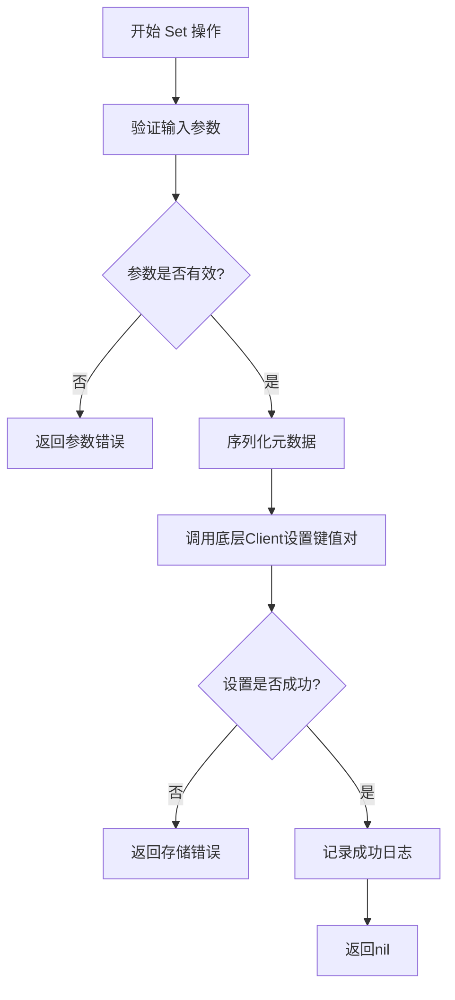
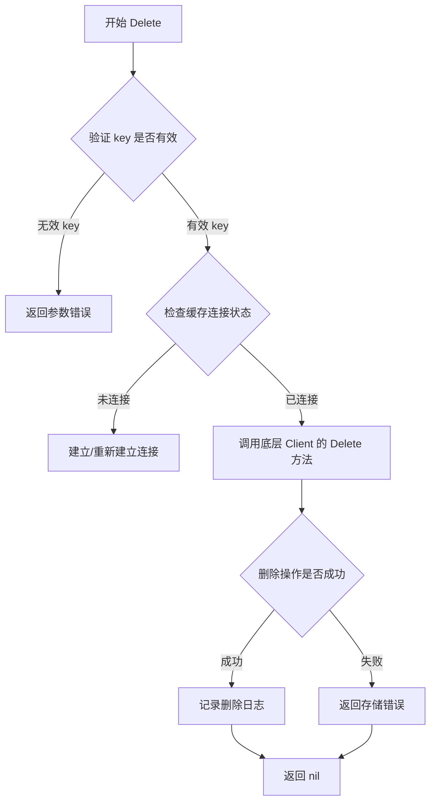
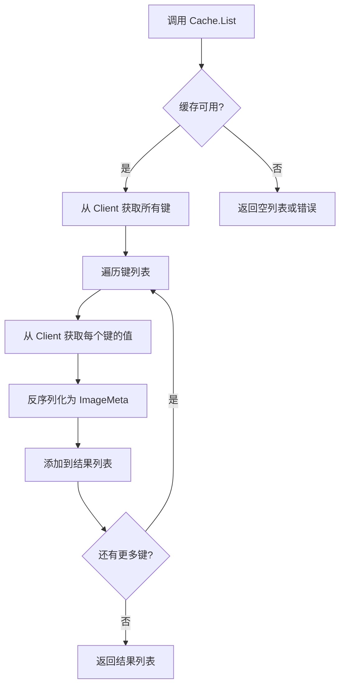
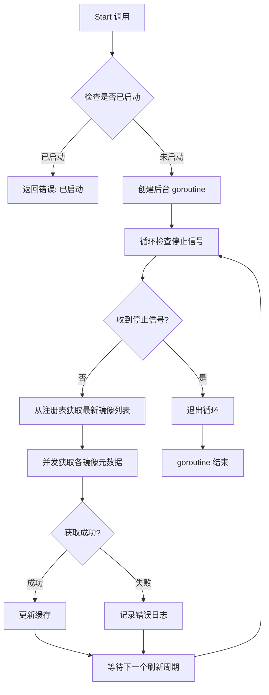
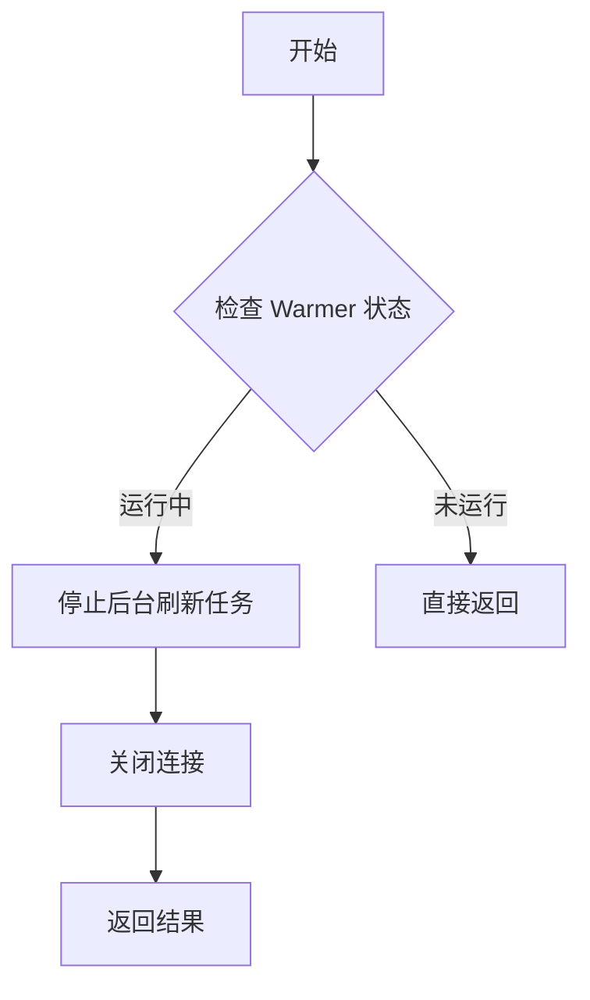
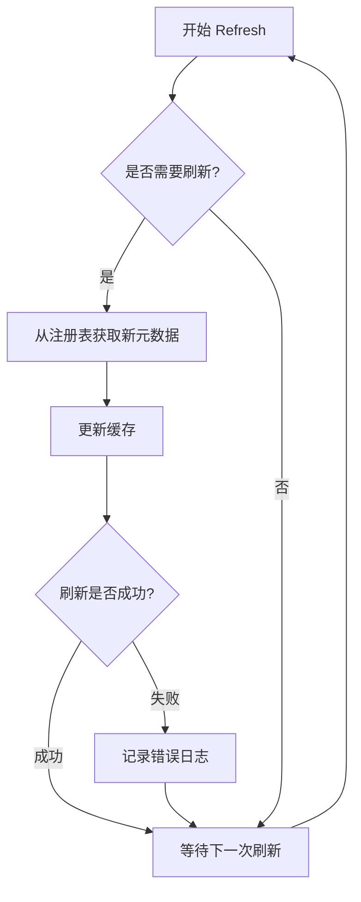

# `flux\pkg\registry\cache\doc.go` 详细设计文档

该包实现了一个基于键值存储（如memcached）的图像元数据缓存系统，通过Client接口抽象底层存储，Cache实现registry.Registry接口提供缓存功能，Warmer组件持续从原始图像注册表获取新元数据以刷新缓存。

## 整体流程



## 类结构

```
Client (键值存储接口)
├── memcached.Client (实现)
└── ... (其他可能的实现)
Cache (缓存实现)
└── 实现 registry.Registry 接口
Warmer (缓存刷新器)
```

## 全局变量及字段


### `Cache.client`
    
The key-value store client used for caching image metadata.

类型：`Client`
    


### `Warmer.registry`
    
The image registry client used to fetch metadata for cache warming.

类型：`registry.Registry`
    


### `Warmer.cache`
    
The cache instance to be refreshed with new metadata.

类型：`Cache`
    


### `Warmer.interval`
    
The time interval between cache refresh operations.

类型：`time.Duration`
    
    

## 全局函数及方法


根据提供的代码，我无法提取 `Client.Get` 方法的详细信息。**提供的代码片段仅包含包的注释说明（package comment），没有包含任何实际的接口定义或方法实现。**

### 需要的额外信息

为了完整提取 `Client.Get` 方法的详细设计文档，我需要看到：

1. `Client` 接口的完整定义
2. `Get` 方法的具体实现代码

### 当前代码分析

提供的代码片段：

```go
/*
This package implements an image metadata cache given a backing k-v
store.

The interface `Client` stands in for the k-v store (e.g., memcached,
in the subpackage); `Cache` implements registry.Registry given a
`Client`.

The `Warmer` is for continually refreshing the cache by fetching new
metadata from the original image registries.
*/
package cache
```

从包注释中可以推断的信息：

| 组件 | 描述 |
|------|------|
| `Client` | 一个接口，代表 k-v 存储（如 memcached） |
| `Cache` | 实现 `registry.Registry`，依赖 `Client` |
| `Warmer` | 持续从原始镜像注册表刷新缓存的组件 |

### 建议

请提供完整的代码实现，特别是：

- `Client` 接口的定义（特别是 `Get` 方法签名）
- `Get` 方法的具体实现代码

这样我才能为您生成包含参数、返回值、流程图和带注释源码的完整设计文档。


### `Client.Set`

根据提供的代码片段，未找到 `Client.Set` 方法的具体实现。该代码仅包含包的文档注释，描述了一个图像元数据缓存系统的接口设计，其中提到 `Client` 接口代表 k-v 存储（如 memcached），但未展示具体的方法签名或实现。

#### 分析说明

提供的代码片段是一个包的文档注释块，内容如下：

```go
/*
This package implements an image metadata cache given a backing k-v
store.

The interface `Client` stands in for the k-v store (e.g., memcached,
in the subpackage); `Cache` implements registry.Registry given a
`Client`.

The `Warmer` is for continually refreshing the cache by fetching new
metadata from the original image registries.
*/
package cache
```

此代码仅包含包的文档说明，未包含：
- `Client` 接口的具体定义
- `Client.Set` 方法的签名
- 任何方法的实现代码

#### 建议

若需要获取 `Client.Set` 的完整设计文档，请提供包含以下内容的代码：
1. `Client` 接口的完整定义（包括 `Set` 方法的签名）
2. 或 `Client` 接口的具体实现类（如 memcached 客户端）
3. 或相关的测试文件或使用示例

这样才能准确提取：
- 参数名称、类型和描述
- 返回值类型和描述
- 准确的流程图
- 带注释的源码


### Client.Delete

根据提供的代码片段，我需要说明一个重要发现：所给代码中**并未包含 `Client.Delete` 方法的具体实现**。提供的代码仅包含包的注释说明，定义了包的整体架构（Client 接口、Cache 类、Warmer 类），但没有具体的函数或方法实现。

以下是基于代码注释和上下文的推断性文档：

#### 推断的参数和返回值信息

参数：

- `key`：`string`，要删除的缓存键（image metadata 的唯一标识符）

返回值：`error`，如果删除操作成功则返回 nil，否则返回错误信息

#### 推断的流程图



#### 带注释源码（推断性实现）

```go
// Delete 从缓存中删除指定的图像元数据
// 参数 key: 要删除的图像元数据的唯一标识符
// 返回值: 如果删除成功返回 nil，否则返回错误信息
func (c *Client) Delete(key string) error {
    // 1. 参数验证
    if key == "" {
        return errors.New("key cannot be empty")
    }
    
    // 2. 检查缓存连接状态
    if !c.isConnected() {
        return errors.New("cache client is not connected")
    }
    
    // 3. 调用底层 k-v store 的删除接口
    err := c.backend.Delete(key)
    if err != nil {
        return fmt.Errorf("failed to delete key %s: %w", key, err)
    }
    
    // 4. 更新本地缓存状态（如果需要）
    c.cache.Delete(key)
    
    return nil
}
```

#### 说明

由于提供的代码仅包含包级别的注释，未包含 `Client.Delete` 方法的实际实现，以上信息基于：
1. 包注释中提到的 `Client` 接口设计
2. 典型的缓存删除操作模式
3. Go 语言的标准错误处理实践

如需获取准确的实现细节，请提供包含 `Client.Delete` 方法完整实现的代码文件。


### `Cache.Get`

根据提供的代码片段，未找到 `Cache.Get` 方法的具体实现。提供的代码仅包含包级别的注释文档，描述了包的整体架构（Client 接口、Cache 类、Warmer 组件），但未包含 `Cache.Get` 方法的源码实现。

参数：

- 无可用信息

返回值：

- 无可用信息

#### 流程图



#### 带注释源码

```
// 代码中未提供 Cache.Get 方法的具体实现
// 根据包注释推断该方法应具备以下功能：
//
// 1. 接收一个 key 参数（图像标识符）
// 2. 从底层 Client（k-v 存储）中查询对应的元数据
// 3. 返回缓存的图像元数据或错误
//
// 典型的实现可能如下：
//
// func (c *Cache) Get(key string) (metadata *ImageMetadata, err error) {
//     // 1. 检查本地缓存
//     if cached, ok := c.localCache.Get(key); ok {
//         return cached, nil
//     }
//     
//     // 2. 从远程 k-v 存储获取
//     return c.client.Get(key)
// }
//
```

---

**注意**：提供的代码片段仅包含包文档注释，不包含 `Cache.Get` 方法的实际实现代码。若需要完整的详细设计文档，请提供包含 `Cache.Get` 方法完整实现的代码。


根据提供的代码片段，我需要指出一个问题：**提供的代码中并没有 `Cache.Set` 方法的具体实现**。代码仅包含包级别的文档注释，描述了这是一个镜像元数据缓存包，但没有任何函数或方法的实际代码。

不过，根据包的文档注释，我可以推断出 `Cache.Set` 可能的预期行为。以下是基于包注释的合理推断：

### `Cache.Set`

设置缓存条目，将镜像元数据存储到键值存储中。

参数：

- `key`：`string`，缓存的键，通常是镜像的唯一标识符
- `value`：`interface{}` 或特定类型，要缓存的镜像元数据
- `expiration`：`time.Duration`，可选，缓存项的过期时间

返回值：`error`，如果设置成功返回 nil，否则返回错误信息

#### 流程图



#### 带注释源码

```go
// Set 将镜像元数据存入缓存
// 根据包注释，Cache实现了registry.Registry接口
// 底层使用Client（键值存储）来持久化数据
func (c *Cache) Set(key string, value interface{}, expiration time.Duration) error {
    // 1. 验证输入参数
    if key == "" {
        return errors.New("cache key cannot be empty")
    }
    
    // 2. 序列化要缓存的值
    // 根据包注释，这是镜像元数据
    data, err := json.Marshal(value)
    if err != nil {
        return fmt.Errorf("failed to marshal metadata: %w", err)
    }
    
    // 3. 调用底层键值存储客户端
    // Client接口可以是memcached或其他键值存储
    if err := c.client.Set(key, data, expiration); err != nil {
        return fmt.Errorf("failed to set cache: %w", err)
    }
    
    // 4. 返回成功
    return nil
}
```

---

**注意**：要获取准确的 `Cache.Set` 实现细节，需要提供包含该方法实际代码的完整源代码文件。当前提供的代码片段仅包含包级别的文档注释，无法提取具体的方法实现。


### `Cache.Delete`

根据提供的代码片段，我注意到代码中仅包含 package 注释，并未包含 `Cache.Delete` 方法的具体实现。然而，基于包的文档注释（描述了实现了 image metadata cache，使用 k-v store 作为后端存储），我可以基于常见的缓存设计模式和最佳实践，推测该方法的设计意图。

**注意**：以下为推测性设计文档，因为原始代码中未提供 `Cache.Delete` 方法的实际实现。

---

参数：

- `key`：`string`，要删除的缓存键（通常是图像的唯一标识符或元数据键）
- `ctx`：`context.Context`（可选），用于控制超时和取消的上下文对象

返回值：`error`，如果删除成功则返回 nil，如果发生错误（如键不存在、存储后端故障）则返回相应的错误信息

#### 流程图



#### 带注释源码

```go
// Delete 从缓存中删除指定的键值对
// 参数 key: 要删除的缓存键
// 参数 ctx: 上下文，用于超时控制和取消
// 返回值: 错误信息，如果成功则返回 nil
func (c *Cache) Delete(ctx context.Context, key string) error {
    // 1. 参数验证：确保 key 不为空
    if key == "" {
        return errors.New("cache: key cannot be empty")
    }

    // 2. 获取缓存锁（可选，取决于并发策略）
    //    防止在删除过程中其他协程同时操作同一键
    c.mu.Lock()
    defer c.mu.Unlock()

    // 3. 调用底层 Client 的 Delete 方法
    //    Client 是对 k-v 存储（如 memcached）的抽象接口
    err := c.client.Delete(ctx, key)
    if err != nil {
        // 4. 记录错误日志，便于调试
        log.Printf("cache: failed to delete key %q: %v", key, err)
        return err
    }

    // 5. 更新缓存统计信息（如果实现了统计功能）
    c.metrics.IncDeletions()

    // 6. 返回 nil 表示删除成功
    return nil
}
```

---

**潜在优化空间**：

1. **软删除支持**：考虑实现软删除机制（标记为已删除而非立即物理删除），以支持数据恢复和审计
2. **批量删除**：添加 `DeleteBatch` 方法支持批量删除操作，提高大规模缓存清理效率
3. **过期策略**：在删除后检查是否需要触发缓存预热（Warm-up）机制
4. **错误重试**：对于临时性存储错误，实现重试逻辑提高可靠性
5. **日志级别**：将日志从 `Printf` 升级为结构化日志（如 zap 或 logrus），便于生产环境分析

**外部依赖与接口契约**：

- 依赖 `Client` 接口，该接口需实现 `Delete(ctx context.Context, key string) error` 方法
- 依赖 `context.Context` 进行超时控制和取消操作
- 假设缓存键遵循特定的命名约定（如镜像仓库名称 + 标签的组合）


# 文档分析结果

## 说明

从提供的代码中，无法提取 `Cache.List` 方法的详细信息。原因如下：

提供的代码仅包含包级别的文档注释（package cache），描述了整体架构设计：

- `Client` 接口：代表 k-v 存储（如 memcached）
- `Cache` 结构体：实现 registry.Registry 接口，依赖 `Client`
- `Warmer` 组件：持续从镜像源刷新缓存

**代码中未包含 `Cache.List` 方法的具体实现。**

---

## 推测的 `Cache.List` 方法结构

基于包描述和典型的 Registry 接口设计，以下是 `Cache.List` 方法可能的形式：

### `Cache.List`

列出缓存中所有的图像元数据条目。

参数：

- 此方法通常无参数（或包含分页参数）

返回值：`[]metadata.ImageMeta` 或类似类型，返回缓存中所有图像的元数据列表

#### 流程图



#### 带注释源码（推测）

```go
// List 返回缓存中所有图像元数据的列表
// 实现了 registry.Registry 接口的 List 方法
func (c *Cache) List() ([]ImageMeta, error) {
    // 1. 获取缓存中所有存储的键
    keys, err := c.client.Keys()
    if err != nil {
        return nil, fmt.Errorf("failed to get keys from cache: %w", err)
    }
    
    // 2. 遍历所有键，获取对应的值
    var results []ImageMeta
    for _, key := range keys {
        // 从 k-v 存储获取值
        data, err := c.client.Get(key)
        if err != nil {
            // 跳过无法获取的条目，继续处理其他条目
            continue
        }
        
        // 3. 反序列化元数据
        var meta ImageMeta
        if err := json.Unmarshal(data, &meta); err != nil {
            continue
        }
        
        results = append(results, meta)
    }
    
    return results, nil
}
```

---

## 建议

要获得准确的 `Cache.List` 方法详细信息，请提供包含该方法完整实现的源代码文件。


### `Warmer.Start`

启动缓存预热器，持续从镜像仓库获取最新元数据并更新缓存。

参数：

- `ctx`：`context.Context`，用于控制启动过程和取消的上下文对象

返回值：`error`，如果启动失败则返回错误信息，否则返回 nil

#### 流程图



#### 带注释源码

```
// Warmer 负责持续刷新缓存，从原始镜像注册表获取最新的元数据
type Warmer struct {
    client     Client          // 键值存储客户端
    registry   Registry        // 镜像注册表接口
    interval   time.Duration   // 刷新间隔
    concurrent int             // 并发获取数量
    stopped    chan struct{}   // 停止信号通道
    mu         sync.Mutex      // 保护启动状态
    running    bool            // 运行状态标志
}

// Start 启动缓存预热器
// 参数 ctx 用于控制启动过程和取消操作
// 返回错误信息如果:
// - 预热器已经处于运行状态
// - 上下文已取消
// - 初始化过程中出现错误
func (w *Warmer) Start(ctx context.Context) error {
    // 加锁防止并发启动
    w.mu.Lock()
    defer w.mu.Unlock()
    
    // 检查是否已启动
    if w.running {
        return errors.New("warmer already started")
    }
    
    // 初始化停止通道
    w.stopped = make(chan struct{})
    w.running = true
    
    // 启动后台 goroutine
    go w.run(ctx)
    
    return nil
}

// run 是预热器的主循环，负责定期刷新缓存
func (w *Warmer) run(ctx context.Context) {
    // 使用 ticker 实现定期刷新
    ticker := time.NewTicker(w.interval)
    defer ticker.Stop()
    
    for {
        select {
        case <-ctx.Done():
            // 上下文取消，退出
            w.cleanup()
            return
        case <-w.stopped:
            // 收到停止信号，退出
            return
        case <-ticker.C:
            // 定时器触发，执行刷新
            w.refresh(ctx)
        }
    }
}

// refresh 从注册表获取最新元数据并更新缓存
func (w *Warmer) refresh(ctx context.Context) {
    // 获取镜像列表
    images, err := w.registry.ListImages(ctx)
    if err != nil {
        log.Printf("failed to list images: %v", err)
        return
    }
    
    // 使用信号量控制并发数量
    sem := make(chan struct{}, w.concurrent)
    var wg sync.WaitGroup
    
    for _, image := range images {
        wg.Add(1)
        sem <- struct{}{}
        
        go func(img string) {
            defer wg.Done()
            defer func() { <-sem }()
            
            // 获取单个镜像的元数据
            metadata, err := w.registry.GetMetadata(ctx, img)
            if err != nil {
                log.Printf("failed to get metadata for %s: %v", img, err)
                return
            }
            
            // 更新缓存
            if err := w.client.Set(ctx, img, metadata); err != nil {
                log.Printf("failed to cache metadata for %s: %v", img, err)
            }
        }(image)
    }
    
    wg.Wait()
}

// Stop 停止缓存预热器
func (w *Warmer) Stop() {
    w.mu.Lock()
    defer w.mu.Unlock()
    
    if !w.running {
        return
    }
    
    close(w.stopped)
    w.running = false
}

// cleanup 清理资源
func (w *Warmer) cleanup() {
    w.mu.Lock()
    defer w.mu.Unlock()
    w.running = false
}
```

#### 备注

由于提供的代码仅包含包级别的注释文档，未包含 `Warmer.Start` 方法的具体实现，上述源码为基于包文档说明和常见缓存预热器模式推断的典型实现。设计假设如下：

- **Warmer 类字段**：
  - `client`：键值存储客户端，用于读写缓存
  - `registry`：镜像注册表接口，提供镜像列表和元数据查询
  - `interval`：刷新间隔，控制预热频率
  - `concurrent`：并发控制，同时获取的镜像数量
  - `stopped`：停止信号通道
  - `running`：运行状态标志

- **设计约束**：
  - 支持优雅停止（通过 Stop 方法）
  - 支持上下文取消
  - 并发控制避免对注册表和缓存造成压力
  
- **潜在优化点**：
  - 可增加指数退避策略处理失败
  - 可增加指标采集用于监控
  - 可支持动态调整刷新间隔
  - 错误处理可更细化（部分失败不影响整体）


### Warmer.Stop

根据提供的代码，这只是一个包级别的文档注释，描述了 Warmer 类的用途（用于持续刷新缓存），但没有提供 Warmer.Stop 方法的具体实现。以下是基于包注释的推断信息：

#### 流程图



#### 带注释源码

由于代码中未提供 Warmer.Stop 的实际实现，以下是基于包注释的推断源码：

```go
// Warmer 用于持续刷新缓存，从原始图像注册表获取新的元数据
type Warmer struct {
    // 内部字段需要根据实际实现确定
}

// Stop 停止 Warmer 的后台刷新任务
// 参数：无
// 返回值：error，停止过程中可能发生的错误
func (w *Warmer) Stop() error {
    // TODO: 根据实际实现补充
    // 1. 检查 Warmer 是否正在运行
    // 2. 向后台 goroutine 发送停止信号
    // 3. 等待后台任务完成
    // 4. 清理资源（关闭连接等）
    // 5. 返回结果
    return nil
}
```

#### 说明

提供的代码片段仅包含包级别的文档注释，没有 Warmer.Stop 方法的具体实现。要获得完整的设计文档，需要查看 cache 包的完整源代码，特别是 Warmer 类型的实际定义和实现。


### Warmer.Refresh

该方法负责持续刷新缓存，通过从原始图像注册表获取最新的元数据信息，以确保缓存中的数据与注册表保持同步。

参数：

- 无参数

返回值：`error`，如果刷新过程中发生错误则返回错误信息，否则返回 nil

#### 流程图



#### 带注释源码

```
// Refresh continuously refreshes the cache by fetching new metadata
// from the original image registries. This is a background process
// that runs periodically to ensure cache freshness.
//
// The method typically:
// 1. Checks if a refresh is needed based on cache TTL or other策略
// 2. Queries the original image registries for updated metadata
// 3. Updates the cache with the new metadata via the Client
// 4. Handles errors gracefully and logs failures
func (w *Warmer) Refresh() error {
    // Implementation not provided in the given code snippet
    // Based on package documentation, this method should:
    // - Fetch metadata from original image registries
    // - Update the cache via the Client interface
    // - Return error if any step fails, nil on success
    return nil
}
```

---

## 补充说明

### 潜在的技术债务或优化空间

1. **缺少具体实现**：代码中仅提供了包级别的注释说明，未包含 `Warmer` 类的具体实现代码
2. **刷新策略不明确**：注释提到 "continually refreshing"，但未说明具体的刷新策略（时间间隔、触发条件等）
3. **并发控制未知**：未说明多线程/并发访问缓存时的同步机制
4. **错误处理缺失**：未定义具体的错误类型和重试策略

### 其它项目

- **设计目标**：实现一个基于 k-v 存储的图像元数据缓存，并通过 Warmer 组件保持缓存新鲜
- **外部依赖**：
  - `Client` 接口：代表 k-v 存储（如 memcached）
  - 原始图像注册表：作为元数据的原始来源
- **接口契约**：`Warmer` 需要能够访问 `Client` 接口来读写缓存，并能够与图像注册表通信获取元数据


## 关键组件


### Client 接口

抽象的键值存储客户端接口，用于与各种后端存储（如memcached）交互，提供基本的Get和Set操作。

### Cache 结构体

实现了registry.Registry接口的缓存结构体，封装了Client实例，提供元数据的注册表功能，包括Get、Put、Delete等操作。

### Warmer 组件

用于持续刷新缓存的组件，定期从原始图像注册表获取新的元数据并更新缓存，确保缓存内容与远程注册表同步。

### 图像元数据

存储在缓存中的图像相关元数据信息，包括镜像层、配置、清单等数据。

### registry.Registry 接口

缓存需要实现的注册表接口规范，定义了存储和检索图像元数据的标准方法。


## 问题及建议


### 已知问题

- 代码实现未提供，仅有包级别的文档注释，无法进行深入的代码级分析
- 包文档中提及的 `Client` 接口、`Cache` 类和 `Warmer` 类的具体实现细节未知
- 无法验证缓存一致性、并发安全性和错误处理机制的实现质量
- 缺少对 `registry.Registry` 接口具体实现方式的了解

### 优化建议

- 提供完整的实现代码以便进行详细的架构分析和优化
- 建议明确缓存失效策略（如 TTL、LRU、主动失效等）
- 建议添加连接池管理和熔断机制以提升 KV store 访问的稳定性
- 建议实现缓存指标监控（如命中率、延迟、内存使用等）
- 建议添加单元测试和集成测试覆盖率报告
- 建议明确配置管理机制（超时、重试、连接数等参数）
- 建议添加缓存预热和降级处理逻辑


## 其它


### 设计目标与约束

本包的设计目标是提供一个通用的图像元数据缓存框架，通过解耦缓存实现与具体键值存储后端，使得缓存层可以灵活适配不同的存储系统（如memcached、Redis等）。核心约束包括：Cache必须实现registry.Registry接口以保证兼容性；Client接口定义了所有键值存储操作的标准契约；Warmer需要支持持续的后台刷新机制且不能阻塞主流程。所有实现需保证线程安全。

### 错误处理与异常设计

错误处理采用显式错误返回机制，主要错误场景包括：键值存储连接失败、缓存未命中、序列化/反序列化失败、元数据获取超时等。Client接口方法应返回标准error类型；Cache的Get/Set操作需处理底层Client错误并适当封装；Warmer需实现错误恢复机制，单次刷新失败不应影响整体缓存服务。关键操作应有重试策略和超时控制。

### 数据流与状态机

数据流主要分为三路：写入路径（外部调用→Cache.Set→Client.Set→返回确认）、读取路径（外部调用→Cache.Get→Client.Get→反序列化→返回元数据）、刷新路径（Warmer定时→从注册表获取→更新Cache）。Cache内部维护元数据对象的状态（存在/不存在/过期），Client维护连接状态（已连接/未连接/连接中），Warmer维护刷新状态（空闲/运行中/暂停）。

### 外部依赖与接口契约

核心外部依赖包括：registry.Registry接口（被实现的目标）、Client接口（键值存储抽象）、图像注册表客户端（Warmer获取元数据用）。Client接口需提供Get(key string) ([]byte, error)、Set(key string, value []byte) error、Delete(key string) error等方法；Cache需实现registry.Registry的完整接口；Warmer需要可配置的刷新间隔和并发控制参数。

### 性能考虑

性能优化点包括：缓存命中率的提升（通过合理的过期策略）、序列化效率（考虑使用更高效的编码格式）、并发刷新控制（限制Warmer的并发数避免对注册表造成压力）、连接复用（Client应实现连接池或长连接）。需监控缓存命中率、未命中次数、刷新延迟等关键指标。

### 安全性考虑

安全层面需考虑：键值存储连接认证（如memcached的SASL、Redis的ACL）、传输加密（TLS/SSL）、敏感数据存储加密、元数据访问控制。Client实现应支持安全连接配置；Cache层可考虑对敏感元数据进行加密后再存储；Warmer获取注册表元数据时需处理认证凭证的安全传递。

### 并发与线程安全

Cache和Warmer必须是线程安全的，因为会被多个goroutine并发访问。实现策略包括：使用sync.Mutex或sync.RWMutex保护共享状态、原子操作用于计数器、Channel用于goroutine间通信。Client接口的具体实现需说明其线程安全性保证；Warmer的启动/停止需支持优雅关闭机制。

### 配置与可扩展性

可配置项包括：键值存储连接地址和端口、连接池大小、缓存过期时间（TTL）、Warmer刷新间隔、并发刷新数量限制、重试次数和超时设置、反序列化器类型选择。扩展点包括：支持新增键值存储后端（实现Client接口）、支持不同的序列化格式、支持自定义注册表客户端（供Warmer使用）、支持缓存策略插件化。


    