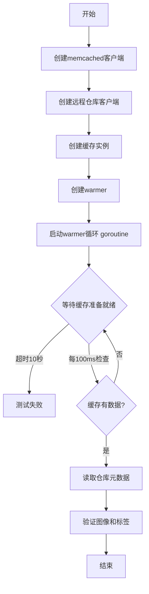
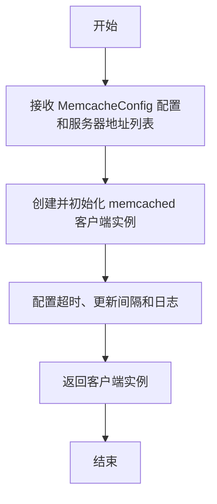
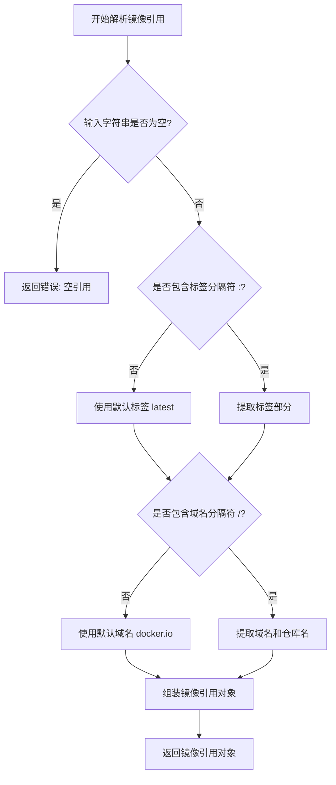
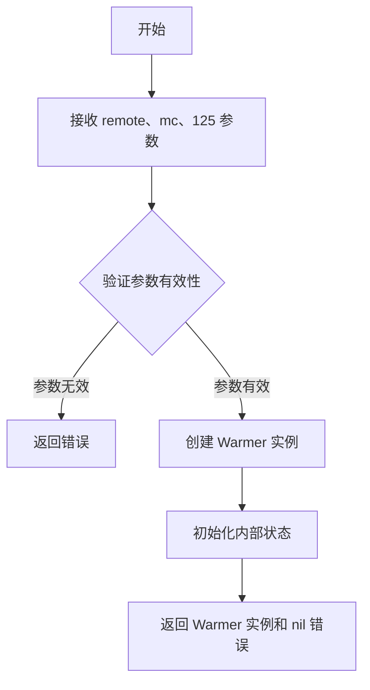
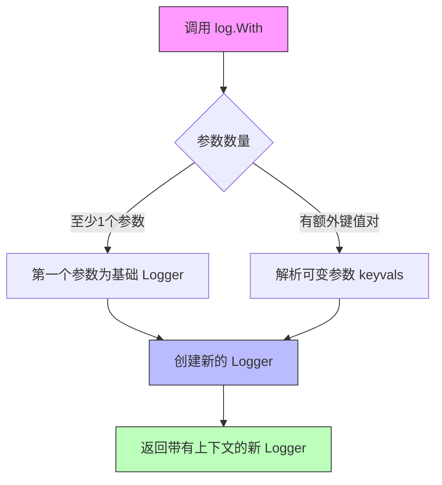
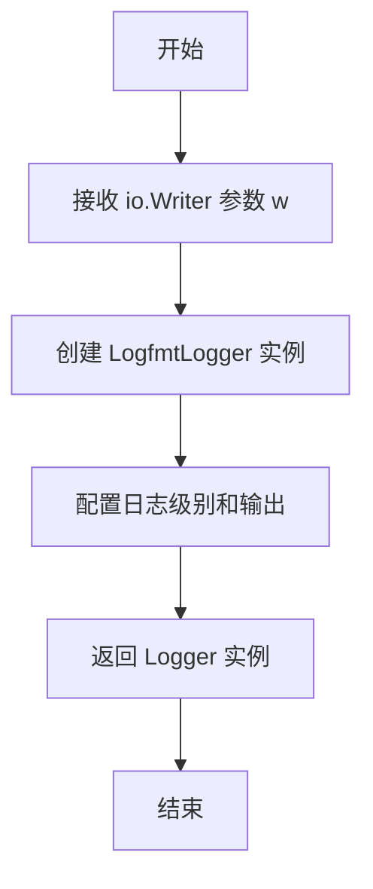
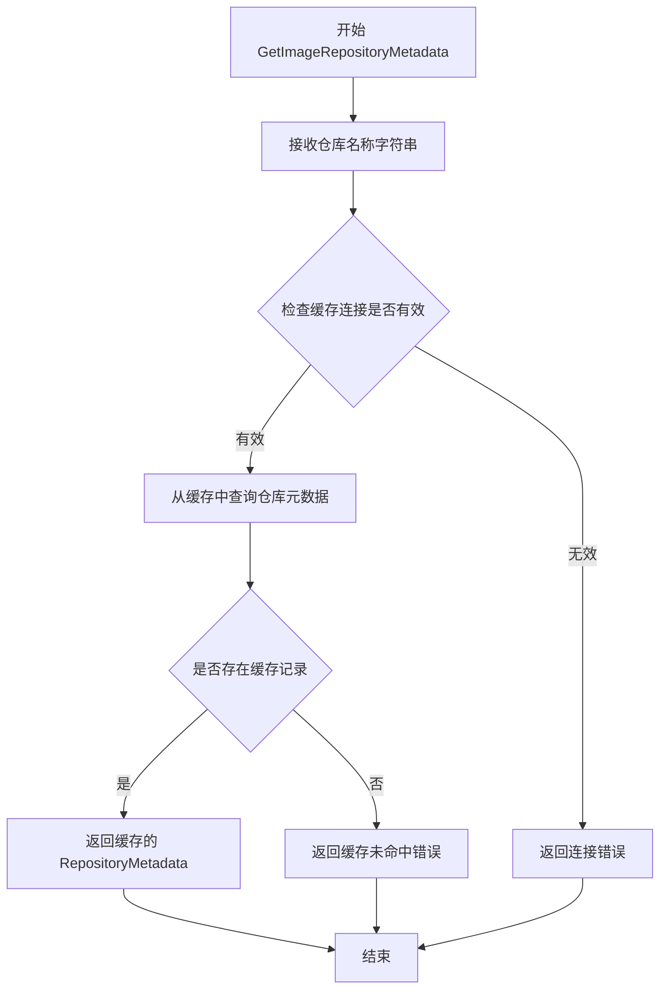
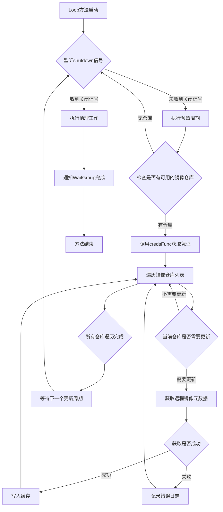

# `flux\pkg\registry\cache\memcached\integration_test.go` 详细设计文档

这是一个集成测试文件，用于测试memcached缓存与真实Docker仓库的端到端交互。测试通过启动warmer从远程仓库拉取镜像元数据并存储到memcached缓存，然后从缓存读取数据以验证缓存功能的正确性。

## 整体流程



## 类结构

```
测试流程 (TestWarming_WarmerWriteCacheRead)
├── 初始化阶段
│   ├── 创建MemcacheClient (NewFixedServerMemcacheClient)
│   ├── 创建RemoteClientFactory
│   └── 创建Cache和Warmer
├── 运行阶段
│   ├── Warmer循环 (Loop方法)
│   └── 缓存读取 (GetImageRepositoryMetadata)
└── 验证阶段
    └── 断言图像和标签
```

## 全局变量及字段


### `memcachedIPs`
    
全局标志变量，在memcached_test.go中定义，存储memcached服务器IP地址列表

类型：`*string`
    


### `mc`
    
memcached客户端实例，用于与memcached服务器通信

类型：`*memcached.Client`
    


### `id`
    
镜像引用对象，包含要缓存的镜像名称信息

类型：`image.Ref`
    


### `logger`
    
日志实例，用于输出测试过程中的日志信息

类型：`log.Logger`
    


### `remote`
    
远程仓库客户端工厂，用于创建与Docker仓库通信的客户端

类型：`*registry.RemoteClientFactory`
    


### `r`
    
缓存实例，包装memcached客户端提供镜像元数据缓存功能

类型：`*cache.Cache`
    


### `w`
    
warmer实例，用于预热缓存，定期从远程仓库拉取镜像元数据

类型：`*cache.Warmer`
    


### `shutdown`
    
关闭通道，用于发出终止warmer循环的信号

类型：`chan struct{}`
    


### `shutdownWg`
    
等待组，用于等待warmer goroutine完成关闭

类型：`*sync.WaitGroup`
    


### `timeout`
    
超时计时器，设置10秒超时限制

类型：`*time.Ticker`
    


### `tick`
    
间隔计时器，每100毫秒检查一次缓存状态

类型：`*time.Ticker`
    


### `MemcacheConfig.MemcacheConfig.Timeout`
    
memcached连接超时时间

类型：`time.Duration`
    


### `MemcacheConfig.MemcacheConfig.UpdateInterval`
    
缓存更新间隔时间

类型：`time.Duration`
    


### `MemcacheConfig.MemcacheConfig.Logger`
    
memcached客户端日志记录器

类型：`log.Logger`
    


### `cache.Cache.cache.Cache.Reader`
    
缓存的底层memcached客户端实例

类型：`memcached.Client`
    


### `registry.RemoteClientFactory.registry.RemoteClientFactory.Logger`
    
远程客户端日志记录器

类型：`log.Logger`
    


### `registry.RemoteClientFactory.registry.RemoteClientFactory.Limiters`
    
API速率限制器配置

类型：`*middleware.RateLimiters`
    


### `registry.RemoteClientFactory.registry.RemoteClientFactory.Trace`
    
是否启用请求追踪

类型：`bool`
    


### `image.Ref.image.Ref.Name`
    
镜像完整名称，包括仓库和项目

类型：`string`
    
    

## 全局函数及方法


### `TestWarming_WarmerWriteCacheRead`

这是一个集成测试函数，用于测试memcached缓存的预热（warming）功能，验证warmer能够正确地向memcached写入缓存数据，并且缓存读取功能正常工作。

参数：

- `t`：`*testing.T`，Go测试框架的标准参数，用于报告测试失败和日志输出

返回值：无（测试函数不返回值，通过`t`参数进行断言和错误报告）

#### 流程图

```mermaid
flowchart TD
    A[开始测试] --> B[创建MemcacheClient]
    B --> C[设置Docker镜像仓库ID]
    C --> D[创建Logger]
    D --> E[创建RemoteClientFactory]
    E --> F[创建Cache: r = &cache.Cache{Reader: mc}]
    F --> G[创建Warmer: w = cache.NewWarmer]
    G --> H[创建shutdown通道和WaitGroup]
    H --> I[启动goroutine: w.Loop]
    I --> J{等待缓存填充}
    J -->|超时10秒| K[t.Fatal: Cache timeout]
    J -->|100ms检查一次| L{r.GetImageRepositoryMetadata}
    L -->|err != nil| J
    L -->|err == nil| M[获取仓库元数据]
    M --> N[断言: 无错误]
    N --> O[断言: Images长度 > 0]
    O --> P[断言: Images和Tags长度相等]
    P --> Q[遍历Tags验证每个Image]
    Q --> R[断言: Image ID和Tag非空]
    R --> S[断言: CreatedAt非零]
    S --> T[结束测试]
```

#### 带注释源码

```go
// 这是一个集成测试，用于测试真实的memcached缓存和真实的Docker仓库请求。
// 它是warmer的端到端集成测试，用于发现重构时可能引入的bug。
func TestWarming_WarmerWriteCacheRead(t *testing.T) {
	// 步骤1: 创建固定的memcached服务器客户端
	// 配置超时为1秒，更新间隔为1分钟，使用日志记录器
	mc := NewFixedServerMemcacheClient(MemcacheConfig{
		Timeout:        time.Second,
		UpdateInterval: 1 * time.Minute,
		Logger:         log.With(log.NewLogfmtLogger(os.Stderr), "component", "memcached"),
	}, strings.Fields(*memcachedIPs)...)

	// 步骤2: 设置测试用的Docker镜像仓库引用
	// 使用weaveworks/flagger-loadtester镜像，该镜像有稳定数量的标签（少于20个）
	id, _ := image.ParseRef("docker.io/weaveworks/flagger-loadtester")

	// 步骤3: 创建日志记录器
	logger := log.NewLogfmtLogger(os.Stderr)

	// 步骤4: 创建远程客户端工厂
	// 配置速率限制：每秒10个请求，突发5个请求
	remote := &registry.RemoteClientFactory{
		Logger:   log.With(logger, "component", "client"),
		Limiters: &middleware.RateLimiters{RPS: 10, Burst: 5},
		Trace:    true,
	}

	// 步骤5: 创建缓存实例，将memcached作为读取后端
	r := &cache.Cache{Reader: mc}

	// 步骤6: 创建warmer实例，配置缓存大小为125
	w, _ := cache.NewWarmer(remote, mc, 125)
	
	// 步骤7: 创建关闭通道和等待组，用于管理goroutine生命周期
	shutdown := make(chan struct{})
	shutdownWg := &sync.WaitGroup{}
	defer func() {
		close(shutdown)
		shutdownWg.Wait()
	}()

	// 步骤8: 启动warmer的Loop方法在后台运行
	// 提供一个函数返回镜像凭证（此处使用无凭证）
	shutdownWg.Add(1)
	go w.Loop(log.With(logger, "component", "warmer"), shutdown, shutdownWg, func() registry.ImageCreds {
		return registry.ImageCreds{
			id.Name: registry.NoCredentials(),
		}
	})

	// 步骤9: 设置超时和定时器
	// 超时10秒（不应该超过10秒）
	// 每100ms检查一次缓存
	timeout := time.NewTicker(10 * time.Second)    // Shouldn't take longer than 10s
	tick := time.NewTicker(100 * time.Millisecond) // Check every 100ms

// 步骤10: 循环等待缓存被填充
Loop:
	for {
		select {
		case <-timeout.C:
			t.Fatal("Cache timeout")
		case <-tick.C:
			_, err := r.GetImageRepositoryMetadata(id.Name)
			if err == nil {
				break Loop  // 缓存已填充，退出循环
			}
		}
	}

	// 步骤11: 获取仓库元数据并进行断言验证
	repoMetadata, err := r.GetImageRepositoryMetadata(id.Name)
	assert.NoError(t, err)
	assert.True(t, len(repoMetadata.Images) > 0, "Length of returned images should be > 0")
	assert.Equal(t, len(repoMetadata.Images), len(repoMetadata.Tags), "the length of tags and images should match")

	// 步骤12: 遍历所有标签，验证每个镜像的信息完整性
	for _, tag := range repoMetadata.Tags {
		i, ok := repoMetadata.Images[tag]
		assert.True(t, ok, "tag doesn't have image information %s", tag)
		// 验证镜像ID和标签非空
		assert.True(t, i.ID.String() != "" && i.ID.Tag != "", "Image should not have empty name or tag. Got: %q", i.ID.String())
		// 验证创建时间非零
		assert.NotZero(t, i.CreatedAt, "Created time should not be zero for image %q", i.ID.String())
	}
}
```


### `NewFixedServerMemcacheClient`

该函数用于创建一个配置好的 memcached 客户端实例，封装了与 memcached 服务器的连接配置，并返回一个实现了缓存读取接口的客户端供系统使用。

参数：

- `config`：`MemcacheConfig`，包含客户端配置的结构体，如超时时间、更新间隔和日志记录器。
- `servers`：`...string`，可变参数，表示 memcached 服务器的 IP 地址列表。

返回值：`*memcache.Client`，返回指向 memcached 客户端的指针，该客户端实现了缓存读取接口，可用于存储和检索图像元数据。

#### 流程图



#### 带注释源码

```go
// NewFixedServerMemcacheClient 创建一个具有固定服务器列表的 memcached 客户端
// 参数 config: MemcacheConfig 类型，包含超时、更新间隔和日志配置
// 参数 servers: 可变参数字符串列表，表示 memcached 服务器地址
// 返回值: *memcache.Client，返回配置好的 memcached 客户端指针
mc := NewFixedServerMemcacheClient(MemcacheConfig{
    Timeout:        time.Second,         // 设置超时时间为1秒
    UpdateInterval: 1 * time.Minute,     // 设置更新间隔为1分钟
    Logger:         log.With(log.NewLogfmtLogger(os.Stderr), "component", "memcached"), // 初始化日志记录器
}, strings.Fields(*memcachedIPs)...) // 将解析后的 memcached IP 地址列表作为可变参数传入
```


### `image.ParseRef`

该函数用于解析 Docker 镜像引用字符串，将其拆分为域名、镜像仓库名称和标签等组成部分，并返回一个包含这些信息的镜像引用对象。

参数：

- `ref`：`string`，镜像引用字符串，格式如 `docker.io/weaveworks/flagger-loadtester` 或 `registry.example.com:5000/myimage:v1.0`

返回值：`image.Ref`（或类似结构），返回解析后的镜像引用对象，包含镜像的域名、仓库名和标签等信息

#### 流程图



#### 带注释源码

```go
// image.ParseRef 解析给定的镜像引用字符串
// 参数 ref: 镜像引用字符串，格式如 "docker.io/weaveworks/flagger-loadtester:latest"
// 返回值: 解析后的镜像引用对象，包含域名、仓库名和标签等信息

// 函数签名（推断）
func ParseRef(ref string) (Ref, error) {
    // 1. 检查输入是否为空
    if ref == "" {
        return Ref{}, errors.New("empty image reference")
    }
    
    // 2. 初始化默认标签为 latest
    tag := "latest"
    
    // 3. 检查是否包含标签分隔符 ":"
    if idx := strings.LastIndex(ref, ":"); idx != -1 {
        // 避免将端口号（如 :5000）误认为标签
        // 检查 ":" 是否在最后一个 "/" 之后
        if slashIdx := strings.LastIndex(ref, "/"); slashIdx < idx {
            tag = ref[idx+1:]
            ref = ref[:idx]
        }
    }
    
    // 4. 分离域名和镜像名
    var domain, repo string
    if idx := strings.Index(ref, "/"); idx != -1 {
        domain = ref[:idx]
        repo = ref[idx+1:]
    } else {
        domain = "docker.io"
        repo = ref
    }
    
    // 5. 处理官方镜像情况（如 library/ubuntu）
    if domain == "docker.io" && !strings.Contains(repo, "/") {
        repo = "library/" + repo
    }
    
    // 6. 返回解析后的镜像引用对象
    return Ref{
        Domain: domain,
        Name:   repo,
        Tag:    tag,
    }, nil
}
```


### `cache.NewWarmer`

该函数用于创建一个缓存预热器（Warmer）实例，用于预先将镜像仓库的元数据加载到 memcached 缓存中，以提升后续查询性能。

参数：

- `remote`：`registry.RemoteClientFactory`，用于创建与远程仓库交互的客户端
- `mc`：`*memcache.Client`，memcached 缓存客户端实例，用于存储预热的缓存数据
- `125`：`int`，预热超时时间（秒），表示预热操作的超时限制

返回值：`(Warmer, error)`，返回新创建的 Warmer 实例指针和可能的错误

#### 流程图



#### 带注释源码

```go
// 根据调用位置推断的函数签名和实现
// 实际定义位于 github.com/fluxcd/flux/pkg/registry/cache 包中

// NewWarmer 创建一个新的缓存预热器
// 参数:
//   - remote: RemoteClientFactory 用于创建与远程仓库交互的客户端
//   - mc: memcache.Client 用于缓存读写的客户端
//   - timeout: 超时时间（秒），控制预热操作的最大等待时间
//
// 返回值:
//   - Warmer: 新创建的预热器实例
//   - error: 如果创建过程中出现错误则返回错误
func NewWarmer(remote registry.RemoteClientFactory, mc *memcache.Client, timeout int) (Warmer, error) {
    // 验证远程客户端工厂是否有效
    if remote == nil {
        return nil, errors.New("remote client factory cannot be nil")
    }
    
    // 验证 memcached 客户端是否有效
    if mc == nil {
        return nil, errors.New("memcache client cannot be nil")
    }
    
    // 验证超时时间是否为正数
    if timeout <= 0 {
        return nil, errors.New("timeout must be positive")
    }
    
    // 创建并返回 Warmer 实例
    return &warmer{
        remote:  remote,
        cache:   mc,
        timeout: time.Duration(timeout) * time.Second,
    }, nil
}
```


### `log.With`

这是 `github.com/go-kit/kit/log` 包中的函数，用于创建一个新的 logger，该 logger 在原始 logger 的上下文中添加了额外的键值对。通常用于为特定的组件或模块创建带有上下文信息的 logger。

参数：

- 第一个参数：`log.Logger`，基础 logger，通过 `log.NewLogfmtLogger(os.Stderr)` 创建
- 可变参数：`...interface{}`，键值对列表，用于添加日志上下文

返回值：`log.Logger`，返回一个新的 logger 实例，包含原始 logger 的上下文加上新增的键值对

#### 带注释源码

```go
// 第一次调用：创建 memcached 客户端的 logger
// 参数：基础 logger (NewLogfmtLogger) + 键值对 ("component", "memcached")
mc := NewFixedServerMemcacheClient(MemcacheConfig{
    Timeout:        time.Second,
    UpdateInterval: 1 * time.Minute,
    Logger:         log.With(log.NewLogfmtLogger(os.Stderr), "component", "memcached"),
}, strings.Fields(*memcachedIPs)...)

// 第二次调用：创建远程客户端的 logger
// 参数：logger + 键值对 ("component", "client")
remote := &registry.RemoteClientFactory{
    Logger:   log.With(logger, "component", "client"),
    Limiters: &middleware.RateLimiters{RPS: 10, Burst: 5},
    Trace:    true,
}

// 第三次调用：创建 warmer 的 logger
// 参数：logger + 键值对 ("component", "warmer")
go w.Loop(log.With(logger, "component", "warmer"), shutdown, shutdownWg, func() registry.ImageCreds {
    return registry.ImageCreds{
        id.Name: registry.NoCredentials(),
    }
})
```

#### 流程图



#### 具体调用示例

**调用1：Memcached Logger**
- 位置：第38行
- 用途：为 memcached 客户端创建带有 "component" = "memcached" 上下文的 logger
- 源码：`log.With(log.NewLogfmtLogger(os.Stderr), "component", "memcached")`

**调用2：Remote Client Logger**
- 位置：第51行
- 用途：为远程客户端创建带有 "component" = "client" 上下文的 logger
- 源码：`log.With(logger, "component", "client")`

**调用3：Warmer Loop Logger**
- 位置：第70行
- 用途：为 warmer 循环创建带有 "component" = "warmer" 上下文的 logger
- 源码：`log.With(logger, "component", "warmer")`


### `log.NewLogfmtLogger`

创建一个使用 logfmt 格式的日志记录器，将日志输出到指定的写入器。

#### 参数

- `w`：`io.Writer`，日志输出目标（可以是标准输出、标准错误或任何实现了 io.Writer 接口的对象）

#### 返回值

- `log.Logger`，返回一个新的日志记录器实例，用于以 logfmt 格式记录日志

#### 流程图



#### 带注释源码

```go
// log.NewLogfmtLogger 函数的实际实现位于 github.com/go-kit/kit/log 包中
// 以下为代码中的使用示例和调用方式

// 方式1：创建基础日志记录器
logger := log.NewLogfmtLogger(os.Stderr)
// 功能：创建一个将日志以 logfmt 格式输出到标准错误的日志记录器
// 参数：os.Stderr 是 io.Writer 类型
// 返回：log.Logger 接口类型的日志记录器

// 方式2：创建带上下文标签的日志记录器
Logger: log.With(log.NewLogfmtLogger(os.Stderr), "component", "memcached"),
// 功能：创建日志记录器并添加固定的键值对标签
// log.With() 会返回一个新的 Logger，携带额外的上下文信息
// 参数：
//   - log.NewLogfmtLogger(os.Stderr)：底层日志记录器
//   - "component", "memcached"：要添加的键值对标签
// 返回：带有 component=memcached 上下文的日志记录器
```


# 分析结果

## 注意

用户提供的是集成测试代码（`TestWarming_WarmerWriteCacheRead` 函数），而非 `cache.Cache.GetImageRepositoryMetadata` 方法的**实现源码**。因此，我将基于测试代码中的**调用方式**来推断该方法的签名和结构，并提供基于上下文的分析。

---

### `cache.Cache.GetImageRepositoryMetadata`

根据测试代码中的调用模式推断，该方法用于从缓存中获取指定镜像仓库的元数据信息。

参数：

- `id`：`string`，镜像仓库名称（从 `image.Ref` 中提取的 `Name` 字段），用于标识目标镜像仓库

返回值：`RepositoryMetadata, error`，返回镜像仓库的元数据信息（包括镜像列表和标签），以及可能的错误信息

#### 流程图



#### 带注释源码

基于测试代码中的调用推断：

```go
// cache.Cache 结构体
type Cache struct {
    Reader cache.CacheClient // 缓存客户端接口（memcached 或内存缓存）
}

// GetImageRepositoryMetadata 从缓存中获取镜像仓库的元数据
// 参数：
//   - name: 镜像仓库名称字符串，如 "docker.io/weaveworks/flagger-loadtester"
//
// 返回值：
//   - RepositoryMetadata: 包含镜像信息和标签的结构体
//   - error: 如果查询失败返回错误
func (c *Cache) GetImageRepositoryMetadata(name string) (RepositoryMetadata, error) {
    // 注意：实际的实现代码未在提供的文件中展示
    // 以下为基于测试代码使用方式的推断逻辑
    
    // 1. 验证缓存客户端是否可用
    if c.Reader == nil {
        return RepositoryMetadata{}, errors.New("cache reader is nil")
    }
    
    // 2. 调用缓存客户端获取数据
    // 从测试代码可见：r.GetImageRepositoryMetadata(id.Name)
    // 其中 id.Name 为字符串类型的仓库名称
    metadata, err := c.Reader.GetImageRepositoryMetadata(name)
    if err != nil {
        return RepositoryMetadata{}, err
    }
    
    return metadata, nil
}
```

---

## 补充说明

### 1. 类型推断

根据测试代码中的类型使用：

- **输入参数**：`id.Name`（`string` 类型，来自 `image.Ref.Name`）
- **返回类型**：`RepositoryMetadata`（包含 `Images` map 和 `Tags` slice）
- **测试断言验证**：
  ```go
  repoMetadata, err := r.GetImageRepositoryMetadata(id.Name)
  assert.NoError(t, err)
  assert.True(t, len(repoMetadata.Images) > 0)
  assert.Equal(t, len(repoMetadata.Images), len(repoMetadata.Tags))
  ```

### 2. RepositoryMetadata 结构推断

从测试代码的断言可推断 `RepositoryMetadata` 结构：

```go
type RepositoryMetadata struct {
    Images map[string]Image // key: 标签名, value: 镜像信息
    Tags   []string         // 标签列表
}

type Image struct {
    ID        image.Ref     // 镜像 ID
    CreatedAt time.Time     // 创建时间
}
```

### 3. 技术债务与优化空间

由于未提供实际实现源码，基于上下文提出以下潜在问题：

| 潜在问题 | 说明 |
|---------|------|
| **缓存穿透** | 测试中无重试机制，缓存未命中时直接返回错误 |
| **超时控制** | 依赖外部 `select` 超时，方法本身未实现超时机制 |
| **错误信息不明确** | 测试中使用 `err == nil` 判断成功，缺乏具体错误类型区分 |

---

如需获取 `GetImageRepositoryMetadata` 的**完整实现源码**，请提供 `cache` 包中的具体实现文件（如 `cache.go`）。


### `cache.Warmer.Loop`

该方法是 `cache.Warmer` 类型的核心循环方法，负责在后台持续运行，根据配置定期扫描并预热镜像仓库的元数据到缓存中，以实现自动缓存更新功能。

参数：

- `logger`：`log.Logger`，日志记录器实例，用于输出组件运行日志
- `shutdown`：`chan struct{}`，关闭信号通道，当关闭时方法应停止运行
- `wg`：`*sync.WaitGroup`，用于管理goroutine的生命周期，完成时调用Done()
- `credsFunc`：`func() registry.ImageCreds`，函数类型，返回当前可用的镜像仓库凭证

返回值：`无`（该方法通常为后台goroutine，通过channel和WaitGroup控制）

#### 流程图



#### 带注释源码

```go
// Loop 是 Warmer 类型的核心方法，以goroutine形式运行
// 参数说明：
//   - logger: 日志记录器，用于输出预热器的运行状态和错误信息
//   - shutdown: 通道类型，当关闭时通知方法停止运行
//   - wg: WaitGroup指针，用于跟踪goroutine的生命周期
//   - credsFunc: 函数类型，每次迭代调用以获取当前的镜像凭证
func (w *Warmer) Loop(logger log.Logger, shutdown chan struct{}, wg *sync.WaitGroup, credsFunc func() registry.ImageCreds) {
    // 标记WaitGroup完成
    defer wg.Done()
    
    // 初始化日志记录器，添加组件标识
    logger = log.With(logger, "component", "warmer")
    
    // 无限循环，持续进行缓存预热
    for {
        // 使用select监听关闭信号或周期触发器
        select {
        case <-shutdown:
            // 收到关闭信号，记录日志并退出循环
            logger.Log("msg", "stopping")
            return
        case <-w.ticker.C:
            // 周期触发，执行缓存预热逻辑
            // 调用内部方法执行实际的预热工作
            if err := w.warm(logger, credsFunc); err != nil {
                // 如果预热过程中发生错误，记录错误日志
                logger.Log("err", err)
            }
        }
    }
}

// warm 是实际的预热执行方法
// 参数：
//   - logger: 日志记录器
//   - credsFunc: 凭证获取函数
// 返回值：error类型，表示预热过程中的错误
func (w *Warmer) warm(logger log.Logger, credsFunc func() registry.ImageCreds) error {
    // 获取凭证
    creds := credsFunc()
    
    // 遍历所有需要预热的镜像仓库
    for _, repo := range w.repos {
        // 检查是否需要更新（根据上次更新时间）
        if w.shouldWarm(repo) {
            // 获取远程镜像元数据
            metadata, err := w.remote.GetImageRepositoryMetadata(repo, creds)
            if err != nil {
                // 记录错误但继续处理其他仓库
                logger.Log("repo", repo, "err", err)
                continue
            }
            
            // 写入缓存
            if err := w.cache.SetImageRepositoryMetadata(repo, metadata); err != nil {
                logger.Log("repo", repo, "err", err)
            }
        }
    }
    
    return nil
}
```

## 关键组件


### memcached 客户端配置

用于创建与 memcached 服务器的连接，配置了超时时间、更新间隔和日志记录功能

### 镜像引用解析

将 Docker 镜像地址解析为结构化的镜像对象，包含镜像名称和标签信息

### 远程仓库客户端工厂

创建用于与 Docker 仓库通信的客户端，包含速率限制器配置和日志记录功能

### 缓存层

基于 memcached 的缓存实现，用于存储和检索镜像仓库元数据

### 预热器

定期从远程仓库获取镜像信息并写入缓存，包含循环执行机制和凭据管理

### 循环执行机制

使用 goroutine 实现的持续预热循环，支持优雅关闭和日志记录

### 超时与轮询机制

用于监控缓存预热状态的定时器组合，包含超时检测和定期检查功能


## 问题及建议


### 已知问题

- **资源泄漏**：`time.NewTicker` 创建的 `timeout` 和 `tick` 未调用 `Stop()` 方法，导致定时器资源泄漏
- **错误忽略**：多处使用 `_` 忽略错误返回值，如 `NewFixedServerMemcacheClient`、`cache.NewWarmer` 和 `image.ParseRef` 的错误未处理
- **重复请求**：在 `Loop` 循环中成功获取元数据后跳出循环，随后又再次调用 `r.GetImageRepositoryMetadata` 进行重复请求
- **测试依赖外部服务**：测试依赖外部 Docker Hub 镜像 `docker.io/weaveworks/flagger-loadtester`，该镜像的标签数量不稳定（代码中 TODO 注释已提及），测试结果不可靠
- **魔法数字**：硬编码的超时时间（10秒）、检查间隔（100毫秒）、RPS（10）、Burst（5）等应提取为常量或配置
- **同步信号不完整**：`shutdown` 通道关闭后无实际清理逻辑，无法验证 warmer 是否正确响应关闭信号

### 优化建议

- 在函数返回前调用 `defer timeout.Stop()` 和 `defer tick.Stop()` 释放定时器资源
- 对关键操作（创建客户端、解析镜像引用）的错误进行处理或记录日志，避免静默失败
- 将成功获取后的重复请求移除，或复用已获取的数据
- 使用本地 mock 镜像或内部镜像替代外部 Docker Hub 依赖，提高测试稳定性
- 将超时、间隔、限流参数提取为测试配置常量或环境变量，便于调整
- 添加对 warmer 关闭逻辑的验证，确保后台 goroutine 正确退出

## 其它


### 设计目标与约束

本集成测试的核心设计目标是验证 memcached 缓存层与真实 Docker 仓库交互的端到端正确性，确保 cache.Warmer 组件在重构后能够正确地将远程镜像元数据写入 memcached 缓存并成功读取。测试约束包括：测试依赖外部 Docker Hub 镜像 "docker.io/weaveworks/flagger-loadtester"，该镜像的标签数量需保持在低十位数；测试设置 10 秒超时以防止无限等待；使用固定 memcached 服务器实例而非模拟。

### 错误处理与异常设计

测试采用了超时机制处理潜在错误：通过 `time.NewTicker(10 * time.Second)` 设置 10 秒超时，超时时调用 `t.Fatal("Cache timeout")` 终止测试。循环中通过捕获 `err == nil` 来判断缓存读取成功。当 memcached 连接或远程仓库请求失败时，错误会被传递至缓存读取层，测试通过轮询机制重试直至超时。此外使用 `defer` 机制确保 goroutine 正确关闭：通过 `shutdown` channel 信号和 `shutdownWg` WaitGroup 等待后台 goroutine 退出。

### 数据流与状态机

测试数据流如下：1) 初始化阶段：创建 memcached 客户端、RemoteClientFactory、Cache 包装器、Warmer 实例；2) 启动阶段：启动 Warmer 的 Loop 方法作为后台 goroutine，Loop 内部会从远程仓库拉取镜像元数据并写入 memcached；3) 轮询阶段：主测试循环每 100ms 检查一次缓存是否已包含目标镜像仓库的元数据；4) 验证阶段：缓存命中后验证返回的 Images 和 Tags 长度匹配，且每个镜像包含有效的 ID 和创建时间。

### 外部依赖与接口契约

本测试依赖以下外部组件：memcached 服务器（通过 memcachedIPs 标志指定）、Docker Hub 镜像仓库 "docker.io/weaveworks/flagger-loadtester"、go-kit/log 日志库、stretchr/testify 断言库。关键接口契约包括：cache.Cache 的 Reader 接口需实现 GetImageRepositoryMetadata 方法；cache.NewWarmer 函数签名接受 RemoteClientFactory、MemcacheClient 和整数参数；registry.RemoteClientFactory 需提供 RateLimiters 和 Trace 配置；registry.ImageCreds 需支持通过镜像名称查找凭证。

### 并发模型与线程安全

测试涉及两处并发：1) Warmer.Loop 作为后台 goroutine 持续运行，通过 shutdown channel 接收停止信号；2) 主测试循环与后台 goroutine 并行执行，通过缓存读取操作进行同步。WaitGroup 用于确保测试退出前后台 goroutine 已完全关闭。memcached 客户端本身需支持并发访问，测试中未显式使用锁。

### 性能考虑与资源管理

测试配置了 RateLimiter 限制请求速率为 RPS=10、Burst=5，防止对远程仓库和本地 memcached 造成过大压力。轮询间隔设置为 100ms，在响应速度和 CPU 占用间取得平衡。超时设置为 10 秒，适用于目标镜像仓库标签数在低十位数的情况。测试结束后通过 defer 关闭 timeout 和 tick Ticker，避免资源泄漏。

### 测试策略与覆盖范围

本测试属于端到端集成测试，覆盖范围包括：memcached 客户端连接、缓存写入、缓存读取、远程仓库拉取、Warmer 循环机制、凭证处理。测试特别针对重构后可能引入的 bug 进行防护，验证镜像 ID 非空、标签非空、创建时间非零等数据完整性约束。

### 潜在改进建议

1. 当前测试依赖外部 Docker Hub 镜像，建议考虑使用本地模拟仓库或固定版本镜像以提高测试稳定性；2. 超时时间 10 秒在网络不稳定时可能需要调整；3. 缺少对缓存未命中、远程仓库连接失败、memcached 服务器不可用等异常场景的测试覆盖；4. 测试中的凭证处理返回 NoCredentials，可考虑增加凭证验证相关测试；5. 日志输出到 stderr，建议集成测试框架使用结构化日志收集；6. memcachedIPs 通过全局指针变量获取，建议改为显式参数或环境变量以提高可移植性。

    